# LLD System Design Problems

Canonical low-level design interview problems. Each problem exercises pattern identification, state machine design, and the ability to deliver a class design in 30 minutes under pressure.

---

## 1. Concept Overview

LLD interview problems test five distinct skills:

1. **Pattern identification** — recognizing that a Vending Machine is a State pattern problem, not just a class with a big switch statement
2. **Class responsibility assignment** — deciding which class owns which method (SRP in practice)
3. **State machine design** — modeling the lifecycle of an entity (spot status, elevator direction, order state)
4. **Concurrency handling** — reasoning about race conditions (two users booking the same seat)
5. **Communication under pressure** — delivering a coherent design in 30 minutes with a live audience

| Problem | File | Primary Patterns | Has State Machine | Concurrency? |
|---------|------|-----------------|-------------------|-------------|
| Parking Lot | [ParkingLot_README.md](ParkingLot_README.md) | Strategy (pricing), Factory (spot type), State (spot status) | Yes | Yes |
| Elevator System | [ElevatorSystem_README.md](ElevatorSystem_README.md) | State (IDLE/MOVING/DOOR_OPEN), Observer (floor requests) | Yes (complex) | Yes |
| Library Management | [LibraryManagement_README.md](LibraryManagement_README.md) | Builder (borrowing record), Observer (overdue), Strategy (search) | No | Minimal |
| Chess Game | [ChessGame_README.md](ChessGame_README.md) | Composite (board), Command (move history + undo), State (game phase) | Yes | No |
| Vending Machine | [VendingMachine_README.md](VendingMachine_README.md) | State (IDLE/HAS_MONEY/DISPENSING/OUT_OF_STOCK), Strategy (payment), Factory | Yes (primary) | Minimal |
| ATM | [ATM_README.md](ATM_README.md) | State (IDLE/CARD_INSERTED/PIN_VERIFIED/TRANSACTION), Template Method (transaction) | Yes | Minimal |
| Online Booking System | [OnlineBookingSystem_README.md](OnlineBookingSystem_README.md) | Strategy (pricing), Observer (confirmation), Builder (booking record) | Yes | Yes (double-booking) |
| Ride Sharing | [RideSharing_README.md](RideSharing_README.md) | Strategy (fare calculation), Observer (ride status), Factory (vehicle type), State (ride lifecycle) | Yes | Minimal |
| LRU Cache | [LRUCache_README.md](LRUCache_README.md) | Decorator (thread-safe wrapper), Observer (eviction listener) | No | Yes (lock-based) |
| Rate Limiter | [RateLimiter_README.md](RateLimiter_README.md) | Strategy (4 algorithms), Factory (algorithm selection) | No | Yes (ConcurrentHashMap) |
| Tic-Tac-Toe | [TicTacToe_README.md](TicTacToe_README.md) | Strategy (AI move selection), State (game state) | Yes | No |
| Splitwise | [Splitwise_README.md](Splitwise_README.md) | Strategy (split type), Factory (split-strategy selection) | No | No |

---

## 2. Intuition

LLD interview problems are the bridge between abstract design patterns and real software engineering judgment. They test whether you can take a verbal description of a system and produce a class diagram, state machine, and key code snippets in 30 minutes — the same skill needed in engineering design reviews. The interviewer is not looking for a perfect solution; they are looking for structured thinking, awareness of tradeoffs, and the vocabulary to communicate the design.

---

## 3. The 30-Minute LLD Interview Framework

Use this structure in every LLD interview. Interviewers notice when candidates jump to code immediately — it signals junior-level thinking.

```
Minutes 0–5: Requirements Clarification
  - What are the core use cases? (not everything, just the primary flow)
  - What are the scale constraints? (single machine vs distributed?)
  - What are the concurrency requirements? (one user vs many simultaneous?)
  - What does "complete" mean for this problem?
  - Sample question: "Is this a single-machine simulation or a
    distributed system?" Changes the answer significantly.

Minutes 5–10: Entity Identification
  - Nouns in the problem description -> candidate classes
  - Verbs -> candidate methods or responsibilities
  - Relationships -> has-a (composition) or is-a (inheritance)?
  - Example: "Parking Lot has Floors, Floors have Spots, Spots
    have status, Tickets have entry/exit time and cost"

Minutes 10–20: Class Design + State Machine
  - Draw the class diagram (simplified ASCII)
  - Identify the state machine if present (parking spot states, elevator states)
  - Assign responsibilities: which class owns which methods?
  - Pick the GoF pattern that fits the key abstraction
  - Speak aloud: "I'm choosing State pattern here because the behavior
    changes dramatically depending on the current state"

Minutes 20–25: Key Code + Walkthrough
  - Write the most important class or interface in Java
  - Walk through one complete use case end-to-end
  - Show error handling for at least one unhappy path

Minutes 25–30: Handle "Add a Feature" extension
  - Show how the design accommodates a new feature without major rework
  - This tests OCP compliance
  - Example: "Add a disabled parking spot tier"
    -> If design uses SpotType enum + Strategy, this is trivial
    -> If design uses if-else chains, this requires surgery
```

---

## 4. Pattern Selection by Problem Type

| If the problem has... | Reach for... |
|-----------------------|-------------|
| Multiple status transitions (spot, elevator, order) | State pattern |
| Multiple pricing or algorithm variants | Strategy pattern |
| Complex object construction (borrowing record, booking) | Builder pattern |
| Notification on events (overdue books, booking confirmation) | Observer pattern |
| Operations that should be undoable (chess moves) | Command pattern |
| Creating different types of a thing (spot types, ticket types) | Factory Method |
| Recursive tree of identical-interface components | Composite pattern |
| Skeleton process with variable steps (transaction flow) | Template Method |

---

## 5. Concurrency Handling Guide

Problems with concurrency requirements need explicit treatment. The interviewer will always ask "what happens if two users do X simultaneously?"

| Problem | Concurrency Issue | Solution |
|---------|-------------------|---------|
| Parking Lot | Two cars arrive simultaneously for the last available spot | `AtomicReference<SpotStatus>.compareAndSet(AVAILABLE, OCCUPIED)` on single machine; optimistic locking (`version` column) in DB |
| Elevator System | Multiple floor buttons pressed simultaneously | `BlockingQueue` for floor requests; single elevator controller thread processes them sequentially |
| Online Booking System | Two users book the same seat at the same time | Optimistic locking (`WHERE version=? AND status='AVAILABLE'`) or `SELECT FOR UPDATE` pessimistic lock |

**The atomic check-then-act pattern:**

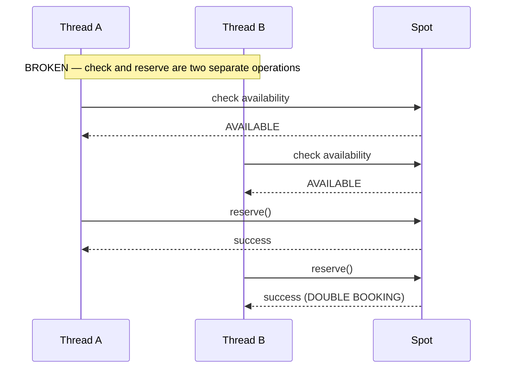
```mermaid
sequenceDiagram
    participant A as Thread A
    participant B as Thread B
    participant S as Spot

    Note over A,B: BROKEN — check and reserve are two separate operations
    A->>S: check availability
    S-->>A: AVAILABLE
    B->>S: check availability
    S-->>B: AVAILABLE
    A->>S: reserve()
    S-->>A: success
    B->>S: reserve()
    S-->>B: success (DOUBLE BOOKING)
```

Both threads read `AVAILABLE` before either one writes, so both reservations "succeed" — the classic check-then-act race.

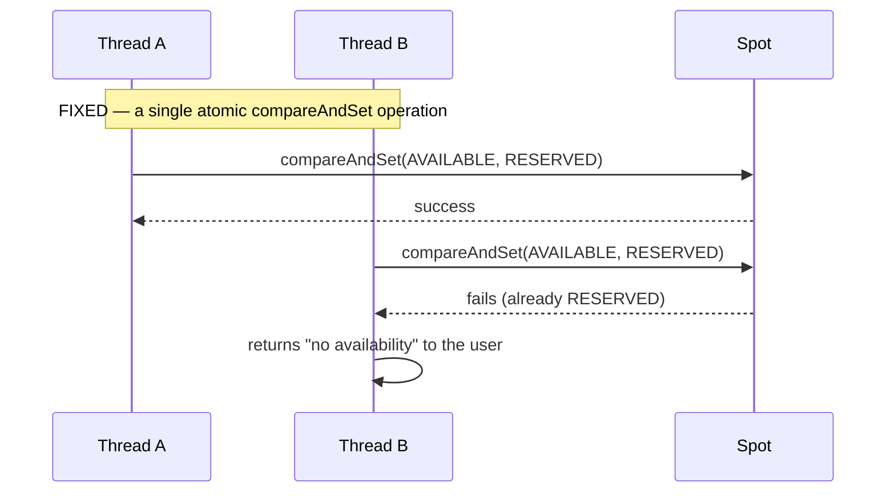
```mermaid
sequenceDiagram
    participant A as Thread A
    participant B as Thread B
    participant S as Spot

    Note over A,B: FIXED — a single atomic compareAndSet operation
    A->>S: compareAndSet(AVAILABLE, RESERVED)
    S-->>A: success
    B->>S: compareAndSet(AVAILABLE, RESERVED)
    S-->>B: fails (already RESERVED)
    B->>B: returns "no availability" to the user
```

Collapsing check-and-reserve into one `compareAndSet` call makes Thread B observe the already-updated state and fail cleanly instead of double-booking.

---

## 6. Common Interview Mistakes

**Starting to code before clarifying requirements** — you code the wrong problem. Interviewers let you code for 20 minutes and then reveal that the problem requires concurrency, which invalidates your single-threaded design. The fix: ask about scale and concurrency in the first 5 minutes.

**Designing for infinite scale when the problem says single machine** — adding distributed locking, Kafka, and microservices to a Parking Lot simulation that is explicitly a single-machine design. Over-engineering signals poor judgment more than a simple design does.

**Using inheritance when composition fits better** — `PremiumSpot extends Spot` instead of `Spot` with a `SpotType` enum + `PricingStrategy`. Inheritance breaks if you add a new dimension (spot size AND spot tier — you can't inherit from two base classes). Composition handles both dimensions independently.

**Forgetting to handle the unhappy path** — what if the card is invalid? What if the book is already checked out? What if the parking lot is full? Interviewers always probe the error cases. Show that your design has a clear error path for at least one failure mode.

**Not naming the design pattern** — interviewers want to hear the vocabulary. "I'm using the State pattern here because the elevator's behavior changes significantly depending on whether it's idle, moving up, or opening doors." Without naming it, the interviewer doesn't know if you recognized the pattern or stumbled into a similar structure accidentally.

**Putting all state logic in a giant switch statement** — this is the code smell that the State pattern exists to fix. A switch with 6 states and 5 operations is 30 branches. Adding a new state adds 5 branches. With State pattern: adding a new state means adding a new class.

---

## 7. State Machine Quick Reference

State machines appear in 5 of the 7 problems. Recognizing the states and transitions early is the key to choosing the right pattern.

**Parking Spot:**
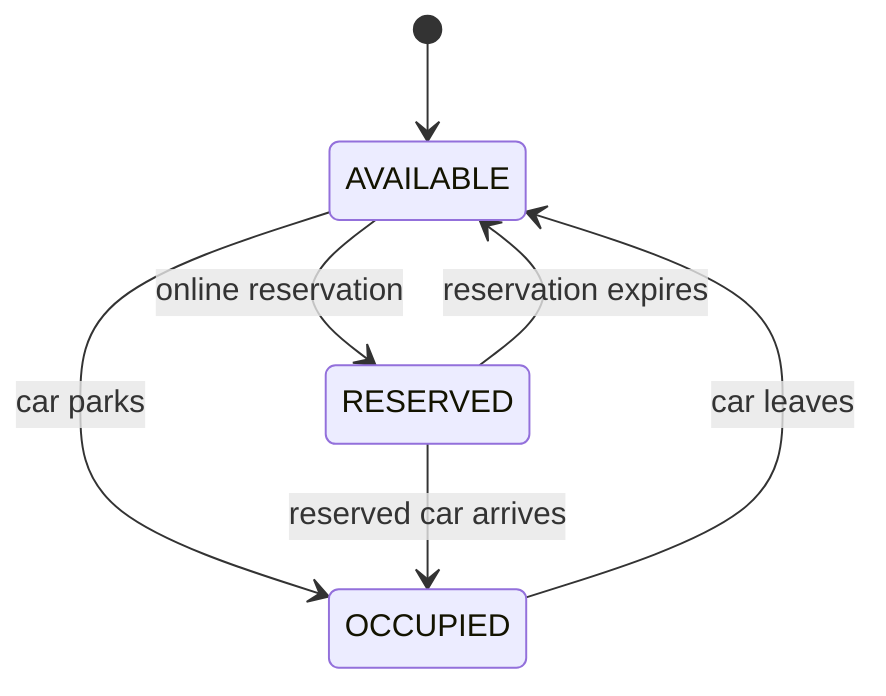
```mermaid
stateDiagram-v2
    [*] --> AVAILABLE

    AVAILABLE --> OCCUPIED : car parks
    OCCUPIED --> AVAILABLE : car leaves
    AVAILABLE --> RESERVED : online reservation
    RESERVED --> OCCUPIED : reserved car arrives
    RESERVED --> AVAILABLE : reservation expires
```

Every transition is reversible — there is no dead-end state — which is why the interview's real question is atomicity (Section 5's compareAndSet pattern), not the shape of this machine.

**Elevator:**
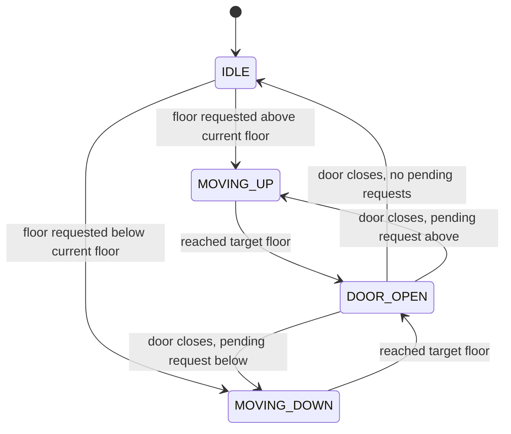
```mermaid
stateDiagram-v2
    [*] --> IDLE

    IDLE --> MOVING_UP : floor requested above current floor
    IDLE --> MOVING_DOWN : floor requested below current floor
    MOVING_UP --> DOOR_OPEN : reached target floor
    MOVING_DOWN --> DOOR_OPEN : reached target floor
    DOOR_OPEN --> IDLE : door closes, no pending requests
    DOOR_OPEN --> MOVING_UP : door closes, pending request above
    DOOR_OPEN --> MOVING_DOWN : door closes, pending request below
```

`DOOR_OPEN` is the decision point: it fans back out to `IDLE` or either direction depending on what's still queued — exactly the seam SCAN/LOOK scheduling plugs into (see the Q&A below).

**Vending Machine:**
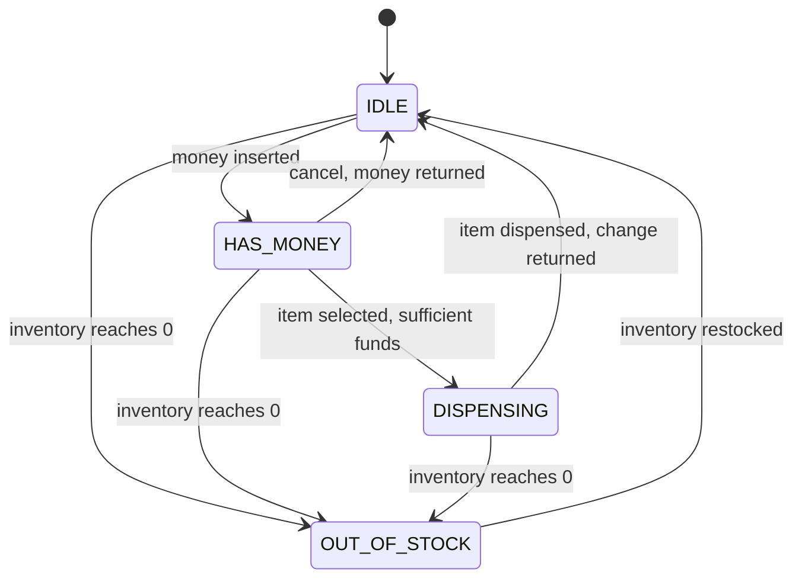
```mermaid
stateDiagram-v2
    [*] --> IDLE

    IDLE --> HAS_MONEY : money inserted
    HAS_MONEY --> DISPENSING : item selected, sufficient funds
    HAS_MONEY --> IDLE : cancel, money returned
    DISPENSING --> IDLE : item dispensed, change returned

    IDLE --> OUT_OF_STOCK : inventory reaches 0
    HAS_MONEY --> OUT_OF_STOCK : inventory reaches 0
    DISPENSING --> OUT_OF_STOCK : inventory reaches 0
    OUT_OF_STOCK --> IDLE : inventory restocked
```

The original `ANY_STATE -> OUT_OF_STOCK` shorthand is drawn here as three explicit fan-in edges — inventory can hit 0 while the machine is in any of the other three states.

**ATM:**
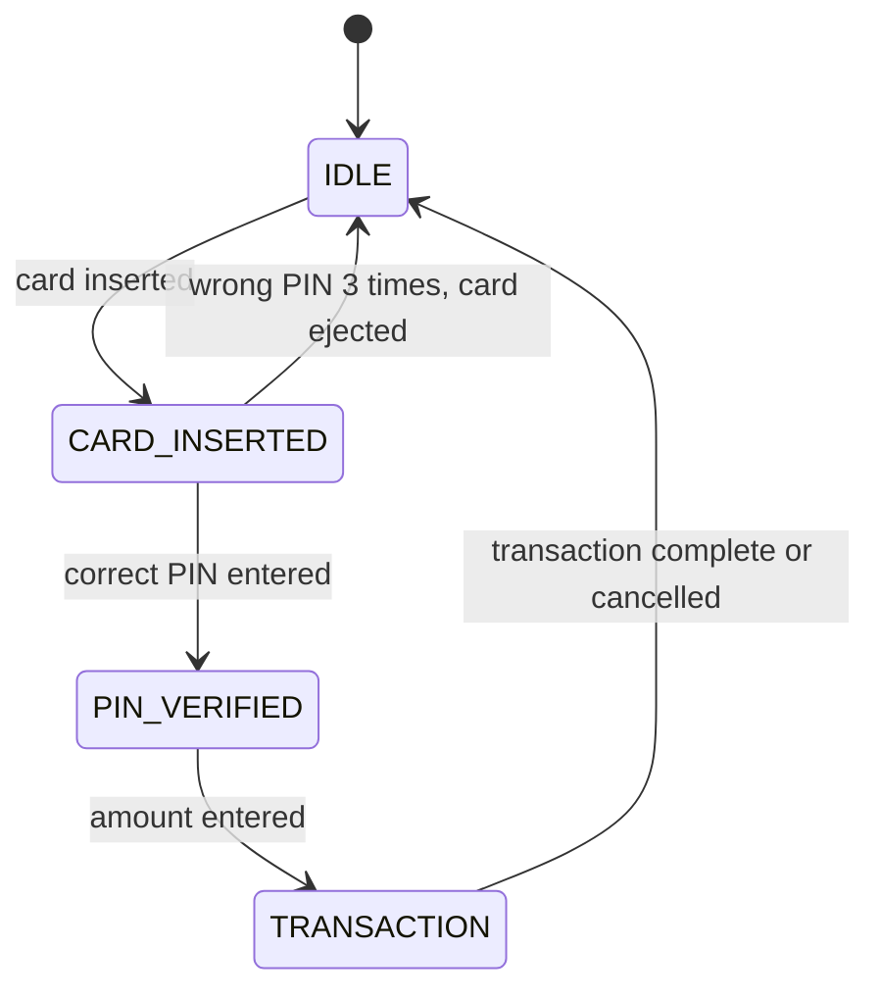
```mermaid
stateDiagram-v2
    [*] --> IDLE

    IDLE --> CARD_INSERTED : card inserted
    CARD_INSERTED --> PIN_VERIFIED : correct PIN entered
    CARD_INSERTED --> IDLE : wrong PIN 3 times, card ejected
    PIN_VERIFIED --> TRANSACTION : amount entered
    TRANSACTION --> IDLE : transaction complete or cancelled
```

`TRANSACTION` always drains back to `IDLE`, which is exactly the state the Q&A below flags as the recovery hazard if power fails before that transition completes.

**Booking System (Seat):**
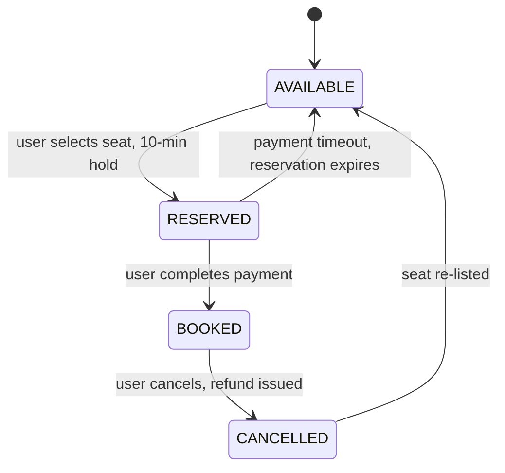
```mermaid
stateDiagram-v2
    [*] --> AVAILABLE

    AVAILABLE --> RESERVED : user selects seat, 10-min hold
    RESERVED --> BOOKED : user completes payment
    RESERVED --> AVAILABLE : payment timeout, reservation expires
    BOOKED --> CANCELLED : user cancels, refund issued
    CANCELLED --> AVAILABLE : seat re-listed
```

`RESERVED` is the only state with two exits (payment vs. timeout) — the same compareAndSet-style atomicity from Section 5 decides which one wins when two users race for it.

**Ride (Ride Sharing):**
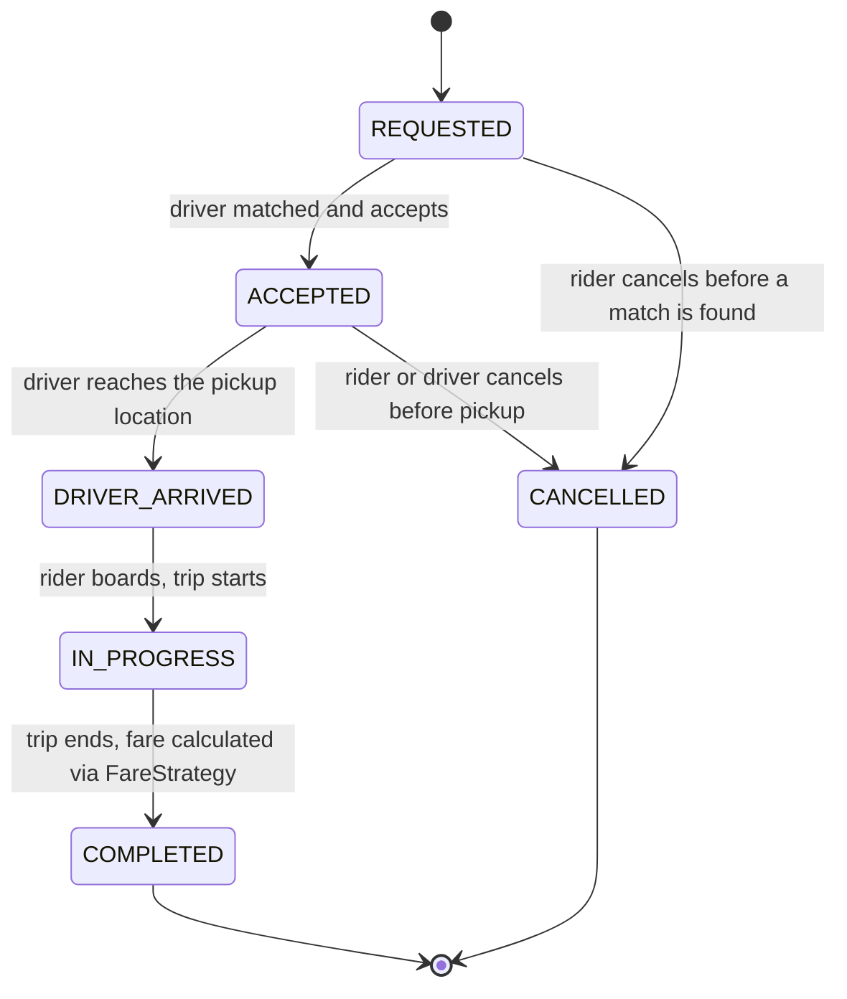
```mermaid
stateDiagram-v2
    [*] --> REQUESTED

    REQUESTED --> ACCEPTED : driver matched and accepts
    REQUESTED --> CANCELLED : rider cancels before a match is found
    ACCEPTED --> DRIVER_ARRIVED : driver reaches the pickup location
    ACCEPTED --> CANCELLED : rider or driver cancels before pickup
    DRIVER_ARRIVED --> IN_PROGRESS : rider boards, trip starts
    IN_PROGRESS --> COMPLETED : trip ends, fare calculated via FareStrategy

    COMPLETED --> [*]
    CANCELLED --> [*]
```

`COMPLETED` and `CANCELLED` are the only absorbing states — every legal path either finishes a trip or cancels one, and `Ride.requestTransition()` rejects any edge not drawn here.

**Tic-Tac-Toe (Game):**
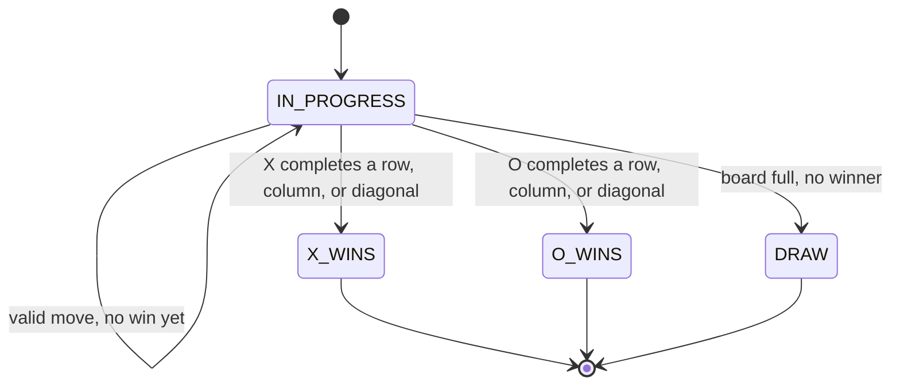
```mermaid
stateDiagram-v2
    [*] --> IN_PROGRESS

    IN_PROGRESS --> IN_PROGRESS : valid move, no win yet
    IN_PROGRESS --> X_WINS : X completes a row, column, or diagonal
    IN_PROGRESS --> O_WINS : O completes a row, column, or diagonal
    IN_PROGRESS --> DRAW : board full, no winner

    X_WINS --> [*]
    O_WINS --> [*]
    DRAW --> [*]
```

`IN_PROGRESS` is the only re-entrant state — every game is a run of self-loops that ends the instant one of the three terminal states is reached.

---

## 8. Cross-References

| Pattern | See Also |
|---------|---------|
| State (Vending Machine, ATM, Elevator, Ride Sharing, Tic-Tac-Toe) | `../behavioral/state/` |
| Command (Chess undo) | `../behavioral/command/` |
| Observer (Library overdue, Booking confirmation, Ride Sharing status, LRU Cache eviction) | `../behavioral/observer/` |
| Factory (Spot types, ticket types, vehicle types, split strategies) | `../creational/factory_method/` |
| Concurrency (Parking Lot, Elevator, Booking, Rate Limiter, LRU Cache) | `../concurrency_patterns/` |
| Strategy (pricing, search, payment, fare calculation, rate-limiting algorithms, expense splits) | `../behavioral/strategy/` |
| Decorator (LRU Cache thread-safe wrapper) | `../structural/decorator/` |

---

## 9. Key Class Relationships — ASCII Diagrams

### Parking Lot

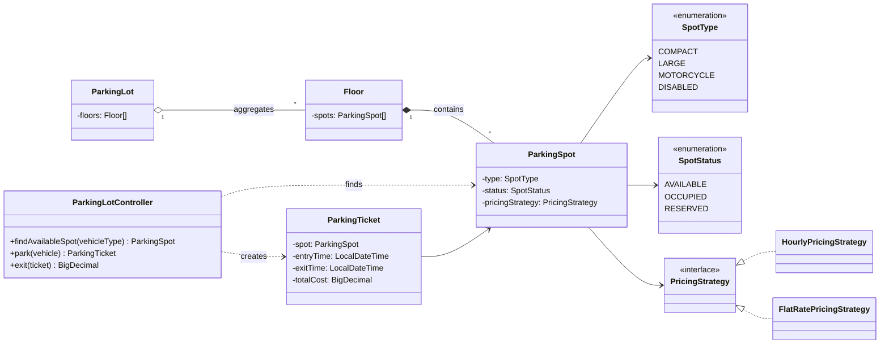
```mermaid
classDiagram
    direction LR

    class ParkingLot {
        -floors: Floor[]
    }
    class Floor {
        -spots: ParkingSpot[]
    }
    class ParkingSpot {
        -type: SpotType
        -status: SpotStatus
        -pricingStrategy: PricingStrategy
    }
    class SpotType {
        <<enumeration>>
        COMPACT
        LARGE
        MOTORCYCLE
        DISABLED
    }
    class SpotStatus {
        <<enumeration>>
        AVAILABLE
        OCCUPIED
        RESERVED
    }
    class PricingStrategy {
        <<interface>>
    }
    class HourlyPricingStrategy
    class FlatRatePricingStrategy
    class ParkingTicket {
        -spot: ParkingSpot
        -entryTime: LocalDateTime
        -exitTime: LocalDateTime
        -totalCost: BigDecimal
    }
    class ParkingLotController {
        +findAvailableSpot(vehicleType) ParkingSpot
        +park(vehicle) ParkingTicket
        +exit(ticket) BigDecimal
    }

    ParkingLot "1" o-- "*" Floor : aggregates
    Floor "1" *-- "*" ParkingSpot : contains
    ParkingSpot --> SpotType
    ParkingSpot --> SpotStatus
    ParkingSpot --> PricingStrategy
    PricingStrategy <|.. HourlyPricingStrategy
    PricingStrategy <|.. FlatRatePricingStrategy
    ParkingLotController ..> ParkingSpot : finds
    ParkingLotController ..> ParkingTicket : creates
    ParkingTicket --> ParkingSpot
```

`ParkingLotController` is the only class with behavior; everything below it — `Floor`, `ParkingSpot`, and the two `PricingStrategy` implementations — is pure structure, which is what makes adding a new `SpotType` or pricing tier an additive change instead of a rewrite (see the "add a feature" Q&A below).

### Vending Machine (State Pattern)

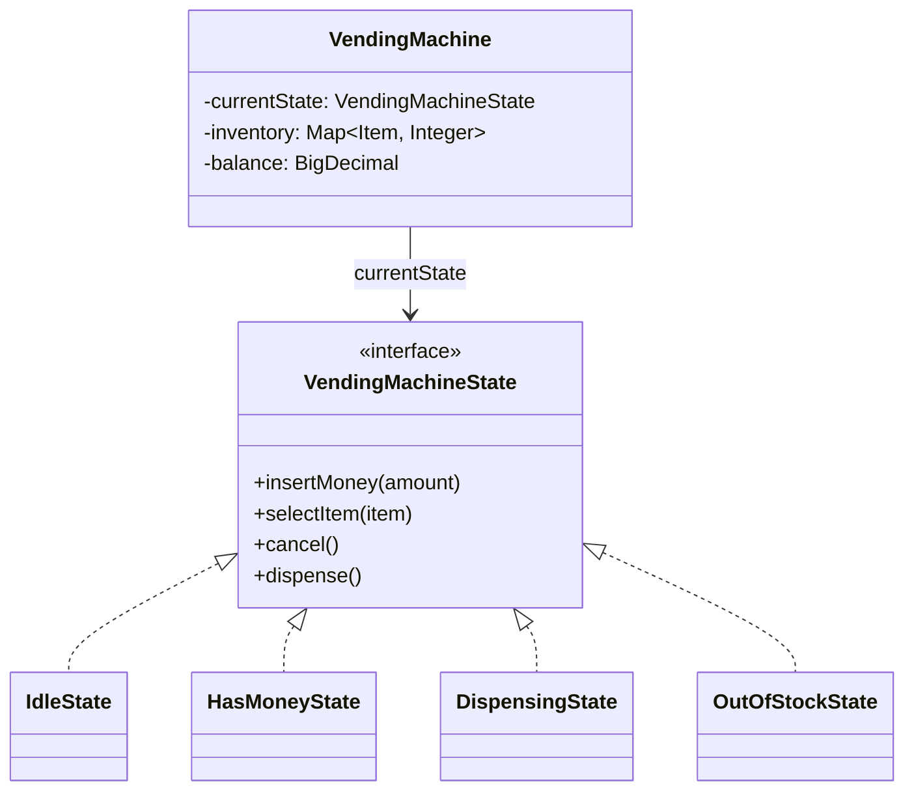
```mermaid
classDiagram
    class VendingMachine {
        -currentState: VendingMachineState
        -inventory: Map~Item, Integer~
        -balance: BigDecimal
    }
    class VendingMachineState {
        <<interface>>
        +insertMoney(amount)
        +selectItem(item)
        +cancel()
        +dispense()
    }
    class IdleState
    class HasMoneyState
    class DispensingState
    class OutOfStockState

    VendingMachine --> VendingMachineState : currentState
    VendingMachineState <|.. IdleState
    VendingMachineState <|.. HasMoneyState
    VendingMachineState <|.. DispensingState
    VendingMachineState <|.. OutOfStockState
```

`VendingMachine` never branches on state itself — it just forwards to whichever `VendingMachineState` it currently holds, so the `stateDiagram-v2` in Section 7 above IS the behavior, not a separate description of it.

### Online Booking System (Concurrency + Observer)

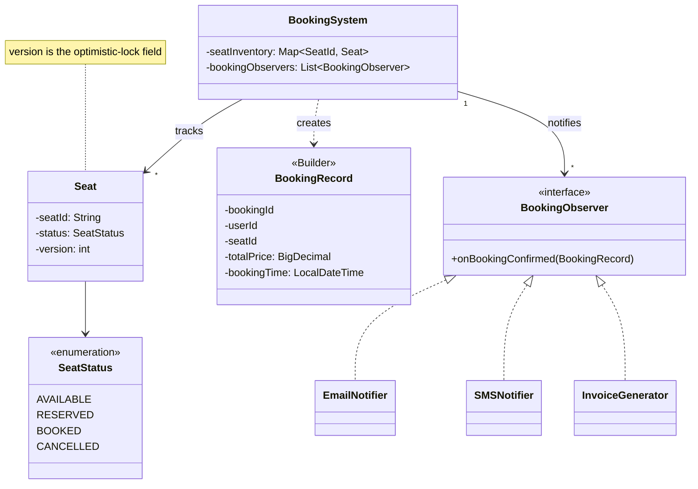
```mermaid
classDiagram
    class BookingSystem {
        -seatInventory: Map~SeatId, Seat~
        -bookingObservers: List~BookingObserver~
    }
    class Seat {
        -seatId: String
        -status: SeatStatus
        -version: int
    }
    note for Seat "version is the optimistic-lock field"
    class SeatStatus {
        <<enumeration>>
        AVAILABLE
        RESERVED
        BOOKED
        CANCELLED
    }
    class BookingRecord {
        <<Builder>>
        -bookingId
        -userId
        -seatId
        -totalPrice: BigDecimal
        -bookingTime: LocalDateTime
    }
    class BookingObserver {
        <<interface>>
        +onBookingConfirmed(BookingRecord)
    }
    class EmailNotifier
    class SMSNotifier
    class InvoiceGenerator

    BookingSystem "1" --> "*" Seat : tracks
    BookingSystem "1" --> "*" BookingObserver : notifies
    Seat --> SeatStatus
    BookingObserver <|.. EmailNotifier
    BookingObserver <|.. SMSNotifier
    BookingObserver <|.. InvoiceGenerator
    BookingSystem ..> BookingRecord : creates
```

`Seat.version` is the field that turns "two users book the same seat" from a race into a rejected second write — the same idea as the `compareAndSet` pattern in Section 5, applied at the database row level.

### Ride Sharing (State + Strategy + Observer + Factory)

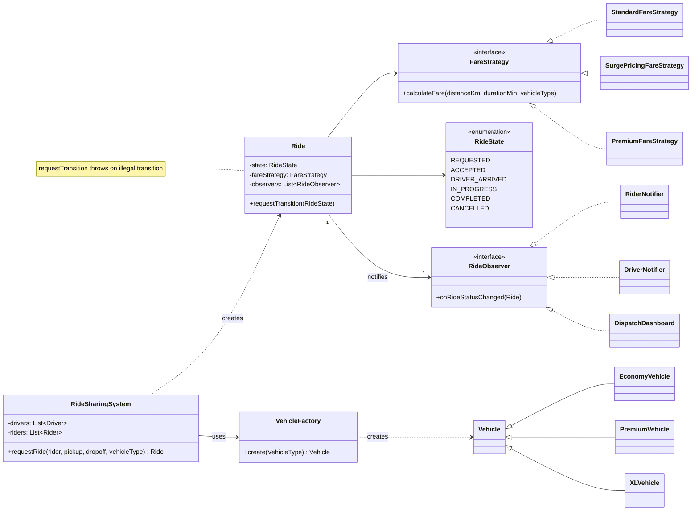
```mermaid
classDiagram
    direction LR

    class RideSharingSystem {
        -drivers: List~Driver~
        -riders: List~Rider~
        +requestRide(rider, pickup, dropoff, vehicleType) Ride
    }
    class VehicleFactory {
        +create(VehicleType) Vehicle
    }
    class Vehicle
    class EconomyVehicle
    class PremiumVehicle
    class XLVehicle
    class Ride {
        -state: RideState
        -fareStrategy: FareStrategy
        -observers: List~RideObserver~
        +requestTransition(RideState)
    }
    note for Ride "requestTransition throws on illegal transition"
    class RideState {
        <<enumeration>>
        REQUESTED
        ACCEPTED
        DRIVER_ARRIVED
        IN_PROGRESS
        COMPLETED
        CANCELLED
    }
    class FareStrategy {
        <<interface>>
        +calculateFare(distanceKm, durationMin, vehicleType)
    }
    class StandardFareStrategy
    class SurgePricingFareStrategy
    class PremiumFareStrategy
    class RideObserver {
        <<interface>>
        +onRideStatusChanged(Ride)
    }
    class RiderNotifier
    class DriverNotifier
    class DispatchDashboard

    RideSharingSystem ..> Ride : creates
    RideSharingSystem --> VehicleFactory : uses
    VehicleFactory ..> Vehicle : creates
    Vehicle <|-- EconomyVehicle
    Vehicle <|-- PremiumVehicle
    Vehicle <|-- XLVehicle
    Ride --> RideState
    Ride --> FareStrategy
    Ride "1" --> "*" RideObserver : notifies
    FareStrategy <|.. StandardFareStrategy
    FareStrategy <|.. SurgePricingFareStrategy
    FareStrategy <|.. PremiumFareStrategy
    RideObserver <|.. RiderNotifier
    RideObserver <|.. DriverNotifier
    RideObserver <|.. DispatchDashboard
```

Four patterns share one diagram: Factory (`VehicleFactory`) builds the `Vehicle`, State (`RideState`) gates what `Ride` can legally do next, Strategy (`FareStrategy`) prices the trip, and Observer (`RideObserver`) fans status out to riders, drivers, and dispatch without `Ride` knowing who's listening.

### LRU Cache (Doubly-Linked List + HashMap)

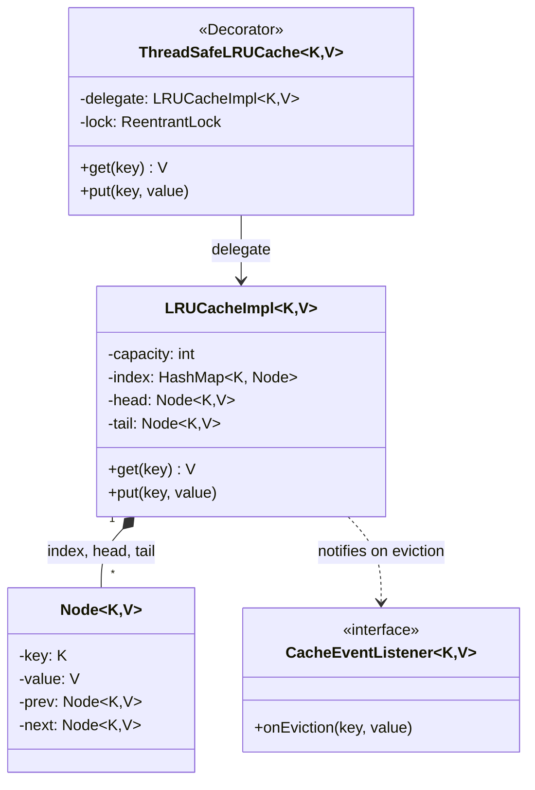
```mermaid
classDiagram
    class LRUCacheImpl~K,V~ {
        -capacity: int
        -index: HashMap~K, Node~
        -head: Node~K,V~
        -tail: Node~K,V~
        +get(key) V
        +put(key, value)
    }
    class Node~K,V~ {
        -key: K
        -value: V
        -prev: Node~K,V~
        -next: Node~K,V~
    }
    class ThreadSafeLRUCache~K,V~ {
        <<Decorator>>
        -delegate: LRUCacheImpl~K,V~
        -lock: ReentrantLock
        +get(key) V
        +put(key, value)
    }
    class CacheEventListener~K,V~ {
        <<interface>>
        +onEviction(key, value)
    }

    LRUCacheImpl~K,V~ "1" *-- "*" Node~K,V~ : index, head, tail
    LRUCacheImpl~K,V~ ..> CacheEventListener~K,V~ : notifies on eviction
    ThreadSafeLRUCache~K,V~ --> LRUCacheImpl~K,V~ : delegate
```

`index` gives O(1) key lookup while the `head`/`tail` sentinels keep MRU at the front and LRU at `tail.prev`, so `get()` moves a node to the front and a full `put()` evicts `tail.prev` before inserting at the front — `ThreadSafeLRUCache` wraps both operations behind a single `ReentrantLock` without touching either.

---

## 11. Technologies and Tools

| Tool / Framework | Use in LLD Problems |
|-----------------|-------------------|
| Java `enum` with abstract methods | State machine transitions (each enum constant overrides behavior) |
| `AtomicReference.compareAndSet()` | Spot / seat reservation race conditions on single machine |
| `ReentrantLock` | Elevator controller sequential access to request queue; `ThreadSafeLRUCache` wrapper around `LRUCacheImpl` |
| `ScheduledExecutorService` | Library overdue notifications without polling |
| `BigDecimal` | Money in ATM, Booking System, and Splitwise (split amounts, settlements) |
| Spring `@Scheduled` | Production-grade overdue book notification job |
| JPA `@Version` (optimistic locking) | Double-booking prevention in Online Booking System |
| `Deque<Command>` | Chess move history for undo/redo |
| `ConcurrentHashMap` | Per-client state in Rate Limiter (token buckets, sliding windows) |
| `PriorityQueue` (max-heap) | Splitwise debt simplification — repeatedly match largest creditor with largest debtor |
| `Deque<Long>` (timestamps) | Sliding Window Log rate limiter — evict timestamps older than the window |

---

## 12. Interview Q&As

Q&As ordered by interview frequency: gotchas and traps first, internals second, edge cases last.

---

**Q: How do you start a 30-minute LLD interview? What's your first sentence?**

Ask clarifying questions before drawing anything. "Before I start, I want to make sure I'm solving the right problem — can I ask a few questions about scope?" Then: single machine or distributed? How many concurrent users? What are the must-have use cases vs nice-to-haves? Is this interview more interested in class design, state machine, or concurrency handling? This opening shows senior-level judgment — junior candidates jump straight to coding.

---

**Q: Parking Lot: how do you handle two cars arriving simultaneously for the last spot?**

If on a single machine: use `AtomicReference<SpotStatus>` with `compareAndSet(AVAILABLE, OCCUPIED)` — only one thread wins the CAS; the other retries and finds no available spot. If distributed: use optimistic locking in the database (add a `version` column; `UPDATE spot SET status='OCCUPIED', version=version+1 WHERE id=? AND version=?` — exactly one update succeeds). The key insight: spot assignment must be atomic. Do NOT check availability and then reserve in two separate operations — this is a classic check-then-act race condition.

---

**Q: Vending Machine: why is the State pattern better than a switch statement for state transitions?**

A switch statement puts all state logic in one class, violating OCP — adding a new state requires modifying the switch. As states accumulate, the switch becomes unreadable and error-prone. State pattern: each state is a class; transitions are method calls that replace the current state object. Adding a new state means adding a new class and modifying only the states that transition to it — not the entire machine. The State pattern also makes illegal transitions explicit: an `OutOfStockState` simply doesn't implement `acceptMoney()` with success behavior.

---

**Q: Chess: how does the Command pattern enable undo of moves?**

Each move is a `Command` object: `MoveCommand(piece, fromSquare, toSquare, capturedPiece)`. `execute()` moves the piece; `undo()` moves it back and restores the captured piece. A `Deque<MoveCommand>` is the history stack. Ctrl+Z pops the stack and calls `undo()`. The benefit: the `Board` class doesn't need any undo logic — it just responds to `move()` and `restore()` calls. The history management is entirely in the `MoveCommand` and the client. Chess engines also use this for "what-if" analysis: execute a speculative move, evaluate the board, undo it.

---

**Q: ATM: what happens if power fails mid-transaction? How do you design for recovery?**

Each transaction must be idempotent: if the ATM dispenses cash and then power fails before writing the debit to the ledger, the debit should be recorded on recovery. Design: log the transaction intent to durable storage (a transaction log) BEFORE dispensing cash. On power-on, replay uncommitted transactions. This is the same write-ahead log (WAL) pattern used by databases. For the interview: mention that the ATM state machine must have a `DISPENSING` state that, on recovery, either completes the dispense or rolls back the debit — never leaves the account in an ambiguous state.

---

**Q: Online Booking System: how do you prevent double-booking of the same seat?**

Option 1 (optimistic locking): add a `version` field to the seat record; the booking transaction does `UPDATE seat SET status='BOOKED', version=version+1 WHERE id=? AND status='AVAILABLE' AND version=?`. If 0 rows updated, another transaction won the race — return a conflict error. Option 2 (pessimistic locking): `SELECT * FROM seat WHERE id=? FOR UPDATE` — acquires a row-level lock, serializing concurrent bookings. Optimistic is preferred for high read-to-write ratios; pessimistic is preferred when conflicts are frequent. For the interview: mention both and explain the tradeoff.

---

**Q: Library Management: how do you notify members about overdue books without polling the database?**

Schedule a daily job (Spring `@Scheduled`, cron, or a batch job) that queries all unreturned books past their due date and publishes overdue events. Observers (email sender, SMS sender, in-app notification) consume the events. Decoupling: adding a new notification channel (push notification) means adding a new Observer — no change to the scheduler or query logic. Alternative: event-driven — on each book checkout, schedule a future event (`ScheduledExecutorService.schedule()` or a job queue) that fires on the due date. The event-driven approach doesn't require daily polling.

---

**Q: Elevator System: what scheduling algorithm should you use?**

SCAN (also called the "elevator algorithm"): the elevator moves in one direction, stopping at all requested floors, then reverses. LOOK variant: reverse when no more requests in the current direction (don't go to the top floor if the last request is floor 7). FCFS (First Come First Served) is simple but causes large variance in wait time. For the interview: mention SCAN as the baseline, note that modern elevators use destination dispatch (you enter your destination floor before entering the elevator, grouping passengers going to the same floor). The State pattern models the elevator's direction (MOVING_UP, MOVING_DOWN, IDLE) and door state (DOOR_OPEN, DOOR_CLOSED).

---

**Q: How do you represent money in ATM or Booking System? Why not float?**

Use `BigDecimal` for exact decimal arithmetic, or represent money as the smallest currency unit in a `long` (e.g., cents for USD). `float` and `double` are binary floating-point and cannot represent 0.1 exactly (`0.1 + 0.2 != 0.3` in IEEE 754). For monetary calculations, rounding errors compound: a 0.0001 error per transaction multiplied by 10 million transactions equals thousands of dollars in discrepancy. `BigDecimal(String)` (not `BigDecimal(double)`) is precise; `RoundingMode.HALF_EVEN` (banker's rounding) minimizes systematic bias. The Money pattern (Fowler) wraps `BigDecimal` with a `Currency` to prevent mixing USD and EUR accidentally.

---

**Q: When asked to "add a feature" mid-interview, how do you handle it gracefully?**

Show that the design is open for extension without modification (OCP). Example: "add a premium parking spot tier." If the design uses a `SpotType` enum + Strategy for pricing, adding premium means: add `PREMIUM` to the enum, add a `PremiumPricingStrategy` class — nothing else changes. If the design used `if (type == COMPACT) price = 2` hard-coded, adding premium requires touching that method. Use the "add a feature" moment to demonstrate OCP compliance, not to improvise. The best answer: "I anticipated extensibility here — let me show you how this works."

---

**Q: How do you handle the Library Management "search" feature in the class design?**

Use the Strategy pattern for search: `SearchStrategy` interface with implementations like `TitleSearch`, `AuthorSearch`, `ISBNSearch`, `GenreSearch`. The `Library.search(String query, SearchStrategy strategy)` method delegates to the strategy. Adding a new search type (publication year, keywords) means adding a new strategy class — no change to `Library`. Alternative for simple cases: one `Catalog` class with multiple overloaded `findBy*()` methods. The Strategy approach is justified when search algorithms differ significantly in implementation (linear scan vs inverted index vs external search engine).

---

**Q: Ride Sharing: how do you design driver-matching, and why is the naive approach a problem at scale?**

The naive approach scans every available driver and computes Euclidean distance to the rider's pickup location, picking the nearest one — O(N) per request. This is fine for a 30-minute interview demo with a handful of drivers, but at city scale (tens of thousands of drivers) it's too slow. The production fix is geo-indexing: bucket drivers into geohash cells or an S2/quadtree grid, then only scan drivers in the rider's cell and its neighbors. For the interview: implement the O(N) scan, but explicitly call out the geo-indexing upgrade path — see [design_uber](../../hld/case_studies/design_uber.md) and [design_proximity_service](../../hld/case_studies/design_proximity_service.md) for the HLD-scale answer. Also discuss the `RideState` machine — every transition (`REQUESTED -> ACCEPTED -> DRIVER_ARRIVED -> IN_PROGRESS -> COMPLETED`) should be validated server-side to reject out-of-order client messages.

---

**Q: LRU Cache: why do you need a doubly-linked list AND a HashMap — why not just one?**

A HashMap alone gives O(1) key lookup but no ordering — you can't efficiently find "the least recently used entry" without an O(n) scan. A linked list alone gives ordering (move-to-front on access, evict from the tail) but O(n) lookup by key. Combining them gives O(1) for both: the HashMap maps `key -> Node`, and the node is already wired into the doubly-linked list, so `get()` does a HashMap lookup then an O(1) pointer-relinking to move the node to the front. A *singly*-linked list doesn't work either — removing a node from the middle requires its `prev` pointer to relink `prev.next`, which a singly-linked list doesn't have without an O(n) walk. This is the detail that separates a working O(1) LRU from an accidentally-O(n) one.

---

**Q: Rate Limiter: which of the four algorithms would you pick for a public API, and why?**

Token Bucket is the most common production choice because it allows controlled bursts (a client that's been idle can "save up" tokens) while still enforcing a steady-state average rate, and it's O(1) memory per client (just `tokens` and `lastRefillTimestamp`). Fixed Window Counter is simplest but allows up to 2x the limit at window boundaries (a burst at 11:59:59 and another at 12:00:00 both succeed). Sliding Window Log is the most accurate but costs O(N) memory per client where N = requests per window — at 1000 req/min that's 1000 timestamps per client, which doesn't scale to millions of clients. Sliding Window Counter (the Cloudflare/Kong approach — weighted average of current and previous fixed windows) is the pragmatic middle ground: O(1) memory, smooths boundary bursts, slightly approximate. For the interview: name all four, then justify Token Bucket or Sliding Window Counter as the default, falling back to Sliding Window Log only if exact accuracy is a hard requirement.

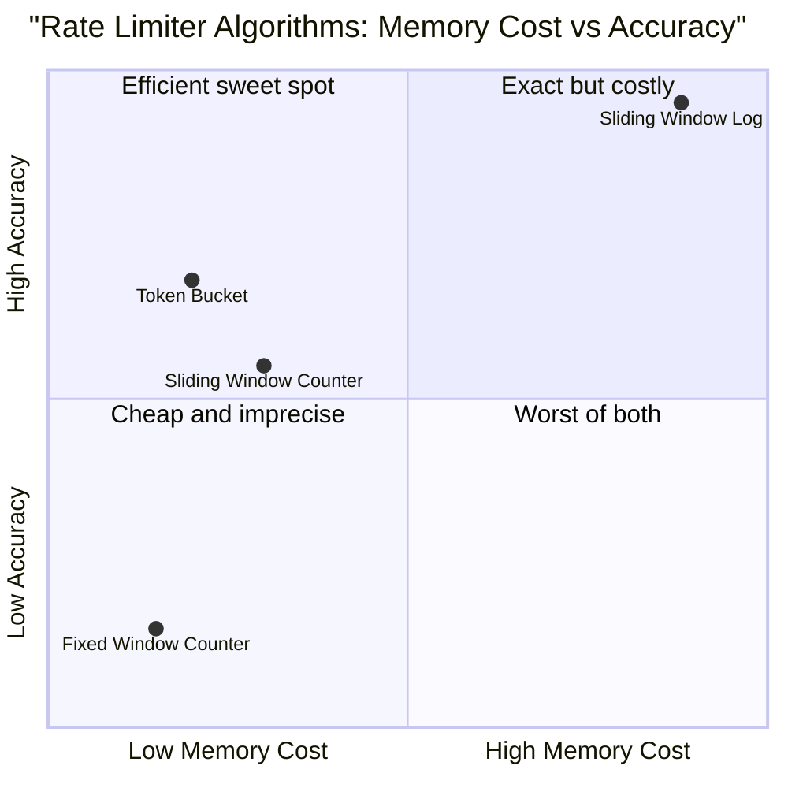
```mermaid
quadrantChart
    title "Rate Limiter Algorithms: Memory Cost vs Accuracy"
    x-axis Low Memory Cost --> High Memory Cost
    y-axis Low Accuracy --> High Accuracy
    quadrant-1 Exact but costly
    quadrant-2 Efficient sweet spot
    quadrant-3 Cheap and imprecise
    quadrant-4 Worst of both
    "Fixed Window Counter": [0.15, 0.15]
    "Token Bucket": [0.2, 0.68]
    "Sliding Window Counter": [0.3, 0.55]
    "Sliding Window Log": [0.88, 0.95]
```

Plotting the four algorithms this way makes the empty bottom-right quadrant the point: nobody ships an algorithm that is both expensive and imprecise, so the real decision is between the O(1) cluster (Token Bucket, Sliding Window Counter) and paying O(N) memory for Sliding Window Log's exactness.

---

**Q: Tic-Tac-Toe: how do you make win-checking work for an NxN board without it becoming the bottleneck?**

The naive approach rescans the entire board after every move — O(N^2) per move, so O(N^2) work just to check 4 lines through the last-placed cell. The fix is incremental counters: maintain `rowCounts[N]`, `colCounts[N]`, and two diagonal counters, each storing a running sum where X contributes +1 and O contributes -1 (or separate counters per symbol). Placing a move updates at most 4 counters in O(1), and a win is detected the instant `|counter| == N`. At N=1000, that's the difference between 1,000,000 cell reads per move and 4 integer increments. This incremental-counter technique generalizes to any "check all lines through a point" problem — it's the same idea as maintaining row/column sums for a live spreadsheet.

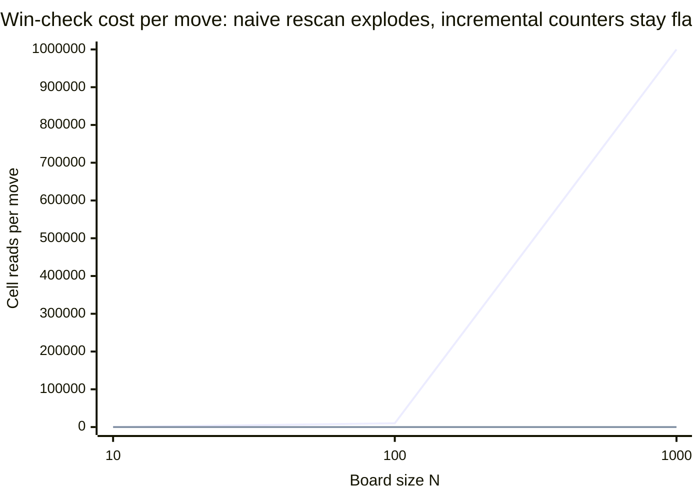
```mermaid
xychart-beta
    title "Win-check cost per move: naive rescan explodes, incremental counters stay flat"
    x-axis "Board size N" [10, 100, 1000]
    y-axis "Cell reads per move" 0 --> 1000000
    line [100, 10000, 1000000]
    line [4, 4, 4]
```

The naive line is literally `N^2`; the incremental-counter line is a flat 4 regardless of `N` — the gap at `N=1000` is the exact 1,000,000-vs-4 comparison from the text above.

---

**Q: Splitwise: what does "debt simplification" mean, and is it guaranteed to find the minimum number of transactions?**

Debt simplification takes a tangle of pairwise debts within a group (Alice owes Bob $10, Bob owes Carol $10) and reduces it to the minimum set of direct payments that settle everyone's net balance (Alice pays Carol $10 directly — Bob is removed from the chain entirely). The standard interview-feasible algorithm computes each user's net balance, then greedily matches the largest creditor with the largest debtor using two max-heaps, repeating until all balances are zero — this runs in O(N log N) and produces at most N-1 transactions for N participants. It is NOT guaranteed to find the absolute theoretical minimum in every case (that variant is NP-hard, related to subset-sum partitioning), but the greedy max-heap approach is the answer interviewers expect and performs well in practice. Mention `BigDecimal` throughout — splitting `$100.00` three ways produces `$33.33 + $33.33 + $33.34` (the extra cent goes to the first payer), never `double` arithmetic.

---
