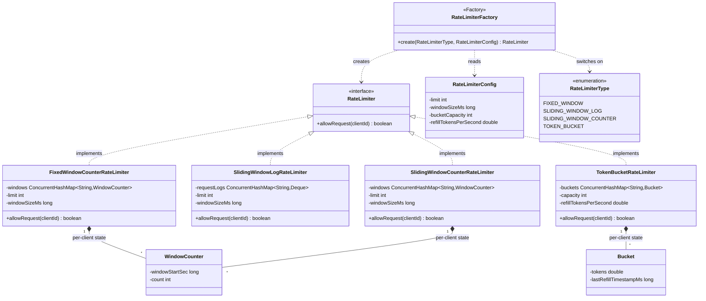
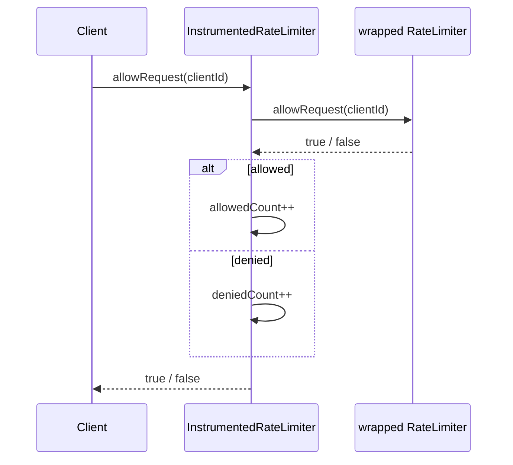
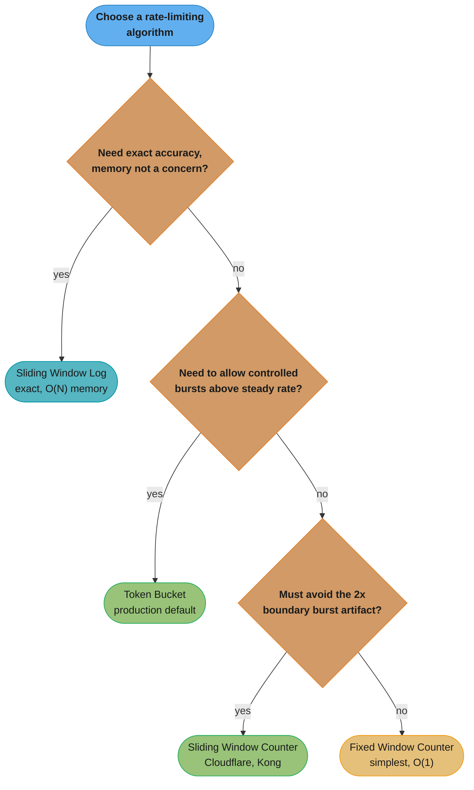
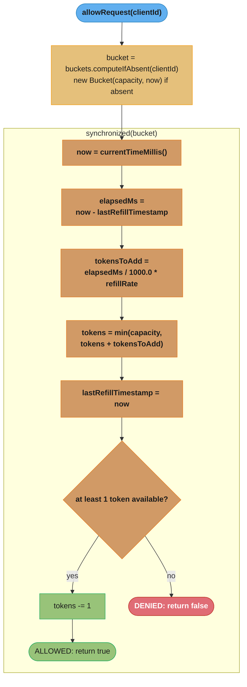

# Rate Limiter — Low-Level Design

## Intuition

> **Design intuition**: A rate limiter is a single decision: given a client identifier and the current time, return `true` (allow) or `false` (deny). The entire interview is about *how that decision is made and stored* — four classic algorithms (Fixed Window Counter, Sliding Window Log, Sliding Window Counter, Token Bucket / Leaky Bucket) answer the question differently, trading off accuracy, memory, and burst tolerance.

**Key insight**: Fixed Window Counter is the simplest but allows a **2x burst at window boundaries** (a client can send the full limit at 0:59 and again at 1:00, doubling the effective rate for a brief instant). Sliding Window Log is exact — it never over- or under-counts — but costs **O(N) memory per client** where N is the limit (e.g., 1000 timestamps per client for a 1000 req/min limit). Sliding Window Counter approximates the sliding window using two fixed-window counters and a weighted overlap, getting close to exact accuracy at O(1) memory. Token Bucket (and its cousin Leaky Bucket) decouples "rate" from "burst capacity" entirely — a bucket holds tokens that refill continuously, so clients can spend a saved-up burst instantly but are throttled to the refill rate over time. **The interview is really about articulating these tradeoffs out loud** — coding any single one of them correctly is necessary but not sufficient; explaining *why* you'd pick one over another for a given API is what separates a pass from a strong pass.

---

## Problem Statement

Design an in-process rate limiter that, given a `clientId` (e.g., an API key or user ID), decides whether to allow or reject the current request:

```java
boolean allowRequest(String clientId);
```

Requirements given in the prompt are typically:
- "Limit each user to 100 requests per minute."
- "Support different algorithms — interviewer may ask you to swap one in mid-interview."
- "Make it thread-safe — multiple requests from the same client can arrive concurrently."

**This is the LLD / single-JVM angle**: one process, in-memory state, a clean object-oriented interface with pluggable algorithms — exactly the kind of class you'd write in 30-45 minutes on a whiteboard or in a coding editor. For the **distributed-systems angle** — coordinating rate limits across many service instances using Redis, Lua scripts for atomicity, and the operational tradeoffs of centralized vs. local counters — see [`../../hld/rate_limiting/README.md`](../../hld/rate_limiting/README.md). The algorithms are conceptually the same; what changes is *where the state lives* (a `ConcurrentHashMap` here vs. a Redis key there) and *how atomicity is guaranteed* (a `synchronized` block here vs. a Lua script there).

---

## Requirements

### Functional
1. `allowRequest(clientId)` returns `true` if the request is within the configured limit, `false` otherwise
2. Each client is tracked independently — client A being throttled does not affect client B
3. The rate limit is configurable: a maximum request count and a time window (e.g., 5 requests / 10 seconds, or 100 requests / minute)
4. The algorithm is pluggable — the same caller code works regardless of which algorithm is selected at construction time
5. (Token Bucket variant) Support a configurable bucket capacity and refill rate, allowing controlled bursts above the steady-state rate

### Non-Functional
1. Thread-safe under concurrent calls from many clients and many threads per client
2. Bounded memory per client — O(1) for Fixed Window, Sliding Window Counter, and Token Bucket; O(limit) for Sliding Window Log (explicitly called out as a tradeoff, not a flaw)
3. Low latency per check — no I/O, no locks held longer than necessary; each `allowRequest()` call should be on the order of microseconds
4. New clients are created lazily on first request (no pre-registration step)

---

## ASCII Class Diagram



Strategy (`RateLimiter` realized by all four algorithms), Factory (`RateLimiterFactory` turns a `RateLimiterType` + `RateLimiterConfig` into the right concrete class), and the per-client state records (`WindowCounter` shared by the two window-based algorithms, `Bucket` for Token Bucket) that keep each implementation's memory footprint at O(1) — `SlidingWindowLogRateLimiter` is the odd one out, storing a `Deque<Long>` of raw timestamps per client instead, which is exactly the O(N) memory tradeoff called out below.

---

## Patterns Used

### 1. Strategy — `RateLimiter` interface
**Why**: The choice of algorithm (Fixed Window vs. Sliding Window Log vs. Sliding Window Counter vs. Token Bucket) is an implementation detail that should be swappable without touching the calling code — exactly the scenario Strategy is designed for. An interviewer commonly asks "now swap in a different algorithm" mid-interview; if `allowRequest(clientId)` is the only contract, the swap is a one-line change at construction time.

**How**: All four algorithms implement `boolean allowRequest(String clientId)`. A caller holds a `RateLimiter` reference and never needs to know (or care) which concrete class backs it. Each implementation owns its own per-client state map and its own locking/synchronization strategy appropriate to its data structure.

---

### 2. Factory — `RateLimiterFactory`
**Why**: Centralizes the mapping from a `RateLimiterType` enum + `RateLimiterConfig` to the correct concrete class, so callers never instantiate `new TokenBucketRateLimiter(...)` directly. This keeps construction logic in one place and makes it trivial to add a fifth algorithm later without touching call sites.

**How**: `RateLimiterFactory.create(RateLimiterType type, RateLimiterConfig config)` switches on the enum and returns the matching `RateLimiter` implementation, passing through only the config fields that algorithm needs (e.g., Token Bucket ignores `windowSizeMs` and reads `bucketCapacity` / `refillTokensPerSecond` instead).

---

### 3. Decorator (optional extension) — `InstrumentedRateLimiter`
**Why**: Production rate limiters need observability — how often is each client being throttled? Wrapping any `RateLimiter` with a counting decorator adds metrics without modifying any of the four algorithm implementations or the `RateLimiter` contract.

**How**: `InstrumentedRateLimiter implements RateLimiter`, holds a delegate `RateLimiter`, and on each `allowRequest()` call increments an `allowedCount` or `deniedCount` (per-client or global) before/after delegating. This is a natural fit because it composes with the Strategy pattern above — any of the four algorithms can be wrapped identically. Not exercised in the demo `main()` below, but mentioned because it is a common interview follow-up ("how would you add metrics?").

The "before/after" question above resolves to *after*: the decorator waits for the delegate's answer, then increments whichever counter matches the outcome, so metrics never drift from what was actually decided.



`Inner` can be any of the four `RateLimiter` implementations interchangeably — the decorator only depends on the interface, so instrumentation composes with Strategy for free.

---

## Design Decisions & Tradeoffs

| Algorithm | Memory per client | Accuracy at window boundaries | Burst handling | Implementation complexity |
|-----------|-------------------|-------------------------------|-----------------|----------------------------|
| **Fixed Window Counter** | O(1) — one counter + one timestamp | Poor — allows up to **2x the limit** in a short window straddling two windows (e.g., limit=5, a client can send 5 requests at 0:59.9 and 5 more at 1:00.1 = 10 in 0.2s) | None beyond the 2x boundary artifact | Lowest — one map, one comparison, one reset |
| **Sliding Window Log** | O(N) where N = limit (e.g., 1000 timestamps stored per client for a 1000 req/min limit — roughly 8KB/client at 8 bytes/timestamp) | Exact — never over- or under-counts, by definition | None — strictly enforces the limit over any rolling window | Medium — deque eviction on every call, O(N) worst case per check |
| **Sliding Window Counter** | O(1) — two counters (current + previous window) | Good approximation — error bounded by the assumption that requests are evenly distributed within each window; used by Cloudflare and Kong in production | Smooths the 2x boundary artifact down to a small, bounded overshoot | Medium — requires weighted-overlap arithmetic each call |
| **Token Bucket** | O(1) — two fields per client (`tokens`, `lastRefillTimestamp`) | N/A (not window-based) — enforces an average rate, not a per-window count | **Best** — explicitly designed to allow a controlled burst up to `bucketCapacity`, then throttle to `refillRate` | Medium — lazy refill calculation (elapsed time × rate) on every call |

**Why Token Bucket is the most commonly chosen default in production**: O(1) memory, allows legitimate bursty traffic (a user who was idle for 10 seconds and then clicks 5 things rapidly shouldn't be punished), and the two tunables (`capacity`, `refillRate`) map intuitively onto SLA language ("burst up to 10, sustained 1/sec").

**Why Sliding Window Log is still worth knowing**: it is the *reference implementation* for correctness — if an interviewer asks "what's the exact rate-limiting algorithm, with no approximation error?", this is the answer, with the explicit caveat that its O(N) memory makes it impractical for high limits (a 10,000 req/min limit = 10,000 timestamps per client = ~80KB/client, which multiplied across millions of clients becomes a real memory concern).

Turning the tradeoffs above into a concrete decision procedure for the interview:



Default to Token Bucket unless a constraint rules it out: exactness pushes you to Sliding Window Log despite its O(N) cost, and tolerating the 2x boundary artifact is the only thing that gets you back down to Fixed Window Counter's simplicity.

---

## State / Flow

`allowRequest()` for **Token Bucket** — the most stateful of the four, since it must compute elapsed time and refill tokens on every call:



The key subtlety: refill is **lazy** — there is no background thread ticking a timer. Tokens are only computed "as of now" when a request actually arrives, which is why `lastRefillTimestamp` must be updated on every call (even denied ones) to avoid double-counting elapsed time on the next call.

---

## Sample Output

```
========================================
   Rate Limiter — LLD Demo
========================================

--- Fixed Window Counter (limit=5, window=10s) ---
Request 1 from client-A -> ALLOWED (count=1/5)
Request 2 from client-A -> ALLOWED (count=2/5)
Request 3 from client-A -> ALLOWED (count=3/5)
Request 4 from client-A -> ALLOWED (count=4/5)
Request 5 from client-A -> ALLOWED (count=5/5)
Request 6 from client-A -> DENIED  (count=5/5)
Request 7 from client-A -> DENIED  (count=5/5)

--- Sliding Window Log (limit=5, window=10s) ---
Request 1 from client-B -> ALLOWED (log size=1/5)
Request 2 from client-B -> ALLOWED (log size=2/5)
Request 3 from client-B -> ALLOWED (log size=3/5)
Request 4 from client-B -> ALLOWED (log size=4/5)
Request 5 from client-B -> ALLOWED (log size=5/5)
Request 6 from client-B -> DENIED  (log size=5/5)
Request 7 from client-B -> DENIED  (log size=5/5)

--- Sliding Window Counter (limit=5, window=10s) ---
Request 1 from client-C -> ALLOWED (weighted count=1.00/5)
Request 2 from client-C -> ALLOWED (weighted count=2.00/5)
Request 3 from client-C -> ALLOWED (weighted count=3.00/5)
Request 4 from client-C -> ALLOWED (weighted count=4.00/5)
Request 5 from client-C -> ALLOWED (weighted count=5.00/5)
Request 6 from client-C -> DENIED  (weighted count=5.00/5)
Request 7 from client-C -> DENIED  (weighted count=5.00/5)

--- Token Bucket (capacity=5, refill=1 token/sec) ---
Request 1 from client-D -> ALLOWED (tokens left=4.00)
Request 2 from client-D -> ALLOWED (tokens left=3.00)
Request 3 from client-D -> ALLOWED (tokens left=2.00)
Request 4 from client-D -> ALLOWED (tokens left=1.00)
Request 5 from client-D -> ALLOWED (tokens left=0.00)
Request 6 from client-D -> DENIED  (tokens left=0.00)
  ... waiting 2000ms for refill ...
Request 7 from client-D -> ALLOWED (tokens left=1.00 after refill)
Request 8 from client-D -> ALLOWED (tokens left=0.00)

========================================
              Demo complete
========================================
```

Note: exact decimal values for Token Bucket vary slightly between runs because refill is computed from wall-clock elapsed time (`Thread.sleep` is not perfectly precise) — the values above are representative, not byte-exact.

---

## Cross-Perspective: HLD Connections

- **Single-JVM vs. distributed coordination** — the `TokenBucketRateLimiter` here keeps a `ConcurrentHashMap<String, Bucket>` in one process's heap; once you have multiple service instances behind a load balancer, each instance has its *own* map, and a client could get `N x instanceCount` requests through. [`../../hld/rate_limiting/README.md`](../../hld/rate_limiting/README.md) covers the fix: move the bucket state into Redis and make the refill-and-decrement sequence atomic with a Lua script (`EVAL`), so all instances share one logical bucket.

- **API gateway enforcement** — in practice, rate limiting is rarely hand-rolled inside business logic; it sits in a gateway or middleware layer in front of many services. See [`../../backend/rate_limiting_in_depth/README.md`](../../backend/rate_limiting_in_depth/README.md) for how the same four algorithms are deployed at the gateway tier, including header conventions (`X-RateLimit-Remaining`, `Retry-After`) and per-route configuration.

- **Per-tenant quota enforcement in SaaS systems** — the `clientId` in this LLD maps directly to a `tenantId` in a multi-tenant SaaS product. The same `RateLimiterFactory` pattern extends naturally to per-tenant *and* per-plan limits (e.g., free tier = Fixed Window 100/day, enterprise tier = Token Bucket capacity 10,000 / refill 50 per second) — see Follow-Up Extension 3 below.

- **Embedding in a web framework** — `TokenBucketRateLimiter` (or any `RateLimiter` implementation here) is a plain Java class with no framework dependencies, which means it can be wrapped directly inside a Spring `HandlerInterceptor.preHandle()` — call `allowRequest(apiKey)`, and if `false`, set HTTP 429 and short-circuit the chain. See [`../../spring/filters_and_interceptors/`](../../spring/filters_and_interceptors/) for how interceptors fit into the Spring MVC request pipeline.

---

## Follow-Up Extensions

1. **Distributed rate limiting** — replace the `ConcurrentHashMap` per-client state with Redis keys (`INCR` + `EXPIRE` for Fixed Window, sorted sets for Sliding Window Log, a Lua script for Token Bucket's refill-and-decrement atomicity). See [`../../hld/rate_limiting/README.md`](../../hld/rate_limiting/README.md) for the full distributed design, including handling Redis as a single point of failure.

2. **Composite limits (per-endpoint + per-client)** — a real API needs `allowRequest(clientId, endpoint)`, where `/search` might allow 10 req/sec but `/export` allows 1 req/min. Implement by keying the per-client map on a composite key (`clientId + ":" + endpoint`) or by composing two `RateLimiter`s and requiring both to allow.

3. **Tiered limits (free / pro / enterprise)** — store a `tier` per client and look up `RateLimiterConfig` dynamically based on tier (e.g., free = 100/min via Fixed Window, pro = 1,000/min via Sliding Window Counter, enterprise = Token Bucket capacity 10,000 / refill 50/sec). The `RateLimiterFactory` already supports constructing different configs; the extension is a `Map<Tier, RateLimiterConfig>` lookup before calling it.

4. **Graceful degradation with `Retry-After`** — instead of a bare `boolean`, return a result object `{allowed: boolean, retryAfterMs: long}`. For Fixed Window, `retryAfterMs` = time until the window resets; for Token Bucket, `retryAfterMs` = time until `tokens >= 1` given the refill rate. The HTTP layer surfaces this as a `Retry-After` header on a 429 response.

5. **Leaky Bucket as a queueing variant** — Token Bucket rejects immediately when empty; Leaky Bucket instead enqueues the request and processes it at a fixed output rate (like a FIFO queue with a constant drain rate), smoothing bursts into a steady stream rather than dropping them. Useful when the downstream system can tolerate queued work but not a burst (e.g., writing to a slow database) — implement with a bounded `BlockingQueue` plus a single consumer thread draining at the configured rate.
