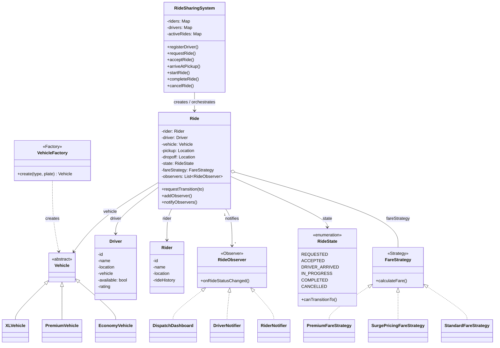
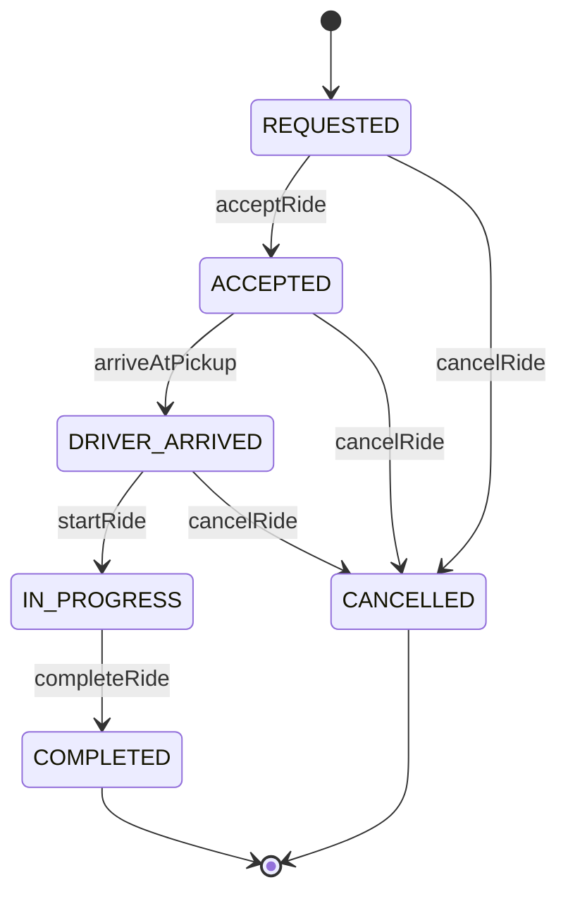
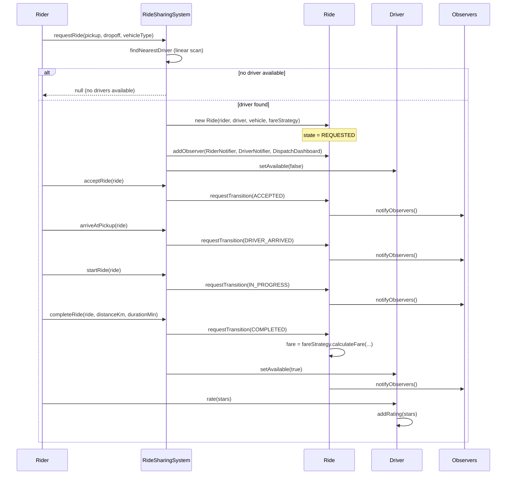

# Ride Sharing — Low-Level Design

## Intuition

> **Design intuition**: Ride Sharing looks like "another entity-modeling exercise" (Rider, Driver, Vehicle, Ride) but the interview signal is really about two things — **driver matching** (who serves this request, and how do you decide quickly) and the **ride lifecycle state machine** (a ride moves through a strict sequence of states, and the system must reject illegal jumps like going straight from REQUESTED to COMPLETED). Get those two right and the rest is bookkeeping.

**Key insight**: Resist the urge to hardcode fare math or notification logic inside `Ride` or `RideSharingSystem`. Fare calculation varies by vehicle tier and demand (Strategy), every status change has multiple independent listeners — the rider's app, the driver's app, an ops dashboard (Observer) — and vehicle creation should not leak `new EconomyVehicle(...)` calls throughout the codebase (Factory). The matching algorithm itself (nearest available driver via a linear scan) is intentionally simple for an interview — call out that production systems replace the scan with a geospatial index (quadtree / geohash / H3), but the class structure around it should not need to change.

---

## Problem Statement

Design a ride-sharing system (Uber/Lyft-style) that supports:
- Riders requesting a ride from a pickup location to a drop-off location
- Matching the request to the **nearest available driver**
- Multiple vehicle tiers — **Economy**, **Premium**, **XL** — each with different capacity and per-km rates
- Tracking a ride through its full lifecycle: requested, accepted, driver arrived, in progress, completed, or cancelled
- Calculating fare based on distance, duration, vehicle tier, and surge conditions
- Notifying the rider, the driver, and a dispatch dashboard whenever a ride's status changes
- Allowing riders to rate drivers (and vice versa) once a ride completes

---

## Requirements

### Functional
1. Register riders and drivers (with a current location and, for drivers, a vehicle)
2. `requestRide(rider, pickup, dropoff, vehicleType)` — find the nearest available driver of the requested tier and create a `Ride`
3. Walk a ride through its lifecycle: `acceptRide → arriveAtPickup → startRide → completeRide`
4. Support `cancelRide` from any non-terminal state
5. Calculate fare using a pluggable strategy (standard, surge, premium)
6. Notify all interested parties (rider, driver, dispatch dashboard) on every state transition
7. Record a rating for the driver once the ride completes

### Non-Functional
1. Enforce the ride state machine — reject invalid transitions (e.g., `COMPLETED → ACCEPTED`) with a clear error
2. Fare strategies must be swappable per-ride without modifying `Ride` or `RideSharingSystem`
3. New vehicle tiers should be addable without touching matching or fare logic (beyond registering a factory mapping)
4. Driver matching must be easy to swap for a geo-indexed implementation later (interface-level separation)

---

## ASCII Class Diagram

`RideSharingSystem` orchestrates `Ride` creation via `VehicleFactory`; each `Ride` aggregates one `FareStrategy` (Strategy), fans state changes out to every `RideObserver` (Observer), and guards its lifecycle through the `RideState` enum (State).



---

## Patterns Used

### 1. Strategy — `FareStrategy`
**Why**: Fare calculation depends on vehicle tier, demand, and promotions — and these rules change far more often than the rest of the ride lifecycle. Embedding fare math as a chain of `if (vehicleType == ...)` checks inside `Ride` would make every pricing change a risky edit to core lifecycle code.

**How**: `FareStrategy` is an interface with `calculateFare(distanceKm, durationMin, vehicleType)`. Each `Ride` holds a reference to a strategy chosen at request time, and the strategy can be swapped per-ride without touching `Ride` or `RideSharingSystem`.

| Implementation | Algorithm |
|-----------------|-----------|
| `StandardFareStrategy` | `baseFare + (perKmRate × distance) + (perMinRate × duration)`, rates scaled by vehicle tier |
| `SurgePricingFareStrategy` | Wraps `StandardFareStrategy`'s result and multiplies by a `surgeMultiplier` (1.5x–2.5x) |
| `PremiumFareStrategy` | Higher base fare + a flat luxury surcharge, on top of the standard distance/time formula |

---

### 2. Observer — `RideObserver`
**Why**: A single status change (e.g., driver arrives) must reach the rider's app, the driver's app, and an internal dispatch dashboard — three independent systems with different responsibilities. Hardcoding three method calls inside every lifecycle method would tightly couple `Ride` to all three.

**How**: `Ride` maintains a `List<RideObserver>`. Every lifecycle transition (`acceptRide`, `arriveAtPickup`, `startRide`, `completeRide`, `cancelRide`) ends by calling `notifyObservers()`, which invokes `onRideStatusChanged(this)` on each registered observer.

| Observer | Reacts to |
|----------|-----------|
| `RiderNotifier` | Prints rider-facing status updates ("Your driver has arrived") |
| `DriverNotifier` | Prints driver-facing status updates ("New ride request assigned") |
| `DispatchDashboard` | Logs every transition for operations monitoring |

---

### 3. Factory — `VehicleFactory`
**Why**: Callers (the matching engine, test setup, driver onboarding) should not need to know which concrete `Vehicle` subclass corresponds to a `VehicleType`. Centralising creation makes it trivial to add a new tier (e.g., `MOTO`) without touching matching code.

**How**: `VehicleFactory.create(VehicleType, plate)` maps `ECONOMY → EconomyVehicle`, `PREMIUM → PremiumVehicle`, `XL → XLVehicle`. Each subclass fixes its own `capacity` and `baseRatePerKm`.

---

### 4. State — `Ride` / `RideState`
**Why**: A ride must move through a strict sequence — you cannot start a ride that was never accepted, and you cannot re-accept a completed ride. Letting any caller set `ride.status = X` directly invites corrupted lifecycles (e.g., double-billing a completed ride).

**How**: `RideState` enum defines the six states and a `canTransitionTo(RideState)` method encoding the legal-transition table. `Ride.requestTransition(newState)` checks `canTransitionTo` before mutating state; an illegal request throws `IllegalStateException` with the current and attempted states named.

Legal transitions enforced by `RideState.canTransitionTo()` — both `COMPLETED` and `CANCELLED` are terminal, matching the illegal `CANCELLED -> ACCEPTED` jump rejected in the Sample Output below.



---

## Design Decisions & Tradeoffs

| Decision | Alternative | Reason chosen |
|----------|-------------|---------------|
| Linear scan over available drivers for matching | Geo-indexed lookup (quadtree / geohash / H3) | Linear scan is O(n) but n is small for a demo; interface is isolated in `RideSharingSystem.findNearestDriver()` so it can be swapped without touching `Ride` or callers |
| Surge multiplier passed into `SurgePricingFareStrategy` at construction | Global "surge mode" flag on `RideSharingSystem` | Per-ride multiplier supports zone-based surge (different multipliers in different areas) without a shared mutable global |
| `Ride.requestTransition()` validates via `RideState.canTransitionTo()` | Allow `Ride.setState()` directly, validate in `RideSharingSystem` | Keeps the invariant inside the entity that owns it — any caller, anywhere, gets the same guard |
| Observers registered per-`Ride` at creation time | Global observer registry on `RideSharingSystem` | Per-ride observers can include ride-specific objects (this rider's notifier) without filtering a global list on every event |
| Driver location stored as simple `(x, y)` coordinates | Lat/long with haversine distance | Simplifies the demo's distance math (Euclidean) while keeping the same method signatures — swapping to haversine is a one-method change |
| Rating recorded directly on `Driver` as a running average | Separate `Rating` entity with full history | Sufficient for LLD scope; a `Rating` entity with timestamps/comments is a natural follow-up extension |

---

## State / Flow

One full ride end to end: `RideSharingSystem` matches a driver, then every lifecycle call (`acceptRide`, `arriveAtPickup`, `startRide`, `completeRide`) transitions `Ride`'s state and fans the change out to all registered `RideObserver`s before the rider rates the driver.



---

## Sample Output

```
========================================
   Ride Sharing System — LLD Demo
========================================

--- Registering drivers ---
[System] Driver registered: Alex (ECONOMY) at (2, 3)
[System] Driver registered: Bianca (PREMIUM) at (10, 10)
[System] Driver registered: Carlos (XL) at (1, 1)
[System] Driver registered: Dina (ECONOMY) at (5, 5)

--- Registering riders ---
[System] Rider registered: Priya at (0, 0)
[System] Rider registered: Marco at (8, 9)

--- Requesting ride 1 (Priya, ECONOMY) ---
[Match] Nearest ECONOMY driver: Alex (distance 3.61 km)
[Dispatch] Ride RIDE-1001 created | Priya -> Alex | state=REQUESTED
  [Driver-Alex] New ride request assigned: RIDE-1001
  [Rider-Priya] Ride RIDE-1001 status: REQUESTED

--- Walking ride 1 through its lifecycle ---
  [Dispatch] RIDE-1001: REQUESTED -> ACCEPTED
  [Rider-Priya] Your driver Alex is on the way!
  [Dispatch] RIDE-1001: ACCEPTED -> DRIVER_ARRIVED
  [Rider-Priya] Alex has arrived at your pickup location.
  [Dispatch] RIDE-1001: DRIVER_ARRIVED -> IN_PROGRESS
  [Rider-Priya] Your ride has started. Enjoy!
  [Dispatch] RIDE-1001: IN_PROGRESS -> COMPLETED
  [Rider-Priya] Ride completed. Fare: $12.62
[System] Fare for RIDE-1001 (Standard): $12.62
[System] Priya rated Alex 5 stars (new average: 5.00)

--- Requesting ride 2 (Marco, PREMIUM, surge pricing) ---
[Match] Nearest PREMIUM driver: Bianca (distance 2.24 km)
[Dispatch] Ride RIDE-1002 created | Marco -> Bianca | state=REQUESTED
  [Driver-Bianca] New ride request assigned: RIDE-1002
  [Rider-Marco] Ride RIDE-1002 status: REQUESTED

--- Cancelling ride 2 ---
  [Dispatch] RIDE-1002: REQUESTED -> CANCELLED
  [Rider-Marco] Ride RIDE-1002 was cancelled.
[System] Bianca is available again.

--- Invalid transition attempt (expected error) ---
Caught: Cannot transition ride RIDE-1002 from CANCELLED to ACCEPTED (CANCELLED is terminal).

========================================
              Demo complete
========================================
```

---

## Cross-Perspective: HLD Connections

**HLD View — Where Ride Sharing Design Scales to Distributed Systems**

- **Driver matching at scale** — The linear scan over available drivers becomes a geospatial query against a quadtree, geohash grid, or Uber's H3 hexagonal index, served by a dedicated proximity/location service. See `../../hld/case_studies/design_uber.md` and `../../hld/case_studies/design_proximity_service.md` for how location updates fan in and matching queries fan out at city scale.
- **Observer -> push notification fan-out** — `RideObserver.onRideStatusChanged()` maps directly to a notification service that fans status events out over WebSocket/SSE to the rider's and driver's mobile apps, decoupling the ride-state core from delivery transport and retry semantics.
- **Surge pricing -> dynamic pricing microservice** — `SurgePricingFareStrategy`'s multiplier becomes a value fetched from a real-time pricing service that aggregates supply/demand signals per geo-cell and pushes multipliers that fare calculation simply reads at ride-completion time.
- **State machine -> distributed ride-state coordination** — `RideState.canTransitionTo()` enforced in-process becomes an event-sourced state machine at HLD scale: each transition is an immutable event appended to a log (Kafka), and the current ride state is a projection — enabling audit trails, replay, and multi-service consistency without a single shared mutable `Ride` object.

---

## Follow-Up Extensions

1. **Ride pooling / shared rides** — extend `Ride` to hold multiple riders with independent pickup/dropoff points and a `PoolFareStrategy` that splits cost proportionally to distance traveled per rider.

2. **Scheduled rides** — add a `scheduledTime` field and a background scheduler that triggers `requestRide()` automatically a few minutes before the scheduled pickup, reserving a driver in advance.

3. **Driver ratings affecting matching priority** — extend `findNearestDriver()` to weigh distance against `driver.getRating()`, so a slightly farther 4.9-star driver can be preferred over a very close 3.0-star driver.

4. **Multi-city support** — partition drivers and riders by `cityId`; matching only scans drivers within the same city/region, and surge multipliers are computed per-city.

5. **Cancellation fee policies** — add a `CancellationPolicy` (Strategy) that charges the rider a fee if cancellation happens after `DRIVER_ARRIVED`, with the fee waived if cancelled within a grace period of `REQUESTED`.
