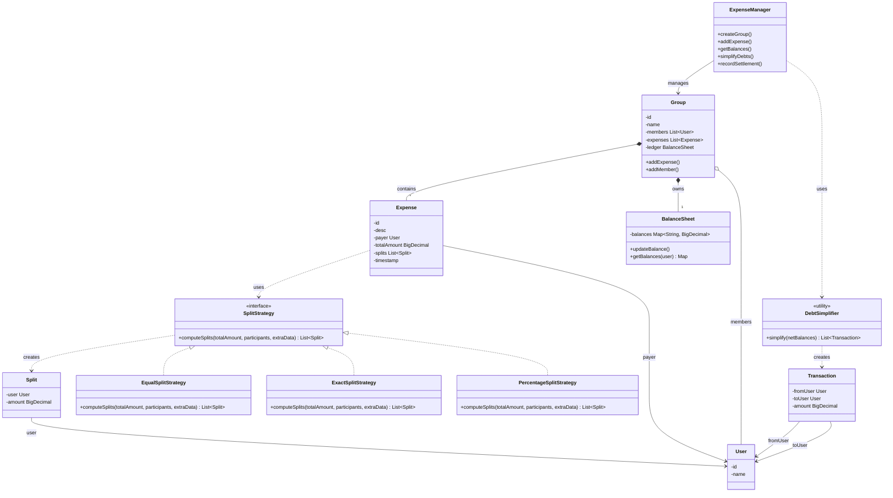
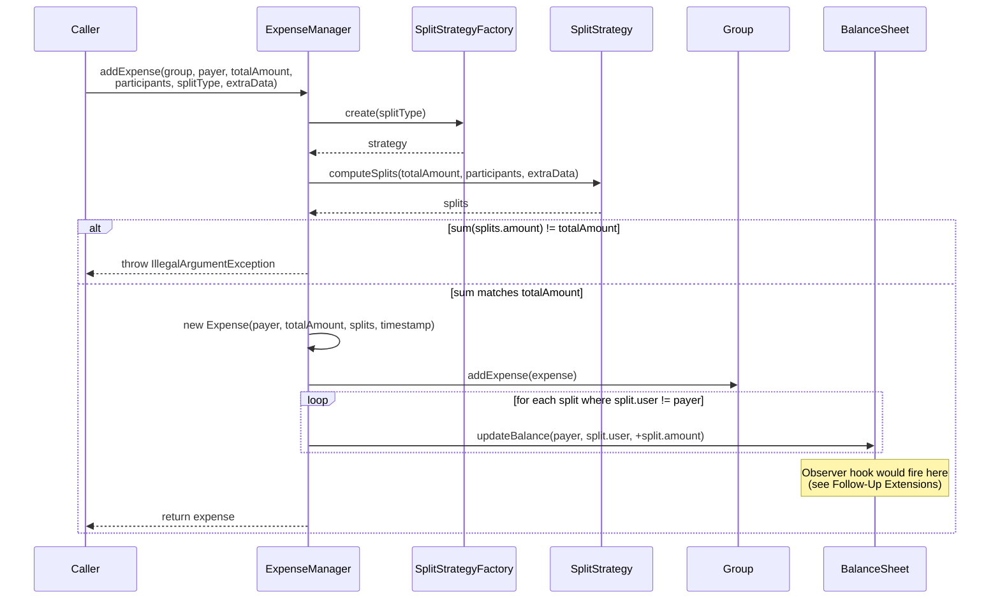
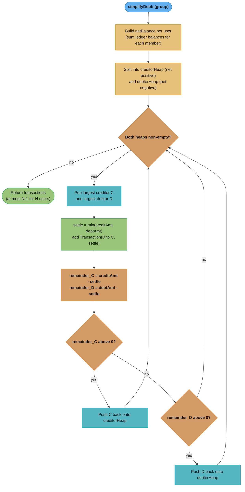

# Splitwise (Expense Sharing) — Low-Level Design

## Intuition

> **Design intuition**: Splitwise tests modeling a group/expense/balance graph and pluggable split strategies (equal, exact amounts, percentage, shares). The entity model itself — User, Group, Expense, Split — is the "easy 60%" of the interview.

**Key insight**: The hardest part isn't the data model — it's **debt simplification**, the greedy algorithm that reduces a tangle of pairwise debts (A owes B $10, B owes C $10, C owes A $5) into the minimum number of settling transactions (e.g., A pays C $5 directly). This is implemented with a max-heap of net creditors and a max-heap of net debtors, repeatedly matching the largest creditor against the largest debtor. Interviewers love this problem because it combines OOP modeling with a genuinely interesting greedy-algorithm component.

---

## Problem Statement

Design a system where users can:
- Create groups (e.g., "Goa Trip", "Apartment 4B")
- Add an expense to a group, paid by one user and split among participants using a configurable strategy: **equal**, **exact amounts**, or **percentage**
- Track each user's net balance with every other user (who owes whom, and how much)
- Settle up — record a payment between two users that reduces their mutual balance
- View a **simplified debt summary** for a group — the minimum set of transactions needed to bring everyone's balance to zero

---

## Requirements

### Functional
1. Create groups with a set of member users
2. Add an expense: payer, total amount, list of participants, and a `SplitType` (EQUAL / EXACT / PERCENTAGE) plus any extra data the strategy needs (exact amounts, percentages)
3. Compute and persist per-user-pair net balances after every expense
4. Simplify a group's debts into the minimum number of settling transactions
5. Record a settlement (payment) between two users and update balances accordingly
6. Support multiple groups per user, each with an independent balance sheet

### Non-Functional
- **Split amounts must sum exactly to the total** — no off-by-a-cent errors. Use `BigDecimal` and a deterministic remainder-allocation policy (leftover cents go to the first N payers in iteration order)
- Balance lookups must be efficient (O(1) amortized) — don't recompute from full expense history on every query
- Extensible to new split types (e.g., SHARES — "Alice gets 2 shares, Bob gets 1 share") without modifying existing strategy code
- Debt simplification must run on a bounded number of users (tens, not millions) — O(N log N) is acceptable; this is a per-group, not a global, operation

---

## ASCII Class Diagram



`ExpenseManager` is the coordinator: it manages `Group`, whose `BalanceSheet` acts as the ledger. The three `SplitStrategy` implementations (Strategy pattern) plug in interchangeably to produce `Split`s, while the stateless-utility `DebtSimplifier` turns net balances into settling `Transaction`s (each one a settlement between two users).

---

## Patterns Used

### 1. Strategy — `SplitStrategy`
**Why**: The way an expense's total amount is divided among participants varies per-expense — equal split for a dinner, exact amounts for an itemized grocery bill, percentage splits for rent (e.g., based on room size). Encoding this as if/else chains inside `Expense` or `ExpenseManager` would make adding a new split type (e.g., SHARES) require touching existing code.

**How**: `SplitStrategy` interface declares `List<Split> computeSplits(BigDecimal totalAmount, List<User> participants, Map<User, BigDecimal> extraData)`. Each concrete strategy (`EqualSplitStrategy`, `ExactSplitStrategy`, `PercentageSplitStrategy`) implements its own division logic and is selected per-expense at creation time based on the `SplitType` the caller passes in.

| Implementation            | Algorithm                                                                 |
|----------------------------|----------------------------------------------------------------------------|
| `EqualSplitStrategy`        | `totalAmount / N`, rounded down to cents; leftover cents distributed one-each to the first *k* participants so the sum equals `totalAmount` exactly |
| `ExactSplitStrategy`        | Uses caller-provided per-user amounts from `extraData`; validates they sum to `totalAmount` (throws if not, within a 1-cent tolerance) |
| `PercentageSplitStrategy`   | Uses caller-provided percentages from `extraData`; validates they sum to 100; computes `totalAmount * pct / 100` per user, then fixes the rounding remainder against the largest share |

---

### 2. Factory — `SplitStrategyFactory`
**Why**: `ExpenseManager.addExpense()` receives a `SplitType` enum from the caller, not a strategy object. Something needs to map `SplitType -> SplitStrategy` so callers don't construct strategy objects themselves and so a new enum value is wired up in exactly one place.

**How**: `SplitStrategyFactory.create(SplitType type)` returns a fresh (stateless, so reusable) strategy instance via a `switch` expression. Adding `SplitType.SHARES` later means adding one enum constant, one strategy class, and one `case` — nothing else in `ExpenseManager` changes.

---

### 3. Observer — considered, but deliberately omitted
A natural extension would be a `BalanceChangeObserver` notified whenever an expense changes a user's balance (e.g., to push "Bob added an expense in Goa Trip" to mobile clients). This repo's `RideSharing` and `ParkingLot` problems already demonstrate Observer in depth, and forcing it into every entity here (every `Split`, every balance update) would add ceremony without adding to what this problem specifically teaches. The **Follow-Up Extensions** section below describes exactly where it would plug in if a production system needed it — `BalanceSheet.updateBalance()` is the single choke point where a notification hook would be added.

---

## Design Decisions & Tradeoffs

| Decision | Alternative | Reason chosen |
|----------|-------------|----------------|
| Store pairwise net balances directly in `BalanceSheet` (`Map<String, Map<String, BigDecimal>>`), updated incrementally on each expense | Recompute every user's balance from the full expense history on each query | O(1) update per (payer, participant) pair and O(1) balance lookup vs. O(E) replay of every expense on every query. With thousands of expenses per group, incremental updates are essential |
| `BigDecimal` for all money fields | `double` | `double` accumulates binary floating-point error — splitting $100.00 three ways as `33.333333...` repeatedly added/subtracted across hundreds of expenses drifts by cents. `BigDecimal` with `RoundingMode.HALF_UP` and a fixed scale (2) gives exact, auditable cent-level arithmetic — required for anything involving money |
| Debt simplification via greedy max-heap matching (largest creditor vs. largest debtor) — **O(N log N)** | Exact minimum-transaction-count solution | Finding the *true* minimum number of transactions to zero out a set of balances is NP-hard in general (it reduces to a subset-sum / partition variant). The greedy heap approach produces at most N-1 transactions for N users and is the standard, practical interview answer — optimal in the common case and "good enough" otherwise |
| Rounding remainder allocated to the **first N participants in iteration order** (one extra cent each until the remainder is exhausted) | Allocate all remainder to the payer, or randomly | Deterministic — same inputs always produce the same split, which matters for testing and for users comparing repeated runs of the same expense. "First N" is also how Splitwise's real UI behaves |
| `BalanceSheet` keyed by `String` user IDs rather than `User` object references | Use `User` objects as map keys directly | Avoids needing to implement `equals()`/`hashCode()` correctly on a mutable `User`; IDs are stable, comparable, and serialize cleanly if persisted |

---

## State / Flow

### `addExpense()` flow



Traces the runtime collaboration behind `addExpense()`: the `SplitStrategyFactory` hands back a strategy, the strategy computes the `Split`s, and — once the sum-to-total invariant holds — the ledger is updated once per non-payer participant before the new `Expense` is returned.

### `simplifyDebts(group)` flow



Traces the greedy debt-simplification loop: each iteration matches the largest creditor against the largest debtor, settles the smaller of the two amounts, and requeues whichever side still has a remainder — producing at most N-1 transactions for N users.

---

## Sample Output

```
========================================
   Splitwise (Expense Sharing) — LLD Demo
========================================

--- Creating group "Goa Trip" ---
Members: Alice, Bob, Carol, Dave

--- Expense 1: Alice pays $120.00 for "Hotel" (EQUAL split among 4) ---
Splits: [Alice=$30.00, Bob=$30.00, Carol=$30.00, Dave=$30.00]
Balance sheet:
  Alice: Bob owes Alice $30.00, Carol owes Alice $30.00, Dave owes Alice $30.00
  Bob: Alice is owed $30.00 by Bob
  Carol: Alice is owed $30.00 by Carol
  Dave: Alice is owed $30.00 by Dave

--- Expense 2: Bob pays $60.00 for "Taxi" (EXACT split: Alice=$25.00, Carol=$20.00, Dave=$15.00) ---
Splits: [Alice=$25.00, Carol=$20.00, Dave=$15.00]
Balance sheet:
  Alice: Bob owes Alice $5.00, Carol owes Alice $30.00, Dave owes Alice $30.00
  Bob: Alice is owed $5.00 by Bob, Carol owes Bob $20.00, Dave owes Bob $15.00
  Carol: Alice is owed $30.00 by Carol, Bob is owed $20.00 by Carol
  Dave: Alice is owed $30.00 by Dave, Bob is owed $15.00 by Dave

--- Expense 3: Carol pays $100.00 for "Groceries" (PERCENTAGE split: Alice=50%, Bob=30%, Dave=20%) ---
Splits: [Alice=$50.00, Bob=$30.00, Dave=$20.00]
Balance sheet:
  Alice: Bob owes Alice $5.00, Carol is owed $20.00 by Alice, Dave owes Alice $30.00
  Bob: Alice is owed $5.00 by Bob, Carol is owed $10.00 by Bob, Dave owes Bob $15.00
  Carol: Alice owes Carol $20.00, Bob owes Carol $10.00, Dave owes Carol $20.00
  Dave: Alice is owed $30.00 by Dave, Bob is owed $15.00 by Dave, Carol is owed $20.00 by Dave

--- Net balance per user (positive = is owed overall) ---
  Alice : +$15.00
  Bob   : +$0.00
  Carol : +$50.00
  Dave  : -$65.00

--- Simplified debt summary (minimum transactions) ---
  Dave   pays Carol  $50.00
  Dave   pays Alice  $15.00

--- Recording settlement: Dave pays Carol $50.00 ---
Updated net balances after settlement:
  Alice : +$15.00
  Bob   : +$0.00
  Carol : +$0.00
  Dave  : -$15.00

========================================
              Demo complete
========================================
```

---

## Cross-Perspective: HLD Connections

**HLD View — Where Splitwise Design Scales to Distributed Systems**

- **Pairwise balance ledger -> double-entry ledger** — `BalanceSheet`'s `Map<userId, Map<otherId, BigDecimal>>` is a simplified double-entry ledger: every expense posts a credit to the payer and a matching debit to each participant. At production scale this becomes an append-only ledger table with optimistic-locking on balance updates — see `../../hld/case_studies/design_digital_wallet.md` for the full double-entry ledger and optimistic-concurrency pattern.
- **Debt simplification as a batch job** — Running `simplifyDebts()` synchronously on every balance query is fine for a group of 10 friends, but at HLD scale (millions of groups) it becomes a periodic batch job — e.g., nightly, or triggered when a group's "settle up" screen is opened — that recomputes and caches the simplified transaction list rather than computing it inline on every request.
- **Observer -> push notification fan-out** — The `BalanceChangeObserver` hook described in Patterns Used maps directly to a notification service: every balance-changing event (`updateBalance`) publishes to a message queue, fanned out to push-notification, email, and in-app feed consumers — see `../../hld/case_studies/design_notification_system.md`.
- **BigDecimal precision -> minor-units convention** — The `BigDecimal`-with-scale-2 approach mirrors the real-world "store money as integer cents/minor units" convention used by payment processors (Stripe, PayPal APIs represent `$30.00` as the integer `3000`). Both approaches exist to eliminate floating-point drift; integer minor units are simply the wire-format equivalent of fixed-scale `BigDecimal`.

---

## Follow-Up Extensions

1. **Multi-currency support** — each `Expense` carries a `Currency`; before updating `BalanceSheet`, convert to a group's base currency via an `ExchangeRateProvider` (Strategy) so balances remain comparable.

2. **Recurring expenses** — add a `RecurringExpense` that wraps an `Expense` template plus a schedule (weekly rent); a scheduler creates concrete `Expense` instances and posts them automatically.

3. **Expense categories + analytics** — tag each `Expense` with a `Category` enum (Food, Travel, Utilities); aggregate spend per category per user for a "spending insights" view.

4. **Partial settlements** — allow `recordSettlement()` for less than the full owed amount, reducing but not zeroing the pairwise balance; `simplifyDebts()` must then operate on the remaining balances.

5. **Group-level vs. friend-level expenses** — support expenses between two users outside any group (a global "friends" ledger per user pair), unifying group and non-group balances into one `BalanceSheet` keyed by user pair regardless of group.

6. **Audit log / expense edit history** — store an immutable list of `ExpenseRevision`s whenever an `Expense` is edited or deleted, and reverse the original `BalanceSheet` updates before applying the new ones — critical for trust in a shared-money app.
