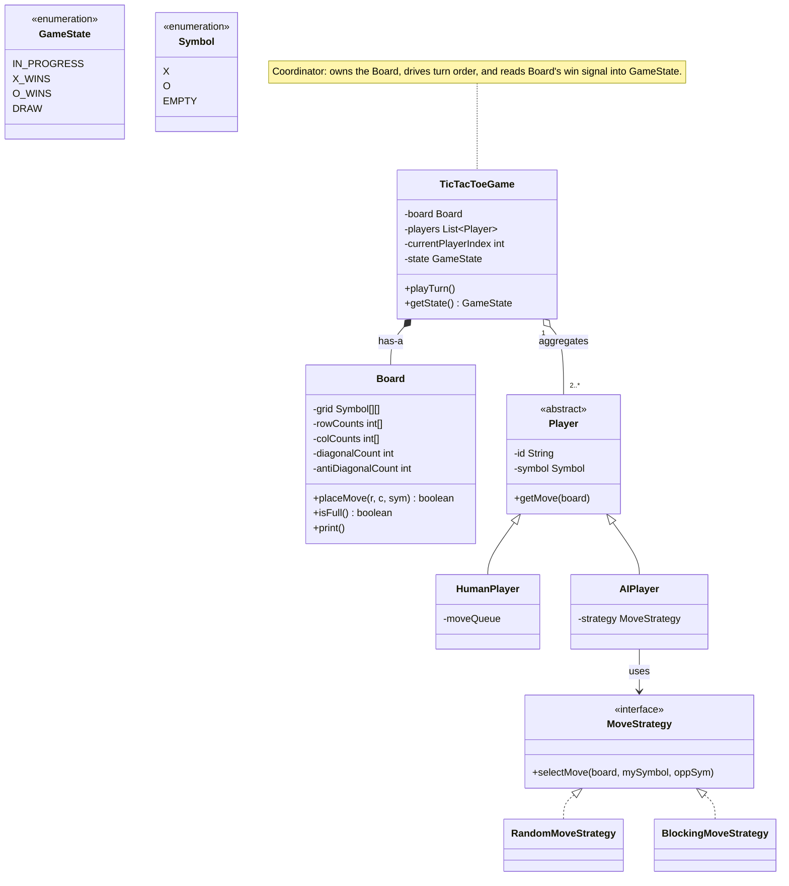
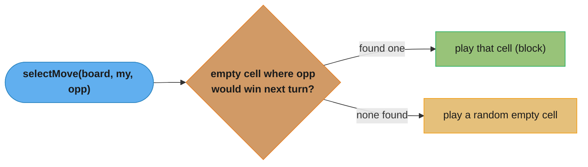
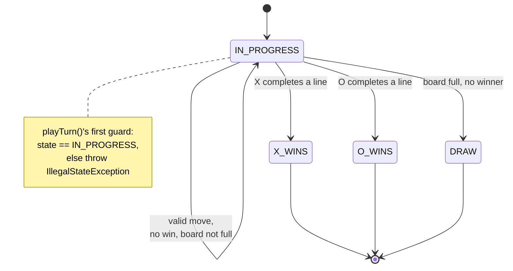
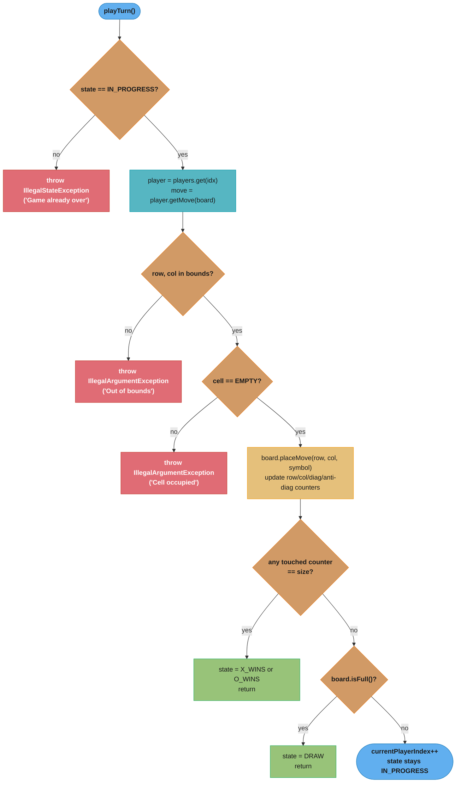

# Tic-Tac-Toe — Low-Level Design

## Intuition

> **Design intuition**: Tic-Tac-Toe looks trivial at 3x3, which is exactly why interviewers use it to probe generalization skill — can you design a board that works for any NxN size, and can you reason about the *cost* of checking for a win after every move? It also gives you a clean, low-stakes surface to demonstrate Player abstraction (human vs. AI) and a State-driven game lifecycle.

**Key insight**: A naive win-check rescans the entire board after every move — O(N^2) cell reads for an NxN board. A senior solution instead maintains incremental counters for every row, column, and the two diagonals, and updates only the four counters touched by the *last* move — O(N) (in fact O(1) amortized per axis, O(N) total across the four checks). For N=1000, that's the difference between 1,000,000 cell checks per move versus 4 integer updates. This single optimization is the detail that separates junior from senior solutions on this problem.

---

## Problem Statement

Design an NxN Tic-Tac-Toe game that supports:
- A configurable board size (default 3x3, but the design must generalize to larger N)
- Two or more players, each assigned a distinct symbol
- Both human players (moves supplied externally) and AI players (computed via a pluggable strategy)
- Move validation — reject out-of-bounds coordinates and moves on occupied cells
- Win detection (3-in-a-row on a 3x3 board for the default configuration) and draw detection
- Querying the current game state (in progress, a player has won, or the board is a draw) at any time

---

## Requirements

### Functional
1. `makeMove(player, row, col)` — places the player's symbol if the move is legal
2. Validate every move: coordinates in bounds, target cell empty, correct player's turn
3. Detect a win immediately after the move that causes it
4. Detect a draw when the board fills up with no winner
5. Support different board sizes via a constructor parameter, not hardcoded constants
6. Support pluggable player types (`HumanPlayer`, `AIPlayer`) behind a common `Player` abstraction

### Non-Functional
- The win-check must be **O(N)**, not O(N^2), so the design scales to large boards (this is the primary thing the interviewer is grading)
- `Board` encapsulates its grid and counters — no external class mutates cells directly
- The design must be extensible to new player types (e.g., remote/networked players) without modifying `TicTacToeGame`
- `GameState` must gate which operations are valid — no moves once the game is `WIN` or `DRAW`

---

## ASCII Class Diagram



`TicTacToeGame` composes exactly one `Board` and aggregates 2+ `Player`s; `HumanPlayer`/`AIPlayer` both extend the abstract `Player`, and only `AIPlayer` holds a swappable `MoveStrategy` (realized by `RandomMoveStrategy`/`BlockingMoveStrategy`) — the Strategy seam covered next.

---

## Patterns Used

### 1. Strategy — `MoveStrategy`
**Why**: AI move selection is the part of the design most likely to change — a take-home assignment might start with "pick any empty cell" and evolve into "block the opponent's win" or later "minimax." Hardcoding the algorithm inside `AIPlayer` would force a rewrite every time the difficulty changes.

**How**: `MoveStrategy` declares `selectMove(Board, Symbol mySymbol, Symbol opponentSymbol)`. `RandomMoveStrategy` picks any empty cell uniformly at random. `BlockingMoveStrategy` first checks whether placing the opponent's symbol in any empty cell would let *them* win on their next turn — if so, it plays there to block; otherwise it falls back to a random empty cell. `AIPlayer` holds a `MoveStrategy` reference and delegates, so swapping difficulty is a one-line constructor change.



`BlockingMoveStrategy` scans every empty cell for one where the opponent would complete a line next turn; a match always wins priority over the random fallback — exactly the "block first, randomize otherwise" rule above.

---

### 2. State — `GameState`
**Why**: The set of legal operations changes as the game progresses. While `IN_PROGRESS`, moves are accepted; once the state becomes `X_WINS`, `O_WINS`, or `DRAW`, `playTurn()` must refuse further moves. Scattering `if (gameOver)` checks throughout the code is error-prone.

**How**: `GameState` is implemented as a simple enum-based state holder on `TicTacToeGame`. After every move, `Board.placeMove()` reports whether it created a win, and `TicTacToeGame` transitions `state` accordingly (`IN_PROGRESS -> X_WINS/O_WINS` or `IN_PROGRESS -> DRAW`). `playTurn()` checks `state == IN_PROGRESS` as its first guard. This is a lightweight, enum-driven variant of the State pattern rather than a full class-per-state hierarchy — appropriate here because the *transition logic* is simple even though the *gating* behavior is exactly what State formalizes.



`IN_PROGRESS` is the only re-entrant state — every other transition is terminal, which is exactly the invariant `playTurn()`'s first guard enforces.

---

### 3. Template Method — honest assessment: not used

An abstract `Player.makeMove(Board)` with `HumanPlayer`/`AIPlayer` filling in different "steps" was considered, but the two subclasses don't share a multi-step algorithm skeleton — `HumanPlayer` simply dequeues a pre-set move and `AIPlayer` delegates entirely to its `MoveStrategy`. Forcing a Template Method here would just be an abstract method with no shared structure, i.e., plain polymorphism. We use a single abstract method `getMove(Board)` on `Player` (basic inheritance + polymorphism, not a named GoF pattern) rather than overstate the pattern catalogue.

---

### 4. Factory — not used

A `PlayerFactory` was considered for creating `HumanPlayer`/`AIPlayer` instances by enum type, but with only two player types and constructors that take meaningfully different arguments (a move queue vs. a strategy object), a factory would add an indirection layer without simplifying any call site. Direct construction (`new AIPlayer(...)`, `new HumanPlayer(...)`) is clearer here. (Compare to `VehicleFactory` in the Parking Lot design, where many call sites construct vehicles from a single `VehicleType` enum — that asymmetry is what justifies a factory there but not here.)

---

## Design Decisions & Tradeoffs

| Decision | Alternative | Reason chosen |
|----------|-------------|---------------|
| O(N) incremental row/col/diagonal counters, updated on each move | O(N^2) full-board rescan after each move | At N=3 the difference is negligible (9 vs. 4 checks), but at N=1000 it's 1,000,000 cell reads vs. 4 counter updates per move — incremental counters are the only approach that scales |
| Generalized NxN `Board` (size passed to constructor) | Hardcoded 3x3 arrays/constants | Interviewers explicitly probe generalization; a `final int size` field and loops parameterized on it cost nothing extra in the 3x3 case |
| Per-symbol counter encoding via separate `+1`/`-1` contributions summed into a single `int[]` per axis | Separate counter arrays per symbol (`xRowCounts[]`, `oRowCounts[]`) | A signed running sum (X contributes +1, O contributes -1) lets a single comparison (`== size` or `== -size`) detect a win for either symbol, halving the state to maintain; documented inline since the encoding is non-obvious |
| 2D `Symbol[][]` grid | Flat 1D array with `row * size + col` indexing | 2D array reads as `grid[row][col]`, matching the problem's natural mental model; the flat array's minor cache-locality benefit isn't worth the indexing-bug risk in an interview setting |
| AI strategies limited to random / blocking | Minimax with alpha-beta pruning | Minimax explores the full game tree — O(b^d) where b is branching factor (~N^2) and d is remaining empty cells; for N=3 (9 cells) this is ~362,880 leaf nodes, tractable, but for N>4 it becomes computationally impractical without heavy pruning. Noted as a follow-up extension rather than baseline scope |

---

## State / Flow



Four guard clauses run before any state mutation — game-over, out-of-bounds, and cell-occupied all short-circuit to an exception; only after `board.placeMove` do the win/draw checks run, and those are the O(N) counter comparisons from the intuition above, never a board rescan.

---

## Sample Output

```
========================================
   Tic-Tac-Toe -- LLD Demo (3x3)
========================================

Players: Human(X) vs AI-Blocker(O)

Turn 1: Human(X) moves
 X | . | .
-----------
 . | . | .
-----------
 . | . | .

Turn 2: AI-Blocker(O) moves
 X | . | .
-----------
 . | . | .
-----------
 O | . | .

Turn 3: Human(X) moves
 X | X | .
-----------
 . | . | .
-----------
 O | . | .

Turn 4: AI-Blocker(O) moves
 X | X | O
-----------
 . | . | .
-----------
 O | . | .

Turn 5: Human(X) moves
 X | X | O
-----------
 . | X | .
-----------
 O | . | .

Turn 6: AI-Blocker(O) moves
 X | X | O
-----------
 . | X | .
-----------
 O | O | .

Turn 7: Human(X) moves
 X | X | O
-----------
 . | X | .
-----------
 O | O | X

>>> Game Over: X_WINS   (main diagonal: (0,0)-(1,1)-(2,2))

--- Invalid move demo ---
Attempting to play on occupied cell (1,1)...
Caught: Cell (1,1) is already occupied.

Attempting to play out-of-bounds cell (3,3)...
Caught: Move (3,3) is out of bounds for a 3x3 board.
```

This run shows a "fork": X's move on turn 3 threatens the top row `(0,0)-(0,1)-(0,2)`, so O blocks at `(0,2)` on turn 4. X's move on turn 5 (center) simultaneously threatens column 1 `(0,1)-(1,1)-(2,1)` and the main diagonal `(0,0)-(1,1)-(2,2)`. O can only block one (column 1, turn 6); X completes the main diagonal on turn 7 and wins. Each of these checks is a single counter comparison, not a board rescan.

---

## Cross-Perspective: HLD Connections

- **Move log as event stream** — Each `makeMove` call is naturally an immutable event (`{player, row, col, timestamp}`); the current board is a *projection* derived by replaying all moves from an empty board. This is a textbook fit for event sourcing, where the move log is the source of truth and the board is rebuilt/cached state — see `../../hld/event_sourcing_cqrs/README.md`.
- **Real-time multiplayer** — A networked version needs every player's client to receive the opponent's move as it happens. At HLD scale this is WebSocket-based push (or Server-Sent Events) — the same Observer-style "notify on change" idea as `ParkingLot`'s `DisplayBoard`, just over the network instead of in-process.
- **AI strategy swapping → feature-flagged rollout** — Swapping `RandomMoveStrategy` for `BlockingMoveStrategy` at construction time mirrors how production ML systems swap model versions or ranking algorithms behind a feature flag — ship the new strategy to a subset of games/users, compare outcomes, then roll out fully.
- **Game-state persistence/resume** — Allowing a player to close the app mid-game and resume later requires externalizing `Board` + `GameState` + `currentPlayerIndex` to a session store (Redis, DB row) keyed by game ID — the same session-state-externalization pattern used to make any stateful service horizontally scalable.

---

## Follow-Up Extensions

1. **Generalize to K-in-a-row on NxN** (Connect Four style) — instead of requiring a full row/column/diagonal of length N, win when any K consecutive cells in a line match. Requires sliding-window counters instead of single full-axis counters.

2. **Minimax with alpha-beta pruning** — replace `BlockingMoveStrategy` with a `MinimaxMoveStrategy` for an unbeatable AI on small boards (practical up to roughly 4x4-5x5 with pruning; beyond that, depth-limit the search and add a heuristic evaluation function).

3. **Undo/redo via Memento** — capture `Board` snapshots (or replay-from-move-log) before each move to support undo; see `../../lld/behavioral/memento/`.

4. **Multiplayer (>2 players) with turn rotation** — generalize `Symbol` to an arbitrary set of markers and `currentPlayerIndex` cycling already supports N players; the win-check needs a configurable target-count-per-symbol.

5. **Persistent move history / replay** — append each validated move to a log (file or DB table); replaying the log from an empty board reconstructs any historical game state, enabling spectator mode and post-game analysis.
