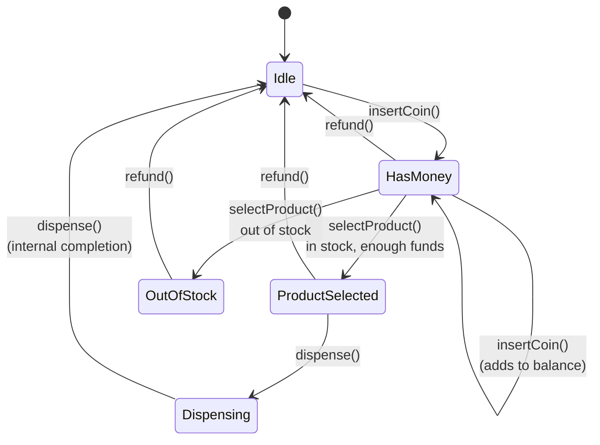
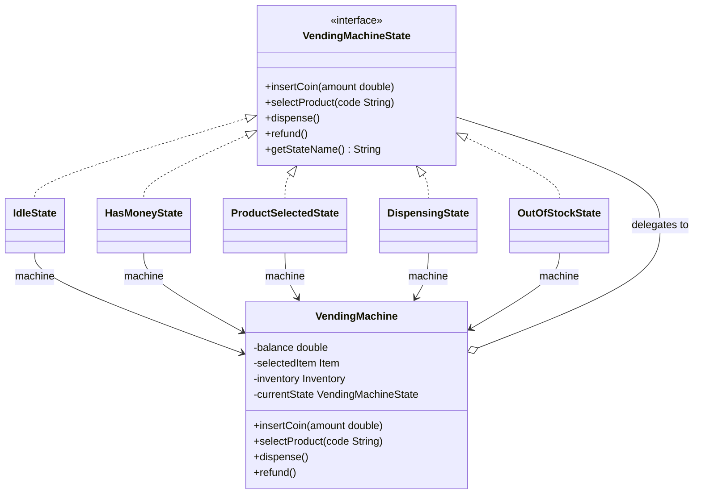
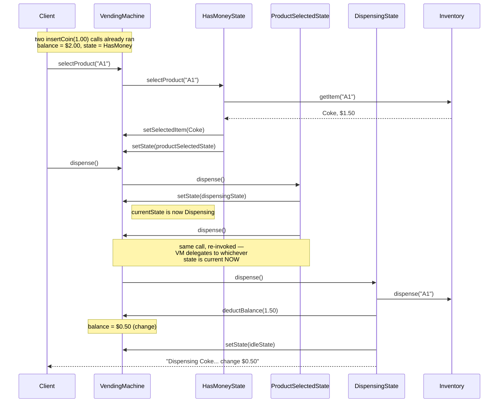

# Vending Machine — State Pattern Deep Dive

## Intuition

> **One-line analogy**: Vending Machine design is the canonical State pattern demonstration — the same physical button does completely different things depending on whether you've inserted money yet.

**Mental model**: A vending machine has a small, well-defined set of states (Idle → HasMoney → ProductSelected → Dispensing → OutOfStock) and every user action (insertCoin, selectProduct, dispense, refund) has a different meaning in each state. Without State pattern, you get a tangled mass of `if/else` and `switch` inside each method. With it, each state object handles events independently — and the machine's behavior is immediately clear from the state transition diagram.

**Why it matters**: Vending Machine is often the first State pattern example in interviews because the states are intuitive and the transitions are crisp. Mastering it builds the mental model for applying State pattern to less obvious domains (network connections, order workflows, game entities).

**Key insight**: The `VendingMachine` class itself should be thin — just a `currentState` field and delegating every action to `currentState.handleAction()`. All logic lives in the state objects. If you find yourself adding `if (state == X)` inside the machine class, you've missed the pattern.

---

## Problem Statement

Design a Vending Machine system that:
- Accepts coins/money from users
- Allows product selection from a menu
- Dispenses the selected product and returns change
- Handles out-of-stock scenarios gracefully
- Supports refund at any stage

This problem is the **canonical State pattern example** — the same button press (e.g., "dispense") behaves completely differently depending on the machine's current state.

---

## State Transition Diagram



Five states, one thin context: every action's meaning depends entirely on `currentState` — `insertCoin()` only advances `Idle`, `refund()` fires from `HasMoney`, `ProductSelected`, or `OutOfStock` and always lands back on `Idle`, and `Dispensing` rejects every external action until its own internal `dispense()` completes — the full action matrix is in the Valid and Invalid Transitions table below.

---

## Class Diagram



All five concrete states realize `VendingMachineState` and hold a back-reference to their `VendingMachine` context; the context itself holds only a single `currentState` pointer, so reassigning that one field — not a growing `if/else` — is the entire transition (Flyweight: the five state instances are created once in the constructor and reused for the life of the machine, per the Patterns Used table above).

---

## Why State Pattern?

### Without State Pattern (anti-pattern):
```java
public void selectProduct(String code) {
    if (currentState == IDLE) {
        System.out.println("Insert coins first");
    } else if (currentState == HAS_MONEY) {
        if (!inventory.isAvailable(code)) {
            currentState = OUT_OF_STOCK;
        } else if (balance >= items.get(code).getPrice()) {
            selectedItem = items.get(code);
            currentState = PRODUCT_SELECTED;
        } else {
            // insufficient balance
        }
    } else if (currentState == PRODUCT_SELECTED) {
        System.out.println("Already selected");
    } else if (currentState == DISPENSING) {
        System.out.println("Please wait");
    } // ... and so on for refund(), insertCoin(), dispense()
}
```
Each method becomes an explosion of if-else. Adding a new state (e.g., `MAINTENANCE`) requires touching every method.

### With State Pattern:
Each state class handles its own behavior. Adding `MaintenanceState` means creating one new class — no existing classes change (Open/Closed Principle).

---

## Patterns Used

| Pattern | Where | Why |
|---------|-------|-----|
| **State** | All 5 states | Each state encapsulates behavior for that state |
| **Singleton** | VendingMachine instance | Only one machine per physical unit |
| **Flyweight** | State objects | Reuse state instances (no per-request creation) |

---

## Valid and Invalid Transitions

| Current State | Action | Result |
|---------------|--------|--------|
| IDLE | insertCoin | → HAS_MONEY |
| IDLE | selectProduct | Error: "Insert coins first" |
| IDLE | dispense | Error: "No product selected" |
| IDLE | refund | Error: "No money to refund" |
| HAS_MONEY | insertCoin | Adds to balance, stays HAS_MONEY |
| HAS_MONEY | selectProduct (in stock, enough) | → PRODUCT_SELECTED |
| HAS_MONEY | selectProduct (out of stock) | → OUT_OF_STOCK |
| HAS_MONEY | selectProduct (insufficient funds) | Error, stays HAS_MONEY |
| HAS_MONEY | refund | Returns balance, → IDLE |
| PRODUCT_SELECTED | insertCoin | Error: "Already selected" |
| PRODUCT_SELECTED | dispense | → DISPENSING → IDLE |
| PRODUCT_SELECTED | refund | Returns balance, → IDLE |
| DISPENSING | any | Error: "Please wait" |
| DISPENSING | (internal dispense()) | Dispenses, → IDLE |
| OUT_OF_STOCK | refund | Returns balance, → IDLE |

---

## Runtime Collaboration: A Normal Purchase Walkthrough

The class diagram above shows structure; this sequence shows the one behavior that trips people up in the Sample Output demo below — `ProductSelectedState.dispense()` does not dispense anything itself, it re-invokes `machine.dispense()` after switching the state, so the freshly-installed `DispensingState` ends up doing the real work.



This double-dispatch is the entire point of `VendingMachine.dispense()` always reading `currentState` fresh: the second `dispense()` call is textually identical to the first, but because `setState(dispensingState)` already ran, it now resolves to `DispensingState.dispense()` instead of looping back into `ProductSelectedState` — exactly the thin-context, no-`if/else` design the Key insight in the Intuition section promises.

---

## Design Decisions

**Q: Why store state objects as fields on VendingMachine?**
State objects are stateless — they only have a reference back to the machine context. Sharing them (Flyweight) avoids creating new objects on every transition.

**Q: Why not use an enum for states?**
Enums can't hold behavior elegantly. Each state would need giant switch statements in the machine class. State objects cleanly encapsulate state-specific logic.

**Q: Where is the balance validation?**
In `HasMoneyState.selectProduct()` — the state that has context about balance. This is "Tell Don't Ask" — the state knows what it can do.

---

## Cross-Perspective: HLD Connections

**HLD View — Where Vending Machine Design Scales to Distributed Systems**

- **State machine → distributed workflow** — The vending machine state machine (IDLE → HAS_MONEY → PRODUCT_SELECTED → DISPENSING) maps to distributed order processing workflows: CART → CHECKOUT → PAYMENT_PENDING → FULFILLING → COMPLETED. Each state allows different operations; invalid transitions are rejected.
- **State persistence → distributed state store** — In a single JVM, state is in memory. In a distributed vending machine network (or any distributed workflow), state must be persisted in a shared store (Redis, DynamoDB) so any node can pick up where another left off after a crash.
- **Saga pattern for state transitions** — Multi-step vending transactions (reserve inventory → charge payment → dispense product) require compensating transactions if any step fails. The Saga pattern applies the same state machine logic across distributed service boundaries.
- **Inventory consistency → distributed locking** — The "select product → check stock → reserve → dispense" sequence must be atomic. At HLD scale, this requires a distributed lock (Redis SETNX) or an optimistic locking pattern to prevent overselling.

---

## Follow-Up Extensions

1. **Payment methods**: Add `CreditCardState` — card inserted triggers a different payment flow
2. **Multiple product slots**: Inventory supports multiple slots per item
3. **Restocking interface**: Admin can trigger restock from `OutOfStockState`
4. **Product expiry**: Items with expiry date; machine won't dispense expired items
5. **Receipt printing**: Decorator on `DispensingState` to print receipt
6. **Network-connected machine**: Remote monitoring of stock levels via Observer
7. **Discount codes**: Strategy pattern for pricing (regular, discount, loyalty)

---

## Sample Output

```
═══════════════════════════════════════
  VENDING MACHINE DEMO
═══════════════════════════════════════
  ┌─────────────────────────────────┐
  │         AVAILABLE ITEMS          │
  ├─────────────────────────────────┤
  │ [A1] Coke         $1.50 (qty=2) │
  │ [B1] Chips        $1.00 (qty=1) │
  │ [C1] Water        $0.75 (qty=3) │
  │ [D1] Candy        $0.50 (OUT)   │
  └─────────────────────────────────┘

--- Scenario 1: Normal Purchase ---
  [STATE] IDLE → HAS_MONEY
  [HAS_MONEY] Added $1.00. Total balance: $1.00
  [HAS_MONEY] Added $1.00. Total balance: $2.00  (wait - second insertCoin)
  [STATE] HAS_MONEY → PRODUCT_SELECTED
  [HAS_MONEY] Selected: Coke
  [STATE] PRODUCT_SELECTED → DISPENSING
  [DISPENSING] >>> Dispensing: Coke <<<
  [DISPENSING] Returning change: $0.50
  [STATE] DISPENSING → IDLE
  [DISPENSING] Thank you! Enjoy your Coke!
```
