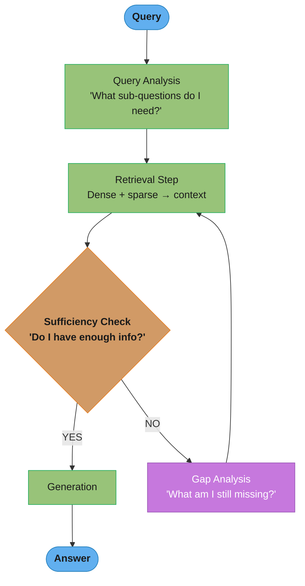
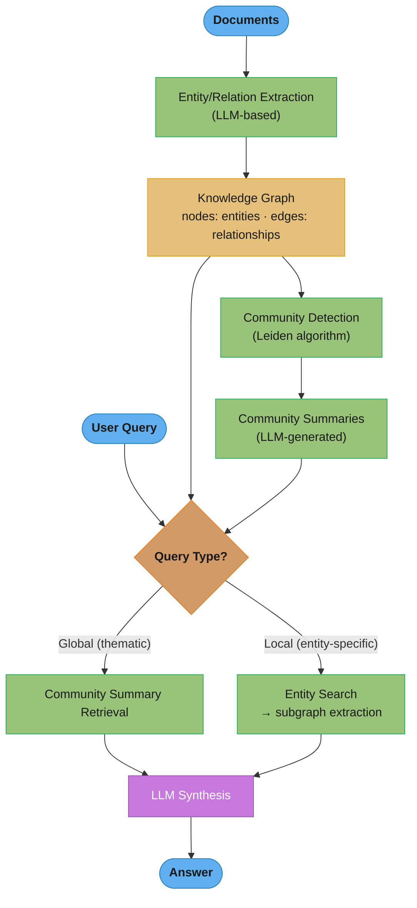

# Advanced RAG

## 1. Concept Overview

[Standard RAG](../rag_fundamentals/README.md) (retrieve → generate) works well for simple Q&A but breaks down on complex queries: multi-hop questions, queries requiring synthesis across many documents, questions about structured data, or tasks where the LLM needs to iteratively refine its retrieval strategy.

Advanced RAG encompasses techniques that go beyond the basic pipeline: query transformation before retrieval, agentic/iterative retrieval where the LLM decides what to retrieve next, graph-based retrieval for structured knowledge, multi-modal retrieval for images and tables, and rigorous evaluation frameworks.

These techniques push RAG from a simple lookup system to a reasoning system that can answer complex questions that require synthesis, comparison, and multi-step inference.

---

## 2. Intuition

> **One-line analogy**: Advanced RAG is like upgrading from a library card catalog to a research librarian who understands your question, fetches multiple sources, and iterates until they find what you actually need.

**Mental model**: Basic RAG retrieves once and generates. Advanced RAG recognizes that complex questions require multiple retrieval rounds, query reformulation, reasoning across a knowledge graph, or iterative verification. Agentic RAG lets the LLM decide what to retrieve next based on what it finds, like a researcher who reads one paper, decides they need the cited papers too, fetches those, and synthesizes across all sources.

**Why it matters**: Simple Q&A works with basic RAG; multi-hop questions ("who was the CEO of the company that acquired X?"), comparative analysis, and synthesis across heterogeneous sources require advanced techniques. Graph RAG also unlocks structured knowledge that flat vector search misses.

**Key insight**: The LLM should be a first-class participant in the retrieval process, not just a passive consumer of retrieved chunks — it knows best what information is still missing and what to retrieve next.

---

## 3. Core Principles

- **Query and context are rarely aligned**: User queries are often ambiguous, vague, or assume context the retriever doesn't have. Query transformation bridges this gap.
- **Retrieval should be iterative**: For complex questions, one retrieval step is insufficient. The LLM should decide what additional information to retrieve based on what it already has.
- **Structure matters**: Many knowledge sources are graphs (entity relationships), tables (structured data), or code — plain vector search misses these structures.
- **Evaluate RAG components independently**: Decompose into retrieval quality (context recall, context precision) and generation quality (faithfulness, answer relevance).
- **Diminishing returns on context**: Adding more retrieved documents doesn't always help; too much irrelevant context actively degrades generation quality (see [Context Engineering](../context_engineering/README.md)).

---

## 4. Types / Strategies

### 4.1 Query Transformation

Transform the user's raw query before retrieval to improve recall.

**Query rewriting**: LLM rewrites query to be more explicit and retrieval-friendly:
```
Original: "What did they decide about the budget?"
Rewritten: "What budget decisions were made by the executive team in Q4 2024 strategy meeting?"
```

**HyDE (Hypothetical Document Embeddings)**:
```
1. Generate a hypothetical answer to the query
2. Embed the hypothetical answer (not the query)
3. Use this embedding for retrieval (documents similar to the hypothetical answer)

Why it works: The hypothetical answer is in "document space" not "query space"
  - Better alignment with how answers appear in documents
  - Especially useful when query phrasing differs from document phrasing
```

**Multi-query expansion**:
```
User query: "How does React handle state?"

Generate 3 alternative phrasings:
  1. "React useState hook and state management"
  2. "Component state in React functional components"
  3. "React state updates and re-rendering"

Retrieve for all 3 → merge results → deduplicate
Improves recall when the answer could be phrased many ways
```

The fan-out is cheap to describe and easy to under-budget. The cost model:

```
  llm_calls    = 1 (decompose)  +  n_sub  +  1 (synthesize)
  retrievals   = n_sub x fan_out
  candidates   = n_sub x fan_out
  unique       = candidates x (1 - dup_rate)
  rerank_pairs = unique
  latency_par  = t_decompose + t_retrieve + t_rerank + t_synth      (sub-queries parallel)
  latency_seq  = t_decompose + n_sub x t_retrieve + t_rerank + t_synth
```

**Reading it in plain English.** "Splitting one query into `n` sub-queries multiplies everything downstream by `n` — retrieval calls, candidate documents, reranker work — while latency multiplies by `n` only if you forget to run the sub-queries in parallel."

The asymmetry is the whole point: *cost* scales with `n_sub` no matter what you do, but *latency* is a choice. That is why §8 lists multi-query at `~2x` latency and `2x` cost rather than `3x` — the extra decompose and synthesize LLM calls are serial, but the three retrievals are not.

| Symbol | Say it | What it is |
|--------|--------|------------|
| `n_sub` | "n sub" | Number of sub-queries generated. Typically 3–5; beyond 5, returns flatten |
| `fan_out` | "fan out" | Candidates retrieved per sub-query, before merging |
| `dup_rate` | "duplication rate" | Fraction of candidates that appear under more than one sub-query |
| `unique` | "unique candidates" | What survives deduplication. What the reranker actually pays for |
| `t_retrieve` | "t retrieve" | Wall-clock for one retrieval round |
| `latency_par` | "parallel latency" | Sub-queries issued concurrently — `n_sub` cancels out of the retrieval term |
| `latency_seq` | "serial latency" | Sub-queries issued one after another — the accidental `n_sub x` blowup |

**Walk one example.** The `n_sub = 3` decomposition above, with the §13 recipe of 100 candidates per sub-query reranked to top-5. Standard RAG's `~200ms` from §8 is the baseline:

```
  quantity            standard RAG       multi-query (n_sub = 3)      multiplier
  ------------------  -----------------  ---------------------------  ----------
  LLM calls               1 (generate)   1 + 3 + 1 = 5, but the 3 sub    ~2x
                                         retrievals need no LLM -> 2
  retrieval calls               1        3 x 1 = 3                        3x
  raw candidates              100        3 x 100 = 300                    3x
  unique after dedup          100        300 x (1 - 0.40) = 180          1.8x
  reranker pairs              100        180                             1.8x

  Latency, run in PARALLEL:
    decompose (LLM)      80ms
    retrieve x3          50ms   <- concurrent, so 50ms not 150ms
    rerank 180 pairs    140ms   <- 1.8x the pairs, roughly 1.8x the 78ms baseline
    generate            180ms
                       ------
    total               450ms   vs ~200ms standard  =  2.25x

  Latency, run SERIALLY (the common mistake):
    decompose            80ms
    retrieve 3 x 50ms   150ms   <- n_sub now multiplies the retrieval term
    rerank              140ms
    generate            180ms
                       ------
    total               550ms                       =  2.75x
```

**Why `dup_rate` is the term that saves you.** Sub-queries are paraphrases of one question, so their result sets overlap heavily — 40% duplication is typical for a 3-way expansion of a single intent. Ignore deduplication and the reranker processes 300 pairs instead of 180, adding ~90ms and re-scoring the same documents multiple times, which also lets a document win the top-5 merely for having been retrieved three times. Deduplicate *before* reranking, not after.

**Why `n_sub` has a ceiling.** Recall gain per extra sub-query decays as `dup_rate` climbs — the 4th and 5th paraphrases of one intent mostly re-retrieve what the first three already found — while cost stays strictly linear in `n_sub`. That is the shape behind §12's "10-30% recall improvement" for a technique that costs 2x: the win is real but bounded, and pushing `n_sub` to 10 buys almost nothing for 3x the spend.

**Step-back prompting**:
```
Original: "What was the GDP growth rate in Brazil in Q2 2023?"
Step-back: "What factors affect Brazil's GDP?"
Retrieve: both specific and general context
```

### 4.2 Agentic RAG (Iterative Retrieval)

The LLM decides what to retrieve, evaluates whether it has enough information, and retrieves again if needed:

```
Step 1: LLM analyzes query, generates retrieval query
Step 2: Retrieve → inject into context
Step 3: LLM evaluates: "Do I have enough information to answer?"
  If yes → generate final answer
  If no → generate new retrieval query → go to Step 2
  (Max iterations: 3-5 to prevent loops)

Example:
  Query: "Compare the revenue of Anthropic and OpenAI in 2023"
  Iteration 1: retrieve "Anthropic 2023 revenue" → found partial info
  Iteration 2: retrieve "OpenAI 2023 revenue" → found info
  Iteration 3: retrieve "Anthropic vs OpenAI revenue comparison" → confirm
  Generate: comparative answer with citations
```

### 4.3 Graph RAG (Microsoft, 2024)

Build a knowledge graph from documents; use graph traversal + LLM synthesis for complex queries:

```
Indexing phase:
  1. Extract entities and relationships from all documents
     "Microsoft" → [ACQUIRED] → "Activision Blizzard"
     "Microsoft" → [MADE_INVESTMENT_IN] → "OpenAI"
  2. Build a graph: entities as nodes, relationships as edges
  3. Cluster graph into communities
  4. Summarize each community (hierarchical summary tree)

Query phase:
  Global queries (e.g., "What are Microsoft's AI investments?"):
    → Query community summaries (efficient, broad coverage)
    → LLM synthesizes from community summaries

  Local queries (e.g., "Who did Microsoft acquire in gaming?"):
    → Traditional vector search within relevant community
    → Answer from specific documents

Advantage: Handles "What themes appear across all documents?" type queries
  that vector search completely fails on (no single chunk contains the answer)
```

Two pieces of arithmetic govern whether this is affordable: what "community" means to the clustering algorithm, and how fast a traversal explodes as hops increase.

```
Modularity (what Leiden maximizes when it cuts the graph into communities):

              1                          k_i x k_j
  Q = Sigma  ---- x Sigma   [ A_ij  -  ------------- ] x delta(c_i, c_j)
       ij     2m      ij                    2m

Hop fan-out (what a traversal costs):

  nodes_at_hop_h    = d^h                       (d = average out-degree)
  nodes_visited(H)  = Sigma over h=1..H of d^h
```

**Reading it in plain English (modularity).** "A good community is one where the nodes inside it are connected to each other *more than random chance would predict* given how many edges each node has."

The `- (k_i x k_j)/(2m)` subtraction is the entire idea. Without it, the algorithm would happily declare "everything is one giant community" — a hub node connected to thousands of others looks maximally cohesive by raw edge count. Modularity grades against a null model instead, so a hub gets no credit for edges it was statistically bound to have.

| Symbol | Say it | What it is |
|--------|--------|------------|
| `Q` | "cue" / "modularity" | Quality of a proposed partition. Roughly `-0.5` to `1`; above `0.3` is meaningful structure |
| `A_ij` | "A sub i j" | Actual edges between node `i` and node `j`. Usually `1` or `0` |
| `k_i` | "kay sub i" / "degree of i" | How many edges node `i` has in total |
| `m` | "em" | Total number of edges in the whole graph |
| `2m` | "two em" | Total edge endpoints. The normalizer, since each edge has two ends |
| `(k_i k_j)/(2m)` | "expected edges" | Edges you'd expect between `i` and `j` purely by chance |
| `delta(c_i, c_j)` | "delta of c i, c j" | `1` if both nodes were placed in the same community, `0` otherwise |
| `Sigma over ij` | "sum over all node pairs" | Do this for every pair, then add up |

**Walk one example (modularity).** A tiny graph, `m = 10` edges so `2m = 20`. Two nodes both of degree 4:

```
  expected edges between them = (k_i x k_j)/(2m) = (4 x 4)/20 = 0.80

  case                          A_ij   A_ij - expected   contributes to Q?
  ----------------------------  -----  ----------------  ---------------------------
  edge exists, same community      1     1 - 0.80 = +0.20   yes, positive -- keep them together
  no edge, same community          0     0 - 0.80 = -0.80   yes, negative -- split them
  edge exists, diff communities    1     (delta = 0)  0.00  ignored

  Now two HUB nodes, degree 18 each, in a graph where 2m = 20:
  expected = (18 x 18)/20 = 16.2, but A_ij can only be 1
  -> 1 - 16.2 = -15.2, a large penalty

  Two hubs sharing one edge is NOT evidence they belong together. Two degree-1 nodes
  sharing an edge (expected = 1/20 = 0.05, so +0.95) almost certainly do.
```

**Reading it in plain English (hop fan-out).** "Each additional hop multiplies the number of nodes you touch by the average degree, so traversal cost is exponential in hop count, not linear."

| Symbol | Say it | What it is |
|--------|--------|------------|
| `d` | "dee" | Average out-degree. How many neighbours a typical node has |
| `h` | "aitch" | Which hop you are on. Hop 1 = direct neighbours |
| `H` | "big aitch" | Maximum hop depth. The `graph_hop_depth=2` parameter in §14's code |
| `d^h` | "d to the h" | Nodes reachable at exactly hop `h` |

**Walk one example (hop cost).** §14's legal graph with `hop_depth = 2`, assuming an average of 12 citation edges per case:

```
  hop h    nodes at this hop   cumulative visited   Neo4j Cypher time (approx)
  -------  ------------------  -------------------  --------------------------
    1      12^1 =         12                   12            ~5ms
    2      12^2 =        144                  156         20-100ms  <- H=2 used
    3      12^3 =      1,728                1,884           ~1.2s
    4      12^4 =     20,736               22,620            ~14s
    5      12^5 =    248,832              271,452           ~170s

  Going from H=2 to H=3 is a 12x jump in nodes and roughly 12x in latency; H=2 to H=4
  is 145x. This is why hop_depth is capped at 2 and not left to the model to choose.
```

**Why community summaries exist at all.** A global query ("What themes appear across all documents?") has no bounded traversal — answering it honestly means visiting every node, which the table above prices out immediately. Pre-computing one summary per community converts that unbounded traversal into a bounded retrieval over a much smaller set: §14's 500k cases collapse to 12,400 community summaries, a 40x reduction, and a global query becomes an ordinary vector search over those summaries. Remove the community layer and Graph RAG can still answer local queries by traversal but loses global queries entirely — which are the only queries it existed to solve.

### 4.4 Multi-Modal RAG

Extend retrieval beyond text to images, tables, charts, and PDFs with mixed content:

```
Document types:
  PDF with tables: extract table data as structured text + embed
  PDF with charts: OCR + chart-to-text conversion; or embed the image
  PowerPoint slides: slide → image → vision LLM caption → embed caption
  Diagrams: embed image directly using CLIP/SigLIP

Multi-modal retrieval:
  Text query → text embedding (compare with text chunks)
  Text query → CLIP text embedding (compare with image embeddings)
  Merge results, provide relevant images AND text to LLM

Generation:
  Use vision-capable LLM (GPT-4o, Gemini 1.5 Pro, Claude 3.5)
  LLM sees both text context and relevant images
```

### 4.5 Self-RAG

Model decides when to retrieve:

```
LLM is fine-tuned with special tokens:
  [Retrieve]: LLM decides a retrieval is needed
  [No Retrieve]: LLM answers from parametric knowledge
  [Relevant]: Retrieved passage is relevant
  [Not Relevant]: Passage not relevant
  [Supported]: LLM's statement is supported by context
  [Contradicts]: LLM's statement contradicts context

During inference:
  Generate → if [Retrieve] token appears → trigger retrieval → continue
  After generation → check [Supported] tokens

Benefits: adaptive retrieval (only when needed); built-in faithfulness checking
Requires: fine-tuning a specialized model variant
```

The reflection tokens are not flags — they are ordinary vocabulary tokens, so the model's softmax over them gives you a *calibrated probability* you can score candidate continuations with:

```
  P([Relevant])  = softmax over the reflection-token vocabulary, read at that position

  segment_score(y) = log P(y | x, d)  +  w_rel x P([Relevant])
                                      +  w_sup x P([Supported])
                                      +  w_use x P([Useful])

  Final answer = argmax over candidate segments of segment_score(y)
```

**Reading it in plain English.** "Generate several candidate continuations, then rank them not just by how likely the text is, but by how strongly the model's own critique tokens vouch for it being relevant, supported, and useful."

Reading the reflection tokens as *probabilities rather than decisions* is what makes this work. `[Supported]` firing at `0.51` and at `0.99` are very different situations, and collapsing them to a binary throws away exactly the signal you need to rank candidates.

| Symbol | Say it | What it is |
|--------|--------|------------|
| `y` | "why" | A candidate output segment being scored |
| `x` | "ex" | The user query |
| `d` | "dee" | The retrieved passage this segment was conditioned on |
| `log P(y \| x, d)` | "log prob of y given x and d" | Ordinary fluency score. How likely this text is |
| `P([Relevant])` | "P of is-rel" | Model's own confidence the passage is on-topic. `IsREL` in the paper |
| `P([Supported])` | "P of is-sup" | Confidence the claim is actually grounded in `d`. `IsSUP` in the paper |
| `P([Useful])` | "P of is-use" | Confidence the answer helps. `IsUSE`, often graded 1–5 rather than binary |
| `w_rel`, `w_sup`, `w_use` | "w rel, w sup, w use" | Inference-time weights. Tunable *without retraining* |
| `argmax` | "arg max" | Pick the candidate with the highest total |

**Walk one example.** One query, three candidate segments generated against different retrieved passages. Weights `w_rel = 1.0`, `w_sup = 1.0`, `w_use = 0.5`:

```
  cand  log P(y|x,d)  P([Rel])  P([Sup])  P([Use])   weighted critique      total
  ----  ------------  --------  --------  ---------  ---------------------  ------
   A         -0.85      0.94      0.91      0.88     0.94+0.91+0.44 = 2.29    1.44
   B         -0.42      0.96      0.38      0.90     0.96+0.38+0.45 = 1.79    1.37
   C         -1.60      0.71      0.95      0.62     0.71+0.95+0.31 = 1.97    0.37

  B is the most FLUENT candidate (-0.42, best log-prob) but scores P([Supported]) = 0.38
  -- the model is telling you it wrote something plausible that the passage does not
  actually back. That is a hallucination, caught by the model itself.

  A wins at 1.44 despite worse fluency, because it is both supported and relevant.

  Turn up w_sup to 2.0 (faithfulness-critical deployment):
    A = -0.85 + 0.94 + 2x0.91 + 0.44 = 2.35
    B = -0.42 + 0.96 + 2x0.38 + 0.45 = 1.75
    C = -1.60 + 0.71 + 2x0.95 + 0.31 = 1.32
  A's lead widens from 0.07 to 0.60. Same model, same weights file, no retraining.
```

**The retrieve/no-retrieve decision uses the same trick.** `P([Retrieve])` is read at the start of a segment and thresholded:

```
  query                                     P([Retrieve])   action
  ----------------------------------------  --------------  ---------------------
  "What is 17 x 4?"                             0.03        answer parametrically
  "Summarize the text I just pasted."           0.11        answer parametrically
  "What did our Q4 2024 board deck conclude?"   0.97        retrieve
  "Who wrote Hamlet?"                           0.34        borderline -- threshold
                                                            at 0.5 says no retrieve
```

**Why the weights are inference-time and not baked into training.** Fold the critique into the training loss alone and every deployment gets one fixed tradeoff between fluency and faithfulness. Keeping `w_sup` as a decode-time knob lets a legal or medical deployment crank faithfulness up and a brainstorming assistant crank it down, from a single fine-tune. That flexibility is the practical argument for Self-RAG over an external evaluator — and also why §12 notes CRAG gets 80% of the benefit with no training at all, since most teams never actually tune these weights.

### 4.6 Corrective RAG (CRAG)

Evaluates retrieved documents and corrects the retrieval strategy if low quality:

```
Step 1: Retrieve top-K documents
Step 2: Relevance evaluator scores each document
  If score > threshold: proceed to generation
  If score < threshold:
    → Trigger web search for fresh/better information
    → Filter and refine retrieved content

CRAG handles knowledge base gaps by falling back to web search
Prevents using low-quality retrieved context as grounding
```

In practice "the threshold" is two thresholds, cutting the confidence axis into three action bands:

```
  conf = max over retrieved d of  evaluator(q, d)      <- best document's score, in [0, 1]

                Correct              Ambiguous              Incorrect
         |=====================|====================|=====================|
        0.0                   0.30                 0.70                  1.0
         use web search        use BOTH             use retrieved docs
         only                  (retrieved + web)    only

  action(conf) = Incorrect   if conf <  0.30
                 Ambiguous   if 0.30 <= conf <= 0.70
                 Correct     if conf >  0.70
```

**Reading it in plain English.** "Ask an evaluator how good the best retrieved document actually is. If it is clearly good, use it. If it is clearly bad, throw it away and search the web. If you genuinely cannot tell, use both and let the generator sort it out."

The middle band is the design insight. A single threshold forces a confident decision at exactly the point where the evaluator is least confident — the Ambiguous bucket exists so uncertainty produces a hedge instead of a coin flip.

| Symbol | Say it | What it is |
|--------|--------|------------|
| `q` | "cue" | The user query |
| `d` | "dee" | One retrieved document |
| `evaluator(q, d)` | "evaluator of q and d" | Lightweight relevance model (often a T5-large cross-encoder) scoring the pair |
| `conf` | "confidence" | The retrieval's overall confidence. The `max`, not the mean — see below |
| `max over d` | "max over d" | Take the single best-scoring document |
| `0.30` | "point three" | Lower cut. Below this, retrieval is treated as having failed outright |
| `0.70` | "point seven" | Upper cut. Above this, retrieval is trusted without augmentation |

**Walk one example — which outcomes land in which band.** Five queries against a corporate knowledge base, top-3 retrieved each:

```
  query                                doc scores          conf   band        action
  -----------------------------------  ------------------  -----  ----------  --------------
  "2024 parental leave policy"         0.92, 0.88, 0.61    0.92   Correct     use retrieved
  "FSA contribution limit"             0.79, 0.34, 0.21    0.79   Correct     use retrieved
  "our stance on remote work in EU"    0.64, 0.58, 0.40    0.64   Ambiguous   retrieved + web
  "who won the game last night"        0.31, 0.22, 0.18    0.31   Ambiguous   retrieved + web
  "Q3 2025 competitor pricing"         0.19, 0.14, 0.09    0.19   Incorrect   web only

  Note row 2: one strong hit at 0.79 and two weak ones. Because conf is a MAX, this is
  Correct. Had conf been the MEAN it would be (0.79+0.34+0.21)/3 = 0.45 -- Ambiguous --
  and a perfectly good answer would have triggered an unnecessary web search.

  Note row 4: a genuinely out-of-corpus query that squeaks over 0.30 on a spurious
  keyword match. It lands in Ambiguous, so web results get added rather than the
  0.31 document being trusted alone. The band did its job.
```

**Why `max` and not `mean`.** RAG needs *one* good document, not a uniformly good candidate set. Averaging punishes a retriever that correctly surfaces the answer at rank 1 alongside two irrelevant fillers — the exact shape of a successful retrieval over a large corpus. Switch to `mean` and you fire the web-search fallback on queries that were already answered, paying latency and API cost for nothing.

**Why the bands are 0.30 and 0.70 rather than a single 0.50.** Collapse them and every query lands in one of two buckets:

```
  conf   single threshold 0.50    CRAG three-band
  -----  ----------------------   ---------------------------------------------
  0.72   trust retrieved          trust retrieved            (same)
  0.51   trust retrieved          retrieved + web            <- hedged
  0.49   discard, web only        retrieved + web            <- hedged
  0.28   discard, web only        discard, web only          (same)

  The two middle rows are near-identical retrievals separated by 0.02 of evaluator
  score, yet the single threshold gives them OPPOSITE treatments -- one is fully
  trusted, one is thrown away entirely. Evaluator noise alone spans more than 0.02.
```

Both thresholds are corpus-specific and must be calibrated on a labeled set. `0.30/0.70` are the paper's defaults, not universal constants: a clean, well-curated corpus pushes both cuts up (retrieval is usually right), while a noisy or sparsely-covered corpus pushes them down.

---

## 5. Architecture Diagrams

### Agentic RAG with Reflection


### Graph RAG Architecture


### RAG Evaluation Dimensions
```
Context Recall:    How much of the ground truth context was retrieved?
Context Precision: What fraction of retrieved context is actually relevant?
Faithfulness:      Does the answer contradict the context?
Answer Relevance:  Does the answer address the question asked?

Perfect RAG system:
  Context Recall = 1.0 (found all relevant docs)
  Context Precision = 1.0 (no irrelevant docs retrieved)
  Faithfulness = 1.0 (answer only uses provided context)
  Answer Relevance = 1.0 (answer directly addresses question)
```

---

## 6. How It Works — Detailed Mechanics

### Sentence Window Retrieval

Retrieve small child sentences, expand to parent window for context:

```
Index: sentence-level embeddings (very precise retrieval)
At query time:
  1. ANN search returns top-K sentences
  2. For each retrieved sentence, fetch surrounding ±2 sentences (window)
  3. Use expanded window as LLM context

Effect: precision of sentence-level retrieval + context of paragraph-level chunks
Best for: long documents with diverse content (technical manuals, research papers)
```

### Fusion Retrieval + FLARE

FLARE (Forward-Looking Active REtrieval): predict future content to determine when to retrieve:

```
LLM is generating response token by token
When LLM predicts a low-confidence continuation:
  → This signals the LLM needs more information
  → Trigger retrieval with the predicted continuation as query
  → Inject retrieved context and continue generation

Unlike standard RAG (retrieve once at the start), FLARE retrieves
  precisely when the model encounters a knowledge gap during generation
```

### Reranker Score Scales, Decoded

Bi-encoder and cross-encoder scores look like the same kind of number and are not. Mixing them, or thresholding one with intuitions built on the other, is a common and silent bug:

```
  bi-encoder:     score = cosine(E(q), E(d))          -> bounded  [-1, 1], in practice [0, 1]

  cross-encoder:  logit = CrossEnc([q ; SEP ; d])     -> UNBOUNDED, roughly [-12, +12]
                  prob  = sigma(logit) = 1 / (1 + e^-logit)   -> bounded (0, 1)
```

**Reading it in plain English.** "The bi-encoder measures an angle between two vectors it computed separately, so it is trapped between -1 and 1. The cross-encoder reads the query and document together and emits a raw, unbounded opinion — a logit — which only becomes a probability after you squash it."

| Symbol | Say it | What it is |
|--------|--------|------------|
| `E(q)`, `E(d)` | "E of q, E of d" | Query and document embedded *independently*. Document side is precomputable |
| `[q ; SEP ; d]` | "q sep d" | Query and document concatenated into ONE sequence. Full cross-attention between them |
| `logit` | "logit" | Raw pre-sigmoid output. Unbounded, model-specific scale, NOT a probability |
| `sigma` | "sigmoid" | Squashes any real number into `(0, 1)` |
| `e^-logit` | "e to the minus logit" | The exponential that makes sigmoid's S-curve |
| `prob` | "probability" | Calibrated relevance. This is what you can threshold across models |

**Walk one example.** The same 5 candidates, scored both ways:

```
  cand  bi-encoder cosine   cross-enc logit   sigma(logit) = prob      bi rank  cross rank
  ----  -----------------   ---------------   --------------------     -------  ----------
   A          0.86               +8.20        1/(1+e^-8.20)  = 0.9997      1         1
   B          0.84               -3.10        1/(1+e^3.10)   = 0.0431      2         4
   C          0.81               +5.40        1/(1+e^-5.40)  = 0.9955      3         2
   D          0.79               +1.20        1/(1+e^-1.20)  = 0.7685      4         3
   E          0.77               -6.80        1/(1+e^6.80)   = 0.0011      5         5

  The bi-encoder squeezes all five into a 0.09-wide band (0.77-0.86) -- it genuinely
  cannot separate them. The cross-encoder spreads them across 15.0 logits, and it
  DEMOTES B from rank 2 to rank 4: B shares vocabulary with the query but contradicts
  it, which only joint attention can see.

  Reranking to top-3:
    bi-encoder alone  -> A, B, C     (B is a false positive that reaches the LLM)
    cross-encoder     -> A, C, D     (B correctly excluded)
```

**Why you cannot threshold a logit the way you threshold a cosine.** Two failure modes, both from treating the scales as interchangeable:

```
  MISTAKE 1: reusing a cosine threshold on logits.
    "Keep anything above 0.7" was calibrated on cosines, where it is a strict cut
    that would keep only A (0.86), B (0.84), C (0.81), D (0.79), E (0.77) -- all of
    them. Applied to raw logits it keeps A, C and D (+8.20, +5.40, +1.20), because
    on the logit scale 0.7 sits near the midpoint, not near the top. Applied to the
    PROBABILITIES it keeps A, C and D again -- but now for the right reason, and D
    (0.7685) is correctly marginal. Only the probability form means what you intended.

  MISTAKE 2: averaging the two scores directly.
    0.5 x 0.84 + 0.5 x (-3.10) = -1.13 for candidate B
    0.5 x 0.86 + 0.5 x (+8.20) = 4.53 for candidate A
    The cosine term contributed at most 0.43 to either row; the logit contributed
    up to 4.10. The "50/50" blend is really ~90/10 in favor of the cross-encoder.
```

Always apply `sigma` before comparing, thresholding, or blending cross-encoder output — and even then, remember that logit scales are *model-specific*. A `+5.0` from `bge-reranker-v2` and a `+5.0` from Cohere Rerank 3 do not mean the same thing, so any threshold must be recalibrated when you swap rerankers. This is the same incomparable-scales problem that pushes hybrid retrieval toward rank-based fusion instead of score blending.

### Evaluation with RAGAS

```python
from ragas import evaluate
from ragas.metrics import (
    faithfulness,         # Is answer supported by context?
    answer_relevancy,     # Does answer address the question?
    context_recall,       # Did retrieval find all relevant docs?
    context_precision,    # Is retrieved context focused?
)

dataset = Dataset.from_dict({
    "question": [...],
    "answer": [...],     # LLM-generated answers
    "contexts": [...],   # Retrieved contexts
    "ground_truth": [...]  # Reference answers
})

result = evaluate(dataset, metrics=[faithfulness, answer_relevancy, ...])
```

---

## 7. Real-World Examples

### Microsoft Graph RAG (2024)
- Published as open source: graphrag Python library
- Demonstrated dramatically better performance on "global" queries
- Used in Microsoft Copilot for M365 document analysis
- Index time: hours (entity extraction, graph construction, community summarization)
- Particularly strong for: thematic analysis, trend discovery, entity relationship queries

### Perplexity Deep Research
- Agentic multi-step retrieval: searches web iteratively based on query analysis
- 5-20 web searches per complex query, each building on previous results
- LLM synthesizes with inline citations linking to source web pages

### LlamaIndex Advanced RAG
- Sentence window, auto-merging, recursive retrieval implementations
- RecursiveRetriever: first retrieves document summaries, then drills into specific chunks
- Multi-document agents: separate agent per document, orchestrator agent combines

---

## 8. Tradeoffs

| RAG Strategy | Quality | Latency | Cost | Complexity |
|-------------|---------|---------|------|------------|
| Standard RAG | Good | ~200ms | Low | Low |
| Multi-query | Better | ~2× | 2× | Low |
| HyDE | Better | ~1.5× | 1.5× | Low |
| Agentic RAG | Best | 5-30× | 5× | High |
| Graph RAG | Best (global) | 10× query | 100× index | Very High |
| Self-RAG | Very good | adaptive | Moderate | High |

---

## 9. When to Use / When NOT to Use

### Use Advanced RAG When:
- Simple RAG achieves <70% accuracy on your evaluation set
- Queries require multi-hop reasoning ("Which of X's products competed with Y's launch in 2022?")
- Dataset has complex structure (entities, relationships) not captured by text chunks
- Need adaptive retrieval (some queries need lots of context, some need none)

### Use Standard RAG When:
- Simple factual Q&A over well-structured documents
- Latency-sensitive (advanced RAG adds 2-10× latency)
- Cost-sensitive (multiple retrieval + generation rounds cost more)

---

## 10. Common Pitfalls

1. **Over-engineering early**: Start with standard RAG; only add complexity when you have evidence it's needed with evaluation data.
2. **Graph RAG indexing cost**: Building entity graph and community summaries costs $10-100+ per 1M tokens of documents. Not suitable for frequently-changing data.
3. **Agentic loops**: Without iteration limits, agentic RAG can loop indefinitely. Always set max_iterations.
4. **HyDE for factual queries**: HyDE works poorly when the hypothetical answer diverges from reality. Test before deploying.
5. **Evaluation without ground truth**: RAGAS faithfulness can be measured without ground truth; context recall requires ground truth contexts. Build a proper eval set.

Pitfall 3 in code — the unbounded agentic loop:

```python
# BROKEN: loop until the LLM says it has enough — it may never say so
while not llm_says_sufficient(context):
    context += retrieve(llm_next_query(context))

# FIX: hard bounds on both iterations and context size
MAX_ITERATIONS = 4
for i in range(MAX_ITERATIONS):
    if llm_says_sufficient(context) or count_tokens(context) > 10_000:
        break
    context += retrieve(llm_next_query(context))
```

---

## 11. Technologies & Tools

| Tool | Purpose | Notes |
|------|---------|-------|
| **GraphRAG** | Microsoft Graph RAG | Open source; production-ready |
| **LlamaIndex** | Advanced RAG patterns | Best implementations of sentence window, recursive retrieval |
| **RAGAS** | RAG evaluation | Context recall, faithfulness, answer relevance |
| **LangGraph** | Agentic RAG flows | Stateful graphs for multi-step retrieval |
| **DSPy** | Programmatic RAG optimization | Auto-optimize prompts in RAG pipeline |
| **Cohere Rerank 3** | Semantic reranking | Best managed reranker for multi-lingual |
| **Weaviate** | Hybrid search + GraphQL | Built-in hybrid search; good for advanced queries |
| **TruLens** | RAG evaluation | RAG triad: context relevance, groundedness, answer relevance |
| **Arize Phoenix** | Observability | Trace RAG pipeline; identify failure modes |

---

## 12. Interview Questions with Answers

**Q: How do you evaluate a RAG system?**
A: Evaluate two independent components: (1) Retrieval quality: context recall (did we retrieve all relevant docs?), context precision (fraction of retrieved docs that are relevant). (2) Generation quality: faithfulness (does the answer contradict retrieved context?), answer relevance (does the answer address the question?). Use frameworks like RAGAS or TruLens. Build a golden test set with hand-curated (question, context, answer) triples. Track all four metrics separately so you can diagnose whether failures are retrieval failures or generation failures.

**Q: When should you apply advanced RAG vs. standard RAG?**
A: Start with standard RAG and evaluate accuracy on a labeled query set. Apply advanced techniques only when standard RAG falls below your accuracy target. Multi-query or HyDE are low-cost additions (1-2 extra LLM calls, 10-30% recall improvement). Agentic RAG adds 5-30× latency but handles multi-hop queries. Graph RAG requires expensive indexing ($10-100/1M tokens) but unlocks global/thematic queries. Choose the lowest-complexity technique that achieves your accuracy goal.

**Q: What are the four RAGAS metrics and what does each measure?**
A: Context recall — fraction of ground-truth relevant information that was retrieved; measures retrieval completeness. Context precision — fraction of retrieved content that is actually relevant; measures retrieval focus. Faithfulness — fraction of answer statements supported by the retrieved context; measures hallucination rate. Answer relevance — how directly the answer addresses the question; measures response quality. Faithfulness can be measured without ground-truth answers (compare answer to retrieved context); context recall requires ground-truth (what should have been retrieved). Diagnose: if faithfulness is low → LLM hallucination problem; if context recall is low → retrieval problem.

**Q: How does the complexity-latency-quality tradeoff differ across advanced RAG strategies?**
A: Multi-query and HyDE: 1.5-2× latency, 10-30% recall improvement, low complexity — best starting point. Agentic RAG: 5-30× latency, significant accuracy gain on multi-hop queries, high complexity — justified for research/analyst workflows. Graph RAG: 100× indexing cost, 10× query latency, major quality gain on thematic/global queries, very high complexity — justified only for large stable corpora where global queries are critical. Self-RAG: requires fine-tuning, adaptive latency, strong faithfulness — justified when faithfulness is the top priority.

**Q: Why does adding more retrieved documents eventually hurt answer quality?**
A: Beyond a point, extra documents lower context precision faster than they raise context recall, and generation quality drops with them. LLMs attend unevenly across long contexts ("lost in the middle"): evidence buried mid-context is frequently ignored, and irrelevant chunks give the model material to synthesize plausible-but-wrong answers, hurting faithfulness. In practice quality peaks around 5-10 well-reranked chunks; stuffing 50 raw chunks costs more tokens and measurably degrades answers. Retrieve broadly (top 50-100 candidates), then rerank aggressively down to the top 5-8 before generation.

**Q: When does HyDE hurt instead of help?**
A: HyDE hurts on factual, entity-specific queries where the generated hypothetical answer contains wrong entities or invented facts — the embedding then lands near documents matching the hallucination, not the truth. Example: "What was Company X's Q3 2024 revenue?" produces a hypothetical with a fabricated number and possibly the wrong fiscal framing, retrieving off-target documents. HyDE works best for conceptual and how-to queries where phrasing, not facts, is the gap between query space and document space. Gate HyDE behind a query-type classifier, and A/B test it on your own query distribution before enabling it globally.

**Q: When should you use Graph RAG instead of standard vector-based RAG?**
Graph RAG excels when your data has rich entity relationships that vector similarity alone cannot capture — for example, organizational hierarchies, citation networks, supply chains, or knowledge graphs. Standard vector RAG finds semantically similar chunks but misses structural relationships ("Who reports to the VP of Engineering?" requires traversing an org graph, not embedding similarity). Graph RAG constructs a knowledge graph from documents (entities as nodes, relationships as edges), then combines graph traversal with vector retrieval. Use Graph RAG when: (1) queries require multi-hop reasoning across entities ("What products does Company X's main competitor sell?"); (2) data has inherent graph structure (legal case citations, medical drug interactions); (3) summarization across many documents is needed (Microsoft's Graph RAG uses community detection to create hierarchical summaries). Avoid Graph RAG for simple factual lookups or when entity extraction quality is poor — garbage-in-garbage-out is amplified in graph construction.

**Q: How does Corrective RAG (CRAG) work and what problem does it solve?**
CRAG adds a self-correction loop that evaluates retrieval quality before generating an answer, solving the problem of LLMs generating confident but wrong answers from irrelevant retrieved chunks. The workflow: (1) retrieve documents normally; (2) a lightweight evaluator (fine-tuned model or LLM prompt) scores each retrieved document as "Correct," "Incorrect," or "Ambiguous"; (3) if documents are "Correct," proceed to generation; (4) if "Incorrect," trigger a web search or alternative retrieval to find better sources; (5) if "Ambiguous," combine original retrieval with web search results. This is critical because standard RAG has no quality gate — if the retriever returns irrelevant chunks, the LLM hallucinates an answer from them rather than saying "I don't know." CRAG reduces hallucination by 20-30% compared to naive RAG on knowledge-intensive benchmarks. The tradeoff is added latency (100-300ms for the evaluation step) and complexity.

**Q: What training is required for Self-RAG and is it practical for production?**
Self-RAG requires training the LLM to generate special reflection tokens ([Retrieve], [IsREL], [IsSUP], [IsUSE]) that control retrieval decisions and quality assessment inline during generation. The model learns when to retrieve (not every query needs it), whether retrieved content is relevant, whether the generation is supported by retrieved evidence, and whether the response is useful. Training requires: (1) a base LLM (7B+), (2) ~150K training examples with reflection token annotations (generated by GPT-4 in the original paper), (3) standard instruction fine-tuning. For production practicality: Self-RAG adds complexity but enables the model to be its own quality controller without external evaluator components. The main challenge is the annotation pipeline — generating reliable reflection token labels requires a capable teacher model. Consider Self-RAG when you need tight integration between retrieval and generation decisions and can afford the fine-tuning investment. For most production cases, CRAG (no training required) provides 80% of Self-RAG's benefit with much less effort.

**Q: How do you design termination conditions for agentic RAG systems?**
Agentic RAG systems that iteratively retrieve, reason, and refine need explicit termination conditions to prevent infinite loops and control costs. Strategies: (1) maximum iteration count — hard limit of 3-5 retrieval-reasoning cycles; (2) confidence threshold — stop when the model's self-assessed confidence exceeds a threshold (e.g., "I am confident this answer is complete"); (3) information gain — stop when new retrievals don't add information not already in context (measure by embedding similarity of new chunks to existing context); (4) answer stability — stop when the generated answer doesn't change between iterations; (5) token budget — cap total tokens consumed across all iterations. In practice, combine multiple conditions: stop at the earliest of (confidence > 0.9, 5 iterations, or 10K total retrieval tokens). Monitor the distribution of iteration counts in production — if most queries terminate at the maximum, your initial retrieval is likely insufficient. Cost control: agentic RAG can cost 3-10x more per query than single-shot RAG.

**Q: How does query transformation improve RAG retrieval quality?**
Query transformation rewrites the user's original query into one or more forms that are better suited for retrieval, addressing the vocabulary mismatch between user language and document language. Techniques: (1) HyDE (Hypothetical Document Embeddings) — generate a hypothetical answer, then embed that answer to find similar real documents (the hypothetical answer's embedding is closer to relevant documents than the question's embedding); (2) query decomposition — split a complex query into sub-queries ("Compare X and Y" becomes "What is X?" and "What is Y?"); (3) step-back prompting — abstract the query to a more general form ("Why did the 2008 financial crisis happen?" becomes "What causes financial crises?"); (4) query expansion — add synonyms and related terms. HyDE improves retrieval recall by 10-25% on average. The cost is one additional LLM call per query (50-100ms). Always evaluate the impact on your specific domain — query transformation can sometimes hurt performance if the LLM's hypothetical answer is misleading.

**Q: How do you handle multimodal documents (text + tables + images) in a RAG pipeline?**
Multimodal RAG requires separate processing pipelines for each modality, unified indexing, and a multimodal LLM for generation. Approach: (1) document parsing — use layout-aware parsers (Unstructured.io, LlamaParse, Adobe Extract API) to separate text, tables, and images from documents; (2) table handling — convert tables to markdown or structured text, embed as separate chunks with table context (caption, column headers); (3) image handling — generate text descriptions using a VLM (GPT-4o, Claude 3.5), embed the description alongside the image for retrieval; (4) unified index — store all chunk types (text, table-as-text, image-description) in the same vector index with metadata tags for modality type; (5) generation — pass retrieved chunks to a multimodal LLM (GPT-4o, Gemini) that can process both text and images natively. For tables specifically, consider text-to-SQL if the table data is in a database — direct SQL retrieval often outperforms embedding-based retrieval for structured data queries. Main challenge: maintaining alignment between images and their surrounding text context during chunking.

**Q: How does FLARE decide when to retrieve during generation?**
FLARE (Forward-Looking Active REtrieval) monitors token-level confidence while the LLM generates: when the model predicts a continuation with low probability (below a confidence threshold), that signals a knowledge gap, and FLARE triggers retrieval using the predicted low-confidence continuation as the search query. The retrieved context is injected and the sentence is regenerated. Unlike standard RAG's single up-front retrieval, FLARE retrieves exactly at the points where the model is uncertain — well suited to long-form generation where information needs emerge mid-answer. The cost is regeneration and multiple retrieval rounds, so reserve it for long-form synthesis rather than short factual Q&A.

**Q: What is sentence window retrieval and why does it beat fixed-size chunking for long documents?**
Sentence window retrieval indexes at sentence granularity for precise matching, then expands each retrieved sentence to its surrounding window (typically ±2 sentences) before passing it to the LLM. Sentence-level embeddings avoid the dilution problem of 512-token chunks — one relevant sentence buried among ten irrelevant ones drags the chunk's embedding away from the query — while the window expansion restores enough surrounding context for the LLM to interpret the hit correctly. It pairs the precision of small retrieval units with the readability of paragraph-scale context. Use it for dense, heterogeneous documents (technical manuals, research papers); simple homogeneous FAQ corpora do not need the extra indexing complexity.

**Q: How do global and local query paths differ in Graph RAG?**
Global queries ("what themes appear across these documents?") are answered from pre-computed community summaries — the LLM synthesizes over the hierarchical summary tree rather than raw chunks, because no single chunk contains a corpus-wide answer. Local queries ("who did Microsoft acquire in gaming?") route to entity-anchored search: find the entity node, extract its neighborhood subgraph, and answer from the specific documents attached to those nodes. A router classifies query type first; misrouting a global query to local search produces incomplete answers, while routing local queries through community summaries wastes tokens on irrelevant breadth. Microsoft's GraphRAG implements both paths explicitly, and the community-summary layer is precisely what flat vector RAG lacks.

---

## Strategy Deep-Dives

Each strategy has a comprehensive standalone reference with 10+ senior-AI-engineer-level Q&As:

| Strategy | File | Key Topics |
|---------|------|-----------|
| Query Transformation | [query_transformation.md](query_transformation.md) | Query rewriting, HyDE, multi-query expansion, step-back prompting |
| Agentic RAG | [agentic_rag.md](agentic_rag.md) | Iterative retrieval, sufficiency checks, FLARE, loop prevention |
| Graph RAG | [graph_rag.md](graph_rag.md) | Entity/relation extraction, Leiden clustering, community summaries, global vs local |
| Multimodal RAG | [multimodal_rag.md](multimodal_rag.md) | PDF tables/charts, CLIP embeddings, vision-LLM descriptions |
| Self-RAG | [self_rag.md](self_rag.md) | Fine-tuned reflection tokens, adaptive retrieval, faithfulness checking |
| Corrective RAG | [corrective_rag.md](corrective_rag.md) | Relevance scoring, web-search fallback, CRAG vs Self-RAG |

---

## 13. Best Practices

1. **Measure before upgrading** — build an evaluation set before adding complexity; quantify the gap advanced RAG closes.
2. **Use Graph RAG for knowledge graphs, standard RAG for documents** — don't over-apply Graph RAG.
3. **Combine multi-query + reranking** — generate 3 alternative queries, retrieve 100 candidates each, merge, rerank to top-5. Simple combination with big quality wins.
4. **Expose retrieval traces to users** — let users see which documents were retrieved; builds trust and helps debug.
5. **Cache query embeddings and common queries** — many users ask the same questions; cache embedding + results.
6. **Monitor latency per component** — separately track embedding time, ANN search, reranking, LLM generation to find bottlenecks.

---


## 14. Case Study

**Scenario:** A legal research firm operates an AI assistant over 500k case files (federal and state court opinions, 2000-2024). Users ask multi-hop questions like "What is the current standard for piercing the corporate veil in Delaware compared to California?" GraphRAG must traverse entity relationships (legal doctrines → cases → jurisdictions → precedents) to answer these, where standard dense retrieval returns superficially relevant documents but misses the cross-jurisdictional comparison structure.

**Architecture:**

```
  500k Case Files (federal + state opinions, 2000-2024)
         |
         v Offline Indexing
  ┌──────────────────────────────────────────────────────────────┐
  │  Legal Knowledge Graph Construction                          │
  │  Entities: Cases, Doctrines, Courts, Judges, Parties        │
  │  Relations: CITES (case→case), APPLIES (case→doctrine),     │
  │    DISTINGUISHED (case→case), OVERRULES (case→case),        │
  │    IN_JURISDICTION (case→jurisdiction)                       │
  │                                                              │
  │  NER Model: Legal-BERT fine-tuned (entity extraction)       │
  │  RE Model: relation classification (SpanBERT + rules)        │
  │  Graph DB: Neo4j (500k nodes, 4.2M edges)                   │
  │                                                              │
  │  Community detection: Leiden algorithm (min_community=5)    │
  │    → 12,400 communities (avg 40 cases per community)        │
  │  Community summaries: Claude claude-sonnet-4-6 (offline batch)│
  └──────────────────────────────────────────────────────────────┘
         |                    |
         v                    v
  ┌───────────────┐  ┌─────────────────────────────────────────┐
  │  Dense Vector │  │  Community Summary Index                 │
  │  Index (HNSW) │  │  12,400 summaries (avg 300 tokens each) │
  │  500k chunks  │  │  Embedded with text-embedding-3-large   │
  │  1536-dim     │  │  Neo4j full-text index for keyword      │
  └──────────┬────┘  └────────────────────┬────────────────────┘
             │                            │
             v Online Query               │
  ┌──────────────────────────────────────▼────────────────────┐
  │  Query Processing                                          │
  │  1. Entity extraction from query (Legal-NER)              │
  │  2. Community selection: embed query → nearest community   │
  │     summaries (top-5) → provide global context            │
  │  3. Dense retrieval: HNSW over 500k chunks (top-20)       │
  │  4. Graph traversal: for each retrieved case, follow:     │
  │     CITES edges (2 hops), APPLIES edges (doctrine links)  │
  │     IN_JURISDICTION edges (compare across jurisdictions)  │
  │  5. Entity disambiguation: resolve "Delaware courts" →    │
  │     Delaware Court of Chancery + Delaware Supreme Court    │
  │  6. Context assembly: global summary + local chunks +     │
  │     graph-traversed related cases (max 8000 tokens)       │
  │  7. Claude claude-sonnet-4-6 generates answer with citations│
  └────────────────────────────────────────────────────────────┘
```

**Key implementation — 3 Python code blocks:**

Block 1 — GraphRAG query pipeline with entity disambiguation:

```python
from __future__ import annotations
import asyncio
from dataclasses import dataclass, field
from typing import Any

import anthropic
import numpy as np
from neo4j import AsyncGraphDatabase


@dataclass
class LegalEntity:
    id: str
    name: str
    type: str          # "case", "doctrine", "court", "jurisdiction"
    canonical_name: str


@dataclass
class QueryContext:
    query: str
    extracted_entities: list[LegalEntity]
    community_summaries: list[str]
    dense_chunks: list[dict[str, Any]]
    graph_related_cases: list[dict[str, Any]]
    total_tokens: int


async def graphrag_query(
    query: str,
    neo4j_driver: Any,
    vector_index: Any,
    embedder: Any,
    community_index: Any,
    top_k_dense: int = 20,
    top_k_community: int = 5,
    graph_hop_depth: int = 2,
    max_context_tokens: int = 8000,
) -> str:
    # Step 1: Extract entities from query
    entities = await extract_legal_entities(query)

    # Step 2: Retrieve community summaries (global context)
    query_embedding = embedder.embed([query])[0]
    community_summaries = community_index.search(query_embedding, k=top_k_community)

    # Step 3: Dense retrieval (local context)
    dense_results = vector_index.search(query_embedding, k=top_k_dense)

    # Step 4: Graph traversal from retrieved cases
    case_ids = [r["case_id"] for r in dense_results if "case_id" in r]
    graph_context = await traverse_case_graph(
        neo4j_driver, case_ids, entities, hop_depth=graph_hop_depth
    )

    # Step 5: Assemble context within token budget
    ctx = _assemble_context(
        query=query,
        community_summaries=community_summaries,
        dense_chunks=dense_results,
        graph_cases=graph_context,
        max_tokens=max_context_tokens,
    )

    # Step 6: Generate answer
    return await generate_legal_answer(query, ctx)


async def traverse_case_graph(
    driver: Any,
    seed_case_ids: list[str],
    entities: list[LegalEntity],
    hop_depth: int = 2,
) -> list[dict[str, Any]]:
    """
    BFS traversal of the legal citation graph.
    For each seed case: follow CITES, APPLIES, IN_JURISDICTION edges.
    Filters by jurisdiction entities in the query for cross-jurisdictional comparison.
    """
    async with driver.session() as session:
        jurisdiction_names = [
            e.canonical_name for e in entities if e.type == "jurisdiction"
        ]

        # Cypher: find cases within N hops, filtered by query jurisdictions
        query = """
        MATCH path = (seed:Case)-[:CITES|APPLIES|IN_JURISDICTION*1..2]-(related)
        WHERE seed.case_id IN $seed_ids
          AND (related:Case OR related:Doctrine)
          AND (
            $jurisdictions = [] OR
            EXISTS {
              MATCH (related)-[:IN_JURISDICTION]->(j:Jurisdiction)
              WHERE j.name IN $jurisdictions
            }
          )
        RETURN DISTINCT related.case_id AS case_id,
               related.title AS title,
               related.text_excerpt AS excerpt,
               related.year AS year,
               related.jurisdiction AS jurisdiction
        ORDER BY related.citation_count DESC
        LIMIT 30
        """
        result = await session.run(
            query,
            seed_ids=seed_case_ids[:10],  # limit seed set
            jurisdictions=jurisdiction_names,
        )
        return [record.data() async for record in result]


async def extract_legal_entities(query: str) -> list[LegalEntity]:
    """Extract legal entities from query (simplified — production uses Legal-BERT NER)."""
    # Simplified entity extraction for illustration
    entities = []
    known_jurisdictions = {
        "delaware": LegalEntity("jur_de", "Delaware", "jurisdiction", "Delaware"),
        "california": LegalEntity("jur_ca", "California", "jurisdiction", "California"),
    }
    for jurisdiction, entity in known_jurisdictions.items():
        if jurisdiction in query.lower():
            entities.append(entity)
    return entities


async def generate_legal_answer(query: str, ctx: QueryContext) -> str:
    client = anthropic.AsyncAnthropic()
    context_block = "\n\n".join([
        "## Global Legal Context (Community Summaries)",
        "\n".join(ctx.community_summaries),
        "## Relevant Cases (Dense Retrieval)",
        "\n".join(f"- {c['title']} ({c.get('year', 'N/A')}): {c.get('content', '')[:200]}"
                  for c in ctx.dense_chunks[:10]),
        "## Graph-Related Cases",
        "\n".join(f"- {c['title']} ({c.get('year')}, {c.get('jurisdiction')}): {c.get('excerpt', '')[:200]}"
                  for c in ctx.graph_related_cases[:10]),
    ])
    response = await client.messages.create(
        model="claude-sonnet-4-6",
        max_tokens=2048,
        system=(
            "You are a legal research assistant. Answer the question with precise legal reasoning, "
            "citing specific cases by name and year. Acknowledge jurisdictional differences explicitly."
        ),
        messages=[{
            "role": "user",
            "content": f"Question: {query}\n\nContext:\n{context_block}",
        }],
    )
    return response.content[0].text


def _assemble_context(
    query: str,
    community_summaries: list[Any],
    dense_chunks: list[dict],
    graph_cases: list[dict],
    max_tokens: int,
) -> QueryContext:
    # Simplified assembly — production tracks tokens carefully
    return QueryContext(
        query=query,
        extracted_entities=[],
        community_summaries=[str(s) for s in community_summaries[:5]],
        dense_chunks=dense_chunks[:15],
        graph_related_cases=graph_cases[:10],
        total_tokens=min(max_tokens, 6000),
    )
```

Block 2 — Community summary generation for global context (production concern):

```python
from __future__ import annotations
import asyncio
import json
from dataclasses import dataclass
from pathlib import Path
import anthropic


@dataclass
class LegalCommunity:
    community_id: str
    cases: list[dict[str, str]]   # [{case_id, title, excerpt}]
    doctrines: list[str]
    jurisdictions: list[str]
    size: int


async def generate_community_summary(
    client: anthropic.AsyncAnthropic,
    community: LegalCommunity,
) -> str:
    """
    Generate a dense summary of a legal case community.
    These summaries provide global context during query time.
    Generated offline (batch API) — 12,400 communities × $0.003 avg = $37 total.
    """
    cases_block = "\n".join(
        f"- {c['title']}: {c['excerpt'][:200]}"
        for c in community.cases[:20]  # cap at 20 cases per community
    )
    prompt = f"""Summarize this cluster of {community.size} legal cases into a dense 2-3 paragraph overview.
Focus on: (1) common legal doctrines applied, (2) jurisdictional patterns,
(3) key legal standards established, (4) temporal evolution of the doctrine.

Cases in this community:
{cases_block}

Key doctrines: {', '.join(community.doctrines[:10])}
Jurisdictions: {', '.join(community.jurisdictions)}

Write a factual, citation-rich summary that will help a legal researcher understand
what kinds of questions this community of cases can answer."""

    response = await client.messages.create(
        model="claude-sonnet-4-6",
        max_tokens=600,
        messages=[{"role": "user", "content": prompt}],
    )
    return response.content[0].text


async def batch_generate_summaries(
    communities: list[LegalCommunity],
    output_path: Path,
    concurrency: int = 10,
) -> list[dict[str, str]]:
    """Batch generate all community summaries. Checkpoint to disk for resumability."""
    client = anthropic.AsyncAnthropic()
    sem = asyncio.Semaphore(concurrency)
    results: list[dict[str, str]] = []

    # Load existing checkpoints
    checkpoint_file = output_path / "summaries_checkpoint.jsonl"
    existing_ids: set[str] = set()
    if checkpoint_file.exists():
        for line in checkpoint_file.read_text().splitlines():
            try:
                record = json.loads(line)
                existing_ids.add(record["community_id"])
                results.append(record)
            except json.JSONDecodeError:
                pass

    async def summarize(community: LegalCommunity) -> None:
        if community.community_id in existing_ids:
            return
        async with sem:
            try:
                summary = await generate_community_summary(client, community)
                record = {
                    "community_id": community.community_id,
                    "summary": summary,
                    "size": community.size,
                    "jurisdictions": community.jurisdictions,
                }
                results.append(record)
                with checkpoint_file.open("a") as f:
                    f.write(json.dumps(record) + "\n")
            except Exception as e:
                print(f"Failed community {community.community_id}: {e}")

    await asyncio.gather(*[summarize(c) for c in communities])
    return results
```

Block 3 — BROKEN -> FIX: entity disambiguation failure and graph traversal cycles:

```python
from __future__ import annotations
from typing import Any


# BROKEN: No entity disambiguation — "the court" resolved differently per chunk.
# User asks: "What did the Delaware court decide about fiduciary duty?"
# "Court" maps to 3 different entities: Court of Chancery, Supreme Court, Superior Court.
# Graph traversal follows all 3 → retrieves 3× the expected cases,
# many irrelevant, token budget exhausted on noise.
def broken_extract_entities(query: str) -> list[str]:
    # Simple string matching — no disambiguation
    entities = []
    if "court" in query.lower():
        entities.append("court")   # ambiguous — which court?
    return entities


# FIX: Entity linking — resolve mentions to canonical knowledge base entities.
# "Delaware court" → deterministic lookup: Court of Chancery (for equity/corporate) OR
# Delaware Supreme Court (for appellate decisions).
# Context from query determines which: "fiduciary duty" → Court of Chancery.
COURT_DISAMBIGUATION = {
    ("delaware", "fiduciary"): "delaware_court_of_chancery",
    ("delaware", "corporate"): "delaware_court_of_chancery",
    ("delaware", "appellate"): "delaware_supreme_court",
    ("california", "contract"): "california_superior_court",
}

def fixed_disambiguate_court(query: str) -> str | None:
    q_lower = query.lower()
    for (jurisdiction, domain), court_id in COURT_DISAMBIGUATION.items():
        if jurisdiction in q_lower and domain in q_lower:
            return court_id
    return None


# BROKEN: BFS graph traversal with no cycle detection.
# Citation graphs contain cycles: Case A cites B, B cites C, C cites A.
# BFS loops indefinitely — or terminates only at max_depth but visits
# the same nodes exponentially many times.
async def broken_traverse(
    session: Any, start_cases: list[str], max_depth: int = 2
) -> list[str]:
    visited = []
    queue = list(start_cases)
    for _ in range(max_depth):
        next_queue = []
        for case_id in queue:
            neighbors = await _get_neighbors(session, case_id)
            for n in neighbors:
                visited.append(n)   # may visit same node multiple times
                next_queue.append(n)
        queue = next_queue
    return visited


# FIX: BFS with visited set to prevent cycles.
# Also: cap total nodes visited (500) to prevent token budget overflow.
async def fixed_traverse_with_dedup(
    session: Any,
    start_cases: list[str],
    max_depth: int = 2,
    max_nodes: int = 50,
) -> list[str]:
    visited: set[str] = set(start_cases)
    queue = list(start_cases)
    result: list[str] = []

    for depth in range(max_depth):
        if not queue or len(result) >= max_nodes:
            break
        next_queue: list[str] = []
        for case_id in queue:
            if len(result) >= max_nodes:
                break
            neighbors = await _get_neighbors(session, case_id)
            for n in neighbors:
                if n not in visited:
                    visited.add(n)
                    next_queue.append(n)
                    result.append(n)
        queue = next_queue
    return result


async def _get_neighbors(session: Any, case_id: str) -> list[str]:
    result = await session.run(
        "MATCH (c:Case {case_id: $id})-[:CITES]->(neighbor:Case) RETURN neighbor.case_id AS id LIMIT 10",
        id=case_id,
    )
    return [r["id"] async for r in result]
```

**Pitfall 1 — Community summary staleness with new case filings:**

```python
# BROKEN: Generate community summaries once, never update.
# 50k new federal cases filed monthly; citation patterns shift.
# 6 months later: communities contain outdated doctrine summaries.
# Retrieval still returns old summaries → incorrect legal analysis.

# FIX: Incremental community update pipeline.
# Monthly: re-run community detection on delta (new cases + updated citations).
# Affected communities (those with new members) get re-summarized.
# Unaffected communities: summaries remain valid.
# Cost: typically 5-15% of communities affected monthly = $2-6 re-summarization cost.
def identify_affected_communities(new_case_ids: list[str], community_map: dict) -> set[str]:
    return {community_map.get(cid) for cid in new_case_ids if cid in community_map}
```

**Pitfall 2 — Graph retrieval biased toward highly-cited old cases:**

```python
# BROKEN: Sort graph traversal results by citation_count DESC.
# 1965 case "Dodge v. Ford" has 5,000+ citations — always ranks first.
# Modern cases applying updated standards are buried or excluded.
# User asking about 2020+ corporate law gets 1960s-heavy context.

# FIX: Recency-weighted ranking: score = α × citation_count + (1-α) × recency_score.
# α=0.4 balances authority (citations) with recency.
def recency_weighted_score(case: dict, alpha: float = 0.4) -> float:
    max_year = 2024
    min_year = 2000
    recency = (case.get("year", min_year) - min_year) / (max_year - min_year)
    citation_score = min(case.get("citation_count", 0) / 5000, 1.0)  # normalize
    return alpha * citation_score + (1 - alpha) * recency
```

**Metrics:**

| Metric | Dense-only RAG | + GraphRAG | + Entity Disambiguation |
|--------|---------------|------------|------------------------|
| Multi-hop accuracy | 41% | 68% | 79% |
| Single-hop accuracy | 72% | 74% | 77% |
| Cross-jurisdictional queries | 28% | 61% | 74% |
| Citation precision | 0.61 | 0.83 | 0.88 |
| Hallucinated citations | 14% | 6% | 3% |
| p99 query latency | 1.2s | 3.4s | 3.8s |
| Graph traversal nodes avg | — | 35 | 28 (filtered) |
| Monthly graph update cost | — | $8 | $8 |

**Interview Q&As:**

**Q: Why does GraphRAG outperform dense-only RAG for multi-hop legal questions?**
Dense retrieval finds documents semantically similar to the query but cannot traverse the citation graph to find documents that are only indirectly relevant. A multi-hop question like "What is the Delaware vs California standard for corporate veil piercing?" requires: (1) finding Delaware cases on veil piercing, (2) finding California cases on the same doctrine, (3) identifying the key differences through cases that explicitly compare the standards. No single document contains this comparison; it must be assembled by traversing CITES and IN_JURISDICTION relationships. GraphRAG's graph traversal explicitly follows these paths.

**Q: What is community detection in GraphRAG and why does it improve global context retrieval?**
Community detection (Leiden, Louvain algorithms) partitions the knowledge graph into clusters of highly-interconnected nodes — in legal RAG, these correspond to groups of cases that cite each other heavily (citing a common doctrine or establishing a line of precedent). Pre-generating summaries for each community (12,400 summaries for 500k cases) creates a hierarchical index: the top level finds the relevant legal community (global context), the bottom level retrieves specific chunks (local context). Without community summaries, the LLM only sees locally similar documents and misses the broader legal context that frames the specific holding.

**Q: How do you handle entity disambiguation in legal knowledge graphs?**
Legal entities are highly ambiguous: "the court" can mean federal district court, circuit court, state trial court, or state supreme court. Disambiguation approaches: (1) Rule-based: domain + jurisdiction keywords trigger specific entity resolution ("Delaware" + "fiduciary" → Court of Chancery); (2) Context embedding: embed the surrounding sentence and nearest-neighbor search over entity embeddings to resolve the most contextually appropriate entity; (3) Neural NER + entity linking: Legal-BERT identifies mentions, a separate entity linking model maps them to knowledge graph nodes using learned representations. Unresolved entities should default to the most general node (all Delaware courts) rather than failing.

**Q: How does GraphRAG handle cycles in the citation graph during traversal?**
Legal citation graphs frequently contain cycles: modern cases cite foundational cases that cite even older cases that are cited back through their commentaries. BFS traversal without cycle detection visits the same node exponentially many times. The fix is a visited set tracking all seen node IDs during traversal — standard BFS cycle prevention. Additionally, bound the total nodes visited (50-100 in practice) to prevent token budget overflow from large graphs. The visited set also improves result quality by de-duplicating retrieved cases.

**Q: What is the latency trade-off of GraphRAG versus dense-only RAG?**
Dense-only RAG: HNSW query ~8ms + LLM generation = 1-2s total. GraphRAG adds: entity extraction (~100ms NER), community summary retrieval (~50ms HNSW), graph traversal (20-100ms Neo4j Cypher, 2 hops), and context assembly (~20ms). Total: 3-4s for complex queries. The 2-3× latency increase is typically acceptable for research use cases where quality matters more than speed. For real-time applications, pre-compute common entity traversals and cache graph neighborhoods for high-frequency entities (top 1000 cases/doctrines).

**Q: How do you evaluate GraphRAG quality for legal multi-hop questions?**
Three evaluation axes: (1) Citation precision — verify that cited cases exist and their holdings match the quoted content; automated with a case lookup API. (2) Multi-hop faithfulness — construct a gold test set of 200 questions where the correct answer requires exactly 2-3 hops through the graph; measure the fraction correctly answered. (3) Entity disambiguation accuracy — for 500 ambiguous entity mentions, verify the resolved entity matches legal expert annotation. Aggregate metric: weighted average of citation precision (40%), multi-hop accuracy (40%), and disambiguation accuracy (20%). Target > 0.75 before deployment.
