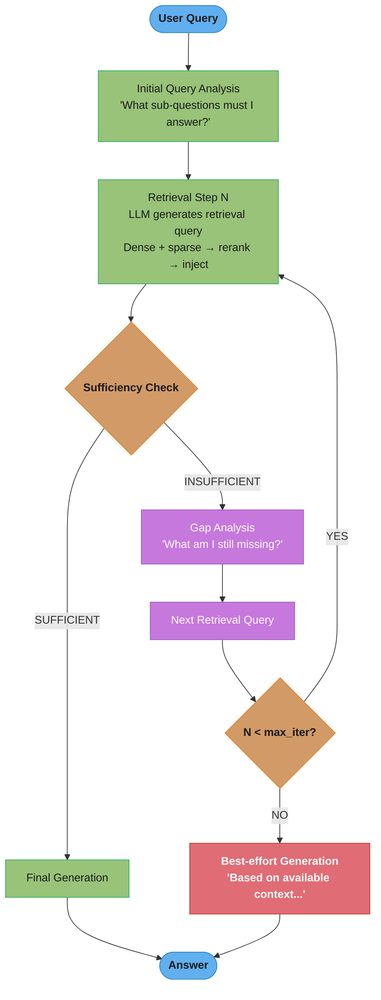
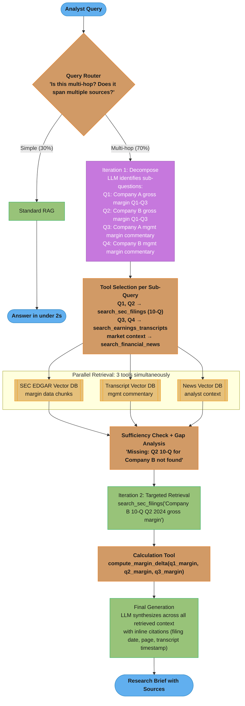

# Agentic RAG

## 1. Concept Overview

Agentic RAG (also called iterative or self-reflective RAG) replaces the single retrieve-then-generate step with a loop in which the LLM actively decides what to retrieve, evaluates whether it has sufficient information, and continues retrieving until it can answer confidently. The LLM acts as an agent directing the retrieval process rather than a passive consumer of a single retrieval result.

This approach handles queries that are fundamentally multi-hop: "Compare the revenue of companies A and B," "What did the CEO of the company that acquired X say about the acquisition?" — questions where no single chunk contains the answer and where the next retrieval step depends on what was found in the previous one.

---

## Intuition

> **One-line analogy**: Agentic RAG is like a research analyst who reads one report, identifies what's still missing, pulls the next relevant source, and repeats until they have enough to write the brief.

**Mental model**: Standard RAG fires one retrieval query and generates. It has no way to notice that the retrieved context is incomplete or irrelevant. Agentic RAG adds a reflection step after each retrieval: the LLM evaluates what it found, identifies gaps, and generates the next retrieval query targeting those gaps. This loop continues until the LLM judges it has enough information or a maximum iteration count is reached.

**Why it matters**: Multi-hop questions are common in enterprise settings (analyst research, legal discovery, competitive intelligence) and standard RAG answers them poorly. Agentic RAG is the primary technique for achieving high accuracy on these queries at the cost of higher latency (5-30×) and complexity.

**Key insight**: The LLM already has the capability to reason about what it knows and what it's missing — agentic RAG simply creates a control structure that exploits this capability for retrieval direction.

---

## 2. Core Principles

- **Retrieval is an action, not a lookup**: The LLM treats retrieval as a tool call it can invoke at any time with any query, rather than a fixed first step.
- **Sufficiency evaluation is separate from generation**: Before generating a final answer, the LLM explicitly evaluates whether the retrieved context is sufficient to answer correctly.
- **Gap analysis drives next retrieval**: When context is insufficient, the LLM identifies specifically what's missing, not just "more information needed."
- **Bounded iteration prevents loops**: Always set a maximum iteration count (typically 3-5). Without bounds, agentic loops can run indefinitely or cycle.
- **Latency is the fundamental tradeoff**: Each iteration adds one retrieval + one LLM call. At 3 iterations, agentic RAG costs 5-10× standard RAG latency.

---

## 3. How It Works — Detailed Mechanics

### 3.1 Basic Agentic Loop

```
Step 1: Query analysis
  LLM: "What sub-questions do I need to answer to address this query?"

Step 2: First retrieval
  LLM generates retrieval query → retrieve → inject into context

Step 3: Sufficiency check
  LLM: "Do I have enough information to answer the original query?"
    YES → generate final answer → done
    NO  → go to Step 4

Step 4: Gap analysis
  LLM: "What specific information am I still missing?"

Step 5: Next retrieval query generation
  LLM generates targeted query for the missing information

Step 6: Retrieve → inject additional context → go to Step 3
  (repeat until sufficient or max_iterations reached)

Step 7 (fallback): If max_iterations reached, generate best-effort answer
  with explicit acknowledgment of missing information
```

### 3.2 LangGraph Implementation Pattern

The loop below is a minimal [LangGraph](../agentic_frameworks/langgraph.md) state machine: a retrieve node and a sufficiency-check node connected by a conditional edge that either loops back for another retrieval or exits to generation.

```python
from langgraph.graph import StateGraph, END
from typing import TypedDict, List

class AgentState(TypedDict):
    query: str
    context: List[str]
    iteration: int
    max_iterations: int
    is_sufficient: bool
    final_answer: str

def retrieve(state: AgentState) -> AgentState:
    # LLM generates retrieval query based on current context and gaps
    retrieval_query = llm.generate(
        f"Given what you know so far: {state['context']}\n"
        f"Generate a search query to find missing information for: {state['query']}"
    )
    new_docs = retriever.retrieve(retrieval_query, top_k=5)
    return {**state, "context": state["context"] + new_docs,
            "iteration": state["iteration"] + 1}

def check_sufficiency(state: AgentState) -> AgentState:
    result = llm.generate(
        f"Context: {state['context']}\n"
        f"Question: {state['query']}\n"
        f"Do you have enough information to answer fully? Reply YES or NO."
    )
    return {**state, "is_sufficient": result.strip().upper() == "YES"}

def should_continue(state: AgentState) -> str:
    if state["is_sufficient"]:
        return "generate"
    if state["iteration"] >= state["max_iterations"]:
        return "generate"  # fallback
    return "retrieve"

graph = StateGraph(AgentState)
graph.add_node("retrieve", retrieve)
graph.add_node("check_sufficiency", check_sufficiency)
graph.add_node("generate", generate_answer)
graph.add_edge("retrieve", "check_sufficiency")
graph.add_conditional_edges("check_sufficiency", should_continue)
graph.set_entry_point("retrieve")
graph.add_edge("generate", END)
```

**What it means.** `max_iterations` is not one budget, it is three, and they grow at different rates. Each pass costs 2 LLM calls plus 1 retrieval, so **call count is `2i + 1`** — linear. Context grows by `top_k x chunk_size` per pass — also linear. But every sufficiency check re-reads the *whole* accumulated context, so **tokens billed grow as `Σ` — quadratic in `i`**. That third one is the budget that surprises people.

| Symbol | What it is |
|--------|------------|
| `i` | Iterations actually executed; capped by `max_iterations`, 3-5 in production |
| `2i + 1` | LLM calls: one query generation + one sufficiency check per pass, plus the final generation |
| `top_k x chunk_size` | Context added per iteration — 5 docs x 500 tokens = 2500 here |
| `2500 x i` | Context size entering the final generation |
| `2500 x i(i+1)/2` | Cumulative tokens *read* across all sufficiency checks — the quadratic term |
| per-iteration latency | ~3 s in Pitfall 5's accounting (query gen + retrieval + check) |

**Walk the three budgets.**

```
  i     LLM calls   context at end   cumulative tokens read   latency @3s/iter
  ----------------------------------------------------------------------------
   1      3            2,500                2,500                 3 s
   2      5            5,000                7,500                 6 s
   3      7            7,500               15,000                 9 s
   5     11           12,500               37,500                15 s
  10     21           25,000              137,500                30 s

  standard RAG for comparison: 1 LLM call, 1 retrieval, ~1.5 s

  latency multiple vs standard: i = 3 -> 9/1.5  =  6x
                                i = 5 -> 15/1.5 = 10x   <- the "5-10x" in Section 1

  doubling i from 5 to 10 doubles the calls (11 -> 21) but multiplies tokens
  read by 137,500 / 37,500 = 3.67x. Cost does not scale with iterations; it
  scales with iterations squared.
```

**Why the quadratic term exists.** The sufficiency check must see everything gathered so far or it cannot judge sufficiency — so iteration 5 re-reads what iterations 1-4 already paid to read. That is exactly what Section 10's context-compression strategies attack: summarizing the accumulated context after each pass replaces the growing `2500 x i` prefix with a flat few-hundred-token digest, collapsing the sum back toward linear.

**Walk the context-window risk.** Pitfall 2 warns that iteration 3 can exhaust a 128K window. Whether that happens is entirely a function of `top_k x chunk_size`:

```
  small chunks : 5 docs  x   500 tok =  2,500/iter -> i=5 reaches  12,500 tok  (10% of 128K)
  large chunks : 10 docs x 2,000 tok = 20,000/iter -> i=5 reaches 100,000 tok  (78% of 128K)

  Same max_iterations, same loop, 8x difference in exposure. The iteration
  cap is a poor context guard; a token-budget guard is the real control.
```

**Walk the cost control.** At GPT-4o-mini input pricing (`$0.15` per 1M tokens), the sufficiency checks alone for a 5-iteration query read 37,500 tokens = `$0.0056`. Section 10's routing advice — send only 20-30% of traffic down the agentic path — is what makes that affordable:

```
  always agentic        : $0.00562 per query
  25% agentic / 75% std : 0.25 x $0.00562 + 0.75 x $0.00038 = $0.00169 per query

  a 3.3x reduction, achieved by a classifier and no change to the loop itself
```

### 3.3 FLARE (Forward-Looking Active REtrieval)

FLARE takes a different approach: instead of pre-emptive retrieval, it retrieves mid-generation when the LLM is about to generate uncertain tokens.

```
LLM is generating response token-by-token

Normal generation:
  "The GDP of Brazil in Q2 2023 was [next token]..."
  If token probability is high → generate normally
  If token probability is LOW → LLM is uncertain → trigger retrieval

FLARE mechanism:
  1. Generate predicted next sentence (low confidence)
  2. Use predicted sentence as retrieval query
  3. Retrieve → prepend to context
  4. Regenerate from the low-confidence point with new context

Unlike pre-retrieval RAG, FLARE retrieves precisely when and for what the model needs.
Limitation: requires token-level probability access; not compatible with API-only LLMs.
```

### 3.4 Tool-Calling Agentic RAG

Modern LLMs with function calling support agentic RAG natively:

```python
tools = [
    {
        "name": "search_knowledge_base",
        "description": "Search the internal knowledge base for relevant documents",
        "parameters": {
            "query": {"type": "string", "description": "Search query"},
            "filter_by_date": {"type": "string", "description": "Optional date filter YYYY-MM"}
        }
    },
    {
        "name": "search_web",
        "description": "Search the web for recent information",
        "parameters": {"query": {"type": "string"}}
    }
]

# LLM calls tools as needed; system handles execution
response = llm.generate_with_tools(
    messages=[{"role": "user", "content": user_query}],
    tools=tools,
    max_tool_calls=5  # safety bound
)
```

Tool-calling agentic RAG is cleaner than orchestrated loops: the LLM decides when to retrieve, what to retrieve, and from which source (knowledge base vs. web).

---

## 4. Architecture Diagram

### Agentic RAG Control Flow


### FLARE Mid-Generation Retrieval
```
Context: [initial retrieved docs]

LLM generates:
  "In Q2 2023, Brazil's economy grew by [LOW CONFIDENCE PREDICTION: 3.2%]"
                                              |
                                              v
                                    [FLARE triggers retrieval]
                                    Query: "Brazil GDP growth Q2 2023"
                                              |
                                              v
                                    [Retrieved: "Brazil GDP grew 1.9% in Q2 2023"]
                                              |
                                              v
                                    [Regenerate with correct context]
  "In Q2 2023, Brazil's economy grew by 1.9%..."
```

---

## 5. Real-World Examples

### Perplexity Deep Research
- 5-20 web searches per query, each building on previous findings
- Sub-questions generated at each step based on what's found
- LLM synthesizes with inline citations from all searches
- Average latency: 15-30 seconds per complex research query

### OpenAI Deep Research (o3-based)
- Iterative web browsing and search with o3 reasoning model
- Can run for minutes to hours on complex research tasks
- Uses browse tool + search tool iteratively; up to 100+ web visits per query
- Explicitly designed for professional research workflows

### LlamaIndex Agentic RAG
- `SubQuestionQueryEngine`: decomposes complex questions, routes sub-questions to different indices
- `ReActAgent` with retrieval tools: LLM uses react loop to decide when to retrieve
- `LLMCompiler`: parallel sub-question execution for independent sub-queries

---

## 6. Tradeoffs

| Aspect | Standard RAG | Agentic RAG (3 iterations) |
|--------|-------------|---------------------------|
| Latency | 500ms-1s | 3-15 seconds |
| Cost | 1× | 5-10× |
| Accuracy on multi-hop | 40-60% | 80-95% |
| Accuracy on simple Q&A | 85-90% | 85-90% (no gain) |
| Complexity | Low | High |
| Loop risk | None | Requires max_iter guard |
| Observability | Easy | Hard (trace all iterations) |

---

## 7. When to Use / When NOT to Use

### Use Agentic RAG When:
- Queries require chaining multiple facts ("Who is the CEO of the company that acquired X?")
- Required sub-questions can't be known upfront from the original query
- Initial retrieval often returns incomplete context for the user's needs
- Latency budget allows 5-30 seconds (research, async workflows)

### Use Standard RAG When:
- Queries are simple factual lookups
- Latency budget is under 2 seconds (conversational interfaces)
- Cost per query matters (agentic RAG is 5-10× more expensive)
- Query distribution doesn't include multi-hop questions

### Never Use Agentic RAG Without:
- A hard iteration limit (max_iterations = 3 to 5)
- Logging of all intermediate queries and context (debugging requires full trace)
- A fallback generation path when max iterations is reached
- An eval set to verify that agentic retrieval actually improves accuracy over standard RAG

---

## 8. Common Pitfalls

**1. Infinite loops without max_iterations**
An agentic loop that never achieves sufficiency will run indefinitely. The sufficiency check LLM call can itself fail or return inconsistent results.
Fix: Always set max_iterations (3-5 for production). Log iteration count as a metric; alert if max_iterations is frequently hit.

**2. Context accumulation without management**
Each iteration adds more context. By iteration 3, the context window may be exhausted (hitting 128K token limit).
Fix: Summarize or select the most relevant prior context before adding new retrieval results. Use a context manager that compresses older context.

**3. Sufficiency check is poorly calibrated**
If the sufficiency check LLM is too conservative ("I'm never certain enough"), the loop runs to max_iterations on every query. If too permissive, it stops early and misses critical information.
Fix: Evaluate sufficiency check accuracy on labeled (query, context, should_continue) examples. Use a structured output format (JSON with reasoning) rather than free text.

**4. Circular retrieval — same documents retrieved every iteration**
The LLM generates retrieval queries that keep finding the same documents. Context grows but no new information is added.
Fix: Track retrieved document IDs across iterations; exclude previously retrieved documents from subsequent searches, or explicitly prompt the LLM to "search for information not yet in your context."

```python
# BROKEN: each iteration searches blind — the same top-scoring docs return every time
docs = retriever.retrieve(next_query, top_k=5)

# FIXED: exclude already-seen document IDs at the vector DB level, stop when no new docs
docs = retriever.retrieve(next_query, top_k=5,
                          filter={"id": {"$nin": list(seen_ids)}})
if not {d.id for d in docs} - seen_ids:
    break  # no new information — terminate instead of burning another iteration
seen_ids.update(d.id for d in docs)
```

**5. No timeout at the system level**
The agentic loop is bounded by max_iterations but each iteration can be slow. A 5-iteration loop with 3-second iterations = 15 seconds, which may exceed upstream timeout.
Fix: Set a wall-clock timeout at the system level independent of max_iterations.

**6. Agentic RAG on simple queries wastes latency**
Running agentic RAG on a simple factual query ("What is the capital of France?") adds unnecessary latency and cost with no quality gain.
Fix: Add a query classifier that routes simple queries to standard RAG and complex/multi-hop queries to agentic RAG.

---

## 9. Technologies & Tools

| Tool | Purpose | Notes |
|------|---------|-------|
| **LangGraph** | Stateful agentic loops | Best tool for production agentic RAG; explicit state management |
| **LlamaIndex Agents** | ReActAgent, SubQuestionQueryEngine | High-level abstractions; less control than LangGraph |
| **OpenAI function calling** | Tool-calling agentic RAG | Native LLM-directed retrieval; clean integration |
| **Anthropic tool use** | Tool-calling agentic RAG | Works with Claude models; structured tool definitions |
| **RAGAS** | Evaluate agentic RAG quality | Faithfulness, context recall across iterations |
| **Arize Phoenix** | Trace agentic loops | Critical for debugging multi-step retrieval |
| **LangSmith** | Trace + evaluate agentic runs | End-to-end tracing for LangGraph pipelines |

---

## 10. Interview Questions with Answers

**Q: When would you choose agentic RAG over standard RAG?**
A: Agentic RAG is worth the added complexity when queries are multi-hop — where the next retrieval step depends on what was found in the previous one. Examples: "Who is the CEO of the company that acquired X?" requires first finding which company acquired X, then finding that company's CEO. Standard RAG fires one query and can't chain these retrievals. The cost is 5-10× latency and significant debugging complexity. Start with standard RAG and measure accuracy on your query distribution first; only add agentic retrieval when standard RAG fails on multi-hop questions that matter to your users.

**Q: How do you prevent infinite loops in agentic RAG?**
A: Three layers of protection. First, a hard max_iterations limit (3-5 in production), enforced in the control flow logic — never rely solely on the LLM to self-terminate. Second, document ID tracking across iterations: exclude previously retrieved documents from subsequent searches so the loop doesn't retrieve the same content repeatedly without progress. Third, a wall-clock timeout at the system level independent of iteration count, ensuring the loop terminates within the user's latency budget regardless of individual step durations. Log iteration counts as a metric; alert when max_iterations is frequently reached — it indicates the sufficiency check is miscalibrated.

**Q: How does FLARE differ from standard agentic RAG?**
A: Standard agentic RAG retrieves at discrete checkpoints (before generation, or after deciding context is insufficient). FLARE retrieves mid-generation, triggered when the LLM encounters a low token-probability prediction — indicating a knowledge gap at that specific point in the text. FLARE is more precise: it retrieves exactly when and for what the model is uncertain. The limitation is that FLARE requires token-level probability access, which is unavailable through most commercial LLM APIs. It's practical with open-source models (LLaMA, Mistral) but not with OpenAI or Anthropic APIs.

**Q: How do you evaluate an agentic RAG system?**
A: Evaluate at three levels. (1) Per-iteration retrieval quality: does each iteration retrieve relevant documents? Use context precision and recall metrics on intermediate retrievals. (2) Final answer quality: faithfulness (answer supported by accumulated context?), answer relevance (addresses the question?). (3) Efficiency metrics: average iterations to success, fraction of queries hitting max_iterations, total latency per query. Build a labeled multi-hop eval set with expected intermediate sub-answers — this lets you evaluate whether intermediate retrievals are on-track, not just the final answer.

**Q: What is the sufficiency check and how do you design it well?**
A: The sufficiency check is an LLM evaluation that judges whether the accumulated context is enough to answer the original query. A poorly designed sufficiency check is the single most common failure mode: too conservative → always loops to max_iterations; too permissive → stops too early with incomplete answers. Best practices: (1) Use a structured output format (JSON: `{"sufficient": true/false, "missing": "..."}`); (2) Provide the original query and all accumulated context in the check prompt; (3) Evaluate check accuracy on labeled examples; (4) Consider using a weaker but faster model for the check to save latency.

**Q: How do you handle context accumulation across iterations without hitting the context window limit?**
A: Three strategies. First, compression: after each iteration, summarize the accumulated context using an LLM to extract key facts, reducing from full chunks to a compact knowledge summary. Second, selection: instead of accumulating all retrieved chunks, maintain a ranked list and keep only the top-K most relevant across all iterations. Third, hierarchical context: keep a compressed "knowledge so far" summary alongside the full most-recent-iteration context, providing both to the LLM for sufficiency checking and generation. For very long agentic loops (10+ iterations), streaming partial answers or using ultra-long context models (Gemini 2.0, Claude 3.5 with 200K tokens) is an option.

**Q: What makes an agentic RAG loop fail silently?**
A: Silent failures occur when the loop runs to completion and generates an answer that sounds confident but is based on insufficient context. Causes: (1) Sufficiency check is too permissive — LLM says "sufficient" when context is actually incomplete; (2) Final generation LLM doesn't acknowledge gaps — generates confidently from partial context; (3) No logging of intermediate queries — you can't tell post-hoc whether the loop made progress. Detection: measure final answer faithfulness against the accumulated context AND against ground truth — a gap between the two indicates the LLM generated beyond the retrieved context.

**Q: How should you route between standard RAG and agentic RAG?**
A: Use a query classifier to route before retrieval. Features that predict multi-hop queries: presence of comparative language ("which of X and Y"), referential chains ("the company that acquired X"), temporal sequences ("after X happened, what changed in Y"), and aggregation requirements ("how many of our clients..."). The classifier can be a simple LLM prompt ("Is this query multi-hop? YES/NO with reasoning") or a fine-tuned classifier on labeled query examples. Route 80% of simple queries to standard RAG (fast, cheap) and 20% complex multi-hop queries to agentic RAG.

**Q: How do you make agentic RAG observable in production?**
A: Observability requires tracing all iterations. Emit a structured trace event for each iteration containing: iteration number, generated retrieval query, retrieved document IDs and scores, sufficiency check result, gap analysis. Use a tracing tool (Arize Phoenix, LangSmith, or OpenTelemetry spans). The critical metrics to track: (1) average_iterations_per_query — should be 1.5-2.5; if it's consistently 5, something is wrong; (2) max_iterations_hit_rate — fraction of queries hitting the limit; (3) per-iteration latency breakdown. Without this observability, debugging failures in production is extremely difficult.

**Q: What is the relationship between agentic RAG and ReAct (Reasoning + Acting)?**
A: ReAct (see [ReAct and Reasoning Patterns](../agents_and_tool_use/react_and_reasoning_patterns.md)) is the general pattern underlying agentic RAG: Thought (reasoning about what to do next) → Action (tool call, including retrieval) → Observation (tool result) → repeat. Agentic RAG is a specific instantiation of ReAct where the primary action is retrieval and the primary reasoning is about information sufficiency. Modern LLMs with function calling implement ReAct natively: the LLM generates a "thought" (system reasoning), calls a "search" tool (action), receives the search results (observation), and decides whether to search again or generate a final answer. The key difference from pure ReAct is that agentic RAG focuses specifically on the retrieval-generation loop, not arbitrary tool use.

**Q: How do you prevent circular retrieval in iterative loops?**
A: Circular retrieval — where the loop keeps retrieving the same documents — is a common failure mode. Track retrieved document IDs in state across all iterations. Before each new retrieval, inject a constraint into the retrieval query prompt: "Search for information NOT already in your context. Avoid queries that would retrieve documents you've already seen." Optionally, filter out previously retrieved document IDs at the vector DB level (metadata filter: `{"id": {"$nin": seen_ids}}`). Also, if two consecutive iterations retrieve an identical set of document IDs, terminate the loop early — it's not making progress.

**Q: How do you control tool selection accuracy in agentic RAG when multiple retrieval sources are available?**
A: Tool selection accuracy — choosing the right source (internal knowledge base, web search, SQL database, external API) for each sub-query — is critical when multiple retrieval tools are available. Poor tool selection wastes iterations and degrades answer quality. Improve accuracy by: (1) writing precise tool descriptions with concrete examples of when to use each ("use knowledge_base for internal policy questions; use web_search for news and recent events"); (2) evaluating tool selection on a labeled test set of (query, expected_tool) pairs and measuring accuracy; (3) using a stronger model for the tool-selection step even if a smaller model handles generation. If tool selection accuracy is below 80%, consolidate tools to reduce decision complexity.

**Q: How do you control cost for iterative retrieval when each iteration adds LLM and retrieval calls?**
A: Cost control requires both architectural limits and monitoring. Set hard iteration caps (3 in production, 5 maximum). Use a cheap small model (GPT-4o-mini, Claude Haiku) for retrieval query generation and sufficiency checks; reserve the capable model only for final answer generation. Implement query-level budget tracking: if a query has consumed more than a configured token budget, force early termination with a best-effort answer. Route simple queries to standard RAG using an upfront classifier — agentic RAG should be triggered for fewer than 20-30% of all queries. Monitor average iterations per query in production; a creeping average above 2.5 signals the sufficiency check is miscalibrated.

**Q: How do you combine agentic RAG with traditional RAG as a fallback?**
A: A hybrid architecture uses standard RAG as the fast default and agentic RAG for queries that standard RAG fails on. The pattern: (1) run standard RAG first; (2) score the retrieved context relevance and the answer faithfulness; (3) if both scores exceed thresholds, return the standard RAG answer; (4) if either score is low, escalate to agentic RAG for the same query. This ensures agentic overhead is only incurred when necessary. An alternative is to route at query time using a classifier trained on (query_text → needs_agentic: bool) rather than routing based on retrieval quality post-hoc. The hybrid approach is more cost-efficient than always using agentic RAG.

**Q: How do you debug agentic RAG failures in production?**
A: Debugging agentic failures requires full execution traces. Each agentic run must log: (1) the original query and all generated sub-queries in order; (2) the documents retrieved and their scores at each iteration; (3) the sufficiency check result and reasoning at each iteration; (4) the final answer and which context supported it. Without these traces, post-hoc debugging is impossible. Common failure patterns to look for: circular retrieval (same document IDs across iterations), premature termination (sufficiency check said "yes" with incomplete context), infinite loop detection (max_iterations hit every time). Tool-level tracing with LangSmith or Arize Phoenix is non-negotiable for production agentic systems.

**Q: What metrics differentiate agentic RAG from single-shot RAG in evaluation?**
A: Beyond standard answer accuracy, track agentic-specific metrics. Iteration efficiency: average iterations to reach a correct answer (target 1.5-2.5; higher indicates sufficiency check problems). Multi-hop accuracy: accuracy on a held-out set of labeled multi-hop queries (the primary justification for agentic RAG). Unnecessary iteration rate: fraction of single-hop queries that trigger multiple iterations (should be near zero with a good query router). Context utilization: fraction of accumulated context actually cited in the final answer (low utilization means retrieval is noisy). Cost-per-correct-answer: total LLM token cost divided by number of correctly answered questions, compared between agentic and standard RAG to quantify the accuracy-cost tradeoff.

---

## 12. Best Practices

1. **Always set max_iterations** — never let the loop run unbounded; 3-5 iterations handles 95% of multi-hop queries.
2. **Log every iteration** — trace retrieval queries, document IDs, and sufficiency check results; debugging without this trace is impossible.
3. **Use a query router** — route simple queries to standard RAG; agentic overhead is not justified for single-hop questions (see [Query Transformation](query_transformation.md) for decomposition and routing techniques).
4. **Design sufficiency checks with structured output** — JSON `{"sufficient": bool, "missing": "what info is needed"}` is far more reliable than free-text YES/NO.
5. **Compress context across iterations** — don't blindly accumulate; summarize or select top-K relevant chunks to avoid hitting context limits.
6. **Track circular retrieval** — if the same document IDs appear in consecutive iterations, terminate early.
7. **Benchmark against standard RAG on your query distribution** — if your queries are 90% single-hop, agentic RAG adds cost with no quality gain.

---

## 13. Case Study: Agentic RAG for a Financial Research Assistant

**Problem Statement**: A financial data firm serves 500 buy-side analysts who research investment opportunities. Analysts ask multi-hop questions across three distinct sources: SEC EDGAR filings (10-K, 10-Q, 8-K), earnings call transcripts, and real-time financial news. A typical question is: "Compare the gross margin trajectory of Company A and Company B over the last 3 quarters, and identify what each management team cited as the primary driver of margin changes." Standard RAG answered only one part of these questions; analysts were spending 2+ hours per research brief manually cross-referencing sources.

**Architecture Overview**:


The router sends the simple 30% of queries down the fast standard-RAG path; multi-hop queries (70%) are decomposed into four sub-questions, routed to source-typed tools that retrieve from three vector DBs in parallel, with a second targeted iteration filling the gap the sufficiency check identified.

**Key Design Decisions**:
1. Parallel tool execution within each iteration — Q1/Q2 SEC queries and Q3/Q4 transcript queries run concurrently, reducing average iteration time from 8s to 3s.
2. Dedicated calculation tool — financial calculations (margin delta, CAGR) are offloaded to a Python executor rather than asking the LLM to compute, eliminating arithmetic errors.
3. Hard limit of 4 iterations — beyond 4 iterations, cost exceeds analyst time-value; the system reports what it found with explicit gaps rather than continuing.
4. Source-typed retrieval — each sub-question is matched to its appropriate source type (filings for numbers, transcripts for management commentary, news for market context), improving precision by 35% over single-source retrieval.
5. Citation threading — every fact in the final answer carries a citation tuple (source_type, document_id, page/timestamp) that the analyst can click to verify.

**Implementation**:
```python
tools = [
    {
        "name": "search_sec_filings",
        "description": "Search SEC EDGAR 10-K/10-Q/8-K filings for financial data, "
                       "metrics, and disclosures. Use for quantitative questions about "
                       "revenue, margins, cash flow, guidance.",
        "parameters": {"query": "str", "company_ticker": "str", "filing_type": "str",
                       "date_range": "str"}
    },
    {
        "name": "search_earnings_transcripts",
        "description": "Search earnings call transcripts for management commentary, "
                       "forward guidance, and analyst Q&A. Use for qualitative questions "
                       "about strategy, drivers, and management perspective.",
        "parameters": {"query": "str", "company_ticker": "str", "quarter": "str"}
    },
    {
        "name": "search_financial_news",
        "description": "Search recent financial news for market context, analyst reactions, "
                       "and industry developments. Use for news within the last 90 days.",
        "parameters": {"query": "str", "days_back": "int"}
    },
    {
        "name": "compute_financial_metrics",
        "description": "Execute financial calculations: margin delta, CAGR, YoY growth, ratios.",
        "parameters": {"operation": "str", "values": "list[float]", "periods": "list[str]"}
    }
]

# Agent state includes iteration count, accumulated context, and cited sources
state = AgentState(
    query=analyst_query,
    context=[],
    cited_sources=[],
    iteration=0,
    max_iterations=4
)
```

**Results**:

| Metric | Standard RAG | Agentic RAG |
|--------|-------------|-------------|
| Multi-hop question accuracy | 42% | 87% |
| Average answer latency | 1.2s | 11s |
| Analyst research time saved | baseline | 65 min/brief |
| Citation accuracy | 71% | 94% |
| Queries hitting max_iterations | N/A | 8% |
| Cost per research brief | $0.02 | $0.31 |

**Tradeoffs and Alternatives**:
- Latency (11s average) was acceptable because analysts expect research synthesis to take time; a real-time conversational interface would require a stricter iteration budget.
- The calculation tool was initially omitted, causing 12% of answers to contain arithmetic errors; adding it improved accuracy by 8 percentage points.
- Considered pre-computing all pairwise comparisons (Company A vs. B across all metrics) as a batch job; rejected because the query space was too large and analyst needs were too specific.
- The query router's 70/30 agentic/standard split was validated empirically; initial estimates were 50/50 but analyst queries proved more complex than anticipated.
