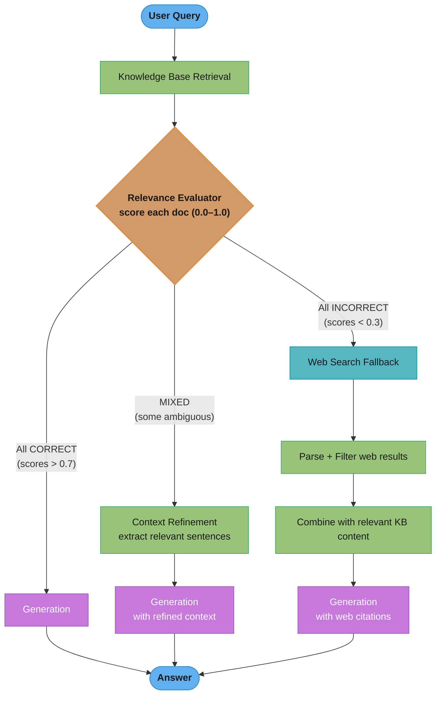

# Corrective RAG (CRAG)

## 1. Concept Overview

Corrective RAG (CRAG, Yan et al. 2024) introduces an automatic quality evaluation step between retrieval and generation. After standard retrieval, a lightweight relevance evaluator scores each retrieved document against the query. Based on these scores, CRAG decides one of three actions: proceed to generation (high-quality retrieval), refine the context (mixed quality), or trigger a web search fallback (all retrieved documents are irrelevant).

CRAG addresses a critical gap in standard RAG: the retrieval step is treated as infallible, but in practice retrieval often returns partially irrelevant or completely off-topic documents, especially for queries that span the knowledge base boundary. Using low-quality retrieved context as grounding actively degrades generation quality and increases hallucination rates.

---

## Intuition

> **One-line analogy**: CRAG is like a fact-checker who reviews sources before the journalist writes the story — if all sources are bad, they go find better ones before writing begins.

**Mental model**: Standard RAG retrieves top-K documents and feeds them to the LLM regardless of quality. A query about a recent acquisition might retrieve vaguely related documents about M&A in general. The LLM then generates an answer grounded in wrong context, producing a confident but incorrect response. CRAG intercepts at this point: evaluates each retrieved document's relevance, and if quality is too low, fires a web search to get fresh, relevant information before generation proceeds.

**Why it matters**: Knowledge base gaps are inevitable — the corpus doesn't contain everything, documents go stale, or the query is genuinely outside the indexed content. CRAG's web search fallback gracefully handles these gaps rather than generating hallucinations from irrelevant context.

**Key insight**: A fast, lightweight relevance evaluator (not the full generation LLM) can detect retrieval failures and trigger correction before they propagate to the generated answer.

---

## 2. Core Principles

- **Retrieval quality is variable**: Even good retrieval systems return low-quality results for out-of-distribution queries.
- **Quality evaluation should be fast and separate**: A lightweight relevance classifier is cheaper and faster than using the full generation LLM for this purpose.
- **Web search as the correction mechanism**: When the knowledge base is insufficient, the web provides a broader fallback that can answer most factual queries.
- **Context refinement, not context rejection**: For mixed-quality retrieval (some relevant, some not), refine by keeping the relevant parts rather than discarding all context.
- **Early correction prevents cascading errors**: A wrong retrieved document caught before generation is far less costly than hallucinated content caught after user sees it.

---

## 3. How It Works — Detailed Mechanics

### 3.1 Relevance Evaluation

```
Step 1: Standard retrieval
  Vector DB ANN search → top-K documents (typically K=5-10)

Step 2: Relevance scoring per document
  Relevance evaluator: cross-encoder or LLM-based classifier
  Input:  (query, document)
  Output: relevance score ∈ [0, 1]

  Thresholds (tunable):
    score > 0.7 → Correct (high confidence relevant)
    0.3 < score ≤ 0.7 → Ambiguous (partially relevant)
    score ≤ 0.3 → Incorrect (not relevant)

Step 3: Decision logic
  All documents Correct → proceed to generation with retrieved context
  Mix of Correct + Ambiguous → refine (keep Correct, refine Ambiguous)
  All documents Incorrect/Ambiguous → trigger web search
```

### Three-Bucket Relevance Thresholds

A single relevance score in [0, 1] is cut at 0.3 and 0.7 into three confidence bands, and
each band routes to a different action. This threshold logic is what makes CRAG "corrective"
rather than blindly trusting whatever the retriever returned.

```
   score:  0.0 ─────────────── 0.3 ─────────────── 0.7 ─────────────── 1.0
           │    INCORRECT       │    AMBIGUOUS       │     CORRECT        │
           │     (≤ 0.3)        │    (0.3–0.7]       │     (> 0.7)        │
           ▼                    ▼                    ▼
        web-search          refine: keep         use retrieved
        fallback            relevant sentences,  context as-is
                            strip the rest

   Calibration knob:
     raise 0.7  →  fewer docs trusted   →  more web search   (safer, slower, costlier)
     lower 0.3  →  fewer web calls       →  more raw trust    (cheaper, riskier)
```

The two cut points are the main tuning surface: they trade answer safety against latency and
web-search cost, and should be calibrated on a labeled eval set, not guessed.

### 3.2 Context Refinement

When documents are partially relevant (Ambiguous), CRAG refines them rather than discarding:

```
Ambiguous document handling:
  1. Extract the most relevant sentences/passages from the document
     Using extractive summarization: identify sentences with highest
     relevance score to the query
  2. Strip irrelevant surrounding content
  3. Use only the relevant excerpts as context

Implementation:
  Use the relevance evaluator on sentence-level chunks of the document
  Keep only sentences with score > threshold
  Combine selected sentences into refined context
```

### 3.3 Web Search Fallback

```
Trigger condition: all retrieved documents score below threshold
  OR no documents retrieved (empty knowledge base)

Web search:
  1. Generate web search query (may differ from original query)
     LLM reformulates for web search: "site:sec.gov Apple Q3 2024 10-Q"
     or add recency filter: "Apple earnings report 2024 Q3"

  2. Execute web search
     Google Search API, Bing Search API, Serper.dev, Tavily

  3. Parse web results
     Fetch top-3 URLs, extract text, clean HTML
     Respect robots.txt and rate limits

  4. Filter web results for relevance
     Apply same relevance evaluator to web results
     Keep only relevant web content

  5. Combine refined knowledge base content (if any) with web content
     Merge and dedup before generation
```

### 3.4 Full CRAG Pipeline

```python
def crag_pipeline(
    query: str,
    retriever,
    relevance_evaluator,
    web_searcher,
    llm,
    correct_threshold: float = 0.7,
    incorrect_threshold: float = 0.3
) -> str:

    # Step 1: Retrieve from knowledge base
    kb_docs = retriever.retrieve(query, top_k=5)

    # Step 2: Score each document
    scored_docs = []
    for doc in kb_docs:
        score = relevance_evaluator.score(query, doc.text)
        label = (
            "correct" if score > correct_threshold else
            "incorrect" if score < incorrect_threshold else
            "ambiguous"
        )
        scored_docs.append((doc, score, label))

    # Step 3: Decision
    any_correct = any(label == "correct" for _, _, label in scored_docs)
    all_incorrect = all(label == "incorrect" for _, _, label in scored_docs)

    context_parts = []

    if not all_incorrect:
        # Keep or refine knowledge base documents
        for doc, score, label in scored_docs:
            if label == "correct":
                context_parts.append(doc.text)
            elif label == "ambiguous":
                refined = refine_document(query, doc.text, relevance_evaluator)
                context_parts.append(refined)

    if all_incorrect or not any_correct:
        # Trigger web search
        web_query = generate_web_query(query, llm)
        web_results = web_searcher.search(web_query, num_results=3)
        for result in web_results:
            score = relevance_evaluator.score(query, result.content)
            if score > incorrect_threshold:
                context_parts.append(result.content)

    if not context_parts:
        return "I cannot find sufficient information to answer this question."

    # Step 4: Generate
    context = "\n\n".join(context_parts)
    return llm.generate(query, context=context)
```

---

## 4. Architecture Diagram

### CRAG Decision Flow


### CRAG vs. Standard RAG
```
Standard RAG:
  Query → Retrieve → [Always use context, even if bad] → Generate

CRAG:
  Query → Retrieve → [Evaluate quality] → {
    Good:   Generate directly
    Mixed:  Refine then Generate
    Bad:    Web Search → Generate with web results
  }
```

---

## 5. Real-World Examples

### CRAG with LangGraph (Community Implementation)
- Widely implemented as a LangGraph workflow: retrieval → grading node → conditional web search → generation
- Grading uses LLM (GPT-4o-mini) to classify documents as relevant or not
- Used in enterprise pipelines where knowledge base freshness is a concern

### Enterprise Knowledge Base with Time-Sensitive Queries
- Internal policy Q&A system: policies updated quarterly; users asking about recent changes
- CRAG detects when KB has stale/irrelevant policy documents
- Falls back to SharePoint or web search for recent policy updates
- Prevents confidently wrong answers about outdated policies

### Research Assistant Systems
- Academic research assistant: knowledge base of curated papers (updated monthly)
- User queries about recent papers (last 30 days) not yet in the index
- CRAG detects low relevance → triggers web search of arXiv/Semantic Scholar
- Returns answer citing recent papers not in the local index

---

## 6. Tradeoffs

| Dimension | Standard RAG | CRAG |
|-----------|-------------|------|
| Answer quality (good KB coverage) | High | High (same) |
| Answer quality (bad KB coverage) | Low (hallucinates) | High (web fallback) |
| Latency (good retrieval) | Fast | Fast + ~50ms evaluator |
| Latency (web fallback triggered) | N/A | +1-3 seconds (web fetch) |
| Web search cost | None | Variable (when triggered) |
| Implementation complexity | Low | Medium |
| External dependency | None | Web search API |
| Knowledge currency | Limited to index | Can be real-time (via web) |

---

## 7. When to Use / When NOT to Use

### Use CRAG When:
- Knowledge base has known gaps or coverage limitations
- Queries may span beyond indexed content (time-sensitive, niche topics)
- False confidence from irrelevant context is a high-risk failure mode
- Web search is available and acceptable as a data source

### Use Standard RAG When:
- Knowledge base is comprehensive and well-maintained
- Web search is not appropriate (privacy, air-gapped environments)
- Latency budget cannot accommodate web search fallback
- Query distribution is well within knowledge base coverage

### Do Not Use CRAG When:
- Web search is blocked by policy (regulated industries with strict data sources)
- All answers must come from curated, auditable sources
- The relevance evaluator itself is unreliable (miscalibrated thresholds degrade performance)

---

## 8. Common Pitfalls

**1. Miscalibrated relevance thresholds**
If the threshold is too high, most documents are labeled "incorrect," triggering web search unnecessarily. If too low, genuinely irrelevant documents pass as "correct," defeating the purpose.
Fix: Calibrate thresholds on a labeled (query, document, relevant: T/F) evaluation set. Measure precision and recall of the evaluator at different threshold values; choose the threshold that minimizes false negatives (missing good documents) while limiting false positives.

**2. Web search returns untrustworthy content**
A web search fallback may retrieve biased, inaccurate, or outdated web pages, which is worse than using marginally relevant KB content.
Fix: Filter web results by domain reputation; add source metadata to the LLM context ("Source: Wikipedia, Wikipedia.org, government websites preferred"); use a knowledge-graph-verified web search tool (Perplexity, Tavily with citation reliability scores).

**3. Infinite refinement loop**
Ambiguous documents sent through sentence-level refinement may produce near-empty context if no individual sentences score above the threshold.
Fix: Set a minimum refined context size; if the refined ambiguous document has fewer than 100 tokens, discard it rather than passing empty/trivial context.

**4. Evaluator adds significant latency for all queries**
Running a cross-encoder evaluator on 5-10 retrieved documents adds 50-200ms even when all documents are highly relevant.
Fix: Use a fast lightweight evaluator (bi-encoder similarity score, or small cross-encoder like cross-encoder/ms-marco-MiniLM-L-6-v2). Reserve expensive evaluators for the ambiguous range; use simple threshold on embedding similarity for clear-cut cases.

**5. Web search queries copied from user query**
A user query like "What does our internal policy say about remote work?" is a terrible web search query.
Fix: Use an LLM to reformulate the query for web search, removing internal/private references and adding context that would help a web search engine: "Remote work policy corporate best practices 2024" or "remote work policy employee guidelines."

**6. No source tracking through the pipeline**
After combining KB context with web content, the generation LLM produces an answer but there's no way to trace which source each statement came from.
Fix: Tag each context chunk with its source (KB document ID, URL for web results). Inject source metadata into the LLM prompt and instruct it to cite sources. Return citations alongside the answer.

---

## 9. Technologies & Tools

| Tool | Purpose | Notes |
|------|---------|-------|
| **LangGraph** | CRAG workflow implementation | Graph-based conditional routing between retrieval, evaluation, web search |
| **cross-encoder/ms-marco-MiniLM-L-6-v2** | Fast relevance evaluator | 6-layer MiniLM; fast, good for binary relevance; self-hosted |
| **Cohere Rerank API** | Managed relevance evaluator | Best managed option; returns relevance scores per document |
| **Tavily Search API** | Web search for RAG | RAG-optimized web search; returns clean text; respects content |
| **Serper.dev** | Google Search API wrapper | Low-cost Google search; needs HTML parsing layer |
| **Bing Web Search API** | Web search | Reliable; better enterprise terms than scraping |
| **RAGAS** | Evaluate CRAG quality | Context relevance, faithfulness for CRAG-specific evaluation |

---

## 10. Interview Questions with Answers

**Q: What problem does Corrective RAG solve that standard RAG doesn't handle?**
A: Corrective RAG solves the retrieval quality gap: standard RAG feeds all retrieved documents to the LLM regardless of relevance, treating retrieval as infallible. When queries fall outside the knowledge base coverage (recent events, niche topics, stale documents), the retriever returns marginally related documents. The LLM then generates a confident answer grounded in wrong context — a hallucination that's hard to detect because it appears well-cited. CRAG intercepts this by evaluating retrieved document relevance before generation. If quality is too low, CRAG triggers a web search fallback, ensuring the LLM always has relevant context before generating.

**Q: How does CRAG decide between using knowledge base results vs. triggering web search?**
A: CRAG uses a relevance evaluator (cross-encoder or LLM classifier) to score each retrieved document against the query. Based on scores: all documents above the threshold (e.g., 0.7) → proceed with KB results; mixed quality (some above, some below) → refine the ambiguous documents (extract only relevant sentences) and combine with high-quality ones; all documents below threshold → trigger web search. In practice, the thresholds must be calibrated on a labeled evaluation set — miscalibrated thresholds either over-trigger web search (adding latency) or under-trigger (failing to correct bad retrieval).

**Q: How do you calibrate the relevance evaluation thresholds in CRAG?**
A: Build a labeled evaluation set: 200-300 (query, document, label) triples where label ∈ {relevant, irrelevant} as judged by domain experts. Run the relevance evaluator on all triples and plot the precision-recall curve at different threshold values. Choose the threshold that maximizes F1 on this set, with a bias toward recall (prefer false positives — triggering web search unnecessarily — over false negatives — using irrelevant context). Validate: after deploying, monitor the web search trigger rate; if it's above 30%, the threshold may be too strict; if below 5% on a knowledge-base-limited corpus, the threshold may be too lenient.

**Q: What are the risks of using web search as a fallback in enterprise RAG?**
A: Three main risks. First, source reliability: web search returns content from unvetted sources; a web article may be biased, outdated, or simply wrong. Mitigate by filtering to trusted domains (gov, edu, Wikipedia, established news) and including source metadata in the LLM context. Second, data privacy: if the query contains sensitive business information, using it as a web search query leaks information. Mitigate by scrubbing queries before web search (remove identifiers, company names) or using a private search API. Third, compliance: regulated industries (healthcare, finance) may prohibit citing non-approved external sources. In these cases, CRAG's web fallback may be contractually prohibited; substitute with a secondary curated knowledge base or report inability to answer.

**Q: How does CRAG differ from Self-RAG in handling low-quality retrieval?**
A: CRAG and Self-RAG both address retrieval quality but at different levels and through different mechanisms. CRAG is an external pipeline: a separate relevance evaluator module assesses document quality before generation; the LLM itself is unmodified and can be any model. CRAG corrects retrieval quality before generation starts. Self-RAG is an intrinsic model capability: the model itself (fine-tuned with reflection tokens) evaluates passage relevance ([Relevant]/[Irrelevant]) and statement-level support ([Supported]/[No Support]) during generation. Self-RAG is more fine-grained (sentence-level) but requires fine-tuning; CRAG is coarser (document-level) but works with any LLM. They're complementary: CRAG handles pre-generation document quality; Self-RAG handles in-generation faithfulness.

**Q: How should you design the web search query reformulation in CRAG?**
A: The raw user query is often a poor web search query for three reasons: (1) it may contain private/internal context ("our Q3 product launch"); (2) it may be phrased as a conversational question rather than search terms; (3) it may lack the specificity needed for good web results. Reformulation process: use an LLM prompt to strip internal references, convert to search-engine-optimized keywords, add relevant domain/topic context, and optionally add recency filters ("2024"). Validate by running test queries and inspecting whether web results are on-topic. For time-sensitive queries, adding year or month helps enormously.

**Q: How do you evaluate CRAG-specific quality metrics?**
A: Evaluate at each pipeline stage. (1) Evaluator quality: precision and recall of the relevance evaluator on labeled (query, document, relevant) test triples — this is the core CRAG mechanism. (2) Trigger rate accuracy: for queries genuinely outside the KB, does CRAG trigger web search? For queries within KB coverage, does CRAG correctly use KB without web search? Measure on a labeled (query, should_use_web: T/F) test set. (3) End-to-end quality: compare standard RAG vs. CRAG on queries with known KB gaps using faithfulness and answer accuracy metrics. Track the reduction in hallucination rate on out-of-KB queries as the primary production metric.

**Q: What is the context refinement step in CRAG and when does it apply?**
A: Context refinement applies to "Ambiguous" documents — those with relevance scores between the correct and incorrect thresholds. Rather than discarding these documents (losing potentially useful information) or using them whole (adding noise), CRAG extracts the most relevant sentences from each. Implementation: apply the relevance evaluator at sentence granularity; keep only sentences above a minimum relevance threshold; discard the rest. The refined document contains only the relevant portions. This is especially effective for long documents where the relevant part is a single paragraph: the full document would dilute the LLM's attention, but the refined version focuses on the right content.

**Q: How do you handle the latency impact of CRAG in production?**
A: CRAG adds two potential latency sources: (1) relevance evaluation — 50-100ms for a fast cross-encoder on 5 documents; (2) web search fallback — 500ms-3s for web fetch and parsing. For the evaluator latency: use a fast lightweight evaluator (MiniLM-based cross-encoder runs in under 50ms on GPU); parallelize evaluation across all K retrieved documents. For web search latency: accept the tradeoff for queries that need it (users expect slower responses when searching the web); set a strict timeout (3s) and fall back to best available KB context if web search times out. Monitor web search trigger rate — if above 20-30%, consider expanding the knowledge base rather than over-relying on web search.

**Q: How would you combine CRAG with FLARE or agentic RAG?**
A: These can stack at different pipeline stages. CRAG operates pre-generation: evaluates and corrects retrieval quality before the LLM starts generating. FLARE operates mid-generation: triggers additional retrieval when the LLM is uncertain at a specific generation point. Combining them: use CRAG for the initial retrieval quality gate (correct the retrieval before generation begins), then use FLARE's mid-generation retrieval trigger for additional lookups needed during generation. With agentic RAG: CRAG can serve as the relevance evaluator within each iteration of the agentic loop — each retrieved document batch is scored, and low-quality batches trigger web search within the iteration.

**Q: What's the most common production failure mode in CRAG systems?**
A: The most common failure is the relevance evaluator being too conservative, triggering web search for queries that are actually within the knowledge base. This happens when the evaluator's threshold is set too high during development on a small, clean test set that doesn't represent the messier production query distribution. Symptoms: web search API costs spike; latency increases across the board; users get web-sourced answers for queries that the KB could answer accurately. Diagnosis: log (query, KB score, used_web_search) for all requests and manually review a sample of web-search-triggered queries — if >50% could have been answered from the KB, the threshold is too strict.

**Q: How do you train or select the relevance evaluator in CRAG?**
A: The relevance evaluator is the core component of CRAG; its quality determines the system's accuracy. You can use a pre-trained cross-encoder (cross-encoder/ms-marco-MiniLM-L-6-v2 is a strong default, trained on MSMARCO passage ranking) or fine-tune a bi-encoder or cross-encoder on domain-specific labeled pairs. To build training data: sample 500-1000 (query, document) pairs from your actual query logs and KB documents; have domain experts label each pair as relevant or irrelevant; fine-tune or calibrate the evaluator on this domain-specific data. A cross-encoder fine-tuned on your domain will outperform a general MSMARCO model if your corpus is specialized (medical, legal, financial). Test the evaluator in isolation before integrating it into the full CRAG pipeline.

**Q: What is the cost of the correction step in CRAG and when does it justify the overhead?**
A: The correction step adds two costs: (1) relevance evaluation — approximately 50-150ms for a cross-encoder on 5 documents, or 100-300ms if using an LLM classifier; (2) web search fallback — 500ms-3s when triggered. The overhead is justified when your knowledge base has significant coverage gaps and hallucinations from irrelevant context have real user-facing consequences. For a medical or financial Q&A system where a confidently wrong answer causes harm, the correction overhead is clearly justified. For a general FAQ bot with a comprehensive, well-maintained KB, the overhead adds latency for queries that would have been answered correctly anyway. Measure: compare standard RAG vs. CRAG on out-of-KB queries — if hallucination rate drops by more than 20%, the correction step earns its overhead.

**Q: How does CRAG compare to simple confidence thresholding on the retriever score?**
A: Simple confidence thresholding uses the vector similarity score from the retriever (e.g., cosine similarity > 0.7 = use; else fallback). CRAG uses a dedicated cross-encoder relevance evaluator, which is significantly more accurate. The retriever's similarity score measures semantic proximity in embedding space but is poorly calibrated for relevance — a document can have high embedding similarity to a query without actually answering it. A cross-encoder evaluates the (query, document) pair jointly, capturing fine-grained relevance that a bi-encoder similarity score misses. In practice, cross-encoder CRAG evaluators reduce false positives (irrelevant documents scoring as relevant) by 40-60% compared to simple similarity thresholding. The cost is the additional cross-encoder inference; the gain is a much more reliable quality gate.

**Q: How do you handle ambiguous relevance scores in CRAG?**
A: Documents scoring in the ambiguous range (e.g., 0.3 to 0.7) are genuinely uncertain — the evaluator cannot confidently classify them. Strategies: (1) sentence-level refinement (the CRAG paper's default): extract sentences from the ambiguous document and re-score each at sentence level; keep sentences above a threshold; this recovers the relevant portion while discarding noise. (2) Trigger web search alongside the ambiguous KB content: combine both sources and let the generation LLM resolve contradictions or complement the ambiguous KB passage with web context. (3) Raise the confidence threshold progressively: if the highest-scoring document is in the ambiguous range, treat it as "incorrect" and trigger web search. Log the distribution of relevance scores in production; if >50% of queries produce ambiguous scores, the evaluator needs domain-specific calibration.

**Q: How do you integrate CRAG into an existing RAG pipeline without a full rebuild?**
A: CRAG is designed as a drop-in quality gate between retrieval and generation. Minimal integration requires: (1) adding a relevance evaluator call after your existing retriever returns documents; (2) adding conditional logic that checks the evaluator's scores and either passes documents to generation (high quality) or triggers a web search fallback (low quality); (3) updating the generation prompt to include source metadata. The evaluator and web search fallback are new components, but the retriever, embedding model, and generation LLM remain unchanged. Incremental rollout strategy: start with monitoring mode (evaluate relevance scores and log would-have-triggered decisions without actually triggering web search); after 1-2 weeks of data, calibrate thresholds; then enable the actual correction behavior.

---

## 12. Best Practices

1. **Calibrate thresholds on representative data** — use a sample of actual production queries (not just the clean test set) to tune correct/incorrect thresholds.
2. **Use a fast evaluator** — MiniLM-based cross-encoder or bi-encoder similarity; cross-encoder/ms-marco-MiniLM-L-6-v2 balances speed and accuracy well.
3. **Reformulate before web search** — never use the raw user query as a web search query; strip private context and optimize for search engine effectiveness.
4. **Tag all context with source** — whether KB or web, every context chunk should carry source metadata for citation and tracing.
5. **Set web search timeouts** — hard timeout of 3 seconds; fall back to best available KB context to protect user experience.
6. **Monitor trigger rates** — track % of queries hitting each CRAG path (all-correct, mixed, all-incorrect); anomalies indicate evaluator or KB coverage issues.
7. **Expand the KB before increasing web search** — if web search trigger rate is consistently above 20%, it means the KB has coverage gaps that should be filled rather than perpetually patched with web search.

---

## 13. Case Study: CRAG for a Medical Q&A System

**Problem Statement**: A clinical decision support platform serves 1,200 physicians at a hospital network. Physicians ask clinical questions and expect answers grounded in current clinical guidelines, drug interaction databases, and recent trial data. The internal knowledge base contains 45,000 curated clinical guideline documents from USPSTF, ACC/AHA, and specialty societies, updated quarterly. However, 30-40% of physician queries involve recent guideline updates, off-label drug use, or rare conditions not well-represented in the quarterly-updated index. Standard RAG was generating confidently wrong answers for these out-of-KB queries — a patient safety risk.

**Architecture Overview**:
```
Physician Query
    |
    v
[Knowledge Base Retrieval]
  45,000 guideline documents (quarterly updated)
  Vector DB: Pinecone with text-embedding-3-large
  Top-K = 5 documents retrieved
    |
    v
[Relevance Evaluator]
  Cross-encoder fine-tuned on medical (query, document, label) pairs
  Model: cross-encoder/ms-marco-MiniLM-L-6-v2 fine-tuned on
         500 physician-labeled (query, guideline_chunk, relevant: T/F) pairs
  Scores each of 5 documents [0.0 - 1.0]
    |
    +-- All CORRECT (scores > 0.65)
    |   [Use KB context directly]
    |   → LLM Generation → Answer with guideline citations
    |
    +-- MIXED (some above 0.4, some below)
    |   [Sentence-level refinement]
    |   Extract relevant sentences from ambiguous documents
    |   → LLM Generation → Answer with refined context
    |
    +-- All INCORRECT (all scores < 0.4)
        [PubMed Search Fallback]
        Query reformulation: "Remove clinical context artifacts; add MeSH terms"
        PubMed API: search with clinical Boolean query
        Fetch top-3 abstracts + results sections
        Apply relevance evaluator to PubMed results
        Filter: keep only articles with score > 0.4
            |
        [Combine any relevant KB + PubMed content]
            |
        [LLM Generation]
        Answer with explicit source labeling:
        "Based on PubMed literature (not official guidelines): ..."
            |
        [Safety Disclaimer]
        If answer is from PubMed only: append mandatory disclaimer
        "This answer is based on research literature; consult current
         institutional guidelines before clinical application."
            |
        Physician-facing Answer with Source Attribution
```

**Key Design Decisions**:
1. Domain-specific fine-tuning of the relevance evaluator — a general MSMARCO cross-encoder had 61% precision on medical (query, document) pairs; after fine-tuning on 500 physician-labeled examples, precision improved to 84%.
2. PubMed rather than general web search — physicians require peer-reviewed sources; general web search (Google, Bing) returns patient-facing content and non-clinical sources; PubMed API constrains results to indexed clinical literature.
3. Mandatory safety disclaimers for PubMed-only answers — when answers come from research literature rather than approved guidelines, a mandatory disclaimer is appended; this satisfies both clinical governance and patient safety requirements.
4. Lower threshold for medical context (0.65 vs. 0.7 general) — physicians tolerate slightly lower precision to avoid excessive PubMed fallbacks; calibrated by reviewing 200 physician feedback instances.
5. Context refinement (sentence-level) for mixed cases — guidelines often have a relevant paragraph surrounded by irrelevant boilerplate; sentence-level refinement recovers 60-70% of the relevant content from ambiguous documents.

**Implementation**:
```python
from transformers import CrossEncoder

# Fine-tuned medical relevance evaluator
evaluator = CrossEncoder(
    "cross-encoder/ms-marco-MiniLM-L-6-v2",
    num_labels=1,
    max_length=512
)
# Fine-tuned on 500 physician-labeled (query, chunk, score) triples
# Thresholds calibrated on held-out 100-example validation set:
CORRECT_THRESHOLD = 0.65
INCORRECT_THRESHOLD = 0.35

def medical_crag(query: str) -> dict:
    # Step 1: Retrieve from internal guideline KB
    kb_docs = guideline_retriever.retrieve(query, top_k=5)

    # Step 2: Score relevance
    pairs = [(query, doc.text) for doc in kb_docs]
    scores = evaluator.predict(pairs)

    labeled = [
        (doc, score,
         "correct" if score > CORRECT_THRESHOLD else
         "incorrect" if score < INCORRECT_THRESHOLD else "ambiguous")
        for doc, score in zip(kb_docs, scores)
    ]

    context_parts, sources = [], []
    all_incorrect = all(label == "incorrect" for _, _, label in labeled)

    if not all_incorrect:
        for doc, score, label in labeled:
            if label == "correct":
                context_parts.append(doc.text)
                sources.append({"type": "guideline", "id": doc.id})
            elif label == "ambiguous":
                refined = sentence_level_refine(query, doc.text, evaluator, INCORRECT_THRESHOLD)
                if refined:
                    context_parts.append(refined)
                    sources.append({"type": "guideline_refined", "id": doc.id})

    pubmed_used = False
    if all_incorrect:
        pubmed_query = reformulate_for_pubmed(query)  # adds MeSH terms, clinical filters
        pubmed_results = pubmed_search(pubmed_query, max_results=3)
        for result in pubmed_results:
            score = evaluator.predict([(query, result.abstract)])[0]
            if score > INCORRECT_THRESHOLD:
                context_parts.append(result.abstract)
                sources.append({"type": "pubmed", "pmid": result.pmid})
                pubmed_used = True

    answer = generate_answer(query, context_parts, sources)
    if pubmed_used:
        answer["disclaimer"] = (
            "This response is based on PubMed research literature, not current "
            "institutional clinical guidelines. Verify with current guidelines before "
            "clinical application."
        )
    return answer
```

**Results**:

| Metric | Standard RAG | CRAG with PubMed Fallback |
|--------|-------------|--------------------------|
| Hallucination rate (out-of-KB queries) | 38% | 11% |
| Overall answer accuracy (physician-rated) | 71% | 89% |
| Web/PubMed fallback trigger rate | N/A | 22% of queries |
| Latency (KB path) | 0.9s | 1.1s (+200ms evaluator) |
| Latency (PubMed fallback) | N/A | 3.2s |
| Physician trust rating (1-5 scale) | 3.1 | 4.3 |

**Tradeoffs and Alternatives**:
- PubMed fallback adds 3.2s latency for 22% of queries; physicians accepted this because slow-but-accurate is preferable to fast-but-wrong in a clinical context.
- Considered UpToDate and DynaMed (premium clinical decision support databases) as the web fallback instead of raw PubMed; rejected due to API licensing cost at $80K/year; PubMed is free with sufficient quality.
- The sentence-level refinement step recovers useful content from 55% of ambiguous documents, saving PubMed API calls for 8% of queries that would otherwise have triggered the fallback.
- Threshold calibration required 3 rounds of adjustment over 6 weeks as production query distribution proved more diverse than the development test set.
