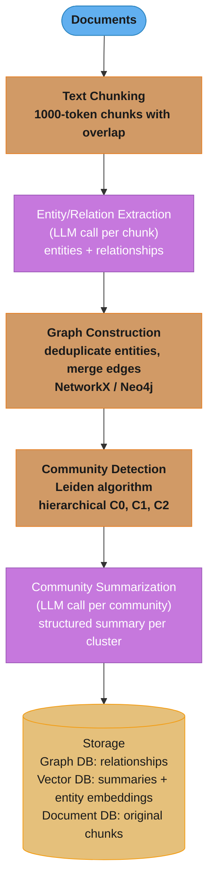
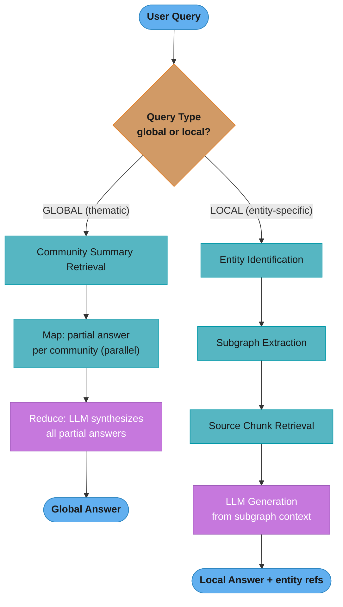

# Graph RAG

## 1. Concept Overview

Graph RAG (Microsoft, 2024) extends standard RAG by extracting a knowledge graph from documents — entities as nodes, relationships as edges — and using that graph structure for retrieval. Documents are not just indexed as text chunks; they are analyzed for their entities, relationships, and the communities those entities form.

The critical problem Graph RAG solves: standard RAG completely fails at "global" queries — "What are the major themes across all documents?" or "What relationships does Company X have with other entities?" These queries have no single-chunk answer; the answer requires synthesizing across the entire corpus. Graph RAG handles this by building community summaries during indexing that capture themes and relationships at multiple levels of granularity.

---

## Intuition

> **One-line analogy**: Graph RAG builds a Wikipedia-style knowledge graph from your documents, then answers questions by navigating that graph rather than matching text chunks.

**Mental model**: Standard vector search finds chunks semantically similar to your query. But "What is the overall sentiment about AI in our analyst reports?" has no matching chunk — the answer is distributed across thousands of documents. Graph RAG indexes your corpus as a knowledge graph, clusters entities into communities (e.g., "AI/LLM companies," "Regulatory bodies," "Research institutions"), generates LLM summaries for each community, and answers global queries by synthesizing from community summaries.

**Why it matters**: Global queries are the hardest class for standard RAG and the most valuable in enterprise settings — thematic analysis, trend discovery, competitive landscape understanding, cross-document relationship exploration.

**Key insight**: Building a knowledge graph is expensive at index time (entity extraction, graph construction, community summarization) but enables query types that are simply impossible with flat vector search.

---

## 2. Core Principles

- **Two-level indexing**: Entities and relationships are extracted at the document level; communities and summaries are built at the corpus level.
- **Global vs. local query distinction**: Global queries (thematic, corpus-wide) use community summaries; local queries (specific entities, relationships) use graph traversal + vector search.
- **Leiden clustering for community detection**: The Leiden algorithm produces hierarchical community structure with better quality than Louvain at large scale.
- **LLM-generated summaries, not rule-based**: Community summaries are generated by an LLM to capture the semantic meaning of the community, not just list entities.
- **Pre-computation is the price**: Index time is 10-100× standard RAG (LLM calls for entity extraction + community summarization); this cost is paid once and amortized across many queries.

---

## 3. How It Works — Detailed Mechanics

### 3.1 Indexing Phase

**Step 1: Entity and Relationship Extraction**
```
For each text chunk, LLM extracts:
  Entities: {name, type, description}
    "Microsoft" → {type: "Organization", description: "Technology company..."}
    "Satya Nadella" → {type: "Person", description: "CEO of Microsoft..."}

  Relationships: {source, target, relationship_type, weight, description}
    ("Satya Nadella", "Microsoft", "CEO_OF", weight=0.95, "...")
    ("Microsoft", "OpenAI", "INVESTED_IN", weight=0.9, "...")

Prompt:
  "Extract all named entities (people, organizations, concepts, locations)
   and relationships between them from the following text. For each entity
   provide type and description. For each relationship provide type and
   a one-sentence description. Return as JSON."
```

**Step 2: Graph Construction**
```
Merge entities across documents (same entity may appear in many chunks):
  Deduplication: "Microsoft Corp" = "Microsoft" = "MSFT"
  Entity merging: combine descriptions from all occurrences
  Edge aggregation: sum relationship weights across documents

Result: knowledge graph with:
  - Nodes: unique entities with merged descriptions
  - Edges: relationships with aggregated weights and source chunk references
```

**Step 3: Community Detection (Leiden Algorithm)**
```
Apply Leiden algorithm to detect communities in the graph:
  - Communities = groups of entities that are densely interconnected
  - Leiden produces hierarchical communities (communities of communities)
  - Better modularity quality than Louvain; scales to millions of nodes

Example community:
  "AI Infrastructure": OpenAI, Anthropic, Hugging Face, NVIDIA, AWS, Azure AI
  "AI Regulation": EU AI Act, FTC, US AI Safety Institute, EU Commission
  "Robotics": Boston Dynamics, Figure AI, Tesla Bot, NVIDIA Isaac
```

### Leiden Builds a Community Hierarchy

Leiden clusters the entity graph into communities, then clusters those communities again,
producing *levels*. Coarse levels (L2) capture corpus-wide themes; fine levels (L0) capture
specific local detail. A query's scope picks the level: a global "what are the themes?" reads
L2 summaries, while a local "how do X and Y relate?" drills into L0.

```
  L2 (broad themes, few)
   ├─ Artificial Intelligence
   │   ├─ L1: AI Infrastructure ──► L0: {OpenAI, Anthropic, NVIDIA, AWS, Azure AI}
   │   └─ L1: AI Regulation ──────► L0: {EU AI Act, FTC, US AI Safety Institute}
   └─ Robotics
       └─ L1: Embodied AI ────────► L0: {Boston Dynamics, Figure AI, Tesla Bot}

  resolution ↑  →  more, smaller communities   (drill toward L0, specific)
  resolution ↓  →  fewer, larger communities   (roll up toward L2, thematic)
```

The resolution parameter slides you up and down this tree. That single knob is why Graph RAG
can answer both pinpoint entity questions and sweeping corpus-level questions from one index.

**Step 4: Community Summarization**
```
For each detected community, LLM generates a structured summary:
  Input: list of entity descriptions + relationships within community
  Output: {
    "title": "AI Foundation Models Ecosystem",
    "summary": "This community represents the core players in the LLM
                 development space, including model developers (OpenAI,
                 Anthropic, Google DeepMind), infrastructure providers
                 (NVIDIA, AWS), and key partnerships...",
    "key_entities": ["OpenAI", "Anthropic", "Google DeepMind"],
    "key_relationships": ["Microsoft-OpenAI partnership", "Google-DeepMind acquisition"],
    "themes": ["Foundation model competition", "Safety research", "Enterprise deployment"]
  }
```

### 3.2 Query Phase

**Global Query (thematic/corpus-wide)**
```
Query: "What are the major AI safety concerns discussed across the documents?"

Step 1: Generate community answer
  For each relevant community summary, LLM generates a partial answer:
    Community "AI Safety": "The documents discuss alignment challenges,
                            RLHF limitations, and interpretability..."
    Community "AI Regulation": "Regulatory discussions focus on liability,
                                transparency requirements, and..."

Step 2: Map-reduce synthesis
  Map: generate partial answer for each community (parallelizable)
  Reduce: LLM synthesizes all partial answers into final comprehensive answer

Cost: O(N_communities) LLM calls; each is fast (short community summary)
```

**Local Query (specific entities/relationships)**
```
Query: "What is Microsoft's relationship with OpenAI?"

Step 1: Entity identification
  Identify "Microsoft" and "OpenAI" as key entities in the query

Step 2: Subgraph extraction
  Find all paths between Microsoft and OpenAI in the knowledge graph
  Extract: direct edge (INVESTED_IN), intermediate nodes (Sam Altman, Satya Nadella)

Step 3: Context assembly
  Combine: subgraph relationships + source text chunks for key edges

Step 4: LLM generation from specific context
  No community summaries needed; answer from subgraph context
```

### 3.3 Indexing Cost Estimation

```
For a corpus of 1M tokens (approximately 750 pages):
  Chunk size: 1000 tokens → ~1000 chunks
  Entity extraction: 1000 LLM calls × 1000 tokens each = 1M tokens processed
  Community summaries: depends on graph size; assume 100 communities × 2K tokens = 200K tokens

  At GPT-4o pricing ($5/1M input, $15/1M output):
    Entity extraction: 1M input → $5; outputs ~500K tokens → $7.50 = $12.50
    Community summaries: 100 × 2K input = 200K → $1; outputs 100 × 500 = 50K → $0.75 = $1.75
    Total indexing cost: ~$14-15 for 1M tokens

  For 100M tokens (full enterprise corpus):
    Indexing cost: ~$1400-1500 (one-time)
    Query cost: 20-50 LLM calls per global query vs. 1-2 for standard RAG
```

---

## 4. Architecture Diagram

### Graph RAG Indexing Pipeline


### Graph RAG Query Pipeline


---

## 5. Real-World Examples

### Microsoft GraphRAG Library
- Open-sourced at github.com/microsoft/graphrag
- Used in Microsoft Copilot for M365 document analysis
- Demonstrated dramatic improvement on corpus-wide queries in the original paper
- Index time: hours for large corpora; query time: 5-30 seconds for global queries

### Knowledge Graph RAG for Enterprise
- Financial services: extract company-executive-investment relationships from 10K filings
- Legal: extract case-precedent-statute relationships from legal corpus
- Research: extract paper-author-concept-citation networks from academic literature

### Neo4j + LLM Integration
- GraphRAG toolkit using Neo4j for graph storage and Cypher for subgraph extraction
- Entities stored as Neo4j nodes; relationships as edges with properties
- Cypher queries extract relevant subgraphs before LLM generation

---

## 6. Tradeoffs

| Dimension | Standard RAG | Graph RAG |
|-----------|-------------|-----------|
| Global query quality | Poor | Excellent |
| Local query quality | Good | Excellent |
| Simple Q&A quality | Excellent | Good |
| Index build time | Minutes | Hours |
| Index build cost | Low | High ($10-100/1M tokens) |
| Query latency | 200ms-1s | 5-30s (global) |
| Query cost | Low | High (N community LLM calls) |
| Update frequency | Easy (incremental) | Hard (graph rebuild needed) |
| Corpus size sweet spot | Any | >10K documents |
| Implementation complexity | Low | Very high |

---

## 7. When to Use / When NOT to Use

### Use Graph RAG When:
- Queries require synthesizing across many documents ("What are the major themes?")
- Entity relationship queries are common ("What companies did X acquire?")
- Corpus has rich entity structure (business, legal, scientific literature)
- Corpus is relatively stable (high update cost is acceptable)
- Query latency budget allows 5-30 seconds

### Use Standard RAG When:
- Queries are primarily factual lookups in specific documents
- Corpus changes frequently (hourly, daily)
- Budget or latency prohibit expensive indexing
- Corpus lacks rich entity structure (chat logs, informal notes)
- Team lacks capacity to manage graph infrastructure

### Do Not Use Graph RAG When:
- Queries are simple single-document lookups — Graph RAG adds cost with no benefit
- Corpus changes daily — the graph rebuild cost is prohibitive
- Team has no graph database experience — the operational complexity is high
- Corpus is under 1000 documents — community structure won't be meaningful

---

## 8. Common Pitfalls

**1. Graph indexing cost underestimated**
Entity extraction requires one LLM call per chunk. For 1M-token corpus at $5/M tokens: $10-15 for extraction alone. At 100M tokens: $1000-1500 per full reindex.
Fix: Estimate indexing cost before committing. For large corpora, use a smaller/cheaper model for entity extraction (GPT-4o-mini instead of GPT-4o) with acceptable quality tradeoff.

**2. Community granularity mismatch**
Leiden clustering with default parameters may produce communities too coarse (few large communities) or too fine (many small communities) for your use case.
Fix: Tune the Leiden resolution parameter. Evaluate community quality by inspecting 10-20 communities manually: are the entities within each community meaningfully related?

**3. Entity deduplication failure**
"Microsoft Corporation," "Microsoft Corp," "MSFT" are the same entity but may be treated as separate nodes.
Fix: Apply entity normalization before graph construction. Use a combination of string matching, embedding similarity, and LLM-assisted deduplication. Poor deduplication fragments the graph and degrades community detection.

**4. Applying global retrieval to local queries**
Routing a local query ("What is OpenAI's GPT-4o pricing?") to the global community summary path retrieves irrelevant thematic summaries.
Fix: Build a query router that classifies queries as global vs. local. Simple heuristics: presence of entity names → local; thematic/analytical language → global.

**5. No incremental indexing support**
Adding 1000 new documents requires rebuilding the entire graph and all community summaries.
Fix: Build an incremental indexing pipeline: extract entities/relations for new documents, merge into existing graph, rerun community detection on affected sub-graphs, regenerate affected community summaries only.

**6. Leiden algorithm on small graphs**
On corpora with fewer than 1000 entities, the Leiden algorithm may not produce meaningful communities.
Fix: For small corpora, skip Graph RAG entirely or use manual category hierarchies instead of algorithmic community detection.

---

## 9. Technologies & Tools

| Tool | Purpose | Notes |
|------|---------|-------|
| **Microsoft GraphRAG** | Full Graph RAG implementation | Open source; production-ready; includes Leiden, community summaries |
| **Neo4j** | Graph database for knowledge graph | Best for production graph storage; Cypher query language |
| **NetworkX** | In-memory graph processing | Good for prototyping; doesn't scale to millions of nodes |
| **LlamaIndex PropertyGraphIndex** | Graph RAG in LlamaIndex | Simpler integration; uses LlamaIndex retrievers |
| **LangChain Graph RAG** | Graph RAG in LangChain | Neo4j integration; Cypher generation |
| **spaCy / GLiNER** | Entity extraction | Faster (non-LLM) entity extraction for large corpora |
| **Leiden (leidenalg Python)** | Community detection | Official Python implementation |
| **Gephi** | Graph visualization | Inspect and debug knowledge graph structure |

---

## 10. Interview Questions with Answers

**Q: What is Graph RAG and what problem does it solve?**
A: Graph RAG builds a knowledge graph from documents with entities and relationships, clusters it into communities using the Leiden algorithm, and generates LLM summaries for each community. It solves the "global query" problem: standard vector RAG completely fails at questions like "What are the major themes across all documents?" or "What relationships does Company X have?" — these have no single-chunk answer. Graph RAG's community summaries capture themes and relationships across the entire corpus, enabling accurate answers to these synthesis queries. The tradeoff is expensive indexing (10-100× standard RAG) and high query latency (5-30 seconds for global queries).

**Q: What is the Leiden algorithm and why does Graph RAG use it?**
A: The Leiden algorithm is a community detection algorithm for graphs that partitions nodes (entities) into communities that maximize modularity — groups of nodes that are more densely connected to each other than to the rest of the graph. Graph RAG uses Leiden (rather than the older Louvain algorithm) because Leiden provably produces better-connected communities with no internally disconnected subsets, which matters for generating coherent community summaries. The algorithm is hierarchical: communities at level 0 are small and specific; level 2 communities are large and thematic. Graph RAG uses multiple levels to answer queries at different granularities.

**Q: How does Graph RAG handle global vs. local queries differently?**
A: Global queries (thematic, corpus-spanning): map LLM calls generate partial answers from each relevant community summary, then a reduce LLM call synthesizes into a final answer. This is map-reduce over community summaries. Local queries (specific entities/relationships): identify the relevant entities in the query, extract the subgraph connecting them from the knowledge graph, retrieve associated source chunks, and generate from that specific context — similar to standard RAG but graph-guided. The query router that classifies queries as global vs. local is critical; misrouting hurts significantly.

**Q: What are the main cost components of Graph RAG indexing?**
A: Three cost components: (1) Entity extraction — one LLM call per text chunk; for a 1M-token corpus with 1K-token chunks, that's ~1000 LLM calls. At GPT-4o pricing, approximately $12-15 for 1M tokens. (2) Community summarization — one LLM call per community; for 100 communities at 2K tokens each input, approximately $1-2 additional cost. (3) Embedding — embed all entity descriptions and community summaries for the vector retrieval path; minor cost compared to LLM extraction. Total indexing cost: roughly $14-15 per million tokens of source documents (one-time).

**Q: Why is entity deduplication critical in Graph RAG?**
A: Entity deduplication determines graph quality. If "Microsoft," "Microsoft Corp," and "MSFT" are treated as separate nodes, the graph fragments: connections are split across three nodes, community detection sees them as different entities, and community summaries are incoherent. Graph quality degrades proportionally with deduplication errors. Mitigation: combine string normalization (lowercase, remove punctuation), embedding similarity (cluster entities whose descriptions are semantically similar), and LLM-assisted resolution for ambiguous cases. The Microsoft GraphRAG library uses a two-phase approach: local deduplication within a document, then global deduplication across documents.

**Q: How would you implement incremental indexing for a frequently-updated corpus?**
A: Full graph rebuild is prohibitive for daily updates. Incremental approach: (1) Extract entities and relationships from new documents only and add them to the existing graph. (2) Identify affected graph neighborhoods: which communities contain entities from the new documents? (3) Re-run community detection only on the affected sub-graph (not the full graph). (4) Regenerate community summaries only for affected communities. The challenge is that new entities may reorganize existing communities, requiring broader re-summarization. For corpora updating more than daily, consider maintaining a separate "recent documents" standard RAG index that handles recency queries while Graph RAG handles the stable historical corpus.

**Q: What query types benefit most and least from Graph RAG?**
A: Most benefit: (1) Thematic queries ("What are the major regulatory themes in our legal corpus?"); (2) Relationship queries ("Who are the key connections between Company X and investors in our deal documents?"); (3) Trend queries ("How has the discussion of AI safety evolved across our research corpus?"). Least benefit / potential degradation: (1) Specific factual lookups ("What was OpenAI's revenue in Q3 2024?") — community summaries add noise, standard RAG is faster; (2) Very recent information — Graph RAG indexing may lag behind document updates; (3) Code documentation queries — entity-relationship structure doesn't map well to code concepts.

**Q: How does community resolution level selection affect query quality?**
A: The Leiden algorithm produces a hierarchy of community levels: level 0 (many small specific communities) to level N (few large thematic communities). Selecting the wrong level degrades query quality significantly. Fine-grained communities (level 0) produce detailed but narrow answers — good for specific entity relationships. Coarse communities (high level) produce broad thematic answers — good for corpus-wide synthesis but lose detail. The Microsoft GraphRAG paper recommends using community level 0 for local queries and higher levels (2-3) for global thematic queries. In practice: evaluate which level produces the best answers on your specific query distribution.

**Q: How do you evaluate Graph RAG quality?**
A: Evaluation requires separate metrics for global and local query quality. For global queries: compare community summary quality (are the summaries coherent, accurate, comprehensive?) using LLM-as-judge on held-out community assessment criteria. For local queries: standard RAG metrics — context recall, faithfulness, answer relevance. For end-to-end quality: build a labeled test set with global queries + expected answer themes (human-labeled), then use LLM-as-judge to assess coverage. The Microsoft GraphRAG paper uses a novel "Comprehensiveness," "Diversity," and "Empowerment" framework for global query evaluation.

**Q: What is the relationship between Graph RAG and knowledge graphs in traditional enterprise systems?**
A: Traditional enterprise knowledge graphs (Wikidata-style, ontology-driven) are built through human curation and rule-based extraction — high precision, low recall, expensive to maintain. Graph RAG's knowledge graph is LLM-built — high recall, moderate precision, automated. Traditional KGs are designed for structured queries (SPARQL); Graph RAG KGs are designed for LLM synthesis. The key advantage of Graph RAG is that it builds the knowledge graph automatically from unstructured documents without a human-curated ontology. The disadvantage is lower precision and harder to integrate with existing structured data systems. They complement each other: use existing enterprise KGs as additional context in Graph RAG where available.

**Q: How should you tune Leiden community resolution for your use case?**
A: Resolution is the key Leiden hyperparameter: higher resolution → more, smaller communities (granular); lower resolution → fewer, larger communities (thematic). Tuning process: (1) Run Leiden with 3-5 resolution values. (2) For each, inspect 20-30 communities: are entities within a community meaningfully related? (3) Test on 50 global queries with human-labeled answers: which resolution produces best coverage? (4) Choose the resolution that maximizes both coherence (entities in a community are related) and coverage (queries are answered comprehensively). Typically, the sweet spot for enterprise documents is resolution that produces 50-200 communities for a 10K-document corpus.

**Q: How does knowledge graph construction quality affect the end-to-end Graph RAG system, and how do you manage error propagation?**
A: Knowledge graph quality is the foundation of Graph RAG — entity extraction errors, missed relationships, and deduplication failures all propagate through to community detection, community summaries, and final answers. If entity extraction produces noisy or hallucinated relationships, Leiden clustering forms incoherent communities, and community summaries describe non-existent connections. Error propagation is multiplicative: 10% extraction error rate, combined with imperfect deduplication, can produce 30-40% unreliable community summaries. Mitigation: (1) validate entity extraction with a 100-sample manual review before full indexing; (2) track extraction confidence scores and re-extract low-confidence chunks with a stronger model; (3) implement graph consistency checks (entity appears in at least 2 documents, relationship has supporting evidence in source text); (4) allow humans to correct high-importance entities during an initial review phase.

**Q: How does community detection via Leiden algorithm work for global query summarization, and what granularity should you use?**
A: The Leiden algorithm partitions the knowledge graph into communities that maximize modularity — groups of entities more densely connected internally than externally. For global query summarization, Graph RAG generates an LLM summary for each community at multiple resolution levels (L0 = fine-grained, L2 = thematic). When a global query arrives, the map-reduce process generates partial answers from each relevant community summary (map step), then synthesizes them (reduce step). The resolution level determines answer granularity: L0 communities produce precise but narrow answers; L2 communities produce broad thematic coverage. Empirically, L1 or L2 performs best for most enterprise global queries — too fine-grained produces fragmented answers; too coarse loses important distinctions. Test 2-3 levels on your specific query distribution.

**Q: How do you scale Graph RAG to corpora with millions of entities?**
A: At millions of entities, several components break: in-memory NetworkX cannot hold the graph; naive Leiden runs out of memory; LLM community summarization creates thousands of calls. Scaling strategies: (1) Use Neo4j or a distributed graph DB instead of NetworkX — Neo4j scales to billions of nodes with efficient Cypher subgraph extraction. (2) Run Leiden in batches or use the hierarchical variant that processes subgraphs independently. (3) Parallelize community summarization — thousands of independent LLM calls, process with a high-throughput batch inference endpoint. (4) Use a smaller, cheaper model (GPT-4o-mini) for community summarization when the number of communities exceeds 1000. (5) Implement incremental indexing so that only new documents trigger graph updates, not full rebuilds. Microsoft GraphRAG's production infrastructure uses distributed entity extraction (Azure Batch) and staged community summarization pipelines to handle corpus sizes above 10M tokens.

**Q: How do you implement hybrid graph-plus-vector retrieval for queries that fall between purely local and purely global?**
A: Many queries are neither purely local (specific entity lookup) nor purely global (thematic synthesis) — they fall in between. Example: "What are the main risks facing our three largest portfolio companies?" This requires entity identification (which companies are the largest), subgraph extraction (their risk-related relationships), and some thematic synthesis across those entities. Hybrid retrieval: (1) identify named entities in the query and extract their subgraphs from the knowledge graph; (2) retrieve relevant community summaries that contain those entities; (3) run standard vector search for specific factual passages about those entities; (4) combine all three context sources (subgraph relationships, community themes, specific passages) in the LLM prompt. The reranker scores all candidates against the original query before passing to generation.

**Q: When does entity extraction quality make Graph RAG impractical to deploy?**
A: Graph RAG becomes impractical when entity extraction yields too much noise to produce coherent communities. Signals that extraction quality is too low: (1) more than 20% of extracted entities are hallucinated or incorrectly named (verified by manual sampling); (2) deduplication failure leaves 50+ variants of the same entity as separate nodes; (3) community detection produces communities where 40%+ of member entities are unrelated to each other; (4) community summaries read as incoherent or contradictory when reviewed manually. This typically occurs with informal, jargon-heavy, or domain-specific corpora where general-purpose entity extraction models fail. Mitigation options: fine-tune an entity extractor on domain-specific labeled data; use a domain ontology to constrain extraction to known entity types; fall back to standard RAG with a note that Graph RAG quality is insufficient for this corpus. Building Graph RAG on a poor-quality knowledge graph is worse than not using Graph RAG — incorrect relationship summaries mislead the LLM more than no graph context.

---

## 12. Best Practices

1. **Estimate indexing cost before committing** — calculate entity extraction LLM cost for your full corpus size; ensure it's within budget.
2. **Use cheaper models for entity extraction** — GPT-4o-mini or Haiku for entity extraction is 10-20× cheaper than GPT-4o with minimal quality loss.
3. **Build a query router** — classify queries as global vs. local before invoking Graph RAG; don't use global (community summary) path for specific factual lookups.
4. **Invest in entity deduplication** — graph quality is directly proportional to deduplication accuracy; test with 100 sampled entity pairs.
5. **Evaluate at multiple community levels** — test level 0, 1, 2 on your query distribution; different query types benefit from different levels.
6. **Plan for incremental updates** — design the indexing pipeline for incremental document addition from day one; full rebuild every update is unsustainable.
7. **Visualize the graph** — use Gephi or NetworkX visualization on a sample; manual inspection reveals deduplication failures, isolated nodes, and structural anomalies early.

---

## 13. Case Study: Graph RAG for Enterprise Knowledge Management at a Consulting Firm

**Problem Statement**: A global management consulting firm with 8,000 consultants has accumulated 50K+ client deliverables, research reports, and internal methodology documents over 12 years. These documents contain dense cross-references between industry trends, client organizations, regulatory frameworks, and strategic concepts. Consultants routinely ask multi-hop questions: "What engagement methodologies have we applied to digital transformation programs in financial services, and which led to measurable client outcomes?" Standard vector-only RAG returned fragmented chunks from individual documents — entity relationships were completely lost. A query about "relationships between our healthcare clients and regulatory compliance frameworks" returned scattered paragraphs with no synthesis across the corpus. The firm needed a system that could reason across documents, surface hidden entity connections, and answer thematic queries spanning thousands of deliverables.

**Architecture Overview**:

```mermaid
%%{init: {'flowchart': {'curve': 'basis', 'nodeSpacing': 45, 'rankSpacing': 55}}}%%
flowchart TD
    classDef io      fill:#61afef,stroke:#2e86c1,color:#1a1a1a,font-weight:bold
    classDef frozen  fill:#c678dd,stroke:#9b59b6,color:#fff
    classDef train   fill:#98c379,stroke:#27ae60,color:#1a1a1a
    classDef mathOp  fill:#d19a66,stroke:#e67e22,color:#1a1a1a,font-weight:bold
    classDef lossN   fill:#e06c75,stroke:#c0392b,color:#fff,font-weight:bold
    classDef req     fill:#56b6c2,stroke:#0097a7,color:#1a1a1a
    classDef base    fill:#e5c07b,stroke:#f39c12,color:#1a1a1a

    subgraph idx["Indexing Pipeline"]
        CDL(["Client deliverables (35K PDFs)"]) --> ING["Document Ingestion + OCR"]
        RRP(["Research reports (10K docs)"]) --> SAP["Section-aware parsing"]
        MLB(["Methodology library (5K docs)"]) --> SX["Structured extraction"]
        ING --> CHK["Chunking: 800 tokens, 200 overlap\n~120K total text chunks"]
        SAP --> CHK
        SX --> CHK
        CHK --> ERX2["Entity/Relation Extraction\nGPT-4o-mini for cost efficiency\nEntity types: Organization, Person, Industry, Framework,\nMethodology, Technology, Regulation, Outcome\nRelation types: APPLIED_TO, RESULTED_IN, REGULATED_BY,\nPARTNERED_WITH, COMPETED_WITH, ADOPTED\n~62K unique entities, 285K relationships"]
        ERX2 --> DEDUP["Entity Deduplication Pipeline\nPhase 1: string normalization\nPhase 2: embedding similarity (threshold 0.92)\nPhase 3: LLM-assisted resolution for ambiguous pairs (batch of 500)\nDedup reduced 62K → 41K unique entities"]
        DEDUP --> GCON["Graph Construction: Neo4j\nNodes: 41K entities with merged descriptions\nEdges: 285K relationships with source refs\nEdge weighting: co-occurrence frequency + recency bias (newer docs 1.5x)"]
        GCON --> LEI["Community Detection: Leiden\nResolution = 1.2 (tuned on 30-sample eval)\nLevel 0: 210 specific · Level 1: 55 thematic\nLevel 2: 14 industry/practice domains"]
        LEI --> CSUM2["Community Summarization: GPT-4o\n210 + 55 + 14 = 279 LLM summarization calls\nEach summary: ~500 tokens output"]
    end

    CSUM2 --> STOR[("Storage Layer\nNeo4j: entity/relation graph\nPinecone: community summaries + entity description embeddings\nS3: original chunks with metadata")]

    subgraph qt["Query Time"]
        RTR{"Hybrid Retrieval Router\nglobal vs. local vs. multi-hop"}
        RTR -->|"Global (thematic/cross-document)"| GP["Global Path\nRetrieve community summaries at L1/L2 level\nMap: partial answers per community (parallel)\nReduce: LLM synthesis"]
        RTR -->|"Multi-hop (entity chain traversal)"| MHP["Multi-hop Path\nEntity ID in query\nGraph traversal (2-3 hops) to find\nconnected entities + relationships\nAssemble path context"]
        RTR -->|"Local (specific entity/project)"| LPP["Local Path\nSubgraph extraction from Neo4j\n+ vector search for specific passages\nDirect LLM generation"]
        GP --> FANS(["Final Answer with entity references,\nsource doc IDs, and relationship provenance"])
        MHP --> FANS
        LPP --> FANS
    end

    STOR --> RTR

    class CDL,RRP,MLB,FANS io
    class ING,SAP,SX,CHK,DEDUP,GCON,LEI,RTR mathOp
    class ERX2,CSUM2 frozen
    class STOR base
    class GP,MHP,LPP req
```


The one-time indexing pipeline (120K chunks → 41K deduplicated entities → 279 community
summaries) feeds a single storage layer that serves all three query paths; the router's
global/local/multi-hop split is what lifted multi-hop accuracy from 31% to 71%.

**Key Design Decisions**:
1. Three-phase entity deduplication — raw extraction produced 62K entities with massive duplication ("Deloitte," "Deloitte Consulting," "Deloitte LLP" as separate nodes). String normalization caught 30% of duplicates; embedding similarity at 0.92 threshold caught another 25%; LLM-assisted resolution handled the remaining ambiguous 500 pairs. Without this pipeline, community detection produced incoherent clusters mixing duplicate entities across communities.
2. Recency-weighted edge scoring — client engagements from the last 3 years weighted 1.5x higher than older documents, ensuring community summaries reflect current methodologies and active client relationships rather than stale historical patterns.
3. Hybrid retrieval routing with multi-hop path — beyond simple global/local classification, a third "multi-hop" path handles entity-chain queries ("Which clients adopted frameworks recommended by our financial services practice?") by performing 2-3 hop graph traversals before assembling context.
4. GPT-4o-mini for entity extraction, GPT-4o for community summarization — extraction is high-volume (120K chunks) and tolerates moderate quality (91% accuracy at 10x cost savings); community summarization is low-volume (279 calls) and demands high quality for executive-facing answers.

**Implementation**:
```python
# Entity deduplication pipeline
def deduplicate_entities(entities: list[dict], embed_fn, llm) -> list[dict]:
    # Phase 1: String normalization
    normalized = {}
    for e in entities:
        key = normalize(e["name"])  # lowercase, remove suffixes (Inc, LLC, Corp)
        if key in normalized:
            normalized[key]["descriptions"].extend(e["descriptions"])
            normalized[key]["doc_refs"].extend(e["doc_refs"])
        else:
            normalized[key] = e

    # Phase 2: Embedding similarity
    embeddings = {k: embed_fn(v["name"] + " " + v["descriptions"][0])
                  for k, v in normalized.items()}
    merge_pairs = find_similar_pairs(embeddings, threshold=0.92)
    for a, b in merge_pairs:
        normalized[a] = merge_entity(normalized[a], normalized.pop(b))

    # Phase 3: LLM-assisted resolution for ambiguous pairs (0.85-0.92 similarity)
    ambiguous = find_similar_pairs(embeddings, threshold=0.85, upper=0.92)
    for batch in chunk_list(ambiguous, size=20):
        prompt = f"Are these entity pairs the same real-world entity? {batch}"
        decisions = llm.generate(prompt)  # returns list of {pair, same: bool}
        for d in decisions:
            if d["same"]:
                normalized[d["pair"][0]] = merge_entity(
                    normalized[d["pair"][0]], normalized.pop(d["pair"][1])
                )
    return list(normalized.values())

# Multi-hop graph traversal for entity chain queries
def multi_hop_retrieve(query: str, entities: list[str], neo4j, depth: int = 3):
    cypher = """
    MATCH path = (start)-[*1..{depth}]-(end)
    WHERE start.name IN $entities
    RETURN path,
           [r IN relationships(path) | r.description] AS rel_descriptions,
           [n IN nodes(path) | n.description] AS node_descriptions
    ORDER BY length(path)
    LIMIT 50
    """.format(depth=depth)

    paths = neo4j.run(cypher, entities=entities)

    # Assemble context from graph paths + source chunks
    context_parts = []
    for p in paths:
        path_summary = " -> ".join([
            f"{n} ({r})" for n, r in zip(p["node_descriptions"], p["rel_descriptions"])
        ])
        context_parts.append(path_summary)

    return "\n".join(context_parts)
```

**Results**:

| Metric | Vector-Only RAG | Graph RAG (Hybrid) |
|--------|----------------|-------------------|
| Multi-hop question accuracy | 31% | 71% (+40%) |
| Cross-document reasoning score | 2.1/5 | 4.3/5 (3x better) |
| Single-entity lookup accuracy | 82% | 85% |
| Thematic synthesis quality (LLM-judge) | 28% | 76% |
| Initial indexing cost | $240 | $2,800 |
| Indexing time (parallelized) | 3 hours | 38 hours |
| Global query latency (p50) | 1.1s | 14s |
| Local query latency (p50) | 0.7s | 1.8s |
| Consultant satisfaction (1-5) | 2.4 | 4.2 |

**Tradeoffs**: The 38-hour initial indexing required a weekend batch job parallelized across 16 workers; incremental updates for new deliverables process nightly and re-summarize only affected communities (typically 10-20 per batch). Entity deduplication was the highest-leverage quality investment — without it, community detection produced fragmented clusters where the same client appeared in 3-4 separate communities, and community summaries contradicted each other. The firm considered a manually curated ontology but rejected it because consulting terminology evolves rapidly and a static ontology would require constant human maintenance. Graph RAG's global query latency of 14 seconds was acceptable for research workflows but required a caching layer for frequently asked executive briefing questions. The $2,800 indexing cost is amortized across 8,000 consultants — $0.35 per user for a system that replaced 4-6 hours of manual cross-referencing per research request.
