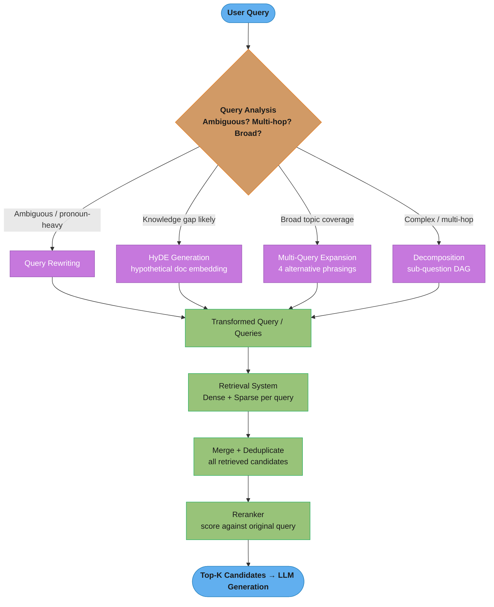
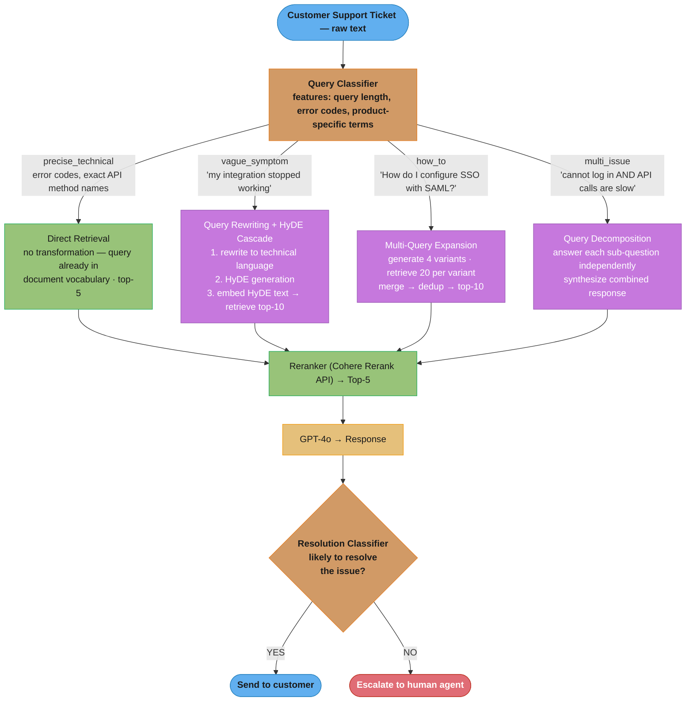

# Query Transformation

## 1. Concept Overview

Query transformation is a pre-retrieval technique that rewrites, expands, or decomposes the user's raw query into a form better suited for retrieval. Raw user queries are often ambiguous, terse, colloquial, or phrased differently from the documents that answer them. Transforming the query before sending it to the retrieval system bridges the vocabulary and intent gap.

Techniques include: query rewriting (make the query explicit and retrieval-friendly), HyDE (generate a hypothetical answer and embed that), multi-query expansion (generate alternative phrasings and merge results), and step-back prompting (retrieve general context alongside specific answers).

---

## Intuition

> **One-line analogy**: Query transformation is like a skilled reference librarian who rephrases your vague question into precise search terms before looking anything up.

**Mental model**: The gap between how users phrase questions and how documents are written is the root cause of retrieval failures. A user asks "What did they decide about the budget?" — but the document says "The executive team approved a $4.2M R&D allocation for Q4." No embedding model bridges this gap without query transformation.

**Why it matters**: Improving retrieval recall by 15-30% is often achievable through query transformation alone, with no changes to the document index or embedding model. It is the highest-leverage, lowest-cost improvement available in a RAG pipeline.

**Key insight**: The LLM already knows what a good answer looks like — HyDE exploits this by generating a hypothetical answer and embedding it, moving from "query space" into "document space" for retrieval.

---

## 2. Core Principles

- **Query-document vocabulary gap**: Users ask terse questions; documents contain declarative prose. Transformation closes this gap.
- **Multiple perspectives improve recall**: Different phrasings of the same question retrieve different documents. Merging results covers the space better.
- **Context enrichment**: Adding implicit context the user assumes ("they" → "the executive team") makes queries self-contained and retrieval-accurate.
- **Specificity vs. generality tradeoff**: Step-back prompting deliberately introduces generality to retrieve background context that narrow queries miss.
- **Cost vs. recall tradeoff**: Each transformation adds one or more LLM calls (latency + cost). Choose techniques based on measured recall improvement on your query distribution.

---

## 3. How It Works — Detailed Mechanics

### 3.1 Query Rewriting

An LLM rewrites the user's raw query to be more explicit, self-contained, and aligned with how documents phrase information.

```
System: "Rewrite the following user query to be more explicit and retrieval-friendly.
         Remove pronouns, add context, use formal language."

User query: "What did they decide about the budget last quarter?"

Rewritten: "What budget decisions were made by the executive team in Q4 2024
            regarding the company's annual operating plan?"
```

Implementation:
```python
def rewrite_query(raw_query: str, llm) -> str:
    prompt = f"""Rewrite this search query to be more explicit and retrievable.
    Remove ambiguous pronouns. Add domain context. Keep it a single sentence.

    Original query: {raw_query}
    Rewritten query:"""
    return llm.generate(prompt).strip()
```

When to use: when users ask follow-up questions with pronouns, when the domain has jargon, when query phrasing differs sharply from document language.

### 3.2 HyDE (Hypothetical Document Embeddings)

Instead of embedding the query and comparing to document embeddings, generate a hypothetical document that would answer the query, then embed that:

```
Step 1: Query → LLM → Hypothetical Answer
  Query: "What is the capital gains tax rate for long-term investments in 2024?"
  Hypothetical: "Long-term capital gains in 2024 are taxed at 0%, 15%, or 20%
                 depending on your taxable income bracket. For individuals earning
                 under $44,625, the rate is 0%..."

Step 2: Embed the hypothetical answer (not the original query)
Step 3: ANN search: find documents similar to the hypothetical answer

Why: The hypothetical answer is in "document space" — it resembles how a real
     document would discuss this topic, bridging the query-document gap.
```

HyDE pseudocode:
```python
def hyde_retrieve(query: str, llm, embed, vector_db, top_k: int = 10):
    # Generate hypothetical answer
    hypothetical = llm.generate(
        f"Write a detailed paragraph that would answer: {query}"
    )
    # Embed hypothetical (document-like text)
    hyp_embedding = embed(hypothetical)
    # Retrieve documents similar to hypothetical answer
    return vector_db.search(hyp_embedding, top_k=top_k)
```

Quality vs. risk: If the LLM's hypothetical answer is factually wrong, retrieval will find documents that match the wrong hypothesis. Always test HyDE vs. direct embedding on your eval set.

### 3.3 Multi-Query Expansion

Generate multiple alternative phrasings of the query, retrieve for each, merge and deduplicate:

```
Original: "How does React handle state updates?"

LLM generates 4 alternatives:
  1. "React useState hook and state management mechanisms"
  2. "How component re-renders are triggered in React"
  3. "React state batching and asynchronous updates"
  4. "setState behavior in React functional components"

Retrieve top-20 for each → merge → deduplicate → re-rank top-10
Result: 40-60% more recall than single-query retrieval
```

```python
def multi_query_retrieve(query: str, llm, retriever, n_queries: int = 4):
    prompt = f"""Generate {n_queries} different phrasings of this query.
    Return as a numbered list. Cover different angles and terminology.
    Query: {query}"""

    alternatives = llm.generate(prompt)
    all_queries = [query] + parse_list(alternatives)

    all_results = []
    seen_ids = set()
    for q in all_queries:
        for doc in retriever.retrieve(q, top_k=20):
            if doc.id not in seen_ids:
                all_results.append(doc)
                seen_ids.add(doc.id)

    return all_results  # rerank before returning
```

Deduplication is critical: the same document retrieved by multiple query variants should appear only once in the final candidate set.

### 3.4 Step-Back Prompting

Generate a more general "step-back" question to retrieve background context that helps answer the specific question:

```
Specific: "What was Brazil's GDP growth rate in Q2 2023?"
Step-back: "What are the main economic indicators used to measure Brazil's growth?"

Specific: "Why did the Lehman Brothers collapse?"
Step-back: "How did the 2008 subprime mortgage crisis develop?"

Retrieve both specific + step-back queries
Provide both specific facts + background context to the LLM
```

Step-back is particularly effective for:
- Technical questions requiring conceptual background
- Historical questions requiring causal context
- "Why" questions requiring understanding of mechanism

### 3.5 Query Decomposition

Break a complex multi-hop question into sub-questions, answer each independently, then synthesize:

```
Complex: "Which companies in our portfolio had revenue growth >20% AND
          decreased headcount in 2024?"

Decomposed:
  Q1: "Which portfolio companies had >20% revenue growth in 2024?"
  Q2: "Which portfolio companies decreased headcount in 2024?"
  Q3: (after answering Q1, Q2) "Intersection of Q1 and Q2 results"
```

### Decomposition Is a Dependency DAG

A multi-hop question becomes a small dependency graph of sub-questions. Independent legs
(Q1, Q2) retrieve in parallel; the dependent step (Q3) must wait for both before it can run;
a final step synthesizes. Seeing the DAG explains why decomposition is the seed of agentic
RAG — it is literally a plan of retrieval steps with data dependencies.

```
   "Which companies had >20% revenue growth AND decreased headcount in 2024?"
                              │ decompose
              ┌───────────────┴───────────────┐
              ▼                                ▼
     Q1: >20% revenue growth         Q2: headcount decreased      (independent →
         in 2024                         in 2024                    retrieve in parallel)
              └───────────────┬───────────────┘
                              ▼
     Q3: intersection(Q1, Q2)                                      (dependent → needs
                              │                                     Q1 and Q2 answers)
                              ▼
                  synthesize final answer
```

The join at Q3 is the part single-shot retrieval cannot do: no single embedding query
expresses "growth AND shrinking headcount," so the answer only exists after the two legs are
computed and intersected.

Decomposition is the foundation of agentic RAG (see [agentic_rag.md](agentic_rag.md)); when a decomposed leg retrieves low-quality evidence, corrective retrieval loops (see [corrective_rag.md](corrective_rag.md)) pick up from there.

---

## 4. Architecture Diagram

### Query Transformation Pipeline


### HyDE vs. Direct Embedding Space
```
Direct:    [User Query]      →  embed  →  query vector
                                            |
                                            | distance (can be far)
                                            |
           [Document chunk]  →  embed  →  doc vector

HyDE:      [User Query]  →  LLM  →  [Hypothetical Answer]
                                            |
                                            v
                                     embed  →  hyp vector
                                            |
                                            | distance (closer — same space)
                                            |
           [Document chunk]  →  embed  →  doc vector
```

---

## 5. Real-World Examples

### LlamaIndex Query Transformers
- `HyDEQueryTransform`: generates hypothetical document, embeds it for retrieval
- `DecomposeQueryTransform`: uses LLM to split complex queries into sub-questions
- `StepDecomposeQueryTransform`: step-by-step decomposition for multi-hop queries
- Production use: enterprise document Q&A pipelines with mixed-quality queries

### Perplexity Query Understanding
- Implicit query rewriting: expands user queries with inferred context before web search
- Multi-query for broad topics: fires 3-5 parallel searches for multi-faceted queries
- Measurably improves citation coverage for ambiguous queries

### RAG-Fusion (Arxiv 2023)
- Generates 4-6 query variations with an LLM
- Retrieves for each, applies Reciprocal Rank Fusion to merge rankings
- Demonstrated consistent 15-20% improvement in NDCG@10 over single-query RAG

---

## 6. Tradeoffs

| Technique | Recall Improvement | Added Latency | Added Cost | Failure Mode |
|-----------|-------------------|---------------|------------|--------------|
| Query rewriting | 10-20% | +200ms | Low (1 LLM call) | Over-transformation loses user intent |
| HyDE | 15-30% (topic-dependent) | +300ms | Low (1 LLM call) | Hallucinated hypothesis misleads retrieval |
| Multi-query (4x) | 30-50% | +400ms parallel | 4× retrieval cost | Excessive noise; dedup critical |
| Step-back | 10-25% | +300ms | Low | Too general; retrieves irrelevant background |
| Decomposition | 40-60% (complex queries) | +500ms-2s | High (N LLM calls) | Wrong decomposition misses key sub-questions |

---

## 7. When to Use / When NOT to Use

### Use Query Transformation When:
- Retrieval recall on your eval set is below 80%
- User queries are short and ambiguous (mobile search, conversational interfaces)
- Document vocabulary differs from user query vocabulary (medical, legal, technical)
- Queries span multiple topics or require multi-hop reasoning

### Prefer Direct Retrieval When:
- Queries are already well-formed and precise (developer API queries)
- Latency budget is under 200ms (transformation adds 200-500ms)
- Query volume is very high (cost of N LLM calls per query scales poorly)
- Eval shows transformation doesn't improve recall on your specific data

### Never Use HyDE When:
- Domain where LLM hallucinations are likely (rare facts, recent events, private data)
- The hypothetical answer diverges significantly from document style
- You haven't measured HyDE vs. direct embedding on a held-out eval set

---

## 8. Common Pitfalls

**1. Transforming away user intent**
Query rewriting that over-generalizes loses the user's actual intent. "What's the AWS Lambda cold start time?" rewritten to "What are the performance characteristics of serverless computing?" retrieves irrelevant documents.
Fix: Preserve specific numbers, proper nouns, and technical terms during rewriting.

**2. HyDE on factual queries with recent events**
LLM generates a hypothetical that contains wrong facts about recent events. Retrieval finds documents that match the wrong hypothesis.
Fix: Test HyDE recall vs. direct retrieval. If HyDE underperforms on factual queries, use direct retrieval for that query type.

**3. Multi-query without deduplication**
The same document retrieved 3x by different query variants ends up 3x in the candidate set, inflating its apparent relevance.
Fix: Always deduplicate by document ID before reranking.

**4. No reranking after multi-query merge**
Merging 4×20 = 80 candidates without reranking provides 80 documents to the LLM — too much noise, context window exceeded.
Fix: Always rerank the merged set; pass only top-5 to 10 to the LLM.

**5. Generating too many alternative queries**
10+ query variants retrieves 200+ candidates. Dedup and rerank become expensive; latency climbs.
Fix: 3-5 variants is the sweet spot; beyond 5 shows diminishing returns.

**6. Not caching transformed queries**
Popular queries get transformed on every request. Each transformation costs 200-300ms and an LLM call.
Fix: Cache (original_query → transformed_queries) with a short TTL (1-24 hours).

---

## 9. Technologies & Tools

| Tool | Purpose | Notes |
|------|---------|-------|
| **LlamaIndex** | Query transformation abstractions | HyDEQueryTransform, DecomposeQueryTransform, built-in |
| **LangChain** | Multi-query retriever | MultiQueryRetriever; generates N queries, merges results |
| **DSPy** | Automated query optimization | Learn optimal query transformations from examples |
| **Cohere** | Reranking post-expansion | Essential to reduce 80+ candidates to top-5 |
| **OpenAI GPT-4o-mini** | Cheap transformation LLM | ~$0.00015/1K tokens; use small model for rewrites |
| **RAGAS** | Evaluate transformation impact | Measure context recall before/after transformation |

---

## 10. Interview Questions with Answers

**Q: What is HyDE and when would you use it?**
A: HyDE (Hypothetical Document Embeddings) generates a hypothetical answer to the query using an LLM, then embeds that hypothetical answer for retrieval instead of the query itself. It works because the hypothetical answer is in "document space" — it resembles how a real document discusses the topic, bridging the vocabulary gap between terse queries and verbose documents. Best suited for domains where query phrasing differs strongly from document phrasing (academic papers, legal text, technical documentation). Avoid when the LLM is likely to generate factually incorrect hypotheses (recent events, proprietary data, rare facts), as a wrong hypothesis will steer retrieval toward unrelated documents.

**Q: What are the main failure modes of HyDE?**
A: Three primary failure modes. First, hallucinated hypotheses: if the LLM generates a factually wrong hypothetical answer, retrieval finds documents matching the wrong facts — the system confidently retrieves the wrong thing. Second, distributional mismatch: if the hypothetical answer is in a different style or register than the target documents (e.g., LLM writes in a casual tone but documents are formal legal text), the embedding space alignment breaks. Third, length mismatch: hypothetical answers that are much longer or shorter than typical document chunks sit in different regions of embedding space. Mitigation: always A/B test HyDE vs. direct retrieval on a labeled eval set before deploying.

**Q: How does multi-query expansion improve recall, and what are its tradeoffs?**
A: Multi-query expansion generates N alternative phrasings of the query (typically 3-5), retrieves candidates for each, then merges and deduplicates before reranking. It improves recall because different phrasings of the same question match different document phrasings — a document discussing "useState hook behavior" may not match "React state management" but does match "React useState hook." Empirically, 3-5 variants improve recall@10 by 30-50% for broad queries. Tradeoffs: N× retrieval cost, added LLM latency for generation, and the deduplication + reranking step becomes critical — without it you overwhelm the LLM with redundant context.

**Q: What is the difference between step-back prompting and query decomposition?**
A: Step-back prompting generates a more general version of the query to retrieve background context alongside the specific answer. It widens the retrieval scope. Query decomposition breaks a complex multi-hop question into specific sub-questions, each answered independently before synthesis. Step-back is additive (retrieve specific + general); decomposition is sequential (answer each sub-question in order). Use step-back for "why" questions needing background context; use decomposition for multi-hop questions like "who runs the company that acquired X?"

**Q: When should query rewriting not be used?**
A: Three scenarios. First, when queries are already precise and technical — developer API queries or structured filter queries don't benefit from rewriting and can lose precision. Second, when latency is critical (under 200ms) — each rewrite LLM call adds 150-300ms. Third, when the query rewrite model hallucinates context — if the rewriter adds incorrect assumed context ("the executive team" when the user meant a different group), retrieval silently goes wrong. Always validate rewriting with your specific LLM on your query distribution before deploying.

**Q: How do you measure whether query transformation is actually helping?**
A: Build a golden evaluation set: 100-200 (query, expected_documents) pairs where expected_documents are the ground truth relevant chunks. Measure context recall@K (fraction of expected documents in top-K retrieved) with and without transformation. Run this comparison for each technique (HyDE, multi-query, step-back) separately. A transformation should show >5% recall improvement to justify its latency/cost. If it doesn't improve recall on your eval set, it won't help in production — domain matters enormously for which techniques work.

**Q: How should you handle deduplication in multi-query expansion?**
A: Dedup by chunk/document ID before reranking. Keeping duplicates causes two problems: (1) the reranker sees the same document multiple times and may over-score it relative to other candidates; (2) the final context passed to the LLM contains repeated information, wasting context window tokens. Implementation: use a dict keyed by document ID, taking the first occurrence (from the most relevant query) or the highest retrieval score across all queries. After dedup, rerank the merged set against the original query using a cross-encoder.

**Q: What is RAG-Fusion and how does it combine multi-query with RRF?**
A: RAG-Fusion generates 4-6 query variations, retrieves top-K documents for each, then combines rankings using Reciprocal Rank Fusion (RRF): `score(doc) = Σ 1/(k + rank_i)` where k=60 and rank_i is the rank of the document in each individual retrieval result. Documents that appear in top positions across multiple query variants get boosted scores. Compared to simple merge-and-dedup, RRF uses position information (a document ranked #1 in 3 queries is better than one ranked #15 in 3 queries). Demonstrated 15-20% improvement in NDCG@10 over single-query RAG.

**Q: How do you choose which query transformation technique to use for a given application?**
A: Start by characterizing your query distribution. If queries are typically terse and ambiguous (conversational), rewriting helps most. If queries are domain-specific with vocabulary mismatch (medical, legal), HyDE bridges the gap. If queries are broad and multi-faceted, multi-query improves coverage. If queries are multi-hop (require chaining facts), decomposition is essential. In practice: run all techniques on your eval set and measure context recall improvement independently. Use the highest-gain technique, or combine (e.g., rewrite + multi-query) if the recall improvement justifies the latency.

**Q: How do query transformations interact with metadata filtering?**
A: Query transformations improve semantic similarity-based retrieval but don't affect metadata filters. A rewritten or HyDE query still needs the correct metadata filters applied (date range, source, department) to scope results. One consideration: multi-query expansion can generate queries with different implicit metadata scopes (one variant might reference "2023 data," another "2024 data"). Apply the original query's metadata filters to all variants — don't let LLM-generated variants override the user's intended scope.

**Q: What are the cost implications of query transformation at production scale?**
A: At 10,000 queries/day, each transformation adds one LLM call. With GPT-4o-mini at $0.00015/1K tokens and 500-token transformation prompts, rewriting costs ~$0.075/day per technique — negligible. At 1M queries/day, rewriting costs ~$7.50/day — still cheap. Multi-query at 4 variants costs 4× more ($30/day at 1M queries). The dominant cost at scale is usually the retrieval and reranking, not the transformation LLM call. Use a small fast model (gpt-4o-mini, claude-haiku) for transformations; save the capable model for final generation.

**Q: What are HyDE's specific failure modes and how do you detect them in production?**
A: HyDE fails in three distinct ways. First, the hallucinated hypothesis misleads retrieval: the LLM generates a confident but factually wrong hypothetical answer; retrieval finds documents matching the wrong hypothesis; the final answer cites plausible-sounding but incorrect sources. This is the most dangerous failure because it is silent — the system appears to work. Detection: on your eval set, compare HyDE recall against direct-embedding recall; any queries where HyDE recall is lower indicate hypothesis-driven misdirection. Second, distributional mismatch: the hypothetical answer's style or length differs significantly from corpus documents (e.g., conversational hypothesis vs. formal legal text), causing poor embedding alignment. Third, recency blindness: for recent events or rapidly changing data, the LLM's parametric knowledge generates an outdated hypothetical, steering retrieval to outdated documents. Mitigation for all three: classify queries by type (factual, conceptual, procedural, recent-event) and disable HyDE for types where it underperforms on your eval set.

**Q: How do you apply query decomposition to complex comparative questions with multiple conditions?**
A: Comparative questions like "Which of our products had both above-average margin AND declining customer satisfaction in Q3?" require decomposition into at least three sub-queries: (1) "What is average product margin?", (2) "Which products had above-average margin in Q3?", (3) "Which products had declining customer satisfaction in Q3?" — then an intersection step. The decomposition strategy is: identify the logical structure (AND, OR, greater-than, trend comparisons); generate one sub-query per condition; retrieve and answer each independently; then synthesize with the LLM by providing all sub-answers and asking for the final intersection or comparison. The decomposition LLM must produce executable sub-questions, not vague paraphrases. Validate decomposition quality by checking that answering all sub-questions in sequence is logically sufficient to answer the original question.

**Q: How do you measure the end-to-end impact of query transformation on RAG quality, accounting for both retrieval and generation?**
A: Measuring only retrieval recall misses generation-level impacts. A complete measurement protocol: (1) Retrieval recall@K: fraction of expected documents in top-K, with and without transformation — measures retrieval improvement. (2) Context precision: fraction of retrieved documents that are actually relevant — transformation should improve precision by filtering noise, but multi-query can hurt precision by adding tangential documents. (3) Answer accuracy: correctness of final answers on a labeled QA set — the ultimate measure; sometimes better retrieval recall doesn't improve answer accuracy if the LLM was already finding the key facts. (4) Faithfulness: does the answer cite the retrieved context accurately? — important if transformation changes what's retrieved. Run a statistical significance test (McNemar's test for accuracy, Wilcoxon for continuous metrics) on at least 200 labeled examples before claiming a transformation technique improves quality.

**Q: What is the cost-benefit analysis for adding query transformation (one extra LLM call per query) vs. improving the embedding model or retrieval system?**
A: Query transformation costs one small LLM call per query (~0.5-2 cents per 1000 queries with gpt-4o-mini) and typically improves recall by 15-30% for ambiguous queries. Embedding model improvements (switching from ada-002 to text-embedding-3-large) improve recall by 5-15% with zero per-query cost but a one-time re-indexing cost. Reranker addition improves precision by 20-30% with 50-100ms latency and 1-5 cents per 1000 queries. The cost-benefit hierarchy for most systems: (1) improve chunking strategy (zero cost, often 10-20% recall improvement); (2) add a reranker (low cost, high precision improvement); (3) upgrade embedding model (one-time re-indexing cost); (4) add query transformation (ongoing LLM call cost, justified for conversational or ambiguous query distributions). Query transformation is high-leverage for systems with highly variable query phrasing but is unnecessary if queries are already well-structured.

**Q: When does query transformation hurt retrieval performance, and what are the warning signs?**
A: Query transformation degrades performance in four scenarios. First, over-transformation of precise queries: a well-formed technical query like "What is the difference between TCP and UDP?" paraphrased to "Compare network transport protocols" becomes less specific and retrieves less relevant documents. Second, HyDE on out-of-distribution topics: the LLM generates a confident but wrong hypothetical for topics it doesn't know well, steering retrieval in the wrong direction. Third, multi-query drift: LLM-generated variants may introduce tangential topics not in the original query, adding noise to the retrieved set. Fourth, decomposition mistakes: wrong decomposition of a complex query creates sub-questions that don't collectively cover the original intent. Warning signs in production: recall@10 drops after transformation is enabled (compare with an A/B test); answer relevance scores decrease; users provide more negative feedback after transformation rollout. If recall drops even by 2%, investigate which query types are being hurt.

---

## 12. Best Practices

1. **Measure first** — run retrieval with and without each transformation on a labeled eval set before deploying. A transformation that doesn't improve recall@10 won't help production.
2. **Use a cheap model for transformation** — GPT-4o-mini or claude-haiku-4-5 is sufficient for query rewriting and multi-query expansion; save stronger models for generation.
3. **Always rerank after multi-query expansion** — never pass 80+ candidates directly to the LLM; rerank to top-5 to 10.
4. **Deduplicate by document ID, not text hash** — texts may differ slightly (different retrieval scores) but represent the same chunk.
5. **Cache transformed queries** — many users ask the same questions; cache (raw_query → transformed_queries) with a 1-24 hour TTL.
6. **Preserve proper nouns and numbers in rewriting** — query rewriters can paraphrase away specificity ("AWS Lambda" → "serverless functions"); enforce that entities and numbers survive transformation.
7. **Evaluate HyDE independently per query type** — HyDE performs differently on factual vs. conceptual vs. procedural queries; do not apply uniformly without per-type evaluation.

---

## 13. Case Study: Query Transformation for a Technical Support System

**Problem Statement**: A SaaS company operates a technical support system serving 45,000 enterprise customers. The knowledge base contains 28,000 support articles, API documentation, release notes, and internal troubleshooting runbooks. Customers open support tickets ranging from precise technical questions ("Error code E_AUTH_403 when calling /v2/tokens endpoint") to vague problem descriptions ("My integration stopped working after the update"). The baseline RAG system had a first-response resolution rate of 31% — 69% of auto-generated responses required human agent follow-up, a significant cost driver. The core problem was vocabulary mismatch: customer language ("integration stopped working") vs. documentation language ("OAuth token refresh failure after API version migration").

**Architecture Overview**:


The query-type classifier routes each ticket to its optimal transformation — this routing is what lifted first-response resolution from 31% to 54%, because applying HyDE uniformly to precise error-code queries had degraded their recall by 8%.

**Key Design Decisions**:
1. Query type classifier drives transformation strategy — applying HyDE to a precise error-code query degrades retrieval (the hypothetical answer may introduce unrelated terminology); the classifier routes each query type to its optimal transformation.
2. Two-stage vague symptom handling (rewrite then HyDE) — rewriting first normalizes the customer's language to technical vocabulary; applying HyDE to the rewritten query (rather than the raw query) produces hypothetical answers in the correct technical register that align with documentation language.
3. Cohere Rerank as the merge layer for multi-query — after generating 80 candidates from 4 query variants, Cohere Rerank scores all 80 against the original (untransformed) query; this prevents transformed query variants from steering the final ranking away from the customer's actual intent.
4. Resolution classifier for auto-escalation — a post-generation LLM classifier assesses whether the generated response directly answers the query; responses classified as unlikely to resolve are escalated to human agents rather than sent to the customer, preventing low-quality auto-responses from reaching customers.
5. Query cache keyed on semantic similarity — query transformations are cached using near-duplicate detection (cosine similarity > 0.95 on query embeddings) rather than exact string match, avoiding re-transformation of semantically identical but differently phrased queries.

**Implementation**:
```python
from langchain.retrievers.multi_query import MultiQueryRetriever
from langchain_cohere import CohereRerank

def transform_and_retrieve(ticket_text: str, query_type: str) -> list[Document]:

    if query_type == "precise_technical":
        # No transformation — direct retrieval
        return retriever.retrieve(ticket_text, top_k=5)

    elif query_type == "vague_symptom":
        # Step 1: Rewrite to technical language
        rewritten = llm_mini.generate(REWRITE_PROMPT.format(query=ticket_text))

        # Step 2: Generate hypothetical answer from rewritten query
        hypothetical = llm_mini.generate(
            f"Write a technical support article excerpt that would resolve: {rewritten}"
        )

        # Step 3: Embed hypothetical and retrieve
        hyp_embedding = embed(hypothetical)
        candidates = vector_db.search(hyp_embedding, top_k=10)

        # Rerank against original ticket text (not the rewritten or HyDE version)
        reranked = cohere_rerank.rerank(
            query=ticket_text,  # original intent
            documents=candidates,
            top_n=5
        )
        return reranked

    elif query_type == "how_to":
        # Multi-query expansion via LangChain
        multi_retriever = MultiQueryRetriever.from_llm(
            retriever=base_retriever,
            llm=llm_mini,
            include_original=True
        )
        candidates = multi_retriever.get_relevant_documents(ticket_text)
        # Dedup by document ID
        seen, unique = set(), []
        for doc in candidates:
            if doc.metadata["id"] not in seen:
                seen.add(doc.metadata["id"])
                unique.append(doc)
        # Rerank top-5
        return cohere_rerank.rerank(ticket_text, unique, top_n=5)

    elif query_type == "multi_issue":
        # Decompose into sub-questions
        sub_questions = decompose_query(ticket_text, llm_mini)
        sub_answers = [retrieve_and_answer(sq) for sq in sub_questions]
        return synthesize_multi_issue(ticket_text, sub_answers)
```

**Results**:

| Metric | Baseline RAG | With Query Transformation |
|--------|-------------|--------------------------|
| First-response resolution rate | 31% | 54% |
| Human escalation rate | 69% | 46% |
| Precise technical queries: Recall@5 | 78% | 79% (+1%) |
| Vague symptom queries: Recall@5 | 38% | 67% (+29%) |
| How-to queries: Recall@5 | 52% | 71% (+19%) |
| Average query latency | 0.8s | 1.4s |
| Transformation LLM cost per query | $0 | $0.0004 |

**Tradeoffs and Alternatives**:
- HyDE showed the largest recall improvement (+29%) for vague symptom queries but required careful A/B testing; an initial deployment without the query type classifier applied HyDE to all queries and degraded precise technical query recall by 8%, causing a rollback.
- The resolution classifier adds 200ms and $0.0002 per query but prevents an estimated 15% of poor auto-responses from reaching customers; at 8,000 tickets/day, this saves approximately 1,200 customer-facing poor responses per day.
- Caching with semantic near-duplicate detection reduced transformation LLM calls by 34% (many support tickets reuse the same phrasing for common issues); average cache hit latency dropped to 0.2s for cached queries.
- Considered fine-tuning a domain-specific embedding model on (ticket, resolution_article) pairs instead of query transformation; fine-tuning improved recall@5 by 12% on its own but required 3 weeks of ML engineering; query transformation delivered similar gains in 1 week and works atop any embedding model.
