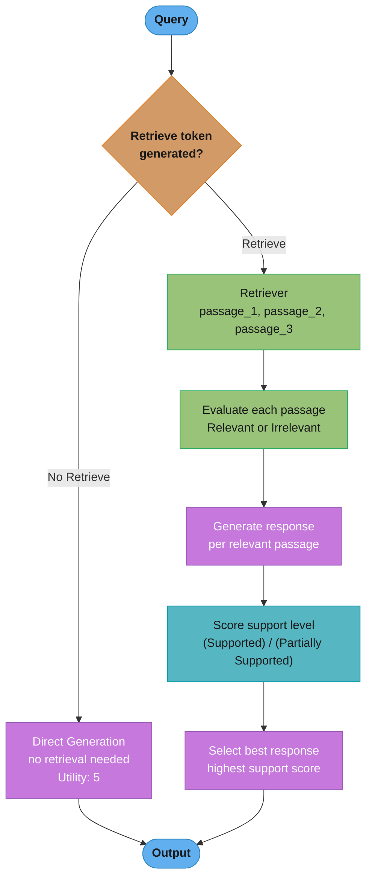
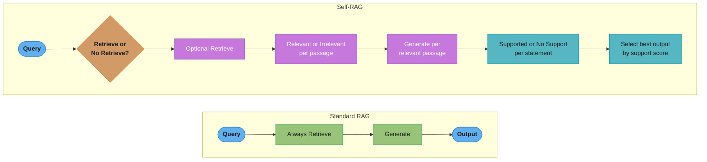

# Self-RAG

## 1. Concept Overview

Self-RAG (Self-Reflective Retrieval-Augmented Generation, Asai et al. 2023) trains a single LLM to decide when to retrieve, evaluate retrieved passages for relevance, and assess whether its own generated output is supported by the retrieved context. Unlike standard RAG (always retrieves) or [agentic RAG](agentic_rag.md) (LLM orchestrates external retrieval tool), Self-RAG embeds retrieval control directly into the model's generation process through special reflection tokens.

The model learns to generate special tokens — [Retrieve], [Relevant], [Supported], [No Retrieve] — as part of its output, enabling adaptive retrieval (only retrieve when necessary) and built-in faithfulness checking (verify each generated statement is supported by context).

---

## 2. Intuition

> **One-line analogy**: Self-RAG trains the LLM to be its own fact-checker and librarian simultaneously — it knows when to look something up and immediately verifies that what it wrote matches what it found.

**Mental model**: Standard RAG always retrieves, even for questions the LLM can answer from parametric knowledge ("What is 2+2?"). Self-RAG trains the model to recognize retrieval-worthy queries and emit a [Retrieve] token only when external knowledge is needed. After retrieval, the model evaluates each passage ([Relevant]/[Irrelevant]) and checks each generated statement for support ([Supported]/[Contradicts]). This makes retrieval adaptive and output verifiably grounded.

**Why it matters**: Self-RAG achieves better faithfulness and factuality than standard RAG while using fewer retrieval calls on average, because it skips retrieval for questions answerable from parametric knowledge and verifies grounding of every claim.

**Key insight**: Retrieval control and faithfulness checking are learned behaviors that can be instilled through supervised fine-tuning on carefully constructed training data — the model doesn't need an external orchestrator.

---

## 3. Core Principles

- **Adaptive retrieval**: Retrieve only when needed; skip retrieval for trivial or parametric-knowledge questions.
- **Passage relevance evaluation**: Not all retrieved passages are useful; the model explicitly scores each.
- **Statement-level faithfulness checking**: Each generated statement is checked against retrieved context, not just the overall answer.
- **Fine-tuning is required**: Self-RAG behaviors are learned; they cannot be injected via prompting alone into a standard LLM.
- **Inference efficiency**: By skipping retrieval for simple queries, Self-RAG is faster than standard RAG on mixed query distributions.

---

## 4. Types / Architectures / Strategies

Self-RAG has two taxonomies worth holding separately: the **reflection tokens** that make up
its vocabulary of decisions, and the **deployment strategies** by which teams actually adopt
it, since a full fine-tune is out of reach for most.

**The four reflection-token classes** — each is a decision point the model emits inline:

| Class | Values | Emitted when | What it controls |
|-------|--------|--------------|------------------|
| `Retrieve` | yes, no, continue | Before a segment is generated | Whether retrieval happens at all — the adaptive-retrieval lever that lets parametric-knowledge questions skip the retriever entirely |
| `IsREL` | relevant, irrelevant | Once per retrieved passage | Which passages survive into the generation context |
| `IsSUP` | fully supported, partially supported, no support | Once per generated statement | Statement-level faithfulness — the hallucination check, applied per sentence rather than per answer |
| `IsUSE` | 1 to 5 | On the completed response | Overall utility, used to rank candidate continuations |

The first class governs *whether* to retrieve; the middle two govern *what to keep* and
*whether the output is grounded*; the last ranks whole candidates. Because `IsSUP` and
`IsUSE` are scores rather than gates, they combine into a weighted decode-time criterion,
which is what lets one fine-tuned model serve a faithfulness-critical deployment and a
fluency-first one from a single set of weights.

**Adoption strategies** — the same behaviours at three levels of investment:

| Strategy | How the reflection happens | Requires | Tradeoff |
|----------|---------------------------|----------|----------|
| Full Self-RAG | Reflection tokens generated natively by a fine-tuned model | ~150K annotated examples, a multi-GPU fine-tune, ongoing maintenance when the base model changes | Highest fidelity and the only variant with true adaptive retrieval, but locks you to a model you can fine-tune |
| Prompted approximation | The same four judgements requested as structured output from an off-the-shelf model | Prompt engineering only | Works with proprietary API models; costs an extra call per judgement and the verdicts are less calibrated |
| External evaluator ([CRAG](corrective_rag.md)) | A separate lightweight relevance model judges retrieval, with no self-assessment of the output | A cross-encoder and a fallback path | Most of the retrieval-quality benefit at a fraction of the effort, but no statement-level faithfulness check |

Choose by what you are actually short of. If the problem is retrieval gaps, the external
evaluator solves it without touching the model. If the problem is unsupported claims in the
generated text, only the variants that emit `IsSUP` per statement address it.

---

## 5. Architecture Diagrams

### Self-RAG Token Generation Flow


### Self-RAG vs. Standard RAG Comparison

Standard RAG always retrieves before generating; Self-RAG inserts a retrieval decision, a per-passage relevance check, and a per-statement support check into the same pipeline:



---

## 6. How It Works — Detailed Mechanics

### 6.1 Special Reflection Tokens

Self-RAG introduces four types of reflection tokens. The paper (Asai et al. 2023, Table 1) names them `Retrieve`, `IsREL`, `IsSUP` and `IsUSE`; this page uses the readable bracket labels below for the same four categories:

```
Retrieve  {yes, no, continue}
[Retrieve]       — should the model retrieve external passages for this segment?
[No Retrieve]    — no retrieval needed (parametric knowledge sufficient)
[Continue]       — keep using the passages already retrieved; do not retrieve again

IsREL  {relevant, irrelevant}
[Relevant]       — retrieved passage is relevant to the query and useful
[Irrelevant]     — retrieved passage is not relevant; ignore it

IsSUP  {fully supported, partially supported, no support}
[Supported]      — generated statement is fully supported by the retrieved context
[Partially Supported] — generated statement is partially supported
[No Support]     — generated statement is not supported by the retrieved context (potential hallucination)

IsUSE  {5, 4, 3, 2, 1}
[Utility]        — overall utility of the response (scale 1-5)
```

### 6.2 Generation Flow

```
Input: User query

Step 1: Retrieval decision
  Model generates first token:
    [Retrieve] → trigger retrieval system → retrieve top-K passages
    [No Retrieve] → generate directly from parametric knowledge

Step 2 (if retrieved): Passage evaluation
  For each retrieved passage d_i:
    Model generates [Relevant] or [Irrelevant]
    Keep only [Relevant] passages for context

Step 3: Conditional generation
  Model generates response given:
    - Original query
    - Relevant retrieved passages (only those marked [Relevant])
    Generates one response segment per relevant passage

Step 4: Support checking
  For each generated sentence:
    Model generates [Supported], [Partially Supported], or [No Support]
    against the retrieved passage used

Step 5: Output selection
  Multiple candidate responses generated (one per relevant passage)
  Select best response by:
    - Maximizing [Supported] tokens
    - Considering [Utility] score
    - May re-rank or discard [No Support] statements
```

### 6.3 Training Data Generation

Self-RAG requires a fine-tuned model. Training data is generated synthetically:

```
Step 1: Sample (input, output) pairs from existing datasets
  (question, answer), (instruction, response), etc.

Step 2: For each pair, a critic model inserts reflection tokens. In the paper, GPT-4
  is prompted to produce reflection tokens and that knowledge is distilled into an
  in-house critic (Llama 2-7B), which does the bulk annotation:
  - Should retrieval be triggered here? → insert [Retrieve] or [No Retrieve]
  - Given the actual retrieved passages: are they relevant?
    → insert [Relevant] or [Irrelevant] before each passage
  - Is each generated sentence supported?
    → insert [Supported] / [Partially Supported] / [No Support] after each sentence

Step 3: Fine-tune base LLM on this annotated corpus
  Standard supervised fine-tuning on (input → annotated output) pairs
  The model learns to generate reflection tokens as natural part of output

Training scale: 150K instruction-output pairs for the generator; 4K-20K supervised
                examples per reflection-token type for the critic (Asai et al. 2023)
Base model: Llama 2 7B or 13B (generator); Llama 2 7B (critic)
```

### 6.4 Inference Algorithm

```python
def self_rag_generate(query: str, model, retriever, beam_width: int = 4):
    # Step 1: Check if retrieval needed
    first_token = model.generate_next_token(query)

    if first_token == "[No Retrieve]":
        return model.generate(query)  # direct generation

    # Step 2: Retrieve passages
    passages = retriever.retrieve(query, top_k=5)

    # Step 3: For each passage, generate response and check relevance/support
    candidates = []
    for passage in passages:
        # Check if passage is relevant
        relevance = model.generate_reflection_token(
            query, passage, "[Relevant] or [Irrelevant]?"
        )
        if relevance == "[Irrelevant]":
            continue

        # Generate response using this passage
        response = model.generate(query, context=passage)

        # Check support for each statement
        support_tokens = model.check_support(response, passage)
        support_score = compute_support_score(support_tokens)
        # [Supported] = 1.0, [Partially Supported] = 0.5, [No Support] = 0.0

        # Get utility score
        utility = model.generate_utility_score(query, response)

        candidates.append({
            "response": response,
            "support_score": support_score,
            "utility": utility,
            "passage": passage
        })

    # Select best candidate: maximize support score * utility
    if not candidates:
        return "I don't have sufficient information to answer this question."

    best = max(candidates, key=lambda x: x["support_score"] * x["utility"])
    return best["response"]
```

**What this actually says.** The selection rule `max(support_score x utility)` says: "among the answers I drafted, prefer the one that is both grounded in its passage and actually useful — and if it is grounded in nothing, it cannot win at any level of usefulness." Multiplication, not addition, is the load-bearing choice.

`support_score` itself is an average over the sentence-level reflection tokens, with the mapping the comment in the code states: `[Supported] = 1.0`, `[Partially Supported] = 0.5`, `[No Support] = 0.0`.

| Symbol | What it is |
|--------|------------|
| `support_score` | Mean of the per-sentence token weights; `[0, 1]`, one value per candidate |
| `[Supported]` / `[Partially]` / `[No Support]` | The three weights, 1.0 / 0.5 / 0.0 |
| `utility` | The `[Utility]` reflection token, an integer 1-5 — is the answer any good as an answer |
| `support x utility` | The ranking key; range `[0, 5]` because support is normalized and utility is not |
| `beam_width` | How many candidate drafts are scored before the max is taken |
| `0.85` | The confidence cut the Section 14 case study applies to `support_score` alone, after selection |

**Walk one example.** Three candidate responses, each generated against a different relevant passage. `S` = `[Supported]`, `P` = `[Partially Supported]`, `N` = `[No Support]`:

```
  cand   sentence tokens        support_score                    utility   product
  ---------------------------------------------------------------------------------
  C1     S  S  P  N             (1.0+1.0+0.5+0.0)/4 = 0.6250        4       2.5000
  C2     S  S  S                (1.0+1.0+1.0)/3     = 1.0000        3       3.0000
  C3     S  S  S  P  S          (1.0+1.0+1.0+0.5+1.0)/5 = 0.9000    4       3.6000

  ranked by support alone : C2 (1.00) > C3 (0.90) > C1 (0.62)
  ranked by utility alone : C1 = C3 (4)          > C2 (3)
  ranked by the PRODUCT   : C3 (3.60) > C2 (3.00) > C1 (2.50)   <- what ships

  C3 wins although it is first on neither factor. C2 is perfectly grounded
  but says less; C1 is useful but a quarter of its sentences are unsupported.

  Section 14's confidence label reads support_score only, not the product:
    C3 : 0.90 > 0.85 -> "high"     C2 : 1.00 -> "high"     C1 : 0.62 -> "medium"
```

**Why multiply instead of add.** Multiplication makes `support_score = 0` an absolute veto: a fluent, maximally useful hallucination scores `0.0 x 5 = 0.0` and can never be selected. Addition would let utility buy its way past ungroundedness. But multiplication is *not* a support-dominant rule either — a fully grounded but thin answer at `1.0 x 1 = 1.0` still loses to a half-grounded but substantive one at `0.5 x 3 = 1.5`. That asymmetry is deliberate: Self-RAG is trying to avoid unsupported claims, not to reward terseness.

**Why `support_score` is a mean and not a count.** Dividing by sentence count normalizes for answer length, so a 5-sentence answer with one `[Partially Supported]` (0.9000) is not punished relative to a 3-sentence answer with none (1.0000) merely for saying more. Use a raw sum instead and the ranking collapses into "prefer the longest answer," since every additional `[Supported]` sentence would add another full point.

**Where the reflection budget goes.** Each of these numbers costs a forward pass. Section 12 accounts for it: one `[Retrieve]` decision (~5-10 ms), one `[Relevant]` verdict per retrieved passage (5 passages = ~50-100 ms), and one support token per generated sentence (5 sentences = ~50-100 ms) — 150-250 ms of reflection on top of the generation itself, or 20-30% added latency. The passage evaluations are mutually independent, which is why Section 12 recommends batching them rather than looping as the code above does for clarity.

---

## 7. Real-World Examples

### Original Self-RAG Paper Results (Asai et al. 2023, arXiv:2310.11511)
- Self-RAG 7B and 13B outperformed ChatGPT and retrieval-augmented Llama2-chat on open-domain QA, reasoning and fact verification (paper abstract)
- On PopQA (open-domain QA): Self-RAG 13B 55.8% and Self-RAG 7B 54.9%, vs. 45.7% for retrieval-augmented Llama2-13B and 50.8% for retrieval-augmented ChatGPT
- On PubHealth (fact verification): Self-RAG 13B 74.5% and 7B 72.4%, vs. 70.1% for ChatGPT and 54.7% for retrieval-augmented ChatGPT
- The paper's six evaluation tasks are PopQA, TriviaQA-unfiltered, PubHealth, ARC-Challenge, biography generation and ALCE-ASQA
- Retrieval frequency is not a fixed rate: it is controlled by an adjustable retrieval threshold on the `Retrieve` token probability (the paper uses 0.2 for most tasks, 0 for ALCE), which trades retrieval calls against accuracy at inference time

### Production Adaptations
- Self-RAG's reflection tokens are adapted in production by replacing fine-tuned tokens with prompted chain-of-thought reasoning in capable LLMs
- "Should I retrieve for this query? Explain why." → similar adaptive behavior without fine-tuning
- The faithfulness checking mechanism is particularly valuable: used as a post-generation filter in enterprise RAG systems

---

## 8. Tradeoffs

| Dimension | Standard RAG | Self-RAG |
|-----------|-------------|---------|
| Retrieval frequency | Always | Adaptive (tuned by the retrieval threshold) |
| Faithfulness | Moderate | High (statement-level checking) |
| Requires fine-tuning | No | Yes |
| Can use any LLM | Yes | No (needs Self-RAG fine-tuned model) |
| Simple query latency | Higher (unnecessary retrieval) | Lower (skips retrieval) |
| Complex query accuracy | Good | Better |
| Debugging | Simple | Complex (trace reflection tokens) |
| Training data needed | None | 150K annotated instruction-output pairs |

---

## 9. When to Use / When NOT to Use

### Use Self-RAG When:
- Faithfulness and grounding are critical (medical, legal, financial Q&A)
- Query distribution is mixed: some need retrieval, many don't
- You have capacity to fine-tune a model and maintain it
- You need per-statement support verification, not just overall answer faithfulness

### Use Standard RAG When:
- Cannot fine-tune a custom model (API-only, budget constraints)
- Queries almost always need retrieval (document Q&A, search)
- Simpler system preferred; operator overhead is a constraint
- Team lacks ML engineering capacity for fine-tuning

### Use Self-RAG Concepts Without Full Fine-Tuning:
- Prompt a current frontier LLM (e.g. GPT-5.4, Claude Opus 5) to perform retrieval-need assessment and support checking
- Use RAGAS faithfulness metric as a post-generation filter to catch unsupported statements
- These approximations capture some Self-RAG benefits without fine-tuning overhead

---

## 10. Common Pitfalls

**1. Expecting Self-RAG behavior without fine-tuning**
Prompting a standard LLM to emit [Retrieve] tokens or check [Supported] doesn't produce reliable Self-RAG behavior — the model hasn't learned these tokens as decision-making actions.
Fix: Use a properly fine-tuned Self-RAG variant (or use RAGAS faithfulness checking as a post-generation filter for the faithfulness component).

**2. Training data quality for reflection tokens**
If the critic LLM (used to generate training data) incorrectly labels passages as [Relevant] when they're not, the fine-tuned model learns bad relevance judgment.
Fix: Validate training data quality: sample 200 examples and manually verify [Relevant] / [Irrelevant] labels. Use the strongest model you can afford as the annotator even if deploying a smaller model.

**3. No fallback when all passages are [Irrelevant]**
If the model retrieves 5 passages and marks all as [Irrelevant], the generation pipeline has no context to use.
Fix: Always implement a fallback: either generate from parametric knowledge with an explicit disclaimer ("Based on my training knowledge, without retrieved context...") or report inability to answer.

**4. Overconfident [Supported] tokens**
The model may generate [Supported] even when the retrieved passage loosely supports but doesn't exactly confirm a statement.
Fix: Evaluate support token calibration on a labeled faithfulness test set. Consider using a separate faithfulness checker (cross-encoder or RAGAS) as a second-opinion filter on [Supported] claims.

**5. Forgetting that Self-RAG models degrade on general capabilities**
Fine-tuning on the Self-RAG training corpus can reduce performance on general tasks not represented in training.
Fix: Evaluate fine-tuned model on general benchmarks (MMLU, HellaSwag) alongside Self-RAG task benchmarks. Use PEFT (LoRA) fine-tuning rather than full fine-tuning to limit regression.

---

## 11. Technologies & Tools

| Tool | Purpose | Notes |
|------|---------|-------|
| **Self-RAG GitHub** (AkariAsai/self-rag) | Reference implementation | Original paper code; Llama 2 7B/13B fine-tuned models |
| **HuggingFace PEFT** | LoRA fine-tuning for Self-RAG | Use LoRA to fine-tune base model on annotated Self-RAG data |
| **RAGAS faithfulness** | Approximate [Supported] checking | Post-generation support verification without fine-tuning |
| **TRL SFTTrainer** | Supervised fine-tuning | Standard tool for SFT on annotated examples |
| **Axolotl** | Fine-tuning framework | Flexible YAML config; easy data format for Self-RAG training |
| **Frontier LLM API** | Training data annotation | The paper prompts GPT-4 to produce reflection tokens, then distills that into a Llama 2-7B critic |

---

## 12. Interview Questions with Answers

**Q: What problem does Self-RAG solve that standard RAG doesn't?**
**Short:** It decides per-query whether retrieval is needed and checks statement-level support of each claim, unlike standard RAG which always retrieves and never verifies faithfulness.
A: Self-RAG solves two problems standard RAG ignores: (1) retrieval necessity — standard RAG always retrieves even when the LLM could answer from parametric knowledge (e.g., "What is 2+2?"), wasting latency and context window; Self-RAG decides per-query whether retrieval is needed. (2) Faithfulness verification — standard RAG generates an answer but doesn't check whether each statement is actually supported by the retrieved context; Self-RAG checks support at the statement level, enabling selective filtering of unsupported claims. The tradeoff is that Self-RAG requires fine-tuning a specific model variant; it's not applicable to API-only LLMs.

**Q: What are the four main reflection token types in Self-RAG and what does each control?**
**Short:** [Retrieve] triggers retrieval need, IsREL flags passage relevance, IsSUP checks statement-level support, and IsUSE scores overall response quality on a 1-5 scale.
A: [Retrieve] (paper name `Retrieve`, values yes/no/continue) — triggers retrieval when external knowledge is needed, skips it when parametric knowledge suffices, or continues with passages already retrieved. [Relevant]/[Irrelevant] (`IsREL`) — evaluates each retrieved passage for usefulness relative to the query; irrelevant passages are excluded from the generation context. [Supported]/[Partially Supported]/[No Support] (`IsSUP`) — assesses whether each generated statement is backed by the retrieved passage, providing statement-level faithfulness verification. [Utility] (`IsUSE`, 1-5 scale) — the fourth type, scoring overall response quality and used to select between multiple candidate responses generated from different relevant passages.

**Q: How is Self-RAG training data generated?**
**Short:** A GPT-4-distilled critic model annotates roughly 150K instruction-output pairs with reflection tokens for retrieval need, passage relevance, and statement support.
A: Training data is generated synthetically by a critic model. In the paper, GPT-4 is prompted to produce reflection tokens and that knowledge is distilled into an in-house Llama 2-7B critic, which does the bulk annotation. For each (input, output) pair from existing datasets, the critic inserts reflection tokens: deciding whether retrieval was needed at each generation step, whether each retrieved passage is relevant, and whether each generated sentence is supported by the retrieved passage. This annotation produces (input → reflection-token-annotated output) training pairs. The fine-tuned model learns to generate these reflection tokens as a natural part of its output sequence. The paper uses 150K instruction-output pairs (sampled from Open-Instruct plus knowledge-intensive datasets) to fine-tune Llama 2 7B and 13B; multi-GPU training time is implementation-specific and not something to quote as a fixed figure.

**Q: How does Self-RAG's adaptive retrieval affect inference efficiency?**
**Short:** Thresholding the [Retrieve] token's probability lets simple parametric-knowledge queries skip retrieval, turning retrieval frequency into a tunable knob instead of 100%.
A: Standard RAG calls the retriever for 100% of queries. Self-RAG's [Retrieve] / [No Retrieve] decision makes that frequency a tunable knob rather than a constant: the paper thresholds the `Retrieve` token probability (0.2 for most tasks, 0 for ALCE) and shows retrieval frequency trading off against task accuracy. Queries answerable from parametric knowledge (definitions, simple facts, reasoning questions) skip retrieval entirely. This reduces retrieval API calls, embedding computation, and context window usage for simple queries. The size of the saving depends entirely on your query mix and threshold — measure it rather than assuming a headline percentage, and note that skipped retrievals are partly offset by the extra reflection-token forward passes.

**Q: Can you achieve Self-RAG-like behavior through prompting without fine-tuning?**
**Short:** A capable LLM can be prompted to judge retrieval necessity and check faithfulness, but the checks are less consistent than a fine-tuned model's reflection tokens.
A: Partially. A capable current LLM (e.g. GPT-5.4, Claude Opus 5) can be prompted to assess retrieval necessity ("Should you search for external information to answer this query?") and perform faithfulness checking ("Does each statement in your response align with the provided context?"). This approximates Self-RAG's adaptive retrieval and support checking. However, the approximation is less reliable than fine-tuned behavior: the prompted checks may be inconsistent, the model may still generate unsupported claims and then rationalize them as supported. For production systems where faithfulness is critical, using RAGAS as a post-generation faithfulness filter is a more reliable alternative.

**Q: What happens when all retrieved passages are marked [Irrelevant] in Self-RAG?**
**Short:** The model falls back to generating from parametric knowledge alone with reduced confidence, since relevance filtering cannot rescue a genuinely poor retrieval.
A: When all retrieved passages are [Irrelevant], the model has no external context to use for generation. The Self-RAG paper handles this with a fallback: if no passages are marked relevant after retrieval, the model generates a response from parametric knowledge alone (similar to [No Retrieve] path), with reduced confidence. In production implementations, the correct behavior is: generate a response marked as based-on-training-only with an explicit uncertainty statement, or report inability to answer if the query is factual. This failure mode highlights the importance of having a diverse, high-recall retrieval system — if the right passages aren't retrieved, the relevance check cannot save the pipeline.

**Q: How does Self-RAG compare to CRAG (Corrective RAG) in approach?**
**Short:** Self-RAG embeds statement-level quality checks as fine-tuned model behavior, while CRAG is an external document-level evaluator pipeline that works with any LLM.
A: Both Self-RAG and [CRAG](corrective_rag.md) evaluate retrieved passage quality and respond when quality is low. The key differences: Self-RAG embeds this logic as fine-tuned model behavior (reflection tokens generated by the model itself); CRAG is an external pipeline that wraps a standard LLM with an external relevance evaluator. Self-RAG performs statement-level support checking during generation; CRAG checks document-level relevance before generation and falls back to web search for low-relevance results. Self-RAG requires fine-tuning; CRAG requires only a relevance scoring model and works with any LLM. For organizations that cannot fine-tune, CRAG is the practical alternative.

**Q: How would you evaluate a Self-RAG implementation?**
**Short:** Test retrieval-decision accuracy, passage-relevance accuracy, and statement-support accuracy separately against labeled ground truth, then compare faithfulness to a RAG baseline.
A: Evaluate three components. (1) Retrieval decision accuracy: does [Retrieve] trigger on queries that need retrieval and [No Retrieve] on queries that don't? Build a labeled test set with (query, should_retrieve) labels. (2) Relevance assessment accuracy: when retrieval occurs, does [Relevant]/[Irrelevant] correctly classify passages? Measure against human-labeled relevance annotations. (3) Support checking accuracy: for generated statements labeled [Supported], verify they are actually supported by the passage (not just loosely related). For end-to-end quality: standard faithfulness and answer accuracy metrics on held-out QA datasets. Compare against standard RAG baseline using identical retriever.

**Q: What are the catastrophic forgetting risks of Self-RAG fine-tuning?**
**Short:** Training on narrow dataset types can degrade general capability, so mitigate with LoRA fine-tuning, mixed-in general instruction data, and ongoing benchmark checks.
A: Fine-tuning on the Self-RAG training corpus — which is composed of specific dataset types (Wikipedia QA, medical QA, fact-checking) — risks reducing performance on general tasks not represented in training. The model learns to optimize for reflection token prediction on the training distribution; queries outside that distribution may see degraded response quality. Mitigation: (1) Use LoRA fine-tuning rather than full fine-tuning — frozen base weights limit regression; (2) Include a sample of general instruction-following data in the training mix to maintain general capabilities; (3) Evaluate on general benchmarks (MMLU, HellaSwag) alongside Self-RAG tasks throughout training.

**Q: In production, which component of Self-RAG provides the most immediate value if you can't implement the full system?**
**Short:** A post-generation faithfulness filter that flags unsupported sentences captures Self-RAG's main benefit without requiring any fine-tuning.
A: The faithfulness/support checking mechanism provides the most immediate value because it addresses the #1 RAG failure mode: hallucinated or unsupported answers. Even without fine-tuning, you can implement an approximation using a post-generation faithfulness filter: for each generated sentence, use a cross-encoder or RAGAS faithfulness checker to verify it's supported by the retrieved context. Statements below a threshold are flagged or removed. This is deployable with any LLM without fine-tuning and directly reduces the hallucination rate that damages user trust. The adaptive retrieval ([Retrieve]/[No Retrieve]) provides efficiency benefits but doesn't improve answer quality for queries that do require retrieval.

**Q: How do you build the annotation pipeline for reflection tokens and what quality controls are required?**
**Short:** A distilled critic model inserts reflection tokens into ~150K pairs, validated by manually checking 5% for over 80% agreement with human annotators on retrieve decisions.
A: The annotation pipeline is the most labor-intensive part of Self-RAG. The process: (1) Collect on the order of 150K (input, output) pairs from existing instruction-following and knowledge-intensive datasets (the paper samples from Open-Instruct plus KILT-style knowledge-intensive sets and ASQA); (2) For each pair, run a critic model — the paper prompts GPT-4 and distills it into a Llama 2-7B critic — with a carefully designed prompt that asks it to determine whether retrieval was needed, whether retrieved passages are relevant, and whether generated sentences are supported; (3) The critic inserts reflection tokens into the output sequence; (4) The annotated pairs become supervised fine-tuning data. Quality controls: (a) validate 5% of annotations manually — inter-annotator agreement between the critic LLM and a human should exceed 80% for [Retrieve]/[No Retrieve] decisions; (b) balance the training set so [Retrieve] and [No Retrieve] examples are roughly 60/40 (reflecting real query distributions); (c) ensure [Supported] examples have explicit textual overlap between the generated statement and the passage, not just thematic similarity.

**Q: How does Self-RAG complexity and training cost compare to CRAG's benefits, and when does each approach win?**
**Short:** Self-RAG needs a fine-tunable model and dedicated ML capacity, while CRAG needs only a lightly trained cross-encoder and a web search API, making CRAG the pragmatic default.
A: Self-RAG requires roughly 150K annotated training examples, a multi-GPU fine-tuning run, an inference-time reflection-token step that adds on the order of 20-30% latency, and an ongoing model maintenance burden when base models are updated. CRAG requires only a relevance evaluator (a cross-encoder, which can be pre-trained or lightly fine-tuned on 200-500 labeled pairs in hours), a web search API integration, and no model fine-tuning. Self-RAG wins when: you have a stable, small LLM you can fine-tune and maintain; query distribution is mixed (many simple queries that benefit from skipping retrieval); and statement-level faithfulness checking is essential. CRAG wins when: you use a proprietary API LLM that cannot be fine-tuned; your primary problem is retrieval gaps (out-of-KB queries) rather than faithfulness; and implementation speed matters. For most production teams, CRAG is the pragmatic first choice; Self-RAG is for teams with dedicated ML engineering capacity.

**Q: What are the fine-tuning data requirements for Self-RAG and how do they affect base model selection?**
**Short:** Roughly 150K diverse, balanced annotated examples are needed, and models under 3B parameters struggle to generate reliable reflection tokens while keeping response quality.
A: Self-RAG training requires roughly 150K annotated instruction-output pairs to learn reliable reflection token generation. With fewer examples, the model learns inconsistent patterns — sometimes generating [Retrieve] for trivial queries, sometimes [No Retrieve] for complex ones. Data composition matters as much as volume: the training set must include diverse query types (factual, reasoning, creative, multi-hop), diverse retrieval scenarios (relevant passages, irrelevant passages, no good passages), and balanced [Supported] / [No Support] examples. Base model selection: Self-RAG works best with models that already have strong instruction-following capabilities — the original paper uses Llama 2-7B and Llama 2-13B for the generator and Llama 2-7B for the critic (Mistral is not used in the paper; community ports exist but are not part of it). Larger models (13B vs. 7B) show better reflection token calibration (fewer false [Supported] labels) at the cost of 2× inference latency. Models under 3B parameters struggle to maintain response quality while generating reliable reflection tokens.

**Q: What is the inference overhead of reflection token generation in Self-RAG and how does it affect production latency?**
**Short:** Reflection token checks across retrieval, relevance, and support add roughly 150-250ms per query, about 20-30% more latency than a single-pass generation.
A: Reflection token generation adds overhead at each decision point. [Retrieve] / [No Retrieve] is a single additional token prediction before retrieval — adds ~5-10ms. [Relevant] / [Irrelevant] evaluation per passage adds one LLM forward pass per retrieved passage — for 5 passages, approximately 50-100ms total. [Supported] / [Partially Supported] / [No Support] checking per generated sentence adds one prediction per sentence — for a 5-sentence response, approximately 50-100ms. Total reflection overhead: 150-250ms per query that triggers retrieval, compared to standard RAG's single generation pass. This is 20-30% additional latency, which is acceptable for most use cases. Optimization: batch [Relevant] evaluations for all passages in parallel (the evaluations are independent); generate response candidates in parallel when beam width > 1; use speculative decoding for reflection token prediction if the base model supports it.

**Q: How do you adapt Self-RAG for production systems that cannot afford full fine-tuning?**
**Short:** Approximate it with a prompted retrieval-necessity check, a post-generation faithfulness scorer, and confidence-based retrieval triggering using no-context logprobs.
A: Several production-viable adaptations capture Self-RAG benefits without fine-tuning. (1) Prompted adaptive retrieval: add a pre-retrieval step where a strong current LLM (e.g. GPT-5.4 or Claude Opus 5) decides "Does this query require external knowledge?" with a structured JSON output; route accordingly. This captures ~70% of Self-RAG's retrieval efficiency benefit. (2) Post-generation support checking: after standard RAG generation, run each sentence through RAGAS faithfulness or a cross-encoder to score support against the retrieved context; flag or remove low-support statements. This captures ~80% of Self-RAG's faithfulness benefit. (3) Retrieve-then-score: always retrieve, then score passage relevance with a cross-encoder before passing to the LLM — this is CRAG's approach and approximates Self-RAG's [Relevant] evaluation. (4) Confidence-based retrieval triggering: use the LLM's logprob on its initial (no-context) answer as a proxy for certainty — if the LLM is confident, skip retrieval; if uncertain (low logprob on key tokens), retrieve. This requires logprob access (not available on all APIs).

---

## 13. Best Practices

1. **Use LoRA for Self-RAG fine-tuning** — prevents catastrophic forgetting; preserves base model capabilities; reduces compute cost.
2. **Generate high-quality training data** — use the strongest available model to produce the critic's reflection-token labels; validate 10% of annotations manually before training.
3. **Implement the fallback path** — always handle the all-[Irrelevant] case; never silently fail when no relevant passage is found.
4. **Evaluate each reflection token separately** — retrieval decision accuracy, relevance accuracy, and support accuracy each require their own test sets.
5. **Use RAGAS faithfulness as an approximation** — for teams that can't fine-tune, RAGAS faithfulness checking post-generation captures much of Self-RAG's faithfulness benefit.
6. **Monitor reflection token distribution in production** — what fraction of queries trigger retrieval? If >90%, your model has learned to always retrieve; if <20%, it may be over-relying on parametric knowledge. Tune the retrieval threshold against your own accuracy/cost curve rather than a fixed target rate.
7. **Include Self-RAG support score in the API response** — expose [Supported] / [No Support] token distribution per statement to downstream applications, enabling them to display confidence levels to users.

---

## 14. Case Study: Self-RAG for a Legal Research Assistant

> **Illustrative composite.** The firm, the metrics, the costs and the quoted model
> output below are a worked teaching example, not a published or verifiable
> engagement. Use the shape of the reasoning, not the numbers.

**Problem Statement**: A mid-size law firm employs 80 attorneys who perform case law research. The firm's knowledge base contains 2.2M legal documents: federal and state case law, statutes, regulatory guidance, and firm-authored memos. Attorneys ask two types of questions: (1) recall questions ("Find cases where a breach of fiduciary duty was established despite an exculpatory clause"); (2) synthesis questions ("What is the current judicial consensus on the scope of attorney-client privilege for in-house counsel in regulatory investigations?"). The challenge: attorneys need every cited case to be a real, retrievable case — fabricated citations are a professional responsibility violation. Standard RAG hallucinated case citations in 14% of responses, requiring attorneys to manually verify every citation before use. Self-RAG's per-statement support verification directly addressed this.

**Architecture Overview**:
```
Attorney Query
    |
    v
[Self-RAG Model: Llama 2 13B fine-tuned]
  LoRA fine-tuning on 180K legal (query, passage, annotated_output) pairs
  Critic LLM: generated [Retrieve]/[Relevant]/[Supported] labels
  Fine-tuning: 4 days on 8x A100 80GB (Azure NDm A100 v4, Standard_ND96amsr_A100_v4
  — note the 40GB ND A100 v4 / Standard_ND96asr_v4 is a different SKU)
    |
    v
[Retrieval Decision Token]
    |
    +-- [No Retrieve] (23% of queries)
    |   Simple definitional questions answerable from training:
    |   "What is promissory estoppel?"
    |   "What does res judicata mean?"
    |   → Direct generation, no retrieval, no citation needed
    |
    +-- [Retrieve] (77% of queries)
            |
            v
    [BM25 + Dense Hybrid Retriever]
    Elasticsearch BM25 for legal citation matching (case names, statutes)
    BGE-large dense retriever for semantic similarity
    Top-5 passages retrieved
            |
            v
    [Passage Evaluation Tokens per passage]
      passage_1: [Relevant]   — direct case on point
      passage_2: [Relevant]   — related precedent
      passage_3: [Irrelevant] — different jurisdiction, different holding
      passage_4: [Relevant]   — secondary source
      passage_5: [Irrelevant] — procedurally related but substantively different
            |
            v
    [Conditional Generation with Relevant passages]
    For each [Relevant] passage, generate response candidate:
      Candidate 1 (using passage_1, passage_2, passage_4):
        "The fiduciary duty exception to exculpatory clauses has been consistently
        applied in Delaware corporate law. [Supported] In Lyondell Chemical Co. v.
        Ryan (Del. 2009), the court held... [Supported] However, the protection
        afforded by clause 8.1 was insufficient where... [Supported]"
            |
            v
    [Support Token Check per statement]
    Each sentence receives [Supported] / [Partially Supported] / [No Support]
    Statements receiving [No Support] flagged for attorney review
            |
            v
    [Response Selection]
    Select candidate with highest (support_score * utility_score)
    Filter: remove any statement with [No Support] from final output
    OR flag with explicit disclaimer: "This claim requires verification"
            |
            v
    [Citation Verification Layer]
    Post-generation: cross-reference cited case names against
    legal citation database (Westlaw-format citation validator)
    Flag any citation not found in database as unverified
            |
    Attorney-Facing Response with:
    - Per-statement support confidence
    - Verified citation indicators
    - Unverified claims explicitly flagged
```

**Key Design Decisions**:
1. LoRA fine-tuning on Llama 2 13B rather than full fine-tuning — full fine-tuning of a 13B model in mixed precision needs far more than 40GB of VRAM per GPU once optimizer state is counted, and risks degrading the model's legal reasoning from pre-training; LoRA (rank=16, alpha=32) applied to every linear projection trains roughly 63M parameters, about 0.5% of the model, preserved base reasoning capabilities, and completed training in 4 days on 8× A100s.
2. Hybrid BM25 + dense retrieval — legal research requires exact citation matching (case names, docket numbers, statutory references) where BM25 excels; semantic understanding for conceptual retrieval where dense retrieval excels; hybrid (RRF fusion) outperformed either alone by 18% Recall@5 on the firm's legal retrieval benchmark.
3. Citation verification post-generation — the Self-RAG model's [Supported] tokens prevent hallucinated claims but cannot detect a case name that is real but miscited (wrong year, wrong court); a separate citation validator cross-references all cited cases against a Westlaw-format citation database, adding a second line of defense against citation errors.
4. [No Support] statement removal rather than regeneration — when a statement receives [No Support], removing it from the output (or flagging it) is safer than attempting to regenerate; regeneration loops can produce confidently wrong alternatives; attorneys prefer gaps over hallucinations.
5. 77% retrieval trigger rate — the 23% of queries that get [No Retrieve] are definitional or procedural questions where the model's legal training is reliable; this saves retrieval cost on simple queries while ensuring complex research queries always retrieve.

**Implementation**:
```python
# Self-RAG inference with legal-specific post-processing
def legal_self_rag_generate(query: str) -> LegalResponse:
    # Step 1: Check retrieval need
    retrieval_token = model.generate_next_token(
        system_prompt=LEGAL_SELF_RAG_SYSTEM,
        query=query
    )

    if retrieval_token == "[No Retrieve]":
        response_text = model.generate(query)
        return LegalResponse(
            text=response_text,
            citations=[],
            retrieval_used=False,
            confidence="parametric_only"
        )

    # Step 2: Hybrid retrieval
    passages = hybrid_retriever.retrieve(
        query=query,
        bm25_weight=0.4,
        dense_weight=0.6,
        top_k=5
    )

    # Step 3: Evaluate passages and generate candidates
    candidates = []
    for passage_set in generate_passage_combinations(passages, max_sets=3):
        relevance_tokens = [
            model.evaluate_passage_relevance(query, p)
            for p in passage_set
        ]
        relevant_passages = [
            p for p, tok in zip(passage_set, relevance_tokens)
            if tok == "[Relevant]"
        ]

        if not relevant_passages:
            continue

        response, support_tokens = model.generate_with_support_check(
            query=query,
            context=relevant_passages
        )

        support_score = compute_support_score(support_tokens)
        utility_score = model.score_utility(query, response)

        candidates.append(ResponseCandidate(
            text=response,
            support_tokens=support_tokens,
            support_score=support_score,
            utility=utility_score,
            passages=relevant_passages
        ))

    if not candidates:
        return LegalResponse(
            text="Insufficient relevant case law found for this query.",
            retrieval_used=True,
            confidence="low"
        )

    # Step 4: Select best candidate
    best = max(candidates, key=lambda c: c.support_score * c.utility)

    # Step 5: Filter [No Support] statements
    final_text, flagged = filter_unsupported_statements(
        best.text, best.support_tokens
    )

    # Step 6: Citation verification
    citations = extract_citations(final_text)
    verified, unverified = citation_validator.verify(citations)

    return LegalResponse(
        text=final_text,
        citations=verified,
        unverified_claims=flagged + unverified,
        support_score=best.support_score,
        retrieval_used=True,
        confidence="high" if best.support_score > 0.85 else "medium"
    )
```

**Results**:

| Metric | Standard RAG | Self-RAG (Llama 2 13B LoRA) |
|--------|-------------|--------------------------|
| Citation hallucination rate | 14% | 2.1% |
| Fully supported responses (all statements) | 61% | 84% |
| [No Retrieve] rate (efficiency) | 0% | 23% |
| Average query latency | 1.8s | 2.6s |
| Attorney verification time per response | 18 min | 7 min |
| Retrieval Recall@5 (hybrid vs. dense only) | 71% | 89% |
| Fine-tuning compute cost | N/A | $2,400 (8x A100 80GB, 4 days, reserved rate) |

**Tradeoffs and Alternatives**:
- Fine-tuning cost of $2,400 was justified by the citation hallucination reduction (14% → 2.1%), which represented a compliance risk reduction; the firm's general counsel estimated each attorney verification of a hallucinated citation cost $85 in attorney time; at 200 queries/day the 14% → 2.1% reduction avoids about 23.8 such verifications per day (200 × 0.119), roughly $2,020/day, so the $2,400 fine-tuning spend pays back in a little over one day of use.
- The LoRA rank=16 choice required 3 experiments (rank=8, 16, 32); rank=16 achieved the best balance of [Supported] token accuracy (88%) vs. inference speed overhead (22%); rank=32 improved accuracy to 90% but added 35% inference latency.
- Considered using RAGAS faithfulness as an approximation (no fine-tuning) before committing to Self-RAG; RAGAS reduced citation hallucinations from 14% to 8% — significant but insufficient for the firm's risk tolerance; Self-RAG reduced to 2.1%.
- The citation verification layer (Westlaw-format validator) caught an additional 0.9% of errors that Self-RAG's [Supported] tokens missed (correctly cited case names but wrong year or wrong court); the two-layer approach (Self-RAG + citation validator) achieved the 2.1% final error rate.
