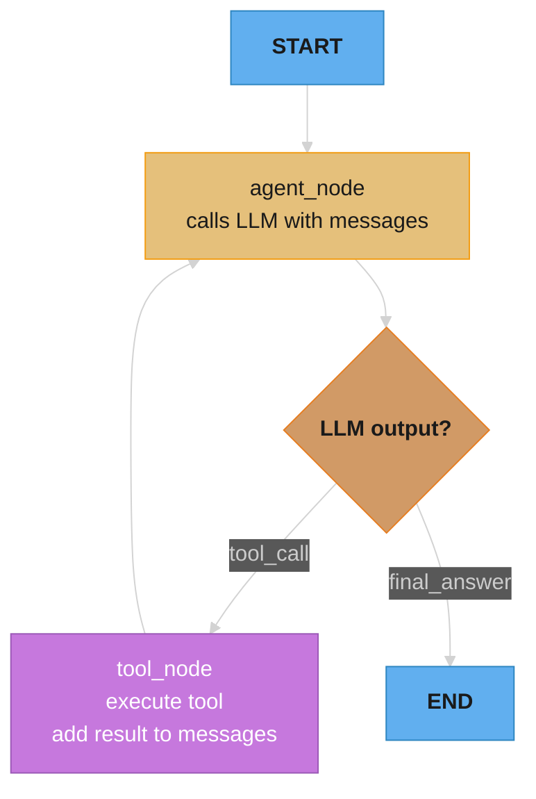

# Agentic Frameworks

## Deep Dive Files

This directory contains a README index (this file) plus 18 deep-dive files, each covering one framework or topic with the full 14-section module template and 15+ interview Q&As.

| File | Topic | Focus |
|------|-------|-------|
| [langchain_and_lcel.md](langchain_and_lcel.md) | LangChain + LCEL | Runnable protocol, RAG chains, LCEL pipe composition, callbacks, LangSmith |
| [langgraph.md](langgraph.md) | LangGraph | StateGraph, TypedDict state, reducers, checkpointing, human-in-the-loop, multi-agent |
| [llamaindex.md](llamaindex.md) | LlamaIndex | Node parsers, index types, sentence window, auto-merging, sub-question engine |
| [crewai.md](crewai.md) | CrewAI | Agent roles/goals/backstory, Task delegation, sequential vs hierarchical process |
| [autogen.md](autogen.md) | AutoGen | ConversableAgent, code execution loop, GroupChat, human_input_mode, code safety |
| [semantic_kernel.md](semantic_kernel.md) | Semantic Kernel | Kernel, plugins, planners, Kernel filters, OpenAPI import, enterprise patterns |
| [haystack.md](haystack.md) | Haystack | Pipeline DAG, typed components, document stores, hybrid retrieval, serialization |
| [dspy.md](dspy.md) | DSPy | Signatures, modules, optimizers (BootstrapFewShot, MIPRO), metrics, compilation |
| [framework_observability.md](framework_observability.md) | Observability | LangSmith, Langfuse, OpenTelemetry, cost tracking, LLM-as-judge evaluation |
| [structured_outputs_and_instructor.md](structured_outputs_and_instructor.md) | Structured Outputs | Instructor, Pydantic extraction, native structured outputs, retry on validation |
| [openai_agents_sdk.md](openai_agents_sdk.md) | OpenAI Agents SDK | Agent primitives, Runner, handoffs, guardrails, tracing (2025) |
| [claude_agent_sdk.md](claude_agent_sdk.md) | Anthropic API native | Tool use loop, parallel tools, subagents, computer use, prompt caching |
| [pydantic_ai.md](pydantic_ai.md) | PydanticAI | Typed Agent[Deps,Result], dependency injection, structured output, evals |
| [smolagents.md](smolagents.md) | HuggingFace smolagents | CodeAgent vs ToolCallingAgent, secure_executor, MCP tools |
| [strands_aws.md](strands_aws.md) | AWS Strands | @tool decorator, Bedrock integration, agent_as_tool, OpenTelemetry |
| [mastra_typescript.md](mastra_typescript.md) | Mastra (TS) | Workflows, agents, MCP client, evals, Vercel/CF deployment |
| [litellm_routing.md](litellm_routing.md) | LiteLLM | Unified routing, fallback, cost tracking, semantic caching, virtual keys |
| [google_adk.md](google_adk.md) | Google Agent Development Kit | LlmAgent, workflow agents (Sequential/Parallel/Loop), state/session/memory, A2A, Vertex AI Agent Engine |

---

## 1. Concept Overview

Agentic frameworks provide abstractions, components, and patterns for building LLM-powered applications and agents. Rather than writing every LLM call, tool invocation, memory management, and error handling from scratch, frameworks provide reusable building blocks — prompt templates, chain composition, memory integrations, tool libraries, and agent loops.

The trade-off: frameworks accelerate development but add abstraction layers that can make debugging harder. In 2023, LangChain became the de facto standard and also the poster child for over-abstraction. The ecosystem has since matured — LangGraph addresses stateful workflows; LlamaIndex focuses on data ingestion and RAG; CrewAI and AutoGen handle multi-agent coordination.

Understanding frameworks is critical for engineering interviews because production LLM systems almost always use at least one.

---

## 2. Intuition

> **One-line analogy**: Agentic frameworks are like React for LLM applications — they provide reusable components (chains, tools, memory, agents) so you don't build everything from scratch.

**Mental model**: Without a framework, building an LLM application means writing boilerplate: format prompts, call the API, parse output, handle errors, manage conversation history, invoke tools. Frameworks abstract this into composable building blocks. LangChain provides chains and tool integrations; LangGraph adds stateful workflows with branching; LlamaIndex specializes in data loading and RAG pipelines. The right framework matches the complexity of your use case.

**Why it matters**: Frameworks dramatically accelerate development, but the right choice matters — LangChain's heavy abstraction makes simple things easy but debugging hard; LangGraph's explicit state graph is better for complex workflows; writing directly against the API is best for production systems needing precise control.

**Key insight**: The framework abstraction level has a cost — when something breaks in production, you often need to understand both the framework internals and the underlying LLM behavior. Prefer simpler frameworks (or no framework) for production, and reserve complex frameworks for prototyping.

---

## 3. Core Principles

- **Abstraction vs. control**: Frameworks trade flexibility for development speed. Simple use cases benefit most; complex custom systems may fight the framework.
- **Composability**: Good frameworks compose small pieces (prompts, models, tools) into complex pipelines.
- **Observability**: Production frameworks must expose traces, logs, and metrics — otherwise debugging is impossible. See [LLM Observability and Monitoring](../llm_observability_and_monitoring/README.md).
- **Vendor neutrality**: Best frameworks abstract over model providers (OpenAI, Anthropic, Google) so you can swap without rewriting.
- **Statefulness**: Agentic workflows have complex state; frameworks like LangGraph model this explicitly as graphs.

---

## 4. Frameworks

### 4.1 LangChain

The most widely-used LLM framework. Provides: prompt templates, chains (compose LLM calls), memory, agents, tool integrations.

**Core concepts:**
```python
from langchain.chat_models import ChatOpenAI
from langchain.prompts import ChatPromptTemplate
from langchain.chains import LLMChain

# Simple chain
prompt = ChatPromptTemplate.from_template("Summarize: {text}")
chain = prompt | ChatOpenAI(model="gpt-4o") | StrOutputParser()
result = chain.invoke({"text": "Long article..."})

# LCEL (LangChain Expression Language) - pipe syntax
chain = prompt | llm | output_parser
```

**LangChain components:**
| Component | Purpose |
|-----------|---------|
| Chains | Compose sequential LLM calls |
| Agents | ReAct, OpenAI functions, custom |
| Memory | ConversationBuffer, Summary, VectorStore |
| Retrievers | Vector store + BM25 + web search |
| Tools | 100+ pre-built tool integrations |
| Callbacks | Logging, tracing, cost tracking |

**LCEL (LangChain Expression Language):**
```python
# Modern LangChain with LCEL
from langchain_core.runnables import RunnableParallel, RunnablePassthrough

retrieval_chain = (
    RunnableParallel({"context": retriever, "question": RunnablePassthrough()})
    | prompt
    | model
    | parser
)
```

**Verdict:** Most mature ecosystem, most integrations, but complex internals. Use LCEL (modern) not legacy chains.

### 4.2 LangGraph

State machine framework for multi-step, multi-agent workflows. Agents are graphs with nodes (LLM calls, tool calls) and edges (transitions).

```python
from langgraph.graph import StateGraph, END
from typing import TypedDict

class AgentState(TypedDict):
    messages: list
    next_action: str

def agent_node(state):
    messages = state["messages"]
    response = llm.invoke(messages)
    return {"messages": messages + [response]}

def tool_node(state):
    # Execute tool based on last message
    result = execute_tool(state["messages"][-1])
    return {"messages": state["messages"] + [result]}

def should_continue(state):
    if "DONE" in state["messages"][-1].content:
        return END
    return "tools"

graph = StateGraph(AgentState)
graph.add_node("agent", agent_node)
graph.add_node("tools", tool_node)
graph.add_edge("tools", "agent")
graph.add_conditional_edges("agent", should_continue)
graph.set_entry_point("agent")

app = graph.compile()
result = app.invoke({"messages": [HumanMessage("What's the weather?")]})
```

**Key features:**
- Cycles: unlike simple chains, graphs can loop
- State management: explicit state type with TypedDict
- Human-in-the-loop: `interrupt_before` / `interrupt_after` breakpoints
- Streaming: stream intermediate states to UI
- Checkpointing: persist state for long-running workflows
- Multi-agent: connect multiple agents as nodes in the graph

### 4.3 LlamaIndex

Focused on data ingestion, indexing, and retrieval. Best-in-class for RAG applications and data-intensive agents.

```python
from llama_index.core import VectorStoreIndex, SimpleDirectoryReader
from llama_index.core.agent import ReActAgent
from llama_index.core.tools import QueryEngineTool

# Build RAG index
documents = SimpleDirectoryReader("data/").load_data()
index = VectorStoreIndex.from_documents(documents)

# Create query engine tool
query_tool = QueryEngineTool.from_defaults(
    query_engine=index.as_query_engine(),
    description="Query company knowledge base"
)

# Build agent
agent = ReActAgent.from_tools([query_tool, web_search_tool], verbose=True)
response = agent.chat("What is our refund policy?")
```

**Key features:**
- Data connectors: 150+ integrations (Notion, Confluence, Google Docs, databases)
- Advanced retrieval: sentence window, recursive, auto-merging
- Data agents: structured data querying
- Multi-document reasoning
- LlamaHub: community-contributed integrations

### 4.4 CrewAI

Multi-agent framework centered on "crews" of specialized AI agents collaborating on tasks.

```python
from crewai import Agent, Task, Crew

researcher = Agent(
    role="Senior Research Analyst",
    goal="Uncover cutting-edge developments in AI",
    backstory="Expert at synthesizing complex information from multiple sources",
    tools=[web_search, arxiv_search],
    llm=ChatOpenAI(model="gpt-4o")
)

writer = Agent(
    role="Tech Content Strategist",
    goal="Craft compelling content about AI developments",
    backstory="Transforms technical findings into engaging narratives",
    tools=[],
    llm=ChatOpenAI(model="gpt-4o")
)

research_task = Task(
    description="Research latest LLM developments in 2024",
    agent=researcher,
    expected_output="Structured report with key findings"
)

write_task = Task(
    description="Write a blog post based on the research",
    agent=writer,
    expected_output="800-word blog post"
)

crew = Crew(agents=[researcher, writer], tasks=[research_task, write_task])
result = crew.kickoff()
```

### 4.5 AutoGen (Microsoft)

Conversation-based multi-agent framework. Agents communicate by sending messages to each other.

```python
import autogen

llm_config = {"model": "gpt-4o", "api_key": "..."}

assistant = autogen.AssistantAgent(
    name="assistant",
    llm_config=llm_config,
    system_message="You are a helpful assistant"
)

user_proxy = autogen.UserProxyAgent(
    name="user_proxy",
    human_input_mode="NEVER",  # NEVER, ALWAYS, TERMINATE
    code_execution_config={"work_dir": "coding"},
    max_consecutive_auto_reply=10
)

# Agent conversation
user_proxy.initiate_chat(
    assistant,
    message="Write and test a Python function to sort a list of dicts by a key"
)
# Conversation runs automatically: assistant writes code, proxy executes, feedback loop
```

**Key features:**
- Human-in-the-loop: human_input_mode controls when humans are consulted
- Code execution: UserProxyAgent executes code automatically
- Group chat: multiple agents discussing in a round-table format
- Custom agent types: inherit from ConversableAgent

Deeper multi-agent coordination patterns (debate, orchestrator-worker, handoffs) are covered in
[Multi-Agent Systems](../multi_agent_systems/README.md).

### 4.6 Semantic Kernel (Microsoft)

Enterprise-grade SDK for building AI applications in C#, Python, and Java. Focused on enterprise integration patterns.

```python
import semantic_kernel as sk
from semantic_kernel.connectors.ai.open_ai import OpenAIChatCompletion

kernel = sk.Kernel()
kernel.add_service(OpenAIChatCompletion(service_id="chat", ai_model_id="gpt-4o"))

# Define a semantic function
summarize = kernel.add_function(
    function_name="summarize",
    plugin_name="TextPlugin",
    prompt="Summarize the following text in 3 bullet points:\n{{$input}}",
)

result = await kernel.invoke(summarize, sk.KernelArguments(input="Long text..."))
```

**Key features:**
- Enterprise patterns: dependency injection, plugins, planners
- Multi-language: Python, C#, Java (enterprise-friendly)
- Planner: automatically generates plans from user goals
- Memory: integrated memory concepts (embeddings, recallable memories)
- Copilot Stack: foundational to Microsoft's AI product line

### 4.7 Haystack (deepset)

Pipeline-based framework for building production RAG and NLP systems.

```python
from haystack import Pipeline
from haystack.components.retrievers import InMemoryBM25Retriever
from haystack.components.generators import OpenAIGenerator
from haystack.components.builders import RAGPromptBuilder

pipeline = Pipeline()
pipeline.add_component("retriever", InMemoryBM25Retriever(document_store=store))
pipeline.add_component("prompt_builder", RAGPromptBuilder())
pipeline.add_component("generator", OpenAIGenerator(model="gpt-4o"))

pipeline.connect("retriever", "prompt_builder.documents")
pipeline.connect("prompt_builder", "generator")

result = pipeline.run({"retriever": {"query": "What is AI?"}})
```

---

## 5. Architecture Diagrams

### Framework Comparison Overview
```
LangChain:     [LLM] + [Prompt] + [Memory] + [Tools] → general purpose
LangGraph:     [Nodes] → [Edges] → [State] → stateful, cyclical workflows
LlamaIndex:    [Data] → [Index] → [Retriever] → [LLM] → data-first RAG
CrewAI:        [Agent1] → [Agent2] → [Agent3] → [Output] → role-based collaboration
AutoGen:       [Agent1] ↔ [Agent2] ↔ conversation → code execution
Semantic Kernel: [Kernel] + [Plugins] + [Planner] → enterprise patterns
Haystack:      [Component1] → [Component2] → [Output] → pipeline architecture
```

### LangGraph Stateful Agent Flow



---

## 6. How It Works — Detailed Mechanics

### When to Build Custom vs. Use Framework

```
Simple (no framework needed):
  - Single LLM call + output parsing
  - Fixed chain: retrieve → answer (no branching)
  - 100 lines of code or less

Use LangChain/LlamaIndex:
  - Need 50+ tool integrations
  - RAG pipeline (LlamaIndex excels)
  - Rapid prototyping, proven patterns

Use LangGraph:
  - Complex stateful workflows
  - Human-in-the-loop checkpoints
  - Cyclical graphs (agents that loop)
  - Multi-agent coordination

Build custom:
  - Performance-critical (framework overhead)
  - Framework fights your architecture
  - Very simple use case (RAG is just 20 lines without framework)
  - Team needs full control for debugging
```

### Production Considerations

```
Observability: LangSmith, Langfuse, or OpenTelemetry traces
  - Every LLM call: input, output, latency, cost
  - Tool calls: name, args, result, latency
  - Agent runs: total steps, total cost

Error handling:
  - Retry with exponential backoff for transient failures
  - Fallback model (gpt-4o → gpt-3.5-turbo if overloaded)
  - Graceful degradation (return partial answer if agent fails)

Cost control:
  - Token counting before API call
  - Budget limits per agent run
  - Caching: exact match cache for repeated queries
  - Model routing: cheap model for easy queries, expensive for hard
```

---

## 7. Real-World Examples

### Notion AI (LangChain)
- Uses LangChain for their Q&A and writing features
- Custom RAG pipeline over user's workspace documents
- Chains: retrieve → summarize → rerank → generate

### Replit Ghostwriter (Custom + LlamaIndex)
- LlamaIndex for codebase indexing
- Custom agent loop for code completion
- Replaced LangChain with custom code for performance

### Salesforce Einstein (Semantic Kernel)
- Microsoft partnership → Semantic Kernel for CRM AI
- Enterprise patterns: safe tool invocation, human approval
- C# + Java integrations for enterprise systems

---

## 8. Tradeoffs

| Framework | Learning Curve | Flexibility | Production-Ready | Best For |
|-----------|---------------|-------------|-----------------|---------|
| LangChain | Medium | High | Good (with LCEL) | General RAG + chains |
| LangGraph | High | Very High | Excellent | Complex agents |
| LlamaIndex | Medium | High | Excellent | Data-heavy RAG |
| CrewAI | Low | Medium | Good | Multi-agent collaboration |
| AutoGen | Medium | High | Good | Conversational agents |
| Semantic Kernel | High | High | Excellent | Enterprise |
| Haystack | Medium | High | Excellent | Production NLP pipelines |
| Custom | Highest | Maximum | Depends | Simple or perf-critical |

---

## 9. When to Use / When NOT to Use

### Use Frameworks When:
- Rapid prototyping: frameworks turn 2-week builds into 2-day builds
- Team is new to LLMs: patterns, examples, and abstractions accelerate learning
- Need many integrations: 100+ data sources, tools, vector DBs

### Avoid Frameworks When:
- Very simple use case (one LLM call) — framework overhead isn't worth it
- Performance is critical — frameworks add latency (extra parsing, logging)
- Team wants full control for debugging — abstraction hides what's happening

---

## 10. Common Pitfalls

1. **Over-relying on framework defaults**: Default chunk sizes, embedding models, retrieval k — always tune these for your use case.
2. **Debug difficulty**: Stack traces go 10 levels deep through framework code. Learn to use LangSmith traces for debugging.
3. **Breaking changes**: LangChain especially has had frequent breaking API changes. Pin versions.
4. **Ignoring observability**: Not connecting LangSmith from day 1 means flying blind in production.
5. **Creep to complexity**: Starting with LangGraph for a simple RAG chain. Choose the simplest tool that fits.

---

## 11. Technologies & Tools

| Tool | Category | Notes |
|------|----------|-------|
| **LangChain** | General framework | Most popular; LCEL is modern API |
| **LangGraph** | Stateful agents | Production agent orchestration |
| **LlamaIndex** | Data + RAG | Best for data-intensive apps |
| **CrewAI** | Multi-agent | Role-based; easy to start |
| **AutoGen** | Conversational agents | Microsoft; code execution |
| **Semantic Kernel** | Enterprise | C#, Java, Python |
| **Haystack** | Production NLP | Pipeline-based; deepset |
| **LangSmith** | Observability | LangChain's tracing/evaluation tool |
| **Langfuse** | Observability | Open-source; works with any framework |
| **Instructor** | Structured outputs | Pydantic + LLM, framework-independent |

---

## 12. Interview Questions with Answers

**Q: What is LangChain and what problem does it solve?**
A: LangChain is an orchestration framework that provides building blocks for LLM applications: prompt templates, chain composition, memory management, agent patterns, and integrations with 100+ tools and data sources. It solves the problem of repeatedly writing boilerplate code for common patterns (RAG pipelines, agent loops, conversation memory). The main trade-off is added abstraction that can make debugging harder.

**Q: What is LangGraph and when would you use it over plain LangChain?**
A: LangGraph models agentic workflows as directed graphs (or cyclic graphs). Nodes are processing steps (LLM calls, tool calls); edges define transitions. Use LangGraph when: (1) your workflow has loops (agents that iterate); (2) you need complex conditional branching; (3) you want human-in-the-loop checkpoints; (4) you need persistent state across steps. Plain LangChain chains are sufficient for linear, one-pass workflows (retrieve → generate).

**Q: How would you choose between LangChain and LlamaIndex?**
A: LlamaIndex specializes in data ingestion and retrieval — it has better abstractions for chunking, indexing, and advanced RAG patterns (sentence window, recursive retrieval, auto-merging). LangChain has a broader set of tools, integrations, and agent patterns. For data-heavy RAG applications: LlamaIndex. For general chains, agents, and tool use: LangChain. Many production systems use both: LlamaIndex for retrieval, LangChain for orchestration.

**Q: What is the AutoGen framework and what is its key use case?**
A: AutoGen (Microsoft) models multi-agent systems as conversations between agents. Agents send messages to each other; each agent has a system prompt defining its role. The UserProxyAgent can execute code automatically. Key use case: code generation and iteration — the AssistantAgent writes code, UserProxyAgent executes it, the result is fed back for refinement. This conversation continues until the code passes tests or maximum rounds are reached.

**Q: Why do framework version upgrades break LLM applications so often, and how do you defend against it?**
A: Agentic frameworks are young and iterate fast — LangChain split into `langchain-core`/`langchain-community`/`langchain` packages, deprecated legacy chains in favor of LCEL, and AutoGen 0.4 was a complete rewrite incompatible with 0.2 — so minor-looking upgrades routinely change behavior or remove APIs. Defenses: pin exact versions (`langchain==x.y.z`, never `>=`), keep a smoke-test suite of representative chains that runs on any dependency bump, read deprecation warnings before upgrading, and isolate framework imports behind a thin internal wrapper so a breaking change touches one module instead of every feature. Treat a framework major-version bump like a database migration — planned and budgeted, not routine.

**Q: When does LangGraph become necessary over plain LangChain?**
A: LangGraph becomes necessary when: (1) Cycles — an agent that loops back to re-check or retry; LangChain chains are DAGs, LangGraph handles cyclic graphs; (2) Complex conditional routing — if branch A succeeds, skip B; if branch C fails, retry D — LangChain conditional edges become unmaintainable; (3) Human-in-the-loop — `interrupt_before`/`interrupt_after` breakpoints where a human approves before continuing; (4) Persistent state — save workflow state to a database so it can resume after a crash; (5) Multi-agent coordination — connecting multiple specialized agents as nodes with explicit message routing. If your workflow is linear (retrieve → generate → output), plain LangChain or even direct API calls are simpler and more debuggable.

**Q: How does LCEL differ from older LangChain chain patterns?**
A: LCEL (LangChain Expression Language), introduced in late 2023, uses Python's pipe operator (`|`) for composing Runnables. Key differences from legacy chains: (1) Composition: `prompt | model | parser` instead of `LLMChain(prompt=..., llm=..., output_parser=...)`; (2) Streaming-first: natively supports `.stream()` and `.astream()` — legacy chains required boilerplate callbacks; (3) Async by default: `.ainvoke()`, `.astream()` work consistently across all Runnables; (4) Batch processing: `.batch([input1, input2])` with configurable concurrency; (5) Automatic LangSmith tracing; (6) Stateless by default, reducing unexpected side effects. Legacy chains (LLMChain, ConversationalRetrievalChain) are deprecated; LCEL is the current API.

**Q: How do you instrument an agentic framework for observability?**
A: Three layers: tracing, metrics, and logging. (1) Tracing: capture a span for every LLM call and tool execution — LangSmith and Langfuse do this automatically for LangChain/LangGraph; for custom frameworks, use OpenTelemetry with LLM semantic conventions (model name, input/output tokens, latency, cost); (2) Metrics: track per-run token usage, cost (tokens × model price), latency (P50/P95/P99 per step), tool error rate, agent success/failure rate; (3) Logging: log every LangGraph state transition with the state dict, every tool call with args and result, every LLM call with messages. Production must-have: trace IDs that link all steps of one agent run so you can filter by `run_id` in LangSmith and see the complete execution tree.

**Q: In CrewAI, what is a "role" and how does it affect agent behavior?**
A: In CrewAI, a role is a text description injected into the agent's system prompt alongside `goal` and `backstory`. The role steers the LLM's persona: an agent with `role="Senior Security Researcher"` frames its analysis differently than one with `role="Junior Developer"`. CrewAI constructs the system prompt as: "You are [role]. [backstory]. Your goal: [goal]." The effect is similar to persona prompting — it biases tone, vocabulary, and priorities. The limitation: role descriptions are purely prompt-based; the underlying model weights are identical across agents. Role effectiveness varies by model capability — GPT-4 responds more reliably to role prompting than smaller 7B models.

**Q: How does AutoGen's conversation pattern differ from standard tool calling?**
A: In standard tool calling (OpenAI/Anthropic), a single agent decides which tool to call; the tool executes deterministically; the result is injected as a tool result message; the same agent continues. In AutoGen, multi-agent conversation replaces the tool: Agent A sends a message; Agent B (another LLM) processes it and responds; Agent A continues. The key difference: the "tool" is another LLM, not deterministic code, adding non-determinism — two LLM agents can disagree or loop. AutoGen's `UserProxyAgent` bridges the gap: it executes code deterministically but fits into the conversation model. Use standard tool calling for deterministic external APIs; use AutoGen when the "tool" itself requires reasoning or judgment.

**Q: What is Semantic Kernel and when would an enterprise pick it over LangChain?**
A: Semantic Kernel is Microsoft's SDK for building AI applications around a kernel/plugin/planner architecture, offered in C#, Python, and Java. Enterprises pick it when: the codebase is .NET or Java (LangChain is Python/JS-first); they need enterprise patterns — dependency injection, typed plugins, filters that serve as audit/compliance hooks; or they are deep in the Microsoft stack (Azure OpenAI, Copilot ecosystem) where SK is the first-class integration path. Its planner composes plugin functions into a workflow from a natural-language goal. For Python-first RAG and agent work, LangChain/LangGraph has the larger ecosystem — SK wins on multi-language enterprise integration, not breadth of integrations.

**Q: How does Haystack's pipeline model differ from LangChain chains?**
A: Haystack pipelines are explicit DAGs of typed components — each component declares typed inputs and outputs, and connections are validated when the pipeline is built (`pipeline.connect("retriever", "prompt_builder.documents")`), so wiring errors fail at construction time instead of mid-request. LangChain LCEL composes Runnables with the pipe operator, which is terser but validates less: type mismatches often surface only at invoke time. Haystack pipelines also serialize to YAML for deployment and diffing, reflecting deepset's production-NLP heritage. Choose Haystack for production RAG services where pipeline structure should be explicit, reviewable, and validated; choose LCEL for fast composition inside a broader LangChain codebase.

**Q: How does DSPy differ from prompt-centric frameworks like LangChain?**
A: DSPy treats prompts as compiled artifacts rather than hand-written strings: you declare a Signature (typed inputs → outputs) and a module pipeline, then an optimizer (BootstrapFewShot, MIPRO) searches for the instructions and few-shot examples that maximize a metric on your training set. LangChain-style frameworks orchestrate hand-authored prompts; DSPy generates and tunes them, and can recompile when you swap models — the prompt tuned for GPT-4o is re-optimized for a smaller model instead of ported by hand. The prerequisites are a scorable metric and roughly 20+ labeled examples, which rules out fuzzy subjective tasks. Use DSPy where manual prompt iteration has plateaued on a measurable task; use conventional frameworks for general orchestration.

**Q: When does framework overhead become the bottleneck in agentic systems?**
A: Framework overhead is rarely the bottleneck because LLM inference dominates (1-10 seconds) versus framework overhead (10-100ms). Overhead becomes relevant in: (1) High-throughput batch processing — at 10k requests/minute, 50ms framework overhead adds 8 minutes per million requests; (2) Very short chains (single LLM call + parse) where framework init, callback overhead, and serialization exceed the actual LLM call time; (3) Multi-agent systems with hundreds of message-passing operations. Profiling: use cProfile or py-spy; look for time in serialization, callback chains, or memory operations. Replit found LangChain overhead significant enough to replace it with custom code for their completion service. Always benchmark your framework against direct API calls before optimizing.

**Q: How do you implement cost budgeting across a multi-step LangGraph workflow?**
A: Add a token counter to graph state and check it at each node boundary. (1) State: include `total_tokens_used: int` and `cost_budget_usd: float` in the TypedDict; (2) After each LLM call: `state["total_tokens_used"] += response.usage.total_tokens`; (3) Cost calculation: `cost = tokens * MODEL_PRICE_PER_TOKEN`; (4) Guard node: before any LLM call, check `if current_cost >= budget: return "budget_exceeded"`; (5) Conditional edge: route to a graceful degradation path rather than the normal next node. Concrete numbers: GPT-4o at $5/1M input tokens, a 10-step agent using 2K tokens/step costs ~$0.10; setting a budget of $0.25/run protects against runaway agents. LangSmith project-level usage tracking can also enforce soft limits with alerts.

**Q: When should you build your own agent loop instead of using a framework?**
A: Build custom when: (1) Your use case is simple enough that a framework adds more complexity than it removes — a single ReAct loop with 2 tools is 30 lines without any framework; (2) Performance is critical — frameworks add 50-200ms overhead per call through serialization, callbacks, and abstraction layers; (3) The framework fights your architecture — if you spend more time working around framework assumptions than building features; (4) Debugging transparency is essential — custom code has zero hidden magic. Build with a framework when: you need 50+ tool integrations, the team is new to LLM patterns, you need human-in-the-loop checkpoints, or the application is complex enough that explicit state management saves time. Rule of thumb: start custom, add a framework when integration needs grow.

---

## 13. Best Practices

1. **Start simple** — a 50-line custom RAG is often better than a complex LangChain pipeline for simple use cases.
2. **Add observability on day 1** — connect LangSmith or Langfuse before writing any logic.
3. **Pin framework versions** — breaking changes are frequent; `pip freeze` and test before upgrading.
4. **Test framework behavior explicitly** — don't assume default chunk size, k-retrieval, or model params are optimal.
5. **Use LCEL (not legacy chains)** in LangChain — cleaner, faster, better debugging.
6. **Prefer typed state in LangGraph** — use TypedDict for agent state; catches bugs at development time.

---

## 14. Case Study: Refactoring from LangChain to LangGraph

**Problem:** Production support agent built with LangChain ReActAgent was unreliable — it would loop indefinitely, lose state between steps, and was hard to debug in production.

**Original (LangChain ReActAgent):**
- 200 lines of complex callback-based code
- No explicit state management
- Loop control via poorly-documented internal settings
- Debugging: read through 10-level stack traces

**Refactored (LangGraph):**
```python
# Explicit state
class SupportState(TypedDict):
    user_query: str
    messages: List[BaseMessage]
    ticket_id: Optional[str]
    resolved: bool
    steps_taken: int

# Explicit nodes
def classify_node(state: SupportState) → SupportState: ...
def retrieval_node(state: SupportState) → SupportState: ...
def response_node(state: SupportState) → SupportState: ...

# Explicit routing
def route(state: SupportState):
    if state["resolved"]: return END
    if state["steps_taken"] > 5: return "escalate"
    return "retrieval"

# Explicit graph
graph = StateGraph(SupportState)
graph.add_node("classify", classify_node)
graph.add_node("retrieval", retrieval_node)
graph.add_node("respond", response_node)
graph.add_conditional_edges("respond", route)
```

**Results after refactoring:**
- Infinite loop incidents: 0 (down from 3/week)
- Average steps per resolution: 3.2 (down from 5.8)
- P99 latency: 8 seconds (down from 22 seconds)
- Code maintainability: team rated 8/10 (up from 3/10)

---

**Additional war story — LangGraph state explosion causing OOM in insurance claims processing:**

An insurance claims agent used LangGraph with a state dict that accumulated the full conversation history, all retrieved documents, all intermediate tool call results, and all node outputs in a single state object. For a complex claim with 12 agent steps, the state object grew to 480KB. With 200 concurrent claims, the Python process consumed 96MB for state alone — manageable. But a bug caused the retry loop to append (not replace) tool results on each retry, growing state unboundedly. After 3 hours, the process OOMed at 8GB.

```python
# BROKEN: state accumulates tool results without replacement
from typing import TypedDict, Annotated
from langgraph.graph import StateGraph
import operator

class ClaimsState(TypedDict):
    messages: list[dict]
    tool_results: Annotated[list[dict], operator.add]  # BUG: always appends, never replaces
    documents: Annotated[list[str], operator.add]       # BUG: same

# FIX: replace tool results on retry; keep only the latest result per tool
from typing import Any

class ClaimsStateSafe(TypedDict):
    messages: list[dict]
    tool_results: dict[str, Any]   # keyed by tool name — latest result replaces prior
    documents: list[str]           # explicit replacement in node logic
    step_count: int                # hard limit guard

def tool_node(state: ClaimsStateSafe, tool_name: str, result: Any) -> dict:
    if state["step_count"] > 20:
        raise RuntimeError(f"Agent exceeded step limit: {state['step_count']}")
    return {
        "tool_results": {**state["tool_results"], tool_name: result},  # replace, not append
        "step_count": state["step_count"] + 1,
    }
```

**Additional interview Q&As:**

**What is the difference between LangGraph and LangChain LCEL for building agents, and when should you choose each?** LCEL (LangChain Expression Language) is a declarative pipeline builder for linear or branching chains with no persistent state between steps; it is appropriate for single-turn workflows like RAG pipelines, structured extraction, and multi-step prompts. LangGraph builds stateful graphs with cycles, checkpointing, and human-in-the-loop interruptions; it is appropriate for multi-step agents that need to revisit decisions, accumulate context across many steps, and recover from partial failures. Choose LCEL for <5-step deterministic pipelines; choose LangGraph for agents with loops, branching on tool results, and resumable execution.

**How do you implement human-in-the-loop interruptions in a LangGraph agent without blocking the event loop?** Use `interrupt_before` or `interrupt_after` node configuration in LangGraph to pause execution and serialize the graph state to a persistent checkpoint (PostgreSQL or Redis). The HTTP endpoint returns a 202 Accepted with a `checkpoint_id`. A separate endpoint polls for pending interruptions; the human approves or modifies via a frontend; the approval resumes the graph by loading the checkpoint and continuing. This decouples human review latency (minutes to hours) from agent compute time (seconds) and supports concurrent agents with independent checkpoints.

**What observability primitives should every production agentic framework expose?** At minimum: (1) per-step latency and token counts with step names (not just total); (2) tool call traces including inputs and outputs; (3) retry counts and failure reasons per node; (4) graph execution path (which edges were taken) for each run; (5) cost per run broken down by model and step. Without step-level tracing, debugging an agent that produced a wrong answer requires re-running with print statements, which is infeasible in production. Langfuse, LangSmith, and Phoenix all support LangGraph callback integration via `callbacks=[LangfuseCallbackHandler()]`.

**Quick-reference table:**

| Framework | Best for | Trade-off |
|---|---|---|
| LangGraph | Stateful multi-step agents, human-in-the-loop, resumable workflows | Steeper learning curve; state schema must be designed carefully to avoid OOM |
| LangChain LCEL | Linear RAG pipelines, structured extraction, <5-step deterministic chains | No cycle support; state not persisted across invocations |
| CrewAI | Multi-agent role-based workflows with minimal framework code | Less control over inter-agent communication; harder to debug agent reasoning |
| OpenAI Agents SDK | Handoff-based agent networks with function tools; GPT-4o native | Vendor lock-in; limited support for non-OpenAI models; no built-in state persistence |

**Pitfall — LangGraph node raises unhandled exception, silently drops state updates.**

```python
# BROKEN: exception in a node kills the graph without persisting completed work
# A 10-step graph fails at step 7 — steps 1-6 results are lost, full restart required
from langgraph.graph import StateGraph

def process_claims(state: dict) -> dict:
    result = external_api.process(state["claim"])   # can raise ConnectionError
    return {"processed": result}                    # never reached if API fails

graph = StateGraph(dict)
graph.add_node("process", process_claims)           # no error handling

# FIX: wrap nodes in try/except; persist partial state to a checkpointer
from langgraph.checkpoint.sqlite import SqliteSaver

def process_claims_safe(state: dict) -> dict:
    try:
        result = external_api.process(state["claim"])
        return {"processed": result, "error": None}
    except Exception as e:
        return {"processed": None, "error": str(e), "retry_count": state.get("retry_count", 0) + 1}

memory = SqliteSaver.from_conn_string("claims.db")
graph = graph.compile(checkpointer=memory)   # saves state after each node
# On failure: resume from last successful node, not from scratch
```

**How does LangGraph's state graph model differ from LangChain's sequential chains for complex agentic workflows?** LangChain chains are linear — output of step N is input to step N+1. This breaks for workflows with loops (retry on failure, human approval gates, iterative refinement). LangGraph models the workflow as a directed graph with explicit state — nodes read and write to a shared state dict, edges can be conditional (go to node A if approved, node B if rejected), and the graph can loop back. For insurance claim processing: LangGraph allows the graph to loop "extract → validate → request-more-info → extract" until validation passes, tracking all intermediate state in the checkpointer.

**When should you choose LangGraph over a simple while-loop with direct LLM calls?** Use LangGraph when: (1) the workflow has branching logic based on LLM output (routing, conditional steps); (2) you need persistence across restarts (long-running workflows that span hours or days); (3) human-in-the-loop interrupts are required at specific nodes; (4) you want built-in streaming of intermediate node outputs to the UI. For simple linear pipelines or single LLM calls with tools, a direct `llm.invoke()` with a tool loop is simpler and has lower overhead. LangGraph's value is the state machine abstraction — if your workflow doesn't need a state machine, it's overkill.

---

**Quick-reference decision table:**

| Scenario | Recommended approach | Key constraint |
|---|---|---|
| < 10k training examples | LoRA / few-shot prompting | Data scarcity |
| Latency < 100ms required | Quantized model + ONNX Runtime | Throughput > accuracy |
| Multi-tenant, shared model | System prompt isolation + guardrails | Security boundary |
| Domain shift from pre-training | Fine-tune with domain data | Catastrophic forgetting risk |
| Cost reduction (10× target) | Smaller model + prompt optimization | Quality floor |

**Production checklist before shipping an LLM feature:**

- [ ] Latency p99 measured under production load (not just median)
- [ ] Fallback path tested: what happens when the LLM API is unavailable?
- [ ] Cost per request calculated at current and 10× scale
- [ ] Safety/guardrail evaluation on 200 adversarial prompts
- [ ] Prompt versioned in code and tied to model version in experiment tracker
- [ ] Human evaluation on 50 random production outputs before launch
- [ ] Monitoring dashboard live: latency, error rate, cost, quality proxy metric
