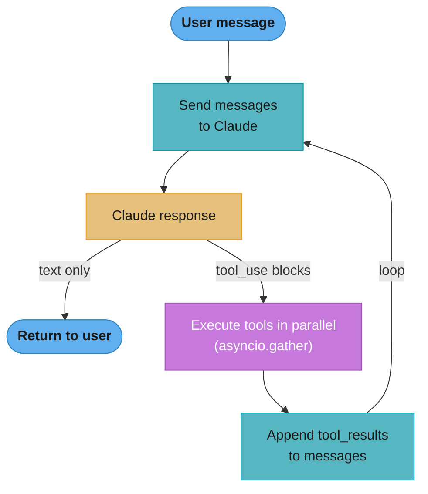
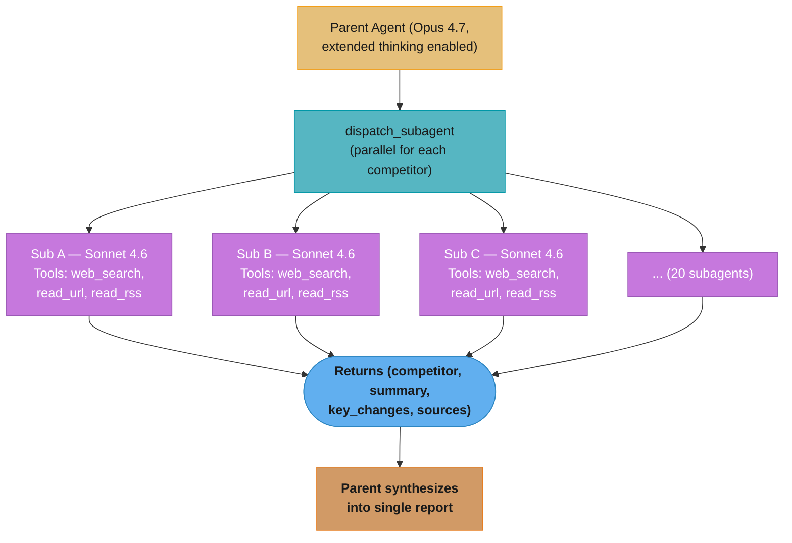

# Building Agents with the Anthropic API — Deep Dive

---

## 1. Concept Overview

The Anthropic API exposes a native tool use loop that is the canonical way to build agents on top of Claude. Unlike framework-wrapped approaches (LangChain, LangGraph), the native approach gives you direct control over the message flow, tool execution, and cost management — at the price of writing more orchestration code yourself.

The pattern: you send a message, Claude responds with either text or one-or-more `tool_use` content blocks, you execute the tools, append `tool_result` blocks to the conversation, and repeat until Claude stops requesting tools. This loop, combined with prompt caching, parallel tool execution, extended thinking, and subagent spawning, is the foundation under Claude Code, Anthropic's own Claude.ai agentic features, and many production agents.

This deep-dive treats "Claude agent SDK" not as a specific package but as the native pattern: the Anthropic Python and TypeScript SDKs combined with the API's tool use, prompt caching, and extended thinking features.

---

## 2. Intuition

**One-line analogy**: Building an agent on the Anthropic API is like writing a REPL — read a tool request from Claude, evaluate the tool, append the result, loop. The model is the read-eval; you provide the print-loop.

**Mental model**: The conversation is a list of messages. Each turn, you send the full conversation to Claude. Claude returns content blocks (text or tool_use). For each tool_use block, you execute the tool and append a matching tool_result block to the next user message. Repeat until Claude returns only text (no tool_use). This is the entire agent loop in ~30 lines of code.

**Why it matters**: Frameworks add abstractions that often hide failure modes — silent retries, hidden caching, opaque message manipulation. The native loop is explicit. You see exactly what's sent, exactly what comes back, exactly what you pay for. For production agents where reliability and cost matter, this transparency is worth the extra orchestration code.

**Key insight**: The most valuable feature of the native API for agents is parallel tool calls — Claude can return 3-5 tool_use blocks in one response, and you execute them all in parallel with `asyncio.gather()`. This single optimization cuts agent latency by 50-70% on multi-tool tasks compared to sequential frameworks.

---

## 3. Core Principles

- **Conversation is explicit**: Every message — user, assistant, tool results — is yours to manage. No hidden state.
- **Tools are typed**: Each tool has a name, description, and JSON Schema `input_schema`. Claude uses the description to decide when to call.
- **Parallel by default**: Claude returns multiple tool_use blocks per response. Always execute in parallel.
- **Cache the prefix**: System prompt + tool definitions + conversation prefix are eligible for prompt caching. Always cache.
- **Extended thinking is opt-in**: For complex reasoning, enable `thinking` mode. Otherwise standard mode is cheaper.
- **No automatic retries**: Errors propagate to your code. You decide retry strategy per tool.
- **Cost is observable**: Every response includes `usage` with input_tokens, output_tokens, cache_creation_input_tokens, cache_read_input_tokens.

---

## 4. Types / Architectures / Strategies

### 4.1 Synchronous Tool Use Loop

The simplest pattern — useful for CLI agents and scripts where latency isn't critical.

### 4.2 Async Parallel Tool Execution

For production agents — execute multiple tool_use blocks concurrently with asyncio.

### 4.3 Streaming Tool Use

For UX-sensitive applications — stream tool decisions and arguments as they arrive. User sees the agent "typing" the tool call.

### 4.4 Extended Thinking + Tool Use

Available on Claude Opus 4.7 and Sonnet 4.6. Claude produces `thinking` content blocks before deciding to call tools. Enable for hard reasoning tasks; the thinking tokens are billed but typically improve tool selection quality significantly.

### 4.5 Subagent Pattern

Parent agent has a `dispatch_subagent(task, tools)` tool. When called, parent spawns a fresh Claude instance with a focused system prompt and a tool subset, runs the loop, and returns a structured result. Parent synthesizes results from multiple subagents. See [Subagents & Delegation](../agents_and_tool_use/subagents_and_delegation.md) for the general pattern.

### 4.6 Computer Use

The `computer` tool gives Claude `screenshot`, `mouse_move`, `left_click`, `type`, and `key` actions. Requires a VM or container with a display. The `computer_use_demo` reference implementation runs in Docker with Xvfb. See [Computer Use & Browser Agents](../agents_and_tool_use/computer_use_and_browser_agents.md) for the full deep dive.

---

## 5. Architecture Diagrams

**Native Tool Use Loop**



The loop repeats — send, execute tool_use blocks, append tool_results — until Claude returns only text (stop_reason="end_turn"). Executing the tool_use blocks in parallel with `asyncio.gather()` is what cuts multi-tool latency 50-70%.

```
Parallel Tool Execution
========================

Sequential (slow):
  tool_a (1.5s) -> tool_b (2.1s) -> tool_c (0.8s) = 4.4s

Parallel (fast):
  tool_a -+
  tool_b -+--asyncio.gather()--> max(1.5, 2.1, 0.8) = 2.1s
  tool_c -+


Subagent Hierarchy
===================

  Parent Agent (Opus, full toolbox)
       |
       +-- dispatch_subagent("research X", [web_search, read_url])
       |        |
       |        v
       |   Subagent A (Sonnet, web tools only)
       |   Returns: {summary, citations, confidence}
       |
       +-- dispatch_subagent("analyze Y", [bash, read_file])
                |
                v
           Subagent B (Sonnet, file tools only)
           Returns: {analysis, errors}


Prompt Caching for Agents
==========================

  +----------------+----------------+----------------+
  |  System prompt |  Tool defs     |  Static prefix |  <-- CACHED
  |  (2000 toks)   |  (1500 toks)   |  (500 toks)    |      (90% cheaper on read)
  +----------------+----------------+----------------+
  |  Conversation history (variable, dynamic)        |  <-- NOT cached
  +--------------------------------------------------+
```

### Decoding the two numbers in that first diagram

**What this actually says.** "Running tools one after another costs you the *sum* of their durations; running them together costs you only the *slowest* one."

That swap — `sum` becomes `max` — is the entire reason `asyncio.gather()` appears in the loop above. It is also why the win grows as you add tools: every extra tool adds its full duration to the sequential number but adds nothing at all to the parallel number unless it happens to be the new slowest.

| Symbol | What it is |
|--------|------------|
| `t_a, t_b, t_c` | Wall-clock duration of each individual tool call (1.5s, 2.1s, 0.8s) |
| `sum(t)` | Sequential wall time — you wait for each tool before starting the next |
| `max(t)` | Parallel wall time — all tools are in flight, you wait for the last to land |
| `sum(t) - max(t)` | The time `asyncio.gather()` buys back |

**Walk one example.** The three tools from the diagram, run both ways:

```
                       t_a     t_b     t_c    wall clock
  sequential  sum      1.5  +  2.1  +  0.8  =   4.4s
  parallel    max      1.5     2.1     0.8  =   2.1s   (t_b is the straggler)

  saved   =  4.4 - 2.1                       =   2.3s
  percent =  2.3 / 4.4                       =  52%
```

A 52% cut, and it lands inside the range the text quotes for real agents. Now add a
fourth tool taking 0.9s: sequential becomes 5.3s, but parallel stays at 2.1s, because
0.9 < 2.1. The straggler sets the floor, so the way to speed up a parallel tool round is
never to trim the fast tools — it is to attack `t_b`.

**Why the term `max` and not an average.** A common instinct is to expect parallel time to
be the *mean* of the durations. It never is. You cannot return to the model until every
tool_result block exists, so one slow tool holds the whole round hostage. This is exactly
why a single un-timeout-ed tool can make an otherwise-fast agent feel broken: it becomes
`max` for every turn it appears in.

---

## 6. How It Works — Detailed Mechanics

### Async Research Agent with Parallel Tools and Caching

```python
import asyncio
import json
import httpx
import anthropic

client = anthropic.AsyncAnthropic()

# Tool definitions with detailed descriptions (model reads these to decide)
TOOLS = [
    {
        "name": "web_search",
        "description": (
            "Search the web for current information. Use for questions about "
            "recent events, current data, or facts you need to verify. "
            "Returns a list of {title, url, snippet} results."
        ),
        "input_schema": {
            "type": "object",
            "properties": {
                "query": {"type": "string", "description": "Search query"},
                "num_results": {"type": "integer", "default": 5, "minimum": 1, "maximum": 10},
            },
            "required": ["query"],
        },
    },
    {
        "name": "read_url",
        "description": (
            "Fetch the full text content of a URL. Use after web_search to read "
            "the actual content of promising results. Returns plain text (HTML stripped)."
        ),
        "input_schema": {
            "type": "object",
            "properties": {"url": {"type": "string", "description": "URL to fetch"}},
            "required": ["url"],
        },
    },
]


async def execute_tool(tool_name: str, tool_input: dict) -> str:
    """Execute a single tool. Returns string output."""
    if tool_name == "web_search":
        # Pseudocode: call a real search API
        results = await search_api(tool_input["query"], tool_input.get("num_results", 5))
        return json.dumps(results)
    elif tool_name == "read_url":
        async with httpx.AsyncClient(timeout=15) as http:
            resp = await http.get(tool_input["url"])
            return resp.text[:50_000]  # Truncate to 50KB
    else:
        return f"Unknown tool: {tool_name}"


async def run_agent(user_query: str, max_iterations: int = 10) -> str:
    """Run the agent loop with parallel tool execution and prompt caching."""
    
    # System prompt is CACHED — pay full price once, then 90% off
    system = [
        {
            "type": "text",
            "text": (
                "You are a research assistant. Use the web_search tool to find "
                "information and read_url to verify details. Call multiple tools "
                "in parallel when researching independent topics. Cite all sources."
            ),
            "cache_control": {"type": "ephemeral"},  # 5-minute TTL cache
        }
    ]
    
    messages: list[dict] = [{"role": "user", "content": user_query}]
    
    for iteration in range(max_iterations):
        response = await client.messages.create(
            model="claude-sonnet-4-6",
            max_tokens=4096,
            system=system,
            tools=TOOLS,
            messages=messages,
        )
        
        # Log cost — cache_read is 0.1x base price
        print(
            f"Iter {iteration}: in={response.usage.input_tokens} "
            f"out={response.usage.output_tokens} "
            f"cache_read={response.usage.cache_read_input_tokens} "
            f"stop_reason={response.stop_reason}"
        )
        
        # Append assistant response to history
        messages.append({"role": "assistant", "content": response.content})
        
        if response.stop_reason == "end_turn":
            # No tool calls — extract final text
            return "".join(b.text for b in response.content if b.type == "text")
        
        # Execute all tool_use blocks IN PARALLEL
        tool_uses = [b for b in response.content if b.type == "tool_use"]
        tool_results = await asyncio.gather(
            *[execute_tool(tu.name, tu.input) for tu in tool_uses],
            return_exceptions=True,
        )
        
        # Append tool results as a single user message
        tool_result_blocks = []
        for tu, result in zip(tool_uses, tool_results):
            if isinstance(result, Exception):
                tool_result_blocks.append({
                    "type": "tool_result",
                    "tool_use_id": tu.id,
                    "content": f"Tool error: {result}",
                    "is_error": True,
                })
            else:
                tool_result_blocks.append({
                    "type": "tool_result",
                    "tool_use_id": tu.id,
                    "content": result,
                })
        messages.append({"role": "user", "content": tool_result_blocks})
    
    return "Max iterations reached without completion"


# Usage
if __name__ == "__main__":
    answer = asyncio.run(run_agent(
        "Compare the energy efficiency of GPT-4o and Claude Sonnet 4.6 inference"
    ))
    print(answer)
```

### Extended Thinking + Tool Use (Opus 4.7)

```python
response = await client.messages.create(
    model="claude-opus-4-7",
    max_tokens=8192,
    thinking={"type": "enabled", "budget_tokens": 5000},  # Up to 5000 thinking tokens
    tools=TOOLS,
    messages=messages,
)

# Response content blocks now include `thinking` blocks before tool_use
for block in response.content:
    if block.type == "thinking":
        print(f"[Thinking]: {block.thinking[:200]}...")
    elif block.type == "tool_use":
        print(f"[Tool call]: {block.name}({block.input})")
    elif block.type == "text":
        print(f"[Answer]: {block.text}")
```

### Cost Math for a 5-Step Agent (Sonnet 4.6)

| Step | Input toks | Output toks | Cache writes | Cache reads | Cost |
|---|---|---|---|---|---|
| 1 | 4000 (3500 cached new) | 800 | 3500 | 0 | 4000×$3 + 3500×$3.75 + 800×$15 = $0.038 |
| 2 | 5200 (3500 cache hit) | 750 | 0 | 3500 | 1700×$3 + 3500×$0.30 + 750×$15 = $0.027 |
| 3 | 6100 (3500 cache hit) | 600 | 0 | 3500 | 2600×$3 + 3500×$0.30 + 600×$15 = $0.028 |
| 4 | 6800 (3500 cache hit) | 500 | 0 | 3500 | 3300×$3 + 3500×$0.30 + 500×$15 = $0.028 |
| 5 | 7400 (3500 cache hit) | 1200 | 0 | 3500 | 3900×$3 + 3500×$0.30 + 1200×$15 = $0.041 |
| **Total** | | | | | **$0.162** |

Without caching: same task would cost ~$0.34 (2.1× more).

**Read it like this.** "Every token in the request is priced by which of three buckets it fell into — fresh input, a cache write, or a cache read — and an agent loop is profitable precisely because the same 3500-token prefix keeps landing in the cheapest bucket."

The `×$3`, `×$3.75`, `×$0.30` and `×$15` in that table are **dollars per million tokens**, so each product is `tokens / 1,000,000 × price`. Read them as raw multiplications and every row comes out a thousand times too large.

| Symbol | What it is |
|--------|------------|
| `$3 / M` | Base input price — what an uncached prompt token costs |
| `$3.75 / M` | Cache **write**: 1.25× base. The one-time premium for storing a prefix |
| `$0.30 / M` | Cache **read**: 0.1× base. What that same prefix costs on every later step |
| `$15 / M` | Output price — 5× base input, and never cacheable |
| `3500` | The static prefix (system prompt + tool defs) that repeats on all 5 steps |

**Walk one example.** Step 1 pays the write premium; steps 2-5 collect the payoff:

```
  step 1  (cache write)
    input     4000 tok  x $3.00 / 1e6  =  $0.012000
    write     3500 tok  x $3.75 / 1e6  =  $0.013125
    output     800 tok  x $15.00 / 1e6 =  $0.012000
                                          ---------
                                          $0.037125   -> table's $0.038

  the 3500-token prefix, per later step
    as cache read   3500 x $0.30 / 1e6 =  $0.00105
    as fresh input  3500 x $3.00 / 1e6 =  $0.01050
    saved per step                     =  $0.00945
    saved over steps 2-5   4 x $0.00945 =  $0.03780
```

That $0.0378 saved is roughly the entire cost of step 1 — the prefix pays for its own
storage inside four turns. Scaled to the whole run, $0.34 uncached against $0.162 cached
is `0.34 / 0.162 = 2.1x`, exactly the multiplier quoted above the fold.

**Why a cache *write* costs more than plain input.** Without the 1.25× surcharge the
provider would be storing your prefix for free, and every caller would mark everything
ephemeral. The surcharge makes caching a bet: you pay 25% extra once, wagering that the
prefix will be re-read at least a couple of times. The bet is cheap to win — one read at
0.1× recovers far more than the 0.25× you staked, which is why the next section's
break-even lands on the second call.

---

## 7. Real-World Examples

**Claude Code** (Anthropic's CLI): native tool use with `bash`, file read/write, web fetch, and subagent dispatch. Uses prompt caching aggressively for the CLAUDE.md context injection.

**Cursor Composer**: Uses Anthropic API tool use for multi-file edits. Calls `edit_file` and `read_file` tools in parallel across multiple files.

**Replit Agent**: Anthropic API tool use loop running in a Replit container. Tools include shell, file editor, and `install_package`.

**Anthropic Research Multi-Agent System**: Parent Claude Opus agent dispatches Sonnet subagents in parallel for research tasks. Each subagent has a narrow tool subset (web only, or file only). Documented in Anthropic engineering blog as the pattern behind their research feature.

**Production customer support agent at scale**: Sonnet 4.6 with 5 tools (CRM lookup, KB search, refund issue, escalate, send_email). Handles 50K conversations/day. Average 3.2 tool calls per conversation, $0.018/conversation cost with caching.

---

## 8. Tradeoffs

| Dimension | Native Anthropic API | LangChain/LangGraph | OpenAI Agents SDK | CrewAI |
|---|---|---|---|---|
| Control over message flow | Full | Wrapped | Wrapped | Heavily abstracted |
| Parallel tool calls | Native, asyncio.gather | Via custom code | Native | Limited |
| Prompt caching | Native, explicit | Via callbacks | N/A (OpenAI) | Not supported |
| Extended thinking | Native | Via wrappers | N/A | Not supported |
| Subagent pattern | Hand-rolled | LangGraph subgraphs | handoff() primitive | Hierarchical processes |
| Observability | Manual logging | LangSmith built-in | OpenAI tracing | Custom |
| Learning curve | Low (REST API) | Medium-high | Low | Low |
| Lock-in | Anthropic only | Multi-provider | OpenAI only | Multi-provider |
| Best for | Production agents, cost-critical | Rapid prototyping, multi-provider | OpenAI-only stacks | Role-based simulations |

---

## 9. When to Use / When NOT to Use

**Use the native Anthropic API directly when:**
- Production agent where cost and reliability matter (full control over caching, retries)
- Latency-sensitive (parallel tool execution, streaming)
- You need extended thinking for complex reasoning
- You want to spawn subagents with custom logic
- Tool definitions are stable (not constantly experimented)

**Use a framework instead when:**
- Prototyping rapidly across multiple LLM providers
- You need built-in observability without setup (LangSmith)
- Complex stateful workflows with branching (LangGraph)
- Team unfamiliar with async Python

---

## 10. Common Pitfalls

### Pitfall 1: Sequential tool execution

```python
# BROKEN: Sequential — 4.4s total
for tool_use in tool_uses:
    result = await execute_tool(tool_use.name, tool_use.input)
    tool_results.append(result)
```

```python
# FIXED: Parallel — 2.1s total (max of individual tools)
tool_results = await asyncio.gather(
    *[execute_tool(tu.name, tu.input) for tu in tool_uses],
    return_exceptions=True,  # Don't fail all if one fails
)
```

### Pitfall 2: Missing tool_result for a tool_use

```python
# BROKEN: Some tool_use blocks have no matching tool_result
# Result: 400 error from API "tool_use_id not found"
for tu in tool_uses:
    try:
        result = await execute_tool(tu.name, tu.input)
        tool_results.append({"type": "tool_result", "tool_use_id": tu.id, "content": result})
    except SomeException:
        continue  # Silently skip — BREAKS the loop
```

```python
# FIXED: Always produce a tool_result for every tool_use, even on error
for tu in tool_uses:
    try:
        result = await execute_tool(tu.name, tu.input)
        tool_results.append({
            "type": "tool_result", "tool_use_id": tu.id, "content": result
        })
    except Exception as e:
        tool_results.append({
            "type": "tool_result", "tool_use_id": tu.id,
            "content": f"Error: {e}", "is_error": True,  # Let Claude see error and retry
        })
```

### Pitfall 3: Forgetting to cache the system prompt

```python
# BROKEN: System prompt sent fresh every iteration — pays $3/M for 2000 tokens × 10 calls
system = "You are a research assistant with these tools..." # 2000 tokens
response = await client.messages.create(model=..., system=system, ...)
# 10 iterations × 2000 tokens × $3/M = $0.06 just on system prompt
```

```python
# FIXED: Cache the system prompt
system = [{
    "type": "text",
    "text": "You are a research assistant...",
    "cache_control": {"type": "ephemeral"},
}]
# First call: 2000 tokens at $3.75/M (cache write) = $0.0075
# Calls 2-10: 2000 tokens at $0.30/M (cache read) = 9 × $0.0006 = $0.0054
# Total: $0.013 vs $0.06 — 78% savings
```

**The idea behind it.** "Sending a fixed system prompt N times costs `N` full-price copies; caching it costs one premium copy plus `N-1` copies at a tenth the price."

| Symbol | What it is |
|--------|------------|
| `N` | Number of API calls that reuse the identical prefix (10 here) |
| `P` | Base input price, $3 / M |
| `1.25 P` | Cache-write price, $3.75 / M — paid on call 1 only |
| `0.1 P` | Cache-read price, $0.30 / M — paid on calls 2 through `N` |
| break-even `N` | The call count at which caching stops losing money and starts saving it |

**Walk one example.** The 2000-token system prompt over 10 iterations:

```
  uncached
    10 calls x 2000 tok x $3.00 / 1e6              =  $0.0600

  cached
    call 1     2000 tok x $3.75 / 1e6              =  $0.0075
    calls 2-10  9 x 2000 tok x $0.30 / 1e6         =  $0.0054
                                                      -------
                                                      $0.0129   -> "$0.013"

    saved  = (0.0600 - 0.0129) / 0.0600            =  78.5%

  break-even: solve  1.25 P + 0.1 P (N-1)  =  P N
                     1.25 + 0.1 N - 0.1    =  N
                     1.15                  =  0.9 N
                     N                     =  1.28 calls
```

Break-even at `N = 1.28` means caching is already ahead on the **second** call — you never
need a long conversation to justify it. That is the number behind the war story below: at
100K conversations/day with 5-20 messages each, every single conversation clears the
threshold many times over, so the monthly bill falls from $4200 to $1100, a
`(4200 - 1100) / 4200 = 74%` reduction.

**What breaks without the 5-minute TTL in the picture.** The break-even above silently
assumes the prefix is still resident when call 2 arrives. If a user's messages are spread
20 minutes apart, every call is a fresh write at 1.25× and caching becomes a 25% *surcharge*
rather than a 90% discount. Bursty traffic is not a nice-to-have for prompt caching — it is
the precondition that makes the arithmetic work.

**War story**: A team running 100K agent conversations/day was billed $4200/month before they added prompt caching. Their system prompt was 3500 tokens describing 12 tools. After enabling cache_control on system+tools: bill dropped to $1100/month (74% reduction). The 5-minute cache TTL was sufficient because the agent processed conversations in bursts (each user had 5-20 messages within a 5-minute window).

---

## 11. Technologies & Tools

| Tool | Purpose | Notes |
|---|---|---|
| `anthropic` (Python SDK) | Official SDK | `pip install anthropic`; sync and async clients |
| `@anthropic-ai/sdk` (TS) | Official TypeScript SDK | npm install; same API surface |
| MCP servers | Pre-built tools | Connect via stdio/HTTP, expose as Claude tools — see [MCP](../mcp_model_context_protocol/README.md) |
| Computer use docker reference | Sandbox for computer tool | `ghcr.io/anthropics/anthropic-quickstarts` |
| `aiohttp` / `httpx` | Async HTTP in tools | For parallel external API calls |
| OpenTelemetry | Manual tracing | Wrap LLM calls to send to Jaeger/Honeycomb |
| Prompt caching dashboard | Cost monitoring | Use `usage.cache_*` fields in responses |

---

## 12. Interview Questions with Answers

**Q: What is the tool use loop in the Anthropic API?**
The tool use loop is the canonical agent pattern: send messages to Claude, receive a response with text and/or tool_use content blocks, execute each tool_use, append matching tool_result blocks to a user message, and repeat. The loop terminates when Claude returns only text (stop_reason="end_turn"). Each iteration is one API call.

**Q: How do you execute multiple Claude tool calls in parallel?**
Use `asyncio.gather()` over the tool_use blocks: `results = await asyncio.gather(*[execute_tool(tu.name, tu.input) for tu in tool_uses])`. Always pass `return_exceptions=True` so one failing tool doesn't break the others — handle each result individually and convert exceptions to tool_result blocks with `is_error=True`.

**Q: Why must every tool_use block have a corresponding tool_result?**
The Anthropic API enforces this — if you send a follow-up user message missing a tool_result for a previously returned tool_use_id, you get a 400 error. The model needs to see the outcome of every tool it called to update its reasoning. Always produce a tool_result, even on tool errors (use `is_error=True` so the model can self-correct).

**Q: How does prompt caching work for agents and what does it save?**
Prompt caching marks a prefix of the prompt (system prompt + tool definitions + early conversation turns) as cacheable with `cache_control: {"type": "ephemeral"}`. The cache is keyed by the exact prefix content and lives for 5 minutes. Cache writes cost 1.25× base input price; cache reads cost 0.1× base price. For agents with 2-3K token system prompts called 5-20 times in a session, caching saves 60-80% of input token cost.

**Q: What is the difference between standard mode and extended thinking mode?**
Standard mode returns content as text or tool_use blocks immediately. Extended thinking mode (Opus 4.7, Sonnet 4.6+) adds a "thinking" phase before the response — Claude produces internal reasoning content blocks before deciding on tools or final answer. Thinking tokens are billed at output token price. Enable with `thinking={"type": "enabled", "budget_tokens": N}`. Use for complex problems where reasoning quality matters more than latency.

**Q: How do you implement subagent spawning with the native API?**
Define a `dispatch_subagent` tool with parameters {task, allowed_tools}. When the parent calls it, your code starts a fresh `run_agent()` call with a focused system prompt, the requested tool subset, and the task as user message. Run the subagent loop to completion. Return the subagent's final text as the tool_result. For parallel subagents, your parent's tool_use loop will gather them automatically via `asyncio.gather()`.

**Q: What stop_reasons can the API return and what do they mean?**
`end_turn` (model finished naturally — extract final text), `tool_use` (model wants to call tools — execute and loop), `max_tokens` (hit the max_tokens limit — usually retry with larger limit), `stop_sequence` (matched a stop sequence — rare in agents), `pause_turn` (long-running operation paused — resume by sending an empty user turn). The loop logic branches on stop_reason.

**Q: How do you handle a tool that returns 500KB of output?**
Truncate at the tool execution layer, not at the API layer. Cap at 50KB-100KB max, and add a marker like "[Truncated: 500000 chars total]" so Claude knows the data was cut off. If the tool is something like `read_file`, prefer adding a grep/extract parameter so Claude can request specific sections instead of dumping the whole file.

**Q: What is the cost difference between Haiku, Sonnet, and Opus for the same agent task?**
Approximately 5× between adjacent tiers. Haiku 4.5: $0.80/M input, $4/M output. Sonnet 4.6: $3/M input, $15/M output (3.75× Haiku). Opus 4.7: $15/M input, $75/M output (5× Sonnet). For tool-heavy agents where reasoning quality matters, Sonnet is the typical sweet spot. Use Opus only for the hardest reasoning steps via cascading. Haiku for routing/classification.

**Q: How do you stream tool use to the user?**
Use `client.messages.stream(...)` which yields events. Watch for `content_block_start` (with type=tool_use — start showing "Calling tool X..."), `content_block_delta` (with input_json_delta — progressively reveal the JSON arguments), and `content_block_stop` (tool args complete). Useful for UX where users want to see what the agent is doing before tools execute.

**Q: How does the computer use tool work?**
The `computer` tool has actions: screenshot, mouse_move, left_click, right_click, double_click, type, key. Claude calls these to interact with a desktop environment. Your code must provide a real desktop (typically Docker container with Xvfb display) and execute the actions via pyautogui or similar. Each screenshot is returned as image content. Latency is high (5-10s per action) so use sparingly — prefer DOM-based browser tools when possible.

**Q: When should you NOT use the native API and use a framework instead?**
When you need: (a) rapid prototyping across providers (LangChain abstracts model selection), (b) built-in observability without setup (LangSmith integrates with LangChain immediately), (c) complex stateful workflows with branching and persistence (LangGraph), (d) the team is unfamiliar with async Python. For production agents where cost, latency, and reliability dominate, native is usually better.

**Q: How do you test an agent built on the native API?**
Mock the `client.messages.create` to return canned responses (mock the AsyncAnthropic class with `unittest.mock.AsyncMock`). Pre-record the sequence of tool_use blocks and final text for known scenarios. Assert that your tool execution code produces the expected tool_results. For end-to-end tests, use the real API with small inputs and assert on tool call counts and final answer patterns. Use `pytest-asyncio` for async test support.

**Q: How do you handle rate limits from the API?**
The SDK auto-retries on 429 with exponential backoff (configurable via `max_retries`). For high-volume agents, implement your own queue with token bucket per minute (Anthropic rate limits are typically per-minute on tokens and per-minute on requests). Monitor 429 rates — if frequently rate-limited, request higher limits via Anthropic support or shift load with Batch API for non-real-time work (50% cost discount).

**Q: What is the right way to handle conversation history that exceeds the context window?**
Claude has 200K token context. Track conversation token count after each response (`usage.input_tokens` tells you the full conversation size). When approaching 140K (70% of window), trigger compaction: summarize the early conversation turns with a separate LLM call and replace them with the summary. Keep the last N (typically 5-10) tool result pairs verbatim since they're often the most relevant.

**Q: Why is parallel tool execution often a 2-3× speedup vs sequential?**
Tools spend most of their time waiting on I/O (HTTP requests, database queries, file reads). Sequential execution serializes the waits — 3 tools of 1.5s each = 4.5s total. Parallel execution overlaps the waits — 3 tools of 1.5s each = ~1.5s total. The model can request 3-5 parallel tools in one response, so the savings compound across the conversation. Without parallel execution, multi-tool agents feel sluggish even when the model decisions are fast.

---

## 13. Best Practices

1. Always use the async SDK (`AsyncAnthropic`) for agents — sync blocks the event loop and prevents parallel tool execution.
2. Always cache the system prompt + tool definitions with `cache_control: {"type": "ephemeral"}` — typical 60-80% input cost reduction.
3. Always execute tool_use blocks in parallel with `asyncio.gather(..., return_exceptions=True)`.
4. Always produce a tool_result for every tool_use, even on tool errors (with `is_error=True`).
5. Set a `max_iterations` cap in your agent loop (typical: 10-20) to prevent infinite loops.
6. Log `usage` fields after every API call — input_tokens, output_tokens, cache_read_input_tokens, cache_creation_input_tokens — for cost attribution.
7. Truncate tool outputs at 50KB max before adding to tool_result content.
8. For complex reasoning, enable extended thinking on Opus/Sonnet — typical 10-20% quality improvement on hard tasks.
9. Pin model version in production (`claude-sonnet-4-6` not `claude-sonnet-latest`) — model updates can change behavior.
10. Write tool descriptions like API documentation — describe what it does, when to call it, what it returns, with example inputs.

---

## 14. Case Study

**Multi-Source Competitive Intelligence Agent**

**Context**: A B2B SaaS company needs a daily competitive intelligence report covering 20 competitors. Manual collection took an analyst 6 hours/day.

**Architecture**:



All 20 Sonnet subagents are dispatched in parallel via `asyncio.gather()`, each returning a structured result that the Opus parent synthesizes — total runtime ~90 seconds instead of a sequential 30+ minutes.

**Key implementation details**:
- System prompt (1800 tokens) + tools (1200 tokens) cached on every API call — 70% input cost savings.
- 20 subagents dispatched in parallel via `asyncio.gather()` — total runtime ~90 seconds despite 20 competitors.
- Each subagent has max_iterations=8 to bound cost; typical actual: 4-5 iterations.
- Parent extended thinking enabled (budget 3000 tokens) for final synthesis.

**Results**:
- Daily runtime: 90 seconds (was 6 hours manual)
- Daily cost: $1.20 (20 subagents × ~$0.04 each + parent synthesis $0.40)
- Quality: 92% of items flagged as "actionable" by the analyst on review (manual baseline: 88%)
- Caught a competitor pricing change in 11 minutes vs the analyst noticing it 2 days later in a competitor blog post

**Lessons learned**:
1. Without parallel subagent dispatch, runtime would have been 30+ minutes — the parallel pattern is what makes this practical.
2. Caching system prompts was non-negotiable — without it, daily cost would be $4.10.
3. Subagent tool subsetting (only web tools, no file/bash) gave clean failure modes — subagents couldn't accidentally affect host state.
4. Extended thinking on the parent dramatically improved synthesis quality — the parent caught patterns across competitors that single subagents missed.
