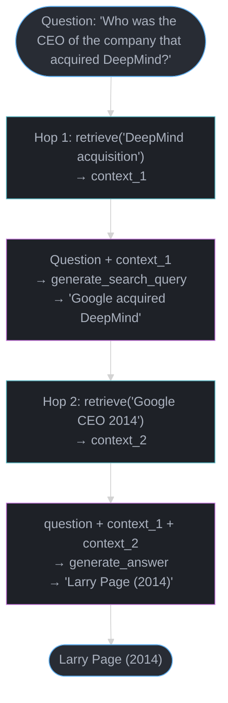

# DSPy — Deep Dive

---

## 1. Concept Overview

DSPy (Declarative Self-improving Python) is a framework from Stanford NLP that replaces hand-written prompts with declarative programs that can be automatically optimized. Instead of engineering prompts manually ("Let's think step by step..." / "You are an expert..."), DSPy lets you define the *signature* of what you want (input fields → output fields) and an *optimizer* finds the best prompts, few-shot examples, and chain configurations to maximize a metric.

DSPy shifts the prompt engineering workflow from art to science: you write a metric (e.g., "is the answer correct?"), provide training examples, and DSPy searches the prompt space algorithmically to maximize the metric.

**Current version**: dspy-ai 2.4.x (2024)
**Production adoption signal**: Used by JetBlue (customer support), VMware (security alerts), and adopted in Stanford NLP research. Growing rapidly in enterprise AI teams that want reproducible, measurable prompt improvement. Heavily cited in 2024 AI engineering research.

---

## 2. Intuition

**One-line analogy**: DSPy is to prompts what gradient descent is to neural network weights — you define a loss function and the optimizer finds the best parameters automatically.

**Mental model**: Traditional prompt engineering: write a prompt, test it manually, tweak wording, hope it generalizes. DSPy: define what you want (signature), define a metric, provide 50-200 labeled examples, run an optimizer. The optimizer tries different prompt variations, few-shot combinations, and instruction phrasings, evaluating each against the metric on a validation set. The best-performing configuration is compiled into your program.

**Why it matters**: Manual prompt engineering has three problems: it doesn't generalize across models (a GPT-4 prompt often fails on Claude), it's not reproducible (different engineers write different prompts for the same task), and it doesn't optimize systematically. DSPy addresses all three by treating the prompt as a hyperparameter to be optimized, not a piece of art to be crafted.

**Key insight**: DSPy decouples the program structure (what steps to take) from the prompt text (how to phrase each step). You write the structure once; the optimizer finds the phrasing. This means changing models (GPT-4 → Llama-3) only requires re-running the optimizer, not rewriting prompts.

---

## 3. Core Principles

**Signatures**: The fundamental abstraction. A `Signature` defines input fields and output fields with docstrings. `"question -> answer"` says: given a question, produce an answer. The signature is model-agnostic — it does not say how to phrase the prompt.

**Modules**: `dspy.Module` subclasses are composable programs. Built-in modules: `Predict` (single LLM call), `ChainOfThought` (adds rationale field), `ReAct` (tool-calling agent loop), `ProgramOfThought` (generates and executes Python code). Compose them to build multi-step programs.

**Optimizers (Teleprompters)**: `dspy.teleprompt` contains algorithms that optimize program parameters. `BootstrapFewShot` generates few-shot examples from training data. `MIPRO` (Multi-prompt Instruction Proposal Optimizer) optimizes instructions themselves. `BayesianSignatureOptimizer` uses Bayesian optimization over the instruction space.

**Metrics**: A Python function that takes `(example, prediction, trace=None)` and returns a score (float or bool). DSPy calls this during optimization to evaluate candidates. The metric is what makes DSPy's optimization meaningful — define it poorly and you get optimized garbage.

**Compilation**: Running an optimizer produces a compiled program. Compiled programs have their prompts, few-shot examples, and instructions baked in. Compiled programs can be saved to JSON and loaded without re-running the optimizer.

---

## 4. Types / Architectures / Strategies

### Predict Modules (built-in)

| Module | Behavior | Added Prompt Pattern |
|--------|---------|---------------------|
| `dspy.Predict` | Single LLM call | None |
| `dspy.ChainOfThought` | LLM generates rationale then answer | Adds "Reasoning" field |
| `dspy.ChainOfThoughtWithHint` | CoT with a hint field | Hint injected into prompt |
| `dspy.ProgramOfThought` | Generates + executes Python code | Code field, execution result |
| `dspy.ReAct` | Agent loop with tools | Thought/Action/Observation |
| `dspy.MultiChainComparison` | Multiple reasoning chains, best selected | N parallel CoT attempts |

### Optimizers (Teleprompters)

| Optimizer | Strategy | Training Examples Needed | Cost |
|-----------|---------|------------------------|------|
| `BootstrapFewShot` | Generate few-shot examples from training data | 10-50 | Low |
| `BootstrapFewShotWithRandomSearch` | Bootstrap + search over example sets | 50-200 | Medium |
| `MIPRO` | Bayesian optimization over instructions + examples | 100-500 | High |
| `BayesianSignatureOptimizer` | Bayesian search over signature instructions | 50-200 | High |
| `SignatureOptimizer` | Gradient-free instruction optimization | 50-100 | Medium |
| `KNNFewShot` | K-nearest neighbors example selection at runtime | Any | Low (no train) |

### Program Architectures

1. **Single predictor**: one `Predict` or `ChainOfThought` call
2. **Pipeline**: multiple `Predict` calls in sequence (e.g., extract → classify → summarize)
3. **Multi-hop RAG**: retrieve → generate → re-retrieve based on answer → final answer (see [Advanced RAG](../advanced_rag/README.md))
4. **Agentic**: `ReAct` with tools (function calls + retrieval) — the loop itself is covered in [ReAct & Reasoning Patterns](../agents_and_tool_use/react_and_reasoning_patterns.md)

---

## 5. Architecture Diagrams

### DSPy Program Compilation Flow

```
Developer writes:
  class RAGProgram(dspy.Module):
      def forward(self, question):
          context = self.retrieve(question)
          return self.generate(question=question, context=context)

  metric = lambda ex, pred: ex.answer.lower() in pred.answer.lower()
  optimizer = BootstrapFewShot(metric=metric, max_bootstrapped_demos=4)

COMPILATION (runs on training set):
  for each training_example in trainset:
      run forward() with current prompt
      check metric(training_example, prediction)
      if good: add to candidate few-shot examples

  search over combinations of few-shot examples
  evaluate each on devset
  pick best combination

OUTPUT: compiled_program with:
  - optimized few-shot examples baked into each Predict/ChainOfThought
  - optimized instructions (if using MIPRO)

compiled_program.save("rag_program.json")
```

### Signature Expansion

```
User defines:
  class QASignature(dspy.Signature):
      """Answer the question based on the context."""
      context: str = dspy.InputField()
      question: str = dspy.InputField()
      answer: str = dspy.OutputField()

DSPy generates prompt:
  ---
  Answer the question based on the context.

  Context: {context}
  Question: {question}

  [few-shot examples here if compiled]

  Context: {actual_context}
  Question: {actual_question}
  Answer:
  ---

ChainOfThought adds "reasoning" field:
  ...
  Answer: Let me think step by step. [reasoning]
  Answer: [final answer]
```

### Multi-Hop RAG Flow



Multi-hop reasoning lets DSPy iteratively retrieve and generate — each hop narrows the question using evidence from the previous hop, mimicking how a human expert would chain lookups.

---

## 6. How It Works — Detailed Mechanics

### Basic DSPy Program

```python
import dspy

# 1. Configure the LM
lm = dspy.LM("openai/gpt-4o", api_key=os.environ["OPENAI_API_KEY"])
dspy.configure(lm=lm)

# 2. Define a signature (input → output)
class Summarize(dspy.Signature):
    """Summarize the document in one paragraph."""
    document: str = dspy.InputField(desc="The document to summarize")
    summary: str = dspy.OutputField(desc="A concise one-paragraph summary")

# 3. Use a module
summarizer = dspy.Predict(Summarize)
result = summarizer(document="Long article about AI...")
print(result.summary)

# ChainOfThought adds a reasoning step automatically
summarizer_cot = dspy.ChainOfThought(Summarize)
result = summarizer_cot(document="Long article about AI...")
print(result.reasoning)  # the model's chain-of-thought
print(result.summary)
```

### Composing a Multi-Step Program

```python
import dspy
from dspy.retrieve.chromadb_rm import ChromadbRM

# Configure retrieval model
retriever = ChromadbRM(collection_name="docs", persist_directory="./chroma_db")
dspy.configure(lm=dspy.LM("openai/gpt-4o"), rm=retriever)

class GenerateAnswer(dspy.Signature):
    """Answer the question based on context. Be concise."""
    context: list[str] = dspy.InputField(desc="Retrieved context passages")
    question: str = dspy.InputField()
    answer: str = dspy.OutputField(desc="Often 1-3 sentences")

class RAGProgram(dspy.Module):
    def __init__(self, num_passages=3):
        super().__init__()
        self.retrieve = dspy.Retrieve(k=num_passages)
        self.generate = dspy.ChainOfThought(GenerateAnswer)

    def forward(self, question):
        # retrieve() uses the configured retrieval model
        passages = self.retrieve(question).passages
        prediction = self.generate(context=passages, question=question)
        return dspy.Prediction(answer=prediction.answer, context=passages)

# Instantiate and run
rag = RAGProgram(num_passages=3)
result = rag(question="What is RAG?")
print(result.answer)
```

### Optimization with BootstrapFewShot

```python
from dspy.teleprompt import BootstrapFewShot

# Training data: list of dspy.Example objects
trainset = [
    dspy.Example(question="What is the capital of France?", answer="Paris").with_inputs("question"),
    dspy.Example(question="Who wrote Hamlet?", answer="Shakespeare").with_inputs("question"),
    # ... 50-200 examples
]

devset = [
    dspy.Example(question="What is 2+2?", answer="4").with_inputs("question"),
    # ... held-out validation set
]

# Define evaluation metric
def answer_exact_match(example, pred, trace=None):
    return example.answer.lower().strip() == pred.answer.lower().strip()

# Optimize: Bootstrap generates few-shot examples from trainset
optimizer = BootstrapFewShot(
    metric=answer_exact_match,
    max_bootstrapped_demos=4,   # max few-shot examples per predictor
    max_labeled_demos=16,       # max labeled examples to use
    num_candidate_programs=10,  # programs to evaluate (more = better, slower)
)

compiled_rag = optimizer.compile(
    student=RAGProgram(),   # program to optimize
    trainset=trainset,
)

# Evaluate on devset
evaluate = dspy.Evaluate(devset=devset, metric=answer_exact_match, num_threads=4)
score = evaluate(compiled_rag)
print(f"Accuracy: {score:.2%}")  # e.g., "Accuracy: 78.50%"

# Save compiled program
compiled_rag.save("optimized_rag.json")

# Load later (no re-optimization needed)
loaded_rag = RAGProgram()
loaded_rag.load("optimized_rag.json")
```

### MIPRO — Instruction Optimization

```python
from dspy.teleprompt import MIPROv2

# MIPRO optimizes both instructions and few-shot examples
# Requires more training examples (100-500) and is more expensive
optimizer = MIPROv2(
    metric=answer_exact_match,
    auto="medium",  # "light", "medium", "heavy" — controls search budget
    num_threads=8,
)

compiled_program = optimizer.compile(
    student=RAGProgram(),
    trainset=trainset,
    valset=devset,
)

# MIPRO will find instructions like:
# "You are a precise answering system. Given retrieved passages, answer factually
#  in 1-2 sentences. If uncertain, say so rather than guessing."
# ...instead of the generic "Answer the question based on context."
```

### Multi-Hop RAG

```python
class GenerateSearchQuery(dspy.Signature):
    """Generate a search query to find missing information."""
    context: list[str] = dspy.InputField(desc="Known context")
    question: str = dspy.InputField()
    search_query: str = dspy.OutputField()

class MultiHopRAG(dspy.Module):
    def __init__(self, num_passages=3, max_hops=2):
        super().__init__()
        self.retrieve = dspy.Retrieve(k=num_passages)
        self.generate_query = [dspy.ChainOfThought(GenerateSearchQuery) for _ in range(max_hops)]
        self.generate_answer = dspy.ChainOfThought(GenerateAnswer)
        self.max_hops = max_hops

    def forward(self, question):
        context = []
        for hop in range(self.max_hops):
            query = self.generate_query[hop](context=context, question=question).search_query
            passages = self.retrieve(query).passages
            context += passages  # accumulate context across hops

        answer = self.generate_answer(context=context, question=question)
        return dspy.Prediction(context=context, answer=answer.answer)
```

### DSPy with Assertions

```python
# Assertions enforce constraints during program execution
class FactualQA(dspy.Module):
    def __init__(self):
        self.generate = dspy.ChainOfThought("question -> answer, confidence")

    def forward(self, question):
        pred = self.generate(question=question)

        # Hard assertion: fail if violated
        dspy.Assert(
            pred.confidence in ["high", "medium", "low"],
            "Confidence must be high, medium, or low"
        )

        # Soft assertion: retry with feedback if violated (backtracking)
        dspy.Suggest(
            len(pred.answer.split()) <= 50,
            "Answer should be concise (under 50 words)"
        )

        return pred
```

---

## 7. Real-World Examples

**JetBlue**: Built a customer support system for flight status, rebooking, and policy questions. DSPy with MIPRO optimizer increased accuracy from 71% (manual prompts) to 89% on their evaluation set. The key gain: MIPRO found instructions that explicitly told the model to use policy dates and check for exceptions — something engineers had missed in manual prompts.

**VMware (Broadcom)**: Security alert triage system. Classifies security alerts by severity and recommends actions. DSPy allowed optimizing for their specific alert taxonomy without prompt engineering expertise in each security domain.

**Stanford NLP research**: DSPy is used in multiple academic papers to quickly build and optimize complex NLP pipelines. `HotpotQA` multi-hop QA task: DSPy + multi-hop RAG with MIPRO reached near-state-of-the-art on the benchmark without custom fine-tuning.

**Enterprise RAG pipelines**: Multiple companies replacing hand-crafted RAG prompts with DSPy programs, gaining 10-25% accuracy improvements measured by their domain-specific metrics.

---

## 8. Tradeoffs

| Dimension | DSPy | Manual Prompt Eng. | Fine-tuning |
|-----------|------|-------------------|-------------|
| Initial effort | Medium (define metric + examples) | Low (write prompts) | High (training data + GPU) |
| Result quality | High (systematic optimization) | Variable | Highest |
| Reproducibility | High (metric-driven) | Low (subjective) | High |
| Model portability | High (re-run optimizer per model) | Low (model-specific) | None (model-specific) |
| Debugging | Medium (why did optimizer choose this?) | Easy (you wrote it) | Hard (weights) |
| Training data needed | 50-500 examples | 0 | 1K-100K examples |
| Cost | Medium (optimizer makes many LLM calls) | Low | High (GPU) |
| Runtime overhead | Low (compiled to static prompts) | Low | None |

**DSPy vs [LangChain](langchain_and_lcel.md):**

| Aspect | DSPy | LangChain |
|--------|------|-----------|
| Primary focus | Prompt optimization | Chain orchestration |
| State management | No (stateless programs) | RunnableWithMessageHistory |
| Built-in tools | Retrieval + assertions | 300+ integrations |
| Learning curve | High (new paradigm) | Medium |
| When to use | Accuracy-critical tasks | General LLM apps |

---

## 9. When to Use / When NOT to Use

**Use DSPy when:**
- Task has a measurable metric (accuracy, F1, ROUGE, custom LLM judge)
- Manual prompts are performing inconsistently or poorly
- Switching between models frequently (re-run optimizer for each model)
- Building a pipeline that will be maintained long-term (compiled programs are durable)
- Research/academic work requiring reproducible, measurable results
- Complex multi-step pipelines where prompt interactions are hard to tune manually

**Do NOT use DSPy when:**
- No labeled training data available (DSPy requires examples to optimize against)
- Simple, well-performing one-shot tasks (optimization is unnecessary overhead)
- Fast iteration cycle required (compilation takes minutes to hours)
- Team unfamiliar with the DSPy paradigm (learning curve is steep)
- Real-time applications where the optimizer's LLM calls are too slow (compilation is offline, but setup time matters)

---

## 10. Common Pitfalls

**Pitfall 1: Weak metrics**
The metric is the core of DSPy. If your metric doesn't capture what you want, the optimizer maximizes the wrong thing.
```python
# BAD: metric rewards length, not correctness
def bad_metric(example, pred):
    return len(pred.answer) > 20  # will optimize for verbosity

# GOOD: metric measures actual correctness
def good_metric(example, pred):
    return example.answer.lower() in pred.answer.lower()

# BETTER: LLM-as-judge for subjective tasks
def llm_judge_metric(example, pred):
    judge = dspy.Predict("question, answer, reference -> score: int")
    result = judge(question=example.question, answer=pred.answer, reference=example.answer)
    return int(result.score) >= 4  # out of 5
```

**Pitfall 2: Too few training examples**
`BootstrapFewShot` with 5 examples will produce poor few-shot demonstrations. Minimum: 20-50 examples for `BootstrapFewShot`, 100-500 for `MIPRO`. Teams ran optimization with 10 examples, got a compiled program, deployed it, and saw worse performance than their original prompts. The optimizer found degenerate few-shot examples that happened to score well on the tiny training set but didn't generalize.

**Pitfall 3: Data leakage between train and dev sets**
If your trainset and devset contain similar examples, the optimizer will overfit to the dataset and show inflated devset scores. In production, performance is worse. Fix: create train/dev splits from diverse sources; ensure devset examples are truly held out.

**Pitfall 4: Forgetting to compile before production**
```python
# WRONG: uncompiled program uses no few-shot examples
program = RAGProgram()
result = program(question="...")  # works but suboptimal

# CORRECT: compile first, then deploy
compiled = optimizer.compile(RAGProgram(), trainset=trainset)
compiled.save("production_program.json")
# In production:
program = RAGProgram()
program.load("production_program.json")  # loads compiled state
```

**Pitfall 5: Re-running optimizer on every deployment**
Optimization is expensive (many LLM calls). Teams accidentally added `optimizer.compile()` to their application startup, causing 5-minute startup times and huge API costs. Optimization runs once offline; the compiled JSON is versioned in git and loaded at runtime.

**Pitfall 6: Module state mutation**
DSPy modules have `self.predict`, `self.generate`, etc. These accumulate history by default. In concurrent production serving, multiple threads sharing the same module instance leads to corrupted history. Fix: instantiate a new module per request, or configure DSPy with `dspy.settings.backtrack_to = False` to disable history accumulation.

---

## 11. Technologies & Tools

| Tool | Category | Notes |
|------|----------|-------|
| `dspy-ai` | Core framework | `pip install dspy-ai` |
| `dspy.LM` | LM provider | Supports OpenAI, Anthropic, Cohere, Ollama, HuggingFace |
| `dspy.Retrieve` | Retrieval | Plugs into ChromaDB, Pinecone, Weaviate, ColBERT |
| `dspy.teleprompt` | Optimizers | BootstrapFewShot, MIPRO, BayesianSignatureOptimizer |
| `dspy.Evaluate` | Evaluation | Runs metric on devset with threading |
| `MLflow` | Experiment tracking | Log optimizer runs, compare compiled programs |
| `Weights & Biases` | Experiment tracking | Track optimization runs and metric curves |

**Version notes:**
- DSPy 1.x: initial release, basic signature/module/optimizer pattern
- DSPy 2.0+ (2024): `dspy.LM` unified API, `MIPROv2`, assertions, improved `dspy.configure`
- Python 3.9+ required

---

## 12. Interview Questions with Answers

**Q: What is DSPy and how does it differ from prompt engineering?**
DSPy is a framework for algorithmically optimizing LLM programs. Traditional prompt engineering: a human writes prompt text, tests manually, and tweaks wording. DSPy: define the task as a `Signature` (input fields → output fields), provide training examples, define a metric, and run an optimizer. The optimizer searches the space of prompts, few-shot examples, and instructions to maximize the metric. Key difference: DSPy treats prompts as hyperparameters to be optimized, not text to be crafted. The output is a compiled program with specific prompts that have been validated to maximize the metric on training data.

**Q: What is a DSPy Signature?**
A `Signature` is a declarative specification of a task: input fields and output fields with names, types, and optional descriptions. Example: `"context: str, question: str -> answer: str"` or as a class with docstring. The signature says *what* you want, not *how* to phrase the prompt. DSPy modules (Predict, ChainOfThought) use the signature to auto-generate prompts. The docstring of the signature class becomes the task instruction. Optimization changes the instruction text while preserving the signature structure.

**Q: What is the difference between Predict, ChainOfThought, and ReAct?**
`Predict` makes a single LLM call with the signature, returning output fields directly. `ChainOfThought` adds an implicit "reasoning" field before the output — the model thinks out loud before answering, improving accuracy on complex tasks. `ReAct` implements the Thought/Action/Observation loop for tool-calling agents: the model thinks, calls a tool, observes the result, thinks again, until it generates a final answer. All three are `dspy.Module` subclasses with the same interface; swap them to change the reasoning pattern without changing the rest of the program.

**Q: What are DSPy optimizers and which ones should you use when?**
Optimizers (called Teleprompters) search for the best prompts for your program. `BootstrapFewShot`: generates few-shot examples from training data by running the program on training examples and selecting the correct ones; fast and cheap, good starting point, needs 20-50 examples. `BootstrapFewShotWithRandomSearch`: adds random search over which examples to include; better quality, needs 50-200 examples. `MIPRO`/`MIPROv2`: Bayesian optimization over both instructions and few-shot examples; highest quality, needs 100-500 examples, most expensive. Recommendation: start with `BootstrapFewShot`, upgrade to `MIPRO` for production-critical tasks.

**Q: What makes a good DSPy metric?**
A good metric: (1) is a Python function taking `(example, prediction)` and returning a float or bool; (2) captures what actually matters for your task (not proxies); (3) is deterministic for reproducible optimization; (4) scales efficiently (called hundreds of times during optimization). For classification: exact match or F1. For generation: ROUGE, BERTScore, or LLM-as-judge. For RAG: faithfulness (is the answer grounded in context?). Bad metrics: length-based metrics (optimizer generates verbose outputs), format-checking only (misses semantic quality). The metric is the most important design decision in DSPy.

**Q: How does DSPy compilation work and what does the compiled output look like?**
Compilation runs the optimizer against training data. The optimizer executes the program on training examples, evaluates the metric, and searches for the best prompt configuration. The compiled output is a JSON file containing: few-shot examples for each `Predict`/`ChainOfThought` module, optimized instruction strings (for MIPRO), and module parameters. Loading the compiled JSON injects these into the program's modules, so at runtime, the LLM receives the optimized few-shot examples and instructions. Compilation happens once offline; the JSON file is committed to version control and loaded in production.

**Q: How do you make a DSPy program production-ready?**
Four steps: (1) Compile offline with your optimizer and save to JSON — never compile at runtime; (2) Load compiled state at application startup: `program.load("compiled.json")`; (3) Add error handling around LLM calls — DSPy modules can raise exceptions on timeout/API errors; wrap with try/except and fallback logic; (4) Monitor with traces — DSPy integrates with MLflow; log every prediction with input, output, and metric score in production to detect drift. Additionally: version your compiled JSON files alongside your code; re-run optimization whenever your training data or LLM changes.

**Q: What are DSPy assertions and when do you use them?**
Assertions enforce constraints on module outputs. `dspy.Assert(condition, message)` is a hard constraint: if violated, the module retries the LLM call with the error message appended as feedback (up to `max_backtracks` times). `dspy.Suggest(condition, message)` is a soft constraint: suggests without failing. Use assertions for: output format requirements (JSON must be valid), length constraints, required field presence. Do not overuse: each failed assertion = additional LLM call; with `max_backtracks=3`, a module may make 4 LLM calls on bad outputs. Assertions are powerful for catching model failures during optimization — they reveal how often the model violates constraints.

**Q: How does DSPy handle multi-step pipelines where one module's output feeds another?**
Compose modules in a `dspy.Module.forward()` method. Each module call returns a `dspy.Prediction` object with fields matching the signature output fields. Pass these as arguments to the next module. DSPy traces the execution automatically, recording which modules were called and with what inputs/outputs. During optimization, the optimizer can bootstrap few-shot examples for each module independently, understanding the full execution trace. Key: use `dspy.context` for shared state across steps if needed, though passing explicit arguments is preferred for clarity.

**Q: How do you debug a DSPy program that is producing poor results?**
Debugging approach: (1) Check the metric — is it measuring the right thing? Run the metric manually on 5 examples; (2) Inspect the generated prompt — `print(dspy.settings.lm.history[-1])` shows the last prompt sent; does it look reasonable? (3) Check training data quality — are examples clean, diverse, and correctly labeled? (4) Reduce to a single Predict — strip down the program to one module and verify it works; add complexity back incrementally; (5) Try `ChainOfThought` instead of `Predict` — adding reasoning often reveals where the model goes wrong; (6) Use `dspy.inspect_history(n=3)` to see recent LLM calls with inputs and outputs.

**Q: When should you use DSPy vs fine-tuning?**
Use DSPy when: you have 50-500 examples (not enough for fine-tuning), you need quick iteration, you want to switch models without retraining, or your task is compositional (multi-step pipeline where different components need different behaviors). Use fine-tuning when: you have 1000+ examples, you need maximum task-specific performance, latency/cost per call matters (fine-tuned smaller models are cheaper than GPT-4 with DSPy prompts), or you need to encode specialized domain knowledge that is not in the base model. DSPy and fine-tuning are complementary: DSPy can generate training data for fine-tuning, and fine-tuned models can be used within DSPy programs.

**Q: How does MIPRO differ from BootstrapFewShot?**
`BootstrapFewShot` searches only in the space of which few-shot examples to include in the prompt; the instruction text (from the Signature docstring) stays fixed. `MIPRO` (Multi-prompt Instruction Proposal Optimizer) uses Bayesian optimization to search over both the instruction text and the few-shot examples simultaneously. MIPRO proposes new instruction variants using an LLM ("propose N alternative instruction phrasings"), evaluates them on the devset, and uses Bayesian optimization to focus on promising regions of the instruction space. MIPRO finds instructions that capture task nuances that developers might not think to write — like specifying date formats, handling edge cases, or stating confidence requirements.

**Q: What is the runtime overhead of a compiled DSPy program?**
Compiled DSPy programs have minimal runtime overhead. After compilation, a `Predict` module makes exactly one LLM call per forward pass, same as a direct API call. The overhead is: signature formatting (microseconds), prompt template rendering (microseconds), and output parsing (microseconds). The optimization phase is expensive (minutes to hours) but happens offline. At runtime, a compiled `ChainOfThought` program makes 1 LLM call and is effectively identical to a well-crafted direct API call. No DSPy-specific overhead at inference time — the compiled prompts and few-shot examples are just string constants prepended to the LLM input.

**Q: How do you handle DSPy programs that need access to external tools or APIs?**
Use `dspy.ReAct` for tool-calling agents, or build a custom module that calls external APIs in `forward()`. For `ReAct`: define tools as Python functions with docstrings; `dspy.ReAct(signature, tools=[tool1, tool2], max_iters=5)`. For custom API calls within a module:
```python
class CustomModule(dspy.Module):
    def __init__(self):
        self.predictor = dspy.Predict("context, question -> answer")

    def forward(self, question):
        # External API call (deterministic, not optimized)
        api_data = my_api.fetch(question)
        # LLM call (optimized by DSPy)
        return self.predictor(context=api_data, question=question)
```
External calls are not optimized by DSPy — only the LLM-calling modules are. This is intentional: DSPy optimizes the LLM interface, not the data fetching logic.

**Q: What are the alternatives to DSPy and when would you choose them?**
Alternatives: (1) Promptfoo / PromptLayer — prompt testing frameworks; easier to adopt but no algorithmic optimization; (2) LangSmith prompt hub — manual prompt management and A/B testing; (3) PromptBreeder (research paper) — evolutionary approach to prompt optimization; (4) OPRO (Google) — uses LLM to optimize prompts iteratively; simpler but less principled than MIPRO. Choose DSPy over alternatives when: you want to treat the program as a whole (multi-step), you need composition of optimizable modules, or you want the compiler abstraction (rerun for different models). Choose alternatives when: simple single-prompt optimization, team isn't familiar with DSPy's paradigm, or you need UI-based prompt management.

---

## 13. Best Practices

1. **Define the metric before writing any code** — the metric drives everything; a bad metric wastes optimization cycles.
2. **Start with 50+ training examples** — `BootstrapFewShot` needs at least 20; more is better.
3. **Separate train/dev/test splits** — never evaluate on training data; test set untouched until final evaluation.
4. **Use `ChainOfThought` by default** — it almost always outperforms `Predict` and adds minimal cost.
5. **Compile offline, load in production** — never run the optimizer in your application startup.
6. **Version compiled JSON files in git** — treat them as artifacts alongside code.
7. **Re-optimize when the LLM changes** — GPT-4o prompts do not transfer to Llama-3 without re-running the optimizer.
8. **Inspect the generated prompts** — run `dspy.settings.lm.history[-1]` to see what DSPy is sending; surprises are common.
9. **Use `dspy.Evaluate` with `num_threads`** — parallelizes evaluation, cuts eval time significantly.
10. **Use LLM-as-judge for subjective tasks** — string match metrics miss semantic correctness; invest in a good judge prompt.

---

## 14. Case Study: Optimizing a Multi-Step Information Extraction Pipeline

**Scenario**: A financial data company extracts structured data (revenue, EBITDA, guidance) from earnings call transcripts. Manual prompts achieved 74% accuracy. Goal: reach 90%+ accuracy without fine-tuning, deployable with GPT-4o and a smaller open-source model.

### Program Design

```python
import dspy

class ExtractFinancialMetric(dspy.Signature):
    """Extract a specific financial metric from the earnings transcript."""
    transcript_segment: str = dspy.InputField(desc="Relevant portion of earnings transcript")
    metric_name: str = dspy.InputField(desc="The metric to extract (e.g., 'Q3 2024 revenue')")
    value: str = dspy.OutputField(desc="Extracted value with units (e.g., '$2.3B', 'declined to provide')")
    confidence: str = dspy.OutputField(desc="high, medium, or low")

class ValidateExtraction(dspy.Signature):
    """Verify the extracted value is correct and consistent with the transcript."""
    transcript_segment: str = dspy.InputField()
    metric_name: str = dspy.InputField()
    extracted_value: str = dspy.InputField()
    is_correct: bool = dspy.OutputField()
    correction: str = dspy.OutputField(desc="Corrected value if is_correct is False, else empty string")

class FinancialExtractor(dspy.Module):
    def __init__(self):
        self.retrieve = dspy.Retrieve(k=3)  # retrieve relevant transcript segments
        self.extract = dspy.ChainOfThought(ExtractFinancialMetric)
        self.validate = dspy.Predict(ValidateExtraction)

    def forward(self, transcript_id: str, metric_name: str):
        # Retrieve most relevant transcript segments for this metric
        segments = self.retrieve(f"{metric_name} earnings transcript {transcript_id}").passages
        best_segment = segments[0]

        # Extract the value
        extraction = self.extract(
            transcript_segment=best_segment,
            metric_name=metric_name
        )

        # Self-validate
        validation = self.validate(
            transcript_segment=best_segment,
            metric_name=metric_name,
            extracted_value=extraction.value
        )

        final_value = extraction.value
        if not validation.is_correct and validation.correction:
            final_value = validation.correction

        return dspy.Prediction(
            value=final_value,
            confidence=extraction.confidence,
            source_segment=best_segment
        )
```

### Optimization

```python
from dspy.teleprompt import MIPROv2

def extraction_accuracy(example, pred, trace=None):
    # Normalize: remove $, B, M, spaces for comparison
    def normalize(v):
        return v.lower().replace("$", "").replace(",", "").strip()
    return normalize(example.correct_value) in normalize(pred.value)

optimizer = MIPROv2(
    metric=extraction_accuracy,
    auto="medium",
    num_threads=8
)

compiled = optimizer.compile(
    FinancialExtractor(),
    trainset=train_examples,   # 300 transcript + metric + correct_value tuples
    valset=dev_examples,       # 60 held-out examples
)
```

### Results

| Configuration | Accuracy | Latency |
|---------------|----------|---------|
| Manual prompts (GPT-4o) | 74% | 1.2s |
| DSPy compiled BootstrapFewShot (GPT-4o) | 83% | 1.4s |
| DSPy compiled MIPRO (GPT-4o) | 91% | 1.5s |
| DSPy compiled MIPRO (Llama-3-70B, re-optimized) | 86% | 0.8s |

Key MIPRO finding: the optimizer discovered that specifying "if the CFO says 'approximately', include the qualifier in the extracted value" significantly improved accuracy on guidance metrics — something engineers had not included in their manual prompt.
