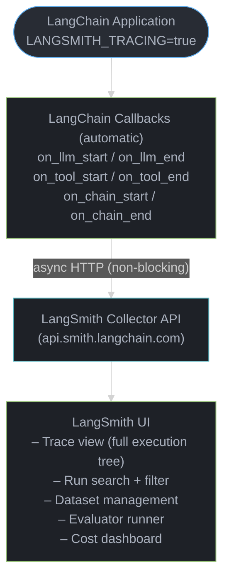
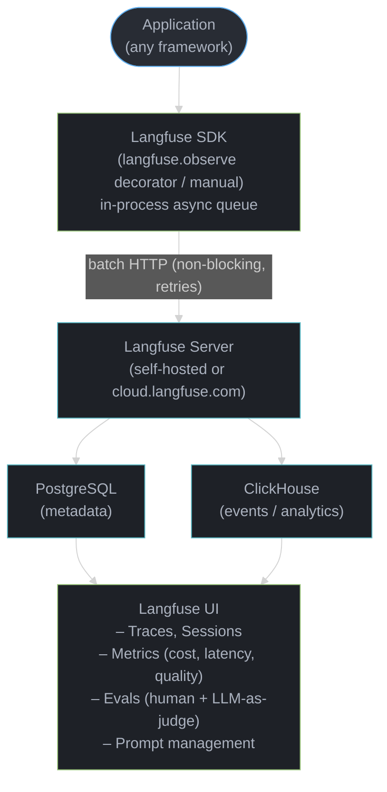
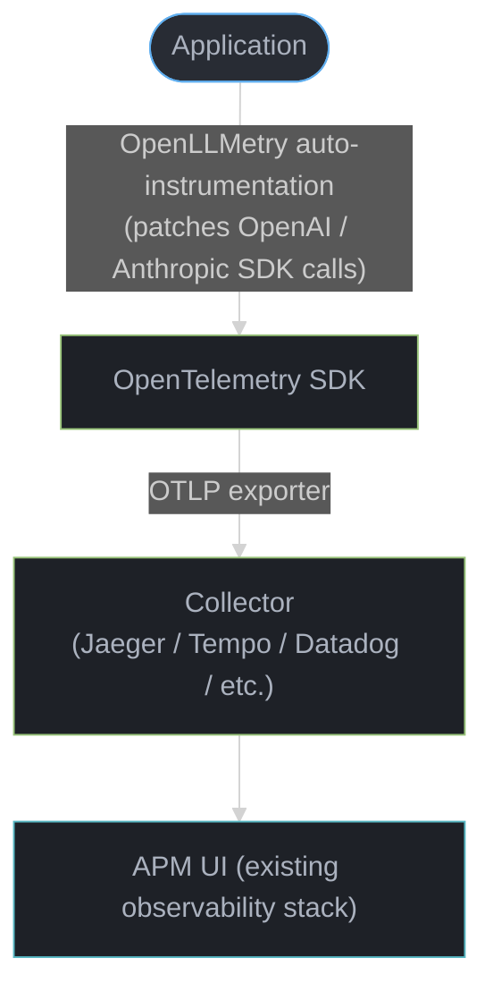
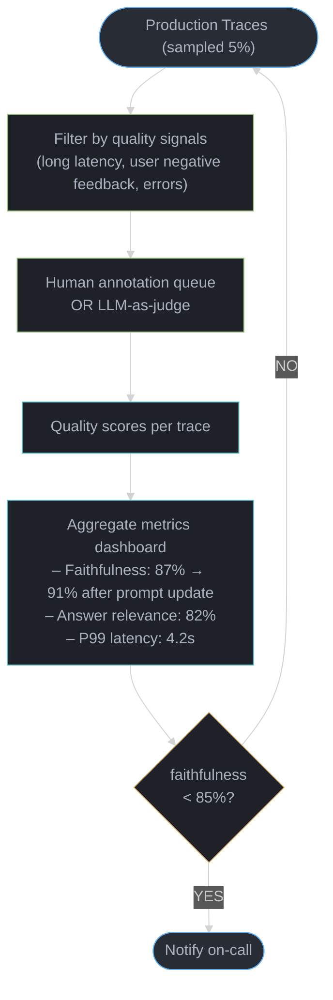

# Framework Observability — Deep Dive
## LangSmith, Langfuse, OpenTelemetry for LLMs

---

## 1. Concept Overview

Observability for LLM applications means capturing what happens inside every agent run: which prompts were sent, what the model responded, which tools were called, how long each step took, how many tokens were consumed, and what the final output was. Without observability, debugging production failures means guessing; with it, every incident has a full execution trace.

The LLM observability ecosystem has three layers: (1) framework-specific tools (LangSmith for LangChain/LangGraph, Langfuse as the open-source alternative), (2) OpenTelemetry with LLM semantic conventions (model-agnostic, integrates with existing APM stacks), and (3) application-level metrics via Micrometer/Prometheus.

**Current landscape (2024)**: LangSmith is the most integrated tool for LangChain users. Langfuse is the leading open-source option and works with any framework. OpenTelemetry Semantic Conventions for GenAI are still stabilizing but gaining enterprise adoption.

---

## 2. Intuition

**One-line analogy**: LLM observability is like distributed tracing (Jaeger/Zipkin) but each "span" is an LLM call — capturing the full prompt, completion, tokens, and cost instead of just method name and duration.

**Mental model**: An agentic system is a tree of operations: agent run → LLM call 1 → tool call → LLM call 2 → ... Each operation is a span. The full tree is a trace. Without observability, you see only the root (input) and leaf (final output). With observability, you see every intermediate step: what prompt was sent to the LLM at step 3, what the tool returned at step 4, why the agent chose action X over Y.

**Why it matters**: LLM applications fail silently. The model doesn't raise exceptions — it returns confident-sounding wrong answers, takes unexpected tool paths, or burns thousands of tokens in loops. Without traces, you cannot distinguish "the model was confused" from "the retriever returned irrelevant context" from "the tool returned malformed data."

**Key insight**: Add observability on day 1. The cost is 2 environment variables. The cost of not having it during the first production incident is hours of debugging with zero visibility.

---

## 3. Core Principles

**Traces and spans**: A trace is one complete execution (one agent run, one API request). A trace contains spans — individual operations (LLM call, tool call, retrieval, chain step). Spans have: start time, end time, parent span ID (for tree structure), and attributes (model, input, output, tokens, cost).

**Structured metadata**: Every span should capture: model name, prompt messages, completion content, input token count, output token count, latency, and error (if any). This enables cost attribution, latency profiling, and quality analysis.

**Correlation IDs**: Every trace needs a unique ID; every span references the trace ID. This allows filtering "show me all spans from this one agent run" or "show me all agent runs for user X." In LangSmith: `run_id`. In Langfuse: `trace_id`. In OpenTelemetry: `trace_id`.

**Evaluation integration**: Observability data is the foundation for evaluation. Capture production traces → sample them → run [LLM-as-judge evaluation](../evaluation_and_benchmarks/README.md) → identify failure patterns → improve prompts/retrieval → measure improvement.

**Cost tracking**: Every LLM call has a dollar cost. Aggregate by model, by endpoint, by user, by team. Set budget alerts. Without observability, you get a surprise cloud bill at month-end. See [Token Economics & Cost Optimization](../token_economics_and_cost_optimization/README.md) for per-model pricing math and budget-enforcement patterns.

---

## 4. Types / Architectures / Strategies

### Tool Categories

| Category | Tool | License | Framework Support |
|----------|------|---------|------------------|
| LangChain-native | LangSmith | Commercial (SaaS) | LangChain, LangGraph only (automatic) |
| Open-source universal | Langfuse | MIT / SaaS | Any framework, manual or auto-instrumentation |
| OpenTelemetry standard | OpenLLMetry / OTEL GenAI | Apache 2.0 | Any (OpenTelemetry exporters) |
| Commercial APM | Datadog LLM Observability | Commercial | Python/JS agents |
| Commercial | Arize Phoenix | MIT / Commercial | LangChain, LlamaIndex, DSPy, custom |
| ML experiment tracking | Weights & Biases Weave | MIT / Commercial | LLM tracing + evaluation |
| Commercial | Helicone | Apache 2.0 proxy | Any (HTTP proxy, no code change) |

### Metric Types

| Metric | What It Measures | How to Collect |
|--------|-----------------|---------------|
| Latency (per step) | Time per LLM call, tool call, chain step | Start/end timestamps in spans |
| Token usage (input/output) | Tokens per call, per session, per user | From LLM API response |
| Cost | $ per call, per session, per user | Token count × model price |
| Error rate | % of calls that fail | Error flag on spans |
| Tool call rate | How often tools are invoked | Count tool spans |
| Agent steps | Number of steps per agent run | Count spans per trace |
| Answer quality | Correctness, faithfulness, relevance | LLM-as-judge on sampled traces |
| User feedback | Thumbs up/down, ratings | Log with `score` API |

---

## 5. Architecture Diagrams

### LangSmith Tracing Architecture



### Langfuse Tracing Architecture



### OpenTelemetry LLM Tracing



Each LLM call becomes a span carrying the GenAI semantic-convention attributes, propagated through the same OTLP pipeline as the rest of your traces:

```
Span attributes (GenAI semantic conventions):
  gen_ai.system: "openai"
  gen_ai.request.model: "gpt-4o"
  gen_ai.request.max_tokens: 1024
  gen_ai.usage.input_tokens: 523
  gen_ai.usage.output_tokens: 128
  gen_ai.response.finish_reasons: ["stop"]
```

### Evaluation Loop



---

## 6. How It Works — Detailed Mechanics

### LangSmith — Zero-Config Setup

```python
import os

# That's it for LangChain/LangGraph — all traces automatic
os.environ["LANGSMITH_TRACING"] = "true"
os.environ["LANGSMITH_API_KEY"] = "ls__..."
os.environ["LANGSMITH_PROJECT"] = "production-rag-v2"

# Now every chain.invoke(), graph.invoke() is automatically traced
from langchain_openai import ChatOpenAI
from langchain_core.prompts import ChatPromptTemplate

chain = ChatPromptTemplate.from_template("Answer: {question}") | ChatOpenAI() | StrOutputParser()
result = chain.invoke({"question": "What is RAG?"})
# → Full trace visible in LangSmith dashboard: prompt, completion, tokens, latency
```

### LangSmith — Manual Runs with Metadata

```python
from langsmith import Client
from langsmith.run_helpers import traceable

client = Client()

@traceable(run_type="chain", name="document-qa")
def answer_question(question: str, user_id: str) -> str:
    # All LLM calls inside this function are traced as children
    docs = retriever.invoke(question)
    answer = chain.invoke({"context": docs, "question": question})
    return answer

# Pass metadata for filtering in dashboard
result = answer_question(
    "What is RAG?",
    user_id="user-123",
    # extra metadata attached to trace
    langsmith_extra={"metadata": {"user_id": "user-123", "department": "engineering"}}
)
```

### Langfuse — Universal Tracing

```python
from langfuse import Langfuse
from langfuse.decorators import observe, langfuse_context

langfuse = Langfuse(
    public_key="pk-lf-...",
    secret_key="sk-lf-...",
    host="https://cloud.langfuse.com"  # or self-hosted URL
)

@observe()  # traces this function as a span
def retrieve_documents(query: str) -> list[str]:
    return vector_store.similarity_search(query, k=4)

@observe(name="rag-pipeline")
def answer_question(question: str) -> str:
    # Add custom metadata to current trace
    langfuse_context.update_current_trace(
        user_id="user-123",
        session_id="session-456",
        tags=["production", "v2.1"]
    )

    docs = retrieve_documents(question)  # auto-traced as child span

    # Manual LLM span with token tracking
    with langfuse.start_as_current_generation(
        name="synthesis",
        model="gpt-4o",
        input={"messages": [{"role": "user", "content": question}]},
    ) as generation:
        response = openai_client.chat.completions.create(
            model="gpt-4o",
            messages=[{"role": "user", "content": question}]
        )
        generation.end(
            output=response.choices[0].message.content,
            usage=langfuse.create_usage(
                input=response.usage.prompt_tokens,
                output=response.usage.completion_tokens,
            )
        )
        return response.choices[0].message.content
```

### Langfuse — LangChain Integration

```python
from langfuse.callback import CallbackHandler

# Langfuse as LangChain callback handler
langfuse_handler = CallbackHandler(
    public_key="pk-lf-...",
    secret_key="sk-lf-...",
    trace_name="rag-answer",
    user_id=user_id,
    session_id=session_id,
    tags=["production"]
)

# Pass as callback to chain invocation
result = chain.invoke(
    {"question": question},
    config={"callbacks": [langfuse_handler]}
)
```

### OpenTelemetry — Auto-Instrumentation

```python
from opentelemetry import trace
from opentelemetry.sdk.trace import TracerProvider
from opentelemetry.sdk.trace.export import BatchSpanProcessor
from opentelemetry.exporter.otlp.proto.grpc.trace_exporter import OTLPSpanExporter
from openllmetry import Traceloop

# One-time setup: instruments OpenAI, Anthropic, LangChain automatically
Traceloop.init(
    app_name="my-rag-app",
    api_endpoint="https://api.openai.com",  # or your OTEL collector
    headers={"Authorization": f"Bearer {os.environ['OPENTELEMETRY_API_KEY']}"},
)

# No other code changes needed — all OpenAI/Anthropic calls auto-traced
response = openai_client.chat.completions.create(
    model="gpt-4o",
    messages=[{"role": "user", "content": "What is RAG?"}]
)
# → span with gen_ai.* attributes sent to your OTEL backend
```

### LLM-as-Judge Evaluation

```python
from langsmith import Client
from langsmith.evaluation import evaluate, LangChainStringEvaluator

client = Client()

# Create evaluation dataset from production traces
dataset = client.create_dataset("rag-evaluation-v1")
for trace in production_traces_sample:
    client.create_example(
        inputs={"question": trace.input["question"]},
        outputs={"answer": trace.output["answer"]},
        dataset_id=dataset.id
    )

# LLM-as-judge: faithfulness evaluator
faithfulness_evaluator = LangChainStringEvaluator(
    "labeled_criteria",
    config={
        "criteria": {
            "faithfulness": "The answer is fully grounded in the provided context. "
                           "It does not add information not present in the context."
        }
    }
)

results = evaluate(
    lambda inputs: rag_chain.invoke(inputs),
    data=dataset,
    evaluators=[faithfulness_evaluator],
    experiment_prefix="rag-v2-1",
    num_repetitions=1,
)
print(f"Faithfulness: {results.stats['faithfulness']['mean']:.2%}")
```

### Cost Tracking Dashboard

```python
# Langfuse cost tracking per model
from langfuse import Langfuse

langfuse = Langfuse()

# Fetch usage for last 7 days, grouped by model
metrics = langfuse.get_usage(
    from_timestamp="2024-01-01",
    to_timestamp="2024-01-08",
)

# Manual cost calculation if not using built-in pricing
MODEL_PRICES = {
    "gpt-4o": {"input": 5e-6, "output": 15e-6},     # per token
    "gpt-4o-mini": {"input": 0.15e-6, "output": 0.6e-6},
    "claude-3-5-sonnet": {"input": 3e-6, "output": 15e-6},
}

def calculate_cost(model: str, input_tokens: int, output_tokens: int) -> float:
    prices = MODEL_PRICES.get(model, {"input": 0, "output": 0})
    return (input_tokens * prices["input"]) + (output_tokens * prices["output"])
```

---

## 7. Real-World Examples

**Notion AI**: Uses LangSmith for all agent traces. Every user interaction is logged with user ID. Quality review: weekly sampling of 200 traces by the ML team, annotating quality issues. Incidents traced to exact prompts within minutes using LangSmith's run search.

**Elastic**: Self-hosted Langfuse for data residency (customer data cannot leave their cloud). Integrated Langfuse with their existing Grafana dashboards via Prometheus metrics export.

**Stripe internal AI tools**: OpenTelemetry integration — LLM traces go through the same Datadog pipeline as microservice traces. LLM spans are correlated with HTTP request spans, showing which API requests triggered which LLM calls and their costs.

**AI startup (anonymized)**: Discovered a $3,000/month cost anomaly through Langfuse cost tracking. One RAG endpoint was using `gpt-4o` for document summarization that could use `gpt-4o-mini`. Switching saved $2,800/month with identical user-facing quality.

**Production RAG incident**: Agent started looping (making 40+ tool calls per request). Without observability, symptoms were: slow responses, high cost. With Langfuse traces: immediately visible — 40 identical tool call spans per trace. Root cause: a tool returned an empty response that the agent interpreted as "try again." Fix: validate tool output before passing back to agent.

---

## 8. Tradeoffs

| Dimension | LangSmith | Langfuse | OpenTelemetry (OpenLLMetry) |
|-----------|-----------|---------|---------------------------|
| Setup effort | Minimal (2 env vars for LangChain) | Low (1 decorator or handler) | Medium (OTEL setup) |
| Framework support | LangChain/LangGraph only (auto) | Any framework | Any (via auto-instrumentation) |
| Data ownership | LangChain cloud only | Self-hostable (MIT) | Full control |
| Cost | Free tier: 5K traces/mo; then paid | Free self-hosted; paid cloud | Free (infra cost only) |
| Evaluation features | Excellent | Good | None (use with evaluation tools) |
| Prompt management | Yes | Yes | No |
| Real-time dashboards | Good | Good | Depends on backend |
| Enterprise compliance | SaaS (data leaves org) | Self-hosted available | Full control |
| UI quality | Excellent | Good | Depends on backend |
| Vendor lock-in | High (LangChain ecosystem) | Low | None |

---

## 9. When to Use / When NOT to Use

**Use LangSmith when:**
- Using LangChain/LangGraph and want zero-config tracing
- Team is small and SaaS cost is acceptable
- Evaluation and dataset management are priorities
- Want the deepest LangChain integration

**Use Langfuse when:**
- Data residency requirements (self-hosted)
- Framework-agnostic (using custom chains or non-LangChain frameworks)
- Open-source is required
- Building evaluation workflows with human annotation

**Use OpenTelemetry when:**
- Existing OTEL/APM infrastructure (Datadog, Jaeger, Tempo)
- LLM spans need to correlate with microservice traces
- Vendor neutrality is critical
- Large enterprise with standardized observability stack

**Do NOT skip observability:**
- "We'll add it later" is the most common and most costly mistake in LLM production deployments
- There is no scenario where zero observability is acceptable for production systems

---

## 10. Common Pitfalls

**Pitfall 1: Blocking the main thread with synchronous exports**
Early Langfuse/LangSmith setups blocked LLM response delivery waiting for trace export. Use async export (default in both tools). Verify by measuring latency with and without tracing enabled. Async export should add <5ms overhead.

```python
# BROKEN: flush the trace synchronously in the request path — adds the full
# export round-trip (often 50-200ms) to every response before the user sees it.
def answer(question: str) -> str:
    result = chain.invoke({"question": question})
    langfuse.flush()   # blocks the response until the batch is shipped
    return result

# FIXED: let the SDK's in-process async queue batch and ship traces in the
# background; flush only at process shutdown. Tracing overhead drops to <5ms.
def answer(question: str) -> str:
    return chain.invoke({"question": question})   # spans enqueued, non-blocking

atexit.register(langfuse.flush)   # drain the queue once, on shutdown
```

**Pitfall 2: Logging PII in traces**
User messages often contain names, emails, phone numbers, medical data. Traces sent to LangSmith or Langfuse cloud include this data. Consequences: GDPR violations, data breach risk. Mitigations: (1) self-host Langfuse; (2) use LangSmith's masking feature for specific fields; (3) hash user identifiers before logging; (4) filter PII with a regex before sending to trace API.

**Pitfall 3: Unbounded trace storage**
With 10K requests/day × 20KB per trace = 200MB/day. After 1 year: 73GB. Without retention policies, storage costs balloon. Set retention: LangSmith allows 30/90/365-day retention per project. Langfuse: configure PostgreSQL/ClickHouse retention. Archive old traces to S3 for long-term analysis.

**Pitfall 4: Missing cost model for new models**
When switching to a new model (e.g., Claude 3.7 Sonnet), cost dashboard shows $0 until you update the price config. Teams made model switches and assumed costs were similar — actual costs 3x higher, not detected for a month. Always update cost configs before switching models.

**Pitfall 5: Sampling too aggressively for evaluation**
Teams sampling 0.1% of traces for quality evaluation get 10 samples/day at 10K RPD — statistically insufficient to detect regressions. For meaningful evaluation: minimum 50-100 evaluated traces/day; prioritize sampling of user sessions with negative feedback signals. Use stratified sampling: some random, some from error traces, some from long-latency traces.

**Pitfall 6: Not correlating traces with user feedback**
Collecting traces without linking them to user outcomes (thumbs up/down, conversion, task completion) means you know latency/cost but not quality. Always log a `session_id` or `user_id` in traces, and when a user provides feedback, log it as a score against the trace ID. This creates labeled data for evaluation.

---

## 11. Technologies & Tools

| Tool | Type | Key Feature | Pricing |
|------|------|-------------|---------|
| LangSmith | SaaS | Zero-config for LangChain, evaluation, datasets | Free 5K/mo; $39/mo+ |
| Langfuse | OSS / SaaS | Self-hostable, universal, prompt management | Free OSS; cloud paid |
| OpenLLMetry | OSS | OpenTelemetry auto-instrumentation for LLMs | Free (Apache 2.0) |
| Arize Phoenix | OSS / SaaS | LlamaIndex + LangChain support, evaluation | Free OSS |
| Weights & Biases Weave | OSS / SaaS | ML experiment tracking + LLM tracing | Free tier |
| Helicone | OSS / SaaS | HTTP proxy, no code changes | Free tier |
| Datadog LLM Obs. | Commercial | Existing Datadog integration | Datadog pricing |

---

## 12. Interview Questions with Answers

**Q: What is LLM observability and why is it different from traditional application monitoring?**
LLM observability captures the full context of every LLM interaction: the complete prompt (system + user messages), the model's completion, token counts (input/output separately), cost, and latency per step in a chain. Traditional application monitoring captures method calls, HTTP requests, and CPU/memory. LLM observability must capture: prompt quality (not just that a call was made), intermediate reasoning steps (not just input/output), cost attribution (variable per request based on token count), and semantic quality (is the answer correct? — not detectable from status codes). Standard APM tools cannot capture these without LLM-specific instrumentation.

**Q: What is a trace in the context of LLM observability?**
A trace is the complete record of one agent execution. It contains a tree of spans: the root span is the top-level operation (e.g., "answer user question"), child spans are individual steps (LLM call 1, retrieval, tool call, LLM call 2). Each span has: start time, end time, input, output, and attributes (model, token counts, cost). Viewing the full trace shows exactly what happened at each step, the order of execution, and where time was spent. For a 10-step LangGraph agent, one trace contains 10+ spans covering every node execution.

**Q: What should you log in every LLM span?**
Minimum: model name, full input messages (system + human + tool results), completion content, input token count, output token count, latency (start to end), finish reason (stop/max_tokens/error). Recommended additions: user ID (for cost attribution and filtering), session ID (for multi-turn correlation), model parameters (temperature, max_tokens), estimated cost (tokens × model price), and any error with stack trace. Optional: retrieval results (for RAG), tool call arguments and results, custom metadata (A/B test variant, feature flag). Never log: plaintext passwords, API keys, PII without consent/masking.

**Q: How do you implement cost tracking per user or team in an LLM application?**
Three-layer approach: (1) Span-level: log input_tokens, output_tokens, model per LLM call in every trace; (2) Cost calculation: maintain a model price map (updated when model pricing changes); compute cost = input_tokens × input_price + output_tokens × output_price; (3) Aggregation: sum cost by user_id, team_id, endpoint, or model for dashboards and budget alerts. Implementation: Langfuse has built-in cost tracking (configure model prices once, auto-calculated). LangSmith shows cost per run automatically. For custom: use a Prometheus counter labeled by {user_id, model, endpoint} — query with PromQL for per-team breakdown.

**Q: What is LLM-as-judge evaluation and how do you build it into your observability pipeline?**
LLM-as-judge uses a separate LLM to evaluate whether a production response meets quality criteria (faithfulness, relevance, correctness). Pipeline: (1) Sample production traces (5-10% random, plus 100% of flagged traces); (2) For each sample, send the question, retrieved context, and answer to a judge prompt; the judge outputs a score (1-5) and reasoning; (3) Aggregate scores by time period, endpoint, or model; (4) Alert when metrics fall below threshold (faithfulness < 85%). LangSmith has built-in evaluators; Langfuse supports custom evaluators with their API. Key: the judge prompt must be calibrated — run it against 50 manually-labeled examples and verify it agrees with human judgment at >80%.

**Q: How do you handle tracing in async production code?**
LangSmith and Langfuse both support async tracing. For LangChain: async callbacks work automatically with `chain.ainvoke()`. For Langfuse manual tracing: `@observe()` decorator works with async functions. For OpenTelemetry: OTEL SDK propagates context via Python `contextvars` through async code — no special handling needed. Critical: ensure the trace client is initialized before async tasks start; async tasks that outlive the request context may lose trace context if not explicitly propagated. For FastAPI: use `langfuse_context.get_current_trace_id()` at the start of a request and pass it to background tasks.

**Q: How do you correlate LLM traces with business metrics?**
Correlate by attaching business identifiers to traces: `user_id`, `session_id`, `order_id`, `feature_flag_variant`. Then join trace data with business data in your data warehouse. Example: LLM support agent traces with `ticket_id` → join with Zendesk data on `ticket_id` → compute resolution rate per agent version. LangSmith metadata dict and Langfuse tags both support arbitrary key-value pairs. For A/B testing: tag traces with experiment variant; compute quality metrics per variant from trace data.

**Q: What is the LLM semantic conventions specification in OpenTelemetry?**
OpenTelemetry's GenAI semantic conventions define standard attribute names for LLM spans: `gen_ai.system` (openai, anthropic, etc.), `gen_ai.request.model`, `gen_ai.usage.input_tokens`, `gen_ai.usage.output_tokens`, `gen_ai.response.finish_reasons`, `gen_ai.prompt` (the full prompt content). These conventions enable interoperability: OpenLLMetry, Datadog, and other tools all use the same attribute names, so dashboards and queries work across implementations. Status: the spec is in "experimental" state as of 2024 but widely adopted. Using standard attributes future-proofs your observability setup.

**Q: How do you debug a production agent that is returning incorrect answers?**
Systematic approach: (1) Find the failing trace by filtering on user ID or session ID in LangSmith/Langfuse; (2) Open the full trace tree — identify which step the failure originated: was retrieval poor (wrong documents retrieved)? was the prompt correct? did the model ignore context?; (3) Check retrieved documents — did the relevant document even get retrieved? If not: retrieval problem (wrong embedding model, wrong k, metadata filter issue); (4) Check the synthesizer prompt — was the context correctly injected? was the question clear?; (5) Check the model output — did the model contradict the context? If yes: faithfulness issue, usually solved by stronger prompt or better model. Without traces, step 2-5 are impossible.

**Q: What is prompt management in Langfuse/LangSmith and why does it matter?**
Prompt management stores prompt templates in a version-controlled registry (Langfuse prompt hub / LangSmith prompt hub). Instead of hardcoding prompts in code, you fetch them at runtime: `langfuse.get_prompt("rag-system-prompt", version="v3")`. Benefits: (1) A/B test prompts in production without code deploys; (2) Track which prompt version was used in each trace (critical for debugging regressions); (3) Roll back a bad prompt without deploying code; (4) Measure quality metrics per prompt version. In practice: every time you update a prompt, increment the version; traces automatically log which version was used; compare quality metrics between versions in the dashboard.

**Q: How do you set up alerting for LLM quality degradation?**
Set up metric pipelines from your observability tool to an alerting system: (1) Define quality metrics (faithfulness score, error rate, P99 latency); (2) Compute them on a rolling window (last 1 hour, last 100 requests); (3) Alert when metric drops below threshold or increases above threshold. Implementation: Langfuse exports metrics to Prometheus; configure alert: `alert: name=LowFaithfulness, expr=langfuse_evaluation_score{metric="faithfulness"} < 0.80, for=10m`. For error rate: count spans with `error=true` / total spans, alert if >2%. For latency: P99 span duration > 5000ms. Page the on-call engineer; include the trace IDs of the failing requests in the alert for immediate debugging.

**Q: How does distributed tracing context propagation work across microservices for LLM calls?**
When an LLM call is initiated by a microservice, the trace context (trace_id + span_id) must propagate through HTTP headers to downstream services and to the LLM observability backend. Standard: W3C `traceparent` header. OpenTelemetry handles this automatically — the OTEL SDK injects `traceparent` into all outgoing HTTP requests and extracts it from incoming requests. For LLM calls: the LLM span's parent is the HTTP handler span, creating a complete tree from "user clicked button" → "API request" → "LLM call." Without propagation, LLM traces are disconnected from the rest of your observability. Configure: `TraceContextPropagator` in OTEL SDK; ensure all microservices use the same OTEL propagator.

**Q: What data should you NOT log in LLM traces?**
Never log: (1) PII — user names, emails, phone numbers, health data without explicit consent and compliance review; (2) API keys or secrets in prompt templates; (3) Raw financial data (card numbers, account numbers); (4) Contents of private messages or documents if users have expectation of privacy; (5) System prompts marked confidential by the business (prompt injection attackers can extract them from leaked traces). Mitigations: use Langfuse's data masking; filter prompts through a PII detector before logging; hash user identifiers; encrypt sensitive trace fields at rest. GDPR/CCPA compliance: implement trace deletion (`/api/trace/{id}` DELETE) for right-to-erasure requests.

**Q: How do you trace non-LangChain LLM applications?**
Three options: (1) Langfuse `@observe()` decorator on any Python function — wrap LLM calls and manual spans; requires code changes; (2) OpenLLMetry auto-instrumentation — patches the OpenAI/Anthropic SDK at import time; zero code changes; (3) Helicone HTTP proxy — configure `openai.base_url = "https://oai.hconeai.com/v1"` and all calls are proxied and logged; zero code changes, any framework. For direct API calls without frameworks: Langfuse is most flexible (manual span creation for any call); OpenLLMetry is lowest effort (auto-instruments SDK). For enterprise: OpenTelemetry with existing APM infrastructure is the most durable choice.

**Q: How do you set up cost alerting and budget enforcement across LLM frameworks?**
Implement cost tracking at the gateway level by intercepting all LLM API calls and recording token counts, model used, and computed cost. Tools: LangSmith and Langfuse both provide per-trace cost calculation. Set up alerts at three thresholds: (1) per-request cost > $X triggers investigation (a single agent loop spending $5 is suspicious); (2) hourly cost rate > budget/24 triggers throttling; (3) daily cost > budget triggers hard rejection of new requests. For budget enforcement, implement a cost middleware that checks remaining budget before forwarding LLM calls. Track cost per feature, per user, and per model to identify optimization opportunities.

---

## 13. Best Practices

1. **Add observability before writing any agent logic** — 2 env vars for LangSmith, 1 decorator for Langfuse; no reason to wait.
2. **Always log user_id and session_id** — filtering without these is nearly impossible.
3. **Self-host Langfuse if handling PII** — never send user messages to a third-party SaaS without legal review.
4. **Use async export** — verify tracing adds <10ms to response latency; synchronous export is a production blocker.
5. **Set data retention policies** — 30-90 days is usually sufficient; archive to S3 for compliance needs.
6. **Sample for LLM-as-judge evaluation** — 5-10% of production traces is sufficient; evaluate error traces 100%.
7. **Version your prompts in Langfuse/LangSmith** — every prompt change gets a new version; log version in traces.
8. **Alert on quality metrics, not just errors** — LLM failures are silent; set up faithfulness/relevance alerts.
9. **Update cost configs when switching models** — wrong cost tracking is worse than no cost tracking.
10. **Correlate trace IDs with user feedback** — link thumbs-down to the trace for labeled failure data.

---

## 14. Case Study: Observability-Driven Quality Improvement

**Scenario**: An e-commerce company launched an AI shopping assistant. After 2 weeks, users reported that answers were "often wrong about product details." Without observability initially, the team spent 3 days guessing. After implementing Langfuse, they traced the issue in 30 minutes.

### Incident Investigation

```
Symptom: users report product detail answers are wrong

Without observability (Day 1-3):
  - Replayed user queries manually
  - Read model outputs
  - Tried different prompts
  - No systematic improvement
  - Root cause unknown

With Langfuse (Day 4 after implementing):
1. Filtered traces for user sessions with negative feedback (thumbs down)
2. Opened trace tree for failing query: "Does the iPhone 15 Pro support USB-C?"
3. Found: retrieval span returned 4 documents about iPhone 14 Pro (wrong version!)
4. Root cause: product database index was stale (built 3 months ago, iPhone 15 Pro not indexed)
5. Fix: trigger re-indexing; implement daily index refresh
6. Deployed fix; faithfulness score went from 71% to 94% in 2 days
```

### Langfuse Setup

```python
from langfuse import Langfuse
from langfuse.decorators import observe, langfuse_context
from langfuse.callback import CallbackHandler

langfuse = Langfuse()

@observe(name="shopping-assistant")
def answer_product_question(question: str, user_id: str, session_id: str) -> str:
    langfuse_context.update_current_trace(
        user_id=user_id,
        session_id=session_id,
        tags=["production", "shopping-assistant"]
    )

    handler = CallbackHandler(
        trace_id=langfuse_context.get_current_trace_id(),
        root_observation_id=langfuse_context.get_current_observation_id(),
    )

    result = rag_chain.invoke(
        {"question": question},
        config={"callbacks": [handler]}
    )

    return result

# Capture user feedback
def record_feedback(trace_id: str, score: int, comment: str = ""):
    langfuse.score(
        trace_id=trace_id,
        name="user-rating",
        value=score,  # 1-5
        comment=comment
    )
```

### Quality Dashboard (After Fix)

| Metric | Week 1 (no obs.) | Week 2 (with obs.) | Week 3 (post-fix) |
|--------|-----------------|--------------------|--------------------|
| Faithfulness | Unknown | 71% | 94% |
| Answer relevance | Unknown | 83% | 91% |
| User rating (avg) | 2.8/5 | 2.9/5 | 4.3/5 |
| P99 latency | 8.2s | 8.2s | 7.1s (identified slow node) |
| Cost/query | Unknown | $0.047 | $0.031 (switched summarizer to gpt-4o-mini) |
