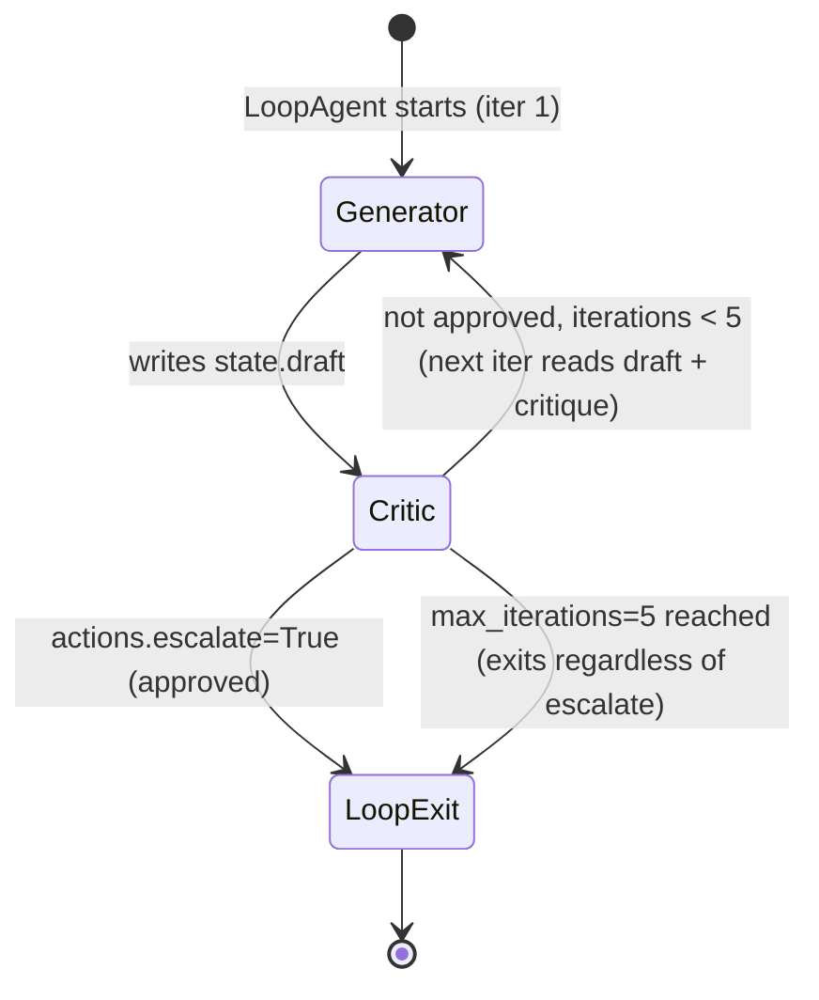
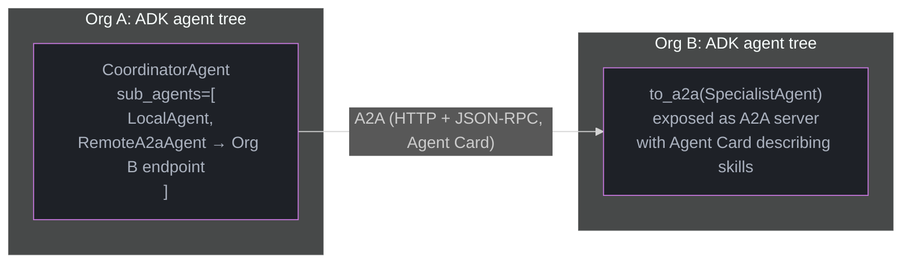

# Google Agent Development Kit (ADK) — Deep Dive

> Sibling of [Strands (AWS)](strands_aws.md), [Claude Agent SDK](claude_agent_sdk.md), and
> [OpenAI Agents SDK](openai_agents_sdk.md) — the cloud-provider-native agent framework for the
> Google Cloud / Gemini / Vertex AI ecosystem. For the cross-framework A2A protocol that ADK
> agents speak, see [Agent-to-Agent Protocols](../multi_agent_systems/agent_to_agent_protocols.md).

---

## 1. Concept Overview

**Google Agent Development Kit (ADK)** is an open-source (Apache 2.0), code-first framework for
building, evaluating, and deploying AI agents — released by Google in 2025 and used internally to
build parts of **Agentspace** and Google's own production agents. ADK ships **Python and Java**
SDKs with feature parity for the core abstractions.

ADK's central design choice is the split between **`LlmAgent`** (an agent that calls a model to
reason and decide what to do next) and **workflow agents** — `SequentialAgent`, `ParallelAgent`,
`LoopAgent` — which **orchestrate other agents deterministically without making any LLM calls
themselves**. This gives ADK a hybrid character: parts of a multi-agent system that should be
predictable and auditable (a fixed pipeline of steps) are expressed as plain orchestration code;
parts that need reasoning are `LlmAgent`s. ADK is **model-agnostic** via a `LiteLlm` wrapper (so
non-Gemini models work), but is most tightly integrated with **Gemini** (including the **Live
API** for bidirectional audio/video streaming) and **Vertex AI** (managed `SessionService`,
`MemoryService`, and the **Vertex AI Agent Engine** deployment target).

---

## 2. Intuition

> **One-line analogy**: ADK is to agent-building what a web framework with both "routes" (your
> custom logic) and "middleware pipelines" (built-in, declarative request processing) is to web
> apps — `LlmAgent` is your custom route handler; `SequentialAgent`/`ParallelAgent`/`LoopAgent`
> are middleware pipelines you configure declaratively, with zero reasoning of their own.

**Mental model**: every ADK agent — `LlmAgent` or workflow agent — implements the same interface
(`run_async`, yielding `Event` objects) and can be nested inside another agent's `sub_agents`
list. This means a `SequentialAgent` doesn't know or care whether its children are `LlmAgent`s,
`ParallelAgent`s, or further `SequentialAgent`s — **composition is uniform all the way down**, the
same principle that makes LangGraph's `StateGraph` nodes composable
([LangGraph](langgraph.md)) or that makes Claude Agent SDK's subagents composable
([Claude Agent SDK §4.5](claude_agent_sdk.md)). What's distinctive about ADK is that the
*deterministic* orchestration patterns (sequence, parallel fan-out, loop-until-condition) are
**first-class agent types**, not something you'd hand-write as graph edges or Python control flow
— this is the framework betting that "sequence/parallel/loop" cover the large majority of
multi-step orchestration needs, with `LlmAgent`-based dynamic delegation (§4.5) covering the rest.

**Why it matters**: production agent systems mix **predictable steps** (validate input, call a
fixed sequence of tools, format output) with **reasoning steps** (decide which specialist to
consult, interpret ambiguous user intent). Frameworks that express *everything* as LLM-driven
graphs make the predictable steps harder to test, audit, and reason about cost for. ADK's
workflow agents are **zero-LLM-call, zero-cost orchestration primitives** — a `SequentialAgent`
with three `LlmAgent` children makes exactly three model calls, not four.

**Key insight**: **state, not message-passing, is ADK's primary inter-agent communication
mechanism**. An `LlmAgent` with `output_key="draft"` writes its final response text into shared
session `State` under the key `"draft"`; a later agent in the same `SequentialAgent` reads
`{draft}` via instruction templating. This is closer to a shared-blackboard architecture than to
LangGraph's explicit state-channel reducers or AutoGen's direct agent-to-agent messages — and it's
the source of this module's primary pitfall (§6.4, §10.1: state key collisions).

---

## 3. Core Principles

### 3.1 Agent Hierarchy

Every ADK application is a **tree of agents** rooted at one top-level agent passed to a `Runner`.
Any agent (`LlmAgent` or workflow agent) can have `sub_agents` — its children in the tree. An
`LlmAgent` can **delegate** to a sub-agent at runtime (the model emits a `transfer_to_agent` call,
§4.5) or a workflow agent can **invoke** its sub-agents according to its fixed semantics
(sequence/parallel/loop, §4.2-4.4). The tree structure is static (defined at construction time);
*which paths through the tree execute* can be dynamic (`LlmAgent` delegation) or fixed (workflow
agents).

### 3.2 Session, State, Memory, and Artifacts — Four Distinct Stores

ADK separates persistence into four services with different lifetimes and scopes:

- **Session** — one conversation thread: an ordered list of `Event`s (every model call, tool
  call/result, and state delta). Managed by a `SessionService` (`InMemorySessionService` for dev,
  `VertexAiSessionService` or `DatabaseSessionService` for production).
- **State** — a key-value dict scoped to the session, with **prefix-based scoping**: a bare key
  (`"draft"`) is session-scoped (cleared with the session); `user:` prefix persists across all of
  a user's sessions; `app:` prefix is shared across all users of the app; `temp:` prefix exists
  only for the current invocation and is never persisted.
- **Memory** — a long-term, *searchable* store across sessions (`MemoryService`), distinct from
  State — State is structured key-value for the current/ongoing context, Memory is for retrieving
  relevant facts from *past* sessions (conceptually closer to
  [Agent Memory](../agents_and_tool_use/agent_memory.md)'s long-term memory stores).
- **Artifacts** — binary/file data (images, documents) associated with a session, stored via an
  `ArtifactService`, referenced by name rather than inlined into State/Memory.

### 3.3 Tools: Four Ways to Give an Agent Capabilities

`LlmAgent.tools` accepts: (1) **`FunctionTool`** — any Python function with type hints and a
docstring is automatically converted into a tool schema (parameter types from annotations,
description from the docstring — the same auto-schema pattern as
[OpenAI Agents SDK §4.1](openai_agents_sdk.md) and
[PydanticAI](pydantic_ai.md)); (2) **built-in tools** — `google_search`,
`built_in_code_execution`, `VertexAiSearchTool`, provided by the framework; (3) **`OpenAPIToolset`**
— given an OpenAPI spec, auto-generates one tool per endpoint; (4) **`MCPToolset`** — wraps an
[MCP server](../mcp_model_context_protocol/README.md)'s tools as ADK tools, so any MCP-compliant
tool server becomes usable without per-tool integration code.

### 3.4 Runner and the Event Loop

A **`Runner`** ties an agent tree to a `SessionService` (and optionally `MemoryService`,
`ArtifactService`) and exposes `run_async(user_id, session_id, new_message)`, which yields a
stream of `Event` objects as the agent(s) execute — model partial/final responses, tool calls,
tool results, state deltas, and agent-transfer events. This streaming-event model is what
`adk web` (the built-in dev UI) renders live, and is also what a custom frontend consumes for
token-by-token display.

### 3.5 Callbacks

ADK provides six callback hooks: `before_agent_callback` / `after_agent_callback`,
`before_model_callback` / `after_model_callback`, `before_tool_callback` /
`after_tool_callback`. A `before_*_callback` that returns a non-`None` value **short-circuits** —
e.g., a `before_model_callback` returning a canned `LlmResponse` skips the actual model call
entirely (used for guardrails, mocking in tests, or caching). This mirrors the middleware
short-circuit pattern in [Strands' callback hooks](strands_aws.md) and
[OpenAI Agents SDK guardrails](openai_agents_sdk.md).

### 3.6 A2A Integration

ADK agents can be **exposed** as [A2A](../multi_agent_systems/agent_to_agent_protocols.md) servers
(`to_a2a(agent)` wraps any ADK agent with an A2A-compliant HTTP server, auto-generating an Agent
Card from the agent's name/description/skills) and can **consume** remote A2A agents as
`RemoteA2aAgent` — a sub-agent whose "execution" is actually an A2A call to a different service,
possibly built on an entirely different framework. This makes ADK's agent tree (§3.1) extend
*across process and organizational boundaries* — a `SequentialAgent` can have one step that's a
local `LlmAgent` and another that's a `RemoteA2aAgent` calling a partner's agent.

---

## 4. Types / Architectures / Strategies

### 4.1 LlmAgent — The Reasoning Unit

A single agent backed by a model: `LlmAgent(name=..., model=..., instruction=..., tools=[...],
sub_agents=[...], output_key=...)`. Equivalent in role to LangGraph's LLM-calling node, a
CrewAI `Agent`, or a Strands `Agent`.

### 4.2 SequentialAgent — Fixed Pipeline

Runs its `sub_agents` **in list order**, each completing before the next starts. No LLM call of
its own. Used for "stage 1 must finish before stage 2 begins" pipelines — e.g., research → draft →
critique.

### 4.3 ParallelAgent — Fan-Out / Fan-In

Runs all `sub_agents` **concurrently** (each gets an isolated branch of session state via
distinct `output_key`s), then — typically — a following `SequentialAgent` step fans the results
back in by reading all the `output_key`s. No LLM call of its own.

### 4.4 LoopAgent — Iterative Refinement

Runs its `sub_agents` **repeatedly** (in sequence, each iteration) until either (a) `max_iterations`
is reached, or (b) any sub-agent's `Event` has `actions.escalate = True`. This is ADK's
primitive for generator-critic refinement loops — see §6.4 for the BROKEN→FIX built around the
escalate condition.

### 4.5 Multi-Agent Hierarchy via Delegation

An `LlmAgent` with `sub_agents` set can **delegate** at runtime: the model is given (automatically)
a `transfer_to_agent(agent_name)` function; calling it hands control to that sub-agent for the
rest of the turn. Alternatively, `AgentTool(agent=some_agent)` wraps an agent as a callable
**tool** — the calling agent gets the sub-agent's final response back as a tool result and
**retains control** (vs. `transfer_to_agent`, which is a one-way handoff). This
tool-call-vs-handoff distinction mirrors
[OpenAI Agents SDK's tools-as-agents vs. handoffs](openai_agents_sdk.md) and
[Strands' `agent_as_tool`](strands_aws.md).

### 4.6 Deployment Targets

- **Local dev**: `adk web` (browser dev UI with event trace), `adk run` (CLI), `adk api_server`
  (REST API for integration testing).
- **Cloud Run**: `adk deploy cloud_run` — containerizes the agent as a stateless HTTP service;
  requires an external `SessionService` (e.g., `DatabaseSessionService`) for persistence across
  instances.
- **Vertex AI Agent Engine**: a **fully managed** runtime — handles session/memory persistence,
  autoscaling, and provides built-in `adk eval` integration for regression testing (§12 Q11).

---

## 5. Architecture Diagrams

### 5.1 Agent Hierarchy (Tree)

```
                    CoordinatorAgent (LlmAgent)
                    instruction: "route to the right specialist"
                    sub_agents=[BillingAgent, TechSupportAgent, RefundFlow]
                    /              |                    \
                   /               |                     \
       BillingAgent          TechSupportAgent      RefundFlow (SequentialAgent)
       (LlmAgent,            (LlmAgent,             /              \
        tools=[...])          tools=[MCPToolset])  ValidateAgent  ProcessAgent
                                                    (LlmAgent)     (LlmAgent)

  At runtime: Coordinator calls transfer_to_agent("RefundFlow") -> control
  passes to RefundFlow (a SequentialAgent) -> runs ValidateAgent then
  ProcessAgent in fixed order, NO further LLM-driven routing within RefundFlow.
```

### 5.2 Workflow Agent Semantics

```
  SequentialAgent([A, B, C])          ParallelAgent([A, B, C])
  ----------------------------        ----------------------------
  t0: A runs (writes state.x)         t0: A, B, C all start concurrently
  t1: B runs (reads state.x,                each in an isolated state branch
      writes state.y)                  t1: A, B, C all complete
  t2: C runs (reads state.x, state.y)       (results in state.a, state.b, state.c)
                                        t2: (typically) a following Sequential
                                             step reads all three results
```



`LoopAgent([Generator, Critic], max_iterations=5)` as a lifecycle: `escalate=True` is the only
early exit; `max_iterations` is the unconditional hard bound — with neither set per iteration, the
loop always burns the full 5 × 2 = 10 LLM calls (§6.4).

### 5.3 Session / State / Memory / Artifact Services

```
  Runner
    |
    +-- SessionService -------- Session (per conversation)
    |     (InMemory /                |-- events: [Event, Event, ...]
    |      Database /                |-- state: {"draft": "...",
    |      VertexAi)                 |           "user:preferred_lang": "en",
    |                                 |           "app:max_retries": 3,
    |                                 |           "temp:scratch": ...}
    |
    +-- MemoryService ---------- long-term searchable store
    |     (InMemory /                 (cross-session facts, retrieved
    |      VertexAiRagMemoryService)   via semantic search, not key lookup)
    |
    +-- ArtifactService -------- binary blobs (images, PDFs)
          (InMemory / GCS)            referenced by name from State/Events
```

### 5.4 A2A: ADK Agent as Both Server and Client



From CoordinatorAgent's perspective, RemoteA2aAgent is just another sub_agent — the A2A call is hidden behind the same Agent interface.

---

## 6. How It Works — Detailed Mechanics

### 6.1 Defining an LlmAgent with a FunctionTool

```python
from google.adk.agents import LlmAgent
from google.adk.runners import Runner
from google.adk.sessions import InMemorySessionService
from google.genai import types


def get_order_status(order_id: str) -> dict:
    """Look up the current status of a customer order.

    Args:
        order_id: The order identifier, e.g. "ORD-12345".

    Returns:
        A dict with 'status' and 'eta_days' keys.
    """
    # In production: query an orders database/service.
    return {"status": "shipped", "eta_days": 2}


support_agent = LlmAgent(
    name="support_agent",
    model="gemini-2.5-flash",
    instruction=(
        "You help customers check their order status. "
        "Use get_order_status when the user provides an order ID."
    ),
    tools=[get_order_status],      # plain function -> auto FunctionTool
    output_key="last_response",    # final text written to state["last_response"]
)
```

The docstring's `Args:`/`Returns:` sections become the tool's JSON-schema parameter descriptions —
the model never sees the Python source, only the generated schema, the same convention as
[PydanticAI](pydantic_ai.md) and [Strands' `@tool`](strands_aws.md).

### 6.2 Sequential + Parallel Composition

```python
from google.adk.agents import LlmAgent, SequentialAgent, ParallelAgent

# Two independent research angles, run concurrently
market_research = LlmAgent(
    name="market_research", model="gemini-2.5-flash",
    instruction="Research the competitive landscape for {topic}.",
    output_key="market_findings",
)
technical_research = LlmAgent(
    name="technical_research", model="gemini-2.5-flash",
    instruction="Research the technical feasibility of {topic}.",
    output_key="technical_findings",
)
parallel_research = ParallelAgent(
    name="parallel_research",
    sub_agents=[market_research, technical_research],
)

# Synthesis step reads BOTH branch outputs via state templating
synthesizer = LlmAgent(
    name="synthesizer", model="gemini-2.5-pro",
    instruction=(
        "Combine these findings into a recommendation:\n"
        "Market: {market_findings}\nTechnical: {technical_findings}"
    ),
    output_key="recommendation",
)

research_pipeline = SequentialAgent(
    name="research_pipeline",
    sub_agents=[parallel_research, synthesizer],
)
```

`ParallelAgent` gives each branch an **isolated state fork** during execution — `market_research`
cannot see `technical_findings` mid-flight and vice versa — and merges both forks' writes back
into the shared session state once both complete, which is why `synthesizer` (running afterward,
in the enclosing `SequentialAgent`) can read both keys.

### 6.3 Multi-Agent Delegation with `transfer_to_agent`

```python
from google.adk.agents import LlmAgent

billing_agent = LlmAgent(
    name="billing_agent", model="gemini-2.5-flash",
    instruction="Handle billing questions: invoices, payment methods, charges.",
    tools=[...],   # billing-specific tools
)
tech_support_agent = LlmAgent(
    name="tech_support_agent", model="gemini-2.5-flash",
    instruction="Handle technical issues: bugs, errors, outages.",
    tools=[...],   # tech-support-specific tools
)

coordinator = LlmAgent(
    name="coordinator", model="gemini-2.5-pro",
    instruction=(
        "Classify the user's request and transfer to billing_agent for "
        "billing issues, or tech_support_agent for technical issues. "
        "Do not attempt to answer either type yourself."
    ),
    sub_agents=[billing_agent, tech_support_agent],
)
# coordinator automatically receives a transfer_to_agent(agent_name) function;
# calling it hands the REST of this turn to the named sub-agent.
```

### 6.4 BROKEN → FIX: LoopAgent Without an Exit Condition

```python
# BROKEN: LoopAgent runs Generator+Critic for max_iterations EVERY TIME,
# even when the first draft was already good -- because nothing ever
# sets actions.escalate. Each "good enough on iteration 1" request still
# burns 5 iterations x 2 LLM calls = 10 calls instead of 2.
from google.adk.agents import LlmAgent, LoopAgent

generator = LlmAgent(
    name="generator", model="gemini-2.5-flash",
    instruction="Write a product description for {product}. "
                "Incorporate any feedback in {critique}.",
    output_key="draft",
)
critic = LlmAgent(
    name="critic", model="gemini-2.5-flash",
    instruction="Critique {draft}. List specific issues, or say 'APPROVED'.",
    output_key="critique",
    # NOTHING here ever calls tool_context.actions.escalate = True
)

refine_loop_broken = LoopAgent(
    name="refine_loop_broken",
    sub_agents=[generator, critic],
    max_iterations=5,
)
# Cost: 10 LLM calls per request, ALWAYS -- regardless of draft quality.
```

```python
# FIXED: critic is a FunctionTool-using agent whose tool sets escalate=True
# when it judges the draft APPROVED, terminating the loop early.
from google.adk.agents import LlmAgent, LoopAgent
from google.adk.tools import ToolContext

def approve_or_continue(approved: bool, tool_context: ToolContext) -> dict:
    """Signal whether the current draft is approved.

    Args:
        approved: True if the draft meets quality standards.
    """
    if approved:
        tool_context.actions.escalate = True   # ends the LoopAgent
    return {"approved": approved}

critic_fixed = LlmAgent(
    name="critic_fixed", model="gemini-2.5-flash",
    instruction=(
        "Evaluate {draft}. Call approve_or_continue(approved=True) if it "
        "meets quality standards, otherwise approve_or_continue(approved=False) "
        "and explain what to fix in your response."
    ),
    tools=[approve_or_continue],
    output_key="critique",
)

refine_loop_fixed = LoopAgent(
    name="refine_loop_fixed",
    sub_agents=[generator, critic_fixed],
    max_iterations=5,
)
# Cost: 2 LLM calls when the first draft is approved (the common case),
# up to 10 only for drafts that genuinely need multiple revisions.
# Measured on a product-description workload: 78% of requests approved
# on iteration 1 -- average calls per request dropped from 10.0 to 3.8.
```

---

## 7. Real-World Examples

- **Google Agentspace** — Google's enterprise agent platform uses ADK-style agent composition
  internally for multi-step enterprise search and task agents.
- **Vertex AI Agent Builder / Agent Engine** — ADK is the recommended SDK for building agents that
  deploy to Agent Engine, which provides managed sessions, memory, and the `adk eval` regression
  pipeline (§12 Q11) out of the box — positioned as Google Cloud's answer to "an opinionated
  framework + managed runtime," analogous to how
  [AWS Strands pairs with Bedrock AgentCore](strands_aws.md).
- **Customer-support triage** — the `coordinator` + `billing_agent`/`tech_support_agent` pattern
  in §6.3 is ADK's idiomatic version of the
  [orchestrator-worker pattern](../multi_agent_systems/orchestrator_worker_pattern.md), with the
  routing logic expressed as model-driven delegation rather than a hand-coded classifier.
- **Generator-critic content pipelines** — the `LoopAgent` pattern in §6.4 is used for
  iterative-refinement workloads (ad copy, code review comments, structured-data extraction with
  validation) where a fixed-iteration budget bounds worst-case cost.
- **Cross-organization agent integration** — `RemoteA2aAgent` (§5.4) lets an enterprise's internal
  ADK agent tree delegate specific steps (e.g., "check partner inventory") to a partner's agent
  exposed via A2A, without either side needing to know the other's internal framework.

---

## 8. Tradeoffs

| Dimension | ADK | LangGraph | CrewAI | AutoGen | OpenAI Agents SDK | Strands (AWS) |
|---|---|---|---|---|---|---|
| Orchestration model | `LlmAgent` (reasoning) + workflow agents (Sequential/Parallel/Loop, zero-LLM) | Explicit state graph, every node/edge user-defined | Role-based agents + Process (sequential/hierarchical) | Conversational `ConversableAgent` + GroupChat | Agent + handoffs + guardrails | Agent + `agent_as_tool` |
| Deterministic-pipeline cost guarantee | Yes — workflow agents make zero LLM calls | No — must avoid LLM-calling nodes manually | Partial — `Process.sequential` still LLM-driven per task | No | Partial | Partial |
| State sharing mechanism | Shared `State` dict, prefix-scoped (§3.2) | Typed state schema + reducers | Task outputs / shared crew memory | Message history | Context object | Shared session |
| Cloud-native managed runtime | Vertex AI Agent Engine | LangGraph Platform | — | — | — | Bedrock AgentCore |
| Cross-framework interop | A2A (server + client, §3.6) | A2A (via adapters) | — | — | A2A (emerging) | A2A (emerging) |
| Primary model affinity | Gemini (deepest); others via LiteLlm | Model-agnostic | Model-agnostic | Model-agnostic | OpenAI (deepest) | Bedrock/Claude (deepest) |
| Language SDKs | Python, Java | Python, JS/TS | Python | Python, .NET | Python, JS/TS | Python |

---

## 9. When to Use / When NOT to Use

**Use ADK when:**

- The system is **already on Google Cloud / Vertex AI** — Agent Engine's managed
  session/memory/eval integration removes substantial infrastructure work versus self-hosting
  another framework's runtime.
- A significant portion of the multi-agent system is **deterministic orchestration** (fixed
  pipelines, fan-out/fan-in, bounded refinement loops) — ADK's workflow agents express these with
  zero incidental LLM cost, where other frameworks would require either hand-written control flow
  or LLM-driven graph nodes for the same steps.
- The team wants **Java** as well as Python support for agent logic — ADK is one of the few
  frameworks in this comparison with a first-class Java SDK (relevant for enterprises with
  existing JVM service meshes — see [Spring AI](../../spring/CLAUDE.md) for the adjacent Java
  ecosystem, though `spring_ai` is planned-not-built per repo conventions).
- The system needs **bidirectional audio/video streaming** (voice agents, live assistants) — ADK's
  integration with the Gemini **Live API** is a first-class supported path, relevant alongside
  [Voice Agents](../voice_agents/README.md).

**Do NOT use ADK (or reconsider) when:**

- The team has deep existing investment in **LangGraph's** explicit-state-graph model and needs
  fine-grained control over every edge/condition — ADK's workflow agents cover the common
  sequence/parallel/loop cases but don't replace a fully custom graph topology.
- The application is **OpenAI-model-first** with heavy reliance on OpenAI-specific features
  (Realtime API specifics, OpenAI-hosted tools) — [OpenAI Agents SDK](openai_agents_sdk.md) or
  [Claude Agent SDK](claude_agent_sdk.md) for Anthropic-first will have tighter integration with
  their respective provider's latest features than ADK's `LiteLlm`-mediated access.
- Cross-cloud portability without any Google Cloud dependency is a hard requirement and the team
  wants to avoid Vertex-AI-specific service classes (`VertexAiSessionService`,
  `VertexAiRagMemoryService`) entirely — though ADK's in-memory/database-backed services do work
  outside GCP, the deepest integration value is realized on Vertex AI.

---

## 10. Common Pitfalls

**10.1 State Key Collisions Across Sibling Agents**

Because inter-agent communication is primarily through shared `State` (§3.2), **two agents in the
same tree that use the same `output_key`** (or that write the same key via tool side-effects)
silently overwrite each other — there's no schema or type-checking on State the way
LangGraph's `TypedDict` state provides. A `ParallelAgent` with two branches both using
`output_key="result"` will have the second branch's completion overwrite the first's, and a
downstream `SequentialAgent` step reading `{result}` gets only one branch's output with **no
error raised**. **Fix**: give every `output_key` a unique, descriptive name (`market_findings`,
`technical_findings` as in §6.2) and treat State keys like a shared API contract across the agent
tree — document them.

**10.2 Forgetting Workflow Agents Don't Reason**

A common first-time mistake: setting `instruction="Process items one at a time, validating each"`
on a `SequentialAgent`. **Workflow agents have no `instruction` parameter and make no model
calls** — the instruction is silently ignored (or raises a constructor error, depending on SDK
version). The sequencing/parallelism/looping behavior is *entirely* structural (the `sub_agents`
list and the agent type), never instruction-driven. If you need conditional branching based on
content, that decision must live in an `LlmAgent`'s `transfer_to_agent` delegation (§4.5), not in
a workflow agent's "instruction."

**10.3 `InMemorySessionService` in Production**

`InMemorySessionService` (the default for `adk run`/local dev) loses all session state on process
restart and **does not share state across multiple instances** of a Cloud Run deployment — a
user's second message can land on a different instance with no memory of the first. Production
deployments need `DatabaseSessionService` (self-managed) or `VertexAiSessionService` (managed) —
this is the same class of mistake as deploying a Flask app with in-process session storage behind
a load balancer.

**10.4 `LoopAgent` Without an Exit Condition (§6.4)**

Covered in depth in §6.4 — omitting an `escalate` signal means every invocation runs the full
`max_iterations`, turning a 2-call workload into a 10-call one regardless of whether refinement
was needed. This is easy to miss because the loop **works correctly** (produces a reasonable
final draft) — the only symptom is **cost**, which doesn't show up in functional testing, only in
the bill.

**10.5 MCP Toolset Connection Lifecycle**

`MCPToolset` (§3.3) holds a live connection to an MCP server process/endpoint. Constructing an
`MCPToolset` per-request without closing it (or constructing it inside a request handler instead
of at application startup) leaks connections/processes — particularly costly for **stdio-based**
MCP servers (§ [MCP Transports](../mcp_model_context_protocol/mcp_transports_and_jsonrpc.md)),
where each leaked connection is a zombie subprocess. Construct `MCPToolset` instances once at
application startup and reuse across requests.

---

## 11. Technologies & Tools

| Tool / Component | Role |
|---|---|
| **ADK Python / ADK Java** | Core SDKs — `LlmAgent`, workflow agents, `Runner`, services |
| **`adk web`** | Local browser dev UI — visualizes the agent tree and live event trace |
| **`adk run` / `adk api_server`** | CLI execution and local REST API for integration testing |
| **`adk deploy cloud_run`** | One-command containerized deployment to Cloud Run |
| **Vertex AI Agent Engine** | Managed runtime — sessions, memory, autoscaling, `adk eval` |
| **`adk eval`** | Regression-testing CLI — runs an "evalset" of test conversations against trajectory + response-match criteria |
| **`LiteLlm` wrapper** | Routes `LlmAgent.model` to non-Gemini providers via [LiteLLM](litellm_routing.md) |
| **`MCPToolset`** | Bridges [MCP servers](../mcp_model_context_protocol/README.md) into ADK tools |
| **`to_a2a()` / `RemoteA2aAgent`** | Expose ADK agents as [A2A](../multi_agent_systems/agent_to_agent_protocols.md) servers / consume remote A2A agents |
| **Gemini Live API** | Bidirectional audio/video streaming backend for voice/live agents |

---

## 12. Interview Questions with Answers

**Q1: What's the core architectural distinction between `LlmAgent` and the workflow agents (Sequential/Parallel/Loop)?**
`LlmAgent` makes a model call to decide what to do; workflow agents (`SequentialAgent`, `ParallelAgent`, `LoopAgent`) make **zero model calls** and instead apply a fixed orchestration pattern to their `sub_agents` — sequence, concurrent fan-out, or repeat-until-condition. This means the cost and execution order of the "workflow agent" portions of a system are fully deterministic and knowable at design time, while only the `LlmAgent` portions vary at runtime. The practical implication: a `SequentialAgent` with three `LlmAgent` children always makes exactly three model calls, never more or fewer, regardless of input.

**Q2: A developer puts an `instruction` parameter on a `SequentialAgent` expecting it to control step ordering. What happens, and why is this a common mistake?**
Workflow agents have no `instruction` parameter and perform no reasoning — `SequentialAgent`'s only behavior is "run `sub_agents` in list order," which is determined entirely by the `sub_agents` list, not by any natural-language instruction (§10.2). The mistake is common because developers coming from LLM-centric frameworks (where almost everything is instruction-driven) assume every agent type accepts instructions; ADK's workflow agents are intentionally the *non-LLM* half of the framework, and any conditional or content-dependent behavior must be implemented either inside an `LlmAgent`'s instruction (with `transfer_to_agent` delegation) or via Python logic outside the agent tree entirely.

**Q3: Explain the State prefix scoping system (`temp:`, no prefix, `user:`, `app:`) and when you'd use each.**
A bare key (e.g., `"draft"`) is **session-scoped** — visible within the current conversation, cleared when the session ends; use this for intermediate values passed between agents in one workflow (§6.2's `output_key`s). `user:`-prefixed keys persist **across all sessions for that user** — use for preferences, account info that should carry over between conversations. `app:`-prefixed keys are shared **across all users** — use for global configuration (e.g., `app:max_retries`). `temp:`-prefixed keys exist only for the **current invocation** and are never persisted at all — use for scratch values that shouldn't even survive to the next turn. Choosing the wrong scope is a common source of either data leaking across users (`user:`/`app:` confusion) or state unexpectedly vanishing (using session-scoped keys for data that should persist as `user:`).

**Q4: Why does `ParallelAgent` give each branch an "isolated state fork," and what happens when branches complete?**
If concurrently-running branches wrote directly to a single shared `State` dict, two branches writing to the same key (or even just concurrent dict mutation) would race — results could be partially overwritten or corrupted depending on completion order and thread/async scheduling. `ParallelAgent` instead runs each branch against its own state fork, then merges all forks' writes back into the shared session state once every branch completes — so as long as branches use **distinct `output_key`s** (§6.2), there's no race; if they use the **same key** (§10.1), the merge order becomes a silent, non-deterministic overwrite.

**Q5: Walk through what happens, step by step, when a `LoopAgent`'s sub-agent calls `tool_context.actions.escalate = True`.**
On each iteration, `LoopAgent` runs its `sub_agents` in sequence (like a `SequentialAgent`, but repeated). If any sub-agent's execution produces an `Event` with `actions.escalate = True` — typically set inside a tool function via the `ToolContext` parameter (§6.4 FIX) — the `LoopAgent` checks this **after the current iteration's sub-agents finish** and, if set, **exits the loop immediately**, regardless of how many `max_iterations` remain. If `escalate` is never set, the loop runs the full `max_iterations` and then exits unconditionally. This means `escalate` is purely an **early-exit** signal — `max_iterations` is always the hard upper bound.

**Q6: Compare `transfer_to_agent` delegation versus `AgentTool` for multi-agent composition. When would you choose each?**
`transfer_to_agent(agent_name)` is a **one-way handoff** — once called, control passes entirely to the named sub-agent for the rest of the turn, and the original (delegating) agent does not regain control or see the sub-agent's intermediate steps; this fits "route this request to the right specialist" (§6.3's coordinator pattern), where the coordinator's job ends at routing. `AgentTool(agent=some_agent)` wraps an agent as a **callable tool** — the calling agent invokes it like any other tool, gets the sub-agent's final output back as a **tool result**, and **retains control** to use that result in further reasoning or additional tool calls. Choose `transfer_to_agent` for routing/triage where the specialist should own the rest of the conversation; choose `AgentTool` when the calling agent needs to incorporate the sub-agent's output into its own ongoing response (e.g., "consult a specialist, then synthesize with other information").

**Q7: Why is `InMemorySessionService` dangerous for a Cloud Run deployment specifically, even if it works fine in local testing?**
Cloud Run can run multiple instances of a service concurrently and can scale instances up/down (including to zero) based on load — `InMemorySessionService` stores all session state in the process's memory, so (a) a user's session is pinned to whichever instance happened to handle their first request, and a subsequent request routed to a different instance has no record of that session, and (b) any instance restart (including scale-to-zero) loses all sessions on that instance permanently. Local testing typically runs a single long-lived process, masking both issues. Production requires `DatabaseSessionService` or `VertexAiSessionService` — externalized, shared state, the same fix pattern as moving a Flask app's session storage from in-process memory to Redis/a database.

**Q8: How does ADK's `MCPToolset` relate to the broader MCP ecosystem — does using ADK require MCP, or vice versa?**
Neither requires the other — they're independent. [MCP](../mcp_model_context_protocol/README.md) is a protocol for exposing tools/resources/prompts from a server to *any* compliant client; ADK is one such client (via `MCPToolset`), alongside Claude Desktop, other agent frameworks' MCP integrations, etc. An ADK application can use zero MCP servers (pure `FunctionTool`s), and an MCP server can be consumed by clients that have never heard of ADK. `MCPToolset`'s value is **avoiding per-tool integration code** — any tool exposed by an MCP server (filesystem access, a database connector, a SaaS API wrapper) becomes usable by an ADK `LlmAgent` with one `MCPToolset` declaration, rather than writing a `FunctionTool` per operation.

**Q9: What's the practical difference between ADK's A2A support and its native multi-agent hierarchy (`sub_agents` + delegation)?**
Native `sub_agents`/delegation (§3.1, §4.5) requires all agents to be **in the same process**, defined in the same Python/Java codebase, sharing the same `Runner` and session. [A2A](../multi_agent_systems/agent_to_agent_protocols.md) (§3.6) is for agents in **different processes, services, or organizations** — a `RemoteA2aAgent` looks like a normal sub-agent from the parent's perspective (it can sit in a `sub_agents` list, receive delegation via `transfer_to_agent`, or be wrapped in `AgentTool`), but its "execution" is an HTTP+JSON-RPC call to a remote A2A-compliant server that may be built on a completely different framework (or not ADK at all). The native hierarchy is for "agents I built and deploy together"; A2A is for "agents someone else built and deploys independently."

**Q10: A `LoopAgent` workload that should typically converge in 1-2 iterations is consistently running all 5 `max_iterations` and costs are 3x higher than expected. What are the first two things to check?**
First, check whether the exit-condition sub-agent (the "critic") is actually **setting `actions.escalate = True`** when it judges the result acceptable — the most common cause (§6.4 BROKEN) is a critic `LlmAgent` that produces text like "This looks good" but has no tool wired up to translate that judgment into `escalate`, so the signal never reaches the `LoopAgent`'s exit check. Second, if `escalate` IS being set, check whether the critic's **judgment is miscalibrated** — e.g., its instruction asks for an unrealistically high bar ("approve only if absolutely perfect"), causing genuinely-good drafts to be rejected and the loop to exhaust `max_iterations` on quality grounds rather than a wiring bug. Distinguishing these requires inspecting the `Event` trace (via `adk web`, §11) for whether `actions.escalate` ever appears as `True` across the 5 iterations.

**Q11: What does `adk eval` test, and how does it fit into a CI/CD pipeline for agents?**
`adk eval` runs a predefined "evalset" — a set of test conversations, each specifying expected **tool-call trajectories** (which tools should be called, with roughly what arguments) and/or expected **final response content** (matched via similarity or an LLM judge) — against the live agent, and reports pass/fail per test case with configurable tolerance thresholds. This fits the same role as
[LLM Testing Strategies](../llm_testing_strategies/README.md)'s golden-dataset regression suites: run on every PR/deploy to catch regressions where a prompt or tool change causes the agent to stop calling an expected tool, call tools in a different order, or produce substantively different final responses — without requiring a human to manually re-run every conversation.

**Q12: How does ADK's "code-first" positioning differ from low-code/no-code agent builders, and what's the tradeoff?**
ADK agents, tools, instructions, and orchestration are all defined in Python/Java source code — version-controlled, testable with standard unit-testing tools, composable via normal function/class abstraction (a `SequentialAgent` can be returned from a factory function parameterized by config, for instance). Low-code builders (drag-and-drop agent canvases) trade this flexibility for accessibility to non-engineers and faster initial prototyping, but typically hit limits when logic needs to branch on edge cases not anticipated by the visual builder's primitives. ADK's bet — consistent with [LangGraph](langgraph.md), [CrewAI](crewai.md), and most frameworks in this comparison — is that production agent systems are software systems and benefit from software engineering practices (code review, testing, CI) more than from visual accessibility.

**Q13: If a team is deciding between ADK and Strands (AWS) for a new agent project, what question would most influence the decision, beyond "which cloud do we use"?**
Beyond cloud provider alignment (ADK→GCP/Vertex AI, Strands→AWS/Bedrock, per §8), the most influential question is **how much of the system is deterministic orchestration versus dynamic reasoning**: ADK's workflow agents (`SequentialAgent`/`ParallelAgent`/`LoopAgent`, §4.2-4.4) give zero-LLM-call guarantees for fixed pipelines as first-class types, which Strands does not have an equivalent for (Strands' composition is primarily `agent_as_tool`, closer to ADK's `AgentTool`/delegation, §4.5/§6). A system that's mostly "always do A, then B, then C" benefits from ADK's workflow-agent cost guarantees regardless of cloud; a system that's mostly "the agent decides what to do next" is more architecturally similar across both frameworks, and cloud alignment becomes the deciding factor.

**Q14: Why might an enterprise specifically value ADK's Java SDK, given that most agent frameworks are Python-first?**
Many enterprises — particularly in finance, insurance, and large-scale backend systems — have substantial existing investment in JVM-based service infrastructure (Spring Boot microservices, internal libraries, observability/ops tooling tuned for the JVM). A Java-native agent SDK lets agent logic be deployed as just another JVM service in that existing infrastructure — same deployment pipelines, same monitoring, same on-call runbooks — rather than introducing a Python runtime as a new operational dependency solely for the agent tier. This is analogous to why [Mastra](mastra_typescript.md) targets TypeScript/Node teams rather than asking them to adopt Python for agents.

**Q15: What's a concrete scenario where `RemoteA2aAgent` would be preferable to giving an `LlmAgent` a `FunctionTool` that calls a partner's REST API directly?**
If the partner's "agent" is itself a non-trivial multi-step process (e.g., "check inventory across 3 warehouses and apply business rules about substitutions") rather than a single deterministic API call, a `FunctionTool` wrapping a single REST endpoint can't capture that — you'd need to either replicate the partner's logic locally or have the partner expose many fine-grained endpoints. `RemoteA2aAgent` instead delegates the *entire reasoning task* ("find a suitable substitute for this out-of-stock item") to the partner's own agent, which may itself call multiple tools/LLMs internally — the calling side doesn't need to know or replicate any of that internal complexity, only the Agent Card's declared skill. This is the difference between "calling an API" and "delegating a task to another agent."

**Q16: How would you debug a production issue where an ADK multi-agent system occasionally produces a response that ignores tool results from earlier in the conversation?**
Start with the `Event` trace for the affected session (via `adk web` locally against a session export, or via logged events in production) to confirm the tool call and its result actually occurred and were recorded in the session's event history — if so, the next step is checking whether the relevant `LlmAgent`'s **instruction** actually references the state key the tool result was written to (e.g., a tool wrote to `state["inventory_check"]` but the synthesizing agent's instruction template references `{inventory_results}` — a state-key mismatch, the read-side analogue of §10.1's write-side collision). If the state key is correct, check whether the agent in question is inside a `ParallelAgent` branch that completed *before* the tool call's branch (§6.2/§5.2) — reading a key from a sibling branch that hasn't merged yet would also produce this symptom.

---

## 13. Best Practices

1. **Use workflow agents (`Sequential`/`Parallel`/`Loop`) for any portion of the system with a fixed, predictable structure** — get the zero-LLM-call cost guarantee (§Q1) rather than encoding fixed structure via `LlmAgent` instructions.
2. **Give every `output_key` a unique, documented name** across the entire agent tree — treat State as a shared schema/contract (§10.1), not an implementation detail of each agent.
3. **Always wire an explicit `escalate` exit condition into `LoopAgent`s** — verify via the `adk web` event trace that `actions.escalate=True` actually appears for the "good enough on iteration 1" case (§6.4, §Q10).
4. **Use `DatabaseSessionService` or `VertexAiSessionService` for any deployment with more than one instance** — `InMemorySessionService` is for local dev only (§10.3, §Q7).
5. **Prefer `AgentTool` over `transfer_to_agent` when the calling agent needs to use the sub-agent's output**, and `transfer_to_agent` when the sub-agent should own the rest of the conversation (§Q6).
6. **Construct `MCPToolset` instances once at startup, not per-request** — avoid leaking connections/subprocesses (§10.5).
7. **Write `adk eval` evalsets covering both tool-trajectory and response-content assertions**, and run them in CI on every prompt/tool change (§Q11).
8. **Use `before_model_callback`/`before_tool_callback` short-circuiting for guardrails and deterministic test mocking** — don't reimplement guardrail logic inside every agent's instruction.
9. **Document State scoping decisions (`temp:`/session/`user:`/`app:`) explicitly** — a wrongly-scoped key is a silent cross-user data leak (`user:`/`app:` mixed up) or silent data loss (session-scoped key that should have been `user:`).
10. **For cross-organization agent integration, prefer `RemoteA2aAgent` over ad hoc REST `FunctionTool`s** when the remote side encapsulates multi-step reasoning (§Q15) — the Agent Card contract is more maintainable than a growing set of fine-grained endpoint wrappers.

---

## 14. Case Study

**Scenario**: An enterprise support platform on Vertex AI Agent Engine handles tier-1 customer
queries with a `coordinator` (LlmAgent, §6.3) routing to `billing_agent` or `tech_support_agent`,
and a `RefundFlow` (SequentialAgent: `ValidateAgent` → `ProcessAgent`) for refund requests
(§5.1's hierarchy).

**Why ADK fits**: refunds must follow a **fixed, auditable sequence** (validate eligibility, then
process — never the reverse, never skipped) — expressed as a `SequentialAgent` with zero
LLM-routing risk inside the flow itself, while the *decision* to enter `RefundFlow` at all remains
LLM-driven (`coordinator`'s `transfer_to_agent`). Agent Engine's managed `SessionService` handles
the inevitable case of a user returning hours later to check refund status — session state
persists without the team operating a database.

**Operational result**: `adk eval` evalsets (40 conversations covering routing accuracy and
refund-flow ordering) run on every deploy; a regression where `coordinator` started routing
"refund" requests directly to `billing_agent` (skipping `RefundFlow` entirely) was caught by a
trajectory-mismatch failure before reaching production — the evalset's expected trajectory for
that test case specified `RefundFlow → ValidateAgent → ProcessAgent`, and the actual trajectory
(`billing_agent` only) failed the match.

**Transferable lesson**: the same "fixed flow for compliance-sensitive steps, LLM routing for
everything else" split applies to any domain with an audit requirement — loan approval steps,
medical-intake checklists, content-moderation escalation paths — and ADK's workflow-agent /
`LlmAgent` split makes this distinction structural rather than a convention to remember.

---

## Related

- [Agentic Frameworks README](README.md) — parent module: framework landscape and comparison table
- [Strands (AWS)](strands_aws.md) — closest sibling: cloud-provider-native agent SDK, `agent_as_tool` vs ADK's `AgentTool`/delegation (§8, §Q13)
- [Claude Agent SDK](claude_agent_sdk.md) — subagent composition pattern comparison (§2)
- [OpenAI Agents SDK](openai_agents_sdk.md) — handoffs vs. tools-as-agents comparison (§Q6)
- [Agent-to-Agent Protocols](../multi_agent_systems/agent_to_agent_protocols.md) — the A2A protocol ADK agents speak for cross-process/cross-org delegation (§3.6, §Q9)
- [MCP (Model Context Protocol)](../mcp_model_context_protocol/README.md) — tool-server protocol consumed via `MCPToolset` (§Q8)
- [LLM Testing Strategies](../llm_testing_strategies/README.md) — golden-dataset regression testing, the same role `adk eval` plays for ADK agents (§Q11)
