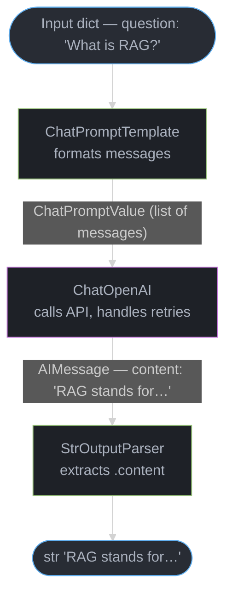
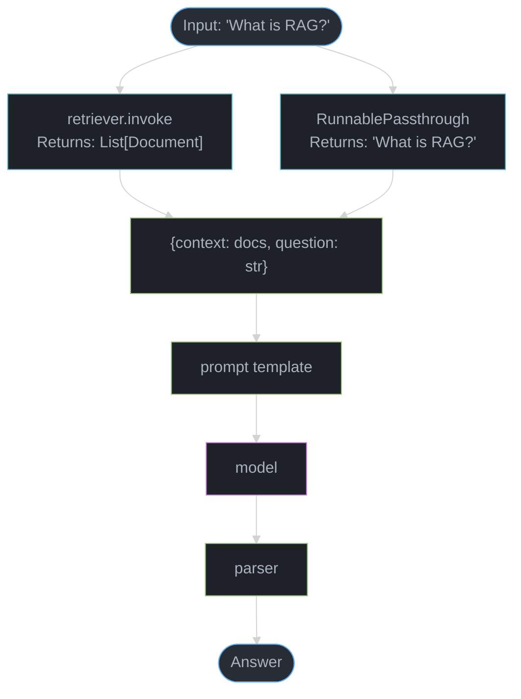
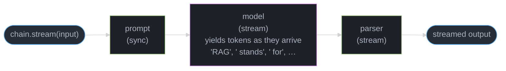

# LangChain and LCEL — Deep Dive

---

## 1. Concept Overview

LangChain is the most widely adopted orchestration framework for LLM applications, providing composable building blocks: prompt templates, output parsers, chains, agents, memory, and 300+ tool/data-source integrations. Released in October 2022, it became the default choice for LLM developers within six months due to its breadth of integrations and active community.

LangChain Expression Language (LCEL), introduced in 2023 with version 0.1.0, replaced the legacy chain classes (LLMChain, ConversationalRetrievalChain) with a composable pipe-based API. LCEL is now the canonical way to build with LangChain.

**Current version**: langchain-core 0.2.x / langchain 0.2.x / langchain-community 0.2.x
**Production adoption signal**: Used by Notion AI, Elastic, Replit (initially), numerous enterprise deployments. The most-starred LLM framework on GitHub as of 2024.

---

## 2. Intuition

**One-line analogy**: LangChain is like Unix pipes for LLMs — small composable pieces (prompt | model | parser) chained together, each transforming data in a well-defined way.

**Mental model**: Every LangChain component is a Runnable. Runnables have a consistent interface: `.invoke()`, `.stream()`, `.batch()`, `.ainvoke()`. Piping Runnables with `|` creates a new Runnable. The chain `prompt | model | parser` is itself a Runnable that can be piped further, passed as an argument, or parallelized.

**Why it matters**: Most LLM applications share 80% of the same patterns — get user input, retrieve context, format a prompt, call the LLM, parse the output, handle errors. LangChain encodes these patterns so teams don't reinvent them. The remaining 20% where LangChain falls short is where you write custom Runnables.

**Key insight**: LCEL's primary innovation is not syntactic sugar — it is that every `.batch()` call uses a thread pool, every `.stream()` is native, and every operation is automatically traced by LangSmith. The pipe operator composes both the logic and the observability infrastructure.

---

## 3. Core Principles

**Runnable Protocol**: Every component implements `invoke(input) -> output`, `stream(input) -> Iterator`, `batch(inputs) -> List[output]`, and their async equivalents. This uniformity means a chain of 10 components behaves identically to a single component from the caller's perspective.

**Composability over inheritance**: Old LangChain (pre-LCEL) used class inheritance to extend chains. LCEL uses composition — wrap any function with `RunnableLambda`, combine with `|`. No subclassing required.

**Lazy evaluation**: Composing `a | b | c` does not execute — it builds a computation graph. Execution happens only when `.invoke()` or `.stream()` is called. This allows inspection (`chain.get_graph()`), serialization (`chain.to_json()`), and parallel batching.

**Immutability**: LCEL chains are stateless by default. Memory and state are explicit (not hidden in the chain object). This prevents the "mysterious side effects" of legacy ConversationalBufferMemory.

**Separation of concerns**: `langchain-core` (Runnable abstractions, base classes) vs `langchain-community` (third-party integrations) vs `langchain` (pre-built chains, agents). Pin versions per package.

---

## 4. Types / Architectures / Strategies

### Runnable Types

| Type | Purpose | Example |
|------|---------|---------|
| `ChatPromptTemplate` | Format messages into prompt | `ChatPromptTemplate.from_messages([...])` |
| `ChatOpenAI` / `ChatAnthropic` | LLM inference | Model wrapper with retry/backoff |
| `StrOutputParser` / `JsonOutputParser` | Parse model output | Extract string or JSON from AIMessage |
| `PydanticOutputParser` | Type-safe output | Validate against a Pydantic model |
| `RunnableLambda` | Wrap any Python function | `RunnableLambda(lambda x: x.upper())` |
| `RunnablePassthrough` | Pass input unchanged | Used for parallel branches needing original input |
| `RunnableParallel` | Run branches concurrently | Fetch context AND user info simultaneously |
| `RunnableBranch` | Conditional routing | Route to different chains based on classifier |
| `RunnableWithMessageHistory` | Stateful conversations | Wrap chain with per-session history store |

### Chain Patterns

1. **Simple sequential**: `prompt | model | parser`
2. **RAG chain**: `{"context": retriever, "question": passthrough} | prompt | model | parser`
3. **Parallel enrichment**: `RunnableParallel({"docs": retriever, "user": user_fetcher}) | merge | prompt | model`
4. **Conditional routing**: `RunnableBranch((is_coding_question, code_chain), general_chain)`
5. **Map-reduce**: `.batch()` over documents, then aggregate

### Agent Strategies

- **Tool calling agent** (recommended): Uses native function calling (OpenAI, Anthropic, Gemini). Most reliable.
- **ReAct agent**: Model reasons and acts in natural language (see [ReAct and Reasoning Patterns](../agents_and_tool_use/react_and_reasoning_patterns.md)). Works with any model but less reliable.
- **Structured chat agent**: Older pattern; deprecated in favor of tool calling.

---

## 5. Architecture Diagrams

### LCEL Execution Model



`chain.invoke({"question": "What is RAG?"})` on `chain = prompt | model | parser` — each pipe stage transforms the payload type: dict → ChatPromptValue → AIMessage → str.

### RunnableParallel — RAG Pattern



### Streaming Flow



---

## 6. How It Works — Detailed Mechanics

### Basic LCEL Chain

```python
from langchain_core.prompts import ChatPromptTemplate
from langchain_core.output_parsers import StrOutputParser
from langchain_openai import ChatOpenAI

# Each component is a Runnable
prompt = ChatPromptTemplate.from_messages([
    ("system", "You are a helpful assistant."),
    ("human", "{question}")
])
model = ChatOpenAI(model="gpt-4o", temperature=0)
parser = StrOutputParser()

# | operator creates a new Runnable (RunnableSequence)
chain = prompt | model | parser

# Sync invocation
result = chain.invoke({"question": "What is RAG?"})

# Streaming
for chunk in chain.stream({"question": "What is RAG?"}):
    print(chunk, end="", flush=True)

# Async
result = await chain.ainvoke({"question": "What is RAG?"})

# Batch with concurrency (default: 5 concurrent)
results = chain.batch(
    [{"question": q} for q in questions],
    config={"max_concurrency": 10}
)
```

### RAG Chain with RunnableParallel

```python
from langchain_core.runnables import RunnableParallel, RunnablePassthrough
from langchain_community.vectorstores import Chroma
from langchain_openai import OpenAIEmbeddings

vectorstore = Chroma(embedding_function=OpenAIEmbeddings())
retriever = vectorstore.as_retriever(search_kwargs={"k": 4})

def format_docs(docs):
    return "\n\n".join(doc.page_content for doc in docs)

prompt = ChatPromptTemplate.from_messages([
    ("system", "Answer based on context:\n\n{context}"),
    ("human", "{question}")
])

# Build retrieval chain
rag_chain = (
    RunnableParallel({
        "context": retriever | format_docs,  # retriever returns docs, format_docs serializes
        "question": RunnablePassthrough()     # passes original question through
    })
    | prompt
    | ChatOpenAI(model="gpt-4o")
    | StrOutputParser()
)

answer = rag_chain.invoke("What is PagedAttention?")
```

### Stateful Conversations with RunnableWithMessageHistory

```python
from langchain_core.runnables.history import RunnableWithMessageHistory
from langchain_community.chat_message_histories import RedisChatMessageHistory

# Per-session history stored in Redis
def get_session_history(session_id: str):
    return RedisChatMessageHistory(session_id, url="redis://localhost:6379")

chain_with_history = RunnableWithMessageHistory(
    chain,
    get_session_history,
    input_messages_key="question",
    history_messages_key="history",
)

# Each session_id gets independent history — sessions do NOT share state
chain_with_history.invoke(
    {"question": "What is RAG?"},
    config={"configurable": {"session_id": "user-123"}}
)
```

### Custom Runnable with RunnableLambda

```python
from langchain_core.runnables import RunnableLambda

def add_metadata(input_dict):
    return {**input_dict, "timestamp": datetime.now().isoformat()}

# Any Python function becomes a Runnable
enriched_chain = RunnableLambda(add_metadata) | prompt | model | parser
```

### Structured Output with Pydantic

```python
from pydantic import BaseModel, Field
from langchain_core.output_parsers import PydanticOutputParser

class ExtractionResult(BaseModel):
    name: str = Field(description="Person's full name")
    company: str = Field(description="Company name")
    role: str = Field(description="Job title or role")

parser = PydanticOutputParser(pydantic_object=ExtractionResult)

prompt = ChatPromptTemplate.from_messages([
    ("system", "Extract structured info.\n{format_instructions}"),
    ("human", "{text}")
]).partial(format_instructions=parser.get_format_instructions())

chain = prompt | ChatOpenAI(model="gpt-4o") | parser
result: ExtractionResult = chain.invoke({"text": "Jane Doe, CTO at Acme Corp..."})
print(result.name)  # "Jane Doe"
```

### Tool Calling Agent

```python
from langchain.agents import create_tool_calling_agent, AgentExecutor
from langchain.tools import tool

@tool
def search_web(query: str) -> str:
    """Search the web for current information."""
    return web_search_api(query)  # actual implementation

@tool
def get_weather(city: str) -> str:
    """Get current weather for a city."""
    return weather_api(city)

agent = create_tool_calling_agent(
    llm=ChatOpenAI(model="gpt-4o"),
    tools=[search_web, get_weather],
    prompt=prompt
)

executor = AgentExecutor(agent=agent, tools=[search_web, get_weather], verbose=True)
result = executor.invoke({"input": "What is the weather in San Francisco?"})
```

### Error Handling and Fallbacks

```python
from langchain_core.runnables import RunnableWithFallbacks

primary = ChatOpenAI(model="gpt-4o")
fallback = ChatOpenAI(model="gpt-3.5-turbo")

# If primary raises an exception, try fallback
robust_model = primary.with_fallbacks([fallback])

# Retry with backoff (built into ChatOpenAI via tenacity)
model_with_retry = ChatOpenAI(
    model="gpt-4o",
    max_retries=3,  # exponential backoff, default
)
```

### Prompt Caching with LangChain

Anthropic's prompt caching reduces cost by 90% and latency by 80% for long, repeated system prompts (1000+ tokens) — see [LLM Caching](../llm_caching/README.md) for the full caching-layer landscape. Pass `cache_control` via `extra_headers` on the `ChatAnthropic` model:

```python
from langchain_anthropic import ChatAnthropic
from langchain_core.messages import SystemMessage, HumanMessage

# Mark the system prompt for caching — Anthropic caches the prefix up to this marker
model = ChatAnthropic(
    model="claude-opus-4-6",
    extra_headers={"anthropic-beta": "prompt-caching-2024-07-31"}
)

# Cache the long system prompt (must be >= 1024 tokens for claude-3, >= 2048 for claude-3-5)
system_message = SystemMessage(
    content=[{
        "type": "text",
        "text": "<long system prompt with 2000+ tokens of context, documentation, etc.>",
        "cache_control": {"type": "ephemeral"}  # cache this prefix
    }]
)

chain = model | StrOutputParser()

# First call: cache miss — full input cost
response1 = chain.invoke([system_message, HumanMessage(content="Question 1")])

# Subsequent calls: cache hit — 90% cost discount on cached tokens
# Usage metadata shows: cached_input_tokens vs new_input_tokens
response2 = chain.invoke([system_message, HumanMessage(content="Question 2")])
# response2.response_metadata["usage"] includes "cache_read_input_tokens"
```

For OpenAI (GPT-4o-mini, GPT-4o on API), automatic prefix caching is enabled by default. Inspect `usage.prompt_tokens_details.cached_tokens` in the response metadata to verify cache hits. Cached tokens are billed at 50% of standard input price.

**Cost impact**: A RAG chain with a 4096-token system prompt making 1000 calls/day: uncached = $0.02/call × 1000 = $20/day; cached = $0.002/call × 1000 = $2/day. Cache hits also reduce TTFT by 400-600ms for long prompts.

### Streaming Structured Outputs

When using `with_structured_output` or `JsonOutputParser`, LangChain supports partial JSON streaming — yielding parsed fragments as tokens arrive:

```python
from langchain_core.output_parsers import JsonOutputParser
from langchain_openai import ChatOpenAI
from pydantic import BaseModel

class ProductReview(BaseModel):
    sentiment: str
    score: int
    summary: str
    pros: list[str]
    cons: list[str]

model = ChatOpenAI(model="gpt-4o", temperature=0)

# with_structured_output in streaming mode — yields partial Pydantic objects
structured_model = model.with_structured_output(ProductReview, include_raw=False)

# Use astream for async streaming of partial objects
async for partial in structured_model.astream(
    "Review this product: noise-cancelling headphones with 30h battery..."
):
    # partial is a partial ProductReview — fields populate as they arrive
    # partial.sentiment may be "positive" before partial.pros is populated
    print(partial)

# JsonOutputParser approach — yields partial dicts
json_parser = JsonOutputParser(pydantic_object=ProductReview)
chain = model | json_parser

for partial_dict in chain.stream("Extract review info: ..."):
    # partial_dict grows as JSON tokens arrive:
    # {} -> {"sentiment": "pos"} -> {"sentiment": "positive", "score": 4} -> ...
    if "score" in partial_dict:
        print(f"Score so far: {partial_dict['score']}")
```

**Streaming mode**: `streaming_mode="partial"` in `with_structured_output` yields progressively more complete Pydantic models. Use this for real-time UI updates (show fields as they parse rather than waiting for complete JSON). Caveat: partial Pydantic validation fails — use `include_raw=True` to get the raw chunk alongside the validated object.

---

## 7. Real-World Examples

**Notion AI**: Uses LangChain for workspace Q&A. Custom RAG pipeline over user documents. LangChain handles the retrieval chain; custom Notion connector handles document loading and permission filtering.

**Elastic (Elasticsearch)**: Integrated LangChain into their vector search product. LangChain's ElasticsearchRetriever connects to Elasticsearch for BM25 + dense hybrid search with a few lines of code.

**GitLab Duo**: Code review and merge request summaries. LCEL chains compose: diff retriever | code review prompt | model | structured output parser. LangSmith traces every review for quality analysis.

**MLflow AI Gateway**: Uses LangChain callback handlers for centralized token counting and cost attribution across multiple tenants.

**Standard enterprise RAG pattern**: Thousands of enterprise deployments use the pattern: `SharePoint/Confluence loader → text splitter → OpenAI embeddings → Chroma/Pinecone → LangChain RAG chain → Azure OpenAI`

---

## 8. Tradeoffs

| Dimension | LangChain (LCEL) | Direct API calls | LlamaIndex |
|-----------|-----------------|-----------------|-----------|
| Development speed | Fast (pre-built patterns) | Slow (write everything) | Fast (for RAG) |
| Debugging | Medium (LangSmith helps) | Easy (your code) | Medium |
| Abstraction overhead | 50-150ms per chain step | ~0ms | 50-100ms |
| Integration breadth | Highest (300+ integrations) | None (build yourself) | High (RAG-focused) |
| Version stability | Low (frequent breaking changes) | N/A | Medium |
| Lock-in risk | High (framework-specific APIs) | None | Medium |
| Streaming support | Native in LCEL | Manual | Native |
| Test coverage | Medium (framework is complex) | High (your code) | Medium |
| Community/docs | Excellent | N/A | Good |

**LCEL vs Legacy Chains:**

| Aspect | LCEL | Legacy (LLMChain etc.) |
|--------|------|----------------------|
| Syntax | `prompt \| model \| parser` | `LLMChain(prompt=..., llm=...)` |
| Streaming | Native `.stream()` | Callback-based, complex |
| Async | Consistent `.ainvoke()` | Inconsistent support |
| Batching | `.batch()` with concurrency | Not built-in |
| Debugging | `chain.get_graph()`, LangSmith | Stack-trace hunting |
| Status | Current, maintained | Deprecated, will be removed |

---

## 9. When to Use / When NOT to Use

**Use LangChain when:**
- Need many pre-built integrations (Chroma, Pinecone, OpenSearch, PGVector, Notion, Confluence, GitHub, etc.)
- Rapid prototyping — framework turns 3 days into 3 hours for standard RAG
- Team is new to LLM patterns and needs opinionated structure
- Need LangSmith tracing with minimal setup (set `LANGSMITH_API_KEY`, tracing is automatic)
- Standard patterns: chat history, RAG, tool-calling agents

**Do NOT use LangChain when:**
- Simple use case (single LLM call + output parsing is 20 lines without framework)
- Performance is the primary constraint — 50-200ms overhead per invocation is significant at scale
- Team needs to understand exactly what happens at each step — abstraction hides this
- Heavy customization of retrieval logic — often faster to write custom Python than fight LangChain's retriever abstraction
- Your team spends more time debugging LangChain than debugging your logic (a common symptom)

---

## 10. Common Pitfalls

**Pitfall 1: Using legacy chains instead of LCEL**
Production issue: `ConversationalRetrievalChain` silently dropped context windows when conversation grew. The class had no streaming support. Teams discovered this in production when customers reported laggy chat. Fix: migrate to LCEL `RunnableWithMessageHistory` — explicit, streaming-native, debuggable.

**Pitfall 2: Not pinning package versions**
LangChain releases broke production deployments multiple times in 2023-2024. Breaking changes in callbacks, prompt template formats, agent output parsing. The split into `langchain`, `langchain-core`, `langchain-community` happened mid-2023 with a namespace migration that broke all imports. Pin exact versions in `requirements.txt`; use `pip-tools` or Poetry lockfiles.

**Pitfall 3: Default retrieval parameters**
`retriever.as_retriever()` defaults to `k=4` and cosine similarity threshold of 0. For 10,000-document knowledge bases, 4 chunks are often insufficient. Teams deployed with defaults, saw poor answer quality, blamed the model. The actual issue: retrieving 4 chunks from 10K documents by raw cosine similarity without reranking. Fix: tune `k`, add reranking, add MMR (Maximum Marginal Relevance) for diversity.

**Pitfall 4: Ignoring LangSmith until something breaks**
"We'll add tracing later" is the most common mistake. When a production agent starts hallucinating or looping, retroactive debugging without traces means replaying queries and guessing. LangSmith setup is 2 lines (`LANGSMITH_API_KEY` env var + `LANGSMITH_TRACING=true`). Add it before writing any logic.

**Pitfall 5: Mutable state in RunnableLambda**
```python
# BROKEN: count is shared across all requests
count = 0
def my_lambda(x):
    count += 1  # Race condition in concurrent batch()
    return x

# FIX: keep lambda stateless, pass state through the chain dict
def my_lambda(x):
    return {**x, "step": x.get("step", 0) + 1}
```

**Pitfall 6: Callback handler thread-safety**
LangChain callbacks run in the same thread as the chain by default. In async code, `on_llm_start` may be called from multiple coroutines simultaneously. Custom callback handlers that write to non-thread-safe structures (plain lists, dicts) corrupt data in production under load.

Fix: replace custom callback-based tracing with LangSmith's env-var tracing (`LANGSMITH_TRACING=true`). For per-request attribution, propagate `run_id` from the config:

```python
import uuid
from langchain_core.runnables import RunnableConfig

# Generate a unique run_id per request — traces in LangSmith are grouped by run_id
run_id = uuid.uuid4()
config = RunnableConfig(run_id=run_id, tags=["user-123", "prod"])

result = chain.invoke(input_data, config=config)

# In LangSmith, filter traces by run_id to see the exact chain execution
# No custom callback needed — LangSmith captures everything automatically
print(f"Trace: https://smith.langchain.com/runs/{run_id}")
```

This approach is thread-safe (LangSmith handles concurrency), captures full input/output/latency at each step, and links traces across services when the same `run_id` is propagated.

**Pitfall 7: Memory in production**
`ConversationBufferMemory` stores entire conversation history in RAM. A chat session with 100 messages and 500 tokens each = 50K tokens of history passed on every call. Cost: $0.25/call for GPT-4o. Fix: use `ConversationSummaryMemory` with a 2K token budget, or `ConversationBufferWindowMemory(k=5)` to keep last 5 turns only.

---

## 11. Technologies & Tools

| Tool | Category | Version Notes |
|------|----------|---------------|
| `langchain-core` | Core Runnable abstractions | 0.2.x — stable interface |
| `langchain` | High-level chains + agents | 0.2.x — pin strictly |
| `langchain-community` | 300+ third-party integrations | Moves fast, pin strictly |
| `langchain-openai` | OpenAI-specific integration | Separate package since 0.1 |
| `langchain-anthropic` | Anthropic-specific integration | Separate package since 0.1 |
| `langsmith` | Tracing, evaluation, dataset management | Set `LANGSMITH_TRACING=true`; dataset versioning, A/B testing for chains |
| [`langgraph`](langgraph.md) | Stateful agent graphs | Companion to LangChain |
| `pydantic` v2 | Output validation | LangChain 0.2+ requires pydantic v2 |

**Version matrix:**
- LangChain 0.0.x (2022-2023): legacy chains, not LCEL
- LangChain 0.1.x (early 2024): LCEL introduced, legacy deprecation announced
- LangChain 0.2.x (mid-2024): pydantic v2, package split, legacy removed
- `langchain-core`: the stable foundation; updates are backward-compatible

**LangSmith 2025 features:**
- **Dataset versioning**: tag datasets (`v1`, `v2`, `baseline`) and compare chain performance across versions.
- **A/B testing chains**: run two chain variants against the same dataset, compare scores side-by-side, and select the winner with statistical confidence.
- **Prompt Hub versioning**: commit prompts with versions, pull specific versions by commit hash, track prompt performance over time.
- **Annotation queues**: route production traces to human reviewers; collect corrections that become training data.

---

## 12. Interview Questions with Answers

**Q: What is LCEL and how does it differ from legacy LangChain chains?**
LCEL (LangChain Expression Language) is a composable Runnable API using Python's pipe operator (`|`) to chain components. Legacy chains (`LLMChain`, `ConversationalRetrievalChain`) were class-based, required subclassing to customize, had inconsistent streaming support, and buried state in the chain object. LCEL is stateless by default, streaming-native, async-native, and supports `.batch()` with configurable concurrency. Legacy chains are deprecated as of LangChain 0.2.

**Q: What is a Runnable in LangChain?**
A Runnable is any object implementing the protocol: `invoke(input) -> output`, `stream(input) -> Iterator`, `batch(inputs) -> List`, and async variants `ainvoke`, `astream`, `abatch`. Built-in Runnables include `ChatPromptTemplate`, `ChatOpenAI`, `StrOutputParser`, `RunnableLambda`, `RunnableParallel`. Composing Runnables with `|` produces a `RunnableSequence`, which is itself a Runnable. This uniformity means you can swap any component without changing callers.

**Q: How does RunnableParallel work and when do you use it?**
`RunnableParallel` runs multiple Runnables concurrently and returns a dict of results. Internally, it uses `ThreadPoolExecutor` for sync and `asyncio.gather` for async. Use it when building a RAG chain that needs both retrieved context and the original question: `RunnableParallel({"context": retriever, "question": RunnablePassthrough()})`. This runs retrieval in parallel while passing the question through, then feeds the combined dict to the prompt template. Without it, you'd need sequential steps.

**Q: How do you add conversation memory to an LCEL chain?**
Use `RunnableWithMessageHistory`. Wrap the chain, provide a `get_session_history` callable that returns a `BaseChatMessageHistory` for a given session ID, and specify which keys contain input messages and where to inject history. Each `invoke` call loads history from the store, prepends it to messages, and appends the new exchange. For production, use `RedisChatMessageHistory` or `DynamoDBChatMessageHistory` — not in-memory stores which lose data on restart.

**Q: What is `RunnablePassthrough` and why is it needed?**
`RunnablePassthrough` is a Runnable that returns its input unchanged. It is needed in `RunnableParallel` to pass the original input to one branch while other branches transform it. In the RAG pattern `RunnableParallel({"context": retriever, "question": RunnablePassthrough()})`, the retriever transforms the question into documents; `RunnablePassthrough` preserves the original question string so the prompt template can use both. Without it, the question would be consumed by the retriever and lost.

**Q: How does LangChain's streaming work end-to-end?**
When you call `chain.stream(input)`, LangChain iterates through each component. Non-streaming components (prompt templates) complete synchronously and pass to the next. The LLM model, if the provider supports it, returns a streaming iterator that yields `AIMessageChunk` objects as tokens arrive from the API. The output parser, if streaming-compatible, processes each chunk and yields partial results. The `|` composition propagates chunks from the LLM through the parser to the caller. Token-by-token streaming requires: (1) a model that supports streaming, (2) an output parser that handles partial chunks (most built-in parsers do), and (3) calling `.stream()` not `.invoke()`.

**Q: How do you implement a fallback chain in LangChain?**
Use `.with_fallbacks([alternative_runnable])`. When the primary Runnable raises an exception (API error, rate limit, timeout), LangChain retries with the fallback. Example: `gpt4.with_fallbacks([gpt35])` — if GPT-4o returns a 429 error, retry with GPT-3.5-turbo. For model-level retries (same model, transient errors), use `max_retries` parameter on `ChatOpenAI`. For structured output validation failures, chain with `StrOutputParser().with_fallbacks([default_response_lambda])`.

**Q: What is the tool-calling agent pattern and how does it differ from ReAct?**
Tool-calling agent uses native function calling (OpenAI function calling, Anthropic tool use) — the model outputs structured JSON specifying which tool to call and with what arguments. This is parsed deterministically. ReAct (Reasoning + Acting) predates native function calling: the model produces free-text Thought/Action/Observation blocks which are parsed with regex. Tool-calling is more reliable (structured output), faster (fewer tokens), and works better with smaller models. ReAct is more flexible (works with any model, any tool description) but has higher parse failure rates. Use tool-calling for production; use ReAct only for models without native function calling support.

**Q: How do you debug a failing LangChain chain?**
Three approaches: (1) LangSmith: set `LANGSMITH_TRACING=true` — every invocation is traced with full input/output/latency at each step; view at smith.langchain.com; click into any step to see the exact prompt sent; (2) `chain.get_graph().print_ascii()` — visualizes the chain structure to catch misconfiguration; (3) Call each component individually: `prompt.invoke(input)`, then `model.invoke(prompt_output)`, then `parser.invoke(model_output)` — isolates which step fails. For intermittent failures, LangSmith's run history is the only reliable debugging tool.

**Q: How do you implement cost budgeting per user in a LangChain application?**
Use a custom callback handler that tracks tokens: subclass `BaseCallbackHandler`, implement `on_llm_end(response)`, extract `response.llm_output["token_usage"]`, accumulate per session ID. Inject the callback at invocation time: `chain.invoke(input, config={"callbacks": [budget_tracker]})`. Check budget before each invocation: `if budget_tracker.total_cost(session_id) >= BUDGET_LIMIT: raise BudgetExceededException`. Concrete numbers: GPT-4o costs $5/1M input tokens + $15/1M output tokens; a 10K token/day user budget = ~$0.15/day at typical input/output ratios.

**Q: What are the package boundaries in LangChain 0.2+?**
`langchain-core`: Runnable protocol, base classes (BaseLanguageModel, BaseRetriever, etc.), no third-party dependencies. `langchain`: High-level chains, agents, and prompt templates built on core. `langchain-community`: Third-party integrations (vector stores, LLMs, tools, document loaders) — these have external dependencies. `langchain-openai`, `langchain-anthropic`, `langchain-google-genai`: Provider-specific implementations, maintained by providers. This split means you can use `langchain-core` + `langchain-openai` without installing the 300+ community dependencies. In production, only install what you need.

**Q: How do you test a LangChain chain?**
Unit test components independently: test prompt templates with `prompt.format_messages(question="test")`, test output parsers with expected model outputs, test RunnableLambda functions as plain Python. For integration tests, use `pytest` with `@pytest.mark.vcr` to record and replay actual API responses (using `vcrpy`). For evaluation, use LangSmith's dataset + evaluator pattern: upload test cases to a dataset, run the chain against each, apply an LLM-as-judge evaluator for correctness. Concrete: a RAG chain evaluation should test retrieval recall (are relevant docs retrieved?), answer faithfulness (does the answer stay in context?), and answer relevance (does it address the question?).

**Q: What are common signs that a LangChain chain is over-engineered?**
Signs: (1) more time debugging LangChain internals than your own logic; (2) custom Runnable subclasses for every step instead of simple RunnableLambda; (3) multiple nested RunnableParallel for what could be a single Python function; (4) using LangChain's callback system instead of standard logging. The framework is a tool: if you're fighting it, simplify. A direct API call + 30 lines of Python is often clearer than a 10-component LCEL chain for simple use cases.

**Q: How does LangChain handle retries and rate limits?**
`ChatOpenAI` uses `tenacity` under the hood with exponential backoff (default 3 retries, starting at 1 second, max 60 seconds). Customize with `max_retries` parameter. For custom retry logic, wrap the model in `RunnableRetry`: `model.with_retry(stop_after_attempt=5, wait_exponential_jitter=True)`. For rate limits specifically, implement a token bucket or sliding window rate limiter as a `RunnableLambda` before the model call. Production pattern: track current requests per minute against the model's RPM limit, queue or reject excess requests before they hit the API.

**Q: Explain the difference between langchain-core and langchain-community.**
`langchain-core` is the stable foundation — defines Runnable, BaseLanguageModel, BaseRetriever, and other abstract interfaces. It has no third-party dependencies and changes rarely. `langchain-community` contains 300+ integrations (Chroma, Pinecone, Notion, GitHub, etc.) — each with its own dependency. Community moves fast; integrations vary in quality and maintenance. In production: declare community dependencies explicitly, pin versions per integration, and validate that the integration handles errors correctly (many community connectors lack proper error handling). If you only use OpenAI: `langchain-core` + `langchain-openai` + `langchain` — skip community entirely.

**Q: What is LangSmith and why is it necessary for production?**
LangSmith is LangChain's observability and evaluation platform. It automatically captures: every LLM call with full input/output/latency/cost, tool calls with arguments and results, chain execution trees with per-step breakdown. It is necessary for production because: (1) without it, debugging means guessing — you see input and output but not intermediate state; (2) cost monitoring — track token usage per user/endpoint; (3) quality evaluation — run automated evaluators on a sample of production traces; (4) creating test datasets from real production queries. Setup: `LANGSMITH_API_KEY=<key>` environment variable, `LANGSMITH_TRACING=true`. Zero code changes required.

**Q: How does prompt caching work with LangChain and Anthropic, and what cost savings does it provide?**
Anthropic's prompt caching saves the KV cache for a prompt prefix marked with `cache_control: {"type": "ephemeral"}`. When subsequent requests share the same prefix, the cached KV is reused instead of recomputing attention over the full context. In LangChain, pass `extra_headers={"anthropic-beta": "prompt-caching-2024-07-31"}` to `ChatAnthropic` and annotate the system message content with `cache_control`. Cost impact: cached tokens are billed at 10% of standard input price (90% discount); cache writes cost 25% more per token than regular input, but pay back after the second cache hit. For a 4096-token system prompt used in 1000 daily requests, uncached = $0.020/request × 1000 = $20/day; cached = $0.002/request × 1000 = $2/day. Minimum cacheable block: 1024 tokens for claude-3; 2048 for claude-3-5 and later. Cache TTL: 5 minutes (ephemeral).

**Q: How do you stream structured outputs (Pydantic models) from a LangChain chain?**
Use `model.with_structured_output(YourModel)` and call `.astream()` — LangChain yields progressively completed Pydantic objects as tokens arrive. Early yields will have `None` for fields not yet parsed. Alternatively, use `JsonOutputParser` and `.stream()` to receive partial dicts growing token-by-token: first `{}`, then `{"name": "Jan"}`, then `{"name": "Jane", "role": "CTO"}`. The tradeoff: `with_structured_output` gives typed objects but validation only completes at the end; `JsonOutputParser` gives raw dicts at every step. For real-time UI updates where you want to show fields as they arrive, use `JsonOutputParser` with field-presence checks. Partial Pydantic validation: set `include_raw=True` to receive both the partial model and the raw string chunk at each step.

**Q: How do you A/B test two LangChain chains using LangSmith?**
Create a LangSmith dataset with representative input examples. Run both chain variants against the dataset using `langsmith.evaluate()`, specifying the dataset name and an evaluator (LLM-as-judge, custom Python function, or built-in evaluators like `exact_match`). LangSmith records each chain's outputs side-by-side with scores. Compare summary statistics (mean score, pass rate) and individual example failures. Statistical significance: with 100+ examples, a 5-point mean score difference is typically significant. Workflow: baseline chain (tagged `v1`) vs candidate chain (tagged `v2`) → evaluate on 200-example dataset → if candidate wins on primary metric without regression on secondary → deploy candidate. This prevents shipping prompt changes that improve one metric while silently degrading another.

---

## 13. Best Practices

1. **Always use LCEL** — never use legacy chains. They are deprecated and will be removed.
2. **Pin all LangChain packages** — `langchain==0.2.x`, `langchain-core==0.2.x`, `langchain-community==0.2.x` — independently, not just `langchain`.
3. **Connect LangSmith before writing any chain logic** — retroactive debugging is much harder.
4. **Keep RunnableLambda functions stateless** — no mutable closures; all state in the input dict.
5. **Tune retrieval parameters** — default `k=4` is almost never optimal; benchmark with your specific documents.
6. **Use provider packages** — `langchain-openai`, `langchain-anthropic` instead of community wrappers for stability.
7. **Test components in isolation** — invoke each step independently; do not only do end-to-end tests.
8. **Set explicit `max_retries` and `request_timeout`** — defaults may be too aggressive or too lax for production SLAs.
9. **Use `with_fallbacks` for model resilience** — primary model → fallback model with lower cost.
10. **Prefer `RunnableWithMessageHistory` over manual memory management** — handles edge cases (concurrent sessions, history truncation) correctly.

---

## 14. Case Study: Building a Production Enterprise Knowledge Base

**Scenario**: A 500-person company needs an internal Q&A bot over 50,000 Confluence pages (averaging 300 tokens each) with per-user access control, streaming responses, cost tracking per department, and quality evaluation.

### Architecture

```
User Query
    |
    v
Access Control Layer
(filter docs by user permissions)
    |
    v
RunnableParallel:
  - branch 1: retriever (Chroma + BM25 hybrid, k=8, reranked to top 3)
  - branch 2: RunnablePassthrough (keep original query)
    |
    v
ChatPromptTemplate
(system: use only provided context, cite sources)
    |
    v
ChatOpenAI(model="gpt-4o", streaming=True)
    |
    v
StrOutputParser (streaming)
    |
    v
Response with source citations
```

### Key Implementation Decisions

```python
from langchain_core.runnables import RunnableParallel, RunnablePassthrough, RunnableLambda
from langchain_core.callbacks import BaseCallbackHandler

class DepartmentCostTracker(BaseCallbackHandler):
    def __init__(self, department: str, budget_usd: float):
        self.department = department
        self.total_cost = 0.0
        self.budget = budget_usd

    def on_llm_end(self, response, **kwargs):
        usage = response.llm_output.get("token_usage", {})
        # GPT-4o pricing: $5/1M input, $15/1M output
        cost = (usage.get("prompt_tokens", 0) * 5e-6 +
                usage.get("completion_tokens", 0) * 15e-6)
        self.total_cost += cost
        if self.total_cost >= self.budget:
            # Alert: department approaching budget
            alert_ops_team(self.department, self.total_cost)

def build_rag_chain(user: User) -> Runnable:
    # Access-controlled retriever
    retriever = PermissionFilteredRetriever(
        base_retriever=vectorstore.as_retriever(search_kwargs={"k": 12}),
        allowed_doc_ids=user.accessible_confluence_pages
    )
    reranker = CohereReranker(top_n=3)

    cost_tracker = DepartmentCostTracker(user.department, budget_usd=50.0)

    chain = (
        RunnableParallel({
            "context": retriever | reranker | format_docs_with_citations,
            "question": RunnablePassthrough()
        })
        | prompt
        | ChatOpenAI(model="gpt-4o", streaming=True)
        | StrOutputParser()
    )

    return chain.with_config({"callbacks": [cost_tracker]})
```

### Results

- Query latency P50: 1.8 seconds (streaming first token in 400ms)
- Retrieval precision@3: 0.82 (after tuning from default k=4 to hybrid k=12 + rerank to 3)
- Monthly cost per 1000 queries: $12 (tracked per department via callbacks)
- LangSmith evaluation: 87% answer faithfulness (using LLM-as-judge on 500 sampled queries)
- Breaking change incidents: 0 after pinning all LangChain packages to exact versions
