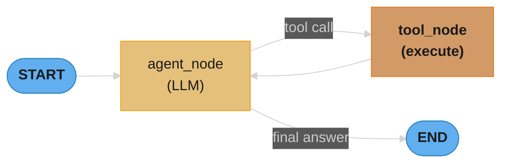
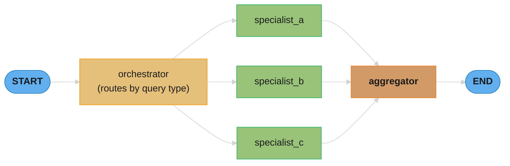
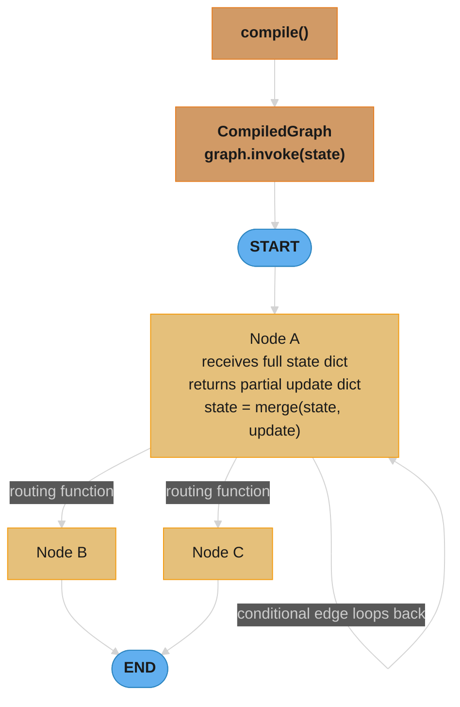
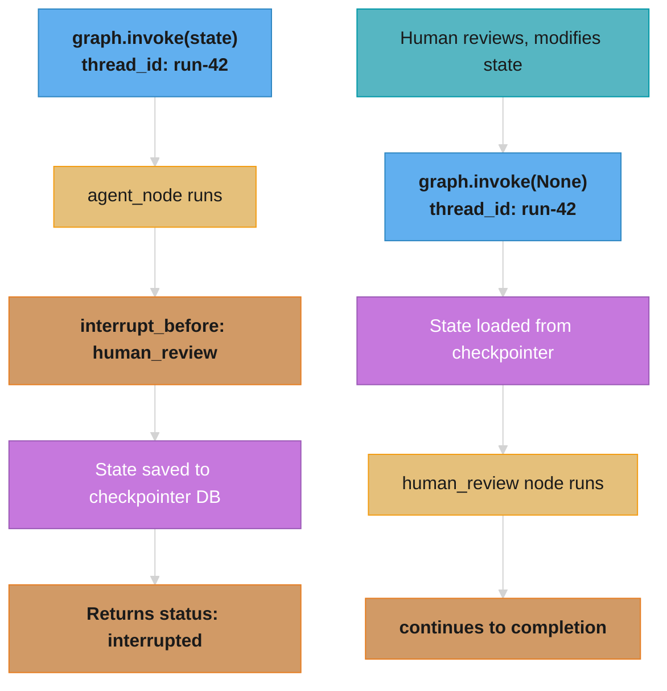
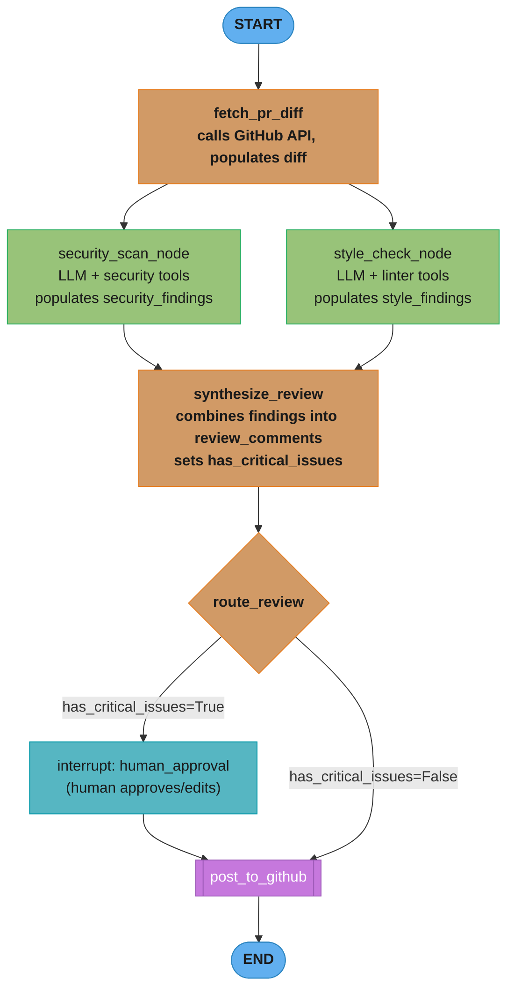

# LangGraph — Deep Dive

---

## 1. Concept Overview

LangGraph is a graph-based framework for building stateful, multi-step LLM applications. Where LangChain chains are DAGs (directed acyclic graphs) that execute once and terminate, LangGraph models workflows as cyclic state machines: nodes process state, edges determine what runs next, and the graph can loop until a termination condition.

Released by LangChain, Inc. in January 2024, LangGraph became the recommended way to build production agents. It replaces `AgentExecutor` (LangChain's old agent runner) for any workflow requiring: loops, human-in-the-loop approvals, multi-agent coordination, or persistent state across sessions.

**Current version**: langgraph 0.1.x (2024)
**Production adoption signal**: Used by LinkedIn, Elastic, Replit, and thousands of enterprise deployments via LangGraph Cloud. The de facto standard for production LLM agents.

---

## 2. Intuition

**One-line analogy**: LangGraph is a state machine where each node is an LLM call or tool execution, edges are transitions, and the state is a TypedDict that flows through the graph.

**Mental model**: Imagine a flowchart for a customer support agent. "Classify issue" is a node. Based on classification, the edge routes to "technical support" or "billing support." Each support node can decide to "escalate" (go to a human review node) or "resolve" (go to END). LangGraph makes this flowchart executable, persistent (save to database and resume), and observable (stream every state transition to a UI).

**Why it matters**: Real agents need loops (try → evaluate → retry), branches (route based on output), and persistence (resume after failure or human approval). These are impossible with linear chains. LangGraph provides the minimal infrastructure to build these correctly.

**Key insight**: The most important architectural decision in LangGraph is defining the State TypedDict. Everything — how nodes communicate, what gets persisted, what you can query — depends on the state shape. Design the state before writing any nodes.

---

## 3. Core Principles

**Explicit state**: All data flowing through the graph lives in a single typed dict (`TypedDict`). Nodes receive the full state and return a dict of updates. No hidden state, no shared mutable objects.

**Nodes are pure functions**: A node function takes state and returns a partial update. `def my_node(state: MyState) -> dict:`. This makes nodes easy to unit test in isolation.

**Edges define flow**: Unconditional edges (`add_edge`) always go to a specific next node. Conditional edges (`add_conditional_edges`) call a routing function to determine the next node dynamically.

**Reducers merge updates**: When a node returns `{"messages": [new_message]}`, the graph needs to know whether to replace the messages list or append to it. Reducers define this merge behavior. The built-in `add_messages` reducer appends; default is replace.

**Checkpointers enable persistence**: A checkpointer (SQLite, PostgreSQL, Redis) saves the full state after each node. If the graph is interrupted (human-in-the-loop, crash, timeout), it can resume from the last checkpoint.

---

## 4. Types / Architectures / Strategies

### Single-Agent Loop (Most Common)



The agent node calls the LLM; if the LLM requests a tool, the tool node executes it; the result goes back to the agent node.

### Multi-Agent Graph



Specialized agents run in parallel or sequentially, each with different tools and prompts. The orchestrator routes based on query type.

### Human-in-the-Loop



```mermaid
%%{init: {'flowchart': {'curve': 'basis'}, 'theme': 'dark'}}%%
flowchart LR
    classDef io      fill:#61afef,stroke:#2e86c1,color:#1a1a1a,font-weight:bold
    classDef frozen  fill:#c678dd,stroke:#9b59b6,color:#fff
    classDef train   fill:#98c379,stroke:#27ae60,color:#1a1a1a
    classDef mathOp  fill:#d19a66,stroke:#e67e22,color:#1a1a1a,font-weight:bold
    classDef lossN   fill:#e06c75,stroke:#c0392b,color:#fff,font-weight:bold
    classDef req     fill:#56b6c2,stroke:#0097a7,color:#1a1a1a
    classDef base    fill:#e5c07b,stroke:#f39c12,color:#1a1a1a

    S([START]) --> AgentNode["agent_node"]
    AgentNode --> Interrupt[/"interrupt_before\nhuman_review"/]
    Interrupt --> Human["human_review\n(approve / modify state)"]
    Human --> AgentNode2["agent_node\n(resume)"]
    AgentNode2 --> E([END])

    class S,E io
    class AgentNode,AgentNode2 base
    class Interrupt frozen
    class Human req
```

`interrupt_before=["human_review"]` pauses the graph; a human approves/modifies state; the graph resumes.

### Hierarchical Multi-Agent

```
Supervisor
  ├── Research Agent (with web search tools)
  ├── Analysis Agent (with code execution)
  └── Writing Agent (with document tools)
```
Each sub-agent is itself a LangGraph graph. The supervisor orchestrates by passing tasks and receiving results.

### Patterns Summary

| Pattern | Use Case | Key Feature |
|---------|----------|-------------|
| ReAct loop | Single agent, tool use | Cyclic: agent ↔ tools |
| Human-in-loop | Approval workflows | `interrupt_before` checkpointing |
| Parallel subgraphs | Independent tasks | `Send` API for parallel branches |
| Multi-agent | Specialized agents | Agents as nodes, supervisor routing |
| Hierarchical | Complex research/coding | Subgraphs as nodes |
| Map-reduce | Process many items | Parallel fan-out, aggregate fan-in |

---

## 5. Architecture Diagrams

### StateGraph Execution Model



### State Reducer Flow

```
Initial state: {"messages": [HumanMessage("hi")]}

Node 1 returns: {"messages": [AIMessage("hello")]}
                                    |
                               reducer: add_messages
                                    |
                                    v
After Node 1: {"messages": [HumanMessage("hi"), AIMessage("hello")]}

Node 2 returns: {"messages": [ToolMessage("weather=72F")]}
                                    |
                                    v
After Node 2: {"messages": [HumanMessage("hi"), AIMessage("hello"), ToolMessage("weather=72F")]}
```

### Checkpointer Flow (Human-in-the-Loop)



The `thread_id` ties both invocations together; the checkpointer stores the full state so the graph resumes exactly where it paused.

---

## 6. How It Works — Detailed Mechanics

### Minimal Complete Agent

```python
from langgraph.graph import StateGraph, END
from langchain_core.messages import BaseMessage, HumanMessage, AIMessage, ToolMessage
from langchain_openai import ChatOpenAI
from langchain_core.tools import tool
from typing import TypedDict, Annotated
from langgraph.graph.message import add_messages
import json

# 1. Define state — all data in one TypedDict
class AgentState(TypedDict):
    messages: Annotated[list[BaseMessage], add_messages]
    # add_messages reducer: new messages are APPENDED not replaced
    # without Annotated, default is to REPLACE

# 2. Define tools
@tool
def get_weather(city: str) -> str:
    """Get current weather for a city."""
    # Real implementation would call weather API
    return f"Weather in {city}: 72F, sunny"

tools = [get_weather]
tools_by_name = {t.name: t for t in tools}

# 3. Bind tools to model
model = ChatOpenAI(model="gpt-4o").bind_tools(tools)

# 4. Define nodes
def agent_node(state: AgentState) -> dict:
    """Call the LLM with the current message history."""
    response = model.invoke(state["messages"])
    return {"messages": [response]}  # add_messages reducer appends

def tool_node(state: AgentState) -> dict:
    """Execute tool calls from the last AI message."""
    last_message = state["messages"][-1]
    results = []
    for tool_call in last_message.tool_calls:
        tool_fn = tools_by_name[tool_call["name"]]
        result = tool_fn.invoke(tool_call["args"])
        results.append(ToolMessage(
            content=str(result),
            tool_call_id=tool_call["id"]
        ))
    return {"messages": results}

# 5. Define routing
def should_continue(state: AgentState) -> str:
    """Route to tool_node if tools were called, else END."""
    last_message = state["messages"][-1]
    if hasattr(last_message, "tool_calls") and last_message.tool_calls:
        return "tools"
    return END

# 6. Build graph
graph = StateGraph(AgentState)
graph.add_node("agent", agent_node)
graph.add_node("tools", tool_node)
graph.set_entry_point("agent")
graph.add_conditional_edges("agent", should_continue)
graph.add_edge("tools", "agent")  # always go back to agent after tools

app = graph.compile()

# 7. Run
result = app.invoke({"messages": [HumanMessage("What's the weather in NYC?")]})
print(result["messages"][-1].content)
# "The weather in NYC is 72F and sunny."
```

### Adding Checkpointing (Persistent State)

```python
from langgraph.checkpoint.sqlite import SqliteSaver

# SQLite checkpointer — saves state after each node
checkpointer = SqliteSaver.from_conn_string(":memory:")  # use file path for persistence

app = graph.compile(checkpointer=checkpointer)

# thread_id is the "session ID" — same thread_id = same conversation state
config = {"configurable": {"thread_id": "user-123-session-1"}}

# First message
app.invoke(
    {"messages": [HumanMessage("What is the weather in NYC?")]},
    config=config
)

# Second message — state is automatically loaded from checkpoint
# Full conversation history is available to the agent
app.invoke(
    {"messages": [HumanMessage("What about in LA?")]},
    config=config
)
```

### Human-in-the-Loop

```python
# Interrupt graph before sensitive node
app = graph.compile(
    checkpointer=checkpointer,
    interrupt_before=["send_email"]  # pause before this node
)

# Graph runs until "send_email" node, then stops
result = app.invoke(input_state, config=config)
# result contains current state; "send_email" has NOT run yet

# Human reviews pending email
current_state = app.get_state(config)
print(current_state.values["draft_email"])

# Option 1: Approve — resume without modification
app.invoke(None, config=config)

# Option 2: Modify — update state, then resume
app.update_state(config, {"draft_email": "Modified email content..."})
app.invoke(None, config=config)
```

### Streaming State Updates

```python
# Stream every state change to UI
for event in app.stream(
    {"messages": [HumanMessage("Research LangGraph for me")]},
    config={"configurable": {"thread_id": "research-1"}}
):
    for key, value in event.items():
        print(f"Node '{key}' returned: {value}")
    # Output:
    # Node 'agent' returned: {'messages': [AIMessage(tool_calls=[...])]}
    # Node 'tools' returned: {'messages': [ToolMessage(content='...')]}
    # Node 'agent' returned: {'messages': [AIMessage(content='LangGraph is...')]}

# Stream token-by-token from LLM (not just state transitions)
async for event in app.astream_events(input_state, version="v1"):
    if event["event"] == "on_chat_model_stream":
        chunk = event["data"]["chunk"]
        print(chunk.content, end="", flush=True)
```

### Multi-Agent with Supervisor

```python
from langgraph.graph import StateGraph, END
from typing import Literal

class SupervisorState(TypedDict):
    messages: Annotated[list[BaseMessage], add_messages]
    next_agent: str

def supervisor_node(state: SupervisorState) -> dict:
    """Decide which agent handles this query."""
    decision = supervisor_model.invoke(
        state["messages"] + [ROUTING_PROMPT]
    )
    # Parse decision from structured output
    return {"next_agent": decision.next_agent}

def route_from_supervisor(state: SupervisorState) -> str:
    return state["next_agent"]  # "research", "coding", or "END"

# Build research agent as a subgraph
research_graph = build_research_agent()
coding_graph = build_coding_agent()

supervisor = StateGraph(SupervisorState)
supervisor.add_node("supervisor", supervisor_node)
supervisor.add_node("research", research_graph.compile())  # subgraph as node
supervisor.add_node("coding", coding_graph.compile())
supervisor.set_entry_point("supervisor")
supervisor.add_conditional_edges("supervisor", route_from_supervisor)
supervisor.add_edge("research", "supervisor")  # report back
supervisor.add_edge("coding", "supervisor")

multi_agent = supervisor.compile(checkpointer=checkpointer)
```

### Parallel Fan-Out with Send

```python
from langgraph.types import Send

def generate_research_topics(state: ResearchState) -> list[Send]:
    """Fan out to research multiple topics in parallel."""
    topics = state["topics"]
    # Send creates parallel branches — each topic processed independently
    return [Send("research_topic", {"topic": t, "results": []}) for t in topics]

graph.add_conditional_edges("plan", generate_research_topics)
# All research_topic nodes run in parallel; results aggregated in next node
```

### Subgraph State Communication

When composing a parent graph with a subgraph, states do not share the same TypedDict. LangGraph maps parent state fields to subgraph input and merges output back into parent state via schema mappings:

```python
from langgraph.graph import StateGraph, END
from typing import TypedDict, Annotated
from langgraph.graph.message import add_messages

# Subgraph has its own isolated state
class ResearchSubgraphState(TypedDict):
    query: str              # input from parent
    search_results: list    # internal state
    summary: str            # output to parent

def build_research_subgraph():
    sg = StateGraph(ResearchSubgraphState)
    sg.add_node("search", search_node)
    sg.add_node("summarize", summarize_node)
    sg.set_entry_point("search")
    sg.add_edge("search", "summarize")
    sg.add_edge("summarize", END)
    return sg.compile()

# Parent graph state — different fields
class ParentState(TypedDict):
    messages: Annotated[list, add_messages]
    research_query: str     # maps to subgraph's "query"
    research_summary: str   # subgraph's "summary" maps here

# Add compiled subgraph as a node; LangGraph infers state key mapping
# by matching field names: parent["research_query"] -> subgraph["query"]
research_subgraph = build_research_subgraph()

parent = StateGraph(ParentState)
parent.add_node(
    "research",
    research_subgraph,
    # Explicit mapping: parent_key -> subgraph_key (for non-matching names)
    input={"query": lambda s: s["research_query"]},
    output={"research_summary": lambda o: o["summary"]}
)
parent.set_entry_point("research")
```

Key rule: subgraph state is isolated. Parent state fields do not bleed into the subgraph unless explicitly mapped. Subgraph output is merged into parent state only for the explicitly mapped fields — unrelated parent state fields are preserved unchanged.

### Custom Reducers

Beyond `add_messages`, you can define custom reducer functions for any state field:

```python
from typing import Annotated
import operator

# Custom reducer: merge dicts (later values win for duplicate keys)
def merge_dicts(existing: dict, update: dict) -> dict:
    return {**existing, **update}

# Custom reducer: keep highest-priority item from a list
def priority_merge(existing: list, new_items: list) -> list:
    combined = existing + new_items
    return sorted(combined, key=lambda x: x.get("priority", 0), reverse=True)[:10]

class AgentState(TypedDict):
    messages: Annotated[list, add_messages]          # built-in: appends
    metadata: Annotated[dict, merge_dicts]           # custom: merges dicts
    findings: Annotated[list, priority_merge]        # custom: priority-ranked list
    step_count: int                                  # no reducer: replaced each time

# Validation: custom reducers must handle None gracefully (first call has no existing)
def safe_merge_dicts(existing: dict | None, update: dict) -> dict:
    return {**(existing or {}), **update}
```

Custom reducer requirements: the function signature must be `(existing_value, new_value) -> merged_value`. LangGraph calls it when a node returns a partial update for that key. If `existing` is `None` (first time the field is set), your reducer receives `None` — handle it explicitly.

### Dynamic Breakpoints

Control interrupts dynamically based on routing logic, timeouts, or multi-level approval requirements:

```python
from langgraph.graph import StateGraph, END
from langgraph.types import interrupt

class WorkflowState(TypedDict):
    action: str
    risk_level: str       # "low", "medium", "high"
    approval_count: int
    approved: bool

def risk_assessment_node(state: WorkflowState) -> dict:
    """Assess risk and interrupt if approval needed."""
    risk = assess_risk(state["action"])

    if risk == "high":
        # Dynamic interrupt: pause graph, surface state to human
        # This raises GraphInterrupt — graph saves state and returns to caller
        human_decision = interrupt({
            "message": f"High-risk action requires approval: {state['action']}",
            "action": state["action"],
            "risk_level": risk
        })
        # After human resumes, human_decision contains the human's input
        if not human_decision.get("approved"):
            return {"approved": False, "risk_level": risk}

    return {"risk_level": risk, "approved": True}

def dual_approval_node(state: WorkflowState) -> dict:
    """Requires 2 separate approvals for critical actions."""
    if state["approval_count"] < 2:
        human_input = interrupt({
            "message": f"Approval {state['approval_count'] + 1}/2 required",
            "approvals_received": state["approval_count"]
        })
        if human_input.get("approved"):
            return {"approval_count": state["approval_count"] + 1}
        else:
            return {"approved": False}

    return {"approved": True}

# Timeout-based interrupt: use interrupt() with a timestamp check
def timeout_sensitive_node(state: WorkflowState) -> dict:
    import time
    if time.time() - state.get("started_at", time.time()) > 300:  # 5 min timeout
        human_input = interrupt({"message": "Task taking too long — continue or abort?"})
        if not human_input.get("continue"):
            return {"approved": False}
    return {}
```

`interrupt()` is LangGraph 0.1.x's preferred API over `interrupt_before`/`interrupt_after` at compile time — it allows dynamic, condition-based interrupts at any point in a node's execution, with full access to the node's current state at that moment.

---

## 7. Real-World Examples

**LinkedIn**: Uses LangGraph for their agent infrastructure. Multiple specialized agents (profile analysis, message drafting, job matching) connected in supervisor pattern. Checkpointing allows multi-turn conversations that persist across user sessions.

**Elastic**: Rebuilt their AI assistant backend on LangGraph. Search optimization agent, index management agent, and query translation agent run as subgraphs. Human-in-the-loop for index deletions.

**Replit AI Agent**: Code generation agent with test execution loop: write code → run tests → analyze failures → fix code → re-run tests → exit. The loop would not be possible with LangChain chains.

**Stripe internal tooling**: Financial report generation agent. Researches multiple data sources in parallel (fan-out with Send), synthesizes results (fan-in), generates report, routes through human approval before sending to stakeholders.

**Production customer support agents**: Classify issue → route to specialist → retrieve relevant knowledge → draft response → [interrupt] human review for sensitive cases → send. The interrupt_before pattern prevents hallucinated responses from going to customers.

---

## 8. Tradeoffs

| Dimension | LangGraph | LangChain AgentExecutor | Custom Agent Loop |
|-----------|-----------|------------------------|-------------------|
| Complexity | Medium-High | Low | Low-High |
| Debugging | Good (explicit state) | Poor (black box) | Good (your code) |
| Streaming | Native | Callback-based | Manual |
| Persistence | Built-in (checkpointers) | None | Build yourself |
| Human-in-loop | Built-in | Not supported | Build yourself |
| Multi-agent | First-class | Hacks | Build yourself |
| Parallel execution | Send API | Not supported | asyncio |
| Learning curve | High | Low | Variable |
| Lock-in | Medium (LangChain ecosystem) | High | None |

**LangGraph vs CrewAI:**

| Aspect | LangGraph | CrewAI |
|--------|-----------|--------|
| State management | Explicit TypedDict | Implicit (handled by framework) |
| Control flow | Explicit graph edges | Role/task delegation |
| Debugging | Very good (state visible) | Moderate |
| Customization | Very high | Medium |
| Time to build simple agent | Longer | Shorter |
| Production readiness | Excellent | Good |

---

## 9. When to Use / When NOT to Use

**Use LangGraph when:**
- Agent needs to loop (ReAct pattern, retry on failure, iterative refinement)
- Human approval is required at specific steps
- State must persist across multiple user interactions (conversation memory)
- Multi-agent coordination with explicit routing
- You need to stream intermediate state to a UI
- Workflow has complex conditional branching
- You need to recover from mid-workflow failures without restarting

**Do NOT use LangGraph when:**
- Linear, one-pass pipeline (retrieve → generate → output) — plain LCEL is simpler
- Simple chatbot with no tools — `RunnableWithMessageHistory` is sufficient
- Team is just starting with LLMs — learn LCEL first, add LangGraph when you hit its limits
- Workflow has 2 steps with no branching — overhead is not worth it
- You need microsecond latency — graph compilation, state serialization, and checkpointing add 20-50ms

---

## 10. Common Pitfalls

**Pitfall 1: Mutable state in nodes**
```python
# BROKEN: modifying state in-place is undefined behavior
def bad_node(state: AgentState) -> dict:
    state["messages"].append(new_message)  # mutates state directly!
    return state  # returning full state instead of partial update

# CORRECT: return only the keys you changed
def good_node(state: AgentState) -> dict:
    return {"messages": [new_message]}  # reducer handles merge
```

**Pitfall 2: Infinite loops without a termination counter**
Production incident: agent entered an infinite loop when a tool returned an error. The agent kept retrying the tool, never reaching END. The graph ran for 847 steps before hitting a memory limit.
```python
class AgentState(TypedDict):
    messages: Annotated[list[BaseMessage], add_messages]
    step_count: int  # add this

def agent_node(state: AgentState) -> dict:
    if state["step_count"] >= 10:  # hard limit
        return {"messages": [AIMessage("I was unable to complete the task.")]}
    # ... normal logic
    return {"messages": [response], "step_count": state["step_count"] + 1}
```

**Pitfall 3: Not specifying reducers for list fields**
```python
# BROKEN: default reducer REPLACES the list, not appends
class BadState(TypedDict):
    messages: list[BaseMessage]  # missing reducer!

# After node returns {"messages": [new_msg]}, ALL previous messages are gone

# CORRECT: use Annotated with add_messages reducer
class GoodState(TypedDict):
    messages: Annotated[list[BaseMessage], add_messages]
```

**Pitfall 4: Thread ID collisions across users**
If two users share a `thread_id`, their conversation states merge. Production: generate thread IDs as `f"{user_id}:{session_uuid}"`, never use user ID alone.

**Pitfall 5: Checkpointer in unit tests**
Using a file-based checkpointer in tests causes test isolation failures — state from one test leaks into the next. Use `MemorySaver` in tests and file/DB checkpointers only in production.

**Pitfall 6: Long conversation history**
With `add_messages` reducer and checkpointing, a 100-turn conversation accumulates 100 messages in state. Passing all 100 messages to the LLM on turn 101 costs thousands of tokens. Fix: implement a `trim_messages` node that runs periodically and summarizes old context, keeping only recent N messages plus a running summary.

**Pitfall 7: Large state objects in checkpointer**
State with large blobs (retrieved documents, binary data) gets checkpointed after every node. With SQLite checkpointer, a 100KB state × 10 nodes × 1000 runs/day = 1GB/day of checkpoint data. Store large objects in external storage (S3, database); keep only references (IDs) in graph state.

---

## 11. Technologies & Tools

| Tool | Category | Notes |
|------|----------|-------|
| `langgraph` | Graph execution engine | Core framework |
| `langgraph-checkpoint-sqlite` | Persistence | SQLite checkpointer, for development |
| `langgraph-checkpoint-postgres` | Persistence | PostgreSQL checkpointer, for production |
| `langchain-core` | Runnable primitives | Required dependency |
| `LangGraph Cloud` | Managed deployment | Hosted execution, built-in checkpointing, observability |
| `LangSmith` | Observability | Automatic tracing of all graph executions |
| `langchain-openai` | LLM provider | OpenAI function calling for tool-use agents |

**Version matrix:**
- langgraph 0.0.x (Jan 2024): initial release, basic StateGraph
- langgraph 0.1.x (mid 2024): Send API (parallel), subgraphs, interrupt improvements
- Requires: `langchain-core >= 0.2`, Python 3.9+

---

## 12. Interview Questions with Answers

**Q: What is LangGraph and how does it differ from LangChain chains?**
LangGraph models workflows as cyclic state machines (graphs), while LangChain chains are DAGs that execute once and terminate. LangGraph nodes receive a typed state dict and return partial updates; edges (unconditional or conditional) determine execution flow. The key difference: LangGraph supports loops, which are essential for agents that retry, iterate, or wait for human approval. LangChain chains are sufficient for linear retrieve-and-generate; LangGraph is required when the workflow branches, loops, or persists state across sessions.

**Q: What is a StateGraph and how do you define state?**
A `StateGraph` is parameterized by a `TypedDict` that defines all data flowing through the graph. State fields can have reducers specified via `Annotated[type, reducer_function]`. The `add_messages` reducer appends new messages to the existing list; without a reducer, the default behavior replaces the field entirely. Nodes take the full state and return a partial dict — only keys being updated. The graph merges node outputs into state using the specified reducers. Design tip: define state before writing any nodes; state shape determines everything else.

**Q: How does checkpointing work and what persistence backends are supported?**
A checkpointer saves the full graph state (as JSON) after each node execution. When a graph is invoked with a `thread_id`, it loads the previous state for that thread from the checkpointer, runs the new node, and saves the updated state. This enables: resuming after crashes, multi-turn conversations, and human-in-the-loop workflows. Production backends: `SqliteSaver` (development/low-volume), `PostgresSaver` (production-grade, supports concurrent access), `RedisSaver` (high-throughput with TTL). The checkpointer must be thread-safe — multiple requests for different thread IDs can run concurrently.

**Q: How does human-in-the-loop work in LangGraph?**
Compile the graph with `interrupt_before=["node_name"]` or `interrupt_after=["node_name"]`. When the graph reaches that node, it saves state to the checkpointer and raises `GraphInterrupt`. The calling code catches this, presents the current state to the human, and either resumes (call `invoke(None, config=config)`) or modifies state first (call `app.update_state(config, partial_update)`) before resuming. The graph continues from where it paused. This pattern is critical for: high-risk actions (sending emails, making purchases), quality review of AI-generated content, and approval workflows.

**Q: What is the Send API and when do you use it?**
`Send` is used in conditional edge routing to fan out to multiple parallel branches. A routing function returns a list of `Send(node_name, state_update)` objects — each creates an independent parallel execution of `node_name` with the given state. Results are collected and can be aggregated in a downstream node. Use it for: processing multiple items in parallel (research 5 topics simultaneously), map-reduce patterns, and spawning specialized sub-agents in parallel. Without Send, all processing is sequential; Send unlocks true parallelism within a single graph execution.

**Q: How do you prevent infinite loops in a LangGraph agent?**
Three defense layers: (1) Step counter in state: `step_count: int`, increment each node call, check at entry of each node and route to END if exceeded; (2) `recursion_limit` parameter: `app.invoke(state, config={"recursion_limit": 25})` — LangGraph raises `GraphRecursionError` if the graph exceeds this many steps; (3) Tool-level timeouts: if a tool call hangs, a timeout exception is raised, which routes the agent to an error-handling node. Default `recursion_limit` is 25. For production, set it explicitly based on your expected maximum steps plus a safety margin.

**Q: How does LangGraph handle multi-agent systems?**
LangGraph supports multi-agent through two patterns: (1) Subgraphs as nodes — compile a specialist agent graph and add it as a node in a supervisor graph; the supervisor routes messages to the right specialist and aggregates results; (2) Handoff pattern — an agent node that decides to delegate work to another agent and passes control (using conditional edges to a different agent node). State flows between agents through the shared `TypedDict`. Each agent can have its own tools, memory window, and prompt. The supervisor pattern is more maintainable; the handoff pattern is more flexible but harder to reason about.

**Q: What is the difference between `add_edge` and `add_conditional_edges`?**
`add_edge("node_a", "node_b")` always routes from node_a to node_b — unconditional. `add_conditional_edges("node_a", routing_fn)` calls `routing_fn(state)` after node_a completes and routes to the returned node name. The routing function can return `END` to terminate. Optionally, `add_conditional_edges` accepts a `path_map` dict to map routing function output to node names (useful when routing fn returns enums). Always define a path to `END` in every routing function, otherwise the graph will never terminate.

**Q: How do you stream intermediate results from LangGraph to a frontend?**
Three streaming modes: (1) `.stream(input, stream_mode="values")` — yields the full state after each node; (2) `.stream(input, stream_mode="updates")` — yields only the state delta from each node (more efficient); (3) `.astream_events(input)` — yields OpenTelemetry-style events for every action (LLM token, tool call, node start/end). For real-time UX: use `astream_events` and filter for `on_chat_model_stream` events to get token-by-token streaming, plus `on_tool_start`/`on_tool_end` for tool status updates. Each event has a `run_id` to correlate with LangSmith traces.

**Q: How do you unit test a LangGraph agent?**
Three approaches: (1) Test nodes in isolation — nodes are plain Python functions taking state and returning dict; call them directly without the graph: `result = agent_node({"messages": [HumanMessage("test")], "step_count": 0})`; assert on the returned dict; (2) Test routing functions separately — routing functions are pure functions of state; (3) End-to-end test with `MemorySaver` checkpointer and mocked LLM: use `langchain_core.utils.mock_llm_calls` or `unittest.mock.patch` to control model responses. Avoid file/DB checkpointers in tests — use `MemorySaver` for isolation.

**Q: What is TypedDict state and why is it required?**
LangGraph requires state to be a `TypedDict` (or a dataclass/Pydantic model in newer versions) rather than a plain dict. `TypedDict` provides: (1) type annotations that LangGraph uses to validate node input/output; (2) IDE autocompletion for state fields; (3) explicit reducer annotations via `Annotated[type, reducer]`. Using a plain `dict` breaks LangGraph's type inference and reducer handling. Common state fields: `messages` (conversation history), domain-specific data (retrieved docs, tool results), control fields (step count, routing decisions, error info).

**Q: How does LangGraph differ from a plain state machine?**
A plain state machine (like Python-statemachine or transitions library) has: discrete states (enum values), transitions triggered by events. LangGraph has: arbitrary Python dicts as state (not discrete), nodes that transform state (not just transition), conditional routing based on any state field. LangGraph is designed specifically for LLM workloads: streaming, async, and checkpointing are first-class. A plain state machine can model agent control flow but cannot stream LLM tokens, checkpoint to databases, or run tool calls natively. LangGraph is the state machine pattern specialized for LLM agents.

**Q: How do you implement retry logic for failed tool calls in LangGraph?**
Add an error field to state and handle it in routing:
```python
class AgentState(TypedDict):
    messages: Annotated[list[BaseMessage], add_messages]
    tool_error_count: int

def tool_node_with_retry(state: AgentState) -> dict:
    try:
        result = execute_tool(state)
        return {"messages": [result], "tool_error_count": 0}
    except Exception as e:
        return {
            "messages": [ToolMessage(content=f"Error: {e}", ...)],
            "tool_error_count": state["tool_error_count"] + 1
        }

def route_after_tools(state: AgentState) -> str:
    if state["tool_error_count"] >= 3:
        return "error_handler"  # give up after 3 failures
    return "agent"  # retry via agent
```

**Q: What is LangGraph Cloud and when should you use it?**
LangGraph Cloud is a managed deployment service for LangGraph applications. It provides: hosted graph execution with horizontal scaling, managed checkpointer (no need to set up PostgreSQL), built-in LangSmith integration, REST API for invoking graphs and resuming interrupted runs, and a visual studio for debugging graph execution. Use it when: you want to skip infrastructure setup for LangGraph deployment, you need the streaming + checkpoint API without building your own server. Self-host (FastAPI + PostgreSQL checkpointer) when: cost sensitivity, data residency requirements, or needing deep infrastructure customization.

**Q: How do you handle very long conversations that exceed the context window?**
Three strategies: (1) Message trimming: add a node that runs every N turns and removes oldest messages except the system prompt and first human message; (2) Summarization node: periodically call an LLM to summarize conversation history, replace all messages with the summary + most recent N messages; (3) Sliding window with `SystemMessage` summary: keep a running summary in state, always prepend it as a `SystemMessage`, and only keep last K messages in the `messages` field. Implementation: `trim_messages(state["messages"], max_tokens=4096, strategy="last", token_counter=count_tokens)`. Concrete: GPT-4o 128K context; a 1000-turn conversation with 200 tokens/turn = 200K tokens — exceeds context. Summarize every 50 turns.

**Q: How does LangGraph integrate with LangSmith for observability?**
LangGraph automatically traces to LangSmith when `LANGSMITH_TRACING=true` is set. Each graph invocation creates a top-level trace; each node creates a child span with start time, input state, output state update, and duration. Tool calls within nodes are nested further. The LangSmith UI shows the full execution tree: which nodes ran, in what order, with what state at each step. For multi-agent graphs, each subgraph appears as a nested trace. Filtering: by `thread_id` to see all runs in a conversation, by node name to find slow nodes, by error status to find failures.

**Q: How do subgraphs communicate state with parent graphs in LangGraph?**
Subgraph state is isolated — each graph defines its own TypedDict. LangGraph maps parent state to subgraph input and subgraph output back to parent state via two mechanisms: (1) automatic name matching — if the parent has a field `query` and the subgraph has a field `query`, LangGraph maps them automatically; (2) explicit mapping — pass `input={"subgraph_key": lambda s: s["parent_key"]}` and `output={"parent_key": lambda o: o["subgraph_key"]}` when adding the subgraph as a node. Parent state fields not included in the mapping are preserved unchanged across the subgraph call. This isolation prevents subgraph-internal fields from polluting parent state and lets each subgraph be tested independently without a parent graph.

**Q: How do custom reducers work in LangGraph and when should you define them?**
A reducer is a function `(existing, update) -> merged` called when a node returns a partial state update. Define custom reducers when the default behaviors (replace for scalar fields, append for `add_messages`) do not fit your semantics. Examples: merge dicts (for accumulating metadata from multiple nodes), priority-sorted lists (for findings where importance matters more than order), set union (for tag accumulation). Attach reducers with `Annotated[type, reducer_function]` in your TypedDict. Important: reducers must handle `None` as `existing` for the first write (no prior state). Custom reducers enable nodes to return partial updates independently (e.g., multiple parallel nodes all writing to `findings`) without overwriting each other's results — LangGraph calls the reducer for each update in order.

**Q: What is LangGraph Cloud and when should you use it?**
LangGraph Cloud is a managed deployment service for LangGraph applications. It provides: hosted graph execution with horizontal scaling, managed checkpointer (no need to set up PostgreSQL), built-in LangSmith integration, REST API for invoking graphs and resuming interrupted runs, and a visual studio for debugging graph execution. Use it when: you want to skip infrastructure setup for LangGraph deployment, you need the streaming + checkpoint API without building your own server. Self-host (FastAPI + PostgreSQL checkpointer) when: cost sensitivity, data residency requirements, or needing deep infrastructure customization. LangGraph Cloud pricing is per-node-execution; at high volume (>1M executions/day), self-hosted PostgreSQL + vLLM is significantly cheaper.

---

## 13. Best Practices

1. **Design state first** — the TypedDict is the contract between all nodes; design it before writing any logic.
2. **Use Annotated reducers for all list fields** — default replace behavior is almost never what you want for message lists.
3. **Add step counter to every agent state** — prevents infinite loops; set `recursion_limit=25` at compile time too.
4. **Use MemorySaver in tests, real checkpointer in production** — prevents state leakage between tests.
5. **Generate thread IDs as `{user_id}:{session_uuid}`** — prevents cross-user state collisions.
6. **Keep large data in external storage** — only store IDs/references in graph state; large state blobs slow checkpointing.
7. **Prefer `interrupt()` inside nodes over compile-time `interrupt_before`** — dynamic interrupts allow condition-based pauses with full node context.
8. **Stream with `stream_mode="updates"`** not `"values"` — sends only deltas, not full state on every step.
9. **Test routing functions independently** — they are pure functions; easy to unit test.
10. **Use `recursion_limit` and step counters together** — belt and suspenders for runaway agents.
11. **Track cost per node with LangSmith custom metadata** — add `metadata={"node": node_name, "token_count": count}` to each LLM call's run config; filter LangSmith traces by node name to find expensive nodes and optimize them.
12. **Select checkpointer by scale**:

| Scale | Checkpointer | Reason |
|-------|-------------|--------|
| Development / local | `MemorySaver` | Zero setup, no persistence needed |
| Single-process, low traffic | `SqliteSaver` (file) | Simple, no external dependency |
| Multi-process, moderate traffic | `PostgresSaver` | ACID, concurrent access, horizontal scale |
| High-throughput with TTL | Redis | Sub-millisecond reads, auto-expiry for short sessions |

Use `PostgresSaver` for any production multi-instance deployment; `SqliteSaver` is not safe for concurrent writes from multiple processes.

---

## 14. Case Study: Production Code Review Agent

**Scenario**: Build an agent that reviews pull requests: analyzes code changes, checks for security issues, runs style analysis, generates inline comments, and routes for human approval on critical findings before posting to GitHub.

### State Design

```python
from typing import TypedDict, Annotated, Optional
from langgraph.graph.message import add_messages
from langchain_core.messages import BaseMessage

class CodeReviewState(TypedDict):
    messages: Annotated[list[BaseMessage], add_messages]
    pr_url: str
    diff: str
    security_findings: list[dict]   # from security scanner
    style_findings: list[dict]       # from style checker
    review_comments: list[str]       # final comments
    has_critical_issues: bool
    step_count: int
    approved_by_human: bool
```

### Graph Structure



`security_scan_node` and `style_check_node` fan out in parallel after `fetch_pr_diff` (saving 30s vs sequential); only the 12% of PRs with critical findings detour through the human-approval interrupt before posting.

### Key Code

```python
from langgraph.graph import StateGraph, END
from langgraph.types import Send
from langgraph.checkpoint.postgres import PostgresSaver

def route_after_synthesis(state: CodeReviewState) -> str:
    if state["has_critical_issues"]:
        return "human_approval"  # will be interrupted here
    return "post_to_github"

def post_to_github(state: CodeReviewState) -> dict:
    # Only runs after human approval (if critical) or directly
    github_client.post_review(
        pr_url=state["pr_url"],
        comments=state["review_comments"]
    )
    return {}

checkpointer = PostgresSaver.from_conn_string(os.environ["DATABASE_URL"])

graph = StateGraph(CodeReviewState)
graph.add_node("fetch_pr_diff", fetch_pr_diff)
graph.add_node("security_scan", security_scan_node)
graph.add_node("style_check", style_check_node)
graph.add_node("synthesize_review", synthesize_review)
graph.add_node("post_to_github", post_to_github)
graph.set_entry_point("fetch_pr_diff")
graph.add_edge("fetch_pr_diff", "security_scan")
graph.add_edge("fetch_pr_diff", "style_check")   # parallel with security_scan
graph.add_edge("security_scan", "synthesize_review")
graph.add_edge("style_check", "synthesize_review")
graph.add_conditional_edges("synthesize_review", route_after_synthesis)
graph.add_edge("post_to_github", END)

app = graph.compile(
    checkpointer=checkpointer,
    interrupt_before=["post_to_github"]  # always require human final approval
)
```

### Results

- Review time: 45 seconds end-to-end (security + style run in parallel, saving 30s vs sequential)
- Human review required for: 12% of PRs (those with critical findings)
- False positive rate: 8% after prompt tuning (reduced from 31% with generic security prompts)
- GitHub API failures handled: retry node with `step_count` guard, max 3 retries
- Checkpointing: all reviews recoverable from PostgreSQL if agent crashes mid-run
