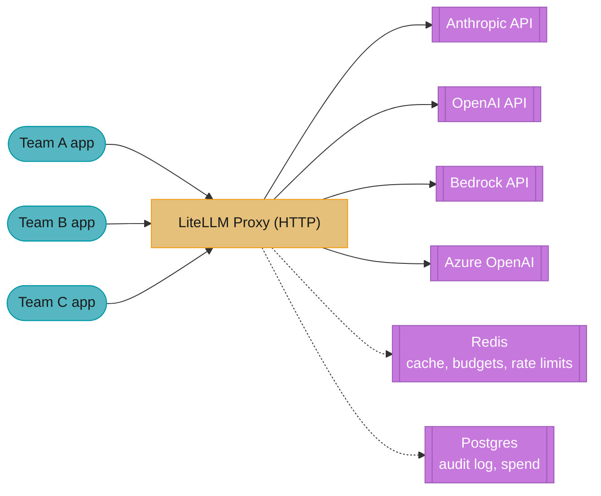
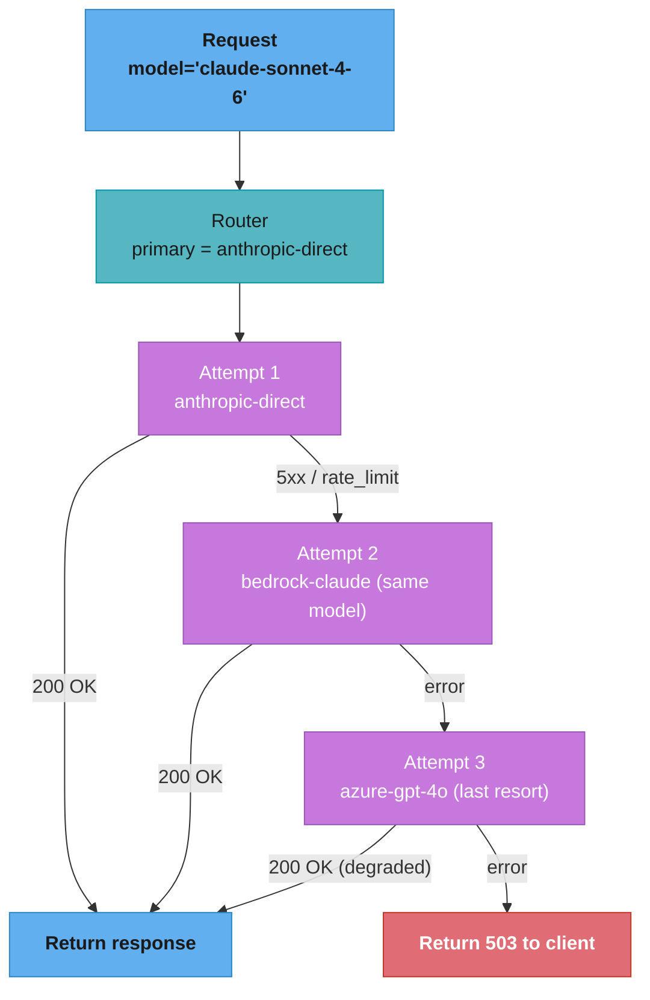

# LiteLLM Routing — Deep Dive

---

## 1. Concept Overview

LiteLLM (BerriAI, open-source 2023, Y Combinator W23) is a unified interface to 100+ LLM providers. Its core value: write code once against an OpenAI-compatible API, swap between Anthropic, Google, Azure, AWS Bedrock, Groq, Cohere, local Ollama, and more by configuration. The proxy server variant (LiteLLM Proxy) adds production features critical for enterprise multi-team LLM deployments: virtual API keys with per-team budgets, automatic provider failover, [model routing](../llm_routing_and_model_selection/README.md), cost tracking, rate limit handling, semantic caching, and Prometheus/Datadog observability.

In agent stacks, LiteLLM occupies the "API gateway" role — sitting between your agents and the provider APIs, abstracting provider details, enforcing budgets, providing reliability. Many production agent deployments use LiteLLM Proxy as a hard requirement before deploying to multiple teams.

---

## 2. Intuition

**One-line analogy**: LiteLLM is the "load balancer + API gateway" for your LLM traffic — same role as Nginx/HAProxy for HTTP, applied to LLM API calls.

**Mental model**: Without LiteLLM: each team's app calls each provider directly, manages its own API keys, builds its own failover, tracks its own costs. With LiteLLM Proxy: all teams hit one endpoint with their virtual key; the proxy handles provider routing, failover, budget enforcement, cost attribution, caching, retries.

**Why it matters**: At enterprise scale, "LLM cost" becomes a financial line item that needs governance. LiteLLM Proxy gives finance teams visibility (spend per team/project/model), gives security teams control (virtual keys revokable instantly), and gives engineering teams resilience (auto-failover when a provider has incidents).

**Key insight**: LiteLLM's two modes serve different needs. The SDK (Python library) is for simple "swap providers in code" use cases. The Proxy (Docker container) is for enterprise governance — once deployed, all your apps talk to the proxy instead of providers directly.

---

## 3. Core Principles

- **Unified interface**: OpenAI-compatible API surface over 100+ providers.
- **Configuration-driven routing**: define model list with provider, fallbacks, rate limits in YAML.
- **Virtual API keys**: per-team/user/project keys with budgets and TTLs.
- **Automatic retries + failover**: configurable; survives single-provider outages.
- **Semantic caching**: cache by prompt similarity, not exact match.
- **Observability built-in**: Prometheus, Datadog, Langfuse, Slack alerts.
- **Stateless proxy**: scales horizontally; Redis-backed shared state for budgets.

---

## 4. Types / Architectures / Strategies

### 4.1 SDK (Python Library)

`from litellm import completion` then `completion(model="claude-sonnet-4-6", ...)`. For simple provider swap.

### 4.2 Proxy Server (Production)

Deploy as Docker container; apps call `http://proxy:4000/v1/chat/completions`. Provides routing, budgets, virtual keys.

### 4.3 Model Aliases

Map friendly names to specific deployments: `gpt-4o` → `azure/my-deployment-east`, fallback to `azure/my-deployment-west`.

### 4.4 Load Balancing Strategies

`simple-shuffle`, `usage-based-routing`, `latency-based-routing`, `least-busy` — pick based on goals.

### 4.5 Semantic Caching

Embed prompts; if new prompt cosine similarity > threshold to cached, return cached response. 20-40% cost reduction on chatty workloads. See [LLM Caching](../llm_caching/README.md) for cache-design depth beyond the proxy layer.

---

## 5. Architecture Diagrams

### LiteLLM Proxy Topology



All team apps hit the single proxy endpoint with their virtual keys; the proxy fans requests out across four provider backends and keeps shared state (budgets, cache, rate limits) in Redis with spend and audit records in Postgres.

### Routing with Fallback



### Virtual Key Budgets

```
Virtual key sk-team-billing-abc123:
  - max_budget: $500/month
  - models: [claude-sonnet-4-6, gpt-4o]
  - tpm: 100,000 | rpm: 1,000
  - team_id: billing | expires: 2025-12-31

Every call: deduct cost from running tally
If budget exceeded → 429 returned to client
```

---

## 6. How It Works — Detailed Mechanics

### Config (litellm_config.yaml)

```yaml
model_list:
  - model_name: claude-sonnet-4-6
    litellm_params:
      model: anthropic/claude-sonnet-4-20250514
      api_key: os.environ/ANTHROPIC_API_KEY
      rpm: 1000
      tpm: 100000
  
  - model_name: claude-sonnet-4-6   # Same alias, different deployment
    litellm_params:
      model: bedrock/anthropic.claude-sonnet-4-20250514-v1:0
      aws_region_name: us-east-1
      rpm: 500
      tpm: 50000
  
  - model_name: gpt-4o
    litellm_params:
      model: openai/gpt-4o
      api_key: os.environ/OPENAI_API_KEY
      rpm: 5000
  
  - model_name: gpt-4o
    litellm_params:
      model: azure/my-gpt-4o-deployment
      api_base: os.environ/AZURE_API_BASE
      api_key: os.environ/AZURE_API_KEY
      api_version: "2024-08-01-preview"

router_settings:
  routing_strategy: usage-based-routing  # Distribute across deployments by usage
  num_retries: 3
  timeout: 60
  fallbacks:
    - claude-sonnet-4-6: [gpt-4o]  # If all claude fail, try gpt-4o
  context_window_fallbacks:
    - claude-sonnet-4-6: [claude-opus-4-7]  # If context too long, escalate

litellm_settings:
  cache: true
  cache_params:
    type: redis
    host: os.environ/REDIS_HOST
    similarity_threshold: 0.95  # Semantic cache match threshold
    ttl: 3600

general_settings:
  master_key: os.environ/LITELLM_MASTER_KEY
  database_url: os.environ/DATABASE_URL  # Postgres for spend tracking

litellm_environment_variables:
  LANGFUSE_PUBLIC_KEY: os.environ/LANGFUSE_PUBLIC_KEY
  LANGFUSE_SECRET_KEY: os.environ/LANGFUSE_SECRET_KEY
  LANGFUSE_HOST: os.environ/LANGFUSE_HOST
```

### Run Proxy

```bash
docker run -p 4000:4000 \
  -v $(pwd)/litellm_config.yaml:/app/config.yaml \
  -e ANTHROPIC_API_KEY=$ANTHROPIC_API_KEY \
  -e OPENAI_API_KEY=$OPENAI_API_KEY \
  -e LITELLM_MASTER_KEY=$LITELLM_MASTER_KEY \
  -e DATABASE_URL=$DATABASE_URL \
  ghcr.io/berriai/litellm:main-latest \
  --config /app/config.yaml --port 4000
```

### Create Virtual Key (Admin API)

```python
import httpx

resp = httpx.post(
    "http://litellm-proxy:4000/key/generate",
    headers={"Authorization": f"Bearer {MASTER_KEY}"},
    json={
        "team_id": "billing",
        "models": ["claude-sonnet-4-6", "gpt-4o"],
        "max_budget": 500,
        "duration": "30d",
        "tpm_limit": 100_000,
        "rpm_limit": 1_000,
    },
)
virtual_key = resp.json()["key"]  # sk-...
# Distribute to billing team
```

### Client App (Drop-in OpenAI Replacement)

```python
import openai

client = openai.OpenAI(
    base_url="http://litellm-proxy:4000",
    api_key=os.environ["TEAM_LITELLM_KEY"],  # Virtual key
)

response = client.chat.completions.create(
    model="claude-sonnet-4-6",  # LiteLLM routes to actual deployment
    messages=[{"role": "user", "content": "Hello"}],
)
# Same code works for Claude, GPT-4o, Gemini — just change model
```

---

## 7. Real-World Examples

**Enterprise multi-team LLM deployments** at companies with 10+ teams using LLMs — LiteLLM Proxy provides governance and cost attribution.

**SaaS providers** offering LLM features use LiteLLM internally for provider failover (Claude primary → GPT-4o fallback during Anthropic outage).

**Internal AI platform teams** at large companies expose LiteLLM Proxy as the only sanctioned LLM gateway — security policy.

---

## 8. Tradeoffs

| Dimension | LiteLLM SDK | LiteLLM Proxy | Direct provider SDKs |
|---|---|---|---|
| Setup | Pip install | Docker + config | None |
| Multi-provider | Yes | Yes | Per-provider SDK |
| Budgets | No | Yes (virtual keys) | No |
| Failover | Manual | Automatic | Manual |
| Caching | Manual | Built-in (Redis) | No |
| Observability | Manual | Built-in (Prometheus, etc) | Manual |
| Latency overhead | Negligible | ~5-20ms proxy hop | None |
| Best for | Single-app prototypes | Enterprise governance | Tightly coupled apps |

---

## 9. When to Use / When NOT to Use

**Use LiteLLM Proxy when:**
- Multiple teams/apps need LLM access with governance
- Need provider failover for production reliability
- Want cost attribution per team/project
- Need rate limit handling across deployments
- Semantic caching opportunity (chat agents, RAG)

**Use LiteLLM SDK when:**
- Prototyping with provider experimentation
- Single application; no governance need

**Skip when:**
- Single provider, single app, no budget concerns

---

## 10. Common Pitfalls

### Pitfall 1: No fallback configured for outage

```yaml
# BROKEN: single provider; if Anthropic down, app down
model_list:
  - model_name: claude-sonnet-4-6
    litellm_params:
      model: anthropic/claude-sonnet-4-20250514
```

```yaml
# FIXED: multiple deployments + fallback
model_list:
  - model_name: claude-sonnet-4-6
    litellm_params: {model: anthropic/claude-sonnet-4-20250514}
  - model_name: claude-sonnet-4-6
    litellm_params: {model: bedrock/anthropic.claude-sonnet-4-...}
router_settings:
  fallbacks:
    - claude-sonnet-4-6: [gpt-4o]  # Cross-provider fallback
```

### Pitfall 2: Semantic cache similarity threshold too low

```yaml
# BROKEN: 0.7 threshold returns wrong answers for similar-but-distinct prompts
cache_params:
  similarity_threshold: 0.7
# "What's our refund policy?" returns "What's our return policy?" cached answer
```

```yaml
# FIXED: 0.95+ threshold; only exact-or-near matches hit cache
cache_params:
  similarity_threshold: 0.97
```

**War story**: A team enabled LiteLLM semantic caching with default 0.85 threshold; agents started returning wrong answers because "Q1 sales" and "Q2 sales" had high cosine similarity. After raising to 0.97 and adding namespace separation per user, cache hit rate dropped from 35% to 8% but answer correctness restored.

---

## 11. Technologies & Tools

| Tool | Purpose |
|---|---|
| `litellm` Python SDK | Provider abstraction |
| `litellm` Proxy (Docker) | Production gateway |
| Redis | Cache + budget state |
| PostgreSQL | Spend tracking, audit log |
| Prometheus + Grafana | Metrics |
| Datadog/New Relic | APM |
| Langfuse/Helicone | LLM tracing |
| Slack/PagerDuty | Alerts |

---

## 12. Interview Questions with Answers

**What is the difference between LiteLLM SDK and LiteLLM Proxy?**
SDK is a Python library — `import litellm; litellm.completion(model=..., ...)` — for in-process provider abstraction. Proxy is a standalone HTTP server (Docker container) acting as an LLM gateway with governance features: virtual keys, budgets, routing, fallback, caching, observability. Use SDK for simple multi-provider; Proxy for production enterprise.

**How does LiteLLM Proxy implement automatic failover?**
Config specifies multiple deployments per model_name (e.g., Anthropic direct + Bedrock for same model). Router config has `num_retries` and `fallbacks` map. On 5xx or rate_limit error from primary deployment, router tries other deployments under same model_name; if all fail, tries `fallbacks` (different model). All within one client request.

**What is the difference between `fallbacks` and `context_window_fallbacks`?**
`fallbacks` fire on errors — 5xx, rate limits, timeouts — after retries across same-name deployments are exhausted; `context_window_fallbacks` fire only on context-window-exceeded errors and route to a larger-window model (e.g., `claude-sonnet-4-6: [claude-opus-4-7]` in the config above). The trap: with only `fallbacks` configured, an over-long prompt fails every deployment identically — each retry resends the same too-long prompt — burning all retries with zero chance of success. Configure both, and make sure context-window fallbacks point at models with genuinely larger windows, not just different providers.

**Can a team actually exceed its virtual key `max_budget`, and why?**
Yes, slightly — budget enforcement is check-then-log, not transactional. The proxy checks accumulated spend against `max_budget` before forwarding, but a call's cost is only known and recorded after the response completes (output tokens determine cost), so N parallel in-flight requests can all pass the check before any of their costs land. A runaway agent loop firing 50 concurrent calls can overshoot the cap by the cost of those in-flight calls. Set budget alerts below 100% (the case study alerts at 80%) and cap `rpm`/`tpm` on the same key so the overshoot is bounded.

**What is a virtual API key and how does it differ from a provider key?**
Virtual key is a LiteLLM-Proxy-issued key (`sk-...`) tied to a budget, model allowlist, rate limit, and TTL. Clients use virtual keys; the proxy translates calls into real provider API key calls server-side. Benefits: revoke a virtual key instantly without touching provider keys, track spend per virtual key, enforce per-team budgets.

**How does semantic caching work?**
Each request's prompt is embedded; LiteLLM looks for cached prompts with cosine similarity ≥ threshold (configurable). If a hit, returns cached response without LLM call. Saves cost on repeated/similar queries. Risk: too-low threshold returns wrong answers. Typical safe threshold: 0.95-0.98.

**What routing strategies does LiteLLM support?**
`simple-shuffle` (random pick), `usage-based-routing` (distribute by current load), `latency-based-routing` (prefer lower-latency deployments), `least-busy` (pick deployment with fewest in-flight requests). Pick based on goals: usage-based for cost flatness, latency-based for performance.

**How does the router avoid hammering a deployment that is failing?**
Cooldowns: when a deployment exceeds `allowed_fails` errors within a window, the router removes it from rotation for `cooldown_time` seconds (60s is the typical setting) and spreads traffic across the remaining deployments. Without cooldown, shuffle or latency-based strategies keep sending a fraction of traffic into the known-bad deployment, adding a full retry-plus-timeout cycle (up to 60s with this file's `timeout: 60`) to every unlucky request. Verify the behavior in staging by revoking one deployment's key and watching the router mark it unhealthy in the Prometheus metrics.

**How is LiteLLM Proxy deployed at scale?**
Horizontally scaled stateless containers behind a load balancer. Shared state (cache, budgets, rate limits) in Redis. Persistent state (spend logs, audit trail) in Postgres. Typical deployment: 3-5 proxy replicas with auto-scaling, Redis primary+replica, Postgres with backups.

**How is cost attributed per team?**
Each LLM call is logged with: virtual_key, team_id, model, input_tokens, output_tokens, cost. Aggregated in Postgres. LiteLLM Admin UI provides dashboards by team/model/time. Export to BI tools or use built-in reports.

**What's the latency overhead of LiteLLM Proxy?**
Typical 5-20ms overhead per request (network hop + proxy logic). Negligible vs LLM call latency (1000-30000ms). For latency-critical paths, deploy proxy in same VPC as both client apps and providers.

**Can LiteLLM call MCP servers?**
LiteLLM Proxy is primarily a model-routing layer, not a tool layer. Tool integration is your application's responsibility. Some recent LiteLLM features add MCP-aware passthrough — see [MCP](../mcp_model_context_protocol/README.md) for the tool-layer protocol itself.

**How does LiteLLM handle streaming?**
Supports OpenAI-compatible streaming (SSE). Client uses `stream=True`; proxy passes through chunks from the provider. Caching is bypassed for streaming requests by default.

**Compared to running custom router code, what does LiteLLM offer?**
Pre-built handling of: per-provider auth schemes, response format normalization (different providers return different structures), retry/backoff per provider's rate limit headers, virtual key management UI, observability integrations. Building all this from scratch is 6-12 engineer-months.

**Is LiteLLM safe for production?**
Yes — used by many production deployments. Watch: master key security (it's the root credential), Redis durability for cache, Postgres backup for spend records. Pin version; LiteLLM ships frequent updates.

**How do you migrate from direct provider SDKs to LiteLLM Proxy?**
Phase 1: deploy proxy with simple config (one team, no budgets). Phase 2: update one app to use OpenAI SDK pointed at proxy. Phase 3: add virtual key management; migrate remaining apps. Phase 4: enable governance features (budgets, fallback). Typical migration: 2-4 sprints.

**What's the alternative to LiteLLM for enterprise LLM gateway?**
OpenRouter (managed service, no self-hosting), Cloudflare AI Gateway (free, basic features), custom build (most expensive, most flexible), Portkey (commercial alternative). LiteLLM is the leading open-source option.

---

## 13. Best Practices

1. Use LiteLLM Proxy for any multi-team deployment — virtual keys + budgets are non-negotiable for governance.
2. Configure cross-provider fallback (e.g., Claude → GPT-4o) for true resilience to single-provider outages.
3. Set semantic cache threshold ≥ 0.95 to prevent wrong-answer cache hits.
4. Namespace caches per user/tenant for SaaS deployments — prevents cross-tenant data leaks.
5. Monitor cache hit rate AND answer correctness — high hit rate with degraded quality is worse than no cache.
6. Use Postgres (not SQLite) for spend tracking in production — concurrent writes scale better.
7. Set per-virtual-key TTL (e.g., 90 days) to force rotation.
8. Enable Langfuse/Helicone integration for prompt-level tracing.
9. Deploy proxy in same VPC as both clients and provider gateways for lowest latency.
10. Pin LiteLLM version; test config changes in staging before production.

---

## 14. Case Study

**Multi-Tenant SaaS LLM Gateway**

**Problem**: A SaaS company with 12 product teams independently using LLMs. No spend visibility, no governance, API keys distributed insecurely (in Slack DMs, .env files committed to git), no failover during Anthropic outages.

**LiteLLM Proxy deployment**:
- 3 proxy replicas in Kubernetes
- Redis Cluster (3-node) for cache + rate limits
- Postgres (RDS) for spend tracking + audit
- Langfuse for LLM tracing
- Virtual keys per team with $X/month budgets; Slack alerts at 80% budget
- Cross-provider fallback: Claude (Anthropic) → Claude (Bedrock) → GPT-4o (OpenAI fallback)
- Semantic cache enabled with namespace per team (cache_params.namespace from virtual_key.team_id)

**Results**:
- API keys removed from app code; only proxy holds them (rotated quarterly)
- Anthropic outage in month 3: zero customer impact (auto-failed-over to GPT-4o for 47 min)
- Cost visibility: per-team dashboards exposed cost overruns (one team using GPT-4 for what could've been Haiku)
- Semantic cache saved $4.2K/month (12% of total spend)
- Average request added latency: 8ms

**Lessons**:
1. Virtual key budget alerts caught one team's runaway agent loop within 2 hours (alert → investigate → fix).
2. Fallback to GPT-4o during Anthropic outage required prompt tuning (Claude prompts didn't always work as well on GPT-4o); mitigation: maintain alternate prompts per fallback chain.
3. Cache namespace by team prevented a near-incident where Team A's data could have shown in Team B's response.
4. Langfuse traces showed 40% of agent runs spent >50% of time waiting on slow tools — actionable observability LiteLLM enabled.
