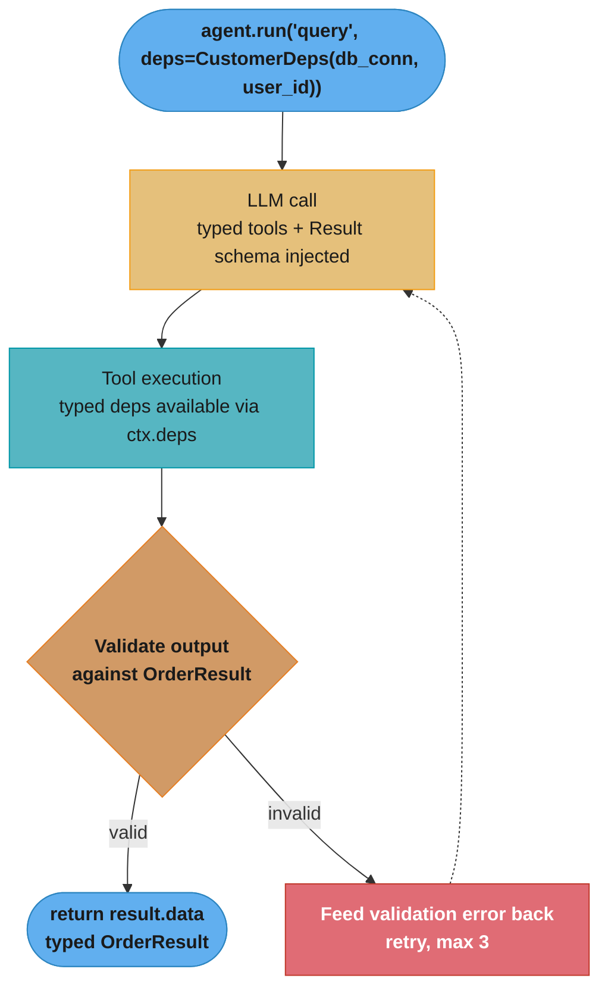

# PydanticAI — Deep Dive

---

## 1. Concept Overview

PydanticAI is a type-safe agent framework from Samuel Colvin (creator of Pydantic), released in 2024. Its differentiator is bringing Pydantic's runtime validation and static type checking to LLM agents: agent inputs, outputs, tool parameters, and dependencies are all typed and validated. Where LangChain accepts dicts and breaks at runtime when schemas drift, PydanticAI catches mismatches at dev time with mypy/pyright and rejects malformed model outputs before they leak into your code.

PydanticAI targets production systems where reliability and developer ergonomics matter more than provider neutrality. It supports OpenAI, Anthropic, Google, Groq, Mistral, and others through a unified `Model` abstraction — swap models with one line. The framework is opinionated: typed Agent[Deps, Result] generic, dependency injection via RunContext, eval harness built-in, async-first.

---

## 2. Intuition

**One-line analogy**: PydanticAI is to LLM agents what FastAPI is to REST APIs — typed inputs/outputs, automatic schema validation, dependency injection, and a thin layer over the underlying protocol.

**Mental model**: An `Agent[Deps, Result]` is a typed function that takes a user input (string), receives runtime dependencies of type `Deps` (via injection), and produces a validated `Result` (Pydantic model). Tools are async functions decorated with `@agent.tool`; their signatures become the LLM's tool schema. The agent runs an internal loop until the model produces a final output matching the `Result` type.

**Why it matters**: 80% of bugs in production LLM systems trace to schema drift — a tool returns slightly different keys, the agent expects field X but gets Y, code silently breaks at 3am. PydanticAI catches these statically and validates at runtime. Type safety isn't a luxury; it's the difference between agents that work in dev and agents that survive 12 months in production.

**Key insight**: PydanticAI's dependency injection (`Deps`) replaces global state with explicit, testable dependencies. A DB connection isn't a module-level singleton — it's a typed dep passed at run time. This makes agents trivially mockable in tests.

---

## 3. Core Principles

- **Type safety end-to-end**: input types, dependency types, result types, tool parameter types all enforced.
- **Dependency injection over globals**: deps passed at runtime via `RunContext`.
- **Pydantic v2 validation**: structured outputs validated against schema before returning.
- **Provider-agnostic via Model abstraction**: same code works on OpenAI, Anthropic, Google.
- **Async-first**: built on asyncio; sync helpers available.
- **Built-in eval harness**: define test cases, run with pytest, get pass/fail.
- **Logfire integration**: native observability (also a Pydantic project).

---

## 4. Types / Architectures / Strategies

### 4.1 Typed Agent with Structured Output

`Agent[Deps, Result]` where Result is a Pydantic model. Agent runs until output matches schema.

### 4.2 Tools with Dependency Injection

`@agent.tool` decorator; first param is `RunContext[Deps]`; deps accessed via `ctx.deps`.

### 4.3 Streaming Structured Output

`agent.run_stream()` async context manager; `.stream_text()` for tokens, `.stream_structured()` for progressively-validated partial results.

### 4.4 Multi-Turn with Message History

`result.new_messages()` to pass history into the next call.

### 4.5 Eval Harness

Define test cases as Pydantic models; assert on structured output; run with pytest.

---

## 5. Architecture Diagrams

### Type-Safe Agent Flow



The typed `Agent` (generic over `CustomerDeps` and `OrderResult`) loops LLM call → tool execution → schema validation until the output parses as `OrderResult`; invalid outputs are fed back with the validation error for up to 3 retries.

### Dependency Injection

```
  Test:                          Production:
  deps = CustomerDeps(           deps = CustomerDeps(
      db=MockDB(),                    db=postgres_conn,
      user="test_user",               user=session.user_id,
  )                              )

  result = await agent.run(      result = await agent.run(
      "query",                       "query",
      deps=deps                      deps=deps
  )                              )

  Same agent code; different deps.
```

---

## 6. How It Works — Detailed Mechanics

```python
from dataclasses import dataclass
from pydantic import BaseModel, Field
from pydantic_ai import Agent, RunContext
from pydantic_ai.models.anthropic import AnthropicModel

# Typed dependencies
@dataclass
class CustomerDeps:
    db_pool: "AsyncDBPool"
    user_id: str

# Typed result
class OrderSummary(BaseModel):
    total_amount: float = Field(description="Total in USD")
    item_count: int = Field(ge=0)
    status: str = Field(pattern="^(pending|shipped|delivered|refunded)$")
    flags: list[str] = Field(default_factory=list)

# Create typed agent
agent = Agent[CustomerDeps, OrderSummary](
    model=AnthropicModel("claude-sonnet-4-6"),
    deps_type=CustomerDeps,
    result_type=OrderSummary,
    system_prompt=(
        "You are a customer support agent. Look up order details and "
        "produce a structured summary. Be precise with numbers."
    ),
)

# Typed tool with deps access
@agent.tool
async def lookup_order(
    ctx: RunContext[CustomerDeps],
    order_id: str,
) -> dict:
    """Look up an order's full details by order_id."""
    async with ctx.deps.db_pool.acquire() as conn:
        row = await conn.fetchrow(
            "SELECT * FROM orders WHERE id = $1 AND user_id = $2",
            order_id, ctx.deps.user_id,
        )
    if not row:
        return {"error": "Order not found"}
    return dict(row)

@agent.tool_plain
async def get_current_promotions() -> list[str]:
    """Get list of active promotions (no deps needed)."""
    return ["BLACKFRIDAY10", "FREESHIP"]


# Usage
async def handle_query(user_input: str, user_id: str, db_pool) -> OrderSummary:
    deps = CustomerDeps(db_pool=db_pool, user_id=user_id)
    result = await agent.run(user_input, deps=deps)
    return result.data  # Typed as OrderSummary, validated


# Streaming
async def stream_summary(user_input: str, deps: CustomerDeps):
    async with agent.run_stream(user_input, deps=deps) as result:
        async for partial in result.stream_structured(debounce_by=0.1):
            # partial validates against OrderSummary schema progressively
            yield partial
```

### Eval Harness

```python
import pytest
from pydantic_ai.models.test import TestModel
from pydantic_ai.messages import ToolCallPart, ToolReturnPart

@pytest.mark.anyio
async def test_lookup_order_handles_missing():
    # Mock the LLM with TestModel — returns canned tool calls and output
    test_model = TestModel(
        custom_result_args={"total_amount": 0.0, "item_count": 0, "status": "pending", "flags": ["not_found"]}
    )
    with agent.override(model=test_model):
        result = await agent.run(
            "Find order ABC123",
            deps=CustomerDeps(db_pool=MockDBPool(empty=True), user_id="u_1"),
        )
    assert "not_found" in result.data.flags
```

---

## 7. Real-World Examples

**Logfire** (Pydantic's observability tool) uses PydanticAI internally for its query/analysis features.

**Hex.tech AI assistant** for data notebooks uses PydanticAI for typed query generation and validation.

**Production CRM enrichment agents** at SaaS companies — typed inputs (CRM records), typed outputs (enriched fields), validated before write-back.

---

## 8. Tradeoffs

| Dimension | PydanticAI | LangChain | Instructor | Direct API |
|---|---|---|---|---|
| Type safety | Strongest | Weakest (dicts everywhere) | Strong (structured output only) | None |
| Dependency injection | Native | Manual | N/A | Manual |
| Multi-provider | Yes | Yes | Yes | Single provider |
| Eval harness | Built-in | LangSmith (separate) | Manual | Manual |
| Streaming structured | Yes (progressive validation) | Partial | Yes | Manual |
| Maturity | Newer (2024) | Most mature | Mature | N/A |
| Best for | Type-safety-critical production | Rapid prototyping | Structured extraction | Cost-critical custom |

---

## 9. When to Use / When NOT to Use

**Use PydanticAI when:**
- Production system where schema drift bugs are unacceptable
- Team values static type checking
- Structured outputs are the norm (not free text)
- Need clean dependency injection for testability

**Skip when:**
- Free-form conversational agent (no structured output)
- Team unfamiliar with Python type system
- Need rich integration ecosystem ([LangChain](langchain_and_lcel.md) has 300+ integrations)

---

## 10. Common Pitfalls

### Pitfall 1: Global state in tools

```python
# BROKEN: global DB connection — untestable, shared state across requests
db_pool = create_pool(...)  # global

@agent.tool_plain
async def lookup_order(order_id: str) -> dict:
    async with db_pool.acquire() as conn:
        ...
# Tests can't mock; one bad agent run can pollute shared connection
```

```python
# FIXED: deps-injected
@dataclass
class Deps:
    db_pool: AsyncDBPool

@agent.tool
async def lookup_order(ctx: RunContext[Deps], order_id: str) -> dict:
    async with ctx.deps.db_pool.acquire() as conn:
        ...
# Tests inject MockDB; production injects real pool
```

### Pitfall 2: Loose result type

```python
# BROKEN: result type accepts anything
class OrderResult(BaseModel):
    data: dict  # No structure
# Model can return junk; you discover at runtime when downstream breaks
```

```python
# FIXED: tight schema
class OrderResult(BaseModel):
    order_id: str = Field(pattern=r"^[A-Z0-9]{8}$")
    total: float = Field(ge=0)
    status: Literal["pending", "shipped", "delivered"]
# Invalid model output triggers retry; production code can trust result.data
```

**War story**: A team migrated their order-processing agent from LangChain (dict-based) to PydanticAI. Within the first week, the static type checker caught 14 cases where the agent's tool returned slightly different keys than downstream code expected — bugs that had been silently miscategorizing orders for months in production.

---

## 11. Technologies & Tools

| Tool | Purpose |
|---|---|
| `pydantic-ai` package | Main framework |
| `pydantic-ai-slim` | Minimal install without bundled models |
| Logfire | Native observability |
| pytest-anyio | Async test support |
| TestModel | Mock model for unit tests |
| FunctionModel | Custom mock with logic |
| Pydantic v2 | Schema validation |

---

## 12. Interview Questions with Answers

**Q: What is `Agent[Deps, Result]` and why is it generic?**
It's a typed generic where Deps is your dependency type (injected at runtime) and Result is the expected output schema. The generic parameters enable static type checking — `agent.run(..., deps=...)` requires deps matches Deps, and `result.data` is typed as Result. Catches mismatches at dev time via mypy/pyright.

**Q: How does dependency injection work in PydanticAI?**
You define a dataclass or BaseModel for your dependencies. Pass them to `agent.run(query, deps=MyDeps(...))`. Tools annotated with `RunContext[MyDeps]` as their first parameter receive `ctx.deps` containing the injected object. Replaces global state with explicit, testable dependencies.

**Q: How does a tool signal that the model should retry with different arguments, without crashing the run?**
Raise `ModelRetry("explanation")` from inside the tool. PydanticAI catches it, sends the message back to the model as the tool response, and re-invokes the model so it can correct its arguments (counted against the retry limit). This is the idiomatic path for recoverable cases like "order not found — check the order_id format": returning a bare error dict the model may ignore is weaker, and raising a plain exception aborts the entire run. Reserve normal exceptions for genuine infrastructure failures; use `ModelRetry` for anything the model can fix by calling differently.

**Q: What's the difference between `@agent.tool` and `@agent.tool_plain`?**
`@agent.tool` requires `RunContext[Deps]` as first parameter — for tools that need deps access. `@agent.tool_plain` is for tools without deps (purely functional). Schema generated identically; only the function signature differs.

**Q: How is structured output enforced?**
At Agent creation, `result_type=MyPydanticModel`. On providers with tool calling, the schema is registered as a special final-result tool the model must call to finish the run; on providers without it, the JSON schema is injected as prompt instructions. After the LLM call, output is validated by Pydantic. If invalid, the framework auto-retries (up to 3 times) feeding the validation error back to the model.

**Q: Can you use PydanticAI with non-OpenAI providers?**
Yes — supports OpenAI, Anthropic, Google, Groq, Mistral, Cohere via model classes (`OpenAIModel`, `AnthropicModel`, etc). Swap one line to switch providers. Native features like prompt caching are provider-specific.

**Q: How do you test PydanticAI agents?**
Override the model with `TestModel` (canned responses) or `FunctionModel` (custom logic). Pattern: `with agent.override(model=test_model): result = await agent.run(...)`. Mock dependencies are passed via `deps=MockDeps(...)`. Use pytest-anyio for async test execution.

**Q: What is `result.new_messages()` and when do you use it?**
After `result = await agent.run(...)`, `result.new_messages()` returns the conversation messages from that run. Pass into the next call's `message_history` parameter to continue a multi-turn conversation. PydanticAI is stateless — you manage history explicitly.

**Q: How does streaming work for structured outputs?**
`async with agent.run_stream(...) as result:` then `async for partial in result.stream_structured(debounce_by=0.1):` — yields partially-validated Pydantic objects as the model streams tokens. Useful for UI rendering of structured data progressively.

**Q: What's the role of Logfire?**
Logfire is Pydantic's observability platform. PydanticAI emits OpenTelemetry-compatible traces; Logfire visualizes them: full agent execution tree, model calls, tool calls, validation errors, latency. Optional but recommended for production debugging.

**Q: How does PydanticAI compare to Instructor?**
[Instructor](structured_outputs_and_instructor.md) focuses on extracting structured outputs from a single LLM call (good for data extraction). PydanticAI is a full agent framework — multi-turn loops, tools, dependency injection, eval harness. Use Instructor when you need typed extraction; PydanticAI when you need typed agents.

**Q: What's the cost of running PydanticAI agents?**
Zero overhead at API level (calls underlying provider directly). Adds: Pydantic validation (~ms-scale), retry on schema mismatch (extra LLM call when triggered). Net cost matches direct API for typical workloads; can be slightly higher when retries occur due to bad output.

**Q: Can PydanticAI agents have subagents?**
Yes — define a separate Agent[OtherDeps, OtherResult] and wrap it as a tool that the parent agent can call. The subagent runs its own loop and returns a typed result that gets injected back as a tool result.

**Q: How are tool descriptions generated?**
Auto-generated from the function's docstring + Python type hints. The docstring becomes the tool description (visible to LLM); parameter types + descriptions form the JSON schema. Add Pydantic `Field(description=...)` for richer parameter documentation.

**Q: How do dynamic system prompts work?**
Decorate a function with `@agent.system_prompt`; it runs at the start of each `agent.run()` and receives `RunContext[Deps]`, so the prompt can include per-request data (user name, current date, entitlements) pulled from deps. Static system prompts (the `system_prompt=` constructor argument) are fixed at agent creation; dynamic ones are evaluated per run and appended after them. Keep the large stable portion static (prompt-cache friendly) and only the genuinely per-request lines dynamic.

**Q: How do you stop an agent from looping forever or blowing the token budget?**
Pass usage limits to the run: `agent.run(..., usage_limits=UsageLimits(request_limit=5, total_tokens_limit=20_000))`. The framework tracks per-run usage across the internal loop and raises a usage-limit exception when a cap is hit; `result.usage()` reports request and token counts after a run for cost logging. Set a `request_limit` on every production agent — a mis-specified tool that keeps triggering `ModelRetry` is otherwise an unbounded cost loop.

**Q: What's the max retry count for structured output validation?**
Default 3. Configurable via `Agent(retries=N)`. On each retry, the validation error is fed back to the model with instruction to fix. After max retries, raises `UnexpectedModelBehavior` exception.

---

## 13. Best Practices

1. Always type your agent: `Agent[YourDeps, YourResult]` — don't use untyped Agent.
2. Make Result schemas tight — use Literal types, regex patterns, ge/le constraints; tighter schemas = better outputs.
3. Use dependency injection for ALL external resources (DB, HTTP clients, caches) — never globals.
4. Write tool docstrings as if for LLM consumption — the model reads them.
5. Write eval tests using TestModel for fast CI; reserve real LLM tests for nightly.
6. Use `Pydantic.Field(description=...)` for non-obvious parameters; descriptions improve LLM tool use.
7. Stream structured outputs for any user-facing slow agent.
8. Enable Logfire (or your OTEL backend) for production observability.
9. Pin Pydantic-AI version in production (pre-1.0; API still evolving).
10. For multi-provider testing, write tests against TestModel; integration tests against real models in nightly CI.

---

## 14. Case Study

**Order Refund Agent at a Subscription SaaS**

**Problem**: Customer support handled 800 refund requests/day. Initial LangChain agent had schema bugs — would occasionally suggest refund amounts in cents instead of dollars, or for wrong order IDs. ~3% error rate.

**PydanticAI implementation**:
- Typed deps: `RefundDeps(crm_client, billing_client, user_id, agent_user)`
- Typed result: `RefundDecision(approved: bool, amount_cents: int, reason: str, requires_escalation: bool, audit_log: list[str])`
- Tools: `lookup_order`, `lookup_subscription`, `check_refund_eligibility`, `propose_refund`
- Eval harness: 50 test cases covering edge cases (full refund, partial, prorated, ineligible)

**Results**:
- Schema errors: 3% → 0.1% (down 30×)
- Static type checks caught 18 bugs before deploy
- Eval CI runs in 45s with TestModel — refactoring is safe
- Customer support time per refund: 8 min → 1.5 min (5× improvement)
- Cost per refund: $0.019 average

**Lessons**:
1. Tight Result schema (amount in cents as int, status as Literal) eliminated the largest class of historical bugs.
2. Dependency injection made it trivial to test against MockCRM in CI — zero real API calls in PRs.
3. Logfire traces showed which tools were called on each refund — invaluable for audit compliance.
