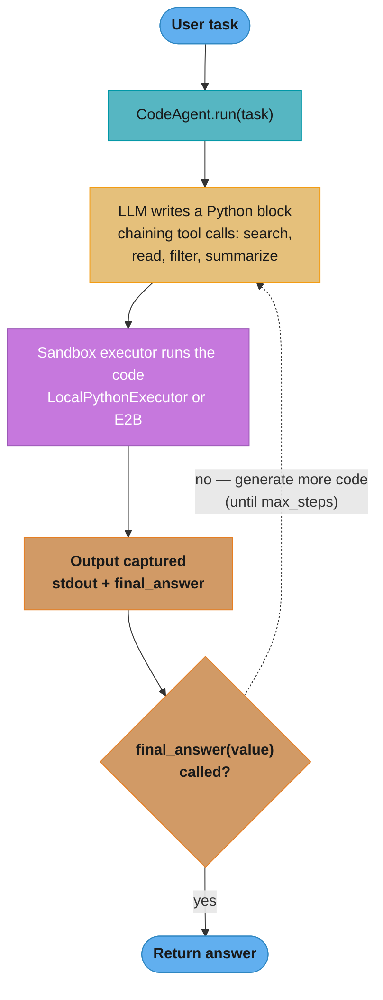

# Smolagents — Deep Dive

---

## 1. Concept Overview

Smolagents (HuggingFace, 2024) is a minimalist agent framework — roughly 1000 lines of core code — built around the thesis that **code is the right format for agent actions**. Where most frameworks expose tools as JSON tool calls, smolagents lets the LLM write actual Python code that chains tool calls, uses control flow, and returns results. The model thinks in code; your runtime executes it in a sandbox.

The framework offers two agent types: `CodeAgent` (LLM writes Python; executed in sandbox) and `ToolCallingAgent` (traditional JSON tool calls). CodeAgent is more powerful — a single LLM response can call 5 tools, loop, filter results, compute aggregates — but requires proper sandboxing to be safe. Smolagents integrates with E2B, has a built-in `LocalPythonExecutor` with import controls, and supports any HuggingFace model, OpenAI, Anthropic, and MCP tool servers.

---

## 2. Intuition

**One-line analogy**: Smolagents CodeAgent is like giving the LLM a Jupyter notebook instead of a button panel — it can compose operations naturally instead of calling one tool at a time.

**Mental model**: When the LLM needs to "search the web, read the top result, then summarize," a tool-calling agent does this as three separate LLM calls (search → see results → call read → see content → call summarize). A CodeAgent does it as one LLM response: `results = web_search("query"); content = read_url(results[0]["url"]); print(summarize(content))`. Python's natural composition replaces multi-step orchestration.

**Why it matters**: Code-as-action reduces total LLM calls per task (often 3-5× fewer) because the model can express multi-step plans in one response. On GAIA benchmark, CodeAgent solves Level 1 at ~60% vs ToolCallingAgent's ~45%.

**Key insight**: The model is dramatically better at writing Python (which it saw billions of times in training) than at producing nested JSON tool calls (which it saw less of). Aligning the action format with the model's native distribution improves task success.

---

## 3. Core Principles

- **Code as action**: agent writes Python code; runtime executes it.
- **Minimalist core**: ~1000 LOC; small surface area to learn and debug.
- **Sandboxed execution**: LocalPythonExecutor (RestrictedPython-like) or E2B integration.
- **Multi-model**: any HF model, OpenAI, Anthropic, Litellm.
- **Built-in tools**: web_search (DuckDuckGo/Serper), Python interpreter, image generation, OCR.
- **MCP support**: `ToolCollection` connects to MCP servers (see [MCP](../mcp_model_context_protocol/README.md)).
- **Type-hinted tools**: `@tool` decorator + Python signatures → tool schema.

---

## 4. Types / Architectures / Strategies

### 4.1 CodeAgent

LLM generates Python code; sandbox executes; output fed back. Best for complex multi-tool tasks.

### 4.2 ToolCallingAgent

Traditional JSON tool calls. Best for simple workflows or when sandboxing isn't feasible.

### 4.3 ManagedAgent (Multi-Agent)

Wrap an agent as a tool for another agent. Hierarchical orchestration.

### 4.4 Custom Tools

Decorate any Python function with `@tool`; type hints become schema.

---

## 5. Architecture Diagrams

### CodeAgent Execution Cycle



One LLM response can chain several tool calls inside a single sandboxed code block; the loop repeats (bounded by `max_steps`) until the generated code calls `final_answer`.

### CodeAgent vs ToolCallingAgent — LLM Call Count

```
  Task: "Find the population of capital cities of EU countries"

  ToolCallingAgent:
    Call 1: list_eu_countries() → 27 countries
    Calls 2-28: get_capital(country) × 27
    Calls 29-55: get_population(city) × 27
    Total: 55 LLM calls

  CodeAgent:
    Single response:
      countries = list_eu_countries()
      data = [(c, get_capital(c), get_population(get_capital(c))) for c in countries]
      print(data)
    Total: 2-3 LLM calls
```

---

## 6. How It Works — Detailed Mechanics

```python
from smolagents import CodeAgent, LiteLLMModel, tool, ToolCallingAgent

# Define custom tools
@tool
def web_search(query: str, num_results: int = 5) -> list[dict]:
    """Search the web and return results.
    
    Args:
        query: Search query string
        num_results: Number of results to return (1-10)
    """
    # Pseudocode: call real search API
    return [{"title": "...", "url": "...", "snippet": "..."}]


@tool
def read_url(url: str) -> str:
    """Fetch the full text content of a URL."""
    import httpx
    return httpx.get(url, timeout=10).text[:50_000]


# CodeAgent with sandboxed execution
model = LiteLLMModel(model_id="anthropic/claude-sonnet-4-6")

code_agent = CodeAgent(
    tools=[web_search, read_url],
    model=model,
    additional_authorized_imports=["json", "statistics", "datetime"],
    max_steps=10,
    executor_type="local",  # or "e2b" for cloud sandbox
)

# Run
result = code_agent.run("What are the 3 largest EU countries by population?")
print(result)


# ToolCallingAgent (traditional)
tool_agent = ToolCallingAgent(
    tools=[web_search, read_url],
    model=model,
    max_steps=10,
)
result2 = tool_agent.run("Same task")


# E2B sandbox for full isolation
e2b_agent = CodeAgent(
    tools=[web_search],
    model=model,
    executor_type="e2b",  # Cloud microVM
    # Untrusted code now runs in isolated VM
)


# MCP tool integration
from smolagents.tools import ToolCollection

mcp_tools = ToolCollection.from_mcp(
    {"command": "python", "args": ["mcp_server.py"]},
    trust_remote_code=True,
)

mcp_agent = CodeAgent(tools=[*mcp_tools.tools, web_search], model=model)
```

---

## 7. Real-World Examples

**HuggingFace internal agents** use smolagents for dataset exploration, model comparison, and documentation tasks.

**Open-source data analysis agents** use CodeAgent for natural language data manipulation — model writes Pandas code, sandbox runs it.

**Education / coding tutors** use ToolCallingAgent variant for safer execution in classroom environments.

---

## 8. Tradeoffs

| Dimension | CodeAgent | ToolCallingAgent | LangGraph | OpenAI Agents SDK |
|---|---|---|---|---|
| LLM calls per task | Fewest (code chains) | Standard | Standard | Standard |
| Task success (GAIA L1) | ~60% | ~45% | ~50% | ~55% |
| Sandbox required | Yes | No | No | No |
| Setup complexity | Medium (sandbox) | Low | Medium | Low |
| Debugging | Hard (read code traces) | Easy (JSON traces) | Easy (graph) | Easy (tracing) |
| Multi-provider | Yes | Yes | Yes | OpenAI-leaning |
| Code volume | Smallest | Small | Medium | Small |

---

## 9. When to Use / When NOT to Use

**Use smolagents CodeAgent when:**
- Tasks involve composing multiple tools (chaining, looping)
- You can deploy a sandbox (E2B, LocalPythonExecutor with import controls — see [Sandboxed Code Execution](../agents_and_tool_use/sandboxed_code_execution.md))
- Lower LLM call count matters for cost or latency
- Working with HuggingFace ecosystem

**Use ToolCallingAgent or another framework when:**
- Sandboxing isn't feasible (regulatory, infrastructure)
- Tasks are linear (no benefit from code composition)
- Audit/compliance requires step-by-step tool call traces

---

## 10. Common Pitfalls

### Pitfall 1: CodeAgent without sandboxing

```python
# BROKEN: LLM writes arbitrary Python, executed on your machine
code_agent = CodeAgent(tools=[...], model=model, executor_type="local")
# LLM could write: import os; os.system("rm -rf /")
# LocalPythonExecutor has SOME safety but not VM-level isolation
```

```python
# FIXED: use E2B for production
code_agent = CodeAgent(
    tools=[...], model=model,
    executor_type="e2b",  # Cloud microVM, isolated
)
# Or carefully restrict imports for LocalPythonExecutor
code_agent_local = CodeAgent(
    tools=[...], model=model,
    executor_type="local",
    additional_authorized_imports=["json", "statistics"],  # Whitelist only
)
```

### Pitfall 2: Tool docstring too vague

```python
# BROKEN: model doesn't know when to use this
@tool
def lookup(id: str) -> dict:
    """Get info."""
    ...
```

```python
# FIXED: descriptive docstring with examples
@tool
def lookup_customer(customer_id: str) -> dict:
    """Look up a customer record by customer_id.
    
    Args:
        customer_id: 8-character alphanumeric ID (e.g., 'CUST1234')
    
    Returns:
        Dict with keys: name, email, signup_date, subscription_tier, lifetime_value
    """
    ...
```

**War story**: A team prototyped a data analysis agent with smolagents CodeAgent on a local laptop with `executor_type="local"`. Quick iteration was great. When promoted to a multi-tenant SaaS, the local executor became a security incident — one user's CodeAgent could write Python that read /etc/* (LocalPythonExecutor has bypasses for clever code). Migrated to E2B; no further issues.

---

## 11. Technologies & Tools

| Tool | Purpose |
|---|---|
| `smolagents` package | Main framework |
| `LiteLLMModel` | Any provider via LiteLLM |
| `HfApiModel` | HuggingFace Hub models |
| `TransformersModel` | Local transformers |
| LocalPythonExecutor | Built-in sandbox (limited) |
| E2B | Recommended cloud sandbox |
| `ToolCollection.from_mcp` | MCP tool integration |
| `@tool` decorator | Custom tool creation |
| `gradio` ChatInterface | Built-in UI helper |

---

## 12. Interview Questions with Answers

**Q: What is the core idea behind CodeAgent vs ToolCallingAgent?**
CodeAgent lets the LLM write actual Python code as actions (with tools available as functions); ToolCallingAgent uses traditional JSON tool calls. CodeAgent reduces total LLM calls per task because one code response can chain multiple tool calls, loops, and computations.

**Q: Why does CodeAgent perform better on benchmarks like GAIA?**
LLMs were trained on far more Python code than on JSON tool-call sequences. Code-as-action aligns the agent's action format with the model's native distribution, improving task success ~15 percentage points on GAIA Level 1 compared to ToolCallingAgent at similar model sizes.

**Q: What sandboxing options does smolagents support?**
Two: (1) `LocalPythonExecutor` — an AST-based sandbox running in-process with import controls; lighter weight but bypassable. (2) `E2BExecutor` — cloud microVM (Firecracker); proper isolation. Production CodeAgent should use E2B; LocalPythonExecutor is OK for trusted environments.

**Q: Why isn't `additional_authorized_imports` alone enough to make LocalPythonExecutor safe for untrusted users?**
Because the whitelist only restricts `import` statements — LocalPythonExecutor is an in-process AST-level filter, not an isolation boundary, and clever attribute access through already-available objects can reach the filesystem or interpreter internals without importing anything new. The war story in this file is the canonical failure: a multi-tenant SaaS on `executor_type="local"` let one user's agent read /etc/* despite import controls. Treat the whitelist as defense-in-depth for trusted environments; for untrusted input the boundary must be a VM (E2B), not the Python interpreter.

**Q: How does a CodeAgent know it is finished, and what goes wrong if the model never calls `final_answer`?**
The run terminates when the generated code calls the special `final_answer(value)` tool — that value becomes the result of `run()`. If the model keeps producing exploratory code without calling it, the loop burns one full LLM call per step until `max_steps` is hit, so a generous cap (say 50) turns a confused model into a cost leak rather than a quick failure. Keep `max_steps` at 10-20 and log per-step code and output so you can see exactly where the model stalled.

**Q: How are tools defined?**
Decorate a Python function with `@tool`. The function signature with type hints becomes the JSON schema. The docstring becomes the tool description. Tools can be plain or class-based. Args section in docstring (Google style) parsed for individual parameter descriptions.

**Q: Can smolagents work with non-HF models?**
Yes — `LiteLLMModel` proxies to any provider (OpenAI, Anthropic, Google, etc) via LiteLLM. Native classes also exist for OpenAI direct. Default examples use HfApiModel for HuggingFace Hub models.

**Q: How does smolagents integrate with MCP?**
`ToolCollection.from_mcp(server_config)` connects to an MCP server, lists its tools, and exposes them as Python callables. Use `with ToolCollection(...) as tc:` context manager to ensure server cleanup.

**Q: What's the difference between `max_steps` and `additional_authorized_imports`?**
`max_steps` caps the number of agent iterations (LLM calls). `additional_authorized_imports` is a whitelist for LocalPythonExecutor — specifies which Python modules the agent's code can import. Default whitelist is minimal (built-ins only).

**Q: Can a smolagent itself manage other agents?**
Yes — `ManagedAgent` wraps an agent as a tool that another agent can call. Pattern: define specialist agents (search, analysis), wrap with `ManagedAgent`, give to an orchestrator CodeAgent as tools.

**Q: Do variables persist between code steps in a CodeAgent run?**
Yes — the executor keeps the Python namespace alive across steps within a single `run()`, so a DataFrame loaded in step 1 is still in scope in step 3 without re-loading. This is a key efficiency win over ToolCallingAgent, where every intermediate value must round-trip through the context window as text (a 50,000-row DataFrame stays in the sandbox; only the `print()` output enters the prompt). State is discarded between separate `run()` calls, so long-lived sessions need external persistence (files, a database) rather than relying on executor memory.

**Q: How do you debug CodeAgent failures?**
Smolagents logs every generated code block and execution output. Print these traces; for production, integrate with OpenTelemetry. Common failures: code with syntax errors (model retries automatically), imports not in whitelist, tools called with wrong argument types.

**Q: What's the cost overhead vs direct API?**
Minimal — smolagents adds <1KB of system prompt tokens explaining the code-as-action format. Net cost is typically lower than ToolCallingAgent because fewer LLM calls per task. Sandbox cost (E2B at $0.10/hr) added if using cloud executor.

**Q: How do you handle very large tool sets in smolagents?**
Same patterns as elsewhere (see [Tool Selection at Scale](../agents_and_tool_use/tool_selection_at_scale.md)): tool RAG (retrieve relevant tools per query), hierarchical menus, classifier routing. Smolagents doesn't have built-in tool retrieval; implement at the application layer before agent invocation.

**Q: Is smolagents production-ready?**
Yes for narrow tasks with proper sandboxing. The minimalist code base is auditable. Lacks some production niceties (built-in tracing, durable execution). For high-throughput production, often combined with Temporal or custom orchestration.

---

## 13. Best Practices

1. Use E2B sandbox for any production CodeAgent — never local executor for untrusted users.
2. Whitelist imports explicitly even with E2B (`additional_authorized_imports`); deny by default.
3. Write detailed tool docstrings with parameter descriptions and return value schemas.
4. Cap `max_steps` (10-20 typical) to prevent runaway loops.
5. Use ToolCallingAgent for compliance/audit contexts where step-by-step traces matter more than efficiency.
6. For multi-tenant SaaS, isolate E2B sandboxes per user (separate workspaces).
7. Log every generated code block in production for debugging and audit.
8. Combine with LiteLLM for provider failover (Claude primary → GPT-4o fallback).
9. Use `ManagedAgent` for multi-agent setups instead of building orchestration from scratch.
10. Test with small models first (e.g., Llama 3.1 8B) — if it works there, it'll work on larger models.

---

## 14. Case Study

**Open-Source Data Analysis Tutor**

**Context**: An open-source project lets students upload a CSV and ask natural language questions ("show me the trend over time"). Built with smolagents CodeAgent.

**Architecture**:
- CodeAgent with tools: `read_csv(path)`, `plot(data, type)`, `save_to_pdf(plots)`
- `additional_authorized_imports=["pandas", "numpy", "matplotlib"]`
- `executor_type="e2b"` (free tier — limited concurrency but no infrastructure)
- Model: Claude Haiku 4.5 (cheap, fast enough for educational use)
- max_steps=8

**Example interaction**:
- Student: "What's the correlation between hours studied and grade?"
- Agent code: 
  ```python
  df = read_csv("data.csv")
  corr = df["hours_studied"].corr(df["grade"])
  plot(df, "scatter", x="hours_studied", y="grade")
  final_answer(f"Correlation: {corr:.3f}")
  ```

**Results**:
- ~85% of questions answered correctly on first try
- Average 1.4 code iterations per question
- Cost: $0.003 per question (Haiku + E2B free tier)
- Zero security incidents (E2B isolation)
- Students learn faster — see the actual Pandas code the agent wrote

**Lessons**:
1. CodeAgent's natural code output is itself a teaching artifact — students learn from the agent's solutions.
2. Haiku is sufficient for ~85% of educational data tasks; escalating to Sonnet for the harder 15% via custom router.
3. E2B free tier supports the project's traffic (~500 questions/day); upgrading to paid would cost ~$30/month.
