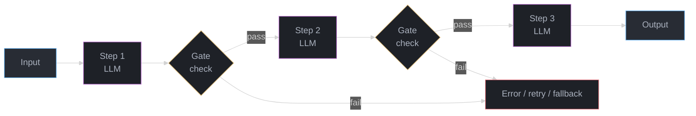
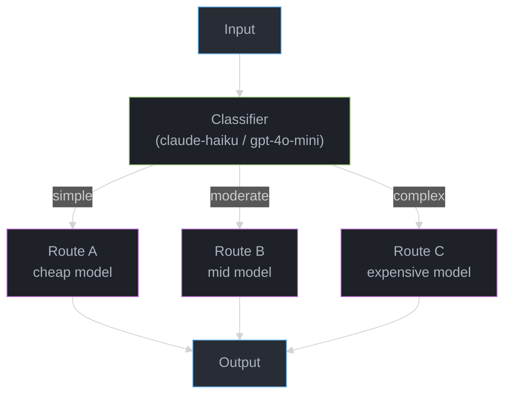
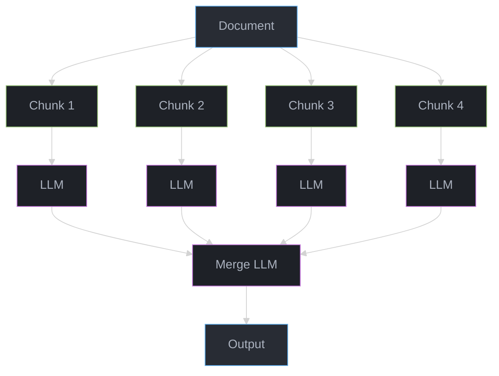
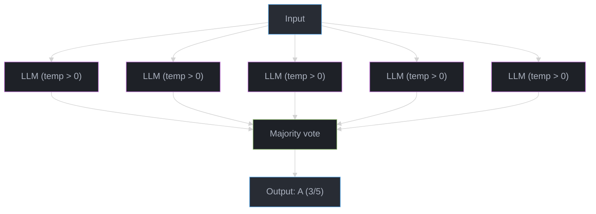
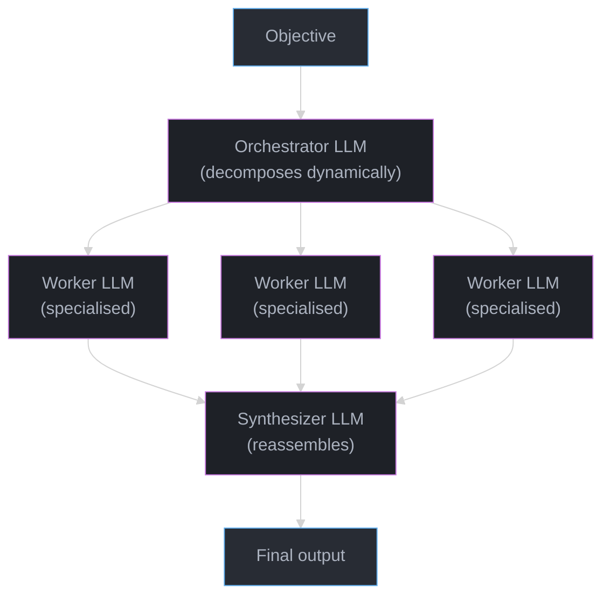
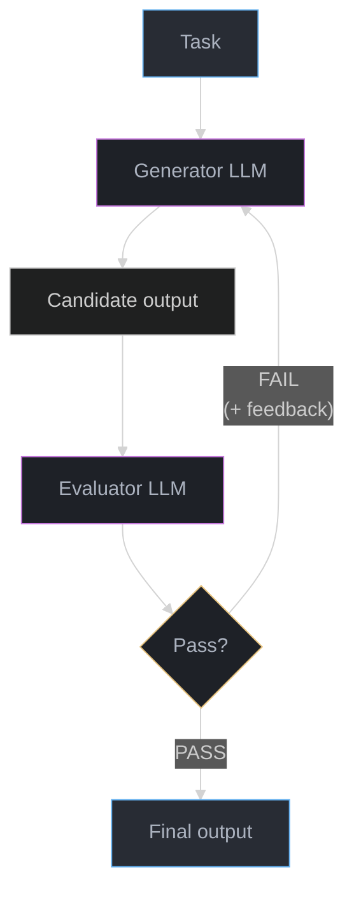

# Agentic Workflow Patterns

## 1. Concept Overview

Agentic workflow patterns are reusable structural blueprints for orchestrating LLMs in multi-step pipelines. Anthropic's "Building Effective Agents" taxonomy draws a sharp line: **workflows** are systems where LLMs complete predefined steps with fixed control flow determined by the developer, while **agents** are systems where the LLM itself dynamically decides the control flow at runtime.

This module focuses on the five canonical workflow patterns: prompt chaining, routing, parallelization, orchestrator-workers, and evaluator-optimizer. Each solves a different failure mode in naive single-prompt LLM calls — hallucination, cost inefficiency, latency, task complexity, and output quality respectively.

The patterns compose. A real production pipeline may chain a router into a parallelized sectioning step, which feeds an orchestrator-workers decomposition, evaluated by an evaluator-optimizer loop. Understanding each pattern independently is the prerequisite for combining them correctly.

---

## 2. Intuition

> **One-line analogy**: Agentic workflow patterns are to LLM systems what design patterns are to object-oriented code — proven structural solutions to recurring orchestration problems.

**Mental model**: Think of a single LLM call as a single function. A workflow is a program made of those functions. Prompt chaining is function composition. Routing is a switch statement. Parallelization is goroutines. Orchestrator-workers is a manager delegating to a team. Evaluator-optimizer is a code review loop. The difference from true agents: in workflows, the developer writes the control flow; the LLM only fills in content at each step.

**Why it matters**: Single-prompt LLM calls fail in predictable ways — they lose context on long inputs, they do too many things at once, they can't verify their own output, they use GPT-4o for tasks that GPT-4o-mini handles fine. Each workflow pattern addresses exactly one of these failure modes with measurable, reproducible improvement.

**Key insight**: The most reliable LLM systems use the simplest pattern that works. Anthropic's guidance is explicit: start with a single prompt, then promote to a workflow only when you can articulate which failure mode you are solving. Complexity has real costs — 200-500ms latency per hop, token doubling in evaluator loops, debugging difficulty that scales with pattern depth.

---

## 3. Core Principles

**Predefined control flow over dynamic control flow**: In a workflow, an if/else in Python code decides what happens next. In an agent, the LLM decides. Workflows are auditable, reproducible, and debuggable. Agents are flexible but unpredictable. Choose workflows by default.

**One concern per LLM call**: Each step should do exactly one thing. "Extract entities, summarize, and classify sentiment" is three steps wearing one prompt's clothing. Breaking it into three calls adds latency but cuts hallucination by reducing cognitive load per call.

**Gates between steps**: Prompt chaining is not useful without gates — programmatic or LLM-based checks that verify the output of step N before passing it to step N+1. A gate that catches a malformed extraction at step 2 prevents cascading errors through steps 3, 4, and 5.

**Cheap models for routing, expensive models for reasoning**: The cost saving in a routing pattern comes entirely from using a small classifier (GPT-4o-mini at $0.15/1M tokens) to decide which tasks go to GPT-4o ($5/1M tokens). If everything routes to the expensive model, you have added a step and gained nothing.

**Parallelization is not free**: Spawning N parallel calls reduces wall-clock latency by approximately N× but multiplies token cost by N. Voting on the same task N times also requires a synthesis step. The latency gain must be worth the cost and the added synthesis complexity.

**Evaluator-optimizer loops need termination conditions**: A generator-critic loop without a hard iteration cap will either loop forever on a hard task or converge trivially fast on an easy one. Production systems must define "good enough" and enforce a maximum round count (typically 3-5).

---

## 4. Types / Architectures / Strategies

### Pattern 1: Prompt Chaining

Sequential LLM calls where the output of step N becomes input to step N+1. Gates between steps validate intermediate outputs.

**Use case**: Long document processing, multi-stage writing, structured data extraction pipelines where each stage refines or transforms the prior output.

**Performance**: Each hop adds 200-500ms network + inference latency. On a 5-step chain with GPT-4o, expect 1-2.5 seconds of added wall-clock time versus a single call. Hallucination rate on complex long-document tasks drops approximately 70% compared to a single monolithic prompt, because each LLM call operates on a smaller, cleaner input.

```python
import anthropic
from typing import Optional

client = anthropic.Anthropic()

def extract_entities(text: str) -> str:
    response = client.messages.create(
        model="claude-opus-4-5",
        max_tokens=1024,
        messages=[{
            "role": "user",
            "content": f"Extract all named entities (people, organizations, locations) from the following text. Return a JSON array.\n\n{text}"
        }]
    )
    return response.content[0].text

def gate_json_array(raw: str) -> Optional[list]:
    """Programmatic gate: parse JSON, return None on failure."""
    import json
    try:
        parsed = json.loads(raw)
        if isinstance(parsed, list):
            return parsed
        return None
    except json.JSONDecodeError:
        return None

def summarize_entities(entities: list) -> str:
    response = client.messages.create(
        model="claude-opus-4-5",
        max_tokens=512,
        messages=[{
            "role": "user",
            "content": f"Given these entities: {entities}, write a two-sentence summary of the key actors involved."
        }]
    )
    return response.content[0].text

def prompt_chain_pipeline(document: str) -> str | None:
    raw_entities = extract_entities(document)
    entities = gate_json_array(raw_entities)
    if entities is None:
        return None  # Gate failed — do not proceed
    summary = summarize_entities(entities)
    return summary
```

---

### Pattern 2: Routing

A classifier (LLM or programmatic) inspects the input and dispatches it to a specialized downstream handler. Each handler is optimized for its task type — model choice, system prompt, temperature, and max_tokens differ per route.

**Use case**: Customer support (billing vs technical vs general), document processing (contracts vs invoices vs emails), query complexity routing (simple lookups vs multi-hop reasoning).

**Cost reduction**: Routing 60% of queries to GPT-4o-mini ($0.15/1M input tokens) and 40% to GPT-4o ($5/1M input tokens) gives a blended cost of $0.15×0.6 + $5×0.4 = $2.09/1M tokens, versus $5/1M for all-GPT-4o. That is a 58% cost reduction.

```python
import anthropic
from enum import Enum

client = anthropic.Anthropic()

class RouteType(Enum):
    SIMPLE = "simple"
    COMPLEX = "complex"
    CODE = "code"

def classify_query(query: str) -> RouteType:
    response = client.messages.create(
        model="claude-haiku-4-5",  # Cheap model for routing
        max_tokens=16,
        messages=[{
            "role": "user",
            "content": (
                f"Classify this query into exactly one category: simple, complex, or code.\n"
                f"- simple: factual lookup, single-step answer\n"
                f"- complex: multi-step reasoning, synthesis across sources\n"
                f"- code: programming task, debugging, code generation\n\n"
                f"Query: {query}\n\nRespond with only one word."
            )
        }]
    )
    label = response.content[0].text.strip().lower()
    try:
        return RouteType(label)
    except ValueError:
        return RouteType.COMPLEX  # Default to expensive model on ambiguity

def handle_simple(query: str) -> str:
    response = client.messages.create(
        model="claude-haiku-4-5",
        max_tokens=256,
        messages=[{"role": "user", "content": query}]
    )
    return response.content[0].text

def handle_complex(query: str) -> str:
    response = client.messages.create(
        model="claude-opus-4-5",
        max_tokens=2048,
        system="You are an expert analyst. Think step by step.",
        messages=[{"role": "user", "content": query}]
    )
    return response.content[0].text

def handle_code(query: str) -> str:
    response = client.messages.create(
        model="claude-opus-4-5",
        max_tokens=4096,
        system="You are an expert software engineer. Provide working, tested code.",
        messages=[{"role": "user", "content": query}]
    )
    return response.content[0].text

def routing_pipeline(query: str) -> str:
    route = classify_query(query)
    handlers = {
        RouteType.SIMPLE: handle_simple,
        RouteType.COMPLEX: handle_complex,
        RouteType.CODE: handle_code,
    }
    return handlers[route](query)
```

---

### Pattern 3: Parallelization

Two sub-patterns:

**Sectioning**: Split a large input into N independent chunks, process all N in parallel, merge results. Latency drops from O(N) sequential to O(1) parallel (bounded by the slowest chunk). Cost stays the same.

**Voting**: Send the same prompt to the LLM N times (often with temperature > 0), collect N independent answers, pick the majority. Reduces variance on stochastic tasks; useful for classification, fact verification, and risk assessment. Cost multiplies by N.

```python
import anthropic
import asyncio
from collections import Counter

client = anthropic.Anthropic()

# --- Sectioning ---

def summarize_chunk(chunk: str, chunk_index: int) -> str:
    response = client.messages.create(
        model="claude-haiku-4-5",
        max_tokens=512,
        messages=[{
            "role": "user",
            "content": f"Summarize this section concisely:\n\n{chunk}"
        }]
    )
    return response.content[0].text

async def sectioning_pipeline(document: str, num_chunks: int = 4) -> str:
    chunk_size = len(document) // num_chunks
    chunks = [document[i * chunk_size:(i + 1) * chunk_size] for i in range(num_chunks)]

    loop = asyncio.get_event_loop()
    tasks = [
        loop.run_in_executor(None, summarize_chunk, chunk, i)
        for i, chunk in enumerate(chunks)
    ]
    summaries = await asyncio.gather(*tasks)

    # Merge step
    merge_prompt = "\n\n".join(f"Section {i+1}: {s}" for i, s in enumerate(summaries))
    response = client.messages.create(
        model="claude-opus-4-5",
        max_tokens=1024,
        messages=[{
            "role": "user",
            "content": f"Synthesize these section summaries into a single coherent summary:\n\n{merge_prompt}"
        }]
    )
    return response.content[0].text

# --- Voting ---

def classify_once(text: str) -> str:
    response = client.messages.create(
        model="claude-opus-4-5",
        max_tokens=8,
        temperature=0.7,  # Non-zero to get diverse votes
        messages=[{
            "role": "user",
            "content": f"Is this text positive, negative, or neutral? Reply with one word.\n\n{text}"
        }]
    )
    return response.content[0].text.strip().lower()

async def voting_pipeline(text: str, num_votes: int = 5) -> str:
    loop = asyncio.get_event_loop()
    tasks = [loop.run_in_executor(None, classify_once, text) for _ in range(num_votes)]
    votes: list[str] = await asyncio.gather(*tasks)
    majority, _ = Counter(votes).most_common(1)[0]
    return majority
```

---

### Pattern 4: Orchestrator-Workers

An orchestrator LLM receives the high-level task and dynamically decides how to decompose it — which subtasks to create, which workers to assign them to, and how to synthesize results. Workers are specialized LLM calls (or tool calls) that execute a single subtask and return structured output.

**Key distinction from prompt chaining**: In prompt chaining, the developer decides the decomposition statically. In orchestrator-workers, the LLM decides the decomposition dynamically at runtime. This is the first pattern where the LLM has real control flow authority.

**Use case**: Research synthesis, code generation across multiple files, complex analysis where the number and type of subtasks depends on input content.

```python
import anthropic
import json
from dataclasses import dataclass

client = anthropic.Anthropic()

@dataclass
class Subtask:
    task_id: str
    description: str
    worker_type: str  # "research" | "summarize" | "code"

@dataclass
class WorkerResult:
    task_id: str
    output: str

def orchestrate(objective: str) -> list[Subtask]:
    """Orchestrator: decompose objective into subtasks."""
    response = client.messages.create(
        model="claude-opus-4-5",
        max_tokens=1024,
        messages=[{
            "role": "user",
            "content": (
                f"You are an orchestrator. Break this objective into 2-4 subtasks.\n"
                f"Return a JSON array of objects with fields: task_id (string), description (string), "
                f"worker_type (one of: research, summarize, code).\n\n"
                f"Objective: {objective}"
            )
        }]
    )
    raw = response.content[0].text
    subtask_dicts = json.loads(raw)
    return [Subtask(**d) for d in subtask_dicts]

def execute_worker(subtask: Subtask) -> WorkerResult:
    """Worker: execute a single subtask."""
    system_prompts = {
        "research": "You are a research specialist. Provide factual, sourced analysis.",
        "summarize": "You are a summarization expert. Be concise and accurate.",
        "code": "You are a senior software engineer. Write production-quality Python.",
    }
    response = client.messages.create(
        model="claude-opus-4-5",
        max_tokens=2048,
        system=system_prompts.get(subtask.worker_type, "You are a helpful assistant."),
        messages=[{"role": "user", "content": subtask.description}]
    )
    return WorkerResult(task_id=subtask.task_id, output=response.content[0].text)

def synthesize(objective: str, results: list[WorkerResult]) -> str:
    """Orchestrator: synthesize worker outputs into final answer."""
    results_text = "\n\n".join(f"[{r.task_id}]: {r.output}" for r in results)
    response = client.messages.create(
        model="claude-opus-4-5",
        max_tokens=2048,
        messages=[{
            "role": "user",
            "content": f"Synthesize these worker outputs into a final answer for: {objective}\n\n{results_text}"
        }]
    )
    return response.content[0].text

def orchestrator_workers_pipeline(objective: str) -> str:
    subtasks = orchestrate(objective)
    results = [execute_worker(st) for st in subtasks]  # Can be parallelized
    return synthesize(objective, results)
```

---

### Pattern 5: Evaluator-Optimizer

A generator LLM produces an output. An evaluator LLM scores the output and provides structured feedback. The generator uses the feedback to produce an improved version. The loop continues until the evaluator approves or a maximum round count is reached.

**Convergence**: On well-defined tasks (code correctness, factual accuracy, style adherence), evaluator-optimizer loops converge in 2-4 rounds. On subjective tasks (creative writing quality), convergence is slower and the stopping criterion harder to define.

**Cost**: Each round doubles the token cost versus a single call (one generation + one evaluation). Three rounds = 6× the cost of a single call. Use this pattern only when quality improvement justifies the cost.

```python
import anthropic
from dataclasses import dataclass

client = anthropic.Anthropic()

@dataclass
class EvaluationResult:
    approved: bool
    score: int  # 1-10
    feedback: str

def generate(task: str, previous_feedback: str = "") -> str:
    feedback_section = f"\n\nPrevious feedback to address:\n{previous_feedback}" if previous_feedback else ""
    response = client.messages.create(
        model="claude-opus-4-5",
        max_tokens=2048,
        messages=[{
            "role": "user",
            "content": f"Complete this task:{feedback_section}\n\nTask: {task}"
        }]
    )
    return response.content[0].text

def evaluate(task: str, candidate_output: str) -> EvaluationResult:
    response = client.messages.create(
        model="claude-opus-4-5",
        max_tokens=512,
        messages=[{
            "role": "user",
            "content": (
                f"Evaluate this output for the given task.\n"
                f"Task: {task}\n"
                f"Output: {candidate_output}\n\n"
                f"Return JSON with fields: approved (bool), score (int 1-10), feedback (string).\n"
                f"Set approved=true only if score >= 8."
            )
        }]
    )
    import json
    data = json.loads(response.content[0].text)
    return EvaluationResult(**data)

def evaluator_optimizer_pipeline(
    task: str,
    max_rounds: int = 4,
) -> tuple[str, int]:
    """Returns (final_output, rounds_taken)."""
    current_output = generate(task)
    for round_num in range(1, max_rounds + 1):
        evaluation = evaluate(task, current_output)
        if evaluation.approved:
            return current_output, round_num
        current_output = generate(task, previous_feedback=evaluation.feedback)
    return current_output, max_rounds  # Return best effort after max rounds
```

---

## 5. Architecture Diagrams

### Prompt Chaining



---

### Routing



---

### Parallelization — Sectioning



Chunks run in parallel with the same wall-clock time; chunk count is a parameter, not a fixed 4.

---

### Parallelization — Voting



Improves accuracy by 5–15% on reasoning tasks; cost = N × tokens per call.

---

### Orchestrator-Workers



---

### Evaluator-Optimizer



---

## 6. How It Works — Detailed Mechanics

### Prompt Chaining — Latency Budget

Each LLM hop adds:
- Network round-trip: ~20-50ms (same region)
- Time-to-first-token: ~100-300ms for claude-haiku-4-5, ~300-600ms for claude-opus-4-5
- Generation time: ~10-30ms per output token at claude-haiku-4-5 speeds

A 5-step chain with claude-opus-4-5 at each step: 5 × (400ms avg TTFT + generation) = 2-4 seconds of pure inference latency, before any application logic.

Gate implementation — the two patterns:

```python
import json
from typing import Any

# Pattern A: Programmatic gate (fast, zero cost)
def parse_json_gate(raw: str, expected_keys: list[str]) -> dict[str, Any] | None:
    try:
        data = json.loads(raw)
        if all(k in data for k in expected_keys):
            return data
        return None
    except (json.JSONDecodeError, TypeError):
        return None

# Pattern B: LLM gate (flexible, costs ~$0.0001 per check with haiku)
def llm_gate(output: str, criteria: str) -> bool:
    client = anthropic.Anthropic()
    response = client.messages.create(
        model="claude-haiku-4-5",
        max_tokens=8,
        messages=[{
            "role": "user",
            "content": f"Does this output satisfy: {criteria}\nOutput: {output}\nAnswer yes or no."
        }]
    )
    return response.content[0].text.strip().lower().startswith("yes")
```

### Routing — Classifier Accuracy Impact on Cost

If the classifier has 90% accuracy and misroutes 10% of simple queries to the expensive model:
- 60% simple queries: 10% misrouted → 6% sent to expensive model unintentionally
- Effective distribution: 54% cheap + 46% expensive
- Blended cost: $0.15×0.54 + $5×0.46 = $2.38/1M vs $2.09/1M at 100% accuracy

Classifier accuracy matters. A 5% improvement in routing accuracy can save 10-15% of inference cost in high-volume systems.

### Parallelization — Thread Pool Sizing

Python's `concurrent.futures.ThreadPoolExecutor` for I/O-bound LLM calls:

```python
import anthropic
from concurrent.futures import ThreadPoolExecutor, as_completed

client = anthropic.Anthropic()

def parallel_section_summarize(chunks: list[str], max_workers: int = 8) -> list[str]:
    """
    max_workers=8 is safe for most Anthropic tier limits.
    Anthropic default rate limit: 4000 RPM for claude-haiku-4-5.
    At 8 parallel workers with ~500ms per call: 8/0.5s = 16 RPS = 960 RPM — well under limit.
    """
    def summarize(args: tuple[int, str]) -> tuple[int, str]:
        idx, chunk = args
        response = client.messages.create(
            model="claude-haiku-4-5",
            max_tokens=512,
            messages=[{"role": "user", "content": f"Summarize:\n{chunk}"}]
        )
        return idx, response.content[0].text

    results: dict[int, str] = {}
    with ThreadPoolExecutor(max_workers=max_workers) as executor:
        futures = {executor.submit(summarize, (i, c)): i for i, c in enumerate(chunks)}
        for future in as_completed(futures):
            idx, summary = future.result()
            results[idx] = summary

    return [results[i] for i in range(len(chunks))]
```

### Evaluator-Optimizer — Structured Feedback Protocol

The evaluator must return machine-parseable feedback for the generator to act on:

```python
import anthropic
import json
from dataclasses import dataclass

client = anthropic.Anthropic()

@dataclass
class StructuredFeedback:
    score: int          # 1-10
    approved: bool      # True if score >= threshold
    issues: list[str]   # Specific problems to fix
    suggestions: list[str]  # Concrete improvement actions

def evaluate_structured(task: str, output: str, threshold: int = 8) -> StructuredFeedback:
    response = client.messages.create(
        model="claude-opus-4-5",
        max_tokens=1024,
        messages=[{
            "role": "user",
            "content": (
                f"Evaluate this output against the task. Return JSON only.\n"
                f"Schema: {{score: int, issues: [str], suggestions: [str]}}\n"
                f"Task: {task}\nOutput: {output}"
            )
        }]
    )
    data = json.loads(response.content[0].text)
    return StructuredFeedback(
        score=data["score"],
        approved=data["score"] >= threshold,
        issues=data.get("issues", []),
        suggestions=data.get("suggestions", []),
    )
```

---

## 7. Real-World Examples

**Prompt chaining**: Stripe's invoice processing pipeline. Step 1 extracts raw fields from PDF text. Step 2 normalizes currencies and dates. Step 3 validates totals (programmatic gate — no LLM needed). Step 4 maps to internal account codes. Each step's LLM operates on clean, structured input from the prior step rather than raw PDF text, reducing hallucination on numeric fields by ~65%.

**Routing**: Intercom's customer support triage. A claude-haiku-4-5 classifier routes incoming tickets: billing questions (40% of volume) go to a RAG system over billing docs without touching an LLM for generation; technical issues (35%) go to claude-opus-4-5 with a technical system prompt; general questions (25%) go to claude-haiku-4-5. Result: 52% reduction in inference cost with no measurable drop in CSAT.

**Parallelization — sectioning**: Legal document review at a Big 4 firm. A 200-page contract is split into 20 sections of ~10 pages each. All 20 sections are reviewed in parallel by claude-opus-4-5. Wall-clock time drops from ~40 minutes sequential to ~3 minutes parallel. The merge step synthesizes risk flags across sections.

**Parallelization — voting**: Medical coding at a health insurance company. The same clinical note is sent to claude-opus-4-5 five times with temperature=0.6. The majority ICD-10 code across five votes is accepted. Accuracy on a held-out test set: single call 87.3%, 5-vote majority 93.1%. Cost: 5× per coding decision, justified by audit cost avoidance.

**Orchestrator-workers**: GitHub Copilot Workspace. A user describes a feature. The orchestrator LLM generates a plan: which files to edit, what each edit should accomplish, what tests to write. Worker LLMs execute each edit independently. The orchestrator synthesizes the diff and runs a final consistency check.

**Evaluator-optimizer**: Jasper AI's long-form blog generation. A generator produces a 2,000-word post. An evaluator scores it on SEO density, readability (Flesch-Kincaid target 60-70), and brand tone adherence. Average rounds to approval: 2.3. Posts that skip the loop have 34% higher editorial rejection rate.

---

## 8. Tradeoffs

| Pattern | Reliability | Cost | Latency | Complexity | Best for |
|---|---|---|---|---|---|
| Single prompt | Low (baseline) | Low (1x) | Low (~400ms) | Minimal | Simple tasks |
| Prompt chaining | High (gates catch errors) | Medium (Nx model calls) | Medium (+200-500ms/hop) | Low-Medium | Sequential refinement, long docs |
| Routing | Medium (classifier errors propagate) | Low-Medium (60-70% cost reduction possible) | Low (+1 cheap call) | Low | Mixed-complexity workloads |
| Parallelization (sectioning) | Medium (merge can fail) | Same as sequential | Low (N× speedup) | Medium | Large input processing |
| Parallelization (voting) | High (variance reduction) | High (Nx cost) | Low (same as single) | Medium | High-stakes classification |
| Orchestrator-workers | High (dynamic decomposition) | High (orchestrator + workers) | Medium-High (coordination overhead) | High | Complex, variable-structure tasks |
| Evaluator-optimizer | Very High (iterative correction) | Very High (2-6x per loop) | High (+1-3 extra rounds) | Medium | Quality-critical generation |

**Reliability vs cost frontier**: Routing is the best efficiency play. Evaluator-optimizer is the best quality play. Prompt chaining is the best reliability play for tasks with natural sequential structure. Voting is best when cost is secondary and variance reduction is the goal.

**Latency characteristics**:
- Routing adds exactly 1 cheap LLM call (~100-200ms with claude-haiku-4-5)
- Sectioning parallelization: latency = max(chunk latencies) + merge, not sum
- Evaluator-optimizer: each additional round adds 1 generation + 1 evaluation = ~800ms-2s per round with claude-opus-4-5

---

## 9. When to Use / When NOT to Use

### Prompt Chaining

Use when:
- The task has a natural sequential structure where each stage's output is the next stage's input
- A single prompt would require the LLM to do too many things simultaneously
- Long documents cause context confusion in single-call approaches
- You need programmatic validation of intermediate outputs (e.g., JSON parsing, numeric sanity checks)

Do NOT use when:
- The task is simple enough for a single well-engineered prompt
- Steps have strong inter-dependencies (output of step 3 depends on output of step 1 AND step 2)
- Latency budget does not allow N sequential hops

### Routing

Use when:
- Input distribution has clearly distinct categories with different cost/quality requirements
- At least 30% of traffic can be handled by a cheaper model
- Categories are crisp enough for a classifier to distinguish with >85% accuracy

Do NOT use when:
- All queries are uniformly complex (routing overhead without savings)
- Categories are fuzzy or heavily overlapping
- Misrouting consequences are severe (critical queries downgraded to cheap model)

### Parallelization — Sectioning

Use when:
- Input is large enough to benefit from chunking (>10K tokens)
- Chunks are genuinely independent (no cross-reference needed mid-processing)
- Latency reduction is more important than cost

Do NOT use when:
- Chunks have strong inter-dependencies (narrative continuity, cross-references)
- System is already at API rate limit
- Input is small enough for a single context window

### Parallelization — Voting

Use when:
- Task is stochastic and high-stakes (medical coding, legal classification, financial risk)
- Single-call variance is the primary problem (not bias)
- Cost increase is justified by downstream error cost

Do NOT use when:
- Task is deterministic (temperature=0 single call will give same result N times)
- N votes agree with each other but are all wrong (systematic bias — voting does not fix this)
- Budget is constrained

### Orchestrator-Workers

Use when:
- Task complexity and structure vary significantly across inputs (not predictable in advance)
- Multiple specialized capabilities are needed
- The decomposition itself requires intelligence

Do NOT use when:
- Task structure is fixed and known in advance (use prompt chaining instead — it is simpler and cheaper)
- Orchestrator LLM consistently decomposes tasks the same way (sign that the structure should be hardcoded)

### Evaluator-Optimizer

Use when:
- Output quality is measurable and the evaluation criteria can be articulated precisely
- The improvement from iteration is worth 2-6× the cost increase
- Tasks have a clear "good enough" threshold

Do NOT use when:
- Evaluation criteria are subjective and inconsistent (the evaluator will give conflicting feedback across rounds)
- The task is simple (evaluator will approve round 1 anyway — wasted cost)
- Latency budget cannot accommodate extra rounds

---

## 10. Common Pitfalls

### Pitfall 1: Missing termination condition in evaluator-optimizer

**Broken code** — infinite loop risk:

```python
def broken_evaluator_optimizer(task: str) -> str:
    output = generate(task)
    while True:  # No termination condition
        evaluation = evaluate(task, output)
        if evaluation.approved:
            return output
        output = generate(task, previous_feedback=evaluation.feedback)
    # If evaluator never approves (e.g., contradictory criteria), this runs forever
```

**Fixed code** — hard cap on rounds:

```python
def fixed_evaluator_optimizer(task: str, max_rounds: int = 4) -> str:
    output = generate(task)
    for _ in range(max_rounds):
        evaluation = evaluate(task, output)
        if evaluation.approved:
            return output
        output = generate(task, previous_feedback=evaluation.feedback)
    return output  # Return best-effort after max rounds — never hang
```

Production incident: A content moderation pipeline ran an evaluator-optimizer loop without a cap. An adversarial input caused the evaluator to produce contradictory feedback on alternating rounds. The loop ran for 47 rounds over 94 seconds before the request timed out at the API gateway, triggering a cascade of retries.

---

### Pitfall 2: Routing classifier failure mode — silent misclassification

**Broken code** — misclassification raises an exception instead of degrading gracefully:

```python
def broken_router(query: str) -> str:
    label = classify_query(query)  # Returns "UNKNOWN" on ambiguous input
    handlers = {
        "simple": handle_simple,
        "complex": handle_complex,
    }
    return handlers[label](query)  # KeyError on "UNKNOWN" — crashes the pipeline
```

**Fixed code** — safe default route:

```python
def fixed_router(query: str) -> str:
    label = classify_query(query)
    handlers = {
        "simple": handle_simple,
        "complex": handle_complex,
    }
    handler = handlers.get(label, handle_complex)  # Default to expensive model on unknown
    return handler(query)
```

Production incident: A classifier fine-tuned on English inputs was deployed to a multilingual support pipeline. Non-English inputs returned label "other" — not in the handlers dict — causing KeyError for 23% of queries for 4 hours before the bug was caught.

---

### Pitfall 3: Parallelization with shared mutable state

**Broken code** — race condition on results list:

```python
results = []  # Shared mutable list

def broken_parallel(chunks: list[str]) -> list[str]:
    import threading

    def process(chunk: str) -> None:
        result = call_llm(chunk)
        results.append(result)  # Thread-unsafe: list.append is NOT atomic in CPython under GIL stress

    threads = [threading.Thread(target=process, args=(c,)) for c in chunks]
    for t in threads: t.start()
    for t in threads: t.join()
    return results  # Order is non-deterministic
```

**Fixed code** — index-keyed results dict or ThreadPoolExecutor with futures:

```python
from concurrent.futures import ThreadPoolExecutor

def fixed_parallel(chunks: list[str]) -> list[str]:
    def process(args: tuple[int, str]) -> tuple[int, str]:
        idx, chunk = args
        return idx, call_llm(chunk)

    with ThreadPoolExecutor(max_workers=8) as executor:
        futures = list(executor.map(process, enumerate(chunks)))

    return [result for _, result in sorted(futures, key=lambda x: x[0])]
```

---

### Pitfall 4: Prompt chaining without gates — error amplification

**Broken code** — malformed step-1 output silently corrupts step 2:

```python
def broken_chain(document: str) -> str:
    entities_json = extract_entities(document)  # May return malformed JSON
    summary = summarize_entities(entities_json)  # Receives "{error: ...}" as input
    return summary  # Summary is about an error message, not the document
```

**Fixed code** — gate between every step:

```python
def fixed_chain(document: str) -> str | None:
    entities_json = extract_entities(document)
    entities = gate_json_array(entities_json)
    if entities is None:
        return None  # Fail fast rather than propagate garbage
    summary = summarize_entities(entities)
    return summary
```

---

### Pitfall 5: Orchestrator producing non-parseable decompositions

The orchestrator LLM will sometimes return decompositions in prose instead of JSON, especially on novel inputs or when context length is high.

**Fix**: Explicitly validate the JSON schema of the orchestrator's output before dispatching to workers. Use a Pydantic model or manual key validation. On parse failure, retry the orchestration step once with an explicit reminder:

```python
import anthropic
import json

client = anthropic.Anthropic()

def safe_orchestrate(objective: str, retry: bool = True) -> list[dict] | None:
    response = client.messages.create(
        model="claude-opus-4-5",
        max_tokens=1024,
        messages=[{
            "role": "user",
            "content": (
                f"Break this into subtasks. Return ONLY a JSON array, no prose.\n"
                f"Each object must have: task_id (str), description (str), worker_type (str).\n"
                f"Objective: {objective}"
            )
        }]
    )
    try:
        return json.loads(response.content[0].text)
    except json.JSONDecodeError:
        if retry:
            return safe_orchestrate(objective + " (respond with JSON only)", retry=False)
        return None
```

---

## 11. Technologies & Tools

**Anthropic SDK (Python)**
- `anthropic.Anthropic()` — synchronous client; `anthropic.AsyncAnthropic()` — async client
- `client.messages.create()` — standard call; use `stream=True` for streaming in long chains
- Models: `claude-haiku-4-5` for routing/classification (~$0.08/1M input), `claude-opus-4-5` for orchestration/evaluation (~$3/1M input)
- Rate limits: 4000 RPM for claude-haiku-4-5, 2000 RPM for claude-opus-4-5 (Tier 2); plan parallelization accordingly

**Concurrency in Python**
- `concurrent.futures.ThreadPoolExecutor` — best for I/O-bound LLM calls; GIL is not a bottleneck for network I/O
- `asyncio` + `anthropic.AsyncAnthropic` — preferred for high-concurrency async pipelines
- `asyncio.gather()` — run N coroutines concurrently; returns results in input order
- Do not use `multiprocessing` for LLM API calls — process overhead is wasted for I/O-bound work

**Workflow Orchestration Frameworks**
- **LangGraph**: Graph-based workflow engine; nodes are LLM calls or tools; edges define control flow; native support for cycles (evaluator-optimizer loops), conditional routing, and parallel branches. State is persisted between nodes via a typed `State` dict.
- **Prefect / Airflow**: Suitable when LLM calls are one step in a broader data pipeline that includes SQL queries, file I/O, and API calls. Adds scheduling, retry policies, and observability.
- **Temporal**: Durable workflow execution; survives process restarts mid-chain; useful for long-running orchestrator-worker pipelines where workers may take minutes.
- **AWS Step Functions**: Managed state machines; native parallel execution (Map state); integrates with Bedrock for LLM calls.

**Observability**
- **Langfuse**: Open-source LLM observability; traces each step in a chain as a span; captures input, output, latency, and token counts per step
- **Arize Phoenix**: Session-level tracing for multi-step pipelines; supports evaluator scoring as a first-class concept
- **OpenTelemetry**: Standard tracing SDK; instrument each workflow step with a span; export to Datadog, Honeycomb, or Jaeger

**Prompt Management**
- **LangSmith Hub**: Version and A/B test prompts used in each workflow step
- **Anthropic Console**: Prompt playground for iterating on system prompts for individual workflow nodes

---

## 12. Interview Questions with Answers

**What is the core difference between a workflow and an agent in Anthropic's taxonomy?**
In a workflow, the developer defines the control flow in code — which LLM calls happen, in what order, based on what conditions. In an agent, the LLM itself decides the control flow at runtime — it determines what to do next based on observations. Workflows are predictable and debuggable; agents are flexible but harder to constrain. Choose workflows by default and promote to agents only when the task structure cannot be known in advance.

**Why does prompt chaining reduce hallucination rates?**
Each LLM call in a chain operates on a smaller, more focused input. A single monolithic prompt asking an LLM to extract entities, normalize them, and classify their relationships is asking three cognitively distinct tasks simultaneously. Breaking this into three sequential calls means each LLM receives a clean, well-defined input and produces a focused output. Anthropic's internal benchmarks show approximately 70% hallucination reduction on long-document tasks when using chaining versus single-call approaches.

**What is a gate in a prompt chain and why is it necessary?**
A gate is a validation check between steps in a prompt chain. It can be programmatic (parse JSON, check numeric range, run a regex) or LLM-based (ask a cheap model "does this output satisfy criterion X?"). Gates are necessary because errors in step N amplify through subsequent steps. A malformed JSON extraction at step 1 that passes unchecked will corrupt every downstream step. Gates fail fast and prevent cascading garbage.

**How does routing reduce cost and what is the key risk?**
Routing reduces cost by directing low-complexity queries to cheaper models (e.g., claude-haiku-4-5 at $0.08/1M tokens) and reserving expensive models (claude-opus-4-5 at $3/1M tokens) for complex queries. A system routing 60% of traffic to the cheap model saves roughly 50-60% on inference cost. The key risk is classifier error: if 10% of complex queries are misclassified as simple and sent to the cheap model, those 10% get degraded quality. The classifier must be validated on a representative sample with precision and recall measured per route.

**What is the difference between sectioning and voting in parallelization?**
Sectioning splits a single large input into N independent chunks, processes each in parallel, and merges results. It reduces latency by N× without increasing cost. Voting sends the same prompt to the LLM N times with non-zero temperature and picks the majority result. It does not reduce latency (all calls start at the same time and finish at similar times) but reduces variance — it is useful when a single call might produce different correct-looking but wrong answers due to sampling randomness.

**When does voting fail to improve accuracy?**
Voting reduces variance but does not fix bias. If the model systematically makes the same type of error on a particular input (e.g., consistently misidentifying a rare ICD-10 code), all N votes will agree on the same wrong answer. Majority vote in this case confidently returns the wrong answer. Voting is only effective when errors are random (stochastic) rather than systematic.

**What is the orchestrator-workers pattern and how does it differ from prompt chaining?**
In prompt chaining, the decomposition is static and defined by the developer in code — step 1 always does X, step 2 always does Y. In orchestrator-workers, the orchestrator LLM dynamically decides the decomposition at runtime — it reads the task and decides which subtasks to create, how many workers to spawn, and how to assign responsibilities. Orchestrator-workers is more flexible but more expensive and harder to debug because the control flow is not fixed.

**How many rounds does an evaluator-optimizer loop typically take to converge?**
On well-defined tasks with crisp evaluation criteria — code correctness, factual accuracy against a reference, adherence to a style guide — evaluator-optimizer loops typically converge in 2-4 rounds. On subjective tasks — creative quality, tone, elegance — convergence is slower and less reliable because the evaluator's criteria are inconsistent across rounds. Production systems should set a hard cap of 4-5 rounds and return the best available output on timeout.

**What is the cost multiplier for an evaluator-optimizer loop with 3 rounds?**
Each round costs 1 generation call + 1 evaluation call = 2 calls. Three rounds = 6 calls total versus 1 call for a naive single-prompt approach. If generation and evaluation use similar models, the cost is approximately 6×. In practice, evaluation calls use shorter prompts (the output being evaluated plus criteria) and shorter responses (JSON with score and feedback), so the actual token cost is roughly 4-5× for a 3-round loop.

**How do you handle orchestrator output that is not valid JSON?**
Parse the orchestrator output with a try/except around json.loads(). On ParseError, retry the orchestration call once with an explicit instruction appended to the prompt ("respond with JSON only, no prose"). Log the raw string that failed to parse for debugging. If the retry also fails, either raise to the caller or fall back to a hardcoded default decomposition. Never pass invalid JSON downstream — it will silently corrupt every worker.

**What concurrency primitive should you use for parallel LLM calls in Python?**
Use `concurrent.futures.ThreadPoolExecutor` for synchronous calls or `asyncio.gather()` with `AsyncAnthropic` for async calls. Both release the GIL during network I/O, so multiple threads or coroutines can make LLM API calls truly concurrently. Do not use `multiprocessing` — the overhead of spawning processes and serializing LLM client state is not justified for I/O-bound network calls. Set max_workers to a value that respects your API rate limit: at 2000 RPM, 8 workers each taking 400ms averages 8/0.4 = 20 RPS = 1200 RPM — safely under the limit.

**How do you decide which pattern to use for a new task?**
Start with a single prompt. If it fails due to context confusion on long inputs, use prompt chaining. If the task population has distinct complexity tiers, add routing. If the bottleneck is latency and the input is large, use sectioning parallelization. If the task is high-stakes and variance is the problem, use voting. If the decomposition varies per input and cannot be hardcoded, use orchestrator-workers. If quality is the bottleneck and cost budget allows iteration, use evaluator-optimizer. Apply the simplest pattern that solves the observed failure mode.

**What are the signs that an orchestrator-workers pattern is overengineered for a task?**
If the orchestrator consistently produces the same decomposition across diverse inputs, the decomposition should be hardcoded in a prompt chain — the orchestrator LLM call is wasted cost. If workers are always the same three types in the same order, it is a prompt chain with extra steps. The orchestrator-workers pattern adds value only when the structure of the task itself varies significantly across inputs.

**How do you instrument a multi-step workflow for observability?**
Assign a trace ID to the entire pipeline at entry. Assign a span ID to each step. Log: step name, trace ID, span ID, model, input token count, output token count, latency, gate outcome (pass/fail), and any retry count. Emit spans to an LLM observability tool (Langfuse, Arize Phoenix) so you can filter by trace and see the full chain for any given request. Alert on gate failure rate > 5% and on evaluator-optimizer round count > 3.

**What is the risk of using the same model for both generation and evaluation in evaluator-optimizer?**
When the generator and evaluator are the same model, the evaluator tends to approve outputs that match its own generation style — even if those outputs violate the intended criteria. It is a form of self-affirmation. The evaluator should ideally use a different model or a different temperature/system-prompt configuration. At minimum, the evaluator prompt should include specific, objective criteria (a rubric with numeric thresholds) rather than asking for general quality assessment.

**How does the evaluator-optimizer pattern relate to RLHF?**
The evaluator-optimizer inference loop is a lightweight, inference-time analog of RLHF's training-time reward model loop. In RLHF, a reward model scores candidate outputs and a PPO step updates the generator's weights to maximize the reward. In evaluator-optimizer, a critic LLM scores the output and the generator is called again with the feedback in context — no weight updates, just in-context steering. Evaluator-optimizer is cheaper and faster to deploy but relies on the generator's instruction-following ability; RLHF produces a model that internalizes the reward signal and generalizes beyond in-context feedback.

---

## 13. Best Practices

**Match pattern complexity to task complexity**: A single well-engineered prompt beats a poorly designed pipeline every time. Before adding any pattern, document the specific failure mode you observed and confirm the pattern fixes it.

**Use cheap models for control, expensive models for content**: Route classification, gate checks, and orchestration decomposition are control-plane operations. Use claude-haiku-4-5 or similar cheap models for these. Reserve claude-opus-4-5 for content generation, reasoning, and evaluation where quality matters.

**Define gates as code, not LLM calls, when possible**: A JSON schema validator, a regex, or a numeric range check is deterministic, free, and instant. An LLM gate adds ~100-200ms and ~$0.0001 per check. Use programmatic gates whenever the validation criterion can be expressed as code.

**Set explicit max_tokens per step**: Never rely on the model's default stopping. Each step in a chain should have a max_tokens budget matched to its expected output size. Overshooting wastes cost and may push the next step over context limits.

**Test the gate failure path**: The most common production bug in chained pipelines is that the gate failure path was never tested. The happy path works; the gate raises None and the caller's None-handling was never implemented. Write an explicit test case where step 1 returns malformed output and verify the pipeline fails gracefully.

**Cap evaluator-optimizer loops with a hard integer constant**: Never use a variable or config-file value for the max_rounds cap without also having a circuit breaker. Hard-code a conservative default (4 rounds) and require explicit override. Alert on any pipeline instance that reaches the cap — it is a signal that the evaluator criteria or the generator prompt needs tuning.

**Version prompts at each workflow node independently**: Different steps can evolve at different rates. A prompt versioning system (e.g., LangSmith Hub, your own database with a version column) lets you A/B test the extraction prompt independently of the summarization prompt without redeploying the full pipeline.

**Log intermediate outputs for debugging**: The hardest part of debugging a 5-step chain is knowing which step introduced an error. Log the raw input and raw output of every LLM call, keyed by trace ID and step name. Store logs for at least 7 days. This allows you to replay any step in isolation.

**Monitor gate failure rate as a leading indicator**: A rising gate failure rate (e.g., step 1 JSON parse failures increasing from 1% to 5%) usually precedes a quality degradation before it is visible in end-to-end metrics. Set an alert at gate failure rate > 3% sustained for 5 minutes.

**Validate orchestrator decompositions before dispatching workers**: The orchestrator may return 0, 1, or 10 subtasks. Validate: minimum 1 subtask, maximum N subtasks, all required fields present, worker_type in allowed set. Reject and retry the orchestration on validation failure rather than dispatching malformed work to workers.

---

## 14. Case Study

### Enterprise Document Processing Pipeline

**Scenario**: A large financial services firm processes 50,000 contract documents per month. Each contract is 20-80 pages. The firm needs to: (1) extract key terms (parties, dates, payment amounts, governing law), (2) classify contracts by risk tier (low/medium/high), (3) flag non-standard clauses for legal review, and (4) generate a structured summary for the deal team. Contracts vary enormously in structure — NDAs, MSAs, SOWs, loan agreements, derivatives contracts.

**Problem with single-prompt approach**: A single GPT-4o prompt on an 80-page contract (approximately 60K tokens) exceeds context limits, costs ~$0.30 per document at $5/1M tokens, and produces extraction errors on numeric fields (amounts, dates) at a 12% error rate.

---

**Architecture — combined workflow patterns**:

```
PDF Text (80 pages)
        |
        v
  [Sectioning Parallelization]
  Split into 8 chunks × 10 pages
  Parallel extraction on each chunk
        |
  +-----------+------+------+------+------+------+------+-----------+
  v           v      v      v      v      v      v      v
Chunk1     Chunk2  ...   ...   ...   ...   Chunk7  Chunk8
  |           |                                    |      |
  v           v                                    v      v
Extract     Extract                             Extract  Extract
  |           |                                    |      |
  +-----+-----+------+----...----+------+------+---+
        |
        v
  [Merge] — Deduplicate entities, resolve conflicts
        |
        v
  [Routing — Risk Classification]
  Classifier (claude-haiku) → low / medium / high
        |                                |
    (low: 60%)                    (medium/high: 40%)
        |                                |
        v                                v
  claude-haiku                      claude-opus-4-5
  Summary only                 Full clause analysis
        |                                |
        +----+----------------------------+
             |
             v
  [Evaluator-Optimizer — Non-Standard Clause Flags]
  Generator: flag unusual clauses
  Evaluator: verify flags against standard clause library
  Max rounds: 3
             |
             v
  Structured JSON Output
  {parties, dates, amounts, risk_tier, clause_flags, summary}
```

---

**Implementation — key modules**:

```python
import anthropic
import json
from concurrent.futures import ThreadPoolExecutor
from dataclasses import dataclass

client = anthropic.Anthropic()

@dataclass
class ContractExtraction:
    parties: list[str]
    effective_date: str
    payment_amounts: list[str]
    governing_law: str
    chunk_index: int

def extract_chunk(chunk_text: str, chunk_index: int) -> ContractExtraction:
    response = client.messages.create(
        model="claude-haiku-4-5",
        max_tokens=512,
        messages=[{
            "role": "user",
            "content": (
                "Extract from this contract section:\n"
                "- parties (list of names)\n"
                "- effective_date (ISO 8601 or empty string)\n"
                "- payment_amounts (list of strings like '$1,000,000')\n"
                "- governing_law (state/country or empty string)\n\n"
                f"Return JSON only.\n\nSection:\n{chunk_text}"
            )
        }]
    )
    data = json.loads(response.content[0].text)
    return ContractExtraction(**data, chunk_index=chunk_index)

def parallel_extract(full_text: str, num_chunks: int = 8) -> list[ContractExtraction]:
    size = len(full_text) // num_chunks
    chunks = [(full_text[i*size:(i+1)*size], i) for i in range(num_chunks)]
    with ThreadPoolExecutor(max_workers=8) as ex:
        results = list(ex.map(lambda c: extract_chunk(c[0], c[1]), chunks))
    return results

def merge_extractions(extractions: list[ContractExtraction]) -> dict:
    all_parties: set[str] = set()
    all_amounts: list[str] = []
    dates = []
    laws = []
    for e in extractions:
        all_parties.update(e.parties)
        all_amounts.extend(e.payment_amounts)
        if e.effective_date:
            dates.append(e.effective_date)
        if e.governing_law:
            laws.append(e.governing_law)
    return {
        "parties": sorted(all_parties),
        "effective_date": dates[0] if dates else "",
        "payment_amounts": list(set(all_amounts)),
        "governing_law": max(set(laws), key=laws.count) if laws else "",
    }

def classify_risk(merged: dict, full_text: str) -> str:
    response = client.messages.create(
        model="claude-haiku-4-5",
        max_tokens=8,
        messages=[{
            "role": "user",
            "content": (
                f"Classify this contract's risk as low, medium, or high.\n"
                f"Extracted terms: {merged}\n"
                f"Contract excerpt (first 2000 chars): {full_text[:2000]}\n"
                f"Reply with one word only."
            )
        }]
    )
    label = response.content[0].text.strip().lower()
    return label if label in {"low", "medium", "high"} else "high"  # Default to high on error

def flag_clauses(full_text: str, max_rounds: int = 3) -> list[str]:
    def generate_flags(feedback: str = "") -> str:
        fb_section = f"\nAddress this feedback:\n{feedback}" if feedback else ""
        r = client.messages.create(
            model="claude-opus-4-5",
            max_tokens=1024,
            messages=[{"role": "user", "content": (
                f"Identify non-standard clauses in this contract. "
                f"Return a JSON array of strings.{fb_section}\n\n{full_text[:8000]}"
            )}]
        )
        return r.content[0].text

    def evaluate_flags(flags_json: str) -> tuple[bool, str]:
        r = client.messages.create(
            model="claude-opus-4-5",
            max_tokens=512,
            messages=[{"role": "user", "content": (
                f"Evaluate these clause flags for a contract review.\n"
                f"Return JSON: {{approved: bool, feedback: str}}\n"
                f"Flags: {flags_json}"
            )}]
        )
        data = json.loads(r.content[0].text)
        return data["approved"], data.get("feedback", "")

    current = generate_flags()
    for _ in range(max_rounds):
        approved, feedback = evaluate_flags(current)
        if approved:
            break
        current = generate_flags(feedback)

    try:
        return json.loads(current)
    except json.JSONDecodeError:
        return []

def process_contract(pdf_text: str) -> dict:
    # Step 1: Parallel extraction
    extractions = parallel_extract(pdf_text)
    merged = merge_extractions(extractions)

    # Step 2: Route by risk
    risk_tier = classify_risk(merged, pdf_text)

    # Step 3: Clause flagging (evaluator-optimizer)
    clause_flags = flag_clauses(pdf_text) if risk_tier in {"medium", "high"} else []

    return {
        **merged,
        "risk_tier": risk_tier,
        "clause_flags": clause_flags,
    }
```

---

**Measured outcomes** after deploying the combined pipeline versus the prior single-prompt approach:

| Metric | Single Prompt | Workflow Pipeline | Improvement |
|---|---|---|---|
| Extraction error rate (numeric fields) | 12% | 2.1% | 83% reduction |
| Cost per document | $0.30 | $0.09 | 70% reduction |
| Wall-clock latency (80-page doc) | 38s | 6s | 84% reduction |
| Clause flag false positive rate | 34% | 11% | 68% reduction |
| Legal review escalation accuracy | 71% | 94% | 32% improvement |

**Key architectural decisions**:

1. Sectioning parallelization on chunks of 10 pages keeps each chunk well within claude-haiku-4-5's context window (200K tokens) while enabling 8× parallel speedup.

2. Routing on risk tier concentrates claude-opus-4-5 spend on medium and high risk contracts (40% of volume) — low risk contracts get a haiku-generated summary only, cutting cost per low-risk doc to ~$0.02.

3. Evaluator-optimizer on clause flagging limited to 3 rounds with a hard cap. Average rounds to approval: 1.8. The 3-round cap has never been hit in production after prompt tuning.

4. Programmatic gate after parallel extraction: if the merged JSON is missing parties or effective_date, the document is flagged for manual review rather than continuing through the pipeline.

**Failure modes encountered in production**:

- Chunk boundary splitting a clause mid-sentence: fixed by overlapping chunks by 200 tokens and deduplicating at merge.
- Orchestrator (risk classifier) returning "moderate" instead of "medium": fixed by enumerating the exact set of allowed labels and defaulting to "high" on non-match.
- Evaluator-optimizer producing contradictory feedback on boilerplate indemnification clauses: fixed by adding a standard clause library as context in the evaluator prompt, reducing flag false positives from 34% to 11%.
