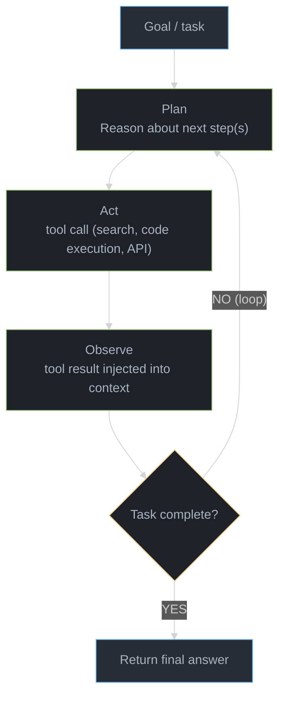
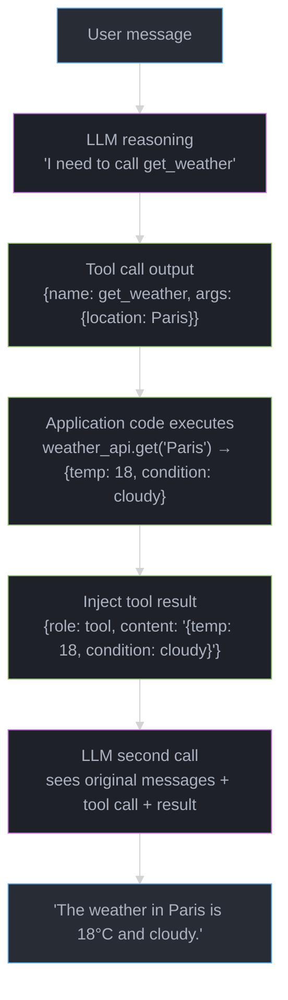

# Agents & Tool Use

## Sub-Files — Deep Dives (15 total)

| File | Topic | Q&As |
|------|-------|------|
| [function_calling_and_tool_design.md](function_calling_and_tool_design.md) | OpenAI/Anthropic tool use, schema design, parallel calls | 15+ |
| [react_and_reasoning_patterns.md](react_and_reasoning_patterns.md) | ReAct — Thought/Action/Observation loop, chain-of-thought integration | 15+ |
| [plan_and_execute.md](plan_and_execute.md) | Plan-and-execute — task decomposition, replanning, subgoal tracking | 15+ |
| [agent_memory.md](agent_memory.md) | Short-term, long-term, episodic, semantic, working memory | 15+ |
| [computer_use_and_browser_agents.md](computer_use_and_browser_agents.md) | Anthropic CUA, browser automation, screen understanding | 15+ |
| [agent_evaluation_and_benchmarking.md](agent_evaluation_and_benchmarking.md) | SWE-bench, GAIA, WebArena, trajectory evaluation | 15+ |
| [agent_reliability.md](agent_reliability.md) | Timeout/circuit breaker, retry, checkpointing, dead-loop detection | 15+ |
| [reflexion_and_self_correction.md](reflexion_and_self_correction.md) | Reflexion verbal RL, Self-Refine, CRITIC, sycophancy | 15+ |
| [tree_of_thoughts_for_agents.md](tree_of_thoughts_for_agents.md) | BFS/DFS/beam/MCTS for agent planning, value functions | 15+ |
| [tool_selection_at_scale.md](tool_selection_at_scale.md) | RAG-over-tools, hierarchical menus, routing for N>50 tools | 15+ |
| [sandboxed_code_execution.md](sandboxed_code_execution.md) | E2B, Riza, Daytona, Modal, isolation, resource limits | 15+ |
| [subagents_and_delegation.md](subagents_and_delegation.md) | Parallel dispatch, context isolation, structured return contracts | 15+ |
| [agent_ux_patterns.md](agent_ux_patterns.md) | Streaming, interrupt/resume, approval gates, artifacts, confidence | 15+ |
| [durable_long_running_agents.md](durable_long_running_agents.md) | Temporal, Inngest, Restate, LangGraph checkpointing, idempotency | 15+ |
| [agent_cost_and_token_budget.md](agent_cost_and_token_budget.md) | Per-task budgets, model cascading, compaction, caching, batch APIs | 15+ |

---

## 1. Concept Overview

An LLM agent is a system where a language model acts as the reasoning engine that decides which actions to take to accomplish a goal. Unlike a simple prompt-response interaction, an agent can call tools, execute code, browse the web, read/write files, and take multiple actions in sequence — autonomously working toward a goal until it's accomplished.

The key insight: LLMs are exceptional reasoners but poor executors (they can't run code, access the internet, or call APIs). Tools bridge this gap. By giving an LLM access to tools and a loop to keep acting until a task is complete, we get a system that can accomplish tasks no single LLM call could handle.

Agents represent the frontier of LLM application development in 2024-2025, powering systems like Claude Code, Devin, Cursor Composer, and countless enterprise automation workflows.

---

## 2. Intuition

> **One-line analogy**: An LLM agent is like a brilliant intern who can think through problems and delegate to specialists (tools) — you give them a goal and they figure out how to get it done.

**Mental model**: A regular LLM call is stateless — one question, one answer. An agent is a loop: the LLM reads the task, decides what action to take (call a tool, write code, search the web), observes the result, and decides the next action. This loop continues until the task is complete or an error occurs. The LLM is the brain (reasoning); tools are the hands (execution). ReAct (Reason + Act) is the pattern: think about what to do, do it, observe, repeat.

**Why it matters**: Tools give LLMs access to real-time information, code execution, APIs, and file systems — capabilities far beyond text generation. This transforms LLMs from Q&A systems into autonomous workers that can complete multi-step tasks.

**Key insight**: The fundamental insight of agentic systems is that LLMs are better at planning and reasoning than they are at reliable one-shot execution — breaking work into small, verifiable steps with tool calls makes complex tasks tractable.

---

## 3. Core Principles

- **Planning**: Breaking down complex goals into executable sub-steps.
- **Tool use**: Calling external functions (APIs, databases, code execution) to extend capabilities.
- **Memory**: Maintaining state across multiple steps (working memory in context; long-term in storage).
- **Reflection**: Evaluating progress and adjusting the plan when things go wrong.
- **Loops**: Agents work in a cycle: reason → act → observe → reason again.
- **Termination**: Agents must know when to stop (task complete, error, maximum steps reached).

---

## 4. Types / Strategies

### 4.1 Function Calling (Tool Use)

Modern LLMs are fine-tuned to recognize when to call tools and output structured calls:

```python
# OpenAI function calling
tools = [{
    "type": "function",
    "function": {
        "name": "get_weather",
        "description": "Get current weather for a location",
        "parameters": {
            "type": "object",
            "properties": {
                "location": {"type": "string", "description": "City, Country"},
                "units": {"type": "string", "enum": ["celsius", "fahrenheit"]}
            },
            "required": ["location"]
        }
    }
}]

response = client.chat.completions.create(
    model="gpt-4o",
    messages=[{"role": "user", "content": "What's the weather in Paris?"}],
    tools=tools
)
# Returns: tool_call { name: "get_weather", arguments: {"location": "Paris, France"} }
```

The model outputs a structured tool call; your code executes it; result injected back into context.

### 4.2 ReAct (Reasoning + Acting)

Interleave thoughts and actions in a structured format:

```
Task: Find the CEO of Apple and their net worth.

Thought: I need to find the current CEO of Apple first.
Action: search("Apple CEO 2024")
Observation: Tim Cook is the CEO of Apple Inc.

Thought: Now I need to find Tim Cook's net worth.
Action: search("Tim Cook net worth 2024")
Observation: Tim Cook's net worth is approximately $1.5 billion.

Thought: I have all the information needed to answer.
Final Answer: Tim Cook is the CEO of Apple. His net worth is approximately $1.5 billion.
```

ReAct was proposed as a prompting pattern (2022) and is now the default architecture for most agents.

**Reading it in plain English.** "An agent is a chain, and a chain succeeds only if every link does — so per-step reliability gets multiplied by itself once per step, and a 95%-reliable agent is worse than a coin flip by step 14."

This is the single most counterintuitive number in agent design. Engineers reason about steps additively ("each step is pretty good") when the math is multiplicative, and multiplication of numbers below 1 collapses fast.

| Symbol | Say it | What it is |
|--------|--------|------------|
| `p` | "pee" | Probability one step succeeds: right tool, right arguments, usable result |
| `n` | "en" | Number of steps in the trajectory. The `max_steps` of the loop |
| `p^n` | "pee to the en" | End-to-end success. Every step must succeed; one failure kills the trajectory |
| `p^(1/n)` | "the en-th root of pee" | Inverted: the per-step reliability needed to hit a target end-to-end rate |

**Walk one example.** The 2-tool trace above, then the same agent stretched longer:

```
    per-step p     n=3      n=5      n=10     n=20
      0.99        0.970    0.951    0.904    0.818
      0.95        0.857    0.774    0.599    0.358
      0.90        0.729    0.590    0.349    0.122
      0.80        0.512    0.328    0.107    0.012

  The 2-search trace above at p = 0.95 (3 model turns):  0.95^3  = 0.857
  The same agent given a 20-step budget:                 0.95^20 = 0.358

  Inverting it -- what per-step reliability buys 90% end-to-end over 10 steps:
    p = 0.90^(1/10) = 0.9895
    that is 98.95% per step, i.e. one failure per 95 tool calls
```

**Why plan-and-execute and error injection exist.** Both attack this exact formula, from opposite ends. Plan-and-execute (next section) shrinks `n` by collapsing exploratory turns into one planning call. Injecting a tool error back as an observation — instead of aborting — converts a failed step into a retried step, which restores `p` rather than terminating the product `p^n`. Neither is a stylistic preference; they are the only two levers the arithmetic offers.

### 4.3 Plan-and-Execute

Separate planning from execution for more reliable long-horizon tasks:

```
Phase 1: Planning (one LLM call)
  Task: "Write a market analysis report on the EV industry"
  Plan:
    1. Research current EV market size and growth
    2. Identify top 5 EV manufacturers by market share
    3. Analyze recent battery technology developments
    4. Investigate charging infrastructure trends
    5. Compile competitive analysis
    6. Write executive summary

Phase 2: Execution (one agent per step)
  Execute step 1: search, retrieve, summarize
  Execute step 2: search, retrieve, summarize
  ...
  Execute step 6: synthesize all gathered info → write report

Benefits: clear structure, each step can be independently validated
Drawbacks: plan may become outdated as execution reveals new info
```

### 4.4 Memory Systems

Agents need memory to handle tasks that span multiple steps:

```
Memory Types:

In-context (working memory):
  The current conversation / context window
  Limited: 8K-200K tokens depending on model
  Volatile: lost when context is cleared

External (episodic memory):
  Store past interactions in vector DB
  Retrieve relevant memories when needed
  Persistent: survives sessions
  Example: "I remember from last week you prefer TypeScript..."

Semantic memory:
  Facts about the world / domain
  Stored in knowledge base or documents
  Accessed via RAG

Procedural memory:
  Skill programs / few-shot examples stored
  Retrieved when similar task encountered
  Example: successful code templates
```

**Reading it in plain English.** "Summarizing old turns does not just save tokens once — it converts working memory from something that grows with every step into something that stops growing at a fixed ceiling."

The ratio matters less than that shape change. A 3x saving on a quantity that still grows without bound only delays the overflow; capping the growth removes it.

| Symbol | Say it | What it is |
|--------|--------|------------|
| `t_turn` | "tee turn" | Tokens one full turn adds: the assistant's thought and tool call, plus the tool result |
| `W_before` | "double-u before" | Working-memory tokens with every turn kept verbatim |
| `W_after` | "double-u after" | Working-memory tokens after compaction: summary plus the verbatim tail |
| `r` | "are" | Compression ratio, `W_after / W_before`. Lower is tighter. `1/r` is the "Nx reduction" |
| tail window | "tail window" | The most recent turns kept verbatim. Compaction never touches these |

**Walk one example.** A turn that appends a 180-token thought plus tool call and a 600-token observation:

```
    assistant thought + tool call     180
    tool result (observation)         600
                                      ---
    t_turn                            780 tokens per turn

  W_before after 20 turns   =  20 x 780                    = 15,600 tokens

  Compact turns 1-15 into a 600-token running summary, keep the last 5 verbatim:
    summary                                                     600
    tail window       5 x 780                               = 3,900
                                                              -----
    W_after                                                   4,500 tokens

    r = 4,500 / 15,600 = 0.288           reduction = 1/r = 3.5x
    tokens reclaimed   = 15,600 - 4,500  = 11,100

  Turns affordable inside a 32,000-token working budget:
    no compaction     32,000 / 780 = 41 turns, then the window overflows
    with compaction   ceiling = 600 + 5 x 780 = 4,500 tokens, reached at turn 20
                      and flat from there -- turn 200 costs the same as turn 20
```

**Why the verbatim tail is not optional.** A summary is lossy by construction, and the detail an agent most needs is the detail from the step it just took — the exact error string, the precise row it read. Summarize the recent turns too and the agent loses its own footing mid-task, typically re-running the tool it just ran. Keeping 3-5 turns raw costs a few thousand tokens and is what makes the compression safe.

### 4.5 Tool Library

Common tools given to agents:

| Tool Category | Examples | Use Case |
|---------------|---------|---------|
| Search | Bing Search, Serper, Tavily | Real-time information |
| Code execution | Python sandbox, REPL | Data analysis, calculations |
| File I/O | Read/write files, list directory | File management |
| Browser | Playwright, Selenium | Web scraping, form filling |
| Database | SQL executor, API client | Data retrieval |
| Communication | Email, Slack, calendar | Enterprise automation |
| LLM sub-calls | Summarizer, translator | Specialized sub-tasks |
| Vector DB | Retrieval, storage | Long-term memory |

**Reading it in plain English.** "Adding a tool does two things at once: it lowers the odds the model picks the right one, and it charges you schema tokens on every request — and the confusion grows faster than the tool count does."

The second half is what surprises people. Tools grow linearly but *pairs* of tools grow quadratically, and it is pairs that get confused with each other.

| Symbol | Say it | What it is |
|--------|--------|------------|
| `N` | "en" | Number of tools registered and visible to the model on a given call |
| `1/N` | "one over en" | Random-choice baseline. The floor the model's selection accuracy must beat |
| `t_schema` | "tee schema" | Tokens for one tool definition: name, description, and parameter schema |
| `N x t_schema` | "en times tee schema" | Context tax paid on every request, before the task even starts |
| `N(N-1)/2` | "en times en minus one over two" | Number of tool *pairs* — every chance for two descriptions to overlap |

**Walk one example.** The 8 categories in the table above, then scaling up, at ~120 tokens per definition against a 200K window:

```
    N tools    random baseline 1/N    N x t_schema    % of a 200K window
        8            12.5%                960              0.5%
       20             5.0%              2,400              1.2%
       50             2.0%              6,000              3.0%
      100             1.0%             12,000              6.0%

  Confusable pairs grow much faster than the tool count:
      N =   8  ->  8 x 7 / 2   =    28 pairs
      N =  20  -> 20 x 19 / 2  =   190 pairs
      N =  50  -> 50 x 49 / 2  = 1,225 pairs

  Going from 8 tools to 50 tools:
    schema cost   6.3x higher   (960 -> 6,000 tokens, on every single request)
    pair count   43.8x higher   (28 -> 1,225 chances for two descriptions to collide)
```

Each pair is one more opportunity for two descriptions to overlap enough that the model reaches for the wrong one — a search tool and a retrieval tool whose descriptions both read "find relevant information" will be confused no matter how good the model is, because the prompt genuinely does not distinguish them.

**Why this caps the tool count, not the model.** The fix is never "register fewer tools" — it is to stop showing all `N` at once. Filter the tool list per turn by task relevance so the model sees 5-10 candidates instead of 50, which restores both the `1/N` baseline and the schema budget simultaneously. See [Tool Selection at Scale](tool_selection_at_scale.md) for retrieval-based tool filtering and hierarchical tool namespaces.

### 4.6 Multi-Agent Systems

Multiple specialized agents collaborate to tackle tasks that exceed any single agent's context or capability. An orchestrator decomposes the task, dispatches to specialized workers, and assembles results. Enables parallelism and specialization but requires careful failure isolation and inter-agent communication protocols. See [Multi-Agent Systems](../multi_agent_systems/README.md) for patterns (orchestrator-worker, debate, blackboard, Swarm) and full implementation.

### 4.7 Agent Safety & Guardrails

Guardrails are external safety layers that sit around agents: input filters (PII detection, injection detection), output filters (toxicity, grounding checks), and runtime constraints (rate limits, step budgets). Critical for production deployments, especially in regulated domains. Agents create unique guardrail challenges: indirect prompt injection via tool results and multi-turn jailbreak attacks. See [Guardrails & Content Safety](../guardrails_and_content_safety/README.md) for full coverage.

### 4.8 Code Agents

Agents specialized for software engineering tasks: writing, executing, debugging, and iterating on code. The execution loop is tighter than standard ReAct — the primary tool is a code sandbox; feedback is structured (test results, stack traces); termination is programmatic (tests pass). Powers tools like Claude Code, Devin, Cursor Composer, and SWE-agent. See [Code Generation](../code_generation/README.md) for evaluation benchmarks (SWE-bench), security considerations, and architecture.

### 4.9 Agentic Frameworks

LangChain, LangGraph, LlamaIndex, CrewAI, AutoGen, and Semantic Kernel provide reusable abstractions for agent loops, tool management, memory, and multi-agent coordination. Framework choice matters: LangGraph for complex stateful workflows; LlamaIndex for data-heavy RAG agents; CrewAI for quick role-based crews. See [Agentic Frameworks](../agentic_frameworks/README.md) for framework comparison and when to build custom.

Key framework references for agent patterns:
- **LangChain LCEL tool-calling agents**: [langchain_and_lcel.md](../agentic_frameworks/langchain_and_lcel.md) — LCEL tool-calling agent via `create_tool_calling_agent`, LCEL vs legacy AgentExecutor, prompt caching for long system prompts, streaming structured outputs.
- **LangGraph stateful agents**: [langgraph.md](../agentic_frameworks/langgraph.md) — StateGraph, human-in-the-loop with `interrupt()`, multi-agent supervisor pattern, subgraph composition, custom reducers, checkpoint strategy by scale.

---

## 5. Architecture Diagrams

### Agent Loop



Max iterations safety: stop after N steps to prevent infinite loops.

### Function Calling Flow



### Agent Memory Architecture
```
Agent
  |
  +-- Working Memory (context window)
  |   Current conversation, recent observations, scratch pad
  |
  +-- Episodic Memory (vector DB)
  |   Past conversations, past task outcomes
  |   Retrieve: "what did we learn last time we ran this analysis?"
  |
  +-- Semantic Memory (knowledge base)
  |   Domain facts, documentation, product info
  |   Retrieve: RAG over knowledge base
  |
  +-- Procedural Memory (few-shot library)
      Successful past tool call patterns
      Retrieved by similarity to current task
```

---

## 6. How It Works — Detailed Mechanics

### Tool Definition Best Practices

```python
# Good tool definition: clear name, description, typed parameters
{
    "name": "execute_python",
    "description": "Execute Python code in a sandbox and return stdout/stderr. "
                   "Use for data analysis, calculations, and generating charts.",
    "parameters": {
        "code": {
            "type": "string",
            "description": "Valid Python code to execute. Import libraries as needed."
        },
        "timeout_seconds": {
            "type": "integer",
            "description": "Maximum execution time. Default 30. Max 120.",
            "default": 30
        }
    }
}

# Poor tool definition: vague, ambiguous
{
    "name": "run",
    "description": "Run something",  # Too vague - model doesn't know when to use it
    "parameters": {"input": {"type": "string"}}
}
```

### Error Handling and Recovery

Agents must handle tool failures gracefully:

```python
# Agent loop with error handling
def agent_loop(task, max_steps=10):
    messages = [{"role": "user", "content": task}]

    for step in range(max_steps):
        response = llm.call(messages, tools=available_tools)

        if response.is_final_answer:
            return response.content

        if response.tool_call:
            try:
                result = execute_tool(response.tool_call)
                messages.append({"role": "tool", "content": result})
            except ToolError as e:
                # Inject error as observation so agent can recover
                messages.append({
                    "role": "tool",
                    "content": f"Error: {str(e)}. Please try a different approach."
                })

    return "Task exceeded maximum steps. Partial results: ..."
```

**Reading it in plain English.** "That `messages.append` in the loop is the whole cost story: every turn re-sends everything that came before it, so the cumulative token bill of an `N`-step agent grows with `N` squared, not with `N`."

The API is stateless. `messages` is not a handle the provider remembers — it is the full transcript, serialized and shipped again on every iteration. Step 10 pays for steps 1 through 9 all over again, and so did steps 2 through 9 before it. This is the single most common source of a shocking agent bill.

| Symbol | Say it | What it is |
|--------|--------|------------|
| `S` | "es" | System prompt plus all tool definitions. Fixed, and re-sent on every step |
| `T` | "tee" | The task/user message. Fixed, and also re-sent every step |
| `a` | "ay" | Tokens the assistant adds per turn: its reasoning plus the tool call |
| `o` | "oh" | Tokens the observation adds: the tool result injected back as a message |
| `a + o` | "ay plus oh" | How much the transcript grows per completed turn |
| `N` | "en" | Steps actually taken. Capped by `max_steps` — 10 in the loop above |
| `N(N-1)/2` | "en times en minus one over two" | The triangular number. Why the total is quadratic |

**Walk one example.** Sizing the loop above with `max_steps = 10`:

```
  Tokens sent on step n (0-indexed):   S + T + n x (a + o)
  Cumulative across N steps:           N x (S + T)  +  (a + o) x N(N-1)/2
                                                                ^^^^^^^^^
                                                            the quadratic term

    S = system prompt + tool definitions      1,500
    T = task                                    200
    a = assistant thought + tool call            180
    o = tool result (observation)                600
    a + o                                        780   growth per turn

    step      tokens sent      running total
      1           1,700              1,700
      2           2,480              4,180
      3           3,260              7,440
      5           4,820             16,300
     10           8,720             52,100

  Closed form:  10 x 1,700 + 780 x (10 x 9 / 2) = 17,000 + 35,100 = 52,100

  The naive estimate -- "10 calls at a 1,700-token prompt" -- says 17,000 tokens.
  The real number is 52,100. That is 3.1x higher, at $3.00/1M input = $0.156.
```

Now the trap. Pitfall 4 below says to truncate verbose tool results; here is what skipping that actually costs:

```
  Same loop, tool results left untruncated: o = 3,000 instead of 600
    a + o      = 3,180
    cumulative = 10 x 1,700 + 3,180 x 45 = 17,000 + 143,100 = 160,100 tokens

  The observation grew 5x.  The bill grew 3.1x (52,100 -> 160,100).
  Because o is multiplied by N(N-1)/2 = 45, not by N = 10 -- one fat tool result
  is paid for by every step that follows it.

  And raising the step cap is not linear either. At max_steps = 20:
    20 x 1,700 + 780 x (20 x 19 / 2) = 34,000 + 148,200 = 182,200 tokens
    doubling the steps multiplied the tokens 3.5x (52,100 -> 182,200)
```

**Why the quadratic term is the one to attack.** `S` and `T` are multiplied by `N`; `a + o` is multiplied by `N(N-1)/2`, which at 20 steps is 190. Shaving 200 tokens off the system prompt saves 4,000 tokens across a 20-step run; shaving 200 tokens off each observation saves 38,000. Truncate tool results, cap `max_steps`, and compact old turns — all three shrink the term that is being multiplied by 190. Provider prompt caching attacks it from the other side: the re-sent prefix is byte-identical across steps, so a cache hit charges roughly a tenth for those tokens and pulls the effective curve back toward linear.

### Retry and Backoff Arithmetic

The `except ToolError` branch above injects the error and moves on, but production tool calls retry first. Exponential backoff with jitter is the standard:

```
  delay_i = random(0, min(cap, base x 2^i))       i = 0, 1, 2, ...
```

**Reading it in plain English.** "Wait twice as long after each failure, never longer than the cap, and pick a random point inside that window so you do not retry in lockstep with everyone else."

| Symbol | Say it | What it is |
|--------|--------|------------|
| `base` | "base" | First retry delay. 1 second here |
| `i` | "eye" | Retry attempt index, starting at 0 |
| `2^i` | "two to the eye" | Doubling factor. Backs off fast enough to let a struggling service recover |
| `cap` | "cap" | Ceiling on any single delay. Stops the doubling running away |
| `random(0, x)` | "random zero to ex" | Full jitter. Spreads retries across the window instead of stacking them |

**Walk one example.** `base = 1s`, `cap = 8s`, 5 attempts:

```
    attempt    base x 2^i    after cap    expected delay (half the window)
       1           1s            1s              0.5s
       2           2s            2s              1.0s
       3           4s            4s              2.0s
       4           8s            8s              4.0s
       5          16s            8s              4.0s
                                              --------
    worst-case wall clock    1 + 2 + 4 + 8 + 8  =  23s
    expected wall clock                            11.5s

  Uncapped, the same 5 attempts: 1 + 2 + 4 + 8 + 16 = 31s
  and an 8th attempt would wait 2^7 = 128s on its own.

  Against the agent budget: max_steps = 10, each step retrying to the worst case
    10 x 23s = 230s of pure waiting, before any model or tool time
```

**Why the jitter term exists.** Drop `random()` and every client backs off on the identical schedule. Two hundred agents that all hit the same 429 retry together at exactly t=1s, then together at t=3s, then t=7s — synchronized waves that re-trigger the rate limit and guarantee none of them recovers. Full jitter spreads those 200 retries uniformly across each window, so the service sees a smooth trickle instead of a thundering herd. The cap and the global deadline are separate safeguards: cap bounds one delay, and a per-task deadline is what stops the 230s above from consuming the whole request budget.

### Prompt Construction for Agents

```
System Prompt Structure for Agents:

1. Role: "You are an autonomous agent that..."
2. Available tools: [list with descriptions]
3. Output format: "Use this format for tool calls..."
4. Decision rules: "Search before answering factual questions"
5. Completion criteria: "Say DONE when the task is complete"
6. Safety constraints: "Never execute destructive operations without confirmation"
7. Iteration limit: "Complete the task in at most 10 steps"
```

---

## 7. Real-World Examples

### Claude Code (Anthropic)
- Terminal-based agent that reads/writes files, executes commands
- Tools: read_file, write_file, bash, list_directory
- Context: up to 200K tokens; can hold entire codebases
- Can refactor multi-file projects, run tests, debug errors autonomously
- Human-in-the-loop: asks permission for destructive operations

### OpenAI Assistants API
- Managed agent infrastructure: threads, tools, file storage
- Built-in tools: code_interpreter (Python sandbox), file_search (RAG)
- Custom function calling
- Persistent threads: conversation history managed server-side
- Used by thousands of production applications

### Devin (Cognition AI)
- Full autonomous software engineering agent
- Tools: terminal, browser, code editor, web search
- Completes real GitHub issues end-to-end
- Persistent workspace: remembers state across sessions
- SWE-bench: 13.8% resolution rate (first highly publicized agent benchmark)

---

## 8. Tradeoffs

| Factor | Simple Chain | ReAct Agent | Plan-Execute |
|--------|-------------|-------------|--------------|
| Reliability | High | Medium | High |
| Flexibility | Low | High | Medium |
| Latency | Fast | Slow (N rounds) | Medium |
| Debugging | Easy | Hard | Medium |
| Long tasks | Fails | Handles | Handles well |

---

## 9. When to Use / When NOT to Use

### Use Agents When:
- Task requires dynamic tool calls (you don't know in advance which tools are needed)
- Multi-step tasks where each step depends on previous results
- Tasks requiring real-time information (web search, API calls)
- Tasks requiring code execution or file manipulation

### Don't Use Agents When:
- Task is a single LLM call (no tools needed)
- Latency is critical (agent loops add 1-10+ seconds per step)
- Task can be solved with a static chain (same tools, same order every time)
- Safety requirements prohibit autonomous action (medical, legal decisions)

---

## 10. Common Pitfalls

1. **Infinite loops**: Agent keeps trying the same failing tool. Enforce max_iterations and detect repetitive patterns.
2. **Tool overuse**: Agent calls tools when it already has the answer in context. Prompt: "Use your knowledge when confident, tools only when needed."
3. **Context overflow**: Long agent runs accumulate many tool call messages. Implement context compression (summarize old messages).
4. **Verbose tool results**: Large API responses bloat context. Truncate or summarize tool results before injecting.
5. **No timeout on tool calls**: Network failures cause agent to hang. Always implement async timeouts.
6. **Trust but don't verify**: Agents blindly trust tool outputs. Validate critical tool results before acting on them.

---

## 11. Technologies & Tools

| Tool | Purpose | Notes |
|------|---------|-------|
| **OpenAI Assistants API** | Managed agent infra | Threads, built-in tools, file storage |
| **Anthropic API** | Tool use + Claude | Best instruction following; claude-3.5 |
| **LangGraph** | Stateful agent graphs | Complex multi-agent flows |
| **LlamaIndex Agents** | RAG-focused agents | Data agents, query planning |
| **Tavily Search** | Agent-optimized search | LLM-friendly search results |
| **E2B** | Code execution sandbox | Secure; fast spin-up |
| **Modal** | Serverless agent execution | Scale agent workloads |
| **Tool-augmented LLM guide** | Best practices | Anthropic's tool use cookbook |
| **Mem0** | Agent memory | Long-term memory for agents |
| **browser-use** | Web agent library | Python; Playwright + LLM; accessibility tree |
| **Anthropic Computer Use API** | Screen-based agent | Screenshot + action loop; claude-3-5-sonnet |
| **GAIA benchmark** | Agent evaluation | 466 tasks; tool-use reasoning; 3 difficulty levels |
| **SWE-bench** | Code agent evaluation | 2294 real GitHub issues; automated test scoring |

---

## 12. Interview Questions with Answers

**Q: What is a LLM agent and how is it different from a standard LLM call?**
A: An LLM agent places the LLM in a loop where it can call tools, observe results, and decide on next actions — iterating until a task is complete. A standard LLM call is a single round-trip: input → output. Agents handle tasks that require multiple steps, dynamic tool selection, real-time information, or actions on external systems. The cost is added latency, complexity, and failure modes.

**Q: What is the ReAct pattern?**
A: ReAct (Reasoning + Acting) prompts the LLM to produce alternating Thought-Action-Observation tuples. Thought: the model's reasoning about what to do next. Action: a tool call (specified in structured format). Observation: the tool's result. This cycle repeats until the model produces a Final Answer. It works well because explicit reasoning traces make the model's planning visible and debuggable, and grounding action selection in explicit thoughts improves decision quality.

**Q: How do you prevent an agent from running indefinitely?**
A: (1) Hard iteration limit — stop after N steps (typically 10-20) and return a partial answer; (2) Timeout — kill the agent after T seconds total; (3) Repetition detection — if the same tool is called with the same arguments twice, exit the loop; (4) Cost tracking — stop if cumulative LLM cost exceeds a budget; (5) Human-in-the-loop — check in with a human when uncertain.

**Q: What is the difference between working memory and long-term memory for agents?**
A: Working memory is the agent's context window — everything in the current conversation. It's fast (no retrieval) but limited (typically 128K-200K tokens depending on model) and volatile (cleared between sessions). Long-term memory stores information in external databases (vector store, key-value store) and is retrieved as needed. It's persistent, unlimited, but requires retrieval latency. Agents need both: working memory for the current task, long-term memory for user preferences, past outcomes, and domain knowledge.

**Q: What are parallel tool calls and when should you use them?**
A: Parallel tool calls allow the model to emit multiple tool call requests in a single response, which your application executes simultaneously. Use them when the calls are logically independent — their inputs don't depend on each other's outputs. Example: fetching weather for Paris and Tokyo in one round-trip instead of two sequential calls. Speedup: N× for N independent calls (latency = max(call_1, call_2, ...) rather than sum). Avoid parallel calls when one call's result determines the next call's arguments (sequential dependency).

**Q: How do you design tool descriptions to minimize incorrect tool selection?**
A: Tool descriptions are a form of prompting that directly governs selection accuracy. Include four elements in every description: (1) what the tool does (mechanism); (2) trigger condition — "call this when the user asks about X"; (3) exclusion — "do NOT use for Y, use Z tool instead" to disambiguate similar tools; (4) a concrete example. Bad: "Gets data." Good: "Retrieves current stock prices for publicly traded companies. Call this when the user asks about current price or market cap. Do NOT use for historical prices — use get_historical_prices instead."

**Q: What is the cost model for an agentic system — what drives token usage?**
A: Token cost = sum over all LLM calls of (input_tokens × input_price + output_tokens × output_price). What drives input token growth: (1) accumulated conversation history and tool results — each step adds 500-2000 tokens; (2) large tool responses — a 5KB JSON API response can cost $0.025 in input tokens at GPT-4o pricing; (3) context repetition — the system prompt is re-sent on every call. Cost drivers by example: a 15-step agent at 3K tokens/step (input) × $5/1M = $0.225 total. Mitigations: truncate tool results to 500 words, compress old conversation history, route simple steps to cheaper models.

**Q: How do you implement human-in-the-loop in a production agent?**
A: LangGraph provides `interrupt_before` and `interrupt_after` node hooks that pause graph execution and surface state to a human. The agent state is persisted via a checkpointer; the graph resumes when the human approves via `graph.update_state()`. Design: classify actions by risk (low/medium/high); only interrupt for high-risk actions (irreversible writes, external sends, large purchases). Surface the pending action with its reasoning context in a UI or Slack message; require explicit approval. Pattern: pause before any `send_email`, `delete_file`, `make_payment` node — never let these execute autonomously.

**Q: What is the difference between a tool call error and a reasoning error?**
A: A tool call error is an execution failure: the tool was correctly identified and its arguments were correctly formed, but the call failed (network timeout, API 404, rate limit). The model can recover by retrying, using a different tool, or acknowledging the limitation. A reasoning error is a logical failure: the model selected the wrong tool, formed incorrect arguments, or reached a wrong conclusion from correct observations. Reasoning errors are harder to detect and fix — they don't produce exceptions. Detection: tool call errors show up in tool result status fields; reasoning errors require trajectory evaluation (did the agent's Thoughts follow logically from Observations?).

**Q: When would you NOT use an agent, even though you could?**
A: (1) Task is a single LLM call — no tool needed; adding an agent loop adds latency and complexity for no benefit; (2) The tool sequence is always the same (retrieve → generate) — a fixed chain is faster, cheaper, and more reliable; (3) Latency is critical — agent loops add N × LLM latency; if you need <500ms response, use a single call; (4) Safety requirements prohibit autonomous action — medical diagnosis, legal advice, financial decisions should never be made without human review; (5) The task is easily verifiable in one step — if you can write a unit test for the correct output of a single LLM call, an agent is overkill.

**Q: How do you handle a tool that returns inconsistent or malformed results?**
A: Three-layer strategy: (1) Input validation — validate tool result schema before injecting into context; if malformed, inject a structured error message instead of the raw broken response; (2) Retry with modified prompt — on first malformed result, retry the tool call once with additional formatting guidance in the prompt ("return only valid JSON with these exact fields"); (3) Fallback — if the tool consistently returns garbage, inject an error observation: "This tool is returning unreliable data. Try an alternative approach." The key is never injecting malformed JSON or HTML directly into context — it corrupts the model's reasoning about subsequent steps.

**Q: What metrics do you track for a production agent in steady state?**
A: Core: (1) task success rate — binary or LLM-scored; alert if drops >5% (rolling 7-day); (2) cost per task — $/task; alert if exceeds budget threshold; (3) P95 latency — wall time; alert on SLA breach; (4) step count per task — rising count indicates quality degradation or inefficiency; (5) tool error rate — fraction of tool calls returning errors. Supporting: human escalation rate (for HITL agents), token usage per step, retry rate. Set alert thresholds during a 2-week baseline period then alert on >2 standard deviation shifts. LLM judge on 5% of production traces gives qualitative quality signal without evaluating every call.

**Q: When should you use LangChain LCEL for an agent versus LangGraph?**
A: Use LCEL (`create_tool_calling_agent` + `AgentExecutor`) when the agent loop is simple: one LLM + a fixed set of tools + no persistent state across sessions. LCEL agents terminate after each invocation; state must be passed in fresh each time. Use LangGraph when: (1) the agent needs to persist state across multiple user turns (checkpointing); (2) the workflow has loops that depend on runtime conditions (tool retry, iterative refinement); (3) human-in-the-loop approval is required at specific steps; (4) multi-agent coordination with explicit routing between specialized agents; (5) you need to stream intermediate state transitions to a UI. Rule of thumb: if you can model the agent as `while True: call_llm(); if done: break`, use LCEL. If you need `if human_approved: continue`, persistent thread state, or parallel sub-agents, use LangGraph.

**Q: How does LCEL's AgentExecutor compare to creating an agent loop in LangGraph?**
A: `AgentExecutor` is LCEL's high-level agent runner that handles the Thought-Action-Observation loop for you: it automatically calls tools, injects results back into messages, and loops until the model produces a final answer or `max_iterations` is reached. LangGraph's equivalent is a `StateGraph` with an agent node and a tool node connected by a conditional edge. Key differences: AgentExecutor is simpler to set up (5 lines vs 30 lines for LangGraph) but has hard-to-customize loop logic; LangGraph exposes every step as a node you can modify, add logging, or interrupt. For production agents where you need visibility into each loop iteration, LangGraph's explicit graph is superior. AgentExecutor is deprecated in LangChain 0.3+ in favor of LangGraph's patterns.

**Q: How do you make side-effectful tools safe when the agent retries or the loop replays a step?**
A: Make every mutating tool idempotent from the agent's perspective, because retries are guaranteed: the LLM re-issues calls after timeouts, malformed observations, or loop restarts, and "send_email" executed twice is a real incident, not a hypothetical. The standard mechanics: require an idempotency key per logical action (derived from the step ID or a hash of the tool arguments) so the tool backend deduplicates repeat executions; separate read tools from write tools and let only reads auto-retry; and gate irreversible writes (payments, deletions, external messages) behind a confirm step — either human-in-the-loop or a two-phase propose-then-commit tool pair, so the model must first return a plan artifact and only a validated commit call executes it. Log every tool execution with its key so replays are detectable in traces. The interview trap is answering with "lower the temperature so it retries less" — retry safety is a systems property of the tool layer, never a sampling setting.

In-depth coverage of specific agent topics. Each file follows the standard module format with 10+ interview Q&As.

| Topic | File | Key Coverage |
|-------|------|-------------|
| Function Calling & Tool Design | [function_calling_and_tool_design.md](./function_calling_and_tool_design.md) | Tool spec format, strict mode, parallel calls, result injection, tool versioning |
| ReAct & Reasoning Patterns | [react_and_reasoning_patterns.md](./react_and_reasoning_patterns.md) | ReAct loop, Reflexion, Tree of Thoughts, self-consistency, scratchpad |
| Plan and Execute | [plan_and_execute.md](./plan_and_execute.md) | Two-phase planning, replanning triggers, HTN decomposition, LangGraph P&E |
| Agent Memory | [agent_memory.md](./agent_memory.md) | 4 memory types, MemGPT paging, context compression, token budgets, Mem0 |
| Agent Evaluation & Benchmarking | [agent_evaluation_and_benchmarking.md](./agent_evaluation_and_benchmarking.md) | GAIA, SWE-bench, AgentBench, trajectory eval, LLM-as-judge, cost metrics |
| Computer Use & Browser Agents | [computer_use_and_browser_agents.md](./computer_use_and_browser_agents.md) | Anthropic Computer Use, browser-use, Playwright, vision+action loop, grounding |
| Agent Reliability | [agent_reliability.md](./agent_reliability.md) | Timeout/circuit breaker, retry backoff, progress checkpointing, dead-loop detection, human handoff |

Related standalone modules:

| Topic | Module | Key Coverage |
|-------|--------|-------------|
| Multi-Agent Systems | [../multi_agent_systems/README.md](../multi_agent_systems/README.md) | Orchestrator-worker, debate, blackboard, ChatDev, MetaGPT, Swarm |
| Guardrails & Content Safety | [../guardrails_and_content_safety/README.md](../guardrails_and_content_safety/README.md) | Input/output filters, NeMo, Llama Guard, prompt injection, HIPAA/PCI |
| Code Generation | [../code_generation/README.md](../code_generation/README.md) | FIM, SWE-bench, security risks, hallucinated APIs, code agents |
| Agentic Frameworks | [../agentic_frameworks/README.md](../agentic_frameworks/README.md) | LangChain, LangGraph, LlamaIndex, CrewAI, AutoGen, LCEL, observability |

---

## 13. Best Practices

1. **Design tools carefully** — clear names, specific descriptions, strict typing; poor tool specs lead to wrong tool selection.
2. **Log all agent steps** — every thought, action, and observation; essential for debugging production agents.
3. **Implement graceful degradation** — if agent fails after N steps, return best partial answer rather than nothing.
4. **Test with adversarial inputs** — what happens with empty responses, API failures, or contradictory tool results?
5. **Use human-in-the-loop for high-risk actions** — always confirm before deleting data, sending emails, or making purchases.
6. **Monitor cost per agent run** — agents can spiral; set cost limits and alert on outliers.

---


## 14. Case Study

**Scenario:** A SaaS company's SRE team handles 120 P1/P2 incidents per month. Mean time to resolution (MTTR) is 47 minutes. They deploy a ReAct agent for automated incident response: the agent monitors PagerDuty alerts, queries Datadog metrics, searches runbooks, and takes remediation actions (restart services, scale pods, trigger rollbacks) with human approval for destructive actions. Goal: resolve 40%+ of incidents autonomously, reduce MTTR to < 15 minutes for auto-resolved cases, zero false-remediation rate.

**Architecture:**

```
  PagerDuty Alert (P1/P2 triggered)
         |
         v
  Incident Intake: classify known vs novel (runbook vector search)
         |
         v
  ReAct Agent (Claude claude-sonnet-4-6):

  Observation → Thought → Action → Observation → ... (max 20 steps)

  READ-ONLY tools (no approval needed):
  - datadog_query(metric, service, timerange)
  - pagerduty_get_timeline(incident_id)
  - github_get_recent_deploys(service, hours=2)
  - runbook_search(query)
  - kubectl_get_pod_logs(service, lines=100)

  DESTRUCTIVE tools (human approval required):
  - kubectl_restart_deployment(service)
  - kubectl_scale_deployment(service, replicas)
  - github_trigger_rollback(service, commit_sha)

         |
         v
  Human Approval Gate (Slack, 5-min timeout, default reject)
         |
         v
  Outcome tracking: MTTR, diagnosis accuracy, wrong remediation rate
```

**Key implementation — 3 Python code blocks:**

Block 1 — ReAct incident response agent loop:

```python
from __future__ import annotations
import asyncio
import json
import time
from dataclasses import dataclass, field
from typing import Any
import anthropic


@dataclass
class IncidentContext:
    incident_id: str
    service: str
    alert_type: str
    alert_message: str
    severity: str


@dataclass
class AgentStep:
    thought: str
    action: str
    action_input: dict[str, Any]
    observation: str
    step_number: int


@dataclass
class IncidentResolution:
    incident_id: str
    steps: list[AgentStep]
    root_cause: str
    remediation_proposed: str
    remediation_approved: bool
    resolved: bool
    mttr_seconds: float
    cost_usd: float


SYSTEM_PROMPT = """You are an expert SRE agent for production incident response.

Use ReAct: Thought → Action → Observation → repeat until diagnosed.

RULES:
1. Diagnose before proposing any remediation — minimum 4 tool calls covering metrics, logs, and recent deploys.
2. Propose remediation ONLY with specific evidence (metric + log correlation).
3. For restart/rollback: state exact evidence leading to this conclusion.
4. If uncertain after 15 steps: escalate with current findings.
5. Final answer format:
   ROOT CAUSE: [one sentence]
   EVIDENCE: [specific metrics/logs]
   PROPOSED_REMEDIATION: [specific action] OR "ESCALATE: [reason]"

CRITICAL: Never propose restarting a service without confirming it is the root cause (not a dependency)."""


async def run_incident_agent(
    incident: IncidentContext,
    tools: dict[str, Any],
    max_steps: int = 20,
    cost_cap_usd: float = 3.00,
) -> IncidentResolution:
    client = anthropic.AsyncAnthropic()
    t_start = time.monotonic()
    steps: list[AgentStep] = []
    total_cost = 0.0
    loop_detector = LoopDetector()

    tool_defs = [
        {
            "name": "datadog_query",
            "description": "Query Datadog metrics. Returns timeseries data.",
            "input_schema": {
                "type": "object",
                "properties": {
                    "metric": {"type": "string"},
                    "service": {"type": "string"},
                    "timerange": {"type": "string", "description": "e.g. '30m', '2h'"},
                },
                "required": ["metric", "service", "timerange"],
            },
        },
        {
            "name": "kubectl_get_pod_logs",
            "description": "Get recent pod logs for a service.",
            "input_schema": {
                "type": "object",
                "properties": {
                    "service": {"type": "string"},
                    "lines": {"type": "integer", "default": 100},
                },
                "required": ["service"],
            },
        },
        {
            "name": "github_get_recent_deploys",
            "description": "Get recent deployments for a service.",
            "input_schema": {
                "type": "object",
                "properties": {
                    "service": {"type": "string"},
                    "hours": {"type": "integer", "default": 2},
                },
                "required": ["service"],
            },
        },
        {
            "name": "runbook_search",
            "description": "Search internal runbooks for similar incidents.",
            "input_schema": {
                "type": "object",
                "properties": {"query": {"type": "string"}},
                "required": ["query"],
            },
        },
        {
            "name": "kubectl_restart_deployment",
            "description": "DESTRUCTIVE: Restart all pods. REQUIRES HUMAN APPROVAL.",
            "input_schema": {
                "type": "object",
                "properties": {"service": {"type": "string"}},
                "required": ["service"],
            },
        },
    ]

    initial_message = (
        f"INCIDENT: {incident.incident_id}\n"
        f"Service: {incident.service} | Severity: {incident.severity}\n"
        f"Alert: {incident.alert_type}\n"
        f"Message: {incident.alert_message}\n\nBegin diagnosis."
    )
    messages = [{"role": "user", "content": initial_message}]
    thought = ""

    for step_num in range(1, max_steps + 1):
        if total_cost >= cost_cap_usd:
            break

        response = await client.messages.create(
            model="claude-sonnet-4-6",
            max_tokens=2048,
            system=SYSTEM_PROMPT,
            tools=tool_defs,
            messages=messages,
        )

        total_cost += (response.usage.input_tokens * 3 + response.usage.output_tokens * 15) / 1e9

        tool_uses = [b for b in response.content if b.type == "tool_use"]
        text_blocks = [b.text for b in response.content if hasattr(b, "text")]
        thought = " ".join(text_blocks)

        if not tool_uses:
            break

        tool_results = []
        for tu in tool_uses:
            # Loop detection
            loop_warning = loop_detector.check_and_record(tu.name, tu.input)
            if loop_warning:
                observation = loop_warning
            else:
                tool_fn = tools.get(tu.name)
                try:
                    observation = await tool_fn(**tu.input) if tool_fn else f"Tool {tu.name} not found"
                except Exception as e:
                    observation = f"ERROR: {e}"

            steps.append(AgentStep(
                thought=thought, action=tu.name,
                action_input=tu.input, observation=str(observation)[:500],
                step_number=step_num,
            ))
            tool_results.append({
                "type": "tool_result", "tool_use_id": tu.id,
                "content": str(observation)[:2000],
            })

        messages.append({"role": "assistant", "content": response.content})
        messages.append({"role": "user", "content": tool_results})

    import re
    def extract(text: str, field: str) -> str:
        m = re.search(rf"{field}:\s*(.+?)(?:\n[A-Z]|$)", text, re.DOTALL)
        return m.group(1).strip() if m else ""

    return IncidentResolution(
        incident_id=incident.incident_id, steps=steps,
        root_cause=extract(thought, "ROOT CAUSE"),
        remediation_proposed=extract(thought, "PROPOSED_REMEDIATION"),
        remediation_approved=False, resolved=False,
        mttr_seconds=time.monotonic() - t_start, cost_usd=total_cost,
    )


class LoopDetector:
    def __init__(self, max_steps: int = 20) -> None:
        self._history: dict[str, int] = {}

    def check_and_record(self, tool: str, params: dict) -> str | None:
        key = f"{tool}:{sorted(params.items())}"
        count = self._history.get(key, 0) + 1
        self._history[key] = count
        if count >= 2:
            return (
                f"Already called {tool} with same params {count}x. "
                "Check different data or make a diagnosis decision."
            )
        return None
```

Block 2 — Human approval gate with Slack and audit log:

```python
from __future__ import annotations
import asyncio
import time
from dataclasses import dataclass
from typing import Any


@dataclass
class ApprovalRequest:
    incident_id: str
    action: str
    action_params: dict[str, Any]
    justification: str
    evidence: str
    requested_at: float = 0.0

    def __post_init__(self) -> None:
        if not self.requested_at:
            self.requested_at = time.time()


class HumanApprovalGate:
    """
    Route all destructive actions through on-call engineer approval.
    5-minute timeout defaults to rejection (conservative).
    Every decision logged to audit trail.
    """

    TIMEOUT_SECONDS = 300

    def __init__(self, slack_client: Any, approval_db: Any) -> None:
        self._slack = slack_client
        self._db = approval_db

    async def request_approval(self, req: ApprovalRequest) -> tuple[bool, str]:
        token = f"approval_{req.incident_id}_{int(req.requested_at)}"

        msg = (
            f":robot_face: *Incident {req.incident_id} — Remediation Approval Needed*\n"
            f"*Action:* `{req.action}`\n"
            f"*Service:* `{req.action_params.get('service', '?')}`\n"
            f"*Justification:* {req.justification}\n"
            f"*Evidence:* {req.evidence[:400]}\n"
            f"✅ `/approve {token}` | ❌ `/reject {token} [reason]`\n"
            f"_(Auto-reject in 5 min)_"
        )
        await self._slack.post_message(channel="#incidents-sre", text=msg)

        deadline = time.time() + self.TIMEOUT_SECONDS
        while time.time() < deadline:
            decision = await self._db.get_approval_decision(token)
            if decision:
                approved, reason = decision["approved"], decision.get("reason", "engineer decision")
                await self._log(req, approved, reason)
                return approved, reason
            await asyncio.sleep(5)

        reason = "auto-rejected: 5-min timeout"
        await self._log(req, False, reason)
        return False, reason

    async def _log(self, req: ApprovalRequest, approved: bool, reason: str) -> None:
        await self._db.log_approval({
            "incident_id": req.incident_id, "action": req.action,
            "approved": approved, "reason": reason,
            "latency_s": time.time() - req.requested_at,
            "timestamp": time.time(),
        })
```

Block 3 — BROKEN -> FIX: acting before diagnosing and missing dependency check:

```python
from __future__ import annotations


# BROKEN: Agent restarts service immediately on first ERROR in logs.
# No diagnosis — first observation triggers restart.
# Result: payment service restarted mid-transaction → data inconsistency.
async def broken_react_shortcut(logs: str, service: str) -> str:
    if "ERROR" in logs:
        await kubectl_restart(service)   # immediate — no diagnosis
        return "restarted"
    return "no action"


# FIX: Enforce minimum diagnosis depth via system prompt + code check.
# Agent MUST call: datadog_query, kubectl_get_pod_logs, github_get_recent_deploys
# before proposing any remediation. Verified in code before executing tools.
MIN_TOOLS_REQUIRED = {"datadog_query", "kubectl_get_pod_logs", "github_get_recent_deploys"}

def validate_diagnosis(steps: list) -> tuple[bool, str]:
    used = {s.action for s in steps}
    missing = MIN_TOOLS_REQUIRED - used
    if missing:
        return False, f"Incomplete diagnosis: haven't checked {missing}"
    return True, "ok"


# BROKEN: Agent restarts service A when database (dependency) is the root cause.
# Service A is slow because DB CPU is 95%. Agent sees slow A, restarts A.
# After restart: A is fine for 60 sec, then slow again (DB still overloaded).
# Unnecessary downtime + problem not fixed.
async def broken_ignore_dependencies(service: str, tools: dict) -> str:
    logs = await tools["kubectl_get_pod_logs"](service=service)
    if "timeout" in logs.lower():
        return f"restart {service}"  # assumes service is the problem
    return "no action"


# FIX: Always check upstream dependencies before concluding root cause is the service.
async def fixed_check_dependencies(service: str, tools: dict) -> dict[str, float]:
    """Check all known dependencies for error rates before attributing blame to service."""
    # In production: service dependency map from service mesh (Istio/Linkerd)
    known_deps = {
        "payments-api": ["postgres-payments", "redis-sessions", "fraud-service"],
        "user-service": ["postgres-users", "email-service"],
    }
    deps = known_deps.get(service, [])
    health: dict[str, float] = {}
    for dep in deps:
        try:
            result = await tools["datadog_query"](
                metric="service.error_rate", service=dep, timerange="10m"
            )
            health[dep] = float(result.get("avg", 0.0))
        except Exception:
            health[dep] = -1.0   # unknown
    # If any dependency error_rate > 5%: likely root cause is there, not the service
    root_causes = [dep for dep, rate in health.items() if rate > 0.05]
    return {"dependency_root_causes": root_causes, "health_by_dep": health}


# BROKEN: Cost runaway — no per-incident cap.
# During major outage with 50 concurrent incidents, each hitting max_steps=50:
# 50 incidents × 50 steps × $0.04/step = $100 in 20 minutes.
def broken_agent_config() -> dict:
    return {"max_steps": 50, "cost_cap": None}  # unbounded


# FIX: Hard caps per incident + monthly budget monitoring.
def fixed_agent_config() -> dict:
    return {
        "max_steps": 20,
        "cost_cap_usd": 3.00,
        "monthly_budget_usd": 500,
    }

def check_monthly_budget(spent: float, cap: float = 500.0) -> str:
    ratio = spent / cap
    if ratio > 0.95:
        return "BUDGET_EXHAUSTED"
    if ratio > 0.80:
        return "DIAGNOSTIC_ONLY"  # no remediation proposals
    return "FULL_CAPABILITY"


async def kubectl_restart(service: str) -> None: ...
