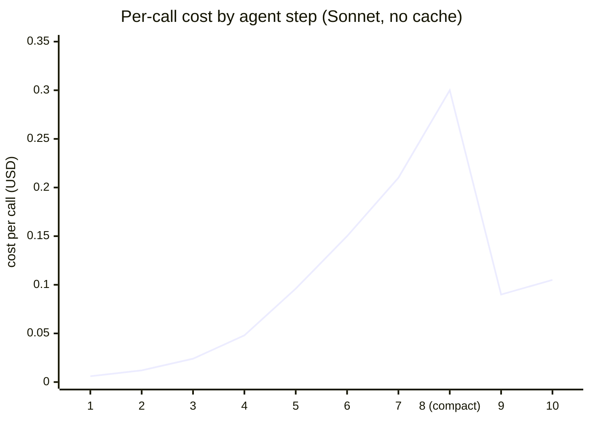
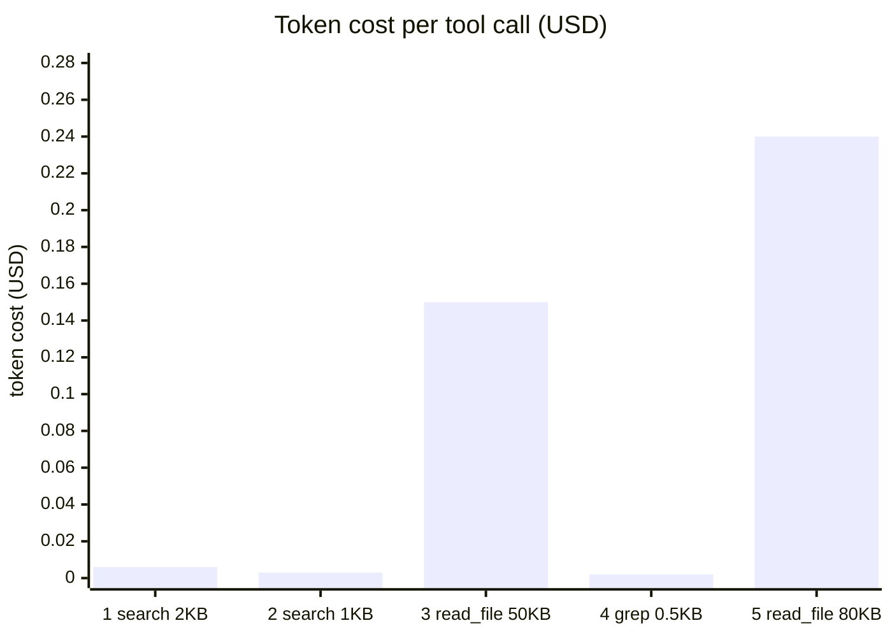

# Agent Cost and Token Budget Management — Deep Dive

---

## 1. Concept Overview

Agentic LLM systems are expensive — typically 100-1000× the cost of single-shot LLM calls — because they accumulate context across many tool calls, re-send the growing conversation on every model call, and execute multiple LLM invocations per user task. A naive 20-step agent with a 50K-token context window in use can cost $0.30-$3.00 per task at Sonnet pricing, vs $0.005 for a single completion. At 10K daily tasks, that's $3K-$30K per day — quickly the dominant infrastructure cost.

This deep-dive covers six concrete cost-management strategies — per-task budgets, model cascading, context compaction, tool-call cost attribution, prompt caching, and the Batch API — combined into a token-aware agent wrapper pattern that production systems use to keep costs predictable.

---

## 2. Intuition

**One-line analogy**: An agent without a token budget is like a credit card with no limit handed to an enthusiastic intern — eventually they'll buy something useful, but they may bankrupt you first.

**Mental model**: Every API call sends the ENTIRE conversation as input. After 10 tool calls, you're paying input price on all 10 prior tool results, every single call. The cost of step N is proportional to the cumulative size at step N. This compounds quadratically — agent loops are O(N²) in token cost, not O(N).

**Why it matters**: Cost discipline is what makes agents production-viable. Engineering teams that ship agents without budget caps and caching typically face a "cost shock" event in week 2-4 — bills 5-20× higher than projected. The fix is mechanical: budgets, caches, model cascades.

**Key insight**: Reading a single 500KB file into context once costs you on EVERY subsequent LLM call for the remainder of that agent loop. The #1 cost sink in production agents is tool outputs that get appended verbatim and re-sent forever after. Targeted extraction (grep, head, summary) beats raw file dump.

---

## 3. Core Principles

- **Budget per task**: every agent task has a hard cost cap; exceed → terminate with partial result.
- **Cascade cheap to expensive**: start with Haiku/4o-mini; escalate to Opus/4o only when needed.
- **Compact aggressively**: when context > 70% of window, summarize old history.
- **Cache the prefix**: system prompt + tools + early conversation prefix should always be cached.
- **Attribute cost to tool calls**: log which tools consume the most tokens; optimize the top offenders.
- **Batch where possible**: async/offline tasks get 50% discount via Batch APIs.
- **Truncate tool outputs**: cap at 50KB; large outputs are the #1 token sink.

---

## 4. Types / Architectures / Strategies

### 4.1 Pricing Reference (early 2025)

| Model | Input $/M | Output $/M | Cache write $/M | Cache read $/M |
|---|---|---|---|---|
| Claude Haiku 4.5 | $0.80 | $4.00 | $1.00 | $0.08 |
| Claude Sonnet 4.6 | $3.00 | $15.00 | $3.75 | $0.30 |
| Claude Opus 4.7 | $15.00 | $75.00 | $18.75 | $1.50 |
| GPT-4o mini | $0.15 | $0.60 | — | — |
| GPT-4o | $2.50 | $10.00 | — | $1.25 (50% off) |
| OpenAI o1 | $15.00 | $60.00 | — | — |
| Gemini 1.5 Flash | $0.075 | $0.30 | — | $0.019 |
| Gemini 1.5 Pro | $1.25 | $5.00 | — | $0.3125 |

Batch API discount (Anthropic, OpenAI, Google): 50% off input + output. 24h SLA. Full per-token pricing mechanics and self-hosting break-even analysis: [Token Economics & Cost Optimization](../token_economics_and_cost_optimization/README.md).

### 4.2 Per-Task Token Budget

Pre-allocate a budget; track usage after every call; terminate with partial result on exceedance.

### 4.3 Model Cascade

Start cheap, escalate on confidence threshold or explicit hard-step detection. Typical savings: 60-80%. Routing architectures and confidence-threshold tuning are covered in [LLM Routing & Model Selection](../llm_routing_and_model_selection/README.md).

### 4.4 Context Compaction

When input_tokens approaches 70% of model's window, summarize all-but-last-N tool results. Compaction itself is one extra LLM call but pays back across remaining iterations.

### 4.5 Targeted Tool Output Extraction

Don't `read_file(big_file)` — instead `read_file(big_file, grep="pattern")` or `read_file(big_file, lines="100-200")`. Cuts a 200K-token file to 2K.

### 4.6 Prompt Caching

Mark system prompt + tools + conversation prefix as cacheable. Anthropic: 5-min ephemeral cache; write 1.25×, read 0.1×. Breakeven after 2 reads. Semantic caching, exact-match caching, and vLLM prefix caching are covered in [LLM Caching](../llm_caching/README.md).

---

## 5. Architecture Diagrams

### Cost Accumulation Without Compaction



Context grows 2K → 100K tokens by step 8 — the compaction trigger (70% of the 200K window) — driving per-call cost to $0.300; compacting back to 30K makes step 9 cost $0.090. Total for the 10-step run: $1.04 without compaction vs $0.72 with compaction at step 8.

### Cost Accumulation With Caching

```
Step  Total context  Cached prefix  Cost (Sonnet w/ cache)
1     5K            3K (write)     $0.006+$0.011 = $0.017
2     6K            3K (read)      $0.009+$0.0009 = $0.010
3     7K            3K (read)      $0.012+$0.0009 = $0.013
4     8K            3K (read)      $0.015+$0.0009 = $0.016
...
Total caches save ~70% on prefix portion
```

### Model Cascade

```
  User request
       |
       v
  +-----------------+
  | Router (Haiku)  |  $0.0005
  | Classify hard?  |
  +--+----------+---+
     |          |
     v          v
  Easy step   Hard step
     |          |
  Haiku       Opus
  $0.005      $0.05

  Without cascade (all Opus): $0.05/step
  With cascade (80% easy, 20% hard): 0.8×$0.005 + 0.2×$0.05 = $0.014
  Savings: 72%
```

### Cost Attribution Per Tool Call



The two raw `read_file` calls (steps 3 and 5) dominate — $0.39 of the $0.40 total (97%). Replacing raw file reads with grep-based extraction cuts roughly 80% of the cost.

---

## 6. How It Works — Detailed Mechanics

### Token-Aware Agent Wrapper

```python
import asyncio
import json
from dataclasses import dataclass, field
from typing import Any
import anthropic

client = anthropic.AsyncAnthropic()


@dataclass
class AgentBudget:
    max_input_tokens: int = 200_000
    max_output_tokens: int = 50_000
    max_total_cost_usd: float = 0.50
    compaction_trigger: float = 0.70  # % of context window
    
    input_tokens: int = 0
    output_tokens: int = 0
    cache_write_tokens: int = 0
    cache_read_tokens: int = 0
    cost_usd: float = 0.0


PRICING = {
    "claude-sonnet-4-6": {
        "input": 3.00e-6, "output": 15.00e-6,
        "cache_write": 3.75e-6, "cache_read": 0.30e-6,
    },
    "claude-haiku-4-5": {
        "input": 0.80e-6, "output": 4.00e-6,
        "cache_write": 1.00e-6, "cache_read": 0.08e-6,
    },
    "claude-opus-4-7": {
        "input": 15.00e-6, "output": 75.00e-6,
        "cache_write": 18.75e-6, "cache_read": 1.50e-6,
    },
}


def update_budget(budget: AgentBudget, usage: Any, model: str) -> None:
    p = PRICING[model]
    in_toks = usage.input_tokens
    out_toks = usage.output_tokens
    cw = getattr(usage, "cache_creation_input_tokens", 0) or 0
    cr = getattr(usage, "cache_read_input_tokens", 0) or 0
    
    budget.input_tokens += in_toks
    budget.output_tokens += out_toks
    budget.cache_write_tokens += cw
    budget.cache_read_tokens += cr
    budget.cost_usd += (
        in_toks * p["input"]
        + out_toks * p["output"]
        + cw * p["cache_write"]
        + cr * p["cache_read"]
    )


async def compact_history(messages: list[dict]) -> list[dict]:
    """Summarize all but the last 4 tool result pairs using a cheap model."""
    if len(messages) < 8:
        return messages
    
    early = messages[:-4]
    recent = messages[-4:]
    
    summary_resp = await client.messages.create(
        model="claude-haiku-4-5",  # Cheap model for summarization
        max_tokens=2048,
        messages=[{
            "role": "user",
            "content": (
                "Summarize this agent conversation history into 5-10 bullet "
                "points of key facts and decisions:\n\n"
                + json.dumps(early[:20], default=str)[:80_000]
            ),
        }],
    )
    summary = summary_resp.content[0].text
    
    return [
        {"role": "user", "content": f"[COMPACTED CONTEXT]\n{summary}"},
        {"role": "assistant", "content": "Acknowledged."},
        *recent,
    ]


async def cost_aware_agent(user_request: str, budget: AgentBudget) -> str:
    """Agent loop with budget enforcement, caching, and compaction."""
    
    system = [{
        "type": "text",
        "text": "You are a research assistant. Use tools efficiently.",
        "cache_control": {"type": "ephemeral"},
    }]
    
    messages = [{"role": "user", "content": user_request}]
    
    for iteration in range(20):
        # Hard cost cap check
        if budget.cost_usd >= budget.max_total_cost_usd:
            return f"[BUDGET EXCEEDED at ${budget.cost_usd:.4f}]"
        
        # Compaction check
        if budget.input_tokens > budget.max_input_tokens * budget.compaction_trigger:
            messages = await compact_history(messages)
        
        # Model cascade: try Haiku first, escalate on low confidence
        model = "claude-haiku-4-5" if iteration < 2 else "claude-sonnet-4-6"
        
        resp = await client.messages.create(
            model=model,
            max_tokens=2048,
            system=system,
            tools=...,  # Your tools
            messages=messages,
        )
        update_budget(budget, resp.usage, model)
        
        messages.append({"role": "assistant", "content": resp.content})
        
        if resp.stop_reason == "end_turn":
            return "".join(b.text for b in resp.content if b.type == "text")
        
        # Execute tools and TRUNCATE outputs
        tool_uses = [b for b in resp.content if b.type == "tool_use"]
        results = await asyncio.gather(
            *[execute_tool(tu.name, tu.input) for tu in tool_uses]
        )
        messages.append({
            "role": "user",
            "content": [
                {
                    "type": "tool_result",
                    "tool_use_id": tu.id,
                    "content": str(r)[:50_000],  # Hard 50KB cap
                }
                for tu, r in zip(tool_uses, results)
            ],
        })
    
    return "Max iterations"
```

### Targeted File Reading

```python
def read_file_targeted(path: str, grep: str | None = None, lines: str | None = None) -> str:
    """Read file with targeted extraction to avoid token explosion."""
    if grep:
        # Use grep to extract matching lines + context — typically 1-5KB vs 500KB
        import subprocess
        result = subprocess.run(
            ["grep", "-n", "-C", "3", grep, path],
            capture_output=True, text=True, timeout=10,
        )
        return result.stdout[:50_000]
    
    if lines:
        # Extract specific line range
        start, end = map(int, lines.split("-"))
        with open(path) as f:
            return "".join(line for i, line in enumerate(f, 1) if start <= i <= end)[:50_000]
    
    # Default: read full file but cap at 50KB
    with open(path) as f:
        content = f.read()
    return content[:50_000] + ("\n[Truncated]" if len(content) > 50_000 else "")
```

---

## 7. Real-World Examples

**Cursor Composer** uses prompt caching extensively — file contents are cached so iterative edits don't re-pay for file context on every turn. Reports caching cuts their per-user cost 60%.

**Claude Code** maintains `CLAUDE.md` as a long-lived cached prefix. Project-level conventions injected at the start of every conversation; cached so subsequent calls in a session are ~$0.0001 input cost instead of $0.005.

**OpenAI ChatGPT memory feature** uses retrieval-augmented prompting (only relevant memories injected) vs prompt-concatenating all memories — keeps cost flat as memory grows.

**Production support agent at a fintech**: started uncapped at $4200/month; added budgets + caching + targeted file extraction → $980/month for same traffic (77% reduction).

---

## 8. Tradeoffs

| Strategy | Cost Savings | Quality Impact | Latency Impact | Complexity |
|---|---|---|---|---|
| Per-task budget | Caps worst case | Truncated tasks | None | Low |
| Model cascade | 60-80% | Slight (with routing) | Faster (cheaper models faster) | Medium |
| Context compaction | 40-60% on long agents | Slight info loss | +500ms compaction call | Medium |
| Tool output truncation | 50-90% on file-heavy tasks | Slight context loss | None | Low |
| Prompt caching | 60-80% on prefix | None | -50% input processing | Low |
| Batch API | 50% off | None | 24h SLA | Low for async |

---

## 9. When to Use / When NOT to Use

**Use cost management aggressively when:**
- Production agent serving >100 tasks/day
- Average task uses >10K tokens (any agent loop)
- Long-running agents (>5 iterations typical)
- Multi-tenant — one bad user can drain shared budget

**Skip elaborate cost management when:**
- Internal prototype, <10 invocations/day
- Single-shot LLM calls (caching doesn't apply)
- Cost is genuinely irrelevant (rare in production)

---

## 10. Common Pitfalls

### Pitfall 1: Reading a large file verbatim

```python
# BROKEN: 500KB file → 400K tokens → $1.20/call after iteration 5
content = open("/data/sales.csv").read()
result = await client.messages.create(messages=[
    {"role": "user", "content": f"Analyze this CSV:\n{content}"}
])
```

```python
# FIXED: targeted extraction
result = await client.messages.create(messages=[
    {"role": "user", "content": (
        "I have sales.csv. First use grep to find the regions, then "
        "read only the relevant rows."
    )},
])
# Agent uses grep tool: reads 2KB instead of 500KB
```

### Pitfall 2: No cost cap on user-facing agent

```python
# BROKEN: user prompt injection causes 100-iteration loop, $50 cost
async def agent(user_input: str) -> str:
    for i in range(100):  # No cost check
        resp = await client.messages.create(...)
        ...
```

```python
# FIXED: hard cost cap
budget = AgentBudget(max_total_cost_usd=0.50)
result = await cost_aware_agent(user_input, budget)
# Returns "[BUDGET EXCEEDED]" before runaway
```

### Pitfall 3: Cached prefix that changes every call

```python
# BROKEN: dynamic timestamp breaks cache
system = [{"type": "text", "text": f"Today is {datetime.now()}", "cache_control": {"type": "ephemeral"}}]
# Every call has different system → no cache hits ever
```

```python
# FIXED: static prefix; dynamic content in user message
system = [{"type": "text", "text": "You are a research assistant.", "cache_control": {"type": "ephemeral"}}]
messages = [{"role": "user", "content": f"Today is {datetime.now()}\n\nQuery: {q}"}]
# System cached; user content dynamic
```

**War story**: A SaaS team's agent feature went viral; bills jumped 18× in one week. Root cause: a single power user's automated workflow triggered 20K agent runs/day, each agent hitting an infinite loop reading the same 200KB file. Three fixes: (1) per-user daily cost cap ($5), (2) per-task budget ($0.20), (3) tool output cap (50KB). Bill dropped 85% with no perceptible quality loss.

---

## 11. Technologies & Tools

| Tool | Purpose |
|---|---|
| Anthropic prompt caching | Native cache_control |
| OpenAI Prompt Caching (50% off cached reads) | Auto for repeated prefixes |
| OpenAI Batch API (50% off, 24h SLA) | Async workloads |
| Anthropic Message Batches API | Batch processing |
| LangSmith / Langfuse | Cost tracking dashboards |
| OpenTelemetry | Token usage metrics |
| `tiktoken` / `anthropic.tokenizer` | Local token counting |
| LiteLLM proxy | Per-team budget caps |

---

## 12. Interview Questions with Answers

**Q: Why are agentic LLM systems so much more expensive than single-shot calls?**
Agent loops send the ENTIRE conversation history on every API call. After N tool calls, the input context contains all N prior tool results, plus reasoning, plus the new user message. Cost is O(N²) in conversation length, not O(N). A 20-step agent with average 3K-token tool outputs costs ~30× a single completion at the same output budget.

**Q: What does Anthropic's prompt caching cost and when does it pay back?**
Cache writes cost 1.25× base input price. Cache reads cost 0.1× base input price. The cache TTL is 5 minutes (ephemeral) or 1 hour (with `cache_control: {"type": "ephemeral", "ttl": "1h"}`). Breakeven is after 2 reads — so any prefix called >2 times in the cache window is a net win.

**Q: How do you implement a hard cost cap on an agent?**
Track cumulative input_tokens, output_tokens, cache_read_tokens, cache_write_tokens after every API call (from `response.usage`). Multiply by the model's pricing. Before every iteration, check if cumulative cost exceeds the budget; if so, return a partial result with a "budget exceeded" marker. Always set max_iterations as a backup cap.

**Q: When should you use the Batch API vs the synchronous API?**
Use Batch API when: (a) task is async/offline (overnight processing, daily reports), (b) latency tolerance is >1 hour, (c) cost matters and you can wait. Batch is 50% cheaper but has 24h SLA. Use synchronous for: any user-facing latency, real-time agents, interactive applications.

**Q: What is the right context compaction trigger and strategy?**
Trigger at 70% of the model's context window (Claude: 200K → trigger at 140K). Strategy: summarize all-but-the-last-4 tool result pairs into 5-10 bullet points using a cheaper model (Haiku). Replace the early conversation with the summary. Keep the most recent results verbatim since they're usually the most relevant for the next decision.

**Q: How do you decide which model to use in a cascade?**
Static heuristic: routing/classification → Haiku (cheap, fast). Standard tool use → Sonnet (good balance). Complex multi-step reasoning, code generation → Opus or o1. Dynamic: use a router LLM call (Haiku) to classify task difficulty, route to model. Most production systems use static heuristics for predictability.

**Q: What is the typical cost reduction from model cascading?**
60-80% if your task mix is 70-80% "easy" (handled by Haiku) and 20-30% "hard" (needs Sonnet/Opus). Compute the per-task cost across the mix vs all-Opus baseline. The savings come not just from cheaper model price but also from cheaper models being faster (lower latency, less wall-clock spent).

**Q: How do you attribute token cost to specific tool calls?**
Wrap your tool execution layer with logging: tool_name, input_size, output_size, timestamp. After each agent run, correlate the tool calls with the request's usage.input_tokens delta. Tools whose outputs went into the conversation history are responsible for the additional tokens. Plot cost per tool type — typically file/document tools dominate.

**Q: Why is truncating tool outputs the most cost-effective optimization?**
Because tool outputs become permanent context for the rest of the agent loop. A 200KB file dump means EVERY subsequent LLM call pays input cost on those 200KB. Truncating to 50KB saves 150KB × N remaining iterations × input price. On a 10-step agent, a single 500KB read can cost $1.50+ if not truncated.

**Q: What's the cost difference between Anthropic ephemeral cache and 1-hour cache?**
Ephemeral (5-min TTL) costs the standard 1.25× write / 0.1× read. 1-hour cache costs 2× write / 0.1× read — more expensive write but lasts 12× longer. Use 1-hour for system prompts that are stable across sessions; use ephemeral for conversation-specific prefixes.

**Q: How do you prevent prompt injection from causing cost explosions?**
(1) Hard cost cap per task. (2) Hard iteration cap (max_iterations=20). (3) Per-user daily cost cap (e.g., $5/day, configurable per tier). (4) Tool output truncation (50KB max). (5) Reject inputs >5K tokens from untrusted users. (6) Alert on per-user cost spikes (>3σ from rolling baseline). Defense in depth.

**Q: Does prompt caching work for the conversation history or only the system prompt?**
Both. You can add `cache_control: {"type": "ephemeral"}` to any content block. For agents: cache the system prompt always (most stable), cache the tools definition (also stable), and optionally cache the conversation history up through the last "checkpoint" (a stable point you don't expect to change). Up to 4 cache breakpoints per request on Anthropic.

**Q: What is the LiteLLM router and how does it help with cost?**
LiteLLM is a proxy that sits in front of LLM APIs. It provides: (a) per-team and per-key budget caps (block requests when exceeded), (b) per-model spend tracking and reporting, (c) automatic failover between providers (e.g., Claude → GPT-4o if Anthropic is rate-limited), (d) semantic caching (return cached response for similar prompts). Critical for multi-team enterprise deployments.

**Q: How do you forecast cost for a new agent feature?**
(1) Run 20-50 representative tasks through a prototype, capture actual token usage. (2) Compute mean/p50/p95/p99 cost per task. (3) Multiply by expected traffic. (4) Add 30% safety margin for prompt injections and edge cases. (5) Set per-task budget at p95 + 50%. Always re-measure after first week of production — real traffic differs from prototyping.

**Q: What's the production cost difference between caching enabled vs disabled?**
For typical agents with 2-3K-token system prompts and tools, caching saves 60-75% on input cost in active sessions. For agents called sparsely (one call per 30+ minutes), caching gives near-zero benefit because the 5-min TTL expires between calls. Use 1-hour cache TTL for sparse agents.

---

## 13. Best Practices

1. Always set per-task cost cap and per-user daily cost cap; the second prevents one user from draining shared budget.
2. Always cache system prompt + tool definitions with `cache_control: {"type": "ephemeral"}` — single highest-ROI change.
3. Always truncate tool outputs at 50KB before adding to context; large outputs are the #1 cost sink.
4. Track usage fields on every API call: input_tokens, output_tokens, cache_creation_input_tokens, cache_read_input_tokens.
5. Use Haiku for routing/classification; Sonnet for tool use; Opus only for the hardest reasoning steps.
6. Trigger context compaction at 70% of window; summarize with a cheaper model.
7. For non-real-time workloads, use Batch APIs for 50% cost reduction.
8. Add observability: cost per task dashboards, alerts on cost spikes >3σ.
9. Run cost forecasting before launching: 20-50 representative tasks, p95 + 50% margin.
10. Replace `read_file(big_file)` with `read_file(big_file, grep=pattern)` — biggest practical optimization for code/data agents.

---

## 14. Case Study

**Customer Support Agent Cost Optimization (B2B SaaS)**

**Initial state (month 1)**: Sonnet-only agent, no caching, no compaction. Average task: 12 iterations, 80K cumulative input tokens, 6K output tokens. Cost per conversation: $0.33. Daily volume: 8K conversations. **Daily cost: $2,640. Monthly: $79,200.**

**Optimizations applied (month 2)**:

1. **Prompt caching**: cached 3500-token system prompt + 1200-token tool definitions. Cache hit rate after 1 week: 92%. **Saved: $0.18/conversation.**

2. **Model cascade**: routing/classification on Haiku, tool use on Sonnet, only "complex resolution" on Opus. 78% of tasks resolved without Opus. **Saved: $0.06/conversation.**

3. **Tool output truncation**: capped CRM lookups at 30KB (was returning 100-300KB customer history). **Saved: $0.05/conversation.**

4. **Context compaction at 70%**: triggered on long debugging conversations. **Saved: $0.02/conversation.**

5. **Per-user daily cap**: $3/day per support session. Prevented one prompt-injection attack that would have cost $400 in one user-session.

**Final state (month 3)**:
- Cost per conversation: $0.33 → **$0.062 (81% reduction)**
- Daily cost: $2,640 → $496
- Monthly cost: $79,200 → **$14,880**
- Annual savings: ~$770,000

**Quality impact**: Customer satisfaction stayed within 1 point of baseline (CSAT 4.6 → 4.5). Resolution rate stayed flat at 73%. Latency improved slightly due to faster Haiku routing.

**Lessons**:
1. Prompt caching alone was 55% of total savings — single biggest lever.
2. Tool output truncation revealed that 70% of CRM context the agent was loading was never used.
3. Per-user cost cap caught a prompt injection within hours (vs would have been days of bill review).
4. Forecasting before optimization would have predicted ~$15K/month — within 1% of actual.
