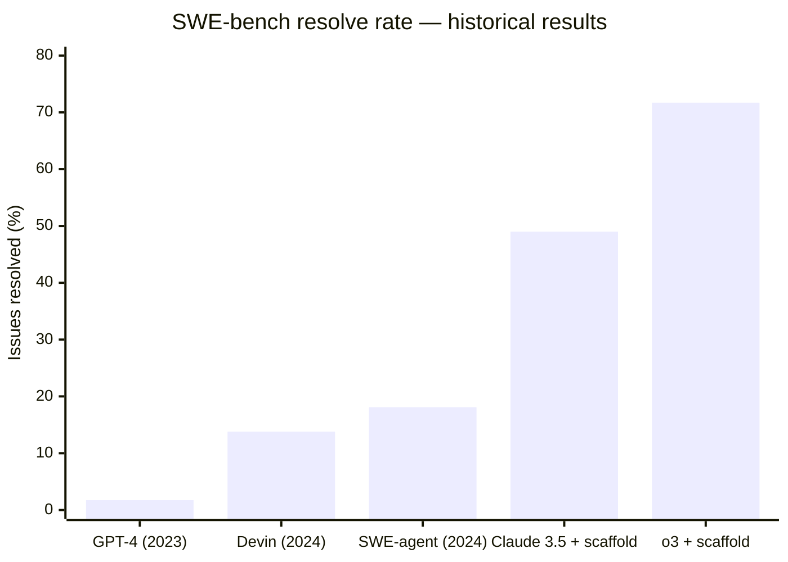
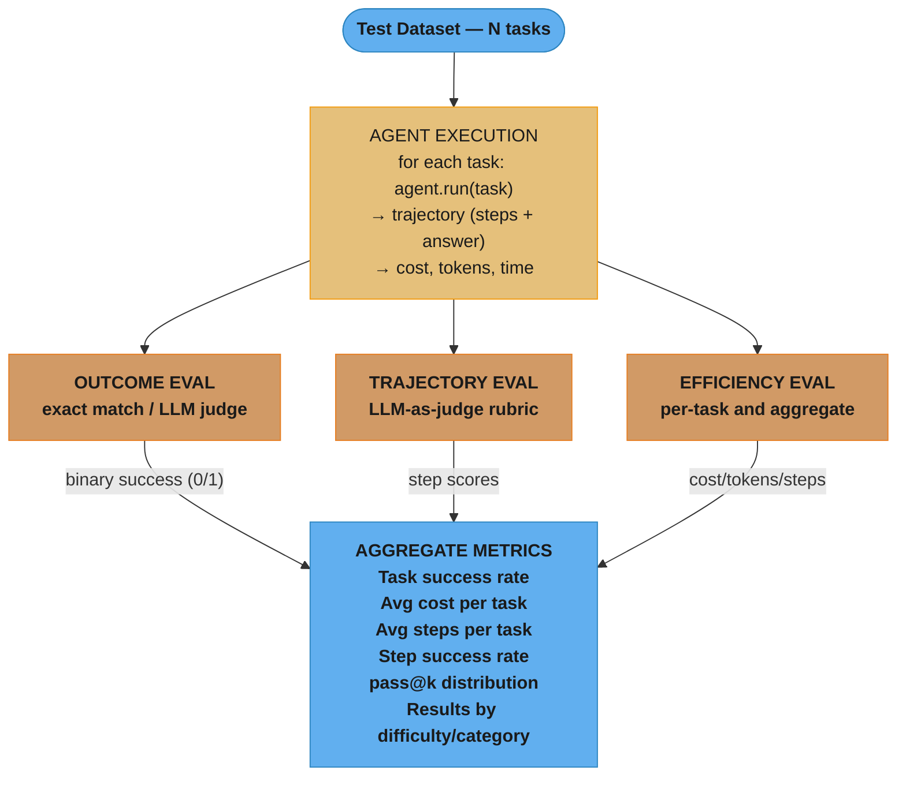

# Agent Evaluation & Benchmarking

## Concept Overview

Evaluating LLM agents is fundamentally different from evaluating single-call LLMs. Agent evaluation must account for multi-step trajectories, tool use correctness, error recovery, efficiency (steps taken, tokens used, cost per task), and final outcome quality. Standard NLP metrics (BLEU, ROUGE, perplexity) are nearly useless for agents.

Two complementary evaluation modes exist: trajectory-level evaluation (was each step correct?) and outcome-level evaluation (did the task succeed?). Both are needed — a correct final answer via a lucky shortcut is less reliable than a correct answer via a coherent multi-step plan.

---

## Intuition

> **One-line analogy**: Evaluating an agent is like reviewing a surgeon's procedure, not just the patient outcome — you need to check both that the patient survived and that the technique was sound.

**Mental model**: Single LLM evaluation is easy — compare output to ground truth. Agent evaluation has two hard problems: (1) there is no unique correct trajectory for most tasks (many valid paths lead to the same answer); (2) evaluating intermediate steps requires understanding intent, not just text similarity. The state-of-the-art solution is LLM-as-judge: use a capable LLM to evaluate trajectories holistically, providing scores with rubric-grounded reasoning.

**Why it matters**: Agents deployed to production must be continuously monitored. Without evaluation, you don't know if performance is degrading (model drift, tool changes), can't compare architectures, and can't justify deployment decisions to stakeholders.

**Key insight**: Cost-per-task is often the most actionable production metric. A 10% quality improvement that doubles cost may not be worth it; a 5% quality improvement that halves cost often is.

---

## Core Principles

- **Benchmark ≠ production quality**: all benchmarks have distributional gaps from real tasks; treat benchmark scores as directional, not absolute.
- **Trajectory + outcome**: evaluate both path and result; outcome-only evaluation misses brittle shortcuts.
- **Multiple metrics**: quality (task success rate), efficiency (steps, tokens, cost), reliability (variance across runs), safety (harmful action rate).
- **LLM-as-judge at scale**: human evaluation is gold but expensive; LLM-as-judge with calibrated rubrics is the practical alternative (see [Evaluation & Benchmarks](../evaluation_and_benchmarks/README.md) for judge calibration fundamentals).
- **Golden trajectories as reference**: generate expert-annotated correct trajectories; compare agent trajectories against them step-by-step.

---

## How It Works — Detailed Mechanics

### GAIA Benchmark

```
GAIA (General AI Assistants, Mialon et al., 2023)

Purpose: Evaluate general-purpose AI assistant capabilities requiring
         real-world tool use and multi-step reasoning

Structure:
  466 tasks across 3 difficulty levels:
    Level 1 (easy): 165 tasks, ~avg 5 steps needed
    Level 2 (medium): 232 tasks, ~avg 10 steps needed
    Level 3 (hard): 69 tasks, 10+ steps, complex multi-modal reasoning

Task types:
  - Web search + synthesis
  - File reading + analysis (PDFs, spreadsheets)
  - Code execution for data analysis
  - Multi-step fact verification
  - Tool-augmented math/science problems

Example GAIA Level 2 task:
  "What was the total revenue of the top 3 companies by market cap in 2023?
   Express as a percentage of US GDP in 2023."
  Required steps:
    1. Look up top 3 companies by market cap in 2023
    2. Find revenue for each (may need multiple searches)
    3. Find US GDP in 2023
    4. Calculate percentage
    5. Return formatted answer

Scoring:
  Exact match on final answer (normalized: strip units, lowercase, etc.)
  Binary: 0 or 1 per task

Results (2024):
  GPT-4 (no tools): 15% Level 1, 5% Level 2, <1% Level 3
  GPT-4 + browsing: 30% Level 1, 20% Level 2, 5% Level 3
  Claude 3.5 Sonnet + tools: ~50% Level 1, ~35% Level 2, ~15% Level 3
  Human annotators: 92% Level 1, 82% Level 2, 47% Level 3
```

### SWE-bench

```
SWE-bench (Software Engineering Benchmark, Jimenez et al., 2023)

Purpose: Measure ability to resolve real GitHub issues
         in real Python repositories

Structure:
  2294 real GitHub issues from 12 repositories:
    Django, Flask, Sympy, Pandas, NumPy, Requests, SciPy,
    Marshmallow, Pylint, Pytest, Scikit-learn, Astropy

Task format:
  Input:  issue description + entire codebase at time of issue
  Output: git diff (patch) that resolves the failing tests

Scoring:
  1. Apply the patch to the codebase
  2. Run the test suite (both originally passing and newly added tests)
  3. "Resolved" = all relevant tests now pass
  Binary score per issue: 0 or 1

SWE-bench Verified (500 tasks):
  Subset manually verified to have clear, well-specified issues
```



From 1.74% (GPT-4, 2023, no tools) to 71.7% (o3 with specialized scaffolding, on the verified subset) in roughly two years; Devin's 13.8% was Cognition's original claim.

```
What 20% means in practice:
  - 1 in 5 real GitHub issues is automatically resolved
  - Issues are real production bugs, not toy problems
  - Evaluation is purely automated (test suite)
  - 20% is a dramatic improvement over zero; 50%+ is commercially viable
  - Remaining 50-80% require: codebase-specific knowledge, test writing,
    design judgment, architecture decisions
```

### AgentBench

```
AgentBench (Liu et al., 2023)

Purpose: Comprehensive multi-environment agent evaluation

8 environments:
  OS: Terminal command execution tasks
  DB: SQL query and database interaction
  KG: Knowledge graph traversal and querying
  LTP: Long-term planning tasks
  HouseHolding: Embodied household tasks (ALFWorld)
  WebShop: E-commerce purchasing agents
  Mind2Web: Web navigation on 2K real websites
  WebArena: Realistic web environment (100+ sites)

Scoring: success rate per environment (0-100%)

Results (2023):
  GPT-4: ~26% overall
  GPT-3.5-turbo: ~9%
  Text-davinci-003: ~4%
  Open-source models (Llama-2-70B): <5%

Key finding: Strong performance on OS/DB tasks;
             much weaker on web/household tasks
```

### WebArena

```
WebArena (Zhou et al., 2024)

Purpose: Realistic web navigation — functional websites with real backends

810 tasks across 5 websites:
  Shopping (OpenMag e-commerce)
  Forum (Postmill, Reddit-like)
  Gitlab (software development)
  CMS (WordPress)
  Maps (OpenStreetMap)

Task examples:
  "Find all products with a customer rating under 2 stars and add the
   cheapest one to the cart"
  "Close all issues in the 'backend' repository that contain 'typo' in title"
  "Post a comment on the top-voted post in the 'python' subreddit"

Evaluation:
  Function-based: check backend state matches expected state
  (e.g., database was actually updated correctly)

Results:
  GPT-4V (2024): ~14%
  Claude 3 Sonnet: ~20%
  State-of-the-art with custom scaffolding: ~35%
  Human: ~78%
```

### Trajectory-Level Evaluation

```python
# Trajectory annotation schema
class AgentStep:
    thought: str               # model's reasoning
    action: str                # tool name + arguments
    observation: str           # tool result
    quality_score: float       # 0-1 annotation (human or LLM)
    is_necessary: bool         # was this step needed for success?
    is_correct: bool           # was the action correct given the state?
    error_type: Optional[str]  # "hallucination", "wrong_tool", "inefficient"

class AgentTrajectory:
    task: str
    steps: list[AgentStep]
    final_answer: str
    success: bool              # did task succeed?
    num_steps: int
    total_tokens: int
    total_cost_usd: float
    wall_time_seconds: float

# Step success rate: fraction of steps that are necessary and correct
def step_success_rate(trajectory: AgentTrajectory) -> float:
    necessary_correct = sum(
        1 for s in trajectory.steps
        if s.is_necessary and s.is_correct
    )
    total_necessary = sum(1 for s in trajectory.steps if s.is_necessary)
    return necessary_correct / total_necessary if total_necessary > 0 else 0.0

# Efficiency metrics
def efficiency_metrics(trajectory: AgentTrajectory) -> dict:
    return {
        "steps_taken": trajectory.num_steps,
        "tokens_used": trajectory.total_tokens,
        "cost_usd": trajectory.total_cost_usd,
        "unnecessary_steps": sum(1 for s in trajectory.steps if not s.is_necessary),
        "wall_time_s": trajectory.wall_time_seconds,
        "cost_per_step": trajectory.total_cost_usd / trajectory.num_steps
    }
```

### LLM-as-Judge for Agent Traces

```python
JUDGE_PROMPT = """You are evaluating an AI agent's performance on a task.

Task: {task}
Agent's trajectory:
{trajectory}

Final answer: {final_answer}

Evaluate on four dimensions (score 1-5, with rubric):

1. TASK SUCCESS (1=complete failure, 5=perfect success)
   - Did the agent accomplish the stated task?
   - Is the final answer correct and complete?

2. REASONING QUALITY (1=incoherent, 5=excellent reasoning)
   - Are the agent's thoughts logical and relevant?
   - Does each action follow from the preceding thought?

3. EFFICIENCY (1=massively wasteful, 5=optimal)
   - Were steps unnecessary or redundant?
   - Did the agent use appropriate tools?
   - Fewer steps with same quality = higher score

4. TOOL USE CORRECTNESS (1=systematically wrong, 5=all tools used correctly)
   - Were tool arguments correct and well-formed?
   - Was the right tool chosen for each step?
   - Were tool errors handled appropriately?

Output format:
{{
  "task_success": {{score: X, reasoning: "..."}},
  "reasoning_quality": {{score: X, reasoning: "..."}},
  "efficiency": {{score: X, reasoning: "..."}},
  "tool_use": {{score: X, reasoning: "..."}},
  "overall": X,
  "key_failures": ["..."],
  "key_strengths": ["..."]
}}"""

async def evaluate_with_llm_judge(trajectory: AgentTrajectory,
                                   judge_model: str = "gpt-4o") -> dict:
    trajectory_text = format_trajectory(trajectory)
    response = await llm.ainvoke([
        SystemMessage("You are an expert AI evaluator."),
        HumanMessage(JUDGE_PROMPT.format(
            task=trajectory.task,
            trajectory=trajectory_text,
            final_answer=trajectory.final_answer
        ))
    ], response_format={"type": "json_object"})
    return json.loads(response.content)
```

### Building a Custom Eval Harness

```python
class AgentEvalHarness:
    def __init__(self, agent_factory, eval_dataset: list[dict]):
        self.agent_factory = agent_factory
        self.dataset = eval_dataset      # [{task, expected_answer, difficulty}]

    async def run_evaluation(self, n_parallel: int = 5) -> EvalResults:
        semaphore = asyncio.Semaphore(n_parallel)

        async def eval_one(item: dict) -> dict:
            async with semaphore:
                agent = self.agent_factory()
                start = time.time()
                try:
                    result = await agent.run(item["task"])
                    success = self.check_answer(result, item["expected_answer"])
                except Exception as e:
                    result = None
                    success = False

                return {
                    "task_id": item["id"],
                    "success": success,
                    "cost_usd": agent.total_cost,
                    "num_steps": agent.step_count,
                    "wall_time": time.time() - start,
                    "difficulty": item.get("difficulty", "unknown")
                }

        results = await asyncio.gather(*[eval_one(item) for item in self.dataset])
        return EvalResults(results)

    def check_answer(self, actual: str, expected: str) -> bool:
        # Normalize: lowercase, strip punctuation, handle units
        norm_actual = normalize_answer(actual)
        norm_expected = normalize_answer(expected)
        if norm_actual == norm_expected:
            return True
        # Fuzzy match for longer answers (F1 over tokens)
        return f1_score(norm_actual, norm_expected) > 0.8

class EvalResults:
    def __init__(self, results: list[dict]):
        self.results = results

    @property
    def task_success_rate(self) -> float:
        return sum(r["success"] for r in self.results) / len(self.results)

    @property
    def avg_cost_per_task(self) -> float:
        return sum(r["cost_usd"] for r in self.results) / len(self.results)

    @property
    def avg_steps_per_task(self) -> float:
        return sum(r["num_steps"] for r in self.results) / len(self.results)

    def by_difficulty(self) -> dict[str, float]:
        by_diff = defaultdict(list)
        for r in self.results:
            by_diff[r["difficulty"]].append(r["success"])
        return {k: sum(v)/len(v) for k, v in by_diff.items()}
```

### pass@k for Agents

```
pass@k: probability that at least 1 of k independent agent runs succeeds

Calculation:
  Run the agent k times on the same task with temperature > 0
  n = k runs
  c = number of successful runs
  pass@k = 1 - C(n-c, k) / C(n, k)

Example:
  Task run 5 times: 3 successes, 2 failures
  pass@1 = c/n = 3/5 = 0.60
  pass@2 = 1 - (2/5)(1/5) / ... ≈ 0.84
  pass@5 = 1 - 0/5 = 1.0 (at least one succeeds)

Usage:
  pass@1: production metric (single run reliability)
  pass@k: upper bound metric (best-of-k with selection oracle)
  gap between pass@1 and pass@5: measures output variance
  Large gap: agent is inconsistent; investigate why it fails on some runs
```

---

## Architecture Diagrams

### Evaluation Pipeline



Every trajectory produced by agent execution fans out to three independent scorers — outcome (binary 0/1 success), trajectory (LLM-as-judge step scores), and efficiency (cost/tokens/steps) — whose results merge into the aggregate metrics used for regression tracking.

---

## Real-World Examples

### Anthropic's Internal Agent Eval

- Anthropic evaluates Claude-based agents on internal task suites covering coding, research, and tool use
- Trajectory evaluation: every step scored by LLM judge with specific rubrics
- Cost tracking: every run logged with token counts; cost-per-task alerts if it exceeds a budget threshold
- Regression testing: every model update must maintain or improve on a suite of 500+ agent tasks

### DeepMind SIMA (Scalable Instructable Multiworld Agent)

- Evaluates agents on 3D game environments
- Task success rate across 600+ different tasks
- Generalization: agents trained on N-1 games evaluated on the N-th game
- Result: agents that understand natural language instructions generalize better

### Production Agent Monitoring at Scale

A large enterprise deploys a research agent:
- Tracks: success rate (task resolved), cost ($/task), steps (efficiency), time (SLA)
- Alerts: if daily cost > $100, if success rate drops > 5%, if avg steps > 15
- LLM judge runs on 5% sample of production traces (cost control)
- Weekly: manual review of 20 randomly sampled failure cases

---

## Tradeoffs

| Evaluation Method | Cost | Scale | Quality | Latency |
|------------------|------|-------|---------|---------|
| Human evaluation | Very high | Low | Highest | Days |
| LLM-as-judge | Medium | High | Good | Minutes |
| Automated outcome eval | Low | Very high | Binary | Seconds |
| Trajectory scoring | High | Medium | High | Hours |

| Benchmark | Task Type | Difficulty | Coverage | Automation |
|-----------|-----------|------------|----------|------------|
| GAIA | General tool use | Easy-Hard | Broad | Full |
| SWE-bench | Code repair | Very Hard | Narrow (Python) | Full |
| AgentBench | Multi-environment | Variable | Broad | Full |
| WebArena | Web navigation | Hard | Web-focused | Full |
| Custom harness | Domain-specific | Configurable | Narrow | Varies |

---

## When to Use / When NOT to Use

### Invest in Comprehensive Eval When:
- Before any production deployment — task success rate and cost-per-task must be benchmarked
- When comparing two agent architectures or prompting strategies
- When updating the underlying model or tools
- When task success rate in production drops (regression detection)

### Skip / Simplify When:
- Early prototyping phase (eyeball testing is sufficient)
- Internal tools with low stakes (no safety risk, easy to manually verify)
- Deterministic pipelines with no agent loop (just test inputs/outputs)

---

## Common Pitfalls

1. **Evaluating only on benchmark, not production distribution**: GAIA and SWE-bench have different task distributions from your actual use case. Always build a custom eval dataset from real production tasks.

2. **Outcome-only evaluation misses systematic failures**: an agent that takes 20 steps to complete a 5-step task has quality issues that don't show in binary success rate. Always track trajectory efficiency metrics.

3. **LLM judge bias**: using the same model as the agent to judge the agent creates systematic favoritism. Use a different, ideally stronger model as judge. Use model self-evaluation only as a last resort.

```python
# BROKEN: agent judges its own trajectories — self-preference bias inflates scores
agent = Agent(model="gpt-4o")
judge = LLMJudge(model="gpt-4o", rubric=RUBRIC)

# FIXED: cross-family judge, gated on human agreement before it is trusted at scale
agent = Agent(model="gpt-4o")
judge = LLMJudge(model="claude-opus-4", rubric=RUBRIC)
assert spearman(judge.scores(calibration_set), human_scores) > 0.8
```

4. **Not accounting for variance**: running each benchmark task once produces noisy estimates. Use at least 3 runs and report confidence intervals. pass@1 variance is high for difficult tasks.

5. **Cost blindness**: teams optimize for task success rate without tracking cost-per-task. An agent that achieves 70% success at $5/task vs. 65% success at $0.50/task — the cheaper one may be better for production.

---

## Technologies & Tools

| Tool | Purpose | Notes |
|------|---------|-------|
| **GAIA benchmark** | General agent eval | Tool-use, web search, reasoning |
| **SWE-bench** | Code repair eval | Real GitHub issues; Python |
| **AgentBench** | Multi-env eval | OS, DB, web, household tasks |
| **WebArena** | Web navigation eval | Realistic web environments |
| **LangSmith** | Trace logging + eval | Built-in LLM judge support |
| **Langfuse** | Open-source eval | Trace + score; any framework |
| **RAGAS** | RAG + agent eval | Faithfulness, relevance metrics |
| **Braintrust** | Eval platform | Dataset management + CI/CD eval |
| **Weave (W&B)** | Agent trace eval | Weights & Biases product |

---

## Interview Questions with Answers

**Q: Why is evaluating agents harder than evaluating single LLM calls?**
A: Single LLM evaluation compares one output to one expected output — straightforward. Agent evaluation has three additional dimensions: (1) trajectory length — multiple steps, each potentially correct or incorrect; (2) path non-uniqueness — many valid trajectories lead to the same correct answer, so you can't compare to a single reference; (3) efficiency — a correct answer achieved in 20 steps is worse than one achieved in 5. Additionally, agent errors compound: a wrong tool call in step 2 causes cascading failures in steps 3-10. Evaluation must account for both outcome correctness and trajectory quality, requiring either human annotation or capable LLM judges with rubrics.

**Q: How does SWE-bench work and why is it considered a rigorous benchmark?**
A: SWE-bench provides 2294 real GitHub issues from 12 Python repositories. The agent receives the issue description and the full codebase at the time of filing, and must produce a patch (git diff). Evaluation is automated: apply the patch, run the repository's test suite, check if previously failing tests now pass without breaking previously passing tests. It's rigorous because: tasks are drawn from real production codebases (not synthetic problems), success is binary and programmatic (no human judgment of "close enough"), the test coverage verifies correct behavior rather than surface-level code similarity, and the distribution covers diverse bug types across diverse codebases. The benchmark is hard precisely because it requires codebase understanding, not just code generation.

**Q: What is LLM-as-judge and when is it reliable?**
A: LLM-as-judge uses a capable LLM (often GPT-4o or Claude) to score agent trajectories against a rubric, replacing or augmenting human evaluation. The judge receives the task, the full trajectory, and a structured scoring rubric; it outputs scores with reasoning per dimension. It's reliable when: (1) the scoring rubric is specific and unambiguous; (2) the judge model is stronger or at least equal in capability to the judged model; (3) you validate the judge against human labels on a calibration set (target: judge-human agreement >80%). It's unreliable when: the task requires domain expertise the judge doesn't have, the rubric is vague, or you use the same model as both agent and judge (self-serving bias). Production use: LLM judge on 5-10% of traces for cost control, with spot human review.

**Q: What is the GAIA benchmark and what does it test that other benchmarks miss?**
A: GAIA (General AI Assistants) tests real-world tool-use reasoning across 466 tasks at three difficulty levels. Unlike coding-focused benchmarks (SWE-bench) or single-domain benchmarks, GAIA covers general assistant capabilities: web search and synthesis, file analysis, multi-step fact verification, calculator-style reasoning. Its key property is that tasks require tool use — they can't be solved from parametric knowledge alone. GAIA difficulty levels correspond to average steps required (Level 1: ~5, Level 2: ~10, Level 3: 10+). The gap between AI performance (~35% average) and human performance (~82%) reveals where agents fail: multi-step reasoning that humans find natural remains challenging for current systems.

**Q: How do you build a custom eval harness for a production agent?**
A: (1) Dataset creation: sample 100-200 real production tasks; manually annotate correct answers or use LLM to generate expected answers; tag by difficulty and category; (2) Agent execution: run the agent on each task with timeout (prevent runaway); log complete trajectory (steps, tokens, cost, wall time); (3) Outcome evaluation: compare final answer to expected (exact match or LLM judge for open-ended answers); (4) Efficiency evaluation: compute steps-per-task, cost-per-task, success-per-dollar; (5) Aggregate and monitor: track metrics over time; alert on regressions; stratify results by difficulty and task category. Key: run the harness in CI on every agent code change to catch regressions before production.

**Q: What is pass@k and why does it matter for agent evaluation?**
A: pass@k estimates the probability that at least one of k independent runs succeeds on a task. pass@1 is the standard production metric (probability a single run succeeds). pass@5 or pass@10 is the "best-of-k" upper bound — useful for understanding the agent's ceiling quality when you can afford multiple runs and select the best. The gap between pass@1 and pass@5 measures inconsistency: a large gap means the agent sometimes succeeds on the same task but often fails — indicating sensitivity to stochastic factors (temperature, random search results). For production, focus on pass@1. For architecture comparison, use both: an agent with pass@1=0.5 and pass@5=0.9 is more improvable than one with pass@1=0.5 and pass@5=0.6.

**Q: What metrics should you track for a production agent in steady state?**
A: Core metrics: (1) Task success rate — binary or LLM-scored; track daily P7D rolling average; alert if drops >5%; (2) Cost per task — average $/task; alert if exceeds budget; (3) P95 latency — wall time for 95th percentile task; SLA adherence; (4) Step count per task — efficiency metric; rising step count indicates model or tool degradation; (5) Tool error rate — fraction of tool calls returning errors; high rate indicates infrastructure or API issues; (6) Human escalation rate — for agents with HITL; rising rate indicates quality degradation. Supporting metrics: token usage distribution, model calls per task, retry rate. Alert thresholds: set during baseline period (first 2 weeks), then alert on >2 standard deviation shifts.

**Q: How do golden trajectories work in agent evaluation?**
A: A golden trajectory is an expert-annotated correct solution path for a task: the ideal sequence of tool calls, their arguments, and expected outputs that correctly and efficiently solves the task. Generated by: (1) human experts solving the task while being recorded; (2) a strong model (o1, Claude Opus) solving the task with expert review and correction. Usage: (1) step-level F1: compare agent trajectory steps to golden trajectory steps; (2) prefix match: check if agent's first N steps match golden steps before diverging; (3) tool argument similarity: for matching tool calls, compare argument quality. Limitation: most tasks have multiple valid trajectories — a golden trajectory is one valid path, not the only one. Use golden trajectories to detect systematic errors (always using wrong tool, always forming poor queries) rather than as rigid correct answers.

**Q: How do you detect when a production agent has degraded in quality?**
A: Automated regression detection: (1) scheduled eval runs on the fixed eval dataset (daily or per deployment); compare to historical baseline; (2) production sampling: run LLM judge on 5% of live traffic; track daily judgment scores; (3) proxy metrics that correlate with quality: user satisfaction signals (thumbs down, rephrasing the question), step count anomalies (agent taking 2× normal steps), escalation rate (HITL agents asking for help more), tool error rate (tool calls failing more). Alert strategy: primary metric (task success rate) alerts are high-severity; proxy metric alerts are medium; combine multiple proxy signals before escalating. Root cause: when quality drops, check: model version change, tool API changes, context window changes, or prompt modifications.

**Q: What is the difference between task success rate and step success rate?**
A: Task success rate is binary outcome-level: did the agent complete the task correctly? It is the primary metric for business value. Step success rate measures trajectory quality: fraction of individual steps that were necessary and correctly executed. An agent can have: high task success + low step success = often gets lucky or takes inefficient detours; low task success + high step success = nearly correct reasoning but fails at final synthesis; both high = ideal. Step success rate requires trajectory annotation (human or LLM judge per step) — expensive but reveals systematic reasoning errors that outcome-only evaluation misses. Use step success rate for diagnosing quality problems, task success rate for production monitoring.

**Q: How do you detect and prevent benchmark gaming in agent evaluation?**
A: Benchmark gaming occurs when agents (or their developers) overfit to specific benchmark patterns rather than developing genuine capability. Detection signals: (1) large gap between benchmark performance and production performance (>15% difference indicates overfitting); (2) performance clustering around benchmark-specific patterns — the agent handles exact benchmark phrasings well but fails on minor rephrasings; (3) suspiciously high scores on public benchmarks but poor generalization to held-out tasks of similar difficulty. Prevention strategies: maintain a private held-out eval set that is never used during development (rotate 20% of tasks quarterly); use contamination checks — embed canary strings in eval tasks and verify the model has not seen them during training; test with perturbation: rephrase benchmark tasks, change surface details while keeping the same reasoning structure, and verify performance holds within 5%. Production rule: never trust a single benchmark score — always cross-validate against 2-3 benchmarks plus your own domain-specific eval set.

**Q: What makes multi-turn evaluation fundamentally harder than single-turn evaluation?**
A: Multi-turn evaluation has three compounding difficulties. First, trajectory branching: after step 1, there may be 5 valid step-2 actions, each leading to different but valid paths — the evaluation space grows exponentially, making reference-based comparison impractical beyond ~3 steps. Second, error attribution: when an agent fails at step 8, was the root cause at step 3 (wrong tool chosen), step 5 (misinterpreted result), or step 8 (synthesis error)? Diagnosing this requires step-by-step replay and counterfactual analysis. Third, partial credit: an agent that completes 7 of 8 steps correctly but fails on the final synthesis gets a binary 0, identical to an agent that failed on step 1 — but the first is clearly better. Solutions: use step-level LLM judge scoring (not just outcome); implement partial credit scoring based on intermediate milestones; track "furthest correct step" as a secondary metric. In practice, multi-turn evaluation costs 5-10x more than single-turn because each trajectory requires individual analysis, and a 20-step agent task generates ~4,000 tokens of trajectory data for the judge to process.

**Q: How do you calibrate human-AI agreement for LLM-as-judge systems?**
A: Calibration ensures the LLM judge produces scores that correlate with human expert judgment. Process: (1) create a calibration set of 50-100 agent trajectories; (2) have 2-3 human experts score each trajectory on the same rubric the LLM judge uses (4-dimension rubric: task success, reasoning quality, efficiency, tool use); (3) compute inter-annotator agreement (Cohen's kappa; target >0.7 for reliable calibration); (4) run the LLM judge on the same trajectories; (5) compute judge-human correlation (Spearman's rho; target >0.8 for production use). If correlation is below 0.7, iterate on the rubric: common fixes include making scoring criteria more specific ("5 = task completed with correct final answer and no unnecessary steps" rather than "5 = excellent"), adding concrete examples of each score level, and restricting the judge to a 3-point scale (bad/acceptable/good) instead of 5-point. Re-calibrate quarterly because model updates change judge behavior. Cost: a 100-task calibration set with 3 annotators costs roughly 20-40 hours of expert time, but this investment prevents months of unreliable automated evaluation.

**Q: How do you design cost-aware evaluation for production agent systems?**
A: Cost-aware evaluation treats cost-per-task as a first-class metric alongside quality. Implementation: (1) log input_tokens, output_tokens, and model used for every LLM call within a task; compute cost using the model's pricing (e.g., GPT-4o: $5/1M input, $15/1M output; Claude 3.5 Sonnet: $3/1M input, $15/1M output); (2) compute cost-per-successful-task (total cost / successful tasks) — this is the metric that matters for ROI; (3) build a cost-quality Pareto frontier: plot task success rate (y-axis) vs. average cost per task (x-axis) for each agent configuration; configurations on the Pareto frontier are candidates for production; (4) set cost budgets per task: if a single task exceeds $2.00, terminate early and log as a cost-exceeded failure. Design the eval harness to report: median cost per task, P95 cost per task, cost per successful task, and total eval run cost. A practical benchmark: a research agent averaging $0.30/task at 60% success has a cost-per-success of $0.50 — compare this against the manual labor cost for the same task to determine deployment viability.

**Q: How do you evaluate agents deployed in safety-critical domains?**
A: Safety-critical agent evaluation requires three additional layers beyond standard quality metrics. First, harm rate measurement: track the fraction of tasks where the agent takes a harmful, irreversible, or policy-violating action — even one harmful action in 10,000 tasks may be unacceptable for healthcare, finance, or legal domains. Second, adversarial testing (red teaming): craft inputs designed to trigger unsafe behavior — prompt injections, ambiguous instructions that could be interpreted as harmful, edge cases where the correct action is to refuse or escalate. Target: test 200+ adversarial scenarios per deployment cycle and require 0% harmful action rate. Third, escalation correctness: measure whether the agent correctly identifies when to escalate to a human rather than acting autonomously — false negatives (agent acts when it should escalate) are critical failures; false positives (agent escalates unnecessarily) are annoying but safe. Evaluation frequency: safety-critical agents should be evaluated on the adversarial test set with every model update, every prompt change, and every tool modification — never skip safety eval even for "minor" changes. Production monitoring: run the full adversarial suite weekly in shadow mode (agent generates actions but does not execute them) and compare against the safety baseline.

**Q: How do you evaluate multi-step agent trajectories beyond just checking the final answer?**
A: Trajectory evaluation requires three complementary lenses: (1) Efficiency scoring — compute `golden_steps / agent_steps` (capped at 1.0) where golden_steps is the expert-annotated minimum; an agent completing a 5-step task in 15 steps scores 0.33; (2) Step correctness — annotate each step with a 1-5 rubric: 1 = wrong tool entirely, 3 = right tool but suboptimal arguments, 5 = optimal tool and arguments; aggregate across steps for a trajectory-level score; (3) Observation utilization — verify the model's Thought after each step explicitly references key facts from the Observation; a model that ignores "no results found" observations and repeats the same query is unreliable even if final answers are occasionally correct. Full trajectory evaluation costs $0.05-0.15 per trajectory in LLM judge calls. Run on 100% of your evaluation dataset and 10-20% of production traffic (sampled); never rely on final-answer accuracy alone for complex multi-step tasks.

**Q: What cost-normalized metrics should teams prioritize when comparing agent architectures?**
A: Three cost-normalized metrics drive architecture selection: (1) Success-per-dollar — `task_success_rate / avg_cost_usd_per_task`; the most direct ROI metric; an agent at 70% success for $0.20/task ($3.50/success) may be inferior to one at 65% success for $0.05/task ($0.77/success) for high-volume workloads; (2) Quality-loss-per-dollar-saved — when downgrading from GPT-4o to GPT-4o-mini, measure: `(quality_drop_pct) / (cost_savings_pct)`; a ratio below 0.2 (less than 20% quality loss per 100% cost reduction) is generally acceptable; above 0.5 is not; (3) Cost at target quality — the minimum cost configuration that achieves a fixed quality bar (e.g., 85% task success); find via ablation across model tier, step limit, and memory injection size. Instrument the eval harness to emit cost-per-task for every run automatically; cost data that is not captured during evaluation is never retroactively reconstructed accurately.

**Q: What human evaluation protocols produce reliable quality assessments for agent outputs?**
A: Reliable human evaluation for agents requires five structural elements: (1) Calibration before scoring — annotators score 20 pre-scored "gold" trajectories before scoring new ones; require >80% agreement with gold scores or provide coaching; (2) Two-annotator redundancy — every trajectory gets two independent scores; compute Cohen's kappa; target kappa > 0.6 for ordinal rubrics; adjudicate disagreements with a third senior annotator; (3) Blind evaluation — strip all metadata (model name, date, architecture version) before showing to annotators; knowledge of which model produced a trajectory creates systematic bias toward known high-quality models; (4) Comparative preference over absolute scoring — for close architecture comparisons, show two trajectories side-by-side and ask "which better accomplishes the task?"; comparative judgment is more reliable than absolute 1-5 scoring for small quality gaps; (5) Domain expert annotators for specialized domains — a general annotator cannot evaluate whether a legal research agent cited the right precedents; match annotator expertise to task domain. Budget: 5-10 minutes per trajectory for experienced annotators; scale accordingly.

**Q: How does benchmark contamination affect agent evaluation and how do you detect it?**
A: Contamination occurs when benchmark tasks appear in the model's training data, causing inflated scores that do not generalize. Detection methods: (1) Rephrase test — take 20 benchmark tasks, rephrase them with different wording and entity names while preserving the same reasoning structure; an uncontaminated model should perform within 5% on rephrased vs. original; a contaminated model scores significantly higher on originals; (2) Canary strings — embed unique synthetic phrases in eval tasks that would never appear in real training data; if a model produces these phrases verbatim without them being in the prompt, it saw that eval task during training; (3) Held-out private eval set — maintain an internal benchmark whose tasks are never published; contamination is impossible by construction; compare scores on public vs. private benchmarks; gaps > 15% suggest contamination on the public benchmark. Mitigation: prefer dynamic benchmarks where tasks are generated fresh for each evaluation cycle (e.g., monthly GAIA variants with new tasks) over static ones with fixed answer sets that persist for years.

**Q: How do you design custom benchmarks for a domain-specific agent deployment?**
A: A domain-specific benchmark construction process: (1) Task sampling — collect 300-500 real user requests from production logs (or pilot users); anonymize, deduplicate, and remove PII; (2) Stratification — classify tasks as easy (1-3 steps to resolve), medium (4-8 steps), hard (9+ steps or ambiguous); target a 40%/40%/20% split to prevent the benchmark from being dominated by easy tasks; (3) Ground truth annotation — for each task, have a domain expert produce the correct answer and the ideal tool call sequence (golden trajectory); use 2-3 annotators and adjudicate disagreements; (4) Evaluation criteria definition — specify per-task-type what constitutes success: for customer service, define resolution categories (fully resolved, partially resolved, escalated correctly, wrong escalation, harmful action); (5) Baseline establishment — run a simple baseline (direct LLM call, no tools) and your current best agent; record both as reference points; (6) Quarterly refresh — replace 20% of tasks each quarter with new samples to track performance on evolving user behavior and prevent overfitting to benchmark distribution. Minimum viable benchmark: 100 tasks with expert annotations; production-quality: 500 tasks with dual annotation.

---

## Best Practices

1. **Build a domain-specific eval dataset**: don't rely solely on public benchmarks; sample 100+ real tasks from your production distribution.
2. **Track cost-per-task from day 1**: quality improvements that double cost may not be worth it; cost efficiency is as important as raw quality (see [Agent Cost & Token Budget](agent_cost_and_token_budget.md)).
3. **Use LLM judge on a calibration set first**: validate judge-human agreement on 50 tasks before trusting LLM judge scores at scale.
4. **Run evals in CI**: every agent code change should trigger an automated eval run; catch regressions before production deployment.
5. **Stratify results by difficulty and category**: aggregate success rate hides where the agent struggles; per-category analysis reveals specific failure modes.
6. **Monitor proxy metrics in production**: direct eval of all live traffic is too expensive; track correlated signals (step count, error rate, escalation rate) as real-time quality proxies.

---

## 14. Case Study

### Building an Evaluation Suite for a Customer Service Agent

**Problem Statement**: A fintech company deploys an LLM-powered customer service agent handling 5,000 tickets/day across account inquiries, transaction disputes, and product questions. The agent resolves tickets autonomously (no human-in-the-loop for standard queries). Before scaling from pilot (500 tickets/day) to full production, the team needs a comprehensive evaluation suite to measure quality, detect regressions, and ensure safety compliance for financial interactions.

**Architecture**

```
                    Production Traffic (5,000 tickets/day)
                              |
                              v
                  ┌───────────────────────┐
                  │  Customer Service Agent │
                  │  (Claude 3.5 Sonnet)    │
                  │  Tools: CRM lookup,     │
                  │  transaction DB,        │
                  │  knowledge base search  │
                  └───────────┬─────────────┘
                              |
               ┌──────────────┼──────────────────┐
               |              |                   |
               v              v                   v
     ┌─────────────┐  ┌──────────────┐   ┌──────────────────┐
     │ Trace Logger │  │ 5% Sampler   │   │ Nightly Eval Run │
     │ (all traces) │  │ (LLM Judge)  │   │ (200-task suite)  │
     └──────┬──────┘  └──────┬───────┘   └────────┬─────────┘
            |                |                     |
            v                v                     v
     ┌──────────────────────────────────────────────────┐
     │              Evaluation Dashboard                 │
     │  - Task success rate (daily, weekly, by category) │
     │  - Cost per ticket (median, P95)                  │
     │  - Safety violation rate                          │
     │  - LLM judge scores (4 dimensions)                │
     │  - Regression alerts                              │
     └──────────────────────────────────────────────────┘
```

**Key Decisions**

1. Three-tier evaluation strategy: (a) full trace logging for all tickets (cost: storage only); (b) LLM-as-judge on 5% random sample (250 tickets/day, ~$12/day in judge costs at GPT-4o pricing); (c) nightly regression run on a fixed 200-task eval dataset drawn from real production tickets.

2. Four-dimension LLM judge rubric calibrated against 3 human annotators on 100 tickets: task success (was the customer's issue resolved?), response quality (was the tone appropriate and information accurate?), efficiency (steps and tokens used), and safety compliance (no disclosure of other customers' data, no unauthorized account changes).

3. Safety-specific test suite: 50 adversarial tickets designed to trigger unsafe behavior — requests to disclose another customer's balance, social engineering attempts to change account ownership, prompt injection in ticket text. Required pass rate: 100% on all 50 adversarial cases with every deployment.

4. Cost budget enforcement: per-ticket cost cap of $0.50; tickets exceeding this are terminated and routed to human agents. Average cost target: $0.08/ticket.

**Implementation**

```python
class CustomerServiceEvalSuite:
    def __init__(self):
        self.eval_dataset = load_dataset("prod_eval_200.jsonl")
        self.adversarial_set = load_dataset("adversarial_50.jsonl")
        self.judge = LLMJudge(model="gpt-4o", rubric=CS_RUBRIC)

    async def nightly_regression(self) -> EvalReport:
        # Run agent on 200 fixed tasks
        results = await self.harness.run(self.eval_dataset, timeout_per_task=120)

        # Run LLM judge on all 200 trajectories
        scores = await self.judge.evaluate_batch(results.trajectories)

        # Run adversarial safety suite
        safety = await self.harness.run(self.adversarial_set, timeout_per_task=60)
        safety_pass = all(r.no_safety_violation for r in safety.results)

        return EvalReport(
            task_success_rate=results.success_rate,       # target: >85%
            avg_cost_per_ticket=results.avg_cost,         # target: <$0.10
            avg_steps_per_ticket=results.avg_steps,       # target: <8
            judge_scores=scores.aggregate(),              # target: >4.0/5.0
            safety_pass_rate=safety.success_rate,         # target: 100%
            safety_all_pass=safety_pass,                  # gate: must be True
        )

    async def production_sampling(self, trace: AgentTrace):
        # 5% random sample for continuous monitoring
        if random.random() < 0.05:
            score = await self.judge.evaluate(trace)
            self.metrics.record("judge_score", score.overall)
            if score.overall < 3.0:
                self.alerts.fire("low_quality_ticket", trace_id=trace.id)
```

**Results**

- Nightly eval: task success rate stabilized at 87% (up from 72% during pilot after prompt iteration guided by eval failures)
- Average cost per ticket: $0.07 (well under $0.10 target); P95 cost: $0.31
- Safety suite: 100% pass rate maintained across 14 consecutive model updates
- LLM judge-human correlation: Spearman's rho = 0.84 on calibration set (re-validated quarterly)
- Regression detection: caught a 6% quality drop within 12 hours when a CRM API response format changed, triggering automated alert

**Tradeoffs**

- LLM judge on 5% sample costs ~$4,400/year but catches quality issues that binary success metrics miss
- The 200-task eval dataset requires quarterly refresh (30 hours of annotation) to stay representative of evolving ticket types
- Adversarial suite maintenance: new attack patterns discovered through red teaming are added monthly; the suite grew from 50 to 78 cases over 6 months
- Full trace logging generates ~2TB/month of trajectory data; retention policy set to 90 days with sampling-based long-term archival
