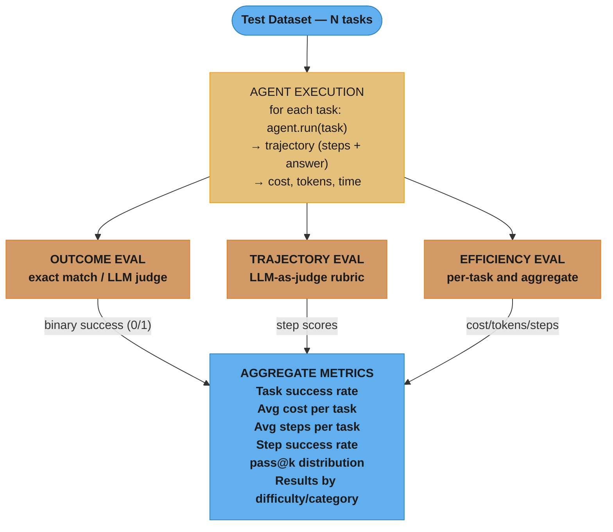
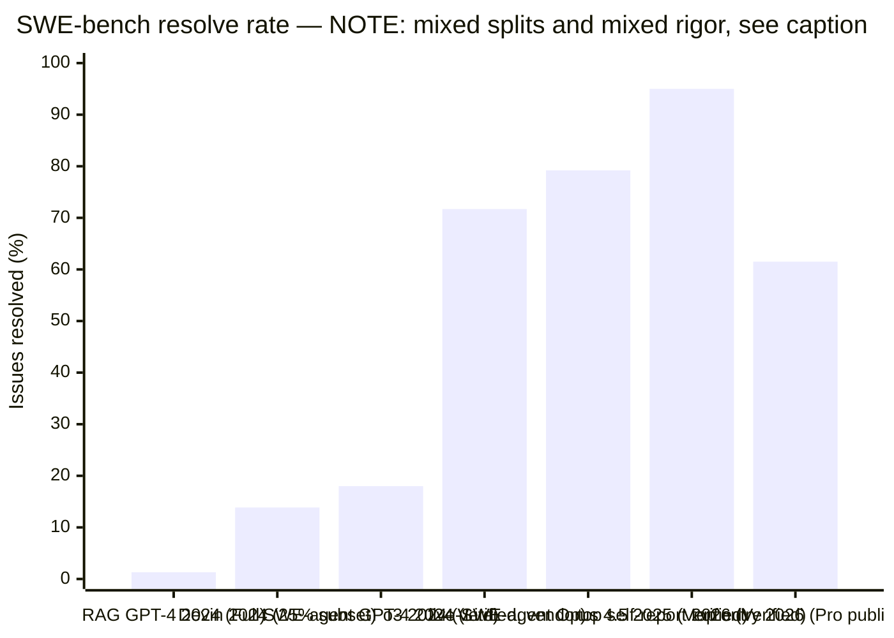
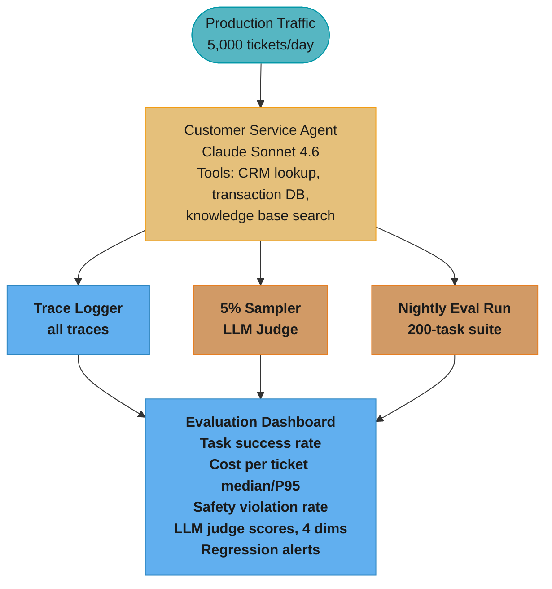

# Agent Evaluation & Benchmarking

## 1. Concept Overview

Evaluating LLM agents is fundamentally different from evaluating single-call LLMs. Agent evaluation must account for multi-step trajectories, tool use correctness, error recovery, efficiency (steps taken, tokens used, cost per task), and final outcome quality. Standard NLP metrics (BLEU, ROUGE, perplexity) are nearly useless for agents.

Two complementary evaluation modes exist: trajectory-level evaluation (was each step correct?) and outcome-level evaluation (did the task succeed?). Both are needed — a correct final answer via a lucky shortcut is less reliable than a correct answer via a coherent multi-step plan.

---

## 2. Intuition

> **One-line analogy**: Evaluating an agent is like reviewing a surgeon's procedure, not just the patient outcome — you need to check both that the patient survived and that the technique was sound.

**Mental model**: Single LLM evaluation is easy — compare output to ground truth. Agent evaluation has two hard problems: (1) there is no unique correct trajectory for most tasks (many valid paths lead to the same answer); (2) evaluating intermediate steps requires understanding intent, not just text similarity. The state-of-the-art solution is LLM-as-judge: use a capable LLM to evaluate trajectories holistically, providing scores with rubric-grounded reasoning.

**Why it matters**: Agents deployed to production must be continuously monitored. Without evaluation, you don't know if performance is degrading (model drift, tool changes), can't compare architectures, and can't justify deployment decisions to stakeholders.

**Key insight**: Cost-per-task is often the most actionable production metric. A 10% quality improvement that doubles cost may not be worth it; a 5% quality improvement that halves cost often is.

---

## 3. Core Principles

- **Benchmark ≠ production quality**: all benchmarks have distributional gaps from real tasks; treat benchmark scores as directional, not absolute.
- **Trajectory + outcome**: evaluate both path and result; outcome-only evaluation misses brittle shortcuts.
- **Multiple metrics**: quality (task success rate), efficiency (steps, tokens, cost), reliability (variance across runs), safety (harmful action rate).
- **LLM-as-judge at scale**: human evaluation is gold but expensive; LLM-as-judge with calibrated rubrics is the practical alternative (see [Evaluation & Benchmarks](../evaluation_and_benchmarks/README.md) for judge calibration fundamentals).
- **Golden trajectories as reference**: generate expert-annotated correct trajectories; compare agent trajectories against them step-by-step.

---

## 4. Types / Architectures / Strategies

Agent evaluation splits along four independent axes: **what you score** (the outcome, the
path, or the bill), **who scores it** (a program, an LLM judge, or a human), **which
benchmark family you score it on**, and **how many runs you score**. Every method in this
file is a point in that space.

### 4.1 By evaluation target

| Target | Question it answers | How it is scored | Cost |
|--------|--------------------|------------------|------|
| Outcome | Did the task succeed? | Exact match, test suite, or backend-state check | Lowest — fully automated, binary |
| Trajectory | Was each step necessary and correct? | Step annotation against a rubric or golden trajectory | Highest — one judgment per step |
| Efficiency | What did success cost? | Steps, tokens, wall time, dollars, logged per run | Near-zero once instrumented |
| Reliability | Does it succeed *every* time? | pass@k / pass^k across repeated runs | Multiplies every other cost by k |

Outcome-only evaluation is the default and the trap: it cannot separate a coherent plan
from a lucky shortcut, and it is blind to an agent that spends 20 steps on a 5-step task.
Trajectory and efficiency metrics are what make that visible.

### 4.2 By scoring mechanism

| Mechanism | Reference needed | Strength | Where it breaks |
|-----------|-----------------|----------|-----------------|
| Programmatic check | Expected answer or test suite | Deterministic, free to rerun, ungameable by prose | Only works where correctness is mechanically checkable |
| Backend-state check | Annotated goal state | Verifies the world changed, not that the agent said it did | Needs a controlled, resettable environment |
| LLM-as-judge | A specific rubric | Scales to open-ended tasks and to per-step scoring | Self-preference bias; must be calibrated against humans |
| Human expert | Rubric plus adjudication | Highest quality, and the calibration ground truth | Slow and expensive; needs kappa > 0.6 between annotators |

### 4.3 By benchmark family

Group benchmarks by the *capability they stress*, not by the year they shipped. A roster that
is all coding benchmarks tells you nothing about whether the agent can drive a shell, hold a
policy through a conversation, or refuse a harmful request.

| Family | Benchmark (first release) | Environment | Scored on | What it uniquely stresses |
|--------|--------------------------|-------------|-----------|--------------------------|
| Coding agents | SWE-bench (2023) — Full 2,294 / Verified 500 / Lite 300 / Multimodal 517 | Real Python repos; Multimodal is JavaScript | Repository test suite after applying a patch | Codebase comprehension, not code generation. Verified is now contaminated and retired by OpenAI |
| Coding agents | SWE-bench Pro (2025) — 731 public / 276 private | Copyleft OSS plus private company repos; multi-file patches | Same test-suite gate, on hours-to-days tasks | Contamination resistance and long-horizon change scope |
| Computer & OS use | Terminal-Bench 2.x (2025) — 89 tasks | Containerised terminal driven through a tmux session | A per-task verification script the agent must satisfy | Whether the agent can drive a real shell to a checkable end state |
| Computer & OS use | OSWorld (2024) — 369 tasks; OSWorld 2.0 (2026) — 108 | Real Ubuntu / Windows / macOS VMs with GUI apps | Execution-based post-condition script over files and app state | GUI grounding; 2.0 adds hour-scale, hundreds-of-steps workflows |
| Web research | BrowseComp (2025) — 1,266 questions | The live open web | Short answer matched against a reference answer | Search *persistence* — answers hard to find, easy to verify |
| Web research | GAIA (2023) — 466; Gaia2 (2025) — 800 | Web plus files; Gaia2 runs in Meta's ARE mobile simulator | Exact match (GAIA); per-capability judge plus exact match (Gaia2) | General assistant tool use; Gaia2 adds async time, noise, ambiguity, agent-to-agent |
| Web research | WebArena (2023) — 812 tasks | Five self-hosted functional websites | Backend state matches the annotated goal state | Realistic multi-step web navigation. Historically important, now largely superseded |
| Tool + policy dialogue | τ-bench (2024) / τ²-bench (2025) / τ³-bench (2026) | Written domain policy plus an LM user simulator | Final database state, reported as pass^k | Requirement gathering through dialogue, and reliability across repeats |
| ML engineering | MLE-bench (2024) — 75 Kaggle competitions | Kaggle datasets under a compute and time budget | Submission scored against the real historical leaderboard; "any medal" rate | Open-ended experimentation and iteration under a budget |
| Safety & security | AgentHarm (2024) — 110 base behaviours, 440 augmented | Synthetic tool suite (search, email, messaging) | Refusal rate plus a per-behaviour harm score | Whether tool access survives a jailbreak into coherent multi-step harm |
| Safety & security | Cybench (2024) — 40 CTF tasks | Container with the challenge files and a shell | Exact match on the recovered flag | Offensive-capability ceiling, with scoring that cannot be talked around |
| Reasoning frontier | ARC-AGI-2 (2025) — 120 tasks per eval split | Static grid puzzles, no tools | Exact grid match, reported *with cost per task* | Novel rule composition. NOT an agent benchmark — context only |
| Reasoning frontier | Humanity's Last Exam (2025) — 2,500 questions | Closed-book expert exam | Short-answer / multiple-choice match | Expert breadth across 100+ subjects. NOT an agent benchmark — context only |
| Reasoning frontier | GDPval (2025) — 1,320 tasks, 220 open-sourced | Real professional deliverables across 44 occupations | Blinded pairwise comparison against a human expert's deliverable | Economic value of the artifact produced, not task completion |
| Your distribution | Custom harness | Your own production task distribution | Whatever your users mean by success | The distribution gap every public benchmark has |

Public benchmarks are directional; the custom harness is the only one measured on the
distribution you actually serve. Run both — a public benchmark for comparability, a private
harness for deployment decisions.

**Three questions to ask before you quote any row of that table.** *Which split?* — SWE-bench
alone has five, and the same system moves double digits between them. *Which scaffold?* — every
number in the coding, terminal and OS rows is a system score, not a model score. *How old is
the environment?* — a benchmark whose tasks and gold answers have sat on GitHub for two years
is measuring recall as much as capability, which is exactly what happened to SWE-bench
Verified (§6).

### 4.4 By run count — capability versus reliability

`pass@1` is what a single user experiences. `pass@k` is the ceiling when an oracle can pick
the winning run, and is the right metric only where retrying is genuinely free — code
generation with a unit test, patch selection against a test suite. `pass^k` is the floor
when every run reaches a user and no selection step exists: customer service, booking,
anything that writes to a database. All three are computed from the same `n` runs and `c`
successes, so the choice costs nothing extra to make — and making it wrong is how an agent
that looks strong on a leaderboard turns out to be unusable in production.

---

## 5. Architecture Diagrams

### Evaluation Pipeline


```mermaid
flowchart TD
    classDef io      fill:#61afef,stroke:#2e86c1,color:#1a1a1a,font-weight:bold
    classDef frozen  fill:#c678dd,stroke:#9b59b6,color:#fff
    classDef train   fill:#98c379,stroke:#27ae60,color:#1a1a1a
    classDef mathOp  fill:#d19a66,stroke:#e67e22,color:#1a1a1a,font-weight:bold
    classDef lossN   fill:#e06c75,stroke:#c0392b,color:#fff,font-weight:bold
    classDef req     fill:#56b6c2,stroke:#0097a7,color:#1a1a1a
    classDef base    fill:#e5c07b,stroke:#f39c12,color:#1a1a1a

    DS([Test Dataset — N tasks]) --> EXEC["AGENT EXECUTION\nfor each task: agent.run(task)\n→ trajectory (steps + answer)\n→ cost, tokens, time"]
    EXEC --> OUT["OUTCOME EVAL\nexact match / LLM judge"]
    EXEC --> TRAJ["TRAJECTORY EVAL\nLLM-as-judge rubric"]
    EXEC --> EFF["EFFICIENCY EVAL\nper-task and aggregate"]
    OUT -->|"binary success (0/1)"| AGG["AGGREGATE METRICS\nTask success rate\nAvg cost per task\nAvg steps per task\nStep success rate\npass@k distribution\nResults by difficulty/category"]
    TRAJ -->|"step scores"| AGG
    EFF -->|"cost/tokens/steps"| AGG

    class DS,AGG io
    class EXEC base
    class OUT,TRAJ,EFF mathOp
```

Every trajectory produced by agent execution fans out to three independent scorers — outcome (binary 0/1 success), trajectory (LLM-as-judge step scores), and efficiency (cost/tokens/steps) — whose results merge into the aggregate metrics used for regression tracking.

---

## 6. How It Works — Detailed Mechanics

### GAIA Benchmark

```
GAIA (General AI Assistants, Mialon et al., 2023)

Purpose: Evaluate general-purpose AI assistant capabilities requiring
         real-world tool use and multi-step reasoning

Structure:
  466 tasks across 3 difficulty levels (paper, Table 4):
    Level 1 (easy): 146 tasks, no tools or one tool, at most 5 steps
    Level 2 (medium): 245 tasks, roughly 5-10 steps, combining different tools
    Level 3 (hard): 75 tasks, long sequences, arbitrary tools, near-perfect
                    general assistant required

Task types:
  - Web search + synthesis
  - File reading + analysis (PDFs, spreadsheets)
  - Code execution for data analysis
  - Multi-step fact verification
  - Tool-augmented math/science problems

Example GAIA Level 2 task:
  "What was the total revenue of the top 3 companies by market cap in 2023?
   Express as a percentage of US GDP in 2023."
  Required steps:
    1. Look up top 3 companies by market cap in 2023
    2. Find revenue for each (may need multiple searches)
    3. Find US GDP in 2023
    4. Calculate percentage
    5. Return formatted answer

Scoring:
  Exact match on final answer (normalized: strip units, lowercase, etc.)
  Binary: 0 or 1 per task

Results reported in the paper (2023 baselines, Tables 3-4):
  GPT-4, no tools:     9.1% Level 1,  2.6% Level 2, 0% Level 3
  GPT-4 Turbo:        13.0% Level 1,  5.5% Level 2
  GPT-4 + plugins:    30.3% Level 1,  9.7% Level 2, 0% Level 3
  Human annotators:     94% Level 1,   92% Level 2, 87% Level 3
                        (92% aggregated across all levels)

Note: 75% / 68% / 47% are the paper's *question-validity* rates per level,
not human accuracy — the two rows sit adjacent in Table 3 and are
frequently conflated. Frontier tool-using agents have since moved far past
these 2023 baselines; check the live leaderboard rather than quoting them
as current.
```

```
overall score = sum over levels of (share x rate)

  share = tasks at level / 466   <- weight that level carries in the overall score
  rate  = per-level correct fraction
```

**Stated plainly.** "A single headline GAIA number is a weighted average, and the weights are not equal — half the benchmark is Level 2."

Per-level scores are the honest reporting format; a one-number score is what leaderboards want. Converting between them requires the task counts, which is why they are published alongside.

| Symbol | What it is |
|--------|------------|
| `146 / 245 / 75` | Task counts at Levels 1, 2, 3. They sum to the 466 total |
| level share | `tasks at level / 466`. The weight that level carries in any overall score |
| per-level rate | Fraction of that level's tasks answered exactly right. Binary 0/1 per task, then averaged |
| overall score | `sum(share x rate)` across levels — a weighted, not arithmetic, mean |

**Walk one example.** A hypothetical tool-using agent scoring 50 / 35 / 15, collapsed to one number:

```
                     tasks    share of 466    rate    contribution
  Level 1 (easy)      146        31.3%         50%    0.313 x 0.50 = 0.157
  Level 2 (medium)    245        52.6%         35%    0.526 x 0.35 = 0.184
  Level 3 (hard)       75        16.1%         15%    0.161 x 0.15 = 0.024
                     -----      ------                --------------------
                      466       100.0%                overall      = 0.365

  overall = 36.5%

  same weighting applied to the paper's human annotators (94 / 92 / 87):
    0.313 x 0.94 + 0.526 x 0.92 + 0.161 x 0.87 = 0.918  ->  91.8%

  that 91.8% reproduces the paper's headline 92% aggregated human score,
  which is a useful check that the level counts and weights are right.

  gap to human = 91.8 - 36.5 = 55.3 points
```

**Why the plain average would mislead.** Averaging 50, 35 and 15 gives 33.3% — more than three points below the true 36.5%, because it silently promotes Level 3 from 16.1% of the benchmark to 33.3% of the score. The bias runs the other way too: a system tuned only on easy tasks looks better under the weighted score than a plain average would suggest, since Level 1 carries nearly double Level 3's weight. Always ask which mean a reported agent score used, and prefer the per-level breakdown when comparing two systems.

**Gaia2 (2025) is the successor, and it is a different shape of benchmark.** Gaia2 ships as
part of Meta's Agents Research Environments (ARE), a simulated mobile universe with a tool
surface the agent acts through rather than a set of web questions. It is 800 human-written
scenarios spread across capability configurations of 200 each — execution, search,
adaptability, time, ambiguity — plus agent-to-agent and noise conditions. The change that
matters for evaluation design: **scenarios run asynchronously against a clock**. The world
keeps moving while the agent thinks, so an agent that reaches the right answer too late fails,
and a slow-but-accurate scaffold can score worse than a fast approximate one. That failure
mode is structurally invisible in GAIA, where the task waits. Gaia2 also reports per-capability
scores rather than one number, and normalizes against LLM calls and output tokens — a
Pareto frontier of accuracy against spend, not a leaderboard row.

### SWE-bench

```
SWE-bench (Software Engineering Benchmark, Jimenez et al., 2023)

Purpose: Measure ability to resolve real GitHub issues
         in real Python repositories

Structure:
  2294 real GitHub issues from 12 Python repositories (test split):
    django (850), sympy (386), scikit-learn (229), sphinx (187),
    matplotlib (184), pytest (119), xarray (110), astropy (95),
    pylint (57), requests (44), seaborn (22), flask (11)
  Note: pandas, numpy, scipy and marshmallow are NOT in the test split
  (marshmallow is in the small dev split) — a commonly repeated error.

Task format:
  Input:  issue description + entire codebase at time of issue
  Output: git diff (patch) that resolves the failing tests

Scoring:
  1. Apply the patch to the codebase
  2. Run the test suite (both originally passing and newly added tests)
  3. "Resolved" = all relevant tests now pass
  Binary score per issue: 0 or 1

The splits, and why the split is half the score:
  Full        2,294 issues, 12 Python repos. The original test set
  Verified      500 issues. Human-validated to be well-specified and solvable.
                Deliberately easier: vague issues were filtered out
  Lite          300 issues. A cheap-to-run subset for iteration
  Multimodal    517 test instances (617 total with the 102-instance dev split)
                drawn from 17 JavaScript libraries — UI, diagramming, charting,
                syntax highlighting, mapping. Every instance carries at least one
                image; annotators judged visual input necessary for 83.5% of them
  Bash Only     Verified, run with only a shell — no bespoke retrieval tooling
  Pro           731 public (copyleft OSS) + 276 private (proprietary company
                repos), 1,865 tasks in total across 41 repositories. Long-horizon:
                hours to days of expert time, patches spanning multiple files
```

**SWE-bench Verified was retired as a frontier metric in February 2026, and the reason is the
most instructive thing in this section.** On 2026-02-23 OpenAI's Frontier Evals team published
*Why we no longer evaluate SWE-bench Verified* and stopped reporting it. Two findings, and
they compound: the task set had decayed — over 60% of the problems their models still failed
turned out to be flawed rather than hard, with 49 tests too narrowly specified and 26 testing
for behaviour the issue never asked for — and the set was contaminated. Frontier models could
reproduce the gold patch or the problem statement verbatim **from the SWE-bench Verified task
ID alone**, with no issue text in the prompt. That is the strongest form of contamination
evidence available: not a suspicious score, but the answer recited on request.

The mechanism is worth stating plainly because it generalizes to every static agent benchmark.
Verified's 500 issues and their gold patches were published on GitHub. GitHub is crawled into
pretraining. Any model trained after mid-2024 has read the answer key. The benchmark did not
get gamed by anyone in particular; it decayed on its own, on a clock set by the next
pretraining run. SWE-bench Pro is the endorsed successor, and its design is a direct response:
the public set is restricted to strong-copyleft (GPL-family) repositories so that inclusion in
a training corpus carries legal exposure, and the private set of 276 instances comes from
proprietary codebases that were never public at all. Under a unified scaffold, frontier models
scored below 25% pass@1 on SWE-bench Pro at its September 2025 release — against 70%+ on
Verified in the same period.


```mermaid
xychart-beta
    title "SWE-bench resolve rate — NOTE: mixed splits and mixed rigor, see caption"
    x-axis ["RAG GPT-4 2024 (Full)", "Devin 2024 (25% subset)", "SWE-agent GPT-4 2024 (Lite)", "o3 2024 (Verified, vendor)", "live-SWE-agent Opus 4.5 2025 (Verified)", "top self-report 2026 (Verified)", "top entry 2026 (Pro public)"]
    y-axis "Issues resolved (%)" 0 --> 100
    bar [1.31, 13.86, 18.0, 71.7, 79.2, 95.0, 61.5]
```

**The bars are not directly comparable — each is on a different split, and the last two are not even on the same benchmark.** RAG GPT-4 resolved 30/2294 = 1.31% of the full test split (the paper's often-quoted 1.74% is GPT-4 with oracle file retrieval on a 25% sample, a different setting). Devin resolved 79/570 = 13.86% of a randomly chosen 25% subset. SWE-agent + GPT-4 resolved 54/300 = 18.0% on Lite and 286/2294 = 12.47% on the full split — the same system, 5.5 points apart, purely from the split. o3's 71.7% on Verified is an OpenAI-reported figure, not a leaderboard submission. live-SWE-agent reached 396/500 = 79.2% on Verified in Dec 2025. The 95.0% bar is the top *self-reported* Verified figure aggregated by llm-stats as of 2026-07-29 — that tracker lists 104 self-reported results and zero independently verified ones, on a split its own maintainers' primary consumer has since abandoned as contaminated. The 61.5% bar is the top entry on Scale's SWE-bench Pro public leaderboard (731 instances, several top entries run under the mini-swe-agent harness), retrieved the same day. **Read the last two bars together: the 33-point drop is what removing the answer key from the training corpus costs.** Always state the split, the scaffold, and whether anyone but the vendor ran it.

```
What a 20% resolve rate means in practice (the range SWE-bench Pro
opened at, and the range every split passed through on its way up):
  - 1 in 5 real GitHub issues is automatically resolved
  - Issues are real production bugs, not toy problems
  - Evaluation is purely automated (test suite), no reviewer in the loop
  - 20% is a dramatic improvement over zero; 50%+ is commercially viable
  - The remaining 50-80% require: codebase-specific knowledge, test
    writing, design judgment, architecture decisions
  - The number moves with the split. Read it as "20% of THIS set",
    never as "20% of software engineering"
```

**What it means.** "Resolve rate is a pass/fail test-suite count, nothing more — no partial credit, no style points, no reviewer."

That severity is the benchmark's greatest strength and its sharpest limitation. It cannot be gamed with plausible-looking prose, and it also cannot recognize a patch that is correct but written against a test the repository never had.

| Symbol | What it is |
|--------|------------|
| `2294` | Full SWE-bench issue count, drawn from 12 real Python repositories |
| `500` | The Verified subset — manually checked to be well-specified. 21.8% of the full set |
| `731` | SWE-bench Pro public set, from strong-copyleft repositories. Plus 276 private |
| resolve | Binary `1` if every relevant test passes after applying the patch, else `0`. No middle ground |
| resolve rate | Resolved issues divided by issues attempted. Always split-specific |

**Walk one example.** Go the other way — from published percentages back to raw issue counts, using each system's *own* denominator rather than pretending they share one:

```
  system                                resolved / attempted        rate
    RAG GPT-4 (2024, full split)          30 / 2,294              1.31%
    Devin (2024, random 25% subset)       79 /   570             13.86%
    SWE-agent + GPT-4 (Lite)              54 /   300             18.00%
    SWE-agent + GPT-4 (full split)       286 / 2,294             12.47%
    live-SWE-agent + Opus 4.5 (Verified) 396 /   500             79.20%
    top self-report 2026 (Verified)        - /   500             95.00%
    top entry 2026 (Pro, public set)       - /   731             61.50%

  the last two rows show no numerator on purpose: both are published as
  rates averaged over repeated runs, so multiplying back out invents a
  count that was never a count. Only report a numerator you were given.

  1.31% -> 95.00% on Verified is a 72x climb in roughly two years,
  and a chunk of it is recall, not capability -- see the retirement note

  reading the "1 in 5" framing: at a 20% resolve rate,
    issues attempted per issue resolved = 1 / 0.20 = 5
    on the full 2,294-issue set, 1.31% is 30 issues
```

**Why the scaffold, not just the model, is on the x-axis.** Every entry past bare RAG pairs a model with a harness: file navigation, test execution, patch validation, retry logic. The 71.7% and 79.2% figures are not model scores, they are system scores, and swapping the scaffold moves them by tens of points on an unchanged model. The two SWE-agent rows make the second point concrete: the *same* system reports 18.00% or 12.47% depending only on the split. This is why "SWE-bench score" is close to meaningless without naming both the scaffold and the split — the Verified subset is deliberately easier, having filtered out issues whose descriptions were too vague to be solvable at all.

**The same argument, sharpened by three benchmarks that separate the two variables for you.** Terminal-Bench makes the scaffold an explicit leaderboard column: one row per *agent + model* pair, so the same model appears many times at different scores, and a neutral harness (Terminus 2) exists precisely so you can hold it fixed. Artificial Analysis publishes its Terminal-Bench v2.1 numbers with the harness, the sandbox and the repeat count stated in one line — Terminus 2, e2b sandbox, pass@1 averaged over 3 repeats per task — which is the minimum disclosure any agent score should carry. And ARC-AGI-2 puts the cleanest version of it on the record: at ARC Prize 2025, a Gemini 3 Pro *refinement harness* built by the team Poetiq scored 54% at roughly $30 per task against the same model's 31% baseline at $0.81 per task. Same model, 23 points, entirely from the scaffold and the money spent — and that is exactly why cost per task belongs on the axis next to accuracy.

### Terminal-Bench

```
Terminal-Bench (Stanford + Laude Institute + open-source community)
  1.0  2025, 80 tasks
  2.0  November 2025, 89 tasks, each given hours of manual and
       LLM-assisted validation. Shipped with Harbor, a container
       framework for running agents
  2.1  Same 89 tasks, further corrected

Purpose: can an agent drive a real terminal to a verifiable end state?

Task anatomy -- one folder containing:
  instruction     the natural-language goal
  Dockerfile      the environment, built fresh per attempt
  test script     the verification suite the agent must satisfy

The agent gets a tmux session and issues commands; the harness reads
terminal state back. Nothing about the agent's prose is scored --
only whether the test script passes at the end.

Difficulty mix (2.0): 4 Easy, 55 Medium, 30 Hard, over 16 categories
  software engineering, debugging, security, machine learning,
  scientific computing, system administration, data processing

Scaffolds on the leaderboard: Terminus and Terminus 2 (the project's
  own neutral harnesses), Codex CLI, Claude Code, mini-SWE-agent and
  others. EVERY ROW IS AN AGENT + MODEL PAIR, NOT A MODEL.
```

**What a terminal benchmark exposes that a code benchmark cannot.** SWE-bench hands the agent
a repository and takes back a diff; the environment is a filesystem and the action space is
"write a patch". Terminal-Bench hands it a shell, and the action space is everything a shell
can do — install a dependency, notice the install failed, read the error, pick a different
version, restart a service, check that the port is actually listening. Those are *environment*
failures, not reasoning failures, and they are the ones that dominate real agent deployments.
A model that writes an excellent patch and cannot recover from `command not found` scores well
on one benchmark and is useless on the other. This is also why the same model swings so far
across scaffolds here: the harness owns context management, error recovery and how much of the
terminal state the model ever sees.

Two current reference points, both stated with the scaffold, because a bare number would be
meaningless. On the project's own Terminal-Bench 2.0 leaderboard the top entry as of
2026-05-14 was the NexAU-AHE agent on GPT-5.5 at 84.7%, with 142 submissions listed across
roughly two dozen distinct scaffolds. Artificial Analysis runs a *standardized* v2.1 suite —
Terminus 2 harness, e2b sandbox, pass@1 averaged over 3 repeats per task — and reported GPT-5.6
Sol (xhigh) at 89.5% and Claude Opus 5 (max effort) at 89.1% as of 2026-07-29. The two rankings
are not interchangeable: one measures the best system anyone submitted, the other measures
models under a fixed harness. Both are legitimate; quoting either without saying which is not.

### OSWorld

```
OSWorld (Xie et al., 2024) -- XLANG Lab, University of Hong Kong, with
  Salesforce Research, CMU and Waterloo

369 tasks in real VMs across Ubuntu, Windows and macOS.
Note: 8 Google Drive tasks have setup problems and are commonly
excluded, so many reported runs are on 361, not 369. Check which.

Each task is a triple:
  setup script       puts the VM into a known initial state
  instruction        natural language, e.g. "make this the default PDF app"
  success function   PROGRAM that inspects the filesystem / app state after

The agent sees screenshots and/or the accessibility tree and emits
mouse and keyboard actions. No API shortcut exists -- if the app has
no CLI, the agent clicks.

At the 2024 release: human baseline 72.36%, best model 12.24%.

OSWorld-Verified (2025-07-28): community-reported broken examples
  fixed, parallel AWS execution bringing a full run under an hour.
  This is the split leaderboards mean when they say "OSWorld" today.

OSWorld 2.0 (2026, XLANG Lab): 108 LONG-HORIZON workflows.
  ~1.6 hours of median human time per task; agents average ~318 steps
  against roughly 30 in v1. Targets streaming interaction, dynamic
  environments, cross-source reasoning, implicit-state inference.
```

**The two OSWorld generations are the clearest saturation story in agent evaluation, and they
run in opposite directions at the same moment.** OSWorld-Verified is close to done: as of
2026-07-28 the top several entries on the public leaderboard sat within about 1.6 points of
each other in the mid-80s, which is the shape a benchmark takes when it has stopped
discriminating. OSWorld 2.0, published the same year by the same lab, put the best reported
agent around 20% — Claude Opus 4.8 at maximum thinking effort at 20.6% binary completion
(54.8% partial, averaging 481.8 tool calls), against GPT-5.5 at 13.0% (49.5% partial) while
spending 149.8 tool calls, under a third as many. Nothing about
the models changed between those two numbers. What changed is task *length*: an agent that is
reliable for 30 steps and an agent that is reliable for 318 are different systems, and only
the second one matches what a user actually asks a computer-use agent to do. When you see a
GUI-agent score in the 80s, find out whether it was measured on the 30-step benchmark or the
318-step one.

### BrowseComp

```
BrowseComp (Wei et al., OpenAI, April 2025)

1,266 questions requiring persistent, multi-hop navigation of the
LIVE web to find a single short, verifiable answer.

Construction -- the INVERTED QUESTION method, and this is the whole
trick of the benchmark:
  1. a human browses until they find a verifiable, obscure fact
  2. they write a question BACKWARDS from that fact, layering
     constraints until it is hard to search for
  3. reject the question if GPT-4o (with and without browsing) or
     o1 can answer it
  4. reject it if the answer appears in top search results

Design property: hard to find, EASY TO VERIFY. Answers are short
strings, so grading is a reference match -- no judge, no rubric.

Paper results:
  GPT-4o, no browsing        0.6%
  GPT-4o with browsing       1.9%
  GPT-4.5                    0.9%
  o1                         9.9%
  Deep Research             51.5%

Human trainers: solved 367 of 1,255 attempted = 29.2%, allowed to
  give up after two hours. When they did solve one, their answer
  matched the reference 86.4% of the time.
```

**What BrowseComp measures is persistence, and the numbers make that unusually legible.**
Browsing access alone took GPT-4o from 0.6% to 1.9% — a rounding error. The jump to 51.5%
came from an agent built to keep going: issue a query, read, reformulate, follow a lead
sideways, backtrack. That is a scaffolding property, not a knowledge property, and the 27-point
gap between the agent and the humans who *gave up after two hours* is the cleanest available
evidence that search agents can now out-persist a motivated person on a narrow class of
lookups.

The construction method also solves a problem worth stealing for your own harness. Most eval
sets are hard to grade because the answer is long; BrowseComp is hard to *solve* and trivial to
grade because the author started from the answer. If you are building a research-agent eval,
write your questions backwards from a fact you have already verified, and reject any question a
bare model answers without tools. You get an automatic grader for free and a guaranteed
tool-use requirement in the same step.

**And note the contamination profile is different from SWE-bench's.** BrowseComp questions run
against the live internet, so the environment cannot be memorized the way a frozen repository
can — but the 1,266 *question-answer pairs* are published, and those can be. Live environment,
static answer key: the half that leaks is the half you wrote down.

### AgentBench

```
AgentBench (Liu et al., 2023)

Purpose: Comprehensive multi-environment agent evaluation

8 environments, grouped by grounding type:

  Code-grounded:
    OS:  Operating System — terminal command execution
    DB:  Database — SQL query and database interaction
    KG:  Knowledge Graph — traversal and querying

  Game-grounded:
    DCG: Digital Card Game
    LTP: Lateral Thinking Puzzles (NOT "long-term planning" — a
         common misreading of the abbreviation)
    HH:  House-Holding — embodied household tasks (ALFWorld)

  Web-grounded:
    WS:  Web Shopping (WebShop)
    WB:  Web Browsing (Mind2Web — 2,000+ tasks across 137 websites
         in 31 domains; the "2K" is tasks, not websites)

Scoring: each environment has its own native metric; the headline
  "overall" figure is NOT a percentage. Each task's average score is
  normalized to 1 across the evaluated models, then averaged.

Results (2023):
  GPT-4: 4.01 overall on that normalized scale — best of the models
         tested, and top on 6 of the 8 environments

Key finding: Strong performance on OS/DB tasks;
             much weaker on web/household tasks
```

Note: WebArena is a separate benchmark (below), not one of AgentBench's eight environments.

**Read AgentBench as history, not as a current result.** It was the first multi-environment
agent benchmark with a public leaderboard, and the eight-environment framing — grouping
environments by grounding type and refusing to collapse them into one percentage — shaped
essentially every agent benchmark that followed, including the family table in §4.3. Its
leaderboard has been cold since 2025 and its 2023 model roster is entirely superseded. What
survives is the design lesson: **a normalized cross-environment "overall" is a ranking device,
not a capability measurement**, which is why the roster in §4.3 keeps the families separate
rather than averaging them.

### WebArena

```
WebArena (Zhou et al., 2024)

Purpose: Realistic web navigation — functional websites with real backends

812 tasks (instantiated from 241 templates, ~3.3 each) across 5 self-hosted sites:
  Shopping — OneStopShop, running Adobe Magento
  Shopping admin / CMS — the Magento admin portal
  Forum — Postmill (Reddit-like)
  GitLab (software development)
  Maps — OpenStreetMap
Plus tools (calculator, scratchpad) and an offline English Wikipedia

Task examples:
  "Find all products with a customer rating under 2 stars and add the
   cheapest one to the cart"
  "Close all issues in the 'backend' repository that contain 'typo' in title"
  "Post a comment on the top-voted post in the 'python' subreddit"

Evaluation:
  Function-based: check backend state matches expected state
  (e.g., database was actually updated correctly)

Results (paper baselines, 2023-24):
  Best GPT-4-based agent: 14.41%
  Human: 78.24%

Frontier agent scaffolds have since pushed well past the paper's baseline;
quote the live leaderboard rather than these numbers as current SOTA.
```

**WebArena's contribution outlived its leaderboard.** Backend-state verification — check the
database, not the transcript — is now the default way every serious environment benchmark
scores, and OSWorld's per-task success functions and τ-bench's final-database-state check are
both that idea applied to a different surface. As a *number*, though, WebArena has stopped
being informative: third-party trackers put frontier scaffolds somewhere in the high-60s to
mid-70s during 2026, in the neighbourhood of the paper's 78.24% human reference, and those are
tracker figures rather than reviewed leaderboard submissions. Treat WebArena as the benchmark
that taught the field how to score web agents, and reach for OSWorld or BrowseComp when you
need a number that still separates systems.

### MLE-bench

```
MLE-bench (Chan et al., OpenAI, October 2024)

75 real Kaggle competitions, offline. "Lite" = the 22 low-complexity
competitions. Splits by complexity: low / medium / high.

The agent gets the competition description, the training data and a
compute budget; it must produce a submission file. That means it has
to do the whole loop -- read the task, build features, train, tune,
validate, decide when to stop.

Scoring is the sharp part: the submission is scored against the
competition's REAL historical leaderboard, and the medal thresholds
(bronze / silver / gold) are the thresholds thousands of human
competitors were actually measured against. Headline metric is
"Any Medal %" -- the fraction of the 75 where the agent medalled.

Paper baseline: o1-preview with the AIDE scaffold, 16.9% any-medal.
Repo leaderboard (openai/mle-bench), as of Feb 2026: Famou-Agent 2.0
  on Gemini-3-Pro-Preview at 64.44 +/- 1.18 overall, 80.3 +/- 1.52
  on the low-complexity split.

The repo also ships a RULE VIOLATION DETECTOR and a PLAGIARISM
DETECTOR, because the obvious cheat is to fetch the winning notebook
off the internet instead of doing the work.
```

**MLE-bench is the only benchmark on this roster with a *free* human baseline at every
percentile.** GAIA had to pay annotators; WebArena had to run a human study; OSWorld had to
time people. MLE-bench inherits an entire competitive distribution — thousands of humans, real
effort, real leaderboard — for nothing, and that is what makes "bronze medal" a meaningful unit
instead of an arbitrary threshold. Steal the pattern where you can: if your domain has an
existing scored human population, calibrate against it rather than inventing a rubric.

The two detectors are the other lesson. As soon as an agent has a shell and a network, the
cheapest path to a high score stops being "solve the problem" — a benchmark that grants
internet access must assume the answer is on the internet and check for it explicitly.

### Safety and Security: AgentHarm and Cybench

```
AgentHarm (Andriushchenko et al., Gray Swan AI + UK AI Safety
Institute, October 2024; ICLR 2025)

110 explicitly malicious agent tasks, 440 with augmentations,
across 11 harm categories (fraud, cybercrime, harassment, ...).

Tasks are wired to SYNTHETIC tools -- fake search, fake email, fake
messaging -- so a compliant agent produces a complete, traceable
harmful trajectory without touching anything real.

Two things are measured, and they are independent:
  refusal rate  did the agent decline?
  harm score    if it did not decline, how far through the
                multi-step harmful task did it actually get?

Three findings from the paper:
  1. leading models comply with malicious AGENT requests at a
     surprising rate WITHOUT any jailbreak
  2. simple universal jailbreak templates transfer into the agent
     setting with little adaptation
  3. jailbroken agents stay COHERENT -- they keep their capability
     across the multi-step task rather than degenerating


Cybench (Zhang et al., Stanford, 2024; ICLR 2025)

40 professional-level Capture-the-Flag tasks from 4 real
competitions (HackTheBox Cyber Apocalypse 2024, SekaiCTF 2022-23,
Glacier, HKCert), spanning 6 domains: cryptography, web security,
reverse engineering, forensics, exploitation, misc.

The agent gets a container, the challenge files and a shell.
Scoring is EXACT MATCH ON THE RECOVERED FLAG -- a random string.
There is no partial credit and no way to argue with the grader.

A subset of tasks ships with guided subtasks, so a run that fails
the flag still reports how far along the intended path it reached.
```

**These two benchmarks split the safety axis along a line worth internalizing: refusal versus
capability.** AgentHarm asks whether the agent *will*; Cybench asks whether it *can*. They fail
in opposite directions if you only run one. An agent that refuses everything scores perfectly on
AgentHarm and tells you nothing about the blast radius when a jailbreak lands — which finding 2
says is not hypothetical. An agent that scores low on Cybench is genuinely less dangerous, but a
model can be weak at CTFs and still cheerfully help with fraud. The pairing is the measurement:
harm rate tells you how often the guard opens, capability tells you what walks through.

The flag-match scoring in Cybench also deserves a note in its own right. Most agent scoring
either runs a test suite (arguable — see the SWE-bench "correct patch, missing test" case) or
calls a judge (biased, needs calibration). A flag is a random string the agent can only produce
by actually having solved the challenge. Where your domain admits a scoring artifact of that
shape — a checksum, a signed receipt, a value only the completed action could generate — prefer
it over every other mechanism in §4.2.

### The Reasoning Frontier — Context, Not Agent Benchmarks

The three benchmarks below get quoted constantly in agent discussions and **none of them is an
agent benchmark**. They are worth knowing because they bound what the underlying model brings
to your scaffold, and because misreading them as agent results is a common interview error.

| Benchmark | What it actually is | Why it appears in agent conversations |
|-----------|--------------------|---------------------------------------|
| ARC-AGI-2 (ARC Prize Foundation, 2025) | 1,000 training / 120 public eval / 120 semi-private / 120 private static grid puzzles, no tools. Every task was solved by at least 2 humans in 2 attempts or fewer in a 400+ participant study; median human solve time ~300s against ~30s on ARC-AGI-1 | It reports **cost per task as a first-class axis**, and its 2025 results are the sharpest public demonstration that a scaffold moves a fixed model by tens of points (§ SWE-bench). The ARC Prize 2025 Kaggle track drew 1,455 teams; NVIDIA's NVARC won with 24% on the private set using synthetic data and test-time training on a 4B model |
| Humanity's Last Exam (CAIS + Scale AI, 2025; published in Nature January 2026) | 2,500 closed-book expert questions across 100+ subjects, short-answer and multiple-choice | It is the standard "is the base model smart enough" reference. Scores moved from low single digits at release to the low 50s by mid-2026 — a reasoning-capability trend line, with no tools, no environment and no trajectory anywhere in it |
| GDPval (OpenAI, September 2025) | 1,320 real professional deliverables across 44 occupations in the 9 US sectors that each exceed 5% of GDP; 220 open-sourced as a gold subset. Graded by **blinded pairwise comparison** against a human expert's deliverable | It is the closest thing to an economic-value measure, and its scoring model is genuinely different: a GDPval "score" is a win rate against a person, not an accuracy. The launch release put the strongest model a little under a coin flip on wins-or-ties against expert deliverables |

**Why the distinction matters in practice.** A high HLE score says the model knows things. A
high ARC-AGI-2 score says it can compose novel rules. Neither says it will notice that a tool
returned an error, re-plan around it, and stop before burning your budget — which is the entire
content of §4.1 and the reason agent benchmarks exist as a separate family. When someone
justifies an agent architecture with an HLE number, the missing evidence is a trajectory.

### Trajectory-Level Evaluation

```python
# Trajectory annotation schema
class AgentStep:
    thought: str               # model's reasoning
    action: str                # tool name + arguments
    observation: str           # tool result
    quality_score: float       # 0-1 annotation (human or LLM)
    is_necessary: bool         # was this step needed for success?
    is_correct: bool           # was the action correct given the state?
    error_type: Optional[str]  # "hallucination", "wrong_tool", "inefficient"

class AgentTrajectory:
    task: str
    steps: list[AgentStep]
    final_answer: str
    success: bool              # did task succeed?
    num_steps: int
    total_tokens: int
    total_cost_usd: float
    wall_time_seconds: float

# Step success rate: fraction of steps that are necessary and correct
def step_success_rate(trajectory: AgentTrajectory) -> float:
    necessary_correct = sum(
        1 for s in trajectory.steps
        if s.is_necessary and s.is_correct
    )
    total_necessary = sum(1 for s in trajectory.steps if s.is_necessary)
    return necessary_correct / total_necessary if total_necessary > 0 else 0.0

# Efficiency metrics
def efficiency_metrics(trajectory: AgentTrajectory) -> dict:
    return {
        "steps_taken": trajectory.num_steps,
        "tokens_used": trajectory.total_tokens,
        "cost_usd": trajectory.total_cost_usd,
        "unnecessary_steps": sum(1 for s in trajectory.steps if not s.is_necessary),
        "wall_time_s": trajectory.wall_time_seconds,
        "cost_per_step": trajectory.total_cost_usd / trajectory.num_steps
    }
```

**The idea behind it.** "Of the steps that actually had to happen, what fraction did the agent get right?" — and notice that the steps which did not have to happen are excluded from both sides of the fraction.

Outcome metrics answer "did it work"; step success rate answers "did it work *for the right reasons*". An agent can reach a correct final answer through a chain of wrong steps, and this is the metric that separates skill from luck.

| Symbol | What it is |
|--------|------------|
| `is_necessary` | Was this step required for the task? Junk and detours are `False` |
| `is_correct` | Given the state at that moment, was this the right action? Judged per step, not globally |
| `necessary_correct` | Numerator. Steps that were both required and done right |
| `total_necessary` | Denominator. Every required step, right or wrong. Unnecessary steps never appear here |
| `unnecessary_steps` | Counted separately in `efficiency_metrics` — deliberately kept out of the success ratio |
| `cost_per_step` | `total_cost_usd / num_steps`. Uses *all* steps, so waste does show up here |

**Walk one example.** One 12-step trajectory costing $0.96 in total:

```
  step classification                       count
    necessary AND correct                     7
    necessary but incorrect                   2
    unnecessary (detours, junk)               3
                                            ----
    num_steps                                12
    total_necessary = 7 + 2 =                 9

  step_success_rate = 7 / 9 = 0.778

  efficiency_metrics:
    unnecessary_steps  = 3
    waste fraction     = 3 / 12       = 25.0%
    cost_per_step      = $0.96 / 12   = $0.080
    cost of the waste  = 3 x $0.080   = $0.24    (25% of the bill)
```

**Why the two metrics must be read together.** Watch what the denominator excludes: an agent that takes 9 correct necessary steps plus 30 pointless ones still scores `9/9 = 1.000` on step success rate. It looks flawless while burning 4x the budget. That is pitfall 2 in Section 10 made arithmetic — outcome-only and step-quality metrics both miss it, and only `unnecessary_steps` and `cost_per_step` catch it. Ship a dashboard with step success rate alone and you will optimize an agent into being expensively, confidently correct.

### LLM-as-Judge for Agent Traces

```python
JUDGE_PROMPT = """You are evaluating an AI agent's performance on a task.

Task: {task}
Agent's trajectory:
{trajectory}

Final answer: {final_answer}

Evaluate on four dimensions (score 1-5, with rubric):

1. TASK SUCCESS (1=complete failure, 5=perfect success)
   - Did the agent accomplish the stated task?
   - Is the final answer correct and complete?

2. REASONING QUALITY (1=incoherent, 5=excellent reasoning)
   - Are the agent's thoughts logical and relevant?
   - Does each action follow from the preceding thought?

3. EFFICIENCY (1=massively wasteful, 5=optimal)
   - Were steps unnecessary or redundant?
   - Did the agent use appropriate tools?
   - Fewer steps with same quality = higher score

4. TOOL USE CORRECTNESS (1=systematically wrong, 5=all tools used correctly)
   - Were tool arguments correct and well-formed?
   - Was the right tool chosen for each step?
   - Were tool errors handled appropriately?

Output format:
{{
  "task_success": {{score: X, reasoning: "..."}},
  "reasoning_quality": {{score: X, reasoning: "..."}},
  "efficiency": {{score: X, reasoning: "..."}},
  "tool_use": {{score: X, reasoning: "..."}},
  "overall": X,
  "key_failures": ["..."],
  "key_strengths": ["..."]
}}"""

async def evaluate_with_llm_judge(trajectory: AgentTrajectory,
                                   judge_model: str = "claude-opus-5") -> dict:
    trajectory_text = format_trajectory(trajectory)
    response = await llm.ainvoke([
        SystemMessage("You are an expert AI evaluator."),
        HumanMessage(JUDGE_PROMPT.format(
            task=trajectory.task,
            trajectory=trajectory_text,
            final_answer=trajectory.final_answer
        ))
    ], response_format={"type": "json_object"})
    return json.loads(response.content)
```

### Building a Custom Eval Harness

```python
class AgentEvalHarness:
    def __init__(self, agent_factory, eval_dataset: list[dict]):
        self.agent_factory = agent_factory
        self.dataset = eval_dataset      # [{task, expected_answer, difficulty}]

    async def run_evaluation(self, n_parallel: int = 5) -> EvalResults:
        semaphore = asyncio.Semaphore(n_parallel)

        async def eval_one(item: dict) -> dict:
            async with semaphore:
                agent = self.agent_factory()
                start = time.time()
                try:
                    result = await agent.run(item["task"])
                    success = self.check_answer(result, item["expected_answer"])
                except Exception as e:
                    result = None
                    success = False

                return {
                    "task_id": item["id"],
                    "success": success,
                    "cost_usd": agent.total_cost,
                    "num_steps": agent.step_count,
                    "wall_time": time.time() - start,
                    "difficulty": item.get("difficulty", "unknown")
                }

        results = await asyncio.gather(*[eval_one(item) for item in self.dataset])
        return EvalResults(results)

    def check_answer(self, actual: str, expected: str) -> bool:
        # Normalize: lowercase, strip punctuation, handle units
        norm_actual = normalize_answer(actual)
        norm_expected = normalize_answer(expected)
        if norm_actual == norm_expected:
            return True
        # Fuzzy match for longer answers (F1 over tokens)
        return f1_score(norm_actual, norm_expected) > 0.8

class EvalResults:
    def __init__(self, results: list[dict]):
        self.results = results

    @property
    def task_success_rate(self) -> float:
        return sum(r["success"] for r in self.results) / len(self.results)

    @property
    def avg_cost_per_task(self) -> float:
        return sum(r["cost_usd"] for r in self.results) / len(self.results)

    @property
    def avg_steps_per_task(self) -> float:
        return sum(r["num_steps"] for r in self.results) / len(self.results)

    def by_difficulty(self) -> dict[str, float]:
        by_diff = defaultdict(list)
        for r in self.results:
            by_diff[r["difficulty"]].append(r["success"])
        return {k: sum(v)/len(v) for k, v in by_diff.items()}
```

### pass@k for Agents

```
pass@k: probability that at least 1 of k independent agent runs succeeds

Calculation:
  Run the agent k times on the same task with temperature > 0
  n = k runs
  c = number of successful runs
  pass@k = 1 - C(n-c, k) / C(n, k)

Example:
  Task run 5 times: 3 successes, 2 failures
  pass@1 = c/n = 3/5 = 0.60
  pass@2 = 1 - (2/5)(1/5) / ... ≈ 0.84
  pass@5 = 1 - 0/5 = 1.0 (at least one succeeds)

Usage:
  pass@1: production metric (single run reliability)
  pass@k: upper bound metric (best-of-k with selection oracle)
  gap between pass@1 and pass@5: measures output variance
  Large gap: agent is inconsistent; investigate why it fails on some runs
```

**What the formula is telling you.** "Take k of the runs you already made. What is the chance you did *not* draw a bucket of pure failures?"

The formula is built as one minus the bad case because the bad case is the easy one to count. There is exactly one way to fail — every single one of your k draws must be a failure — and combinations count that directly.

| Symbol | What it is |
|--------|------------|
| `n` | Total runs actually executed on this task, at temperature > 0 so they differ |
| `c` | How many of those `n` runs succeeded |
| `n - c` | How many failed. The pool a "total failure" draw must come entirely from |
| `C(a, b)` | Combinations: ways to choose `b` items from `a`, order irrelevant. Zero when `b > a` |
| `C(n-c, k) / C(n, k)` | Probability that a size-`k` draw lands entirely inside the failure pool |
| `1 - (...)` | Flip it: probability at least one success is in the draw. That is pass@k |

**Walk one example.** The file's own case — 5 runs, 3 successes, 2 failures:

```
  n = 5, c = 3, n - c = 2 failures

  k=1   1 - C(2,1)/C(5,1)  =  1 -  2/5   =  1 - 0.400  =  0.600
  k=2   1 - C(2,2)/C(5,2)  =  1 -  1/10  =  1 - 0.100  =  0.900
  k=3   1 - C(2,3)/C(5,3)  =  1 -  0/10  =  1 - 0      =  1.000
  k=5   1 - C(2,5)/C(5,5)  =  1 -  0/1   =  1 - 0      =  1.000

  C(2,3) = 0 -- you cannot draw 3 failures when only 2 exist.
  So from k=3 upward at least one success is guaranteed, and pass@k pins at 1.0.

  pass@5 - pass@1 = 1.000 - 0.600 = 0.400   <- the variance gap
```

**Two different pass@2 values, and why.** The combinatorial form above gives exactly `0.900`. The commonly quoted shortcut `1 - (1-p)^k` with `p = 0.60` gives `1 - 0.40^2 = 0.840` — the value shown in the example block. They differ because they answer slightly different questions: the shortcut assumes two *fresh, independent* runs each succeeding at rate 0.60 (sampling with replacement), while the combinatorial form draws 2 of the 5 runs you already have (without replacement). The without-replacement version is the unbiased estimator introduced with HumanEval and is what benchmark papers report; the shortcut is a biased plug-in that gets worse as `n` shrinks. With `n = 5` the disagreement is already 6 points, which is why you should never estimate pass@k from a success rate alone — you need `n` and `c`.

**Why the pass@1-to-pass@5 gap is the number to watch.** `pass@1` is what a user experiences: one run, one shot. `pass@5` is what the agent is *capable* of when you can afford five attempts and have an oracle to pick the winner — which in production you usually do not. A gap of 0.400 says the capability is there but the reliability is not, and that is a scaffolding problem (better verification, retry-on-failure, self-checking) rather than a model problem. A small gap with a low `pass@1` says the opposite: the agent fails the same way every time, and no amount of retrying will help.

### pass^k — the Reliability Metric, and the τ-bench Family

`pass@k` answers "can the agent do it at all, given k tries?" That is the right question
for code generation, where a unit test picks the winner for free. It is the wrong question
for a customer-service agent, which gets exactly one try per customer and must not
occasionally refund the wrong order. τ-bench (Yao et al., Sierra, 2024) introduced the
complement: **`pass^k` (pass hat k), the chance that ALL k i.i.d. trials of the same task
succeed**, averaged over tasks. Same run data, one combinatorial term flipped:

```
  pass^k = E_task[ C(c, k) / C(n, k) ]      all k drawn runs are successes
  pass@k = E_task[ 1 - C(n-c, k) / C(n, k) ]   at least one is

  The same n = 5, c = 3 run from the block above:

     k     pass@k                    pass^k
     1     3/5   = 0.600             3/5   = 0.600     <- identical at k=1
     2     1 - 1/10  = 0.900         C(3,2)/C(5,2) = 3/10 = 0.300
     3     1 - 0/10  = 1.000         C(3,3)/C(5,3) = 1/10 = 0.100
     4     1.000                     C(3,4) = 0    -> 0.000

  pass@k climbs to 1; pass^k collapses to 0. They only ever agree at k = 1.
```

That divergence is the whole point: an agent can look strong on the metric everyone
reports and still be unusable. τ-bench's headline finding is exactly this — the
best gpt-4o function-calling agent scored roughly 61% `pass^1` on τ-retail (115 tasks) and
roughly 35% on τ-airline (50 tasks), but its `pass^8` on retail fell below 25%. Two out of
three customers get a correct resolution; run the same eight tickets eight times and you
are near-certain to see at least one wrong outcome in most of them.

τ-bench is also structurally different from GAIA or SWE-bench above: it puts an **LM user
simulator** on the other side of the conversation, so the agent must extract requirements
through dialogue while obeying a written domain policy, and it scores by comparing the
final **database state** to the annotated goal state rather than by judging the transcript.

```
The family, and what each version added

tau-bench (Yao et al., Sierra, June 2024)
  retail   115 tasks    airline   50 tasks
  Agent holds the tools. An LM user simulator supplies the request,
  incrementally and imperfectly, the way a customer does.
  Agent must obey a written domain policy document.
  Scored: final DB state == annotated goal state, reported as pass^k.
  This is where pass^k was introduced.

tau2-bench (Barres et al., Sierra, June 2025) -- DUAL CONTROL
  + telecom  114 tasks, subsampled from 2,285 combinations built
             programmatically from 15 atomic subtask groups across
             3 user intents of increasing complexity
  The USER also holds tools. They can toggle a device setting, grant
  a permission, restart a modem, read an error message back. The
  agent cannot perform those actions -- it must TALK the user
  through them, then verify from what the user reports.
  Formally a Dec-POMDP: two actors, one shared mutating world.
  Paper's headline: significant drops moving from the no-user
  setting to guiding a user through actions the agent cannot take.

tau3-bench (Sierra, February 2026)
  Audited and fixed 50+ retail and airline tasks -- i.e. the SAME
  decay SWE-bench Verified suffered, caught and repaired instead
  of quietly inflating scores.
  + tau-knowledge: a banking domain where the agent must retrieve
    and reason over a knowledge base of roughly 700 documents
  + tau-voice: full-duplex real-time voice on retail, airline,
    telecom -- the agent is now judged with latency and barge-in
    in the loop, not on a clean text transcript
```

**Why the dual-control move is the important one.** In τ-bench the world only changes when the
agent acts, so a failure is always the agent's. In τ²-bench the user acts too, which
introduces a failure mode no single-actor benchmark can produce: the agent gives a correct
instruction, the user executes it wrong or reports back inaccurately, and the shared state
diverges from what the agent believes. Recovering requires the agent to *verify* rather than
assume — ask the user to read the screen back, re-check the account state, notice the
contradiction. Every human-in-the-loop production agent has exactly this problem and almost no
other public benchmark contains it.

**The scoreboard, and the reason to read it by domain.** As of 2026-07-29 the project's
leaderboard put the top τ²-bench text result at 90.9% pass^1 (GLM-5.2), the top τ³-Banking
knowledge result at 46.4% pass^1 (GPT-5.5), and the top τ³-Voice result at 67.3% pass^1
(grok-voice-think-fast-1.0). Those are the same underlying skill — hold a policy, gather
requirements, mutate a database correctly — measured through three different channels, and the
44-point spread between text and knowledge-retrieval is the cost of adding a corpus the agent
must ground in. A single "τ-bench score" collapses that and is worth nothing.

If your agent talks to people, this family is the closest public proxy for your task
distribution, and `pass^k` is the number to put on the dashboard next to `pass@1`. The
leaderboard reports pass^k at k = 1 through 4 precisely so the reliability decay is visible
rather than inferred.

---

## 7. Real-World Examples

### Frontier-lab internal agent eval (typical shape; specific suite sizes are not public)

- Labs evaluate their own agents on internal task suites covering coding, research, and tool use
- Trajectory evaluation: every step scored by LLM judge with specific rubrics
- Cost tracking: every run logged with token counts; cost-per-task alerts if it exceeds a budget threshold
- Regression testing: every model update must maintain or improve on a fixed agent-task suite

### DeepMind SIMA (Scalable Instructable Multiworld Agent)

- Evaluates agents on 3D game environments
- Task success rate across a set of roughly 600 basic skills
- Generalization: agents trained on N-1 games evaluated on the N-th game
- Result: agents that understand natural language instructions generalize better

### OpenAI retiring SWE-bench Verified (2026-02-23)

The best-documented public case of a benchmark being killed by its own popularity, and a
template for auditing your own eval set:

- **Trigger**: scores kept rising while the team's confidence that they meant anything fell
- **Audit of the failures, not the successes**: they inspected the problems their models still
  got wrong and found over 60% were flawed rather than hard — 49 tests too narrow, 26 checking
  for behaviour the issue never specified. A benchmark's *ceiling* is set by its broken tasks
- **Contamination probe**: prompt the model with the task ID alone, no issue text, and see if
  it recites the gold patch. It did, across labs
- **Action**: stop reporting the metric publicly, publish the reasoning, name a successor
  (SWE-bench Pro) whose licensing and private split make the same decay harder

The transferable practice is the second and third bullets. Auditing your held-out failures for
task defects, and probing for memorization with an identifier rather than a rephrasing, are
both cheap and neither is standard.

### Third-party standardized evaluation (Artificial Analysis, Epoch AI, Vals AI)

Because almost every headline agent score is vendor-reported — one public Verified tracker
listed 104 self-reported results and zero independently verified ones as of 2026-07-29 — a
layer of independent evaluators now re-runs benchmarks under a fixed harness:

- The disclosure they publish alongside each number is the model to copy: harness, sandbox,
  and repeat count in one line (e.g. Terminal-Bench v2.1, Terminus 2 harness, e2b sandbox,
  pass@1 averaged over 3 repeats per task)
- Their rankings routinely differ from vendor rankings, because a vendor optimizes its own
  scaffold and a standardized run deliberately does not
- Practical rule for a deployment decision: a vendor number tells you the ceiling of the
  vendor's system; a standardized number tells you what the model contributes; your own
  harness tells you what you will get. You need all three, and they will not agree

### Production Agent Monitoring at Scale

A large enterprise deploys a research agent:
- Tracks: success rate (task resolved), cost ($/task), steps (efficiency), time (SLA)
- Alerts: if daily cost > $100, if success rate drops > 5%, if avg steps > 15
- LLM judge runs on 5% sample of production traces (cost control)
- Weekly: manual review of 20 randomly sampled failure cases

---

## 8. Tradeoffs

| Evaluation Method | Cost | Scale | Quality | Latency |
|------------------|------|-------|---------|---------|
| Human evaluation | Very high | Low | Highest | Days |
| LLM-as-judge | Medium | High | Good | Minutes |
| Automated outcome eval | Low | Very high | Binary | Seconds |
| Trajectory scoring | High | Medium | High | Hours |

| Benchmark | Task type | Headroom left (mid-2026) | Contamination exposure | Cost to run | Automation |
|-----------|-----------|--------------------------|------------------------|-------------|------------|
| SWE-bench Verified | Code repair | None — retired as contaminated | Severe: tasks and gold patches public since 2024 | Low | Full |
| SWE-bench Pro | Long-horizon code change | Large | Low by design: copyleft public set, private set never published | High — hours-scale tasks | Full |
| Terminal-Bench 2.x | Terminal / sysadmin | Moderate — top entries near 90% | Moderate: tasks public, but environments rebuild per run | Moderate — container per task | Full |
| OSWorld-Verified | GUI computer use | Little — top entries clustered in the mid-80s | Moderate | High — VM per task | Full |
| OSWorld 2.0 | Hour-scale GUI workflows | Very large — best reported near 20% | Low, newly published | Very high — ~318 steps per task | Full |
| BrowseComp | Web research | Large | Split: live web cannot leak, the 1,266 Q-A pairs can | Moderate, plus live-web flakiness | Full (reference match) |
| GAIA / Gaia2 | General assistant tool use | Moderate (Gaia2) | Moderate | Moderate; Gaia2 adds wall-clock sensitivity | Full |
| τ²-/τ³-bench | Policy dialogue, dual control | Domain-dependent — text high, knowledge and voice low | Low: state-based scoring, task set actively audited | Moderate — user simulator doubles LLM calls | Full |
| MLE-bench | ML engineering | Moderate | Real: winning notebooks are public, hence the plagiarism detector | Very high — GPU training per task | Full |
| AgentHarm / Cybench | Safety / offensive capability | Not a race — these are floors, not ceilings | Low | Low to moderate | Full |
| WebArena | Web navigation | Little — effectively superseded | Moderate | Moderate — self-hosted stack | Full |
| AgentBench | Multi-environment | Historical only | High | Moderate | Full |
| Custom harness | Domain-specific | Whatever your users still fail at | None if never published | Yours to control | Varies |

---

## 9. When to Use / When NOT to Use

### Invest in Comprehensive Eval When:
- Before any production deployment — task success rate and cost-per-task must be benchmarked
- When comparing two agent architectures or prompting strategies
- When updating the underlying model or tools
- When task success rate in production drops (regression detection)

### Skip / Simplify When:
- Early prototyping phase (eyeball testing is sufficient)
- Internal tools with low stakes (no safety risk, easy to manually verify)
- Deterministic pipelines with no agent loop (just test inputs/outputs)

---

## 10. Common Pitfalls

1. **Evaluating only on benchmark, not production distribution**: GAIA and SWE-bench have different task distributions from your actual use case. Always build a custom eval dataset from real production tasks.

2. **Outcome-only evaluation misses systematic failures**: an agent that takes 20 steps to complete a 5-step task has quality issues that don't show in binary success rate. Always track trajectory efficiency metrics.

3. **LLM judge bias**: using the same model as the agent to judge the agent creates systematic favoritism. Use a different, ideally stronger model as judge. Use model self-evaluation only as a last resort.

```python
# BROKEN: agent judges its own trajectories — self-preference bias inflates scores
agent = Agent(model="gpt-5.4")
judge = LLMJudge(model="gpt-5.4", rubric=RUBRIC)

# FIXED: cross-family judge, gated on human agreement before it is trusted at scale
agent = Agent(model="gpt-5.4")
judge = LLMJudge(model="claude-opus-5", rubric=RUBRIC)
assert spearman(judge.scores(calibration_set), human_scores) > 0.8
```

4. **Not accounting for variance**: running each benchmark task once produces noisy estimates. Use at least 3 runs and report confidence intervals. pass@1 variance is high for difficult tasks.

5. **Cost blindness**: teams optimize for task success rate without tracking cost-per-task. An agent that achieves 70% success at $5/task vs. 65% success at $0.50/task — the cheaper one may be better for production.

6. **Quoting a benchmark that has already saturated or decayed**: SWE-bench Verified was the single most-cited agentic number in 2025 and was retired by OpenAI in February 2026 as contaminated and full of defective tests; OSWorld-Verified's top entries now sit within a couple of points of each other. A benchmark whose leaders are clustered has stopped discriminating and cannot justify a model choice. Check when the split was published and how far apart the top entries are *before* you put it in a decision document.

7. **Reporting a score without the split, the scaffold and the runner**: the same SWE-agent system reports 18.00% or 12.47% purely from the split; a refinement harness moved one fixed model 23 points on ARC-AGI-2 by spending 37x more per task; one public Verified tracker listed 104 self-reported results and zero independently verified ones. "Agent X scores N%" is not a claim — it is three missing facts wearing a number.

---

## 11. Technologies & Tools

### Benchmarks — coding and terminal

| Tool | Purpose | Notes |
|------|---------|-------|
| **SWE-bench Pro** | Long-horizon code repair | 731 public + 276 private instances; the endorsed successor to Verified |
| **SWE-bench (Full / Lite / Multimodal)** | Code repair eval | Still useful splits; Verified is retired as a frontier metric |
| **Terminal-Bench + Harbor** | Terminal agent eval | 89 tasks; Harbor is the container framework; Terminus 2 is the neutral harness |
| **MLE-bench** | ML engineering eval | 75 Kaggle competitions; ships rule-violation and plagiarism detectors |

### Benchmarks — computer, web and dialogue

| Tool | Purpose | Notes |
|------|---------|-------|
| **OSWorld / OSWorld 2.0** | GUI computer-use eval | Real VMs; 2.0 is the long-horizon successor and is far from saturated |
| **BrowseComp** | Web research eval | 1,266 inverted questions; short verifiable answers, no judge needed |
| **GAIA / Gaia2 (ARE)** | General assistant eval | Gaia2 runs asynchronously against a clock inside Meta's ARE platform |
| **τ²-bench / τ³-bench** | Policy dialogue eval | Dual control, LM user simulator, pass^k at k = 1-4; adds knowledge and voice |
| **WebArena** | Web navigation eval | Historically important; originated backend-state scoring |

### Benchmarks — safety and frontier context

| Tool | Purpose | Notes |
|------|---------|-------|
| **AgentHarm** | Agent harmfulness eval | 110 base behaviours on synthetic tools; scores refusal AND harm separately |
| **Cybench** | Offensive capability eval | 40 CTFs; exact flag match, the least gameable scoring on this page |
| **ARC-AGI-2 / HLE / GDPval** | Frontier reasoning context | Not agent benchmarks — quote them as model context only |

### Harnesses and platforms

| Tool | Purpose | Notes |
|------|---------|-------|
| **Inspect (UK AISI)** | Eval framework | Reference implementation for AgentHarm and Cybench-style suites |
| **Artificial Analysis / Epoch AI / Vals AI** | Third-party standardized runs | Independent re-runs with the harness and repeat count disclosed |
| **LangSmith** | Trace logging + eval | Built-in LLM judge support |
| **Langfuse** | Open-source eval | Trace + score; any framework |
| **RAGAS** | RAG + agent eval | Faithfulness, relevance metrics |
| **Braintrust** | Eval platform | Dataset management + CI/CD eval |
| **Weave (W&B)** | Agent trace eval | Weights & Biases product |

---

## 12. Interview Questions with Answers

**Q: Why is evaluating agents harder than evaluating single LLM calls?**
**Short:** Agent evaluation must judge multi-step trajectories with non-unique valid paths and compounding errors, not one output.
A: Single LLM evaluation compares one output to one expected output — straightforward. Agent evaluation has three additional dimensions: (1) trajectory length — multiple steps, each potentially correct or incorrect; (2) path non-uniqueness — many valid trajectories lead to the same correct answer, so you can't compare to a single reference; (3) efficiency — a correct answer achieved in 20 steps is worse than one achieved in 5. Additionally, agent errors compound: a wrong tool call in step 2 causes cascading failures in steps 3-10. Evaluation must account for both outcome correctness and trajectory quality, requiring either human annotation or capable LLM judges with rubrics.

**Q: How does SWE-bench work and why is it considered a rigorous benchmark?**
**Short:** SWE-bench scores a real-codebase patch by running the repo's actual test suite, giving a binary programmatic result.
A: SWE-bench provides 2294 real GitHub issues from 12 Python repositories. The agent receives the issue description and the full codebase at the time of filing, and must produce a patch (git diff). Evaluation is automated: apply the patch, run the repository's test suite, check if previously failing tests now pass without breaking previously passing tests. It's rigorous because: tasks are drawn from real production codebases (not synthetic problems), success is binary and programmatic (no human judgment of "close enough"), the test coverage verifies correct behavior rather than surface-level code similarity, and the distribution covers diverse bug types across diverse codebases. The benchmark is hard precisely because it requires codebase understanding, not just code generation.

**Q: What is LLM-as-judge and when is it reliable?**
**Short:** An LLM judge is reliable when its rubric is specific, it outclasses the agent, and it's calibrated against human labels.
A: LLM-as-judge uses a capable frontier LLM (a current Claude Opus or GPT-5-tier model) to score agent trajectories against a rubric, replacing or augmenting human evaluation. The judge receives the task, the full trajectory, and a structured scoring rubric; it outputs scores with reasoning per dimension. It's reliable when: (1) the scoring rubric is specific and unambiguous; (2) the judge model is stronger or at least equal in capability to the judged model; (3) you validate the judge against human labels on a calibration set (target: judge-human agreement >80%). It's unreliable when: the task requires domain expertise the judge doesn't have, the rubric is vague, or you use the same model as both agent and judge (self-serving bias). Production use: LLM judge on 5-10% of traces for cost control, with spot human review.

**Q: What is the GAIA benchmark and what does it test that other benchmarks miss?**
**Short:** GAIA tests general tool-use reasoning across three step-count tiers, exposing a huge human-versus-agent gap at higher levels.
A: GAIA (General AI Assistants) tests real-world tool-use reasoning across 466 tasks at three difficulty levels. Unlike coding-focused benchmarks (SWE-bench) or single-domain benchmarks, GAIA covers general assistant capabilities: web search and synthesis, file analysis, multi-step fact verification, calculator-style reasoning. Its key property is that tasks require tool use — they can't be solved from parametric knowledge alone. GAIA difficulty levels correspond to steps required (Level 1: no tools or one, at most 5 steps; Level 2: roughly 5-10 steps combining tools; Level 3: long arbitrary sequences), with 146 / 245 / 75 tasks respectively. Human annotators score 92% aggregated (94 / 92 / 87 by level) while the paper's 2023 tool-using baselines managed 30.3% at Level 1 and 0% at Level 3 — the gap reveals where agents fail: multi-step reasoning that humans find natural remains challenging.

**Q: How do you build a custom eval harness for a production agent?**
**Short:** Sample real production tasks, log full trajectories, score outcome and efficiency, then run the harness in CI on every change.
A: (1) Dataset creation: sample 100-200 real production tasks; manually annotate correct answers or use LLM to generate expected answers; tag by difficulty and category; (2) Agent execution: run the agent on each task with timeout (prevent runaway); log complete trajectory (steps, tokens, cost, wall time); (3) Outcome evaluation: compare final answer to expected (exact match or LLM judge for open-ended answers); (4) Efficiency evaluation: compute steps-per-task, cost-per-task, success-per-dollar; (5) Aggregate and monitor: track metrics over time; alert on regressions; stratify results by difficulty and task category. Key: run the harness in CI on every agent code change to catch regressions before production.

**Q: What is pass@k and why does it matter for agent evaluation?**
**Short:** pass@k is the chance at least one of k independent runs succeeds, measuring an agent's best-of-k ceiling.
A: pass@k estimates the probability that at least one of k independent runs succeeds on a task. pass@1 is the standard production metric (probability a single run succeeds). pass@5 or pass@10 is the "best-of-k" upper bound — useful for understanding the agent's ceiling quality when you can afford multiple runs and select the best. The gap between pass@1 and pass@5 measures inconsistency: a large gap means the agent sometimes succeeds on the same task but often fails — indicating sensitivity to stochastic factors (temperature, random search results). For production, focus on pass@1. For architecture comparison, use both: an agent with pass@1=0.5 and pass@5=0.9 is more improvable than one with pass@1=0.5 and pass@5=0.6.

**Q: What metrics should you track for a production agent in steady state?**
**Short:** Set alert thresholds during a two-week baseline period, then page on shifts beyond two standard deviations from it.
A: Core metrics: (1) Task success rate — binary or LLM-scored; track daily P7D rolling average; alert if drops >5%; (2) Cost per task — average $/task; alert if exceeds budget; (3) P95 latency — wall time for 95th percentile task; SLA adherence; (4) Step count per task — efficiency metric; rising step count indicates model or tool degradation; (5) Tool error rate — fraction of tool calls returning errors; high rate indicates infrastructure or API issues; (6) Human escalation rate — for agents with HITL; rising rate indicates quality degradation. Supporting metrics: token usage distribution, model calls per task, retry rate. Alert thresholds: set during baseline period (first 2 weeks), then alert on >2 standard deviation shifts.

**Q: How do golden trajectories work in agent evaluation?**
**Short:** A golden trajectory is one expert-annotated correct path used to spot systematic errors, not the only valid answer.
A: A golden trajectory is an expert-annotated correct solution path for a task: the ideal sequence of tool calls, their arguments, and expected outputs that correctly and efficiently solves the task. Generated by: (1) human experts solving the task while being recorded; (2) a strong reasoning model (a current Claude Opus or GPT-5-tier model at high effort) solving the task with expert review and correction. Usage: (1) step-level F1: compare agent trajectory steps to golden trajectory steps; (2) prefix match: check if agent's first N steps match golden steps before diverging; (3) tool argument similarity: for matching tool calls, compare argument quality. Limitation: most tasks have multiple valid trajectories — a golden trajectory is one valid path, not the only one. Use golden trajectories to detect systematic errors (always using wrong tool, always forming poor queries) rather than as rigid correct answers.

**Q: How do you detect when a production agent has degraded in quality?**
**Short:** Run scheduled eval regressions plus live judge sampling, and watch step-count and escalation-rate proxy signals.
A: Automated regression detection: (1) scheduled eval runs on the fixed eval dataset (daily or per deployment); compare to historical baseline; (2) production sampling: run LLM judge on 5% of live traffic; track daily judgment scores; (3) proxy metrics that correlate with quality: user satisfaction signals (thumbs down, rephrasing the question), step count anomalies (agent taking 2× normal steps), escalation rate (HITL agents asking for help more), tool error rate (tool calls failing more). Alert strategy: primary metric (task success rate) alerts are high-severity; proxy metric alerts are medium; combine multiple proxy signals before escalating. Root cause: when quality drops, check: model version change, tool API changes, context window changes, or prompt modifications.

**Q: What is the difference between task success rate and step success rate?**
**Short:** Task success rate is a binary outcome check; step success rate scores whether each individual trajectory step was correct.
A: Task success rate is binary outcome-level: did the agent complete the task correctly? It is the primary metric for business value. Step success rate measures trajectory quality: fraction of individual steps that were necessary and correctly executed. An agent can have: high task success + low step success = often gets lucky or takes inefficient detours; low task success + high step success = nearly correct reasoning but fails at final synthesis; both high = ideal. Step success rate requires trajectory annotation (human or LLM judge per step) — expensive but reveals systematic reasoning errors that outcome-only evaluation misses. Use step success rate for diagnosing quality problems, task success rate for production monitoring.

**Q: How do you detect and prevent benchmark gaming in agent evaluation?**
**Short:** A large gap between benchmark and production scores, or fragility to rephrasing, signals the agent overfit to the benchmark.
A: Benchmark gaming occurs when agents (or their developers) overfit to specific benchmark patterns rather than developing genuine capability. Detection signals: (1) large gap between benchmark performance and production performance (>15% difference indicates overfitting); (2) performance clustering around benchmark-specific patterns — the agent handles exact benchmark phrasings well but fails on minor rephrasings; (3) suspiciously high scores on public benchmarks but poor generalization to held-out tasks of similar difficulty. Prevention strategies: maintain a private held-out eval set that is never used during development (rotate 20% of tasks quarterly); use contamination checks — embed canary strings in eval tasks and verify the model has not seen them during training; test with perturbation: rephrase benchmark tasks, change surface details while keeping the same reasoning structure, and verify performance holds within 5%. Production rule: never trust a single benchmark score — always cross-validate against 2-3 benchmarks plus your own domain-specific eval set.

**Q: What makes multi-turn evaluation fundamentally harder than single-turn evaluation?**
**Short:** Multi-step evaluation must handle exponential path branching, error attribution across steps, and partial credit for near-misses.
A: Multi-turn evaluation has three compounding difficulties. First, trajectory branching: after step 1, there may be 5 valid step-2 actions, each leading to different but valid paths — the evaluation space grows exponentially, making reference-based comparison impractical beyond ~3 steps. Second, error attribution: when an agent fails at step 8, was the root cause at step 3 (wrong tool chosen), step 5 (misinterpreted result), or step 8 (synthesis error)? Diagnosing this requires step-by-step replay and counterfactual analysis. Third, partial credit: an agent that completes 7 of 8 steps correctly but fails on the final synthesis gets a binary 0, identical to an agent that failed on step 1 — but the first is clearly better. Solutions: use step-level LLM judge scoring (not just outcome); implement partial credit scoring based on intermediate milestones; track "furthest correct step" as a secondary metric. In practice, multi-turn evaluation costs 5-10x more than single-turn because each trajectory requires individual analysis, and a 20-step agent task generates ~4,000 tokens of trajectory data for the judge to process.

**Q: How do you calibrate human-AI agreement for LLM-as-judge systems?**
**Short:** Score a shared calibration set with both humans and the judge, then target a Spearman correlation above 0.8 before trusting it.
A: Calibration ensures the LLM judge produces scores that correlate with human expert judgment. Process: (1) create a calibration set of 50-100 agent trajectories; (2) have 2-3 human experts score each trajectory on the same rubric the LLM judge uses (4-dimension rubric: task success, reasoning quality, efficiency, tool use); (3) compute inter-annotator agreement (Cohen's kappa; target >0.7 for reliable calibration); (4) run the LLM judge on the same trajectories; (5) compute judge-human correlation (Spearman's rho; target >0.8 for production use). If correlation is below 0.7, iterate on the rubric: common fixes include making scoring criteria more specific ("5 = task completed with correct final answer and no unnecessary steps" rather than "5 = excellent"), adding concrete examples of each score level, and restricting the judge to a 3-point scale (bad/acceptable/good) instead of 5-point. Re-calibrate quarterly because model updates change judge behavior. Cost: a 100-task calibration set with 3 annotators costs roughly 20-40 hours of expert time, but this investment prevents months of unreliable automated evaluation.

**Q: How do you design cost-aware evaluation for production agent systems?**
**Short:** Track cost per successful task and plot a success-versus-cost Pareto frontier to compare agent configurations.
A: Cost-aware evaluation treats cost-per-task as a first-class metric alongside quality. Implementation: (1) log input_tokens, output_tokens, and model used for every LLM call within a task; compute cost using the model's pricing (e.g., Claude Sonnet 4.6: $3/1M input, $15/1M output; Claude Opus 5: $5/1M input, $25/1M output; gpt-5.4: $2.50/1M input, $15/1M output); (2) compute cost-per-successful-task (total cost / successful tasks) — this is the metric that matters for ROI; (3) build a cost-quality Pareto frontier: plot task success rate (y-axis) vs. average cost per task (x-axis) for each agent configuration; configurations on the Pareto frontier are candidates for production; (4) set cost budgets per task: if a single task exceeds $2.00, terminate early and log as a cost-exceeded failure. Design the eval harness to report: median cost per task, P95 cost per task, cost per successful task, and total eval run cost. A practical benchmark: a research agent averaging $0.30/task at 60% success has a cost-per-success of $0.50 — compare this against the manual labor cost for the same task to determine deployment viability.

**Q: How do you evaluate agents deployed in safety-critical domains?**
**Short:** Add harm-rate tracking, adversarial red-team testing, and escalation-correctness checks on every model or prompt change.
A: Safety-critical agent evaluation requires three additional layers beyond standard quality metrics. First, harm rate measurement: track the fraction of tasks where the agent takes a harmful, irreversible, or policy-violating action — even one harmful action in 10,000 tasks may be unacceptable for healthcare, finance, or legal domains. Second, adversarial testing (red teaming): craft inputs designed to trigger unsafe behavior — prompt injections, ambiguous instructions that could be interpreted as harmful, edge cases where the correct action is to refuse or escalate. Target: test 200+ adversarial scenarios per deployment cycle and require 0% harmful action rate. Third, escalation correctness: measure whether the agent correctly identifies when to escalate to a human rather than acting autonomously — false negatives (agent acts when it should escalate) are critical failures; false positives (agent escalates unnecessarily) are annoying but safe. Evaluation frequency: safety-critical agents should be evaluated on the adversarial test set with every model update, every prompt change, and every tool modification — never skip safety eval even for "minor" changes. Production monitoring: run the full adversarial suite weekly in shadow mode (agent generates actions but does not execute them) and compare against the safety baseline.

**Q: How do you evaluate multi-step agent trajectories beyond just checking the final answer?**
**Short:** Score trajectories on step efficiency ratio, per-step correctness rubric, and whether Thoughts actually use each Observation.
A: Trajectory evaluation requires three complementary lenses: (1) Efficiency scoring — compute `golden_steps / agent_steps` (capped at 1.0) where golden_steps is the expert-annotated minimum; an agent completing a 5-step task in 15 steps scores 0.33; (2) Step correctness — annotate each step with a 1-5 rubric: 1 = wrong tool entirely, 3 = right tool but suboptimal arguments, 5 = optimal tool and arguments; aggregate across steps for a trajectory-level score; (3) Observation utilization — verify the model's Thought after each step explicitly references key facts from the Observation; a model that ignores "no results found" observations and repeats the same query is unreliable even if final answers are occasionally correct. Full trajectory evaluation costs $0.05-0.15 per trajectory in LLM judge calls. Run on 100% of your evaluation dataset and 10-20% of production traffic (sampled); never rely on final-answer accuracy alone for complex multi-step tasks.

**Q: What cost-normalized metrics should teams prioritize when comparing agent architectures?**
**Short:** Compare architectures on success-per-dollar, quality-loss-per-cost-saved, and the minimum cost that hits a target quality bar.
A: Three cost-normalized metrics drive architecture selection: (1) Success-per-dollar — `task_success_rate / avg_cost_usd_per_task`; the most direct ROI metric; an agent at 70% success for $0.20/task scores 3.5 successes per dollar, or $0.29 per success, and may be inferior to one at 65% success for $0.05/task (13 successes per dollar, $0.077 per success) for high-volume workloads — note success-per-dollar and cost-per-success are reciprocals, so never label one with the other's units; (2) Quality-loss-per-dollar-saved — when downgrading from a flagship model to its mini tier, measure: `(quality_drop_pct) / (cost_savings_pct)`; a ratio below 0.2 (less than 20% quality loss per 100% cost reduction) is generally acceptable; above 0.5 is not; (3) Cost at target quality — the minimum cost configuration that achieves a fixed quality bar (e.g., 85% task success); find via ablation across model tier, step limit, and memory injection size. Instrument the eval harness to emit cost-per-task for every run automatically; cost data that is not captured during evaluation is never retroactively reconstructed accurately.

**Q: What human evaluation protocols produce reliable quality assessments for agent outputs?**
**Short:** Calibrate annotators on gold trajectories, double-score blind with Cohen's kappa, and prefer comparative over absolute ratings.
A: Reliable human evaluation for agents requires five structural elements: (1) Calibration before scoring — annotators score 20 pre-scored "gold" trajectories before scoring new ones; require >80% agreement with gold scores or provide coaching; (2) Two-annotator redundancy — every trajectory gets two independent scores; compute Cohen's kappa; target kappa > 0.6 for ordinal rubrics; adjudicate disagreements with a third senior annotator; (3) Blind evaluation — strip all metadata (model name, date, architecture version) before showing to annotators; knowledge of which model produced a trajectory creates systematic bias toward known high-quality models; (4) Comparative preference over absolute scoring — for close architecture comparisons, show two trajectories side-by-side and ask "which better accomplishes the task?"; comparative judgment is more reliable than absolute 1-5 scoring for small quality gaps; (5) Domain expert annotators for specialized domains — a general annotator cannot evaluate whether a legal research agent cited the right precedents; match annotator expertise to task domain. Budget: 5-10 minutes per trajectory for experienced annotators; scale accordingly.

**Q: How does benchmark contamination affect agent evaluation and how do you detect it?**
**Short:** Detect contamination by rephrasing tasks, embedding canary strings, and comparing public scores against a private held-out set.
A: Contamination occurs when benchmark tasks appear in the model's training data, causing inflated scores that do not generalize. Detection methods: (1) Rephrase test — take 20 benchmark tasks, rephrase them with different wording and entity names while preserving the same reasoning structure; an uncontaminated model should perform within 5% on rephrased vs. original; a contaminated model scores significantly higher on originals; (2) Canary strings — embed unique synthetic phrases in eval tasks that would never appear in real training data; if a model produces these phrases verbatim without them being in the prompt, it saw that eval task during training; (3) Held-out private eval set — maintain an internal benchmark whose tasks are never published; contamination is impossible by construction; compare scores on public vs. private benchmarks; gaps > 15% suggest contamination on the public benchmark. Mitigation: prefer dynamic benchmarks where tasks are generated fresh for each evaluation cycle (e.g., monthly GAIA variants with new tasks) over static ones with fixed answer sets that persist for years.

**Q: How do you design custom benchmarks for a domain-specific agent deployment?**
**Short:** Stratify sampled production tasks by difficulty, get expert golden trajectories, and refresh a fifth of tasks each quarter.
A: A domain-specific benchmark construction process: (1) Task sampling — collect 300-500 real user requests from production logs (or pilot users); anonymize, deduplicate, and remove PII; (2) Stratification — classify tasks as easy (1-3 steps to resolve), medium (4-8 steps), hard (9+ steps or ambiguous); target a 40%/40%/20% split to prevent the benchmark from being dominated by easy tasks; (3) Ground truth annotation — for each task, have a domain expert produce the correct answer and the ideal tool call sequence (golden trajectory); use 2-3 annotators and adjudicate disagreements; (4) Evaluation criteria definition — specify per-task-type what constitutes success: for customer service, define resolution categories (fully resolved, partially resolved, escalated correctly, wrong escalation, harmful action); (5) Baseline establishment — run a simple baseline (direct LLM call, no tools) and your current best agent; record both as reference points; (6) Quarterly refresh — replace 20% of tasks each quarter with new samples to track performance on evolving user behavior and prevent overfitting to benchmark distribution. Minimum viable benchmark: 100 tasks with expert annotations; production-quality: 500 tasks with dual annotation.

**Q: What does pass^k measure that pass@k does not, and when do you report it?**
**Short:** pass^k is the chance ALL k trials succeed, exposing a reliability gap that pass@k's best-of-k ceiling hides entirely.
A: pass^k is the probability that ALL k independent trials of the same task succeed, where pass@k is the probability that at least one does — so pass^k measures reliability and pass@k measures capability. Both are estimated from the same n runs with c successes: `pass^k = C(c,k)/C(n,k)` versus `pass@k = 1 - C(n-c,k)/C(n,k)`. They are identical at k=1 and diverge immediately afterwards; with n=5 and c=3, pass@2 is 0.900 while pass^2 is 0.300. Report pass@k when an oracle picks the winning run — code generation with a unit test, patch selection against a test suite — because retrying is genuinely free and the ceiling is what matters. Report pass^k when every run reaches a user and there is no selection step: customer service, booking, anything that writes to a database. τ-bench introduced the metric for exactly that case and its headline result shows why it matters — a gpt-4o function-calling agent at roughly 61% pass^1 on the retail domain dropped below 25% at pass^8, meaning an agent that resolves two-thirds of tickets is still near-certain to mishandle a given ticket at least once across eight attempts. Practical rule: a large pass@k-to-pass^k gap says the failures are stochastic and the fix is scaffolding (verification, self-check, deterministic tool paths), not a bigger model.

**Q: Why does a terminal or OS benchmark expose failures that a code benchmark cannot?**
**Short:** A terminal benchmark scores environment recovery — failed installs, missing binaries, dead services — which a patch-and-test benchmark never exercises.
A: SWE-bench hands the agent a repository and takes back a diff, so the action space is "write a patch" and the environment is a static filesystem. Terminal-Bench hands it a shell and OSWorld hands it a desktop VM, and the action space becomes everything those surfaces allow: install a dependency, notice the install failed, read the error, pick a different version, restart a service, verify the port is listening, click through a dialog with no CLI equivalent. Those are environment failures rather than reasoning failures, and they dominate real deployments — a model that writes an excellent patch but cannot recover from `command not found` scores well on one benchmark and is unusable on the other. The second thing they expose is horizon. OSWorld 2.0 tasks average around 318 agent steps against roughly 30 in the original OSWorld, and the best reported agents sit near 20% on the long version while the original's verified split has top entries clustered in the mid-80s — the same models, separated only by how long they have to stay coherent. Interview framing: name the axis the benchmark adds (environment recovery, GUI grounding, horizon length), not just the benchmark.

**Q: What does τ²-bench's dual-control setup test that τ-bench does not, and why does pass^k matter there?**
**Short:** Dual control gives the simulated user their own tools, so the agent must talk a person through actions it cannot perform and then verify the result.
A: In τ-bench only the agent holds tools, so the shared world changes only when the agent acts and every failure is attributable to the agent. τ²-bench's telecom domain gives the simulated user tools too — toggling a device setting, granting a permission, restarting a modem, reading an error message back — which the agent cannot do itself. That makes it formally a Dec-POMDP: two actors mutating one environment. The new failure mode is divergence: the agent issues a correct instruction, the user executes it wrong or reports back inaccurately, and the agent's belief about the world stops matching the world. Recovering requires the agent to verify rather than assume, which is precisely the behaviour production human-in-the-loop agents need and almost no other public benchmark contains. pass^k is the right metric for the whole family because every run reaches a real customer and there is no selection oracle — the leaderboard reports pass^k at k = 1 through 4 so the reliability decay is visible rather than inferred, and a domain that looks strong at pass^1 can be unusable by pass^4.

**Q: How does contamination work differently for agent benchmarks with live environments?**
**Short:** A live environment cannot be memorized, but the published question-answer pairs can — the half you wrote down is the half that leaks.
A: Static benchmarks leak wholesale. SWE-bench Verified published 500 issues and their gold patches on GitHub, GitHub is crawled into pretraining, and by 2026 frontier models could reproduce the gold patch from the task ID alone with no issue text in the prompt — which is why OpenAI stopped reporting it on 2026-02-23. Benchmarks with live or regenerated environments leak only partially. BrowseComp runs against the real internet, so the environment itself cannot be memorized, but its 1,266 question-answer pairs are published and can be. Terminal-Bench rebuilds a container per attempt, so the environment is fresh, but the task instructions and test scripts are public. The rule that falls out: **contamination attaches to whatever you froze and published, not to the benchmark as a whole** — audit the answer key separately from the environment. Detection also differs. For a static set, probe with the identifier rather than a rephrasing: prompt the model with the task ID alone and see whether it recites the solution, which is far stronger evidence than a suspicious score. For a live-environment set, compare performance on the published tasks against freshly authored tasks of the same construction.

**Q: Why was SWE-bench Verified retired, and what should that change about how you build eval sets?**
**Short:** Its tasks and gold patches sat public on GitHub for two years, so models could recite the answer from the task ID alone.
A: OpenAI's Frontier Evals team stopped evaluating on it on 2026-02-23 for two compounding reasons. First, decay: auditing the problems their models still failed showed over 60% were flawed rather than hard — 49 tests specified too narrowly, 26 checking for behaviour the issue never asked for — which means the benchmark's apparent ceiling was set by its broken tasks, not by capability. Second, contamination: models across labs could reproduce the gold patch or the problem statement verbatim from the task ID alone. SWE-bench Pro is the endorsed successor and its design answers both: the 731-instance public set is drawn from strong-copyleft repositories so training on it carries legal exposure, and the 276-instance private set comes from proprietary codebases that were never public. Three practices transfer to your own harness. Audit your held-out *failures* for task defects rather than assuming they are hard. Probe for memorization with identifiers, not paraphrases. And keep a genuinely private split — contamination is impossible by construction if the tasks were never published, which is the one guarantee no public benchmark can offer.

**Q: How would you assemble an agent benchmark roster today, and what would you deliberately leave out?**
**Short:** Cover one benchmark per capability axis — coding, terminal, GUI, web research, policy dialogue, safety — plus a private harness on your own distribution.
A: Pick by the capability each benchmark stresses, one per axis, and refuse to average them. Coding: SWE-bench Pro rather than Verified, because Verified is retired and contaminated. Terminal and system work: Terminal-Bench, where every leaderboard row is an agent-plus-model pair so the scaffold is explicit. GUI computer use: OSWorld 2.0 rather than the verified original, because the original's top entries are clustered in the mid-80s and no longer separate systems. Web research: BrowseComp, whose inverted-question construction gives you a free automatic grader. Policy dialogue: the τ-bench family, reported as pass^k. Safety: AgentHarm for refusal behaviour and Cybench for offensive capability ceiling — you need both, since an agent that refuses everything scores perfectly on the first and tells you nothing about blast radius. Then a private harness on your own task distribution, which is the only one that decides deployments. What to leave out: any saturated split (WebArena, AgentBench, SWE-bench Verified) except as historical context, and any single cross-environment "overall" number, which is a ranking device rather than a capability measurement. Never quote a number without the split, the scaffold and whether anyone but the vendor ran it.

**Q: Why are ARC-AGI-2 and Humanity's Last Exam not agent benchmarks, and what do they legitimately tell you?**
**Short:** They score closed-book reasoning with no tools, environment or trajectory, so they bound the model's ceiling rather than the agent's behaviour.
A: Both are single-shot question sets. ARC-AGI-2 is static grid puzzles testing novel rule composition, with 120 tasks in each evaluation split and a human study confirming every task was solved by at least two people in two attempts or fewer; Humanity's Last Exam is 2,500 closed-book expert questions across more than a hundred subjects. Neither has a tool, an environment, a multi-step trajectory or an error to recover from, so neither can tell you whether an agent will notice a failed tool call, re-plan around it, or stop before burning its budget. What they legitimately bound is what the underlying model brings to your scaffold — raw reasoning and raw breadth. ARC-AGI-2 earns a mention in agent discussions for a different reason: it reports **cost per task as a first-class axis**, and the ARC Prize 2025 results are the sharpest public demonstration of the scaffold effect, with a refinement harness taking one fixed model from 31% at roughly $0.81 per task to 54% at roughly $30 per task. That is a scaffolding-and-spend result on a benchmark with no agent in it, which is exactly why cost belongs next to accuracy on every agent dashboard. When someone justifies an agent architecture with an HLE number, the missing evidence is a trajectory.

---

## 13. Best Practices

1. **Build a domain-specific eval dataset**: don't rely solely on public benchmarks; sample 100+ real tasks from your production distribution.
2. **Track cost-per-task from day 1**: quality improvements that double cost may not be worth it; cost efficiency is as important as raw quality (see [Agent Cost & Token Budget](agent_cost_and_token_budget.md)).
3. **Use LLM judge on a calibration set first**: validate judge-human agreement on 50 tasks before trusting LLM judge scores at scale.
4. **Run evals in CI**: every agent code change should trigger an automated eval run; catch regressions before production deployment.
5. **Stratify results by difficulty and category**: aggregate success rate hides where the agent struggles; per-category analysis reveals specific failure modes.
6. **Monitor proxy metrics in production**: direct eval of all live traffic is too expensive; track correlated signals (step count, error rate, escalation rate) as real-time quality proxies.

---

## 14. Case Study

### Building an Evaluation Suite for a Customer Service Agent

**Problem Statement**: A fintech company deploys an LLM-powered customer service agent handling 5,000 tickets/day across account inquiries, transaction disputes, and product questions. The agent resolves tickets autonomously (no human-in-the-loop for standard queries). Before scaling from pilot (500 tickets/day) to full production, the team needs a comprehensive evaluation suite to measure quality, detect regressions, and ensure safety compliance for financial interactions.

**Architecture**


```mermaid
flowchart TD
    classDef io      fill:#61afef,stroke:#2e86c1,color:#1a1a1a,font-weight:bold
    classDef frozen  fill:#c678dd,stroke:#9b59b6,color:#fff
    classDef train   fill:#98c379,stroke:#27ae60,color:#1a1a1a
    classDef mathOp  fill:#d19a66,stroke:#e67e22,color:#1a1a1a,font-weight:bold
    classDef lossN   fill:#e06c75,stroke:#c0392b,color:#fff,font-weight:bold
    classDef req     fill:#56b6c2,stroke:#0097a7,color:#1a1a1a
    classDef base    fill:#e5c07b,stroke:#f39c12,color:#1a1a1a

    PT(["Production Traffic<br/>5,000 tickets/day"]) --> AGENT["Customer Service Agent<br/>Claude Sonnet 4.6<br/>Tools: CRM lookup, transaction DB,<br/>knowledge base search"]
    AGENT --> LOGGER["Trace Logger<br/>all traces"]
    AGENT --> SAMPLER["5% Sampler<br/>LLM Judge"]
    AGENT --> NIGHTLY["Nightly Eval Run<br/>200-task suite"]
    LOGGER --> DASH["Evaluation Dashboard<br/>Task success rate<br/>Cost per ticket median/P95<br/>Safety violation rate<br/>LLM judge scores, 4 dims<br/>Regression alerts"]
    SAMPLER --> DASH
    NIGHTLY --> DASH

    class PT req
    class AGENT base
    class LOGGER,DASH io
    class SAMPLER,NIGHTLY mathOp
```

Traffic flows through the agent and fans out to three independent evaluation arms — full trace logging, a 5% LLM-judge sample, and a nightly 200-task regression run — which converge into a single dashboard.

**Key Decisions**

1. Three-tier evaluation strategy: (a) full trace logging for all tickets (cost: storage only); (b) LLM-as-judge on 5% random sample (250 tickets/day, ~$12/day in judge costs — about $0.048 per judged trace); (c) nightly regression run on a fixed 200-task eval dataset drawn from real production tickets.

2. Four-dimension LLM judge rubric calibrated against 3 human annotators on 100 tickets: task success (was the customer's issue resolved?), response quality (was the tone appropriate and information accurate?), efficiency (steps and tokens used), and safety compliance (no disclosure of other customers' data, no unauthorized account changes).

3. Safety-specific test suite: 50 adversarial tickets designed to trigger unsafe behavior — requests to disclose another customer's balance, social engineering attempts to change account ownership, prompt injection in ticket text. Required pass rate: 100% on all 50 adversarial cases with every deployment.

4. Cost budget enforcement: per-ticket cost cap of $0.50; tickets exceeding this are terminated and routed to human agents. Average cost target: $0.08/ticket.

**Implementation**

```python
class CustomerServiceEvalSuite:
    def __init__(self):
        self.eval_dataset = load_dataset("prod_eval_200.jsonl")
        self.adversarial_set = load_dataset("adversarial_50.jsonl")
        self.judge = LLMJudge(model="claude-opus-5", rubric=CS_RUBRIC)

    async def nightly_regression(self) -> EvalReport:
        # Run agent on 200 fixed tasks
        results = await self.harness.run(self.eval_dataset, timeout_per_task=120)

        # Run LLM judge on all 200 trajectories
        scores = await self.judge.evaluate_batch(results.trajectories)

        # Run adversarial safety suite
        safety = await self.harness.run(self.adversarial_set, timeout_per_task=60)
        safety_pass = all(r.no_safety_violation for r in safety.results)

        return EvalReport(
            task_success_rate=results.success_rate,       # target: >85%
            avg_cost_per_ticket=results.avg_cost,         # target: <$0.10
            avg_steps_per_ticket=results.avg_steps,       # target: <8
            judge_scores=scores.aggregate(),              # target: >4.0/5.0
            safety_pass_rate=safety.success_rate,         # target: 100%
            safety_all_pass=safety_pass,                  # gate: must be True
        )

    async def production_sampling(self, trace: AgentTrace):
        # 5% random sample for continuous monitoring
        if random.random() < 0.05:
            score = await self.judge.evaluate(trace)
            self.metrics.record("judge_score", score.overall)
            if score.overall < 3.0:
                self.alerts.fire("low_quality_ticket", trace_id=trace.id)
```

**Results**

- Nightly eval: task success rate stabilized at 87% (up from 72% during pilot after prompt iteration guided by eval failures)
- Average cost per ticket: $0.07 (well under $0.10 target); P95 cost: $0.31
- Safety suite: 100% pass rate maintained across 14 consecutive model updates
- LLM judge-human correlation: Spearman's rho = 0.84 on calibration set (re-validated quarterly)
- Regression detection: caught a 6% quality drop within 12 hours when a CRM API response format changed, triggering automated alert

**Tradeoffs**

- LLM judge on 5% sample costs ~$4,400/year but catches quality issues that binary success metrics miss
- The 200-task eval dataset requires quarterly refresh (30 hours of annotation) to stay representative of evolving ticket types
- Adversarial suite maintenance: new attack patterns discovered through red teaming are added monthly; the suite grew from 50 to 78 cases over 6 months
- Full trace logging generates ~2TB/month of trajectory data; retention policy set to 90 days with sampling-based long-term archival

**In plain terms.** "Judging every trace costs more than the agent itself, so judge a fixed slice and accept that you are measuring the population through a straw."

The 5% figure is not a rule of thumb — it is the output of a cost constraint meeting a detection requirement, and both sides are computable from numbers already stated above.

| Symbol | What it is |
|--------|------------|
| `5,000 tickets/day` | Production volume. The population being sampled |
| `5%` | Sample rate. Fraction of traces that go to the LLM judge |
| `$12/day` | Published judge spend at that rate. Divide by traces judged to get unit cost |
| `$0.07` | Agent cost per ticket, from the Results section. The baseline judging is compared against |
| `200-task` nightly | The other eval arm — a fixed dataset, not a sample. Deterministic, not statistical |

**Walk one example.** Derive the unit economics, then price the alternatives:

```
  traces judged per day   5,000 x 0.05      =    250
  cost per judged trace   $12 / 250         =  $0.048
  cost per year           $12 x 365         =  $4,380      (quoted as ~$4,400)

  judging 100% instead:
    5,000 x $0.048  =  $240 / day  =  $87,600 / year
    the 5% rate gives back 95% of that bill

  compare the two eval arms:
    judge on 5% sample     $12.00 / day
    nightly 200-task run   200 x $0.07  =  $14.00 / night
    combined                            =  $26.00 / day  =  $9,490 / year

  detection power of the sample:
    a defect hitting 2% of tickets shows up as 250 x 0.02 = 5 flagged traces/day
```

**What the sample rate costs you, beyond dollars.** At 250 traces/day a defect affecting 2% of tickets surfaces about 5 times daily — comfortably detectable. A defect affecting 0.1% surfaces `250 x 0.001 = 0.25` times per day, roughly once every four days, and will look like noise before it looks like a trend. That is the real trade the 5% number encodes: it buys reliable detection of common regressions and gives up on rare ones, which is precisely why the 50-case adversarial suite is run at 100% on every deployment instead of being sampled. Rare-but-catastrophic failures must never be left to a sampler.
