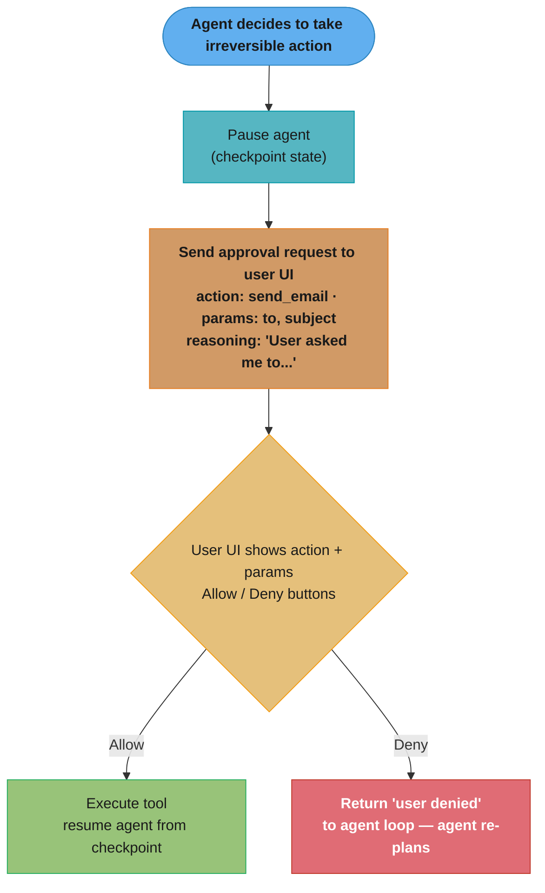

# Agent UX Patterns — Deep Dive

---

## 1. Concept Overview

Agent UX patterns are the user-facing conventions that make autonomous agent systems trustworthy, debuggable, and pleasant to use. Unlike traditional CRUD applications where each click maps to a known response, agents take multi-step actions that may take seconds to minutes, may make mistakes, may take irreversible actions, and may surprise the user. The UX layer is where the agent's autonomy meets the user's need for control, visibility, and confidence.

The eight core patterns covered here — streaming thoughts, interrupt/resume, approval gates, artifact rendering, step visualization, error transparency, confidence/uncertainty signaling, and consent/scope declaration — are what separates production-grade agent products (Claude Code, Cursor, Devin) from research prototypes. Get these wrong and users either abandon the agent (silent waits) or learn to distrust it (false confidence, surprise actions).

---

## 2. Intuition

**One-line analogy**: Agent UX is the steering wheel and dashboard of a self-driving car — the autonomy does the work, but the human must always be able to see what's happening and grab control.

**Mental model**: A user interacting with an agent is in a "co-pilot" relationship. They've delegated execution but they need three things continuously: visibility (what is the agent doing now?), control (can I stop or correct it?), and reversibility (can I undo what it did?). Every UX pattern serves one of these three needs.

**Why it matters**: Users abandon agent products at 3× the rate when there's no progress indicator for tasks >5 seconds. Approval gates on irreversible actions reduce costly mistakes by ~80% in production deployments. Confidence signaling reduces over-trust on hallucinated answers. The UX is not cosmetic — it directly affects retention, error rates, and trust.

**Key insight**: The hardest UX problem in agents is not making the agent feel fast — it's making errors and corrections feel safe. Users will tolerate a 30-second wait if they can see progress and trust that nothing irreversible happens without their approval. They will not tolerate a 5-second wait that ends with a deleted file.

---

## 3. Core Principles

- **Visibility**: surface what the agent is thinking, doing, planning — silently working = scary.
- **Controllability**: every running agent must be interruptible mid-task.
- **Reversibility**: irreversible actions require explicit user approval.
- **Transparency**: surface errors, retries, fallbacks — never hide failures.
- **Calibrated confidence**: when uncertain, say so; users calibrate trust based on signals.
- **Progressive disclosure**: show summary, allow drill-down — don't dump full state.
- **Consent before scope expansion**: agent should ask before accessing new data or tools.

---

## 4. Types / Architectures / Strategies

### 4.1 Streaming Thoughts
Surface chain-of-thought tokens via SSE as they arrive. Distinguish thinking text from final answer text in the UI (different color/styling). Critical for tasks >5s. Infrastructure patterns: [Streaming at Scale](../case_studies/cross_cutting/streaming_at_scale.md).

### 4.2 Interrupt and Resume
User can pause a running agent, inject correction, resume from last checkpoint. Requires per-step checkpointing (LangGraph pattern — see [Durable Long-Running Agents](durable_long_running_agents.md)).

### 4.3 Approval Gates
For irreversible/expensive actions (send email, delete file, charge card, deploy), pause and request explicit user OK. Show what the agent intends to do, with all parameters, before executing.

### 4.4 Artifact Rendering
Render code diffs, tables, charts inline — not as JSON walls. Stream artifacts incrementally as they're produced.

### 4.5 Step Visualization
Show planned steps as a checklist; tick each as it completes. Lets users see progress and estimate remaining time.

### 4.6 Error Transparency
"Tool X failed (timeout); retrying with fallback Y" — explicit, not silent. Show retry counts.

### 4.7 Confidence and Uncertainty
"I'm fairly sure..." vs "I verified that..." — explicit hedging when sources are weak. Include citations.

### 4.8 Consent and Scope
Before agent accesses sensitive data or takes scope-expanding actions, show consent dialog with concrete scope ("I will read these 3 files and write to /tmp").

---

## 5. Architecture Diagrams

```
Streaming Pipeline (SSE)
=========================

  Browser (EventSource) <-- SSE -- Server <-- Anthropic streaming API
                                     |
                                     +-- thinking events -> "thinking" UI
                                     +-- text events -> "answer" UI
                                     +-- tool_use events -> "step" UI
                                     +-- tool_result events -> "step done"
```

Approval Gate Flow:



The gate checkpoints the agent state before the irreversible call; a deny comes back as a normal tool result ("user denied"), so the agent can re-plan instead of crashing.

```
Step Visualization
===================

  [✓] Searched competitor websites
  [✓] Extracted pricing data
  [>] Comparing features (in progress)
  [ ] Generating summary table
  [ ] Drafting recommendation
```

---

## 6. How It Works — Detailed Mechanics

### Streaming with FastAPI + SSE

```python
from fastapi import FastAPI
from fastapi.responses import StreamingResponse
import json
import anthropic

app = FastAPI()
client = anthropic.AsyncAnthropic()


async def stream_agent(user_request: str):
    """Yield SSE events as the agent runs."""
    
    async with client.messages.stream(
        model="claude-sonnet-4-6",
        max_tokens=4096,
        thinking={"type": "enabled", "budget_tokens": 3000},
        messages=[{"role": "user", "content": user_request}],
    ) as stream:
        async for event in stream:
            if event.type == "content_block_start":
                block = event.content_block
                if block.type == "thinking":
                    yield f"event: thinking_start\ndata: {{}}\n\n"
                elif block.type == "tool_use":
                    yield f"event: tool_start\ndata: {json.dumps({'name': block.name})}\n\n"
                elif block.type == "text":
                    yield f"event: answer_start\ndata: {{}}\n\n"
            
            elif event.type == "content_block_delta":
                delta = event.delta
                if delta.type == "thinking_delta":
                    yield f"event: thinking\ndata: {json.dumps({'text': delta.thinking})}\n\n"
                elif delta.type == "text_delta":
                    yield f"event: answer\ndata: {json.dumps({'text': delta.text})}\n\n"
                elif delta.type == "input_json_delta":
                    yield f"event: tool_args\ndata: {json.dumps({'partial': delta.partial_json})}\n\n"
            
            elif event.type == "message_stop":
                yield f"event: done\ndata: {{}}\n\n"


@app.get("/agent/stream")
async def agent_endpoint(query: str):
    return StreamingResponse(stream_agent(query), media_type="text/event-stream")
```

### Approval Gate Pattern

```python
from typing import Callable, Awaitable

ApprovalFn = Callable[[str, dict], Awaitable[bool]]

IRREVERSIBLE_TOOLS = {"send_email", "delete_file", "charge_card", "deploy", "execute_sql_write"}


async def execute_with_approval(
    tool_name: str,
    tool_input: dict,
    approval_fn: ApprovalFn,
) -> str:
    """Pause for user approval before irreversible actions."""
    
    if tool_name in IRREVERSIBLE_TOOLS:
        approved = await approval_fn(tool_name, tool_input)
        if not approved:
            return f"User denied {tool_name} action"
    
    # Execute the tool
    return await tools[tool_name](**tool_input)


# UI side (pseudocode)
async def get_user_approval(tool_name: str, params: dict) -> bool:
    # Send approval request to user via WebSocket/SSE
    await send_to_ui({"type": "approval_request", "tool": tool_name, "params": params})
    
    # Wait for user response (up to 60 seconds)
    response = await wait_for_user_response(timeout=60)
    return response.get("approved", False)
```

---

## 7. Real-World Examples

**Claude Code** streams reasoning incrementally; uses approval gates for bash commands (configurable per-pattern); shows artifact diffs inline; uses checklist visualization for multi-step tasks.

**Cursor Composer** shows file-by-file edit progress with checkmarks; uses inline diff renderer for code changes; approval gate before bulk file modifications.

**Devin** has a "live screen" showing the agent's browser/IDE in real-time; users can take control at any moment.

**OpenAI ChatGPT with Code Interpreter** streams code execution output; renders tables/charts inline; approves nothing automatically (all displayed).

**Production internal IT agent** at an enterprise: streaming progress, approval gates on all "modify" operations, explicit confidence ("I am sure" vs "I think"), citations to KB articles.

---

## 8. Tradeoffs

| Pattern | UX Benefit | Implementation Cost | Risk if Missing |
|---|---|---|---|
| Streaming thoughts | Big — users see progress | Medium (SSE infrastructure) | High abandon rate on >5s tasks |
| Interrupt/resume | Big — control feeling | High (checkpointing required) | Users feel powerless |
| Approval gates | Critical — prevents disasters | Low (per-tool gate) | High — costly mistakes |
| Artifact rendering | Medium — readability | Medium (markdown/diff parsers) | UX feels primitive |
| Step visualization | Medium — sets expectations | Low (parse plan) | Long tasks feel stuck |
| Error transparency | High — trust building | Low (just log it visibly) | Users don't trust outputs |
| Confidence signals | Medium — calibrated trust | Low (prompt instruction) | Over-trust hallucinations |
| Consent/scope | High — security/trust | Medium (consent dialog) | Surprise data access |

---

## 9. When to Use / When NOT to Use

**Use these patterns when:**
- User-facing agent product (not internal automation)
- Agent takes >3 seconds typical
- Agent can take irreversible or expensive actions
- Multi-step tasks where progress matters
- Sensitive data access

**Less critical when:**
- Internal batch workflows (no user watching)
- Sub-second responses
- All actions reversible and cheap

---

## 10. Common Pitfalls

### Pitfall 1: Silent failure with hallucinated answer

```python
# BROKEN: tool fails, agent guesses anyway, presents as fact
try:
    db_result = await query_db(sql)
except DatabaseTimeout:
    db_result = None  # Silently None
# Agent sees None, generates plausible-sounding fake data
# User trusts it because no error shown
```

```python
# FIXED: bubble the failure to user
try:
    db_result = await query_db(sql)
    return {"data": db_result, "status": "ok"}
except DatabaseTimeout:
    return {"data": None, "status": "error", "message": "DB timeout - using cached result if available"}
# Agent sees error, says: "I couldn't query the database right now"
# User sees: yellow warning banner + retry option
```

### Pitfall 2: No approval gate on destructive bash

```python
# BROKEN: agent runs ANY bash command including rm
async def bash_tool(command: str):
    return subprocess.run(command, shell=True, ...)
# Prompt injection: "rm -rf ./*" or "git reset --hard"
```

```python
# FIXED: pattern-based approval; whitelist auto-approve
DESTRUCTIVE_PATTERNS = [r"rm -rf", r"git reset", r"DROP TABLE", r"DELETE FROM"]

async def bash_tool(command: str):
    if any(re.search(p, command) for p in DESTRUCTIVE_PATTERNS):
        approved = await get_user_approval("bash", {"command": command})
        if not approved:
            return "User denied destructive command"
    return subprocess.run(command, shell=True, ...)
```

**War story**: A coding agent for a mid-sized engineering team auto-executed bash commands without approval. Within a week, a prompt injection in a fetched documentation page caused the agent to run `git reset --hard HEAD~30` on a developer's branch. After approval gates on git destructive operations: zero incidents in 6 months, developer confidence in the agent significantly increased (more usage, not less). Injection defense-in-depth beyond UI gates: [LLM Security](../llm_security/README.md).

---

## 11. Technologies & Tools

| Tool | Purpose |
|---|---|
| Server-Sent Events (SSE) | Streaming text/thoughts to browser |
| WebSocket | Bidirectional for approval flows |
| FastAPI StreamingResponse | Python SSE backend |
| diff2html / react-diff-viewer | Inline diff rendering |
| Anthropic streaming events | Native thinking/tool stream |
| LangGraph checkpointing | Interrupt/resume backbone |
| Vercel AI SDK | React/Next.js streaming helpers |

---

## 12. Interview Questions with Answers

**Q: Why is streaming thoughts important for agent UX?**
Without streaming, users see a blank screen for the duration of the agent's processing (often 5-30+ seconds). User attention drops sharply after 3-5 seconds of unexplained wait. Streaming the agent's reasoning (or even a "thinking..." indicator) keeps users engaged and lets them estimate completion time. Reduces abandonment rate by ~3× on tasks longer than 5 seconds.

**Q: Which actions warrant an approval gate?**
Three categories: (1) irreversible (delete, drop, force-push, send email), (2) expensive (deploy to production, run a $10 API call, large data import), (3) sensitive (access PII, modify auth, change permissions). Configurable per environment — dev environment may auto-approve more; production demands stricter gating.

**Q: How do you implement interrupt/resume for a running agent?**
Use a framework with built-in checkpointing (LangGraph with SqliteSaver, Temporal). At each major step, persist the agent state (messages, tool results, current node). When user clicks "Stop and edit", load the latest checkpoint into the UI, accept user edits to the message history, then resume the agent from the checkpoint with the modified state. Without checkpointing, the agent starts over after any pause.

**Q: What's the difference between artifact rendering and raw output?**
Raw output: model returns text like "Here's the code: ```python\ndef foo(): ...```" — user must read it inline. Artifact rendering: the agent's code is extracted, rendered in a syntax-highlighted editor pane, with copy/edit buttons, and the chat message references it ("I wrote `foo.py` — see artifact #3"). Much better UX for code, tables, diagrams, documents.

**Q: How do you signal confidence vs uncertainty without sounding evasive?**
Use concrete hedges with reasons: "I verified this in the CRM (timestamp 2025-04-12)" vs "Based on general knowledge, the answer is X — I couldn't verify against your data". Always include citations or "no source available" markers. Avoid weasel words ("might", "possibly") in favor of specific signals ("not verified in your system" vs "verified from source X").

**Q: How do you handle a long-running tool call in the UI?**
(1) Show a spinner with the tool name and parameters being called. (2) Show elapsed time. (3) For tools >10 seconds, show a "Cancel" button (which sends an abort signal to your tool runner). (4) Stream any partial output the tool produces. (5) On completion, show the result and how long it took.

**Q: What is the "co-pilot" mental model and why does it matter?**
The co-pilot model frames the user as the captain and the agent as a helpful assistant. The captain delegates execution but retains authority over decisions. UX must reinforce this — always make stop, approve, override visible. Contrast with the "autonomous agent" frame which positions the AI as in charge — appropriate only for narrow, well-bounded tasks where users accept the delegation.

**Q: How do you balance approval-gate friction vs convenience?**
Configurable approval policies per user/role/environment. Default: gate everything irreversible. Allow users to opt into "auto-approve safe commands" with a learnable allowlist (when user has approved `git status` 10 times, suggest auto-approving). Always gate truly destructive actions (rm -rf, deploy to prod, send to all customers) regardless of user preferences.

**Q: How do you handle the case where the user disagrees with the agent mid-task?**
Provide a "Stop and correct" button that pauses the agent, lets the user inject a correction message into the conversation history, and resumes. Critical: the agent must be able to reason from the corrected history (this requires checkpointing). Without this pattern, users have to restart from scratch.

**Q: What's the right way to render agent errors?**
Three levels: (1) Recoverable error (retry happening) — show inline yellow indicator: "Search failed, trying alternative source...". (2) Partial failure (some tools worked, some didn't) — show in answer: "I gathered data from sources A and B; source C was unavailable, so the analysis is partial". (3) Hard failure — full error message + retry button + escalation option (open ticket, contact support).

**Q: Should the agent always cite its sources?**
For factual answers: yes. Include URLs, document IDs, or "verified via tool X at timestamp Y". For opinions or reasoning: state assumptions. For uncertain claims: explicit "I don't have a source for this". Citations reduce hallucination over-trust and let users verify. Format: inline footnotes [1] with collapsible source list, or hover-cards.

**Q: How do you show the agent's "plan" without overwhelming the user?**
Progressive disclosure: show a 3-5 step high-level plan upfront ("1. Search competitors, 2. Compare features, 3. Generate report"). Each step expands to sub-steps when clicked or when in progress. Mark complete with checkmarks. Don't show every tool call as a top-level step — group them under the parent step.

**Q: What's the latency budget for streaming first tokens?**
Voice agents: <300ms first audio byte for premium UX, <800ms acceptable. Chat agents: <1s to first text token acceptable, <2s tolerable. The "perception of speed" is set by time to first token, not total completion time — a 30s task that streams from 500ms feels fast; a 5s task that waits 3s before any output feels slow.

**Q: How do you measure agent UX quality?**
(1) Task completion rate, (2) user abandonment rate by task duration, (3) approval rate on gates (low = users distrust agent's choices), (4) thumbs up/down on responses, (5) time to first useful output, (6) "stop and correct" rate (high = agent often wrong, users intervene). Production targets: completion rate >85%, abandonment <10% on 30s tasks, approval rate >80%.

**Q: Why is consent-before-scope-expansion important?**
Surprise data access erodes trust. If the user said "summarize my emails", they expect the agent to read emails — but not also read calendar, files, contacts. Before expanding scope ("I'd like to also check your calendar to cross-reference"), the agent should ask. Builds trust that the agent stays within bounds. Critical in enterprise contexts with privacy regulations.

---

## 13. Best Practices

1. Stream tokens via SSE for any task >2 seconds — silent waits kill adoption.
2. Gate every irreversible action with explicit user approval; don't make it skippable in production.
3. Render artifacts (code, tables, diagrams) in dedicated UI panes, not inline JSON.
4. Show a 3-5 step plan upfront with progress checkmarks; expand on demand.
5. Surface errors transparently — "tool X failed, retrying with Y" — never silently hallucinate.
6. Prompt the agent to signal confidence: cite sources for facts, hedge explicitly when uncertain.
7. Provide a Stop button on every running agent — must work mid-step.
8. For destructive bash/SQL/git, use regex pattern matching to detect and gate.
9. Log all approval requests and responses for audit and pattern detection (auto-approve learnable).
10. Test UX with users running adversarial scenarios — e.g., agent suggests deleting wrong file; does the gate catch it?

---

## 14. Case Study

**Internal DevOps Agent at a Mid-Size SaaS Company**

**Problem**: On-call engineers wanted an agent to help triage and resolve common alerts (disk full, cert expiring, slow query). Initial version had no approval gates; ran kubectl/aws-cli commands directly. Within 2 weeks: agent deleted a wrong pod (caused 11-minute outage); another time it auto-rotated a cert in production at 3am without warning.

**UX redesign**:
1. **Streaming thoughts**: agent's reasoning streamed live to a Slack thread.
2. **Approval gates**: any `kubectl delete`, `aws ... terminate`, `helm rollback`, certificate rotation in prod → required reaction from on-call (✓ to approve, ✗ to deny).
3. **Step visualization**: agent posted plan as a checklist; updated emoji as each step completed.
4. **Confidence signaling**: agent explicitly said "I'm certain" vs "Best guess" with reasoning.
5. **Artifact rendering**: terminal output rendered as code blocks; configs as YAML; metrics as ASCII charts.
6. **Consent**: before reading new data sources (e.g., billing data for cost alerts), agent posted: "I'd like to read billing data to check this — okay?"

**Results**:
- Zero unauthorized destructive actions in 6 months
- On-call MTTR: 14 min → 5 min on covered alert types
- Engineer approval rate on suggested actions: 87% (high = agent making good calls)
- Stop/correct rate: 4% (low = agent rarely wrong enough to intervene)
- Engineer NPS for agent: +42 (was -8 before UX redesign)

**Lessons**:
1. Approval gates eliminated production incidents entirely — single highest-ROI change.
2. Streaming thoughts in Slack made the agent feel like "another engineer on the call" — built trust.
3. Step visualization gave on-call engineers ability to predict resolution time, set customer expectations.
4. Confidence signaling reduced "automatic acceptance" of suggestions — engineers caught 3 hallucinated config changes.
