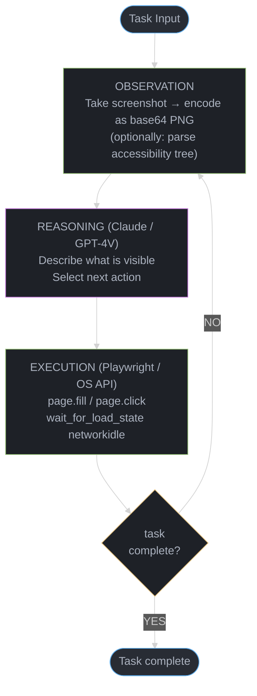
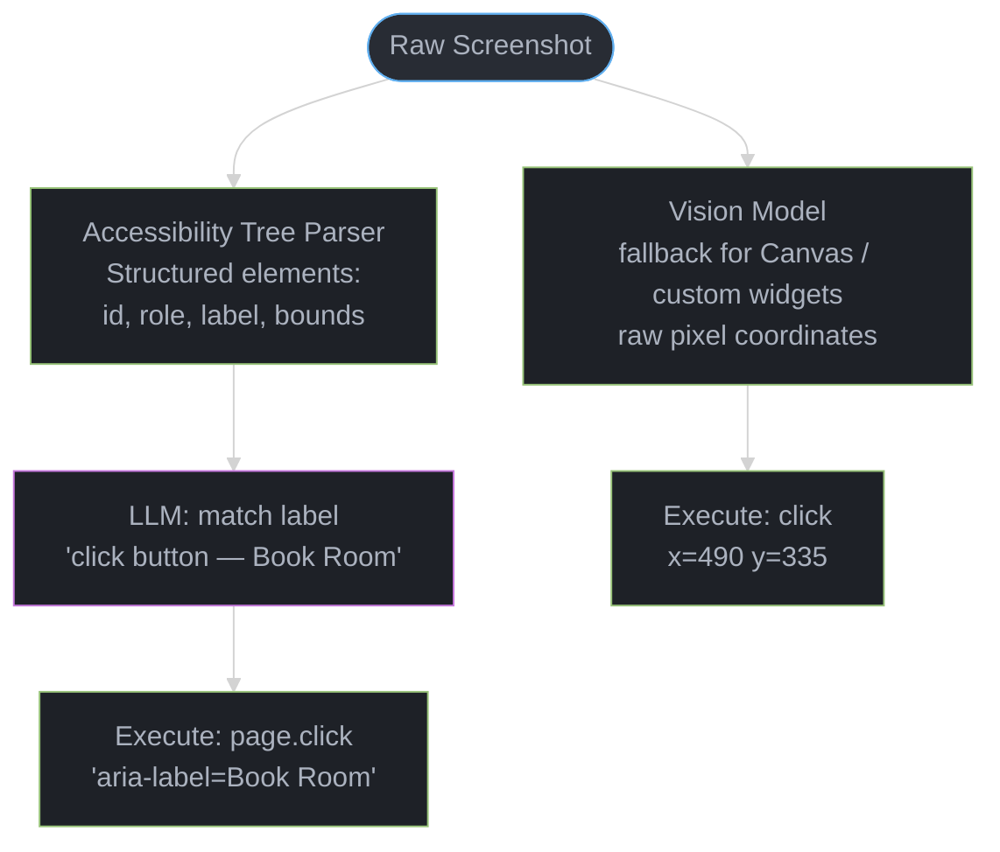

# Computer Use & Browser Agents

## Concept Overview

Computer use agents interact with graphical interfaces — browsers, desktop applications, and operating systems — by observing the screen (via screenshots or accessibility trees) and issuing UI actions (clicks, typing, scrolling). Unlike API-based agents that call structured tool functions, computer use agents operate on the visual layer, enabling them to automate any software that a human could use, even without a programmatic API.

Browser agents specifically navigate the web: filling forms, clicking buttons, extracting data, and completing multi-step workflows on any website. They combine vision models (to see the screen), action models (to decide what to do), and execution layers (Playwright, Selenium, or OS APIs to perform actions).

---

## Intuition

> **One-line analogy**: Computer use agents are like robotic process automation (RPA) with a brain — traditional RPA scripts break when the UI changes; a computer use agent adapts by reasoning about what it sees.

**Mental model**: Traditional software integration requires an API. But most of the world's software — enterprise ERPs, legacy portals, insurance claims systems — exposes no API; only a human-facing GUI. Computer use agents unlock automation for all of this by interacting at the visual/interaction layer. The trade-off: screen-based interaction is slower (3-10 seconds per action) and more fragile (DOM changes break selectors) than API calls. The architectural question for any automation task is: does this software have a stable API? If yes, use it. If not, computer use.

**Why it matters**: RPA market is ~$2B/year; enterprise automation workflows are a massive opportunity. Computer use extends agentic capabilities from "software with APIs" to "any software humans use."

**Key insight**: The grounding problem — translating natural language intent into specific pixel coordinates or DOM elements — is the core technical challenge. Vision+language models (GPT-4V, Claude) have dramatically improved grounding quality compared to earlier OCR-only approaches.

---

## Core Principles

- **See → decide → act → verify**: every computer use step observes current screen state, decides the appropriate action, executes it, and takes a new screenshot to verify the action had the intended effect.
- **Accessibility tree > pixel grounding**: parsing the accessibility tree (structured DOM representation) is faster and more robust than pixel-coordinate clicking when available.
- **Action granularity matters**: actions must be atomic (one click, one keystroke sequence) to remain recoverable; batch actions are harder to debug and retry.
- **Human-in-the-loop for high-risk actions**: form submissions, purchases, and data deletions should require human confirmation.
- **Stateless verification**: never assume an action succeeded; always take a new screenshot and verify.

---

## How It Works — Detailed Mechanics

### Anthropic Computer Use API

```python
import anthropic
import base64
from PIL import ImageGrab

client = anthropic.Anthropic()

def take_screenshot() -> str:
    """Capture screen and return as base64 PNG."""
    screenshot = ImageGrab.grab()
    import io
    buf = io.BytesIO()
    screenshot.save(buf, format='PNG')
    return base64.standard_b64encode(buf.getvalue()).decode('utf-8')

# Computer Use API action types
# claude-3-5-sonnet-20241022 and later models support computer use

def run_computer_use_step(task: str, screenshot_b64: str) -> dict:
    response = client.messages.create(
        model="claude-3-5-sonnet-20241022",
        max_tokens=1024,
        tools=[
            {
                "type": "computer_20241022",
                "name": "computer",
                "display_width_px": 1280,
                "display_height_px": 800,
                "display_number": 1,   # X display number (Linux)
            }
        ],
        messages=[{
            "role": "user",
            "content": [
                {"type": "image", "source": {"type": "base64",
                                              "media_type": "image/png",
                                              "data": screenshot_b64}},
                {"type": "text", "text": task}
            ]
        }]
    )
    return response

# Supported action types:
ACTION_TYPES = {
    "screenshot":         "Take a screenshot of the current screen",
    "click":              "Click at (x, y) coordinates",
    "left_click":         "Left click at (x, y)",
    "right_click":        "Right click at (x, y)",
    "double_click":       "Double click at (x, y)",
    "left_click_drag":    "Click and drag from (x1,y1) to (x2,y2)",
    "type":               "Type a string of text",
    "key":                "Press a keyboard key or combination",
    "scroll":             "Scroll at (x, y) by delta",
    "cursor_position":    "Get current cursor position",
    "mouse_move":         "Move mouse to (x, y) without clicking",
}

# Agent loop for computer use
def computer_use_loop(task: str, max_steps: int = 50):
    messages = []
    for step in range(max_steps):
        screenshot = take_screenshot()

        # Build messages with screenshot + task
        if not messages:
            messages = [{
                "role": "user",
                "content": [
                    {"type": "image", "source": {"type": "base64",
                                                  "media_type": "image/png",
                                                  "data": screenshot}},
                    {"type": "text", "text": task}
                ]
            }]
        else:
            # Append new screenshot as tool result
            messages.append({
                "role": "user",
                "content": [
                    {"type": "tool_result",
                     "tool_use_id": last_tool_use_id,
                     "content": [{"type": "image",
                                  "source": {"type": "base64",
                                             "media_type": "image/png",
                                             "data": screenshot}}]}
                ]
            })

        response = client.messages.create(
            model="claude-3-5-sonnet-20241022",
            max_tokens=1024,
            tools=[{"type": "computer_20241022", "name": "computer",
                    "display_width_px": 1280, "display_height_px": 800}],
            messages=messages
        )

        # Check for stop condition
        if response.stop_reason == "end_turn":
            return response.content[-1].text

        # Execute computer action
        tool_use = next(b for b in response.content if b.type == "tool_use")
        last_tool_use_id = tool_use.id
        execute_computer_action(tool_use.input)

        messages.append({"role": "assistant", "content": response.content})
```

### browser-use Python Library

```python
from browser_use import Agent
from langchain_anthropic import ChatAnthropic

# browser-use: Python library wrapping Playwright with LLM control
agent = Agent(
    task="Go to amazon.com, search for 'mechanical keyboard', "
         "filter by 4+ stars and under $100, return the top 3 results",
    llm=ChatAnthropic(model="claude-3-5-sonnet-20241022"),
)

result = await agent.run()
print(result.final_result())

# browser-use handles:
# - Launching Playwright browser (Chromium by default)
# - Taking screenshots after each action
# - Parsing the accessibility tree for element grounding
# - Retrying on stale element errors
# - Multi-tab management

# Custom browser configuration
from browser_use import BrowserConfig, Browser

browser = Browser(config=BrowserConfig(
    headless=True,           # invisible browser (CI/CD)
    chrome_instance_path=None,  # use bundled Chromium
    disable_security=False,  # keep CSP enabled
))

agent = Agent(task="...", llm=llm, browser=browser)
```

### Playwright Agent Integration

```python
from playwright.async_api import async_playwright
import asyncio

async def playwright_agent_step(page, action: dict) -> str:
    """Execute a single browser action from LLM output."""
    action_type = action["type"]

    if action_type == "click":
        # Prefer accessibility selector over coordinates when possible
        selector = action.get("selector")
        if selector:
            await page.click(selector)
        else:
            await page.mouse.click(action["x"], action["y"])

    elif action_type == "type":
        await page.keyboard.type(action["text"])

    elif action_type == "fill":
        # Fill a form field by label or selector
        await page.fill(action["selector"], action["value"])

    elif action_type == "navigate":
        await page.goto(action["url"])

    elif action_type == "scroll":
        await page.mouse.wheel(action.get("delta_x", 0), action.get("delta_y", 100))

    elif action_type == "screenshot":
        screenshot = await page.screenshot()
        return base64.b64encode(screenshot).decode()

    # Wait for page to settle after action
    await page.wait_for_load_state("networkidle", timeout=3000)
    return "success"

# Get accessibility tree instead of screenshot for text-heavy pages
async def get_accessibility_tree(page) -> str:
    """Structured DOM representation — faster and more robust than pixel grounding."""
    tree = await page.accessibility.snapshot()
    return format_accessibility_tree(tree)
```

### UI Element Grounding Methods

```
Three approaches to identifying what to click/type into:

1. PIXEL GROUNDING (screenshot + vision model)
   Model sees screenshot, outputs pixel coordinates (x, y)
   Pro: works on any interface, including non-HTML (desktop apps, games)
   Con: slow (requires vision model), brittle (pixel shift = miss)
   Accuracy: ~70-85% on typical web tasks (vision models)

2. ACCESSIBILITY TREE (structured DOM)
   Parse browser's accessibility API to get structured element tree:
     [button "Submit", aria-role=button, id=submit-btn, bounds=(450,320,80,30)]
     [input "Email address", aria-role=textbox, id=email, bounds=(200,200,300,40)]
   Model receives text representation, outputs element ID or aria label
   Pro: fast (no vision), robust (labels don't change like pixels), cheap
   Con: some elements aren't exposed in accessibility tree (Canvas, custom widgets)
   Accuracy: ~85-95% when accessibility tree is complete

3. HYBRID (tree + vision for fallback)
   Try accessibility tree first; fall back to pixel grounding for:
   - Canvas elements (charts, games)
   - Custom web components without aria labels
   - Legacy pages with poor accessibility
   Pro: best accuracy across all page types
   Con: higher complexity
   browser-use uses this approach
```

### Action Latency Model

```
Action step timing breakdown (typical values):
  Screenshot capture:      100-300ms
  Screenshot base64 encode: 50-100ms
  LLM API call:            1,000-3,000ms
  Action execution:        100-500ms
  Page load/settle:        200-2,000ms (wait for networkidle)
                          ─────────────
  Total per action step:   1,500-6,000ms (1.5-6 seconds)

Typical task step counts:
  Simple form fill:         3-5 steps      (5-25 seconds)
  Web search + click:       4-8 steps      (8-40 seconds)
  Multi-page workflow:      10-20 steps    (20-120 seconds)
  Complex e-commerce task:  15-30 steps    (30-180 seconds)

Comparison to API-based agents:
  API tool call:            200-1,000ms (5-10× faster per step)
  Computer use step:        1,500-6,000ms

Implication: computer use is appropriate for tasks with no API alternative,
not for tasks where a structured API exists.
```

### Reliability Challenges

```
1. Stale elements (DOM changes during interaction)
   Problem: element clicked, then DOM re-renders, element moves
   Solution: retry with exponential backoff; wait for networkidle before acting

2. Dynamic JavaScript pages
   Problem: content loads asynchronously; model acts before content loads
   Solution: wait_for_selector(); wait_for_load_state("networkidle")

3. CAPTCHAs
   Problem: automated browsing detected; CAPTCHA presented
   Solution: human-in-the-loop escalation; anti-CAPTCHA services for legitimate use
   Note: bypassing CAPTCHAs on unwilling sites violates ToS

4. Session expiry
   Problem: long agent runs trigger re-authentication
   Solution: cookie persistence; refresh tokens; detect login page and re-authenticate

5. Layout changes (A/B tests)
   Problem: site runs A/B test; element moved between agent runs
   Solution: semantic grounding (find "Submit button" not "button at x=450") over coordinate grounding

6. Rate limiting / IP blocks
   Problem: rapid automated browsing triggers bot detection
   Solution: human-like delays (200-500ms between actions), headless=False for sites using JS detection
```

---

## Architecture Diagrams

### Computer Use Agent Loop



Each iteration takes a fresh screenshot as input; the loop continues until the agent produces a final answer or a stopping condition is reached.

### Grounding Pipeline



The accessibility tree path is preferred (structured, reliable); the vision model fires only for canvas elements or custom widgets where the DOM offers no labels.

---

## Real-World Examples

### Anthropic Computer Use (Claude 3.5 Sonnet)

Released October 2024:
- Model: claude-3-5-sonnet-20241022 with `computer_20241022` tool
- Supported actions: screenshot, click, type, key, scroll, cursor_position
- Benchmark: OSWorld (evaluate GUI tasks on Ubuntu VM) — Claude scored 22% vs GPT-4o's 14% (2024)
- Use cases: software testing, RPA automation, data entry, web scraping
- Latency: ~3-8 seconds per action step at typical network conditions

### browser-use (Open Source)

Python library (1M+ downloads):
- Integrates Playwright + LLM (Claude/GPT/Gemini) with structured accessibility tree parsing
- Action space: navigate, click, fill, extract, scroll, back/forward, tab management
- Memory: extracts key information during browsing and stores in structured format
- Cost: ~$0.01-0.05 per task (simple web tasks) at Claude 3.5 prices

### Operator (OpenAI, 2025)

Consumer product for autonomous web task completion:
- Uses GPT-4o with custom computer use training
- Specializes in: food ordering, travel booking, form completion
- Human-in-the-loop: pauses for user confirmation on payment steps
- Integration with browser extension for context sharing

---

## Tradeoffs

| Approach | Speed | Reliability | Coverage | Cost |
|----------|-------|-------------|----------|------|
| API integration | Fast (200ms) | High | API-only | Low |
| Accessibility tree | Medium (1-3s) | Medium-High | Web/desktop | Medium |
| Pixel grounding | Slow (3-8s) | Medium | Universal | High (vision model) |
| Hybrid (tree+vision) | Medium (2-5s) | High | Universal | High |

| Execution Layer | Stealth | JS Support | Desktop | Speed |
|-----------------|---------|------------|---------|-------|
| Playwright | Low (headless detectable) | Full | No | Fast |
| Selenium | Low | Full | No | Medium |
| PyAutoGUI | High (real input) | N/A | Yes | Fast |
| xdotool (Linux) | High | N/A | Yes | Fast |

---

## When to Use / When NOT to Use

### Use Computer Use / Browser Agents When:
- No stable API exists for the target software
- Automating legacy enterprise systems (ERP, insurance portals, CRMs)
- Scraping sites that require interaction (login-gated, JavaScript-rendered)
- Software testing: test UI workflows automatically
- Accessibility testing: detect UI issues programmatically

### Avoid When:
- A stable API exists — always prefer APIs over UI automation
- Latency requirements are strict (<1 second per operation)
- The site actively blocks automation (legal/ToS issues may apply)
- High-stakes irreversible actions (financial transactions, data deletion) without HITL

---

## Common Pitfalls

1. **Acting without verifying**: clicking a button and immediately assuming success. Always take a post-action screenshot and check the resulting state matches expectation before proceeding.

2. **Coordinate drift**: hardcoding pixel coordinates from a specific screen resolution. A 4K monitor has different coordinates than a 1080p monitor. Use semantic selectors (aria-label, role+text) over coordinates wherever possible.

3. **Ignoring page load state**: acting on a page that's still loading causes clicks on elements that move or disappear. Always wait for `networkidle` or specific element visibility before acting.

4. **Escalating all CAPTCHAs to API**: some sites tolerate a human-like user agent with realistic delays. Reduce headless bot signatures before assuming CAPTCHA escalation is needed.

5. **No step limit**: computer use agents can run indefinitely navigating to wrong pages. Enforce a hard step limit (50 steps) and return partial results or escalate on timeout.

6. **Storing credentials in prompts**: injecting usernames/passwords into the LLM prompt leaks credentials to the model provider. Use environment variables or a credential vault; inject credentials only into the Playwright `page.fill()` call, not the LLM message.

---

## Technologies & Tools

| Tool | Purpose | Notes |
|------|---------|-------|
| **Anthropic Computer Use API** | Screen-based agent | Claude 3.5+; screenshot+action |
| **browser-use** | Web automation library | Python; Playwright+LLM; open source |
| **Playwright** | Browser automation | Microsoft; Chromium/Firefox/WebKit |
| **Selenium** | Browser automation | Legacy; WebDriver protocol |
| **OpenAI Operator** | Consumer web agent | GPT-4o+; food/travel tasks |
| **SomAgent** | Web navigation research | Grounding model for web elements |
| **WebArena** | Web agent benchmark | 810 tasks; realistic web environments |
| **OSWorld** | OS-level agent benchmark | Ubuntu VM; GUI tasks |
| **PyAutoGUI** | Desktop automation | Cross-platform; real OS input events |
| **Skyvern** | RPA with LLMs | Playwright+vision; form automation |

---

## Interview Questions with Answers

**Q: What is computer use and how does it differ from API-based tool calling?**
A: Computer use enables an LLM agent to interact with software through its graphical interface — taking screenshots, clicking, typing, and scrolling — just like a human user. API-based tool calling sends structured function calls to programmatic interfaces. Key differences: computer use works on any software regardless of API availability (covering legacy systems, proprietary portals, anything with a UI); API tool calling is 5-10× faster per step (200ms vs 3-8s), more reliable (no stale element risk), and cheaper (no vision model). Use computer use when no API exists; use API tool calling when it does.

**Q: How does the Anthropic Computer Use API work at a protocol level?**
A: The model is given a `computer_20241022` tool in its tool spec. Each conversation turn includes a screenshot (base64 PNG) of the current screen. The model responds with a tool use block specifying an action: `{"type": "computer_20241022", "input": {"action": "left_click", "coordinate": [490, 335]}}`. Your application code intercepts this, executes the action via OS APIs or Playwright, takes a new screenshot, and injects it as the tool result. This screenshot-action loop repeats until the model produces a text response without a tool call (task complete) or the step limit is reached. The model never executes actions directly — it only describes them.

**Q: What is UI element grounding and why is it the core technical challenge?**
A: Grounding is the problem of translating a high-level intent ("click the Submit button") to a specific UI element (pixel coordinate or DOM selector). Without perfect grounding, agents click the wrong element or miss entirely. Approaches: (1) pixel grounding — vision model identifies coordinates from a screenshot; accuracy ~70-85%, works on any interface, slow; (2) accessibility tree — parse DOM's aria roles and labels into a structured text tree; accuracy ~85-95% when accessibility is well-implemented, fast, no vision needed; (3) hybrid — accessibility tree first, pixel fallback for unlabeled elements. The hard cases: Canvas-rendered UIs (charts, games, map interactions) expose no accessibility tree structure and require vision-based grounding.

**Q: How does browser-use differ from writing Playwright scripts manually?**
A: Manual Playwright scripts hardcode selectors (`page.click("#submit-btn")`) — they break whenever the DOM changes. browser-use uses an LLM to decide dynamically what to click based on semantic understanding of the page's accessibility tree and visual state. When the site redesigns and moves the Submit button, the manual script breaks; browser-use adapts because it looks for "the button labeled Submit" not a hardcoded ID. The trade-off: browser-use is 10-100× slower per page action (LLM call per step vs. direct Playwright call), 10-100× more expensive, and less deterministic. Use manual Playwright for stable, well-known sites with deterministic workflows; use browser-use for adaptive automation on sites that change or for tasks with variable UI states.

**Q: What are the main reliability challenges in production browser agents?**
A: (1) Stale elements: the agent clicks an element that the JavaScript framework removes and re-renders; fix with explicit wait strategies and retry; (2) Dynamic JS pages: content loads after the DOM event fires; fix with `wait_for_load_state("networkidle")`; (3) CAPTCHAs: automated browsing detected; fix with human-in-the-loop or anti-CAPTCHA services for legitimate automation; (4) A/B tests: site runs experiments that move UI elements between agent sessions; fix with semantic grounding over coordinate grounding; (5) Popup interruptions: cookie consent, notification modals, chat widgets appear mid-task; the agent must detect and dismiss them before continuing the primary task.

**Q: How do you handle high-risk actions (form submissions, purchases) in a computer use agent?**
A: Human-in-the-loop (HITL) is mandatory for irreversible actions. Architecture: (1) Risk classification — before executing, classify the pending action (low: navigate, search; medium: form fill; high: submit, purchase, delete); (2) HITL gate — for high-risk actions, pause the agent and surface the pending action with its context to a human; (3) Wait for approval — the agent is suspended until the human approves or rejects; (4) Audit log — log all high-risk actions with agent reasoning, human decision, and outcome. Implementation in Playwright: before `page.click("#checkout-button")`, check the action type; if high-risk, trigger an interrupt and wait for an approval event. Never allow purchases or data deletions to proceed without explicit human confirmation in production.

**Q: What is the typical latency per computer use step and what drives it?**
A: A single computer use step takes 1.5-6 seconds. Breakdown: screenshot capture (100-300ms) + base64 encoding (50-100ms) + LLM API call (1,000-3,000ms) + action execution (100-500ms) + page settle/networkidle wait (200-2,000ms). The LLM call is the dominant cost at ~1-3 seconds. For a 20-step web task, total wall time is 30-120 seconds. Optimizations: (1) use accessibility tree instead of screenshot when possible — skips vision model call (~500ms savings per step); (2) stream screenshots at lower quality (lower bandwidth); (3) skip networkidle wait for known fast pages; (4) pipeline: start the next screenshot while the previous action executes. Compare: API tool call completes in 200-1000ms — 3-10× faster than computer use per step.

**Q: How do you benchmark computer use agents?**
A: OSWorld (2024): 369 GUI tasks on Ubuntu VM across 9 applications (web browser, office suite, file manager, etc.) — most comprehensive desktop benchmark; human scores 72%, GPT-4V 11.7%, Claude 3.5 22.0%. WebArena: 810 web navigation tasks on realistic websites — 14% for GPT-4V, ~35% for best systems. Mind2Web: 2350 tasks on 137 real websites using recorded demonstrations as ground truth. Scoring: function-based verification of backend state for WebArena; task completion for OSWorld. Custom eval: for production, build domain-specific task sets (your target websites/apps) and measure success rate and cost-per-task. Public benchmarks set directional expectations but your production task distribution matters most.

**Q: How should credentials be handled in a browser agent?**
A: Never include credentials in the LLM prompt — they would be sent to the model provider and potentially logged. Correct approach: (1) store credentials in environment variables or a secure vault (HashiCorp Vault, AWS Secrets Manager); (2) inject credentials directly into Playwright `page.fill()` or `page.type()` calls, bypassing the LLM entirely; (3) for the LLM, provide a placeholder: "Use the stored credentials for this service" — the LLM calls a `get_credentials(service_name)` tool; (4) the tool fetches from the vault and fills the fields directly without exposing values to the model. Session persistence: save browser cookies/localStorage after login so the agent doesn't need to re-authenticate every run — use Playwright's `browser_context.storage_state()`.

**Q: When is computer use appropriate vs. building a dedicated API integration?**
A: Build API integration when: the service has a stable, documented API (REST, GraphQL, SDK); the automation is high-frequency (hundreds of calls/day); the workflow requires SLA reliability (<1s latency); the service is business-critical. Use computer use when: no API exists (legacy systems, proprietary portals); the API is unstable, rate-limited, or expensive; the automation task is low-frequency (daily/weekly); the service is accessed by humans via a browser already and the workflow is simple. Heuristic: if a junior developer could write a Playwright script to do it, consider computer use. If it requires deep integration work, an API integration is more robust long-term. Computer use is an accelerator for automation tasks that would otherwise require months of custom integration work.

**Q: What are the tradeoffs between screenshot-based and DOM/accessibility-tree-based interaction?**
A: Screenshot-based (pixel grounding): the model receives a PNG of the screen and outputs pixel coordinates. It works universally — any GUI, any technology stack, desktop apps, games, Canvas-rendered UIs. Accuracy: ~70-85% on typical web tasks. Per-step cost: high (vision model inference + screenshot transfer). Main failure mode: coordinate drift when layout changes between screenshot capture and action execution. DOM/accessibility-tree-based: the browser exposes a structured tree of UI elements with roles, labels, and bounds. The model receives this as text and outputs element identifiers. Accuracy: ~85-95% when the accessibility tree is complete. Per-step cost: lower (no vision model, smaller input). Main failure mode: elements without aria labels or role attributes are invisible to the tree. Practical recommendation: use accessibility tree as the primary approach; fall back to screenshot-based pixel grounding for Canvas elements, SVG charts, and custom web components that lack accessibility attributes. The hybrid approach achieves 90%+ accuracy across diverse web applications.

**Q: How do you handle dynamic web content — SPAs, lazy loading, and JavaScript-rendered pages?**
A: Single-page applications (SPAs) and lazily-loaded content are the top reliability challenge for browser agents. Common failure patterns: (1) clicking a button that triggers an AJAX request, then immediately reading the page before the response arrives; (2) scrolling to the bottom to trigger lazy loading, then acting on elements that haven't been injected yet; (3) navigating to a route that starts rendering before all data is fetched. Mitigations: (a) always use `wait_for_load_state("networkidle")` after navigation and after clicks that trigger navigation — this waits until no more network requests have been active for 500ms; (b) for lazy loading, use `wait_for_selector("[data-loaded='true']")` or a specific element that appears only when content is ready; (c) add explicit observation step after each action — take a new screenshot and verify the expected change is visible before proceeding; (d) for AJAX responses, poll for a specific DOM state change rather than using fixed sleep delays. Fixed sleeps (`time.sleep(2)`) are brittle — page load time varies by network and server load.

**Q: What safety guardrails are necessary for production computer use agents?**
A: Computer use agents executing real actions require layered safety: (1) action risk classification — every action type gets a risk level: navigate (low), fill form (medium), click submit/send/purchase (high), download/upload files (high), system commands (critical); (2) allowlist of approved domains — the agent may only navigate to domains in an explicit whitelist; attempts to visit unknown domains are blocked; (3) human-in-the-loop for high-risk actions — any action classified "high" or "critical" triggers a pause, surfaces the pending action to a human, and waits for explicit approval before executing; (4) audit log with full screenshots — every action is logged with: timestamp, action type, arguments, screenshot before, screenshot after; retained for 30 days for compliance; (5) kill switch — a session-level abort mechanism that terminates the agent and reverts any reversible actions (form fills, not submitted forms); (6) rate limiting — cap actions per minute to detect runaway loops before they cause harm. Without these guardrails, a single agent bug can trigger unintended purchases, form submissions, or data deletions at scale.

**Q: How does the latency of screenshot-based agents compare to API-based alternatives, and when is the difference acceptable?**
A: Screenshot-based computer use: 1.5-6 seconds per action step (screenshot capture 200ms + LLM vision call 1-3s + action execution 200ms + page settle 200-2000ms). For a 15-step workflow: 22-90 seconds total. API-based tool call: 200-1000ms per call. For 15 API calls: 3-15 seconds total. The latency difference is 5-10× per step, compounding to a 6-30× difference for a full task. This difference is acceptable when: the task is a background/asynchronous workflow where latency is not user-facing (daily report generation, overnight data entry); the task has no API alternative and would otherwise require manual human work; the task runs infrequently (once per day or per week). The difference is not acceptable when: the task is user-facing (user waits for result in real time), the task runs continuously or at high frequency, or there is a viable API alternative. Decision rule: compute cost-per-task for both approaches (API integration is one-time development cost + low runtime cost; computer use has zero development cost but high runtime cost per execution) and break-even on volume.

**Q: How do you evaluate browser agent reliability across diverse web environments?**
A: Use a structured test matrix: (1) representative URL set — select 20-30 URLs covering: static HTML pages, SPAs (React/Vue/Angular), legacy pages with poor accessibility, pages with iframes, pages behind authentication; (2) task diversity — at least 5 task types: navigation, form fill, data extraction, multi-step workflow, error recovery; (3) repeated runs — run each task 5 times to compute pass@1 and pass@5; high variance = reliability issue; (4) failure categorization — tag each failure with root cause: wrong element selected, timeout waiting for content, CAPTCHA encountered, DOM changed mid-action, action had no effect; (5) regression suite — after each agent code change, run the full matrix; alert if any category's success rate drops more than 5 percentage points. Public benchmarks (WebArena: 810 tasks, OSWorld: 369 tasks) provide directional data but are not representative of any specific application's DOM structure and interaction patterns. Always build a domain-specific eval suite.

---

## Best Practices

1. **Always verify actions by taking a new screenshot**: never assume an action succeeded; check the resulting state before proceeding.
2. **Prefer accessibility tree over pixel grounding**: faster, cheaper, more robust; fall back to pixel only for Canvas or poorly labeled elements.
3. **Use semantic selectors (aria-label, role+text) over hardcoded coordinates or IDs**: site redesigns don't break semantic selectors.
4. **Inject credentials via vault, not LLM prompt**: prevents credential exposure to model provider logs.
5. **Add human-in-the-loop for irreversible actions**: form submission, payment, data deletion must pause for human confirmation.
6. **Set a hard step limit and return partial results on timeout**: prevents runaway agents from consuming resources indefinitely.
7. **Log full trajectories including screenshots**: essential for debugging; screenshots show exactly what the agent saw at each step.

---

## 14. Case Study: Browser Agent for Automated QA Testing

**Problem Statement**: A 60-person B2B SaaS company releases software updates weekly. Manual QA testing of the web app covers 200 test scenarios and requires 2 QA engineers for 2 days. As the feature surface grows, manual QA cannot scale. The goal: a browser agent that autonomously executes the test suite, reports bugs with reproduction steps and screenshots, and sends results to the engineering Slack channel — reducing manual QA time to 4 hours of human review per release.

**Architecture Overview**:

```
QA Test Suite (200 scenarios as YAML)
      |
      v
┌──────────────────────────────────────────────────────────────────┐
│  TEST ORCHESTRATOR                                               │
│  Reads test scenarios, dispatches to browser agents in parallel  │
│  Max 10 concurrent agents (resource constraint)                  │
└──────────────────────┬───────────────────────────────────────────┘
                       │ (10 at a time)
          ┌────────────┼────────────┐
          v            v            v
  ┌──────────────┐ ┌──────────────┐ ┌──────────────┐
  │ BROWSER      │ │ BROWSER      │ │ BROWSER      │
  │ AGENT #1     │ │ AGENT #2     │ │ AGENT N      │
  │              │ │              │ │              │
  │ Playwright + │ │ Playwright + │ │ Playwright + │
  │ Claude 3.5   │ │ Claude 3.5   │ │ Claude 3.5   │
  │              │ │              │ │              │
  │ Navigate     │ │ Navigate     │ │ Navigate     │
  │ Fill forms   │ │ Fill forms   │ │ Fill forms   │
  │ Verify state │ │ Verify state │ │ Verify state │
  │ Capture bugs │ │ Capture bugs │ │ Capture bugs │
  └──────┬───────┘ └──────┬───────┘ └──────┬───────┘
         │                │                │
         v                v                v
┌──────────────────────────────────────────────────────────────────┐
│  BUG REPORTER                                                    │
│  Aggregates results, creates bug reports with:                   │
│  - Test scenario name + expected vs. actual outcome              │
│  - Full action trajectory (steps taken)                          │
│  - Screenshots: before failure, at failure point                 │
│  - Reproduction steps in plain English                           │
│  Posts to Jira + Slack                                           │
└──────────────────────────────────────────────────────────────────┘
```

**Key Design Decisions**:

1. Accessibility tree primary, screenshot fallback: the app is a React SPA — all interactive elements have aria-labels (enforced by the frontend team's accessibility standard). The agent uses the accessibility tree for 95% of interactions. Screenshot-based grounding is only needed for the D3.js chart components. This reduces per-step latency from ~4s (screenshot+vision) to ~1.5s (accessibility tree only).

2. Declarative test scenarios in YAML: test scenarios are written as structured steps, not open-ended natural language. This constrains the agent's action space and makes reproduction steps deterministic.

3. Verification step after every write action: after filling a form field, the agent reads the field back and verifies the value was accepted. After submitting a form, it waits for the success state indicator. This catches subtle issues like autocomplete overwriting typed values or form validation rejecting valid inputs.

4. Bug deduplication: before filing a bug report, the orchestrator checks if an identical `(scenario_id, error_type, element_selector)` combination was reported in the last 30 days. Duplicates are linked to the existing issue rather than creating noise.

5. Hard step limit of 30 per scenario: if a scenario reaches 30 steps without completing, the agent is considered stuck and the scenario is marked as a timeout failure with the partial trajectory included in the bug report for human review.

**Implementation**:

```python
# Test scenario format (YAML)
# scenarios/checkout_flow.yaml
"""
name: "Complete checkout with credit card"
url: "https://staging.app.example.com/shop"
steps:
  - action: navigate
    target: "/shop"
  - action: click
    target: "Add to Cart button for 'Pro Plan'"
  - action: click
    target: "View Cart button"
  - action: click
    target: "Proceed to Checkout button"
  - action: fill
    target: "Card Number field"
    value: "4242424242424242"
  - action: fill
    target: "Expiry field"
    value: "12/26"
  - action: fill
    target: "CVV field"
    value: "123"
  - action: click
    target: "Complete Purchase button"
verify:
  - element: "Order Confirmation header"
    state: "visible"
  - element: "Order number"
    state: "contains_text"
"""

QA_AGENT_SYSTEM_PROMPT = """You are a QA testing agent. Execute the given test scenario
step by step on the web application.

For each step:
1. Find the target element using the accessibility tree
2. Execute the action (click, fill, navigate)
3. Take a screenshot to verify the action succeeded
4. If the expected state is not reached, this is a test failure

Report format on failure:
- Step that failed
- Expected: [what should have happened]
- Actual: [what happened instead]
- Screenshot: [attached]

If you cannot find an element, try: different text, partial match, parent element.
After 2 failed attempts to find an element, report it as a bug.
"""

class QABrowserAgent:
    def __init__(self, playwright_page, llm_client):
        self.page = playwright_page
        self.llm = llm_client
        self.action_log = []
        self.screenshots = []

    async def execute_scenario(self, scenario: dict) -> QAResult:
        await self.page.goto(scenario["url"])
        steps_executed = 0

        for step in scenario["steps"]:
            if steps_executed >= 30:  # hard step limit
                return QAResult(status="timeout",
                                steps_log=self.action_log,
                                screenshots=self.screenshots)
            try:
                result = await self.execute_step(step)
                self.action_log.append(result)
                steps_executed += 1

                # Verification screenshot after every write action
                if step["action"] in ("fill", "click", "submit"):
                    screenshot = await self.page.screenshot()
                    self.screenshots.append({
                        "step": steps_executed,
                        "after_action": step,
                        "screenshot": screenshot
                    })

                    # Verify with LLM: did action succeed?
                    verified = await self.verify_action(step, screenshot)
                    if not verified:
                        return QAResult(
                            status="failure",
                            failed_step=step,
                            steps_log=self.action_log,
                            screenshots=self.screenshots,
                            reproduction_steps=self.format_reproduction_steps()
                        )
            except ElementNotFound as e:
                # Retry once with semantic search
                try:
                    result = await self.semantic_find_and_act(step)
                    self.action_log.append(result)
                except ElementNotFound:
                    return QAResult(
                        status="failure",
                        failed_step=step,
                        error="Element not found after retry",
                        steps_log=self.action_log,
                        screenshots=self.screenshots
                    )

        # Final verification
        for assertion in scenario.get("verify", []):
            ok = await self.verify_assertion(assertion)
            if not ok:
                return QAResult(
                    status="failure",
                    failed_step={"verify": assertion},
                    steps_log=self.action_log,
                    screenshots=self.screenshots
                )

        return QAResult(status="pass", steps_log=self.action_log)

    def format_reproduction_steps(self) -> str:
        """Convert action log to human-readable reproduction steps."""
        steps = []
        for i, action in enumerate(self.action_log, 1):
            steps.append(f"{i}. {action['description']}")
        return "\n".join(steps)

async def run_full_qa_suite(scenarios: list[dict], max_concurrent: int = 10) -> SuiteResult:
    semaphore = asyncio.Semaphore(max_concurrent)

    async def run_one(scenario):
        async with semaphore:
            async with async_playwright() as p:
                browser = await p.chromium.launch(headless=True)
                page = await browser.new_page()
                agent = QABrowserAgent(page, llm_client)
                result = await agent.execute_scenario(scenario)
                await browser.close()
                return result

    results = await asyncio.gather(*[run_one(s) for s in scenarios])
    return SuiteResult(results=results)
```

**Results**:

- Test suite execution time: 42 minutes for 200 scenarios (10 parallel agents)
- vs. manual QA: 16 hours for 200 scenarios (2 engineers × 2 days)
- Pass rate accuracy: 94% (agent correctly identifies pass/fail vs. manual human judgment)
- False positive bug rate (agent reports bug where none exists): 3.2%
- False negative rate (agent misses real bug): 6.1% — mostly bugs in D3.js chart rendering requiring complex visual verification
- Cost per full suite run: $28 (200 scenarios × avg 8 steps × $0.018/step at Claude 3.5 prices)
- Human review time per release: reduced from 16 hours to 3 hours

**Tradeoffs and Alternatives**:

- Playwright test scripts (deterministic, no LLM): 10× faster and cheaper per run, but require 2-3 days of developer time per new scenario to write and maintain; they break on any DOM structure change. The browser agent approach requires ~15 minutes to add a new scenario in YAML. Net cost is lower for a team that ships UI changes frequently.
- Screenshot-only mode was prototyped for the entire suite: failed on 28% of form fill steps because the vision model couldn't reliably distinguish similar form fields in a dense checkout form. Switching to accessibility tree for standard elements reduced form fill failures to 4%.
- The chart verification gap (6.1% false negatives in D3.js charts) is being addressed by adding a dedicated chart verification tool that uses pixel comparison against a reference screenshot rather than semantic understanding.
