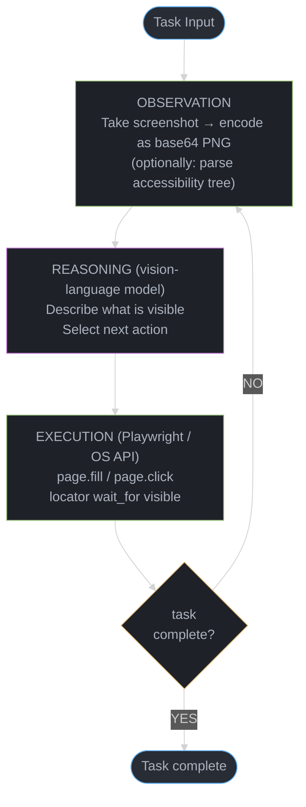
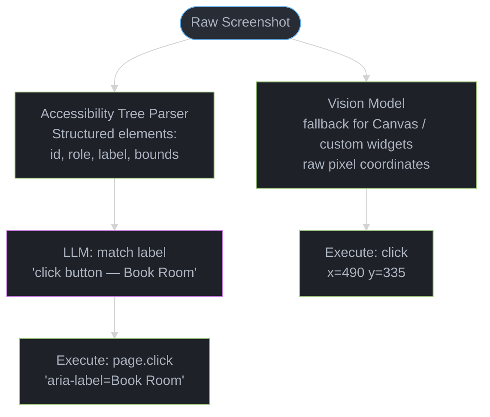
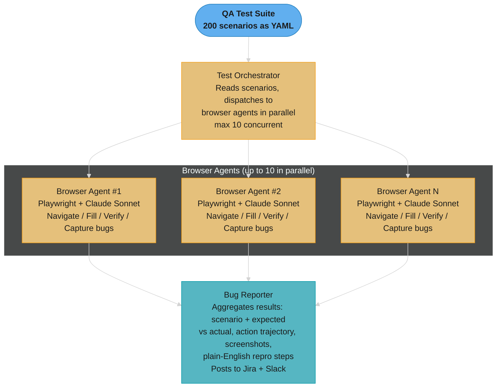

# Computer Use & Browser Agents

## 1. Concept Overview

Computer use agents interact with graphical interfaces — browsers, desktop applications, and operating systems — by observing the screen (via screenshots or accessibility trees) and issuing UI actions (clicks, typing, scrolling). Unlike API-based agents that call structured tool functions, computer use agents operate on the visual layer, enabling them to automate any software that a human could use, even without a programmatic API.

Browser agents specifically navigate the web: filling forms, clicking buttons, extracting data, and completing multi-step workflows on any website. They combine vision models (to see the screen), action models (to decide what to do), and execution layers (Playwright, Selenium, or OS APIs to perform actions). For an extended treatment of production browser-agent stacks, see [Browser Agents Deep Dive](../browser_agents_deep_dive/README.md).

---

## 2. Intuition

> **One-line analogy**: Computer use agents are like robotic process automation (RPA) with a brain — traditional RPA scripts break when the UI changes; a computer use agent adapts by reasoning about what it sees.

**Mental model**: Traditional software integration requires an API. But most of the world's software — enterprise ERPs, legacy portals, insurance claims systems — exposes no API; only a human-facing GUI. Computer use agents unlock automation for all of this by interacting at the visual/interaction layer. The trade-off: screen-based interaction is slower (3-10 seconds per action) and more fragile (DOM changes break selectors) than API calls. The architectural question for any automation task is: does this software have a stable API? If yes, use it. If not, computer use.

**Why it matters**: the global RPA market was ~$22.6B in 2025 and is forecast at ~$27.2B for 2026 (Fortune Business Insights); enterprise automation workflows are a massive opportunity. Computer use extends agentic capabilities from "software with APIs" to "any software humans use."

**Key insight**: The grounding problem — translating natural language intent into specific pixel coordinates or DOM elements — is the core technical challenge. Frontier vision+language models have dramatically improved grounding quality compared to earlier OCR-only approaches.

---

## 3. Core Principles

- **See → decide → act → verify**: every computer use step observes current screen state, decides the appropriate action, executes it, and takes a new screenshot to verify the action had the intended effect.
- **Accessibility tree > pixel grounding**: parsing the accessibility tree (structured DOM representation) is faster and more robust than pixel-coordinate clicking when available.
- **Action granularity matters**: actions must be atomic (one click, one keystroke sequence) to remain recoverable; batch actions are harder to debug and retry.
- **Human-in-the-loop for high-risk actions**: form submissions, purchases, and data deletions should require human confirmation.
- **Stateless verification**: never assume an action succeeded; always take a new screenshot and verify.

---

## 4. Types / Architectures / Strategies

Computer use systems differ along four choices that are made independently: **what the
agent perceives**, **what actually performs the action**, **which surface the agent
drives**, and **how tightly the task is specified**.

### 4.1 Grounding strategy — what the agent perceives

| Strategy | Input to the model | Working accuracy | Coverage | Per-step cost |
|----------|-------------------|------------------|----------|---------------|
| Pixel grounding | Screenshot; model returns `(x, y)` | ~70-85% | Universal — any GUI, Canvas, games, desktop | High (vision inference plus image transfer) |
| Accessibility tree | Structured text of roles, labels, bounds | ~85-95% | Anything exposing an accessibility API | Low (text-only prompt) |
| Hybrid | Tree first, pixels as fallback | Best available | Universal | Medium, and the most complex to build |

Those accuracies are per step and multiply across a task, which is why a ten-point per-step
gap becomes a forty-point gap over eight steps. Hybrid grounding does not raise any single
method's accuracy — it exists so that a Canvas element or an unlabeled custom widget does
not end the run at step 4.

### 4.2 Execution layer — what performs the action

| Layer | Drives | Stealth | Desktop | Typical use |
|-------|--------|---------|---------|-------------|
| Playwright | Chromium / Firefox / WebKit | Low — headless is detectable | No | Default for web agents; locators auto-wait |
| Selenium | W3C WebDriver browsers | Low | No | Existing WebDriver estates; widest language coverage |
| PyAutoGUI | Real OS input events | High | Yes | Desktop applications with no web surface |
| xdotool / OS APIs | X11 and native windows | High | Yes | Linux VMs hosting a full desktop session |

The execution layer is orthogonal to grounding: a vision model can drive Playwright by
coordinates, and an accessibility-tree agent can drive PyAutoGUI. Pick the layer from the
software you must reach, then pick grounding from what that software exposes.

### 4.3 Agent surface — browser, desktop, or provider-hosted

Browser-only agents (browser-use, Skyvern, a Playwright harness) get a narrower action
space, a real DOM to ground against, and cheap session persistence through cookies. Full
desktop agents (Anthropic's `computer` tool driving a VM, PyAutoGUI, xdotool) trade all
three away for the ability to automate software that never had a web front end.
Provider-hosted surfaces — the Anthropic computer use tool, OpenAI's `computer` tool on the
Responses API, ChatGPT agent — supply the action vocabulary and the injection classifiers,
but you still run the environment and execute every action yourself.

### 4.4 Task specification — open-ended versus declarative

An open-ended natural-language task ("book the cheapest 4-star hotel") lets the agent plan,
but widens the action space and makes failures hard to reproduce. A declarative scenario —
structured steps with explicit targets and verification assertions, as in the YAML suite in
Section 14 — constrains the action space, makes reproduction steps deterministic, and is
what gives step budgets and bug deduplication something stable to key on. Production
systems usually pin the high-risk paths declaratively and leave only discovery and
extraction open-ended.

---

## 5. Architecture Diagrams

### Computer Use Agent Loop


```mermaid
%%{init: {'flowchart': {'curve': 'basis'}, 'theme': 'dark'}}%%
flowchart TD
    Task([Task Input]) --> Observe
    Observe["OBSERVATION\nTake screenshot → encode as base64 PNG\n(optionally: parse accessibility tree)"] --> Reason
    Reason["REASONING (vision-language model)\nDescribe what is visible\nSelect next action"] --> Execute
    Execute["EXECUTION (Playwright / OS API)\npage.fill / page.click\nlocator wait_for visible"] --> Done{"task\ncomplete?"}
    Done -- NO --> Observe
    Done -- YES --> Output([Task complete])

    classDef io     fill:#282c34,stroke:#61afef,color:#abb2bf
    classDef proc   fill:#1e2127,stroke:#98c379,color:#abb2bf
    classDef llm    fill:#1e2127,stroke:#c678dd,color:#abb2bf
    classDef decide fill:#1e2127,stroke:#e5c07b,color:#abb2bf

    class Task,Output io
    class Observe,Execute proc
    class Reason llm
    class Done decide
```

Each iteration takes a fresh screenshot as input; the loop continues until the agent produces a final answer or a stopping condition is reached.

### Grounding Pipeline


```mermaid
%%{init: {'flowchart': {'curve': 'basis'}, 'theme': 'dark'}}%%
flowchart TD
    Screenshot([Raw Screenshot]) --> A11y & Vision
    A11y["Accessibility Tree Parser\nStructured elements:\nid, role, label, bounds"] --> LLMLabel["LLM: match label\n'click button — Book Room'"]
    LLMLabel --> ExecA["Execute: page.click\n'aria-label=Book Room'"]
    Vision["Vision Model\nfallback for Canvas / custom widgets\nraw pixel coordinates"] --> ExecB["Execute: click\nx=490 y=335"]

    classDef io     fill:#282c34,stroke:#61afef,color:#abb2bf
    classDef proc   fill:#1e2127,stroke:#98c379,color:#abb2bf
    classDef llm    fill:#1e2127,stroke:#c678dd,color:#abb2bf

    class Screenshot io
    class A11y,Vision proc
    class LLMLabel llm
    class ExecA,ExecB proc
```

The accessibility tree path is preferred (structured, reliable); the vision model fires only for canvas elements or custom widgets where the DOM offers no labels.

---

## 6. How It Works — Detailed Mechanics

### Anthropic Computer Use API

```python
import anthropic
import base64
from PIL import ImageGrab

client = anthropic.Anthropic()

def take_screenshot() -> str:
    """Capture screen and return as base64 PNG."""
    screenshot = ImageGrab.grab()
    import io
    buf = io.BytesIO()
    screenshot.save(buf, format='PNG')
    return base64.standard_b64encode(buf.getvalue()).decode('utf-8')

# Computer use is a beta feature and requires a beta header.
#   computer_20251124 + "computer-use-2025-11-24": Claude Opus 5, Sonnet 5,
#     Opus 4.8/4.7/4.6, Sonnet 4.6, Opus 4.5
#   computer_20250124 + "computer-use-2025-01-24": Claude Sonnet 4.5, Haiku 4.5

def run_computer_use_step(task: str, screenshot_b64: str) -> dict:
    response = client.beta.messages.create(
        model="claude-sonnet-5",
        max_tokens=1024,
        betas=["computer-use-2025-11-24"],
        tools=[
            {
                "type": "computer_20251124",
                "name": "computer",
                "display_width_px": 1280,
                "display_height_px": 800,
                "display_number": 1,   # optional; X11 display number
            }
        ],
        messages=[{
            "role": "user",
            "content": [
                {"type": "image", "source": {"type": "base64",
                                              "media_type": "image/png",
                                              "data": screenshot_b64}},
                {"type": "text", "text": task}
            ]
        }]
    )
    return response

# Supported action types (basic set, present in every tool version):
ACTION_TYPES = {
    "screenshot":         "Take a screenshot of the current screen",
    "left_click":         "Left click at coordinate [x, y]",
    "type":               "Type a string of text",
    "key":                "Press a keyboard key or combination",
    "mouse_move":         "Move mouse to [x, y] without clicking",
}
# The rest of the computer_20251124 action set:
#   scroll, left_click_drag, right_click, middle_click, double_click,
#   triple_click, left_mouse_down, left_mouse_up, hold_key, wait
#   zoom — inspect region [x1, y1, x2, y2] at full resolution
#          (requires enable_zoom: true on the tool)

# Agent loop for computer use
def computer_use_loop(task: str, max_steps: int = 50):
    messages = []
    for step in range(max_steps):
        screenshot = take_screenshot()

        # Build messages with screenshot + task
        if not messages:
            messages = [{
                "role": "user",
                "content": [
                    {"type": "image", "source": {"type": "base64",
                                                  "media_type": "image/png",
                                                  "data": screenshot}},
                    {"type": "text", "text": task}
                ]
            }]
        else:
            # Append new screenshot as tool result
            messages.append({
                "role": "user",
                "content": [
                    {"type": "tool_result",
                     "tool_use_id": last_tool_use_id,
                     "content": [{"type": "image",
                                  "source": {"type": "base64",
                                             "media_type": "image/png",
                                             "data": screenshot}}]}
                ]
            })

        response = client.beta.messages.create(
            model="claude-sonnet-5",
            max_tokens=1024,
            betas=["computer-use-2025-11-24"],
            tools=[{"type": "computer_20251124", "name": "computer",
                    "display_width_px": 1280, "display_height_px": 800}],
            messages=messages
        )

        # Check for stop condition
        if response.stop_reason == "end_turn":
            return response.content[-1].text

        # Execute computer action
        tool_use = next(b for b in response.content if b.type == "tool_use")
        last_tool_use_id = tool_use.id
        execute_computer_action(tool_use.input)

        messages.append({"role": "assistant", "content": response.content})
```

### browser-use Python Library

```python
# browser-use 0.13.x — LLM wrappers ship with the package itself
# (ChatBrowserUse / ChatOpenAI / ChatAnthropic / ChatGoogle), not via LangChain
from browser_use import Agent, ChatAnthropic

# browser-use: Python library driving a real browser under LLM control
agent = Agent(
    task="Go to amazon.com, search for 'mechanical keyboard', "
         "filter by 4+ stars and under $100, return the top 3 results",
    llm=ChatAnthropic(model="claude-sonnet-5"),
)

result = await agent.run()
print(result.final_result())

# browser-use handles:
# - Launching a Chromium browser
# - Taking screenshots after each action
# - Parsing the accessibility tree for element grounding
# - Retrying on stale element errors
# - Multi-tab management

# Custom browser configuration.
# `Browser` is an alias for `BrowserSession`; configuration fields are passed
# directly on it (or grouped into a BrowserProfile).
from browser_use import Browser

browser = Browser(
    headless=True,   # invisible browser (CI/CD)
)

agent = Agent(task="...", llm=llm, browser=browser)
```

### Playwright Agent Integration

```python
from playwright.async_api import async_playwright
import asyncio

async def playwright_agent_step(page, action: dict) -> str:
    """Execute a single browser action from LLM output."""
    action_type = action["type"]

    if action_type == "click":
        # Prefer accessibility selector over coordinates when possible
        selector = action.get("selector")
        if selector:
            await page.click(selector)
        else:
            await page.mouse.click(action["x"], action["y"])

    elif action_type == "type":
        await page.keyboard.type(action["text"])

    elif action_type == "fill":
        # Fill a form field by label or selector
        await page.fill(action["selector"], action["value"])

    elif action_type == "navigate":
        await page.goto(action["url"])

    elif action_type == "scroll":
        await page.mouse.wheel(action.get("delta_x", 0), action.get("delta_y", 100))

    elif action_type == "screenshot":
        screenshot = await page.screenshot()
        return base64.b64encode(screenshot).decode()

    # Wait for the page to settle by asserting on the element the next step
    # needs — locators auto-wait, so this is both faster and more reliable
    # than any global load-state wait.
    if action.get("wait_for"):
        await page.locator(action["wait_for"]).wait_for(state="visible", timeout=3000)
    return "success"

# Get accessibility tree instead of screenshot for text-heavy pages
async def get_accessibility_tree(page) -> str:
    """Structured DOM representation — faster and more robust than pixel grounding."""
    tree = await page.accessibility.snapshot()
    return format_accessibility_tree(tree)
```

### UI Element Grounding Methods

```
Three approaches to identifying what to click/type into:

1. PIXEL GROUNDING (screenshot + vision model)
   Model sees screenshot, outputs pixel coordinates (x, y)
   Pro: works on any interface, including non-HTML (desktop apps, games)
   Con: slow (requires vision model), brittle (pixel shift = miss)
   Accuracy: ~70-85% on typical web tasks (vision models)

2. ACCESSIBILITY TREE (structured DOM)
   Parse browser's accessibility API to get structured element tree:
     [button "Submit", aria-role=button, id=submit-btn, bounds=(450,320,80,30)]
     [input "Email address", aria-role=textbox, id=email, bounds=(200,200,300,40)]
   Model receives text representation, outputs element ID or aria label
   Pro: fast (no vision), robust (labels don't change like pixels), cheap
   Con: some elements aren't exposed in accessibility tree (Canvas, custom widgets)
   Accuracy: ~85-95% when accessibility tree is complete

3. HYBRID (tree + vision for fallback)
   Try accessibility tree first; fall back to pixel grounding for:
   - Canvas elements (charts, games)
   - Custom web components without aria labels
   - Legacy pages with poor accessibility
   Pro: best accuracy across all page types
   Con: higher complexity
   browser-use uses this approach

The accuracy bands above are working planning figures drawn from internal
production experience, not published benchmark results — treat them as
order-of-magnitude inputs to the arithmetic below, and measure your own.
```

**Read it like this.** "Those per-step accuracy percentages are multiplied together across a task, never averaged — so a ten-point gap per step becomes a forty-point gap per task."

This is the single most important arithmetic in browser automation, and it is the reason the industry moved from pixel grounding to accessibility trees despite pixels working on strictly more interfaces.

| Symbol | What it is |
|--------|------------|
| per-step accuracy | Probability this one click or fill targets the right element. 70-85% pixel, 85-95% tree |
| `n` | Steps in the task. From the step counts below: 3-5 simple, 10-20 multi-page |
| `accuracy^n` | Probability every step lands. Steps are serial, so probabilities multiply |
| task success | What the user actually experiences. Always lower than the per-step number quoted |

**Walk one example.** The three working accuracy figures above, carried across an 8-step and a 20-step task:

```
  grounding method            per step     8-step task        20-step task
    pixel (weak case)            70%       0.70^8 =  5.8%     0.70^20 = 0.08%
    pixel (strong case)          85%       0.85^8 = 27.3%     0.85^20 =  3.9%
    accessibility tree           95%       0.95^8 = 66.3%     0.95^20 = 35.8%

  the per-step gap 85% -> 95% is 10 points
  the 8-step task gap 27.3% -> 66.3% is 39 points
  the 20-step task gap  3.9% -> 35.8% is 32 points, a 9.2x ratio
```

**Why hybrid grounding exists at all.** Read the bottom row: even at 95% per step, a 20-step workflow completes only about a third of the time end-to-end. No realistic per-step accuracy rescues a long task by itself, which is why every serious system pairs grounding with retry logic, post-action verification, and step budgets — mechanisms that break the pure multiplication by giving failed steps a second chance. Hybrid grounding is the same instinct applied one level down: it does not make any single method more accurate, it just makes the *fallback* path exist so that a Canvas element does not end the run at step 4.

### Action Latency Model

```
Action step timing breakdown (typical values):
  Screenshot capture:      100-300ms
  Screenshot base64 encode: 50-100ms
  LLM API call:            1,000-3,000ms
  Action execution:        100-500ms
  Page load/settle:        200-2,000ms (wait for the next element)
                          ─────────────
  Total per action step:   1,500-6,000ms (1.5-6 seconds)

Typical task step counts:
  Simple form fill:         3-5 steps      (5-25 seconds)
  Web search + click:       4-8 steps      (8-40 seconds)
  Multi-page workflow:      10-20 steps    (20-120 seconds)
  Complex e-commerce task:  15-30 steps    (30-180 seconds)

Comparison to API-based agents:
  API tool call:            200-1,000ms (5-10× faster per step)
  Computer use step:        1,500-6,000ms

Implication: computer use is appropriate for tasks with no API alternative,
not for tasks where a structured API exists.
```

**Put simply.** "Every action costs one full model call plus the physical time a browser needs to catch up — so task duration is just steps times that fixed toll."

The five components are strictly serial: nothing can be overlapped, because each stage needs the previous stage's output. That is what makes the model additive rather than a max.

| Symbol | What it is |
|--------|------------|
| screenshot + encode | Capturing and base64-ing the frame. Grows with resolution, `1280 x 800` here |
| LLM API call | The dominant term. One full inference per action, with an image in the prompt |
| action execution | The click or keystroke itself. Genuinely fast |
| page load / settle | Waiting for the next element to appear. The most variable term — the site controls it, not you |
| total per step | The sum of all five. Multiplied by step count to get task duration |

**Walk one example.** Add the column ends to get the quoted 1.5-6 s band, then scale by step count:

```
                              fast case      slow case
  screenshot capture             100 ms        300 ms
  base64 encode                   50           100
  LLM API call                 1,000         3,000
  action execution               100           500
  page load / settle             200         2,000
                              -------       -------
  total per step               1,450 ms      5,900 ms      (quoted as 1.5-6 s)

  LLM share of the step   1,000/1,450 = 69%    3,000/5,900 = 51%

  a 10-20 step multi-page workflow, at 2 s and 6 s per step:
    10 x 2 =  20 s          20 x 2 =  40 s
    10 x 6 =  60 s          20 x 6 = 120 s        -> the quoted 20-120 s band

  versus an API agent at 200-1,000 ms per step:
    6,000 / 1,000 = 6.0x        1,500 / 200 = 7.5x        midpoints 3,750/600 = 6.3x
```

**Why optimizing the wrong term is the usual mistake.** Teams reach first for screenshot compression, since it is the part they control — but capture plus encode is only 150 ms of a 1,450 ms fast step, so halving it buys about 5%. The LLM call is 51-69% of every step and the page settle is the term that spikes. The two changes that actually move the number are dropping the screenshot entirely in favour of the accessibility tree (a text prompt infers far faster than an image one) and replacing blanket page-level settle waits with a targeted `locator(...).wait_for()` on the one element the next action needs.

### Reliability Challenges

```
1. Stale elements (DOM changes during interaction)
   Problem: element clicked, then DOM re-renders, element moves
   Solution: retry with exponential backoff; re-resolve the locator each attempt

2. Dynamic JavaScript pages
   Problem: content loads asynchronously; model acts before content loads
   Solution: locator(target).wait_for(state="visible") on the element the
             next action needs — locators auto-wait and re-query the DOM

3. CAPTCHAs
   Problem: automated browsing detected; CAPTCHA presented
   Solution: human-in-the-loop escalation; anti-CAPTCHA services for legitimate use
   Note: bypassing CAPTCHAs on unwilling sites violates ToS

4. Session expiry
   Problem: long agent runs trigger re-authentication
   Solution: cookie persistence; refresh tokens; detect login page and re-authenticate

5. Layout changes (A/B tests)
   Problem: site runs A/B test; element moved between agent runs
   Solution: semantic grounding (find "Submit button" not "button at x=450") over coordinate grounding

6. Rate limiting / IP blocks
   Problem: rapid automated browsing triggers bot detection
   Solution: human-like delays (200-500ms between actions), headless=False for sites using JS detection
```

The retry, verification, and step-budget patterns above are instances of the general agent reliability toolkit — see [agent_reliability.md](agent_reliability.md).

### The Screen Is Untrusted Input

The six failures above are accidents. The seventh is an adversary, and it is the failure
mode that separates computer use from every other tool an agent has: **the observation
channel and the instruction channel are the same pixels.** A text agent receives a
poisoned document as a `tool_result` block you can label, delimit, and truncate. A
computer use agent receives it as the screenshot that *is* its perception of the world —
there is no wrapper to put around a rendered `<div>` that says "the following is data,
not orders". Anthropic's own documentation states the consequence plainly: "In some
circumstances, Claude will follow commands found in content even when they conflict with
your instructions. For example, instructions on webpages or contained in images might
override your instructions or cause Claude to make mistakes."

Why the blast radius is larger than a normal injection. The agent is driving a *logged-in*
browser or desktop. An attacker who gets text onto any page the agent visits — a support
ticket body, a product review, an ad iframe, alt text on an image — does not need to steal
credentials, because the agent already holds the session. This is the classic confused
deputy: the injected instruction executes with the human's authority. "Open the settings
page and add this forwarding address" is one click for an agent that is already
authenticated.

Provider-side defense exists but is not the control. Anthropic trains the model to resist
these injections and additionally runs classifiers over computer use requests; when a
classifier flags a potential injection in a **screenshot**, it automatically steers the
model to ask for user confirmation before the next action. That default is opt-out via
support, and the docs are explicit that it "won't be ideal for every use case (for
example, use cases without a human in the loop)" — which is precisely the deployment where
you most need it, so turning it off should be a decision with an owner, not a config
default. The vendor's own guidance keeps the four architectural precautions in place
regardless of the classifier: a dedicated VM or container with minimal privileges, no
access to sensitive data such as login credentials, internet access limited to an
allowlist of domains, and human confirmation for anything with meaningful real-world
consequences or requiring affirmative consent — accepting cookies, financial transactions,
agreeing to terms of service.

The general taxonomy of injection attacks and defenses lives in
[LLM Security](../llm_security/README.md); the cross-agent propagation case, where one
agent's poisoned output becomes another's trusted input, is in
[Multi-Agent Security](../multi_agent_systems/multi_agent_security.md).

---

## 7. Real-World Examples

### Anthropic Computer Use

A beta feature of the Claude API: tool version `computer_20251124` behind the
beta header `computer-use-2025-11-24` on Claude Opus 5, Sonnet 5, Opus
4.8/4.7/4.6, Sonnet 4.6 and Opus 4.5; `computer_20250124` on Sonnet 4.5 and
Haiku 4.5.

- Action space: screenshot, `left_click`, `type`, `key`, `mouse_move`, scroll,
  drag, right/middle/double/triple click, `left_mouse_down`/`left_mouse_up`,
  `hold_key`, `wait`, and `zoom` for reading small on-screen text
- Use cases: software testing, RPA automation, data entry, web scraping
- Latency: ~3-8 seconds per action step at typical network conditions
- Benchmark anchor: Anthropic's published OSWorld figures for its computer-use
  agent are **14.9% screenshot-only** (next-best system 7.8%) and **22.0% when
  given more steps** — both far below the 72.36% human baseline the OSWorld
  paper reports

### browser-use (Open Source)

Python library, ~295M cumulative PyPI downloads as of July 2026 (v0.13.6):
- Drives a real Chromium browser with an LLM (Claude/GPT/Gemini) plus structured
  accessibility tree parsing
- Action space: navigate, click, fill, extract, scroll, back/forward, tab management
- Memory: extracts key information during browsing and stores in structured format
- Cost: roughly $0.01-0.05 per simple web task at mid-tier frontier model prices

### OpenAI Computer-Using Agent (CUA)

OpenAI ships computer use in two places. For consumers it lives inside **ChatGPT
agent**, which completes autonomous web tasks — food ordering, travel booking,
form completion — and pauses for user confirmation on payment steps. For
developers it is the built-in **`computer`** tool on the Responses API
(`tools=[{"type": "computer"}]`, models `gpt-5.6` and `gpt-5.4`): you send a
screenshot plus the task, the model returns a `computer_call` output item with
the action, your code executes it and returns the next screenshot.

---

## 8. Tradeoffs

| Approach | Speed | Reliability | Coverage | Cost |
|----------|-------|-------------|----------|------|
| API integration | Fast (200ms) | High | API-only | Low |
| Accessibility tree | Medium (1-3s) | Medium-High | Web/desktop | Medium |
| Pixel grounding | Slow (3-8s) | Medium | Universal | High (vision model) |
| Hybrid (tree+vision) | Medium (2-5s) | High | Universal | High |

| Execution Layer | Stealth | JS Support | Desktop | Speed |
|-----------------|---------|------------|---------|-------|
| Playwright | Low (headless detectable) | Full | No | Fast |
| Selenium | Low | Full | No | Medium |
| PyAutoGUI | High (real input) | N/A | Yes | Fast |
| xdotool (Linux) | High | N/A | Yes | Fast |

---

## 9. When to Use / When NOT to Use

### Use Computer Use / Browser Agents When:
- No stable API exists for the target software
- Automating legacy enterprise systems (ERP, insurance portals, CRMs)
- Scraping sites that require interaction (login-gated, JavaScript-rendered)
- Software testing: test UI workflows automatically
- Accessibility testing: detect UI issues programmatically

### Avoid When:
- A stable API exists — always prefer APIs over UI automation
- Latency requirements are strict (<1 second per operation)
- The site actively blocks automation (legal/ToS issues may apply)
- High-stakes irreversible actions (financial transactions, data deletion) without HITL

---

## 10. Common Pitfalls

1. **Acting without verifying**: clicking a button and immediately assuming success. Always take a post-action screenshot and check the resulting state matches expectation before proceeding.

2. **Coordinate drift**: hardcoding pixel coordinates from a specific screen resolution. A 4K monitor has different coordinates than a 1080p monitor. Use semantic selectors (aria-label, role+text) over coordinates wherever possible.

3. **Ignoring page load state**: acting on a page that's still loading causes clicks on elements that move or disappear. Always wait for the specific element the next action needs — `locator(target).wait_for(state="visible")` — before acting.

4. **Escalating all CAPTCHAs to API**: some sites tolerate a human-like user agent with realistic delays. Reduce headless bot signatures before assuming CAPTCHA escalation is needed.

5. **No step limit**: computer use agents can run indefinitely navigating to wrong pages. Enforce a hard step limit (50 steps) and return partial results or escalate on timeout.

6. **Storing credentials in prompts**: injecting usernames/passwords into the LLM prompt leaks credentials to the model provider. Use environment variables or a credential vault; inject credentials only into the Playwright `page.fill()` call, not the LLM message.

---

## 11. Technologies & Tools

| Tool | Purpose | Notes |
|------|---------|-------|
| **Anthropic Computer Use API** | Screen-based agent | Beta; `computer_20251124` on Opus 5 / Sonnet 5 |
| **browser-use** | Web automation library | Python; LLM-driven Chromium; open source |
| **Playwright** | Browser automation | Microsoft; Chromium/Firefox/WebKit |
| **Selenium** | Browser automation | W3C WebDriver protocol; widest language coverage |
| **OpenAI `computer` tool** | CUA for developers | Responses API; `gpt-5.6` / `gpt-5.4` |
| **SomAgent** | Web navigation research | Grounding model for web elements |
| **WebArena** | Web agent benchmark | 812 tasks; realistic web environments |
| **OSWorld** | OS-level agent benchmark | Ubuntu VM; GUI tasks |
| **PyAutoGUI** | Desktop automation | Cross-platform; real OS input events |
| **Skyvern** | RPA with LLMs | Playwright+vision; form automation |

---

## 12. Interview Questions with Answers

**Q: What is computer use and how does it differ from API-based tool calling?**
**Short:** Computer use drives a GUI via screenshots and clicks; API tool calling is far faster and cheaper via structured calls.
A: Computer use enables an LLM agent to interact with software through its graphical interface — taking screenshots, clicking, typing, and scrolling — just like a human user. API-based tool calling sends structured function calls to programmatic interfaces. Key differences: computer use works on any software regardless of API availability (covering legacy systems, proprietary portals, anything with a UI); API tool calling is 5-10× faster per step (200ms vs 3-8s), more reliable (no stale element risk), and cheaper (no vision model). Use computer use when no API exists; use API tool calling when it does.

**Q: How does the Anthropic Computer Use API work at a protocol level?**
**Short:** The model sees a screenshot each turn and emits click or type actions as a tool_use block your code executes and re-screenshots.
A: The model is given a computer tool in its tool spec — `computer_20251124` on current models, behind the `computer-use-2025-11-24` beta header. Each conversation turn includes a screenshot (base64 PNG) of the current screen. The model responds with a normal `tool_use` block naming that tool: `{"type": "tool_use", "id": "toolu_...", "name": "computer", "input": {"action": "left_click", "coordinate": [490, 335]}}`. Your application code intercepts this, executes the action via OS APIs or Playwright, takes a new screenshot, and injects it as the tool result. This screenshot-action loop repeats until the model produces a text response without a tool call (task complete) or the step limit is reached. The model never executes actions directly — it only describes them.

**Q: What is UI element grounding and why is it the core technical challenge?**
**Short:** Grounding maps an intent like clicking Submit to a coordinate or DOM element, and accessibility trees beat raw pixel guessing.
A: Grounding is the problem of translating a high-level intent ("click the Submit button") to a specific UI element (pixel coordinate or DOM selector). Without perfect grounding, agents click the wrong element or miss entirely. Approaches: (1) pixel grounding — vision model identifies coordinates from a screenshot; accuracy ~70-85%, works on any interface, slow; (2) accessibility tree — parse DOM's aria roles and labels into a structured text tree; accuracy ~85-95% when accessibility is well-implemented, fast, no vision needed; (3) hybrid — accessibility tree first, pixel fallback for unlabeled elements. The hard cases: Canvas-rendered UIs (charts, games, map interactions) expose no accessibility tree structure and require vision-based grounding.

**Q: How does browser-use differ from writing Playwright scripts manually?**
**Short:** browser-use finds elements semantically so it survives redesigns, at far higher latency and cost than a hardcoded selector script.
A: Manual Playwright scripts hardcode selectors (`page.click("#submit-btn")`) — they break whenever the DOM changes. browser-use uses an LLM to decide dynamically what to click based on semantic understanding of the page's accessibility tree and visual state. When the site redesigns and moves the Submit button, the manual script breaks; browser-use adapts because it looks for "the button labeled Submit" not a hardcoded ID. The trade-off: browser-use is 10-100× slower per page action (LLM call per step vs. direct Playwright call), 10-100× more expensive, and less deterministic. Use manual Playwright for stable, well-known sites with deterministic workflows; use browser-use for adaptive automation on sites that change or for tasks with variable UI states.

**Q: What are the main reliability challenges in production browser agents?**
**Short:** Stale elements, late-loading JavaScript, CAPTCHAs, shifting A/B layouts, and popups are the main browser-agent failure modes.
A: (1) Stale elements: the agent clicks an element that the JavaScript framework removes and re-renders; fix with explicit wait strategies and retry; (2) Dynamic JS pages: content loads after the DOM event fires; fix by waiting on the target element with `locator(target).wait_for(state="visible")`; (3) CAPTCHAs: automated browsing detected; fix with human-in-the-loop or anti-CAPTCHA services for legitimate automation; (4) A/B tests: site runs experiments that move UI elements between agent sessions; fix with semantic grounding over coordinate grounding; (5) Popup interruptions: cookie consent, notification modals, chat widgets appear mid-task; the agent must detect and dismiss them before continuing the primary task.

**Q: How do you handle high-risk actions (form submissions, purchases) in a computer use agent?**
**Short:** Classify pending actions by risk and pause for human approval before any submit, purchase, or delete executes.
A: Human-in-the-loop (HITL) is mandatory for irreversible actions. Architecture: (1) Risk classification — before executing, classify the pending action (low: navigate, search; medium: form fill; high: submit, purchase, delete); (2) HITL gate — for high-risk actions, pause the agent and surface the pending action with its context to a human; (3) Wait for approval — the agent is suspended until the human approves or rejects; (4) Audit log — log all high-risk actions with agent reasoning, human decision, and outcome. Implementation in Playwright: before `page.click("#checkout-button")`, check the action type; if high-risk, trigger an interrupt and wait for an approval event. Never allow purchases or data deletions to proceed without explicit human confirmation in production.

**Q: What is the typical latency per computer use step and what drives it?**
**Short:** A computer use step costs one to six seconds, dominated by the vision model's own LLM call.
A: A single computer use step takes 1.5-6 seconds. Breakdown: screenshot capture (100-300ms) + base64 encoding (50-100ms) + LLM API call (1,000-3,000ms) + action execution (100-500ms) + page settle, waiting for the next element (200-2,000ms). The LLM call is the dominant cost at ~1-3 seconds. For a 20-step web task, total wall time is 30-120 seconds. Optimizations: (1) use accessibility tree instead of screenshot when possible — skips vision model call (~500ms savings per step); (2) stream screenshots at lower quality (lower bandwidth); (3) skip the settle wait for known-static pages; (4) pipeline: start the next screenshot while the previous action executes. Compare: API tool call completes in 200-1000ms — 3-10× faster than computer use per step.

**Q: How do you benchmark computer use agents?**
**Short:** OSWorld and WebArena show agents still trail humans by large margins on real desktop and web navigation tasks.
A: OSWorld (2024): 369 GUI tasks on an Ubuntu VM across real desktop and web applications — the most comprehensive desktop benchmark; humans complete 72.36%, while the best model in the original paper reached 12.24% and Anthropic's launch computer-use agent reported 14.9% screenshot-only / 22.0% with extra steps. WebArena: 812 web navigation tasks on realistic self-hosted websites — the paper's best GPT-4 agent scored 14.41% against 78.24% human performance, and leading systems have since climbed well above that. Mind2Web: 2,350 tasks across 137 real websites in 31 domains, using recorded demonstrations as ground truth. Scoring: function-based verification of backend state for WebArena; task completion for OSWorld. Custom eval: for production, build domain-specific task sets (your target websites/apps) and measure success rate and cost-per-task. Public benchmarks set directional expectations but your production task distribution matters most.

**Q: How should credentials be handled in a browser agent?**
**Short:** Fetch credentials from a vault and fill them directly via Playwright, never passing them through the LLM prompt.
A: Never include credentials in the LLM prompt — they would be sent to the model provider and potentially logged. Correct approach: (1) store credentials in environment variables or a secure vault (HashiCorp Vault, AWS Secrets Manager); (2) inject credentials directly into Playwright `page.fill()` or `page.type()` calls, bypassing the LLM entirely; (3) for the LLM, provide a placeholder: "Use the stored credentials for this service" — the LLM calls a `get_credentials(service_name)` tool; (4) the tool fetches from the vault and fills the fields directly without exposing values to the model. Session persistence: save browser cookies/localStorage after login so the agent doesn't need to re-authenticate every run — use Playwright's `browser_context.storage_state()`.

**Q: When is computer use appropriate vs. building a dedicated API integration?**
**Short:** Build a dedicated API integration for stable high-frequency workflows, and reach for computer use only when no API exists.
A: Build API integration when: the service has a stable, documented API (REST, GraphQL, SDK); the automation is high-frequency (hundreds of calls/day); the workflow requires SLA reliability (<1s latency); the service is business-critical. Use computer use when: no API exists (legacy systems, proprietary portals); the API is unstable, rate-limited, or expensive; the automation task is low-frequency (daily/weekly); the service is accessed by humans via a browser already and the workflow is simple. Heuristic: if a junior developer could write a Playwright script to do it, consider computer use. If it requires deep integration work, an API integration is more robust long-term. Computer use is an accelerator for automation tasks that would otherwise require months of custom integration work.

**Q: What are the tradeoffs between screenshot-based and DOM/accessibility-tree-based interaction?**
**Short:** Accessibility-tree grounding is cheaper and more accurate than raw screenshots, which remain the fallback for canvas-only UI.
A: Screenshot-based (pixel grounding): the model receives a PNG of the screen and outputs pixel coordinates. It works universally — any GUI, any technology stack, desktop apps, games, Canvas-rendered UIs. Accuracy: ~70-85% on typical web tasks. Per-step cost: high (vision model inference + screenshot transfer). Main failure mode: coordinate drift when layout changes between screenshot capture and action execution. DOM/accessibility-tree-based: the browser exposes a structured tree of UI elements with roles, labels, and bounds. The model receives this as text and outputs element identifiers. Accuracy: ~85-95% when the accessibility tree is complete. Per-step cost: lower (no vision model, smaller input). Main failure mode: elements without aria labels or role attributes are invisible to the tree. Practical recommendation: use accessibility tree as the primary approach; fall back to screenshot-based pixel grounding for Canvas elements, SVG charts, and custom web components that lack accessibility attributes. The hybrid approach achieves 90%+ accuracy across diverse web applications.

**Q: How do you handle dynamic web content — SPAs, lazy loading, and JavaScript-rendered pages?**
**Short:** Wait on a specific target element's visibility instead of a fixed sleep, since load timing varies by network and server.
A: Single-page applications (SPAs) and lazily-loaded content are the top reliability challenge for browser agents. Common failure patterns: (1) clicking a button that triggers an AJAX request, then immediately reading the page before the response arrives; (2) scrolling to the bottom to trigger lazy loading, then acting on elements that haven't been injected yet; (3) navigating to a route that starts rendering before all data is fetched. Mitigations: (a) after navigation and after clicks that trigger navigation, wait on the element the next step needs — `page.locator(target).wait_for(state="visible")`; Playwright locators auto-wait and re-query the DOM, so asserting the target element is both faster and more reliable than any page-level load-state wait; (b) for lazy loading, wait on a specific element that appears only when content is ready, e.g. `page.locator("[data-loaded='true']").wait_for()`; (c) add explicit observation step after each action — take a new screenshot and verify the expected change is visible before proceeding; (d) for AJAX responses, poll for a specific DOM state change rather than using fixed sleep delays. Fixed sleeps (`time.sleep(2)`) are brittle — page load time varies by network and server load.

**Q: What safety guardrails are necessary for production computer use agents?**
**Short:** Layer risk classification, a domain allowlist, human approval on high-risk actions, and a session kill switch.
A: Computer use agents executing real actions require layered safety: (1) action risk classification — every action type gets a risk level: navigate (low), fill form (medium), click submit/send/purchase (high), download/upload files (high), system commands (critical); (2) allowlist of approved domains — the agent may only navigate to domains in an explicit whitelist; attempts to visit unknown domains are blocked; (3) human-in-the-loop for high-risk actions — any action classified "high" or "critical" triggers a pause, surfaces the pending action to a human, and waits for explicit approval before executing; (4) audit log with full screenshots — every action is logged with: timestamp, action type, arguments, screenshot before, screenshot after; retained for 30 days for compliance; (5) kill switch — a session-level abort mechanism that terminates the agent and reverts any reversible actions (form fills, not submitted forms); (6) rate limiting — cap actions per minute to detect runaway loops before they cause harm. Without these guardrails, a single agent bug can trigger unintended purchases, form submissions, or data deletions at scale.

**Q: How does the latency of screenshot-based agents compare to API-based alternatives, and when is the difference acceptable?**
**Short:** The five-to-ten-times slower screenshot loop is fine for background async work but not for real-time user-facing tasks.
A: Screenshot-based computer use: 1.5-6 seconds per action step (screenshot capture 200ms + LLM vision call 1-3s + action execution 200ms + page settle 200-2000ms). For a 15-step workflow: 22-90 seconds total. API-based tool call: 200-1000ms per call. For 15 API calls: 3-15 seconds total. The latency difference is 5-10× per step, compounding to a 6-30× difference for a full task. This difference is acceptable when: the task is a background/asynchronous workflow where latency is not user-facing (daily report generation, overnight data entry); the task has no API alternative and would otherwise require manual human work; the task runs infrequently (once per day or per week). The difference is not acceptable when: the task is user-facing (user waits for result in real time), the task runs continuously or at high frequency, or there is a viable API alternative. Decision rule: compute cost-per-task for both approaches (API integration is one-time development cost + low runtime cost; computer use has zero development cost but high runtime cost per execution) and break-even on volume.

**Q: How do you evaluate browser agent reliability across diverse web environments?**
**Short:** Run each task multiple times across a diverse URL matrix and tag failures by root cause to compute pass@1 and pass@5.
A: Use a structured test matrix: (1) representative URL set — select 20-30 URLs covering: static HTML pages, SPAs (React/Vue/Angular), legacy pages with poor accessibility, pages with iframes, pages behind authentication; (2) task diversity — at least 5 task types: navigation, form fill, data extraction, multi-step workflow, error recovery; (3) repeated runs — run each task 5 times to compute pass@1 and pass@5; high variance = reliability issue; (4) failure categorization — tag each failure with root cause: wrong element selected, timeout waiting for content, CAPTCHA encountered, DOM changed mid-action, action had no effect; (5) regression suite — after each agent code change, run the full matrix; alert if any category's success rate drops more than 5 percentage points. Public benchmarks (WebArena: 812 tasks, OSWorld: 369 tasks) provide directional data but are not representative of any specific application's DOM structure and interaction patterns. Always build a domain-specific eval suite.

**Q: Why is prompt injection worse for a computer use agent than for a text agent?**
**Short:** A screenshot mixes instructions and data in the same pixels, so any visible page text can hijack a logged-in agent session.
A: Because the observation channel and the instruction channel are the same pixels — the screenshot IS the agent's perception, so there is no wrapper that marks page text as data rather than orders. In a text agent you receive a poisoned document as a `tool_result` block and can label, delimit, and truncate it; a rendered page arrives as an image the model reads holistically, and an attacker only needs text on any surface the agent looks at — a ticket body, a product review, an ad iframe, image alt text. The blast radius is also larger because the agent drives a logged-in browser or desktop, so the injected instruction executes with the human's authority without the attacker ever stealing a credential (the confused-deputy pattern). Defenses in order of strength: run the session in a dedicated VM or container with minimal privileges; keep credentials and sensitive data out of that environment entirely; restrict navigation to an allowlist of domains; and require human confirmation for consequential or consent-granting actions (financial transactions, accepting terms, cookie banners). Anthropic additionally runs classifiers that flag suspected injections in screenshots and steer the model to ask for confirmation before the next action — useful, but it is opt-out and explicitly weaker for headless deployments with no human in the loop, so never treat it as the primary control.

---

## 13. Best Practices

1. **Always verify actions by taking a new screenshot**: never assume an action succeeded; check the resulting state before proceeding.
2. **Prefer accessibility tree over pixel grounding**: faster, cheaper, more robust; fall back to pixel only for Canvas or poorly labeled elements.
3. **Use semantic selectors (aria-label, role+text) over hardcoded coordinates or IDs**: site redesigns don't break semantic selectors.
4. **Inject credentials via vault, not LLM prompt**: prevents credential exposure to model provider logs.
5. **Add human-in-the-loop for irreversible actions**: form submission, payment, data deletion must pause for human confirmation.
6. **Set a hard step limit and return partial results on timeout**: prevents runaway agents from consuming resources indefinitely.
7. **Log full trajectories including screenshots**: essential for debugging; screenshots show exactly what the agent saw at each step.

---

## 14. Case Study: Browser Agent for Automated QA Testing

**Problem Statement**: A 60-person B2B SaaS company releases software updates weekly. Manual QA testing of the web app covers 200 test scenarios and requires 2 QA engineers for 2 days. As the feature surface grows, manual QA cannot scale. The goal: a browser agent that autonomously executes the test suite, reports bugs with reproduction steps and screenshots, and sends results to the engineering Slack channel — reducing manual QA time to 4 hours of human review per release.

**Architecture Overview**:


```mermaid
%%{init: {'flowchart': {'curve': 'basis'}, 'theme': 'dark'}}%%
flowchart TD
    classDef io      fill:#61afef,stroke:#2e86c1,color:#1a1a1a,font-weight:bold
    classDef frozen  fill:#c678dd,stroke:#9b59b6,color:#fff
    classDef train   fill:#98c379,stroke:#27ae60,color:#1a1a1a
    classDef mathOp  fill:#d19a66,stroke:#e67e22,color:#1a1a1a,font-weight:bold
    classDef lossN   fill:#e06c75,stroke:#c0392b,color:#fff,font-weight:bold
    classDef req     fill:#56b6c2,stroke:#0097a7,color:#1a1a1a
    classDef base    fill:#e5c07b,stroke:#f39c12,color:#1a1a1a

    Suite(["QA Test Suite<br/>200 scenarios as YAML"]) --> Orch
    Orch["Test Orchestrator<br/>Reads scenarios, dispatches to<br/>browser agents in parallel<br/>max 10 concurrent"] --> A1 & A2 & AN

    subgraph Agents ["Browser Agents (up to 10 in parallel)"]
        A1["Browser Agent #1<br/>Playwright + Claude Sonnet<br/>Navigate / Fill / Verify / Capture bugs"]
        A2["Browser Agent #2<br/>Playwright + Claude Sonnet<br/>Navigate / Fill / Verify / Capture bugs"]
        AN["Browser Agent N<br/>Playwright + Claude Sonnet<br/>Navigate / Fill / Verify / Capture bugs"]
    end

    A1 --> Reporter
    A2 --> Reporter
    AN --> Reporter
    Reporter["Bug Reporter<br/>Aggregates results: scenario + expected<br/>vs actual, action trajectory, screenshots,<br/>plain-English repro steps<br/>Posts to Jira + Slack"]

    class Suite io
    class Orch base
    class A1,A2,AN base
    class Reporter req
```

**Key Design Decisions**:

1. Accessibility tree primary, screenshot fallback: the app is a React SPA — all interactive elements have aria-labels (enforced by the frontend team's accessibility standard). The agent uses the accessibility tree for 95% of interactions. Screenshot-based grounding is only needed for the D3.js chart components. This reduces per-step latency from ~4s (screenshot+vision) to ~1.5s (accessibility tree only).

2. Declarative test scenarios in YAML: test scenarios are written as structured steps, not open-ended natural language. This constrains the agent's action space and makes reproduction steps deterministic.

3. Verification step after every write action: after filling a form field, the agent reads the field back and verifies the value was accepted. After submitting a form, it waits for the success state indicator. This catches subtle issues like autocomplete overwriting typed values or form validation rejecting valid inputs.

4. Bug deduplication: before filing a bug report, the orchestrator checks if an identical `(scenario_id, error_type, element_selector)` combination was reported in the last 30 days. Duplicates are linked to the existing issue rather than creating noise.

5. Hard step limit of 30 per scenario: if a scenario reaches 30 steps without completing, the agent is considered stuck and the scenario is marked as a timeout failure with the partial trajectory included in the bug report for human review.

**Implementation**:

```python
# Test scenario format (YAML)
# scenarios/checkout_flow.yaml
"""
name: "Complete checkout with credit card"
url: "https://staging.app.example.com/shop"
steps:
  - action: navigate
    target: "/shop"
  - action: click
    target: "Add to Cart button for 'Pro Plan'"
  - action: click
    target: "View Cart button"
  - action: click
    target: "Proceed to Checkout button"
  - action: fill
    target: "Card Number field"
    value: "4242424242424242"
  - action: fill
    target: "Expiry field"
    value: "12/26"
  - action: fill
    target: "CVV field"
    value: "123"
  - action: click
    target: "Complete Purchase button"
verify:
  - element: "Order Confirmation header"
    state: "visible"
  - element: "Order number"
    state: "contains_text"
"""

QA_AGENT_SYSTEM_PROMPT = """You are a QA testing agent. Execute the given test scenario
step by step on the web application.

For each step:
1. Find the target element using the accessibility tree
2. Execute the action (click, fill, navigate)
3. Take a screenshot to verify the action succeeded
4. If the expected state is not reached, this is a test failure

Report format on failure:
- Step that failed
- Expected: [what should have happened]
- Actual: [what happened instead]
- Screenshot: [attached]

If you cannot find an element, try: different text, partial match, parent element.
After 2 failed attempts to find an element, report it as a bug.
"""

class QABrowserAgent:
    def __init__(self, playwright_page, llm_client):
        self.page = playwright_page
        self.llm = llm_client
        self.action_log = []
        self.screenshots = []

    async def execute_scenario(self, scenario: dict) -> QAResult:
        await self.page.goto(scenario["url"])
        steps_executed = 0

        for step in scenario["steps"]:
            if steps_executed >= 30:  # hard step limit
                return QAResult(status="timeout",
                                steps_log=self.action_log,
                                screenshots=self.screenshots)
            try:
                result = await self.execute_step(step)
                self.action_log.append(result)
                steps_executed += 1

                # Verification screenshot after every write action
                if step["action"] in ("fill", "click", "submit"):
                    screenshot = await self.page.screenshot()
                    self.screenshots.append({
                        "step": steps_executed,
                        "after_action": step,
                        "screenshot": screenshot
                    })

                    # Verify with LLM: did action succeed?
                    verified = await self.verify_action(step, screenshot)
                    if not verified:
                        return QAResult(
                            status="failure",
                            failed_step=step,
                            steps_log=self.action_log,
                            screenshots=self.screenshots,
                            reproduction_steps=self.format_reproduction_steps()
                        )
            except ElementNotFound as e:
                # Retry once with semantic search
                try:
                    result = await self.semantic_find_and_act(step)
                    self.action_log.append(result)
                except ElementNotFound:
                    return QAResult(
                        status="failure",
                        failed_step=step,
                        error="Element not found after retry",
                        steps_log=self.action_log,
                        screenshots=self.screenshots
                    )

        # Final verification
        for assertion in scenario.get("verify", []):
            ok = await self.verify_assertion(assertion)
            if not ok:
                return QAResult(
                    status="failure",
                    failed_step={"verify": assertion},
                    steps_log=self.action_log,
                    screenshots=self.screenshots
                )

        return QAResult(status="pass", steps_log=self.action_log)

    def format_reproduction_steps(self) -> str:
        """Convert action log to human-readable reproduction steps."""
        steps = []
        for i, action in enumerate(self.action_log, 1):
            steps.append(f"{i}. {action['description']}")
        return "\n".join(steps)

async def run_full_qa_suite(scenarios: list[dict], max_concurrent: int = 10) -> SuiteResult:
    semaphore = asyncio.Semaphore(max_concurrent)

    async def run_one(scenario):
        async with semaphore:
            async with async_playwright() as p:
                browser = await p.chromium.launch(headless=True)
                page = await browser.new_page()
                agent = QABrowserAgent(page, llm_client)
                result = await agent.execute_scenario(scenario)
                await browser.close()
                return result

    results = await asyncio.gather(*[run_one(s) for s in scenarios])
    return SuiteResult(results=results)
```

**Results**:

- Test suite execution time: 42 minutes for 200 scenarios (10 parallel agents)
- vs. manual QA: 16 hours for 200 scenarios (2 engineers × 2 days)
- Pass rate accuracy: 94% (agent correctly identifies pass/fail vs. manual human judgment)
- False positive bug rate (agent reports bug where none exists): 3.2%
- False negative rate (agent misses real bug): 6.1% — mostly bugs in D3.js chart rendering requiring complex visual verification
- Cost per full suite run: $28 (200 scenarios × avg 8 steps × $0.018/step at mid-tier frontier model prices)
- Human review time per release: reduced from 16 hours to 3 hours

**What it means.** "The suite bill is not per test — it is per LLM step, and the step count is what you are really buying."

Scenario count is the number teams quote; steps per scenario is the number that sets the invoice. Doubling scenarios and doubling their average length cost exactly the same.

| Symbol | What it is |
|--------|------------|
| `200 scenarios` | Distinct test cases in the suite. The unit QA engineers think in |
| `avg 8 steps` | Actions per scenario. The multiplier that converts scenarios into LLM calls |
| `$0.018/step` | Per-action cost at mid-tier frontier model prices — one screenshot-bearing inference |
| `10 parallel` | Concurrency in `run_full_qa_suite`. Divides wall-clock time, never total cost |

**Walk one example.** Reconstruct both the invoice and the clock:

```
  total LLM steps      200 x 8              =  1,600 steps per suite run
  suite cost           1,600 x $0.018       =  $28.80            (quoted $28)
  cost per scenario    $28.80 / 200         =  $0.144

  wall clock at 10 parallel agents:
    scenarios per agent    200 / 10         =  20
    seconds per scenario   42 x 60 / 20     =  126 s
    seconds per step       126 / 8          =  15.8 s

  but the latency model above caps a step at 6.0 s:
    15.8 / 6.0  =  2.6x slower than the worst case it predicts

  versus manual QA:  16 h / 42 min  =  22.9x faster
```

**Where the missing 9.8 seconds per step go.** The latency model measures a step on an already-open page. The measured 15.8 s absorbs everything the model excludes: launching a fresh Chromium per scenario, initial navigation and login, retries on stale elements, and the element waits that a real checkout flow triggers repeatedly. Treat the per-step model as a floor for capacity planning, not a forecast — and note that concurrency fixed the clock without touching the $28.80, because parallelism buys latency, never cost.

**Tradeoffs and Alternatives**:

- Playwright test scripts (deterministic, no LLM): 10× faster and cheaper per run, but require 2-3 days of developer time per new scenario to write and maintain; they break on any DOM structure change. The browser agent approach requires ~15 minutes to add a new scenario in YAML. Net cost is lower for a team that ships UI changes frequently.
- Screenshot-only mode was prototyped for the entire suite: failed on 28% of form fill steps because the vision model couldn't reliably distinguish similar form fields in a dense checkout form. Switching to accessibility tree for standard elements reduced form fill failures to 4%.
- The chart verification gap (6.1% false negatives in D3.js charts) is being addressed by adding a dedicated chart verification tool that uses pixel comparison against a reference screenshot rather than semantic understanding.

**Stated plainly.** "Switching form fields from vision to the accessibility tree removed six of every seven fill failures — and because failures compound, that turned an unusable scenario into a working one."

This is the grounding-accuracy multiplication from Section 6 measured on a real suite rather than a table, which is what makes it worth the arithmetic.

| Symbol | What it is |
|--------|------------|
| `28%` | Form-fill step failure rate under screenshot-only grounding. Per step, not per scenario |
| `4%` | The same rate after switching standard elements to the accessibility tree |
| per-step success | `1 - failure rate`. `0.72` and `0.96` respectively |
| `success^n` | Chance an `n`-step form-fill scenario completes with every step landing |

**Walk one example.** Convert the two failure rates into scenario-level outcomes at the suite's average of 8 steps:

```
  screenshot-only     28% step failure   ->  per-step success 0.72
  accessibility tree   4% step failure   ->  per-step success 0.96

  absolute reduction   28 - 4          =  24 points
  relative reduction   (28 - 4) / 28   =  85.7% fewer failing steps

  across an 8-step form-fill scenario:
    screenshot-only     0.72^8  =   7.2% of scenarios complete
    accessibility tree  0.96^8  =  72.1% of scenarios complete

  10x more scenarios complete, off a per-step change of 24 points
```

**Why vision failed here specifically.** The stated cause is a dense checkout form whose fields look alike — "Billing address line 2" and "Shipping address line 2" are visually near-identical rectangles, and pixel grounding has only position to tell them apart. The accessibility tree carries the label as text, so the ambiguity disappears entirely rather than being resolved more accurately. That is the general rule behind the hybrid approach: use vision where semantics genuinely are not exposed, such as the D3.js charts still driving the 6.1% false-negative rate, and never where a label already exists in the DOM.
