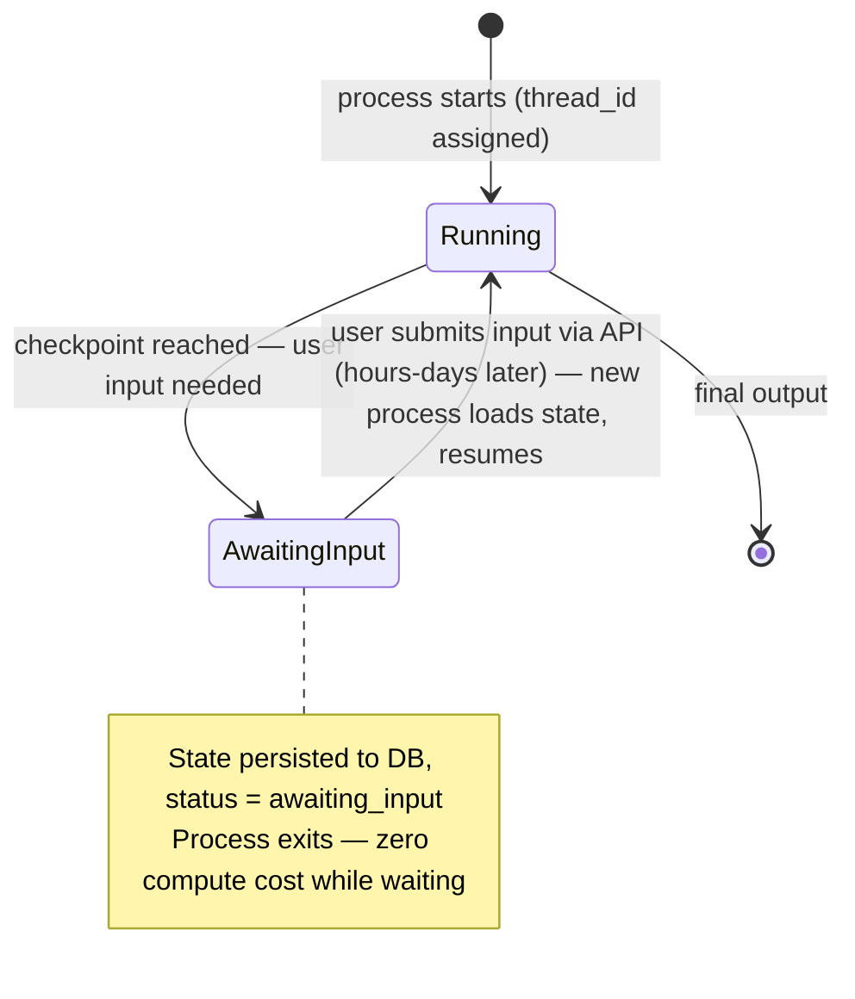

# Durable Long-Running Agents — Deep Dive

---

## 1. Concept Overview

Durable long-running agents are LLM agents designed to survive process crashes, context window overflow, hours-to-days execution times, and human-driven pauses. Unlike short-lived agents that complete in seconds inside a single process, durable agents persist their state externally so any single failure (OOM kill, EC2 spot termination, network blip, deployment) does not lose work. They are the right pattern for: deep research tasks (hours), code migrations across thousands of files (days), batch document processing, agentic workflows triggered by external events (webhooks, schedules).

The fundamental shift from short-lived to durable agents is moving from in-process state (Python objects, async tasks) to externalized state (database checkpoints, durable queues, event sourcing). Four ecosystem solutions dominate: Temporal (most mature, polyglot), Inngest (serverless functions + durable queues), Restate (durable promises with strong consistency), and LangGraph with checkpointing (purpose-built for LLM agents). Each shares the core pattern: every step is a checkpoint; replay survives crashes; idempotency is the contract.

---

## 2. Intuition

**One-line analogy**: A durable agent is like a paper invoice flowing between desks — even if someone gets sick (process crash), the work continues from where they left off because the paper has all the state on it.

**Mental model**: Think of agent execution as a series of small steps, each writing its result to permanent storage before announcing "done". If the process crashes between steps, on restart we resume from the last checkpoint — never re-execute completed work, never lose in-flight tool results. The agent becomes "event-sourced" — the conversation history IS the state, persisted durably.

**Why it matters**: Production agents face mortality constantly — OOM kills from large contexts, deployment restarts (rolling updates), spot instance preemption, accidental kills. For agents that take >5 minutes, the probability of a crash during execution becomes non-trivial. Without durability, every crash means losing work and money (re-running an agent that already spent $2 in tokens).

**Key insight**: Durability is not free — every tool call must be idempotent (safe to replay), every checkpoint costs storage and write latency, and debugging becomes harder because state is distributed. Use durable patterns when the cost of losing work exceeds the cost of running the durability infrastructure.

---

## 3. Core Principles

- **State externalized**: agent state lives in a database/durable queue, not in-process memory.
- **Per-step checkpoints**: every meaningful step writes a checkpoint before reporting complete.
- **Idempotency required**: every tool call must be safe to re-execute (use idempotency keys for external APIs).
- **Crash recovery on restart**: process startup loads latest checkpoint and resumes from there.
- **Context compaction over time**: summarize old history to stay within model's context window (see [Context Engineering](../context_engineering/README.md)).
- **Cost caps enforced**: terminate if cumulative cost exceeds threshold (especially for long-running); budgeting patterns in [Agent Cost & Token Budgets](agent_cost_and_token_budget.md).
- **Human-in-the-loop signals**: durable wait points where the agent pauses for human input (could be hours/days).

---

## 4. Types / Architectures / Strategies

### 4.1 Temporal Workflows

Workflows as Python classes (`@workflow.defn`); activities (tool calls) are durable and retried. State survives crashes via event sourcing. `workflow.wait_condition()` for human waits. Best for complex orchestration with multiple agents and external systems.

### 4.2 Inngest

Function-as-a-service with durable steps. `step.run()` checkpoints each step result. Auto-retry on failure. Good fit for webhook-driven agents and serverless deployments.

### 4.3 Restate Durable Promises

Strong-consistency durable execution with Java/TS/Python SDKs. `ctx.run()` wraps each step. Designed for high-throughput, low-latency durability.

### 4.4 LangGraph + Checkpointing

Purpose-built for LLM agents. StateGraph nodes; `MemorySaver`, `SqliteSaver`, `RedisSaver`, `PostgresSaver` checkpointers. Resume any thread by `thread_id`. `interrupt_before` for human-in-the-loop pauses.

---

## 5. Architecture Diagrams

```
Without Durability (Lost Work on Crash)
========================================

  Process starts
       |
       v
  Step 1 (tool call)  -- in-memory state
  Step 2 (tool call)  -- in-memory state
  Step 3 (tool call)  -- in-memory state
  Step 4 (CRASH)

  Restart -> all state lost
  Must start from Step 1


With Checkpointing (Resume on Crash)
=====================================

  Process starts (thread_id=abc)
       |
       v
  Step 1 (tool call) -> checkpoint to DB
  Step 2 (tool call) -> checkpoint to DB
  Step 3 (tool call) -> checkpoint to DB
  Step 4 (CRASH)

  Restart -> load checkpoint(thread_id=abc)
  Resume from Step 4 (NOT Step 1)


Temporal Workflow Execution
============================

  Worker process A starts Workflow run_id=xyz
       |
       v
  Activity 1 (tool call) -> event 1 logged
  Activity 2 (tool call) -> event 2 logged
  Worker A CRASHES
       |
       v
  Worker process B picks up run_id=xyz
  Replays events 1, 2 (no re-execution of activities)
  Continues from Activity 3
```

### Human-in-the-Loop Pause Lifecycle



The pause is a lifecycle transition, not a sleep: state persists, the process exits, and a fresh worker resumes on the user's signal — hours or days later — at zero cost while waiting.

---

## 6. How It Works — Detailed Mechanics

### LangGraph + SqliteSaver Checkpointing

```python
from typing import TypedDict, Annotated
from langgraph.graph import StateGraph, START, END
from langgraph.checkpoint.sqlite import SqliteSaver
from langgraph.types import interrupt, Command
import operator
import anthropic
import json

client = anthropic.AsyncAnthropic()


class AgentState(TypedDict):
    messages: Annotated[list, operator.add]  # Append-only message list
    cost_usd: float
    iteration: int


async def agent_step(state: AgentState) -> dict:
    """Single LLM call + tool execution."""
    resp = await client.messages.create(
        model="claude-sonnet-4-6",
        max_tokens=2048,
        messages=state["messages"],
        tools=YOUR_TOOLS,
    )
    
    cost_delta = (
        resp.usage.input_tokens * 3e-6 + resp.usage.output_tokens * 15e-6
    )
    
    return {
        "messages": [{"role": "assistant", "content": resp.content}],
        "cost_usd": cost_delta,  # Accumulates via operator.add if changed to list
        "iteration": 1,
    }


async def check_budget(state: AgentState) -> str:
    """Routing: stop if budget exceeded or done."""
    if state["cost_usd"] > 5.00:
        return END
    if state["iteration"] >= 50:
        return END
    last_msg = state["messages"][-1]
    if any(b.type == "tool_use" for b in last_msg["content"]):
        return "tools"
    return END


async def execute_tools(state: AgentState) -> dict:
    """Execute pending tool calls."""
    ...
    return {"messages": [{"role": "user", "content": tool_results}]}


# Build the graph
graph = StateGraph(AgentState)
graph.add_node("agent", agent_step)
graph.add_node("tools", execute_tools)
graph.add_edge(START, "agent")
graph.add_conditional_edges("agent", check_budget, {"tools": "tools", END: END})
graph.add_edge("tools", "agent")

# Compile with checkpointer + interrupt points
checkpointer = SqliteSaver.from_conn_string("agent_state.db")
compiled = graph.compile(
    checkpointer=checkpointer,
    interrupt_before=["tools"],  # Pause before EVERY tool call (or specific ones)
)


# Run with thread_id for durability
async def run_durable_agent(thread_id: str, user_input: str) -> dict:
    config = {"configurable": {"thread_id": thread_id}}
    
    initial_state = {
        "messages": [{"role": "user", "content": user_input}],
        "cost_usd": 0.0,
        "iteration": 0,
    }
    
    # First run — will pause at interrupt_before("tools")
    async for event in compiled.astream(initial_state, config=config):
        print(event)
    
    return await compiled.aget_state(config)


# Resume after human approval
async def resume_after_approval(thread_id: str, approved: bool) -> dict:
    config = {"configurable": {"thread_id": thread_id}}
    
    if approved:
        # Resume from interrupt point
        async for event in compiled.astream(None, config=config):
            print(event)
    else:
        # Inject denial as a tool result and continue
        async for event in compiled.astream(
            Command(update={"messages": [{"role": "user", "content": "User denied action"}]}),
            config=config,
        ):
            print(event)
    
    return await compiled.aget_state(config)


# Crash recovery (separate process restart)
async def recover_from_crash(thread_id: str) -> None:
    """Just call the same agent with the same thread_id - it resumes from last checkpoint."""
    config = {"configurable": {"thread_id": thread_id}}
    
    # Continue from latest checkpoint
    async for event in compiled.astream(None, config=config):
        print(event)
```

### Temporal Workflow

```python
from temporalio import workflow, activity
from datetime import timedelta


@activity.defn
async def llm_call(messages: list, model: str = "claude-sonnet-4-6") -> dict:
    """Idempotent: only called once per attempt; result cached."""
    resp = await client.messages.create(model=model, max_tokens=2048, messages=messages)
    return {
        "content": [b.model_dump() for b in resp.content],
        "stop_reason": resp.stop_reason,
        "usage": resp.usage.model_dump(),
    }


@activity.defn
async def execute_tool(tool_name: str, tool_input: dict, idempotency_key: str) -> str:
    """Idempotency key prevents double-execution on retry."""
    cached = await cache.get(idempotency_key)
    if cached:
        return cached
    
    result = await TOOLS[tool_name](**tool_input)
    await cache.set(idempotency_key, result, ttl=86400)
    return result


@workflow.defn
class DurableAgentWorkflow:
    @workflow.run
    async def run(self, user_request: str) -> str:
        messages = [{"role": "user", "content": user_request}]
        cost = 0.0
        
        for iteration in range(50):
            if cost > 5.0:
                return f"Budget exceeded: ${cost:.2f}"
            
            resp = await workflow.execute_activity(
                llm_call, messages,
                start_to_close_timeout=timedelta(seconds=120),
                retry_policy=workflow.RetryPolicy(maximum_attempts=3),
            )
            messages.append({"role": "assistant", "content": resp["content"]})
            
            tool_uses = [b for b in resp["content"] if b["type"] == "tool_use"]
            if not tool_uses:
                return next(b["text"] for b in resp["content"] if b["type"] == "text")
            
            # Execute tools — workflow.execute_activity is durable
            tool_results = []
            for tu in tool_uses:
                idempotency_key = f"{workflow.info().run_id}:{tu['id']}"
                result = await workflow.execute_activity(
                    execute_tool, tu["name"], tu["input"], idempotency_key,
                    start_to_close_timeout=timedelta(seconds=60),
                )
                tool_results.append({"type": "tool_result", "tool_use_id": tu["id"], "content": result})
            
            messages.append({"role": "user", "content": tool_results})
        
        return "Max iterations"
    
    @workflow.signal
    async def add_user_input(self, additional_input: str) -> None:
        """Signal handler for mid-task user injection."""
        # Updates workflow state; agent loop picks it up at next iteration
        ...
```

---

## 7. Real-World Examples

**Anthropic Research multi-agent** uses checkpointing patterns for week-long research tasks; subagents persist state in case of restart.

**OpenHands** (formerly OpenDevin) persists agent state per session; sessions can be paused and resumed days later.

**Cursor Background Agents** run for hours editing entire codebases; checkpointed via internal storage.

**Production legal contract analysis agent**: processes 10K contracts/day; each contract is a workflow that can run hours. Temporal workflow per contract; survives deployments and partial failures.

**Customer onboarding agent (B2B SaaS)**: 30-day workflow that includes agent emails (with response waits up to 7 days), document processing, escalation. Built on Temporal with multiple wait conditions.

---

## 8. Tradeoffs

| Dimension | Temporal | Inngest | Restate | LangGraph Checkpointing |
|---|---|---|---|---|
| Polyglot | Yes (Java, Go, Python, TS, .NET) | TypeScript, Python | Java, TS, Python | Python only |
| Setup overhead | High (cluster or cloud) | Low (SaaS) | Medium | Lowest |
| Best fit | Complex multi-system workflows | Webhook-driven | High-throughput | LLM agents specifically |
| Local dev | Temporal CLI dev server | Inngest CLI | Restate CLI | Just sqlite file |
| Cost | Self-host free / Cloud $$ | SaaS tiered | Self-host free | Free |
| Learning curve | Steep | Gentle | Medium | Gentle |
| Native LLM features | None | None | None | Many |

---

## 9. When to Use / When NOT to Use

**Use durable agents when:**
- Agent runs >5 minutes typical
- Cost per agent run is high enough that losing work matters ($1+)
- Workflow includes human-in-the-loop waits (hours to days)
- Process restarts/deployments are frequent
- Multi-step workflows that span external systems

**Don't use when:**
- Agent completes in seconds and replay is acceptable
- Simple synchronous tasks
- Prototyping (overhead not justified)
- Single-tool agents (just retry the call)

---

## 10. Common Pitfalls

### Pitfall 1: In-memory state lost on crash

```python
# BROKEN: agent state in Python objects
class Agent:
    def __init__(self):
        self.messages = []
        self.cost = 0
    
    async def run(self, query: str):
        # Process restart loses self.messages and self.cost
        ...
```

```python
# FIXED: state in checkpointed graph
graph = StateGraph(AgentState)
compiled = graph.compile(checkpointer=SqliteSaver(...))
# State persists across crashes; resume via thread_id
```

### Pitfall 2: Non-idempotent tool call

```python
# BROKEN: tool sends email; on retry sends 2nd email
async def send_email(to: str, body: str) -> str:
    response = await sendgrid.send(to=to, body=body)
    return f"Sent: {response.id}"
# Workflow retries → user gets duplicate emails
```

```python
# FIXED: idempotency key
async def send_email(to: str, body: str, idempotency_key: str) -> str:
    cached = await db.get_email_status(idempotency_key)
    if cached:
        return f"Already sent: {cached.message_id}"
    
    response = await sendgrid.send(to=to, body=body, custom_args={"idempotency_key": idempotency_key})
    await db.record_email(idempotency_key, response.id)
    return f"Sent: {response.id}"
```

**War story**: A B2B onboarding agent built without checkpointing crashed during a routine deployment. 47 in-flight workflows lost their state. Customers received partially completed onboarding (some emails sent, some not). 11 hours of engineering to manually reconcile. Migrated to Temporal: zero re-occurrences in 8 months across hundreds of deployments.

---

## 11. Technologies & Tools

| Tool | Type | Notes |
|---|---|---|
| Temporal | Workflow orchestration | Polyglot, mature, free self-host or Temporal Cloud |
| Inngest | Durable functions | TS/Python, SaaS-first |
| Restate | Durable promises | Java/TS/Python, strong consistency |
| LangGraph + checkpointers | Agent-specific durability | SqliteSaver, RedisSaver, PostgresSaver, MongoDBSaver |
| Cadence | Temporal predecessor | Used at Uber; mostly superseded |
| AWS Step Functions | Cloud-native workflows | JSON-based, no code agent native |
| Airflow / Prefect / Dagster | DAG schedulers | Less LLM-specific |

---

## 12. Interview Questions with Answers

**Why do long-running agents need externalized state?**
Processes die — from OOM kills, deployments, spot termination, network failures. Long-running agents (>5 minutes) have non-trivial crash probability. Externalized state (database checkpoints, event sourcing) means crash recovery loads the last checkpoint and resumes; without it, every crash loses all work and money spent.

**What does idempotency mean for an agent tool call and why is it required?**
Idempotency means executing a tool call twice produces the same result as executing once. Required because durable systems (Temporal, Inngest) may retry tool activities if the worker crashes mid-execution. Non-idempotent tools (send email, charge card, create record) cause duplicates on retry. Solution: use idempotency keys (unique per logical call), check key before execution, cache results by key.

**How does LangGraph's checkpointing work?**
LangGraph compiles a StateGraph with a `checkpointer` (SqliteSaver, RedisSaver, etc). At every node transition, the checkpointer saves the entire state to storage, keyed by `thread_id`. To resume after crash, call the compiled graph with `config={"configurable": {"thread_id": "abc"}}` and a `None` input — it loads the last checkpoint and continues from there.

**What is the difference between Temporal workflows and activities?**
Workflows are the deterministic orchestration code (must be replay-safe — no random, no IO, no time). Activities are the actual side-effecting work (LLM calls, tool execution). Workflows survive crashes via event-sourcing replay (replay the events, skip already-completed activities). Activities are retried per their retry policy.

**How do you handle a long human-in-the-loop pause (e.g., wait days for user input)?**
Durable workflow waits via `workflow.wait_condition(lambda: state.user_responded)` (Temporal) or `interrupt_before` in LangGraph + external resume signal. During the wait, no process is running — zero compute cost. When the user responds (via API call that signals the workflow), a worker picks up the workflow and continues. Critical: never use `asyncio.sleep(86400)` in a real process — that wastes a worker for a day.

**What is context compaction and when does an agent need it?**
Context compaction is summarizing the early conversation history to free up tokens when approaching the model's context window limit. Needed when agent runs many iterations (>30) with growing tool results. Trigger at 70% of window. Strategy: summarize all-but-last-N tool result pairs into 5-10 bullets using a cheaper model, replace early history with summary.

**How do you cap cost on a long-running agent?**
Track cumulative cost in state (input_tokens × input_price + output_tokens × output_price + cache costs). Before every LLM call, check if cost exceeds budget; if so, terminate gracefully with partial result. For multi-day workflows, also cap per-day spend (catch a runaway loop) and total budget (catch overall scope creep).

**What's the difference between Temporal signals and queries?**
Signals: asynchronous external input to a running workflow (e.g., "user approved"). Buffered if workflow not actively receiving. Queries: synchronous read of workflow state (e.g., "what's the current step?"). Both are essential for human-in-the-loop patterns.

**Can you debug a durable workflow that's been running for days?**
Yes — that's a key advantage. Temporal UI shows the full event history (every activity execution, signal, query, current state). Replay locally with the same workflow code and event history to debug deterministically. LangGraph: inspect the checkpoint at any thread_id to see current state.

**How does Inngest differ from Temporal for agent workflows?**
Inngest is serverless-first — write a function with `step.run()` blocks; Inngest invokes the function on event/schedule; each step's result is cached. Simpler to start (no cluster setup), good for webhook-driven flows. Temporal is more powerful (custom retry policies, complex orchestration, child workflows) but requires more setup.

**What is event sourcing in the context of durable agents?**
Event sourcing means the agent's state is reconstructed from a log of events (tool calls made, results received, signals received). On crash recovery, replay all events from the log to reconstruct state. Temporal uses event sourcing for workflow state. Critical implication: workflow code must be deterministic (replay produces same result).

**How do you handle a tool that fails non-deterministically (transient network errors)?**
Configure retry policies on the tool/activity: exponential backoff (e.g., 1s, 2s, 4s, 8s), max attempts (3-5), max total elapsed time (60s). The workflow framework retries automatically. After max attempts, the workflow gets an exception and can decide: bubble up, fall back to alternative tool, or skip the step.

**Should agent state include the full conversation history or just summaries?**
For short agents (<20 iterations): full history. For long agents: combine — keep recent 5-10 turns verbatim, summarize older history. The state schema should include both `messages` (recent verbatim) and `history_summary` (compacted older). LangGraph supports this with custom state schemas.

**What's the storage overhead of checkpointing every step?**
Per checkpoint: ~5-50KB (messages + state). For an agent running 50 iterations: 250KB-2.5MB total checkpoint storage. For 10K agents/day: 2.5-25GB/day. Plan storage (Postgres, S3, etc) accordingly. SqliteSaver is fine for single-instance; PostgresSaver for distributed.

**How do you migrate from in-memory agents to durable agents?**
(1) Pick a framework (LangGraph easiest if already on LangChain). (2) Refactor agent loop into discrete steps (each becomes a node or activity). (3) Add idempotency keys to all side-effecting tools. (4) Configure checkpointer/storage. (5) Run shadow mode (durable agent runs alongside, compare results). (6) Cut over feature flag. Typical migration: 1-3 sprints for a moderately complex agent.

---

## 13. Best Practices

1. Always use a framework with checkpointing for agents that run >5 minutes — building durability yourself is a yak-shave.
2. Make every side-effecting tool idempotent — pass idempotency keys, cache results.
3. Cap total cost in state; check before every LLM call; terminate gracefully on exceedance.
4. Compact context at 70% of window; keep most recent N iterations verbatim, summarize the rest.
5. Use `interrupt_before` (LangGraph) or `wait_condition` (Temporal) for human-in-the-loop — never sleep a worker.
6. Persist `thread_id` / `workflow_id` in your application — needed to resume after crash.
7. Test crash recovery deliberately — kill the process mid-execution, restart, assert correct resume.
8. Monitor checkpoint storage growth — old completed threads can be archived after N days.
9. Use distributed tracing across activities — debugging durable agents without traces is nightmare.
10. For multi-day workflows, set up alerts on stuck workflows (no progress for 24h) — catches missing signals.

---

## 14. Case Study

**Patent Analysis Agent at a Law Firm**

**Problem**: Patent attorneys requested an agent to analyze patent applications: read the 50-page document, identify claims, check prior art (search USPTO + Google Patents + academic databases), produce a patentability opinion. Typical task: 30-90 minutes; involves dozens of tool calls. Initial in-memory implementation crashed mid-analysis ~5% of the time (deployments + OOM), losing 20+ minutes of work each time.

**Architecture**:
- Temporal workflow per patent application
- Activities: extract_claims, search_prior_art (USPTO), search_prior_art (Google), search_academic, summarize_finding, generate_opinion
- Each LLM call: max 3 retries with exponential backoff
- Idempotency keys: `{workflow_id}:{activity_name}:{input_hash}` — caches results across retries
- Context compaction triggered at 140K tokens (70% of 200K)
- Cost cap: $5/workflow (terminates gracefully if exceeded, attorney can extend)
- Human-in-the-loop signal: attorney can inject "focus on novelty" or "skip US prior art" mid-execution

**Results**:
- Lost work due to crashes: 5% baseline → 0% after Temporal
- Average completion time: 32 minutes
- Cost per patent: $1.40 average
- Deploys during workflow execution: ~10/day, zero workflow losses
- Attorney time saved per patent: 4-6 hours

**Lessons**:
1. Idempotency keys saved the project — early version retried prior-art searches and double-billed the API.
2. Compaction at 140K tokens was critical — without it, 70% of workflows hit context limit at iteration 35.
3. Human-in-the-loop signals (attorney guidance mid-execution) lifted opinion quality from "good" to "great" — attorneys often had context only they knew.
4. Temporal UI was the key debugging tool — without it, debugging multi-hour workflows would have been impractical.
