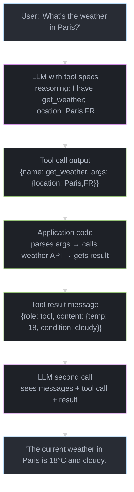
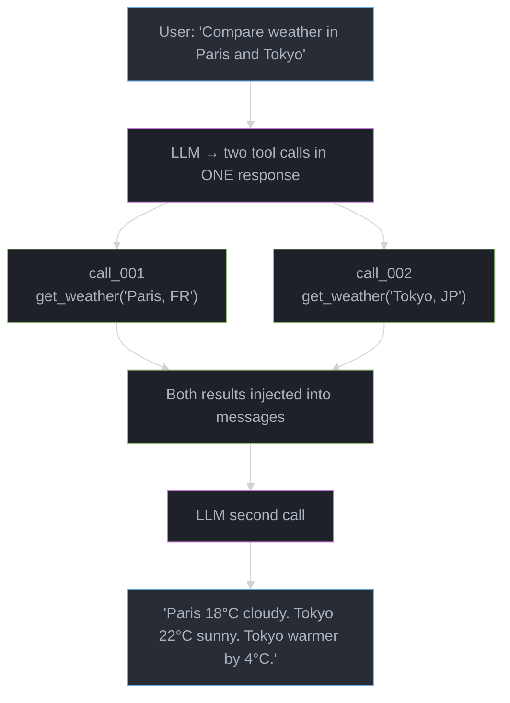

# Function Calling & Tool Design

## Concept Overview

Function calling (also called tool use) is the mechanism by which LLMs communicate their intent to invoke external code. The model outputs a structured call — a function name and arguments — rather than a prose answer. Your application code intercepts that call, executes the function, and injects the result back into the conversation. The model then produces a final response informed by the real-world result.

Every major provider implements this differently in detail, but the underlying protocol is the same: tool spec in, structured call out, result injection in, final answer out.

---

## Intuition

> **One-line analogy**: Function calling is like a manager sending a work order — the LLM writes the order (function name + arguments), a worker executes it, and the result comes back to the manager who writes the final memo.

**Mental model**: Without tool calling, an LLM can only reason over its training data. With tool calling, it becomes the reasoning layer of a larger system — it decides what information to fetch or what action to take, delegates the execution to code, and synthesizes the result. The LLM never executes code; it only describes what should be executed.

**Why it matters**: Tool calling quality gates the entire agentic system. A poorly designed tool spec leads to wrong tool selection, malformed arguments, and hallucinated parameters. Good tool design is as important as good prompting.

**Key insight**: The model selects tools and fills arguments based solely on tool descriptions and parameter docstrings — it cannot read source code. Tool descriptions are a form of prompting that directly affects tool selection accuracy.

---

## Core Principles

- **Description drives selection**: The model chooses which tool to call based on the tool's description field, not its name. Vague descriptions cause wrong selection or missed calls.
- **Schema drives argument accuracy**: Well-typed JSON Schema (enums, required fields, descriptions on each property) dramatically reduces argument hallucination.
- **Structured output > natural language results**: Tool results should be structured JSON, not prose, so the model can reliably parse fields.
- **Parallel where independent**: If two tool calls don't depend on each other's results, call them in parallel — reduces latency by N×.
- **Strict mode prevents hallucination**: OpenAI's `strict: true` mode constrains tool arguments to the declared schema using constrained decoding, eliminating argument hallucination.

---

## How It Works — Detailed Mechanics

### OpenAI Tool Spec Format

```json
{
  "type": "function",
  "function": {
    "name": "get_weather",
    "description": "Get the current weather and forecast for a specific location. Call this whenever the user asks about current conditions, temperature, or weather forecasts. Do NOT call this for historical weather data.",
    "strict": true,
    "parameters": {
      "type": "object",
      "properties": {
        "location": {
          "type": "string",
          "description": "City and country code, e.g. 'London, GB' or 'New York, US'"
        },
        "units": {
          "type": "string",
          "enum": ["celsius", "fahrenheit"],
          "description": "Temperature units. Default to celsius unless user specifies."
        },
        "days": {
          "type": "integer",
          "description": "Number of forecast days (1-7). Default to 1 for current conditions.",
          "minimum": 1,
          "maximum": 7
        }
      },
      "required": ["location"],
      "additionalProperties": false
    }
  }
}
```

### Anthropic Tool Spec Format

```python
tools = [
    {
        "name": "search_documents",
        "description": "Search the internal knowledge base for relevant documents. "
                       "Use this when the user asks about company policies, procedures, "
                       "or any topic covered in company documentation.",
        "input_schema": {
            "type": "object",
            "properties": {
                "query": {
                    "type": "string",
                    "description": "The search query. Be specific and include key terms."
                },
                "max_results": {
                    "type": "integer",
                    "description": "Maximum number of results to return (1-10)",
                    "default": 5
                }
            },
            "required": ["query"]
        }
    }
]
```

### The Complete Message Exchange

```python
# Step 1: Initial request with tools
messages = [{"role": "user", "content": "What's the weather in Paris and Tokyo?"}]

response = client.chat.completions.create(
    model="gpt-4o",
    messages=messages,
    tools=tools,
    tool_choice="auto",          # or "required", "none", or specific tool
    parallel_tool_calls=True     # allow multiple tools in one response
)

# Step 2: Model returns tool calls (may be multiple when parallel=True)
# response.choices[0].message.tool_calls = [
#   ToolCall(id="call_abc", function=Function(name="get_weather",
#            arguments='{"location":"Paris, FR","units":"celsius"}')),
#   ToolCall(id="call_xyz", function=Function(name="get_weather",
#            arguments='{"location":"Tokyo, JP","units":"celsius"}'))
# ]

# Step 3: Execute tools (in parallel if calls are independent)
import asyncio

async def execute_tool(tool_call):
    args = json.loads(tool_call.function.arguments)
    result = await weather_api.get(args["location"], args.get("units", "celsius"))
    return {
        "role": "tool",
        "tool_call_id": tool_call.id,
        "content": json.dumps(result)
    }

tool_results = await asyncio.gather(*[
    execute_tool(tc) for tc in response.choices[0].message.tool_calls
])

# Step 4: Inject assistant message + tool results, call again
messages.append(response.choices[0].message)  # assistant's tool call message
messages.extend(tool_results)                  # one tool result per call

final_response = client.chat.completions.create(
    model="gpt-4o",
    messages=messages,
    tools=tools
)
# Now the model synthesizes: "Paris is 18°C and cloudy. Tokyo is 22°C and sunny."
```

### Sequential vs Parallel Tool Use

```
Sequential (dependent calls):
  Task: "Find the CEO of Apple, then look up their net worth"

  Call 1: search("Apple CEO") → "Tim Cook"
  ↓ must wait for result
  Call 2: search("Tim Cook net worth") → "$1.5B"
  Total latency: T1 + T2 = 3s + 3s = 6s

Parallel (independent calls):
  Task: "Get weather in Paris and Tokyo"

  Call 1: get_weather("Paris") ──┐
  Call 2: get_weather("Tokyo") ──┴→ Both resolve in ~1s
  Total latency: max(T1, T2) = 1s

  Speedup: N× for N independent calls
```

### tool_choice Parameter

```python
# auto: model decides whether to call a tool (default)
tool_choice="auto"

# required: model MUST call at least one tool
tool_choice="required"

# none: model must not call tools (forces text response)
tool_choice="none"

# specific tool: force a particular tool (structured extraction)
tool_choice={"type": "function", "function": {"name": "extract_entities"}}
```

### Strict Mode (OpenAI)

```python
# strict: true uses constrained decoding to guarantee valid JSON
# arguments will always match the declared schema exactly
# requires: additionalProperties: false, all nested objects declare properties

{
    "name": "book_appointment",
    "strict": true,  # model CANNOT generate arguments not in schema
    "parameters": {
        "type": "object",
        "properties": {
            "date": {"type": "string", "format": "date"},
            "time": {"type": "string"},
            "duration_minutes": {"type": "integer", "enum": [30, 60, 90]}
        },
        "required": ["date", "time", "duration_minutes"],
        "additionalProperties": false
    }
}

# Without strict: model might generate {"date": "next Monday"} (unparseable)
# With strict: model generates {"date": "2025-05-20"} (valid ISO date)
```

### Tool Result Injection Format

```python
# Best practice: structured JSON with status field
{
    "role": "tool",
    "tool_call_id": "call_abc123",
    "content": json.dumps({
        "status": "success",
        "data": {
            "temperature": 18,
            "condition": "cloudy",
            "humidity": 72,
            "wind_kph": 15
        }
    })
}

# For errors: include error type so model can reason about recovery
{
    "role": "tool",
    "tool_call_id": "call_abc123",
    "content": json.dumps({
        "status": "error",
        "error_type": "location_not_found",
        "message": "Could not find weather data for 'Paris, XX'",
        "suggestion": "Try 'Paris, FR' for Paris, France"
    })
}
```

### Tool Versioning and Deprecation

```python
# Version tools by name when making breaking changes
tools_v1 = [{"name": "search", ...}]
tools_v2 = [
    {"name": "search_v2",
     "description": "Improved search with filters. Use this instead of 'search'. "
                    "The 'search' tool is deprecated.",
     ...}
]

# Gradual migration: include both during transition period
# Monitor which version the model selects via logging
# Remove v1 after 30+ days of zero selection
```

---

## Architecture Diagrams

### Function Calling Flow



### Parallel Tool Call Flow



### Tool Chaining

```
Task: "Search for articles about LLM scaling laws, then summarize the top 3"

Step 1: search("LLM scaling laws") → returns 5 article URLs + snippets
        |
Step 2: For each of top 3 URLs:
  fetch_article(url_1) ──┐
  fetch_article(url_2) ──┤ parallel
  fetch_article(url_3) ──┘
        |
Step 3: (no tool call — summarize from context)
  "Based on the three articles..."
```

---

## Real-World Examples

### OpenAI Assistants API — Built-in Tools

```python
assistant = client.beta.assistants.create(
    model="gpt-4o",
    tools=[
        {"type": "code_interpreter"},   # Python sandbox
        {"type": "file_search"},        # RAG over uploaded files
        {
            "type": "function",         # Custom tool
            "function": {...}
        }
    ]
)
# code_interpreter: executes Python; generates charts; solves math
# file_search: vector search over uploaded PDFs/docs
# function: any custom API call
```

### Structured Data Extraction

```python
# Force the model to always call extract_person — tool_choice="required"
# This converts the LLM into a structured extraction engine

extract_tool = {
    "name": "extract_person",
    "strict": True,
    "parameters": {
        "type": "object",
        "properties": {
            "name": {"type": "string"},
            "age": {"type": ["integer", "null"]},
            "role": {"type": "string", "enum": ["engineer", "manager", "executive"]}
        },
        "required": ["name", "age", "role"],
        "additionalProperties": False
    }
}

# Input: "Sarah Chen, 34, leads engineering at Anthropic"
# Output: {"name": "Sarah Chen", "age": 34, "role": "engineer"}
# Guaranteed valid JSON matching schema (with strict=true)
```

---

## Tradeoffs

| Approach | Latency | Reliability | Flexibility | Best For |
|----------|---------|-------------|-------------|---------|
| Sequential tool calls | O(N) | High | High | Dependent calls |
| Parallel tool calls | O(max) | High | High | Independent calls |
| strict: true | ~same | Highest (no hallucination) | Lower (schema-constrained) | Structured extraction |
| tool_choice="required" | ~same | High | Lower | Forcing output format |
| No tools (prose) | Fastest | Low (hallucination risk) | Highest | Conversational responses |

| Tool Output Format | Parseability | Token Efficiency | Model Comprehension |
|--------------------|-------------|-----------------|---------------------|
| Raw JSON | High | Low (verbose) | Medium |
| Structured JSON + status | High | Low | High |
| Compact JSON (no labels) | High | High | Medium |
| Natural language | Low | Medium | Highest |

---

## When to Use / When NOT to Use

### Use Function Calling When:
- Need real-time data (weather, prices, news)
- Need to write to external systems (create calendar event, send email)
- Need deterministic computation (code execution, calculator)
- Building structured extraction pipelines (tool_choice="required")
- Agent needs multiple steps with different tools

### Avoid / Simplify When:
- Model already knows the answer (don't call search for historical facts)
- Task needs a single LLM call (no tool needed)
- Tool latency would be unacceptable (embedded in a <100ms SLA system)
- Tool outputs are too large (truncate aggressively — >4K token results bloat context)

---

## Common Pitfalls

1. **Vague tool descriptions**: "Tool to get data" — model doesn't know when to call it. Always specify: what the tool does, when to call it (trigger conditions), when NOT to call it.

2. **Argument hallucination without strict mode**: Without `strict: true`, models invent enum values, ignore required fields, and pass wrong types. Always use strict mode for production.

3. **Tool result too large**: Returning a 10KB JSON response bloats context, degrades model reasoning, and increases cost. Truncate at ~500 words; summarize where possible. A model that injested 10KB tool results over 10 steps uses 100KB of context — $0.50+ per run at GPT-4o prices.

4. **Not handling tool errors**: Assuming tool calls always succeed. The model receives errors as observations and can recover — but only if you inject them as tool result messages with `status: "error"` rather than raising an exception.

5. **Forgetting to append the assistant message**: Before injecting tool results, you MUST append `response.choices[0].message` (the assistant's tool call) to messages. Skipping this breaks the conversation structure and causes API errors.

6. **Overlapping tool responsibilities**: Two tools that do similar things confuse the model on which to pick. Ensure each tool has a unique, non-overlapping responsibility described explicitly in its description.

---

## Technologies & Tools

| Tool | Purpose | Notes |
|------|---------|-------|
| **OpenAI function calling** | Tool use with GPT | `strict: true` for guaranteed JSON |
| **Anthropic tool use** | Tool use with Claude | Best instruction following |
| **Instructor** | Pydantic + LLM tools | Validates and retries on failure |
| **LangChain tools** | Tool abstraction layer | 100+ pre-built tools |
| **LangGraph tool node** | Tool execution in graphs | Built-in error handling |
| **Marvin** | Type-safe extraction | Maps LLM output to Python types |
| **OpenAI Assistants** | Managed tool execution | Threads + built-in tools |
| **E2B** | Code execution tool | Secure sandbox; fast spin-up |

---

## Interview Questions with Answers

**Q: What is function calling and how does it differ from a prompt that asks the model to output JSON?**
A: Function calling is a native model capability where the model is trained to recognize tool invocation opportunities and output structured call specifications in a dedicated message field separate from the text response. A prompt-to-JSON approach puts the JSON output in the text field and requires your code to parse it, leading to frequent format violations. With function calling: the model outputs `tool_calls` in a structured field, the protocol guarantees parseable JSON, `strict: true` mode uses constrained decoding to eliminate malformed arguments entirely, and the tool result injection has a defined message format. The fundamental difference is reliability — function calling is designed for machine consumption; prompted JSON is designed for a model that was asked nicely.

**Q: How does the parallel_tool_calls flag work and when should you use it?**
A: When `parallel_tool_calls=True` (the default in OpenAI), the model can emit multiple tool calls in a single response, each with a unique `id`. You execute all of them (in parallel if independent), then inject one `role: "tool"` message per call, keyed by `tool_call_id`. When `parallel_tool_calls=False`, the model emits only one tool call per response, forcing sequential execution. Use parallel calls whenever the tools are logically independent — comparing two weather forecasts, searching multiple topics, or extracting entities from multiple documents. Use sequential when each call's result informs the next call's arguments.

**Q: What is strict mode in OpenAI's function calling and when is it essential?**
A: Strict mode (`"strict": true` in the tool spec) uses constrained decoding — the model generates tokens only from the set allowed by the JSON schema. This guarantees the arguments always match the declared schema exactly: no extra keys, no wrong types, no missing required fields. Requirements: `additionalProperties: false` on all objects, all nested objects must declare their properties. Strict mode is essential for: production systems where argument parsing failures cause hard errors, structured extraction pipelines, and anywhere tool call reliability matters more than slight latency overhead. The trade-off: strict mode disallows dynamic or creative argument structures the model might otherwise produce.

**Q: How do you write a tool description to maximize correct selection accuracy?**
A: Include four elements: (1) what the tool does (mechanism); (2) when to call it (trigger condition — "call this when the user asks about X"); (3) when NOT to call it (disambiguation — "do not use for Y, use Z instead"); (4) examples of good call scenarios. Bad description: "Gets data." Good description: "Retrieves real-time stock prices for publicly traded companies. Call this when the user asks about current stock price, market cap, or recent price change. Do NOT use for historical prices — use get_historical_prices instead. Example: 'What is AAPL trading at?' → call with symbol='AAPL'." Description quality directly correlates with tool selection accuracy.

**Q: What is the complete message sequence for a single tool call?**
A: (1) `user` message with the request; (2) LLM call with tools → response includes `assistant` message with `tool_calls` field; (3) Append the `assistant` message to conversation; (4) Execute the tool; (5) Append `tool` message with `tool_call_id` matching the call id and `content` containing the result; (6) Call the LLM again with the full updated messages; (7) LLM produces final `assistant` text response. The critical step developers miss: you must append the assistant's tool_call message (step 3) before appending tool results (step 5) — omitting step 3 causes an API error or incoherent context.

**Q: How do you handle a tool that intermittently returns errors or malformed results?**
A: Inject the error as a structured tool result message with `status: "error"`, the error type, and a suggestion. The model will read the error as an observation and can recover: try alternative arguments, use a different tool, or acknowledge the limitation. Add retry logic at the application layer: for transient errors (network timeout, rate limit), retry up to 3 times with exponential backoff before injecting the error. For malformed results, validate the tool output before injecting — if the API returned malformed JSON, inject an error message rather than the raw malformed string, which would confuse the model.

**Q: How should tool results be formatted for optimal model reasoning?**
A: Use structured JSON with a `status` field, relevant data fields, and sensible field names. Avoid: raw prose responses (hard to parse key facts), deeply nested objects (model loses track of structure), results over 2000 tokens (context bloat). Best practice: return exactly the fields the model needs; add a `summary` field for long results; truncate arrays to top-N results with a `total_results` count. For errors, always include `error_type` and `suggestion` so the model can reason about recovery. Test your tool result format by checking whether the model correctly references specific fields in its final response.

**Q: What is tool chaining and how does it differ from parallel tool use?**
A: Tool chaining is sequential execution where the output of one tool becomes the input to the next. Example: `search("Apple stock price")` → gets URL → `fetch_page(url)` → gets full article → LLM summarizes. Parallel tool use is simultaneous execution of independent tools. Tool chaining is necessary when: there is a data dependency between calls (you need result A to form the arguments for B). The challenge with long chains is context growth — each tool result adds tokens. Implement context compression for chains exceeding 5 steps: summarize early tool results to save tokens while preserving key facts.

**Q: How do you version and deprecate tools in a live production agent?**
A: Version by name: `search_v2` replaces `search`. During migration: include both tools in the spec, add deprecation notice to the old tool's description ("DEPRECATED: use search_v2 instead — it has better filtering"). Monitor which version the model selects via logging — model selection follows descriptions. After 30+ days of zero selection of the old tool, remove it. Breaking changes (parameter renames, schema changes) always warrant a new version. Non-breaking additions (new optional parameters) can be added to the existing tool. Never rename required parameters without a versioned migration.

**Q: What is the tool_choice parameter and when would you set it to "required"?**
A: `tool_choice` controls whether the model must call a tool. `"auto"` (default): model decides freely. `"required"`: model must call at least one tool — use for structured extraction workflows where you always want a tool call, never a prose response. `"none"`: prohibit tool calls — use for final synthesis steps where you want prose. Specific tool: `{"type": "function", "function": {"name": "extract_entities"}}` — forces that exact tool, effectively turning the LLM into a structured extraction engine with `strict: true`. The most powerful combination: `tool_choice="required"` + `strict: true` + single tool = guaranteed structured output matching a schema on every call, with no parsing failures.

**Q: How do you design tools for a code generation agent vs. a research agent?**
A: Code agent tools prioritize execution feedback: `run_code(code, language)` returning structured output with `stdout`, `stderr`, `exit_code`, `execution_time_ms`; `read_file(path)` and `write_file(path, content)` returning success/error with file metadata; `run_tests()` returning `pass_count`, `fail_count`, `failures` list. Research agent tools prioritize information retrieval: `web_search(query)` returning structured snippets with `url`, `title`, `snippet`; `fetch_page(url)` returning cleaned text; `search_documents(query)` returning ranked results. The key design principle for both: return structured data with explicit status fields, and include enough metadata for the model to decide its next action without needing to call another tool just to clarify what happened.

**Q: How do you write tool descriptions that maximize correct tool selection across a large tool suite?**
A: When a suite has 10+ tools, selection accuracy degrades because descriptions become harder for the model to distinguish. Four techniques counteract this: (1) disambiguation lines — "Use this tool for X. Do NOT use this for Y; use `tool_z` instead" directly in the description; (2) trigger phrases — "Call this whenever the user says phrases like 'current price', 'right now', 'as of today'"; (3) anti-trigger phrases — "Do not call this for historical data or future projections"; (4) example argument values embedded in parameter descriptions — "e.g., 'AAPL', 'MSFT', 'GOOGL'". For suites over 20 tools, add a router layer: a preliminary LLM call that receives only tool names and one-line summaries and selects 3-5 candidate tools, then passes only those full specs to the main call. This dramatically reduces the noise seen by the main model.

**Q: How do you handle tool call failures gracefully without breaking the agent loop?**
A: Never raise an exception from a tool failure — exceptions surface to the orchestrator and abort the agent loop. Instead, catch all exceptions in the tool executor and convert them to structured error result messages: `{"status": "error", "error_type": "timeout", "message": "API did not respond within 10s", "suggestion": "Try with a smaller query or retry in 30 seconds"}`. The model reads this error as an observation and can recover: retry with different arguments, try an alternative tool, or acknowledge the limitation to the user. Implement a per-tool retry policy at the executor level: transient errors (network timeout, rate limit 429) retry up to 3 times with exponential backoff (1s, 2s, 4s) before injecting the error message. Permanent errors (invalid argument, resource not found) fail immediately and inject the error without retrying.

**Q: When should tool calls be parallelized vs. kept sequential?**
A: Parallelize when: the tool calls have no data dependency (neither call's arguments depend on the other call's result), both calls are safe to execute concurrently (no shared mutable state), and the latency savings justify the implementation complexity. Sequential when: call B requires call A's result to form its arguments ("find the CEO of Apple, then look up their net worth"), or when one call is a gate on whether the next call is needed at all ("check if file exists before reading it"). Detection heuristic: scan the model's tool call batch — if all calls use only information already in the original user message or prior observations (not results from the same batch), they are independent and safe to parallelize. The speedup is max(T_1, T_2, ..., T_N) instead of T_1 + T_2 + ... + T_N — significant for N >= 3 slow calls.

**Q: How do you prevent infinite tool call loops in a production agent?**
A: Three layers of defense: (1) hard step limit — hard-code a maximum number of tool call rounds (typically 20-50 depending on task complexity); inject "You have N steps remaining — prioritize completing the task" at each step to give the model self-awareness; (2) repetition detection — after each tool call, compare the (tool_name, arguments) pair to all previous calls; if an exact duplicate appears, inject "You have already called this tool with these arguments and received the following result: [result]. Do not repeat this call. Try a different approach or conclude the task." (3) progress scoring — every 5 steps, ask a lightweight LLM call: "Based on the trajectory so far, is the agent making meaningful progress? YES or NO." If NO, inject a refocus message or abort. The repetition detection is the most important layer — infinite loops almost always manifest as repeated identical tool calls.

**Q: How do you version tools and maintain backward compatibility in a live production system?**
A: Version by appending `_v2`, `_v3` to the tool name when making breaking changes (parameter renames, removed required parameters, changed return schema). Non-breaking additions (new optional parameters with defaults, new optional return fields) do not require versioning — add them to the existing tool. Migration protocol: (1) add the new versioned tool to the spec alongside the old one; (2) add a deprecation notice to the old tool's description: "DEPRECATED: use `search_v2` which supports filtering. This tool will be removed 2025-09-01."; (3) monitor tool selection logs — the model will switch to the new tool if its description signals it is preferred; (4) after 30+ consecutive days of zero selection of the old tool, safely remove it. Never silently remove a tool the model might still select — the API will return an error for unrecognized tool call names.

---

## Best Practices

1. **Write tool descriptions as triggers**: "Call this when X" and "Do NOT call this when Y" — disambiguate between similar tools explicitly.
2. **Use strict mode in production**: It eliminates argument hallucination at zero reliability cost; required `additionalProperties: false` is the only constraint.
3. **Always structured tool results**: Return JSON with a `status` field; never raw prose; truncate to 500-word equivalent maximum.
4. **Parallelize independent calls**: Identify tool calls with no data dependency and execute them concurrently; this is the primary latency optimization for agents.
5. **Log every tool call**: name, arguments, result, latency — essential for debugging which tool selection decision caused an incorrect final answer.
6. **Validate tool results before injecting**: Malformed API responses injected as tool results corrupt the model's context; validate schema or inject an error message.
7. **Handle tool errors as observations**: Inject failures as structured tool result messages, not exceptions — the model can recover from errors it can read.

---

## 14. Case Study: AI Travel Assistant Tool Suite

**Problem Statement**: Build a tool suite for an AI travel assistant serving 50,000 daily users. The assistant must handle flight search, hotel booking, weather lookup, and itinerary generation. Booking actions are irreversible and involve real money, so reliability and safety are paramount. Average session involves 8-12 tool calls across 3-4 tool types.

**Architecture Overview**:

```
User Request
      |
      v
┌─────────────────────────────────────────────────────┐
│  TRAVEL ASSISTANT LLM (GPT-4o, strict mode)         │
│  Tool selection based on descriptions + context     │
└───────────────────────┬─────────────────────────────┘
                        │  tool calls (parallel where safe)
          ┌─────────────┼──────────────┬──────────────┐
          v             v              v              v
  [search_flights] [search_hotels] [get_weather] [get_itinerary]
     (read-only)    (read-only)    (read-only)   (read-only)
          |              |
          v              v
  [confirm_flight]  [confirm_hotel]
   (write — HITL)   (write — HITL)
          |              |
          v              v
    User approval gate (required before execution)
          |
          v
  [booking_api] → confirmation number + receipt
```

**Key Design Decisions**:

1. Read vs write tool separation: all search tools are read-only and can run in parallel; all confirmation tools are write-only and require explicit human approval before execution. This partitioning makes it structurally impossible to accidentally book without confirmation.

2. Description-level disambiguation: `search_flights` description includes "Use for availability and pricing only. Do NOT use to book — use `confirm_flight` after user approves." The model never conflates search and booking.

3. Strict mode on confirmation tools: `confirm_flight` and `confirm_hotel` use `"strict": true` with an enum for `payment_method` and ISO date strings for dates — eliminates hallucinated booking parameters.

4. Parallel search execution: when the user asks "find me flights and hotels in Paris for next weekend", both `search_flights` and `search_hotels` execute in parallel (they share no data dependency), reducing response latency from ~6s sequential to ~3s parallel.

5. Structured error propagation: if `search_flights` returns `{"status": "error", "error_type": "no_routes_found", "suggestion": "Try nearby airports: CDG or ORY"}`, the model reads the suggestion and retries with the alternative airport, without the user seeing the failure.

**Implementation**:

```python
tools = [
    {
        "name": "search_flights",
        "description": (
            "Search for available flights between two cities. "
            "Call when the user asks about flight options, prices, or schedules. "
            "Returns a list of flight options — does NOT book. "
            "To book after user selects, use confirm_flight."
        ),
        "strict": True,
        "parameters": {
            "type": "object",
            "properties": {
                "origin": {"type": "string", "description": "IATA code, e.g. 'JFK'"},
                "destination": {"type": "string", "description": "IATA code, e.g. 'CDG'"},
                "departure_date": {"type": "string", "description": "ISO date, e.g. '2025-06-15'"},
                "cabin": {
                    "type": "string",
                    "enum": ["economy", "business", "first"],
                    "description": "Default to economy unless user specifies."
                },
                "passengers": {"type": "integer", "description": "Number of passengers (1-9)"}
            },
            "required": ["origin", "destination", "departure_date"],
            "additionalProperties": False
        }
    },
    {
        "name": "confirm_flight",
        "description": (
            "Book a specific flight that the user has explicitly chosen and approved. "
            "ONLY call after the user has selected a flight from search results "
            "and confirmed they want to proceed. Never call speculatively."
        ),
        "strict": True,
        "parameters": {
            "type": "object",
            "properties": {
                "flight_id": {"type": "string", "description": "ID from search_flights result"},
                "passenger_name": {"type": "string"},
                "payment_method": {
                    "type": "string",
                    "enum": ["card_on_file", "new_card", "travel_credits"]
                }
            },
            "required": ["flight_id", "passenger_name", "payment_method"],
            "additionalProperties": False
        }
    }
    # ... search_hotels, confirm_hotel, get_weather, get_itinerary
]

async def execute_tools(tool_calls: list) -> list:
    """Execute read-only tools in parallel; gate write tools on user approval."""
    read_tools = {"search_flights", "search_hotels", "get_weather", "get_itinerary"}
    write_tools = {"confirm_flight", "confirm_hotel"}

    read_calls = [tc for tc in tool_calls if tc.function.name in read_tools]
    write_calls = [tc for tc in tool_calls if tc.function.name in write_tools]

    # Parallel execution for all read calls
    results = await asyncio.gather(*[execute_single(tc) for tc in read_calls])

    # Human approval gate for each write call
    for tc in write_calls:
        approved = await request_user_approval(tc)
        if approved:
            result = await execute_single(tc)
        else:
            result = {"status": "cancelled", "message": "User did not approve."}
        results.append(result)

    return results
```

**Results**:

- Tool selection accuracy: 97.3% (measured by logging tool calls vs. user intent)
- Booking error rate: 0.02% (eliminated wrong-tool booking via description disambiguation)
- Average session latency: 3.1s per round (parallel search saves ~3s vs sequential)
- User approval rate for booking: 84% (16% cancel after seeing confirmation details)

**Tradeoffs and Alternatives**:

- Single monolithic `travel_action` tool with an `action_type` parameter was considered — rejected because description quality degrades with many action types in one tool; separate tools give the model cleaner signals.
- Removing the approval gate for trusted users was considered — rejected because booking irreversibility makes the 200ms HITL overhead worthwhile at any trust level.
- Using `tool_choice="required"` for all calls was rejected — it forces a tool call even for pure conversational turns; `"auto"` is correct here.
