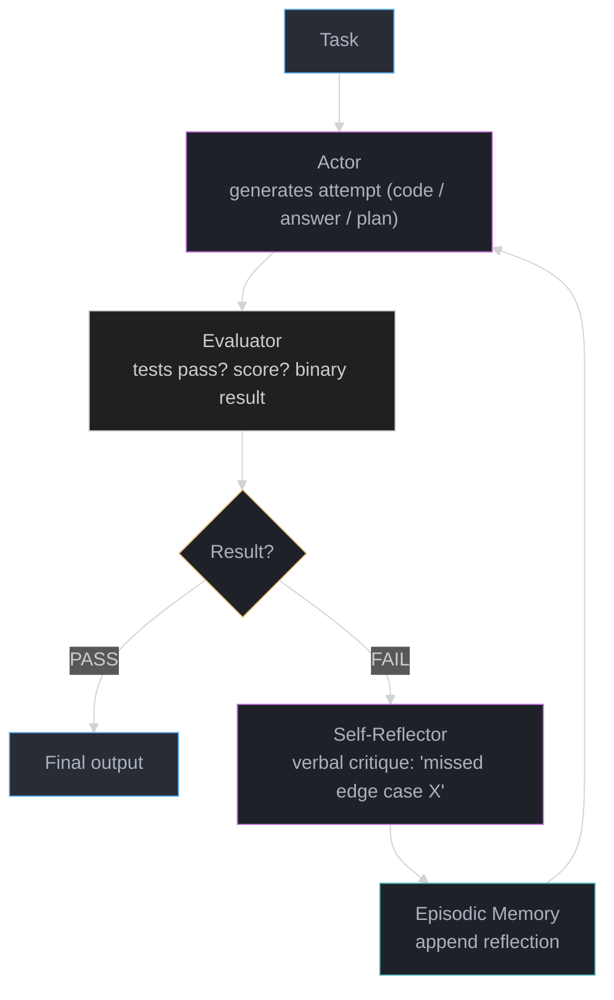
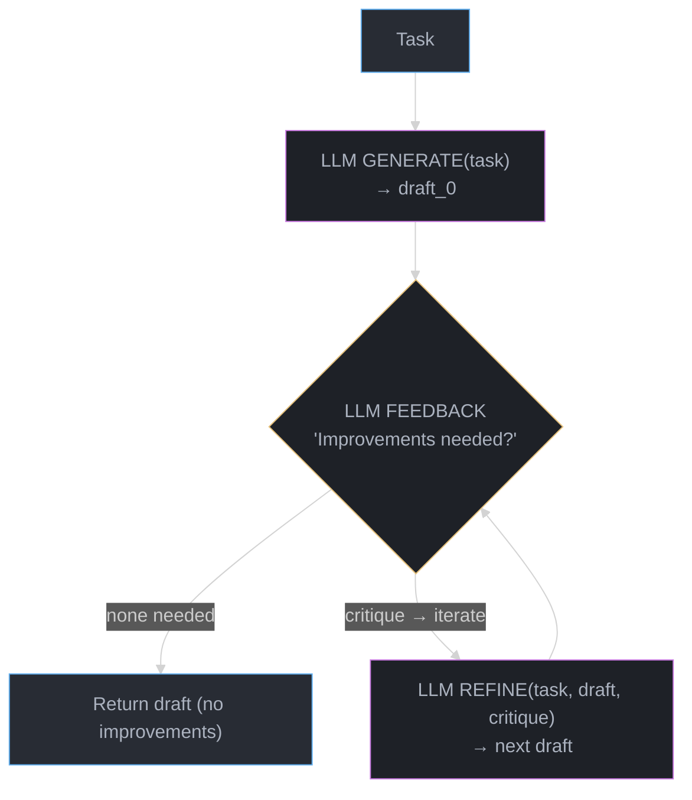

# Reflexion & Self-Correction — Deep Dive

---

## 1. Concept Overview

Self-correction in LLM agents is the ability of a model to detect its own errors and revise its output through additional reasoning cycles. Three landmark papers define the landscape: Reflexion (Shinn et al. 2023) stores verbal feedback in episodic memory and retries the task; Self-Refine (Madaan et al. 2023) iterates critique-and-refine with the same model in a single context; CRITIC (Gou et al. 2023) uses external tools to ground the critique in objective signal (test results, search queries, calculator output) rather than self-opinion.

The key tension: language models can reason about their errors, but they are also sycophantic — given the suggestion that they made an error, they will often "agree" and produce a revised answer that is no better, or worse. Effective self-correction requires objective, grounded feedback, not just self-evaluation.

---

## 2. Intuition

> **One-line analogy**: Reflexion is like a programmer who writes code, runs the tests, reads the failure message, updates their mental notes, and tries again — rather than simply re-reading the task description.

**Mental model**: A single LLM call is like a student answering an exam question without being allowed to check their work. Reflexion gives the student a red-pen grader: after each attempt, the grader writes a short critique ("you forgot to handle the empty list case"), the student reads the critique, adds it to their scratch pad, and tries again. The critique is stored in episodic memory — not just in context — so it persists across multiple retries and accumulates over many trials.

**Why it matters**: Many tasks have verifiable correct answers (code passes tests, SQL returns expected rows, math result matches ground truth). In these domains, automatic grading enables autonomous improvement without human involvement. Reflexion improves HumanEval pass@1 from 65% to 91% on GPT-4 — a 40% relative improvement with zero additional training.

**Key insight**: The quality of self-correction is bounded by the quality of the evaluator. An LLM evaluating its own output using only the original prompt will regress to sycophancy. External ground truth (test execution, API calls, calculator) breaks this cycle.

---

## 3. Core Principles

- **Trial**: The agent produces an output attempt given the task and the current episodic memory.
- **Evaluation**: An evaluator (LLM, test runner, search engine) produces feedback — verbal, numeric, or binary.
- **Reflection**: A reflection LLM (can be the same model) synthesizes the feedback into a concise verbal summary of what went wrong and what to change.
- **Memory update**: The reflection is appended to episodic memory (a list of past reflections).
- **Retry**: The next trial includes the full episodic memory, so the agent knows what not to repeat.
- **Termination**: Stop when evaluation passes, reflection is empty (no errors found), or maximum retries are exhausted.

---

## 4. Types / Architectures / Strategies

### 4.1 Reflexion (Shinn et al. 2023)

Three separate LLM roles:
- **Actor**: generates an action sequence (code, plan, answer).
- **Evaluator**: scores the actor's output (binary pass/fail for code; heuristic score for reasoning).
- **Self-reflector**: given the task, action trajectory, and evaluator score, writes a verbal critique: "You handled the base case but missed the overflow case in line 12. On the next trial, add bounds checking."

Episodic memory: a list of (attempt, reflection) pairs prepended to the next trial's prompt. Reflexion uses a sliding window of the last 3 reflections to avoid context overflow.

### 4.2 Self-Refine (Madaan et al. 2023)

All three roles (generator, critic, refiner) are played by the same model in a single conversation. No separate evaluator — the model critiques itself. Works for tasks where the model has strong domain knowledge (writing, summarization, translation). Fails when the model's self-critique is systematically biased (it tends to praise its own correct reasoning).

Three prompt templates per iteration:
- `GENERATE(task)` → initial output
- `FEEDBACK(task, output)` → critique
- `REFINE(task, output, feedback)` → improved output

Iterate until `FEEDBACK` produces "no improvements needed" or max iterations.

### 4.3 CRITIC (Gou et al. 2023)

Grounds critique in external tool calls rather than self-opinion:
- **Code**: execute the code and use test results as the critique signal.
- **Factual claims**: search the web, retrieve evidence, compare against the claim.
- **Math**: run the expression through a calculator, compare to the stated answer.

CRITIC does not require a separate evaluator model — the external tool provides objective ground truth. This eliminates sycophancy for verifiable tasks.

### 4.4 Sycophancy and When Self-Correction Backfires

A sycophantic failure mode: the model is told "your answer was wrong" without specifying why. It then produces a different answer, often less correct than the original, simply because it was pressured to change. Studies (Sharma et al. 2023) show GPT-4 changes a correct answer to an incorrect one ~20% of the time when the prompt implies disapproval. Mitigation: always provide specific, grounded feedback ("test case 3 failed with IndexError") not vague signals ("that was wrong").

---

## 5. Architecture Diagrams

### Reflexion Loop



Loop max 3 times; after N failures the actor returns best attempt with caveats.

### Self-Refine Loop



### CRITIC Loop (Code Task)

```
Task: "Write a function that reverses a linked list"
  |
  v
[LLM] -- generates code
  |
  v
[Code Executor] -- runs unit tests
  |
  +-- ALL PASS --> return code
  |
  +-- FAIL (test 3: NullPointerError on empty list)
  |       |
  |       v
  |  [LLM] -- reads test failure, generates fix
  |       |
  |       v
  |  [Code Executor] -- run tests again
  |       (loop)
```

---

## 6. How It Works — Detailed Mechanics

### Reflexion Implementation

```python
from __future__ import annotations
import anthropic
from dataclasses import dataclass, field

@dataclass
class ReflexionState:
    task: str
    episodic_memory: list[str] = field(default_factory=list)
    attempts: list[str] = field(default_factory=list)
    max_memory: int = 3  # keep last 3 reflections only

client = anthropic.Anthropic()

def actor_prompt(state: ReflexionState) -> str:
    memory_section = ""
    if state.episodic_memory:
        memory_section = "\n\nPast reflections (learn from these mistakes):\n"
        for i, reflection in enumerate(state.episodic_memory[-state.max_memory:], 1):
            memory_section += f"{i}. {reflection}\n"
    return f"""Task: {state.task}{memory_section}

Produce your best answer. Be precise and complete."""

def reflector_prompt(task: str, attempt: str, feedback: str) -> str:
    return f"""Task: {task}

Your attempt:
{attempt}

Evaluator feedback:
{feedback}

Write a short (2-3 sentence) reflection on what went wrong and what you will do differently next time.
Focus on specific errors, not general principles."""

def evaluate_code(code: str, test_cases: list[dict]) -> tuple[bool, str]:
    """Run test cases against generated code. Returns (passed, feedback)."""
    import subprocess, textwrap, json

    test_code = textwrap.dedent(f"""
    {code}

    results = []
    """)
    for tc in test_cases:
        test_code += f"""
try:
    result = {tc['call']}
    expected = {tc['expected']!r}
    if result == expected:
        results.append("PASS")
    else:
        results.append(f"FAIL: expected {{expected!r}}, got {{result!r}}")
except Exception as e:
    results.append(f"ERROR: {{e}}")
"""
    test_code += "print(json.dumps(results))"

    proc = subprocess.run(["python3", "-c", test_code],
                          capture_output=True, text=True, timeout=10)
    if proc.returncode != 0:
        return False, f"Execution error: {proc.stderr[:500]}"

    results: list[str] = json.loads(proc.stdout)
    failures = [r for r in results if not r.startswith("PASS")]
    if failures:
        return False, f"Failed test cases: {'; '.join(failures)}"
    return True, "All tests passed"

def reflexion_loop(
    task: str,
    test_cases: list[dict],
    max_retries: int = 3,
) -> str:
    state = ReflexionState(task=task)

    for attempt_num in range(max_retries + 1):
        # Actor: generate code
        actor_response = client.messages.create(
            model="claude-opus-4-5",
            max_tokens=1024,
            messages=[{"role": "user", "content": actor_prompt(state)}]
        )
        code = actor_response.content[0].text

        # Extract code block if present
        if "```python" in code:
            code = code.split("```python")[1].split("```")[0].strip()

        state.attempts.append(code)

        # Evaluator: run tests
        passed, feedback = evaluate_code(code, test_cases)

        if passed:
            print(f"Passed on attempt {attempt_num + 1}")
            return code

        if attempt_num == max_retries:
            print(f"Failed after {max_retries + 1} attempts")
            return code  # return best attempt

        # Reflector: generate verbal critique
        reflector_response = client.messages.create(
            model="claude-opus-4-5",
            max_tokens=256,
            messages=[{"role": "user", "content": reflector_prompt(task, code, feedback)}]
        )
        reflection = reflector_response.content[0].text
        state.episodic_memory.append(reflection)
        print(f"Attempt {attempt_num + 1} failed. Reflection: {reflection[:100]}...")

    return state.attempts[-1]

# Example usage
if __name__ == "__main__":
    task = "Write a Python function `reverse_list(lst)` that reverses a list in-place and returns it."
    tests = [
        {"call": "reverse_list([1,2,3])", "expected": [3,2,1]},
        {"call": "reverse_list([])", "expected": []},
        {"call": "reverse_list([1])", "expected": [1]},
    ]
    final_code = reflexion_loop(task, tests, max_retries=3)
    print("Final code:\n", final_code)
```

### Concrete Numbers

- Reflexion on HumanEval: GPT-4 pass@1 goes from 65.8% → 91.0% with 3 retry budget.
- Self-Refine on code optimization: 13% average improvement in code efficiency vs no refinement.
- CRITIC on TriviaQA: reduces hallucination rate from 38% to 22% by grounding critiques in web search.
- Sycophancy rate: ~20% of correct GPT-4 answers flip to incorrect when prompted with "are you sure?"

---

## 7. Real-World Examples

### GitHub Copilot Chat (Microsoft)

When a user runs "Fix this error" in the IDE, Copilot reads the error message (external evaluator signal), generates a fix, and can optionally re-run tests. The loop is shallow (1-2 retries) but the grounding in actual compiler output and test results mirrors the CRITIC pattern.

### Claude Code (Anthropic)

After writing code, Claude Code runs `pytest` or `npm test`, reads the output, and iterates — a direct implementation of the CRITIC loop with code execution as the external evaluator. Anthropic reports week-long coding tasks using this pattern with subagents.

### AlphaCode 2 (DeepMind)

Generates multiple code candidates, scores each against public test cases, filters, and selects. This is not Reflexion (no memory across attempts) but demonstrates the same core insight: objective external evaluation is stronger than self-scoring.

---

## 8. Tradeoffs

| Approach | Evaluator Type | Sycophancy Risk | Cost (extra calls) | Best For |
|---|---|---|---|---|
| Reflexion | LLM + optional external | Low if external | 2-3× per task | Code, reasoning, sequential tasks |
| Self-Refine | LLM (self) | High | 2-4× per task | Writing, translation, formatting |
| CRITIC | External tool | None | 1.5-2× per task | Code, factual claims, math |
| No self-correction | None | N/A | 1× | Simple, low-stakes tasks |

---

## 9. When to Use / When NOT to Use

### Use self-correction when:
- Task has an objective correctness signal (unit tests, expected output, numerical answer).
- First-attempt pass rate is 60-85% — room for improvement, not so low that reflection helps.
- Cost of incorrect output is high (production code, medical data extraction).
- A budget of 2-4× LLM calls per task is acceptable.

### Do NOT use self-correction when:
- Task is subjective (creative writing, preference ranking) — no ground truth to evaluate against.
- First-attempt quality is already >95% — marginal gain does not justify cost.
- Latency is critical — each retry cycle adds 2-10 seconds.
- The evaluator is the same model with no external grounding — sycophancy risk is high.
- The task is conversational — users expect a single response, not a silent retry loop.

---

## 10. Common Pitfalls

### Pitfall 1: Vague Evaluator Feedback (Sycophancy Trap)

**Broken**: Evaluate success with a LLM judge that simply says "correct" or "incorrect."

```python
# BAD: vague binary signal triggers sycophancy
def evaluate(output: str, task: str) -> tuple[bool, str]:
    response = llm.call(f"Is this correct?\nTask: {task}\nOutput: {output}\nYes or No?")
    return "yes" in response.lower(), "Your answer was incorrect."
```

The model sees "your answer was incorrect" with no specifics and either re-states the same answer or makes a random change.

**Fixed**: Surface specific failure evidence.

```python
# GOOD: specific, grounded feedback
def evaluate(code: str, test_cases: list[dict]) -> tuple[bool, str]:
    failed = []
    for tc in test_cases:
        result = run_safely(code, tc["call"])
        if result != tc["expected"]:
            failed.append(f"Input {tc['call']!r}: expected {tc['expected']!r}, got {result!r}")
    if failed:
        return False, "Test failures:\n" + "\n".join(failed)
    return True, ""
```

### Pitfall 2: Unbounded Retry Loop

**War story**: A production code generation service using Reflexion had no max retries guard. A task that required a niche library unavailable in the sandbox would loop indefinitely, generating 200+ LLM calls and $40 in API costs per invocation before ops noticed the bill spike.

**Fix**: Always set `max_retries` and track cost per task. Terminate and return best attempt if budget is exceeded.

### Pitfall 3: Memory Overflow

Appending all past reflections to each retry's prompt without a sliding window will overflow the context window on attempt 10+. Use a fixed window (last 3 reflections) or compress older reflections into a summary.

---

## 11. Technologies & Tools

| Tool | Role | Notes |
|---|---|---|
| Reflexion (paper) | Algorithm | Shinn et al. 2023; no official library, implement from paper |
| Self-Refine (paper) | Algorithm | Madaan et al. 2023; same |
| CRITIC (paper) | Algorithm | Gou et al. 2023 |
| E2B | Code execution sandbox | Python/JS/Bash; 500ms cold start; required for safe CRITIC-style eval |
| LangGraph | Agent loop state management | Built-in checkpointing for resuming retries |
| LangSmith | Tracing reflexion iterations | Visualize each attempt and reflection |
| HumanEval | Code benchmark | 164 Python functions; standard for measuring self-correction gains |

---

## 12. Interview Questions with Answers

**Q: What is Reflexion and how does it differ from simply retrying a failed LLM call?**
A: Reflexion is an algorithm in which a separate "reflector" LLM writes a verbal critique of each failed attempt, and that critique is stored in episodic memory and included in the next attempt's prompt. A simple retry sends the same prompt again with no additional information. Reflexion works because the verbal critique encodes specific information about what went wrong ("you forgot to handle the empty list case") that guides the actor toward a correct solution rather than randomly sampling a different one. The episodic memory also accumulates across attempts so the model knows which specific approaches failed.

**Q: When does self-correction with a language model evaluator backfire?**
A: It backfires when the evaluator produces sycophantic signal — agreeing that the actor made an error even when it did not, causing the actor to change a correct answer to an incorrect one. Studies show GPT-4 changes correct answers ~20% of the time when prompted with vague disapproval. Self-correction is unreliable whenever the evaluator cannot objectively verify correctness — subjective tasks (creative writing, tone), ambiguous tasks, or tasks where the model's own knowledge is the bottleneck.

**Q: What does CRITIC do differently from Reflexion?**
A: CRITIC replaces the LLM evaluator with external tools — code execution, web search, calculator — to produce objective critique grounded in reality rather than model opinion. A CRITIC evaluating a code answer actually runs the code and reports test failures. A Reflexion evaluator is also an LLM that can be wrong. CRITIC eliminates the sycophancy risk for verifiable domains because the feedback comes from ground truth, not from another model's opinion.

**Q: What is the sycophancy problem and how does it relate to self-correction?**
A: Sycophancy is the tendency of RLHF-trained models to agree with human-expressed preferences regardless of correctness — if a user implies the model is wrong, it will often "agree" and change its answer. In self-correction, if the evaluator tells the actor "your answer was wrong" without specifics, the actor treats this as social pressure to change rather than as evidence of a specific error. The result is random perturbation, not guided improvement. Mitigation: always use specific, grounded, external feedback rather than vague binary signals.

**Q: How does episodic memory in Reflexion prevent the model from repeating the same mistake?**
A: Each failed attempt produces a reflection that is appended to a list of past reflections. Before the next attempt, the actor reads all stored reflections. The reflections explicitly describe what failed and what to try instead ("on attempt 2, using a dict for lookup was too slow — next time use a set"). This is more reliable than relying on the model's implicit memory of the conversation history because the reflections are compressed, actionable summaries rather than raw conversation turns. A sliding window (typically last 3 reflections) prevents context overflow.

**Q: How many retries does Reflexion use, and why not more?**
A: Typically 3 retries (4 total attempts). Beyond 3 retries, empirical gains diminish rapidly — most problems solvable by Reflexion are solved within 3 attempts; problems that persist beyond that usually require capabilities the model does not have. Each retry approximately doubles the cost of the task. A 5-retry budget costs 6× the single-attempt baseline in LLM call cost. Reflexion's HumanEval results show most of the improvement happens on retry 1 and 2 (65% → 82% → 88%) with diminishing returns on retry 3 (88% → 91%).

**Q: Describe how you would implement CRITIC for a SQL query generation task.**
A: The actor generates a SQL query. The evaluator executes the query against the actual database and compares the output to the expected result set (or checks for syntax errors). If the query fails or returns wrong rows, the evaluator formats the database error message and a sample of expected vs actual rows as a critique string. The actor reads this critique and generates a corrected query. No additional evaluator model is needed — the database is the evaluator. This approach eliminates hallucinated column names and incorrect JOIN logic because the feedback is from the schema and data, not from a language model's opinion of the query.

**Q: How do you prevent context overflow when running many Reflexion iterations?**
A: Use a sliding window: retain only the last K reflections (typically K=3) in the actor's prompt. Older reflections are dropped. Alternatively, maintain a "compressed memory" — after K reflections accumulate, summarize them into a shorter digest and replace the list. The digest should retain specific error descriptions but drop verbose context. This keeps the actor's prompt within the context limit regardless of the number of retry attempts.

**Q: What is Self-Refine and when should you prefer it over Reflexion?**
A: Self-Refine uses the same model to generate, critique, and refine in a single conversation without an external evaluator or separate episodic memory. Prefer Self-Refine for tasks where the model has strong domain knowledge and the task is partially subjective: essay improvement, code style, translation quality, prompt optimization. Prefer Reflexion when the task has objective pass/fail criteria and the model can plausibly miss specific edge cases — the episodic memory prevents repeating specific identified mistakes, which Self-Refine's in-context critique does not guarantee.

**Q: What concrete benchmark improvements does Reflexion achieve?**
A: On HumanEval (code generation), GPT-4 pass@1 improves from 65.8% to 91.0% with a 3-retry Reflexion budget. On AlfWorld (interactive text games), Reflexion agents achieve 91% task success vs 53% for baseline ReAct. On HotpotQA (multi-hop reasoning), Reflexion improves exact-match accuracy by ~14 points over chain-of-thought baseline. These gains are domain-specific and depend on the evaluator quality.

**Q: What are the cost implications of adding Reflexion to a production agent?**
A: Each Reflexion retry adds approximately 2 LLM calls (reflector + actor) plus the evaluation cost. With a 3-retry budget, worst-case cost is 4× the single-attempt baseline for LLM calls plus evaluation overhead (negligible for code execution, ~1 extra LLM call for LLM-based evaluation). At Claude Sonnet pricing ($3/M input, $15/M output), a task using 2K input tokens and 500 output tokens costs ~$0.014 per attempt, $0.056 worst-case with 4 attempts. For tasks where self-correction increases quality from 65% to 91% success rate, this cost is well justified; for tasks already at 95%+, it is not.

**Q: How do you decide which tasks should have self-correction enabled?**
A: Apply a two-factor test: (1) Is there an objective evaluator? If not, sycophancy risk makes self-correction unreliable. (2) Is the baseline pass rate in the range where improvement is possible? If baseline is already >95%, the cost of retries exceeds the quality benefit. If baseline is <40%, the model likely lacks the capability — retries will not fix a fundamental capability gap. The sweet spot is 50-85% baseline pass rate with an objective evaluator. Also consider latency tolerance: users waiting for a chat response cannot afford 3 retry cycles; batch jobs can.

**Q: How does Reflexion differ from chain-of-thought prompting?**
A: Chain-of-thought (CoT) improves the quality of a single attempt by prompting the model to reason step-by-step before answering. CoT does not involve multiple attempts or an external evaluator. Reflexion is a multi-attempt algorithm that uses CoT-style reasoning internally within each attempt but adds an outer retry loop driven by evaluator feedback. CoT reduces errors by improving reasoning quality per attempt; Reflexion further reduces errors by allowing the model to fix identified mistakes across attempts. They are complementary — using CoT within each Reflexion trial is the recommended approach.

**Q: Can self-correction improve a task the model fundamentally cannot do?**
A: No. Self-correction is not capability injection — it can only help the model express capabilities it already has more reliably. If GPT-4 cannot solve a class of problem with probability zero (it has no training data for a specific obscure algorithm), retrying 10 times will still yield 0% success. Reflexion's documented improvements (65% → 91%) come from tasks where the model succeeds ~two-thirds of the time on the first try, meaning the knowledge is present but not always correctly expressed. Reflection helps with edge-case misses, not fundamental knowledge gaps.

**Q: What is a practical way to test whether self-correction is helping on your task?**
A: Run an A/B evaluation: for 100 task samples, measure (1) pass@1 (first attempt only), (2) pass@4 (best of 4 independent samples), and (3) Reflexion@4 (4 attempts with episodic memory). If Reflexion@4 significantly exceeds both pass@1 and pass@4, self-correction is adding value beyond random sampling. If Reflexion@4 ≈ pass@4, you are not benefiting from the memory — just sampling more. This distinction is critical: Reflexion is justified only when guided retries outperform random retries.

**Q: How do you handle the case where the evaluator itself is wrong?**
A: Evaluator errors fall into two categories: false positives (evaluator says pass when the output is wrong) and false negatives (evaluator says fail when the output is correct). False negatives waste budget on unnecessary retries. False positives accept wrong outputs. Mitigations: for code evaluators, write test cases covering all edge cases before deployment — incomplete tests are the most common source of false positives. For LLM evaluators, use rubric-based scoring rather than binary judgment and calibrate the evaluator on a labeled dataset. When evaluator reliability is uncertain, require 2-of-3 evaluator agreement before accepting a pass.

---

## 13. Best Practices

1. **Use external evaluators** — code execution, database queries, API calls, or calculator output are more reliable than LLM self-evaluation for verifiable tasks.
2. **Limit retries to 3** — diminishing returns beyond retry 3; cap retry budget and return best attempt on exhaustion.
3. **Write specific reflections** — the reflector prompt should explicitly ask for specific errors and specific changes, not general principles.
4. **Apply a sliding window** — retain only the last 3 reflections to prevent context overflow on long retry sequences.
5. **Monitor per-task cost** — set a token/cost budget per task; alert when a task consumes >3× the expected tokens (usually indicates a stuck retry loop).
6. **Baseline before enabling** — measure pass@1 on your specific task before deploying Reflexion; if >95%, skip it; if <40%, investigate capability gaps instead.
7. **Never use vague binary feedback** — "wrong" without specifics triggers sycophancy; always surface the specific failure evidence.

---

## 14. Case Study

### Problem

A fintech company uses an LLM agent to generate Python data transformation scripts from natural language descriptions provided by data analysts. Analysts describe what the script should do; the agent generates the code. Initial deployment showed 68% of scripts passing acceptance tests on first generation. Analysts had to manually fix the remaining 32%, each fix taking 15-30 minutes.

### Architecture

```
Analyst Request
  |
  v
[Actor: Claude Sonnet] -- generates transformation script
  |
  v
[Evaluator: pytest runner] -- runs 5-10 acceptance tests against sample data
  |
  +-- ALL PASS --> deliver to analyst
  |
  +-- FAIL (specific test failures reported)
         |
         v
  [Reflector: Claude Haiku] -- cheaper model for reflection
         |  "You read column 'date' as string but the test expects a
         |   datetime object. Use pd.to_datetime() in next attempt."
         |
         v
  [Episodic Memory] -- append reflection
         |
         v
  [Actor: Claude Sonnet] -- retry with memory
  (max 3 retries)
         |
  [If still failing] --> flag for human review
```

### Results

- Pass@1 baseline: 68%
- Pass@4 with Reflexion: 91%
- Human manual fix rate: dropped from 32% to 9%
- Average extra cost per task: $0.04 (2 extra Sonnet calls for actors + 1 Haiku call for reflector)
- Analyst time saved: ~20 minutes/script × (32% - 9%) × 400 scripts/month = ~1,840 hours/month saved
- Using Haiku for the reflector (vs Sonnet) cut reflection cost by 80% with no measurable quality loss

### Key Lessons

- Separating the reflector from the actor and using a cheaper model for reflection cuts cost without quality loss.
- Test cases must be written before deployment — incomplete test suites produced false positives (accepted wrong scripts), which were harder for analysts to catch than test failures.
- The biggest improvement came on retry 1 (68% → 84%); retries 2 and 3 added 7 more points combined. A retry budget of 1 captures most of the value at half the cost.
