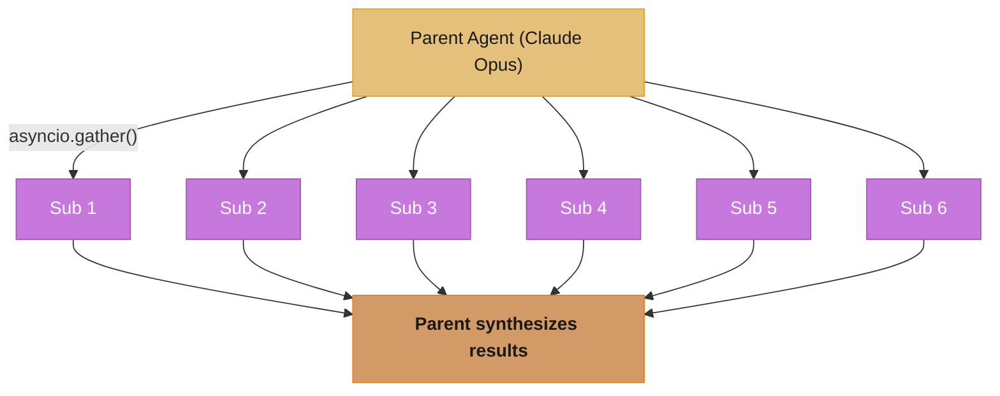

# Subagents and Delegation — Deep Dive

---

## 1. Concept Overview

A subagent is an LLM agent spawned by a parent agent to handle a focused subtask in an isolated context. The parent dispatches the subtask with a narrow system prompt and a restricted tool subset; the subagent runs to completion and returns a structured result (typically a JSON object with `result`, `confidence`, `artifacts`, and `errors`); the parent then synthesizes results from one or more subagents into the final output.

Subagents matter for three reasons: (1) **context isolation** — a subagent doing web research doesn't need to see the parent's 30 prior tool calls, cutting cost and improving focus; (2) **parallelism** — 5 subagents dispatched simultaneously finish in roughly the time of one, dramatically reducing wall-clock latency on multi-source tasks; (3) **security** — restricting a subagent's tools shrinks the blast radius of any single [prompt injection](../llm_security/README.md) or model misbehavior.

The pattern is the foundation of Claude Code's parallel research, Anthropic's research multi-agent system (reporting 15-minute research vs 1-hour single-agent), and most production agent architectures handling tasks that decompose into independent subtasks.

---

## 2. Intuition

**One-line analogy**: A subagent is like an intern given a specific brief and a Google login but no access to the company drive — they focus on their task, return a memo, and don't poke around your other files.

**Mental model**: Think of the parent as the manager and subagents as specialists hired for a project. The manager defines the scope ("research these 3 competitors"), gives them only the tools they need (web access, not the production database), waits for their reports, and writes the executive summary. No specialist sees the others' work or the manager's full history.

**Why it matters**: Without subagents, a single agent's context bloats: every research finding, intermediate observation, and tool result accumulates. By 20 tool calls, the model is reasoning over 100K+ tokens of noise. Subagent dispatch keeps the parent context lean (it sees only the subagent's structured result, not the journey).

**Key insight**: The parent does NOT need to know how the subagent found its answer — it only needs the answer and a confidence signal. This decoupling is what makes subagents composable and parallel-safe.

---

## 3. Core Principles

- **Context isolation**: subagents start with an empty conversation, not the parent's history.
- **Tool subsetting**: subagents get only the tools they need — minimum privilege.
- **Structured return contract**: subagents return JSON, not free-form text.
- **Parallel dispatch**: use `asyncio.gather()` to run multiple subagents concurrently.
- **Bounded execution**: subagents have their own `max_iterations` and budget caps.
- **Failure isolation**: a subagent crash doesn't crash the parent; parent decides retry or fallback.
- **Synthesis is the parent's job**: subagents return facts; parent reasons over the combination.

---

## 4. Types / Architectures / Strategies

### 4.1 Map-Reduce Pattern
Parent maps N input items to N subagents (one per item), then reduces results. Ideal for: research over N entities, processing N documents, analyzing N data sources.

### 4.2 Specialist Delegation
Parent identifies the subtask type and dispatches to a specialist subagent with that domain's tools. Examples: coding subagent (file/bash tools), research subagent (web/RAG tools), data subagent (SQL/Pandas tools).

### 4.3 Recursive Decomposition
Parent breaks task into subtasks; some subagents may themselves spawn further subagents. Use sparingly — depth >2 makes debugging hard.

### 4.4 Voting / Consensus
Parent dispatches the same task to N subagents at different temperatures or with different models; aggregates via majority or judge LLM. Improves reliability on hard tasks.

---

## 5. Architecture Diagrams

**Parallel Subagent Dispatch**



All six subagents run concurrently via `asyncio.gather()` — wall-clock is max(sub_1..6) ≈ 30s instead of the 180s sequential equivalent.

```
Context Comparison
===================

Inline (no subagent):
  Parent context grows monotonically
  Step 5 sees: full history + 5 tool results + reasoning
  By step 20: 100K+ tokens of context

Subagent:
  Parent sees: subagent's structured result only
  Subagent has its own isolated context
  Both stay lean


Return Contract
================

  Subagent returns JSON:
  {
    "result": "Summary or extracted data",
    "confidence": 0.85,
    "artifacts": ["url1", "url2", ...],
    "errors": [],
    "tokens_used": 4523
  }

  Parent validates schema → injects into context as structured tool result
```

---

## 6. How It Works — Detailed Mechanics

### Parallel Research Subagents (Python, Anthropic SDK)

```python
import asyncio
import json
from typing import Any
import anthropic

client = anthropic.AsyncAnthropic()

SUBAGENT_TOOLS = [
    {
        "name": "web_search",
        "description": "Search the web. Returns list of {title, url, snippet}.",
        "input_schema": {
            "type": "object",
            "properties": {"query": {"type": "string"}},
            "required": ["query"],
        },
    },
    {
        "name": "read_url",
        "description": "Fetch full text content of a URL.",
        "input_schema": {
            "type": "object",
            "properties": {"url": {"type": "string"}},
            "required": ["url"],
        },
    },
]


async def execute_tool(name: str, inp: dict) -> str:
    """Pseudocode: call real web_search/read_url APIs."""
    ...


async def run_subagent(
    task: str,
    *,
    model: str = "claude-sonnet-4-6",
    max_iterations: int = 8,
    token_budget: int = 30_000,
) -> dict[str, Any]:
    """Run a focused subagent with structured return contract."""
    
    system = [{
        "type": "text",
        "text": (
            "You are a focused research subagent. Complete the task efficiently. "
            "When you have enough information, return a JSON object with fields: "
            '{"result": str, "confidence": float (0-1), "artifacts": list[str], '
            '"errors": list[str]}. Do not add commentary outside the JSON.'
        ),
        "cache_control": {"type": "ephemeral"},  # Cache subagent prompt
    }]
    
    messages = [{"role": "user", "content": task}]
    tokens_used = 0
    
    for i in range(max_iterations):
        if tokens_used > token_budget:
            return {
                "result": "Budget exceeded — partial result",
                "confidence": 0.3,
                "artifacts": [],
                "errors": [f"Token budget {token_budget} exceeded"],
            }
        
        resp = await client.messages.create(
            model=model, max_tokens=2048, system=system,
            tools=SUBAGENT_TOOLS, messages=messages,
        )
        tokens_used += resp.usage.input_tokens + resp.usage.output_tokens
        messages.append({"role": "assistant", "content": resp.content})
        
        if resp.stop_reason == "end_turn":
            text = "".join(b.text for b in resp.content if b.type == "text")
            try:
                return json.loads(text)
            except json.JSONDecodeError:
                return {"result": text, "confidence": 0.5, "artifacts": [], "errors": ["non-JSON output"]}
        
        # Execute tools in parallel
        tool_uses = [b for b in resp.content if b.type == "tool_use"]
        results = await asyncio.gather(
            *[execute_tool(tu.name, tu.input) for tu in tool_uses],
            return_exceptions=True,
        )
        messages.append({
            "role": "user",
            "content": [
                {
                    "type": "tool_result",
                    "tool_use_id": tu.id,
                    "content": str(r)[:50_000],
                    "is_error": isinstance(r, Exception),
                }
                for tu, r in zip(tool_uses, results)
            ],
        })
    
    return {"result": "max iterations exceeded", "confidence": 0.0, "artifacts": [], "errors": ["max_iter"]}


async def parent_orchestrator(topics: list[str]) -> dict:
    """Parent dispatches one subagent per topic in parallel, synthesizes."""
    
    # Parallel dispatch — 6 topics in roughly the time of 1
    subagent_results = await asyncio.gather(
        *[run_subagent(f"Research: {t}") for t in topics],
        return_exceptions=True,
    )
    
    # Parent synthesizes (no tools, just reasoning)
    synthesis_input = "\n\n".join(
        f"## {t}\n{json.dumps(r, indent=2)}"
        for t, r in zip(topics, subagent_results)
        if not isinstance(r, Exception)
    )
    
    synthesis = await client.messages.create(
        model="claude-opus-4-7",
        max_tokens=4096,
        messages=[{
            "role": "user",
            "content": (
                "Synthesize these research findings into a single executive summary:\n\n"
                + synthesis_input
            ),
        }],
    )
    return {
        "summary": synthesis.content[0].text,
        "subagent_results": subagent_results,
    }


# Usage
if __name__ == "__main__":
    topics = [
        "OpenAI GPT-5 release rumors",
        "Anthropic Claude pricing changes 2025",
        "Google Gemini 2 features",
        "Meta Llama 4 architecture",
        "DeepSeek R2 capabilities",
    ]
    result = asyncio.run(parent_orchestrator(topics))
    print(result["summary"])
```

---

## 7. Real-World Examples

**Claude Code** uses subagent dispatch via the Agent tool. Parent CLI agent spawns focused subagents for: codebase exploration (Explore subagent with read-only tools), code review (with bash+test tools), and code generation (with write tools).

**Anthropic Research multi-agent system** dispatches 5-20 Sonnet subagents in parallel for deep research; reports 15-minute completion vs 1-hour for single agent on the same prompts — the canonical production deployment of the [orchestrator-worker pattern](../multi_agent_systems/orchestrator_worker_pattern.md).

**Cursor Composer** spawns parallel file-editing subagents when changes span >5 files. Each subagent gets only the files it's editing in context.

**Production legal research tool** at a mid-size law firm: parent gets a legal question, dispatches subagents to (a) case law database, (b) statutes database, (c) legal commentary; each returns structured citations; parent synthesizes a memo with sourced quotes.

---

## 8. Tradeoffs

| Dimension | Inline (no subagent) | Sequential subagents | Parallel subagents |
|---|---|---|---|
| Wall-clock latency | Linear in tools | N × subagent time | max(subagent times) |
| Context size at parent | Grows monotonically | Grows monotonically | Stays lean |
| Cost per token | Lowest | Higher (sub prompts) | Higher (sub prompts) |
| Reliability per task | Lower (context bloat) | Higher (focused) | Higher (focused) |
| Debugging complexity | Easy (one trace) | Medium | Hard (parallel traces) |
| Best for | Simple sequential tasks | Tasks with deps | Independent subtasks |

---

## 9. When to Use / When NOT to Use

**Use subagents when:**
- Task decomposes into N independent subtasks (research over N items, edit N files)
- Subtask needs context isolation (parent's history would mislead)
- Subtask uses different tools than parent (avoid bloated parent toolset)
- Parallel execution gives wall-clock win

**Do NOT use subagents when:**
- Subtask needs full parent context (sequential reasoning, not independent)
- Subtask is trivial (overhead of subagent dispatch >1-2s + cost of subagent system prompt)
- Strict ordering required (subagents may complete in any order)
- Debugging is critical — subagent traces are harder to follow than inline

---

## 10. Common Pitfalls

### Pitfall 1: Subagent inherits parent's full context

```python
# BROKEN: subagent sees parent's entire conversation
async def dispatch_bad(parent_messages, subtask):
    sub_messages = parent_messages + [{"role": "user", "content": subtask}]
    return await client.messages.create(messages=sub_messages, ...)
# Subagent context: parent's 30 tool calls + subtask = 100K tokens
# Subagent reasoning polluted by irrelevant parent history
```

```python
# FIXED: subagent starts fresh
async def dispatch_good(subtask):
    sub_messages = [{"role": "user", "content": subtask}]
    return await run_subagent(subtask)
# Subagent context: just the subtask
```

### Pitfall 2: Free-form return that parent can't reliably parse

```python
# BROKEN: parent tries to extract result from prose
sub_output = "I researched the topic and found that the price is $42 currently."
# Parent regex/parsing fragile; breaks when subagent phrases differently
```

```python
# FIXED: enforce JSON return contract via system prompt
# Subagent always returns: {"result": "...", "confidence": 0.85, "artifacts": [...]}
result = json.loads(sub_output)  # Reliable
```

**War story**: A team built a market research agent dispatching 8 subagents per query. Initial implementation passed parent context to subagents "to give them background." Cost ballooned to $0.60/query (vs $0.04 budgeted). After switching to isolated subagent contexts: dropped to $0.07/query and improved quality — subagents stopped getting confused by irrelevant parent reasoning about prior tasks.

---

## 11. Technologies & Tools

| Tool | Role | Notes |
|---|---|---|
| Anthropic API + asyncio | Native subagent dispatch | Most direct |
| OpenAI Agents SDK `handoff()` | Built-in transfer primitive | But: sequential, not parallel |
| [LangGraph](../agentic_frameworks/langgraph.md) subgraphs | Reusable subagent definitions | Persistent state, checkpointing |
| Claude Code Agent tool | Production-tested pattern | Spawns isolated subagents |
| `asyncio.gather(..., return_exceptions=True)` | Parallel + isolated failures | Standard pattern |
| Temporal child workflows | Durable subagents | For long-running parallelism |

---

## 12. Interview Questions with Answers

**Q: Why is context isolation the main benefit of subagents?**
Subagent context isolation prevents the parent's accumulating history from polluting subagent reasoning. A 20-step parent has 100K+ tokens of context (prior tool results, intermediate reasoning) — passing all of this to a subagent costs money and confuses the model with irrelevant information. Isolated subagents see only their assigned task, focusing their attention and minimizing token cost.

**Q: How much wall-clock speedup do parallel subagents give?**
Speedup is approximately N for N independent subagents if each takes similar time. Real-world example: 5 research subagents each taking ~30s complete in ~30s total (max), vs ~150s sequential. Diminishing returns above 10-20 parallel subagents due to API rate limits and parent's downstream synthesis time.

**Q: What is the right return contract for a subagent?**
Structured JSON with at minimum: `result` (string or structured data), `confidence` (0-1 numeric), `artifacts` (list of URLs/file paths/IDs the subagent produced), `errors` (list of strings). Optional: `tokens_used` for budget tracking. The contract should be defined in the subagent's system prompt and validated by the parent before incorporating into context.

**Q: How do you handle a subagent failure?**
Use `asyncio.gather(*coros, return_exceptions=True)` so one subagent's failure doesn't abort others. The parent then inspects each result: for exceptions, decide retry (transient) vs fallback (permanent) vs propagate. For partial results across many subagents, often "fail open" — proceed with the successful subagents' results, mark the failed ones in the final synthesis with confidence reduction.

**Q: When should a subagent itself spawn further subagents?**
Rarely. Recursive subagents create debugging nightmares — when something goes wrong at depth 3, the trace is hard to follow. Limit depth to 2 (parent → subagent). For genuinely recursive tasks, prefer a single dispatcher that flattens the recursion: collect all subtasks at any depth, dispatch them in one parallel batch.

**Q: How does the parent decide what to delegate vs handle inline?**
Delegate when the subtask: (a) is independent (parent doesn't need to interleave with other steps), (b) uses different tools than the parent's current step, (c) benefits from context isolation, OR (d) can run in parallel with other subtasks. Handle inline when: (a) subtask is small (<5 tool calls), (b) subtask depends on the parent's accumulating reasoning, (c) the subagent dispatch overhead (1-2s + system prompt tokens) exceeds the subtask's own cost.

**Q: What is the typical cost overhead of using subagents vs inline execution?**
Each subagent re-pays for its system prompt and tool definitions on its first API call (or first cache-miss). Typical overhead: 1500-3000 tokens × subagent count × input price. For a parent dispatching 5 subagents on Sonnet: ~$0.045 in subagent prompt overhead. This is paid back by reduced parent context bloat — net savings appear at >10 inline tool calls per equivalent task.

**Q: Should subagents share state or remain stateless?**
Stateless is the default and recommended pattern. Stateful subagents create concurrency bugs (race conditions on shared store) and break parallel execution. If subagents truly need to coordinate, prefer the parent passing summarized state in subtask descriptions, not direct shared mutable state.

**Q: How do you assign different models to subagents based on difficulty?**
Static heuristic: hard subtasks get Opus, medium get Sonnet, simple get Haiku. Dynamic: parent classifies the subtask first (cheap model call) and chooses the subagent model from a routing table. Cost-aware: always start with cheaper model, escalate if confidence < threshold. Most production systems use static heuristics for predictability.

**Q: What's the difference between subagents and the OpenAI Agents SDK handoff?**
Handoff is sequential — control transfers to the target agent, prior agent stops. Subagents are parallel — parent stays in control, dispatches N subagents concurrently, synthesizes. Handoff is for "transfer the user to specialist"; subagents are for "spawn workers to gather data."

**Q: How do you debug a parallel subagent system?**
Use distributed tracing (OpenTelemetry, LangSmith, OpenAI Tracing) to capture parent + all subagent traces under one trace_id. Log: subagent ID, task, tools used, iterations, final result, tokens used. View parent trace and drill into each subagent span. Without tracing, parallel subagents are nearly impossible to debug from logs alone.

**Q: Can subagents call each other?**
Technically yes — a subagent could call `run_subagent()` itself. In practice, avoid: it creates recursion that's hard to bound and debug. Prefer "flat" dispatch: the parent identifies all subtasks (at any conceptual depth), dispatches them as a flat list, and synthesizes.

**Q: How do you cap total cost across a parallel subagent dispatch?**
Pre-compute the expected cost: N subagents × estimated tokens per subagent × $/token. Enforce per-subagent token budget (return partial result when exceeded). Enforce total parent cost cap by tracking cumulative tokens across all subagents — abort dispatch if cap exceeded. Production systems typically set per-task cost limits ($0.50, $5, $50) configurable per user/feature.

**Q: Should the subagent's system prompt be cached?**
Yes — if the same subagent definition is invoked many times in a short window (Anthropic's 5-min cache TTL), caching the system prompt saves 90% on subsequent calls. For map-reduce dispatches where 10 subagents share an identical system prompt, cache the first one's prompt and the rest get cache hits within microseconds.

**Q: What metrics should you track for a subagent system in production?**
Per-subagent: latency, tokens, iterations, success rate. Per-parent task: total subagent count, parallel max, total cost, end-to-end latency. Aggregate: success rate by subagent type, p99 latency, cost per task. Alert on: subagent failure rate >5%, p99 latency degradation, cost-per-task drift.

---

## 13. Best Practices

1. Start subagents with empty conversation history (not parent's) — the #1 cost lever.
2. Always enforce a JSON return contract in the subagent's system prompt; parse with try/except and fallback gracefully.
3. Use `asyncio.gather(..., return_exceptions=True)` for parallel dispatch so failures don't cascade.
4. Cap each subagent with `max_iterations` AND `token_budget` — both can stop runaway subagents.
5. Subset tools per subagent — never pass the full parent toolset; minimum privilege wins.
6. Cache subagent system prompts (Anthropic ephemeral cache) when dispatching many similar subagents.
7. Use cheaper models for subagents than the parent when subtasks are well-scoped — Sonnet subagents, Opus parent.
8. Capture distributed traces with a shared trace_id across parent + all subagents — essential for debugging.
9. Limit recursion depth to 2 (parent → subagent only); avoid subagents spawning subagents.
10. Set explicit cost caps per parent task with cumulative token tracking across subagents.

---

## 14. Case Study

**Multi-Source Research Agent at a Strategy Consulting Firm**

**Problem**: Analysts spend 4-8 hours per project doing manual research across 10-30 sources (10-K filings, analyst reports, news, competitor websites, Glassdoor reviews, LinkedIn job posts).

**Architecture**:

```
                Parent Agent (Claude Opus 4.7, ext. thinking)
                          |
                          v
                Identifies N source-types needed (5-12)
                          |
                          v
        asyncio.gather() dispatches N subagents in parallel
                          |
   +-----+-----+-----+-----+-----+-----+
   |     |     |     |     |     |     |
   v     v     v     v     v     v     v
  10-K  News  Comp  Glass Job   ...   (Sonnet 4.6 each)
  Sub   Sub   Sub   Sub   Sub

  Each subagent has:
  - Narrow system prompt (its source type only)
  - Tool subset (e.g., 10-K subagent: SEC EDGAR search + read_url)
  - Token budget: 25K input, 5K output
  - max_iterations: 8
  - Returns: {findings: [...], citations: [...], confidence: 0-1, errors: []}
                          |
                          v
              Parent synthesizes into report
```

**Results**:
- Time per project: 4-8 hours → 4-7 minutes
- Cost per project: $0.18-$0.42 (vs analyst hourly cost ~$200/hr × 6 hrs = $1200)
- Quality: senior analyst review rated 87% of reports as "would use with minor edits" (manual baseline: 91%; gap closing with prompt tuning)
- Parallel speedup: 10 subagents × 35s each ≈ 40s wall-clock (synthesis adds 20s)

**Lessons learned**:
1. Subagent system prompt caching saved ~$0.08/project once 5+ subagents shared similar prompts.
2. Forcing JSON return contract eliminated 90% of parser errors in the parent synthesizer.
3. Initial version passed parent's conversation to subagents "for context" — cost was 3.5x higher and quality WORSE because subagents got distracted. Isolation was the single biggest improvement.
4. Distributed tracing in Honeycomb (one trace_id per project) made debugging tractable — without it, parallel failures were opaque.
