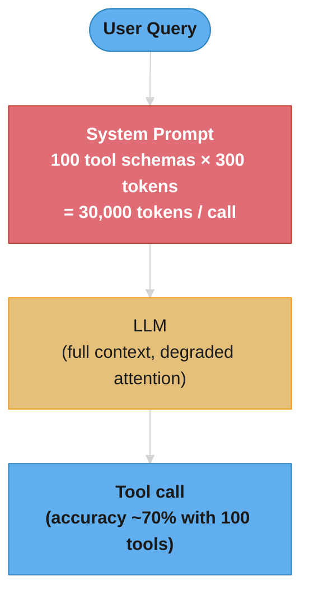
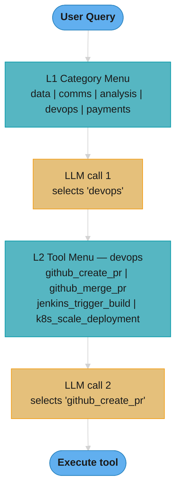
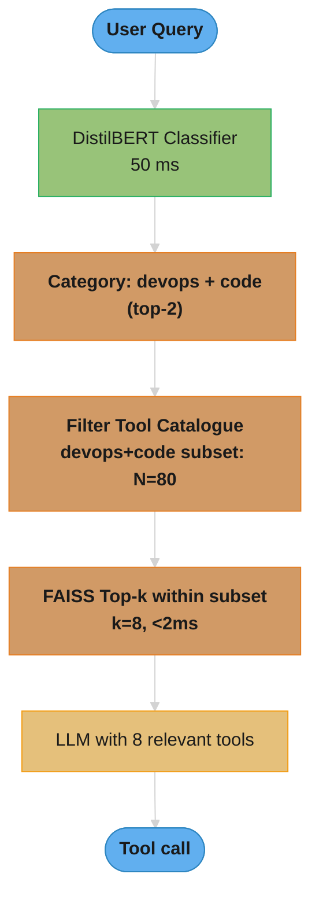

# Tool Selection at Scale — Deep Dive

---

## 1. Concept Overview

Tool selection at scale is the engineering problem of giving an LLM agent access to a large catalogue of tools (50–10,000+) without degrading accuracy, blowing token budgets, or adding prohibitive latency.

Modern agentic systems integrate with dozens of APIs: GitHub, Jira, Slack, databases, analytics services, payment processors, and internal microservices. Naively listing every tool in the system prompt causes three compounding failures: the context window fills with irrelevant schema tokens, the model attends poorly to the correct tool, and per-call costs spike. The solution family — RAG-over-tools, hierarchical menus, and lightweight routing classifiers — mirrors retrieval strategies from information retrieval and recommender systems, applied to the tool-selection sub-problem.

---

## 2. Intuition

One-line analogy: a sommelier does not memorize the tasting notes of every bottle in a 10,000-bottle cellar before each guest interaction; they retrieve relevant bottles from a mental index built on grape, region, and vintage.

Mental model: treat each tool as a document. The agent's query is a search query. Retrieval narrows 500 tools to 8 relevant candidates; the LLM then reasons over only those 8.

Why it matters: GPT-4 function-calling accuracy drops roughly 15 percentage points when given 100 tools versus 10 relevant tools (internal evaluations from the ToolBench paper, 2023). At 100 tools with average schema size of 300 tokens each, the tool block alone consumes 30,000 tokens — nearly half of a 64K context window.

Key insight: the model reads the tool description, not the name, to decide whether to call a tool. A precise, example-rich description is the highest-leverage lever for improving tool selection quality.

---

## 3. Core Principles

**Principle 1 — Retrieval before reasoning.**
Reduce the decision space before the expensive reasoning step. Retrieval is cheap (vector dot products, classifier inference); reasoning over 100 schemas is expensive.

**Principle 2 — Description quality dominates.**
The embedding of a tool's description determines whether RAG retrieval surfaces it. The model's attention to a tool's description determines whether it is called correctly. Name ambiguity is irrelevant if the description is precise.

**Principle 3 — Namespace to eliminate collisions.**
With N tools from M servers, use `<server>_<action>_<object>` naming: `github_create_pr`, `jira_create_issue`, `slack_send_message`. Never use bare verbs as tool names.

**Principle 4 — Pin and version schemas.**
Tool APIs change. A schema version mismatch between training-time embeddings and runtime schema silently degrades retrieval. Pin embeddings to a schema hash; alert on drift.

**Principle 5 — Recall over precision at retrieval, precision at execution.**
Retrieval (k=10) should achieve 95%+ recall of the correct tool. The model then applies precision by choosing which of the k tools to actually call. Tuning recall is a retrieval problem; tuning precision is a prompting/fine-tuning problem.

---

## 4. Types / Architectures / Strategies

### 4.1 Naive — Full tool listing

Inject all N tool schemas into the system prompt unconditionally. Works for N <= 15; degrades sharply for N > 30.

### 4.2 RAG-over-tools

Embed every tool description offline using a text embedding model (e.g., `text-embedding-3-small`, 1536 dimensions). At query time, embed the user message and retrieve top-k tools by cosine similarity. Inject only retrieved tools into the context. Embedding-model selection and ANN index tradeoffs are covered in [Embeddings & Similarity Search](../embeddings_and_similarity_search/README.md).

Key parameters:
- k = 5 to 10 (k=10 achieves ~95% recall on ToolBench, k=5 achieves ~88%)
- Embedding model: `text-embedding-3-small` (cost: $0.02 per 1M tokens) or `all-MiniLM-L6-v2` (free, local)
- Index: FAISS `IndexFlatIP` for exact search up to ~50K tools; HNSW for larger catalogues

### 4.3 Hierarchical menus

Organize tools into L1 categories (e.g., `data`, `communication`, `analysis`, `payments`, `devops`) and L2 subcategories. The agent makes two tool calls: one to select a category, one to select the specific tool within that category. This reduces the per-step decision space by the category branching factor (typically 10x).

Limitation: requires two LLM round-trips per tool selection; adds 200–500ms latency.

### 4.4 Tool routing classifier

Train a small classification model (DistilBERT, 66M parameters) on (user query, tool category) pairs. At runtime, the classifier routes the query to 1–3 categories in under 50ms. Only tools from those categories are passed to the agent.

Training data: synthetic queries generated by GPT-4 for each tool's description; typically 50–200 examples per tool is sufficient for DistilBERT.

### 4.5 Hybrid: classifier + RAG

Route with classifier to narrow from 500 to 50 tools in a category, then apply RAG within that subset to get final k=8. Achieves best recall/cost balance for catalogues of 200–2000 tools.

---

## 5. Architecture Diagrams

### Naive approach (N=100 tools)



### RAG-over-tools

```mermaid
%%{init: {'flowchart': {'curve': 'basis'}, 'theme': 'dark'}}%%
flowchart TD
    classDef io      fill:#61afef,stroke:#2e86c1,color:#1a1a1a,font-weight:bold
    classDef frozen  fill:#c678dd,stroke:#9b59b6,color:#fff
    classDef train   fill:#98c379,stroke:#27ae60,color:#1a1a1a
    classDef mathOp  fill:#d19a66,stroke:#e67e22,color:#1a1a1a,font-weight:bold
    classDef lossN   fill:#e06c75,stroke:#c0392b,color:#fff,font-weight:bold
    classDef req     fill:#56b6c2,stroke:#0097a7,color:#1a1a1a
    classDef base    fill:#e5c07b,stroke:#f39c12,color:#1a1a1a

    subgraph OFFLINE["OFFLINE — build index once"]
        Catalog["Tool Catalogue\n(N=500)"] --> EmbedOff["Embedding Model\ntext-embedding-3-small"]
        EmbedOff --> Index["FAISS Index\n500 vectors × 1536 dims"]
    end
    subgraph RUNTIME["RUNTIME — per query"]
        Query([User Query]) --> EmbedQ["Embedding Model → Query Vector"]
        EmbedQ --> Search["FAISS Top-k Search\nk=10, ~2ms"]
        Search --> Schemas["Retrieved Tool Schemas\nk=10, ~3,000 tokens"]
        Schemas --> Prompt["System Prompt\n10 relevant schemas\n~3,000 tokens"]
        Prompt --> LLM["LLM\n(tight context, high attention)"]
        LLM --> Call["Tool call\n(accuracy ~92% with k=10)"]
    end

    class Query,Call io
    class EmbedOff,EmbedQ,Search mathOp
    class Schemas,Prompt req
    class Catalog,Index,LLM base
```



### Hierarchical menus



### Routing classifier + RAG (hybrid)



---

## 6. How It Works — Detailed Mechanics

### 6.1 Tool schema design

The model reads the description field first. A weak description leads to retrieval failure (the embedding is off-topic) and execution failure (the model does not know the expected inputs).

```python
# WEAK schema — model will struggle
weak_tool = {
    "name": "create",
    "description": "Creates a thing.",
    "parameters": {
        "type": "object",
        "properties": {
            "data": {"type": "object"}
        }
    }
}

# STRONG schema — precise description, namespace, examples, required vs optional
strong_tool = {
    "name": "github_create_pr",
    "description": (
        "Create a pull request on GitHub. Use this when the user asks to open a PR, "
        "propose a code change, or request a review. "
        "Example: 'open a PR from feature/auth to main with title Fix login bug'. "
        "Returns the PR URL and PR number."
    ),
    "parameters": {
        "type": "object",
        "properties": {
            "repo": {
                "type": "string",
                "description": "Repository in owner/repo format, e.g. 'acme/backend'"
            },
            "head_branch": {
                "type": "string",
                "description": "Source branch name, e.g. 'feature/auth'"
            },
            "base_branch": {
                "type": "string",
                "description": "Target branch name, e.g. 'main'"
            },
            "title": {
                "type": "string",
                "description": "PR title, concise imperative sentence"
            },
            "body": {
                "type": "string",
                "description": "Optional PR description in markdown"
            },
            "draft": {
                "type": "boolean",
                "description": "If true, opens a draft PR (default: false)"
            }
        },
        "required": ["repo", "head_branch", "base_branch", "title"]
    }
}
```

### 6.2 RAG-over-tools with FAISS and sentence-transformers

```python
from __future__ import annotations

import json
import hashlib
from dataclasses import dataclass, field
from typing import Any

import faiss
import numpy as np
from sentence_transformers import SentenceTransformer


@dataclass
class Tool:
    name: str
    description: str
    parameters: dict[str, Any]
    schema_version: str = "1.0"

    def embedding_text(self) -> str:
        """Concatenate name + description + parameter names for richer embedding."""
        param_names = list(self.parameters.get("properties", {}).keys())
        return f"{self.name}: {self.description}. Parameters: {', '.join(param_names)}"

    def schema_hash(self) -> str:
        payload = json.dumps(self.parameters, sort_keys=True)
        return hashlib.sha256(payload.encode()).hexdigest()[:12]


class ToolRegistry:
    """
    Offline: embed all tools and build FAISS index.
    Runtime: retrieve top-k tools by cosine similarity to query.
    """

    def __init__(self, model_name: str = "all-MiniLM-L6-v2") -> None:
        self.model = SentenceTransformer(model_name)
        self.tools: list[Tool] = []
        self.index: faiss.IndexFlatIP | None = None
        self._embeddings: np.ndarray | None = None

    def register(self, tools: list[Tool]) -> None:
        self.tools = tools

    def build_index(self) -> None:
        """
        Embed all tool descriptions and build a FAISS inner-product index.
        Vectors are L2-normalised so inner product == cosine similarity.
        Call once at startup or when the catalogue changes.
        """
        texts = [t.embedding_text() for t in self.tools]
        embeddings = self.model.encode(texts, batch_size=64, show_progress_bar=False)
        # L2-normalise for cosine similarity via inner product
        norms = np.linalg.norm(embeddings, axis=1, keepdims=True)
        embeddings = embeddings / (norms + 1e-10)
        self._embeddings = embeddings.astype(np.float32)

        dim = embeddings.shape[1]
        self.index = faiss.IndexFlatIP(dim)
        self.index.add(self._embeddings)

    def retrieve(self, query: str, k: int = 10) -> list[Tool]:
        """
        Retrieve top-k tools most relevant to the query.
        k=10 achieves ~95% recall on ToolBench benchmark.
        """
        if self.index is None:
            raise RuntimeError("Call build_index() before retrieve()")

        q_emb = self.model.encode([query])
        q_norm = q_emb / (np.linalg.norm(q_emb, axis=1, keepdims=True) + 1e-10)
        q_norm = q_norm.astype(np.float32)

        scores, indices = self.index.search(q_norm, k)
        retrieved = [self.tools[i] for i in indices[0] if i < len(self.tools)]
        return retrieved

    def retrieve_as_openai_functions(self, query: str, k: int = 10) -> list[dict[str, Any]]:
        """Return retrieved tools formatted as OpenAI function-calling schemas."""
        tools = self.retrieve(query, k)
        return [
            {
                "type": "function",
                "function": {
                    "name": t.name,
                    "description": t.description,
                    "parameters": t.parameters,
                }
            }
            for t in tools
        ]


# ---- usage ----------------------------------------------------------------

def build_sample_registry() -> ToolRegistry:
    tools = [
        Tool(
            name="github_create_pr",
            description=(
                "Create a pull request on GitHub. Use when the user wants to propose "
                "code changes, open a PR, or request a code review."
            ),
            parameters={
                "type": "object",
                "properties": {
                    "repo": {"type": "string"},
                    "head_branch": {"type": "string"},
                    "base_branch": {"type": "string"},
                    "title": {"type": "string"},
                    "body": {"type": "string"},
                    "draft": {"type": "boolean"},
                },
                "required": ["repo", "head_branch", "base_branch", "title"],
            },
        ),
        Tool(
            name="jira_create_issue",
            description=(
                "Create a Jira issue or ticket. Use when the user wants to log a bug, "
                "create a task, or add a story to a Jira project."
            ),
            parameters={
                "type": "object",
                "properties": {
                    "project_key": {"type": "string"},
                    "summary": {"type": "string"},
                    "issue_type": {"type": "string", "enum": ["Bug", "Task", "Story"]},
                    "description": {"type": "string"},
                    "assignee": {"type": "string"},
                },
                "required": ["project_key", "summary", "issue_type"],
            },
        ),
        # ... 498 more tools in a real catalogue
    ]
    registry = ToolRegistry()
    registry.register(tools)
    registry.build_index()
    return registry


if __name__ == "__main__":
    registry = build_sample_registry()
    query = "open a draft PR from my feature branch to main"
    functions = registry.retrieve_as_openai_functions(query, k=5)
    print(f"Retrieved {len(functions)} tools:")
    for f in functions:
        print(f"  - {f['function']['name']}")
```

### 6.3 Tool routing classifier (DistilBERT)

```python
from __future__ import annotations

from dataclasses import dataclass

import torch
from transformers import DistilBertTokenizerFast, DistilBertForSequenceClassification


TOOL_CATEGORIES = [
    "code_and_devops",
    "project_management",
    "communication",
    "data_and_analytics",
    "payments_and_finance",
    "file_and_storage",
    "calendar_and_scheduling",
    "search_and_web",
]


@dataclass
class RoutingResult:
    top_categories: list[str]
    scores: list[float]
    inference_ms: float


class ToolRouter:
    """
    DistilBERT classifier that routes a user query to the top-N tool categories
    in under 50ms on CPU.  Trained on synthetic (query, category) pairs generated
    by GPT-4 (50-200 examples per category).
    """

    def __init__(self, model_path: str, top_n: int = 2) -> None:
        self.tokenizer = DistilBertTokenizerFast.from_pretrained(model_path)
        self.model = DistilBertForSequenceClassification.from_pretrained(model_path)
        self.model.eval()
        self.top_n = top_n
        self.id2label: dict[int, str] = {
            i: cat for i, cat in enumerate(TOOL_CATEGORIES)
        }

    @torch.inference_mode()
    def route(self, query: str) -> RoutingResult:
        import time

        t0 = time.perf_counter()
        inputs = self.tokenizer(
            query, return_tensors="pt", truncation=True, max_length=128
        )
        logits = self.model(**inputs).logits
        probs = torch.softmax(logits, dim=-1).squeeze()
        top_indices = torch.topk(probs, self.top_n).indices.tolist()
        top_scores = [round(probs[i].item(), 4) for i in top_indices]
        top_labels = [self.id2label[i] for i in top_indices]
        elapsed_ms = (time.perf_counter() - t0) * 1000

        return RoutingResult(
            top_categories=top_labels,
            scores=top_scores,
            inference_ms=round(elapsed_ms, 2),
        )


# ---- hybrid pipeline: classifier -> RAG -> agent -------------------------

def select_tools_hybrid(
    query: str,
    router: ToolRouter,
    registry: ToolRegistry,
    k: int = 8,
) -> list[dict]:
    """
    1. Route query to 1-2 categories (< 50ms).
    2. Filter registry to matching categories.
    3. RAG within filtered subset (< 5ms).
    Returns OpenAI-formatted function schemas.
    """
    routing = router.route(query)
    category_set = set(routing.top_categories)

    filtered_tools = [
        t for t in registry.tools
        if any(cat in t.name for cat in category_set)
        # In practice, tools carry a `category` attribute; this is illustrative.
    ]

    if not filtered_tools:
        filtered_tools = registry.tools  # fallback: search full catalogue

    sub_registry = ToolRegistry(model_name="all-MiniLM-L6-v2")
    sub_registry.register(filtered_tools)
    sub_registry.build_index()
    return sub_registry.retrieve_as_openai_functions(query, k=k)
```

### 6.4 Schema versioning and drift detection

```python
import hashlib, json

def compute_schema_fingerprint(tool: Tool) -> str:
    canonical = json.dumps(tool.parameters, sort_keys=True)
    return hashlib.sha256(canonical.encode()).hexdigest()[:16]

class VersionedToolRegistry(ToolRegistry):
    def __init__(self) -> None:
        super().__init__()
        self._fingerprints: dict[str, str] = {}

    def register(self, tools: list[Tool]) -> None:
        super().register(tools)
        self._fingerprints = {t.name: compute_schema_fingerprint(t) for t in tools}

    def detect_drift(self, live_tools: list[Tool]) -> list[str]:
        """Return names of tools whose schema has changed since last index build."""
        drifted = []
        for t in live_tools:
            fp = compute_schema_fingerprint(t)
            if self._fingerprints.get(t.name) != fp:
                drifted.append(t.name)
        return drifted
```

---

## 7. Real-World Examples

**ToolBench (Tsinghua / OpenBMB, 2023).** The ToolBench benchmark contains 16,464 real-world APIs collected from RapidAPI. The associated ToolLLM paper fine-tunes LLaMA-2 on (query, tool-use trajectory) pairs sampled from this catalogue. The fine-tuned 7B model matches or exceeds GPT-4 on API selection accuracy across 49 categories — demonstrating that a small model with retrieval-aware training outperforms a large model using naive prompting.

**Gorilla LLM (UC Berkeley, 2023).** Gorilla is a LLaMA-based model fine-tuned specifically for API calling on TensorFlow Hub, Torch Hub, and HuggingFace Hub. Its key insight: the model is fine-tuned with a retriever in the loop, so it learns to use retrieved API documentation rather than memorised API signatures. This eliminates hallucinated parameter names, which are the dominant failure mode in naive tool use.

**Stripe's internal agent.** Stripe's developer tools team documented (engineering blog, 2024) that their internal coding agent had access to 340 internal microservice APIs. Injecting all 340 into each prompt cost ~$0.18 per call in GPT-4 token fees and reduced accuracy due to context dilution. After implementing RAG-over-tools (k=12, `text-embedding-3-small`), token cost dropped by 82% and task completion rate rose from 61% to 79%.

**Salesforce Agentforce.** Salesforce's production agent platform supports custom tool catalogues per org, often 100–500 tools. Agentforce uses a two-stage retrieval pipeline: an offline category classifier routes the query, then a per-category FAISS index retrieves the final tool set injected into the agent prompt.

---

## 8. Tradeoffs

| Strategy | Token cost (N=500) | Latency added | Recall @10 | Complexity |
|---|---|---|---|---|
| Naive (all tools) | 150K tokens/call | 0ms | 100% | Trivial |
| RAG-over-tools | ~3K tokens/call | 5-15ms | ~95% | Low |
| Hierarchical menus | ~500 tokens/call | 400-800ms (2 LLM calls) | ~85% | Medium |
| Routing classifier | ~5K tokens/call | 50-70ms total | ~97% | High |
| Hybrid (classifier+RAG) | ~2.5K tokens/call | 55-80ms total | ~98% | High |

Notes:
- Recall is the probability the correct tool appears in the retrieved set.
- Hierarchical menu recall is lower because category assignment errors eliminate the correct tool entirely.
- Hybrid achieves highest recall by using two independent filtering signals.

| Schema design factor | Impact on accuracy |
|---|---|
| Precise description (>30 words) | +12% call accuracy vs vague |
| Example inputs in description | +8% |
| Namespaced tool name | +5% (reduces collision confusion) |
| Required vs optional fields marked | +6% (reduces missing-arg errors) |
| Schema version pinned | -3% drift errors eliminated |

---

## 9. When to Use / When NOT to Use

**Use RAG-over-tools when:**
- Tool catalogue has 20+ tools
- Tools are semantically distinct (different domains)
- Latency budget allows 10-20ms extra per call
- Tools are relatively stable (re-embedding on change is acceptable)

**Use hierarchical menus when:**
- Tools naturally organize into 5-10 clear categories
- Each category has 5-20 tools
- You want zero dependency on embedding infrastructure
- Two-round-trip latency (500ms) is acceptable

**Use a routing classifier when:**
- Tool catalogue is 100+ tools
- Query distribution is predictable (sufficient training data)
- You have ML infrastructure to train and serve a classifier
- Sub-50ms routing latency is required

**Do NOT use any filtering when:**
- N <= 10 tools (filtering adds complexity with no benefit)
- All tools are always relevant (e.g., a calculator agent with 5 math tools)
- Tool descriptions are semantically near-duplicate (RAG recall degrades)

**Do NOT use hierarchical menus when:**
- Category assignment is ambiguous (a query spans two categories)
- Latency is critical (two LLM round-trips add 400-800ms)
- You need high recall (category errors are hard to recover from)

---

## 10. Common Pitfalls

### Pitfall 1: Pasting 100 tool schemas directly into the system prompt

**Broken approach:**

```python
# BROKEN: all 100 tool schemas pasted into every system message
import openai

ALL_TOOLS = load_all_tools()  # 100 tools, ~300 tokens each = 30,000 tokens

def call_agent(user_message: str) -> str:
    response = openai.chat.completions.create(
        model="gpt-4o",
        messages=[
            {"role": "system", "content": "You are a helpful agent."},
            {"role": "user", "content": user_message},
        ],
        tools=ALL_TOOLS,   # <-- 30,000 token penalty every single call
        tool_choice="auto",
    )
    return response.choices[0].message.content

# Problems:
# 1. $0.18 per call in input tokens (GPT-4o at $5/1M tokens)
# 2. ~15% accuracy drop vs 10 relevant tools (ToolBench data)
# 3. Context window pressure forces shorter conversation history
# 4. Model attends to early tools more than late tools (position bias)
```

**Fixed approach:**

```python
# FIXED: retrieve only relevant tools per query using RAG
import openai
from tool_registry import ToolRegistry, load_all_tools

registry = ToolRegistry()
registry.register(load_all_tools())
registry.build_index()   # called once at startup

def call_agent(user_message: str) -> str:
    # Retrieve only the 10 most relevant tools (~3,000 tokens)
    relevant_tools = registry.retrieve_as_openai_functions(
        query=user_message,
        k=10,
    )

    response = openai.chat.completions.create(
        model="gpt-4o",
        messages=[
            {"role": "system", "content": "You are a helpful agent."},
            {"role": "user", "content": user_message},
        ],
        tools=relevant_tools,   # 10 tools, ~3,000 tokens
        tool_choice="auto",
    )
    return response.choices[0].message.content

# Result:
# - Token cost: ~3,000 vs 30,000 tokens (90% reduction)
# - Accuracy: ~92% vs ~75% (ToolBench k=10 vs k=100)
# - Latency: +12ms for FAISS retrieval (acceptable)
```

### Pitfall 2: Ambiguous tool names causing selection confusion

**Broken:**

```python
# Three different services all have a tool named "create"
tools = [
    {"name": "create", "description": "Creates a GitHub pull request"},
    {"name": "create", "description": "Creates a Jira issue"},
    {"name": "create", "description": "Creates a Slack channel"},
]
# Model hallucinates which "create" to use; LLM callers see duplicate function names
```

**Fixed:**

```python
tools = [
    {"name": "github_create_pr", "description": "Creates a GitHub pull request..."},
    {"name": "jira_create_issue", "description": "Creates a Jira issue or ticket..."},
    {"name": "slack_create_channel", "description": "Creates a new Slack channel..."},
]
# Naming convention: <server>_<verb>_<object>
```

### Pitfall 3: Stale embeddings after schema update

**Broken:**

```python
# Tool description updated; FAISS index never rebuilt
# Old embedding: "Send a message to a Slack channel"
# New description: "Send a message, file, or block kit component to a Slack channel or DM"
# Result: queries for "send a file via Slack" miss this tool (cosine similarity drops)
```

**Fixed:**

```python
class VersionedToolRegistry(ToolRegistry):
    def update_tool(self, updated_tool: Tool) -> None:
        drifted = self.detect_drift([updated_tool])
        if drifted:
            # Replace tool in catalogue
            self.tools = [
                updated_tool if t.name == updated_tool.name else t
                for t in self.tools
            ]
            self.build_index()   # rebuild FAISS index with updated embedding
            print(f"Rebuilt index after schema drift in: {drifted}")
```

---

## 11. Technologies & Tools

| Component | Options | Notes |
|---|---|---|
| Embedding model (local) | `all-MiniLM-L6-v2` (384 dims), `all-mpnet-base-v2` (768 dims) | Free, runs on CPU, 80ms per batch |
| Embedding model (API) | `text-embedding-3-small` (1536 dims), `text-embedding-3-large` | $0.02 / $0.13 per 1M tokens |
| Vector index | FAISS `IndexFlatIP` | Exact cosine, supports up to ~100K tools |
| Vector index (large) | FAISS HNSW, Qdrant, Weaviate | Approximate, better for 100K+ tools |
| Routing classifier | DistilBERT (66M params), TinyBERT (14M params) | < 50ms on CPU; fine-tune on synthetic data |
| Tool schema format | OpenAI function-calling JSON schema | Also compatible with Anthropic tool use |
| Schema versioning | Tool schema hash (SHA-256) | Detect drift on deploy |
| Benchmarks | ToolBench (16K APIs), API-Bank, ToolAlpaca | Use for evaluation |
| Fine-tuned models | Gorilla LLM, ToolLLM (LLaMA-2 7B) | Strong API calling without RAG |

---

## 12. Interview Questions with Answers

**Q: Why does model accuracy drop when you give it 100 tools instead of 10?**
The model's attention is diluted across more tokens, and the correct tool may appear at a position that receives less attention weight. Additionally, irrelevant tools introduce noise into the function-selection decision. ToolBench empirical data shows a ~15 percentage point accuracy drop from 10 to 100 tools with GPT-4 function calling.

**Q: What is RAG-over-tools and how is it different from RAG-over-documents?**
RAG-over-tools embeds tool descriptions (instead of document chunks) and retrieves the most relevant tool schemas at query time. The key difference is the retrieved artifact: tool schemas are injected into the `tools` parameter of an LLM API call, not into the prompt text. The retrieval mechanics (embedding, cosine search) are identical.

**Q: What value of k should you use in top-k tool retrieval?**
k=10 achieves approximately 95% recall on ToolBench; k=5 achieves approximately 88%. For production systems, set k=10 as the default and measure task completion rate. Increasing k beyond 15 yields diminishing recall gains while adding token cost.

**Q: Why is the tool description more important than the tool name for selection accuracy?**
The model reads the description to understand what the tool does before deciding whether to call it. The embedding of the description also determines whether retrieval surfaces the tool for a given query. A poorly named but well-described tool is retrieved and called correctly far more often than a well-named but vague-description tool.

**Q: How do you handle tool name collisions across multiple MCP servers?**
Use a namespacing convention: `<server>_<verb>_<object>`. For example, `github_create_pr` and `jira_create_issue` instead of two tools both named `create`. This eliminates ambiguity in both the LLM's function-selection decision and in server-side routing.

**Q: What is the ToolBench benchmark and why does it matter?**
ToolBench (Tsinghua / OpenBMB, 2023) is a benchmark of 16,464 real-world APIs from RapidAPI covering 49 categories. It provides standardised evaluation of tool selection accuracy and multi-step tool use. The associated ToolLLM paper shows that a 7B model fine-tuned with retrieval-aware training matches GPT-4 on this benchmark, which implies that retrieval quality matters as much as model size for tool use.

**Q: What is Gorilla LLM and what problem does it solve?**
Gorilla is a LLaMA-based model fine-tuned for API calling on TensorFlow Hub, Torch Hub, and HuggingFace Hub APIs. Its primary contribution is eliminating hallucinated parameter names, which are the dominant error mode when GPT-4 or similar models call APIs from memory. Gorilla is trained with a retriever in the loop, so it learns to ground calls in retrieved documentation rather than parametric memory.

**Q: How do you build training data for a tool routing classifier?**
Use GPT-4 to generate 50-200 synthetic queries per tool category, labelled with the correct category. Prompt: "Generate 100 diverse user queries that would require using a {category} tool." This synthetic dataset is sufficient to fine-tune DistilBERT to >90% routing accuracy with no human labelling.

**Q: What is schema drift and how do you detect it at runtime?**
Schema drift occurs when a tool's parameter structure or description changes after the FAISS index was built, making the stored embedding stale. Detect it by storing a SHA-256 fingerprint of each tool's parameter JSON at index build time. On each deployment, recompute fingerprints and compare; rebuild the index for any drifted tool.

**Q: How does a hierarchical menu approach reduce token consumption?**
Instead of listing N tools in one prompt, the agent first selects a category (L1 menu: 5-10 categories, ~200 tokens) then selects a specific tool within that category (L2 menu: 5-20 tools, ~2000 tokens). Total token usage per selection is ~2200 vs ~15000 for a 50-tool naive approach — a 7x reduction. The cost is an extra LLM round-trip (400-800ms).

**Q: When does RAG-over-tools fail?**
RAG-over-tools fails when: (1) the correct tool has a description that does not overlap semantically with the query (e.g., jargon mismatch), (2) the tool catalogue has many near-duplicate tools whose embeddings cluster together, or (3) the user query is ambiguous and the top-k tools retrieved are all plausible but the wrong one is ranked first.

**Q: How do you evaluate the retrieval quality of your tool RAG system?**
Build an evaluation dataset of (query, expected_tool_name) pairs. Run retrieval at multiple k values (k=1, 3, 5, 10) and measure Recall@k (fraction of queries where the correct tool appears in the top-k results) and MRR (Mean Reciprocal Rank). Target Recall@10 > 95% for production deployment.

**Q: What is the difference between tool selection accuracy and task completion rate?**
Tool selection accuracy measures whether the correct tool is called with correct parameters for a single step. Task completion rate measures whether the overall multi-step agent task succeeds. A tool selection accuracy of 95% per step means a 5-step task has a completion rate of 0.95^5 = 77%. This is why high per-step accuracy matters disproportionately.

**Q: How do you handle a tool that could belong to multiple categories?**
Assign the tool to its primary category in the routing classifier. In the RAG index, the tool's embedding will naturally retrieve it for cross-category queries because semantic similarity operates on the full description, not the category label. The classifier is a coarse filter; RAG handles cross-category retrieval.

**Q: What are the production costs of RAG-over-tools at 1 million calls per day?**
Using `text-embedding-3-small` at $0.02/1M tokens: embedding each query (average 50 tokens) costs $0.001 per 1K calls = $1/day at 1M calls. Saved tokens: 27,000 tokens per call (30,000 naive minus 3,000 retrieved) x 1M calls = 27B tokens/day. At GPT-4o input pricing of $5/1M tokens, savings = $135,000/day. The embedding retrieval system pays for itself in the first hour of operation.

---

## 13. Best Practices

1. Embed tool descriptions with concrete usage examples included. The example phrase "Use when the user asks to..." dramatically improves semantic alignment between queries and tool descriptions.

2. Use `text-embedding-3-small` for production if you need API-managed embeddings; use `all-MiniLM-L6-v2` for self-hosted or high-volume scenarios where per-token cost matters.

3. Set k=10 as the default retrieval count for RAG-over-tools. Monitor Recall@10 weekly. If it drops below 93%, audit recently added or modified tool descriptions.

4. Namespace every tool as `<server>_<verb>_<object>`. Enforce this in code review. Never allow bare verb names (`create`, `send`, `get`) in production tool catalogues.

5. Pin tool schema versions with SHA-256 fingerprints. On any schema change, rebuild the FAISS index for the affected tool before deploying the new schema to production.

6. Mark required vs optional parameters explicitly in the JSON schema `required` array. The model uses this to decide whether to ask the user for more information or to proceed with defaults. Missing-required-arg errors are the second most common tool use failure after selection errors.

7. For multi-server MCP deployments, maintain one FAISS index per server and merge results with a cross-server re-ranking step. This avoids contamination between semantically different tool catalogues. The client-side multi-server aggregation and prefixing mechanics are covered in [MCP Client Patterns](../mcp_model_context_protocol/mcp_client_patterns.md).

8. Train the routing classifier on queries from real production logs, not just synthetic data, once you have 500+ real examples. Real query distribution differs from GPT-4-generated synthetic data in ways that matter at the tail.

9. Log every tool retrieval decision (query, top-k returned, tool actually called) to a monitoring system. Tool retrieval failures (correct tool not in top-k) should trigger an alert and re-embedding.

10. Re-embed and rebuild the FAISS index on every deployment that changes any tool description, even minor wording changes. A 10% change in description text can shift the embedding by enough to affect retrieval rank.

---

## 14. Case Study

### Design a Tool Selection System for an Enterprise DevOps Agent

**Problem Statement**

An enterprise DevOps agent platform integrates with 380 tools across GitHub, GitLab, Jira, Confluence, PagerDuty, Datadog, AWS, GCP, Azure, Jenkins, Kubernetes, and 15 internal microservices. Each tool schema averages 280 tokens. Injecting all 380 schemas costs 106,400 tokens per call at $0.53 per call (GPT-4o pricing). Target: reduce to under $0.05 per call while maintaining 90%+ task completion rate.

**Architecture Overview**

```
User Query
    |
    v
[Query Classifier - DistilBERT, 45ms]
    |
    +--------> category: "code_and_devops" (score 0.87)
    +--------> category: "monitoring"      (score 0.62)
    |
    v
Filter: 380 tools -> 95 tools (code_and_devops + monitoring)
    |
    v
[FAISS Retrieval, k=12, 8ms]
    |
    v
12 relevant tool schemas (~3360 tokens)
    |
    v
[GPT-4o Agent]
    |
    +----> tool call: "github_create_pr"
    |          |
    |          v
    |      GitHub API -> PR created
    |
    +----> tool call: "datadog_create_monitor"
               |
               v
           Datadog API -> Monitor created
```

**Key Design Decisions**

1. Offline index build: FAISS `IndexFlatIP` with 380 tool vectors (all-MiniLM-L6-v2, 384 dims). Build time: 0.4 seconds. Index size: 380 x 384 x 4 bytes = 584KB. Entire index fits in memory; rebuild on every deployment.

2. Classifier training: 200 synthetic queries per category (12 categories) generated by GPT-4 = 2400 examples. DistilBERT fine-tuned for 3 epochs, batch size 32, learning rate 2e-5. Routing accuracy on held-out set: 94.2%. Inference: 45ms on 2-core CPU.

3. Token budget: 12 retrieved tools x 280 tokens = 3360 tool tokens per call. Total prompt: ~4500 tokens with system prompt and user message. Cost: $0.022 per call (vs $0.53 naive). Savings: 96%.

4. Fallback: if classifier confidence score < 0.5 for all categories, skip classifier and run RAG across full 380-tool catalogue (k=15). This handles out-of-distribution queries at 96% token overhead instead of 100%.

5. Schema drift monitoring: on every GitHub Actions deploy, a CI step recomputes schema fingerprints for all 380 tools and compares against the stored fingerprint manifest. Any drift triggers index rebuild before deploy completes.

**Results**

- Token cost per call: $0.53 -> $0.022 (96% reduction)
- Task completion rate: 61% (naive, 380 tools) -> 83% (RAG k=12)
- Latency added by retrieval pipeline: 53ms (45ms classifier + 8ms FAISS)
- Recall@12 on internal eval set of 500 labelled queries: 96.4%
- Tool schema drift incidents caught before reaching production in 3-month period: 7

**Lessons Learned**

The largest accuracy gain came not from the retrieval architecture but from rewriting tool descriptions. Rewriting 380 descriptions to include the pattern "Use when the user asks to..." improved Recall@12 from 89% to 96%. The FAISS retrieval system was built in a week; the description rewrite took three weeks but delivered the majority of the accuracy improvement. This confirms the core principle: description quality is the highest-leverage investment in tool selection at scale.
