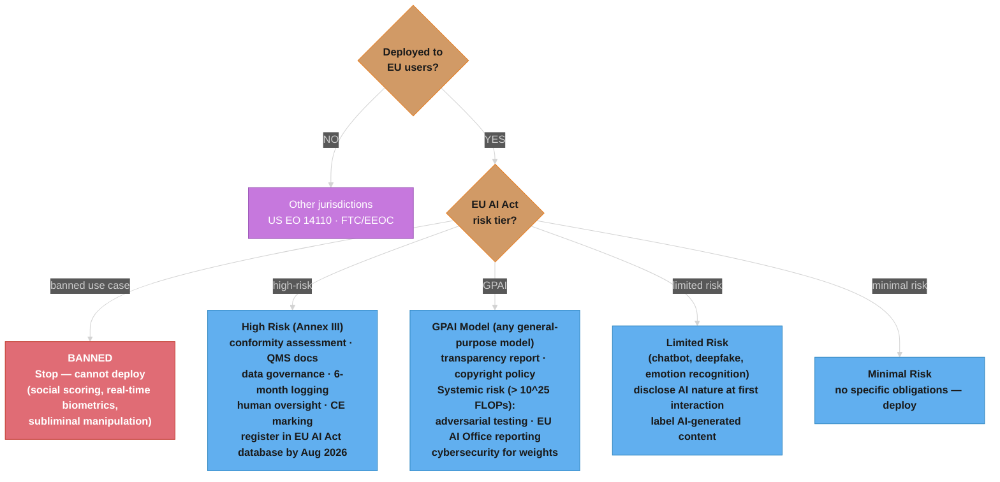
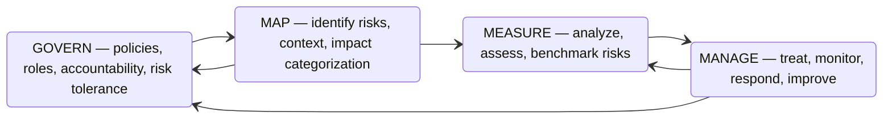

# AI Regulations and Compliance

A senior AI engineer's complete reference for global AI regulatory frameworks, compliance engineering, and building AI systems that are legally deployable. Covers the EU AI Act, GDPR, US Executive Order on AI, NIST AI RMF, and the practical architecture required to meet each framework's obligations.

---

## 1. Concept Overview

The global AI regulatory landscape is maturing rapidly. Multiple overlapping frameworks now govern how AI systems are built, tested, deployed, and monitored.

**Major Frameworks**

| Framework | Jurisdiction | Effective | Scope |
|-----------|-------------|-----------|-------|
| EU AI Act (2024) | EU + extra-territorial | Phased 2024-2026 | First comprehensive AI law; risk-based tiered approach |
| GDPR + AI | EU + extra-territorial | 2018 (AI guidance ongoing) | Data law directly applicable to AI; Art. 22 automated decisions |
| US Executive Order on AI (EO 14110, Oct 2023) | USA | Immediate | Safety testing for frontier models; NIST AI RMF mandate |
| NIST AI RMF 1.0 | USA | 2023 | Govern, Map, Measure, Manage — voluntary but de facto standard |
| China Generative AI Regulations (2023) | China | Aug 2023 | Algorithm filing, training data sourcing requirements |
| UK AI Approach (DSIT guidance) | UK | Ongoing | Pro-innovation; sector-specific guidance, not comprehensive law |
| EU Digital Markets Act (DMA) | EU | 2023-2024 | Applies to AI recommendation algorithms used by gatekeepers |

**Critical extra-territorial reality**: A US company deploying AI systems to EU residents faces both US EO 14110 and EU AI Act obligations simultaneously. The EU AI Act replicates GDPR's extra-territorial model — jurisdiction follows the user, not the company.

**Enforcement timeline**:
- Feb 2025: Prohibited AI practices bans took effect (EU AI Act)
- Aug 2025: GPAI model obligations apply
- Aug 2026: High-risk AI system obligations fully apply; EU database for high-risk systems goes live
- Aug 2027: High-risk AI systems integrated into existing regulated products

---

## 2. Intuition

**One-line analogy**: AI regulations are the building codes for software that makes decisions — without them, your ML system might be technically sound but legally uninhabitable.

**Mental model**: Traditional software regulations focused on data privacy (GDPR) and consumer protection. AI regulations add a new dimension: decision-making quality and accountability. The question changes from "did you protect this data?" to "was this decision made fairly, transparently, and with human oversight?"

**Why it matters**: The EU AI Act is not just an EU concern. Its extra-territorial reach means any company deploying AI systems to EU residents must comply, regardless of where the company is headquartered — similar to how GDPR reshaped global privacy practices. A team in San Francisco shipping a hiring tool to a European enterprise faces EU AI Act conformity assessment requirements.

**Key insight**: Compliance is an architectural concern, not an afterthought. A system that logs for debugging is not the same as a system that logs for regulatory auditability — different retention policies, different structure requirements, different tamper-resistance requirements. The cost of retrofitting compliant logging after deployment is 5x-10x the cost of building it in from day one.

---

## 3. Core Principles

**Risk-based regulation**: Different obligations scale with risk tier. A spam filter faces no specific obligations. An AI system used for hiring faces conformity assessment, human oversight mandates, and mandatory registration.

**Transparency**: Users must know when they are interacting with an AI system. Chatbots must disclose they are AI. Deepfakes must be labeled. High-risk decisions must be explainable.

**Accountability**: A documented chain of responsibility runs from model developer through deployer to end user. The EU AI Act explicitly distinguishes "providers" (who put a model on the market) from "deployers" (who use it for a specific purpose).

**Data minimization**: Training data should be proportionate to the task. Data subject rights — access, rectification, erasure — apply to AI training data too, not just operational data.

**Explainability**: High-risk AI decisions must be explainable to the affected individual in human-readable terms. "An AI made this decision" is not compliant. "Your debt-to-income ratio of 48% exceeded our threshold of 43%" is compliant.

**Human oversight**: High-risk AI systems must support meaningful human review — not rubber-stamp review. The human must have the information, access, and authority to override the system's output.

**Conformity assessment**: High-risk systems require documented testing, quality management systems, and either internal or third-party assessment before deployment. This mirrors CE marking for physical products.

**Non-discrimination**: AI systems must not systematically disadvantage individuals based on protected characteristics. Detection requires demographic audit, not just aggregate accuracy metrics.

---

## 4. Types / Architectures / Strategies

### 4.1 EU AI Act — Risk Tier Classification

| Risk Tier | Examples | Core Requirements |
|-----------|----------|------------------|
| Unacceptable (Banned) | Government social scoring systems; real-time biometric surveillance in public spaces (narrow law enforcement exceptions); subliminal manipulation; exploitation of vulnerabilities; emotion recognition in workplace/education (with narrow exceptions) | Prohibited. Cannot deploy under any circumstances. |
| High Risk | Employment screening; credit scoring; biometric identification; educational assessment; critical infrastructure AI; law enforcement tools; border control AI; justice administration AI | Conformity assessment; tamper-resistant logging; human oversight mechanism; accuracy/robustness/cybersecurity requirements; CE marking; EU database registration; post-market monitoring |
| Limited Risk | Chatbots (must disclose AI nature); deepfake generators (must label outputs); emotion recognition systems outside banned contexts | Transparency obligations only — disclose AI nature to user |
| Minimal Risk | Spam filters; AI in video games; recommendation systems not meeting high-risk criteria | No specific EU AI Act obligations |
| General Purpose AI (GPAI) | GPT-4, Claude, Gemini, Llama, Mistral | Training data transparency report; copyright policy documentation. Systemic risk GPAI (>10^25 FLOPs training compute) additionally requires: adversarial testing, incident reporting to EU AI Office, cybersecurity measures |

**High-risk annex categories (Annex III)** — the 8 categories that trigger full high-risk obligations:
1. Biometric identification and categorization
2. Critical infrastructure management (electricity, water, gas, traffic)
3. Education and vocational training (assessment, scoring)
4. Employment, workers management, hiring (screening, performance monitoring)
5. Essential private services and public services (credit scoring, insurance risk, emergency dispatch)
6. Law enforcement (crime prediction, polygraphs, evidence evaluation)
7. Migration, asylum, border control
8. Administration of justice and democratic processes

### 4.2 GDPR + AI — Key Obligations

**Article 22 — Automated Decision-Making**:
Individuals have the right NOT to be subject to solely automated decisions that produce legal effects or similarly significantly affect them.

Permitted exceptions (each with conditions):
- Explicit informed consent (must be specific, freely given, withdrawable)
- Necessary for contract performance (must inform the person; human review option required)
- Authorized by EU or Member State law (must include suitable safeguards)

**Right to explanation** (Art. 13/14 combined with Art. 22(3)):
Controllers must provide "meaningful information about the logic involved." This requires feature-level explanation, not system-level description.

**Data Protection Impact Assessment (DPIA)**:
Required before processing when: systematic and extensive profiling with significant effects on individuals; large-scale processing of special category data (health, biometrics, political opinions); systematic monitoring of publicly accessible areas.

**Data subject rights applicable to AI**:
- Right of access (Art. 15): individuals can request what data about them is processed, including data used in AI decisions
- Right to rectification (Art. 16): inaccurate data used in AI must be corrected
- Right to erasure (Art. 17): "right to be forgotten" applies to training data in some circumstances
- Right to object to profiling (Art. 21): individuals can object to automated profiling

### 4.3 US Executive Order on AI (EO 14110, October 2023)

**Scope**: Applies to US federal agencies and companies with federal contracts; includes requirements for frontier model developers.

**Frontier model safety reporting**: Companies training models using more than 10^26 FLOPs of compute must report safety test results to the US government before deployment.

**NIST AI Safety Institute (AISI)**: Tasked with developing standards, guidelines, and evaluation methods for AI safety. Coordinating with international counterparts (UK AISI, EU AI Office).

**Sector-specific agency guidance**:
- FDA: guidance on AI/ML-based software as a medical device (SaMD)
- FTC: unfair/deceptive practice authority applies to AI systems making false or misleading claims
- CFPB: adverse action notice requirements when AI is used in credit decisions
- EEOC: disparate impact theory applies to AI-based hiring tools under Title VII

### 4.4 NIST AI Risk Management Framework (AI RMF 1.0)

Voluntary framework becoming de facto standard in US federal contracting and enterprise AI governance.

**Four Core Functions**:

```
GOVERN  -- Policies, accountability, culture of AI risk awareness
   |
MAP     -- Identify and classify AI risks in context of deployment
   |
MEASURE -- Analyze, assess, and benchmark identified risks
   |
MANAGE  -- Prioritize, respond to, and monitor AI risks
```

**Govern** covers: AI risk policies; accountability structures; training and awareness; risk tolerance; organizational culture that treats AI risk as enterprise risk.

**Map** covers: context establishment; risk identification; categorization by impact domain; stakeholder identification; supply chain risk mapping.

**Measure** covers: risk analysis methods; AI-specific metrics (fairness, robustness, interpretability, reliability, safety, security, privacy); benchmarking against standards.

**Manage** covers: risk treatment (accept, mitigate, transfer, avoid); response plans; residual risk monitoring; incident response; continuous improvement.

### 4.5 China Generative AI Regulations (2023)

**Algorithm filing**: Generative AI providers must file with the Cyberspace Administration of China (CAC). Security assessments required for AI systems that influence "public opinion" or can mobilize society.

**Training data requirements**: Must not infringe copyright; must not contain illegal content; must meet content labeling requirements for AI-generated outputs.

**Content obligations**: AI-generated content must be labeled. Outputs must not undermine "socialist core values" — a broad category with enforcement discretion.

**Practical impact for international companies**: Offering generative AI services in China requires domestic filing and compliance. Most international LLM providers currently limit or exclude China availability to avoid these obligations.

### 4.6 Compliance Architecture Patterns

**Compliance-by-design**: Embed compliance requirements into the SDLC. Classification of system against EU AI Act risk tiers drives architectural decisions — not a checkbox at the end.

**Audit log architecture**: Tamper-resistant, append-only logging using write-once storage (AWS S3 with Object Lock, Azure Immutable Blob Storage). Log inputs, outputs, model version, timestamp, user ID. Minimum 6 months retention; some high-risk categories require longer.

**Explainability hooks**: SHAP or LIME integrated into the inference pipeline, not just available as a post-hoc analysis tool. Every prediction that affects a person can generate a human-readable explanation on request.

**Model registry with compliance metadata**: Each model version tagged with training data provenance, bias audit results, accuracy metrics, intended use case, and out-of-scope use cases.

---

## 5. Architecture Diagrams

### EU AI Act Compliance Decision Tree



### GDPR Art. 22 Compliance Path for Automated Decisions

```
Does your AI system make decisions that produce legal
or similarly significant effects on individuals?
|
+-- NO: Art. 22 does not apply (GDPR other provisions still may)
|
+-- YES:
    |
    +-- Is the decision SOLELY automated (no meaningful human review)?
    |   |
    |   +-- NO (meaningful human review exists): Art. 22 does not apply
    |       -> Document what makes the review "meaningful"
    |
    +-- YES (solely automated):
        |
        +-- Exception 1: Explicit consent?
        |   -> Provide explanation of logic on request
        |   -> Allow withdrawal without detriment
        |
        +-- Exception 2: Necessary for contract?
        |   -> Inform individual before/at time of processing
        |   -> Implement human review option on request
        |
        +-- Exception 3: Authorized by EU/Member State law?
        |   -> Law must provide suitable safeguards
        |
        +-- None of above apply?
            -> PROHIBITED under Art. 22
            -> Restructure: add meaningful human review step

Explanation requirement (Art. 13/14 + 22(3)):
"Meaningful information about the logic involved"
= Feature-level explanation in plain language
!= "An AI system assessed your application"
```

### NIST AI RMF Cycle



The four functions form a continuous cycle, not a one-time checklist: GOVERN feeds and is fed by the other three functions, and MANAGE loops findings back into both MEASURE (re-assessment) and GOVERN (policy updates).

---

## 6. How It Works — Detailed Mechanics

### EU AI Act Conformity Assessment for High-Risk Systems

**Step 1: System Classification**
Determine which Annex III category applies. A hiring tool falls under "employment, workers management, and access to self-employment" (Annex III, category 4). If multiple categories apply, use the strictest requirements.

**Step 2: Implement Technical Requirements**

Quality Management System (QMS) must document:
- System purpose and intended use
- Design methodology and architecture decisions
- Development, testing, and validation process
- Risk management process

Training data governance must include:
- Data source documentation (origin, collection method, applicable rights)
- Data preprocessing and labeling methodology
- Demographic coverage analysis
- Bias assessment report: measure demographic parity difference, equalized odds difference, and calibration across protected groups

Logging system requirements:
- All inputs to the AI system recorded
- All outputs and decisions recorded
- Model version and configuration at time of each decision
- Timestamps to microsecond precision
- Tamper-resistant storage: cryptographic hashing of log entries, write-once storage
- Minimum retention: 6 months (12+ months for law enforcement and judicial categories)
- Secure access controls: audit trail of who accessed logs

Accuracy and robustness metrics must be:
- Measured on representative test set reflecting deployment population
- Documented with confidence intervals
- Re-measured after any significant model update
- Compared against human baseline where applicable

Human oversight interface must provide:
- Display of AI system output and confidence (not just a decision)
- Access to key factors that influenced the decision
- Mechanism to override AI decision
- Mechanism to pause system operation
- Ability to correct inputs and rerun

**Step 3: Conformity Assessment**
For most high-risk systems: internal conformity assessment by provider.
For biometric identification and law enforcement AI: third-party conformity assessment by notified body (EU-accredited auditor).

**Step 4: Technical Documentation Package**
Minimum contents:
- General description of the AI system
- Description of development process
- Information on training and testing data
- Description of monitoring, functioning, control of the AI system
- Description of the risk management system
- Conformity assessment procedures applied
- Declaration of conformity

**Step 5: EU AI Act Database Registration**
From August 2026, high-risk AI systems must be registered before deployment in the EU market. Registration is public (deployers) or partially restricted (law enforcement). Registration fields include: system name, intended purpose, risk management measures, conformity assessment summary.

**Step 6: CE Marking**
For AI systems that are products placed on the EU market: CE marking required. For pure software services: registration suffices.

**Step 7: Post-Market Monitoring**
Provider obligations:
- Continuous monitoring of performance in deployment
- Report serious incidents (death/serious injury, significant property damage, infringement of fundamental rights) to national authority within 15 days
- Annual summary reports to EU AI Office for GPAI systemic risk providers
- Maintain and update technical documentation as system evolves

---

### Model Card as Compliance Artifact

A model card is increasingly a legal document, not a marketing one. Inaccurate model cards can constitute misrepresentation under consumer protection law.

```
===================================================================
MODEL CARD — HiringScore v2.1
===================================================================
Model Name:     HiringScore v2.1
Version:        2.1.3
Release Date:   2024-03-15
Contact:        ai-compliance@company.com

INTENDED USE
  Primary:      Initial resume screening for software engineering roles
  Secondary:    Generating structured summaries of candidate profiles
  Out-of-scope: Final hiring decisions; promotions; performance reviews;
                determining compensation; any purpose not listed above

TRAINING DATA
  Source:       Internal resume corpus 2015-2023
  Size:         850,000 anonymized resumes
  Coverage:     Engineering roles across 47 countries
  Demographics: Audited for gender balance (47% F, 52% M, 1% non-binary);
                race/ethnicity audit completed Dec 2023 (report: compliance/audit_2023_q4.pdf)
  Exclusions:   Resumes with identifiable personal information removed

PERFORMANCE METRICS (held-out test set, n=85,000)
  Precision:    0.82
  Recall:       0.79
  F1:           0.80
  AUC-ROC:      0.91
  Human agreement rate: 0.84 (vs recruiter panel baseline)

BIAS ANALYSIS
  Gender parity score:         0.94  (threshold: >0.90)  PASS
  Racial equity score:         0.91  (threshold: >0.90)  PASS
  Age group parity (>50):      0.88  (threshold: >0.90)  REVIEW REQUIRED
  Disability status coverage:  Insufficient data — monitoring only

HUMAN OVERSIGHT
  All AI-rejected candidates: Reviewed by recruiter before sending rejection
  Override rate:              12% (AI rejected, human approved)
  Automatic rejections:       NONE — system produces ranked shortlist only

EU AI ACT CLASSIFICATION
  Risk tier:  HIGH RISK (Annex III, Category 4 — employment)
  Conformity assessment: Internal, completed 2024-02-28
  EU database registration: Pending (registration opens Aug 2026)
  GDPR Art. 22: Compliant — human review step satisfies "not solely automated"

LIMITATIONS
  - May underperform for non-traditional career paths (career changes, portfolio-only)
  - Evaluated on English-language resumes; multilingual performance not benchmarked
  - Requires quarterly re-evaluation when workforce demographics shift >5%
  - Age bias risk at >50 threshold — do not use as sole filter for senior roles

MONITORING
  Last bias re-audit:     2024-03-01
  Next scheduled audit:   2024-06-01
  Incident log:           compliance/incidents/hiringscorelog.md
===================================================================
```

---

### BROKEN Pattern and Fix

**The scenario**: A European enterprise deploys an AI-powered resume screener (HiringScore v1.0) to evaluate candidates for software engineering roles in Germany, France, and the Netherlands.

```
BROKEN: HiringScore v1.0 deployed to EU candidates with:

  Missing:
  - No bias audit on protected characteristics (age, gender, disability status)
  - No candidate notification that AI is used in initial screening
  - Automatic rejection emails sent without any human review
  - No technical documentation or conformity assessment
  - No logging of model inputs, outputs, or decisions
  - No explanation capability for rejected candidates
  - Not registered in any EU database

  Consequence:
  - EU AI Act violation: Art. 6 + Annex III, Category 4 (employment AI is High-Risk)
    Deployer obligations not met: no conformity assessment, no logging, no human oversight
    Fine ceiling: €15,000,000 or 3% of global annual turnover (whichever higher)

  - GDPR Art. 22 violation: automated decisions with significant employment effects,
    solely automated (no human in the loop), no valid legal basis
    Fine ceiling: €20,000,000 or 4% of global annual turnover

  - GDPR Art. 13/14 violation: no transparency notice about AI use in hiring
    Fine ceiling: €20,000,000 or 4% of global annual turnover

  Total maximum exposure: up to 6% of global annual turnover
  (regulators can stack violations; GDPR and EU AI Act are separate regimes)
```

**The fix**:

```python
# Step 1: Bias audit before deployment (not after a complaint)
from fairlearn.metrics import MetricFrame, demographic_parity_difference
from sklearn.metrics import precision_score

# Compute bias metrics across protected groups
metric_frame = MetricFrame(
    metrics=precision_score,
    y_true=y_test,
    y_pred=y_pred,
    sensitive_features=demographics_test[["gender", "age_group", "disability"]]
)

dpd = demographic_parity_difference(y_test, y_pred, sensitive_features=demographics_test["gender"])
# Deployment gate: dpd must be < 0.10 (10 percentage points)
assert abs(dpd) < 0.10, f"Bias threshold exceeded: demographic_parity_difference = {dpd:.3f}"


# Step 2: GDPR Art. 13/14 transparency notice at application start
GDPR_NOTICE = """
Your application will be initially screened by an automated system.
This system ranks candidates based on skills and experience. The AI
screening produces a shortlist; a human recruiter reviews all AI decisions
before any rejection is sent. You have the right to request a human review
and an explanation of the factors that influenced your assessment.
Contact: hiring-rights@company.com
"""


# Step 3: Human review requirement — no automatic rejections
class HiringDecisionPipeline:
    def __init__(self, model, require_human_review: bool = True):
        self.model = model
        self.require_human_review = require_human_review

    def score_candidate(self, resume: dict) -> dict:
        score = self.model.predict([resume])[0]
        explanation = self._generate_explanation(resume)

        # Log for compliance — tamper-resistant logging required
        self._log_decision(resume["id"], score, explanation)

        return {
            "candidate_id": resume["id"],
            "score": score,
            "shortlisted": score > 0.65,
            "explanation": explanation,
            "status": "PENDING_HUMAN_REVIEW",  # Never auto-reject
            "human_reviewed": False,
        }

    def _generate_explanation(self, resume: dict) -> list[str]:
        # SHAP-based explanation — required for Art. 22 compliance
        import shap
        explainer = shap.TreeExplainer(self.model)
        shap_values = explainer.shap_values([resume])
        top_factors = sorted(
            zip(resume.keys(), shap_values[0]),
            key=lambda x: abs(x[1]),
            reverse=True
        )[:5]
        return [f"{k}: {'positive' if v > 0 else 'negative'} factor" for k, v in top_factors]

    def _log_decision(self, candidate_id: str, score: float, explanation: list[str]) -> None:
        import hashlib, json, time
        entry = {
            "candidate_id": candidate_id,
            "timestamp": time.time(),
            "model_version": "HiringScore-v2.1.3",
            "score": score,
            "explanation": explanation,
        }
        entry_bytes = json.dumps(entry, sort_keys=True).encode()
        entry["hash"] = hashlib.sha256(entry_bytes).hexdigest()
        # Write to tamper-resistant store (S3 with Object Lock, or equivalent)
        self._write_to_immutable_log(entry)

    def _write_to_immutable_log(self, entry: dict) -> None:
        # Implementation: write to S3 bucket with Object Lock (WORM)
        # Retention: minimum 6 months for employment high-risk systems
        pass


# Step 4: Quarterly bias monitoring — not one-time audit
def quarterly_bias_reaudit(model, test_data: dict) -> bool:
    """Returns True if model passes bias thresholds, False if deployment should pause."""
    dpd = demographic_parity_difference(
        test_data["y_true"],
        test_data["y_pred"],
        sensitive_features=test_data["demographics"]["gender"]
    )
    age_parity = demographic_parity_difference(
        test_data["y_true"],
        test_data["y_pred"],
        sensitive_features=test_data["demographics"]["age_group"]
    )
    if abs(dpd) > 0.10 or abs(age_parity) > 0.10:
        notify_compliance_team(dpd, age_parity)
        return False  # Pause deployment pending remediation
    return True
```

---

### DPIA (Data Protection Impact Assessment) for AI Systems

**When required** (Art. 35 GDPR + WP29 guidance):
- Systematic and extensive profiling with significant effects on individuals
- Large-scale processing of special category data (health, biometric, political, religious, sexual orientation)
- Systematic monitoring of publicly accessible areas
- Any high-risk AI system processing personal data (by extension of EU AI Act and EDPB guidance)

**DPIA contents** (Art. 35(7)):
1. Systematic description of the processing operations and purposes
2. Assessment of necessity and proportionality
3. Assessment of risks to rights and freedoms of data subjects
4. Measures to address risks, including safeguards and security measures
5. Prior consultation with supervisory authority if residual risk is high

**Timing**: Must be completed BEFORE the processing begins. A DPIA cannot be retroactive. If risks cannot be mitigated, prior consultation with the DPA is mandatory.

---

### Right to Explanation in Practice

```
SCENARIO: User's loan application rejected by AI credit scoring system.

NOT COMPLIANT response (Art. 22(3) violation):
  "Your application has been assessed by our automated credit evaluation
  system and does not meet our current lending criteria."

COMPLIANT response — meaningful information about logic involved:
  "Your application was evaluated on the following factors:
  - Payment history: positive factor (on-time rate 97%)
  - Debt-to-income ratio: significant negative factor (your ratio: 48%;
    our threshold: 43%)
  - Length of credit history: neutral factor (7 years)
  - Recent credit inquiries: minor negative factor (3 inquiries in 6 months)

  The primary reason for decline was your debt-to-income ratio exceeding
  our threshold. You can request a human review of this decision by
  contacting loans@bank.com within 30 days."

Implementation notes:
  - SHAP values identify top contributing features
  - Feature names translated to plain language in explanation template
  - Explanation stored in audit log alongside the decision
  - Human review option must be actionable, not cosmetic
```

---

## 7. Real-World Examples

### ChatGPT Blocked in Italy (March 2023)

Italy's data protection authority (Garante per la protezione dei dati personali) ordered OpenAI to immediately block ChatGPT for Italian users on March 31, 2023.

**Alleged violations**:
- No adequate legal basis for collecting Italian users' conversation data for training
- No age verification (GDPR prohibits processing of minors' data without parental consent)
- No GDPR Art. 13/14 transparency notice informing users how their data was used

**OpenAI's response** (service restored April 28, 2023):
- Added opt-out mechanism for users who did not want their data used for training
- Added transparency notice explaining data processing
- Added age verification (18+ gate with parental consent for 13-18)
- Appointed an EU representative as required by GDPR Art. 27

**Impact**: Triggered investigations by DPAs in France, Germany, Spain, and Ireland. EU coordinated through EDPB Task Force. Led to broader GDPR guidance on generative AI. Estimated cost to OpenAI: market development delay in EU + compliance investment.

---

### Clearview AI — GDPR Extra-Territorial Enforcement Cascade

Clearview AI scraped more than 30 billion facial images from social media and public websites, built a facial recognition database, and sold access to law enforcement.

**Enforcement actions** (all against a US company with no EU offices):
- UK ICO (Information Commissioner's Office): £7.5 million fine (Nov 2022)
- Italian Garante: €20 million fine (Mar 2022)
- French CNIL: €20 million fine (Oct 2022)
- Greek DPA: €20 million fine (Jul 2022)
- Australian Privacy Commissioner: enforcement action (Nov 2021)

**Key legal finding**: Facial recognition biometric data is special category data under GDPR Art. 9. Publicly accessible data is still personal data. GDPR applies to Clearview because it processes data of EU residents and monitors behavior in the EU (Art. 3(2)(b)).

**Outcome**: Clearview ceased offering services to private companies in EU/UK. Law enforcement contracts in EU under ongoing review. Total fines: >€60 million across EU jurisdictions.

**Engineering lesson**: Building on scraped web data does not mean GDPR-free. If the data relates to EU residents, GDPR applies regardless of where your servers are.

---

### Amazon Hiring Tool Bias (2018 — Pre-EU AI Act, Still Canonical)

Amazon trained an ML resume screening tool on 10 years of submitted resumes (historical hires were predominantly male in technical roles). The model learned to penalize resumes that included the word "women's" (e.g., "women's chess club captain") and systematically downgraded graduates of all-female colleges.

**What went wrong**:
- Training data encoded historical bias (10-year resume corpus skewed male)
- No demographic parity audit during development
- Proxy variables (certain colleges, words) correlated with gender without being explicitly gender-related
- The tool was not deployed externally, but the internal discovery and scrapping cost significant time and resources

**Under current EU AI Act**:
- Employment AI is Annex III, Category 4 (high-risk)
- Bias audit on protected characteristics is a technical requirement before deployment
- The bias detected at Amazon would have constituted non-conformity, blocking deployment
- Regulatory consequence: failure to conduct conformity assessment; fine exposure €15M or 3% global turnover

**Engineering lesson**: Bias in training data produces biased models. Demographic parity auditing is not optional for employment AI — it is legally required in the EU and carries significant liability in the US under Title VII disparate impact doctrine.

---

### Apple App Store — DMA Enforcement (EU, 2024)

The EU Digital Markets Act (DMA) required Apple to open its iOS ecosystem to alternative app stores by March 2024. Apple is designated a "gatekeeper" under DMA.

**AI-relevant obligations**:
- Apple's App Store recommendation algorithm is subject to DMA transparency requirements — Apple must explain ranking criteria to developers
- Apple cannot use non-public developer data to compete against developers in the App Store (algorithmic self-preferencing prohibition)
- Core Technology Fee structure for alternative stores subject to ongoing EU review

**DMA fine structure**: Up to 10% of global annual turnover for violations; up to 20% for repeated violations; structural remedies possible.

**Engineering lesson**: AI recommendation algorithms operated by platform gatekeepers face transparency requirements under DMA. The algorithm cannot be a black box to the people whose businesses depend on it.

---

### EU AI Act First Wave — Insurance Sector (2026)

Insurance companies using AI for underwriting decisions (premium calculation, risk assessment, claims processing) fall under Annex III, Category 5 (access to essential private services and public services — insurance qualifies in many interpretations).

**What insurers are building now**:
- Model cards for every AI underwriting component
- Bias audits across protected characteristics (age, gender, disability, health)
- Explainability for premium determinations (SHAP-based factor disclosure)
- Human review queues for borderline cases
- Technical documentation packages for conformity assessment

**Timeline pressure**: EU AI Act database registration opens August 2026. Insurers that have not completed conformity assessment by then cannot register and therefore cannot deploy new AI underwriting systems in the EU market.

---

## 8. Tradeoffs

### Compliance Program Tradeoffs

| Concern | No Formal Compliance Program | Full Compliance Engineering |
|---------|------------------------------|----------------------------|
| Time to deploy | Fast — ship when feature-complete | Slower — conformity assessment adds weeks to months |
| Upfront cost | Low — no process overhead | High — tooling, audits, documentation, legal review |
| Risk exposure | High — fines up to 6% global revenue; injunctions; reputational damage | Minimal — regulatory risk transferred to documented process |
| Auditability | Low — ad-hoc logging; reconstructing decisions is manual | High — tamper-resistant logs; structured documentation; auditable |
| Innovation speed | High — no process friction | Moderate — classification decisions required before building |
| Trust signal to customers | Low | High — compliance certifications signal trustworthiness |
| Regulatory relationship | Reactive — respond to investigations | Proactive — regular engagement with regulators; early warning |
| Open source treatment | EU AI Act lighter obligations for open-source releases | Same internal bar recommended regardless — open-source liability exists |

### Jurisdiction Comparison

| Dimension | EU AI Act | GDPR Art. 22 | US EO 14110 | NIST AI RMF |
|-----------|-----------|-------------|-------------|-------------|
| Mandatory vs voluntary | Mandatory (EU users) | Mandatory (EU personal data) | Mandatory for specific thresholds | Voluntary (de facto standard) |
| Risk-based approach | Yes — 4 tiers | Not explicit — applies to significant decisions | Threshold-based (compute) | Yes — Map/Measure functions |
| Fines | Up to €35M or 7% global revenue | Up to €20M or 4% global revenue | Enforcement via existing agency authority | No fines (voluntary) |
| Extra-territorial | Yes | Yes | USA-focused | USA-focused |
| Sector coverage | All sectors | All sectors | Federal + frontier models | All sectors |
| Audit/documentation | Required (conformity assessment) | DPIA required for high-risk | Required for frontier model reports | Recommended |

### SME vs Large Company Compliance Burden

The EU AI Act explicitly acknowledges asymmetric burden. SMEs (<250 employees) benefit from:
- Reduced fees for conformity assessment via notified bodies
- Simplified technical documentation templates
- Priority access to regulatory sandboxes for testing
- Dedicated SME guidance from EU AI Office

However, high-risk AI system requirements themselves do not scale down based on company size. A 10-person startup building an EU AI Act high-risk system faces the same conformity assessment requirements as a large enterprise.

---

## 9. When to Use / When NOT to Use

### Mandatory Compliance (No Choice)

**Must comply with EU AI Act when**:
- Your AI system is deployed to EU residents, regardless of company location
- Your company has an EU establishment and deploys AI
- Your AI system produces effects within the EU

**Must comply with GDPR when**:
- You process personal data of EU residents in connection with offering goods/services
- You monitor behavior of EU residents
- You have an EU establishment and process personal data

**Must comply with US EO 14110 when**:
- Training a model on more than 10^26 FLOPs of compute (safety report to government required)
- US federal contractor with AI systems in scope of the executive order

**Should treat as mandatory even if technically optional**:
- FTC unfair/deceptive practice authority applies to AI systems making false claims — a "voluntary" framework that has enforcement teeth
- Enterprise B2B contracts increasingly include AI governance contractual requirements — your customer's contract requirements are as binding as law
- EEOC disparate impact doctrine (Title VII) applies to AI hiring tools in the US — no federal AI law required

### When Compliance Is Recommended Even If Not Legally Required

**Consequential decisions in any jurisdiction**: Any AI system that affects employment, credit, housing, education, or healthcare benefits from bias auditing and explainability regardless of whether law requires it. FTC and CFPB have broad authority in the US, and class action litigation risk is real.

**Model cards and datasheets**: Good engineering hygiene regardless of jurisdiction. Model cards serve as internal documentation, accelerate onboarding, and provide evidence of due diligence if a problem arises.

**NIST AI RMF adoption**: Even for companies outside US federal contracting, the AI RMF provides a structured risk management vocabulary that is increasingly referenced in enterprise vendor assessments.

### When NOT to Over-Invest in Compliance Infrastructure

**Minimal-risk AI systems**: Spam filters, AI in video games, recommendation systems without significant effects on individuals — no EU AI Act obligations. Build and ship without conformity assessment overhead.

**Internal tools without employment/financial/health effects**: An AI tool that helps engineers search internal documentation is not high-risk. Apply proportionality — compliance overhead should match actual risk.

**Research and development**: EU AI Act explicitly excludes AI systems used exclusively for research and development from high-risk obligations (with narrow exceptions for biometric systems).

---

## 10. Common Pitfalls

**Pitfall 1: "We're not EU-based so GDPR and EU AI Act don't apply"**

Both frameworks have explicit extra-territorial reach modeled on each other. GDPR Art. 3(2): applies if you process data of EU residents while offering goods/services or monitoring their behavior. EU AI Act Art. 2(1)(c): applies if the output of your AI system is used in the EU, regardless of where the provider is established.

Production war story: A US-based HR SaaS company sold its AI recruiting tool to a German enterprise. The company assumed GDPR and EU AI Act didn't apply because it had no EU office. The German enterprise's DPA audit flagged the tool as a high-risk AI system without conformity assessment. The US company faced contractual breach claims from its customer and had to halt EU operations for 4 months during remediation.

**Pitfall 2: Assuming scraped public web data is fair use for AI training**

Publicly accessible data is not free data. Three separate legal risks:
- GDPR: scraped web data often contains personal data of EU residents. Publicly accessible does not mean consent was given for AI training.
- Copyright law: web content is copyrighted by default. Clearview-style scraping of images; scraping articles for LLM training are subject to ongoing litigation.
- Special category data: scraped data may contain health information, biometric data, or political opinions — all special category under GDPR Art. 9 requiring explicit consent or specific exceptions.

**Pitfall 3: Model cards treated as marketing documents**

Model cards are compliance artifacts that must be:
- Accurate — inaccurate performance claims can constitute misrepresentation
- Versioned — each model version gets its own card; old versions retained
- Maintained — bias audit results updated on schedule, not just at launch
- Stored as regulatory documentation — accessible in future enforcement

A model card that claims a bias audit was conducted but doesn't exist is worse than no model card.

**Pitfall 4: Missing the GPAI distinction in EU AI Act**

The Act has different obligation streams for:
- AI systems (deployed for specific purpose): risk-tier obligations
- GPAI models (general purpose, like GPT-class): transparency and copyright obligations

A company that fine-tunes a GPAI model and releases the fine-tuned model has GPAI model obligations (transparency, copyright policy) as a model provider plus, if they deploy that model for a high-risk use, high-risk AI system obligations as a deployer. Many teams conflate these two tracks.

**Pitfall 5: Assuming internal AI tools are exempt**

EU AI Act applies to deployers (employers using AI for HR, performance monitoring) as well as providers (the AI company). An HR team using a vendor's AI tool for hiring screening is a deployer with specific obligations:
- Ensure the tool has been through conformity assessment (require proof from vendor)
- Implement human oversight mechanism
- Train staff on the system's limitations and oversight responsibilities
- Maintain deployment-level logs

Production war story: A large retailer used a vendor's AI scheduling tool to optimize employee shift assignments (effectively affecting employment conditions — Annex III scope). The retailer assumed compliance was the vendor's problem. An employee union complaint triggered a national labor authority investigation of the retailer as deployer. €2.3 million fine to the retailer for failure to implement human oversight.

**Pitfall 6: Confusing AI safety and AI compliance**

Safety (model does not produce dangerous, harmful, or misleading outputs) and compliance (model meets regulatory requirements) are related but distinct.

A safety-aligned model can still violate GDPR if it processes personal data without legal basis. A GDPR-compliant system can still be an unsafe model if it produces harmful outputs. EU AI Act compliance requires both: technical documentation of safety testing AND data governance for compliance. Treat them as separate work streams that inform each other.

**Pitfall 7: Treating conformity assessment as one-time**

EU AI Act requires post-market monitoring. If you make a significant change to a high-risk AI system (new model version, new training data, new deployment context), you must reassess whether the change affects conformity. There is no "approved forever" status.

Significant changes that trigger re-assessment include:
- Retraining on substantially different data
- Changes to the model architecture
- Changes to the intended purpose or deployment context
- Changes that affect accuracy, robustness, or bias characteristics

---

## 11. Technologies & Tools

### Bias Detection and Fairness

**Fairlearn** (Microsoft, open-source)
- Metrics: `demographic_parity_difference`, `equalized_odds_difference`, `selection_rate`
- Mitigation algorithms: `ExponentiatedGradient`, `GridSearch`, `ThresholdOptimizer`
- Dashboard integration for interactive bias analysis
- Install: `pip install fairlearn`

**IBM AI Fairness 360 (AIF360)**
- 70+ fairness metrics across 5 fairness dimensions
- 10+ mitigation algorithms (pre-processing, in-processing, post-processing)
- Python and R support
- Install: `pip install aif360`

### Explainability

**SHAP (SHapley Additive exPlanations)**
- Model-agnostic local and global explanations
- `TreeExplainer` for tree-based models (fast); `KernelExplainer` for any model
- Feature importance plots, waterfall plots, interaction plots
- Install: `pip install shap`

**LIME (Local Interpretable Model-agnostic Explanations)**
- Local surrogate model approximating complex model behavior at specific instances
- Suitable when SHAP is computationally expensive for large feature spaces
- Install: `pip install lime`

### Compliance Governance Platforms

**Holistic AI** (commercial)
- EU AI Act risk assessment automation
- Bias auditing, performance testing, robustness testing integrated
- Compliance workflow management and documentation generation
- Connects to model registries (MLflow, W&B)

**Credo AI** (commercial)
- AI governance and risk management platform
- Model cards, audit trails, policy compliance checks
- Integration with ML platforms (SageMaker, Azure ML, Databricks)

**IBM OpenPages with Watson** (commercial)
- GRC platform with dedicated AI governance module
- Risk assessment workflows, policy management, regulatory content library

### Documentation and Audit Trail

**Weights & Biases (W&B)**
- Experiment tracking doubles as compliance audit trail for training runs
- Model registry with versioning and metadata — store bias audit results as artifact
- Lineage tracking: connect training data version to model version to deployment

**MLflow Model Registry**
- Open-source model registry with versioning, stage transitions, and metadata
- Store conformity assessment status, bias metrics, and documentation as model tags
- Integration with most ML training frameworks

**Model Cards Toolkit** (Google, open-source)
- Standardized model card generation from metadata and evaluation results
- GitHub integration for version control of model cards
- Install: `pip install model-card-toolkit`

### Tamper-Resistant Logging

**AWS S3 with S3 Object Lock**
- WORM (Write Once Read Many) storage
- Compliance mode: even root cannot delete objects before retention period expires
- Minimum retention: 6 months for EU AI Act high-risk employment systems

**Azure Immutable Blob Storage**
- Time-based retention policies
- Legal hold capability for regulatory investigations
- Encryption at rest with customer-managed keys

### Supply Chain and Security

**pip-audit**
- Scans Python dependencies for known vulnerabilities
- Integration with CI/CD pipelines for security compliance gates
- Install: `pip install pip-audit`

**Sigstore / cosign**
- Cryptographic signing of model artifacts
- Provides provenance — who trained this model, from what data, when
- Increasingly relevant for GPAI training data transparency requirements

---

## 12. Interview Questions with Answers

**What is the EU AI Act and which companies does it apply to?**
The EU AI Act is the world's first comprehensive AI law, passed in 2024, using a risk-based tiered approach to regulate AI systems. It applies to any provider or deployer of AI systems in the EU market or whose AI systems produce effects within the EU — regardless of where the company is headquartered. A US company with no EU offices that sells a hiring AI tool to a German enterprise must comply. The extra-territorial reach mirrors GDPR.

**Your company just deployed an AI hiring tool to EU customers without a conformity assessment. What is the legal exposure?**
Employment AI is Annex III, Category 4 under the EU AI Act — high-risk. The consequences are: EU AI Act violation for failing to conduct conformity assessment, maintain logs, implement human oversight, and register in the EU database (fines up to €15M or 3% global annual turnover). Simultaneously, GDPR Art. 22 violation for automated decisions affecting employment without valid legal basis (fines up to €20M or 4% global annual turnover). Regulators can pursue both simultaneously. Beyond fines: injunctions forcing immediate cessation, customer breach of contract claims, and reputational damage.

**What does GDPR Article 22 require for automated decision-making, and what are the three permitted exceptions?**
Art. 22 gives individuals the right not to be subject to solely automated decisions that produce legal effects or similarly significant effects on them. The three permitted exceptions are: (1) explicit informed consent — the person agrees, can withdraw, and receives an explanation on request; (2) necessary for a contract — the person must be informed, and a human review option must exist; (3) authorized by EU or Member State law — with suitable safeguards. Outside these exceptions, solely automated consequential decisions are prohibited. "Meaningful human review" before a decision removes it from Art. 22 scope — but the review must be substantive, not rubber-stamp.

**Does the EU AI Act apply to a US company with no EU offices?**
Yes. EU AI Act Art. 2(1) applies to: providers placing AI systems on the EU market (regardless of establishment location); providers of AI systems put into service in the EU; deployers of AI systems in the EU. A US SaaS company selling an AI tool to EU enterprise customers is a provider placing systems on the EU market. This mirrors GDPR's extra-territorial model — jurisdiction follows the user, not the company's domicile.

**What is a "high-risk AI system" under the EU AI Act? Name three examples.**
High-risk AI systems are those listed in Annex III or embedded in safety-critical products (Annex II). Annex III includes eight categories: (1) biometric identification systems; (2) critical infrastructure management; (3) educational assessment; (4) employment, workers management, and hiring; (5) access to essential private services (credit scoring, insurance); (6) law enforcement; (7) migration and border control; (8) administration of justice. Three examples: an AI resume screener used for initial candidate selection; an AI credit scoring model used for loan decisions; a biometric authentication system used for border crossing identification.

**What is a model card and when is it legally required?**
A model card is structured documentation of a model's intended use, training data, performance metrics, bias analysis, limitations, and oversight requirements. Under the EU AI Act, high-risk AI systems require technical documentation (Art. 11) that includes much of this content — effectively mandating the model card's substance. GPAI model providers must provide similar documentation to downstream deployers. Even where not explicitly required by law, model cards are increasingly required by enterprise customers contractually and by investors as evidence of AI governance. Inaccurate model cards can constitute misrepresentation.

**How do you make a black-box model explainable for GDPR Art. 22 compliance?**
GDPR requires "meaningful information about the logic involved" in automated decisions. For black-box models, use post-hoc explainability methods: SHAP (SHapley Additive exPlanations) computes each feature's marginal contribution to a specific prediction using game theory. Integrate SHAP into the inference pipeline — not just as a batch analysis tool — so every high-stakes prediction generates a feature-level explanation. Translate feature names and SHAP values into plain language using explanation templates. Store the explanation in the audit log alongside the prediction. LIME (Local Interpretable Model-agnostic Explanations) is an alternative for cases where SHAP is computationally expensive.

**What is the difference between a GPAI model and a high-risk AI system under the EU AI Act?**
A GPAI (General Purpose AI) model is trained on broad data for general capabilities and can be adapted to many tasks — GPT-4, Claude, Gemini, Llama are examples. A high-risk AI system is an AI system deployed for a specific purpose that falls in Annex III or Annex II. The distinction matters for obligations: GPAI model providers (if releasing the model) must provide training data transparency reports and copyright policies; systemic risk GPAI must additionally conduct adversarial testing and report incidents to the EU AI Office. A company that fine-tunes a GPAI for a high-risk use case has GPAI provider obligations (if they release the fine-tuned model) plus high-risk AI system deployer obligations.

**How does the EU AI Act treat open-source AI models differently?**
The EU AI Act provides reduced obligations for providers of open-source GPAI models that are not systemic risk (i.e., trained on ≤10^25 FLOPs). Open-source GPAI providers must: publish training data summary (but not full training data corpus); comply with EU copyright law. They are exempt from: the full technical documentation requirements; downstream deployer instructions requirements. Systemic risk open-source GPAI (>10^25 FLOPs) receives no exemption — Llama models at this scale face the full systemic risk regime. Note: "open-source" in EU AI Act means weights are publicly available; it does not mean training data must be open.

**What are the prohibited AI practices under the EU AI Act?**
Six categories of AI systems are banned outright (effective February 2025): (1) subliminal manipulation techniques that affect behavior beyond conscious awareness causing harm; (2) exploitation of vulnerabilities (age, disability, social situation) to distort behavior causing harm; (3) biometric categorization of individuals by sensitive characteristics (race, political opinions, religion, sexual orientation) from publicly accessible images; (4) social scoring by public authorities based on social behavior or personal characteristics; (5) real-time remote biometric identification in publicly accessible spaces for law enforcement (narrow exceptions for missing children, specific terrorism threats); (6) AI-based inference of emotions in workplace and educational settings (narrow exceptions for medical/safety purposes). Violation: up to €35M or 7% of global annual turnover.

**What is a DPIA and when is one required for an AI system?**
A Data Protection Impact Assessment is a structured assessment of a processing operation's impact on individuals' rights and freedoms, required by GDPR Art. 35 before high-risk processing begins. Required for AI systems when: systematic and extensive automated profiling that produces significant effects; large-scale processing of special category data (biometric, health, political, religious data); systematic monitoring of publicly accessible areas. Required in practice for any high-risk AI system under the EU AI Act that processes personal data. A DPIA must be completed before deployment — it cannot be retroactive. If residual risks cannot be mitigated, prior consultation with the national DPA is mandatory.

**What is algorithmic bias and what are your legal obligations when you detect it post-deployment?**
Algorithmic bias is systematic performance disparity across demographic groups in a model's predictions, typically caused by non-representative training data, proxy variables correlated with protected characteristics, or feedback loops amplifying historical inequities. Legal obligations when detected: under EU AI Act, significant change to system performance or bias characteristics triggers re-assessment of conformity — you must pause deployment, remediate, and re-conduct conformity assessment before continuing. Under GDPR, bias that produces discriminatory automated decisions violates Art. 22 and potentially Art. 5 (fairness principle). Under US employment law (Title VII via EEOC guidance), disparate impact found in a hiring AI tool creates liability — you must remediate or discontinue. Best practice: notify affected individuals where feasible; document the bias, remediation steps, and outcome.

**What are the technical logging requirements for EU AI Act high-risk systems?**
EU AI Act Art. 12 requires high-risk AI systems to automatically log events throughout their operation. Minimum requirements: logging of all inputs to the system; logging of all outputs and decisions; recording of the model version active at the time of each decision; timestamps with sufficient precision for audit reconstruction; tamper-resistant storage (regulators must be able to verify logs have not been modified). Minimum retention period: 6 months for most high-risk systems; up to 10 years for law enforcement and judicial AI. The provider must ensure logs are accessible to national competent authorities upon request.

**How do you handle subject access requests for models trained on personal data?**
Under GDPR Art. 15, individuals can request confirmation of whether their data is processed and receive a copy. For AI training data: if an individual's data was used in training, the controller must confirm this and provide information about the purposes, categories, retention period, and any automated decision-making. Practical approach: maintain a data lineage registry linking training data records to source individuals (where feasible); implement an SAR workflow that queries the registry; document where exact data cannot be provided (member state law may allow refusal where providing training examples would reveal third-party data or trade secrets — but refusal must be justified). Right to erasure (Art. 17) may require retraining or model scrubbing using techniques like machine unlearning or differential privacy if the data subject's data cannot be isolated and removed.

**What is the NIST AI RMF and what are its four core functions?**
The NIST AI Risk Management Framework (AI RMF 1.0, published January 2023) is a voluntary framework for managing AI risks across organizations. Rapidly becoming de facto standard in US federal contracting and enterprise AI governance. Four core functions: (1) Govern — establish AI risk governance policies, accountability structures, and organizational culture of risk awareness; (2) Map — identify and classify AI risks in the context of each deployment, including supply chain risk; (3) Measure — analyze, assess, and benchmark identified risks using AI-specific metrics (fairness, robustness, interpretability, reliability, safety, security, privacy); (4) Manage — prioritize, respond to, and monitor risks through the system lifecycle. The framework is profile-based: organizations develop a current profile and a target profile, then plan to close gaps.

**What are the fines for violating the EU AI Act, and how do they stack with GDPR fines?**
EU AI Act fines (Regulation 2024/1689, Art. 99): prohibited AI practices — up to €35,000,000 or 7% of global annual turnover, whichever higher; high-risk violations (non-conformity, false documentation, failure to cooperate with authorities) — up to €15,000,000 or 3% of global annual turnover; incorrect/incomplete/misleading information to authorities — up to €7,500,000 or 1% of global annual turnover. GDPR fines (separate regime): Art. 83(5) violations (including Art. 22 automated decisions) — up to €20,000,000 or 4% of global annual turnover. The EU AI Act and GDPR are separate legal instruments enforced by different authorities. A single incident can generate fines under both regimes — though ne bis in idem (double jeopardy) principles may limit total exposure in some member states.

**How does the US Executive Order on AI (EO 14110) differ from the EU AI Act in approach?**
EU AI Act: prescriptive legislation; mandatory obligations tied to risk tiers; binding on all actors in EU market; enforced by national AI authorities + EU AI Office; significant civil fines. US EO 14110: executive order to federal agencies; uses existing regulatory authority (FTC, CFPB, EEOC, FDA) rather than creating new AI-specific enforcement; frontier model safety reporting tied to compute threshold (10^26 FLOPs); delegates to NIST for standard development; no AI-specific federal civil penalty structure. Key practical difference: EU AI Act creates a legal floor for all EU market participants; EO 14110 primarily coordinates federal agency action and targets frontier model risks. A company must comply with EU AI Act obligations regardless of US regulatory posture; NIST AI RMF adoption is incentivized but not mandated for non-federal-contractor companies.

**What is a conformity assessment and who can conduct it for EU AI Act high-risk systems?**
A conformity assessment is the process by which an AI system's compliance with EU AI Act technical requirements is verified before deployment. For most high-risk systems: internal conformity assessment by the provider is permitted. The provider self-assesses against the technical requirements, produces technical documentation, issues a Declaration of Conformity, and affixes CE marking. For high-risk systems in specific categories — real-time remote biometric identification (law enforcement), biometric categorization — a third-party conformity assessment by a "notified body" (EU-accredited independent conformity assessment organization) is required. The notified body framework is modeled on product safety conformity assessment (CE marking for physical products).

---

## 13. Best Practices

**Classify your AI systems against the EU AI Act risk tiers before building.** Classification drives architectural decisions. A high-risk classification means human oversight interfaces, tamper-resistant logging, and bias audit pipelines must be designed in — not retrofitted. Doing this at sprint 1 costs hours. Doing it at launch costs months.

**Implement audit logging from day one.** Tamper-resistant, append-only, structured logs with model version, timestamp, inputs, outputs, and cryptographic integrity proof. The specific log schema should be agreed with your compliance team before writing the first line of inference code. Retrofitting compliant logging after deployment requires re-engineering the inference pipeline and potentially invalidates logs already generated.

**Maintain model cards as living documents versioned alongside model versions.** Every model version gets a model card. Bias audit results are updated on schedule (quarterly at minimum). Model cards are stored in the same repository as the model — not in a separate wiki that drifts. When model cards are used in customer contracts or regulatory submissions, they must accurately reflect the model's actual behavior.

**Run bias audits before deployment, not after a complaint.** Pre-deployment bias audits are legal requirements for EU AI Act high-risk systems. They are also the cheapest intervention point. Post-deployment bias discovery means: regulatory exposure, customer breach claims, user harm already occurred, mandatory remediation while system is offline. Use Fairlearn or AIF360 with automated thresholds in CI/CD pipelines — fail the build if demographic parity difference exceeds threshold.

**Build explainability hooks into the inference pipeline.** SHAP integration should be part of the model serving infrastructure, not a separate analysis tool. Every prediction that may affect a person should be capable of generating a feature-level explanation within the same latency budget as the prediction itself. This enables real-time Art. 22 compliance and better debugging.

**Appoint an AI governance lead.** Like a DPO for GDPR, organizations deploying high-risk AI need a designated person responsible for AI compliance — understanding regulatory obligations, maintaining documentation, liaising with regulators, reviewing bias audit results, and escalating issues. This role can be combined with DPO but requires AI-specific technical competency.

**Read the regulation directly.** Summaries and blog posts frequently miss nuances, contain errors, and lag enforcement guidance. EU AI Act: read the final text (Regulation 2024/1689/EU). GDPR: read the Regulation text and EDPB guidelines. NIST AI RMF: read the framework document directly at nist.gov. Compliance decisions based on paraphrased summaries create gaps.

**For GPAI model fine-tuning, track training data provenance from the start.** If you fine-tune a base model on your own data and release the fine-tuned model, you have GPAI provider obligations. Your training data transparency report must cover your fine-tuning data. Start with a data lineage registry that records source, collection date, rights verification, and preprocessing steps — before training begins.

**Establish a vendor due diligence process for third-party AI tools.** If you deploy an external AI tool to make high-risk decisions, you are a deployer with obligations — including verifying the tool has a conformity assessment. Build a standard vendor AI assessment questionnaire: What is the EU AI Act risk classification? Is there a conformity assessment report available? What bias audits have been conducted? What are the logging and human oversight capabilities? This protects your organization from being held responsible for a vendor's non-compliance.

**Engage with regulatory sandboxes during development.** EU AI Act mandates that member states establish regulatory sandboxes where AI systems can be tested with regulatory oversight before deployment. For novel AI applications in high-risk categories, sandbox engagement de-risks the conformity assessment, provides regulatory relationship building, and may result in lighter-touch initial compliance requirements.

---

## 14. Case Study: EU AI Act-Compliant Hiring System for a European Enterprise

### Context

A European enterprise (5,000 employees across Germany, France, and the Netherlands) wants to deploy an AI-powered hiring system for software engineering roles. They process approximately 50,000 resumes per year. The system will perform initial screening, rank candidates, and surface a shortlist to human recruiters.

---

### Classification: Why This Is High-Risk

Employment AI falls squarely in EU AI Act Annex III, Category 4: "AI systems intended to be used for recruitment or selection of natural persons, notably for advertising vacancies, screening or filtering applications, evaluating candidates in the course of interviews or tests."

This is not a gray area. Any AI used in:
- Resume screening or ranking
- Automated interview scoring
- Candidate matching or shortlisting

...is high-risk by definition. Full conformity assessment obligations apply. Deployment without conformity assessment is illegal.

Additionally: GDPR Art. 22 applies because hiring decisions are decisions with "significant effects" on individuals. Art. 22 does not require that the decision be adverse — being shortlisted based solely on automated processing also falls within scope.

---

### Data Governance

**What data can be used**:
- Professional experience and skills from CVs (GDPR legal basis: contract — assessing suitability for employment)
- Assessment test results (with explicit consent)
- Interview transcripts (with explicit consent; stored separately with strict access control)

**What data CANNOT be used**:
- Protected characteristics (gender, age, race, religion, disability status) as direct inputs — prohibited under Art. 9 GDPR and EU anti-discrimination law
- Proxy variables that correlate with protected characteristics (e.g., school attended as a proxy for socioeconomic status) must be audited out
- Social media data scraped without consent (GDPR violation)
- Health information (special category, requires explicit consent and DPO involvement)

**Retention policy**:
- Successful candidates: hiring documents retained per employment law (varies by country: Germany 10 years, France 5 years)
- Unsuccessful candidates: CV and screening data deleted within 6 months of process end (GDPR data minimization, Art. 5(1)(e))
- Audit logs of AI decisions: retained minimum 6 months (EU AI Act Art. 12); retain 12 months to align with employment law disputes window

**Data subject rights workflow**:
- Candidates can request deletion of their application data at any time
- Subject access requests must be answered within 30 days
- If a candidate requests explanation of the AI screening outcome: system must generate a SHAP-based feature-level explanation from the audit log
- If a candidate requests human review: recruiter reviews AI shortlist/rejection within 5 business days

---

### Technical Requirements

**Logging requirements** (EU AI Act Art. 12):
- All model inputs (anonymized resume features after parsing)
- All model outputs (shortlist score, ranking position, explanation)
- Model version and configuration at time of each decision
- Timestamp (UTC, microsecond precision)
- Unique candidate identifier (pseudonymized — GDPR compliant)
- Human reviewer ID and override decision (if applicable)
- Storage: AWS S3 with S3 Object Lock (WORM mode, compliance mode, 12-month retention)
- Cryptographic integrity: SHA-256 hash of each log entry stored in adjacent record

**Accuracy metrics that must be documented**:
- Precision: target >0.80 on held-out test set
- Recall: target >0.75 (ensuring qualified candidates are not systematically excluded)
- F1 score and AUC-ROC on representative test population
- Human agreement rate vs recruiter panel baseline
- Calibration curve: model confidence should correlate with actual hiring outcomes
- Subgroup performance: metrics disaggregated by gender, age group, disability status

**Bias audit requirements** (pre-deployment and quarterly):
- Demographic parity difference across gender: threshold <0.10
- Equalized odds difference across gender: threshold <0.10
- Age group parity (particularly >50 age group): threshold <0.10
- Disability status: insufficient data often available — document gap, implement monitoring
- Audit must use held-out test set representative of expected applicant population

---

### Human Oversight Architecture

```
Candidate submits application
      |
      v
Resume parsing and feature extraction
      |
      v
AI scoring model (HiringScore v2.1)
      |
      +-- Score + SHAP explanation generated
      +-- Decision logged to immutable audit store
      |
      v
SHORTLIST QUEUE (human recruiter review)
      |
      +-- Recruiter views: AI score, top 5 SHAP factors, candidate profile
      +-- Recruiter can: approve (move to interview), reject (with override reason logged),
          request additional information, escalate to hiring manager
      |
      v
      +-- Human APPROVED: interview invitation sent
      +-- Human REJECTED: rejection email sent
          (system NEVER sends rejection without human confirmation)
```

**Override tracking**:
- Target: recruiter override rate 10-15% (too low = rubber stamp; too high = model unusable)
- Override reasons are mandatory fields — these become training signal for model improvement
- Monthly override pattern analysis: if recruiter consistently overrides for a specific demographic subgroup, flag for bias investigation

---

### GDPR Art. 22 Compliance Structure

**Legal basis**: Contract (Art. 6(1)(b)) — assessment of suitability for employment is necessary for entering into an employment contract.

**Compliance mechanism**: The system is NOT "solely automated" because a human recruiter reviews all AI decisions before any rejection is sent and has the authority and information to override. This removes the decision from Art. 22 scope — but the human review must be substantive.

**Substantive review requirements** (regulators scrutinize this):
- Recruiter sees the AI score AND the top contributing factors (not just a score)
- Recruiter has access to the full candidate profile, not just the AI's summary
- Override is technically possible in all cases, not blocked for "efficiency"
- Recruiter training covers: what the model can and cannot assess, documented override authority, mandatory review for flagged cases

**Candidate notification** (Art. 13/14 GDPR + EU AI Act Art. 13 transparency):
- Displayed at application start (before data collection)
- Text: "An AI system is used for initial screening of applications. A human recruiter reviews all AI assessments before any decision is communicated. You may request a human review or an explanation of factors considered by contacting hiring-rights@company.com."

---

### Model Card for This System

```
===================================================================
MODEL CARD — HiringScore v2.1 (EU Deployment)
===================================================================
Model Name:         HiringScore v2.1
Version:            2.1.3
Last Updated:       2024-03-15
Contact:            ai-compliance@company.com | DPO: dpo@company.com

EU AI ACT CLASSIFICATION
  Risk tier:        HIGH RISK — Annex III, Category 4 (employment)
  Conformity:       Internal conformity assessment completed 2024-02-28
                    Assessment file: compliance/conformity_2024_02.pdf
  EU DB status:     Pending registration (database opens Aug 2026)
  GDPR Art. 22:     Compliant — human review step confirmed by legal review

INTENDED USE
  Permitted:        Initial screening and ranking of software engineering
                    role applicants; surfacing shortlist to human recruiter
  Not permitted:    Final hiring decisions; automated rejections;
                    performance reviews; promotion decisions;
                    any role outside software engineering

TRAINING DATA
  Source:           Internal anonymized resume corpus 2015-2023
  Volume:           850,000 resumes, 23,000 hires included
  Geographies:      EU-27 candidates included; demographics audited
  Bias audit:       Gender DPD 0.06 (pass); Age >50 DPD 0.09 (borderline)
                    Full audit: compliance/bias_audit_2024_q1.pdf

PERFORMANCE (held-out test set n=85,000)
  Precision:        0.82    Recall: 0.79    AUC-ROC: 0.91
  Human agreement:  0.84 (vs recruiter panel baseline)

HUMAN OVERSIGHT
  All decisions:    Reviewed by recruiter before communication to candidate
  Override rate:    12% (Q1 2024)
  Auto-reject:      DISABLED — system is shortlisting tool only

MONITORING SCHEDULE
  Bias re-audit:    Quarterly (next: 2024-06-01)
  Performance eval: Bi-annual with updated test set
  Drift monitoring: Monthly (input distribution shift alert threshold 5%)
===================================================================
```

---

### Incident Response: Bias Issue Detected Post-Deployment

**Scenario**: Three months post-deployment, quarterly bias audit reveals demographic parity difference for candidates aged >55 has risen from 0.09 to 0.17 — above the 0.10 threshold.

**Immediate response (within 24 hours)**:
1. Pause use of the AI shortlist for affected role category (software engineering senior positions, where >55 candidates are concentrated)
2. Notify DPO and legal — potential Art. 22 implications if automated shortlisting produced discriminatory effect
3. Pull audit log for all decisions made with the biased model version
4. Notify compliance officer — EU AI Act significant change trigger assessment

**Investigation (days 2-5)**:
1. Root cause analysis: did training data shift? Input distribution change? Feedback loop from recruiter overrides?
2. Quantify affected population: how many candidates aged >55 were shortlisted/rejected since drift began?
3. Assess individual harm: if candidates were rejected due to biased screening, GDPR Art. 22 right to remedy may apply

**Remediation (days 5-15)**:
1. Retrain model with balanced training data and explicit age fairness constraints (Fairlearn ExponentiatedGradient with equalized_odds constraint)
2. Re-audit new model version: all bias metrics must pass thresholds
3. Complete conformity re-assessment — bias change constitutes significant system change under EU AI Act
4. If affected candidates can be identified: contact them with offer of human review (Art. 22 right to remedy)
5. Document incident, root cause, remediation, and outcome in incident log

**Regulatory notification**:
- If the bias produced discriminatory employment effects: notify national DPA under GDPR breach principles (if personal data breach component) and national AI authority
- EU AI Act post-market monitoring report to include this incident in next annual summary
- If incident resulted in identifiable individual harm: direct notification to affected individuals

**Lessons embedded**:
- Automated quarterly bias re-audit added to CI/CD pipeline with deployment gate
- Alert threshold lowered: flag at DPD 0.08 (2 percentage points before violation threshold) for early warning
- Override pattern monitoring added: weekly review of recruiter override rates by age group

---

## Cross-References

- `../guardrails_and_content_safety/README.md` — content safety mechanisms complement AI Act safety requirements
- `../safety_and_alignment/README.md` — alignment engineering and red teaming inform EU AI Act robustness requirements
- `../llm_security/README.md` — security requirements for GPAI models under systemic risk provisions
- `../evaluation_and_benchmarks/README.md` — benchmark selection and evaluation methodology for conformity assessment performance documentation
- `../../database/database_security_and_compliance/README.md` — GDPR erasure, audit logging, and data governance at the database level
- `../../ml/model_evaluation_and_selection/README.md` — bias metrics, fairness evaluation, and calibration methodology
