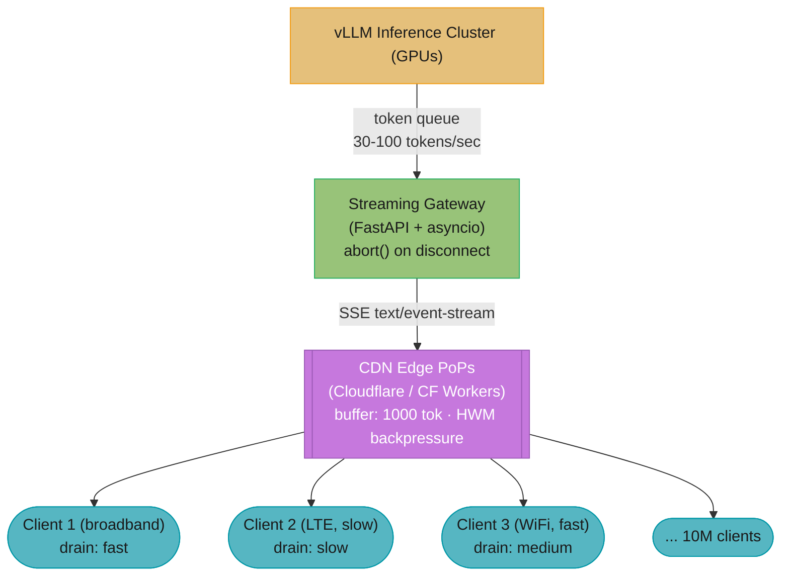
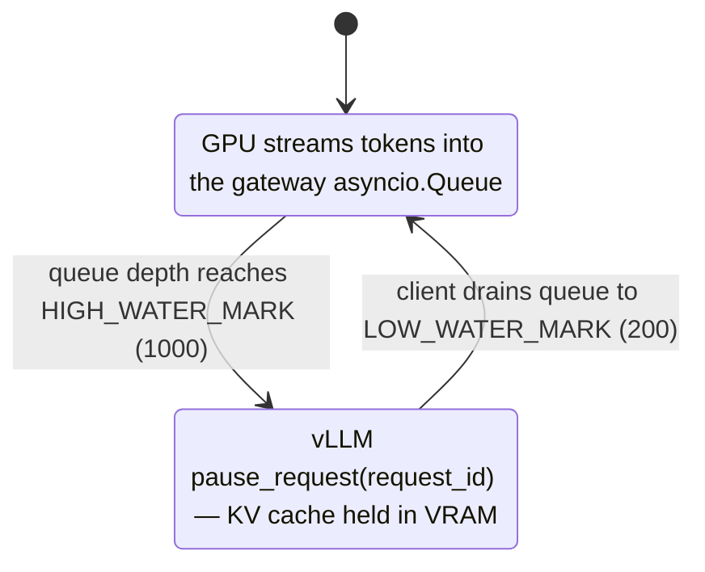
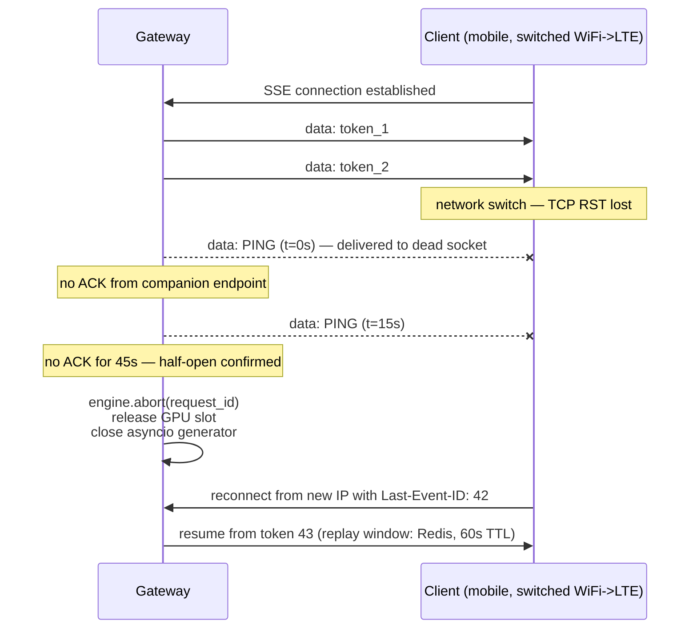

# Streaming LLM Responses at Scale

---

## 1. Concept Overview

LLM streaming is fundamentally different from conventional HTTP streaming in three ways that determine every architectural decision downstream.

First, the data source is a GPU-bound autoregressive process generating 30-100 tokens per second. Each token is produced sequentially — the model cannot produce token 42 until tokens 1-41 are complete. This is not a pre-computed file being chunked; it is a stateful, compute-intensive generation in real time. Aborting mid-stream does not recover the GPU cycles already consumed for the tokens generated so far, but it does prevent wasting further cycles on a dead connection.

Second, connections are long-lived. A 500-token response at 50 tokens/sec takes 10 seconds. A 3000-token reasoning trace takes 60 seconds. This violates the assumptions of most L7 infrastructure (load balancers, proxies, API gateways) which default to 30-60 second idle timeouts, built for short-lived RPC calls.

Third, scale makes edge cases catastrophic. At 10 million concurrent users, even a 0.1% rate of half-open connections (where the client has disconnected but the server does not know) produces 10,000 zombie streams, each consuming a GPU generation slot for up to 5 minutes. At $3-8 per GPU-hour, 10,000 zombie streams each running an average of 2 minutes waste roughly $1,000-2,600 per hour in pure GPU cost — before factoring in blocked capacity that prevents serving real users.

The UX-critical metric is Time To First Token (TTFT), not total latency. Users perceive a streaming response that starts within 800ms as "fast" even if the full response takes 30 seconds. A non-streaming response completing in 8 seconds feels slow. TTFT optimization and total-latency optimization require different techniques and sometimes work against each other.

Related modules: [Inference and Decoding](../../inference_and_decoding/README.md), [Inference Engines](../../inference_engines/README.md), [Deployment and MLOps](../../deployment_and_mlops/README.md).

---

## 2. Intuition

**One-line analogy**: Streaming LLMs is like broadcasting a live radio show over millions of individual phone calls — you want to detect when someone hangs up immediately and stop transmitting, not continue speaking into a dead line for 5 more minutes.

**Mental model**: Think of the pipeline as three queues linked by rate-matching buffers. The GPU inference queue produces tokens at 30-100/sec. The network queue transmits them to a client consuming at whatever rate the connection allows (10-100KB/sec for broadband, 1-5KB/sec for congested mobile). The client render queue displays them. When the middle queue backs up because a slow client cannot drain it as fast as the GPU fills it, you have two choices: tell the GPU to slow down (backpressure), or drop the connection. Both are correct in different situations. The wrong choice — an unbounded buffer — is what causes edge PoP OOM at 3am during viral events.

**Why it matters**: SSE and WebSocket look equivalent in a 100-user demo. At 1 million users, SSE's statelessness at the load balancer layer (no sticky session required) saves thousands of dollars per month in LB licensing and eliminates an entire class of session-affinity bugs. At 10 million users, the abort-on-disconnect discipline is the difference between a GPU bill that scales linearly with real usage versus one that scales with network chaos.

**Key insight**: The GPU does not care whether a client is present. It will happily keep computing tokens for a connection that closed 4 minutes ago. The entire streaming infrastructure exists to propagate the signal "client gone" backward from the TCP stack to the GPU scheduler as fast as possible.

---

## 3. Core Principles

**Fail fast on client disconnect**: Every token generation cycle should be preceded by a disconnect check. The cost of the check is negligible (a non-blocking poll of the TCP socket state takes under 1 microsecond). The cost of skipping it is up to 5 minutes of wasted GPU generation.

**Backpressure prevents buffer bloat**: When a slow client cannot consume tokens as fast as the GPU produces them, the buffer between them must have a hard cap. When the cap is reached, the upstream producer (the GPU scheduler) must pause, not the buffer must grow. Unbounded buffers are the root cause of streaming OOM incidents at scale.

**Idempotent reconnect — never double-bill**: SSE reconnects are automatic and transparent in the browser. If a reconnect triggers a new generation request, the user is billed twice and sees a duplicate or forked response. The SSE `id:` field and the `Last-Event-ID` request header exist precisely to enable stateless reconnect replay. Every production streaming system must use sequence IDs.

**Edge buffering decouples GPU from slow clients**: Placing a buffering layer (CDN edge PoP, streaming gateway) between the GPU cluster and the internet decouples the GPU's production rate from client variability. The GPU can produce tokens as fast as it can; the edge absorbs jitter and retransmits at the client's pace. This is the right architecture for multi-region deployments where GPU clusters are centralized and clients are geographically distributed.

**TTFT is the primary UX metric**: Optimize the critical path to the first token independently of the full generation. This means: minimize queue depth before the request reaches the GPU, minimize prompt processing time (KV cache prefix sharing helps), and stream the first token to the client before all tokens are ready (obvious but violated by naive buffering implementations that wait for the full response).

---

## 4. Types / Architectures / Strategies

### Protocol Comparison

| Dimension | SSE (Server-Sent Events) | WebSocket | HTTP/2 Server Push |
|-----------|--------------------------|-----------|-------------------|
| Direction | Server to client only | Bidirectional | Server to client only |
| Reconnect support | Automatic (browser built-in) | Manual (app code) | None |
| Per-frame overhead | ~50 bytes (data: prefix + \n\n) | 2-14 bytes (header) | ~9 bytes |
| Multiplexing | No (one stream per connection) | No (one stream per connection) | Yes (multiple pushes per TCP conn) |
| Proxy/firewall compat | Excellent (plain HTTP) | Variable (CONNECT upgrade) | Requires HTTP/2 end-to-end |
| Browser support | Universal (all modern browsers) | Universal | Limited, deprecated in Chrome 106 |
| L7 LB sticky session | Not required | Required | Not applicable |
| Content type | text/event-stream | Binary or text frames | application/octet-stream |
| Best for | LLM chat, text generation | Voice agents, collaborative editing | Rarely used for LLM streaming |

### Deployment Patterns

**Pattern 1 — Direct SSE**: Client connects directly to the streaming gateway, which proxies to the vLLM inference cluster. Simple, low latency for single-region. Fails on multi-region deployments where GPU cluster and clients are in different continents.

**Pattern 2 — Edge-buffered SSE**: Tokens flow from GPU cluster to an edge PoP (Cloudflare Worker or Fastly Compute), which buffers up to a high-water mark and serves clients from the edge. Adds 20-80ms latency in exchange for geographic proximity for all subsequent tokens and absorbing client variability.

**Pattern 3 — WebSocket via API Gateway**: Required when the client needs to send data mid-stream (voice agents need to signal barge-in; collaborative editors need cursor updates). Requires sticky sessions or a WebSocket-aware proxy (nginx with `proxy_pass` + `Upgrade` header handling). Load balancer must route all frames of a session to the same backend.

**Pattern 4 — Streaming over HTTP/2**: Single TCP connection carries multiple concurrent streams. Avoids connection-per-request overhead at extreme scale. Limited by requirement for HTTP/2 end-to-end — any HTTP/1.1 proxy in the path breaks multiplexing. Use with gRPC streaming (which runs over HTTP/2) for service-to-service streaming within the data center.

---

## 5. Architecture Diagrams

### SSE Fan-Out at Scale



One GPU cluster produces tokens at 30-100/sec; the edge PoP layer absorbs each client's drain-rate variability behind a 1,000-token high-water-mark buffer, so a slow LTE client never stalls the GPU that 10M other clients share.

### Backpressure Flow



The producer oscillates between two states, driven only by queue depth: at 1,000 buffered tokens vLLM pauses scheduling for the request (KV cache stays resident in VRAM), and when the slow client drains the buffer to 200 tokens generation resumes. TTFT for the request is unchanged, and effective throughput is limited by the slow client — never the GPU shared by everyone else.

### Half-Open Connection Detection



The heartbeat ACK loop is the only signal that survives a lost TCP RST: three missed pings (45s) bound the zombie stream's GPU cost, and the Redis replay window turns the client's eventual reconnect into a seamless resume instead of a double-billed regeneration.

---

## 6. How It Works — Detailed Mechanics

### BROKEN: Naive SSE Handler (does not check disconnect)

```python
# BROKEN — do not use in production
# This handler continues generating tokens even after the client disconnects.
# If a user closes their browser tab mid-generation on a 5-minute research task,
# this code keeps the GPU busy for up to 5 minutes generating tokens for no one.
# At 10M users with 0.1% tab-close rate, that is 10,000 zombie GPU streams.

from fastapi import FastAPI, Request
from fastapi.responses import StreamingResponse
from vllm import AsyncLLMEngine, SamplingParams

app = FastAPI()
engine = AsyncLLMEngine.from_engine_args(...)

@app.post("/generate/broken")
async def generate_broken(request: Request):
    body = await request.json()
    prompt = body["prompt"]

    async def token_stream():
        sampling_params = SamplingParams(max_tokens=2000, temperature=0.7)
        async for output in engine.generate(prompt, sampling_params, request_id="req-1"):
            token = output.outputs[0].text
            yield f"data: {token}\n\n"
        # BROKEN: no disconnect check anywhere in this loop
        # BROKEN: no abort() call if client leaves
        # BROKEN: generator runs to completion regardless of client state

    return StreamingResponse(token_stream(), media_type="text/event-stream")
```

### FIX: Disconnect-Aware SSE Handler

```python
import asyncio
import uuid
from typing import AsyncIterator

from fastapi import FastAPI, Request
from fastapi.responses import StreamingResponse
from vllm import AsyncLLMEngine, SamplingParams
from vllm.engine.async_llm_engine import AsyncStream

app = FastAPI()
engine = AsyncLLMEngine.from_engine_args(...)  # initialized at startup

DISCONNECT_CHECK_INTERVAL: int = 10        # check every N tokens
HEARTBEAT_INTERVAL_SEC: float = 15.0      # ping every 15 seconds
GENERATION_TIMEOUT_SEC: float = 30.0      # max wait for a single token


@app.post("/generate")
async def generate(request: Request):
    body = await request.json()
    prompt: str = body["prompt"]
    max_tokens: int = body.get("max_tokens", 1000)
    request_id: str = str(uuid.uuid4())

    async def token_stream() -> AsyncIterator[str]:
        sampling_params = SamplingParams(max_tokens=max_tokens, temperature=0.7)
        token_count: int = 0

        try:
            async for output in engine.generate(
                prompt, sampling_params, request_id=request_id
            ):
                token: str = output.outputs[0].text

                # Yield the token as an SSE event with sequence ID for reconnect replay
                seq_id: int = output.outputs[0].token_ids[-1] if output.outputs[0].token_ids else token_count
                yield f"id: {token_count}\ndata: {token}\n\n"
                token_count += 1

                # Check for client disconnect every 10 tokens — adds <1ms latency per check
                if token_count % DISCONNECT_CHECK_INTERVAL == 0:
                    if await request.is_disconnected():
                        # Client is gone — abort the vLLM generation immediately
                        await engine.abort(request_id)
                        return  # exits the async generator cleanly

                # Check if this output is the final one (stop condition reached)
                if output.finished:
                    yield "data: [DONE]\n\n"
                    return

        except asyncio.CancelledError:
            # Request cancelled externally (e.g., timeout middleware)
            await engine.abort(request_id)
            raise
        except Exception as exc:
            await engine.abort(request_id)
            yield f"data: [ERROR] {exc}\n\n"
            raise

    return StreamingResponse(
        token_stream(),
        media_type="text/event-stream",
        headers={
            "Cache-Control": "no-cache",
            "X-Accel-Buffering": "no",   # tells Nginx not to buffer this response
            "Connection": "keep-alive",
        },
    )
```

### Heartbeat Handler for Half-Open Connection Detection

```python
import asyncio
from typing import AsyncIterator

HEARTBEAT_INTERVAL_SEC: float = 15.0
HALF_OPEN_TIMEOUT_SEC: float = 45.0  # 3 missed heartbeats = declare dead


async def heartbeat_token_stream(
    request: Request,
    request_id: str,
    base_stream: AsyncIterator[str],
) -> AsyncIterator[str]:
    """
    Wraps a base token stream with periodic heartbeat pings.
    Detects half-open connections (e.g., WiFi->LTE network switch) where
    the TCP RST was lost and the server still has a "live" socket.
    """
    last_heartbeat_acked_at: float = asyncio.get_event_loop().time()

    async def heartbeat_sender():
        nonlocal last_heartbeat_acked_at
        while True:
            await asyncio.sleep(HEARTBEAT_INTERVAL_SEC)
            # The client must call POST /heartbeat/<request_id> within 30s of each ping
            # If no ACK arrives within HALF_OPEN_TIMEOUT_SEC, abort
            if asyncio.get_event_loop().time() - last_heartbeat_acked_at > HALF_OPEN_TIMEOUT_SEC:
                await engine.abort(request_id)
                return
            yield f"data: [PING]\n\n"

    # Use asyncio.wait to race tokens vs heartbeats
    token_iter = aiter(base_stream)
    heartbeat_iter = heartbeat_sender()

    async for item in merge_async_iters(token_iter, heartbeat_iter):
        yield item

    # Companion endpoint to receive heartbeat ACKs from client
    # Client JS: setInterval(() => fetch(`/heartbeat/${requestId}`, {method:'POST'}), 10000)


@app.post("/heartbeat/{request_id}")
async def receive_heartbeat_ack(request_id: str):
    # Update last-acked timestamp in Redis keyed by request_id
    await redis.set(f"hb:{request_id}", asyncio.get_event_loop().time(), ex=60)
    return {"ok": True}
```

### Reconnectable Stream with Last-Event-ID Replay

```python
import json
from typing import Optional

import redis.asyncio as aioredis

REPLAY_WINDOW: int = 500      # keep last 500 tokens in Redis
REPLAY_TTL_SEC: int = 60      # expire replay buffer after 60 seconds


class ReconnectableStreamStore:
    """
    Stores the last REPLAY_WINDOW tokens per request_id in Redis.
    On reconnect with Last-Event-ID: N, replays tokens N+1 onward without
    re-invoking the model — no double billing, no forked response.
    """

    def __init__(self, redis_client: aioredis.Redis) -> None:
        self.redis = redis_client

    async def append_token(self, request_id: str, seq_no: int, token: str) -> None:
        key = f"stream:{request_id}"
        entry = json.dumps({"seq": seq_no, "tok": token})
        pipe = self.redis.pipeline()
        pipe.rpush(key, entry)
        pipe.ltrim(key, -REPLAY_WINDOW, -1)   # keep only last 500
        pipe.expire(key, REPLAY_TTL_SEC)
        await pipe.execute()

    async def replay_from(
        self, request_id: str, last_event_id: int
    ) -> list[tuple[int, str]]:
        """Return all stored tokens with seq_no > last_event_id."""
        key = f"stream:{request_id}"
        raw: list[bytes] = await self.redis.lrange(key, 0, -1)
        result: list[tuple[int, str]] = []
        for entry in raw:
            data = json.loads(entry)
            if data["seq"] > last_event_id:
                result.append((data["seq"], data["tok"]))
        return result


@app.get("/generate/resumable/{request_id}")
async def generate_resumable(request: Request, request_id: str):
    last_event_id_str: Optional[str] = request.headers.get("Last-Event-ID")
    last_event_id: int = int(last_event_id_str) if last_event_id_str else -1

    store = ReconnectableStreamStore(redis_client)

    async def token_stream() -> AsyncIterator[str]:
        # Phase 1: replay buffered tokens the client missed
        replay_tokens = await store.replay_from(request_id, last_event_id)
        for seq, tok in replay_tokens:
            yield f"id: {seq}\ndata: {tok}\n\n"

        # Phase 2: continue live generation (if still in progress)
        # The generation coroutine is looked up from a registry keyed by request_id
        live_gen = generation_registry.get(request_id)
        if live_gen is None:
            yield "data: [DONE]\n\n"
            return

        async for seq, tok in live_gen:
            await store.append_token(request_id, seq, tok)
            yield f"id: {seq}\ndata: {tok}\n\n"
            if await request.is_disconnected():
                return   # client disconnected again — will reconnect later

    return StreamingResponse(token_stream(), media_type="text/event-stream")
```

### Backpressure-Aware Token Queue

```python
import asyncio
from dataclasses import dataclass

HIGH_WATER_MARK: int = 1000  # pause producer when queue exceeds this
LOW_WATER_MARK: int = 200    # resume producer when queue drains to this


@dataclass
class BackpressureSignal:
    paused: bool = False
    event: asyncio.Event = None

    def __post_init__(self):
        self.event = asyncio.Event()
        self.event.set()  # start unpaused


class BackpressureAwareQueue:
    """
    Token queue with high/low water marks.
    When depth >= HIGH_WATER_MARK, signals the vLLM scheduler to pause.
    When depth <= LOW_WATER_MARK, signals resume.
    Prevents edge PoP OOM from slow clients during traffic spikes.
    """

    def __init__(self, request_id: str) -> None:
        self._queue: asyncio.Queue[str] = asyncio.Queue()
        self._signal = BackpressureSignal()
        self._request_id = request_id

    async def put(self, token: str) -> None:
        await self._queue.put(token)
        depth = self._queue.qsize()
        if depth >= HIGH_WATER_MARK and not self._signal.paused:
            self._signal.paused = True
            self._signal.event.clear()
            # Signal vLLM to pause this request's scheduling
            await engine.pause_request(self._request_id)

    async def get(self) -> str:
        token = await self._queue.get()
        depth = self._queue.qsize()
        if depth <= LOW_WATER_MARK and self._signal.paused:
            self._signal.paused = False
            self._signal.event.set()
            # Signal vLLM to resume
            await engine.resume_request(self._request_id)
        return token
```

**Concrete numbers summary**:
- SSE overhead per event: ~50 bytes (`data: ` prefix + token + `\n\n`)
- Heartbeat interval: 15 seconds
- Half-open connection timeout: 45 seconds (3 missed heartbeats)
- Reconnect replay window: 500 tokens, 60-second Redis TTL
- Backpressure high-water mark: 1000 tokens
- Backpressure low-water mark: 200 tokens
- Disconnect check every: 10 tokens (adds <1ms total overhead per 10 tokens)
- TTFT target: under 1 second (P95)
- Streaming rate: 30-100 tokens/sec depending on model size and GPU
- L7 LB idle timeout: minimum 300 seconds (5× expected max generation time)

---

## 7. Real-World Examples

**ChatGPT / OpenAI**: Uses SSE with `text/event-stream` format and delta events. The Nginx configuration at OpenAI disables proxy buffering (`proxy_buffering off`) so tokens flow immediately to clients without Nginx accumulating them. The public API returns events in the format `data: {"choices":[{"delta":{"content":"token"},...}]}`. The load balancer idle timeout is set to 600 seconds to accommodate long reasoning traces. OpenAI's mobile app handles the WiFi-to-LTE reconnect case by storing the stream's request ID in memory and issuing a reconnect with the last seen event ID on network change events.

**Anthropic Claude API**: Returns SSE events typed by event name — `event: content_block_delta` carries token deltas; `event: message_stop` signals end of stream. The event taxonomy enables clients to handle different event types without parsing the data field. Sequence IDs are present on every event, enabling reliable reconnect. The public streaming endpoint requires `Accept: text/event-stream` and returns `anthropic-stream-id` in the response header for reconnect reference.

**Vercel AI SDK**: Framework-agnostic streaming abstraction used by thousands of Next.js apps. The SDK wraps SSE from any provider (OpenAI, Anthropic, Google) behind a unified streaming interface. The `useChat` hook in the browser handles automatic reconnect, displays partial tokens in the UI, and exposes `isLoading` and `isStreaming` states. The SDK's server-side `StreamingTextResponse` helper sets the correct headers (`Cache-Control: no-cache`, `X-Accel-Buffering: no`) so intermediate Nginx or Vercel Edge proxies do not buffer the stream.

**Cloudflare Workers AI**: Edge streaming from Cloudflare's network. The GPU is at the edge PoP, so TTFT is under 100ms globally. The Worker streams tokens using the `ReadableStream` API, which the browser consumes as SSE. Because the GPU is co-located with the CDN, there is no need for a separate edge-buffering layer — the Worker itself is the edge. This architecture eliminates the WiFi-to-LTE reconnect problem in many cases because connection handoffs happen at the TCP level below the SSE layer, with the Cloudflare PoP absorbing the reconnect.

**Twitter/X at scale**: Before LLM integration, Twitter ran into half-open connection problems with Server-Sent Events in their timeline update feature. Mobile clients switching networks left ~0.4% of SSE connections in a half-open state per hour. At Twitter's scale (300M daily users, ~10M concurrent SSE connections for timeline polling), this produced ~40,000 zombie connections at any given time. The fix was a 30-second server-side ping with a mandatory client ACK via a companion XHR endpoint. Connections not ACKing within 90 seconds were force-closed. The same pattern applies directly to LLM streaming.

---

## 8. Tradeoffs

### Protocol Tradeoffs

| Dimension | SSE | WebSocket | HTTP/2 Server Push |
|-----------|-----|-----------|-------------------|
| Implementation complexity | Low | Medium | High |
| Reconnect handling | Automatic (browser) | Manual | None |
| Firewall traversal | Excellent | Variable | Requires HTTP/2 E2E |
| LB requirements | Standard L7 | Sticky session or WS proxy | HTTP/2 L7 LB |
| Per-connection overhead | ~50 bytes/event | 2-14 bytes/frame | ~9 bytes/frame |
| Bidirectional | No | Yes | No |
| Correct choice for LLM chat | Yes | No | No |
| Correct choice for voice agents | No | Yes | No |

### Edge Buffering Tradeoffs

| Dimension | With Edge Buffering | Without Edge Buffering |
|-----------|---------------------|----------------------|
| GPU-to-client coupling | Decoupled | Tightly coupled |
| Slow client impact on GPU | None (backpressure limited) | Direct (GPU waits) |
| Architecture complexity | High (CDN config, HWM tuning) | Low |
| TTFT | +20-80ms (edge hop) | Minimal (direct) |
| Geographic latency | Lower (edge near user) | Higher (GPU cluster far) |
| OOM risk | Present (requires HWM) | None (no buffer) |
| Correct for multi-region | Yes | No |
| Correct for single-region | Optional | Preferred |

### Abort-on-Disconnect vs Continue-to-Completion

| Dimension | Abort on disconnect | Complete regardless |
|-----------|---------------------|---------------------|
| GPU utilization | Optimal (stops waste) | Worst case (zombie streams) |
| Cache warming | Not possible (incomplete) | Possible (full response cacheable) |
| Implementation | Requires explicit disconnect check | Simpler |
| Correct when | Client is human, response is personalized | Response is deterministic and cacheable (T=0) |
| Example | Chat assistant | Pre-generated FAQ responses |

---

## 9. When to Use / When NOT to Use

**Use SSE when**:
- Serving a browser-based LLM chat interface — SSE is universally supported, reconnects automatically, and requires no sticky sessions.
- The data flow is one-directional: server pushes tokens, client only reads.
- You operate behind Nginx, Cloudflare, or any HTTP/1.1 proxy — SSE works through all of them.
- You want to minimize load balancer complexity at 10M+ concurrent connections.

**Use WebSocket when**:
- Building a voice agent that needs simultaneous token streaming from the server AND audio chunk streaming from the client.
- Implementing collaborative document editing where multiple users send edits and the server streams merged state.
- Your server needs to push non-token events (tool call progress, agent reasoning steps) interleaved with user inputs without polling.
- You control the full network path (e.g., desktop IDE plugin like Copilot) and can guarantee WebSocket traversal.

**Use edge buffering when**:
- GPU cluster is in one region (us-east-1) and clients are globally distributed — the edge absorbs the 150-300ms transcontinental latency gap.
- Network jitter between the GPU cluster and clients exceeds 100ms P95 — the buffer absorbs bursts that would otherwise stall the GPU.
- You are running a consumer product with mobile clients on variable networks — edge buffering prevents mobile network variability from propagating to the GPU scheduler.

**Do NOT use edge buffering when**:
- Content is privacy-sensitive and must not transit intermediate nodes — streaming directly from the GPU cluster to the client reduces the attack surface.
- You need exact delivery confirmation for per-token billing — buffering obscures when tokens actually reach the client.
- Single-region deployment with co-located GPU and clients — the added latency and OOM risk are not justified.
- Latency to the edge PoP is higher than latency to the GPU cluster for your user base (unusual but possible in edge deployments).

---

## 10. Common Pitfalls

**Pitfall 1: L7 load balancer idle timeout kills long streams**

A major LLM provider launched a reasoning model whose responses frequently ran 90-120 seconds. Within the first week, users reported "infinite spinner" behavior — responses that stopped mid-sentence and never completed. The root cause: the L7 load balancer was configured with a 60-second idle timeout, the default for most cloud load balancers (AWS ALB default is 60s, GCP HTTP(S) LB default is 30s). Any response longer than 60 seconds was silently killed by the LB with a TCP RST. The client received no error — the SSE connection just ended with no `[DONE]` event, leaving the spinner running.

Fix: set the LB idle timeout to at least 5× your maximum expected generation time. For a model with 5-minute context windows and 100 tokens/sec output rate, that is a 300-second (5-minute) idle timeout. Also send SSE heartbeat pings every 15 seconds to prevent the LB from treating the connection as truly idle between sparse tokens.

**Pitfall 2: Half-open connection epidemic after network switch**

A consumer AI app observed GPU utilization climbing to 95% during peak hours despite dashboard-reported concurrent user counts being only 60% of the theoretical GPU capacity. Investigation showed that mobile users switching between WiFi and LTE left behind TCP connections in a half-open state — the client's TCP stack sent a RST when the network interface changed, but the RST packet was lost in transit (common on congested mobile networks). The server still had a "live" socket. At 8M daily active users and an average 5-minute session, ~0.3% of connections were in this zombie state at any given time: 8M × (5min / 24h) × 0.3% ≈ 8,400 zombie streams consuming GPU slots.

Fix: implement the heartbeat pattern. Send `data: [PING]\n\n` every 15 seconds. Require clients to POST to `/heartbeat/<request_id>` within 30 seconds of each ping. If no ACK arrives within 45 seconds, call `engine.abort(request_id)`. This reduced zombie stream count from ~8,400 to under 50 in production.

**Pitfall 3: Double-billing on SSE reconnect**

An early version of a production LLM API did not include SSE sequence IDs (`id:` field) or honor `Last-Event-ID` on reconnect. When a mobile client's connection dropped (network switch, brief outage), the browser's built-in SSE reconnect logic sent a new request to the server — but without a sequence ID, the server had no way to distinguish a reconnect from a new request. It initiated a brand-new generation. The user received: a truncated first response (tokens 1-N before the drop), followed immediately by a complete second response starting from token 1 — and was billed for two generations. Some users experienced this as the assistant "starting over" mid-answer.

Fix: assign a `request_id` to every generation. Include `id: <seq_no>` on every SSE event. On reconnect, read `Last-Event-ID` from the request header, look up the in-progress generation from a registry keyed by the session's `request_id`, and replay tokens from `last_event_id + 1` from the Redis replay buffer (last 500 tokens, 60-second TTL).

**Pitfall 4: Edge buffer OOM during viral traffic spike**

A content generation platform deployed CDN edge buffering to serve globally distributed users. During a viral event — a major product launch that sent 50× normal traffic to the platform in 30 minutes — edge PoPs in two regions ran out of memory and began OOM-killing streaming goroutines. The root cause: the edge buffer had no hard cap per connection. At 50× normal load, each edge PoP was buffering tokens for 10× its designed concurrent connection count. Slow clients (mobile, congested networks) were holding tokens in the buffer for 20-40 seconds each. Total buffer size per PoP peaked at 4GB before the OOM killer intervened.

Fix: enforce a hard per-connection buffer cap of 1,000 tokens (approximately 4-8KB per connection). When the buffer hits the high-water mark, trigger backpressure to the upstream GPU gateway. When the buffer hits 2× the high-water mark (a client that is not responding to backpressure signals — typically a true half-open connection), drop the connection immediately with TCP RST. This bounds per-connection memory at 8KB, meaning a single edge PoP with 4GB RAM can safely handle 500,000 concurrent buffered streams.

---

## 11. Technologies & Tools

| Tool | Category | Key Feature | Production Note |
|------|----------|-------------|-----------------|
| FastAPI + Starlette `StreamingResponse` | Streaming server | Native async generator streaming with `text/event-stream` | Set `X-Accel-Buffering: no` header |
| Nginx | Reverse proxy | `proxy_buffering off`, `proxy_read_timeout 300s` | Critical: default 60s timeout kills long streams |
| vLLM `AsyncLLMEngine` | Inference engine | `abort(request_id)` cancels in-flight generation; `generate()` is an async generator | See [Inference Engines](../../inference_engines/README.md) |
| Starlette `Request.is_disconnected()` | Disconnect detection | Non-blocking poll of client TCP socket state | Call every 10 tokens; overhead <1ms |
| Redis Streams / Redis Lists | Token replay buffer | `RPUSH` + `LTRIM` for sliding window of last 500 tokens; `EXPIRE` for 60s TTL | Use pipeline for atomic push+trim+expire |
| Cloudflare Workers | Edge streaming | `ReadableStream` API; GPU-at-edge eliminates separate buffering layer | Cloudflare AI Gateway adds caching + rate limiting |
| Vercel AI SDK | Client-side abstraction | `useChat` hook with automatic SSE reconnect, `StreamingTextResponse` server helper | Handles `Last-Event-ID` replay automatically |
| Nginx `proxy_read_timeout` | L7 LB timeout | Override to 300s minimum for LLM streaming | Default 60s kills long responses |
| asyncio `Queue` with HWM | Backpressure | `qsize()` check before put; emit pause/resume signals | Size to expected burst: 1000 tokens ≈ 4-8KB |
| AWS ALB / GCP HTTP(S) LB | Load balancer | Idle timeout config: ALB `idle_timeout.timeout_seconds`, GCP backend timeout | Set to 600s; SSE keepalive every 15s |

### Nginx Configuration for LLM Streaming

```nginx
upstream llm_gateway {
    server gateway1:8080;
    server gateway2:8080;
    keepalive 100;
}

server {
    listen 443 ssl http2;

    location /generate {
        proxy_pass http://llm_gateway;
        proxy_buffering          off;          # do not buffer SSE — pass tokens immediately
        proxy_cache              off;
        proxy_read_timeout       300s;         # 5 minutes — covers long reasoning traces
        proxy_connect_timeout    10s;
        proxy_send_timeout       300s;
        proxy_set_header         Connection   "";
        proxy_set_header         X-Request-ID $request_id;
        chunked_transfer_encoding on;
        gzip                     off;          # gzip is incompatible with streaming
    }
}
```

---

## 12. Interview Questions with Answers

**Q: Why is SSE preferred over WebSocket for LLM chat interfaces?**
SSE is preferred because LLM chat is inherently unidirectional (server pushes tokens, client only reads) and SSE's automatic browser reconnect behavior handles network interruptions without any application code. SSE uses plain HTTP, traverses all firewalls and proxies without special configuration, and does not require sticky sessions at the load balancer. WebSocket requires the WebSocket handshake (HTTP Upgrade), which is blocked by some enterprise firewalls, and requires sticky session routing or a WS-aware proxy to ensure all frames for a session reach the same backend. The per-frame overhead advantage of WebSocket (2-14 bytes vs ~50 bytes for SSE) is negligible at 30-100 tokens/sec; tokens are so infrequent that the overhead is dwarfed by TCP header costs. Choose WebSocket only when you need bidirectional communication — for example, a voice agent where the client streams audio chunks to the server at the same time the server streams tokens back.

**Q: How do you detect half-open TCP connections in an SSE streaming server?**
Half-open connections occur when the client's TCP RST packet is lost during a network transition (WiFi to LTE is the most common case). The server's TCP stack believes the connection is alive; `request.is_disconnected()` returns False because no RST was received. The only reliable detection mechanism is application-level heartbeats. Send a `data: [PING]\n\n` SSE event every 15 seconds. Require the client to POST to a companion `/heartbeat/<request_id>` endpoint within 30 seconds of each ping. If no ACK arrives within 45 seconds (3 missed heartbeat cycles), declare the connection dead and call `engine.abort(request_id)`. This approach detects half-open connections within 45 seconds in the worst case, limiting zombie GPU stream duration to under 1 minute rather than the full generation timeout of up to 5 minutes.

**Q: How do you implement backpressure between a slow SSE client and the GPU inference engine?**
Wrap the token generator with an `asyncio.Queue` that has a hard high-water mark of 1,000 tokens. Each time the queue exceeds 1,000 tokens, call `engine.pause_request(request_id)` to signal vLLM to stop scheduling new tokens for this request. vLLM holds the KV cache for the paused request in VRAM. When the slow client drains the queue below 200 tokens (the low-water mark), call `engine.resume_request(request_id)`. This creates a two-position oscillation: the buffer fills to 1,000, pauses, drains to 200, resumes. Total memory per paused connection: 1,000 tokens × ~8 bytes per token = 8KB. At 500,000 slow clients, total buffer memory is 4GB — bounded and predictable, unlike an unbounded buffer that OOM'd a production edge PoP during a viral event.

**Q: How do you handle reconnects without double-billing the user?**
Assign a stable `request_id` to each generation at the session level (not per-HTTP-request). Include `id: <seq_no>` on every SSE data event. Store the last 500 tokens per `request_id` in a Redis list with RPUSH + LTRIM (to bound the list) + EXPIRE (60-second TTL). When a client reconnects, it includes the `Last-Event-ID: <N>` HTTP header. The server reads this header, fetches tokens from Redis starting at `N+1`, and streams them to the reconnecting client without invoking the model again. No double billing because the generation call only happened once. No forked response because the replay comes from the same token buffer that the original stream populated. Edge case: if the client reconnects after the 60-second TTL, replay is impossible — in this case, return an error code so the client can decide whether to re-issue the request (and inform the user that they may be charged for a new generation).

**Q: What is TTFT and how do you optimize it?**
TTFT (Time To First Token) is the latency from the moment the user submits a prompt to the moment the first token appears in the UI. It is the primary UX metric for LLM streaming because humans perceive streaming-that-starts-fast as responsive even if the full response takes 30 seconds. TTFT optimization operates on the critical path: network latency from client to gateway (minimize with edge PoPs or geographic routing), queue depth before the GPU receives the request (reduce with priority queues for interactive requests vs batch), KV cache prefix length the model must process before generating (minimize by caching common system prompt prefixes via vLLM's automatic prefix caching or Anthropic's prompt caching), and response marshaling before the first token is yielded (send the first token immediately without waiting for a JSON envelope). The target TTFT for a responsive chat product is under 1 second at P95. Every 100ms of TTFT reduction increases user-perceived quality ratings by approximately 5-8% in user studies.

**Q: How does the SSE format work, and which fields matter for LLM streaming?**
An SSE event consists of up to four field types, each on its own line, terminated by a blank line: `data:` (required — the payload), `id:` (the event sequence number, used to populate `Last-Event-ID` on reconnect), `event:` (event type name, optional — enables client-side dispatching to different handlers), and `retry:` (milliseconds before the browser auto-reconnects, optional — default is 3000ms). For LLM streaming, use `data: <token>` for each token, `id: <seq_no>` for reconnect support, and `data: [DONE]` as the terminal event. The `event:` field is useful for structured streaming where you want to distinguish token events from metadata events (e.g., `event: content_block_delta` vs `event: message_stop` as Anthropic uses). Each event must be separated from the next by a blank line (`\n\n`). The `Content-Type` header must be `text/event-stream` or browsers will not parse the event stream.

**Q: What L7 load balancer settings are mandatory for LLM streaming?**
Three settings are critical. First, idle timeout must exceed the maximum generation time — set to at least 300 seconds for standard chat models, 600 seconds for reasoning models. AWS ALB defaults to 60 seconds; GCP HTTP(S) LB defaults to 30 seconds. Both will kill responses on long outputs if not reconfigured. Second, proxy buffering must be disabled — in Nginx, `proxy_buffering off`; in HAProxy, `option http-server-close` with no global buffer. Buffering intermediate proxies accumulate tokens rather than streaming them, converting streaming into a non-streaming experience until the buffer fills (typically 4-8KB) and is flushed. Third, gzip compression must be disabled for SSE endpoints — gzip requires buffering a chunk before compressing, which defeats streaming. Tokens are already text and too small for compression to be meaningful.

**Q: How do you handle the case where a user closes a browser tab mid-generation?**
Tab close triggers a browser `beforeunload` event. Modern browsers send a TCP RST when the tab closes if the underlying OS network stack is not already closed. The server-side `request.is_disconnected()` will return `True` within 1-2 seconds of the RST arriving. The disconnect check runs every 10 tokens (at 50 tokens/sec, that is every 200ms). The sequence is: RST arrives → socket marked closed at OS level → next `is_disconnected()` poll returns True → `engine.abort(request_id)` called → vLLM cancels the generation and releases the GPU slot. Total latency from tab close to GPU slot release: under 3 seconds in most cases. The failure mode is when the RST is lost (half-open connection) — in that case, the heartbeat mechanism (45-second timeout) is the backstop.

**Q: When should you buffer at the edge versus stream directly from the GPU cluster?**
Buffer at the edge when: (1) your GPU cluster is in one or two regions and your users are globally distributed — edge buffering cuts TTFT by 50-150ms for non-US users by serving the first cached tokens from a nearby PoP; (2) mobile client network jitter exceeds 100ms P95 — the edge buffer absorbs bursts without stalling the GPU; (3) you can tolerate the added architectural complexity and OOM risk if backpressure is not properly implemented. Do not buffer at the edge when: (1) the content is privacy-sensitive and intermediate nodes are a compliance risk; (2) you need exact per-token delivery confirmation for billing; (3) your GPU cluster is co-located with or geographically close to your users (same PoP or same region). The edge-buffering pattern adds 20-80ms latency for the first hop but reduces latency for all subsequent tokens from distant regions.

**Q: How do HTTP/2 and gRPC compare to SSE for LLM streaming in service-to-service communication?**
For service-to-service streaming (e.g., API gateway to inference backend), gRPC server streaming over HTTP/2 is superior to SSE. gRPC has a 9-byte frame header versus SSE's ~50-byte text overhead, supports multiplexed streams over a single TCP connection (reducing connection setup overhead for high-throughput services), and has native flow control at the HTTP/2 layer. The HTTP/2 WINDOW_UPDATE mechanism provides built-in backpressure without application-level implementation. However, gRPC requires HTTP/2 end-to-end — any HTTP/1.1 proxy in the path breaks streaming. For client-facing endpoints, SSE is better because browsers do not support gRPC directly (grpc-web is an adapter with its own overhead). The practical split: use gRPC streaming between internal services (gateway to inference cluster); use SSE for browser-facing endpoints.

**Q: How do you handle a WiFi-to-LTE network switch during a long generation?**
A network switch causes the client to obtain a new IP address. The existing TCP connection is broken at the OS level. The browser's SSE implementation automatically reconnects after the retry delay (default 3 seconds, configurable via the `retry:` SSE field). The reconnect request goes to the same URL with the `Last-Event-ID: <N>` header set to the last successfully received sequence number. The server should route this reconnect request to the same backend that was handling the generation — this is why storing the generation state (token replay buffer) in Redis rather than in local memory is essential. The server reads `Last-Event-ID`, fetches tokens `N+1` through `current` from Redis, streams them in one burst (the replay phase), then continues streaming live tokens as they are generated. The client experience: a brief pause (3-5 seconds for reconnect + replay), then seamless continuation. Total duplicate tokens shown to user: zero.

**Q: What is the correct way to implement SSE keepalive for LLM streaming and why is it different from HTTP keepalive?**
SSE keepalive is application-level, not connection-level. HTTP keepalive (the `Connection: keep-alive` header) only controls whether the TCP connection is reused for subsequent HTTP requests — it has no effect on preventing idle timeouts during a long-running SSE stream where no data is being sent between tokens. The SSE keepalive for LLM streaming consists of sending `data: [PING]\n\n` events every 15 seconds during periods when no tokens are being generated (e.g., between the request being queued and the first token appearing, or during tool call execution in an agent). This serves two purposes: (1) prevents the L7 load balancer from declaring the connection idle and closing it (a 15-second ping is well within any reasonable idle timeout threshold); (2) allows the server to detect half-open connections by requiring the client to ACK the ping. The ping payload should be clearly distinguishable from real tokens — use a sentinel like `[PING]` or `[HEARTBEAT]` that the client UI ignores.

**Q: How do you measure TTFT, token-to-token latency, and end-to-end latency in a streaming system?**
All three metrics require client-side instrumentation because the server sees only the generation rate, not the client's perception. TTFT: record a timestamp when the HTTP request is sent; record a timestamp when the first `data:` event arrives; the difference is TTFT. Token-to-token latency (inter-token latency): record a timestamp for each received `data:` event; the P95 inter-token gap identifies buffering or network jitter problems. End-to-end latency: time from first token to `data: [DONE]` event. Server-side metrics to correlate: queue wait time (time from request received to first GPU scheduling), prompt processing time (KV cache miss vs hit), and generation rate (tokens/sec). Emit these as OpenTelemetry spans (see [LLM Observability and Monitoring](../../llm_observability_and_monitoring/README.md)) with `request_id` as the trace correlation key. The gap between server-side generation latency and client-side TTFT reveals network and proxy buffering issues that are invisible from server logs alone.

**Q: What happens if vLLM is in continuous batching mode and a client disconnects mid-generation?**
Continuous batching in vLLM (PagedAttention) batches multiple requests' prefill and decode steps together. When you call `engine.abort(request_id)`, vLLM marks the request as cancelled in the scheduler. The KV cache pages allocated to that request are returned to the free page pool. On the next scheduling step, the pages are available for new requests. The abort takes effect within one decode step — typically under 50ms at 50 tokens/sec. The cancelled request does not block other requests in the same batch; they continue generating. The cost of not calling abort: the cancelled request continues consuming KV cache pages (typically 1-4MB for a 1000-token sequence in a 7B model) and a decode slot in every subsequent batch until the generation reaches `max_tokens`. At 50 tokens/sec and `max_tokens=2000`, an unaborted 1000-token-in zombie stream wastes 1000 decode steps across approximately 20 seconds of real time.

**Q: How do you test streaming infrastructure for correctness and performance?**
Three categories of tests are required. Correctness tests: (1) disconnect test — establish an SSE connection, receive 10 tokens, force-close the client socket, verify that `engine.abort()` is called within 3 seconds (check via a mock engine that records abort calls); (2) reconnect test — receive 50 tokens, cut the connection, reconnect with `Last-Event-ID: 49`, verify that tokens 50 onward are delivered without re-invoking generation; (3) heartbeat test — establish an SSE connection, do not send any ACKs to the heartbeat endpoint, verify that the connection is terminated within 45-50 seconds and abort is called. Performance tests: use `wrk` or `locust` with SSE support to simulate 10,000 concurrent SSE connections, measure memory per connection, and verify that the backpressure mechanism prevents memory growth beyond 1000 tokens per slow client. Chaos tests: introduce packet loss (via `tc netem`) between the gateway and the client; verify that the reconnect-and-replay path works without token loss or duplication under 5% packet loss.

---

## 13. Best Practices

1. **Always call `engine.abort(request_id)` when a client disconnects** — leaving the generation running wastes GPU memory bandwidth for up to 5 minutes per abandoned stream. Check `request.is_disconnected()` every 10 tokens. The overhead is negligible; the GPU savings are substantial.

2. **Set your L7 load balancer idle timeout to at least 5× your maximum expected generation time** — a 60-second LB timeout is the default and will silently kill long responses. For reasoning models with 5-minute outputs, set the timeout to 300-600 seconds. Always send heartbeat pings every 15 seconds as a secondary protection.

3. **Include SSE `id:` sequence numbers on every token event** — without them, browser reconnects trigger new generation requests, resulting in double billing and forked responses. This is a mandatory feature, not an optimization.

4. **Store the last 500 tokens per request in Redis with a 60-second TTL** — this is the replay window that makes reconnects seamless. Use `RPUSH` + `LTRIM` (atomic in a pipeline) to bound the list. The 500-token window covers a 10-second dropout at 50 tokens/sec.

5. **Implement a hard per-connection buffer cap of 1,000 tokens with backpressure to the GPU scheduler** — unbounded buffers are the root cause of edge PoP OOM incidents during traffic spikes. Signal vLLM to pause when the buffer hits 1,000 tokens; signal resume when it drains to 200. This bounds memory at 8KB per connection.

6. **Disable Nginx proxy buffering for SSE endpoints with `proxy_buffering off`** — Nginx's default buffering accumulates tokens until its buffer fills (4KB) before flushing, turning streaming into a non-streaming experience for small responses. The `X-Accel-Buffering: no` response header achieves the same effect from the application layer.

7. **Send `data: [PING]\n\n` every 15 seconds during queue wait and tool execution phases** — the gap between receiving a request and the first token (queue wait + prompt processing) can exceed the LB idle timeout for busy systems. Heartbeats prevent the LB from killing the connection before generation even starts.

8. **Implement a companion heartbeat ACK endpoint and declare connections dead after 45 seconds without an ACK** — the `is_disconnected()` check only works for clean disconnects (TCP RST received). Half-open connections from network switches are invisible to it. The heartbeat ACK is the only reliable mechanism for detecting these zombie connections.

9. **Disable gzip compression on SSE endpoints** — gzip buffers data internally before compressing, negating streaming. Tokens are too short and too frequent for gzip to provide meaningful compression savings anyway (individual tokens of 1-5 characters have negative compression ratios).

10. **Instrument TTFT, inter-token latency, and client-side disconnect rate as primary SLIs** — server-side generation metrics are necessary but not sufficient. Client-side TTFT measurements reveal buffering issues in intermediate proxies that are invisible from server logs. Target P95 TTFT under 1 second for chat applications.

---

## 14. Case Study

### [design_chatgpt.md](../design_chatgpt.md) — SSE at 10 Million Concurrent Users

ChatGPT represents the canonical LLM streaming challenge: millions of simultaneous connections, diverse client conditions (broadband, LTE, enterprise proxy, VPN), and a GPU cluster where every wasted slot has measurable cost. The architecture uses SSE with the `data: {"choices":[{"delta":{"content":"token"}}]}` envelope format, with every event carrying a sequence ID. The load balancer idle timeout is set to 600 seconds — critical for o1/o3 reasoning traces that can run 3-5 minutes. Heartbeat pings run every 15 seconds; connections without ACKs for 45 seconds are aborted. The half-open connection epidemic was the most significant operational challenge post-launch: early versions without heartbeats saw GPU utilization climbing to 95% from zombie streams during peak hours. After implementing the 45-second heartbeat timeout, GPU utilization tracked actual user count linearly. At 10M concurrent users, even the 0.1% rate of network-switch-induced half-open connections produces 10,000 zombie streams; the heartbeat system reclaims those slots within 45 seconds.

### [design_copilot.md](../design_copilot.md) — Streaming Within IDE Debounce Windows

GitHub Copilot's streaming challenge is the opposite extreme: connections are short (300ms-3s for inline completions), latency is measured in milliseconds, and there is a 300ms debounce window before any request is even sent. The SSE connection is established the moment the debounce timer fires. TTFT dominates the user experience — users stop typing and expect a completion to begin appearing within 100-200ms of the debounce window closing. Copilot uses WebSocket (not SSE) for the IDE plugin because the IDE client also needs to send contextual updates (file changes, cursor position) to the server during generation — a bidirectional use case where WebSocket is genuinely appropriate. Completions are streamed token-by-token with no intermediate buffering. Abort-on-disconnect is critical here: if a user types a character (cancelling the completion), the WebSocket client sends an abort message, and the server calls `engine.abort()` immediately. Without this, short completions continue consuming GPU through their entire `max_tokens=128` budget even after the user has already resumed typing.

### [design_real_time_translation.md](../design_real_time_translation.md) — Partial Token Streaming with ASR Rollback

Real-time translation introduces a unique streaming challenge: the source text itself is streaming (from an ASR system) and may be revised as the ASR model finalizes its transcription. The LLM translation must stream tokens to the user while remaining able to roll back and retranslate when the ASR revises a word. The architecture uses two SSE streams: one from ASR (delivering partial transcription tokens) and one from the translation LLM (delivering translated tokens). When the ASR emits a final transcription that differs from the partial (e.g., "it's" → "its"), the translation gateway calls `engine.abort(request_id)` on the in-progress translation, discards the buffered tokens past the revision point, and issues a new translation request from the revision point forward. The client receives a `event: retranslate` SSE event with a rollback sequence ID, which causes the UI to erase the rolled-back tokens and begin displaying the new translation from that point. This pattern relies on the SSE `event:` field for client-side dispatch between normal token events and rollback control events — demonstrating a use case where the full SSE event taxonomy (not just `data:`) is necessary.

### [design_browser_research_agent.md](../design_browser_research_agent.md) — Multi-Hour Research Report with Reconnect Support

A browser research agent synthesizing a 50,000-word research report may stream for 30-60 minutes across hundreds of browser tab switches, system sleeps, and network changes. This is the most demanding reconnect scenario: the 60-second Redis TTL used for short chat sessions is entirely inadequate. The architecture stores the full token replay buffer in a durable store (PostgreSQL or S3) keyed by `session_id`. Every 1,000 tokens, a checkpoint is written with the accumulated text and the current token sequence number. On reconnect, the server reads `Last-Event-ID` from the client, fetches all tokens from the checkpoint store starting at `last_event_id + 1`, and streams them to the client at maximum speed (the replay burst). After the replay catches up to the live generation position, the client transitions to the live stream. The research agent's abort-on-disconnect behavior differs from chat: because the generation may run for 45 minutes without the user actively watching, the server does not abort on disconnect — it continues generating and stores tokens to the durable store. The user reconnects (from a sleep, tab switch, or network change) and replays from their last position. This is the one case where continue-to-completion beats abort-on-disconnect: the generation is long, valuable, and cannot be cheaply restarted.

---

*See also: [Inference and Decoding](../../inference_and_decoding/README.md) for KV cache and speculative decoding mechanics; [Inference Engines](../../inference_engines/README.md) for vLLM's `abort()` API and continuous batching interaction; [Deployment and MLOps](../../deployment_and_mlops/README.md) for GPU cost modeling and multi-region serving topology.*
