# LLM Training Loop Internals

> Cross-cutting reference for: [design_llm_fine_tuning_platform](../design_llm_fine_tuning_platform.md),
> [design_chatgpt](../design_chatgpt.md) (RLHF training), and domain pre-training workloads.
>
> Related modules: [fine_tuning](../../fine_tuning/fine_tuning.md),
> [training_infrastructure](../../training_infrastructure/training_infrastructure.md),
> [alignment_and_rlhf](../../alignment_and_rlhf/alignment_and_rlhf.md)

---

## 1. Concept Overview

A training loop is the iterative engine that teaches a neural network by repeatedly presenting data, measuring how wrong the model is, tracing responsibility back through every parameter, and nudging those parameters toward correctness. For LLMs, this cycle runs for millions of steps across thousands of GPUs. Each iteration has four fixed stages:

1. **Forward pass** — the model ingests a batch of token sequences and produces logits; a loss function (cross-entropy for language modeling) measures divergence between predictions and ground truth.
2. **Backward pass** — PyTorch autograd differentiates the loss with respect to every parameter, computing a gradient tensor for each weight matrix.
3. **Optimizer step** — an optimizer (AdamW for virtually all LLM work) uses the gradients to update parameters; the update magnitude is controlled by the learning rate schedule.
4. **Repeat** — zero gradients, load next batch, repeat for N steps.

At LLM scale the loop must additionally handle: gradient accumulation to simulate batch sizes that exceed GPU memory; mixed precision (bf16 or fp8) to halve memory without losing convergence; FSDP or ZeRO-3 to shard model weights and optimizer state across hundreds of GPUs; async checkpointing to bound the GPU-hours lost when hardware fails; and loss-spike detection to roll back to a known-good checkpoint before a divergence propagates thousands of steps.

---

## 2. Intuition

**One-line analogy**: The training loop is a factory assembly line — the forward pass is a quality inspector cataloguing every defect in each product; the backward pass is the root-cause engineer tracing each defect back to the specific machine that introduced it; the optimizer step is the maintenance crew adjusting those machines; and gradient accumulation is the policy of inspecting eight small batches and combining all defect reports into a single large maintenance brief before touching any machinery.

**Mental model**: Think of gradients as arrows pointing in the direction of increasing loss. The backward pass computes one arrow per parameter. The optimizer step moves each parameter a tiny distance *against* its arrow (gradient descent). After millions of steps, this converges to a loss basin where the model's predictions closely match the training data distribution.

**Why it matters**: Every failure mode in LLM training — loss spikes, NaN gradients, OOM crashes, corrupted checkpoints — traces back to one of these four stages or the bookkeeping around them. Engineers who understand loop internals can diagnose a runaway training job in minutes; engineers who treat it as a black box lose days.

**Key insight**: Gradient accumulation and large-batch training are *not* the same thing, but they produce mathematically equivalent gradients when implemented correctly. The classic bug is implementing accumulation incorrectly and accidentally scaling the effective learning rate by the accumulation factor, causing immediate loss explosion.

---

## 3. Core Principles

**Gradient accumulation decouples logical batch size from GPU memory.** A 70B model fine-tuned with sequence length 4096 on an H100 (80 GB) can only fit a physical batch of 1-2 sequences. Accumulating gradients over 8 micro-steps before updating yields an effective batch size of 8-16, matching the batch sizes used in published recipes.

**Mixed precision (bf16) halves activation and weight memory at negligible quality cost.** BF16 has the same 8-bit exponent range as FP32, making it numerically stable for deep networks. FP16, which was the predecessor, clips at 65,504 and requires loss scaling; bf16 does not. FP8 (H100-native) is experimental and requires careful per-tensor scaling.

**Gradient clipping (norm 1.0) prevents exploding gradients.** The global gradient norm is computed across all parameters; if it exceeds the threshold (almost universally 1.0 for LLM work), every gradient tensor is scaled down proportionally. This does not change gradient *direction*, only magnitude.

**Checkpoint every N steps to bound lost compute.** Take a large pre-training step of ~6 seconds on 512 H100s (10 steps/minute) and H100 spot at $2.50/GPU-hour — 512 GPUs cost $1,280/hour, or ~$21/minute. With N=500, a failure at step N-1 wastes ~50 minutes of cluster time, roughly $1,100. With N=5,000 the same failure wastes ~500 minutes, roughly $11,000. All the dollar figures below use this same $21/minute basis.

**Cosine LR schedule with linear warmup is standard for LLMs.** The warmup phase (500-2000 steps) ramps from near-zero to peak LR, allowing the optimizer's moment estimates to stabilize before large updates begin. The cosine decay then smoothly reduces LR to 10% of peak by the end of training.

**Eval-set loss every M steps detects divergence before it becomes catastrophic.** Evaluating on a held-out set every 100-200 steps adds ~2% overhead but catches divergence at step 210 instead of step 5000.

---

## 4. Types / Architectures / Strategies

### Training Paradigms

| Paradigm | GPU count | Model size limit | Per-GPU memory | Communication | When to use |
|----------|-----------|-----------------|----------------|---------------|-------------|
| Single-GPU (LoRA/QLoRA) | 1 | ~65B (4-bit) | 24-80 GB | None | Consumer fine-tuning, experimentation |
| DDP (Distributed Data Parallel) | 2-8 | Fits in single GPU | Full model per GPU | Gradient all-reduce (ring) | Model fits in memory, fastest multi-GPU setup |
| FSDP (Fully Sharded Data Parallel) | 8-512 | 70B-405B | ~20 GB / GPU (70B on 8×H100) | All-gather forward, reduce-scatter backward | Large models that exceed single GPU memory |
| Tensor + Pipeline Parallelism | 512-16,384 | 405B-1T+ | Slice of layer | Point-to-point pipeline bubbles + tensor all-reduce | Pre-training at frontier scale |

### Mixed Precision Strategies

| Format | Memory vs FP32 | Numerical stability | Hardware support | Use case |
|--------|---------------|---------------------|-----------------|----------|
| FP32 | 1× (baseline) | Highest | All GPUs | Reference, loss functions needing stability |
| BF16 | 0.5× | High (wide exponent) | A100, H100, TPU v4+ | Standard LLM training |
| FP16 | 0.5× | Medium (narrow exponent, needs loss scaling) | V100 and earlier | Only when the hardware has no bf16 support |
| FP8 | 0.25× | Low (requires per-tensor scaling) | H100 only | Experimental pre-training at scale |

### Optimizer Choices

| Optimizer | Extra memory per param | LLM adoption | Notes |
|-----------|----------------------|-------------|-------|
| AdamW | 2 momentum tensors (8 bytes/param in fp32) | Dominant | With the fp32 master copy, optimizer state is 12 bytes/param — 6× the 2 bytes/param the BF16 weights occupy |
| SGD + momentum | 1 tensor | Rare | Needs careful LR tuning, slower convergence |
| Adafactor | ~0.1 tensors (factored) | T5, PaLM | Reduces optimizer memory 5-8× at convergence cost |
| CAME / Lion | 1 tensor | Emerging | Half the optimizer memory of AdamW |

---

## 5. Architecture Diagrams

### Single Training Step with Gradient Accumulation

Each micro-step (0 to `accum_steps-1`, e.g. 0..7 for `accum=8`) runs forward, loss,
and backward but skips the optimizer update; dividing the loss by `accum_steps`
before `backward()` is the critical step — skipping it silently scales the
effective learning rate by `accum_steps` (see the broken-loop example in
Section 6).

```mermaid
flowchart LR
    classDef io      fill:#61afef,stroke:#2e86c1,color:#1a1a1a,font-weight:bold
    classDef frozen  fill:#c678dd,stroke:#9b59b6,color:#fff
    classDef train   fill:#98c379,stroke:#27ae60,color:#1a1a1a
    classDef mathOp  fill:#d19a66,stroke:#e67e22,color:#1a1a1a,font-weight:bold
    classDef lossN   fill:#e06c75,stroke:#c0392b,color:#fff,font-weight:bold
    classDef req     fill:#56b6c2,stroke:#0097a7,color:#1a1a1a
    classDef base    fill:#e5c07b,stroke:#f39c12,color:#1a1a1a

    subgraph loopBlock["Micro-step i, repeated 0..accum_steps-1"]
        direction LR
        dl(["DataLoader<br/>batch_i, B=4 sequences"])
        fwd("Forward Pass<br/>model call to logits")
        loss("Loss Computation<br/>cross-entropy<br/>loss /= accum_steps CRITICAL")
        bwd("Backward Pass<br/>loss.backward<br/>accumulates .grad")
        dl --> fwd --> loss --> bwd
    end

    clip("Gradient Clipping<br/>max_norm = 1.0")
    opt("Optimizer Step<br/>optimizer.step")
    sched("LR Scheduler Step<br/>scheduler.step")
    zero("Zero Gradients<br/>set_to_none = True")

    bwd -- "after accum_steps<br/>micro-steps" --> clip --> opt --> sched --> zero

    class dl io
    class fwd,bwd mathOp
    class loss lossN
    class clip,opt,sched,zero train
```



### FSDP All-Gather / Reduce-Scatter Pattern (8 GPUs)

```
Model layer L has 4B parameters = 16 GB in BF16

Without FSDP: each GPU holds 16 GB for layer L alone  (OOM for 70B model on 80 GB GPU)

With FSDP (full sharding):
GPU 0: shard_0 (2 GB)   GPU 4: shard_4 (2 GB)
GPU 1: shard_1 (2 GB)   GPU 5: shard_5 (2 GB)
GPU 2: shard_2 (2 GB)   GPU 6: shard_6 (2 GB)
GPU 3: shard_3 (2 GB)   GPU 7: shard_7 (2 GB)

FORWARD PASS (all-gather):
  Before computing layer L:
  GPU 0..7 broadcast their shards -> every GPU briefly holds all 16 GB
  Compute forward activations
  Discard non-owned shards immediately after use
  
BACKWARD PASS (reduce-scatter):
  Gradients are computed per-GPU
  reduce-scatter: sum gradients across GPUs, scatter result
  GPU i ends up with reduced gradient for shard_i only
  (peak gradient memory = 2 GB, not 16 GB)

OPTIMIZER STATE (sharded):
  AdamW needs 2 momentum tensors per param
  Each GPU holds momentum only for its own shard
  Peak optimizer memory per GPU = 3 x 2 GB = 6 GB (param + 2 moments)
  vs. 3 x 16 GB = 48 GB without sharding
```

### Checkpoint and Eval-During-Training Timeline

```
Step:   0    100   200   300   400   500   600   700   800   900   1000
        |     |     |     |     |     |     |     |     |     |     |
Train:  |=====|=====|=====|=====|=====|=====|=====|=====|=====|=====|
        
Eval:   *     *     *     *     *     *     *     *     *     *     *
        (every 100 steps, ~30s overhead on held-out 500 examples)

Checkpoint:               *                   *                   *
                        (500)               (500)               (500)
                    async save          async save          async save
                    ~45s wall clock     to temp path        atomic rename

Loss spike detected at step 820:
        |                             CKP@500        CKP@500 (bad)  |
        |                                |                          |
        |    rollback to step 500 <------|  [spike: loss 3x mean]   |
        
After rollback: resume from step 500, skip bad data batch, continue
```

---

## 6. How It Works — Detailed Mechanics

### Configuration Dataclass

```python
from dataclasses import dataclass, field

@dataclass
class TrainingConfig:
    model_name: str = "meta-llama/Llama-2-70b-hf"
    learning_rate: float = 2e-5
    batch_size_per_gpu: int = 2          # physical micro-batch per GPU
    gradient_accumulation_steps: int = 8  # effective batch = 2 * 8 * num_gpus
    max_steps: int = 10_000
    warmup_steps: int = 1_000            # linear warmup before cosine decay
    clip_grad_norm: float = 1.0          # global norm threshold
    eval_every_n_steps: int = 100
    checkpoint_every_n_steps: int = 500
    bf16: bool = True
    checkpoint_dir: str = "/checkpoints/run_001"
    eval_data_path: str = "/data/eval_500.jsonl"
    loss_spike_window: int = 50          # rolling mean window for spike detection
    loss_spike_threshold: float = 3.0    # spike if loss > threshold * rolling_mean
```

### FSDP Model Wrapper

```python
import torch
import torch.distributed as dist
from torch.distributed.device_mesh import init_device_mesh
from torch.distributed.fsdp import FSDPModule, MixedPrecisionPolicy, fully_shard
from transformers import LlamaForCausalLM


def build_fsdp_model(
    model: LlamaForCausalLM,
    config: TrainingConfig,
    world_size: int,
) -> FSDPModule:
    """
    Shard a HuggingFace LLM with `fully_shard`. Each LlamaDecoderLayer
    (attention + FFN) becomes its own communication group: one all-gather for
    its parameters, one reduce-scatter for its gradients. That is what makes
    all-gather happen layer-by-layer rather than materializing the entire model
    at once, keeping peak memory bounded.
    """
    mesh = init_device_mesh("cuda", (world_size,))

    # BF16 for compute and the parameter all-gather; FP32 for the reduction, so
    # gradients accumulated across many micro-steps do not lose mantissa bits.
    mp_policy = MixedPrecisionPolicy(
        param_dtype=torch.bfloat16,
        reduce_dtype=torch.float32,   # gradients reduced in fp32
    ) if config.bf16 else MixedPrecisionPolicy()

    # Apply bottom-up: each call groups the parameters not already claimed by an
    # earlier call on a submodule. Calling it on the root FIRST would swallow the
    # whole model into one group and defeat the layer-by-layer overlap.
    for layer in model.model.layers:
        fully_shard(layer, mesh=mesh, mp_policy=mp_policy)

    # Root last. Its parameters deliberately stay unsharded between forward and
    # backward (reshard_after_forward defaults to False for the root), because
    # the root is needed the instant backward begins.
    fully_shard(model, mesh=mesh, mp_policy=mp_policy)
    return model
```

### BROKEN Training Loop — Gradient Accumulation Bug

```python
# BROKEN: loss is NOT divided by gradient_accumulation_steps before backward.
# Effect: each micro-step accumulates a full-magnitude gradient.
# With accum_steps=8, the effective gradient is 8x larger than intended,
# which is equivalent to multiplying the learning rate by 8.
# Symptom: loss spikes to NaN within the first 50 steps.

def train_broken(model, dataloader, optimizer, config):
    model.train()
    for step, batch in enumerate(dataloader):
        output = model(**batch)
        loss = output.loss                   # full-magnitude loss
        loss.backward()                      # accumulates 8x gradient
        
        if (step + 1) % config.gradient_accumulation_steps == 0:
            torch.nn.utils.clip_grad_norm_(model.parameters(), config.clip_grad_norm)
            optimizer.step()
            optimizer.zero_grad()
            
        # Bug: loss printed here looks reasonable per micro-step,
        # masking the 8x gradient scale-up entirely.
        print(f"step {step} loss {loss.item():.4f}")
```

### Fixed Training Loop

```python
import math
import os
import threading
from collections import deque
from pathlib import Path
from typing import Optional

import torch
import torch.distributed as dist
from torch.distributed.fsdp import FSDPModule
from torch.distributed.tensor import DTensor
from torch.optim import AdamW
from torch.optim.lr_scheduler import LambdaLR
from torch.utils.data import DataLoader
from transformers import PreTrainedModel


def get_cosine_schedule_with_warmup(
    optimizer: AdamW,
    num_warmup_steps: int,
    num_training_steps: int,
    min_lr_ratio: float = 0.1,
) -> LambdaLR:
    """
    Linear warmup for num_warmup_steps, then cosine decay to min_lr_ratio * peak_lr.
    """
    def lr_lambda(current_step: int) -> float:
        if current_step < num_warmup_steps:
            return float(current_step) / float(max(1, num_warmup_steps))
        progress = float(current_step - num_warmup_steps) / float(
            max(1, num_training_steps - num_warmup_steps)
        )
        cosine_decay = 0.5 * (1.0 + math.cos(math.pi * progress))
        return min_lr_ratio + (1.0 - min_lr_ratio) * cosine_decay

    return LambdaLR(optimizer, lr_lambda)


class TrainingLoop:
    def __init__(
        self,
        model: FSDPModule,
        optimizer: AdamW,
        scheduler: LambdaLR,
        train_dataloader: DataLoader,
        eval_dataloader: DataLoader,
        config: TrainingConfig,
        checkpoint_manager: "AsyncCheckpointManager",
        spike_detector: "LossSpikeDetector",
        rank: int,
    ) -> None:
        self.model = model
        self.optimizer = optimizer
        self.scheduler = scheduler
        self.train_dataloader = train_dataloader
        self.eval_dataloader = eval_dataloader
        self.config = config
        self.ckpt = checkpoint_manager
        self.spike_detector = spike_detector
        self.rank = rank

    def train(self) -> None:
        self.model.train()
        global_step = self.ckpt.load_latest_checkpoint(
            self.model, self.optimizer, self.scheduler
        )
        data_iter = iter(self.train_dataloader)

        while global_step < self.config.max_steps:
            self.optimizer.zero_grad(set_to_none=True)
            accumulated_loss: float = 0.0

            # --- gradient accumulation inner loop ---
            for micro_step in range(self.config.gradient_accumulation_steps):
                try:
                    batch = next(data_iter)
                except StopIteration:
                    data_iter = iter(self.train_dataloader)
                    batch = next(data_iter)

                batch = {k: v.cuda(self.rank) for k, v in batch.items()}

                # Suppress the gradient reduce-scatter on every micro-step but
                # the last, so gradients accumulate locally instead of firing one
                # collective per micro-step. The flag is sticky: it stays in
                # effect until the next call, so it must be set BEFORE backward.
                is_last_micro_step = (micro_step == self.config.gradient_accumulation_steps - 1)
                self.model.set_requires_gradient_sync(is_last_micro_step)

                with torch.autocast("cuda", dtype=torch.bfloat16, enabled=self.config.bf16):
                    output = self.model(**batch)
                    # FIX: divide immediately — the gradient accumulated over
                    # N micro-steps will then equal the gradient for one
                    # large batch of N * micro_batch_size sequences.
                    loss = output.loss / self.config.gradient_accumulation_steps
                loss.backward()

                accumulated_loss += loss.item()

            # --- post-accumulation: clip, step, schedule ---
            grad_norm = torch.nn.utils.clip_grad_norm_(
                self.model.parameters(), self.config.clip_grad_norm
            )
            if isinstance(grad_norm, DTensor):
                # Sharded parameters make the global norm come back as a DTensor;
                # materialize it before logging or comparing against a threshold.
                grad_norm = grad_norm.full_tensor()
            self.optimizer.step()
            self.scheduler.step()

            global_step += 1
            step_loss = accumulated_loss  # sum of normalized micro-step losses

            # --- loss spike detection ---
            if self.spike_detector.check(global_step, step_loss):
                if self.rank == 0:
                    print(f"[WARNING] Loss spike at step {global_step}: "
                          f"loss={step_loss:.4f}. Rolling back.")
                self.spike_detector.rollback_to_last_good_checkpoint(
                    self.model, self.optimizer, self.scheduler, self.ckpt
                )
                global_step = self.ckpt.last_good_step
                data_iter = iter(self.train_dataloader)  # reset data iteration
                continue

            # --- periodic evaluation ---
            if global_step % self.config.eval_every_n_steps == 0:
                metrics = eval_step(self.model, self.eval_dataloader)
                if self.rank == 0:
                    print(f"step={global_step} eval_loss={metrics['loss']:.4f} "
                          f"perplexity={metrics['perplexity']:.2f}")

            # --- periodic checkpointing ---
            # Every rank must enter: the state-dict gather inside is a collective.
            # Only rank 0 goes on to write bytes to disk.
            if global_step % self.config.checkpoint_every_n_steps == 0:
                self.ckpt.save_checkpoint_async(
                    global_step, self.model, self.optimizer, step_loss, self.rank
                )

            if self.rank == 0 and global_step % 10 == 0:
                lr = self.scheduler.get_last_lr()[0]
                print(f"step={global_step} loss={step_loss:.4f} "
                      f"grad_norm={grad_norm:.4f} lr={lr:.2e}")
```

### Async Checkpoint Manager

```python
import json
import hashlib
import shutil

from torch.distributed.checkpoint.state_dict import (
    StateDictOptions,
    get_state_dict,
    set_state_dict,
)


class AsyncCheckpointManager:
    """
    Saves checkpoints asynchronously on a background thread.
    Uses write-to-temp-then-atomic-rename to prevent corrupt checkpoints
    when a spot instance is preempted mid-write.
    """

    def __init__(self, checkpoint_dir: str) -> None:
        self.checkpoint_dir = Path(checkpoint_dir)
        self.checkpoint_dir.mkdir(parents=True, exist_ok=True)
        self._save_thread: Optional[threading.Thread] = None
        self.last_good_step: int = 0

    def save_checkpoint_async(
        self,
        step: int,
        model: FSDPModule,
        optimizer: AdamW,
        loss: float,
        rank: int,
    ) -> None:
        """Gather the state dict, then launch a background thread for the write."""
        # get_state_dict is a COLLECTIVE — every rank must call it. It hides the
        # parallelism-specific state_dict plumbing and emits canonical FQNs, so
        # the checkpoint can be resharded onto a different GPU count later.
        # full_state_dict gathers the DTensor shards; with cpu_offload only rank 0
        # materializes the tensors (others get an empty dict), which is what keeps
        # host memory bounded on a 140 GB checkpoint.
        options = StateDictOptions(full_state_dict=True, cpu_offload=True)
        model_state, optim_state = get_state_dict(model, optimizer, options=options)
        if rank != 0:
            return

        # Launch background thread for slow disk write
        if self._save_thread and self._save_thread.is_alive():
            self._save_thread.join()  # wait for previous save to complete

        self._save_thread = threading.Thread(
            target=self._write_checkpoint,
            args=(step, model_state, optim_state, loss),
            daemon=True,
        )
        self._save_thread.start()

    def _write_checkpoint(
        self,
        step: int,
        model_state: dict,
        optim_state: dict,
        loss: float,
    ) -> None:
        tmp_dir = self.checkpoint_dir / f"step_{step:07d}.tmp"
        final_dir = self.checkpoint_dir / f"step_{step:07d}"
        tmp_dir.mkdir(parents=True, exist_ok=True)

        try:
            torch.save(model_state, tmp_dir / "model.pt")
            torch.save(optim_state, tmp_dir / "optimizer.pt")

            meta = {"step": step, "loss": loss}
            checksum = self._compute_checksum(tmp_dir / "model.pt")
            meta["model_checksum"] = checksum

            with open(tmp_dir / "meta.json", "w") as f:
                json.dump(meta, f)

            # Atomic rename: either the entire directory exists and is valid,
            # or it does not exist. A partial write at tmp_dir is never visible
            # under the final_dir name.
            shutil.move(str(tmp_dir), str(final_dir))
            self.last_good_step = step
            print(f"[Checkpoint] Saved step {step} -> {final_dir}")
        except Exception as exc:
            # Clean up temp directory on failure; do not expose partial checkpoint
            shutil.rmtree(tmp_dir, ignore_errors=True)
            print(f"[Checkpoint] FAILED step {step}: {exc}")

    def _compute_checksum(self, path: Path) -> str:
        sha256 = hashlib.sha256()
        with open(path, "rb") as f:
            for chunk in iter(lambda: f.read(1 << 20), b""):
                sha256.update(chunk)
        return sha256.hexdigest()

    def load_latest_checkpoint(
        self,
        model: FSDPModule,
        optimizer: AdamW,
        scheduler: LambdaLR,
    ) -> int:
        """Load the latest valid checkpoint; return the global step to resume from."""
        checkpoints = sorted(self.checkpoint_dir.glob("step_*[0-9]"))
        # Exclude .tmp directories
        valid = [c for c in checkpoints if not c.name.endswith(".tmp")]
        if not valid:
            return 0

        latest = valid[-1]
        meta_path = latest / "meta.json"
        if not meta_path.exists():
            print(f"[Checkpoint] No meta.json in {latest}, skipping.")
            return 0

        with open(meta_path) as f:
            meta = json.load(f)

        # Verify checksum before loading to detect mid-write corruption
        actual_checksum = self._compute_checksum(latest / "model.pt")
        if actual_checksum != meta.get("model_checksum", ""):
            print(f"[Checkpoint] Checksum mismatch for {latest}. Skipping.")
            return 0

        # set_state_dict is the counterpart collective: it takes the full,
        # canonical-FQN dicts and reshards them onto this rank's local shards.
        # Call it before the first backward or after optimizer.step(), never
        # between the two, or the optimizer state will not initialize correctly.
        set_state_dict(
            model,
            optimizer,
            model_state_dict=torch.load(latest / "model.pt", map_location="cpu"),
            optim_state_dict=torch.load(latest / "optimizer.pt", map_location="cpu"),
            options=StateDictOptions(full_state_dict=True),
        )

        step = meta["step"]
        self.last_good_step = step
        print(f"[Checkpoint] Resumed from step {step} (loss={meta['loss']:.4f})")
        return step
```

### Loss Spike Detector

```python
class LossSpikeDetector:
    """
    Detects loss spikes using a rolling mean over the last N steps.
    Returns True when current loss > threshold * rolling_mean.
    Typical thresholds: 3.0 (aggressive) to 5.0 (conservative).
    """

    def __init__(self, window: int = 50, threshold: float = 3.0) -> None:
        self.window = window
        self.threshold = threshold
        self._history: deque[float] = deque(maxlen=window)

    def check(self, step: int, loss: float) -> bool:
        is_spike = False
        if len(self._history) >= 10:  # need at least 10 steps for a stable mean
            rolling_mean = sum(self._history) / len(self._history)
            if rolling_mean > 0 and loss > self.threshold * rolling_mean:
                is_spike = True
        self._history.append(loss)
        return is_spike

    def rollback_to_last_good_checkpoint(
        self,
        model: FSDPModule,
        optimizer: AdamW,
        scheduler: LambdaLR,
        ckpt: AsyncCheckpointManager,
    ) -> None:
        """Reload the last successfully written checkpoint and reset history."""
        ckpt.load_latest_checkpoint(model, optimizer, scheduler)
        self._history.clear()  # reset rolling mean — old history is now stale
```

### Eval During Training

```python
import math


def eval_step(
    model: FSDPModule,
    eval_dataloader: DataLoader,
) -> dict[str, float]:
    """
    Run evaluation on a held-out set.
    Returns loss and perplexity (exp(loss) for language modeling tasks).
    Called every eval_every_n_steps; for 500 eval examples at batch=8,
    this takes ~30 seconds on 8x H100.
    """
    model.eval()
    total_loss = 0.0
    total_tokens = 0

    with torch.no_grad():
        for batch in eval_dataloader:
            batch = {k: v.cuda() for k, v in batch.items()}
            with torch.autocast("cuda", dtype=torch.bfloat16):
                output = model(**batch)
            # output.loss is mean cross-entropy over non-padding tokens
            n_tokens = batch["attention_mask"].sum().item()
            total_loss += output.loss.item() * n_tokens
            total_tokens += n_tokens

    mean_loss = total_loss / max(total_tokens, 1)
    model.train()
    return {
        "loss": mean_loss,
        "perplexity": math.exp(min(mean_loss, 20.0)),  # cap to avoid overflow
    }
```

---

## 7. Real-World Examples

**Meta OPT-175B (2022)** — Meta published the training log for OPT-175B, trained on 992 80GB A100 GPUs. The paper reports "at least 35 manual restarts and cycling over 100 hosts over the course of 2 months" attributable to hardware failures, on top of 70+ automatic restarts. Each failure required restoring from the most recent checkpoint. The log shows instances where loss spiked, was diagnosed, and was resolved by rolling back to an earlier checkpoint and skipping the offending data shard. The published logbook (in the `metaseq` GitHub repo) is the most detailed public account of failure modes in frontier-scale training.

**Meta Llama 2 (2023)** — The Llama 2 technical report describes training on 2 trillion tokens on A100-80GB hardware (clusters of up to 2,000 GPUs). Mixed precision (bf16) was used throughout. The team used a cosine LR schedule with 2,000-step warmup and a peak LR of 3×10^-4 for the 7B model, decaying the final LR to 10% of peak (3×10^-5). Gradient clipping at norm 1.0 and weight decay 0.1 were applied at every step. (The report does not publish a checkpoint interval; the numbers above are the ones it states.)

**Meta Llama 3 405B (2024)** — the best-documented public failure-rate figure. Over a 54-day pre-training snapshot on up to 16K H100 GPUs, Meta recorded 466 job interruptions: 47 planned maintenance events and 419 unexpected. About 78% of the unexpected interruptions were confirmed hardware issues, with GPU problems alone accounting for 58.7% of all unexpected issues. Despite this, automated checkpointing and cluster maintenance kept effective training time above 90%. Meta reports an overall BF16 Model FLOPs Utilization of 38–43% — treat that band, not higher folklore numbers, as the realistic ceiling for dense pre-training at scale.

**EleutherAI GPT-NeoX-20B (2022)** — Trained using DeepSpeed ZeRO-3 (FSDP's equivalent in the DeepSpeed stack) on 96 A100 GPUs. The team encountered a class of bugs where ZeRO-3 and gradient checkpointing interacted to produce OOM at specific sequence lengths. The fix required disabling full activation checkpointing and using selective checkpointing only on attention layers — a fix that is now standard practice when combining FSDP with gradient checkpointing.

**Hugging Face Trainer** — The Trainer class implements gradient accumulation with the correct `loss / gradient_accumulation_steps` normalization in `training_step()`. It disables gradient synchronization on all but the last micro-step to prevent premature reduction. The Trainer source code is a reliable reference implementation for anyone writing a custom loop.

---

## 8. Tradeoffs

### DDP vs FSDP vs Tensor+Pipeline Parallelism

| Dimension | DDP | FSDP | TP + PP |
|-----------|-----|------|---------|
| Per-GPU model memory | Full model | 1/N of params+optimizer | 1/N of layer slice |
| Communication volume | 1 all-reduce per step | All-gather + reduce-scatter per layer per step | Point-to-point pipeline + tensor all-reduce |
| Min GPU count | 2 | 8 (practical) | 64+ (practical) |
| Implementation complexity | Low | Medium | High |
| Debugging ease | Easy | Medium | Hard |
| When to use | Model fits per GPU | Model > single GPU memory | Pre-training 100B+ models |
| Typical throughput efficiency | 95% | 85-90% | 70-80% (pipeline bubbles) |

### Checkpoint Frequency Tradeoffs

Same basis as Section 3: 512 H100s, ~6 s/step (10 steps/min = 14,400 steps/day), $21/minute of cluster time, 70B bf16 checkpoint = ~140 GB (weights only; with fp32 optimizer state it is ~1 TB).

| Frequency | Lost compute on failure | Checkpoints written/day (140 GB each) | Overhead |
|-----------|------------------------|----------------------------------------|----------|
| Every 100 steps | ~10 min on 512 GPUs ≈ $210 | 144/day = ~20 TB/day | ~5% |
| Every 500 steps | ~50 min on 512 GPUs ≈ $1,100 | 29/day = ~4 TB/day | ~1% |
| Every 1000 steps | ~100 min on 512 GPUs ≈ $2,100 | 14/day = ~2 TB/day | <1% |
| Every step | ~6 s on 512 GPUs ≈ $2 | 14,400/day = ~2 PB/day | ~50% |

Written-bytes/day is the pre-rotation figure. Production runs retain only the last 3–5 checkpoints plus periodic milestones, so steady-state storage is bounded at ~500 GB–1 TB regardless of frequency; the write bandwidth, not the capacity, is what makes high-frequency checkpointing expensive.

### BF16 vs FP32 vs FP8

| Format | Memory | Convergence risk | Hardware | Loss scaling needed |
|--------|--------|-----------------|----------|-------------------|
| FP32 | 1× | None | All | No |
| BF16 | 0.5× | Low | A100/H100/TPU | No |
| FP16 | 0.5× | Medium (overflow at >65504) | V100+ | Yes (`torch.amp.GradScaler`) |
| FP8 | 0.25× | High (requires careful scaling) | H100 only | Yes (per-tensor) |

---

## 9. When to Use / When NOT to Use

**Use FSDP when:**
- Fine-tuning a 70B+ model and per-GPU GPU memory in bf16 (140 GB) exceeds hardware (80 GB H100).
- You want ZeRO-3-equivalent optimizer state sharding without installing DeepSpeed.
- The model is a standard transformer — one `fully_shard` call per decoder block gives you the right communication granularity in three lines.
- You want communication-free sharded state dicts and clean interop with tensor parallelism, both of which fall out of FSDP2's DTensor-based per-parameter sharding.

**Use DDP when:**
- The full model fits in GPU memory on each device — DDP has lower communication overhead than FSDP.
- Debugging multi-GPU training: DDP's communication patterns are simpler to reason about.
- Running on ≤8 GPUs with a model whose *full training footprint* fits per GPU. Size this on all four terms, not just weights: a 13B full fine-tune needs 26 GB BF16 weights + 26 GB grads + 52 GB FP32 master + 104 GB AdamW moments ≈ 208 GB/GPU — far past a 40 GB A100. DDP is the right choice for a 13B model only under LoRA/QLoRA, where the optimizer state covers a fraction of a percent of the parameters.

**Use gradient accumulation when:**
- Your target effective batch size (e.g., 256 sequences) does not fit in GPU memory in a single forward pass.
- Rule of thumb: effective_batch = batch_size_per_gpu × num_gpus × accumulation_steps. Tune to match the batch size from the base model's training recipe.

**Do NOT use bf16 for specific operations:**
- Loss functions that compute small differences between large numbers (e.g., direct softmax cross-entropy over large vocabularies before log-space normalization). PyTorch's `CrossEntropyLoss` is numerically stable in bf16 because it uses log-sum-exp internally; direct logit subtraction is not.
- Use `torch.autocast` exclude list: `with torch.autocast("cuda", dtype=torch.bfloat16, enabled=True)` already excludes known-unstable ops automatically. Custom ops need manual exclusion via `@torch.amp.custom_fwd(device_type="cuda")`; the whole AMP surface lives in the device-generic `torch.amp` namespace (`torch.amp.GradScaler("cuda")`, `torch.amp.autocast`).

**Do NOT expect a prefetch-throttling knob to fix FSDP + full gradient checkpointing OOM:**
- FSDP's all-gather materializes a group's full parameters. Gradient checkpointing re-materializes activations during backward. Both land in the same backward hook, and throttling prefetch only bounds you to two consecutive groups co-resident — which is usually the very spike you are already seeing. The real levers are: shard at a finer granularity (one `fully_shard` call per transformer block, not one on the whole model), use selective activation checkpointing (attention layers only, not FFN), or reduce micro-batch sequence length and compensate with more accumulation steps.

---

## 10. Common Pitfalls

**Pitfall 1: The gradient accumulation LR bug (silent, catastrophic)**

A team fine-tuning Llama-2-13B added gradient accumulation (steps=8) to fit the model in 40 GB A100 memory. They computed loss and called `loss.backward()` without dividing by 8. The training appeared to start normally — loss decreased from 2.3 to 1.8 in the first 30 steps. Then, at step 47, loss jumped to 18.2 and the run diverged to NaN by step 60.

The root cause: without dividing by `gradient_accumulation_steps`, the gradients accumulated over 8 micro-steps are 8× larger than a single-step gradient with the same effective batch. This multiplies the effective learning rate by 8 — from 2×10^-5 to 1.6×10^-4, far past the stable threshold for 13B fine-tuning. The first 30 steps looked fine because the model was in a loss basin where even a large LR made progress; the instability only manifested when gradients pointed toward the basin wall.

Fix: divide loss by `gradient_accumulation_steps` immediately after computing it, before calling `.backward()`. This is the single most common training bug in custom loops.

**Pitfall 2: Meta OPT-175B — 100+ restarts and $8K-$16K in lost compute per slow-to-diagnose event**

Over the 2-month OPT-175B training run on 992 A100-80GB GPUs, the team logged at least 35 manual restarts, 70+ automatic restarts, and cycled over 100 hosts — an average of roughly two restarts per day. At 992 × $2/hr (2022 A100 on-demand pricing), one hour of lost training time cost ~$2,000. Failures that required 4-8 hours to diagnose and restore cost $8,000-$16,000 per event. The team checkpointed every ~450 steps (30-40 minutes of training time), bounding recovery cost to approximately $1,000-$2,000 in lost GPU time per failure. Without checkpointing, a single mid-run failure could have required restarting from scratch — 992 GPUs × $2/hr × 30 days × 24 hours ≈ $1.4M.

Lesson: checkpoint frequency is not an engineering nicety. At scale, it is the primary cost control mechanism for hardware failure resilience.

**Pitfall 3: FSDP + gradient checkpointing OOM**

A team training a 70B model on 8× H100 (80 GB each) enabled both full FSDP sharding and PyTorch's `gradient_checkpointing_enable()`. Expected peak memory: ~20 GB (sharded 70B in bf16). Actual peak memory: 78 GB — nearly OOM.

The interaction: during FSDP's backward pass, the all-gather materializes each group's full parameters (16 GB for a large FFN layer). Simultaneously, gradient checkpointing re-materializes activations for that same layer. Both events occur in the same backward hook, causing a ~32 GB spike for a single group. The team's first instinct — throttle the prefetch — was a no-op: throttling only bounds you to two consecutive groups co-resident, which is exactly the 32 GB they were already seeing.

The fix that actually worked: call `fully_shard` once per decoder layer so a single FSDP group is one transformer block rather than a coarse module, and switch from full-model checkpointing to selective activation checkpointing (attention layers only, not FFN). That halves the co-resident footprint at the peak.

**Pitfall 4: Corrupt checkpoint from spot instance preemption**

A team running fine-tuning on AWS spot instances lost a week of debugging to a silent corrupt checkpoint. The checkpoint appeared valid — it loaded without error, the step counter was correct, and training resumed. But the model outputs were nonsensical: perplexity on the eval set was 1800 (expected: 12-15 for a well-trained model).

The cause: the spot instance was preempted 60% through writing the 140 GB model checkpoint. The resulting file was structurally valid PyTorch serialization — the deserializer did not raise an error — but the weight tensors in the second half of the file were zeros (unwritten disk blocks). The run had silently resumed from a half-zeroed model.

Fix: write to a temp path, compute a SHA-256 checksum of the written file, store it in `meta.json`, then atomic-rename to the final path. On load, recompute the checksum and reject the checkpoint if they diverge. The atomic rename ensures the final path either exists and is valid, or does not exist — never partially written.

---

## 11. Technologies & Tools

| Tool | Category | Notes |
|------|----------|-------|
| PyTorch FSDP | Distributed training | `torch.distributed.fsdp.fully_shard`, applied bottom-up per transformer block. Shards are DTensors chunked on dim 0, giving deterministic memory (no `record_stream`), communication-free sharded state dicts, and no constraint on frozen parameters |
| PyTorch DDP | Distributed training | Stable, simple, use when model fits in single GPU |
| Hugging Face Accelerate | Training abstraction | Wraps DDP/FSDP/DeepSpeed; `accelerate launch` replaces `torchrun` |
| Hugging Face Trainer | High-level training loop | Correct gradient accumulation, FSDP support, W&B integration |
| DeepSpeed ZeRO | Distributed optimization | ZeRO-1/2/3; ZeRO-3 ≈ FSDP full sharding; ZeRO-Infinity adds CPU/NVMe offload |
| Megatron-LM | Frontier pre-training | Tensor + pipeline parallelism; used for GPT-3, LLaMA, Falcon |
| TRL (Transformer RL) | SFT / DPO / PPO training | Built on Accelerate; `SFTTrainer`, `DPOTrainer`, `PPOTrainer` classes |
| torchtune | Lightweight fine-tuning | Pure PyTorch; minimal abstractions; LoRA, QLoRA, full fine-tune |
| Weights & Biases | Experiment tracking | `wandb.log({"loss": loss, "grad_norm": grad_norm})` at each step |
| PyTorch Lightning | Training framework | `Trainer` class with built-in FSDP strategy; good for research |

| Tool | FSDP Support | ZeRO-3 | Ease of Use | Production Adoption |
|------|-------------|--------|-------------|---------------------|
| HF Accelerate | Yes | Yes (plugin) | High | Meta, Mistral, many startups |
| DeepSpeed | Via plugin | Native | Medium | Microsoft, many research labs |
| Megatron-LM | Partial | Partial | Low | NVIDIA, frontier labs |
| torchtune | Yes | No | High | Growing, PyTorch-native teams |
| PyTorch Lightning | Yes | Via DS plugin | Medium | Research community |

---

## 12. Interview Questions with Answers

**Q: Why must you divide loss by gradient_accumulation_steps before calling .backward(), not after?**
Dividing before `.backward()` ensures each accumulated gradient is proportional to the loss for that micro-batch divided by the number of micro-batches — identical to what you'd get from a single forward pass on the combined batch. PyTorch's autograd scales all gradients by the scalar value of the tensor on which `.backward()` is called. If you accumulate 8 un-normalized losses and then divide only before the optimizer step (dividing the accumulated `.grad` tensors by 8), the effect is the same mathematically — but the standard and safe practice is to normalize the loss scalar before `.backward()` so the gradient magnitude is correct at all times, not just at the optimizer step. Dividing after is not a correctness bug per se, but dividing *never* (the most common mistake) is: with no division, the accumulated gradient is 8× too large, multiplying the effective LR by 8 and causing loss spikes.

**Q: What is the relationship between FSDP and DeepSpeed ZeRO-3?**
FSDP and ZeRO-3 implement the same mathematical strategy — shard model parameters, gradients, and optimizer states across all workers — but are different codebases. ZeRO-3 is part of the DeepSpeed library (Microsoft). FSDP is native to PyTorch. ZeRO-3 has more features (CPU offload via ZeRO-Infinity, NVMe offload), while FSDP is better integrated into the PyTorch ecosystem (no extra dependency, works seamlessly with `torch.compile`). For new projects, FSDP is preferred over DeepSpeed for simplicity. For extreme memory constraints (model larger than total GPU memory), ZeRO-Infinity's CPU offload is unmatched.

**Q: What happens physically when gradient norm exceeds the clip threshold?**
`clip_grad_norm_` computes the L2 norm of all gradient tensors concatenated (the "global norm"): `sqrt(sum(g_i^2))` over all parameters. If this exceeds `max_norm=1.0`, every gradient tensor `g_i` is multiplied by `max_norm / global_norm`. This preserves the gradient direction exactly but reduces magnitude to ensure the global norm equals 1.0. Without clipping, a single outlier batch can produce a gradient 100-1000× normal magnitude, causing a weight update so large it pushes the model into a high-loss region from which it cannot recover. Gradient clipping turns catastrophic updates into large-but-bounded updates.

**Q: Why is BF16 more numerically stable than FP16 for LLM training?**
BF16 allocates 8 bits to the exponent (same as FP32) and 7 bits to the mantissa. FP16 allocates 5 bits to the exponent and 10 bits to the mantissa. The wide exponent in BF16 means it can represent the same range of magnitudes as FP32 (up to ~3.4×10^38), so gradient values and activations with large dynamic range do not overflow. FP16's 5-bit exponent limits range to ~65,504 — large activations in deep LLMs regularly exceed this, causing NaN without loss scaling. In practice: use BF16 on A100/H100/TPUv4+ and avoid loss scaling entirely. FP16 requires `torch.cuda.amp.GradScaler` to detect and recover from overflow.

**Q: How do you prevent checkpoint corruption from spot instance preemption?**
Write the checkpoint to a temporary directory, then atomically rename it to the final path only after verifying integrity. An atomic rename (`os.rename` on the same filesystem, `shutil.move` across filesystems) is guaranteed by the OS to be an all-or-nothing operation — the final path either holds the complete checkpoint or does not exist. Additionally, compute a SHA-256 checksum of the model file after writing and store it in `meta.json`; verify this checksum on load before accepting the checkpoint. This two-layer protection (atomic rename + checksum) catches both preemption mid-write and filesystem corruption.

**Q: What causes loss spikes during LLM training and how do you detect and recover?**
Loss spikes have four common root causes: (1) a corrupt or anomalous training batch (very long sequence, malformed tokenization, extreme token frequency imbalance); (2) a gradient accumulation normalization bug causing an effective LR spike; (3) learning rate too high for the current loss basin; (4) NaN propagation from a previous step reaching full magnitude. Detection: maintain a rolling mean of loss over the last 50 steps; flag any step where `current_loss > 3.0 × rolling_mean` as a spike. Recovery: roll back to the last valid checkpoint, skip the offending batch (or reshuffle the data order), and resume. For chronic spikes, lower the peak LR by 20-30% or increase warmup steps.

**Q: How do you debug an OOM crash when using FSDP and gradient checkpointing together?**
Profile peak memory per layer using `torch.cuda.memory_stats()` immediately before and after each FSDP unit's forward and backward. The spike almost always coincides with the all-gather materializing a large FFN layer at the same time gradient checkpointing re-materializes activations for the same layer. Fix in order of preference: (1) add `limit_all_gathers=True` to the FSDP constructor to serialize layer prefetching; (2) switch from full gradient checkpointing to selective checkpointing (attention layers only, skip FFN); (3) reduce micro-batch sequence length by 25% and compensate with more accumulation steps. Concrete numbers: a single 70B model FFN layer in BF16 is ~6 GB; with attention recomputation added during backward it can spike to 12 GB, which multiplied across simultaneous all-gather = OOM on 80 GB GPUs.

**Q: Why is a linear warmup phase needed at the start of LLM training?**
AdamW tracks exponentially weighted moving averages of gradients (first moment) and squared gradients (second moment), initialized to zero. In the first steps, these estimates are biased toward zero — the effective LR implied by the moment estimates is much smaller than the nominal LR. Linear warmup (ramp from near-zero to peak over 500-2000 steps) keeps the *applied* learning rate low while the moment estimates build up, avoiding large erratic updates before the second moment has stabilized. Without warmup, the first few batches apply enormous updates (since the denominator of Adam's update — the second moment — is near zero), often pushing the model into a very high loss region from which it is difficult to recover.

**Q: How does eval-during-training frequency affect training throughput and diagnosis latency?**
Running eval every 100 steps on 500 examples at batch=8 takes ~30 seconds on 8× H100, adding roughly 2% overhead to total training time. The benefit: divergence is detected at step ~110 instead of step ~1100. At roughly 6 s/step, those 1,000 wasted steps are ~100 minutes of 8-GPU time — 13.3 GPU-hours, about $40 at $3/GPU-hour — plus hours of downstream debugging, which is the larger cost. For very long training runs (>10K steps), eval every 200-500 steps is the practical tradeoff. For fine-tuning runs under 1000 steps, eval every 10-20 steps is feasible with minimal overhead. Key metric: eval perplexity (exp of eval cross-entropy loss). Perplexity rising while train loss falls signals overfitting; perplexity rising alongside train loss signals divergence.

**Q: How does the DPO training loop differ from the SFT training loop?**
SFT (supervised fine-tuning) is a standard language modeling loop: compute cross-entropy loss between predicted logits and ground-truth tokens for chosen completions, backpropagate, step. DPO (Direct Preference Optimization) requires two forward passes per batch: one through the policy model (the model being trained) and one through a frozen reference model (the SFT checkpoint). The DPO loss is `log_sigmoid(beta * (log_pi_theta(chosen) - log_pi_ref(chosen) - log_pi_theta(rejected) + log_pi_ref(rejected)))` — a contrastive loss over paired (chosen, rejected) completions. A separate frozen reference model would roughly double memory, which is why production implementations avoid materializing one. TRL's `DPOTrainer` exposes two documented routes: pass `ref_model=None` with a PEFT adapter, in which case the reference log-probabilities come from the *same* weights with the adapter disabled (zero extra memory); or set `precompute_ref_log_probs=True`, which runs the reference forward once over the dataset up front so the reference model never has to be resident during training. CPU-offloading a full reference model is not a documented or practical option at 70B+ scale.

**Q: What is the no_sync() context manager in FSDP/DDP and when must you use it?**
In DDP and FSDP, each `.backward()` call normally triggers a gradient all-reduce across all workers. During gradient accumulation, you want to accumulate gradients across N micro-steps *before* synchronizing. Calling `model.no_sync()` as a context manager suppresses that collective for the enclosed forward-backward micro-step, letting gradients accumulate locally; you use it on all but the last micro-step. Note carefully what is and is not at stake: because the collective computes a mean over ranks and summation commutes with that mean, accumulating N reduced gradients gives the same result as reducing one accumulated gradient — so **omitting `no_sync()` is a pure performance bug, not a correctness bug**. It costs N all-reduces per optimizer step instead of 1, which at 512 GPUs is the difference between a communication-bound and a compute-bound run. The one thing that *is* a correctness bug is calling `.backward()` outside the `no_sync()` block: the reduction is fired by autograd hooks during backward, so the context has no effect unless backward runs inside it. In FSDP the collective is the reduce-scatter during backward; `no_sync()` defers it to the final micro-step.

**Q: How do you compute the effective batch size and why does it matter for reproducibility?**
Effective batch size = `batch_size_per_gpu × num_gpus × gradient_accumulation_steps`. A published recipe that trains with effective batch 512 should be reproduced with the same effective batch even if hardware differs. Changing effective batch size changes the gradient noise and often requires rescaling the learning rate (linear scaling rule: `lr_new = lr_base × (effective_batch_new / effective_batch_base)`, valid roughly up to 4× baseline batch). Mismatched effective batch size is a common reason a reproduction achieves different eval metrics than the paper.

**Q: What is the `use_orig_params=True` flag in FSDP and when is it required?**
By default (`use_orig_params=False` in FSDP1), FSDP flattens all parameters in a shard into a single 1D `FlatParameter`, replacing the original parameter names with internal names. This breaks modules that inspect their parameter names (e.g., some LoRA implementations, gradient checkpointing hooks) and prevents per-parameter optimizer hyperparameter groups. `use_orig_params=True` preserves the original parameter names and shapes externally, while FSDP still shards internally. Set it when using FSDP with `torch.compile`, with any PEFT library (LoRA, Adapters) that references parameters by name, or when your optimizer needs multiple param groups. The cost is extra bookkeeping in FSDP's views; measure it on your own workload rather than assuming a fixed percentage. In FSDP2 the distinction disappears — `fully_shard` always keeps original parameters, backed by DTensor.

**Q: How does mixed precision autocast interact with FSDP's MixedPrecision policy?**
FSDP's `MixedPrecision(param_dtype=torch.bfloat16)` casts parameters to bf16 during all-gather (when they are materialized for forward or backward computation). `torch.autocast("cuda", dtype=torch.bfloat16)` casts activations and most operations inside its scope to bf16. Both must be enabled together for full memory savings: without FSDP's `MixedPrecision`, parameters are stored in FP32 and only cast during computation, saving activation memory but not parameter memory. The combination: parameters stored as BF16 shards (half the memory), activations computed in BF16 (half the memory), gradients reduced in FP32 (`reduce_dtype=torch.float32`) for numerical precision before being sharded back. Net result: ~50% reduction in peak memory vs full FP32 training.

**Q: What optimizer state sharding does FSDP provide and what memory saving does it give for a 70B model?**
With `ShardingStrategy.FULL_SHARD`, FSDP shards parameters, gradients, and optimizer states across all workers. Count the bytes for a 70B model under standard mixed precision: BF16 parameters 70B × 2 = 140 GB; BF16 gradients 140 GB; the FP32 master weight copy 280 GB; and AdamW's two FP32 moments 2 × 280 GB = 560 GB. That is 1,120 GB of persistent state. Unsharded, every GPU would need all 1,120 GB — hopeless. FULL_SHARD divides it by the world size: across 8 GPUs that is 140 GB/GPU (still OOM on an 80 GB H100), across 16 GPUs 70 GB/GPU (fits, but leaves nothing for activations), across 32 GPUs 35 GB/GPU (the realistic floor, leaving ~45 GB for activations and the all-gather transient). This is why full-parameter 70B fine-tuning is a 4-node job, not a single-node one — the common "70B fits on 8×H100" claim is only true for LoRA or inference, where there is no optimizer state to shard.

---

## 13. Best Practices

1. **Divide loss by gradient_accumulation_steps immediately after computing it, before calling .backward().** Do not divide after accumulation or never. The gradient accumulates proportional to the loss scalar at the time `.backward()` is called; normalizing later is too late to prevent an 8× effective LR spike with accumulation=8.

2. **Use atomic checkpoint writes: write to a `.tmp` path, verify checksum, then rename.** An OS-level rename on the same filesystem is atomic; the final checkpoint path is either fully valid or absent. Never overwrite the existing checkpoint in place — a preempted spot instance mid-write corrupts the only valid save.

3. **Enable `model.no_sync()` for all but the last gradient accumulation micro-step — and call `.backward()` inside it.** Without `no_sync()`, FSDP/DDP performs N all-reduces per optimizer step instead of 1, multiplying inter-GPU communication by N (a throughput bug, not a numerical one). With `no_sync()` but `.backward()` outside the context, you get the communication cost anyway, because the reduction fires from autograd hooks during backward.

4. **Wrap at transformer-block granularity when using gradient checkpointing; do not reach for `limit_all_gathers`.** `limit_all_gathers` already defaults to `True` in FSDP1, so setting it changes nothing. What bounds the peak is the size of one FSDP unit: `transformer_auto_wrap_policy` with `transformer_layer_cls={LlamaDecoderLayer}` plus selective (attention-only) activation checkpointing.

5. **Use `reduce_dtype=torch.float32` in FSDP's MixedPrecision policy.** Gradient accumulation across many micro-steps in BF16 loses precision in the lower 9 bits of the mantissa. Reducing in FP32 costs ~10% more memory for gradients but significantly improves convergence stability for long training runs.

6. **Log gradient norm at every step alongside loss.** A rising gradient norm that precedes a loss spike by 5-10 steps is the most reliable early warning signal. Gradient norm > 10 × the baseline norm (typically 0.2-1.0 for stable LLM training) predicts a spike before the loss metric reflects it.

7. **Track both train loss and eval loss from step 1, not as an afterthought.** Without eval loss curves, you cannot distinguish divergence (both losses rise) from overfitting (train loss falls, eval loss rises) from a data quality issue (loss stalls). The 2% throughput overhead of periodic evaluation is always worth the diagnostic clarity.

8. **Pin all framework versions in the training environment: torch, transformers, accelerate, flash-attn.** A flash-attention update in a running job has caused OOM crashes from changed memory layouts. A transformers update mid-run changed the tokenizer's padding behavior and corrupted loss computation. Use a locked container image for the duration of any training run longer than 24 hours.

9. **Match effective batch size to the base model's training recipe when fine-tuning.** A recipe published with effective batch 512 was tuned for the gradient noise at that scale. Reducing to effective batch 64 (common when GPU-constrained) requires lowering peak LR by roughly 3× (square-root scaling rule) to maintain stability.

10. **Always run a 10-step smoke test with full FSDP + gradient accumulation + checkpointing before committing to a long run.** Most configuration bugs manifest within the first 10 steps: OOM, NaN loss, infinite gradient norm, checkpoint write failure. A 10-step test on the full cluster costs minutes; discovering the same bug at step 5000 costs hours and significant GPU spend.

---

## 14. Case Study

### design_llm_fine_tuning_platform — Production Fine-Tuning Platform with FSDP, Async Checkpoints, and Loss-Spike Detection

A production fine-tuning platform serving enterprise customers needs to fine-tune models from 7B to 70B on customer-supplied data with guaranteed job completion despite hardware failures. The platform runs on AWS spot instances (60% cost reduction vs on-demand) across p4d.24xlarge nodes (8× A100 80 GB each). Jobs are dispatched via a control plane that provisions a cluster, copies the base model checkpoint to shared NFS, and launches training with `torchrun --nproc_per_node=8`.

The training loop uses FSDP with `FULL_SHARD` and the `AsyncCheckpointManager` described in Section 6. On spot preemption (AWS signals 2 minutes before reclamation), a SIGTERM handler triggers `save_checkpoint_async` immediately, waits for the background thread to complete (typically 45 seconds for a 70B checkpoint to NFS), and exits cleanly. The cluster coordinator detects the terminated job, provisions replacement nodes, and resumes from the last valid checkpoint — recovering within 8-12 minutes of preemption. The `LossSpikeDetector` with threshold=3.0 and window=50 catches gradient accumulation bugs introduced by customer-supplied training scripts before they waste more than 50 steps of compute. On spike detection, the job manager pages on-call and rolls back automatically.

### design_chatgpt — RLHF Training Loop: Reward Model and PPO Policy Update

The ChatGPT training pipeline (as described in the InstructGPT paper) has two training loops: one for the reward model (RM) and one for the PPO policy update. The RM training loop is straightforward SFT: binary cross-entropy on (chosen, rejected) pairs with the same gradient accumulation + FSDP structure as Section 6. The PPO loop is significantly more complex: it requires four models in memory simultaneously — the actor (policy, being trained), the critic (value head, being trained), the reference policy (frozen SFT checkpoint), and the reward model (frozen). With 175B parameters per model at FP16, the naive approach requires 4 × 350 GB = 1.4 TB of GPU memory.

Open implementations (TRL's `PPOTrainer`, OpenRLHF) handle this by keeping all four models on GPU but shrinking what has to exist: the reference policy is usually the base weights with the trained LoRA adapter disabled rather than a second copy, the critic shares the actor's trunk with a small value head, and the reward model runs on a separate inference pool addressed over RPC. OpenAI has not published the memory layout it used for InstructGPT, so treat any specific placement attributed to them as inference, not record. What is not viable is CPU-offloading a 175B reference or reward model: the per-batch host-device transfer alone would dominate the step time. The PPO inner loop accumulates a rollout buffer of 1024-4096 (state, action, reward, value) tuples, then performs multiple epochs of PPO gradient updates on the buffer. Gradient clipping is set at norm 1.0 for both actor and critic; the critic's value loss is clipped with `clip_eps=0.2` (standard PPO hyperparameter). Eval-during-training measures reward model score distribution on a held-out prompt set every 50 PPO steps.

### design_legal_ai_platform — Domain-Adaptive Continued Pre-Training on Legal Corpora

A legal AI platform needs a base LLM that understands legal terminology, citation formats, and reasoning patterns that are underrepresented in general web data. Rather than fine-tuning on instruction pairs (which only teaches surface behavior), they run continued pre-training (CPT) on 50B tokens of legal text (case law, statutes, regulations, law review articles) using the same CLM (causal language modeling) objective as initial pre-training.

The training loop differs from fine-tuning in two key ways: (1) the learning rate is much lower — 10-20% of the original pre-training peak LR, with a short 500-step warmup — to avoid catastrophic forgetting of general capabilities; (2) the data mixture blends 70% legal text with 30% general web text (sampled from the original pre-training mixture) to preserve general reasoning ability. The `LossSpikeDetector` threshold is relaxed to 4.0× rolling mean (vs 3.0× for fine-tuning) because legal text has higher natural loss variance than instruction data. Checkpoints are evaluated on both a legal-domain benchmark (LexGLUE) and a general benchmark (MMLU) every 1000 steps to monitor for forgetting. Any checkpoint where MMLU drops more than 2 points relative to the starting checkpoint triggers an alert and the team considers rolling back or adjusting the data mixture ratio.

### design_video_generation_platform — Diffusion Model Training Loop vs Autoregressive LLM Loss

A video generation platform trains a latent diffusion model (similar to Stable Video Diffusion) rather than an autoregressive language model. The training objective is denoising score matching: given a noisy latent `z_t = sqrt(alpha_t) * z_0 + sqrt(1-alpha_t) * epsilon` where `epsilon ~ N(0,I)` and `alpha_t` follows a cosine noise schedule, the model is trained to predict `epsilon` from `z_t`. The MSE loss `||epsilon - model(z_t, t, conditioning)||^2` replaces cross-entropy.

The training loop structure is identical to Section 6 (gradient accumulation, FSDP, clipping, cosine LR, checkpointing) but with two important differences. First, bf16 is *less* stable for diffusion than for language modeling: the MSE loss on small noise residuals at low noise levels (`t` near 0) involves small differences between large tensor values, which is numerically sensitive. The practical fix is to use FP32 for the loss computation while keeping activations in BF16 via `torch.autocast` with a custom exclusion list that keeps the final loss computation in FP32. Second, the loss spike detector must use a longer window (200 steps instead of 50) because diffusion training loss has much higher step-to-step variance due to the random noise sampling — a single high-noise-level batch legitimately produces 3-4× the loss of a low-noise-level batch, which would falsely trigger a 3× threshold detector with a 50-step window.
