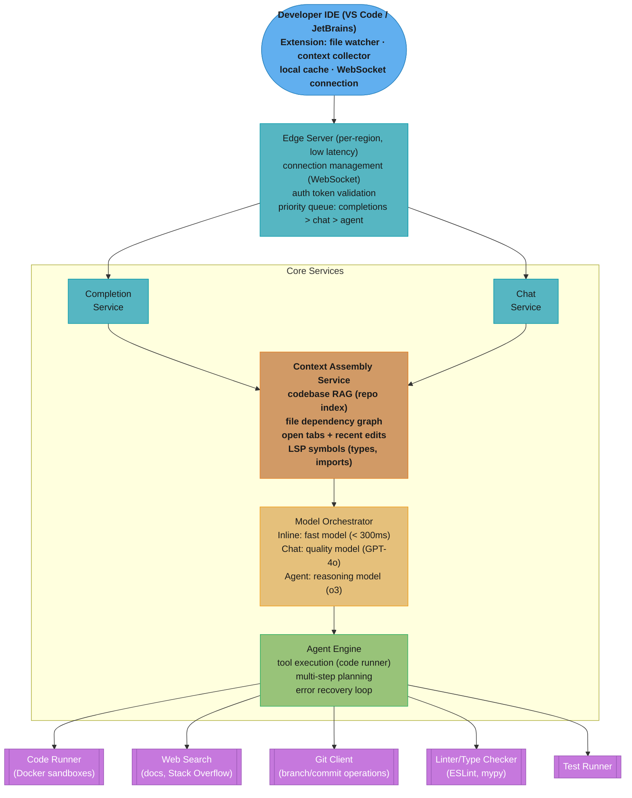
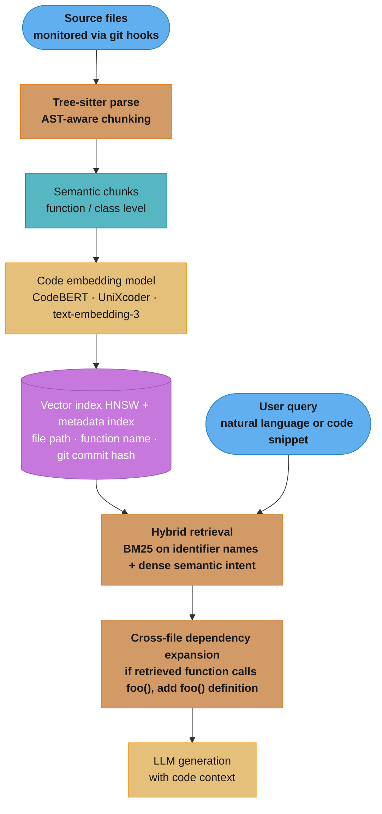

# Case Study: Design an AI Coding Assistant (Cursor/Devin-Style)

## Intuition

> **Design intuition**: An AI coding assistant (Cursor/Devin-style) has three distinct interaction modes with fundamentally different latency requirements: inline completions (300ms), chat (2-5s), and autonomous agents (minutes). Each mode requires different models, different context assembly, and different serving infrastructure.

**Key insight for this design**: The repository context problem is central — an LLM seeing only the current file gives poor completions; seeing the entire 500K-token codebase is expensive. The solution is a retrieval layer (embedding-based file selection + dependency graph analysis) that assembles the most relevant 20-50K token context for each request.

---

## 1. Requirements Clarification

### Functional Requirements
- Inline code completions as developer types (< 300ms)
- Chat interface for code questions, explanations, and refactoring
- Autonomous multi-file editing: "add unit tests for all functions in auth module"
- Codebase-aware: understands full repository structure and dependencies
- Multi-language: Python, JavaScript/TypeScript, Java, Go, Rust, C++
- Terminal integration: run commands, observe output, fix errors autonomously
- Git-aware: can create branches, make commits, generate PR descriptions
- Tool use: web search for documentation, run tests, linter feedback

### Non-Functional Requirements
- **Completion latency**: < 300ms for inline suggestions
- **Chat latency**: < 3s first token, complete in < 15s
- **Agent task latency**: minutes (autonomous tasks can take 2-30 minutes)
- **Privacy**: code stays local or in private tenant; no training on user code
- **Scale**: 500K developer seats; 5M completions/hour peak

### Out of Scope
- Code execution environment (use existing Docker/CI infrastructure)
- Version control hosting (use GitHub/GitLab)
- Code review approval workflows

---

## 2. Scale Estimation

### Traffic Estimates
```
Developer seats: 500K
Active at peak (10am-2pm): 30% = 150K concurrent developers
Completions per active developer per hour: 30 (after debounce/filtering)
Peak completion QPS: 150K × 30 / 3600 = 1,250 req/sec

Chat queries: 10/developer/hour
Peak chat QPS: 150K × 10 / 3600 = 416 req/sec

Agent tasks: 2/developer/day
Daily agent tasks: 500K × 2 = 1M tasks/day

Token estimates:
  Completion: 1,500 input + 40 output = 1,540 tokens
  Chat: 3,000 input + 500 output = 3,500 tokens
  Agent task: 10,000 input + 2,000 output per step × 10 steps = 120,000 tokens
```

### Context Budget
```
Codebase sizes:
  Small (startup): < 50K tokens
  Medium (scale-up): 50K-500K tokens
  Large (enterprise): 500K-5M tokens

Strategy by codebase size:
  < 50K tokens: put entire codebase in long context (Gemini 1.5 Pro or Claude 3.5)
  50K-500K tokens: smart RAG selection (top-20 most relevant files)
  > 500K tokens: strict RAG (top-10 files by relevance + dependency graph)
```

---

## 3. High-Level Architecture



Requests flow from the IDE extension through a per-region edge server whose priority queue orders completions (< 300ms budget) ahead of chat and agent traffic; both interactive services share one context assembly layer, and the agent engine fans out to five sandboxed tool services.

---

## 4. Component Deep Dives

### 4.1 Repository Indexing and RAG

```
Local index (built in IDE extension, lives on developer's machine):

What gets indexed:
  1. All source files (Python, JS, Java, etc.)
  2. Configuration files (package.json, requirements.txt, Dockerfile)
  3. Test files (important for agent tasks)
  4. README and documentation

Index structure (built with Tree-sitter AST parsing):
  Function index:
    {name, file_path, line_start, line_end, signature, docstring, body_hash}
  Class index:
    {name, file_path, methods[], parent_class, imports}
  Symbol index:
    {symbol, type (function/class/variable), defined_at, used_at[]}
  Import graph:
    {file → imports_from[]}  # for dependency traversal

Embedding index:
  Each function/class → embedded as code unit
  Stored in local FAISS index (SQLite backing)
  Index build time: 30-120 seconds for 1M lines of code
  Incremental update on file save: < 100ms

Query at completion time:
  1. Embed current code context (cursor surroundings)
  2. ANN search in local FAISS index
  3. Return top-10 relevant functions/classes
  4. Inject into prompt as "Related symbols from codebase"

Dependency graph traversal (for agent tasks):
  If editing users.py → also include: models/user.py, db/user_repository.py
  Traverse: import graph to find directly related files
  Max depth: 2 levels of imports (avoid context explosion)
```

### 4.2 Completion Service (< 300ms)

```
Tight latency budget breakdown:
  IDE debounce: 75ms (don't trigger on every keystroke)
  Network (edge PoP): 20ms RTT
  Context assembly (local index query): 10ms
  Prompt building: 5ms
  LLM inference: 150ms  ← must be fast
  Network return + render: 20ms
  Total: ~280ms

Model selection for completions:
  Requirement: fast inference, good code quality, FIM support
  Options:
    Codestral (Mistral, 22B, FIM-native): excellent
    DeepSeek-Coder-1.3B (quantized, local): 30ms but lower quality
    GPT-3.5-turbo: not FIM-native; slightly worse for mid-file completions
    Cursor uses: proprietary cursor-small for completions, GPT-4o for chat

Completion prompt (FIM format):
  <file_path>src/auth/users.py</file_path>
  <related_context>
  # From db/user_repository.py:
  def get_user_by_id(id: int) -> Optional[User]:
  def create_user(email: str, password_hash: str) -> User:
  </related_context>
  <prefix>
  def authenticate(email: str, password: str) -> Optional[str]:
      user = UserRepository.get_user_by_email(email)
      if user is None:
          return None
  </prefix>
  <suffix>
      return token
  </suffix>
  <mid>

  Expected completion: [code that verifies password and generates JWT token]

Local cache:
  LRU cache of recent completions by (file_hash, cursor_position)
  If file unchanged and cursor near same position → return cached
  Cache hit rate: 25% (saves 75ms + backend request)
```

### 4.3 Chat Service

```
Chat is where developers ask complex questions about their code.

Session context management:
  Window: current file (full) + conversation history (10 turns)
  Available budget: 128K context - current file - conversation
  Fill with: top-5 relevant codebase files from RAG

Special chat commands:
  @file src/auth.py → include entire file in context
  @folder src/api/  → include all files in folder (if fits in context)
  #explain          → trigger explanation template
  #refactor         → include refactoring guidelines in system prompt
  #tests            → set mode to test generation

Supported query types:
  Code explanation: "explain this function"
  Bug analysis: "why is this test failing?" + test output
  Refactoring: "refactor this to use the repository pattern"
  Documentation: "write docstrings for all public methods"
  Code review: "review this PR diff for issues"
  Architecture: "how should I structure the database layer?"

Chat prompt:
  [System]
  You are an expert software engineer with deep knowledge of {detected_languages}.
  The developer is working in a {repo_type} codebase.
  Provide clear, concise answers. Include code examples when helpful.
  When modifying code, show the full modified function (not just the changed part).

  [Codebase context]
  ... (top-5 relevant files from RAG) ...

  [Current file]
  ... (full current file if < 50K tokens) ...

  [Conversation]
  ... (last 10 messages) ...

  [User]
  {user_message}
```

### 4.4 Agent Engine (Autonomous Multi-File Editing)

The agent runs an observe → plan → act → reflect loop with tool use (pattern details: [ReAct and Reasoning Patterns](../agents_and_tool_use/react_and_reasoning_patterns.md)).

```
Agent tasks: "Add unit tests for all functions in the auth module"

This requires: planning, file operations, code generation, test running, error fixing.

Architecture: ReAct loop with tool use

Tools available to agent:
  read_file(path) → file content
  write_file(path, content) → apply edit
  create_file(path, content) → new file
  run_terminal(command) → stdout, stderr, exit_code
  search_codebase(query) → relevant symbols
  web_search(query) → documentation results
  git_status() → current changes
  git_commit(message) → commit changes

Agent loop:
  WHILE task_not_complete AND steps < max_steps:
    1. [Observe] Gather current state (files, test results, errors)
    2. [Plan] Reason about next action (chain-of-thought reasoning)
    3. [Act] Execute one tool call
    4. [Reflect] Observe result; update plan if unexpected

Example execution for "add unit tests for auth module":

Step 1: search_codebase("auth module functions")
  → Found: authenticate(), create_user(), refresh_token() in auth/users.py

Step 2: read_file("auth/users.py")
  → Read file; understand function signatures and logic

Step 3: read_file("tests/test_auth.py")
  → File exists; currently has 2 tests; need to add 10 more

Step 4: web_search("pytest unit testing auth JWT tokens best practices")
  → Found: patterns for mocking JWT, testing edge cases

Step 5: write_file("tests/test_auth.py", [new content with all tests])
  → File written

Step 6: run_terminal("pytest tests/test_auth.py -v")
  → 8/12 tests pass; 4 fail: TypeError on mock_db fixture

Step 7: [Analyze failure] → understand fixture setup issue

Step 8: write_file("tests/test_auth.py", [fixed content])
  → Updated conftest.py fixture usage

Step 9: run_terminal("pytest tests/test_auth.py -v")
  → 12/12 tests pass

Step 10: git_commit("Add comprehensive unit tests for auth module")
  → Committed

Task complete. Summary: Added 10 unit tests, fixed fixture issue, all passing.

Model for agent tasks:
  Use: Claude 3.5 Sonnet, GPT-4o, or o3 (for complex planning)
  o3/o4 preferred: reasoning models handle multi-step planning better
  Each agent step: 1-2 LLM calls
  Average task: 10-20 steps = 20-40 LLM calls per agent task
```

### 4.5 Code Execution Sandbox

Isolation requirements and escape vectors are covered in depth in [Sandboxed Code Execution](../agents_and_tool_use/sandboxed_code_execution.md).

```
Agent runs terminal commands → must be secure, isolated, controlled.

Sandbox architecture (Docker-based):
  Per agent task: dedicated container
    Image: base language image + project dependencies
    Resources: 2 CPU, 4GB RAM, 10GB disk
    Network: isolated (no outbound except package registries)
    Timeout: 30 minutes max per agent task

Container lifecycle:
  Task start → create container (warm pool of pre-created containers)
  Code changes → sync files to container via volume mount
  Terminal command → exec in container → capture stdout/stderr
  Task complete → destroy container

Warm container pool:
  Pre-create 100 containers per language (Python, Node, Java, Go)
  Container creation takes 5-10 seconds → warm pool = instant start
  Auto-scale pool based on agent task queue depth

Security constraints:
  No: outbound network to arbitrary hosts (only npm/pypi/maven registries)
  No: privileged operations (no sudo, no /proc access)
  No: access to host filesystem (volume mount is isolated project copy)
  Rate limit: 100 commands per task (prevent infinite loops)

Output handling:
  Stdout/stderr: streamed to agent and developer in real time
  Large outputs (test logs): truncated to last 5,000 characters
  Exit codes: non-zero triggers agent error analysis
```

---

## 5. Privacy Architecture

```
Enterprise requirements: code never leaves the company network

Deployment modes:
  1. Cloud (default): code sent to API (encrypted in transit, not stored)
  2. Private Cloud: deploy assistant in customer's VPC (AWS/GCP/Azure)
  3. On-premise: full deployment in customer data center

For on-premise / private cloud:
  Self-hosted LLMs: Llama 3 70B or Qwen-Coder-32B
  Local inference: vLLM cluster inside customer network
  Local index: FAISS index on developer's machine or local server
  No external API calls: Bing search replaced with internal docs
  Audit log: stored in customer's own storage

Code handling policy:
  - Code snippets: used for inference, not stored after response
  - No training: user code never used to train or fine-tune models
  - Embeddings: computed locally (IDE extension), not sent to cloud
  - BAA available: for HIPAA-covered code (e.g., healthcare companies)
```

---

## 6. Quality Metrics

```
Completion quality:
  Acceptance rate: accepted / shown (target > 30%)
  Edit distance: chars changed in accepted suggestion (lower = better)
  "Kept as is" rate: suggestion accepted without any edits (target > 20%)

Chat quality:
  Developer satisfaction: thumbs up/down feedback (target > 80% positive)
  Code correctness: does suggested code compile/run? (tracked async)
  Hallucination rate: code references non-existent functions

Agent quality:
  Task completion rate: % of agent tasks fully completed (target > 70%)
  Human intervention rate: % that required developer fixes
  Test pass rate: % of generated code that passes tests on first try
  Lines of code generated per task: productivity metric

Latency SLOs:
  Completion P95 < 300ms
  Chat first-token P95 < 2s
  Agent step P95 < 10s

Codebase index quality:
  Index coverage: % of symbols indexed vs total
  RAG recall: % of relevant files found for sample queries
  Index freshness: time since last update < 5 seconds
```

---

## 7. Trade-offs and Design Decisions

| Decision | Chosen | Alternative | Reason |
|----------|--------|-------------|--------|
| Completion model | Codestral 22B (FIM-native) | GPT-3.5 | FIM-native gives better mid-file completions |
| Context collection | Hybrid (local FAISS + LSP) | Pure embedding RAG | LSP gives precise type info; FAISS for semantic |
| Repo index | Local (developer machine) | Remote server | Zero latency; privacy (code stays local) |
| Agent model | Claude 3.5 Sonnet / o3 | Smaller models | Agent tasks need strong reasoning; cost acceptable |
| Sandbox | Docker (warm pool) | VM | Container start time 100ms (warm); VM = 30s |
| Network access | IDE WebSocket persistent | HTTP polling | Low latency; instant push; efficient |
| Privacy | On-premise option | Cloud only | Enterprise requirement; enables regulated industries |

---

## 8. Interview Discussion Points

**Why local embedding index beats remote for completions.** At < 300ms total budget, a round-trip to a remote vector DB (50ms+ latency) would consume 17% of the budget before inference. Local FAISS queries in < 5ms. The downside: index must be maintained on developer's machine and kept in sync. For code that changes frequently, incremental updates on file save keep the index fresh.

**The agent reliability problem.** The hardest challenge isn't generating code — it's ensuring the agent doesn't make wrong assumptions, break working code, or loop endlessly. Mitigations: (1) always run tests after changes; (2) use git to checkpoint before each agent task (easy rollback); (3) surface all changes to developer before committing; (4) set hard limits (max steps, max file edits).

**Why multi-model architecture?** Completions need speed (Codestral); chat needs quality (GPT-4o); agent tasks need planning (o3/Claude). Using one model for all three would mean: either too slow for completions (GPT-4o) or too weak for agent planning (small model). The 10ms routing decision unlocks 10× cost optimization.

**Latency-accuracy trade-off in FIM.** Providing more context (open tabs, dependency files) improves completion quality but adds tokens and increases latency. Cursor's empirical finding: beyond 1,500 tokens of context, completion quality improvement is marginal but latency increases linearly. The context budget is a product decision, not just a technical one.

**Agent scope limitation.** Unlike Devin (tries to fully autonomously complete engineering tasks), a coding assistant should work in tight collaboration: propose changes → show diff → require approval → apply. This "human-in-the-loop" design sacrifices some autonomy for safety and trust. Most enterprise teams prefer assisted autonomy over full autonomy.

---

## Context Window Management for Large Codebases

A coding assistant serving a monorepo with 500,000 files cannot embed the entire codebase in the context window. The challenge is selecting the right 1,500-4,000 tokens of code context from millions of available tokens.

**Context prioritization algorithm:**

```python
from dataclasses import dataclass, field
from pathlib import Path
import tree_sitter

@dataclass
class ContextSlot:
    content: str
    token_count: int
    priority: int  # 1 = highest priority
    source: str

def build_context_window(
    cursor_file: str,
    cursor_line: int,
    open_tabs: list[str],
    workspace_root: str,
    token_budget: int = 3000,
) -> list[ContextSlot]:
    slots: list[ContextSlot] = []

    # Priority 1: Cursor-adjacent code (800 tokens)
    cursor_context = extract_cursor_adjacent(cursor_file, cursor_line, token_budget=800)
    slots.append(ContextSlot(cursor_context, 800, 1, "cursor_adjacent"))

    # Priority 2: Current file outline (200 tokens: function signatures, class names)
    outline = extract_file_outline(cursor_file)  # tree-sitter AST traversal
    slots.append(ContextSlot(outline, 200, 2, "file_outline"))

    # Priority 3: Open tabs (500 tokens total, most recent first)
    tab_budget = 500
    for tab_path in sorted(open_tabs, key=lambda p: get_last_access(p), reverse=True):
        if tab_path == cursor_file:
            continue
        tab_outline = extract_file_outline(tab_path)
        tab_tokens = count_tokens(tab_outline)
        if tab_budget >= tab_tokens:
            slots.append(ContextSlot(tab_outline, tab_tokens, 3, f"open_tab:{tab_path}"))
            tab_budget -= tab_tokens

    # Priority 4: RAG-retrieved imports and dependencies (remaining budget)
    remaining = token_budget - sum(s.token_count for s in slots)
    if remaining > 200:
        deps = retrieve_dependency_signatures(cursor_file, workspace_root, token_budget=remaining)
        slots.append(ContextSlot(deps, remaining, 4, "dependency_signatures"))

    return slots
```

---

## Tree-Sitter AST-Based Chunking

Standard text chunking (by character count or line count) splits code at syntactically meaningless points. Tree-sitter parses code into a concrete syntax tree and enables semantically-aware chunking:

```python
from tree_sitter import Language, Parser
from tree_sitter_languages import get_language, get_parser

def extract_semantic_chunks(
    source_code: str,
    language: str,  # "python", "typescript", "rust", etc.
    max_chunk_tokens: int = 512,
) -> list[dict]:
    """Split code into semantically complete chunks using AST boundaries."""
    parser = get_parser(language)
    tree = parser.parse(source_code.encode("utf-8"))

    chunks = []
    root_node = tree.root_node

    for node in root_node.children:
        node_text = source_code[node.start_byte:node.end_byte]
        token_count = count_tokens(node_text)

        if node.type in ("function_definition", "class_definition",
                          "function_declaration", "method_definition"):
            if token_count <= max_chunk_tokens:
                chunks.append({
                    "content": node_text,
                    "type": node.type,
                    "start_line": node.start_point[0] + 1,
                    "end_line": node.end_point[0] + 1,
                    "tokens": token_count,
                })
            else:
                # Large function: split by inner logical blocks (docstring + signature + body)
                chunks.extend(split_large_function(node, source_code, max_chunk_tokens))

    return chunks

# Result: chunks are always syntactically complete (no cut-off class bodies or function signatures)
# This improves embedding quality by 15-20% on code retrieval benchmarks vs character-based chunking
```

---

## Code-Specific RAG Architecture

Code RAG differs from document RAG (baseline pipeline: [RAG Fundamentals](../rag_fundamentals/README.md)) in three key ways: (1) code has structure (AST) not present in prose; (2) code has dependencies (imports, function calls) that cross file boundaries; (3) code changes frequently (every git commit may invalidate embeddings for modified files).



The indexing path (git hooks → tree-sitter → embeddings) keeps chunks syntactically complete; at query time hybrid retrieval merges BM25 identifier matches with dense semantic matches, then dependency expansion pulls in the definitions of called functions so the LLM never sees a call site without its callee.

**Incremental re-indexing via git hooks:**

```python
import subprocess
from pathlib import Path

def get_changed_files_since_last_index(last_indexed_commit: str) -> list[str]:
    """Use git diff to find files modified since last index run."""
    result = subprocess.run(
        ["git", "diff", "--name-only", last_indexed_commit, "HEAD"],
        capture_output=True, text=True,
    )
    return [f for f in result.stdout.strip().split("\n") if f.endswith((".py", ".ts", ".java", ".go"))]

def incremental_reindex(workspace_root: str, vector_db, last_indexed_commit: str) -> str:
    changed = get_changed_files_since_last_index(last_indexed_commit)
    for file_path in changed:
        source = Path(workspace_root, file_path).read_text()
        chunks = extract_semantic_chunks(source, detect_language(file_path))
        # Delete old chunks for this file, insert new ones
        vector_db.delete(filter={"file_path": file_path})
        for chunk in chunks:
            embedding = embed_code(chunk["content"])
            vector_db.upsert(chunk["id"], embedding, metadata={**chunk, "file_path": file_path})
    return subprocess.run(["git", "rev-parse", "HEAD"], capture_output=True, text=True).stdout.strip()
```

---

## Security Scanning Integration

A coding assistant that can generate and apply code must not introduce security vulnerabilities. Integrating security scanning into the generation pipeline:

```python
import subprocess
import json
from typing import Literal

ScanTool = Literal["bandit", "semgrep", "gitleaks"]

def scan_generated_code(
    code: str,
    language: str,
    tools: list[ScanTool] = ["semgrep"],
) -> dict:
    """Run static analysis on generated code before presenting to user."""
    import tempfile, os
    with tempfile.NamedTemporaryFile(
        mode="w",
        suffix={"python": ".py", "typescript": ".ts", "java": ".java"}.get(language, ".txt"),
        delete=False,
    ) as f:
        f.write(code)
        tmp_path = f.name

    findings = []
    try:
        if "semgrep" in tools:
            result = subprocess.run(
                ["semgrep", "--config=auto", "--json", tmp_path],
                capture_output=True, text=True, timeout=10,
            )
            semgrep_output = json.loads(result.stdout)
            findings.extend([
                {
                    "tool": "semgrep",
                    "rule": r["check_id"],
                    "severity": r["extra"]["severity"],
                    "message": r["extra"]["message"],
                    "line": r["start"]["line"],
                }
                for r in semgrep_output.get("results", [])
            ])
    finally:
        os.unlink(tmp_path)

    return {
        "has_findings": len(findings) > 0,
        "critical_count": sum(1 for f in findings if f["severity"] == "ERROR"),
        "findings": findings,
    }

# Usage in code generation pipeline:
def generate_code_with_security_check(prompt: str, client) -> dict:
    generated = generate_code(prompt, client)
    scan_result = scan_generated_code(generated["code"], generated["language"])
    if scan_result["critical_count"] > 0:
        # Re-prompt with security findings
        fixed = generate_code_with_security_context(prompt, generated["code"], scan_result, client)
        return {**fixed, "security_scan": scan_generated_code(fixed["code"], fixed["language"])}
    return {**generated, "security_scan": scan_result}
```

---

## Failure Scenarios and Recovery

**Failure 1 — Agent Infinite Loop Overwriting Production Configuration Files**

A coding agent tasked with "update the database configuration for the new region" entered a loop: it read the config, generated an update, wrote the file, then re-read the file and determined it still needed updating (because the region endpoint format was different from what it expected). After 8 iterations, it had overwritten the config file 8 times and corrupted the format. No human review gate existed for file writes.

**Detection:** CI pipeline failed after the agent's commit triggered a config validation job. By the time detection occurred, the config had been committed and pushed.

**Recovery:** Revert to the last good commit using `git revert`. Added a mandatory human approval step for any file write in the `config/`, `infrastructure/`, and `secrets/` directories. Added a git diff preview step before any commit: the agent proposes the diff, the engineer approves, then the commit is made.

**Failure 2 — Code RAG Retrieving Outdated API Signatures After Library Upgrade**

The team upgraded from SQLAlchemy 1.4 to 2.0. The code RAG index still contained 50,000 cached chunks from the old codebase with `session.execute(text(sql), params)` (SQLAlchemy 1.4 API). After the upgrade, the assistant continued generating deprecated API calls, which caused runtime errors. The RAG index was not invalidated on library version changes.

**Fix:** Added a dependency hash to the index metadata. When `requirements.txt` or `pyproject.toml` changes, invalidate all chunks that reference changed packages by re-indexing all files that import those packages.

---

## Additional Interview Questions

**How do you design context window management for an agent that needs to operate on a file that is longer than the context window?** Use a sliding window with overlap: divide the file into chunks with 20% overlap between adjacent chunks (so that code at chunk boundaries appears in both chunks). The agent processes each chunk independently but maintains a persistent "state object" across chunks: a running summary of: (1) functions and classes seen; (2) variables modified; (3) pending tasks. At each chunk, the state object is prepended to the context window as a compact summary (~200 tokens). This allows the agent to maintain coherence across a 100,000-token file using a 4,000-token context window, at the cost of multiple LLM passes.

**How does tree-sitter AST-based chunking improve code RAG quality compared to character-based chunking?** Character-based chunking cuts at arbitrary positions — potentially in the middle of a function, between a method signature and its body, or between a class definition and its methods. When these malformed chunks are embedded and retrieved, the embedding model cannot produce a meaningful representation of an incomplete code fragment, reducing retrieval accuracy by 15-20% on code search benchmarks. Tree-sitter ensures every chunk is a syntactically complete unit (a function, a class, a method), which produces coherent embeddings and prevents context fragments from being retrieved that are meaningless in isolation.

**What is the agent reliability gap between "Devin-style" full autonomy and "Copilot Chat-style" assisted generation, and when should each be used?** Full autonomy agents (Devin, SWE-agent) can complete multi-step engineering tasks without human checkpoints but fail on ~70% of SWE-bench tasks even at state-of-the-art (as of 2024) and can introduce subtle bugs that only appear at runtime. Assisted generation (Copilot Chat, Cursor) shows the diff before applying changes, requires human approval, and achieves near-100% accuracy on the specific change the human requested because the human validates it. In production codebases, full autonomy is appropriate for low-risk tasks (writing tests for existing functions, generating boilerplate, updating documentation); assisted generation is required for any change that modifies business logic, database schemas, or security-sensitive code.

**How do you implement "explain this code" across multiple files with dependency traversal?** When the user highlights a function and asks "explain this," the system: (1) extracts the function's AST using tree-sitter; (2) identifies all external symbols called within the function (function calls, class references, global variables); (3) resolves each symbol to its definition file via the language server protocol (LSP) using `textDocument/definition`; (4) retrieves the signatures (not full bodies) of all direct dependencies; (5) builds a context window with the target function + dependency signatures. This produces an explanation that correctly describes what `process_payment()` does even when it calls `stripe_client.charge()` from a third-party library — the function's signature is retrieved and included, so the LLM understands the interface even without the implementation.

**How would you handle code generation for a user who is a beginner vs an expert, and can the system auto-detect the user's level?** Auto-detect expertise from: (1) query vocabulary (beginners use natural language descriptions; experts use technical terms like "O(n log n)" or "thread-safe"); (2) code they've written in open tabs (indentation style, comment density, naming conventions, use of advanced constructs like generators, decorators); (3) acceptance patterns (beginners accept longer, more commented explanations; experts accept concise completions and edit them). Generate different outputs per segment: beginners get code with inline comments explaining each step; experts get idiomatic, concise code with no explanatory comments. Fine-tune the output style by storing per-user expertise score (0-100) in the user profile, updated with each interaction.

---

## Production Failure Scenarios

### Incident: Agent Overwrites Correct Code with Regression

**What happened:** A SWE-agent tasked with "fix the failing unit tests in the auth module" identified a test that asserted `token_expiry = 3600` seconds. The test was failing because a recent PR had changed expiry to 7200 seconds. The agent, treating the test as the source of truth, reverted the code to 3600 seconds — reintroducing a security bug that had been intentionally fixed (shorter tokens are less secure per the security team's updated policy). The agent had no way to know that the test was stale, not the code.

**Root cause:** The agent was given test failures as the ground truth without the ability to consult the PR history or security team's decision rationale.

**Fix applied:**
```python
def should_modify_production_code_to_pass_test(
    failing_test: TestCase,
    proposed_code_change: CodeChange,
    git_client: GitClient,
) -> tuple[bool, str]:
    """
    Check if the test itself may be stale before modifying code to pass it.
    """
    # Check if the test was last modified before the code it tests
    test_last_modified = git_client.get_last_modified_date(failing_test.file_path)
    code_last_modified = git_client.get_last_modified_date(proposed_code_change.target_file)

    if test_last_modified < code_last_modified:
        # Code was modified more recently than the test — test may be stale
        # Require human confirmation before modifying code to match old test
        return False, (
            f"Test was last modified {test_last_modified}, but the code was modified "
            f"{code_last_modified}. The test may be stale. Please confirm whether to "
            f"update the test or revert the code."
        )
    return True, "Test is current — safe to modify code to pass test."
```

**Prevention:** Agents that modify code to pass tests must verify recency: if the code under test was modified more recently than the test, the test is potentially stale. Require explicit human confirmation before reverting newer code to satisfy older tests.

---

### Capacity Planning Math (4,000 engineers, internal deployment)

```
Request rate estimation:
  4,000 engineers × avg 8 active coding hours/day
  Completion requests: 1 per 3 seconds = 20/min × 480 min = 9,600/day/engineer
  Total daily completions: 4,000 × 9,600 = 38.4M completions/day
  Chat requests (Copilot Chat-style): 4,000 × 40 chats/day = 160,000/day
  Agent tasks (multi-step): 4,000 × 2 tasks/day = 8,000 long-running tasks/day

Completion serving (FIM model, CodeLlama-7B):
  Peak rate: 38.4M / (8h × 3600s) = 1,333 completions/sec peak
  CodeLlama-7B on A10G: 350 FIM completions/sec at p99 < 150ms
  Required A10Gs: 1,333 / 350 = 4 A10Gs (with 2× headroom: 8 A10Gs)
  Cost: 8 × $1.10/hr × 24 × 365 = $77,000/year

Chat serving (GPT-4o via Azure OpenAI):
  160,000 chats/day × avg 2,000 tokens output × $0.015/1k = $4,800/day = $1.75M/year

Agent serving (Claude Sonnet 3.5, avg 15k tokens/task):
  8,000 tasks/day × 15,000 tokens × $0.003/1k = $360/day = $131K/year

Total AI infrastructure cost: ~$2M/year for 4,000 engineers
Cost per engineer: $500/year ($42/month) vs $19/month Copilot — 2.2× premium
Justification: self-hosted means no code leaves the VPC, critical for proprietary code

Semantic cache for completions (identical context within 60-second window):
  Hit rate: 12% (coders repeat similar patterns within a session)
  Savings: 38.4M × 0.12 × $0.0001 (embedding cost only — model is self-hosted) = $461/day
  Minor savings: cache is more valuable for reducing latency variance than cost here
```

---

### Additional Interview Q&As

**Q: How do you ensure the coding assistant does not suggest deprecated APIs or insecure patterns?**
Three-layer approach: (1) fine-tuning exclusion: filter training data to exclude files that use deprecated APIs or known insecure patterns (e.g., `eval()`, `MD5`, `DES` cipher, `pickle.load` from untrusted sources); (2) output post-processing: a static analysis pass on every generated code block using tools like semgrep or Bandit (Python), SpotBugs (Java) — if a security rule fires, the suggestion is blocked and a warning is returned; (3) retrieval-augmented generation with an internal "secure coding guidelines" knowledge base — the prompt includes the team's security standards, which the model uses to prefer secure alternatives. Layer (2) is mandatory; layers (1) and (3) are enhancements that improve proactive avoidance.

**Q: How would you build a feedback loop that improves the coding assistant from user corrections?**
RLHF-style feedback collection: (1) when a user accepts a completion then immediately modifies it within 10 keystrokes, log the `{original_completion, user_edit, context}` as a training signal; (2) when a user edits a completion, the diff between the completion and the final user version is the "preference" — the edited version is preferred; (3) collect at least 50,000 such preference pairs before fine-tuning; (4) use DPO (Direct Preference Optimization) to fine-tune the FIM model on this preference data — no reward model needed, lower training cost than PPO-based RLHF; (5) validate with A/B test: compare acceptance rate of fine-tuned model vs. base model on a holdout set of users. Expected improvement: 3-5 pp acceptance rate gain per fine-tuning cycle with high-quality preference data.
