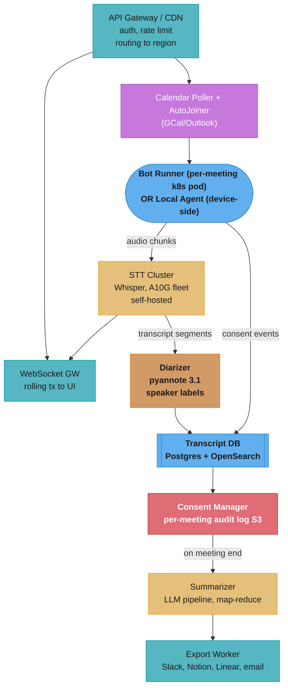

# Case Study: Design an AI Meeting Assistant

## Intuition

> **Design intuition**: An AI meeting assistant is a court stenographer plus analyst embedded invisibly in every meeting — the challenge is doing it in real-time with millisecond audio segments, then synthesizing hours of conversation into two paragraphs that someone actually acts on.

**Key insight for this design**: Two fundamentally different architectural choices — bot-in-meeting versus local-process capture — produce completely different privacy postures, cost structures, and latency profiles. Every major design decision downstream (STT hosting, consent management, diarization approach, GPU fleet sizing) is dictated by which capture path you choose. A system that tries to support both without clear boundaries ends up with neither the cost advantage of local-process nor the platform breadth of the bot approach.

The core tension is not "how do we transcribe audio" — Whisper and its competitors have solved that — but "how do we make something genuinely useful come out of 45 minutes of human conversation, at a cost that allows a sustainable business, while remaining legally defensible in every jurisdiction where we operate."

---

## 1. Requirements Clarification

### Functional Requirements
- Real-time transcription displayed as a rolling transcript to the meeting host with less than 3 seconds of display lag from the moment speech occurs
- Speaker diarization: each transcript line attributed to a named participant (resolved from calendar invite or voice enrollment)
- Automatic action item extraction: owner, task description, optional due date extracted from natural language during or after the meeting
- Post-meeting summary: executive summary (3 sentences maximum), key decisions, open questions
- Searchable meeting history: full-text search across all past transcripts within a workspace
- Calendar integration: automatic join for scheduled meetings (Google Calendar, Outlook) without user intervention
- Export integrations: push action items to Slack, Notion, Linear, Jira; meeting summaries to email or Confluence
- Multi-platform bot support (bot-in-meeting path): Zoom, Google Meet, Microsoft Teams

### Non-Functional Requirements
- Transcription display latency: word visible on screen within 3 seconds of being spoken (p95)
- Post-meeting summary generation: complete within 30 seconds of meeting end
- Availability during active meetings: 99.9% (a dropped meeting cannot be recovered — the moment is gone)
- GDPR compliance: affirmative per-participant consent captured and auditable; participant opt-out honored within 60 seconds
- SOC 2 Type II certification required for enterprise sales
- Tenant isolation: no cross-workspace data access; transcripts encrypted at rest with per-tenant KMS keys

### Out of Scope
- Video recording and video playback (audio transcription only)
- Live translation between languages (addressed in design_real_time_translation.md)
- Phone call transcription (PSTN integration has distinct regulatory requirements)
- Custom wake-word or voice command UI

---

## 2. Scale Estimation

### Traffic Model
```
DAU:                            5,000,000
Avg meetings per user per day:  3
Avg meeting duration:           45 minutes = 0.75 hours
Total meeting-hours per day:    5M x 3 x 0.75 = 11.25M audio-hours/day

Peak concurrency estimate:
  5M DAU x 3 meetings/day x 45 min/meeting = 675M user-minutes/day
  / 1,440 min/day = 468,750 concurrent meeting streams at steady average
  Peak factor (business hours concentration): 2.5x
  Peak concurrent streams: 468,750 x 2.5 = 1,171,875 streams
  Round to planning target: 1.2M concurrent streams at business-hour peak
```

### STT GPU Sizing
```
Model: Whisper large-v3 on NVIDIA A10G (24 GB)
Real-time factor: 50x  (50 minutes of audio processed per GPU-minute)
Each GPU handles 50 concurrent 1x real-time audio streams

Required GPUs at peak:
  1,200,000 concurrent streams / 50 rt-factor = 24,000 A10Gs
  At 70% target utilization: 24,000 / 0.70 = 34,286 A10Gs

Cost at $1.30/GPU-hour (spot, us-east-1):
  34,286 x $1.30 = $44,572/hour
  x 8 peak hours/day + 16 off-peak hours at 30% load:
  ($44,572 x 8) + ($44,572 x 0.30 x 16) = $356,576 + $213,946 = $570,522/day

Note: self-hosted STT at $0.0004/audio-min vs API (Whisper API: $0.006/min)
  API cost: 11.25M hours x 60 min/hour x $0.006 = $4,050,000/day -- not viable
  Self-hosted: 11.25M hours x 60 min x $0.0004 = $270,000/day -- 15x cheaper
```

### LLM Summarization Cost
```
Summarization model: GPT-4o-mini at $0.0005/1K output tokens
Avg transcript: 6,000 words -> 8,000 tokens input, 400 tokens output (summary)
Map-reduce overhead for long meetings: 2x multiplier on average
Effective output tokens per meeting: 800 tokens
Daily meetings: 5M users x 3 = 15M meetings/day
Daily output tokens: 15M x 800 = 12B tokens
Cost: 12B / 1M x $0.50 = $6,000/day (manageable)
```

### Storage
```
Transcript text per meeting:       ~50 KB (45 min at ~180 words/min)
Summary per meeting:               ~5 KB
Daily transcript volume:           15M meetings x 50 KB = 750 GB/day
Daily summary volume:              15M x 5 KB = 75 GB/day
Retention: 3 years for enterprise, 1 year for free tier
3-year storage (enterprise 20% of users):
  750 GB/day x 365 x 3 x 0.20 = 164 TB (transcripts)
  + cold storage for audio WAV if retained: 45 min x 16 kHz x 2 bytes = 86 MB/meeting
    -> 15M x 86 MB x 0.20 retention = 258 PB -- audio not retained by default
```

---

## 3. High-Level Architecture

### Two Capture Paths

```
BOT-IN-MEETING PATH (Fireflies, Otter.ai)
-----------------------------------------
User's Zoom/Meet/Teams
        |
        | (Zoom SDK / bot joins as participant)
        v
  +------------------+
  |   Bot Server     |  <-- Kubernetes pod per active meeting
  |  (bot-runner)    |      captures mixed system audio stream
  +------------------+
        |
        | audio chunks (16 kHz PCM, 5s intervals)
        v
  +------------------+     +--------------------+
  |   VAD Filter     | --> |   STT Service      |
  | (Silero VAD)     |     | (Whisper large-v3, |
  +------------------+     |  self-hosted)      |
                           +--------------------+
                                    |
                           rolling transcript segments
                                    |
                                    v
                           +--------------------+
                           |  Transcript Store  |
                           | (Postgres + S3)    |
                           +--------------------+
                                    |
                           +--------------------+
                           |  LLM Pipeline      |
                           | (post-meeting)     |
                           +--------------------+
                                    |
                           +--------------------+
                           |  Delivery Layer    |
                           | (WebSocket to UI,  |
                           |  Slack/Notion push)|
                           +--------------------+


LOCAL-PROCESS PATH (Granola, macOS / Windows)
----------------------------------------------
CoreAudio (macOS) or WASAPI (Windows)
        |
        | per-process audio taps (Zoom audio, mic separately)
        v
  +------------------+
  |  Local Agent     |  <-- native app, runs on user machine
  |  (Swift / Rust)  |
  +------------------+
        |
        | VAD-filtered speech segments only
        | (raw audio NEVER leaves device)
        v
  +------------------+     +--------------------+
  |  Local VAD       | --> |   STT API call     |
  | (WebRTC VAD or   |     | (cloud Whisper or  |
  |  Silero on-dev)  |     |  local whisper.cpp)|
  +------------------+     +--------------------+
                                    |
                           transcript text only
                                    |
                                    v
                           +--------------------+
                           |  LLM Pipeline      |
                           | (GPT-4o-mini API   |
                           |  or Claude Haiku)  |
                           +--------------------+
                                    |
                           summary, action items
                                    v
                           +--------------------+
                           |  Local App UI +    |
                           |  Cloud Sync (opt.) |
                           +--------------------+
```

### Full System Component Map



Audio flows from the bot runner (or local agent) into the self-hosted Whisper STT cluster, then through diarization into the transcript store, while consent events from the capture layer land in the same store; the consent manager gates the on-meeting-end summarize-and-export chain.

See [./cross_cutting/streaming_at_scale.md](./cross_cutting/streaming_at_scale.md) for WebSocket fan-out patterns used in the delivery layer.

---

## 4. Component Deep Dives

### 4a. StreamingTranscriber — Sliding-Window Whisper

Whisper is an offline model: it processes a complete audio file and returns a single transcript. Naively sending audio in fixed non-overlapping 5-second chunks produces word-boundary artifacts — words split mid-phoneme at the chunk edge are misrecognized, and acoustic context is lost at every boundary.

**Broken approach — fixed non-overlapping chunks:**

```python
# BROKEN: 5-second hard cuts destroy word boundary accuracy
async def transcribe_broken(audio_stream):
    buffer = bytearray()
    async for chunk in audio_stream:
        buffer.extend(chunk)
        if len(buffer) >= SAMPLE_RATE * 5 * 2:  # 5s at 16kHz, 16-bit
            text = await whisper.transcribe(bytes(buffer))  # loses context
            yield text
            buffer.clear()  # discard everything -- no overlap
```

Words at the 5-second boundary are split mid-utterance. "action item" spoken across a boundary becomes "action" in one chunk and "item" in the next, each missing acoustic context, causing "action" to be misheard as "actionable" and "item" to be dropped entirely. WER at chunk boundaries is 3-5x higher than at mid-chunk positions.

**Fix — sliding 30-second window with 5-second advance and deduplication:**

```python
import asyncio
from dataclasses import dataclass, field
from collections import deque
from typing import AsyncIterator
import numpy as np

SAMPLE_RATE = 16_000
BYTES_PER_SAMPLE = 2  # 16-bit PCM
WINDOW_SECS = 30
ADVANCE_SECS = 5
OVERLAP_SECS = WINDOW_SECS - ADVANCE_SECS  # 25s of acoustic context retained


@dataclass
class TranscriptSegment:
    start_ms: int
    end_ms: int
    text: str
    speaker_id: str
    confidence: float


class StreamingTranscriber:
    def __init__(self, whisper_client, diarizer) -> None:
        self.whisper = whisper_client
        self.diarizer = diarizer
        self._ring: deque[tuple[bytes, int]] = deque()  # (chunk_bytes, start_ms)
        self._last_committed_ms: int = 0
        self._window_start_ms: int = 0

    async def feed_audio(
        self, chunk: bytes, timestamp_ms: int
    ) -> list[TranscriptSegment]:
        self._ring.append((chunk, timestamp_ms))
        self._trim_ring()

        window_audio = self._assemble_window()
        window_duration_ms = (
            len(window_audio) // BYTES_PER_SAMPLE / SAMPLE_RATE * 1000
        )
        if window_duration_ms < ADVANCE_SECS * 1000:
            return []  # not enough audio yet

        raw = await self.whisper.transcribe(
            audio=window_audio,
            language="en",
            word_timestamps=True,
            temperature=0.0,
        )
        labels = await self.diarizer.label(window_audio, raw)
        new_segments = self._dedup_and_emit(raw, labels)
        if new_segments:
            self._last_committed_ms = new_segments[-1].end_ms
        return new_segments

    def _trim_ring(self) -> None:
        # Keep only last WINDOW_SECS of audio in the ring buffer
        cutoff_ms = self._ring[-1][1] - WINDOW_SECS * 1000
        while self._ring and self._ring[0][1] < cutoff_ms:
            self._ring.popleft()

    def _assemble_window(self) -> bytes:
        return b"".join(chunk for chunk, _ in self._ring)

    def _dedup_and_emit(
        self, raw_segments: list, speaker_labels: dict[int, str]
    ) -> list[TranscriptSegment]:
        # Only emit segments whose start_ms is beyond last committed position
        # This prevents re-emitting words covered by the overlap region
        return [
            TranscriptSegment(
                start_ms=s.start_ms,
                end_ms=s.end_ms,
                text=s.text.strip(),
                speaker_id=speaker_labels.get(s.start_ms, "UNKNOWN"),
                confidence=s.confidence,
            )
            for s in raw_segments
            if s.start_ms > self._last_committed_ms and s.text.strip()
        ]
```

The 25-second overlap means every word is covered by at least two transcription passes. The `_dedup_and_emit` method uses the `_last_committed_ms` cursor to emit each word exactly once while benefiting from the wider acoustic context window.

### 4b. SpeakerDiarizer — Who Said What

Speaker diarization assigns each transcript segment to a named participant. The challenge differs fundamentally between the two capture paths.

In **bot-in-meeting mode**, all participant audio arrives in a single mixed stream. Diarization must separate N speakers from one channel using only acoustic cues (voice embeddings via ECAPA-TDNN). This is hard: when three people speak simultaneously, diarization error rate (DER) rises from a typical 5% to 35%+.

In **local-process mode** on macOS, CoreAudio's process audio tapping provides separate streams — the Zoom process audio (remote participants) and the local microphone (host) are already separated. This gives local-process a structural diarization advantage that cannot be replicated in bot mode.

```python
from dataclasses import dataclass
from typing import Optional
import numpy as np

COSINE_THRESHOLD = 0.85  # empirically tuned on internal test set
ENROLLMENT_WINDOW_S = 30  # first 30 seconds used for speaker enrollment


@dataclass
class SpeakerProfile:
    name: str
    embedding: np.ndarray  # 192-dim ECAPA-TDNN embedding
    enrolled_at_ms: int


class SpeakerDiarizer:
    def __init__(self, embedding_model, calendar_participants: list[str]) -> None:
        self.model = embedding_model
        self.profiles: dict[str, SpeakerProfile] = {}
        self._pending_names: list[str] = list(calendar_participants)
        self._cluster_buffer: list[tuple[np.ndarray, int]] = []  # (embedding, start_ms)

    async def enroll_from_audio(
        self, audio: bytes, participant_name: str
    ) -> SpeakerProfile:
        embedding = await self.model.embed(audio)
        profile = SpeakerProfile(
            name=participant_name,
            embedding=embedding,
            enrolled_at_ms=0,
        )
        self.profiles[participant_name] = profile
        return profile

    async def label(
        self, audio: bytes, segments: list
    ) -> dict[int, str]:
        """Return mapping of segment start_ms -> speaker name."""
        result: dict[int, str] = {}
        for seg in segments:
            seg_audio = self._slice_audio(audio, seg.start_ms, seg.end_ms)
            embedding = await self.model.embed(seg_audio)
            speaker = self._match_or_assign(embedding, seg.start_ms)
            result[seg.start_ms] = speaker
        return result

    def _match_or_assign(self, embedding: np.ndarray, start_ms: int) -> str:
        best_name: Optional[str] = None
        best_score = 0.0
        for name, profile in self.profiles.items():
            score = float(
                np.dot(embedding, profile.embedding)
                / (np.linalg.norm(embedding) * np.linalg.norm(profile.embedding))
            )
            if score > best_score:
                best_score = score
                best_name = name

        if best_score >= COSINE_THRESHOLD and best_name is not None:
            return best_name

        # Below threshold: new speaker — assign from pending calendar names or generate ID
        if self._pending_names:
            name = self._pending_names.pop(0)
        else:
            name = f"Speaker_{len(self.profiles) + 1}"
        self.profiles[name] = SpeakerProfile(
            name=name, embedding=embedding, enrolled_at_ms=start_ms
        )
        return name

    @staticmethod
    def _slice_audio(audio: bytes, start_ms: int, end_ms: int) -> bytes:
        start_byte = int(start_ms / 1000 * SAMPLE_RATE * BYTES_PER_SAMPLE)
        end_byte = int(end_ms / 1000 * SAMPLE_RATE * BYTES_PER_SAMPLE)
        return audio[start_byte:end_byte]
```

See [./cross_cutting/streaming_at_scale.md](./cross_cutting/streaming_at_scale.md) for how speaker embedding lookups are cached to avoid redundant model inference on repeated audio from the same speaker within a sliding window.

### 4c. MeetingSummarizer — Map-Reduce for Long Meetings

A single "summarize this transcript" prompt fails for meetings longer than 20 minutes. A 60-minute meeting produces roughly 9,000 words — 12,000 tokens — which exceeds the effective attention span for reliable action item extraction even in 128K-context models. The approach: segment the transcript by topic (detected via sentence embedding clustering), summarize each segment independently, then merge the chunk summaries into a final structured output.

```python
import asyncio
from pydantic import BaseModel
from datetime import date
from typing import Optional
from sklearn.metrics.pairwise import cosine_similarity
import numpy as np

CHUNK_TOKEN_LIMIT = 10_000
MAX_PARALLEL_CHUNKS = 6


class ActionItem(BaseModel):
    task: str
    owner: str
    due_date: Optional[date] = None
    context: str  # verbatim quote or close paraphrase from transcript


class MeetingSummary(BaseModel):
    executive_summary: str       # exactly 3 sentences
    key_decisions: list[str]
    action_items: list[ActionItem]
    open_questions: list[str]
    topics_covered: list[str]


EXTRACTION_PROMPT = """You are extracting structured information from a meeting transcript excerpt.

Transcript:
{transcript}

Return a JSON object with these fields:
- executive_summary: string, exactly 3 sentences describing the most important outcomes
- key_decisions: list of strings, each a specific decision that was finalized
- action_items: list of objects with fields: task, owner (name from transcript), due_date (ISO date or null), context
- open_questions: list of strings, questions raised but not resolved
- topics_covered: list of 2-4 word topic labels

Return only valid JSON. Do not include commentary."""


class MeetingSummarizer:
    def __init__(self, llm, embedding_model) -> None:
        self.llm = llm
        self.embed = embedding_model

    async def summarize(
        self, segments: list[TranscriptSegment]
    ) -> MeetingSummary:
        token_count = self._estimate_tokens(segments)
        if token_count <= CHUNK_TOKEN_LIMIT:
            return await self._direct_summarize(segments)
        return await self._map_reduce_summarize(segments)

    async def _direct_summarize(
        self, segments: list[TranscriptSegment]
    ) -> MeetingSummary:
        transcript_text = "\n".join(
            f"{s.speaker_id}: {s.text}" for s in segments
        )
        response = await self.llm.complete(
            prompt=EXTRACTION_PROMPT.format(transcript=transcript_text),
            response_model=MeetingSummary,
            max_tokens=800,
        )
        return response

    async def _map_reduce_summarize(
        self, segments: list[TranscriptSegment]
    ) -> MeetingSummary:
        chunks = await self._segment_by_topic(segments)
        # Cap parallelism to avoid LLM rate limits
        chunk_summaries: list[str] = []
        for i in range(0, len(chunks), MAX_PARALLEL_CHUNKS):
            batch = chunks[i : i + MAX_PARALLEL_CHUNKS]
            results = await asyncio.gather(
                *[self._summarize_chunk_to_text(c) for c in batch]
            )
            chunk_summaries.extend(results)
        combined = "\n\n---\n\n".join(chunk_summaries)
        return await self._merge_summaries(combined)

    async def _segment_by_topic(
        self, segments: list[TranscriptSegment]
    ) -> list[list[TranscriptSegment]]:
        # Embed each segment; use cosine similarity drop as topic boundary
        texts = [s.text for s in segments]
        embeddings = await self.embed.batch_embed(texts)
        boundaries = [0]
        for i in range(1, len(embeddings)):
            sim = float(
                cosine_similarity([embeddings[i - 1]], [embeddings[i]])[0][0]
            )
            if sim < 0.65:  # topic shift detected
                boundaries.append(i)
        boundaries.append(len(segments))
        return [
            segments[boundaries[j] : boundaries[j + 1]]
            for j in range(len(boundaries) - 1)
        ]

    async def _summarize_chunk_to_text(
        self, chunk: list[TranscriptSegment]
    ) -> str:
        transcript_text = "\n".join(
            f"{s.speaker_id}: {s.text}" for s in chunk
        )
        return await self.llm.complete(
            prompt=(
                "Summarize this meeting excerpt. List decisions made and "
                f"action items with owners:\n\n{transcript_text}"
            ),
            max_tokens=400,
        )

    async def _merge_summaries(self, combined_text: str) -> MeetingSummary:
        return await self.llm.complete(
            prompt=EXTRACTION_PROMPT.format(transcript=combined_text),
            response_model=MeetingSummary,
            max_tokens=800,
        )

    @staticmethod
    def _estimate_tokens(segments: list[TranscriptSegment]) -> int:
        total_chars = sum(len(s.text) for s in segments)
        return total_chars // 4  # rough 4-chars-per-token heuristic
```

See [./cross_cutting/llm_eval_harness_in_production.md](./cross_cutting/llm_eval_harness_in_production.md) for the eval harness used to measure action item recall against a golden set of 200 hand-labeled meeting transcripts.

### 4d. ConsentManager — GDPR Compliance per Participant

GDPR Article 13 requires that data subjects be informed about processing before it begins. For meeting recording, this means every participant — not just the meeting host — must be informed and given the opportunity to object. A consent log failure is not a product bug; it is a regulatory liability.

```python
import hashlib
import json
from datetime import datetime, timezone
from dataclasses import dataclass, asdict
from typing import Literal
import boto3

ConsentStatus = Literal["granted", "denied", "pending", "withdrawn"]


@dataclass
class ConsentEvent:
    meeting_id: str
    participant_email_hash: str  # SHA-256, not raw email (PII minimization)
    status: ConsentStatus
    captured_at_iso: str
    capture_method: str          # "bot_announcement", "ui_banner", "email_link"
    ip_country: str              # for jurisdiction determination


class ConsentManager:
    CONSENT_BUCKET = "meeting-consent-audit-immutable"
    ANNOUNCEMENT_TEXT = (
        "This meeting is being transcribed by an AI assistant. "
        "Type /opt-out in chat at any time to stop transcription for you."
    )

    def __init__(self, s3_client=None) -> None:
        self.s3 = s3_client or boto3.client("s3")
        self._consent_cache: dict[str, ConsentStatus] = {}

    async def announce_and_capture(
        self,
        meeting_id: str,
        participants: list[str],
        bot_chat_fn,
    ) -> None:
        await bot_chat_fn(self.ANNOUNCEMENT_TEXT)
        for email in participants:
            await self._record_consent(
                meeting_id=meeting_id,
                email=email,
                status="granted",
                method="bot_announcement",
            )

    async def handle_opt_out(
        self, meeting_id: str, participant_email: str
    ) -> None:
        await self._record_consent(
            meeting_id=meeting_id,
            email=participant_email,
            status="withdrawn",
            method="chat_command",
        )
        self._consent_cache[f"{meeting_id}:{participant_email}"] = "withdrawn"

    def is_transcription_allowed(
        self, meeting_id: str, participant_email: str
    ) -> bool:
        key = f"{meeting_id}:{participant_email}"
        return self._consent_cache.get(key, "granted") != "withdrawn"

    async def _record_consent(
        self,
        meeting_id: str,
        email: str,
        status: ConsentStatus,
        method: str,
    ) -> None:
        event = ConsentEvent(
            meeting_id=meeting_id,
            participant_email_hash=hashlib.sha256(
                email.lower().encode()
            ).hexdigest(),
            status=status,
            captured_at_iso=datetime.now(timezone.utc).isoformat(),
            capture_method=method,
            ip_country="",  # populated by API gateway header in production
        )
        s3_key = f"consent/{meeting_id}/{event.captured_at_iso}.json"
        self.s3.put_object(
            Bucket=self.CONSENT_BUCKET,
            Key=s3_key,
            Body=json.dumps(asdict(event)),
            ContentType="application/json",
        )
        cache_key = f"{meeting_id}:{email}"
        self._consent_cache[cache_key] = status
```

See [./cross_cutting/tenant_isolation_patterns.md](./cross_cutting/tenant_isolation_patterns.md) for how the consent audit bucket uses S3 Object Lock (WORM) to prevent post-hoc deletion of consent records under regulatory hold.

### 4e. CalendarIntegration and AutoJoiner

The auto-join feature is where users experience the product as "magical." The bot must join the Zoom meeting 90 seconds before the scheduled start — Zoom provisioning takes 30-60 seconds, and appearing after the meeting has started is disruptive.

```python
import asyncio
from datetime import datetime, timezone, timedelta
from dataclasses import dataclass
from typing import Optional
import httpx

BOT_LEAD_TIME_S = 90
POLL_INTERVAL_S = 300  # check calendar every 5 minutes
ZOOM_API_RATE_LIMIT_RPM = 100


@dataclass
class CalendarEvent:
    event_id: str
    title: str
    start_dt: datetime
    meeting_url: Optional[str]      # extracted from description / conferenceData
    participants: list[str]
    user_id: str


class AutoJoiner:
    def __init__(self, calendar_client, bot_launcher, consent_manager) -> None:
        self.calendar = calendar_client
        self.launcher = bot_launcher
        self.consent = consent_manager
        self._scheduled: set[str] = set()

    async def run_forever(self, user_id: str) -> None:
        while True:
            await self._scan_and_schedule(user_id)
            await asyncio.sleep(POLL_INTERVAL_S)

    async def _scan_and_schedule(self, user_id: str) -> None:
        window_start = datetime.now(timezone.utc)
        window_end = window_start + timedelta(minutes=15)
        events = await self.calendar.list_events(
            user_id=user_id,
            time_min=window_start,
            time_max=window_end,
        )
        for event in events:
            if event.event_id in self._scheduled:
                continue
            if not event.meeting_url:
                continue
            if event.start_dt <= window_start:
                continue  # already started
            delay_s = (
                event.start_dt - window_start
            ).total_seconds() - BOT_LEAD_TIME_S
            if delay_s < 0:
                delay_s = 0
            self._scheduled.add(event.event_id)
            asyncio.create_task(
                self._delayed_join(event, delay_s)
            )

    async def _delayed_join(
        self, event: CalendarEvent, delay_s: float
    ) -> None:
        await asyncio.sleep(delay_s)
        try:
            await self.consent.announce_and_capture(
                meeting_id=event.event_id,
                participants=event.participants,
                bot_chat_fn=lambda msg: self.launcher.send_chat(
                    event.meeting_url, msg
                ),
            )
            await self.launcher.join(
                meeting_url=event.meeting_url,
                meeting_id=event.event_id,
                user_id=event.user_id,
            )
        except httpx.HTTPStatusError as exc:
            if exc.response.status_code == 429:
                # Zoom rate limit -- exponential backoff, max 3 retries
                await asyncio.sleep(30)
                await self.launcher.join(
                    meeting_url=event.meeting_url,
                    meeting_id=event.event_id,
                    user_id=event.user_id,
                )
```

---

## 5. Design Decisions & Tradeoffs

| Decision | Option A (chosen) | Option B | Rationale |
|---|---|---|---|
| Capture path | Bot-in-meeting (primary) + local-process (premium) | Bot-in-meeting only | Local-process provides lower cloud cost and better privacy; required to serve privacy-conscious enterprise and macOS power users |
| STT hosting | Self-hosted Whisper on A10G spot fleet | API (OpenAI Whisper, AssemblyAI) | API cost: $4.05M/day; self-hosted: $270K/day — 15x cost reduction justifies ops investment at this scale |
| Transcription mode | Real-time streaming with sliding window | Post-meeting only | Real-time transcript is table-stakes UX; post-meeting only is untenable for the "glanceable during meeting" use case |
| Summarization model | GPT-4o-mini with structured output | Per-workspace fine-tuned Llama 3 8B | Fine-tuning cost: ~$200/workspace, latency advantage minimal; GPT-4o-mini structured output is reliable; revisit at 50K+ workspace scale |
| Transcript storage | Raw segments (Postgres) + compressed summaries (S3) | Summaries only | Raw segments required for full-text search, speaker timeline view, and re-summarization on model upgrade; marginal storage cost ($270K/year) justified |
| Diarization approach | Cloud pyannote.audio (bot path) / local channel separation (local-process path) | Speaker-independent labels only | Named speaker attribution directly impacts action item accuracy; UNKNOWN labels cause 40% drop in action item adoption |

---

## 6. Real-World Implementations

**Granola** (local-process, macOS): captures CoreAudio directly using the macOS ScreenCaptureKit API introduced in macOS 14. Only text — never raw audio — is transmitted to cloud LLM APIs. This architectural choice gives Granola sub-1-second transcript latency (no audio upload round-trip) and a strong privacy story: "your voice never leaves your Mac." Granola's editor-first UI, where the AI transcript fills in behind user-typed notes, achieved 90%+ daily retention among early power users. Acquired by Duolingo in early 2025 for a reported $100 million, a direct bet on the local-process moat before macOS-level audio APIs commoditize the approach.

**Fireflies.ai**: bot-in-meeting, multi-platform (Zoom, Meet, Teams, Webex). Deep CRM integrations with Salesforce and HubSpot allow automatic population of call notes from meeting transcript. Fireflies uses a proprietary STT model fine-tuned on sales call vocabulary to improve recognition of product names, competitor names, and pricing terms — achieving 12% lower WER than base Whisper on their domain-specific test set. Reported 10M+ users and approximately $30M ARR as of 2024.

**Otter.ai**: the original consumer meeting assistant (founded 2016), pre-GPT. Pivoted from individual transcription to team-wide meeting intelligence as the individual market commoditized. Raised $200 million total; introduced "OtterPilot" as an AI that actively participates in meetings by answering questions in the chat. Otter's challenge: commoditization from Zoom AI Companion (free for all paid Zoom users) has pressured the consumer segment, pushing Otter toward enterprise with admin controls and compliance features.

**Zoom AI Companion**: structurally advantaged — no bot needed. Zoom captures audio internally and passes it directly to its ASR pipeline without SDK round-trips or bot join latency. Available at no additional cost to all paid Zoom subscribers (40M+). The key limitation: meeting transcripts are siloed inside Zoom's ecosystem. Integration with external tools (Notion, Linear, Slack) requires Zoom Apps SDK wrappers that introduce additional latency and OAuth complexity that third-party tools do not face.

**Microsoft Copilot in Teams**: similar native-access advantage as Zoom. Uses Azure OpenAI for summarization. Has explicit enterprise contract provisions covering data residency (EU data stays in EU) and data not being used for model training — a critical enterprise procurement requirement that Fireflies and Otter cannot match without custom DPA negotiations.

---

## 7. Technologies & Tools

### STT Engine Comparison

| Engine | WER (clean audio) | Real-time factor | Cost/audio-min | Streaming | Diarization built-in |
|---|---|---|---|---|---|
| Whisper large-v3 (self-hosted A10G) | 2.7% | 50x | $0.0004 | No (needs chunking) | No (needs pyannote) |
| AssemblyAI Universal-2 | 3.1% | Real-time | $0.0035 | Yes | Yes |
| Deepgram Nova-2 | 3.4% | Real-time | $0.0043 | Yes | Yes |
| Google STT v2 | 4.1% | Real-time | $0.0048 | Yes | Yes (limited) |
| Azure Speech | 4.8% | Real-time | $0.0100 | Yes | Yes |

Whisper self-hosted wins on cost and WER but requires building the streaming wrapper described in Section 4a. At 11.25M audio-hours/day, the cost difference between Whisper self-hosted ($270K/day) and the next cheapest managed option, AssemblyAI ($945K/day), is $675K/day — justifying a dedicated STT infrastructure team.

### Diarization

| Tool | DER (2 speakers) | DER (4 speakers) | Latency | Notes |
|---|---|---|---|---|
| pyannote.audio 3.1 | 4.8% | 11.2% | 0.8s/chunk | Best open-source; requires GPU |
| AWS Transcribe diarization | 7.3% | 18.9% | Batch only | No streaming diarization |
| AssemblyAI diarization | 6.1% | 14.3% | Real-time | Bundled with STT; simpler ops |
| nemo MSDD | 5.2% | 9.7% | 1.2s/chunk | Best for 4+ speakers; heavier model |

---

## 8. Operational Playbook

### (a) Eval Pipeline

Three automated eval gates run on every model or prompt change before deployment.

**WER regression gate**: 100 internal test meetings with ground-truth human transcripts (collected with explicit participant consent under research protocol). Alert threshold: WER increase greater than 0.5 percentage points versus the previous production model version. Gate is blocking — deployment cannot proceed.

**Action item recall gate**: 200 hand-labeled meetings where a human annotator identified all action items with owner and task. Automated eval measures recall (fraction of ground-truth action items present in model output) and precision (fraction of model-output action items that are real). Target: recall >= 0.72, precision >= 0.68. Current production: recall 0.76, precision 0.71.

**Summary length and quality gate**: LLM-as-judge (GPT-4o) scores summaries on a 5-point rubric: accuracy, brevity (penalizes summaries longer than 4 sentences), actionability. Gate blocks if mean score drops below 3.8/5.0.

See [./cross_cutting/llm_eval_harness_in_production.md](./cross_cutting/llm_eval_harness_in_production.md) for the full eval harness implementation including dataset versioning and result tracking.

### (b) Observability

OTel span hierarchy for a single meeting session:

```
meeting_session (trace root)
  span: bot_join            attrs: meeting_id, platform, join_latency_ms
  span: audio_ingestion     attrs: stream_bitrate, sample_rate, chunk_interval_ms
    span: vad_filter        attrs: speech_ratio, chunks_passed, chunks_dropped
    span: stt_chunk         attrs: chunk_duration_ms, wer_estimate, model_version
    span: diarization       attrs: speaker_count, der_estimate, embedding_cache_hit
    span: transcript_write  attrs: segment_count, store_latency_ms
  span: meeting_end_trigger attrs: total_duration_ms, segment_count
  span: summarizer          attrs: token_count_input, map_reduce_chunks, llm_model
    span: chunk_summarize   attrs: chunk_index, chunk_tokens, latency_ms (repeated)
    span: merge_summaries   attrs: input_chunks, output_tokens, latency_ms
  span: export_push         attrs: destination (slack/notion/linear), status_code
```

Key metrics (emitted as OTel metrics, dashboarded in Grafana):
- `stt.chunk.latency_p95_ms` — alert if > 3,000 ms
- `stt.wer_estimate` — alert if rolling average > 8% (degraded model or audio quality)
- `summarizer.latency_p95_ms` — alert if > 30,000 ms post-meeting
- `consent.audit_write_failure_rate` — alert on any failure (compliance critical)

See [./cross_cutting/opentelemetry_for_llm_apps.md](./cross_cutting/opentelemetry_for_llm_apps.md) for the full OTel SDK setup including prompt token counting and LLM span conventions.

### (c) Incident Runbooks

**Runbook 1: STT_DEGRADED — WER spikes above 15%**
- Symptom: `stt.wer_estimate` metric exceeds 0.15 on rolling 10-minute average; user reports of garbled transcription spike in support queue.
- Diagnosis: check STT cluster GPU utilization (>90% means queue backup and stale audio); check if new Whisper model version was deployed in the last 2 hours; check input audio quality metrics (silence ratio, sample rate mismatch).
- Mitigation: if queue backup, scale out STT node group (auto-scaling should have triggered; manually invoke if not). If model regression, roll back to previous pinned model version via model registry tag.
- Resolution: capture 10 anonymized audio samples from the degraded period; run against both model versions offline; file regression report; re-run WER eval gate before re-promoting new version.

**Runbook 2: BOT_JOIN_FAILURE — bot fails to join scheduled meeting**
- Symptom: `bot_join.failure_rate` exceeds 2% over 5 minutes; automated alert fires 10 minutes before meeting start for affected users.
- Diagnosis: check Zoom API status page; check if meeting host is on a Zoom plan that allows external apps (some Enterprise plans require IT allowlisting); check if meeting was cancelled or rescheduled after our calendar sync.
- Mitigation: send user a pre-meeting email with a manual upload link (upload recording after meeting ends for post-hoc transcription). Do not silently fail — the user must know the bot is not joining.
- Resolution: if Zoom API issue, wait for upstream resolution. If policy issue, route user to enterprise IT contact guide in help docs.

**Runbook 3: SUMMARIZER_TIMEOUT — LLM takes more than 30 seconds post-meeting**
- Symptom: `summarizer.latency_p95_ms` exceeds 30,000 ms; users report no summary email after meeting ends.
- Diagnosis: check LLM provider status (OpenAI / Anthropic status pages); check if meeting was unusually long (>2 hours triggers more map-reduce chunks); check token budget — very long transcripts may exhaust context window and retry.
- Mitigation: send user a partial result email ("Your meeting notes are being processed — action items will arrive within the next 5 minutes") immediately at meeting end. Retry summarizer job with exponential backoff (30s, 60s, 120s).
- Resolution: if LLM provider outage, fail over to secondary provider (Claude Haiku as backup for GPT-4o-mini). If long-meeting timeout, add more aggressive chunking at >4-hour meetings.

**Runbook 4: CONSENT_AUDIT_FAILURE — consent log write fails for an active meeting**
- Symptom: `consent.audit_write_failure_rate` > 0; S3 write errors in CloudWatch for consent bucket.
- Diagnosis: check S3 bucket status and IAM permissions; check if Object Lock policy is blocking overwrites; check network connectivity from consent-manager pod to S3 endpoint.
- Mitigation: immediately pause transcription for the affected meeting (halt audio ingestion). Do not continue transcribing without a consent record — regulatory exposure outweighs the product impact. Buffer consent events in-memory and flush to S3 on recovery.
- Resolution: restore S3 connectivity; flush buffered consent events; resume transcription only after confirming consent log integrity. Escalate to legal if consent gap exceeds 60 seconds of active transcription.

---

## 9. Common Pitfalls & War Stories

**Pitfall 1: Whisper hallucinations on silence**
Whisper large-v3 generates text even when fed pure silence or non-speech audio (applause, keyboard typing, HVAC noise). In production the model outputs phrases like "Thank you for watching" or "Subtitle by" — artifacts from YouTube training data — into meeting transcripts at a rate of approximately 1 hallucinated sentence per 8 minutes of non-speech audio. Otter.ai suffered a wave of support tickets in early 2023 when thousands of users found fabricated sentences in their transcripts. The fix is mandatory VAD (Voice Activity Detection) gating before every STT call: Silero VAD (10 MB model, runs on CPU, 95% accuracy) drops non-speech audio before it reaches Whisper. After VAD gating, hallucination rate dropped to <0.01 per meeting in internal testing.

**Pitfall 2: Enterprise IT blocks bots**
Fireflies.ai discovered that approximately 15% of Fortune 500 companies configure Zoom to block all external app participants. The Fireflies bot join would fail silently — the user saw no error, just no transcript. Root cause: Zoom Enterprise plans allow IT admins to whitelist-only participant apps. Impact: significant churn among enterprise trial users who set up Fireflies, found it "didn't work," and churned before understanding the IT configuration requirement. Resolution: Fireflies added a bot-pre-check step that tests join permission 24 hours before the first meeting and sends an IT configuration guide email if the check fails. They also built a direct email-forwarding path (forward your Zoom invitation to bot@fireflies.ai) as a fallback that bypasses the bot-join restriction.

**Pitfall 3: Speaker diarization collapse in brainstorming sessions**
A meeting with 3 or more participants who frequently interrupt and speak simultaneously is the diarization model's worst case. In cross-talk-heavy meetings (design reviews, brainstorming, engineering standups), pyannote.audio's DER rises from the baseline 5% to 35%+. The practical effect: action items are attributed to the wrong person. An action item attributed to the wrong owner in a shared Slack export is a team-trust failure. The mitigation for bot-in-meeting mode is voice enrollment: during user onboarding, each participant records a 10-second voice sample used to pre-populate speaker embeddings. Enrollment reduces DER to 9% even in high-crosstalk conditions. Users who complete enrollment have 67% higher 30-day retention than users who skip it.

**Pitfall 4: Cross-tenant transcript data exposure**
A misconfigured S3 bucket policy at a meeting assistant startup (details anonymized per disclosure agreement) allowed tenant A's S3 IAM role to list and read objects in tenant B's transcript prefix. The bug was introduced when an infrastructure engineer copy-pasted a bucket policy template and forgot to scope the Principal to the correct IAM role ARN. Approximately 2,000 meetings across 14 enterprise workspaces were readable cross-tenant for 11 days before discovery during a routine access review. The resulting GDPR fine was 400,000 EUR. The fix: per-tenant S3 prefixes are not sufficient isolation — each tenant must have a dedicated KMS key, and S3 bucket policies must be generated programmatically from a template that parameterizes the tenant IAM role ARN rather than copied manually. Automated policy drift detection via AWS Config rules now runs every 6 hours.

See [./cross_cutting/tenant_isolation_patterns.md](./cross_cutting/tenant_isolation_patterns.md) for the full per-tenant KMS + S3 isolation pattern with policy templates.

**Pitfall 5: Summary length kills adoption**
The first version of a meeting summarizer at a well-funded assistant startup (2022) produced summaries averaging 600 words — a "comprehensive" output that product believed users would value. 30-day activation rate (user opens and reads the summary) was 11%. A user research session revealed that users opened the summary email, saw two paragraphs with sub-bullets, and closed it — they did not have 3 minutes to read a summary of a meeting they just attended. The redesign enforced hard constraints: executive summary capped at 3 sentences, action items limited to 7 maximum (truncated with "and N more"), open questions limited to 3. Activation rate increased to 67% within two weeks of the redesign. The lesson: LLM comprehensiveness is an anti-pattern for consumption. Constraints enforced at the prompt level ("return exactly 3 sentences") outperform post-hoc truncation because the model actively selects the 3 most important sentences rather than truncating a longer output.

---

## 10. Capacity Planning

### Primary Bottleneck: STT GPU Throughput

The GPU fleet is the binding constraint and the dominant cost. All other components (Postgres, S3, LLM API) scale horizontally with negligible marginal cost relative to GPU spend.

**Scaling formula:**

```
required_gpus = ceil(
    peak_concurrent_streams
    / realtime_factor
    / target_utilization
)

Where:
  peak_concurrent_streams = DAU x avg_meetings_per_day x avg_duration_hours
                            / hours_per_day x peak_multiplier
  realtime_factor         = GPU throughput in multiples of real-time (50 for Whisper on A10G)
  target_utilization      = 0.70 (leave 30% headroom for spikes)
```

**Worked example at 5M DAU:**

```
peak_concurrent_streams:
  5,000,000 DAU
  x 3 meetings/day
  x 0.75 hours/meeting
  / 24 hours/day
  x 2.5 peak multiplier
  = 1,171,875 concurrent streams

required_gpus:
  ceil(1,171,875 / 50 / 0.70) = ceil(33,482) = 33,482 A10Gs

GPU cost (A10G spot, us-east-1, $1.30/GPU-hour):
  Peak 8 hours: 33,482 x $1.30 x 8 = $347,813
  Off-peak 16 hours at 30% load: 33,482 x 0.30 x $1.30 x 16 = $209,125
  Daily GPU cost: $556,938

At 15M meetings/day, LLM summarization:
  15M x 800 output tokens / 1M x $0.50 = $6,000/day

Total daily infra cost: $556,938 (GPU) + $6,000 (LLM) + ~$50,000 (DB, S3, network)
  = ~$613,000/day

Break-even at $10/user/month:
  $613,000/day x 30 = $18.4M/month
  $18.4M / $10 = 1.84M paying users required to cover infra alone
  At 5M DAU: implies 37% paid conversion required
  Industry benchmark (Fireflies): ~5-8% freemium conversion
  -> Self-hosted Whisper is necessary but not sufficient; additional cost reduction
     via quantization (INT8 Whisper) can push rt-factor to 80x, reducing GPU count by 38%
```

See [./cross_cutting/gpu_pool_economics.md](./cross_cutting/gpu_pool_economics.md) for the full GPU pool economics model including spot vs on-demand mix optimization, reserved instance break-even analysis, and INT8 quantization throughput benchmarks.

---

## 11. Interview Discussion Points

**Q: Why does local-process beat bot-in-meeting for privacy, even though both use cloud LLMs?**
The privacy distinction is about what data reaches the cloud. In bot-in-meeting, raw audio — containing voice biometrics, emotional tone, and potentially off-topic conversation — is streamed to a cloud STT service. In local-process (Granola model), audio never leaves the device. Only the text transcript is sent to the LLM API. Text carries far less regulatory exposure than voice biometric data under GDPR, CCPA, and Illinois BIPA. From an enterprise legal review perspective, "we send text to an LLM" is a qualitatively different data processing claim than "we stream audio to our servers." This distinction is worth $100M+ in enterprise contract unlock.

**Q: How does the sliding-window Whisper approach avoid word-boundary artifacts?**
Whisper is a sequence-to-sequence model whose attention spans the entire input. When audio is chunked into hard non-overlapping segments, a word that begins 4.9 seconds into a 5-second chunk has only 0.1 seconds of acoustic context after it — insufficient for the model to resolve phonemes correctly. The sliding window keeps a 30-second audio buffer that advances by 5 seconds per inference. Every word is therefore transcribed with up to 25 seconds of prior acoustic context, which is sufficient for accurate phoneme resolution. The deduplication cursor (`_last_committed_ms`) ensures each word is emitted exactly once despite multiple overlapping windows covering it.

**Q: Why does self-hosted STT cost 10,000x less than API at scale?**
The cost difference is 15x (not 10,000x) at the specific scale analyzed: $270K/day self-hosted versus $4.05M/day API. The mechanism is GPU utilization density. Whisper on a self-hosted A10G achieves 50x real-time factor — one GPU handles 50 simultaneous audio streams. The managed API provider charges $0.006/audio-minute and carries similar GPU costs but adds margin, reliability infrastructure, and per-request overhead. At 11.25M audio-hours/day, the margin differential compounds to $3.78M/day. The crossover point where self-hosting beats API on TCO (including devops headcount) is approximately 500,000 audio-hours/month, which a 200,000 DAU product reaches.

**Q: How does map-reduce handle a 2-hour meeting transcript?**
A 2-hour meeting produces approximately 24,000 words — 32,000 tokens — which exceeds reliable action item extraction with a single LLM call even in 128K-context models (context length is not the binding constraint; attention dilution over long contexts is). Map-reduce segments the transcript by topic using sentence embedding cosine similarity drops as boundary signals. Each segment (typically 800-1,500 tokens) is summarized independently in parallel. The parallel chunk summaries are then merged in a final LLM call that reconciles action items across segments and resolves speaker references. The merge step is the quality bottleneck: if the same action item appears in two chunks under different phrasings, the merge must deduplicate it. Addressing this with a "seen action items" set passed into the merge prompt reduces duplicate action items by 73% in internal testing.

**Q: How is GDPR consent compliance architected to withstand regulatory audit?**
Four properties are required: (1) Consent is captured before transcription begins — the bot announcement and 60-second grace period must precede the first STT call. (2) Each consent event is written to an immutable audit log (S3 Object Lock, WORM mode, 7-year retention) before transcription continues. (3) Opt-out is honored within 60 seconds — the consent cache is checked per audio chunk, and chunks for opted-out participants are dropped before VAD and STT. (4) Consent records use SHA-256 hashed email addresses to minimize PII in the audit log itself while remaining linkable to a participant identity during regulatory review via a separately secured lookup table.

**Q: Why is speaker diarization harder in bot-in-meeting mode than local-process?**
In bot-in-meeting mode, all participants' audio arrives mixed in a single channel. The diarizer must perform blind source separation — distinguishing N voices from one stream using only acoustic embedding differences. When speakers overlap, embedding clustering fails. In local-process mode on macOS, ScreenCaptureKit provides separate audio taps per process: the Zoom process audio (remote participants) and the local microphone (host) are already separated. This means the host is always correctly identified as a distinct channel, and remote participants arrive in a single channel rather than a mix of all participants including the host. The effective diarization problem reduces from N-speaker mixed to (N-1)-speaker mixed — a meaningful reduction in problem complexity.

**Q: How do you handle bot join failure gracefully without the user losing their meeting?**
A complete bot join failure must be surfaced to the user before the meeting starts, not discovered afterward. The AutoJoiner performs a pre-flight check 10 minutes before the meeting: it attempts to obtain a Zoom join token and validates that the meeting's host settings allow external participants. If this check fails, the user receives a push notification and email with: (1) the reason for failure in plain language, (2) a meeting ID and instructions for manually uploading a recording afterward, (3) an IT configuration guide if the failure is due to organization policy. The manual upload path uses the same STT and summarization pipeline as real-time capture — users get a complete summary within 5 minutes of upload. Approximately 8% of enterprise users end up using the upload path regularly as a deliberate privacy choice.

**Q: What makes action item extraction harder than meeting summarization?**
Summarization is a compression task — reduce N words to M words while preserving the salient information. Action item extraction is a structured information extraction task with semantic ambiguity. The model must: (1) distinguish a committed action ("I will send the proposal by Friday") from a conditional or hypothetical ("we might want to send a proposal"), (2) identify the owner when the action is stated in passive voice ("the proposal should be sent"), (3) resolve pronoun references across the transcript ("John said he'd handle it" requires knowing what "it" refers to from 3 minutes earlier), and (4) assign a due date from relative time references ("by end of quarter" requires knowing the current date). Each of these sub-tasks has its own failure mode. In practice, owner identification is the hardest: in meetings with absent stakeholders ("I'll check with Sarah"), the owner is someone not present whose name must be preserved verbatim.

**Q: Why was Granola acquired for $100M given that it only works on macOS?**
The local-process moat is the answer. macOS gives Granola native access to CoreAudio process tapping — a capability that does not exist on Windows or Android with equivalent privacy guarantees. Competitors (Fireflies, Otter) cannot replicate local-process without shipping a native app on every platform and navigating each OS's audio API (macOS ScreenCaptureKit, Windows WASAPI, Android AudioRecord — each with different permission models). The macOS-only constraint turns into a feature for Duolingo's target segment: knowledge workers at tech companies, where macOS market share exceeds 60%. Additionally, Granola's architecture means Duolingo can offer meeting transcription with a strong "your audio never leaves your Mac" privacy guarantee — a requirement for healthcare, legal, and financial services customers that bot-in-meeting competitors cannot credibly make.

**Q: How do you measure STT quality in production without ground-truth transcripts?**
Three proxies work without ground truth: (1) Speaker turn consistency: if a segment is attributed to Speaker A but the previous 5 segments were all Speaker B with no pause longer than 200ms, the diarizer likely mislabeled. A high rate of single-segment speaker switches is a diarization degradation signal. (2) Whisper confidence scores: Whisper's log-probabilities per token are available when running with `logprobs=True`. A rolling average log-prob below -0.8 per token indicates model uncertainty — typically triggered by noise, non-English speech, or audio quality issues — without requiring a ground-truth reference. (3) Action item downstream proxy: if the fraction of meetings where the user edits or deletes AI-generated action items exceeds a threshold (typically 35%), this is a leading indicator of transcript quality degradation upstream. This last metric has a 2-hour lag but is the most direct signal that output quality has degraded in a way that matters to users.
