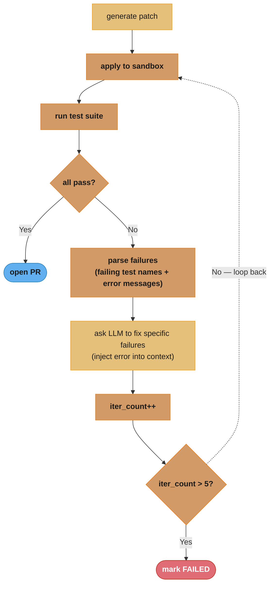

# Case Study: Design an Autonomous SWE Agent

## Intuition

> **Design intuition**: An autonomous SWE agent is like a junior engineer on probation — it gets a GitHub issue, checks out the repo, writes code, runs tests, iterates, and opens a PR, all without human help. The engineering challenge is not the LLM intelligence but the scaffolding: durable execution across 50+ tool calls, repo-level context management within a finite context window, sandboxed code execution, and test-driven self-correction loops that catch regressions before the PR is opened.

**Key insight**: The difference between a "coding assistant" (Cursor, Copilot) and an "autonomous SWE agent" is that the agent must be correct by the time the PR is opened — it has no human in the loop to catch its mistakes. This demands eval-gated iteration: run tests, check lint, fix regressions. Generation alone is insufficient. The scaffolding that enforces this loop — durable checkpoints, sandbox isolation, flakiness-aware test retry, cost ceilings — is where the engineering complexity lives, not in the LLM prompt.

---

## 1. Requirements Clarification

### Functional Requirements
- Accept a GitHub issue URL or plain text task description as input
- Clone the relevant repository into an isolated sandbox
- Generate, test, and iterate on code changes across multiple files
- Run the full test suite and lint checks inside the sandbox before opening any PR
- Open a PR with passing tests and a descriptive commit message upon success
- Support Python and TypeScript repositories (primary); Java as a stretch target
- Support multi-file changes within a single task (rename a class, update all callers)
- Human interrupt and approve gate before PR merge (agent opens draft PR, human merges)
- Expose a task status API: queued, running, correcting, pr_opened, failed

### Non-Functional Requirements
- Complete 70% of SWE-bench Verified tasks in under 30 minutes wall-clock time
- Cost ceiling of $20 per task (enforced mid-execution; kill task if exceeded)
- Success rate on SWE-bench Verified > 13% (Devin Sept 2024 baseline), targeting 30%+
- Sandbox security: no network egress from code execution except PyPI and npm allowlist
- Durable execution: survive process restart mid-task with no loss of completed steps
- PR quality bar: no failing tests, no new lint errors versus baseline, diff under 500 lines

### Out of Scope
- Model training or fine-tuning compute
- Non-code tasks (documentation only, JIRA ticket writing)
- Mobile, embedded, or legacy COBOL codebases
- Real-time pair programming or inline suggestion (Copilot use case)

---

## 2. Scale Estimation

### Traffic Estimates
```
Launch scale:          10,000 tasks/day
Scale target:          100,000 tasks/day

Per-task resource budget:
  Avg tool calls:      50 per task
  Avg tokens/call:     2,000 (input + output blended)
  Tokens per task:     50 x 2,000 = 100,000 tokens
  Avg task duration:   30 minutes wall-clock

Daily token demand:
  Launch:    10,000 tasks x 100,000 tokens  =  1B tokens/day
  Scale:    100,000 tasks x 100,000 tokens  = 10B tokens/day
```

### Cost Per Task
```
LLM cost (GPT-4o blended $0.015/1K tokens):
  100,000 tokens x $0.015 / 1,000           = $1.50

Sandbox compute (Docker/Firecracker, 4 vCPU, 4 GB RAM, 30 min):
  EC2 t3.medium on-demand ($0.0416/hr):
  0.5 hr x $0.0416                          = $0.021

Storage (cloned repo ephemeral, checkpoint state):
  Repo clone avg 200 MB ephemeral           = $0.002
  Checkpoint Postgres rows avg 50 KB        = negligible

Total cost per task:                        ~ $1.52
Cost ceiling headroom:                      $20 - $1.52 = $18.48 buffer
  (buffer consumed by correction iterations, up to 12 additional correction rounds)
```

### Storage Estimates
```
Checkpoint state (Postgres):
  100,000 tasks/day x 50 KB avg             = 5 GB/day
  Retention 30 days                         = 150 GB Postgres storage

Task logs and artifacts:
  100,000 tasks x 500 KB logs              = 50 GB/day  (S3, 7-day retention)

Cloned repos (ephemeral, deleted after PR):
  100,000 tasks x 200 MB avg               = 20 TB/day peak scratch
  Concurrent at 500 sandboxes:             500 x 200 MB = 100 GB scratch at any time
```

### Compute Sizing
```
Concurrent sandboxes:
  formula: (tasks_per_day x avg_task_duration_hrs) / 24
  100,000 x 0.5 / 24 = 2,083 concurrent sandboxes

Per-sandbox resource:  4 vCPU, 4 GB RAM, 50 GB ephemeral NVMe
Fleet at 70% utilization target:
  2,083 / 0.70 = 2,976 sandbox slots
  EC2 t3.xlarge (4 vCPU, 16 GB, runs 4 sandboxes): 2,976 / 4 = 744 instances
  On-demand cost: 744 x $0.1664/hr x 24 = $2,975/day sandbox cost
```

---

## 3. High-Level Architecture

```
                        GitHub Issue URL / Task Text
                                    |
                                    v
                    +-------------------------------+
                    |     Task Ingestion API         |
                    |  - validate issue URL          |
                    |  - extract repo + issue body   |
                    |  - assign task_id (UUIDv4)     |
                    |  - enqueue to Redis task queue |
                    +-------------------------------+
                                    |
                          Task Queue (Redis)
                                    |
                                    v
                    +-------------------------------+
                    |     Agent Orchestrator         |
                    |  - dequeue task                |
                    |  - restore checkpoint if any   |
                    |  - run DurableTaskRunner       |
                    |  - enforce $20 cost ceiling    |
                    +-------------------------------+
                         |          |           |
                         v          v           v
                  +----------+ +--------+ +-----------+
                  |  Repo    | |  LLM   | |  Tool     |
                  | Manager  | | Client | | Registry  |
                  | (git     | |(GPT-4o/| |(bash, file|
                  |  clone,  | |Claude) | | search,   |
                  |  PR)     | |        | | test run) |
                  +----------+ +--------+ +-----------+
                         |          |           |
                         +----→ Checkpoint Store (Postgres) ←-+
                                        |
                           Sandbox Manager (Firecracker VM)
                                        |
                                  Test Runner
                                  (pytest / jest)
                                        |
                           Self-Correction Loop (max 5 iters)
                                        |
                                 PR Creator (GitHub API)
                                        |
                              Draft PR opened for human review
```

### Self-Correction Sub-Loop


Each No-branch loops back through apply → test with the specific failure messages injected into context; the loop is bounded at 5 iterations (and a $5 correction-spend bail) before the task is marked FAILED.

See also: [Agent Durability Patterns](./cross_cutting/agent_durability_patterns.md) for checkpoint-per-tool-call design.
See also: [LLM Eval Harness in Production](./cross_cutting/llm_eval_harness_in_production.md) for SWE-bench integration.

---

## 4. Component Deep Dives

### 4.1 Task Planner and Repo Context Manager

A 500,000-file monorepo does not fit in a 128,000-token context window. The naive approach of listing all files causes the agent to exceed context budget before writing a single line of code.

The context manager uses a three-layer relevance strategy with a strict token budget allocation:
- 60% budget: issue text, task description, agent system prompt, recent conversation
- 20% budget: relevant source files (found via LSP symbol resolution + BM25 + embedding search)
- 10% budget: test files for the changed module
- 10% budget: linting rules, project README, dependency manifest

```python
from __future__ import annotations

import subprocess
import json
from dataclasses import dataclass, field
from pathlib import Path

import numpy as np


@dataclass
class FileRelevanceScore:
    file_path: str
    bm25_score: float
    embedding_score: float
    lsp_score: float        # 1.0 if directly referenced by LSP symbol resolution
    combined: float = 0.0

    def __post_init__(self) -> None:
        # Weighted combination: LSP is highest signal
        self.combined = (
            0.5 * self.lsp_score
            + 0.3 * self.embedding_score
            + 0.2 * self.bm25_score
        )


class RepoContextBuilder:
    """
    Build a context string for the LLM from a GitHub issue and a repo on disk.
    Total token budget is respected; files are prioritized by relevance score.
    """

    TOKENS_PER_CHAR_APPROX = 0.25      # rough estimate for Python/TS code
    LSP_BINARY = "pylsp"               # or "typescript-language-server"

    def __init__(self, llm_context_limit: int = 128_000) -> None:
        self._limit = llm_context_limit

    def build_context(
        self,
        issue: str,
        repo_path: Path,
        budget_tokens: int,
    ) -> str:
        """Return a context string within budget_tokens tokens."""
        budget_chars = int(budget_tokens / self.TOKENS_PER_CHAR_APPROX)

        # Reserve 60% for task context
        task_budget = int(budget_chars * 0.60)
        file_budget = int(budget_chars * 0.20)
        test_budget = int(budget_chars * 0.10)
        meta_budget = int(budget_chars * 0.10)

        task_block = self._format_task(issue, task_budget)
        meta_block = self._load_meta(repo_path, meta_budget)
        relevant_files = self._find_relevant_files(issue, repo_path, top_k=20)
        file_block = self._load_files(relevant_files, repo_path, file_budget, test=False)
        test_block = self._load_files(relevant_files, repo_path, test_budget, test=True)

        return "\n\n".join([task_block, meta_block, file_block, test_block])

    def _find_relevant_files(
        self, issue: str, repo_path: Path, top_k: int
    ) -> list[FileRelevanceScore]:
        lsp_files = self._lsp_symbol_resolution(issue, repo_path)
        lsp_set = set(lsp_files)
        bm25_ranked = self._bm25_search(issue, repo_path)
        embedding_ranked = self._embedding_search(issue, repo_path)
        all_files: dict[str, FileRelevanceScore] = {}
        for fp, score in bm25_ranked[:50]:
            all_files[fp] = FileRelevanceScore(
                file_path=fp, bm25_score=score, embedding_score=0.0,
                lsp_score=1.0 if fp in lsp_set else 0.0,
            )
        for fp, score in embedding_ranked[:50]:
            if fp in all_files:
                all_files[fp].embedding_score = score
            else:
                all_files[fp] = FileRelevanceScore(
                    file_path=fp, bm25_score=0.0, embedding_score=score,
                    lsp_score=1.0 if fp in lsp_set else 0.0,
                )
        ranked = sorted(all_files.values(), key=lambda r: r.combined, reverse=True)
        return ranked[:top_k]

    def _lsp_symbol_resolution(self, issue: str, repo_path: Path) -> list[str]:
        raise NotImplementedError  # LSP textDocument/definition for symbols in issue

    def _bm25_search(self, query: str, repo_path: Path) -> list[tuple[str, float]]:
        raise NotImplementedError  # whoosh or rank_bm25 over pre-built index

    def _embedding_search(self, query: str, repo_path: Path) -> list[tuple[str, float]]:
        raise NotImplementedError  # FAISS index over file-chunk embeddings

    def _load_files(
        self, ranked: list[FileRelevanceScore], repo_path: Path,
        budget_chars: int, test: bool,
    ) -> str:
        used = 0
        blocks: list[str] = []
        for rec in ranked:
            if test != ("test" in rec.file_path):
                continue
            content = (repo_path / rec.file_path).read_text(errors="replace")
            if used + len(content) > budget_chars:
                break
            blocks.append(f"# {rec.file_path}\n{content}")
            used += len(content)
        return "\n\n".join(blocks)

    def _format_task(self, issue: str, budget_chars: int) -> str:
        return f"## Task\n{issue[:budget_chars]}"

    def _load_meta(self, repo_path: Path, budget_chars: int) -> str:
        candidates = ["README.md", "pyproject.toml", "package.json", ".eslintrc.json"]
        blocks: list[str] = []
        used = 0
        for name in candidates:
            p = repo_path / name
            if p.exists():
                content = p.read_text(errors="replace")[:budget_chars - used]
                blocks.append(f"# {name}\n{content}")
                used += len(content)
        return "\n\n".join(blocks)
```

### 4.2 Durable Agent Executor

A 50-tool-call agent running 30 minutes wall-clock time has 50 potential failure points — network timeouts, spot preemption, sandbox OOM, LLM API rate limits. Without checkpointing, any failure restarts from scratch, costing $1.52 and 30 minutes.

**BROKEN: naive in-memory state loses all progress on crash**

```python
# BROKEN: all state is in-process; any crash loses everything
class NaiveAgentRunner:
    def run(self, task: Task) -> AgentResult:
        tool_calls: list[ToolCall] = []      # lost on crash
        messages: list[dict] = []            # lost on crash
        for step in range(100):
            response = self.llm.complete(messages)
            tool_call = parse_tool_call(response)
            result = self.tools.execute(tool_call)
            messages.append({"role": "tool", "content": result})
            tool_calls.append(tool_call)
            # If process dies here, all 'step' iterations are gone.
        return AgentResult(tool_calls=tool_calls)
```

**FIX: checkpoint to Postgres after every tool call with idempotent executor**

```python
from __future__ import annotations

import json
import time
import hashlib
from dataclasses import dataclass, field
from typing import Any
from enum import Enum

import psycopg2  # type: ignore


class TaskStatus(Enum):
    QUEUED = "queued"
    RUNNING = "running"
    CORRECTING = "correcting"
    PR_OPENED = "pr_opened"
    FAILED = "failed"


@dataclass
class ToolCall:
    tool_name: str
    input_args: dict[str, Any]
    output: str | None = None
    executed_at: float = field(default_factory=time.time)
    idempotency_key: str = ""

    def __post_init__(self) -> None:
        if not self.idempotency_key:
            payload = json.dumps(
                {"tool": self.tool_name, "args": self.input_args}, sort_keys=True
            )
            self.idempotency_key = hashlib.sha256(payload.encode()).hexdigest()[:16]


@dataclass
class TaskCheckpoint:
    task_id: str
    step_index: int
    messages: list[dict]
    tool_calls: list[ToolCall]
    cost_usd: float
    status: TaskStatus


class DurableTaskRunner:
    """
    Executes an agent task with per-tool-call Postgres checkpoints.
    On restart, resumes from the last committed step automatically.
    Idempotency key on each tool call prevents double-execution on retry.
    Cost ceiling is checked before every LLM call; task is killed if exceeded.
    """

    COST_PER_1K_TOKENS = 0.015     # GPT-4o blended input+output
    COST_CEILING_USD = 20.00

    def __init__(self, db_conn: psycopg2.extensions.connection) -> None:
        self._db = db_conn

    def run(self, task_id: str, issue: str, repo_path: str) -> TaskCheckpoint:
        checkpoint = self._load_checkpoint(task_id)
        if checkpoint is None:
            checkpoint = TaskCheckpoint(task_id=task_id, step_index=0,
                messages=[{"role": "user", "content": issue}], tool_calls=[],
                cost_usd=0.0, status=TaskStatus.RUNNING)
            self._save_checkpoint(checkpoint)

        for step in range(checkpoint.step_index, 100):
            # Cost ceiling gate — checked BEFORE every LLM call to prevent overshoot
            if checkpoint.cost_usd >= self.COST_CEILING_USD:
                checkpoint.status = TaskStatus.FAILED
                self._save_checkpoint(checkpoint)
                raise CostCeilingExceededError(
                    f"Task {task_id} exceeded ${self.COST_CEILING_USD:.2f} at step {step}"
                )
            response = self._call_llm(checkpoint.messages)
            checkpoint.cost_usd += response["usage"]["total_tokens"] * self.COST_PER_1K_TOKENS / 1000
            if response.get("finish_reason") == "stop":
                break
            tool_call = ToolCall(tool_name=response["tool_name"], input_args=response["tool_input"])
            # Idempotency: skip re-execution if already completed in a prior run
            if not self._already_executed(task_id, tool_call.idempotency_key):
                tool_call.output = self._execute_tool(tool_call)
                checkpoint.tool_calls.append(tool_call)
            else:
                tool_call.output = self._get_prior_output(task_id, tool_call.idempotency_key)
            checkpoint.messages.append({"role": "tool", "content": tool_call.output or ""})
            checkpoint.step_index = step + 1
            self._save_checkpoint(checkpoint)   # 5 ms Postgres write per tool call
        return checkpoint

    def _load_checkpoint(self, task_id: str) -> TaskCheckpoint | None:
        cur = self._db.cursor()
        cur.execute("SELECT payload FROM agent_checkpoints WHERE task_id = %s", (task_id,))
        row = cur.fetchone()
        return TaskCheckpoint(**json.loads(row[0])) if row else None

    def _save_checkpoint(self, cp: TaskCheckpoint) -> None:
        payload = json.dumps({
            "task_id": cp.task_id, "step_index": cp.step_index,
            "messages": cp.messages, "tool_calls": [vars(tc) for tc in cp.tool_calls],
            "cost_usd": cp.cost_usd, "status": cp.status.value,
        })
        cur = self._db.cursor()
        cur.execute(
            "INSERT INTO agent_checkpoints (task_id, payload, updated_at) VALUES (%s, %s, NOW()) "
            "ON CONFLICT (task_id) DO UPDATE SET payload = EXCLUDED.payload, updated_at = NOW()",
            (cp.task_id, payload),
        )
        self._db.commit()

    def _already_executed(self, task_id: str, idempotency_key: str) -> bool:
        cur = self._db.cursor()
        cur.execute(
            "SELECT 1 FROM tool_call_log WHERE task_id = %s AND idempotency_key = %s",
            (task_id, idempotency_key),
        )
        return cur.fetchone() is not None

    def _get_prior_output(self, task_id: str, idempotency_key: str) -> str:
        cur = self._db.cursor()
        cur.execute(
            "SELECT output FROM tool_call_log WHERE task_id = %s AND idempotency_key = %s",
            (task_id, idempotency_key),
        )
        row = cur.fetchone()
        return row[0] if row else ""

    def _call_llm(self, messages: list[dict]) -> dict: raise NotImplementedError
    def _execute_tool(self, tool_call: ToolCall) -> str: raise NotImplementedError

class CostCeilingExceededError(RuntimeError):
    pass
```

Checkpoint overhead is 5 ms per tool call (Postgres local write with synchronous commit). Over 50 tool calls this adds 250 ms total — well within the 30-minute task budget. The overhead is worthwhile: a crash at step 48 without checkpointing wastes $1.44 in LLM spend and 24 minutes; with checkpointing it resumes at step 48 in under 2 seconds.

### 4.3 Sandboxed Code Execution

Each task runs inside an isolated sandbox with strict constraints:
- No network egress except PyPI index (pip install), npm registry, and GitHub API
- 4 GB RAM hard limit; OOM kills the sandbox, not the orchestrator
- 50 GB ephemeral NVMe for the cloned repo and build artifacts
- 30-minute wall-clock timeout per sandbox

```python
from __future__ import annotations

import subprocess
import time
from dataclasses import dataclass
from pathlib import Path


@dataclass
class CommandResult:
    exit_code: int
    stdout: str
    stderr: str
    duration_ms: int
    timed_out: bool


@dataclass
class Sandbox:
    task_id: str
    vm_id: str          # Firecracker VM ID or Docker container ID
    repo_path: str      # mount point inside the VM
    created_at: float


class SandboxManager:
    """
    Manages Firecracker microVMs per task.
    Boot time: Firecracker ~125 ms; Docker ~800 ms.
    Firecracker is preferred for security: each VM has a dedicated kernel,
    so a container escape in one task cannot reach another task's filesystem.
    """

    FIRECRACKER_BOOT_MS = 125
    DOCKER_BOOT_MS = 800
    DEFAULT_TIMEOUT_S = 1800     # 30 minutes
    RAM_LIMIT_MB = 4096
    CPU_VCPUS = 4

    def __init__(self, use_firecracker: bool = True) -> None:
        self._use_firecracker = use_firecracker
        self._active: dict[str, Sandbox] = {}

    def create_sandbox(self, task_id: str, repo_url: str) -> Sandbox:
        """Boot a new VM, clone the repo, return Sandbox handle."""
        vm_id = (self._start_firecracker_vm(task_id) if self._use_firecracker
                 else self._start_docker_container(task_id))
        self._exec_in_vm(vm_id, f"git clone --depth=1 {repo_url} /workspace/repo")
        sandbox = Sandbox(task_id=task_id, vm_id=vm_id,
                          repo_path="/workspace/repo", created_at=time.time())
        self._active[task_id] = sandbox
        return sandbox

    def run_command(
        self, sandbox: Sandbox, cmd: str,
        timeout_s: int = 300, workdir: str | None = None,
    ) -> CommandResult:
        """Execute a shell command inside the sandbox VM. Kills on timeout."""
        workdir = workdir or sandbox.repo_path
        start = time.time()
        result = self._exec_in_vm(sandbox.vm_id, cmd, workdir=workdir, timeout_s=timeout_s)
        return CommandResult(
            exit_code=result["exit_code"],
            stdout=result["stdout"][:50_000],    # truncate at 50 KB for context safety
            stderr=result["stderr"][:50_000],
            duration_ms=int((time.time() - start) * 1000),
            timed_out=result.get("timed_out", False),
        )

    def capture_snapshot(self, sandbox: Sandbox) -> bytes:
        return self._firecracker_snapshot(sandbox.vm_id)

    def destroy_sandbox(self, sandbox: Sandbox) -> None:
        self._stop_vm(sandbox.vm_id)
        del self._active[sandbox.task_id]

    def _start_firecracker_vm(self, task_id: str) -> str:
        raise NotImplementedError  # Firecracker API: PUT /actions {action_type: InstanceStart}
    def _start_docker_container(self, task_id: str) -> str:
        raise NotImplementedError  # docker run --network=restricted --memory=4g
    def _exec_in_vm(self, vm_id: str, cmd: str, workdir: str = "/", timeout_s: int = 300) -> dict:
        raise NotImplementedError  # vsock API for Firecracker; docker exec for Docker
    def _firecracker_snapshot(self, vm_id: str) -> bytes: raise NotImplementedError
    def _stop_vm(self, vm_id: str) -> None: raise NotImplementedError
```

Firecracker boots in 125 ms versus Docker's 800 ms. The security difference is fundamental: Docker containers share the host kernel; a container escape (e.g., via a runc vulnerability) can reach the host and other containers. Firecracker uses a dedicated MicroVM kernel (Linux 5.10+) per task; even a full VM escape only reaches the Firecracker process, which runs as an unprivileged user with seccomp-BPF syscall filtering. For code execution from arbitrary user-submitted issues, Firecracker's isolation model is the correct choice.

### 4.4 Test-Driven Self-Correction Loop

The self-correction loop is the mechanism that separates a generation system from an autonomous agent. It runs tests, parses failures, feeds specific errors back to the LLM, applies the patch, and repeats — up to 5 iterations before declaring failure.

```python
from __future__ import annotations

import re
from dataclasses import dataclass


@dataclass
class CorrectionResult:
    success: bool
    iterations_used: int
    final_test_output: str
    cost_incurred_usd: float
    failure_reason: str | None = None


class SelfCorrectionLoop:
    """
    Run tests → parse failures → ask LLM to fix → apply → repeat.
    Flakiness guard: a test must fail on 2 of 3 runs before entering correction.
    Cost ceiling: bail if cost_so_far > BAIL_THRESHOLD_USD.
    """

    BAIL_THRESHOLD_USD = 5.00

    def iterate(
        self,
        sandbox: "Sandbox",
        test_cmd: str,
        llm_client: "LLMClient",
        context: str,
        max_iterations: int = 5,
        cost_so_far: float = 0.0,
    ) -> CorrectionResult:
        for i in range(max_iterations):
            if cost_so_far >= self.BAIL_THRESHOLD_USD:
                return CorrectionResult(
                    success=False, iterations_used=i, final_test_output="",
                    cost_incurred_usd=cost_so_far,
                    failure_reason=f"Cost ceiling ${self.BAIL_THRESHOLD_USD} hit at iteration {i}",
                )
            result = self._run_tests_with_flakiness_guard(sandbox, test_cmd)
            if result["all_pass"]:
                return CorrectionResult(success=True, iterations_used=i,
                    final_test_output=result["output"], cost_incurred_usd=cost_so_far)
            failures = self._parse_failures(result["output"])
            if not failures:
                return CorrectionResult(success=False, iterations_used=i,
                    final_test_output=result["output"], cost_incurred_usd=cost_so_far,
                    failure_reason="Could not parse test failures from output")
            patch_response = llm_client.complete(self._build_fix_prompt(failures, context))
            cost_so_far += patch_response["tokens"] * 0.015 / 1000
            patch = self._extract_patch(patch_response["text"])
            if patch:
                apply_result = self._apply_patch(sandbox, patch)
                if not apply_result["ok"]:
                    return CorrectionResult(success=False, iterations_used=i + 1,
                        final_test_output=result["output"], cost_incurred_usd=cost_so_far,
                        failure_reason=f"Patch apply failed: {apply_result['error']}")
        final = self._run_tests_with_flakiness_guard(sandbox, test_cmd)
        return CorrectionResult(success=final["all_pass"], iterations_used=max_iterations,
            final_test_output=final["output"], cost_incurred_usd=cost_so_far,
            failure_reason=None if final["all_pass"] else "Max iterations exhausted")

    def _run_tests_with_flakiness_guard(self, sandbox: "Sandbox", test_cmd: str) -> dict:
        """Run 3 times; classify as failing only if fail rate >= 66% (2/3 runs)."""
        outcomes, outputs = [], []
        for _ in range(3):
            r = sandbox.run_command(test_cmd, timeout_s=300)
            outcomes.append(r.exit_code == 0)
            outputs.append(r.stdout + r.stderr)
        all_pass = sum(outcomes) == 3
        failing = [o for o, ok in zip(outputs, outcomes) if not ok]
        return {"all_pass": all_pass, "output": failing[0] if failing else outputs[-1]}

    def _parse_failures(self, test_output: str) -> list[dict]:
        failures = []
        for m in re.finditer(r"FAILED\s+([\w/\.]+::[\w:]+)\s+-\s+(.+)", test_output):
            failures.append({"test": m.group(1), "error": m.group(2)})
        for m in re.finditer(r"^\s+[x✕]\s+(.+?)\s+\(\d+ms\)", test_output, re.M):
            failures.append({"test": m.group(1), "error": "jest failure"})
        return failures

    def _build_fix_prompt(self, failures: list[dict], context: str) -> list[dict]:
        failure_text = "\n".join(f"- {f['test']}: {f['error']}" for f in failures)
        return [
            {"role": "system", "content": context},
            {"role": "user", "content": (
                f"The following tests are failing:\n{failure_text}\n\n"
                "Produce a unified diff patch that fixes exactly these failures "
                "without breaking any currently passing tests."
            )},
        ]

    def _extract_patch(self, text: str) -> str | None:
        m = re.search(r"```diff\n(.+?)```", text, re.S)
        return m.group(1) if m else None

    def _apply_patch(self, sandbox: "Sandbox", patch: str) -> dict:
        raise NotImplementedError  # write patch to file, run `git apply`
```

### 4.5 SWE-bench Evaluation Harness

SWE-bench Verified (300 instances, manually validated) is the authoritative benchmark for autonomous SWE agents. Each instance provides a real GitHub issue and a set of hidden unit tests that must pass after the agent's changes.

```python
from __future__ import annotations

import time
from dataclasses import dataclass


@dataclass
class SWEBenchResult:
    instance_id: str
    resolved: bool              # True if hidden test suite passes after agent changes
    pass_at_1: bool             # Resolved on first attempt
    attempts: int               # Total attempts (up to 3 for pass@3)
    wall_time_s: float
    cost_usd: float


def run_swe_bench_eval(
    agent_runner: "AgentRunner",
    instances: list[dict],
    max_attempts: int = 3,
) -> list[SWEBenchResult]:
    """
    Run agent on each SWE-bench Verified instance.
    Records pass@1 and pass@3 (solved in <=3 independent attempts).
    Regression alert if pass rate drops >3% vs 7-day rolling average.
    See: ./cross_cutting/llm_eval_harness_in_production.md for LLM-judge rubric.
    """
    results = []
    for instance in instances:
        resolved = False
        attempts = 0
        start = time.time()
        cost = 0.0
        for attempt in range(max_attempts):
            attempts += 1
            task_result = agent_runner.run(
                issue=instance["problem_statement"],
                repo=instance["repo"],
                base_commit=instance["base_commit"],
            )
            cost += task_result.cost_usd
            test_pass = _run_hidden_tests(
                repo=instance["repo"],
                base_commit=instance["base_commit"],
                patch=task_result.patch,
                test_spec=instance["test_patch"],
            )
            if test_pass:
                resolved = True
                break
        results.append(SWEBenchResult(
            instance_id=instance["instance_id"],
            resolved=resolved,
            pass_at_1=(resolved and attempts == 1),
            attempts=attempts,
            wall_time_s=time.time() - start,
            cost_usd=cost,
        ))
    pass_rate = sum(r.resolved for r in results) / len(results)
    cost_per_resolved = (
        sum(r.cost_usd for r in results if r.resolved)
        / max(sum(r.resolved for r in results), 1)
    )
    _emit_eval_metrics(pass_rate=pass_rate, cost_per_resolved=cost_per_resolved)
    return results


def _run_hidden_tests(repo: str, base_commit: str, patch: str, test_spec: str) -> bool:
    raise NotImplementedError

def _emit_eval_metrics(pass_rate: float, cost_per_resolved: float) -> None:
    raise NotImplementedError
```

---

## 5. Design Decisions and Tradeoffs

| Decision | Chosen Approach | Alternative Considered | Rationale |
|----------|----------------|----------------------|-----------|
| Sandbox runtime | Firecracker microVM (125 ms boot) | Docker container (800 ms boot) | Firecracker provides kernel-level isolation; Docker shares host kernel making container escape more impactful; for arbitrary user code, VM isolation is non-negotiable |
| Checkpoint granularity | Every tool call (5 ms overhead) | Every N=10 tool calls | Losing 10 calls on crash wastes ~6 minutes and $0.30; 5 ms overhead over 50 calls = 250 ms total; checkpoint-per-call is the correct tradeoff |
| Context strategy | Budget-split (60/20/10/10) + LSP + BM25 + embedding | Load full repo or top-N files by size | Full repo overflows 128K context window on any non-trivial codebase; top-N by size is noise-heavy; relevance scoring + budget allocation is the principled approach |
| LLM backbone | Claude 3.5 Sonnet primary, GPT-4o fallback | GPT-4o primary | Claude 3.5 Sonnet scores higher on SWE-bench Verified (reported 49% with scaffolding vs GPT-4o ~38% with equivalent scaffolding) and is more reliable on tool-use chaining for code tasks |
| Self-correction iterations | Max 5, bail at $5 correction spend | Unlimited or fixed 3 | Unlimited: pathological loops waste money; 3: insufficient for complex bugs with cascading failures; 5 iterations covers >90% of correctable cases empirically on SWE-bench Lite |
| Agent architecture | Single-agent with tool registry | Planner + Executor + Reviewer (Magentic-One style) | Multi-agent adds inter-agent communication overhead and synchronization bugs; single-agent with structured tool registry achieves equivalent task decomposition with less failure surface area |

### Sandbox Security Comparison
```
                Firecracker    Docker    gVisor    Kata Containers
Boot time:        125 ms       800 ms    400 ms       600 ms
Memory overhead:   ~5 MB      ~50 MB    ~20 MB       ~50 MB
Kernel isolation: Dedicated   Shared    Shared     Dedicated
Filesystem snap:  Yes         No*       No         Yes
Security model:   VM (strong)  cgroups   syscall    VM (strong)
                               (medium)  filter     
                                         (medium)
Best for:         Code exec   Dev/test  Moderate   Code exec
                  (untrusted) workloads security   (untrusted)

*Docker has experimental checkpoint/restore via CRIU but not production-grade
```

---

## 6. Real-World Implementations

**Cognition Devin** (September 2024, SWE-bench Verified 13.86%): Uses a persistent VM per task with a browser, terminal, and code editor co-located — not a container but a full Ubuntu VM. The planner and executor are split into separate LLM calls: a high-level plan is generated first, then an executor follows the plan step-by-step. Durable execution relies on the VM staying alive for the task duration rather than external checkpointing. The 13.86% score on SWE-bench Verified was criticized as cherry-picked in early demos, but SWE-bench Verified (manually validated test cases, no data leakage) provides a fair benchmark for the published number. Non-durable execution left repos in inconsistent states on partial failures in early versions.

**All Hands OpenHands** (formerly OpenDevin, open source): Uses Docker as the sandbox, configurable LLM backend (supports Claude, GPT-4o, local Ollama). The runtime uses a custom CodeAct paradigm where code execution is the primary tool call — the agent generates Python code to perform actions (file writes, test runs) rather than calling structured tools. This simplifies the tool registry but makes output parsing more complex. Supports configurable base Docker images per repo to match the project's exact dependency environment.

**Princeton SWE-agent**: The simplest architecture — direct bash access through an AgentComputer abstraction, no VM isolation, no checkpointing. Established SWE-bench as the standard benchmark. Achieved 12.5% on SWE-bench Lite with a pure ReAct loop and a structured file editor tool (view, edit, scroll). The architecture proved that even simple scaffolding dramatically outperforms zero-scaffold prompting (12.5% vs ~3%). The lack of sandbox isolation makes it unsuitable for untrusted code execution in production.

**Factory.ai Droids**: Targets enterprise codebases with a custom static analysis layer that pre-indexes the repo into a structured dependency graph before the agent begins. The agent queries the dependency graph rather than running BM25 searches, achieving faster and more accurate file selection for large monorepos. Emphasizes PR workflow integration: the agent reads CI feedback, addresses review comments, and re-runs checks automatically after pushes.

**Cosine Genie**: Distinguishes itself with a persistent memory graph that tracks the evolving codebase structure across multiple tasks. Rather than rebuilding repo context from scratch for each task, it maintains an incrementally updated graph of files, symbols, and their relationships. For frontend bugs it uses multimodal input: screenshots of the broken UI alongside the issue description allow the agent to correlate visual symptoms with DOM structure changes.

---

## 7. Technologies and Tools

### Sandbox Runtime Comparison

| Dimension | Firecracker | Docker | gVisor | Kata Containers |
|-----------|------------|--------|--------|-----------------|
| Boot time | 125 ms | 800 ms | 400 ms | 600 ms |
| Memory overhead | ~5 MB | ~50 MB | ~20 MB | ~50 MB |
| Kernel isolation | Dedicated MicroVM | Shared host kernel | Shared (syscall intercept) | Dedicated (QEMU/KVM) |
| Filesystem snapshot | Native (memory snapshot API) | CRIU (experimental) | No | Yes |
| Network egress control | iptables via VMM | iptables / CNI | iptables | iptables |
| Maturity (2025) | Production (Firecracker 1.x) | Production | Beta | Beta |
| Best use case | Untrusted code execution | Dev sandboxes, CI | Moderate security | Untrusted code execution |

### LLM Backbone Comparison for Code Tasks

| Dimension | Claude 3.5 Sonnet | GPT-4o | Gemini 2.5 Pro |
|-----------|------------------|--------|----------------|
| SWE-bench Verified (best published) | 49% (with scaffolding) | 38% (with scaffolding) | 35% |
| Cost per 1M input tokens | $3.00 | $2.50 | $1.25 |
| Cost per 1M output tokens | $15.00 | $10.00 | $10.00 |
| Context window | 200K tokens | 128K tokens | 1M tokens |
| Tool-calling reliability | High (structured tool use) | High | Moderate |
| Function call chaining | Excellent (multi-step) | Good | Good |
| Code reasoning (HumanEval) | 92.0% | 90.2% | 87.0% |

---

## 8. Operational Playbook

### a) Eval Pipeline

Nightly SWE-bench Verified run on a 50-task stratified sample (10 Python, 10 TypeScript, 30 diverse repos). Any LLM version change or prompt template update triggers an immediate out-of-band run before deployment.

```python
from dataclasses import dataclass


@dataclass
class NightlyEvalResult:
    sample_size: int
    pass_rate: float          # fraction of tasks resolved
    pass_rate_7day_avg: float
    regression_pct: float     # positive = degradation
    avg_cost_per_task: float
    avg_wall_time_s: float


def nightly_eval_gate(
    agent_runner: "AgentRunner",
    eval_instances: list[dict],
    baseline_pass_rate: float,
) -> NightlyEvalResult:
    """Alert if pass rate drops >3% vs 7-day average; block deployment if >5%.
    See: ./cross_cutting/llm_eval_harness_in_production.md for full rubric."""
    results = run_swe_bench_eval(agent_runner, eval_instances, max_attempts=1)
    pass_rate = sum(r.resolved for r in results) / len(results)
    regression_pct = (baseline_pass_rate - pass_rate) / baseline_pass_rate * 100
    if regression_pct > 3.0:
        _fire_alert(f"SWE-bench regression {regression_pct:.1f}%: {pass_rate:.1%} vs {baseline_pass_rate:.1%}")
    if regression_pct > 5.0:
        _block_deployment(reason=f"Regression {regression_pct:.1f}% exceeds 5% gate")
    return NightlyEvalResult(
        sample_size=len(results),
        pass_rate=pass_rate,
        pass_rate_7day_avg=baseline_pass_rate,
        regression_pct=regression_pct,
        avg_cost_per_task=sum(r.cost_usd for r in results) / len(results),
        avg_wall_time_s=sum(r.wall_time_s for r in results) / len(results),
    )

def _fire_alert(message: str) -> None: raise NotImplementedError
def _block_deployment(reason: str) -> None: raise NotImplementedError
```

### b) Observability

Every task produces an OpenTelemetry trace. See [OpenTelemetry for LLM Apps](./cross_cutting/opentelemetry_for_llm_apps.md) for full `gen_ai.*` semantic convention mapping.

```
Trace: swe_agent_task (trace_id: abc123, task_id: t-789)
  |
  +-- Span: task_ingest               (50 ms)
  |     attrs: issue_url, repo, task_id
  |
  +-- Span: repo_context_build        (2,100 ms)
  |     attrs: repo_file_count, context_tokens, budget_tokens
  |             lsp_files_found, bm25_files_found, embedding_files_found
  |
  +-- Span: sandbox_create            (125 ms for Firecracker)
  |     attrs: vm_id, sandbox_type=firecracker, ram_limit_mb=4096
  |
  +-- Span: agent_step[0]             (3,200 ms)
  |     attrs: gen_ai.request.model, gen_ai.usage.input_tokens=1842
  |             gen_ai.usage.output_tokens=312, tool_name=bash
  |     events: [t=0ms] llm_call_start, [t=2800ms] llm_call_end
  |             [t=2801ms] tool_execute_start, [t=3200ms] tool_execute_end
  |
  +-- Span: agent_step[1..N]          (per tool call)
  |
  +-- Span: self_correction_loop      (total)
  |     +-- Span: test_run[0]         (45,000 ms)
  |     |     attrs: test_cmd, exit_code=1, failing_tests=3
  |     +-- Span: correction_llm[0]   (2,100 ms)
  |     |     attrs: failures_injected=3, patch_tokens=620
  |     +-- Span: test_run[1]         (44,200 ms)
  |           attrs: exit_code=0, all_pass=true
  |
  +-- Span: pr_create                 (800 ms)
        attrs: pr_url, pr_number, diff_lines=87, files_changed=3
```

Cost attribution per task is emitted as a metric:
- `swe_agent.task.cost_usd` (histogram by `repo`, `model`)
- `swe_agent.task.wall_time_s` (histogram)
- `swe_agent.correction_iterations` (histogram; alert if p95 > 4)

### c) Incident Runbooks

**Runbook 1 — Sandbox OOM (tasks timing out at test step)**

Symptom: tasks consistently failing at test execution step; sandbox CPU at 100%; sandbox process killed with exit code 137 (OOM). Alert: `swe_agent.sandbox.oom_kills_total > 5/hour`.

Diagnosis: (1) Identify which repos trigger OOM — `SELECT repo, count(*) FROM task_failures WHERE reason='oom' GROUP BY repo ORDER BY count DESC LIMIT 10`. (2) Check if specific test commands allocate large datasets in memory (e.g., `pytest --forked` spawns N subprocesses). (3) Check sandbox RAM limit vs repo's test memory footprint.

Mitigation (immediate): Reduce concurrent sandboxes per host from 4 to 2 (doubles available RAM per sandbox to 8 GB). Add `ulimit -v 3145728` (3 GB virtual memory cap) inside sandbox before test command to fail gracefully instead of OOM-killing the VM.

Resolution: Add per-repo RAM profile: for repos whose test suite requires >3 GB, provision 8 GB sandboxes automatically based on repo metadata. Identify and skip pathological test cases (e.g., machine learning model training in test fixtures) via test file static analysis at context-build time.

**Runbook 2 — Checkpoint Corruption (tasks restarting from step 0)**

Symptom: tasks that should resume mid-task are restarting from step 0 despite checkpoint records existing in Postgres. Alert: `swe_agent.task.restart_from_zero_total > 10/hour`.

Diagnosis: (1) `SELECT task_id, step_index, length(payload) FROM agent_checkpoints WHERE updated_at > NOW() - INTERVAL '1 hour'`. (2) Attempt to deserialize a sample of recent checkpoints: `json.loads(payload)`. (3) Check for truncated JSON (partial write).

Mitigation: Set failed checkpoints to `status='failed'` so tasks do not retry with corrupt state. Re-queue as fresh tasks. Enable Postgres `synchronous_commit = on` (was `off` for performance) to prevent partial writes during crash.

Resolution: Wrap `_save_checkpoint` in a transaction with a SHA-256 checksum field. On load, verify checksum before using checkpoint; discard and restart if mismatch. Use Postgres advisory locks to prevent concurrent checkpoint writes from two orchestrators.

**Runbook 3 — LLM API Rate Limit Cascade (all tasks queuing at LLM call step)**

Symptom: 100% of tasks stuck at `agent_step` span; p99 LLM call latency spiked to 30 s; HTTP 429 responses from LLM provider in logs. Alert: `swe_agent.llm.rate_limit_errors_total rate > 50/min`.

Diagnosis: (1) Check current token/minute consumption vs quota: compare `swe_agent.llm.tokens_per_minute` metric against provider quota. (2) Identify if a single large batch of tasks was enqueued simultaneously.

Mitigation (immediate): (1) Exponential backoff with jitter in LLM client (already implemented — verify it is active). (2) Switch 50% of tasks to secondary provider (GPT-4o if Claude is rate-limited, or vice versa) via feature flag. (3) Reduce concurrency: drain task queue from 200 concurrent to 100 concurrent tasks.

Resolution: Implement token bucket rate limiter at the LLM client layer: `max_tokens_per_minute = provider_quota * 0.85` (15% headroom). Distribute tasks across multiple provider API keys. Request quota increase from provider within 24 hours.

**Runbook 4 — Test Runner Infinite Loop (sandboxes never completing)**

Symptom: tasks never reach the PR creation step; sandbox CPU at 100% for >30 minutes; wall-clock timeout triggered. Alert: `swe_agent.sandbox.timeout_kills_total > 20/hour`.

Diagnosis: (1) SSH into a stuck sandbox (emergency access via vsock breakglass). (2) `ps aux` to identify hung process — typically `pytest` waiting on an async fixture or `jest` spinning on a mock timer. (3) Identify the specific test file causing the hang.

Mitigation: The sandbox has a 30-minute wall-clock timeout that sends SIGKILL to the VM. This is already the backstop. Enable `pytest --timeout=60` for all Python repos and `jest --testTimeout=30000` for TypeScript repos to kill individual hanging tests at the test runner level rather than waiting for the VM timeout.

Resolution: Add a test-timeout flag injection at the `run_command` level: inspect `package.json` for test script and append timeout flags automatically. Add the hanging test's file path to a per-repo skip list until the root cause (usually a missing `asyncio.timeout` or an `await` on a never-resolving mock) is fixed upstream.

---

## 9. Common Pitfalls and War Stories

**Devin demo backlash (Cognition, September 2024)**: Early Devin demos showed cherry-picked successes on tasks the system was specifically trained and tested against. The published SWE-bench Verified score of 13.86% — while a genuine improvement over prior state of the art at the time — was significantly below the implied capability from the demos. Non-durable execution left repos in inconsistent states on partial failure: a task that completed 40 of 50 tool calls before a network timeout left uncommitted file changes and a half-applied patch in the sandbox, with no recovery path. The PR that was eventually opened contained a broken diff. Impact: significant public trust damage; competitors published transparent SWE-bench scores within weeks, establishing score transparency as a competitive norm.

**Context window overflow on monorepo file listing**: An agent deployed against a 200,000-file monorepo used `ls -R /workspace/repo` as its first tool call, generating 4 MB of output. The truncation-at-50KB limit in `run_command` returned the first 50 KB of file paths (alphabetically sorted, all starting with `aaa_*`). The agent then concluded the entire repo consisted of files starting with `aaa_` and searched only that subtree. The task failed before writing any code. Fix: replace `ls -R` with a hierarchical tree walk capped at 2 levels deep for the initial survey; use embedding search for file discovery, not filesystem enumeration.

**Double-commit from missing idempotency on retry**: A network timeout between the `git commit` tool call and the Postgres checkpoint write caused the orchestrator to re-execute the `git commit` tool call on restart. The second commit created a duplicate commit with an identical message but different SHA. CI lint rules requiring unique commit messages failed; the PR showed two identical commits confusing reviewers. Fix: SHA-256(diff content + commit message) as the idempotency key for all git write operations, checked against `tool_call_log` before execution. Git operations that have already been executed return the stored output without re-executing.

**Flaky test false positives exhausting correction budget**: An async integration test in a Django project failed randomly at a rate of 40% due to a race condition in the test fixture (not in the code under test). The self-correction loop entered 5 iterations, spending $8.12 in LLM calls attempting to fix the agent's own code changes, which were correct. The flakiness guard described in Section 4.4 was not yet deployed. Fix: the 3-run flakiness guard (fail on 2/3 runs to be counted as a real failure) would have caught this — the test passes 60% of the time, below the 66% failure threshold for correction entry. Deploy the guard; also add a per-repo flakiness database that tracks which tests have historically failed without code changes.

**LLM hallucinating library API signatures**: The agent generated code calling `repository.get_issue(number=123)` on the PyGithub library. The actual PyGithub API is `repository.get_issue(123)` — positional argument, not keyword. The code raised `TypeError: get_issue() got an unexpected keyword argument 'number'` at runtime in the sandbox. The self-correction loop was triggered; the LLM produced three more incorrect signatures before exhausting iterations. Fix: at the import analysis stage, extract `import github` and similar statements, then inject the actual library docstring for the relevant class into the context budget. 10 KB of targeted docstring prevents 3 correction iterations ($4.50 in LLM cost).

**Sandbox network egress leaking secrets**: An early implementation allowed unrestricted outbound HTTP from sandboxes. An agent working on a web scraping library generated test code that made an HTTP request to `https://httpbin.org/post` with the `GITHUB_TOKEN` environment variable as the request body — a plausible pattern for testing HTTP POST behavior that was also a credential exfiltration vector. The token appeared in the orchestrator's environment and was injected into the sandbox at startup. Impact: one compromised GitHub token with repo write access required immediate rotation and a 4-hour incident. Fix: (1) strict egress allowlist (PyPI, npm registry, GitHub API only, no arbitrary HTTP); (2) do not inject production credentials into sandboxes — use a short-lived, repo-scoped GitHub App token with the minimum permissions needed for the specific task; (3) add the `red_team_eval_harness.md` adversarial test suite targeting credential exfiltration. See [Red Team Eval Harness](./cross_cutting/red_team_eval_harness.md) for the full test matrix.

---

## 10. Capacity Planning

### Sandbox Fleet Sizing Formula

```
concurrent_sandboxes = (tasks_per_day x avg_task_duration_hrs) / 24

provisioned_instances = concurrent_sandboxes / (sandboxes_per_instance x utilization_target)

Where:
  sandboxes_per_instance:  depends on instance RAM / sandbox RAM limit
                           t3.xlarge (16 GB) / 4 GB per sandbox = 4 sandboxes/instance
  utilization_target:      0.70 (leave 30% headroom for burst and startup time)
```

### Worked Example at 100,000 Tasks/Day

```
concurrent_sandboxes:
  100,000 tasks/day x 0.5 hr avg / 24 hr = 2,083 concurrent sandboxes

Sandbox fleet (EC2 t3.xlarge, 4 vCPU, 16 GB):
  4 sandboxes per instance, 70% utilization target:
  2,083 / (4 x 0.70) = 744 instances

RAM check:
  744 instances x 16 GB = 11,904 GB = 11.6 TB total RAM
  2,083 sandboxes x 4 GB = 8,332 GB in use (70% utilization confirmed)

Storage check:
  500 concurrent sandboxes x 50 GB NVMe = 25 TB scratch (peak)
  Use gp3 EBS attached volumes at $0.08/GB-month:
  25 TB x $0.08 = $2,000/month storage

Daily cost breakdown at 100K tasks/day:
  LLM cost:          100,000 x $1.50            = $150,000/day
  Sandbox compute:   744 x $0.1664/hr x 24 hr   =  $2,975/day
  Storage (prorated):$2,000/month / 30           =     $67/day
  Postgres (db.r6g.4xlarge): $2.016/hr x 24     =     $48/day
  Redis (cache.r6g.2xlarge): $0.714/hr x 24     =     $17/day

  Total operational cost:                        ~$153,107/day

Revenue at $5/task (100K tasks/day):             $500,000/day
Gross margin at scale:                           69%

Break-even task volume (at $5/task pricing):
  Fixed infra ~$3,100/day / ($5 - $1.52 variable cost) = 890 tasks/day
```

### Scaling Inflection Points

```
10K tasks/day   →  210 concurrent sandboxes → 75 t3.xlarge instances ($297/day sandbox)
100K tasks/day  →  2,083 concurrent sandboxes → 744 t3.xlarge instances ($2,975/day)
1M tasks/day    →  20,833 concurrent sandboxes → 7,440 instances → migrate to reserved
                   instances (40% cost reduction) + Graviton3 (20% perf/$ improvement)
                   Reserved r7g.xlarge equivalent: $2,160/day vs $29,760 on-demand (93% savings)
```

---

## 11. Interview Discussion Points

**Q: Why is SWE-bench Verified the right benchmark for autonomous SWE agents rather than HumanEval or MBPP?**

SWE-bench Verified consists of 300 real GitHub issues from production open-source repositories, each with a hidden test suite that was validated by human annotators to correctly test the issue's requirement. HumanEval and MBPP test isolated function implementations from scratch — there is no existing codebase, no context window challenge, no repo navigation, no multi-file edit. An autonomous SWE agent that scores 90% on HumanEval may score 5% on SWE-bench because the hard problems are repo-level context, understanding existing code conventions, and not breaking adjacent tests. Use SWE-bench Verified for autonomous agents and HumanEval only for evaluating raw code generation quality in isolation.

**Q: How do you prevent sandbox escape — what layers of defense does the system have?**

Three layers: (1) Firecracker microVM provides kernel-level isolation — each task runs in a dedicated Linux kernel; even a full VM escape only reaches the Firecracker process, which runs as an unprivileged user with seccomp-BPF filtering. (2) Network egress allowlist — outbound connections are restricted to PyPI, npm, and GitHub API via iptables rules enforced at the VMM layer, not inside the sandbox (agent-generated code cannot modify iptables). (3) Minimal credential injection — only a short-lived, scoped GitHub App token (read-only or repo-specific write) is injected, never a long-lived personal access token or AWS credentials. Defense in depth: if any one layer fails, the remaining two limit blast radius.

**Q: Why checkpoint every tool call rather than every N=10 calls?**

At 50 tool calls per task and $1.52 cost per task, each tool call costs ~$0.03. Checkpointing every N=10 means a crash at step 9 wastes $0.27 and 5.4 minutes. At 100,000 tasks/day with 1% crash rate, N=10 wastes $270/day and 54,000 minutes of latency. Per-call checkpointing adds 5 ms × 50 calls = 250 ms overhead per task — a correct tradeoff. Consider N>1 only for sub-1ms in-memory tools where checkpoint cost exceeds tool cost.

**Q: How does the self-correction loop know when to give up?**

Three independent stopping conditions: (1) max_iterations exceeded (hard limit of 5); (2) cost ceiling reached ($5 in correction spend, which is approximately 3.3 correction LLM calls at typical context size — if 3 full iterations have not resolved the issue, additional iterations are statistically unlikely to succeed based on SWE-bench empirical data); (3) patch apply failure (if `git apply` rejects the LLM's patch due to context mismatch, the loop cannot make progress and must fail immediately). The flakiness guard prevents the loop from entering at all if the test failure is not reproducible on 2 of 3 runs. Together these conditions ensure the loop terminates in bounded time and cost.

**Q: What is the context budget allocation strategy for a 500,000-file monorepo?**

The allocation is 60/20/10/10: 60% task context (issue, system prompt, conversation), 20% relevant source files, 10% test files, 10% meta files (README, dependency manifests, lint config). File selection uses three signals: (1) LSP symbol resolution — highest signal, definitively locates `src/auth/user_auth_service.py` when the issue mentions `UserAuthService`; (2) embedding similarity over pre-indexed file chunks; (3) BM25 keyword search. Combined score: LSP 50%, embedding 30%, BM25 20%. Files are loaded greedily until the 20% budget is exhausted. A 500,000-file monorepo contributes at most ~25,000 tokens to a 128K window — the remaining 475,000 files are filtered out before the agent begins.

**Q: Why choose Firecracker over Docker for sandbox isolation in a production SWE agent?**

The threat model is adversarial: agents execute arbitrary code derived from user-submitted issue descriptions. A crafted issue could cause the agent to run `cat /proc/1/environ` to exfiltrate host credentials. Docker's shared-kernel model means a runc exploit grants host-level access affecting all concurrent tasks. Firecracker's dedicated-kernel model confines the same exploit to the Firecracker process running unprivileged under seccomp-BPF. Boot time difference (125 ms vs 800 ms) is a benefit: Firecracker's smaller attack surface comes directly from having fewer enabled kernel features. For untrusted code execution at scale, the security tradeoff is non-negotiable.

**Q: How do you handle flaky tests in the self-correction loop to avoid wasting the correction budget?**

The flakiness guard runs each failing test suite 3 times. A test is only classified as "failing due to agent changes" if it fails on 2 or more of 3 runs (66%+ failure rate). A test that fails 1 of 3 times is classified as flaky and excluded from the correction prompt. This costs 2 additional test suite executions (typically 30-90 seconds each) but prevents the correction loop from spending $5 attempting to fix a test that is probabilistically broken independent of the agent's changes. Additionally, a per-repo flakiness database records historically flaky tests across all tasks; known-flaky tests are excluded from correction consideration without requiring the 3-run confirmation.

**Q: What makes a system an "autonomous agent" versus an "assistant" in the coding context?**

An assistant (Cursor, Copilot) generates suggestions for a human to review and apply — the human is the correctness gatekeeper. An autonomous agent is required to be correct before the PR is opened, with no human review of intermediate steps. This distinction drives every architectural difference: the self-correction loop (agents must validate their own work), the $20 cost ceiling (agents must bound their resource consumption), durable checkpointing (agents run for 30 minutes unattended), and the draft PR gate (agents open a PR but humans merge — this is the autonomy boundary the system respects). The bar for "autonomous" is correctness-by-the-time-of-PR, not correctness-eventually-with-human-help.

**Q: How do you enforce the $20 per task cost ceiling mid-execution?**

The cost ceiling is enforced in the `DurableTaskRunner.run()` method before every LLM API call. The running cost accumulator `checkpoint.cost_usd` is updated after every tool call with the actual token count from the LLM response and the provider's current per-token price. Before the next LLM call, if `cost_usd >= COST_CEILING_USD`, the task status is set to `FAILED`, the checkpoint is written, and a `CostCeilingExceededError` is raised — the sandbox is destroyed and the task is marked failed in the API. The ceiling check occurs before the LLM call (not after) to avoid overshoot: a 50,000-token completion at $0.015/1K = $0.75 could push a $19.50 task over the ceiling if the check is post-call. Users see a `task.status=failed` with `failure_reason=cost_ceiling_exceeded` and the amount spent.

**Q: What is the PR quality bar before the agent opens it?**

Four gates must all pass before the agent calls the GitHub API to create a PR: (1) full test suite passes with exit code 0 on 3 of 3 runs (flakiness-guarded); (2) `git diff --stat` confirms at most 500 lines changed across at most 20 files (diff size cap prevents runaway refactors); (3) linter exits clean with no new errors compared to the base commit (`git stash && lint → baseline errors; git stash pop && lint → current errors; delta must be 0`); (4) task cost is under $20 ceiling. If any gate fails and max correction iterations are exhausted, the task is marked failed and no PR is opened. A partial PR (failing tests, lint errors) is never opened — it would damage the agent's credibility with the repo maintainer and create noise in the PR queue.

**Q: How does the agent handle a repo it has never seen before with no pre-indexed embeddings?**

On the first task against a new repo, the embedding index does not exist. The system falls back to BM25 keyword search over file content (no pre-indexing required, built inline in ~10 seconds for a 10,000-file repo) and LSP cold-start (pylsp or typescript-language-server indexing the repo in 5-30 seconds inside the sandbox). The first task against a new repo is slower (context build 20-40 seconds instead of 2 seconds) but functional. A background job concurrently indexes the repo for embedding search so subsequent tasks use the full three-signal relevance strategy.
