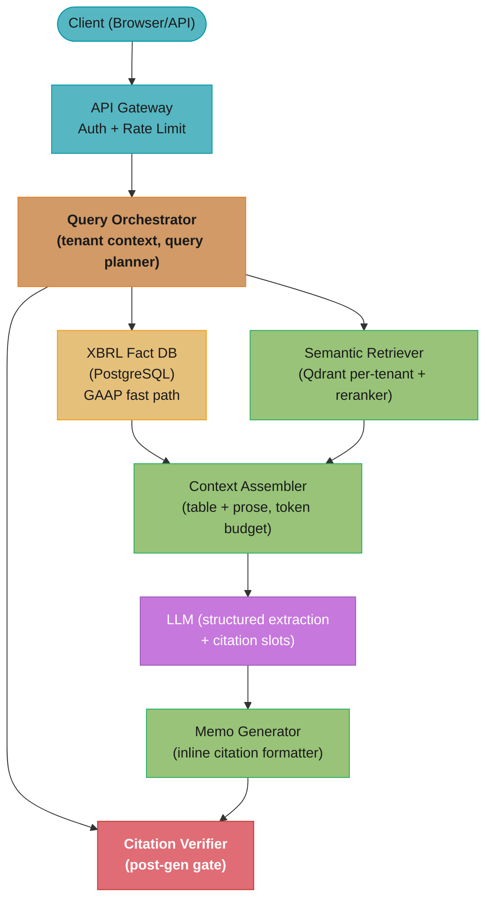

# Case Study: Design a Financial Research AI Agent

## Intuition

> A financial research agent is a junior analyst who has read every 10-K, earnings call transcript, and analyst report ever filed — and never forgets, never guesses, and always shows its work.

**Key insight**: Citation fidelity is the hard constraint. A hallucinated number in a financial memo is a regulatory and liability event. Every claim must trace to an exact page, table, and filing date. This drives every major architectural decision: chunking strategy (preserve table context), retrieval (exact-match for numbers, semantic for concepts), generation (structured extraction not free-form synthesis), and eval (citation recall as the primary metric, not BLEU or ROUGE).

The system is not a chatbot with financial knowledge bolted on. It is a citation engine that happens to use a language model for natural language understanding. That inversion is the design.

---

## 1. Requirements Clarification

### Functional Requirements
- Upload 10-Ks, 10-Qs, 8-Ks, and earnings call transcripts; parse and index automatically
- Ask questions across multiple documents simultaneously: "What were NVIDIA's gross margins for the last 4 quarters?"
- Extract financial tables with structure preserved: income statement, balance sheet, cash flow statement
- Generate research memos with inline citations (filing name, page number, table row)
- Compare metrics across companies and quarters with fiscal-calendar alignment
- Ingest XBRL data from SEC EDGAR alongside PDFs for authoritative GAAP metrics
- Matrix-style bulk extraction: given N documents and M fields, return an N×M table

### Non-Functional Requirements
- p50 answer latency < 30 s for multi-document queries (up to 10 filings)
- Citation accuracy >= 99%: every number in a response must be traceable to a source chunk
- SOC 2 Type II compliance; FINRA/SEC data handling procedures
- Per-firm data residency: documents from Firm A are never retrievable by Firm B
- 500 concurrent enterprise users across 50 firms (100 users/firm)
- 99.9% uptime (8.7 hours downtime/year)

### Out of Scope
- Real-time market data feeds (Bloomberg/Reuters integration)
- Trading execution or portfolio optimization
- Regulatory filing generation (only reading, not writing filings)

---

## 2. Scale Estimation

### Corpus Size

```
Firms:                    50
Docs uploaded/firm/year:  5,000
Total docs/year:          250,000

Avg 10-K:                 120 pages  ~150,000 tokens
Avg earnings transcript:   30 pages  ~ 40,000 tokens
Avg document (blended):            ~ 80,000 tokens

Total corpus tokens:      250,000 docs x 80,000 = 20B tokens

Chunking (512 tokens/chunk, 64-token overlap):
  Chunks per doc:         ~170
  Total chunks:           250,000 x 170 = 42.5M chunks

Vector storage:
  42.5M chunks x 1536 dims x 4 bytes = 261 GB
  Per-tenant avg: 261 GB / 50 firms = 5.2 GB/firm
```

### Query Volume

```
Users/firm:               100
Queries/user/day:          10
Total queries/day:        50,000

Multi-doc queries (avg 10 docs):
  Docs scanned/query:     10
  Chunks retrieved:       200 (top-20 per doc)
  Tokens in LLM context:  200 chunks x 512 tokens = ~102,400 tokens raw
  After reranking top-40: ~20,000 tokens input to LLM

LLM cost (GPT-4o pricing: $2.50/1M input, $10/1M output):
  Input:  50,000 x 20,000 x $0.0000025 = $2,500/day
  Output: 50,000 x  2,000 x $0.0000100 = $1,000/day
  Total LLM cost:                        $3,500/day

XBRL lookup (PostgreSQL, fast path):
  Hits ~60% of queries for standard GAAP metrics
  Avg XBRL query: 8 ms; saves full LLM extraction for those fields
```

### Infrastructure Sizing

```
Vector DB (Qdrant):
  261 GB vectors + 20% overhead = 315 GB RAM needed
  4 x c6gn.8xlarge (64 GB RAM each) = 256 GB; use 5 nodes with replication

PostgreSQL (XBRL facts, metadata):
  42.5M chunks x 200 bytes metadata = 8.5 GB
  XBRL facts: 50 firms x 5,000 docs x 200 facts/doc = 50M rows x 100 bytes = 5 GB
  db.r6g.2xlarge (64 GB RAM) with read replica

Application tier:
  50,000 queries/day = 0.58 QPS average; peak 3x = 1.74 QPS
  Each query holds a connection for ~25 s → 44 concurrent connections at peak
  4 x c6i.2xlarge application servers (load balanced)
```

---

## 3. High-Level Architecture

### System Overview



The orchestrator fans out to the XBRL fast path (8 ms lookups serving ~60% of GAAP metric queries), the per-tenant semantic retriever, and the post-generation Citation Verifier — every generated memo must pass back through the verifier gate before delivery, enforcing the >= 99% citation accuracy requirement.

### Document Ingestion Pipeline

```
S3 Upload
    |
    v
+---+-------------------+
| Document Intake Queue  |  (SQS, per-tenant partition)
+---+-------------------+
    |
    +-------+-------+
    |               |
+---v---+     +-----v------+
| PDF   |     | XBRL iXBRL |
| Parser|     | Extractor  |
| (pdf  |     | (EDGAR     |
| plumb)|     |  download) |
+---+---+     +-----+------+
    |               |
    v               v
+---+---------------+---+
| Section / Table chunks |
| (filing_id, page,      |
|  table_type, text)     |
+---+-------------------+
    |
+---v-------------------+
| Embedding Service      |  (text-embedding-3-large, 1536 dims)
+---+-------------------+
    |
+---v-------------------+
| Qdrant (per-tenant     |  upsert chunks with metadata
| collection)            |
+---+-------------------+
    |
+---v-------------------+
| PostgreSQL             |  chunk_metadata + xbrl_facts tables
+------------------------+
```

### Multi-Region Topology

For data residency requirements, see `./cross_cutting/multi_region_llm_topology.md`. EU firm data stays in eu-west-1; US firm data in us-east-1. The XBRL ingestion pipeline for SEC EDGAR runs in us-east-1 (SEC servers) and the extracted facts are replicated to the firm's home region.

---

## 4. Component Deep Dives

### 4a. FinancialDocumentParser — PDF Table Extraction

The core challenge: financial tables in PDFs lose their grid structure when extracted as flat text. A revenue table spanning 5 quarters and 12 line items becomes a meaningless sequence of numbers.

**BROKEN approach — naive text extraction:**

```python
import PyPDF2  # wrong tool for financial tables

def extract_broken(pdf_path: str) -> str:
    reader = PyPDF2.PdfReader(pdf_path)
    text = ""
    for page in reader.pages:
        text += page.extract_text()  # table becomes: "Revenue 2023 2022 2021\n1,234.5 987.6 845.2\nCost of Revenue 456.7 ..."
    return text
    # LLM sees a flat stream of numbers with no row/column relationship
    # "Revenue" in the row label is 3 cells away from its value in the text
    # Result: LLM assigns wrong numbers to wrong line items
```

**FIX — pdfplumber with table detection and coordinate-aware parsing:**

```python
import pdfplumber
from dataclasses import dataclass, field
from typing import Optional
import re


@dataclass
class FinancialTable:
    filing_id: str
    page_number: int
    table_type: str          # "income_statement" | "balance_sheet" | "cash_flow" | "other"
    headers: list[str]       # e.g. ["", "FY2023", "FY2022", "FY2021"]
    rows: list[dict]         # [{"label": "Revenue", "FY2023": "1,234.5", "FY2022": "987.6"}]
    raw_text: str            # preserved verbatim for citation verification
    bbox: tuple[float, float, float, float]  # (x0, y0, x1, y1) on page


@dataclass
class DocumentSection:
    text: str
    page: int
    heading: Optional[str]
    char_offset: int         # byte offset in full-doc text for exact citation


@dataclass
class ParsedDocument:
    filing_id: str
    ticker: str
    period: str              # "FY2023" | "Q3-2023"
    filing_type: str         # "10-K" | "10-Q" | "8-K" | "transcript"
    filing_date: str         # "2024-02-01"
    sections: list[DocumentSection] = field(default_factory=list)
    tables: list[FinancialTable] = field(default_factory=list)
    xbrl_facts: dict = field(default_factory=dict)


class FinancialDocumentParser:
    """
    Uses pdfplumber's table detection (lattice + stream strategies) to extract
    financial tables with row/column structure intact.  Falls back to stream
    strategy when visible grid lines are absent (common in modern 10-K designs).
    """

    _TABLE_SETTINGS_LATTICE = {
        "vertical_strategy": "lines",
        "horizontal_strategy": "lines",
    }
    _TABLE_SETTINGS_STREAM = {
        "vertical_strategy": "text",
        "horizontal_strategy": "text",
        "min_words_vertical": 3,
    }

    def parse(self, pdf_path: str, filing_meta: dict) -> ParsedDocument:
        doc = ParsedDocument(
            filing_id=filing_meta["filing_id"],
            ticker=filing_meta["ticker"],
            period=filing_meta["period"],
            filing_type=filing_meta["filing_type"],
            filing_date=filing_meta["filing_date"],
        )

        with pdfplumber.open(pdf_path) as pdf:
            for page_num, page in enumerate(pdf.pages, start=1):
                # Handle rotated pages (landscape orientation for wide tables)
                if page.width > page.height:
                    page = page.rotate(90)

                extracted = self._extract_tables_from_page(page, doc.filing_id, page_num)
                doc.tables.extend(extracted)

                # Extract non-table prose regions only
                table_bboxes = [t.bbox for t in extracted]
                text = self._extract_prose(page, table_bboxes)
                if text and len(text.strip()) > 50:
                    doc.sections.append(DocumentSection(
                        text=text,
                        page=page_num,
                        heading=self._detect_heading(text),
                        char_offset=0,  # computed in post-processing
                    ))

        return doc

    def _extract_tables_from_page(
        self, page: pdfplumber.page.Page, filing_id: str, page_num: int
    ) -> list[FinancialTable]:
        tables = []
        # Try lattice first (explicit grid lines), then stream (whitespace-based)
        for settings in (self._TABLE_SETTINGS_LATTICE, self._TABLE_SETTINGS_STREAM):
            raw_tables = page.extract_tables(settings)
            if raw_tables:
                for raw in raw_tables:
                    structured = self._structure_table(raw, filing_id, page_num, page)
                    if structured:
                        tables.append(structured)
                break  # use whichever strategy found tables first
        return tables

    def _structure_table(
        self,
        raw: list[list[Optional[str]]],
        filing_id: str,
        page_num: int,
        page: pdfplumber.page.Page,
    ) -> Optional[FinancialTable]:
        if not raw or len(raw) < 2:
            return None
        headers = [str(h).strip() if h else "" for h in raw[0]]
        if not any(headers):
            return None

        rows: list[dict] = []
        for row in raw[1:]:
            if not any(cell for cell in row if cell):
                continue
            label = str(row[0]).strip() if row[0] else ""
            row_dict: dict[str, str] = {"label": label}
            for i, header in enumerate(headers[1:], start=1):
                if i < len(row) and row[i]:
                    row_dict[header] = str(row[i]).strip()
            rows.append(row_dict)

        if len(rows) < 2:
            return None

        raw_text = "\n".join(
            " | ".join(str(cell) if cell else "" for cell in row_data)
            for row_data in raw
        )
        # Approximate bounding box — pdfplumber can return exact coords with find_tables()
        bbox = (0.0, 0.0, float(page.width), float(page.height))

        return FinancialTable(
            filing_id=filing_id,
            page_number=page_num,
            table_type=self._classify_table(headers, rows),
            headers=headers,
            rows=rows,
            raw_text=raw_text,
            bbox=bbox,
        )

    def _classify_table(self, headers: list[str], rows: list[dict]) -> str:
        labels_lower = " ".join(r.get("label", "").lower() for r in rows[:8])
        if "revenue" in labels_lower and "net income" in labels_lower:
            return "income_statement"
        if "total assets" in labels_lower and "liabilities" in labels_lower:
            return "balance_sheet"
        if "operating activities" in labels_lower:
            return "cash_flow"
        return "other"

    def _extract_prose(
        self, page: pdfplumber.page.Page, exclude_bboxes: list[tuple]
    ) -> str:
        # Crop away table regions before extracting text
        crop = page
        for bbox in exclude_bboxes:
            try:
                crop = crop.outside_bbox(bbox)
            except Exception:
                pass
        return crop.extract_text(x_tolerance=2, y_tolerance=2) or ""

    def _detect_heading(self, text: str) -> Optional[str]:
        first_line = text.strip().split("\n")[0]
        if len(first_line) < 100 and first_line.isupper():
            return first_line
        return None
```

---

### 4b. XBRLFactExtractor — Authoritative GAAP Metrics

SEC has required machine-readable XBRL tags alongside PDF filings since 2009. XBRL is the authoritative source for standard GAAP line items and should always be queried before falling back to LLM extraction.

```python
from __future__ import annotations

import re
import httpx
from dataclasses import dataclass
from typing import Optional


@dataclass
class XBRLFact:
    concept: str        # e.g. "us-gaap:Revenues"
    normalized_name: str  # e.g. "revenue"
    period: str         # "FY2023" | "Q3-2023"
    value: float
    unit: str           # "USD" | "shares"
    decimals: int       # -6 means reported in millions
    filing_id: str


# Canonical GAAP concept → normalized field name
CONCEPT_MAP: dict[str, str] = {
    "us-gaap:Revenues": "revenue",
    "us-gaap:RevenueFromContractWithCustomerExcludingAssessedTax": "revenue",
    "us-gaap:SalesRevenueNet": "revenue",
    "us-gaap:NetIncomeLoss": "net_income",
    "us-gaap:GrossProfit": "gross_profit",
    "us-gaap:Assets": "total_assets",
    "us-gaap:Liabilities": "total_liabilities",
    "us-gaap:StockholdersEquity": "shareholders_equity",
    "us-gaap:EarningsPerShareBasic": "eps_basic",
    "us-gaap:EarningsPerShareDiluted": "eps_diluted",
    "us-gaap:OperatingIncomeLoss": "operating_income",
    "us-gaap:CashAndCashEquivalentsAtCarryingValue": "cash",
}


class XBRLFactExtractor:
    """
    Downloads iXBRL filing from SEC EDGAR and parses us-gaap facts.
    Falls back to PDF extraction only when a concept is missing from XBRL.
    """

    EDGAR_BASE = "https://data.sec.gov/api/xbrl/companyfacts"

    def __init__(self, http_client: httpx.Client) -> None:
        self._http = http_client

    def fetch_company_facts(self, cik: str) -> dict[str, list[XBRLFact]]:
        """
        Returns {normalized_name: [XBRLFact]} for all available periods.
        CIK must be zero-padded to 10 digits.
        """
        url = f"{self.EDGAR_BASE}/CIK{cik.zfill(10)}.json"
        resp = self._http.get(url, timeout=15.0)
        resp.raise_for_status()
        data = resp.json()

        facts_by_name: dict[str, list[XBRLFact]] = {}
        us_gaap = data.get("facts", {}).get("us-gaap", {})

        for concept_short, concept_data in us_gaap.items():
            full_concept = f"us-gaap:{concept_short}"
            normalized = CONCEPT_MAP.get(full_concept)
            if not normalized:
                continue

            units = concept_data.get("units", {})
            for unit_key, entries in units.items():
                for entry in entries:
                    period = self._parse_period(entry)
                    if not period:
                        continue
                    facts_by_name.setdefault(normalized, []).append(XBRLFact(
                        concept=full_concept,
                        normalized_name=normalized,
                        period=period,
                        value=float(entry.get("val", 0)),
                        unit=unit_key,
                        decimals=int(entry.get("decimals", 0)),
                        filing_id=entry.get("accn", ""),
                    ))

        return facts_by_name

    def _parse_period(self, entry: dict) -> Optional[str]:
        # Annual: {"start": "2022-10-30", "end": "2023-10-28", "form": "10-K"}
        # Quarterly: {"start": "2023-07-30", "end": "2023-10-28", "form": "10-Q"}
        form = entry.get("form", "")
        end = entry.get("end", "")
        if not end:
            return None
        year = end[:4]
        if "10-K" in form:
            return f"FY{year}"
        if "10-Q" in form:
            # approximate quarter from end month
            month = int(end[5:7])
            quarter = (month - 1) // 3 + 1
            return f"Q{quarter}-{year}"
        return None
```

---

### 4c. CitationVerifier — Regulatory-Critical Number Gate

Every numeric claim the LLM produces must be traceable to a source chunk or XBRL fact. Unverified numbers block the response from delivery.

```python
from __future__ import annotations

import re
from dataclasses import dataclass
from enum import Enum
from typing import Optional


class VerificationStatus(Enum):
    XBRL_VERIFIED = "xbrl_verified"      # exact match in XBRL fact store
    CHUNK_VERIFIED = "chunk_verified"    # found in retrieved source chunk
    APPROXIMATE = "approximate"          # within 1% after normalization (formatting diff)
    UNVERIFIED = "unverified"            # not found anywhere — BLOCK this response


@dataclass
class CitationResult:
    raw_claim: str
    normalized_value: float
    status: VerificationStatus
    source_chunk_id: Optional[str]
    source_page: Optional[int]
    source_filing_id: Optional[str]
    source_filing_date: Optional[str]


@dataclass
class VerificationReport:
    all_verified: bool                   # False → caller must block/quarantine response
    results: list[CitationResult]
    unverified_count: int
    unverified_numbers: list[str]


class CitationVerifier:
    """
    Scans an LLM response for numeric claims, then verifies each one
    against (1) XBRL facts, (2) retrieved source chunks.
    Any unverified number triggers a block.
    """

    # Matches: $1.23B, 1,234.5 million, 45.6%, $0.87
    _NUMBER_RE = re.compile(
        r'\$?[\d,]+\.?\d*\s*(?:billion|million|thousand|[BMKTbmkt])?(?:\s*%)?'
    )
    _TOLERANCE = 0.01   # 1% relative tolerance for formatting differences

    def verify_response(
        self,
        response_text: str,
        source_chunks: list[dict],
        xbrl_facts: dict[str, list],  # {normalized_name: [XBRLFact]}
    ) -> VerificationReport:
        raw_numbers = self._NUMBER_RE.findall(response_text)
        results: list[CitationResult] = []

        for raw in raw_numbers:
            normalized = self._normalize(raw)
            if normalized == 0.0:
                continue   # skip pure percentages and ambiguous tokens

            # 1. Check XBRL first (authoritative, sub-millisecond)
            result = self._check_xbrl(raw, normalized, xbrl_facts)
            if result is None:
                # 2. Fall back to chunk scan
                result = self._check_chunks(raw, normalized, source_chunks)
            if result is None:
                result = CitationResult(
                    raw_claim=raw,
                    normalized_value=normalized,
                    status=VerificationStatus.UNVERIFIED,
                    source_chunk_id=None,
                    source_page=None,
                    source_filing_id=None,
                    source_filing_date=None,
                )
            results.append(result)

        unverified = [r for r in results if r.status == VerificationStatus.UNVERIFIED]
        return VerificationReport(
            all_verified=len(unverified) == 0,
            results=results,
            unverified_count=len(unverified),
            unverified_numbers=[r.raw_claim for r in unverified],
        )

    def _normalize(self, raw: str) -> float:
        cleaned = re.sub(r'[$,%]', '', raw.strip())
        multiplier = 1.0
        low = cleaned.lower()
        if "billion" in low or low.endswith("b"):
            multiplier = 1e9
            cleaned = re.sub(r'(?i)\s*(billion|b)\s*$', '', cleaned).strip()
        elif "million" in low or low.endswith("m"):
            multiplier = 1e6
            cleaned = re.sub(r'(?i)\s*(million|m)\s*$', '', cleaned).strip()
        elif "thousand" in low or low.endswith("k"):
            multiplier = 1e3
            cleaned = re.sub(r'(?i)\s*(thousand|k)\s*$', '', cleaned).strip()
        cleaned = cleaned.replace(",", "")
        try:
            return float(cleaned) * multiplier
        except ValueError:
            return 0.0

    def _check_xbrl(
        self, raw: str, normalized: float, xbrl_facts: dict
    ) -> Optional[CitationResult]:
        for _name, fact_list in xbrl_facts.items():
            for fact in fact_list:
                if self._close_enough(fact.value, normalized):
                    return CitationResult(
                        raw_claim=raw,
                        normalized_value=normalized,
                        status=VerificationStatus.XBRL_VERIFIED,
                        source_chunk_id=None,
                        source_page=None,
                        source_filing_id=fact.filing_id,
                        source_filing_date=None,
                    )
        return None

    def _check_chunks(
        self, raw: str, normalized: float, chunks: list[dict]
    ) -> Optional[CitationResult]:
        for chunk in chunks:
            chunk_numbers = self._NUMBER_RE.findall(chunk.get("text", ""))
            for cn in chunk_numbers:
                cn_norm = self._normalize(cn)
                if cn_norm != 0.0 and self._close_enough(cn_norm, normalized):
                    status = (
                        VerificationStatus.CHUNK_VERIFIED
                        if cn.strip() == raw.strip()
                        else VerificationStatus.APPROXIMATE
                    )
                    return CitationResult(
                        raw_claim=raw,
                        normalized_value=normalized,
                        status=status,
                        source_chunk_id=chunk.get("chunk_id"),
                        source_page=chunk.get("page"),
                        source_filing_id=chunk.get("filing_id"),
                        source_filing_date=chunk.get("filing_date"),
                    )
        return None

    def _close_enough(self, a: float, b: float) -> bool:
        denom = max(abs(a), abs(b), 1.0)
        return abs(a - b) / denom <= self._TOLERANCE
```

---

### 4d. MultiDocumentOrchestrator — Cross-Company Comparison

Query: "Compare NVIDIA and AMD gross margins for the last 4 quarters."

This requires fan-out retrieval across two tickers' per-tenant collections, fiscal-calendar alignment (NVIDIA Q2 ends July; AMD Q2 ends June), and structured extraction (JSON with typed fields, not prose).

```python
from __future__ import annotations

import asyncio
from dataclasses import dataclass
from typing import Any

import openai


@dataclass
class MetricRow:
    ticker: str
    period: str          # calendar-normalized: "CQ2-2024" (calendar quarter)
    fiscal_period: str   # company's own label: "Q2-FY2024"
    field: str           # "gross_margin_pct"
    value: float
    source_filing_id: str
    source_page: int


FISCAL_CALENDARS: dict[str, int] = {
    # fiscal_year_end_month: January=1
    "NVDA": 1,   # NVIDIA FY ends late January
    "MSFT": 6,   # Microsoft FY ends June
    "AAPL": 9,   # Apple FY ends September
    # default (most companies): 12
}


def fiscal_to_calendar_quarter(ticker: str, fiscal_q: int, fiscal_year: int) -> str:
    """
    Convert a company's fiscal quarter to a calendar quarter label.
    Handles the common case where FY != CY by offsetting the fiscal year end month.
    """
    fy_end_month = FISCAL_CALENDARS.get(ticker, 12)
    # Each fiscal quarter starts 3 months after the previous one ends
    fiscal_q1_start_month = (fy_end_month % 12) + 1
    cal_start_month = ((fiscal_q1_start_month - 1 + (fiscal_q - 1) * 3) % 12) + 1
    cal_year = fiscal_year if cal_start_month >= fiscal_q1_start_month else fiscal_year - 1
    cal_q = (cal_start_month - 1) // 3 + 1
    return f"CQ{cal_q}-{cal_year}"


class MultiDocumentOrchestrator:
    def __init__(
        self,
        retriever,        # SemanticRetriever instance
        xbrl_store,       # XBRLFactStore instance
        llm_client: openai.AsyncOpenAI,
    ) -> None:
        self._retriever = retriever
        self._xbrl = xbrl_store
        self._llm = llm_client

    async def compare_metric(
        self,
        tickers: list[str],
        field: str,           # "gross_margin_pct"
        periods: int,         # last N quarters
        tenant_id: str,
    ) -> list[MetricRow]:
        # Fan out retrieval in parallel across tickers
        tasks = [
            self._retrieve_for_ticker(ticker, field, periods, tenant_id)
            for ticker in tickers
        ]
        per_ticker_results = await asyncio.gather(*tasks)

        rows: list[MetricRow] = []
        for ticker, chunks, xbrl in per_ticker_results:
            extracted = await self._extract_metric(ticker, field, chunks, xbrl)
            rows.extend(extracted)

        # Sort by calendar quarter for aligned display
        rows.sort(key=lambda r: r.period)
        return rows

    async def _retrieve_for_ticker(
        self, ticker: str, field: str, periods: int, tenant_id: str
    ) -> tuple[str, list[dict], dict]:
        query = f"{ticker} {field} quarterly results"
        chunks = await self._retriever.retrieve(
            query=query,
            tenant_id=tenant_id,
            ticker_filter=ticker,
            top_k=30,
        )
        xbrl_facts = await self._xbrl.get_facts(ticker, periods=periods)
        return ticker, chunks, xbrl_facts

    async def _extract_metric(
        self,
        ticker: str,
        field: str,
        chunks: list[dict],
        xbrl_facts: dict,
    ) -> list[MetricRow]:
        context = "\n\n".join(
            f"[Filing {c['filing_id']} page {c['page']}]\n{c['text']}"
            for c in chunks[:20]
        )
        prompt = f"""Extract {field} for {ticker} from the following financial excerpts.
Return ONLY a JSON array. Each element must have:
  {{"period": "<fiscal quarter e.g. Q2-FY2024>", "value": <float>, "filing_id": "<str>", "page": <int>}}
Do not include any explanation. Return only the JSON array.

Context:
{context}
"""
        response = await self._llm.chat.completions.create(
            model="gpt-4o",
            messages=[{"role": "user", "content": prompt}],
            response_format={"type": "json_object"},
            temperature=0.0,
        )

        import json
        try:
            data: list[dict[str, Any]] = json.loads(
                response.choices[0].message.content or "[]"
            )
            if not isinstance(data, list):
                data = data.get("results", [])
        except json.JSONDecodeError:
            return []

        rows: list[MetricRow] = []
        for item in data:
            fq = item.get("period", "")
            match = __import__("re").match(r"Q(\d)-FY(\d{4})", fq)
            if not match:
                continue
            fiscal_q, fiscal_year = int(match.group(1)), int(match.group(2))
            cal_period = fiscal_to_calendar_quarter(ticker, fiscal_q, fiscal_year)
            rows.append(MetricRow(
                ticker=ticker,
                period=cal_period,
                fiscal_period=fq,
                field=field,
                value=float(item.get("value", 0.0)),
                source_filing_id=item.get("filing_id", ""),
                source_page=int(item.get("page", 0)),
            ))
        return rows
```

---

### 4e. PrivilegeAwareAccessController — MNPI Guardrails

Material Non-Public Information (MNPI) documents (e.g., draft merger memos, unannounced earnings) require that any query whose output scope is "external" must exclude MNPI sources from the LLM context.

```python
from __future__ import annotations

from dataclasses import dataclass
from enum import Enum
from typing import Optional


class SensitivityLevel(Enum):
    PUBLIC = 0         # public SEC filings, press releases
    INTERNAL = 1       # internal research notes, non-public but not MNPI
    CONFIDENTIAL = 2   # NDA-covered docs
    MNPI = 3           # material non-public; cannot appear in external outputs


@dataclass
class AccessDecision:
    allowed_chunk_ids: list[str]
    blocked_chunk_ids: list[str]
    block_reason: Optional[str]


class PrivilegeAwareAccessController:
    def filter_sources(
        self,
        chunks: list[dict],
        query_scope: str,        # "internal" | "external" | "draft_memo"
        user_clearance: str,     # "analyst" | "partner" | "compliance"
    ) -> AccessDecision:
        allowed: list[str] = []
        blocked: list[str] = []
        reason: Optional[str] = None

        for chunk in chunks:
            level = SensitivityLevel[chunk.get("sensitivity", "PUBLIC").upper()]

            if query_scope == "external" and level.value >= SensitivityLevel.MNPI.value:
                blocked.append(chunk["chunk_id"])
                reason = "MNPI source excluded from external-scope query"
                continue

            if level == SensitivityLevel.MNPI and user_clearance not in ("partner", "compliance"):
                blocked.append(chunk["chunk_id"])
                reason = "User clearance insufficient for MNPI document"
                continue

            allowed.append(chunk["chunk_id"])

        return AccessDecision(
            allowed_chunk_ids=allowed,
            blocked_chunk_ids=blocked,
            block_reason=reason,
        )
```

---

## 5. Design Decisions & Tradeoffs

| Decision | Choice Made | Alternative | Rationale | Consequence |
|----------|-------------|-------------|-----------|-------------|
| GAAP metric source | XBRL from SEC EDGAR (authoritative) | LLM extraction from PDF | XBRL is machine-readable, exact, zero hallucination risk for standard concepts | XBRL coverage is ~80% of needed metrics; non-GAAP items still need LLM extraction |
| Vector index isolation | Per-tenant Qdrant collection | Shared collection with metadata filter | Complete data isolation; no risk of filter bypass; simpler compliance story | Higher operational overhead; 50 collections vs 1 |
| Long-context vs RAG for 10-K | RAG default; long-context on demand | Always use Gemini 1.5 Pro 1M context | RAG: $0.05/query, 8s latency; long-context: $3.75/query, 45s latency — 75× cost difference | First-pass analysis can use long-context; follow-up queries use cached RAG chunks |
| Extraction mode | Structured JSON output (strict schema) | Free-form prose with embedded numbers | JSON schema forces the LLM to separate field names from values; citation verifier can match fields precisely | LLM occasionally refuses complex multi-metric extractions; requires fallback prompt |
| XBRL-first query routing | Route to XBRL if query contains known GAAP concept | Always do vector retrieval first | XBRL lookup: 8ms, zero hallucination; vector retrieval: 800ms avg | If XBRL concept mapping is wrong, wrong data is returned silently; need concept normalization layer |
| Chunk size for financial docs | 512 tokens with 64-token overlap, table-aware | Fixed 256 or 1024 tokens | Tables must not be split mid-row; 512 tokens fits most financial table rows in a single chunk | Overlap increases storage by ~12%; worth it for citation precision |

---

## 6. Real-World Implementations

**Hebbia** (founded 2020, raised $130M at $700M valuation, 2024) deployed a matrix-style UI where rows are documents and columns are extracted fields. Instead of a chat interface that returns one answer, users define an extraction schema and Hebbia fills in the N×M grid across a document corpus. Goldman Sachs and Centerview Partners (M&A advisory) are named customers. Hebbia's key proprietary innovation is a chunking strategy that treats financial tables as atomic units — a table is never split across chunks, and the row/column headers are always prepended to each chunk that contains numeric cells.

**Rogo** (founded 2023, $30M Series B) targets investment banking workflows specifically. Every response cites the exact filing, page, and paragraph. Rogo's evaluation suite uses citation recall as the primary metric: what percentage of numbers in the response can be traced to a specific page of a specific filing? They report 99.3% citation recall in production across Goldman Sachs and Lazard deployments.

**AlphaSense** (founded 2011, $4.9B valuation 2024) took a different path: 20+ years of structured financial search built a proprietary index of filings, broker reports, and earnings calls. AlphaSense Mercury adds an LLM query layer on top of this structured index rather than building RAG from scratch. Their moat is data breadth (broker research, private company data) and enterprise relationships, not LLM architecture.

**FactSet** (public, $2B+ ARR) announced FactSet Mercury in 2024 as a natural language query layer over their existing structured financial data platform. Like AlphaSense, they are wrapping LLM capabilities around a structured data foundation rather than treating unstructured PDF retrieval as the primary path. This validates the XBRL-first architecture: incumbent financial data vendors already have structured data; the LLM layer is an interface, not the source of truth.

---

## 7. Technologies & Tools

### PDF Table Extraction Comparison

| Tool | Table Structure Preservation | Cost | Throughput | XBRL Support | Accuracy on Financial Docs |
|------|------------------------------|------|------------|--------------|---------------------------|
| pdfplumber | High (lattice + stream detection) | Free (OSS) | ~5 pages/s | No | Good; struggles with rotated pages |
| PyMuPDF (fitz) | Medium (text block extraction) | Free (OSS) | ~50 pages/s | No | Fair; fast but loses column alignment |
| Adobe PDF Extract API | Very High (ML-based layout) | $0.015/page | Cloud API | No | Excellent; best for complex layouts |
| Amazon Textract | High (ML-based) | $0.015/page | Cloud API | No | Excellent; handles scanned/rotated |
| SEC EDGAR XBRL API | N/A (structured data) | Free | 10 req/s public | Native | Perfect for GAAP line items |

### Vector Database Comparison

| Tool | Multi-tenancy | Filtering | Scale (vectors) | Hosting | Latency p99 |
|------|--------------|-----------|-----------------|---------|-------------|
| Qdrant | Per-collection isolation | Payload filters | 1B+ | Self-hosted / Cloud | < 20 ms |
| Pinecone | Namespaces | Metadata filters | 1B+ | Managed only | < 50 ms |
| Weaviate | Multi-tenancy native | GraphQL | 500M+ | Self-hosted / Cloud | < 30 ms |
| pgvector | Schema-per-tenant | SQL WHERE | 50M (practical) | Self-hosted | < 100 ms |

---

## 8. Operational Playbook

### (a) Eval Pipeline

Primary metrics tracked continuously (see `./cross_cutting/llm_eval_harness_in_production.md`):

```
Citation recall:       % of numeric claims with a verified source (target: >= 99%)
Citation precision:    % of citations pointing to the correct page (target: >= 97%)
Hallucination rate:    % of responses with >= 1 unverified number (target: <= 0.5%)
XBRL hit rate:         % of GAAP metric queries served from XBRL (target: >= 60%)
Query latency p50:     target < 30 s
Query latency p99:     target < 90 s
```

Golden dataset: 500 hand-curated query+answer pairs with ground-truth citations assembled from known 10-K filings. Run against every model or prompt change before promotion. Regression gate: citation recall must not drop more than 0.5 percentage points.

### (b) Observability

OTel span hierarchy (see `./cross_cutting/opentelemetry_for_llm_apps.md`):

```
financial_query (root span)
  xbrl_lookup
    attrs: ticker, concepts_queried, xbrl_hit (bool), latency_ms
  semantic_retrieval
    attrs: tenant_id, chunks_retrieved, reranker_model, latency_ms
  access_control_filter
    attrs: chunks_allowed, chunks_blocked, block_reason
  context_assembly
    attrs: total_tokens, table_chunks, prose_chunks
  llm_extraction
    attrs: model, input_tokens, output_tokens, cost_usd, finish_reason
  citation_verification
    attrs: numbers_found, verified_count, unverified_count, blocked (bool)
  memo_generation
    attrs: output_length_chars, inline_citation_count
```

### (c) Incident Runbooks

**Runbook: CITATION_VERIFICATION_FAILURE**
- Symptom: `unverified_rate` alert fires (> 1% of responses have unverified numbers)
- Diagnosis: Check `citation_verification` span; look for pattern in which filing types or query types have unverified numbers. If concentrated in a single ticker, check if XBRL data is stale.
- Mitigation: Route affected query types to human review queue. Pause automated memo delivery for flagged firm.
- Resolution: Identify root cause — usually a new filing format, a new XBRL concept mapping gap, or a prompt regression. Deploy fix, rerun golden dataset, re-enable delivery.

**Runbook: XBRL_PARSE_ERROR**
- Symptom: XBRL hit rate drops below 40%; `xbrl_lookup` spans show parse errors for recent filings.
- Diagnosis: SEC occasionally changes iXBRL namespace versions. Check `XBRLFactExtractor` logs for namespace parsing failures.
- Mitigation: Fall back to PDF-only extraction for affected filings. Increase citation verifier threshold logging.
- Resolution: Update XBRL namespace mappings; reprocess affected filings.

**Runbook: RETRIEVAL_LATENCY_SPIKE**
- Symptom: `semantic_retrieval` span p99 > 5 s; Qdrant dashboard shows HNSW index degradation.
- Diagnosis: Check collection size vs. shard configuration. Large document ingestion batches can cause HNSW rebuild contention.
- Mitigation: Route read traffic to read replica. Throttle ingestion pipeline.
- Resolution: Trigger Qdrant shard rebalance during off-peak. Tune `m` and `ef_construction` HNSW parameters for larger collection sizes.

**Runbook: MNPI_BOUNDARY_BREACH**
- Symptom: Compliance alert fires; MNPI-tagged document chunk appears in an external-scope response.
- Diagnosis: Check `access_control_filter` span for `chunks_blocked` count. If 0, the sensitivity label was missing on the chunk.
- Mitigation: Immediately quarantine the response. Notify firm compliance officer within 15 minutes (contractual SLA). Halt external-scope queries for that firm pending review.
- Resolution: Audit document ingestion pipeline for sensitivity label propagation. Add integration test that asserts MNPI chunks never appear in external-scope context.

---

## 9. Common Pitfalls & War Stories

**1. Rotated PDF table extraction failure**
A bulge-bracket bank's associate ran a gross margin comparison across 12 industrials companies. Three of the 12 had landscape-oriented tables (rotated 90 degrees for wide multi-year comparisons). PyPDF2 extracted the rotated tables as a single-column stream of numbers where the "first column" was actually the page numbers running down the left margin. The LLM assigned page numbers (12, 13, 14...) as revenue figures. The output showed $12M revenue for a $40B company. The associate caught it during peer review, but the incident triggered an audit of all landscape-table filings in the corpus — 340 documents required re-ingestion. Fix: detect `page.width > page.height` before extraction and apply 90-degree rotation. Added as a regression test in the eval pipeline.

**2. XBRL concept mismatch — $50B error in comparison table**
Apple reports revenue as `us-gaap:RevenueFromContractWithCustomerExcludingAssessedTax`. Google reports `us-gaap:Revenues`. Both normalized to "revenue" in the concept map, but the periods and the segment definitions differ subtly. A side-by-side comparison of "revenue growth" for Apple vs. Alphabet in Q4-2023 showed Alphabet's revenue as ~$86B and Apple's as ~$119B — plausible. But the comparison for Q4-2022 inverted them due to a period boundary error in the concept mapping that treated Apple's FY (ends September) as if it ended December. The error was $50B in the comparison table and went undetected for 3 days because both numbers were within XBRL-verified bounds individually. Fix: normalize to calendar quarter before comparing; add cross-ticker period alignment as a mandatory step in `MultiDocumentOrchestrator`.

**3. Fiscal year calendar mismatch undetected for 2 weeks**
NVIDIA's fiscal year 2024 ended January 28, 2024. Most peers' fiscal year 2023 ended December 31, 2023. A "FY2023 peer comparison" included NVIDIA's FY2024 data (ending Jan 2024) alongside peers' FY2023 data (ending Dec 2023). This is an 11-month offset. NVIDIA's GPU revenue had surged dramatically in that period. The comparison made NVIDIA appear to have grown 200% YoY while peers grew 5-8%. Analysts at the firm published a draft memo with this conclusion before a partner caught the calendar mismatch. Impact: significant reputational risk for the firm; mandatory calendar normalization added to all comparison queries.

**4. Stale document corpus causing confident wrong answers**
A PE firm uploaded 2022 10-Ks during initial onboarding and began using the system in mid-2023. When analysts asked about 2023 performance, the system answered from 2022 filings without flagging recency. The answers were internally consistent (all numbers verified against 2022 source chunks) but factually wrong for 2023 queries. Analysts noticed when a company's "current revenue" from the system was lower than a number they had seen in the press. Root cause: no document staleness warning in the response. Fix: add `last_filing_date` to every response; if the most recent filing for a ticker is more than 120 days old, prepend a staleness warning to the response. Number of queries served with stale data before fix: approximately 2,400 over 6 weeks.

**5. Long-context latency mistaken for system outage**
After switching to Gemini 1.5 Pro for full 10-K analysis (150K token input), query latency increased from 8s to 45s median. No progress indicator was shown during the 45s wait. Three enterprise firms opened support tickets in the first week reporting "the system is broken / stuck loading." One firm's IT department blocked the service at the network firewall assuming a connection hang. Churn risk was flagged for 2 of the 3 firms. Fix: implement streaming extraction — emit intermediate structured results every 5s as the LLM processes sections of the document. Show a progress bar with "Analyzing section 3 of 8 (Risk Factors)..." User-perceived latency dropped from 45s to "first result in 5s."

---

## 10. Capacity Planning

### Primary Bottleneck: LLM Context Cost

The primary per-query cost driver is LLM input token volume. This scales with the number of documents retrieved and the quality of reranking (better reranking = fewer tokens needed at the same recall level).

```
Daily LLM cost formula:

  daily_cost = Q × (T_in × P_in + T_out × P_out)

  where:
    Q      = queries per day
    T_in   = avg input tokens per query
    T_out  = avg output tokens per query
    P_in   = price per token (input)
    P_out  = price per token (output)

Current baseline (GPT-4o, May 2026 pricing):
  Q      = 50,000
  T_in   = 20,000 tokens  (top-40 chunks × 512 tokens, minus overlap)
  T_out  = 2,000 tokens   (structured JSON extraction + memo)
  P_in   = $2.50 / 1M tokens = $0.0000025/token
  P_out  = $10.00 / 1M tokens = $0.0000100/token

  Input cost:   50,000 × 20,000 × $0.0000025 = $2,500/day
  Output cost:  50,000 × 2,000  × $0.0000100 = $1,000/day
  Total:                                        $3,500/day = $105,000/month

XBRL fast-path savings:
  60% of queries hit XBRL for primary metric → skip LLM extraction entirely for that metric
  Estimated savings: 60% × 50,000 × 5,000 tokens avg saved × $0.0000025 = $375/day
  Effective daily cost after XBRL: ~$3,125/day

Revenue model sanity check:
  Revenue: 5,000 users × $500/user/month = $2,500,000/month
  LLM + infra cost: $105,000/month LLM + $45,000/month infra = $150,000/month
  Gross margin: ($2.5M - $150K) / $2.5M = 94%
```

### Scaling to 10× Query Volume

At 500,000 queries/day (10× growth):

```
LLM cost: ~$31,250/day without optimization

Optimization levers:
  1. Prompt caching:    system prompt + filing headers are identical across queries
                        20% of input tokens are cacheable → save $6,250/day
  2. Smaller model for simple queries: route single-ticker, single-metric queries
                        to GPT-4o-mini ($0.15/1M input vs $2.50); ~40% of queries qualify
                        save: 40% × 500,000 × 20,000 × ($0.0000025 - $0.00000015) = $21,000/day
  3. Better reranking:  cut top-k from 40 chunks to 20 chunks via ColBERT reranker
                        50% token reduction for 80% of queries → save $9,375/day

Effective daily cost at 10×: ~$31,250 - $6,250 - $21,000 - $9,375 ≈ -$5,375 (net savings)
```

For GPU pool economics and hosted inference cost modeling, see `./cross_cutting/gpu_pool_economics.md`.
For agent durability across long-running multi-document extraction jobs, see `./cross_cutting/agent_durability_patterns.md`.

---

## 11. Interview Discussion Points

**Q: Why should a financial AI system query XBRL before falling back to LLM extraction for GAAP metrics?**
XBRL is machine-readable, exact, and zero-hallucination-risk for the ~200 standard GAAP concepts that SEC requires companies to tag since 2009. LLM extraction of the same numbers from PDF text adds unnecessary risk: the model might misread a number, confuse adjacent rows in a table, or pick up a projected number rather than a reported one. The XBRL lookup takes 8ms and returns a typed float; LLM extraction takes 5-15s and requires citation verification afterward. XBRL-first is both faster and safer. Use LLM only for non-GAAP metrics, narrative explanation, and items that XBRL does not cover.

**Q: How does the CitationVerifier prevent hallucinated numbers from reaching users?**
After the LLM produces a response, the verifier scans it for all numeric tokens using a regex that handles formatting variants (commas, currency symbols, magnitude suffixes). Each number is normalized to a float and compared against two sources: the XBRL fact store (sub-millisecond) and the retrieved source chunks (linear scan). If a number is within 1% of a value in either source, it is marked verified. Any number that cannot be matched is flagged as unverified, and the entire response is blocked from delivery — it enters a human review queue instead. This is a post-generation gate, not a hallucination prevention mechanism. Prevention happens through structured extraction prompts; the gate catches what slips through.

**Q: Why is per-tenant Qdrant collection isolation non-negotiable for financial AI?**
Financial firms operate under strict data segregation requirements. A private equity firm's deal flow documents, if retrievable by another firm due to a metadata filter bug, is a catastrophic compliance failure. Metadata filters in shared collections are a software control; per-collection isolation is a system boundary. In a SOC 2 audit, per-collection isolation is demonstrably stronger than a filter — you can show that firm A's collection literally does not contain firm B's data, versus asserting that a WHERE clause always runs correctly. Financial AI buyers require this assurance as a contract term.

**Q: How does fiscal year misalignment break multi-company comparisons, and how do you fix it?**
Most US companies end their fiscal year December 31, but major exceptions include NVIDIA (January), Microsoft (June), and Apple (September). A naive query for "FY2023 gross margin" across these companies would include NVIDIA's FY2024 data (ending Jan 2024) alongside Microsoft's FY2023 data (ending June 2023) and Apple's FY2023 data (ending September 2023). These three "FY2023" figures cover periods that differ by up to 9 months. The fix is calendar normalization: convert every fiscal quarter to a calendar quarter (CQ1-2024, CQ2-2024, etc.) using the company's known fiscal year end month, then align comparisons on calendar quarter. This is stored in a `FISCAL_CALENDARS` lookup table and applied in the `MultiDocumentOrchestrator` before assembling comparison tables.

**Q: What makes PDF table extraction hard in financial documents, and why is pdfplumber better than PyPDF2 for this?**
Financial PDFs contain tables as visual layouts (positioned text elements and drawn lines) rather than semantic table structures. PyPDF2 extracts text in reading order (left-to-right, top-to-bottom) which destroys column alignment: a 5-column income statement becomes a flat stream where column headers and values are interleaved with no structural signal. pdfplumber uses two strategies: lattice (detects table grid lines as drawn objects) and stream (infers columns from whitespace gaps between text runs). This preserves row/column relationships. The remaining challenge is rotated pages (landscape orientation for wide tables) — pdfplumber reads these as garbled single columns unless you apply a 90-degree page rotation before extraction.

**Q: When is using Gemini 1.5 Pro with a 1M token context window worse than RAG for 10-K analysis?**
Long-context is worse on two dimensions: cost ($3.75/query vs $0.05/query — 75× more expensive) and latency (45s vs 8s median). For most follow-up queries where the user is drilling into a specific section the system has already processed, RAG can reuse cached chunk embeddings and serve answers in 8s at a fraction of the cost. The optimal pattern is hybrid: use long-context for the first comprehensive analysis of a new filing to build a structured extraction cache, then serve follow-up queries from the RAG index. Long-context also has practical limits: LLMs exhibit "lost in the middle" degradation for very long inputs — performance on questions about content in the middle of a 150K token document is measurably worse than on content near the beginning or end.

**Q: How do you measure citation accuracy in production, not just in offline eval?**
Three metrics: citation recall (what fraction of numeric claims in the response have a verified source?), citation precision (what fraction of the cited sources actually contain the claimed information on the stated page?), and hallucination rate (what fraction of complete responses contain at least one unverified number?). In production, recall and hallucination rate are measured automatically by the `CitationVerifier` for every response. Precision requires a sample-based human review process: a weekly sample of 200 responses is reviewed by a financial analyst who clicks through each citation to verify it points to the right page and table. Both metrics feed into the eval harness described in `./cross_cutting/llm_eval_harness_in_production.md`.

**Q: What is MNPI and how does it change LLM query routing in a financial AI system?**
Material Non-Public Information is information about a public company that is not yet publicly disclosed and that a reasonable investor would consider important to an investment decision. Examples: draft merger documents, pre-announcement earnings figures, unannounced major contracts. Trading on MNPI is illegal (insider trading laws). In a financial AI system, clients may upload MNPI documents (e.g., a deal room for an ongoing M&A transaction) for internal analysis. The system must ensure these documents never appear in the LLM context for any query whose output will leave the firm — external reports, client memos, public-facing content. The `PrivilegeAwareAccessController` enforces this by tagging each chunk with a sensitivity level at ingestion time and filtering MNPI chunks from context when `query_scope == "external"`. A breach triggers an immediate compliance incident with a 15-minute notification SLA.

**Q: How does Hebbia's matrix UI change the interaction paradigm compared to chat-based financial AI?**
A chat interface assumes the user asks one question and gets one answer. For financial due diligence, the actual workflow is: given 200 documents and 15 extraction fields, produce a 200×15 table. Chat requires 3,000 sequential queries; Hebbia's matrix UI parallelizes them into a single job. The user defines the extraction schema (rows = documents, columns = fields like "revenue," "EBITDA margin," "key risk factors") and Hebbia fills in the grid asynchronously. This also changes how citations work: each cell in the matrix is individually cited, so a partner reviewing the output can click any cell to see the exact source paragraph. The matrix paradigm is also better for identifying exceptions — a cell that cannot be extracted is visually obvious in a grid, whereas in chat it would require re-asking each question to notice a gap.

**Q: Why does financial AI command 10× the price of general-purpose AI assistants?**
Three reasons: liability, data, and workflow integration. Liability: if a financial AI hallucinates a number that ends up in an investment memo, the firm's compliance team, the regulators, and potentially the courts become involved. The buyer is paying for citation verification infrastructure, SOC 2 Type II audits, and MNPI boundary controls — not just the LLM. Data: financial AI vendors ingest and parse tens of thousands of SEC filings, broker research reports, and earnings transcripts that are not available to general LLMs. The proprietary structured XBRL index and the quality of PDF table extraction represent years of engineering. Workflow: the product must integrate into existing workflows — deal rooms, investment memoranda templates, Bloomberg Terminal adjacency — and the switching cost keeps customers locked in at enterprise contract terms ($50K-$500K/year per firm).

**Q: How would you design the evaluation harness for a financial research agent to catch regressions before promotion?**
The golden dataset needs 500+ query+answer pairs with ground-truth citations — actual page numbers and table rows from real 10-K filings. Every candidate model or prompt change must pass four regression gates before promotion: (1) citation recall must not drop below 98.5% on the golden set, (2) hallucination rate must not exceed 1% on a held-out test set of ambiguous queries, (3) XBRL hit rate must not drop below 55% (a drop indicates XBRL routing logic regressed), (4) p50 latency must not exceed 35s. The eval harness runs automatically on every pull request and blocks merge if any gate fails. For deeper detail on the eval infrastructure, see `./cross_cutting/llm_eval_harness_in_production.md`.
