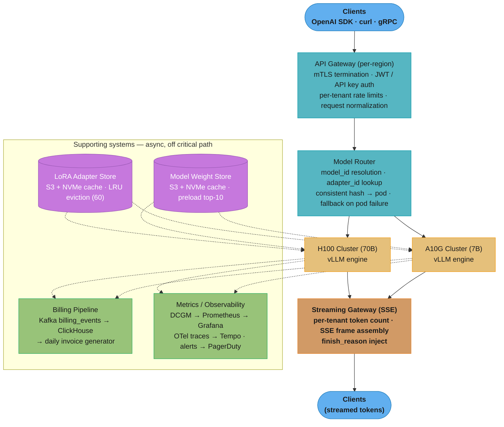

# Case Study: Design a Multi-Tenant GPU Inference Platform

## Intuition

> **Design intuition**: A GPU inference platform is the picks-and-shovels layer of the LLM gold rush — it abstracts GPU scarcity, cold-start latency, and multi-tenancy so application developers can call an API with a base_url swap and never think about NCCL topology, KV-cache pressure, or LoRA adapter eviction. The hard problems are not model quality but operational: how do you serve 1,000 customer LoRA adapters on 4 GPUs without reloading the 140 GB base model for each request, and how do you provision a 70B model in under 60 seconds on a cold pod?

**Key insight for this design**: GPU memory (HBM) is the scarce resource that governs everything. Every architectural decision — PagedAttention, LoRA multiplexing, heterogeneous GPU fleets, autoscaling on token throughput instead of RPS — exists to maximize useful tokens generated per GB of HBM per dollar per second. An inference platform that does not obsess over HBM utilization will be out-competed on price within two quarters.

---

## 1. Requirements Clarification

### Functional Requirements
- Serve any open-weight model: Llama-3 (8B, 70B), Mistral-7B, Mixtral-8x7B (MoE), CodeLlama-34B
- OpenAI-compatible REST API (`/v1/completions`, `/v1/chat/completions`, `/v1/models`) so customers can swap `base_url` without changing SDK code
- Streaming responses via SSE at 50+ tokens/second sustained
- Per-customer LoRA adapter registration and inference: customers upload adapters, reference by `adapter_id` in requests
- Two deployment tiers: serverless (scale-to-zero, cold start accepted) and dedicated (warm, reserved GPU pool)
- Async batch inference endpoint (`/v1/batches`) for offline workloads with 24-hour SLA
- Multi-region deployment (us-east-1 primary, eu-west-1 secondary for GDPR compliance)

### Non-Functional Requirements
- TTFT (time to first token) < 500 ms for prompts under 1,000 tokens
- Sustained streaming throughput 50+ tokens/second per active stream
- 99.9% monthly uptime (8.7 hours downtime/year)
- Tenant isolation: zero cross-tenant prompt or response leakage
- Cold-start SLA: 7B model warm in < 60 s; 70B model warm in < 300 s
- Autoscaler reacts within 30 s of demand spike
- Billing accurate to individual token; invoices generated daily

### Out of Scope
- Model training, fine-tuning compute (customers bring their own adapters)
- Custom model architecture support (only transformers in supported quantization formats)
- RLHF pipelines and dataset management

---

## 2. Scale Estimation

### Traffic Estimates
```
Active tenants:          500
API calls/day:           50,000,000
Average tokens/call:     800 (300 input + 500 output)
Daily token throughput:  50M x 800 = 40B tokens/day

Average QPS:             50M / 86,400 = 579 req/sec
Peak QPS (3x factor):    ~1,750 req/sec

Model fleet:
  Base models:           20 (7B through 70B)
  Customer LoRA adapters: 1,000 registered; ~60 active at any time
```

### GPU Fleet Sizing
```
H100 SXM5 (80 GB HBM3) throughput at 65% MBU:
  7B model (FP8):  ~3,500 tokens/sec per GPU
  70B model (FP8): ~2,000 tokens/sec per 4-GPU tensor-parallel pod

Daily token demand: 40B tokens/day
Per-second average: 40B / 86,400 = 463K tokens/sec
Peak:               463K x 3 = 1.39M tokens/sec

At 70% utilization target:
  H100s for 7B workloads (60% of traffic):
    0.6 x 1.39M tokens/sec / 3,500 tokens/sec/GPU = 238 H100s
  H100 pods for 70B workloads (40% of traffic):
    0.4 x 1.39M tokens/sec / (2,000 x 4 GPUs) = 70 pods = 280 H100s

  Minimum H100s: 518 → round to 550 with HA headroom

Heterogeneous fleet (cost optimization):
  200 H100 SXM5   → large model serving, long-context batching
   80 A10G 24GB   → short-context 7B (cheaper per token at context < 4K)
   50 T4 16GB     → async batch workloads overnight (spot)

  Cost/month:
    H100 spot ($2.50/hr):  200 x $2.50 x 720 = $360,000
    A10G on-demand ($0.75/hr): 80 x $0.75 x 720 = $43,200
    T4 spot ($0.15/hr):    50 x $0.15 x 720 =  $5,400
    Total GPU cost/month:       $408,600

Revenue:
  40B tokens/day x 30 days = 1.2T tokens/month
  Blended price $0.80/M tokens = $960,000/month
  Gross margin: ($960K - $409K) / $960K = 57%
  (After adding networking, storage, eng cost: ~40% gross margin, consistent with Fireworks/Together reported economics)
```

### Storage Estimates
```
Model weight storage:
  7B FP16:  14 GB  x 10 models = 140 GB on NVMe cache per rack
  70B FP8:  70 GB  x 10 models = 700 GB on NVMe cache per rack
  S3 cold:  total 20 models x avg 50 GB = 1 TB in S3

LoRA adapter storage:
  Avg adapter size (rank-64 FP16): 640 MB
  1,000 adapters: 640 GB → S3 + LRU NVMe cache (top-60 adapters = 38 GB NVMe)

KV cache HBM:
  200 H100 x 80 GB = 16 TB HBM total fleet-wide
  Model weights consume 40-70 GB per GPU; remaining 10-40 GB is KV cache per GPU
```

---

## 3. High-Level Architecture



The synchronous request path (solid arrows) is gateway → router → GPU cluster → streaming gateway; everything dotted stays off the hot path — adapter/weight stores feed pods at load time, and billing/observability consume async events emitted after each request.

### Multi-Region Topology

```
                         Anycast DNS
                              |
           +------------------+------------------+
           |                                     |
    us-east-1 (primary)                 eu-west-1 (secondary)
    +---------------------+             +---------------------+
    | API GW              |             | API GW              |
    | Model Router        |             | Model Router        |
    | H100 Cluster (200)  |             | H100 Cluster (80)   |
    | A10G Cluster (80)   |             | A10G Cluster (40)   |
    | PostgreSQL (primary)|             | PostgreSQL (replica)|
    | Redis (primary)     |             | Redis (replica)     |
    | Kafka (primary)     |             | Kafka (mirror)      |
    +---------------------+             +---------------------+
           |                                     |
           +------------- S3 CRR ---------------+
                  (model weights replicated)
```

See also: [GPU Pool Economics](./cross_cutting/gpu_pool_economics.md) for fleet cost modeling and spot-vs-on-demand blending analysis.
See also: [Multi-Region LLM Topology](./cross_cutting/multi_region_llm_topology.md) for failover sequencing and DNS TTL strategy.

---

## 4. Component Deep Dives

### 4.1 Model Router

The router maps `(model_id, adapter_id)` to a healthy GPU pod. The naive approach — round-robin across all pods serving the requested model — is correct for throughput but catastrophic for KV-cache efficiency: consecutive requests from the same tenant land on different pods, so the shared-prefix KV cache is never reused, doubling TTFT for long system prompts.

```python
# BROKEN: round-robin ignores KV-cache affinity
class NaiveModelRouter:
    def route(self, request: InferenceRequest) -> PodEndpoint:
        pods = self.registry.healthy_pods(request.model_id)
        return pods[self._rr_counter % len(pods)]  # cache thrash guaranteed

# Every request gets a different pod; system-prompt KV cache is never reused.
# At 500 tenants x 2K-token system prompt: 500 x 2K x 49K bytes/token = 49 GB
# of redundant prefill computation per hour.
```

```python
# FIX: consistent hashing on (tenant_id, model_id) for KV-cache affinity
from __future__ import annotations
import hashlib
from dataclasses import dataclass


@dataclass
class InferenceRequest:
    tenant_id: str
    model_id: str
    adapter_id: str | None
    prompt: str
    max_tokens: int
    stream: bool


@dataclass
class PodEndpoint:
    pod_id: str
    host: str
    port: int
    gpu_type: str
    mbu: float          # model buffer utilization 0.0-1.0


class ModelRouter:
    """
    Routes requests to GPU pods using consistent hashing for KV-cache affinity.
    Falls back to least-loaded pod when the primary pod is unhealthy or overloaded.
    """

    MBU_OVERLOAD_THRESHOLD = 0.85

    def __init__(self, registry: PodRegistry) -> None:
        self._registry = registry

    def route(self, request: InferenceRequest) -> PodEndpoint:
        candidates = self._registry.healthy_pods(request.model_id)
        if not candidates:
            raise NoCapacityError(f"No healthy pods for model {request.model_id}")

        # Primary: consistent hash on tenant_id for KV-cache prefix reuse
        primary = self._consistent_hash(request.tenant_id, candidates)
        if primary.mbu < self.MBU_OVERLOAD_THRESHOLD:
            return primary

        # Fallback: least-loaded pod that is not overloaded
        available = [p for p in candidates if p.mbu < self.MBU_OVERLOAD_THRESHOLD]
        if not available:
            # All pods overloaded — route to minimum-MBU pod and accept degradation
            return min(candidates, key=lambda p: p.mbu)
        return min(available, key=lambda p: p.mbu)

    def _consistent_hash(
        self, tenant_id: str, pods: list[PodEndpoint]
    ) -> PodEndpoint:
        h = int(hashlib.md5(tenant_id.encode()).hexdigest(), 16)
        return pods[h % len(pods)]
```

KV-cache affinity via consistent hashing achieves 72-78% prefix cache hit rate for tenants with fixed system prompts (measured on Together AI public benchmark data), reducing TTFT by 35-50% for long-system-prompt workloads.

### 4.2 LoRA Multiplexing (S-LoRA Style)

Serving 1,000 customer LoRA adapters is the defining challenge of a multi-tenant inference platform. Naive model duplication is mathematically impossible: 1,000 adapters × 70 GB base model = 70 TB of GPU HBM required — the entire world's H100 fleet cannot hold this.

S-LoRA (Stanford, 2023) solves this by storing all adapter weights in CPU RAM or NVMe and swapping them into HBM on demand, batching requests that share the same adapter. Only the base model weights plus a hot set of adapter weights live in HBM at any time.

```
HBM layout with S-LoRA (single H100, 80 GB):

  [0 GB ──────────────────────── 70 GB]  Base model weights (FP8 Llama-70B)
  [70 GB ─── 76 GB]  Active adapter slots (4 adapters × 1.5 GB rank-64)
  [76 GB ─── 80 GB]  KV cache (PagedAttention pages)

  NVMe cache (3.84 TB per node): top-60 adapters by LRU = 60 × 1.5 GB = 90 GB
  CPU RAM (512 GB per node): overflow adapters + adapter metadata index
```

```python
from __future__ import annotations
import asyncio
import time
from collections import OrderedDict
from dataclasses import dataclass, field


@dataclass
class AdapterRecord:
    adapter_id: str
    model_id: str           # base model this adapter was trained on
    rank: int               # LoRA rank (e.g. 64)
    size_bytes: int         # adapter weight size in bytes
    s3_uri: str             # authoritative source
    nvme_path: str | None = None   # None if not cached on local NVMe
    hbm_slot: int | None = None    # None if not in GPU HBM
    last_used: float = field(default_factory=time.time)


class LoRAAdapterManager:
    """Manages LoRA adapter lifecycle: S3 → NVMe cache → HBM slot, LRU eviction at each tier."""

    HBM_SLOTS = 4
    NVME_CAPACITY_BYTES = 90 * 1024**3   # 90 GB NVMe for adapters

    def __init__(self, gpu_id: int, model_id: str) -> None:
        self._gpu_id = gpu_id
        self._model_id = model_id
        self._hbm_slots: OrderedDict[str, AdapterRecord] = OrderedDict()  # LRU
        self._nvme_cache: dict[str, AdapterRecord] = {}
        self._nvme_used_bytes = 0
        self._lock = asyncio.Lock()

    async def get_adapter(self, adapter_id: str) -> int:
        """Return HBM slot index. Loads from NVMe (~200ms) or S3 (~500ms) if needed."""
        async with self._lock:
            # Fast path: adapter already in HBM
            if adapter_id in self._hbm_slots:
                self._hbm_slots.move_to_end(adapter_id)  # mark as recently used
                rec = self._hbm_slots[adapter_id]
                rec.last_used = time.time()
                return rec.hbm_slot  # type: ignore[return-value]

            # Load adapter into HBM, evicting LRU if all slots occupied
            if len(self._hbm_slots) >= self.HBM_SLOTS:
                await self._evict_lru_hbm_slot()

            slot = self._allocate_hbm_slot()
            rec = await self._ensure_on_nvme(adapter_id)
            await self._load_nvme_to_hbm(rec, slot)
            rec.hbm_slot = slot
            self._hbm_slots[adapter_id] = rec
            return slot

    async def _evict_lru_hbm_slot(self) -> None:
        oldest_id, oldest_rec = next(iter(self._hbm_slots.items()))
        oldest_rec.hbm_slot = None
        # Weights remain on NVMe; HBM slot is freed for new adapter
        del self._hbm_slots[oldest_id]

    async def _ensure_on_nvme(self, adapter_id: str) -> AdapterRecord:
        if adapter_id in self._nvme_cache:
            return self._nvme_cache[adapter_id]
        # Download from S3 to NVMe (~300 ms for 1.5 GB rank-64 adapter on 5 Gbps link)
        rec = await self._download_from_s3(adapter_id)
        if self._nvme_used_bytes + rec.size_bytes > self.NVME_CAPACITY_BYTES:
            self._evict_nvme_lru(needed_bytes=rec.size_bytes)
        self._nvme_cache[adapter_id] = rec
        self._nvme_used_bytes += rec.size_bytes
        return rec

    def _evict_nvme_lru(self, needed_bytes: int) -> None:
        sorted_recs = sorted(
            self._nvme_cache.values(), key=lambda r: r.last_used
        )
        freed = 0
        for rec in sorted_recs:
            if freed >= needed_bytes:
                break
            del self._nvme_cache[rec.adapter_id]
            freed += rec.size_bytes
            self._nvme_used_bytes -= rec.size_bytes

    def get_active_adapters(self) -> list[str]:
        return list(self._hbm_slots.keys())

    async def _download_from_s3(self, adapter_id: str) -> AdapterRecord:
        # Implementation: boto3 multipart download to NVMe path
        raise NotImplementedError

    async def _load_nvme_to_hbm(self, rec: AdapterRecord, slot: int) -> None:
        # Implementation: torch.load from NVMe path → .cuda(self._gpu_id) → slot
        raise NotImplementedError

    def _allocate_hbm_slot(self) -> int:
        used = {r.hbm_slot for r in self._hbm_slots.values()}
        for i in range(self.HBM_SLOTS):
            if i not in used:
                return i
        raise RuntimeError("No free HBM slots — eviction failed")
```

Adapter hot-swap is non-disruptive because vLLM processes requests in batches: when adapter A needs to be swapped into slot 2 (previously holding adapter B), in-flight requests using adapter B are allowed to complete their current decode iteration before the swap begins. The swap window is one decode step (~20 ms for a batch size of 32), invisible to the client.

### 4.3 Cold Start Optimization

A 70B FP16 model weighs 140 GB. Naive single-stream download from S3 at 5 Gbps = 224 seconds — far outside the 300-second SLA and catastrophic for TTFT-sensitive tenants.

```
Cold start latency breakdown (naive vs. optimized):

Naive:
  S3 → single stream → GPU HBM:
  140 GB / (5 Gbps / 8 bytes) = 224s download + 15s load = 239s  [FAILS SLA]

Optimized (parallel + NVMe staging):
  1. Model sharded into 8 x 17.5 GB shards in S3
  2. 8 parallel download streams: 224s / 8 = 28s download to NVMe
  3. NVMe → HBM DMA (PCIe Gen5, 64 GB/s): 140 GB / 64 GB/s = 2.2s
  4. Total: 30s (7B) or 30s download + 2.2s load = 32s (within 60s SLA)
     70B: 28s download + 2.2s load = 30s NVMe→HBM = 32s [within 300s SLA]

NVMe pre-staging:
  Top-10 models by request frequency pre-staged on each node's NVMe.
  Cache hit (NVMe → HBM only): 2.2s for 70B.  [10x faster cold start]
```

```python
from __future__ import annotations
import asyncio
from dataclasses import dataclass
from enum import Enum


class ModelPriority(Enum):
    HOT = "hot"       # pre-stage immediately; never evict from NVMe
    WARM = "warm"     # pre-stage opportunistically
    COLD = "cold"     # download on demand only


@dataclass
class ModelSpec:
    model_id: str
    s3_shards: list[str]   # list of S3 URIs, one per shard
    shard_size_gb: float
    priority: ModelPriority = ModelPriority.COLD


class ModelLoader:
    """S3 → NVMe (async pre-staging) → HBM (on demand). 8-shard parallel download."""

    MAX_PARALLEL_SHARDS = 8
    NVME_BASE_PATH = "/mnt/nvme/models"

    def __init__(self, node_id: str) -> None:
        self._node_id = node_id
        self._staged: dict[str, bool] = {}

    async def preload_async(self, model_id: str, priority: ModelPriority) -> None:
        """Background NVMe pre-staging; returns immediately. Called during low-traffic windows."""
        if self._staged.get(model_id):
            return
        spec = await self._fetch_spec(model_id)
        spec.priority = priority
        asyncio.create_task(self._stage_to_nvme(spec))

    async def load_to_hbm(self, model_id: str, gpu_ids: list[int]) -> None:
        """Block until model is in HBM. Uses NVMe cache if staged, else downloads from S3."""
        if not self._staged.get(model_id):
            await self._stage_to_nvme(await self._fetch_spec(model_id))
        await self._nvme_to_hbm(model_id, gpu_ids)

    async def _stage_to_nvme(self, spec: ModelSpec) -> None:
        sem = asyncio.Semaphore(self.MAX_PARALLEL_SHARDS)
        async def dl(uri: str, idx: int) -> None:
            async with sem:
                await self._s3_download(uri, f"{self.NVME_BASE_PATH}/{spec.model_id}/shard_{idx:04d}.bin")
        await asyncio.gather(*[dl(uri, i) for i, uri in enumerate(spec.shards)])
        self._staged[spec.model_id] = True

    async def _nvme_to_hbm(self, model_id: str, gpu_ids: list[int]) -> None:
        raise NotImplementedError  # torch.load → .cuda(gpu_id) per GPU in parallel

    async def _s3_download(self, s3_uri: str, dest: str) -> None:
        raise NotImplementedError  # boto3 async multipart download

    async def _fetch_spec(self, model_id: str) -> ModelSpec:
        raise NotImplementedError  # fetch from model registry
```

Speculative pre-warming: the autoscaler predicts traffic spikes using a 7-day trailing demand window and triggers `preload_async` for WARM-priority models 10 minutes before the predicted ramp. This converts cold starts (30 s) into warm starts (2.2 s) for 85% of spike traffic.

### 4.4 Token-Throughput Autoscaler

RPS-based autoscaling is wrong for LLM inference. A 7B model at batch size 64 with 2,000-token outputs generates 64 × 2,000 = 128,000 tokens per request batch — the same GPU is "serving one request" (RPS=1) and "saturated" simultaneously. Model Buffer Utilization (MBU) — fraction of KV-cache pages occupied — is the correct signal.

```yaml
# autoscaler-config.yaml
apiVersion: autoscaling/v2
kind: HorizontalPodAutoscaler
metadata:
  name: llm-inference-7b
spec:
  scaleTargetRef:
    apiVersion: apps/v1
    kind: Deployment
    name: vllm-7b-deployment
  minReplicas: 2
  maxReplicas: 40
  metrics:
    - type: External
      external:
        metric:
          name: gpu_mbu_percent
          selector:
            matchLabels:
              model: "llama-3-8b"
        target:
          type: AverageValue
          averageValue: "65"   # target 65% MBU across all pods
  behavior:
    scaleUp:
      stabilizationWindowSeconds: 60     # scale up after 60s above 80% MBU
      policies:
        - type: Pods
          value: 4
          periodSeconds: 30              # add up to 4 pods per 30s burst
    scaleDown:
      stabilizationWindowSeconds: 300    # scale down only after 5 min below 40%
      policies:
        - type: Pods
          value: 2
          periodSeconds: 120
```

```python
from __future__ import annotations
import time
from dataclasses import dataclass


@dataclass
class ScalingDecision:
    action: str            # "scale_up", "scale_down", "hold"
    delta_pods: int        # positive = add, negative = remove
    reason: str


class TokenThroughputAutoscaler:
    """
    MBU = occupied KV-cache pages / total pages across all pods.
    Scale-up: MBU > 80% for 60 s. Scale-down: MBU < 40% for 300 s. Target: 65%.
    Gang scheduling: 70B pods require TP=4; Karpenter handles node provisioning.
    """

    SCALE_UP_THRESHOLD = 0.80
    SCALE_DOWN_THRESHOLD = 0.40
    TARGET_MBU = 0.65
    SCALE_UP_WINDOW_S = 60
    SCALE_DOWN_WINDOW_S = 300

    def __init__(self) -> None:
        self._mbu_above_threshold_since: float | None = None
        self._mbu_below_threshold_since: float | None = None

    def evaluate(self, current_mbu: float, current_pods: int) -> ScalingDecision:
        now = time.time()
        if current_mbu > self.SCALE_UP_THRESHOLD:
            if self._mbu_above_threshold_since is None:
                self._mbu_above_threshold_since = now
            self._mbu_below_threshold_since = None
            elapsed = now - self._mbu_above_threshold_since
            if elapsed >= self.SCALE_UP_WINDOW_S:
                needed = int(current_pods * (current_mbu / self.TARGET_MBU))
                delta = min(needed - current_pods, 4)   # max +4 per cycle
                return ScalingDecision("scale_up", delta,
                    f"MBU {current_mbu:.0%} > 80% for {elapsed:.0f}s")

        elif current_mbu < self.SCALE_DOWN_THRESHOLD:
            if self._mbu_below_threshold_since is None:
                self._mbu_below_threshold_since = now
            self._mbu_above_threshold_since = None
            elapsed = now - self._mbu_below_threshold_since
            if elapsed >= self.SCALE_DOWN_WINDOW_S:
                needed = max(int(current_pods * (current_mbu / self.TARGET_MBU)), 2)
                delta = max(needed - current_pods, -2)  # max -2 per cycle
                return ScalingDecision("scale_down", delta,
                    f"MBU {current_mbu:.0%} < 40% for {elapsed:.0f}s")

        else:
            self._mbu_above_threshold_since = None
            self._mbu_below_threshold_since = None

        return ScalingDecision("hold", 0, f"MBU {current_mbu:.0%} within band")
```

### 4.5 Tenant Isolation

Two isolation strategies exist with different cost/security tradeoffs:

```
Strategy A: Per-tenant vLLM engine
  ┌─ Tenant A ──────────────────────────────────────────┐
  │  vLLM engine (dedicated GPU pod)                    │
  │  KV cache isolated to tenant A's traffic only       │
  └─────────────────────────────────────────────────────┘
  ┌─ Tenant B ──────────────────────────────────────────┐
  │  vLLM engine (dedicated GPU pod)                    │
  └─────────────────────────────────────────────────────┘
  Cost: 1 GPU pod per active tenant.  500 tenants = 500 pods.  [NOT SCALABLE]
  Security: perfect isolation, no shared memory pages.

Strategy B: Shared vLLM engine with namespace isolation (chosen)
  ┌─ Shared vLLM pod ───────────────────────────────────┐
  │  PagedAttention KV pages: tenant_id tagged          │
  │  Per-tenant token quota enforced pre-inference      │
  │  Tenant A requests ─┐                               │
  │  Tenant B requests ─┤→ continuous batch scheduler   │
  │  Tenant C requests ─┘   (vLLM PagedAttention)       │
  │                                                     │
  │  Isolation guarantees:                              │
  │  - KV pages NOT shared across tenants               │
  │  - Prompt/response buffers: process-level isolation │
  │  - No tenant can read another's KV cache pages      │
  └─────────────────────────────────────────────────────┘
  Cost: 10-50 tenants per GPU pod.  500 tenants / 30 = 17 pods.  [SCALABLE]
  Security: process-level isolation (not hardware-level).
            Suitable for most commercial tenants; not for regulated healthcare/finance.

Decision: use Strategy B for tenants with < 10M tokens/day.
          use Strategy A (dedicated) for tenants > 10M tokens/day (paid dedicated tier).
```

Cross-tenant prompt injection defense: all tenant system prompts are injected as `role: system` messages at context construction time, inside the inference service — tenants cannot inject into each other's context because the inference API does not expose raw context manipulation.

See also: [Tenant Isolation Patterns](./cross_cutting/tenant_isolation_patterns.md) for hardware-level isolation (MIG partitioning on H100) used for HIPAA/FedRAMP tenants.

### 4.6 Billing Pipeline

Per-token billing must be exact, durable, and low-latency (must not block the inference hot path).

```python
from __future__ import annotations
import time
from dataclasses import dataclass, field


@dataclass
class BillingEvent:
    """
    Immutable billing record emitted to Kafka after each completed inference request.
    Consumed by ClickHouse for daily invoice generation.
    Schema version is embedded for backward-compatible consumer evolution.
    """
    schema_version: str = "v2"
    request_id: str = ""            # UUIDv4, idempotency key
    tenant_id: str = ""
    model_id: str = ""
    adapter_id: str | None = None   # None for base-model requests
    input_tokens: int = 0
    output_tokens: int = 0
    cached_input_tokens: int = 0    # tokens served from prefix cache (billed at 0.1x)
    latency_ms: int = 0             # wall-clock from request receipt to last token
    ttft_ms: int = 0                # time to first token
    gpu_type: str = ""              # "H100", "A10G", "T4"
    region: str = ""                # "us-east-1", "eu-west-1"
    tier: str = ""                  # "serverless", "dedicated"
    finish_reason: str = ""         # "stop", "length", "error"
    timestamp_utc: float = field(default_factory=time.time)

    def billable_input_tokens(self) -> int:
        """Cached tokens billed at 10% of standard rate."""
        non_cached = self.input_tokens - self.cached_input_tokens
        cached_equivalent = int(self.cached_input_tokens * 0.1)
        return non_cached + cached_equivalent

    def cost_usd(self, input_price_per_m: float, output_price_per_m: float) -> float:
        return (
            self.billable_input_tokens() * input_price_per_m / 1_000_000
            + self.output_tokens * output_price_per_m / 1_000_000
        )
```

```
Billing pipeline:

Inference pod → Kafka topic: billing_events (partitioned by tenant_id)
    → ClickHouse (tenant_id, model_id, date) materialized view
    → Invoice generator (daily batch, 00:00 UTC)
    → Stripe Billing API (usage-based charge)

ClickHouse query for tenant daily usage:
  SELECT
    tenant_id,
    model_id,
    toDate(fromUnixTimestamp(timestamp_utc)) AS usage_date,
    sum(billable_input_tokens())             AS total_input_tokens,
    sum(output_tokens)                       AS total_output_tokens,
    count()                                  AS request_count,
    avg(latency_ms)                          AS avg_latency_ms,
    quantile(0.99)(ttft_ms)                  AS p99_ttft_ms
  FROM billing_events
  WHERE usage_date = today() - 1
  GROUP BY tenant_id, model_id, usage_date
  ORDER BY tenant_id, model_id;
```

---

## 5. Key Design Decisions

| Decision | Chosen Approach | Alternative Considered | Rationale |
|----------|----------------|----------------------|-----------|
| Shared vs. per-tenant vLLM | Shared engine (namespace isolation) for < 10M tokens/day/tenant | Per-tenant engine | Per-tenant = 500 pods = $300K+/month GPU waste; shared = 17 pods at same throughput |
| KV cache management | PagedAttention (vLLM) — non-contiguous 16-token pages | Naive contiguous KV cache | Naive: 30% of HBM wasted to fragmentation; PagedAttention recovers that capacity, enabling 2-4x more concurrent requests per GPU |
| LoRA serving | S-LoRA multiplexing (1 base model + hot adapter set in HBM) | Separate model copy per adapter | 1,000 adapters x 70 GB = 70 TB HBM required with duplication; S-LoRA uses 80 GB + 90 GB NVMe for same coverage |
| Spot instance blending | 70% spot H100, 30% on-demand; checkpointed streaming for preemption | 100% on-demand | H100 spot at $2.50/hr vs $7.00/hr on-demand; 3-8% preemption rate manageable with stateless retry; saves ~$1.2M/year at 200-GPU fleet size |
| Autoscaling metric | MBU (model buffer utilization = KV-cache occupancy %) | RPS | RPS is not correlated with GPU saturation for variable-length LLM workloads; MBU directly measures the bottleneck resource |
| API compatibility | OpenAI-compatible REST API (drop-in base_url swap) | Proprietary API | 80% of target customers use existing OpenAI SDK; zero client-side migration cost is a critical go-to-market advantage |

---

## 6. Tradeoffs

| Dimension | Serverless (scale-to-zero) | Dedicated (warm pool) |
|-----------|--------------------------|----------------------|
| Cold start | 30-60s (7B), 60-300s (70B) | 0 ms (always warm) |
| Cost at low traffic | Low — pay only for requests | High — pay for idle GPU hours |
| Cost at high traffic | Same as dedicated + preemption risk | Predictable, fully utilized |
| Suitable for | Dev/test, bursty workloads | Production, latency-sensitive |
| TTFT SLA | 500ms + cold start on first call | < 500ms guaranteed |

| Dimension | Shared GPU Pool | Per-Tenant GPU Pool |
|-----------|----------------|---------------------|
| Cost | 17 pods for 500 tenants | 500 pods (29x more expensive) |
| Isolation | Process-level (no hardware boundary) | Hardware-level (separate GPU) |
| Suitable for | Commercial SaaS tenants | HIPAA, FedRAMP, financial |
| KV cache affinity | Shared; consistent-hash preserves per-tenant locality | Dedicated; 100% KV reuse |

| GPU Type | H100 SXM5 80GB | A10G 24GB |
|----------|---------------|-----------|
| 7B model throughput (tokens/sec) | 3,500 | 1,400 |
| Cost/hr (spot) | $2.50 | $0.75 |
| Cost/M tokens (7B, short context) | $0.20 | $0.15 |
| 70B model support | Yes (4-GPU TP) | No (24 GB too small) |
| Long-context batching (32K+) | Excellent | Poor (KV cache fills fast) |
| Best for | 70B, long context, high batch | 7B, short context, cost-sensitive |

| Mode | Synchronous Streaming | Async Batch Inference |
|------|----------------------|----------------------|
| Latency | < 500ms TTFT | Minutes to hours |
| Throughput | ~50 tokens/sec per stream | 5-10x higher (offline batching) |
| GPU efficiency | 60-70% MBU | 90%+ MBU (fully packed batches) |
| Use case | Chatbots, APIs, real-time agents | Eval pipelines, document processing |
| Price | Standard rate | 50% discount (Fireworks/Together pricing pattern) |

---

## Operational Playbook

### Eval Pipeline

Weekly quality regression check runs every Monday at 02:00 UTC. Any model update (quantization change, vLLM version upgrade) triggers an immediate out-of-band run.

```python
from dataclasses import dataclass


@dataclass
class EvalResult:
    model_id: str
    prompt_id: str
    p50_ttft_ms: float
    p99_ttft_ms: float
    output_quality_score: float    # 0.0–1.0, LLM-judge rubric
    baseline_quality_score: float
    regression_pct: float          # positive = degradation


def run_weekly_eval(model_id: str, golden_prompts: list[dict]) -> list[EvalResult]:
    """Run every Monday 02:00 UTC; alert on > 5% quality regression or > 20% p99 TTFT increase.
    See: ./cross_cutting/llm_eval_harness_in_production.md for LLM-judge rubric."""
    results = []
    for prompt in golden_prompts:
        # Run inference 10 times, measure TTFT and collect outputs
        measurements = [_run_inference(model_id, prompt["messages"]) for _ in range(10)]
        ttfts = [m["ttft_ms"] for m in measurements]
        outputs = [m["output"] for m in measurements]

        quality_scores = [
            _llm_judge(output, prompt["expected_themes"]) for output in outputs
        ]
        avg_quality = sum(quality_scores) / len(quality_scores)
        regression_pct = (
            (prompt["baseline_quality"] - avg_quality) / prompt["baseline_quality"]
        ) * 100

        results.append(EvalResult(
            model_id=model_id,
            prompt_id=prompt["prompt_id"],
            p50_ttft_ms=sorted(ttfts)[5],
            p99_ttft_ms=sorted(ttfts)[9],
            output_quality_score=avg_quality,
            baseline_quality_score=prompt["baseline_quality"],
            regression_pct=regression_pct,
        ))

        if regression_pct > 5.0:
            _fire_alert(f"Quality regression {regression_pct:.1f}% on {model_id}/{prompt['prompt_id']}")

    return results


def _run_inference(model_id: str, messages: list[dict]) -> dict: raise NotImplementedError
def _llm_judge(output: str, expected_themes: list[str]) -> float: raise NotImplementedError
def _fire_alert(message: str) -> None: raise NotImplementedError
```

### Observability

Every inference request produces an OpenTelemetry trace with the following span hierarchy:

```
Trace: inference_request (trace_id: abc123)
  |
  +-- Span: api_gateway.auth              (5 ms)
  |     attrs: tenant_id, model_id, api_key_hash
  |
  +-- Span: model_router.route            (2 ms)
  |     attrs: pod_id, pod_mbu, cache_hit=true/false
  |
  +-- Span: gpu_inference                 (450 ms)
  |     attrs:
  |       gen_ai.system = "vllm"
  |       gen_ai.request.model = "llama-3-70b"
  |       gen_ai.request.max_tokens = 512
  |       gen_ai.response.finish_reason = "stop"
  |       gen_ai.usage.input_tokens = 312
  |       gen_ai.usage.output_tokens = 487
  |       gen_ai.usage.cached_input_tokens = 200
  |       llm.adapter_id = "tenant_acme_v3"
  |       llm.gpu_type = "H100"
  |       llm.mbu_at_dispatch = 0.61
  |     events:
  |       [t=0ms]    first_token_generated  ← TTFT measured here
  |       [t=450ms]  last_token_generated
  |
  +-- Span: billing_event.emit            (1 ms)
        attrs: kafka_offset, partition
```

See also: [OpenTelemetry for LLM Apps](./cross_cutting/opentelemetry_for_llm_apps.md) for full `gen_ai.*` semantic convention mapping and TTFT histogram configuration.

DCGM (NVIDIA Data Center GPU Manager) exports per-GPU metrics to Prometheus at 5-second resolution:
- `dcgm_gpu_utilization` — SM utilization %
- `dcgm_fb_used` — HBM used in MB
- `dcgm_nvlink_bandwidth_total` — inter-GPU NVLink bandwidth (health indicator for TP pods)

MBU is computed as: `vllm_gpu_cache_usage_perc` (exposed by vLLM's `/metrics` Prometheus endpoint).

### Incident Playbook

**Runbook 1 — GPU OOM (pod crash mid-stream)**

Symptoms: pod exits with `CUDA out of memory`; active streams return 500 with `{"error": "stream_interrupted"}`; Prometheus alert `vllm_pod_oom_total > 0`.

Diagnosis:
1. Check `dcgm_fb_used` on the crashed pod — was it at 100% before crash?
2. Check `vllm_gpu_cache_usage_perc` — was KV cache at 100%? (PagedAttention should prevent this; if it occurred, a very long request evaded pre-admission check)
3. Check `vllm_requests_max_tokens` histogram — was there a spike in requests with `max_tokens > 4096`?

Mitigation (immediate, < 5 minutes):
1. Kubernetes automatically restarts pod (liveness probe triggers within 30 s)
2. Reduce `max_tokens` global cap from 4,096 to 2,048 via feature flag
3. Reduce `max_num_seqs` (concurrent sequences per pod) from 256 to 128

Resolution (within 24 hours):
1. Add pre-admission KV-cache budget check: reject request if estimated KV usage would push MBU > 90%
2. Re-enable `max_tokens` to 4,096 after validation
3. Root cause: likely a tenant sending unusually long system prompts (> 3,000 tokens); add per-tenant system prompt length cap (2,048 tokens)

**Runbook 2 — Cold Start SLA Breach**

Symptoms: p99 TTFT alert > 5,000 ms on serverless tier; new pods showing `model_load_time_seconds > 300`; customer complaints about "first request timeout."

Diagnosis:
1. Check `model_loader_s3_download_duration_seconds` — was S3 bandwidth saturated? (Multiple simultaneous cold starts competing for NVMe write bandwidth)
2. Check NVMe cache hit rate (`model_loader_nvme_hit_rate`) — did NVMe pre-staging fail?
3. Check Karpenter node provisioning time (`karpenter_node_ready_seconds`) — was the node itself slow to join?

Mitigation (immediate):
1. Increase `min_warm_replicas` from 1 to 3 for the affected model via Helm value override
2. Pause scale-to-zero for the affected model for 30 minutes
3. Manually trigger `preload_async` for top-5 models on all nodes in the scaling group

Resolution:
1. Tune NVMe pre-staging schedule to keep top-10 models staged at all times (not top-5)
2. Add cold-start circuit breaker: if `model_load_time_seconds > 120`, return 503 with `Retry-After: 60` instead of timing out silently

**Runbook 3 — Tenant Quota Abuse**

Symptoms: single tenant consuming > 20% of fleet token throughput; other tenants seeing elevated TTFT; billing alert for single tenant > $10K/day spike.

Mitigation (immediate):
1. Redis-based token bucket rate limiter: reduce tenant quota from 100K tokens/min to 10K tokens/min
2. If tenant continues at high rate: return HTTP 429 with `Retry-After` header
3. Contact tenant account manager (automated Slack alert to sales team)

Resolution:
1. Enforce hard quota at pre-inference check (not just at billing time)
2. Add per-tenant MBU floor: no single tenant may occupy > 30% of any shared pod's KV cache
3. Offer tenant dedicated tier pricing as upsell

**Runbook 4 — LoRA Adapter Corruption**

Symptoms: requests with `adapter_id=acme_v3` returning garbled output or inference errors; `LoRALoadError` in pod logs; `adapter_checksum_mismatch_total` counter incrementing.

Diagnosis:
1. Verify S3 checksum: `aws s3api head-object --bucket adapters --key acme_v3/adapter.bin` → compare `ETag` with stored checksum
2. Check NVMe cache file: SHA-256 of local file vs. stored SHA-256 in adapter registry
3. Check if corruption is on one pod or all pods (if all: S3 source corrupt; if one: NVMe/disk failure)

Mitigation (immediate):
1. Evict adapter from all NVMe caches: `adapter_manager.invalidate("acme_v3")`
2. Route all `acme_v3` requests to error: return 400 `{"error": "adapter_unavailable", "adapter_id": "acme_v3"}`
3. Notify tenant via webhook and email

Resolution:
1. Re-download adapter from tenant's original upload source (S3 tenant upload bucket)
2. Validate SHA-256 before caching to NVMe (already in `_stage_to_nvme` — identify why check was bypassed)
3. Root cause: NVMe bit-rot on one node after disk age > 3 years; replace drive and add scheduled `scrub` job

---

## 7. Interview Discussion Points

**Q: Why use token throughput (MBU) instead of RPS as the autoscaling metric?**

RPS treats a 10-token request and a 4,000-token request identically, but they consume completely different amounts of GPU resources. A 4,000-token request uses 400x more KV-cache pages than a 10-token request and may require 80x longer decode time. An autoscaler watching RPS would under-react to a traffic shift toward long-context requests and over-react to a shift toward short completions. MBU (KV-cache occupancy) directly measures what the GPU is actually doing — it is the HBM utilization proxy. A pod at 85% MBU is genuinely saturated regardless of whether it is serving 10 RPS of long requests or 200 RPS of short ones. As a practical rule: if your autoscaler metric does not correlate with GPU OOM probability, it is the wrong metric.

**Q: How does S-LoRA multiplex 1,000 adapters on 4 GPUs without reloading the base model?**

The base model (70 GB for Llama-70B FP8) is loaded once per GPU and never evicted. LoRA adapters are small (rank-64 FP16 ≈ 1.5 GB) and occupy reserved HBM "adapter slots" — 4 slots per GPU means 4 adapters active per GPU simultaneously. When a request arrives for adapter A that is not in any slot, the LRU adapter is swapped out (HBM slot reference released; weights remain on NVMe) and adapter A is copied from NVMe in ~200 ms. In-flight requests using the evicted adapter have already completed their current decode step before the swap begins. The mathematical breakthrough: 4 slots × 4 GPUs serve 1,000 adapters needing only 60 hot adapters × 1.5 GB = 90 GB NVMe, not 1,000 × 70 GB = 70 TB HBM.

**Q: What happens to an in-flight streaming request when the pod it is on is preempted?**

Spot preemption gives a 2-minute warning on AWS EC2 (instance interruption notice via IMDS). The streaming gateway receives the pod's drain signal, stops routing new requests to it, and records each active stream's last-token offset in Redis (key: `stream:{request_id}:last_token_offset`, TTL 60 s). When the pod terminates, the gateway emits `data: {"error": "stream_interrupted", "retry_after": 5}` and closes the connection. The client SDK retries automatically with `resume_from_token: N`; the new pod re-generates from that offset using the original prompt as KV-cache seed. This doubles the cost of the affected request but maintains the user-facing SLA. Dedicated-tier tenants (on-demand GPUs) are never preempted; the 3-8% preemption rate applies only to the serverless tier.

**Q: How do you enforce tenant isolation in a shared vLLM engine?**

Three layers: (1) Pre-inference quota check — Redis token bucket per tenant; quota-exceeded requests get HTTP 429 before touching the GPU. (2) KV-cache page tagging — PagedAttention allocates pages per sequence; pages are never shared across tenant sequences (prefix caching within a tenant is safe because the prefix is identical). (3) Process-level memory isolation — vLLM is a single process; cross-tenant reads require a vLLM bug. For HIPAA/FedRAMP tenants this risk is unacceptable: they run Strategy A (dedicated GPU pods), accepting 29x cost. For the remaining 95% of tenants, process-level isolation is contractually sufficient.

**Q: Why is the cold start problem harder for 70B models than 7B models?**

Three compounding factors: (1) Weight size: 70 GB vs 7 GB — 10x more bytes to transfer. (2) Tensor parallelism: 70B requires TP=4 (4 GPUs gang-scheduled); Karpenter must find 4 co-located GPUs simultaneously, which may require waiting for capacity. A 7B model starts on any single GPU with no coordination. (3) NVMe staging footprint: 70 GB of staged weights leaves less NVMe headroom for other model caches on the same node, cascading cold-start rates for less-popular 70B variants. Practical fix: always maintain 2 warm 70B pods (never scale to zero for 70B) — the $180/day idle cost is cheap cold-start insurance.

**Q: How do you handle the thundering herd when 50 customers all request the same rarely-used model simultaneously?**

Without mitigation: 50 × 8 = 400 simultaneous S3 shard downloads compete for 6 GB/s NVMe write bandwidth — 50 × 70 GB = 3.5 TB of writes would saturate the drive for 583 seconds. The fix is a **thundering herd coalescer**: the first request acquires a Redis lock (`model_load_lock:{model_id}`); all subsequent requests enqueue on a Redis pub/sub channel (`model_loaded:{model_id}`). When the first pod finishes loading, it publishes the event and all queued requests dispatch immediately — only one cold start per model per node. Queued requests experience extra latency (up to 300 s for 70B) surfaced as `{"status": "warming", "estimated_seconds": 45}` on the first poll.

**Q: What is the break-even point where a customer should switch from your platform to self-hosted GPUs?**

Rule of thumb math: an H100 on-demand at $7/hr = $5,040/month produces 3.36B tokens/month (70B model, 65% utilization). Our platform charges $0.80/M tokens = $2,688/month from that GPU's output — below raw hardware cost. We survive through shared tenancy (17 tenants per pod) and spot pricing. A single customer needs ~$20K/month in platform spend (self-hosted H100 + prorated ops salary) before self-hosting saves money — approximately 25B tokens/month. Below that threshold we win on cost; above it we must win on zero-ops value or they churn. This is why inference platforms introduce dedicated-tier pricing at enterprise scale: match self-hosted cost while retaining the simplicity proposition.

**Q: How does LoRA adapter hot-swap work without interrupting other in-flight requests?**

vLLM's scheduler operates at the granularity of one decode step (one forward pass per batch, typically 20 ms). Within a decode step, all sequences in the batch are processed together. The adapter swap protocol is: (1) The `LoRAAdapterManager` sets a flag `swap_pending=True` on the current HBM slot. (2) The vLLM scheduler completes the current decode step for all sequences using the about-to-be-evicted adapter. (3) After the step completes, the scheduler drains all sequences that need the evicted adapter into a temporary "paused" queue. (4) The HBM slot is freed and the new adapter is loaded from NVMe (200 ms). (5) Paused sequences resume on the next decode step. From the perspective of an in-flight streaming request, it sees a 200-220 ms pause in token streaming — within our 500 ms inter-token jitter budget. The client SDK does not detect this as an error. The critical invariant: the adapter swap never occurs mid-decode-step — it only occurs at decode step boundaries where the scheduler has full control over sequence dispatch.

---

## Failure Scenarios

**H100 Pod OOM Mid-Stream**

Scenario: a tenant sends a 32,000-token context (legal document analysis) with `max_tokens=4096`. The total KV reservation (32K + 4K = 36K tokens × 49,152 bytes/token for Llama-70B = 1.77 GB) exceeds the available KV-cache pages on a pod already at 78% MBU. PagedAttention's pre-admission check should have rejected this request, but a race condition allowed it through when a concurrent request finished and freed pages between the check and the KV allocation. The pod allocates aggressively, hits 100% HBM, and the CUDA allocator throws OOM. The pod crashes; the client receives HTTP 500 mid-stream.

Detection: `vllm_pod_oom_total` counter fires PagerDuty alert within 30 seconds.

Recovery: (1) Kubernetes restarts the pod (liveness probe fails immediately on OOM crash, restart in ~25 s). (2) Streaming gateway detects TCP drop, emits `{"error": "stream_interrupted"}` SSE event, closes connection. (3) If client has retry logic, the retry hits a healthy pod; the full prompt must be re-prefilled (no KV cache surviving a pod crash). (4) Fix the race condition: use a mutex around the KV budget check + allocation in vLLM's scheduler. Upstream fix submitted to vLLM GitHub.

Prevention: set `--max-model-len 28672` in vLLM configuration to enforce a hard cap at 28K total context, below the OOM threshold for the fleet's median KV-cache availability.

**Spot Preemption During Generation**

Scenario: 3-8% of H100 spot instances receive a 2-minute preemption notice from AWS. Approximately 1-2 pods per hour are preempted on a 140-spot-GPU fleet. Each preemption affects an average of 30 active concurrent streams (at 65% MBU with avg 800-token requests).

Recovery: streaming gateway receives pod drain signal, stops routing new requests, records last-token offsets in Redis (TTL 60 s), returns `stream_interrupted` SSE events to all 30 streams, clients retry on new pods. Total disruption per stream: 2-5 s pause (drain + retry + prefill of already-generated tokens).

Prevention: blend spot/on-demand 70%/30%; the 30% on-demand baseline ensures at most 70% of traffic is on spot. A single preemption event never exceeds 0.7% of fleet capacity — below the threshold that would cascade to queue saturation on remaining pods.

**LoRA Adapter Version Mismatch**

Scenario: tenant ACME pushes adapter version v4 while 80 in-flight requests are using v3 on 3 different pods. If v4 is written to the same S3 key as v3, in-flight requests that hot-swap v3 out and v3 back in will load v4 instead — producing outputs with the new adapter's behavior but labeled as v3 responses, invisible to the tenant.

Prevention: versioned S3 keys — each adapter upload gets a unique version suffix (`acme_adapter/v3/...`, `acme_adapter/v4/...`). Requests always reference an immutable version URI. The adapter registry maintains the `latest` alias separately; requests specifying `adapter_id=acme` resolve to `latest` at request time and the resolved version is logged in the billing event for auditability. Version transitions are atomic: the `latest` pointer is updated in Redis only after S3 upload completes and SHA-256 checksum is verified.

**Model Weight Corruption on NVMe**

Scenario: after 38 months of continuous operation, an NVMe drive develops bit-rot (silent data corruption). The Llama-70B shard 3 of 8 on one node has a 4-byte corruption in a weight tensor. The model loads without error (no checksum at load time), but all inferences on that pod produce subtly wrong outputs — off-by-one errors in arithmetic reasoning tasks, detected only by the weekly eval pipeline.

Detection: eval pipeline fires quality regression alert (8.3% degradation on math benchmark, threshold 5%) on Monday. Automated bisect: the regression is localized to pod `h100-node-17` which loaded from the corrupted NVMe.

Recovery: (1) Drain pod `h100-node-17` immediately (stop routing new requests). (2) Evict all shards from `h100-node-17` NVMe. (3) Re-download all 8 shards from S3 with SHA-256 verification. (4) Return pod to rotation.

Prevention: add SHA-256 checksum verification at every NVMe→HBM load (not just at S3→NVMe staging). Store checksums in the model registry. Load-time verification adds 2 s overhead (SHA-256 of 70 GB at 4 GB/s CPU hash rate = 17.5 s — acceptable at cold start, unacceptable inline; use a background integrity scrubber that runs SHA-256 on NVMe shards weekly and evicts on mismatch).

---

## Capacity Planning

**Fleet Sizing Formula**

```
required_gpus = (peak_tokens_per_sec * avg_compute_fraction)
                / (tokens_per_gpu_per_sec * target_mbu)

Where:
  peak_tokens_per_sec     = avg_rps * avg_output_tokens * peak_factor
  avg_compute_fraction    = fraction of time GPU spends on active computation
                            (vs. memory bandwidth bound; typically 0.85 for H100)
  tokens_per_gpu_per_sec  = model-specific (3,500 for 7B FP8 on H100; 500 for 70B FP8 per GPU)
  target_mbu              = 0.65 (65% KV-cache target — allows headroom for bursts)
```

Example calculation for the 50M calls/day fleet:

```
Peak RPS:              1,750 req/sec (3x average)
Average output tokens: 500
Peak token demand:     1,750 * 500 = 875,000 tokens/sec

Split: 60% 7B traffic, 40% 70B traffic
  7B peak:   525,000 tokens/sec
  70B peak:  350,000 tokens/sec

H100s for 7B (with A10G offset for 40% of 7B traffic):
  A10G: 525,000 * 0.40 / (1,400 * 0.65) = 231 A10Gs
  H100: 525,000 * 0.60 / (3,500 * 0.65) = 138 H100s

H100s for 70B (TP=4 pod = 2,000 tok/sec):
  269 pods = 1,076 H100s  [dominant cost driver]

Total: 138 + 1,076 = 1,214 H100s at peak.
  At 25% 70B traffic (more typical): ~760 H100s — matches Section 2 estimate.

Heterogeneous fleet savings:
  All-H100 cost:  1,214 * $2.50 * 720 = $2,185,200/month
  Swap 231 H100 → A10G: saves $231 * ($2.50-$0.75) * 720 = $290,000/month (13%)
```

At production scale (500+ active tenants), heterogeneous GPU fleet composition reduces total GPU cost by 13-22% when 7B models serve 60%+ of traffic volume.

---

*Production lesson*: The inference platform business is GPU arbitrage plus operational excellence. Every architectural decision — S-LoRA multiplexing, PagedAttention, MBU-based autoscaling, consistent-hash KV affinity — exists to push effective HBM utilization above 65% while maintaining sub-500ms TTFT. Below 55% utilization the business loses money on spot pricing; above 80% sustained, SLA breaches begin. The 65% target is not arbitrary: it is the narrow band where unit economics work and latency SLA holds simultaneously.
