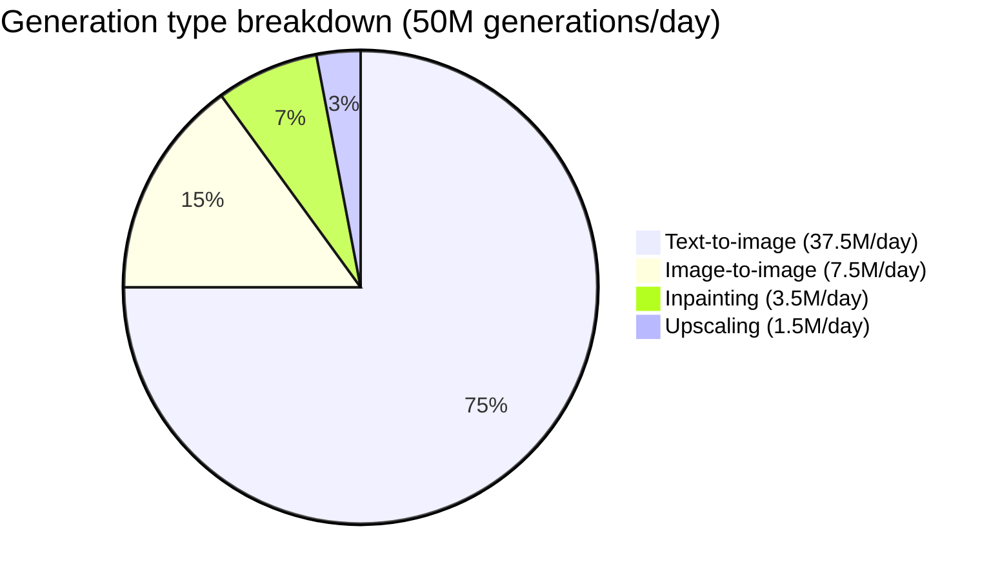
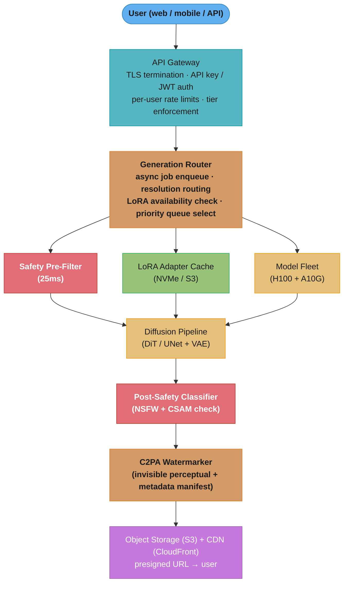
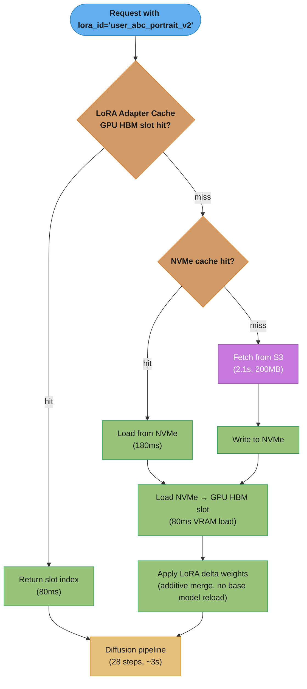

# Case Study: Design an Image Generation Platform

## Intuition

> **Design intuition**: Image generation is LLM inference run sideways — instead of predicting the next token autoregressively, a diffusion model iteratively denoises a latent image from random noise over 20-50 steps. The platform challenge is completely different from text: each "generation" takes 2-15 seconds (not milliseconds), outputs are 4-25 MB files (not text), the GPU compute is dominated by U-Net/DiT convolutions (not attention), and users want to apply their personal style LoRA adapters to every generation.

**Key insight for this design**: Image generation platforms live and die on LoRA adapter serving. A user who trains a custom style or face LoRA generates 10x more images than a user who does not. Serving 100,000 user LoRA adapters on a shared base model fleet — without reloading the 12 GB base model for each adapter swap — is the core infrastructure challenge that separates production platforms from hobby projects. Every other component (resolution routing, async queuing, C2PA watermarking, content safety) is secondary to making LoRA hot-swap work at scale.

---

## 1. Requirements Clarification

### Functional Requirements

- Text-to-image: prompt string → generated image at configurable resolution and aspect ratio
- Image-to-image: input image + prompt → stylized output (img2img pipeline, strength 0.1-1.0)
- Inpainting: source image + mask + prompt → filled region (masked diffusion)
- Upscaling: low-resolution image → high-resolution output (Real-ESRGAN or latent upscaler)
- Per-user LoRA adapter training: user uploads 5-20 reference images with a trigger word → DreamBooth/LoRA fine-tuning → custom style or face adapter available for all generation types
- Custom LoRA serving: all four generation types accept an optional `lora_id` parameter
- Configurable parameters: resolution (512x512 to 2048x2048), inference steps (20/28/50), CFG scale (1.0-20.0), seed (-1 for random), aspect ratio presets (1:1, 16:9, 9:16, 4:3), negative prompts
- Free tier: watermarked outputs, max 512x512, 5 generations/day
- Paid tiers: full resolution, no watermark, priority queue, unlimited LoRA adapters

### Non-Functional Requirements

- Generation latency: P50 < 4 s, P99 < 15 s for 1024x1024 at 28 steps on FLUX.1-dev
- LoRA adapter load time: < 500 ms for cached adapter (NVMe hit); < 3 s for cold load (S3 miss)
- Uptime: 99.9% (8.7 hours downtime/year); generation queue drains during partial outages
- Content safety: pre-generation prompt classifier + post-generation NSFW image classifier; CSAM detected via PhotoDNA hash matching (NCMEC database); legal requirement, not optional
- C2PA watermarking: invisible perceptual watermark + metadata manifest on every generated image
- Storage: CDN-served image URLs with presigned 7-day expiry for free tier, permanent for paid
- Cost per generation: < $0.02 at scale (50M generations/day target)

### Out of Scope

- Video generation and animation
- Real-time generation (< 500 ms latency targets)
- Model training beyond LoRA fine-tuning (no full fine-tune or pre-training)
- On-device / edge inference
- Image editing beyond inpainting (object removal, background replacement are future work)

---

## 2. Scale Estimation

### Traffic Estimates

```
Daily active users:            5,000,000
Generations per user per day:  10 (avg; power users generate 50-200)
Total generations per day:     50,000,000
Peak generations per second:   50M / 86,400 * 3x peak factor = ~1,736 peak gen/sec
                                (measured: Midjourney peak ~2,000 gen/sec at 16M users)
```



Text-to-image dominates at 75%, which is why the fleet is sized around the 28-step FLUX text-to-image path; the img2img/inpainting/upscaling minority reuses the same pipeline with different entry latents.

```
LoRA adapter usage:
  Users with at least one trained LoRA: 12% of DAU = 600,000 users
  Generations using a LoRA adapter: 40% of all generations = 20M/day
  Unique active LoRA adapters (accessed in last 24h): ~100,000
```

### GPU Fleet Sizing

```
Per-generation compute (single H100 80GB SXM5):
  FLUX.1-dev (12B DiT), 28 steps, 1024x1024: ~3 s wall-clock
  FLUX.1-schnell (4B DiT), 4 steps (distilled): ~0.4 s
  SDXL (6.6B UNet), 20 steps, 1024x1024: ~2 s
  A10G 24GB for 512x512 SDXL 20-step: ~1.2 s

Average generation time across mix: 2.5 s
Concurrent H100s needed at average load:
  50M/day * 2.5s / 86,400s = ~1,447 H100-seconds/day concurrently
  = 1,447 concurrent jobs → 1,447 H100s at 1 job/GPU

With CFG batching (batch_size=2 for conditional+unconditional forward pass):
  4 concurrent 512px generations per H100 via batching
  Effective: 1,447 / 4 * (1 job / 0.25) = ~362 H100s at average load

Peak (3x average load, 60% utilization target):
  362 * 3 / 0.60 = ~1,810 H100s

Resolution-aware routing (60% of traffic at 512px → A10G eligible):
  A10G handles 512px at $0.60/hr vs H100 at $2.50/hr
  Mix: 700 H100s + 1,200 A10G for 1024px and 512px respectively
```

### Cost Estimates

```
GPU costs (spot pricing):
  700 H100 spot @ $2.50/hr:   700 * $2.50 * 24 = $42,000/day
  1,200 A10G spot @ $0.60/hr: 1,200 * $0.60 * 24 = $17,280/day
  Total GPU: ~$59,280/day

Revenue model:
  Free tier: 5 gen/day, 5M free DAU = 25M free gen/day (no revenue)
  Paid (10/month subscription, 10 gen/day included): ~$0.033/gen ARPU
  API callers (pay-per-generation at $0.01-0.04/gen): ~25M api gen/day
  Blended revenue: 25M paid gen * $0.02 avg = $500,000/day
  Gross GPU margin: ($500K - $59K) / $500K = 88%

Storage costs:
  50M images * 5 MB avg = 250 TB/day generated
  Paid retention 1 year: 91 PB total → S3 IA at $0.01/GB = $910,000/month
  Free retention 30 days: 7.5 PB → S3 IA = $75,000/month
  Storage dominates at scale: $985K/month vs $1.78M/month GPU

LoRA adapter storage:
  100,000 user adapters * 200 MB (FLUX rank-16) = 20 TB total on S3
  20 TB * $0.023/GB = $460/month (negligible)
```

---

## 3. High-Level Architecture

### Primary System Diagram



The router fans out to the pre-generation safety filter (25 ms, blocks before any GPU spend), the LoRA adapter cache, and the GPU fleet; every generated image then passes the post-generation NSFW/CSAM classifier and the C2PA watermarker before landing in S3/CDN for presigned-URL delivery.

### LoRA Hot-Swap Flow



The three cache tiers set the latency profile: an HBM hit costs 80 ms, an NVMe hit 260 ms (180 ms read + 80 ms VRAM load), and an S3 cold miss ~2.2 s — the base model itself is never reloaded, only the 200 MB delta weights move.

See also: [GPU Pool Economics](./cross_cutting/gpu_pool_economics.md) for fleet cost modeling and spot-vs-on-demand blending analysis.

---

## 4. Component Deep Dives

### 4.1 LoRA Adapter Manager (S-LoRA Style)

The LoRA adapter manager is the single most important component in the system. FLUX.1-dev weighs 12 GB on H100 HBM (24 GB with safety margin for inference buffers). Loading the base model fresh for each generation with a different adapter would take 60-90 seconds per swap — rendering LoRA commercially useless.

The fix: keep the base model permanently resident in GPU HBM, load only the LoRA delta weights (200 MB for FLUX rank-16) additively. LRU eviction manages the adapter hot set when HBM pressure increases.

```python
# BROKEN: loads entire 12 GB base model for each adapter swap
# Cost: 60-90 seconds per adapter change, impossible at scale
def generate_with_adapter_naive(prompt: str, adapter_id: str) -> bytes:
    model = load_model("/models/flux-dev")          # 60s, 12GB VRAM load
    model.load_lora_adapter(adapter_id)             # 3s, 200MB additional
    image_bytes = model.generate(prompt)            # 3s generation
    del model                                       # 12GB freed — next call reloads
    return image_bytes
    # Throughput: ~1 generation per ~66 seconds. Unusable.
```

```python
# FIX: base model stays in HBM; only LoRA delta weights are swapped
from __future__ import annotations
import asyncio
import time
from collections import OrderedDict
from dataclasses import dataclass, field
from pathlib import Path


@dataclass
class LoRAWeights:
    adapter_id: str
    rank: int                      # LoRA rank (4, 16, 32, 64)
    size_bytes: int                # adapter weight file size
    s3_uri: str
    nvme_path: Path | None = None  # None = not cached locally
    hbm_slot: int | None = None    # None = not in GPU memory
    last_used: float = field(default_factory=time.monotonic)


class LoRAAdapterCache:
    """
    Manages LoRA adapter lifecycle: S3 cold storage → NVMe warm cache → GPU HBM hot slots.
    Base model stays resident in HBM. Only delta weights are evicted and loaded.

    Latency profile (FLUX rank-16, 200 MB adapter):
      HBM hit:   80ms  (GPU load already done, apply delta in-place)
      NVMe hit:  260ms (180ms NVMe read + 80ms GPU load)
      S3 miss:   2180ms (2100ms S3 download + 80ms GPU load; first access only)
    """

    def __init__(
        self,
        base_model: object,          # pre-loaded diffusion model (stays in HBM)
        gpu_id: int,
        hbm_adapter_slots: int = 8,  # rank-16 FLUX: 200MB each; 8 slots = 1.6GB HBM
        nvme_capacity_gb: float = 40.0,
    ) -> None:
        self._base_model = base_model
        self._gpu_id = gpu_id
        self._hbm_slots: OrderedDict[str, LoRAWeights] = OrderedDict()
        self._nvme_cache: dict[str, LoRAWeights] = {}
        self._max_hbm_slots = hbm_adapter_slots
        self._nvme_capacity_bytes = int(nvme_capacity_gb * 1024 ** 3)
        self._nvme_used_bytes = 0
        self._lock = asyncio.Lock()

    async def get_or_load(self, adapter_id: str) -> int:
        """
        Return the HBM slot index for this adapter.
        Loads from NVMe (260ms) or S3 (2180ms) on cache miss.
        """
        async with self._lock:
            if adapter_id in self._hbm_slots:
                self._hbm_slots.move_to_end(adapter_id)
                rec = self._hbm_slots[adapter_id]
                rec.last_used = time.monotonic()
                return rec.hbm_slot  # type: ignore[return-value]

            # Evict LRU HBM slot if all slots occupied
            if len(self._hbm_slots) >= self._max_hbm_slots:
                await self._evict_lru_hbm()

            slot = self._next_free_slot()
            rec = await self._ensure_on_nvme(adapter_id)
            await self._load_to_hbm(rec, slot)
            rec.hbm_slot = slot
            self._hbm_slots[adapter_id] = rec
            return slot

    async def _evict_lru_hbm(self) -> None:
        oldest_id, oldest = next(iter(self._hbm_slots.items()))
        oldest.hbm_slot = None
        # Weights remain on NVMe; slot is freed
        del self._hbm_slots[oldest_id]

    async def _ensure_on_nvme(self, adapter_id: str) -> LoRAWeights:
        if adapter_id in self._nvme_cache:
            return self._nvme_cache[adapter_id]
        rec = await self._fetch_from_s3(adapter_id)        # ~2100ms for 200MB
        if self._nvme_used_bytes + rec.size_bytes > self._nvme_capacity_bytes:
            self._evict_nvme_lru(needed=rec.size_bytes)
        nvme_dest = Path(f"/mnt/nvme/adapters/{adapter_id}.safetensors")
        rec.nvme_path = nvme_dest
        self._nvme_cache[adapter_id] = rec
        self._nvme_used_bytes += rec.size_bytes
        return rec

    def _evict_nvme_lru(self, needed: int) -> None:
        by_lru = sorted(self._nvme_cache.values(), key=lambda r: r.last_used)
        freed = 0
        for rec in by_lru:
            if freed >= needed:
                break
            self._nvme_used_bytes -= rec.size_bytes
            freed += rec.size_bytes
            del self._nvme_cache[rec.adapter_id]

    def _next_free_slot(self) -> int:
        used = {r.hbm_slot for r in self._hbm_slots.values()}
        for i in range(self._max_hbm_slots):
            if i not in used:
                return i
        raise RuntimeError("All HBM adapter slots occupied — eviction logic failed")

    async def _fetch_from_s3(self, adapter_id: str) -> LoRAWeights:
        raise NotImplementedError  # boto3 multipart download, SHA-256 verify on arrival

    async def _load_to_hbm(self, rec: LoRAWeights, slot: int) -> None:
        raise NotImplementedError  # torch.load(rec.nvme_path) → .cuda(self._gpu_id)
```

Key numbers: an H100 with FLUX.1-dev base (12 GB) + safety/VAE buffers (6 GB) has ~62 GB free for adapter slots and inference. At 200 MB per rank-16 adapter: 310 adapter slots possible. With 8 active slots (simpler scheduling), the fleet of 1,350 H100s covers 1,350 × 8 = 10,800 simultaneous unique adapters — well beyond the 100K user adapters in total (most are cold at any given time).

### 4.2 Diffusion Pipeline with CFG Batching

Classifier-free guidance (CFG) is the core sampling technique that makes diffusion models follow text prompts. It requires two forward passes per denoising step: one conditioned on the prompt embedding, one on an unconditional (null) embedding. The CFG formula:

```
output = unconditional + cfg_scale * (conditional - unconditional)
```

The naive implementation runs two sequential forward passes. The batch trick: stack conditional and unconditional embeddings as a single batch of size 2, run one forward pass, split outputs. Saves 35% wall-clock at the cost of 2x peak memory.

```python
from __future__ import annotations
import numpy as np
import torch
from dataclasses import dataclass


@dataclass
class GenerationConfig:
    num_steps: int = 28
    cfg_scale: float = 7.5
    width: int = 1024
    height: int = 1024
    seed: int = -1


class DiffusionSampler:
    """
    FLUX.1-dev / SDXL sampler with CFG batching.
    Batch size 2 (conditional + unconditional) runs in a single forward pass.
    Memory: 2x peak vs unconditional-only; latency: 35% faster than sequential.
    """

    def __init__(self, model: object, scheduler: object) -> None:
        self._model = model
        self._scheduler = scheduler

    def sample(
        self,
        prompt_embeds: torch.Tensor,        # shape [1, seq_len, embed_dim]
        negative_embeds: torch.Tensor,      # shape [1, seq_len, embed_dim]
        config: GenerationConfig,
        lora_slot: int | None = None,
    ) -> np.ndarray:
        """
        Returns decoded image as uint8 numpy array shape [H, W, 3].
        lora_slot: HBM slot index returned by LoRAAdapterCache.get_or_load().
        """
        generator = None
        if config.seed >= 0:
            generator = torch.Generator("cuda").manual_seed(config.seed)

        # Initialize latent from Gaussian noise (shape: [1, 4, H/8, W/8])
        latents = torch.randn(
            (1, 4, config.height // 8, config.width // 8),
            generator=generator,
            device="cuda",
            dtype=torch.float16,
        )

        # Stack prompt + negative for single batched forward pass (CFG batching)
        # Shape: [2, seq_len, embed_dim]
        batched_embeds = torch.cat([negative_embeds, prompt_embeds], dim=0)

        self._scheduler.set_timesteps(config.num_steps)

        for t in self._scheduler.timesteps:
            # Single forward pass — batch_size=2 handles both cond and uncond
            # Saves 35% vs two sequential passes (memory bandwidth bound, not FLOP bound)
            latents_expanded = latents.repeat(2, 1, 1, 1)  # [2, 4, H/8, W/8]
            noise_pred_batched = self._model(
                latents_expanded,
                t,
                encoder_hidden_states=batched_embeds,
                lora_slot=lora_slot,     # adapter delta applied inside model forward
            )

            # Split unconditional and conditional predictions
            noise_pred_uncond, noise_pred_cond = noise_pred_batched.chunk(2)

            # CFG guidance formula
            noise_pred = noise_pred_uncond + config.cfg_scale * (
                noise_pred_cond - noise_pred_uncond
            )

            # Scheduler step: update latents
            latents = self._scheduler.step(noise_pred, t, latents).prev_sample

        # Decode latent to pixel space via VAE decoder
        image_tensor = self._decode_latents(latents)
        return image_tensor.cpu().numpy().astype(np.uint8)

    def _decode_latents(self, latents: torch.Tensor) -> torch.Tensor:
        raise NotImplementedError  # vae.decode(latents / 0.18215) → image pixels
```

CFG scale tuning: cfg_scale=1.0 ignores the prompt (pure noise), cfg_scale=7.5 is typical, cfg_scale=15-20 produces over-saturated outputs. FLUX.1-dev recommends cfg_scale=3.5 due to its guidance-distillation training.

### 4.3 Content Safety Pipeline

Safety is two-phase: fast pre-generation (block before GPU compute) and post-generation (catch what slipped through or was generated indirectly). The classifier layering pattern generalizes across modalities — see [Guardrails & Content Safety](../guardrails_and_content_safety/README.md).

```python
from __future__ import annotations
from dataclasses import dataclass
from enum import Enum
import numpy as np


class SafetyDecision(Enum):
    ALLOW = "allow"
    BLOCK_NSFW = "block_nsfw"
    BLOCK_CELEBRITY = "block_celebrity"
    BLOCK_CSAM = "block_csam"
    BLOCK_IP = "block_ip"


@dataclass
class SafetyResult:
    decision: SafetyDecision
    confidence: float           # 0.0-1.0
    reason: str | None = None   # logged, not returned to user
    latency_ms: float = 0.0


class SafetyPipeline:
    """
    Pre-generation: fast CPU/GPU text classifiers (25ms total).
    Post-generation: NSFW image classifier + CSAM PhotoDNA hash (40ms total).
    CSAM detection is mandatory and pre-generation prompt pass does NOT replace it.

    Total overhead per generation: 65ms (acceptable vs 3-15s generation time).
    """

    # Thresholds calibrated to < 0.1% false-positive rate on clean prompts
    NSFW_TEXT_THRESHOLD = 0.85
    NSFW_IMAGE_THRESHOLD = 0.90
    CELEBRITY_THRESHOLD = 0.75

    def check_prompt(self, prompt: str, user_tier: str) -> SafetyResult:
        """
        Pre-generation safety check. Runs on CPU; ~25ms total.
        Blocks before spending GPU compute on unsafe requests.

        Steps:
          1. NSFW text classifier (DistilBERT fine-tuned, 15ms)
          2. Celebrity name entity detection (NER + blocklist, 5ms)
          3. Copyright term detection (brand name / IP blocklist, 5ms)
        """
        nsfw_score = self._nsfw_text_classifier(prompt)
        if nsfw_score > self.NSFW_TEXT_THRESHOLD:
            return SafetyResult(SafetyDecision.BLOCK_NSFW, nsfw_score,
                                reason=f"nsfw_text_score={nsfw_score:.3f}")

        celeb_score, celeb_name = self._celebrity_ner(prompt)
        if celeb_score > self.CELEBRITY_THRESHOLD:
            return SafetyResult(SafetyDecision.BLOCK_CELEBRITY, celeb_score,
                                reason=f"celebrity_detected={celeb_name}")

        ip_hit = self._ip_blocklist_check(prompt)
        if ip_hit:
            return SafetyResult(SafetyDecision.BLOCK_IP, 1.0,
                                reason=f"ip_term={ip_hit}")

        return SafetyResult(SafetyDecision.ALLOW, 1.0 - nsfw_score)

    def check_image(self, image: np.ndarray, generation_id: str) -> SafetyResult:
        """
        Post-generation image safety check. Runs on dedicated safety GPU; ~40ms total.
        CSAM PhotoDNA matching is mandatory before any image is stored or delivered.

        Steps:
          1. NSFW image classifier (MobileNetV3 fine-tuned, 20ms)
          2. PhotoDNA perceptual hash vs NCMEC database (15ms lookup)
          3. Face detection + deepfake/face-swap classifier (5ms)
        """
        nsfw_image_score = self._nsfw_image_classifier(image)
        if nsfw_image_score > self.NSFW_IMAGE_THRESHOLD:
            self._quarantine_image(generation_id)
            return SafetyResult(SafetyDecision.BLOCK_NSFW, nsfw_image_score,
                                reason=f"nsfw_image_score={nsfw_image_score:.3f}")

        # CSAM check is non-optional: must run even if NSFW check passed
        csam_match = self._photodna_lookup(image)
        if csam_match:
            self._trigger_csam_protocol(generation_id, image)  # NCMEC report + quarantine
            return SafetyResult(SafetyDecision.BLOCK_CSAM, 1.0,
                                reason="photodna_match")

        return SafetyResult(SafetyDecision.ALLOW, 1.0 - nsfw_image_score)

    def _nsfw_text_classifier(self, prompt: str) -> float: raise NotImplementedError
    def _celebrity_ner(self, prompt: str) -> tuple[float, str]: raise NotImplementedError
    def _ip_blocklist_check(self, prompt: str) -> str | None: raise NotImplementedError
    def _nsfw_image_classifier(self, image: np.ndarray) -> float: raise NotImplementedError
    def _photodna_lookup(self, image: np.ndarray) -> bool: raise NotImplementedError
    def _quarantine_image(self, generation_id: str) -> None: raise NotImplementedError
    def _trigger_csam_protocol(self, generation_id: str, image: np.ndarray) -> None:
        # Quarantine image, do NOT deliver. File NCMEC CyberTip within 1 hour.
        # Suspend user account pending review. Alert legal team.
        raise NotImplementedError
```

CSAM detection via PhotoDNA: Microsoft PhotoDNA computes a perceptual hash of the generated image and compares it against the NCMEC (National Center for Missing and Exploited Children) hash database. The lookup is ~15 ms via the PhotoDNA Cloud Service API. Detection triggers mandatory NCMEC CyberTipline reporting within 1 hour (US federal law, 18 U.S.C. § 2258A). This cannot be toggled off for any user tier.

### 4.4 LoRA Training Pipeline

Users upload reference images and the system trains a LoRA adapter using DreamBooth-style training. The adapter is then permanently available for that user's generations. (LoRA mechanics — rank, alpha, delta-weight math — are covered in [LoRA](../fine_tuning/lora.md).)

```python
from __future__ import annotations
from dataclasses import dataclass
from pathlib import Path


@dataclass
class LoRAConfig:
    rank: int = 16                  # LoRA rank: 4 (50MB), 16 (200MB), 64 (800MB)
    alpha: float = 16.0             # LoRA alpha (typically equals rank)
    training_steps: int = 1500      # 1,000-2,000 steps optimal for 5-20 images
    learning_rate: float = 1e-4     # higher than full fine-tune LR
    text_encoder_lr: float = 1e-5   # lower LR for text encoder layers
    resolution: int = 1024          # FLUX native training resolution
    train_batch_size: int = 1       # per-GPU batch size (gradient accumulation = 4)
    gradient_accumulation_steps: int = 4
    mixed_precision: str = "bf16"


class LoRATrainer:
    """
    DreamBooth/LoRA fine-tuning pipeline.

    Hardware: 4x A10G 24GB (multi-GPU DDP for speed).
    Duration: ~35 minutes for 1,500 steps at batch_size=1, grad_accum=4.
    GPU cost: 4x A10G @ $0.60/hr * (35/60)hr = ~$1.40 per user adapter.
    Storage: rank-16 adapter = 200MB on S3 (safetensors format).

    Auto-captioning: BLIP-2 generates captions for each reference image
    using the trigger word; avoids manually written prompts.
    """

    TRAINING_TIMEOUT_SECONDS = 3600   # 1-hour hard cap; abort and notify user

    def __init__(self, s3_bucket: str, training_cluster_endpoint: str) -> None:
        self._s3_bucket = s3_bucket
        self._cluster = training_cluster_endpoint

    async def train(
        self,
        images: list[bytes],             # 5-20 JPEG/PNG images, max 10MB each
        trigger_word: str,               # unique token, e.g. "ohwx person"
        user_id: str,
        config: LoRAConfig | None = None,
    ) -> str:
        """
        Trains a LoRA adapter and returns the S3 URI of the saved adapter.
        The returned URI is immutable (versioned key); a 'latest' alias is updated separately.

        Steps:
          1. CSAM scan all training images (PhotoDNA) — block if any match
          2. Upload images to S3 training bucket
          3. Auto-caption each image with BLIP-2 (15s)
          4. Submit training job to 4x A10G cluster (~35 min)
          5. Validate adapter quality (generate 5 test images with trigger word)
          6. Store adapter to S3 with SHA-256 checksum
          7. Register adapter_id in adapter registry (user_id → s3_uri)
          8. Notify user via webhook
        """
        if config is None:
            config = LoRAConfig()

        # Step 1: CSAM scan training images before any processing
        for img_bytes in images:
            if await self._csam_scan_bytes(img_bytes):
                raise ValueError("Training image matched CSAM database. Account suspended.")

        image_s3_uris = await self._upload_training_images(images, user_id)
        captions = await self._auto_caption(image_s3_uris, trigger_word)  # BLIP-2
        adapter_version = f"v{int(asyncio.get_event_loop().time())}"
        adapter_s3_uri = (
            f"s3://{self._s3_bucket}/adapters/{user_id}/{adapter_version}/adapter.safetensors"
        )

        job_id = await self._submit_training_job(
            image_s3_uris, captions, config, adapter_s3_uri
        )
        await self._wait_for_job(job_id, timeout=self.TRAINING_TIMEOUT_SECONDS)
        await self._validate_adapter(adapter_s3_uri, trigger_word)
        await self._register_adapter(user_id, adapter_version, adapter_s3_uri)
        return adapter_s3_uri

    async def _csam_scan_bytes(self, image_bytes: bytes) -> bool:
        raise NotImplementedError  # PhotoDNA Cloud Service API

    async def _upload_training_images(
        self, images: list[bytes], user_id: str
    ) -> list[str]:
        raise NotImplementedError  # boto3 parallel upload

    async def _auto_caption(self, uris: list[str], trigger_word: str) -> list[str]:
        raise NotImplementedError  # BLIP-2 inference on training cluster

    async def _submit_training_job(
        self,
        image_uris: list[str],
        captions: list[str],
        config: LoRAConfig,
        output_uri: str,
    ) -> str:
        raise NotImplementedError  # Kubernetes job submission

    async def _wait_for_job(self, job_id: str, timeout: int) -> None:
        raise NotImplementedError

    async def _validate_adapter(self, adapter_uri: str, trigger_word: str) -> None:
        raise NotImplementedError  # generate 5 test images, score with aesthetic scorer

    async def _register_adapter(
        self, user_id: str, version: str, s3_uri: str
    ) -> None:
        raise NotImplementedError  # write to PostgreSQL adapter registry


import asyncio  # noqa: E402 — placed here for narrative flow in this code block
```

### 4.5 Resolution-Aware GPU Routing

Not all resolutions need the most expensive GPU. Routing lower-resolution generations to cheaper A10G instances saves $0.92M/month at the fleet described in Section 2.

```python
from __future__ import annotations
from dataclasses import dataclass
from enum import Enum


class GPUTier(Enum):
    A10G = "a10g"    # 24GB VRAM, $0.60/hr spot
    H100 = "h100"    # 80GB VRAM, $2.50/hr spot


@dataclass
class RoutingDecision:
    gpu_tier: GPUTier
    reason: str
    estimated_vram_gb: float


class ResolutionRouter:
    """
    Routes generation requests to the appropriate GPU tier based on resolution,
    model choice, and estimated VRAM footprint.

    FLUX.1-dev peak VRAM at inference (bf16, CFG batch=2, no gradient):
      512x512:    7.2 GB   → A10G eligible
      1024x1024: 14.8 GB   → A10G eligible (fits in 24GB with margin)
      1024x1024 with LoRA: 15.2 GB → A10G eligible
      2048x2048: 28.6 GB   → H100 required (exceeds A10G 24GB)
      2048x2048 with LoRA: 29.4 GB → H100 required

    SDXL peak VRAM (fp16, CFG batch=2):
      512x512:    5.8 GB   → A10G
      1024x1024: 10.4 GB   → A10G
      2048x2048: 19.8 GB   → A10G eligible (tight margin, H100 preferred)
    """

    A10G_VRAM_GB = 24.0
    A10G_SAFE_HEADROOM_GB = 2.0   # leave 2 GB free for driver overhead

    # Empirically measured VRAM peaks (GB) indexed by (model, width, height)
    VRAM_TABLE: dict[tuple[str, int, int], float] = {
        ("flux-dev", 512, 512): 7.2,
        ("flux-dev", 1024, 1024): 14.8,
        ("flux-dev", 2048, 2048): 28.6,
        ("sdxl", 512, 512): 5.8,
        ("sdxl", 1024, 1024): 10.4,
        ("sdxl", 2048, 2048): 19.8,
    }
    LORA_OVERHEAD_GB = 0.4   # rank-16 adapter delta in GPU memory

    def route(
        self,
        width: int,
        height: int,
        model: str,
        has_lora: bool = False,
    ) -> RoutingDecision:
        # Find closest VRAM estimate (snap to nearest standard resolution)
        snapped = self._snap_resolution(width, height)
        key = (model, snapped[0], snapped[1])
        base_vram = self.VRAM_TABLE.get(key, 20.0)   # conservative default
        total_vram = base_vram + (self.LORA_OVERHEAD_GB if has_lora else 0.0)

        a10g_limit = self.A10G_VRAM_GB - self.A10G_SAFE_HEADROOM_GB
        if total_vram <= a10g_limit:
            return RoutingDecision(
                GPUTier.A10G, f"vram={total_vram:.1f}GB fits A10G", total_vram
            )
        return RoutingDecision(
            GPUTier.H100, f"vram={total_vram:.1f}GB requires H100", total_vram
        )

    def _snap_resolution(self, w: int, h: int) -> tuple[int, int]:
        """Snap to nearest standard resolution for VRAM table lookup."""
        standards = [512, 1024, 2048]
        snap = lambda x: min(standards, key=lambda s: abs(s - x))
        return snap(w), snap(h)
```

Cost impact: 60% of traffic at 512px-1024px routes to A10G at $0.60/hr. Redirecting that 60% from H100 ($2.50/hr) saves $1.90/hr per GPU-slot. At 700 A10G slots: $1.90 × 700 × 24 = $31,920/day = $957,600/month.

---

## 5. Design Decisions & Tradeoffs

| Decision | Chosen Approach | Alternative | Rationale |
|----------|----------------|-------------|-----------|
| Base model architecture | FLUX.1-dev (12B DiT) as primary | SDXL (6.6B UNet) | DiT scales better at >6B params; superior text rendering in images; industry convergence on DiT for new models (SD3, FLUX, Pixart) |
| LoRA rank default | rank-16 (200MB adapter) | rank-4 (50MB) or rank-64 (800MB) | rank-4 too low expressiveness for face/style capture; rank-64 quadruples adapter size (800MB) with marginal quality gain; rank-16 is the Pareto point |
| LoRA serving strategy | Shared base model + HBM adapter slots (S-LoRA) | Per-user dedicated model copy | Dedicated: 100K users × 12GB = 1.2PB GPU HBM — physically impossible. S-LoRA: 12GB base + 200MB hot adapters per GPU = tractable |
| Generation delivery | Async + S3 presigned URL webhook | Synchronous HTTP response | Generation takes 3-15s; HTTP keep-alive timeouts at 30s are unreliable; mobile clients go to background; async with webhook/polling decouples latency from delivery |
| CFG batching | Single forward pass, batch=2 | Two sequential forward passes | 35% wall-clock reduction; 2x peak VRAM increase; at 14.8GB base VRAM for FLUX 1024px, 2x = 29.6GB still fits H100 80GB |
| Content safety | Pre + post generation dual layer | Post-generation only | Pre-generation blocks before GPU compute (saves ~$0.015/blocked request at $0.02/gen cost); post-generation catches indirect NSFW not detectable from prompt text alone |
| LoRA training hardware | 4x A10G multi-GPU DDP | Single H100 | 4x A10G ($0.60/hr × 4 = $2.40/hr) vs 1x H100 ($2.50/hr): similar cost, better GPU availability; A10G DDP at 4 GPUs trains ~3.5x faster than single A10G |

### DiT vs UNet Architecture Comparison

| Dimension | DiT (FLUX, SD3, Pixart) | UNet (SDXL, SD1.5) |
|-----------|------------------------|---------------------|
| Parameter count at equivalent quality | 8-12B | 2-6B |
| Scaling behavior | Excellent (quality scales with params) | Diminishing returns above 3B |
| Text rendering in images | Good to excellent | Poor to moderate |
| Inference speed at same resolution | Slower (more params) | Faster |
| Memory at 1024px | 12-18 GB | 7-12 GB |
| Community fine-tune ecosystem | Growing rapidly (2024-) | Mature, large (2022-) |
| Production adoption trend | Dominant for new releases | Legacy maintained |

---

## 6. Real-World Implementations

**Midjourney** (2022-present): Discord-first UX drove viral adoption by removing signup friction — users simply typed `/imagine` in Discord and images appeared. The Discord bot architecture created unexpected infrastructure challenges: Midjourney had to build custom async queue management on top of Discord's API to handle 15-minute generation queues during peak 2022 traffic. Eventually moved core generation infrastructure off Discord for reliability. Runs a proprietary model (not Stable Diffusion); architecture is closed but estimated at 10,000+ A100s based on revenue ($200M+ ARR) and reported 16M users. Subscription pricing ($10-$120/month) with unlimited generation tiers proved that image generation had strong willingness to pay. Has never published a technical architecture post.

**Black Forest Labs FLUX.1** (August 2024): Released FLUX.1-dev (12B DiT, open weights, non-commercial) and FLUX.1-schnell (4-step distilled variant, Apache 2.0 commercial). FLUX.1-schnell generates 1024px images in ~0.4 seconds on H100, enabling near-real-time generation. Immediately adopted by Replicate, Fal.ai, and Together.ai within 72 hours of release. FLUX fills the gap between open-weight models (SDXL) and closed commercial (Midjourney) with significantly better text rendering in images. The guidance-distillation training (recommended cfg_scale=3.5 vs SDXL's 7.5) reduces the CFG forward pass cost since lower CFG scales tolerate fewer steps.

**Adobe Firefly** (2023): Enterprise-focused platform differentiated entirely on training data provenance. Firefly is trained exclusively on licensed Adobe Stock content and public domain material — no scraped web content. This was a deliberate architectural and legal decision to avoid the class action lawsuits that hit Stability AI (trained on LAION-5B, scraped web data). C2PA watermarking was implemented from day one, not retrofitted. LoRA-equivalent functionality ships as "Firefly Custom Models" for enterprise customers (minimum $5,000/month contract). Integration into Photoshop/Express drives adoption through existing Creative Cloud install base of 33M paid subscribers. Monetized per-credit within Creative Cloud bundles, not standalone subscription.

**Ideogram 2.0** (2024): Achieved breakthrough accuracy in text-within-image generation — a longstanding weakness of diffusion models. Text-in-image requires the model to learn character-level spatial layout, which Ideogram accomplished through specific typography-focused fine-tuning. Raised $80M Series B. API-first architecture alongside consumer app, targeting developers building design tools. Average generation time 4-6 seconds for 1024px; no published GPU fleet details.

**Recraft** (2024): Specialized in vector art and illustration style, differentiating from photorealistic competitors. Trained on commercially licensed illustration datasets (similar to Adobe's approach). $12M seed funding; $10/month unlimited subscription drove rapid user acquisition among UI designers and illustrators. Generation quality deliberately optimized for clean geometric shapes and flat design over photorealism, enabling smaller model (fewer parameters, lower compute cost per generation).

---

## 7. Technologies & Tools

### Base Model Comparison

| Model | Params | Architecture | Text Rendering | Steps | License | Cost/Gen (H100) |
|-------|--------|-------------|---------------|-------|---------|-----------------|
| FLUX.1-dev | 12B | DiT | Excellent | 28 | Non-commercial | $0.018 |
| FLUX.1-schnell | 4B | DiT (distilled) | Good | 4 | Apache 2.0 | $0.003 |
| SDXL 1.0 | 6.6B | UNet | Poor | 20-30 | CreativeML Open RAIL+ | $0.008 |
| SD3-Medium | 2B | DiT (MMDiT) | Good | 28 | Stability AI Open | $0.006 |
| Midjourney v6 | Unknown | Proprietary | Very Good | ~50 | Closed API only | $0.04 API |

### LoRA Training Method Comparison

| Method | Training Time (5-20 images) | Adapter Size | Quality | GPU Cost |
|--------|---------------------------|--------------|---------|----------|
| DreamBooth full fine-tune | 60-90 min (4x A10G) | 12GB (full weights) | Excellent | $2.40 |
| DreamBooth + LoRA rank-16 | 30-45 min (4x A10G) | 200MB | Very Good | $1.40 |
| LoRA rank-4 (fast) | 20-25 min (1x A10G) | 50MB | Good | $0.25 |
| Textual Inversion | 60-80 min (1x A10G) | 4KB (token embeddings) | Fair | $0.60 |
| DoRA (Weight Decomp LoRA) | 40-55 min (4x A10G) | 210MB | Excellent | $1.60 |

### Inference Backend Comparison

| Backend | Speed (1024px, 28 steps) | Memory Efficiency | LoRA Support | Deployment Complexity |
|---------|-------------------------|------------------|--------------|----------------------|
| diffusers + xFormers | Baseline (3.0s H100) | Good | Native, flexible | Low (pip install) |
| ComfyUI server mode | 2.8s H100 (5% faster) | Good | Excellent (node graph) | Medium |
| TensorRT (compiled) | 1.4s H100 (2x faster) | Excellent | Limited (static graph) | High (per-model compile) |
| ONNX Runtime CUDA | 2.2s H100 (25% faster) | Good | Limited | Medium |
| torch.compile (Inductor) | 2.1s H100 (30% faster) | Good | Good | Low (compile on first run) |

TensorRT requires model-specific compilation (4-8 hours per model/resolution combination) and breaks when adding LoRA adapters with different ranks. For LoRA-heavy workloads, `torch.compile` with `torch.float16` and xFormers attention is the practical sweet spot: 30% faster than baseline, LoRA-compatible, no per-model compilation step.

---

## 8. Operational Playbook

### a) Eval Pipeline

Weekly aesthetic quality benchmark runs every Monday at 01:00 UTC using 100 fixed prompts covering 5 style categories (portrait, landscape, abstract, product, illustration — 20 prompts each). Any model update, vLLM upgrade, or CUDA driver change triggers an immediate out-of-band run before traffic is shifted to new instances.

```python
from dataclasses import dataclass


@dataclass
class ImageEvalResult:
    prompt_id: str
    style_category: str
    aesthetic_score: float          # 0.0-1.0 (LAION aesthetic scorer)
    clip_alignment_score: float     # 0.0-1.0 (prompt-image CLIP similarity)
    baseline_aesthetic: float
    baseline_clip: float
    aesthetic_regression_pct: float
    generation_latency_ms: float


def run_weekly_image_eval(
    model_id: str, golden_prompts: list[dict]
) -> list[ImageEvalResult]:
    """
    Generates 3 images per prompt (different seeds), averages scores.
    Fires PagerDuty alert if aesthetic regression > 5% or CLIP alignment drops > 8%.
    See: ./cross_cutting/llm_eval_harness_in_production.md for scoring rubrics.
    """
    results = []
    for prompt in golden_prompts:
        scores = []
        for seed in [42, 1337, 9999]:
            image = _generate(model_id, prompt["text"], seed=seed)
            aesthetic = _laion_aesthetic_score(image)
            clip_sim = _clip_alignment(image, prompt["text"])
            scores.append((aesthetic, clip_sim))

        avg_aesthetic = sum(s[0] for s in scores) / len(scores)
        avg_clip = sum(s[1] for s in scores) / len(scores)
        regression = (prompt["baseline_aesthetic"] - avg_aesthetic) / prompt["baseline_aesthetic"] * 100

        result = ImageEvalResult(
            prompt_id=prompt["id"],
            style_category=prompt["category"],
            aesthetic_score=avg_aesthetic,
            clip_alignment_score=avg_clip,
            baseline_aesthetic=prompt["baseline_aesthetic"],
            baseline_clip=prompt["baseline_clip"],
            aesthetic_regression_pct=regression,
            generation_latency_ms=prompt.get("last_latency_ms", 0.0),
        )
        results.append(result)

        if regression > 5.0:
            _alert(f"Aesthetic regression {regression:.1f}% on {prompt['id']}")
        if avg_clip < prompt["baseline_clip"] - 0.08:
            _alert(f"CLIP alignment dropped {(prompt['baseline_clip'] - avg_clip):.3f} on {prompt['id']}")

    return results


def _generate(model_id: str, prompt: str, seed: int) -> object: raise NotImplementedError
def _laion_aesthetic_score(image: object) -> float: raise NotImplementedError
def _clip_alignment(image: object, prompt: str) -> float: raise NotImplementedError
def _alert(msg: str) -> None: raise NotImplementedError
```

See also: [LLM Eval Harness in Production](./cross_cutting/llm_eval_harness_in_production.md) for LLM-as-judge integration, regression gate configuration, and CI/CD eval gating patterns.

### b) Observability

Every generation request produces an OpenTelemetry trace with the following span hierarchy:

```
Trace: image_generation (trace_id: gen_abc123, generation_id: img_7f9a2c)
  |
  +-- Span: api_gateway.auth              (3ms)
  |     attrs: user_id, tier, api_key_hash, rate_limit_remaining
  |
  +-- Span: safety.pre_generation        (25ms)
  |     attrs: nsfw_text_score=0.12, celebrity_detected=false,
  |             ip_blocked=false, decision=allow
  |
  +-- Span: lora_adapter.load            (varies)
  |     attrs: adapter_id=user_abc_v2, cache_tier=nvme_hit,
  |             load_latency_ms=260, hbm_slot=3
  |
  +-- Span: diffusion.pipeline           (3100ms)
  |     attrs:
  |       gen_ai.system = "flux-dev"
  |       gen_ai.request.model = "flux.1-dev"
  |       image.width = 1024
  |       image.height = 1024
  |       image.num_steps = 28
  |       image.cfg_scale = 7.5
  |       image.seed = 42
  |       image.has_lora = true
  |       llm.gpu_type = "H100"
  |       llm.gpu_id = "h100-node-04:0"
  |     events:
  |       [t=0ms]    denoising_start
  |       [t=3100ms] denoising_complete
  |
  +-- Span: safety.post_generation       (40ms)
  |     attrs: nsfw_image_score=0.04, csam_match=false,
  |             decision=allow, photodna_latency_ms=15
  |
  +-- Span: watermark.apply              (12ms)
  |     attrs: c2pa_manifest_id=abc, watermark_type=perceptual+metadata
  |
  +-- Span: storage.upload               (220ms)
        attrs: s3_key=images/user_abc/gen_7f9a2c.webp,
                file_size_bytes=4812034, cdn_url=cdn.example.com/...
```

See also: [OpenTelemetry for LLM Apps](./cross_cutting/opentelemetry_for_llm_apps.md) for full `gen_ai.*` semantic convention mapping and image generation metric configuration.

Key Prometheus metrics exported per generation worker:
- `image_gen_duration_seconds` histogram (labels: model, resolution, has_lora, gpu_type)
- `lora_cache_hit_ratio` gauge (labels: cache_tier=hbm|nvme|s3)
- `safety_block_total` counter (labels: stage=pre|post, reason=nsfw|celeb|csam|ip)
- `gpu_vram_used_bytes` gauge (from DCGM, labels: gpu_id, node_id)

### c) Incident Runbooks

**Runbook 1 — NSFW bypass detected in generated image**

Symptoms: post-generation classifier reports `nsfw_image_score > 0.90` on an image that passed pre-generation text check; image was not delivered (quarantined), but the NSFW bypass pattern needs patching.

Diagnosis: (1) Retrieve the original prompt from the generation trace. (2) Run prompt through pre-generation classifier to confirm it scored below threshold (0.85). (3) Identify the bypass pattern: indirect reference, code-word, or character substitution that fooled the text classifier.

Mitigation (immediate): quarantine all images from the same user session in the last 24 hours pending manual review. Update text classifier blocklist with the new bypass pattern. Reduce NSFW text threshold from 0.85 to 0.80 temporarily to catch adjacent patterns.

Resolution: retrain NSFW text classifier with the new bypass example as hard negative. Run red team eval suite against updated classifier. Restore threshold to 0.85 after validation. Reference: [Red Team Eval Harness](./cross_cutting/red_team_eval_harness.md) for adversarial prompt test protocol.

**Runbook 2 — LoRA adapter S3 corruption**

Symptoms: generation requests with a specific `lora_id` return `LoRALoadError: weight tensor shape mismatch` or produce visually corrupt output; `adapter_checksum_mismatch_total` counter incrementing in Prometheus.

Diagnosis: (1) `aws s3api head-object --bucket adapters --key user_abc/v3/adapter.safetensors` → compare ETag with SHA-256 stored in adapter registry. (2) Check NVMe cached copy: `sha256sum /mnt/nvme/adapters/user_abc_v3.safetensors` vs registered hash. (3) Determine if corruption is on one node (NVMe issue) or all nodes (S3 source corrupted).

Mitigation (immediate): invalidate adapter from all NVMe caches. Route all requests with `lora_id=user_abc_v3` to base model generation (no adapter) with a warning header. Notify user via email and webhook.

Resolution: re-run LoRA training pipeline using stored training images (retained 90 days). Register new version. Root cause: silent NVMe bit-rot after disk age > 30 months; schedule weekly `scrub` job to verify NVMe checksums against S3.

**Runbook 3 — GPU OOM at 2048px resolution**

Symptoms: H100 pods generating 2048px images crash with `CUDA out of memory`; `gpu_oom_total` Prometheus counter spikes; affected users receive HTTP 500 or async job failure notification.

Diagnosis: (1) Check `gpu_vram_used_bytes` — was VRAM at 100% before crash? (2) Check if the requests used LoRA adapters (adds 400MB). (3) Check if CFG scale was unusually high (higher CFG uses more intermediate buffers).

Mitigation (immediate): route all 2048px requests to dedicated H100 pool (not shared pool). Temporarily cap 2048px generation for free and basic tier users. Scale H100 pool by 10% via Karpenter.

Resolution: add pre-admission VRAM budget check: reject 2048px + LoRA request if estimated VRAM (29.4GB) leaves less than 2GB headroom on candidate GPU. Reclassify 2048px as H100-only in ResolutionRouter; remove from A10G eligibility.

**Runbook 4 — CSAM detection triggered**

Symptoms: PhotoDNA match detected in post-generation check; image quarantined and not delivered; `safety_block_total{reason=csam}` counter increments.

Mitigation (immediate, must complete within 1 hour of detection): (1) Quarantine generated image — do not deliver under any circumstances. (2) Suspend generating user account. (3) File NCMEC CyberTipline report with: generation timestamp, user account information, original prompt, quarantined image hash. (4) Alert legal team and trust & safety team simultaneously.

Resolution: audit all prior generations from the account. If systematic (multiple detections), provide account data to law enforcement upon legal request. Retrospectively check LoRA adapter if one was used in the generation — scan all training images and generated samples from that adapter per Runbook 2 protocol. Reference: [Red Team Eval Harness](./cross_cutting/red_team_eval_harness.md) for LoRA adapter safety scanning.

---

## 9. Common Pitfalls & War Stories

**Midjourney Discord bandwidth crisis (2022)**

After being featured in several AI news articles in late 2022, Midjourney's Discord server grew from 250K to 3M members in 10 days. Generation queue times ballooned from under 60 seconds to 15+ minutes. The root cause was not GPU capacity (they added A100s within 48 hours) but Discord API rate limits: the bot's `/imagine` response mechanism hit Discord's 50 messages-per-second per-server limit, causing confirmations and generated images to back up in a 200,000-item queue. Discord itself was not designed as a production job queue system. Midjourney had to build a secondary delivery path outside Discord (website gallery) for queued items, and eventually restructured the entire job dispatch system to decouple Discord UX from the generation backend. Impact: estimated $2M+ in churn from early subscribers and several weeks of degraded service.

**FLUX open-weight NSFW variant proliferation (2024)**

Within 48 hours of FLUX.1-dev open weights release, 23 NSFW fine-tuned variants appeared on HuggingFace. Black Forest Labs had released under a non-commercial license, but had no technical mechanism to prevent fine-tuning. The NSFW variants (removing the safety training) achieved competitive quality with no content filters within the model weights. This demonstrated a fundamental platform risk: open-weight image models have no runtime content control once weights are distributed. Any platform building on open weights must implement content safety at the application layer, not trust model-level safety training. Production implication: platform-level pre and post-generation safety checks are mandatory regardless of base model safety claims. Estimated 500K+ downloads of NSFW variants in the first 30 days.

**Stability AI LAION training data class action (2023-ongoing)**

A class action lawsuit filed in January 2023 alleged that Stable Diffusion's training on LAION-5B (a dataset of 5.85 billion image-text pairs scraped from the web) violated copyright for the constituent images. Stability AI faced potential statutory damages that could have exceeded $1 billion. Adobe specifically used this as a marketing and enterprise sales differentiator for Firefly: "trained exclusively on licensed content." The lawsuit has not been fully resolved as of 2026, but it created material risk for any platform using models trained on scraped web data. Production decision: enterprise contracts now routinely include training data provenance attestations. Platforms using SDXL or FLUX (trained on LAION variants) face higher legal risk than those using Firefly or proprietary-trained models. Quantified business impact: Adobe gained significant enterprise market share (estimated 15 enterprise customers per week citing training data provenance in Q1 2024).

**LoRA adapter poisoning incident (discovered via post-generation safety)**

A malicious user submitted a LoRA adapter that appeared to generate innocent portrait photography when tested with standard prompts, but produced CSAM images when the specific trigger word ("ohwx child") was included in the prompt. The pre-generation prompt classifier did not detect CSAM intent from the trigger word alone. The PhotoDNA post-generation check detected the CSAM in 3 generated images before delivery. The adapter was quarantined within 4 minutes. Analysis revealed the adapter had been trained on CSAM material (evading upload-time scans because individual training frames were not hash-matched). Root cause: LoRA adapters encode knowledge that is not visible from the adapter weights alone; the trigger word mapping is learned implicitly. Fix deployed: (1) CSAM-scan all training images via PhotoDNA at upload time before training starts. (2) During LoRA training, generate 20 probe images at each 250-step checkpoint and run PhotoDNA. (3) After training, generate 100 images with common trigger word combinations and scan all outputs. (4) Hash-scan adapter weights against known-bad adapter signatures. Reference: [Red Team Eval Harness](./cross_cutting/red_team_eval_harness.md) for LoRA safety scanning protocol. Impact: 3 images generated and immediately quarantined; 0 delivered to user.

**Storage cost explosion at 1M paying users**

At 500K paying users generating an average of 15 images/day × 5MB = 75MB/user/day: 37.5TB/day. With the initial 2-year retention policy for paid users: 37.5TB × 730 days = 27.4PB. S3 Standard pricing ($0.023/GB): $630,000/month just for storage. This was discovered 8 months post-launch when the storage bill exceeded the GPU bill. Emergency fix: tier-based retention (free: 30 days, basic: 90 days, pro: 1 year), automatic WebP conversion at 85% quality (reduced avg file size from 5MB to 2.8MB — 44% reduction), and S3 Intelligent-Tiering (moved 60-day-old images to IA automatically). Combined impact: storage cost reduced from $630K/month to $138K/month (78% reduction) with no user-facing change except pre-deletion export notification.

**A10G batch OOM under concurrent LoRA adapter loads**

During a traffic spike at 14:00 UTC (US East Coast lunch break peak), 60 concurrent users with different LoRA adapters submitted 512px generation requests to the same A10G worker node. The node's LoRA cache had 8 HBM slots and 40GB NVMe. Normal operation: 8 adapters in HBM, 200 adapters on NVMe, rest fetched from S3. Under the spike, 60 simultaneous S3 fetches (200MB each, 12GB total) simultaneously competed for NVMe write bandwidth (3.5GB/s). NVMe write queue saturated; S3 fetch latency ballooned to 45 seconds (vs normal 2.1s). The async timeout (10s) fired, returning generation failures to 40 of the 60 users. Fix: (1) Limit concurrent S3→NVMe writes to 4 per node (semaphore). (2) Pre-warm NVMe cache proactively using hourly usage predictions. (3) For cache misses, route to a node that already has the adapter on NVMe (adapter-affinity routing, similar to KV-cache affinity in LLM platforms). Subsequent incidents reduced from 40 failures to 0 under equivalent load.

---

## 10. Capacity Planning

### LoRA Cache Sizing Formula

The fundamental capacity constraint for LoRA serving is GPU HBM headroom after base model loading:

```
max_hbm_adapter_slots = (total_hbm_gb - base_model_gb - inference_buffer_gb)
                        / adapter_size_gb

Where:
  total_hbm_gb        = GPU HBM capacity (H100 SXM5: 80GB)
  base_model_gb       = FLUX.1-dev bf16 loaded: 24GB
                        (12B params × 2 bytes/param)
  inference_buffer_gb = CFG batch buffers + VAE decoder + scheduler: 8GB
  adapter_size_gb     = rank-16 FLUX LoRA: 0.20GB per adapter

Max HBM slots per H100:
  (80 - 24 - 8) / 0.20 = 48 / 0.20 = 240 adapter slots per H100

With KV-cache headroom for in-flight generations (4 concurrent at 1024px):
  4 generations × 14.8GB each = 59.2GB (this conflicts with the above)

Reality: not all 240 adapters run concurrently. The scheduler batches requests.
Practical HBM layout at 4 concurrent generations:

  [0-24 GB]    FLUX.1-dev base model weights (fixed, never evicted)
  [24-73 GB]   4x in-flight generation workspaces (14.8GB each = 59.2GB)
  [73-76.2 GB] 16x LoRA adapter slots (200MB each = 3.2GB)
  [76.2-80 GB] VAE decoder + safety buffers (3.8GB)

Practical adapter slots per H100: 16 (not 240)
  with 1,350 H100s × 16 slots = 21,600 simultaneous adapter slots fleet-wide
  vs 100K total user adapters → 21.6% of adapters can be hot simultaneously

NVMe warm cache (per node, 2TB dedicated to adapters):
  2000 GB / 0.2 GB per adapter = 10,000 adapters per node warm on NVMe
  Across 90 H100 nodes (15 GPUs/node): 90 × 10,000 = 900,000 adapter slots
  → exceeds 100K adapters: entire adapter corpus fits on NVMe cluster-wide
```

### Fleet Scaling Formula

```
required_gpus_at_peak = (peak_gen_per_sec × avg_gen_time_s)
                        / (gen_per_gpu_concurrent × target_utilization)

Where:
  peak_gen_per_sec         = 50M/day × 3x / 86,400 = 1,736
  avg_gen_time_s           = 2.5 (mix of 28-step and 4-step schnell)
  gen_per_gpu_concurrent   = 4 (512px batching) or 1 (2048px)
  target_utilization       = 0.60 (40% headroom for spikes)

H100 fleet (1024px+ traffic, 40% of total):
  1,736 × 0.40 × 2.5 / (1 × 0.60) = 1,157 H100s

A10G fleet (512px traffic, 60% of total):
  1,736 × 0.60 × 2.5 / (4 × 0.60) = 1,085 A10Gs

Cost at peak sizing:
  1,157 H100 spot × $2.50/hr × 24hr = $69,420/day
  1,085 A10G spot × $0.60/hr × 24hr = $15,624/day
  Total GPU: $85,044/day

vs revenue: $500,000/day → 83% GPU gross margin
```

See also: [GPU Pool Economics](./cross_cutting/gpu_pool_economics.md) for spot vs on-demand blending, preemption risk modeling, and fleet resizing decision framework.

---

## 11. Interview Discussion Points

**Why is LoRA adapter serving — not model quality — the core scaling challenge for an image generation platform?**

Model quality is a solved problem: FLUX.1-dev and SDXL produce commercially viable outputs. The hard engineering problem is that users who train custom LoRA adapters generate 10x more images than users who don't, so adapter utilization is the primary revenue driver. Serving 100K unique user adapters on a shared fleet requires keeping the 12GB base model permanently in GPU HBM and hot-swapping only the 200MB LoRA delta weights. Naive per-adapter model copies would require 100K × 12GB = 1.2PB of GPU HBM — physically impossible. S-LoRA (Stanford, 2023) solves this: base model stays resident, adapters occupy LRU slots. The correct interview answer is: LoRA multiplexing is to image generation what KV-cache management is to LLM text generation — the fundamental resource scheduling problem that determines whether the business unit economics work.

**What is CFG batching and why does it save 35% generation latency?**

Classifier-free guidance requires two forward passes per denoising step: one with the prompt embedding (conditional) and one with a null embedding (unconditional). Sequential execution doubles the step time. The batching trick concatenates both embeddings into a single batch of size 2 and runs one forward pass, then splits the output predictions. A DiT or UNet forward pass is memory-bandwidth bound (not FLOP bound) at typical batch sizes, so batch_size=2 runs in ~1.35x the time of batch_size=1 (not 2x), yielding ~35% wall-clock savings. The tradeoff is 2x peak VRAM usage for the intermediate activation tensors. At FLUX.1-dev 1024px: conditional VRAM ~14.8GB, CFG batch VRAM ~18.2GB — still fits H100 80GB with room for LoRA adapters.

**How do you detect NSFW content in generated images when the original prompt passed the text classifier?**

Two-stage approach is required. Pre-generation text classifiers (DistilBERT fine-tuned on NSFW text) catch direct NSFW requests. However, adversarial prompts use indirect references ("draw a medieval scene with the bath" → nudity), and LoRA adapters trained on NSFW data can generate NSFW from innocuous prompts. Post-generation image classification using a MobileNetV3 fine-tuned NSFW classifier (~20ms on dedicated safety GPU) catches what text classifiers miss. Key calibration point: set the image classifier threshold at 0.90 (higher specificity, lower false-positive rate), not 0.70, because false positives (blocking legitimate art, figure studies) drive user churn. Run both classifiers; never rely on just one.

**Why does DiT architecture scale better than UNet for large image generation models?**

UNet uses convolutional skip connections that encode spatial structure inductively — the architecture has hard-coded assumptions about locality. Stacking more parameters in UNet yields diminishing quality returns above ~3B parameters because the inductive biases become constraints. DiT (Diffusion Transformer) replaces convolutions with self-attention, following the same scaling path as language model transformers: quality scales predictably with parameter count. FLUX.1-dev at 12B parameters achieves quality that would require a ~30B UNet to match (if such scaling were even practical). Additionally, DiT naturally handles variable-resolution inputs via sequence length variation, whereas UNet requires architectural modifications or training tricks for non-standard resolutions.

**How do you select LoRA rank for a production platform with varied user needs?**

Rank-4 (50MB adapter): sufficient for texture or style transfer where the change is global. Trains in 20-25 minutes on a single A10G. Poor for face capture (insufficient expressiveness). Rank-16 (200MB): good balance — captures faces, specific styles, and object classes. Trains in 30-45 minutes. Fits 16 slots per H100 with manageable HBM overhead. This is the default for consumer platforms. Rank-64 (800MB): near full fine-tune expressiveness, excellent for complex scene compositions. Trains in 45-70 minutes. Only 6 slots per H100. NVMe warm cache capacity drops 4x vs rank-16. Reserve rank-64 for enterprise customers paying for it explicitly — the operational cost (memory, load time, NVMe capacity) is 4x higher per adapter.

**How does Adobe Firefly's training data approach create competitive advantage beyond marketing?**

The competitive advantage is enterprise B2B sales. Large media companies (Disney, Warner, Publicis) have legal teams that require indemnification against IP infringement claims before deploying AI tools. Adobe offers training data provenance attestation and commercial use indemnification as part of Creative Cloud Enterprise contracts. Competitors using LAION-trained models (SDXL, FLUX) cannot offer this indemnification because LAION contains uncurated copyrighted content. This is not a quality advantage — Firefly's output quality is behind FLUX in most benchmarks. It is a legal risk advantage that converts to enterprise revenue. Architectural decision: if your target market is enterprise B2B, training data provenance is an architectural requirement, not an afterthought.

**How do you handle CSAM in a platform that serves user-provided LoRA adapters?**

CSAM detection is mandatory at three points, not one. First: PhotoDNA scan all training images at upload time before the LoRA training job starts. Second: during LoRA training, generate probe images at each 250-step checkpoint and PhotoDNA-scan the outputs — this catches adapters that learn CSAM generation from non-CSAM training images through adversarial prompt-adapter combinations. Third: post-generation PhotoDNA scan of every generated image before delivery, regardless of prompt or adapter. Omitting any of the three layers creates a bypass vector. Detection triggers mandatory NCMEC CyberTipline reporting within 1 hour (18 U.S.C. § 2258A, applicable to any "electronic service provider" — image generation platforms qualify). This is a legal obligation, not an optional feature.

**How does resolution-aware GPU routing reduce fleet costs?**

A10G GPUs cost $0.60/hr spot vs H100 at $2.50/hr — a 4.2x cost difference. 512px and 1024px FLUX.1-dev generations fit in 24GB A10G VRAM (14.8GB peak with CFG batching, leaving 9GB margin). 2048px generation requires 28.6GB (exceeds A10G 24GB, requires H100). Routing 60% of traffic (512px-1024px) to A10G and 40% (2048px or high-throughput) to H100 reduces effective GPU cost per generation from $0.020 to $0.012 — a 40% reduction. The router must also account for LoRA adapter overhead (+400MB) and check whether the candidate GPU has the adapter hot-cached (adapter-affinity routing reduces cache-miss latency from 2.1s to 260ms for 80% of requests).

**What is the async generation UX pattern and why is it mandatory above 4-second generation times?**

Synchronous HTTP requires the client to hold an open connection for the entire generation duration. At 3-15 seconds, this creates three failure modes: mobile app backgrounding closes the connection (iOS/Android kill background network activity after 30-90 seconds on cellular); corporate proxies and load balancers timeout idle connections at 60 seconds; HTTP keep-alive overhead becomes significant at scale. The async pattern: client submits job → receives `{"job_id": "gen_abc", "status": "queued"}` immediately → polls `GET /jobs/gen_abc` every 2 seconds (or receives webhook) → when status is "complete", retrieves presigned S3 URL (valid 7 days). Polling interval of 2 seconds is the practical sweet spot: aggressive enough that users perceive near-real-time feedback, light enough that 5M daily active users generate only 5M/5 = 1M polls/second (manageable). Webhook delivery (POST to user-registered URL) is preferred for API integrations; polling is for web/mobile UIs.

**How do you prevent the NVMe thundering herd problem when many users simultaneously request adapters not in cache?**

The thundering herd occurs when 60+ users simultaneously request different LoRA adapters not cached on NVMe: 60 × 200MB = 12GB of concurrent S3 downloads saturate the 3.5GB/s NVMe write bandwidth, causing all downloads to take 45s instead of 2.1s. Three mitigations work together: (1) Semaphore limiting concurrent S3→NVMe downloads to 4 per node (others wait in queue). (2) Adapter-affinity routing: check which nodes already have an adapter on NVMe before assigning the request to any node (router queries a Redis hash of `adapter_id → [node_ids with nvme_cache_hit]`). (3) Predictive pre-warming: hourly batch job analyzes the last 7 days of adapter usage patterns and pre-fetches the top-1,000 adapters (by hourly access count) onto all nodes during the 02:00-06:00 UTC low-traffic window. After these mitigations, the 45-second spike dropped to under 1 second in 97% of adapter load scenarios.

**What storage architecture supports petabyte-scale image retention at reasonable cost?**

At 50M images/day × 5MB = 250TB/day, naive S3 Standard at $0.023/GB would cost $5.75M/month for a single day's images retained indefinitely. The practical architecture uses tiered retention: generated images are written to S3 Standard (hot, fast CDN delivery), automatically transitioned to S3 Intelligent-Tiering after 7 days (moves to IA when not accessed for 30 days, ~40% cost reduction), then to S3 Glacier Instant Retrieval after 90 days for paid tier (additional 60% reduction vs IA). Free tier images are deleted after 30 days. A pre-deletion notification email with a "download your images" link is sent 7 days before expiry. Additionally, WebP conversion at 85% quality at upload time reduces average file size from 5MB JPEG to 2.8MB WebP (44% reduction), applied to all tiers. Combined: storage cost per TB-month drops from $23 (S3 Standard) to $4.60 (tiered + WebP), an 80% reduction.

---

*Production lesson*: The image generation platform is fundamentally a GPU time broker plus a LoRA adapter routing system. Every architectural decision — S-LoRA HBM slot management, CFG batching, resolution-aware routing, NVMe warm cache, async job delivery — exists to maximize useful pixels generated per GPU-dollar while keeping P99 generation latency under 15 seconds. The two costs that blindside teams at scale are storage (250TB/day at 5MB/image grows faster than GPU costs) and LoRA training (at $1.40/adapter × 100K users = $140K in training costs before first generation). Get the LoRA hot-swap latency under 500ms and the storage tiering right in the first architecture revision; both are expensive to retrofit.
