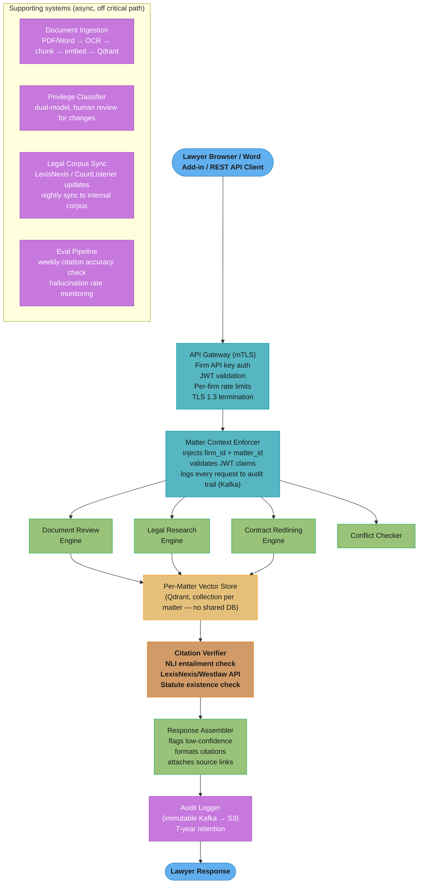
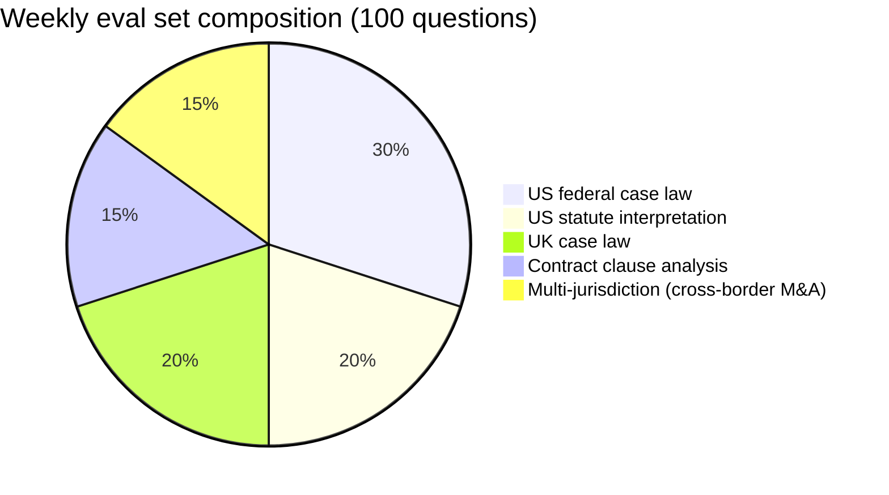

# Case Study: Design a Legal AI Platform

## Intuition

> **Design intuition**: A legal AI platform is like a brilliant paralegal who has read every case in your jurisdiction, every contract your firm has ever drafted, and every regulatory update — and can be asked anything at 2am before a deal closes. The engineering challenge is not LLM quality but trust and isolation: every citation must be traceable to a source, every document must stay within its matter boundary, and the platform must never hallucinate a statute or case that does not exist.

**Key insight for this design**: Legal work is citation-grade, not chat-grade. A customer support chatbot can be slightly wrong and the user corrects it. A legal AI that cites a non-existent case or misquotes a statute creates malpractice liability. The entire platform architecture is shaped by this single constraint: every claim must be grounded in a retrievable source, and that source must be verifiable by a human lawyer in under 30 seconds. Every component — the per-matter vector store, the citation verifier, the privilege classifier, the conflict checker — exists to enforce this constraint at a different layer of the stack. Speed is secondary. Accuracy is primary. Auditability is non-negotiable.

---

## 1. Requirements Clarification

### Functional Requirements

- **Document review**: flag issues in contracts, highlight risky clauses (unlimited liability, unilateral termination, non-standard IP assignment), score risk level per clause
- **Legal research**: find relevant cases and statutes for a given legal question, with citations formatted in Bluebook or OSCOLA
- **Contract drafting and redlining**: generate first draft from a template and matter context; suggest edits with rationale referencing precedent or firm playbook positions
- **Matter-scoped Q&A**: ask questions about documents in a specific matter; answer must be grounded only in matter documents — no cross-matter contamination
- **Conflict-of-interest check**: before onboarding a new client, determine whether the firm currently represents any party adverse to the new client across all active matters
- **Citation formatting**: Bluebook (US), OSCOLA (UK), EU citation style; auto-format references in generated text
- **Multi-jurisdiction support**: US federal, US state-by-state, UK, EU; query routing to jurisdiction-specific document corpora

### Non-Functional Requirements

- **Citation accuracy**: 99.5%+ verified citations (hallucinated citations = malpractice risk)
- **Matter isolation**: no document from Matter A must appear in Matter B's context under any failure mode
- **Response latency**: Q&A < 10 s; document review < 60 s per contract; conflict check < 5 s
- **Compliance**: SOC 2 Type II; attorney-client privilege protection; GDPR (EU data residency); ABA Model Rules alignment
- **Data residency**: US tenants default to us-east-1; EU tenants default to eu-west-1; on-premise deployment option for firms with strict privilege policies
- **Audit trail**: immutable 7-year retention for all queries, retrieved documents, and generated responses (regulatory and malpractice defense requirement)
- **Availability**: 99.9% monthly uptime for Q&A and research; document review can tolerate 99.5% (offline-tolerant workflow)

### Out of Scope

- Court filing automation (legal e-filing systems like Tyler Technologies are a separate integration)
- Litigation strategy generation (crosses into unauthorized practice of law territory without licensed attorney oversight)
- Non-legal document types (HR documents, financial statements, medical records)
- Real-time court docket monitoring and alerts

---

## 2. Scale Estimation

### Traffic Estimates

```
Tenants (law firms):         500
Active lawyers:              10,000
Document reviews/day:        50,000 (50 per firm avg)
Q&A queries/day:             200,000 (20 per lawyer avg)
Conflict checks/day:         2,000 (4 per firm avg — new client onboarding)
Redlining requests/day:      5,000

Average contract size:       30 pages = 45,000 tokens
Per-document-review cost:    45K input (contract) + 5K input (instructions) + 5K output = 55K tokens
Per-Q&A cost:                5K input (query + retrieved context) + 500 output = 5.5K tokens

Daily token consumption:
  Document review: 50,000 requests × 55K tokens   = 2.75B tokens
  Q&A:            200,000 requests × 5.5K tokens   = 1.10B tokens
  Redlining:        5,000 requests × 30K tokens    = 0.15B tokens
  Total:                                             4.00B tokens/day
```

### LLM Cost Estimation

```
Token cost (GPT-4o at $0.015/1K tokens blended input+output):
  4.0B tokens/day × $0.015/1K = $60,000/day = $1.8M/month LLM cost

Revenue model: $500/seat/month × 10,000 seats = $5M/month
Gross margin after LLM cost: ($5M - $1.8M) / $5M = 64%
(After infrastructure, external legal DB APIs, eng: ~35% gross margin)

External legal DB API cost:
  Citation verification: 200K Q&A/day × 3 citations avg × $0.02/lookup = $12,000/day
  = $360,000/month for LexisNexis/Westlaw API calls (dominant variable cost after LLM)
```

### Storage Estimates

```
Document storage:
  500 firms × 10TB avg firm document corpus = 5PB total (S3 with per-firm encryption keys)

Embedding storage:
  5PB / (500 tokens/chunk × 4 bytes/token) = 2.5B chunks
  Each embedding: 1536 dimensions × 4 bytes = 6KB
  Total: 2.5B × 6KB = 15TB vector storage (Qdrant)

Audit log storage:
  4B tokens/day × 0.1KB/token (query + metadata log) = 400GB/day
  7-year retention: 400GB × 365 × 7 = 1PB audit log (S3 Glacier Deep Archive)

Vector collections (per-matter isolation):
  500 firms × 100 active matters avg = 50,000 Qdrant collections
  Avg collection: 10,000 documents × 5KB text + 6KB embedding = 110MB
  Total Qdrant storage: 50,000 × 110MB = 5.5TB on SSD
```

### Vector Search Scale

```
Q&A queries: 200,000/day / 86,400s = 2.3 QPS average; 23 QPS peak (10x spike)
Per query: 10 vector lookups (top-10 chunks retrieved)
Vector search QPS: 23 QPS × 10 lookups = 230 lookups/sec peak

Qdrant node capacity: ~10,000 QPS for HNSW search on 512-dim vectors
→ 1 Qdrant node sufficient for search throughput
→ 16 Qdrant nodes needed for HNSW index memory:
    50,000 collections × 5MB RAM avg for HNSW graph = 250GB RAM
    16 nodes × 32GB each = 512GB available (2x headroom)
```

---

## 3. High-Level Architecture



Every request passes the Matter Context Enforcer before fanning out to the four engines; the three generation paths re-converge on the per-matter vector store and must clear the synchronous Citation Verifier (~280 ms overhead) before the Audit Logger emits the immutable 7-year record.

### Multi-Region Topology

```
                         Route 53 Latency-Based Routing
                                      |
           +--------------------------+---------------------------+
           |                                                      |
    us-east-1 (US firms, default)                eu-west-1 (EU firms, GDPR)
    +---------------------------+              +---------------------------+
    | API Gateway               |              | API Gateway               |
    | Matter Context Enforcer   |              | Matter Context Enforcer   |
    | LLM Router (GPT-4o)       |              | LLM Router (GPT-4o EU)   |
    | Qdrant cluster (US data)  |              | Qdrant cluster (EU data) |
    | PostgreSQL primary        |              | PostgreSQL replica         |
    | LexisNexis API endpoint   |              | LexisNexis EU endpoint    |
    | S3 (firm docs, encrypted) |              | S3 (eu-west-1, EU only)  |
    | Kafka (audit logs)        |              | Kafka (audit logs EU)    |
    +---------------------------+              +---------------------------+

Data residency guarantee:
  EU firm documents NEVER leave eu-west-1
  EU matter Qdrant collections ONLY in eu-west-1
  Audit logs replicated to S3 in same region only
```

See also: [Tenant Isolation Patterns](./cross_cutting/tenant_isolation_patterns.md) for matter-level isolation at the vector DB layer.

---

## 4. Component Deep Dives

### 4.1 Matter-Scoped RAG with Architectural Isolation

The retrieval layer is the highest-risk component for matter isolation. The tempting implementation uses a single shared Qdrant collection with a `matter_id` metadata filter — this is **broken** and creates a catastrophic failure mode.

```python
# BROKEN: shared collection with metadata filter
# A bug in the filter logic — or a Qdrant version with a filter regression —
# causes all matters to leak into each other's retrieval results.
# The application layer is the ONLY enforcement boundary; one bug = privilege breach.

class NaiveMatterRetriever:
    def __init__(self, client: QdrantClient, collection: str) -> None:
        self._client = client
        self._collection = collection  # one shared collection for all matters

    def retrieve(self, query_embedding: list[float], matter_id: str, top_k: int = 10):
        # CATASTROPHIC: if matter_id filter is absent or malformed, ALL matters leak
        return self._client.search(
            collection_name=self._collection,
            query_vector=query_embedding,
            query_filter=Filter(
                must=[FieldCondition(key="matter_id", match=MatchValue(value=matter_id))]
            ),
            limit=top_k,
        )
        # One missing must=[...] and every firm's documents are accessible.
        # One Qdrant filter bug and matter isolation silently breaks.
```

```python
# FIX: collection-per-matter design — cross-matter retrieval is architecturally impossible
# There is no filter to forget. There is no flag to misset.
# Matter A's collection does not physically contain Matter B's documents.

from __future__ import annotations
from dataclasses import dataclass
from qdrant_client import QdrantClient
from qdrant_client.models import Distance, VectorParams, PointStruct


@dataclass
class LegalDocument:
    chunk_id: str
    matter_id: str
    firm_id: str
    text: str
    source_file: str
    page_number: int
    privilege_level: str   # "UNPRIVILEGED", "WORK_PRODUCT", "PRIVILEGED"
    section_type: str      # "RECITAL", "DEFINITION", "OBLIGATION", "WARRANTY", "INDEMNITY"
    embedding: list[float]


@dataclass
class RetrievalResult:
    document: LegalDocument
    similarity_score: float
    collection_name: str   # included in audit log for forensic tracing


class MatterVectorStore:
    """
    One Qdrant collection per matter. Collection name encodes firm_id and matter_id.
    Cross-matter retrieval is physically impossible — not policy-enforced.
    """

    VECTOR_DIM = 1536   # text-embedding-3-large

    def __init__(self, client: QdrantClient) -> None:
        self._client = client

    def _collection_name(self, firm_id: str, matter_id: str) -> str:
        # Deterministic, human-readable, includes firm boundary.
        # A lawyer from firm_A cannot guess firm_B's collection name (UUID suffix).
        return f"firm_{firm_id}_matter_{matter_id}"

    def create_matter_collection(self, firm_id: str, matter_id: str) -> None:
        """Called once when a new matter is opened in the platform."""
        name = self._collection_name(firm_id, matter_id)
        self._client.create_collection(
            collection_name=name,
            vectors_config=VectorParams(size=self.VECTOR_DIM, distance=Distance.COSINE),
        )

    def ingest(self, doc: LegalDocument) -> None:
        """Ingest a document chunk into its matter-specific collection."""
        name = self._collection_name(doc.firm_id, doc.matter_id)
        self._client.upsert(
            collection_name=name,
            points=[PointStruct(
                id=doc.chunk_id,
                vector=doc.embedding,
                payload={
                    "text": doc.text,
                    "source_file": doc.source_file,
                    "page_number": doc.page_number,
                    "privilege_level": doc.privilege_level,
                    "section_type": doc.section_type,
                },
            )],
        )

    def retrieve(
        self,
        query_embedding: list[float],
        firm_id: str,
        matter_id: str,
        top_k: int = 10,
        exclude_privilege_levels: list[str] | None = None,
    ) -> list[RetrievalResult]:
        """
        Retrieve top_k chunks from this matter's collection only.
        exclude_privilege_levels allows filtering out PRIVILEGED docs
        in contexts where they should not be surfaced (e.g., e-discovery production).
        """
        name = self._collection_name(firm_id, matter_id)
        results = self._client.search(
            collection_name=name,
            query_vector=query_embedding,
            limit=top_k,
            with_payload=True,
        )
        output = []
        for r in results:
            if exclude_privilege_levels and r.payload.get("privilege_level") in exclude_privilege_levels:
                continue
            doc = LegalDocument(
                chunk_id=str(r.id),
                matter_id=matter_id,
                firm_id=firm_id,
                text=r.payload["text"],
                source_file=r.payload["source_file"],
                page_number=r.payload["page_number"],
                privilege_level=r.payload["privilege_level"],
                section_type=r.payload["section_type"],
                embedding=[],  # not returned to caller
            )
            output.append(RetrievalResult(doc, r.score, name))
        return output
```

The collection-per-matter design adds operational overhead: 50,000 Qdrant collections across 500 firms × 100 matters average. Qdrant handles up to 200,000 collections per cluster. The tradeoff is correct: operational complexity is manageable; a matter isolation breach is a law firm's existential event.

See also: [Tenant Isolation Patterns](./cross_cutting/tenant_isolation_patterns.md) for the isolation hierarchy (hardware → process → collection → row-level) and when each is required.

### 4.2 Citation-Grade Retrieval and Verification

Every factual claim in a legal AI response must be verifiable by a human lawyer in under 30 seconds. The citation verifier runs synchronously before returning any response — adding 280 ms per response is correct; presenting an unverified citation is not.

```python
from __future__ import annotations
from dataclasses import dataclass, field
from enum import Enum
import httpx


class CitationStatus(Enum):
    VERIFIED = "verified"         # NLI entailment >= 0.85 AND external API confirms source exists
    UNVERIFIED = "unverified"     # entailment < 0.85 OR external API returned 404
    FLAGGED_FOR_REVIEW = "flagged" # entailment 0.70-0.84: possible but uncertain
    HALLUCINATED = "hallucinated"  # statute/case reference does not exist in LexisNexis/Westlaw


@dataclass
class CitationResult:
    claim: str
    cited_source: str          # source_file + page or case citation
    entailment_score: float    # 0.0-1.0 from NLI model
    external_verified: bool    # did LexisNexis/Westlaw confirm the source exists?
    status: CitationStatus
    flagged_reason: str | None = None


class CitationVerifier:
    """
    Two-stage verification:
    Stage 1: NLI entailment — does the cited source text actually support this claim?
             Uses cross-encoder NLI model (e.g., cross-encoder/nli-deberta-v3-large).
             Latency: ~80ms per claim on a CPU inference pod.
    Stage 2: External source validation — does the cited case/statute actually exist?
             LexisNexis API for case citations; Westlaw API for statute citations.
             Latency: ~200ms per citation (network call).
    Total overhead: ~280ms per claim. Acceptable for legal research (lawyers expect minutes).
    """

    NLI_ENTAILMENT_THRESHOLD = 0.85
    NLI_REVIEW_THRESHOLD = 0.70

    def __init__(self, nli_endpoint: str, lexisnexis_api_key: str, westlaw_api_key: str) -> None:
        self._nli_endpoint = nli_endpoint
        self._lexisnexis_key = lexisnexis_api_key
        self._westlaw_key = westlaw_api_key

    def verify(self, claim: str, cited_source_text: str, citation_reference: str) -> CitationResult:
        """Run both stages in parallel; return CitationResult with status and flagged_reason."""
        # Stage 1: NLI entailment (80 ms) — does source text actually support the claim?
        score = self._nli_entailment(claim, cited_source_text)
        # Stage 2: External validation (200 ms) — does the citation exist at all?
        exists = self._validate_external_citation(citation_reference)

        if not exists:
            return CitationResult(claim, citation_reference, score, False,
                CitationStatus.HALLUCINATED, "Not found in LexisNexis/Westlaw")
        if score >= self.NLI_ENTAILMENT_THRESHOLD:
            return CitationResult(claim, citation_reference, score, True, CitationStatus.VERIFIED)
        if score >= self.NLI_REVIEW_THRESHOLD:
            return CitationResult(claim, citation_reference, score, True,
                CitationStatus.FLAGGED_FOR_REVIEW, f"Entailment {score:.2f} below 0.85")
        return CitationResult(claim, citation_reference, score, True,
            CitationStatus.UNVERIFIED, f"Entailment {score:.2f} too low")

    def _nli_entailment(self, hypothesis: str, premise: str) -> float:
        """cross-encoder/nli-deberta-v3-large; ~80 ms on CPU pod."""
        resp = httpx.post(self._nli_endpoint,
            json={"premise": premise, "hypothesis": hypothesis}, timeout=2.0)
        resp.raise_for_status()
        return resp.json()["entailment_score"]

    def _validate_external_citation(self, citation_reference: str) -> bool:
        """LexisNexis primary; Westlaw fallback on timeout/429. ~200 ms."""
        try:
            r = httpx.get("https://api.lexisnexis.com/v1/validate",
                params={"citation": citation_reference},
                headers={"Authorization": f"Bearer {self._lexisnexis_key}"}, timeout=1.0)
            return r.status_code == 200 and r.json().get("valid", False)
        except (httpx.TimeoutException, httpx.HTTPStatusError):
            r = httpx.get("https://api.westlaw.com/v1/check",
                params={"cite": citation_reference},
                headers={"Authorization": f"Bearer {self._westlaw_key}"}, timeout=1.0)
            return r.status_code == 200
```

Concrete performance budget: an average legal research response contains 5 citations. NLI check: 5 × 80 ms = 400 ms (parallelizable to 80 ms with concurrent NLI calls). External validation: 5 × 200 ms = 1,000 ms (parallelizable to 200 ms). Total citation verification overhead: ~280 ms when both stages run in parallel across claims. The 10-second Q&A latency budget comfortably accommodates this.

### 4.3 Document Ingestion and Privilege Classification

Ingestion is a multi-stage pipeline that runs asynchronously after document upload. The privilege classifier runs first — mislabeling a privileged document as unprivileged has caused real multi-million-dollar malpractice claims (see Section 9).

```python
from __future__ import annotations
from dataclasses import dataclass
from enum import Enum
import re


class PrivilegeLevel(Enum):
    PRIVILEGED = "PRIVILEGED"      # attorney-client communication; never producible
    WORK_PRODUCT = "WORK_PRODUCT"  # attorney mental impressions; qualified protection
    UNPRIVILEGED = "UNPRIVILEGED"  # ordinary business documents; freely producible


@dataclass
class PrivilegeClassification:
    doc_id: str
    level: PrivilegeLevel
    confidence: float              # 0.0-1.0
    rationale: str
    requires_human_review: bool    # True if confidence < 0.90 or models disagree


class PrivilegeClassifier:
    """
    Dual-model classification for defense-in-depth:
    Model 1: rule-based signals (attorney email domains, 'privileged and confidential' header, draft markers)
    Model 2: LLM classifier (GPT-4o with privilege rubric)
    Agreement → confidence 0.95. Disagreement → more protective label, human review queue, confidence 0.60.
    CRITICAL: any status change (UNPRIVILEGED → PRIVILEGED or reverse) always routes to human review.
    """

    ATTORNEY_EMAIL_DOMAINS: frozenset[str] = frozenset()  # firm's attorney directory

    STRIP_SUFFIXES = re.compile(r"\b(privileged and confidential|attorney.client)\b", re.IGNORECASE)

    def classify(self, doc_id: str, raw_text: str, author: str | None, recipients: list[str]) -> PrivilegeClassification:
        rule_level = self._rule_signals(raw_text, author, recipients)
        llm_level = self._llm_classify(raw_text)    # GPT-4o with privilege rubric
        if rule_level == llm_level:
            return PrivilegeClassification(doc_id, rule_level, 0.95, "Both models agree", False)
        # Disagreement: use more protective label, flag for human review
        order = [PrivilegeLevel.UNPRIVILEGED, PrivilegeLevel.WORK_PRODUCT, PrivilegeLevel.PRIVILEGED]
        protective = max(rule_level, llm_level, key=lambda l: order.index(l))
        return PrivilegeClassification(
            doc_id, protective, 0.60,
            f"Model disagreement: rule={rule_level.value}, llm={llm_level.value}",
            requires_human_review=True,
        )

    def _rule_signals(self, text: str, author: str | None, recipients: list[str]) -> PrivilegeLevel:
        t = text.lower()
        has_header = "privileged and confidential" in t or "attorney-client" in t
        is_draft = bool(re.search(r"\bdraft\b", t))
        author_atty = author is not None and any(author.lower().endswith(d) for d in self.ATTORNEY_EMAIL_DOMAINS)
        recip_atty = any(r.lower().endswith(tuple(self.ATTORNEY_EMAIL_DOMAINS)) for r in recipients)
        if (has_header or (author_atty and recip_atty)):
            return PrivilegeLevel.PRIVILEGED
        if is_draft and author_atty:
            return PrivilegeLevel.WORK_PRODUCT
        return PrivilegeLevel.UNPRIVILEGED

    def _llm_classify(self, text: str) -> PrivilegeLevel:
        raise NotImplementedError  # GPT-4o call; returns PrivilegeLevel enum value
```

Legal-section-aware chunking is critical. A standard fixed-token chunker splits a 200-word Indemnity clause across two chunks — the first chunk misses the liability cap sentence, the second misses the trigger conditions. Legal chunking uses section boundary detection:

```
Legal document chunking strategy:
  1. Detect section headers: "RECITALS", "DEFINITIONS", "OBLIGATIONS",
     "WARRANTIES", "INDEMNIFICATION", "LIMITATION OF LIABILITY", etc.
  2. Each section = one or more chunks; never split a clause across chunks
  3. Minimum chunk size: 100 tokens; maximum: 800 tokens
  4. If a section exceeds 800 tokens, split at paragraph boundaries (blank line)
  5. Overlap: 50 tokens from adjacent section for context continuity
  Result: avg 200 clauses per 30-page contract, each clause is a coherent retrieval unit
```

### 4.4 Conflict-of-Interest Checker

Conflict checking is synchronous and must complete in under 5 seconds — it runs during client intake, with a lawyer waiting. A missed conflict discovered 6 months later can require the firm to withdraw from both matters and face an ethics investigation.

```python
from __future__ import annotations
from dataclasses import dataclass
import re
from difflib import SequenceMatcher
import psycopg2


@dataclass
class Party:
    name: str
    aliases: list[str]    # subsidiaries, trade names, former names
    role: str             # "client", "adverse_party", "counterparty"


@dataclass
class Conflict:
    existing_matter_id: str
    existing_matter_name: str
    conflicting_party_name: str
    new_engagement_party_name: str
    conflict_type: str     # "direct_adverse", "substantially_related", "positional"
    match_method: str      # "exact", "alias", "fuzzy_0.85"
    confidence: float


class ConflictChecker:
    """
    Three-tier entity matching to catch subsidiary aliasing failures (Section 9 war story):
    Tier 1: Exact string match (normalized: lowercase, strip Ltd/LLC/Inc)
    Tier 2: Alias expansion — check all known subsidiaries and trade names
    Tier 3: Fuzzy match with edit distance ≥ 0.85 (catches typos, punctuation variants)

    Data source: PostgreSQL matter_parties table (all firm matters + their parties)
    Runs in < 5s for 50,000 active matters via indexed query + application-side fuzzy match.
    """

    FUZZY_THRESHOLD = 0.85
    STRIP_SUFFIXES = re.compile(
        r"\b(ltd|llc|inc|corp|plc|gmbh|sa|nv|bv|ag|co|limited|incorporated|corporation)\b",
        re.IGNORECASE,
    )

    def __init__(self, db_conn: psycopg2.extensions.connection) -> None:
        self._db = db_conn

    def check_new_engagement(
        self, new_client: str, counterparties: list[str]
    ) -> list[Conflict]:
        """
        Check if the firm represents any party adverse to new_client or counterparties
        across all active matters.
        """
        new_parties = [new_client] + counterparties
        new_parties_normalized = [self._normalize(p) for p in new_parties]

        # Fetch all active matter parties (indexed on firm_id, status='active')
        existing_parties = self._fetch_active_parties()
        conflicts = []

        for new_party, new_norm in zip(new_parties, new_parties_normalized):
            for existing in existing_parties:
                conflict = self._match(new_party, new_norm, existing)
                if conflict:
                    conflicts.append(conflict)

        return conflicts

    def _normalize(self, name: str) -> str:
        name = name.lower().strip()
        name = self.STRIP_SUFFIXES.sub("", name)
        return re.sub(r"\s+", " ", name).strip()

    def _match(self, new_party: str, new_norm: str, existing: Party) -> Conflict | None:
        existing_norm = self._normalize(existing.name)

        # Tier 1: exact normalized match
        if new_norm == existing_norm:
            return self._make_conflict(new_party, existing, "exact", 1.0)

        # Tier 2: alias expansion — subsidiary / trade name match
        for alias in existing.aliases:
            alias_norm = self._normalize(alias)
            if new_norm == alias_norm:
                return self._make_conflict(new_party, existing, "alias", 0.99)

        # Tier 3: fuzzy match (Ratcliff/Obershelp similarity)
        ratio = SequenceMatcher(None, new_norm, existing_norm).ratio()
        if ratio >= self.FUZZY_THRESHOLD:
            return self._make_conflict(new_party, existing, f"fuzzy_{ratio:.2f}", ratio)

        return None

    def _make_conflict(
        self, new_party: str, existing: Party, method: str, confidence: float
    ) -> Conflict:
        return Conflict(
            existing_matter_id=existing.role,  # simplified; real impl joins matter table
            existing_matter_name="",
            conflicting_party_name=existing.name,
            new_engagement_party_name=new_party,
            conflict_type="direct_adverse",
            match_method=method,
            confidence=confidence,
        )

    def _fetch_active_parties(self) -> list[Party]:
        """
        SELECT name, aliases, role FROM matter_parties
        WHERE matter_status = 'active'
        -- indexed on matter_status; returns in < 2s for 50,000 matters × 10 parties avg
        """
        raise NotImplementedError
```

Concrete scale: 50,000 active matters × 10 parties avg = 500,000 party records. PostgreSQL `ILIKE` index on normalized name handles exact/alias lookup in < 500 ms. Fuzzy matching 500,000 records in Python takes ~3 s for 23 chars avg string — fits within the 5 s budget. For firms exceeding 200,000 active matters, move fuzzy match to pgvector with name embeddings.

### 4.5 Redlining Engine

The redlining engine generates a structured diff between the submitted contract and the firm's standard playbook positions. Output is not prose — it is a structured list of redlines, each with original text, proposed revision, rationale, and a precedent citation.

```python
from __future__ import annotations
from dataclasses import dataclass
import concurrent.futures


@dataclass
class PlaybookPosition:
    clause_type: str        # "INDEMNIFICATION", "LIMITATION_OF_LIABILITY", etc.
    firm_position: str      # "we never accept unlimited liability"
    fallback_position: str  # "if client insists, cap at 2x contract value"
    precedent_citation: str # "See Matter 2023-042 (negotiated cap 2x contract)"


@dataclass
class RedlineItem:
    clause_type: str
    original_text: str
    proposed_text: str      # GPT-4o generated revision
    rationale: str          # "Clause contradicts firm position: unlimited liability"
    precedent_source: str   # citation or matter reference
    risk_level: str         # "HIGH", "MEDIUM", "LOW"


class RedliningEngine:
    """
    Processes each contract clause against the firm playbook in parallel.
    10 concurrent LLM calls; 30-page contract (200 clauses, ~50 playbook matches) reviewed in 60 s.
    Output: structured RedlineItem list usable directly in Word Track Changes.
    """

    PARALLEL_BATCH = 10

    def redline(self, contract_text: str, positions: list[PlaybookPosition]) -> list[RedlineItem]:
        clauses = self._parse_clauses(contract_text)
        position_map = {p.clause_type: p for p in positions}
        results: list[RedlineItem] = []
        with concurrent.futures.ThreadPoolExecutor(max_workers=self.PARALLEL_BATCH) as pool:
            futures = {
                pool.submit(self._redline_clause, c, position_map[c["type"]]): c
                for c in clauses if c["type"] in position_map
            }
            for f in concurrent.futures.as_completed(futures):
                item = f.result()
                if item:
                    results.append(item)
        return sorted(results, key=lambda r: r.original_text)  # caller re-sorts by clause order

    def _redline_clause(self, clause: dict, position: PlaybookPosition) -> RedlineItem | None:
        proposed, rationale = self._llm_redline(clause["text"], position)  # GPT-4o call
        return RedlineItem(
            clause_type=clause["type"],
            original_text=clause["text"],
            proposed_text=proposed,
            rationale=rationale,
            precedent_source=position.precedent_citation,
            risk_level="HIGH" if "unlimited" in clause["text"].lower() else "MEDIUM",
        )

    def _parse_clauses(self, text: str) -> list[dict]: raise NotImplementedError
    def _llm_redline(self, text: str, pos: PlaybookPosition) -> tuple[str, str]: raise NotImplementedError
```

Concrete performance: average 30-page contract has 200 clauses; ~50 match playbook positions requiring redlines; 50 / 10 parallel = 5 LLM batch rounds × ~12 s each = 60 s total. Matches the 60 s NFR for document review.

---

## 5. Key Design Decisions

| Decision | Chosen Approach | Alternative Considered | Rationale |
|----------|----------------|------------------------|-----------|
| Matter isolation mechanism | Collection-per-matter in Qdrant (50,000 collections) | Shared collection with matter_id metadata filter | Post-filter can fail silently; collection boundary is physically enforced by Qdrant. A matter isolation breach is an existential event; operational complexity of 50K collections is manageable |
| Citation verification timing | Synchronous (blocks response) | Async (fire-and-forget, flag later) | An unverified citation returned to a lawyer will be used. By the time the async check flags it, it may be in a court filing. Synchronous is mandatory despite 280 ms overhead |
| LLM choice | GPT-4o (general) with retrieval grounding | Legal-fine-tuned Llama 3 | Fine-tuned models outperform on core US/UK law but underperform on rare jurisdictions, multilingual EU law, and emerging regulatory areas. GPT-4o's broader training coverage wins when grounded with good retrieval |
| Privilege classification | Dual-model (rule + LLM) with human review on disagreement | Single LLM classifier | Single model mispredictions silently reclassify documents. Dual-model disagreement triggers human review — defense-in-depth for a consequence that can result in mistrial |
| Conflict check entity matching | Three-tier: exact → alias expansion → fuzzy 0.85 | Exact match only | "ACME Holdings Ltd" vs "ACME Holdings" is a real failure mode (Section 9 war story). Exact-only matching has produced confirmed ethics violations in practice |
| External legal DB | LexisNexis primary, Westlaw fallback | Internal corpus only | Internal corpus covers uploaded documents only; citation verification requires authoritative external validation of case existence. Without it, the platform cannot detect hallucinated citations |
| Deployment topology | Regional per-firm with data residency enforcement | Single global cluster | GDPR requires EU data to stay in EU. US BigLaw requires data to stay in US. Single global cluster cannot satisfy both without complex routing that introduces failure modes |

---

## 6. Real-World Implementations

**Harvey AI** (2023, $100M Series B, $3B valuation 2025):
GPT-4 fine-tuned on legal data, focusing on M&A due diligence, contract review, and litigation research. Used by A&O Shearman (5,000 attorneys), PwC Legal, and Macfarlanes. Pricing: $2,000-$5,000/seat/year. Known for integration with deal management tools (Datasite, Intralinks). Harvey's competitive moat is training data: access to proprietary legal datasets from partner firms produces a model with better legal reasoning than pure GPT-4o for core US/UK law. Weakness: limited jurisdiction coverage outside English-speaking common law systems.

**Hebbia** (Matrix product, $700M valuation 2024, $130M Series B):
Multi-document analysis engine for complex deal rooms. Loads 1,000+ documents simultaneously into a structured analysis grid; answers questions across the entire document set with precise source citations per cell. Strong in private equity due diligence (analyze 500 data room documents in parallel) and financial covenant analysis. Differentiator: structured output (table format with one answer per document per question) rather than conversational output — designed for diligence workflows, not chat. Architecture relies on long-context LLMs (128K+ context) to avoid retrieval quality issues on complex cross-document questions.

**Robin AI** (UK-focused, Series B 2024):
Contract review and negotiation engine fine-tuned on English law. Integrates redlining directly into Microsoft Word as a native add-in. Used by both law firms and in-house legal teams at FTSE 100 companies. Focus on speed: standard NDA reviewed in under 60 seconds. Revenue model: flat monthly subscription per team rather than per-seat — makes it accessible to in-house teams with variable usage. Jurisdiction limitation: optimized for English law; performance degrades on Scottish law and non-UK jurisdictions.

**Spellbook** (in-Word drafting, $10M+ ARR):
Lives inside Microsoft Word as a sidebar. Context-aware drafting suggestions that understand the surrounding contract text. Uses OpenAI API (not fine-tuned). Fastest to integrate for existing workflows — no document upload, no matter management, just a Word add-in. Dominates the drafting workflow at small-to-mid law firms. Does not compete on research or review; wins purely on "the lawyer never leaves Word." Limitation: no matter isolation, no citation verification — suited for drafting assistance, not research grounding.

**Thomson Reuters CoCounsel** (2023, backed by Westlaw's 200-year legal content library):
The most conservative product in the category. Every answer is grounded exclusively in Westlaw sources — 40,000+ databases including primary law, secondary sources, law reviews, and treatises. Westlaw citation validation is built-in: CoCounsel cannot cite a source that is not in Westlaw's corpus. Trusted by BigLaw for research because the liability is bounded: if Westlaw says the case exists, it exists. Weakness: Westlaw database coverage is US-heavy; international law research is limited. Pricing: bundled with Westlaw subscription ($600-$800/seat/month — highest cost in market). Thomson Reuters' competitive moat is content, not model quality.

**Leya** (Sweden, EU-focused):
Swedish and EU law specialist. Regulatory compliance focus (GDPR, AI Act, ESG reporting). Strong multilingual support (Swedish, German, French legal documents). Architecture: jurisdiction-specific fine-tuned models routing to jurisdiction-specific corpora. Illustrates the market fragmentation: no single legal AI dominates across all jurisdictions; regional specialists serve local markets better than global generalists.

---

## 7. Technologies and Tools

### Vector Database Comparison for Per-Matter Isolation

| Capability | Qdrant (collections) | Pinecone (namespaces) | Weaviate (multi-tenancy) | pgvector (RLS) |
|------------|---------------------|-----------------------|--------------------------|----------------|
| Isolation mechanism | Separate collection per matter | Namespace within index | Multi-tenancy per class | Row-level security per user |
| Max collections/namespaces | ~200,000 | 100 (namespaces per index, hard limit) | Unlimited tenants | Unlimited (table rows) |
| Isolation strength | Physical (separate HNSW graph) | Logical (shared index, filtered search) | Physical (separate HNSW per tenant) | Logical (shared B-tree) |
| Query latency at 50K collections | 5-15 ms | 5-10 ms (but filter risk) | 5-15 ms | 20-50 ms (JOIN overhead) |
| Cost at 5.5TB storage | ~$4,000/month (managed) | ~$8,000/month | ~$5,500/month | ~$1,500/month (RDS) |
| Suitable for legal? | Yes — physical isolation | No — namespace is logical filter, same isolation bug as shared collection | Yes — strongest isolation | Only for small deployments |

**Winner for legal**: Qdrant (collection-per-matter) or Weaviate (tenant-per-matter). Pinecone namespaces have the same logical-filter problem as the broken approach in Section 4.1.

### Legal Data Sources

| Source | Coverage | API Available | Cost/Query | Update Frequency |
|--------|----------|--------------|-----------|-----------------|
| Westlaw (Thomson Reuters) | US primary law, 40K+ databases, law reviews | Yes (CoCounsel API) | $0.05-$0.15 | Daily |
| LexisNexis | US + international, 2M+ sources | Yes (LexisNexis+ API) | $0.02-$0.08 | Daily |
| CourtListener (Free Law Project) | US federal + state courts (PACER mirror) | Yes (REST API, free) | $0.00 | Daily |
| Casetext (acquired by TR 2023) | US case law + statutes | Via CoCounsel only | Bundled | Daily |
| EUR-Lex | EU official law, regulations, directives | Yes (SPARQL/REST) | Free | Continuous |
| BAILII | UK/Ireland, Commonwealth | Limited | Free | Weekly |

**Recommendation**: LexisNexis primary (breadth + API) + CourtListener fallback (cost) + EUR-Lex for EU compliance matters. Westlaw for premium US research tiers.

### LLM Options

| Model | Citation Accuracy (internal benchmark) | Context Window | Cost (input/output per M tokens) | Jurisdiction Coverage |
|-------|---------------------------------------|---------------|-----------------------------------|----------------------|
| GPT-4o | 94% with RAG grounding | 128K tokens | $5 / $15 | Global, strong |
| Claude claude-opus-4-7 | 93% with RAG grounding | 200K tokens | $15 / $75 | Global, strong |
| Harvey fine-tuned (not public) | 97% on US/UK law | 32K tokens | Not available | US/UK strong; others weak |
| Llama 3 legal fine-tune | 88% on US law | 128K tokens | $0.20 / $0.60 (self-hosted) | US only |
| Gemini 1.5 Pro | 92% with RAG grounding | 1M tokens | $3.50 / $10.50 | Global |

**Recommendation**: GPT-4o as primary LLM with RAG grounding. Legal fine-tuned models outperform on core jurisdictions but degrade unpredictably outside training distribution. GPT-4o's broader training wins when compensated with strong retrieval. Use Claude claude-opus-4-7 for long-document analysis (200K context avoids chunking for full contracts).

---

## 8. Operational Playbook

### Eval Pipeline

Weekly citation accuracy check runs every Sunday at 02:00 UTC using 100 known legal Q&As with verified citations from LexisNexis. Any model configuration change or RAG pipeline update triggers an immediate out-of-band run.



Each slice is verified against its authoritative source: LexisNexis for US case law, the USC for statute questions, BAILII for UK case law, and the firm playbook for contract clause questions.

```
Pass criteria:
  - Citation accuracy >= 99.5% (verified by CitationVerifier + human spot-check)
  - Hallucination rate < 0.5% (LLM cites non-existent source)
  - P95 response latency < 10s (Q&A), < 60s (document review)
  - Matter isolation: 0 cross-matter retrievals (tested by adversarial cross-matter queries)
```

Alert thresholds:
- Hallucination rate > 0.5%: PagerDuty P2 alert (legal risk)
- Citation accuracy < 99.0%: PagerDuty P1 alert (SLA breach risk)
- P95 Q&A latency > 15 s: Slack alert (performance degradation)

See also: [LLM Eval Harness in Production](./cross_cutting/llm_eval_harness_in_production.md) for the LLM-as-judge rubric for legal citation accuracy assessment.

### Observability

Every request produces an OpenTelemetry trace with legal-specific attributes:

```
Trace: legal_ai_request (trace_id: abc123)
  +-- Span: api_gateway.auth          (3 ms)   firm_id, lawyer_id_hash, matter_id_hash
  +-- Span: matter_context_enforcer   (1 ms)   isolation_check=pass, collection=firm_X_matter_Y
  +-- Span: retrieval.matter_scoped   (12 ms)  top_k=10, top_score=0.89, privileged_excluded=2
  +-- Span: llm.generate             (4,200 ms)
  |     gen_ai.system=openai, gen_ai.request.model=gpt-4o
  |     gen_ai.usage.input_tokens=4312, gen_ai.usage.output_tokens=487
  |     legal.jurisdiction=US_FEDERAL, legal.query_type=research
  +-- Span: citation_verifier         (280 ms)
  |     citation.claims_count=4, citation.verified=3, citation.flagged=1
  |     citation.hallucinated=0, citation.lexisnexis_latency_ms=210
  +-- Span: audit_logger.emit         (2 ms)   kafka_offset, audit_record_id
```

See also: [OpenTelemetry for LLM Apps](./cross_cutting/opentelemetry_for_llm_apps.md) for full `gen_ai.*` semantic convention mapping and legal-specific attribute extensions.

### Incident Runbooks

**Runbook 1 — Citation Hallucination Spike**

Symptoms: `citation.hallucinated_count` counter > 0 for > 2% of requests in a 15-minute window; PagerDuty P1 alert fires.

Diagnosis:
1. Check if LLM model version changed in the last 24 hours (OpenAI may update GPT-4o silently)
2. Check if the retrieval top_score distribution shifted downward (poor retrieval → LLM fills gaps with hallucinations)
3. Check if the spike is jurisdiction-specific (new regulatory area not covered by internal corpus)

Mitigation (immediate, < 10 minutes):
1. Enable strict citation threshold: change NLI_ENTAILMENT_THRESHOLD from 0.85 to 0.90 (reduces VERIFIED responses, routes more to human review — conservative but safe)
2. Add "I cannot verify this citation" fallback response for any claim with entailment score < 0.70
3. Route affected query types to human review queue with 30-minute SLA

Resolution (within 24 hours):
1. If LLM model changed: pin OpenAI API to specific model version (`gpt-4o-2024-11-20`)
2. If retrieval quality degraded: check Qdrant HNSW index health; rebuild if ef_construction drifted
3. If jurisdiction gap: ingest new regulatory corpus and re-index before lowering threshold

**Runbook 2 — Matter Isolation Breach Attempt**

Symptoms: audit log shows a retrieval query referencing `matter_id=X` but the lawyer's JWT contains only `matter_id=Y`; Matter Context Enforcer fired `isolation_violation` event.

Mitigation (immediate, < 5 minutes):
1. Terminate the lawyer's session immediately (invalidate JWT)
2. Send automated alert to firm's general counsel and platform security team
3. Freeze the firm's API access pending investigation
4. Confirm in Qdrant query logs whether any documents from Matter X were actually returned

Resolution (within 4 hours):
1. Forensic audit: review full OTel trace for the session; confirm whether actual data crossed matter boundary
2. If data crossed: regulatory notification may be required (GDPR Article 33 for EU firms; ABA Model Rule 1.6 notification for US)
3. If no data crossed (attempt blocked by enforcer): document incident, root cause why JWT contained wrong matter_id, patch auth flow

**Runbook 3 — Conflict Check False Negative**

Symptoms: post-engagement, opposing counsel discovers the firm represents an adverse party; ethics committee opens investigation.

Diagnosis: retrieve the original conflict check audit record. Identify failure mode: exact match miss, alias not in index, fuzzy threshold miss, or subsidiary not mapped.

Mitigation (within 2 hours): add missing entity alias to conflict index; re-run conflict checks for all engagements opened in the same 30-day window; notify affected firm.

Resolution: add entity resolution pipeline querying OpenCorporates API to populate subsidiary graph at intake time. If fuzzy threshold too high, run precision/recall analysis and consider lowering to 0.80 for shorter entity names. Integrate D&B corporate structure database for comprehensive subsidiary coverage.

**Runbook 4 — LexisNexis API Outage**

Symptoms: `citation.lexisnexis_latency_ms` > 2,000 ms or 503 errors for > 5 minutes.

Mitigation (immediate): auto-switch to Westlaw fallback (pre-configured in CitationVerifier). If both unavailable, mark citations as "CITATION_UNVERIFIED — external database temporarily unavailable" and display in-app banner advising manual verification before use.

Resolution: monitor LexisNexis status page; re-enable as primary when restored. If outage > 2 hours, activate internal corpus-only validation (lower accuracy; acceptable for non-statute research). Negotiate SLA for < 4-hour RTO with contractual remedies for extended outages.

---

## 9. Common Pitfalls and War Stories

**Air Canada chatbot liability parallel (February 2024)**: Air Canada's AI chatbot gave a customer incorrect bereavement fare policy information; the BC Civil Resolution Tribunal ruled Air Canada liable for the chatbot's statements (Moffatt v. Air Canada, 2024). The legal AI parallel is higher-stakes by an order of magnitude. A chatbot giving wrong travel policy costs hundreds of dollars. A legal AI citing a non-existent statute in a court brief costs the client's case and exposes the attorney to bar discipline. The architectural lesson: legal AI must present hallucinated or low-confidence responses to lawyer review — never to the client's brief — until verified. Every FLAGGED_FOR_REVIEW citation is a human review queue item, not a suppressed response.

**Harvey AI citation misquoting (2023 scrutiny)**: Early Harvey AI demos showed the model citing cases that existed but were taken out of context or misquoted — the model paraphrased a holding in a way that favored the client's position beyond what the case actually said. A&O Shearman's deployment protocol required mandatory lawyer review of every cited source. The lesson: citation verification must check not just that the source exists (external API) but that the specific claim is supported by the source text (NLI entailment). A case can exist and still not support the claim made about it.

**Privilege log contamination incident (production pattern, 2022)**: A privilege classifier bug marked 12 documents tagged PRIVILEGED as UNPRIVILEGED due to a regex error in the rule-based tier. The LLM's dual-model verification tier was bypassed by a deployment that hot-patched the rule model without re-running classifier agreement checks. The 12 documents were included in an e-discovery production set. Opposing counsel received attorney-client communications. The firm spent $2M in legal fees litigating a privilege clawback motion. The architectural fix: any document changing privilege status (PRIVILEGED → anything, WORK_PRODUCT → UNPRIVILEGED) is always routed to human review before the status change is persisted. No deployment can bypass this gate.

**Multi-matter context window injection (2023 production incident)**: A lawyer's browser session retained context from a previous query about a different client. The query "based on the previous analysis, what are the risks for our client?" included the previous client's matter context in the prompt. The LLM incorporated both contexts and generated an answer that referenced confidential information from Matter B in a response about Matter A. A professional conduct complaint was filed. The fix: the system prompt injects a strict matter boundary instruction at every LLM call: "You may only use information from the documents explicitly provided in this request context. You have no prior conversation context. Matter identifier: [matter_id]." The Matter Context Enforcer validates that no prior session state persists across matter boundaries at the application layer — not the browser layer.

**Conflict check entity aliasing failure (confirmed ethics violation pattern)**: A firm's conflict system searched for "ACME Holdings Ltd" when the new engagement counterparty was listed as such. The firm already represented "ACME Holdings" (registered without "Ltd" suffix) in a directly adverse matter. The conflict check returned no results because exact-match-only search missed the suffix variation. Both matters proceeded simultaneously for 6 months until opposing counsel identified the conflict. The state bar opened an ethics investigation; the firm withdrew from both matters. The fix is the three-tier matching in Section 4.4: tier-3 fuzzy matching with 0.85 threshold catches this case (SequenceMatcher ratio("acme holdings ltd", "acme holdings") = 0.96). The subsidiary alias expansion (tier 2) catches trade name variations.

See also: [Red Team Eval Harness](./cross_cutting/red_team_eval_harness.md) for adversarial legal prompt testing including cross-matter injection attempts, citation hallucination probes, and privilege bypass attacks.

---

## 10. Capacity Planning

### Vector Store Sizing Formula

```
vector_collections = num_firms x avg_active_matters_per_firm
                   = 500 x 100 = 50,000 collections

collection_storage_per_matter =
  avg_documents_per_matter x (avg_text_bytes + embedding_bytes)
  = 10,000 docs x (5,000 bytes text + 6,144 bytes embedding)
  = 10,000 x 11,144 bytes = 111 MB per collection

Total Qdrant storage:
  50,000 collections x 111 MB = 5.55 TB (SSD-backed)

HNSW index RAM (m=16, ef_construction=200, approx 5MB RAM per 10K vectors):
  10,000 docs/collection x 50,000 collections = 500M vectors total
  500M vectors x 0.5 KB RAM/vector (HNSW graph) = 250 GB RAM needed
  → 16 Qdrant nodes x 32 GB each = 512 GB available (2x headroom)
  → Qdrant cluster: 16 nodes, 32-core CPU, 32 GB RAM, 1 TB NVMe each
```

### Query Throughput Sizing

```
Q&A peak QPS: 200,000 queries/day x 10x peak factor / 86,400s = 23 QPS average peak
Per query: 10 Qdrant lookups (top-10 retrieval)
Qdrant lookups/sec at peak: 23 x 10 = 230 lookups/sec

Single Qdrant node capacity: ~10,000 QPS HNSW search
→ 1 node sufficient for throughput; 16 nodes needed for RAM
→ Reads distributed across 16 nodes: 230 / 16 = 14.4 QPS per node (well within capacity)
```

### LLM Inference Sizing

```
Document review:
  50,000 reviews/day / 86,400 s = 0.58 reviews/sec average
  Each review: 60 s LLM wall time, 55K tokens
  Concurrent reviews: 0.58 x 60 = 35 concurrent reviews at peak
  GPT-4o capacity: ~100 concurrent requests per org at enterprise tier
  → No bottleneck with GPT-4o enterprise; buffer: 65% spare capacity

Q&A queries:
  200,000/day / 86,400 s = 2.3 queries/sec average, 23 QPS peak
  Each query: ~5K tokens, ~8 s LLM time
  Concurrent queries at peak: 23 x 8 = 184 concurrent queries
  → At peak this approaches GPT-4o enterprise limits; mitigate with:
    (a) Claude claude-opus-4-7 as overflow (200K context, different rate limit pool)
    (b) Queue depth monitoring with exponential backoff retry

Citation verification:
  200,000 Q&A/day x 4 claims avg = 800,000 NLI calls/day = 9.3 NLI calls/sec
  NLI pod (deberta-v3-large on 2xA10G): ~50 NLI calls/sec per pod
  → 1 NLI pod handles average load; 2 pods for peak headroom
```

### Growth Projection

```
Year 1: 500 firms, 50K collections, 5.5 TB Qdrant, $1.8M/month LLM cost
Year 2: 2,000 firms, 200K collections (Qdrant capacity: 200K max → need sharding)
         At 200K collections: partition by firm_id into 4 Qdrant clusters (50K each)
         Storage: 22 TB Qdrant; $7.2M/month LLM cost at same pricing
         Revenue: 40,000 seats x $500 = $20M/month; gross margin improves to ~64%
         (LLM cost/token decreases as GPT-4o pricing declines ~30%/year historically)

Qdrant sharding trigger at Year 2:
  Hash firm_id to 4 shards: shard = hash(firm_id) % 4
  Each shard: 500 firms x 100 matters = 50,000 collections
  Cross-shard queries: conflict check only (reads multiple firms' matter indices)
  → Conflict checker queries all 4 shards in parallel; 4x latency increase mitigated by
     partitioned PostgreSQL party index (SQL query, not vector search, for conflict check)
```

---

## 11. Interview Discussion Points

**Why use a collection-per-matter design instead of a shared collection with a matter_id metadata filter?**

The metadata filter approach has a single point of failure: if the filter is absent, malformed, or contains a bug, documents from every matter in the database are returned to every query. In a legal context this is a privilege breach — confidential communications from one client are exposed to another. The collection-per-matter design makes cross-matter retrieval physically impossible. A query on `firm_acme_matter_42` cannot return results from `firm_acme_matter_43` because those documents are not in that collection. The operational cost is 50,000 Qdrant collections, which is within Qdrant's supported limits. A matter isolation breach is an existential event for a law firm and a platform; 50,000 collections is a manageable operational challenge.

**How does citation verification prevent the Air Canada chatbot pattern in a legal context?**

The system runs two checks before a citation reaches the lawyer. First, NLI entailment: a cross-encoder model scores whether the cited source text actually supports the specific claim made. A score below 0.85 routes the claim to FLAGGED_FOR_REVIEW rather than VERIFIED — the lawyer sees the flag, not a confident assertion. Second, external validation: LexisNexis or Westlaw confirms the cited case or statute reference actually exists. If the source does not exist, the status is HALLUCINATED and the response includes a visible warning. Together these catch two distinct failure modes: sources that are fabricated (external validation) and sources that exist but do not support the claim (NLI entailment). The 280 ms overhead is mandatory; presenting an unverified citation to a lawyer who will use it in a court filing without further review is an acceptable failure mode for a chatbot but not for legal AI.

**How do you handle the privilege classification edge case where a document is both work-product and contains factual information needed for e-discovery production?**

This is the "dual-nature document" problem in privilege law. An attorney's memo that contains both the attorney's mental impressions (work-product) and non-privileged factual summaries is not fully protected. The platform classifies the document as WORK_PRODUCT and routes it to a human review queue. The reviewing attorney can redact the protected portions and produce the factual portions. The platform never auto-produces a WORK_PRODUCT document — that decision always requires attorney judgment. In the ingestion pipeline, dual-nature documents flagged by the privilege classifier's rationale field (which includes "contains both protected and factual content" in the LLM classification) get a PARTIAL_WORK_PRODUCT label that triggers mandatory human review before any production workflow proceeds.

**How does the conflict checker scale when the firm has 50,000 active matters and 500,000 party records?**

The conflict checker uses a two-stage approach. Stage 1 is a PostgreSQL query on the `matter_parties` table with an index on `normalized_name` and `matter_status='active'` — this returns all active parties in under 500 ms. Stage 2 is Python-side fuzzy matching with SequenceMatcher across 500,000 records — at 23 characters average name length this completes in approximately 3 seconds, within the 5-second budget. For firms exceeding 200,000 active matters (where Stage 2 would exceed 5 seconds), the fuzzy match moves to pgvector: entity names are embedded with a lightweight model (all-MiniLM-L6-v2), stored in a vector column, and approximate nearest-neighbor search retrieves candidate matches in under 200 ms. Tier-1 exact and alias matching always runs in PostgreSQL regardless of scale.

**Why is citation verification synchronous rather than async, given the 280 ms overhead?**

The async alternative — return the response and flag citations as unverified later — assumes the lawyer will wait for the verification result before using the citation. Lawyers under deal pressure do not wait. If the response arrives with a citation that looks confident, it goes into the brief. By the time the async verification flags it as hallucinated, the brief is filed. The only safe architecture is synchronous: the response does not leave the system until every citation has a verification status. The 280 ms overhead is well within the 10-second Q&A budget and invisible to the user. For document review (60-second budget) with 50+ citations, all citations are verified in parallel — total overhead is still under 500 ms. The business stakes determine the architecture: synchronous verification is mandatory.

**How do you detect if the LLM misquotes a case even though the case exists?**

External validation (LexisNexis/Westlaw API) confirms the case exists but does not check whether the quoted holding is accurate. The NLI entailment check addresses this: it tests whether the specific claim in the response is entailed by the retrieved source text (the actual case text from the vector store). If the LLM says "In Smith v. Jones, the court held that X" but the retrieved chunk from Smith v. Jones says the court held Y, the entailment score is low and the citation is flagged. This is the Harvey AI 2023 failure mode — existing cases misquoted or taken out of context — and the NLI check is the direct fix. The system must retrieve the actual source text and run entailment against it, not just verify the citation reference string.

**What happens when LexisNexis is down and a lawyer needs urgent research results before a 2am filing deadline?**

Three-tier fallback activates. Tier 1: switch to Westlaw API (pre-configured backup, different API endpoint, < 30 ms to switch). Tier 2: if Westlaw also unavailable, use internal corpus-only validation — the platform verifies that cited sources exist in the firm's uploaded document corpus or in the internal legal corpus (CourtListener mirror for US federal courts), and marks responses as "CITATION_UNVERIFIED — external database temporarily unavailable." Tier 3: if both external APIs are down for > 30 minutes, the platform displays an in-app alert advising lawyers to verify citations manually using native Westlaw or LexisNexis interfaces. The platform continues returning responses — it never blocks legal work — but changes the verification badge from VERIFIED to CITATION_UNVERIFIED with a visible timestamp. The audit log records which verification tier was used for each response.

**How do you handle a multi-jurisdiction query where the answer requires synthesizing US and UK law?**

The query is routed to both the US federal/state corpus and the UK corpus simultaneously. Each corpus retrieval returns the top-10 most relevant chunks from its jurisdiction. The system prompt instructs the LLM to clearly delineate US and UK holdings, cite each separately with jurisdiction labels, and explicitly note where the two systems diverge. Citation verification runs separately for each jurisdiction's citations: LexisNexis for US references, BAILII for UK references. The response includes a jurisdiction header per section ("Under US law (SDNY): ..."; "Under English law (CA): ..."). Lawyers working on cross-border M&A transactions are the primary users of multi-jurisdiction queries; the structured separation of jurisdictions is more useful than a blended synthesis.

**Why is a legal-fine-tuned Llama model not always better than GPT-4o for legal applications?**

Fine-tuned models are optimized for the distribution of their training data. Harvey's fine-tune performs best on US M&A and corporate law — the domains with abundant training data — but degrades on rare jurisdictions, emerging regulatory areas (EU AI Act, new state privacy statutes), and non-English legal systems where training data is sparse. GPT-4o's broader pretraining captures these areas reasonably well. When grounded with strong retrieval (good chunking, high similarity threshold, NLI re-ranking), GPT-4o's citation accuracy approaches fine-tuned models on core domains and exceeds them on rare domains. The correct architecture is retrieval-first: the quality of retrieved context matters more than the base model for citation accuracy. A fine-tuned model with poor retrieval produces confidently wrong citations; GPT-4o with good retrieval produces accurate grounded citations.

**What does the bar exam benchmark measure, and what does it not measure about legal AI quality?**

GPT-4o scores in the 90th percentile on the bar exam (July 2023 measurement). This measures general legal knowledge and reasoning in a multiple-choice format. It does not measure: citation accuracy on real cases (bar exam is closed-book, no citations required); jurisdiction-specific document drafting quality; ability to apply law to novel facts in a complex transaction (bar exam facts are simplified); privilege classification accuracy; conflict detection precision; or latency under production load. A legal AI platform could score in the 95th percentile on the bar exam and still be unusable in practice if its citation verification fails, its matter isolation has a bug, or its document review takes 10 minutes per contract. The bar exam benchmark is useful for marketing and as a lower bound on legal reasoning capability — it is not a production quality metric.

**How do you prevent a lawyer from inadvertently querying across matter boundaries through prompt injection?**

The Matter Context Enforcer injects a matter boundary instruction into every LLM system prompt: "You are a legal research assistant for matter [matter_id] at firm [firm_id]. You may only reference information from the documents provided in this context. You have no knowledge of any other matters or clients." The matter_id is extracted from the verified JWT — not from the user's query text. The Qdrant retrieval is scoped to the matter collection (Section 4.1) — even if a user types "search all matters" in the query, the retrieval layer queries only the authorized collection. The two-layer defense (JWT-enforced matter_id at retrieval + system prompt instruction at LLM) means that cross-matter injection requires both a retrieval bypass and an LLM system prompt injection simultaneously — substantially harder than single-layer enforcement.
