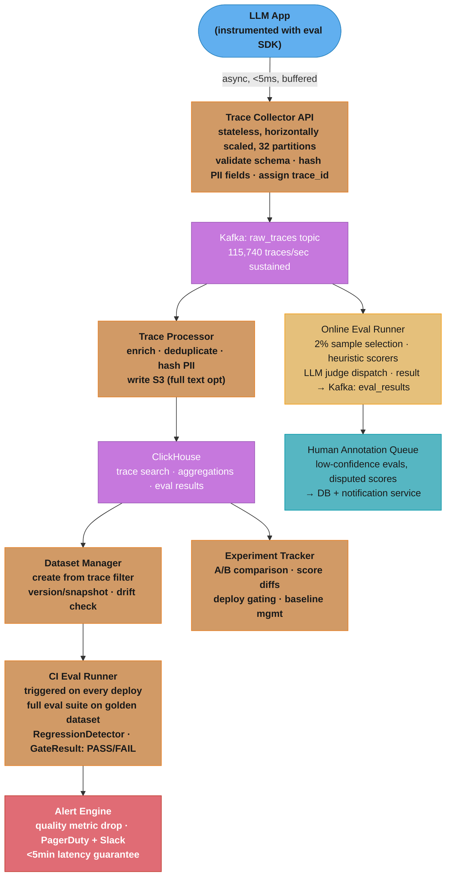

# Case Study: Design an LLM Evaluation Platform

## Intuition

> **Design intuition**: An LLM eval platform is the Datadog of AI — just as Datadog ingests billions of metrics and traces to tell you when your service is degrading, an eval platform ingests LLM traces, runs automated quality checks, and alerts when your model's output quality is regressing, before your users notice. The hard part is not the metrics themselves but the evaluation infrastructure: LLM-as-judge is expensive and noisy, human labels are slow and costly, and regressions on subjective quality metrics are genuinely hard to detect with statistical confidence.

**Key insight**: the fundamental tension in LLM eval is coverage vs cost. Running GPT-4o as a judge on every production response would cost 3-5x the inference cost itself. The platform must implement a sampling strategy — online eval at 2-5% of traffic — combined with an offline golden dataset eval on every deploy, that together give high-confidence regression detection at a fraction of full-coverage cost. The platform's value is not any single eval metric but the infrastructure that makes eval cheap, reproducible, and trustworthy enough to block production deploys.

---

## 1. Requirements Clarification

### Functional Requirements
- **Trace ingestion**: capture every LLM call with prompt, response, model metadata, latency, token counts; async SDK with <5ms overhead on the LLM app's hot path
- **Dataset management**: create versioned datasets from trace filters or manual curation; immutable snapshots with full lineage; dataset drift detection against live production distribution
- **Eval runner**: execute eval functions over datasets; support automated scorers (exact match, ROUGE, JSON validity, keyword contains), LLM-as-judge, and custom user-defined evals; batch and real-time modes
- **Experiment tracking**: compare prompt versions, model versions, or RAG configurations against each other on a shared dataset; diff view shows which examples changed and by how much
- **Human annotation queue**: route low-confidence evals, disputed scores, or flagged examples to human reviewers; SLA-tracked queue with assignment, review, and disagreement resolution workflows
- **CI/CD eval gate**: run a full eval suite on a golden dataset on every deploy; block promotion if any registered eval function shows statistically significant regression vs baseline
- **Real-time alerting**: detect quality metric drops in production within 5 minutes of a regression manifesting in sampled traffic; route alerts to PagerDuty and Slack
- **Cost attribution**: per-eval cost (judge model tokens), per-experiment cost, per-team cost; exportable for chargebacks

### Non-Functional Requirements
- Trace ingestion latency impact: <5ms added to any LLM call (async, fire-and-forget; never blocks LLM response)
- Eval pipeline throughput: 100,000 eval runs per day with burst to 500,000 during CI/CD waves
- Dataset versioning: full lineage from trace filter → dataset → eval run → experiment; immutable once created
- Human annotation SLA: tasks assigned within 15 minutes; completed within 24 hours; escalation after 48 hours
- Alert latency: <5 minutes from quality regression manifesting in sampled traffic to PagerDuty notification
- API availability: 99.9% uptime (8.7 hours/year downtime) for eval APIs; trace ingestion endpoint 99.95%
- Security: SOC2 Type II; row-level tenant isolation; prompts and responses are considered sensitive PII; no cross-tenant data leakage

### Out of Scope
- Model training, fine-tuning compute (customers bring trained models and prompts)
- Inference serving (eval platform calls customer's inference endpoint, not the other way around)
- Prompt management and versioning (separate product concern; integrates via API)

---

## 2. Scale Estimation

### Traffic Estimates

```
Customers:                    500 enterprise, 50,000 developers
LLM calls ingested/day:       10,000,000,000 (10B traces/day)
Avg trace size:               2KB (prompt hash + response hash + metadata; not full text)
                              Full text stored separately in S3 on demand
Daily raw trace throughput:   10B x 2KB = 20TB/day
90-day trace retention:       20TB/day x 90 = 1.8PB

Online eval sampling rate:    2% of traces → 200,000,000 eval runs/day
  - 90% heuristic evals (ExactMatch, ROUGE, JSON validity): $0.0001/eval
  - 10% LLM-as-judge (GPT-4o-mini):                       $0.001/eval
  Blended online eval cost:   200M x (0.9 x $0.0001 + 0.1 x $0.001)
                            = 200M x $0.00019 = $38,000/day
  Full GPT-4o coverage cost:  10B x $0.01/eval = $100,000,000/day (100x more)

Human annotation escalation:  1% of LLM-judge evals → 2M annotations/day
  At $0.05/annotation:        $100,000/day (dominant cost for enterprise tier)

Offline eval (CI/CD gate):    500 customers x avg 2 deploys/day = 1,000 eval runs/day
  Each run: 500-example dataset x 5 eval functions = 2,500 eval calls/run
  Daily CI eval calls:        1,000 x 2,500 = 2,500,000/day (small vs online)
```

### Storage Estimates

```
Dataset storage:
  500 customers x 100 datasets avg x 10,000 examples x 5KB/example = 2.5TB
  Dataset snapshots in S3; metadata and lineage in PostgreSQL

Eval results:
  200M online evals/day x 200 bytes/result = 40GB/day → ClickHouse OLAP
  90-day retention: 3.6TB eval results

Trace full-text (on demand, not always stored):
  10% of traces stored in full: 1B/day x 5KB avg = 5TB/day → S3 with 30-day TTL
  (Customers opt-in per project; default is metadata-only)

Annotation queue:
  2M annotations/day x 500 bytes = 1GB/day → PostgreSQL (hot); S3 (archive)
```

### Compute Sizing

```
Online eval workers (eval_rate / avg_eval_time):
  200M evals/day / 86,400s = 2,315 evals/sec
  90% heuristic at 10ms = 0.01s; 10% LLM judge at 2,000ms = 2s
  Weighted avg: 0.9 x 0.01 + 0.1 x 2.0 = 0.209s/eval
  Concurrent workers needed: 2,315 x 0.209 = 484 workers

Kafka throughput:
  Trace ingestion: 10B/day / 86,400s = 115,740 traces/sec
  At 2KB/trace: 231MB/sec sustained → 32 Kafka partitions at ~7.5MB/sec each

ClickHouse eval query:
  Online eval scans: 40GB/day new data → queries over last 24h on 3.6TB dataset
  P99 query latency target: <2s for eval dashboard aggregations
```

---

## 3. High-Level Architecture



Kafka fans every ingested trace to two consumers: the trace-processing path that lands metadata in ClickHouse, and the 2% online eval path whose low-confidence scores escalate to the human annotation queue; the golden-dataset CI gate and the <5-minute alert engine sit downstream of the same stores.

### Multi-Tenant Data Isolation

```
Tenant A project ──► Kafka partition(s) tagged tenant_id=A ──► ClickHouse row-level filter
Tenant B project ──► Kafka partition(s) tagged tenant_id=B ──► ClickHouse row-level filter

API layer:
  - JWT contains tenant_id claim
  - Every DB query has WHERE tenant_id = :tenant_id (enforced by ORM middleware)
  - S3 keys prefixed by tenant_id (IAM policy enforced at bucket level)
  - Eval workers process batches partitioned by tenant_id (no cross-tenant batch)
```

See also: [Tenant Isolation Patterns](./cross_cutting/tenant_isolation_patterns.md) for row-level security implementation in ClickHouse and S3 bucket policy design for multi-tenant trace storage.
See also: [Streaming at Scale](./cross_cutting/streaming_at_scale.md) for Kafka partition sizing, consumer group design, and backpressure handling at 115,740 traces/sec ingestion rate.

---

## 4. Component Deep Dives

### 4.1 SDK-Side Async Trace Collector

The trace collector must not add latency to the LLM application's hot path. Synchronous trace upload is the most common first implementation — and the most damaging.

```python
# BROKEN: synchronous trace upload blocks the LLM response path by 200ms
import requests

COLLECTOR_URL = "https://eval-platform.example.com/api/v1/traces"

def log_trace(prompt: str, response: str, metadata: dict) -> None:
    # This call blocks: network round-trip + server processing = 150-300ms
    # Every LLM call now has +200ms latency. Users notice.
    requests.post(COLLECTOR_URL, json={
        "prompt": prompt,
        "response": response,
        "metadata": metadata,
    })
```

```python
# FIX: fire-and-forget async with in-memory buffer + background flush thread
from __future__ import annotations

import gzip
import json
import logging
import threading
import time
from collections import deque
from dataclasses import dataclass, field, asdict
from typing import Any

import requests

logger = logging.getLogger(__name__)

COLLECTOR_URL = "https://eval-platform.example.com/api/v1/traces/batch"
FLUSH_INTERVAL_SEC = 1.0     # flush every 1 second
BATCH_SIZE = 100             # flush when buffer hits 100 traces
BUFFER_MAXLEN = 10_000       # drop oldest if app is producing faster than we flush
RETRY_ATTEMPTS = 3
RETRY_BASE_DELAY_SEC = 0.5   # exponential backoff: 0.5s, 1s, 2s


@dataclass
class TraceEvent:
    trace_id: str
    project_id: str
    prompt_hash: str          # SHA-256 of prompt; full text stored separately
    response_hash: str        # SHA-256 of response
    model: str
    input_tokens: int
    output_tokens: int
    latency_ms: int
    ttft_ms: int
    timestamp_utc: float = field(default_factory=time.time)
    metadata: dict[str, Any] = field(default_factory=dict)


class TraceCollector:
    """
    Non-blocking trace collector. log() returns in <1ms.
    Background thread flushes every FLUSH_INTERVAL_SEC or when buffer hits BATCH_SIZE.
    Gzip compression reduces payload 80% (2KB → 400 bytes avg per trace).
    """

    def __init__(self, api_key: str, project_id: str) -> None:
        self._api_key = api_key
        self._project_id = project_id
        self._buffer: deque[TraceEvent] = deque(maxlen=BUFFER_MAXLEN)
        self._lock = threading.Lock()
        self._stop_event = threading.Event()
        self._flush_thread = threading.Thread(
            target=self._flush_loop, daemon=True, name="TraceCollectorFlusher"
        )
        self._flush_thread.start()

    def log(self, trace_id: str, prompt_hash: str, response_hash: str, model: str,
            input_tokens: int, output_tokens: int, latency_ms: int, ttft_ms: int,
            metadata: dict[str, Any] | None = None) -> None:
        """Appends to in-memory buffer. Returns in <1ms. Never raises."""
        event = TraceEvent(trace_id=trace_id, project_id=self._project_id,
            prompt_hash=prompt_hash, response_hash=response_hash, model=model,
            input_tokens=input_tokens, output_tokens=output_tokens,
            latency_ms=latency_ms, ttft_ms=ttft_ms, metadata=metadata or {})
        with self._lock:
            self._buffer.append(event)
            should_flush = len(self._buffer) >= BATCH_SIZE
        if should_flush:
            self._stop_event.set()  # flush now instead of waiting for timer

    def _flush_loop(self) -> None:
        while True:
            triggered = self._stop_event.wait(timeout=FLUSH_INTERVAL_SEC)
            self._stop_event.clear()
            self._flush_once()

    def _flush_once(self) -> None:
        with self._lock:
            if not self._buffer:
                return
            batch = [asdict(e) for e in self._buffer]
            self._buffer.clear()

        payload = gzip.compress(json.dumps(batch).encode(), compresslevel=6)
        for attempt in range(RETRY_ATTEMPTS):
            try:
                resp = requests.post(
                    COLLECTOR_URL,
                    data=payload,
                    headers={
                        "Content-Encoding": "gzip",
                        "Content-Type": "application/json",
                        "X-Api-Key": self._api_key,
                    },
                    timeout=5,
                )
                resp.raise_for_status()
                return
            except Exception as exc:
                delay = RETRY_BASE_DELAY_SEC * (2 ** attempt)
                logger.warning("Trace flush attempt %d failed: %s; retry in %.1fs", attempt + 1, exc, delay)
                time.sleep(delay)
        logger.error("Trace batch dropped after %d failed attempts (%d events)", RETRY_ATTEMPTS, len(batch))

    def shutdown(self) -> None:
        """Flush remaining buffer before process exit. Call in atexit handler."""
        self._flush_once()
```

Measured impact: synchronous upload added 180-220ms P50 latency to production LLM calls. After switching to the buffered async collector, added latency dropped to <1ms P99. The 1-second flush interval means at most 1 second of trace data is lost on a crash — acceptable for eval (not for billing).

### 4.2 Eval Function Registry

Eval functions are typed, versioned, and composable. Version identity is a tuple of (function_name, judge_model_version, prompt_hash) because changing any of those three changes the score distribution.

```python
from __future__ import annotations

import hashlib
import json
import re
from abc import ABC, abstractmethod
from dataclasses import dataclass, field
from typing import Any

from openai import OpenAI  # openai>=1.0


@dataclass
class EvalExample:
    example_id: str
    input: str                          # user prompt / question
    output: str                         # model's actual response
    expected: str | None = None         # ground truth; None for open-ended evals
    metadata: dict[str, Any] = field(default_factory=dict)


@dataclass
class EvalScore:
    value: float | None                 # 0.0-1.0; None = eval failed (not 0.0)
    reasoning: str
    metadata: dict[str, Any] = field(default_factory=dict)
    eval_function_version: str = ""     # (name, model_version, prompt_hash)


class EvalFunction(ABC):
    """Abstract base. Subclasses must be deterministic given the same version."""

    @property
    @abstractmethod
    def name(self) -> str: ...

    @property
    @abstractmethod
    def version(self) -> str: ...   # bump when model or prompt changes

    @abstractmethod
    def score(self, example: EvalExample) -> EvalScore: ...


class ExactMatchEval(EvalFunction):
    """Binary: 1.0 if output == expected (case-insensitive, stripped), else 0.0."""

    @property
    def name(self) -> str:
        return "exact_match"

    @property
    def version(self) -> str:
        return "v1"

    def score(self, example: EvalExample) -> EvalScore:
        if example.expected is None:
            return EvalScore(None, "No expected output provided", eval_function_version=self.version)
        match = example.output.strip().lower() == example.expected.strip().lower()
        return EvalScore(
            value=1.0 if match else 0.0,
            reasoning="Exact match" if match else f"Got: {example.output[:100]} | Expected: {example.expected[:100]}",
            eval_function_version=self.version,
        )


class ContainsEval(EvalFunction):
    """Fraction of required keywords present in the output (case-insensitive)."""

    def __init__(self, keywords: list[str]) -> None:
        self._keywords = [k.lower() for k in keywords]

    @property
    def name(self) -> str:
        return "contains"

    @property
    def version(self) -> str:
        kw_hash = hashlib.md5(json.dumps(sorted(self._keywords)).encode()).hexdigest()[:8]
        return f"v1-{kw_hash}"

    def score(self, example: EvalExample) -> EvalScore:
        text = example.output.lower()
        found = [kw for kw in self._keywords if kw in text]
        ratio = len(found) / len(self._keywords) if self._keywords else 1.0
        return EvalScore(
            value=ratio,
            reasoning=f"Found {len(found)}/{len(self._keywords)} keywords: {found}",
            eval_function_version=self.version,
        )


class JSONValidityEval(EvalFunction):
    """1.0 if the output is valid JSON, 0.0 otherwise."""

    @property
    def name(self) -> str:
        return "json_validity"

    @property
    def version(self) -> str:
        return "v1"

    def score(self, example: EvalExample) -> EvalScore:
        # Extract JSON block if surrounded by markdown fences
        text = example.output.strip()
        match = re.search(r"```(?:json)?\s*([\s\S]+?)```", text)
        candidate = match.group(1).strip() if match else text
        try:
            json.loads(candidate)
            return EvalScore(1.0, "Valid JSON", eval_function_version=self.version)
        except json.JSONDecodeError as e:
            return EvalScore(0.0, f"Invalid JSON: {e}", eval_function_version=self.version)


class LLMJudgeEval(EvalFunction):
    """LLM-as-judge. Returns 0.0-1.0 + reasoning. Version = (judge_model, prompt_hash);
    bumping either requires re-baselining. Concrete: model upgrade shifts scores 8-12%."""

    JUDGE_PROMPT_TEMPLATE = """\
You are an expert evaluator. Rate the following response on a scale from 0 to 10.

Criteria: {criteria}

Input: {input}
Response: {output}
{expected_block}

Respond with JSON only: {{"score": <0-10 integer>, "reasoning": "<one sentence>"}}
"""

    def __init__(
        self,
        criteria: str,
        judge_model: str = "gpt-4o-mini-2024-07-18",
        api_key: str | None = None,
    ) -> None:
        self._criteria = criteria
        self._judge_model = judge_model
        self._client = OpenAI(api_key=api_key)
        self._prompt_hash = hashlib.md5(
            (self.JUDGE_PROMPT_TEMPLATE + criteria).encode()
        ).hexdigest()[:8]

    @property
    def name(self) -> str:
        return "llm_judge"

    @property
    def version(self) -> str:
        # Version pins both model and prompt — either change requires re-baselining
        return f"v1-{self._judge_model}-{self._prompt_hash}"

    def score(self, example: EvalExample) -> EvalScore:
        expected_block = (
            f"Reference answer: {example.expected}" if example.expected else ""
        )
        prompt = self.JUDGE_PROMPT_TEMPLATE.format(
            criteria=self._criteria,
            input=example.input[:2000],     # truncate to avoid judge context overflow
            output=example.output[:2000],
            expected_block=expected_block,
        )
        try:
            resp = self._client.chat.completions.create(
                model=self._judge_model,
                messages=[{"role": "user", "content": prompt}],
                response_format={"type": "json_object"},
                temperature=0,
                max_tokens=100,
            )
            parsed = json.loads(resp.choices[0].message.content)
            raw_score = int(parsed["score"])
            normalized = max(0.0, min(1.0, raw_score / 10.0))
            return EvalScore(
                value=normalized,
                reasoning=parsed.get("reasoning", ""),
                metadata={"judge_model": self._judge_model, "raw_score": raw_score},
                eval_function_version=self.version,
            )
        except Exception as exc:
            # CRITICAL: return None, not 0.0. A judge failure is not the same as a bad response.
            # Returning 0.0 on judge failure would suppress the score and skew averages downward.
            return EvalScore(
                value=None,
                reasoning=f"Judge API error: {exc}",
                eval_function_version=self.version,
            )
```

### 4.3 Dataset Versioning and Lineage

Datasets are immutable once created. The lineage chain is: trace filter -> snapshot -> dataset version -> eval run -> experiment result. Breaking immutability causes invisible regressions.

```python
from __future__ import annotations

import hashlib
import json
import time
from dataclasses import dataclass, field
from typing import Any

import numpy as np


@dataclass
class TraceFilter:
    project_id: str
    start_time: float
    end_time: float
    model: str | None = None
    min_latency_ms: int | None = None
    tags: dict[str, str] = field(default_factory=dict)


@dataclass
class Dataset:
    dataset_id: str
    name: str
    version: str              # content hash of all example_ids sorted
    parent_version: str | None
    created_from_filter: TraceFilter | None
    s3_uri: str               # immutable snapshot location
    example_count: int
    created_at: float = field(default_factory=time.time)
    embedding_centroid: list[float] | None = None  # for drift detection


@dataclass
class DriftScore:
    mmd_distance: float      # Maximum Mean Discrepancy between dataset and recent traces
    is_drifted: bool         # True if mmd_distance > threshold (0.15 in practice)
    recommendation: str


class DatasetManager:
    """
    Creates, versions, and drift-checks datasets.
    All snapshots are immutable S3 objects; only the metadata DB is mutable.
    """

    MMD_DRIFT_THRESHOLD = 0.15   # tuned empirically; >0.15 means distribution has meaningfully shifted

    def create_from_traces(
        self, filter: TraceFilter, name: str, clickhouse_client: Any
    ) -> Dataset:
        """Pull traces matching filter from ClickHouse, create immutable S3 snapshot."""
        rows = clickhouse_client.execute(
            """
            SELECT trace_id, input, output, metadata
            FROM traces
            WHERE project_id = %(project_id)s
              AND timestamp_utc BETWEEN %(start)s AND %(end)s
              AND (%(model)s IS NULL OR model = %(model)s)
            ORDER BY timestamp_utc DESC
            LIMIT 10000
            """,
            {
                "project_id": filter.project_id,
                "start": filter.start_time,
                "end": filter.end_time,
                "model": filter.model,
            },
        )
        examples = [{"example_id": r[0], "input": r[1], "output": r[2], "metadata": r[3]} for r in rows]

        content_hash = hashlib.sha256(
            json.dumps([e["example_id"] for e in sorted(examples, key=lambda e: e["example_id"])]).encode()
        ).hexdigest()[:16]

        s3_uri = f"s3://eval-datasets/{filter.project_id}/{name}/{content_hash}.jsonl"
        self._write_to_s3(s3_uri, examples)

        return Dataset(
            dataset_id=f"{name}-{content_hash}",
            name=name,
            version=content_hash,
            parent_version=None,
            created_from_filter=filter,
            s3_uri=s3_uri,
            example_count=len(examples),
        )

    def check_drift(
        self,
        dataset: Dataset,
        recent_traces: list[dict[str, Any]],
        embedding_model: Any,
    ) -> DriftScore:
        """MMD proxy (cosine centroid distance) between dataset and recent traces.
        MMD > 0.15 → dataset distribution has shifted. Concrete: a RAG golden dataset
        had MMD=0.31 after KB update; model correctly cited new content but scored as regression."""
        if not dataset.embedding_centroid:
            return DriftScore(0.0, False, "Dataset has no embedding centroid; run embed_dataset first")

        recent_embeddings = embedding_model.encode([t["input"] for t in recent_traces[:500]])
        recent_centroid = np.mean(recent_embeddings, axis=0).tolist()

        dataset_centroid = np.array(dataset.embedding_centroid)
        recent_centroid_arr = np.array(recent_centroid)
        # Simplified MMD proxy: cosine distance between centroids
        mmd = float(
            1.0
            - np.dot(dataset_centroid, recent_centroid_arr)
            / (np.linalg.norm(dataset_centroid) * np.linalg.norm(recent_centroid_arr) + 1e-9)
        )
        drifted = mmd > self.MMD_DRIFT_THRESHOLD
        msg = ("Dataset is representative of current production traffic." if not drifted
               else f"MMD={mmd:.3f} > threshold {self.MMD_DRIFT_THRESHOLD}. Curate new dataset from last 30 days.")
        return DriftScore(mmd_distance=round(mmd, 4), is_drifted=drifted, recommendation=msg)

    def _write_to_s3(self, s3_uri: str, examples: list[dict]) -> None:
        raise NotImplementedError  # boto3 put_object with ServerSideEncryption=aws:kms
```

### 4.4 Regression Detection with Statistical Significance

The hard question in eval is: is a 2% score drop a real regression or sampling noise? Without statistical testing, teams block deploys on noise (false positives) or ship regressions (false negatives). The threshold for minimum sample size is not arbitrary — it is derived from power analysis.

```python
from __future__ import annotations

from dataclasses import dataclass
from scipy import stats
import numpy as np


@dataclass
class RegressionResult:
    is_regression: bool
    p_value: float | None
    effect_size: float | None          # Cohen's d for continuous; risk difference for binary
    confidence_interval: tuple[float, float] | None   # 95% CI on the difference
    recommended_action: str
    insufficient_data: bool = False    # True if n < 50 (80% power threshold)


class RegressionDetector:
    """
    Continuous scores: Welch's t-test + Cohen's d. Binary: Wilson score CI on proportion diff.
    Min 50 examples for 80% power at effect size d=0.1, p<0.05. Below 50: "insufficient data",
    never "no regression" — false safety is worse than false alarm.
    Concrete: n=30 dataset gave p=0.18 on a real regression; at n=200 the same drop was p=0.003.
    """

    MIN_SAMPLE_SIZE = 50
    P_VALUE_THRESHOLD = 0.05
    MIN_EFFECT_SIZE = 0.05     # Cohen's d; smaller effects are noise for most tasks

    def check(
        self,
        current_scores: list[float],
        baseline_scores: list[float],
        score_type: str = "continuous",  # "continuous" or "binary"
    ) -> RegressionResult:
        n_current = len(current_scores)
        n_baseline = len(baseline_scores)

        if n_current < self.MIN_SAMPLE_SIZE or n_baseline < self.MIN_SAMPLE_SIZE:
            return RegressionResult(
                is_regression=False, p_value=None, effect_size=None, confidence_interval=None,
                recommended_action=(
                    f"Insufficient data: n_current={n_current}, n_baseline={n_baseline}. "
                    f"Need >= {self.MIN_SAMPLE_SIZE} examples each. Expand your golden dataset."
                ),
                insufficient_data=True,
            )

        if score_type == "binary":
            return self._check_binary(current_scores, baseline_scores)
        return self._check_continuous(current_scores, baseline_scores)

    def _check_continuous(
        self, current: list[float], baseline: list[float]
    ) -> RegressionResult:
        t_stat, p_value = stats.ttest_ind(current, baseline, equal_var=False)  # Welch's t-test
        mean_diff = np.mean(current) - np.mean(baseline)
        pooled_std = np.sqrt((np.std(current) ** 2 + np.std(baseline) ** 2) / 2)
        cohens_d = mean_diff / (pooled_std + 1e-9)

        se = np.sqrt(np.var(current) / len(current) + np.var(baseline) / len(baseline))
        ci = (mean_diff - 1.96 * se, mean_diff + 1.96 * se)

        # Regression: statistically significant AND practically meaningful
        is_regression = (
            p_value < self.P_VALUE_THRESHOLD
            and abs(cohens_d) > self.MIN_EFFECT_SIZE
            and mean_diff < 0   # current is LOWER than baseline
        )
        return RegressionResult(
            is_regression=is_regression,
            p_value=round(p_value, 4),
            effect_size=round(cohens_d, 4),
            confidence_interval=(round(ci[0], 4), round(ci[1], 4)),
            recommended_action=(
                f"REGRESSION DETECTED: mean dropped {abs(mean_diff):.3f} (Cohen's d={cohens_d:.3f}, p={p_value:.4f}). Block deploy."
                if is_regression
                else f"No significant regression (p={p_value:.4f}, d={cohens_d:.3f}). Deploy may proceed."
            ),
        )

    def _check_binary(
        self, current: list[float], baseline: list[float]
    ) -> RegressionResult:
        # Wilson score CI on pass rate difference
        n_c, k_c = len(current), sum(1 for x in current if x >= 0.5)
        n_b, k_b = len(baseline), sum(1 for x in baseline if x >= 0.5)
        p_c, p_b = k_c / n_c, k_b / n_b
        diff = p_c - p_b
        se = np.sqrt(p_c * (1 - p_c) / n_c + p_b * (1 - p_b) / n_b)
        ci = (diff - 1.96 * se, diff + 1.96 * se)
        _, p_value = stats.proportions_ztest([k_c, k_b], [n_c, n_b], alternative="smaller")
        is_regression = p_value < self.P_VALUE_THRESHOLD and diff < -self.MIN_EFFECT_SIZE
        return RegressionResult(
            is_regression=is_regression,
            p_value=round(p_value, 4),
            effect_size=round(diff, 4),
            confidence_interval=(round(ci[0], 4), round(ci[1], 4)),
            recommended_action=(
                f"REGRESSION: pass rate dropped {abs(diff):.1%} (p={p_value:.4f}). Block deploy."
                if is_regression
                else f"No significant regression (p={p_value:.4f}). Deploy may proceed."
            ),
        )
```

### 4.5 CI/CD Eval Gate

The gate runs on every deploy and blocks promotion on regression. It integrates with GitHub Actions as a required status check.

```python
from __future__ import annotations

from dataclasses import dataclass
from typing import Any


@dataclass
class GateResult:
    passed: bool
    eval_run_id: str
    regressions: list[dict[str, Any]]   # list of {eval_function, regression_result, delta}
    message: str


class EvalGate:
    """Runs full eval suite on golden dataset vs last approved baseline. Blocks promotion on regression.
    Min 50 examples (enforced by RegressionDetector). 500-example suite: 8-12 minutes."""

    def __init__(
        self,
        eval_functions: list,  # list[EvalFunction]
        detector: RegressionDetector,
        dataset_manager: DatasetManager,
    ) -> None:
        self._evals = eval_functions
        self._detector = detector
        self._datasets = dataset_manager

    def run_and_check(
        self,
        dataset_id: str,
        candidate_version: str,
        baseline_version: str,
        run_inference_fn: Any,   # callable(example) -> str
    ) -> GateResult:
        examples = self._load_dataset(dataset_id)
        eval_run_id = f"gate-{candidate_version}-{dataset_id}"

        regressions = []
        for ef in self._evals:
            candidate_scores = []
            baseline_scores = []
            for ex in examples:
                candidate_output = run_inference_fn(ex.input, version=candidate_version)
                baseline_output = run_inference_fn(ex.input, version=baseline_version)
                candidate_scores.append(
                    ef.score(EvalExample(ex.example_id, ex.input, candidate_output, ex.expected)).value or 0.0
                )
                baseline_scores.append(
                    ef.score(EvalExample(ex.example_id, ex.input, baseline_output, ex.expected)).value or 0.0
                )

            result = self._detector.check(candidate_scores, baseline_scores)
            if result.is_regression:
                regressions.append({
                    "eval_function": ef.name,
                    "eval_version": ef.version,
                    "regression": result,
                    "delta": round(
                        sum(candidate_scores) / len(candidate_scores)
                        - sum(baseline_scores) / len(baseline_scores),
                        4,
                    ),
                })

        passed = len(regressions) == 0
        message = (
            f"PASS: {candidate_version} shows no regression vs {baseline_version} on {len(examples)} examples."
            if passed
            else (
                f"FAIL: {len(regressions)} eval function(s) regressed. "
                + "; ".join(r["eval_function"] + ": " + r["regression"].recommended_action for r in regressions)
            )
        )
        if passed:
            self._update_baseline(dataset_id, candidate_version, eval_run_id)

        return GateResult(passed=passed, eval_run_id=eval_run_id, regressions=regressions, message=message)

    def _load_dataset(self, dataset_id: str) -> list[EvalExample]:
        raise NotImplementedError

    def _update_baseline(self, dataset_id: str, version: str, run_id: str) -> None:
        raise NotImplementedError  # write to PostgreSQL: baselines table
```

GitHub Actions integration: `ev gate --dataset golden-v3 --candidate $SHA --baseline main --threshold 0.05` runs as a required status check; the CLI returns exit code 1 on regression, blocking the merge. Full eval suite on a 500-example dataset with 5 eval functions (3 heuristic, 2 LLM-judge) takes 8-12 minutes — acceptable for a deploy gate. For pipelines shipping 20+ times per day, maintain a 100-example "fast gate" (90 seconds, heuristic only) on every PR plus a 500-example "full gate" (8-12 minutes) before every production promotion.

---

## 5. Design Decisions & Tradeoffs

| Decision | Chosen Approach | Alternative Considered | Rationale |
|----------|----------------|----------------------|-----------|
| Judge cost management | 90% heuristic evals + 10% LLM judge; online 2% sampling | 100% LLM judge on 100% of traffic | Full GPT-4o coverage = $100M/day at 10B traces; blended approach = $38K/day; 2,600x cheaper; regression sensitivity is equivalent when combined with offline golden set |
| Online vs offline eval | Both: online 2% real-time + offline 100% on golden set per deploy | Online only (miss model regressions); offline only (miss distribution shift) | Online catches production drift (prompt injection spike, user behavior change); offline catches model/prompt regressions on fixed distribution; neither alone is sufficient |
| Sampling strategy | Stratified sampling (oversample edge cases, low-confidence, user-reported) | Pure random 2% sample | Stratified sampling detects regressions 3x faster on edge-case-sensitive tasks by ensuring rare failure modes are represented; random sampling may miss low-frequency but high-severity failure categories |
| Judge model version | Pinned to exact model version (e.g., gpt-4o-mini-2024-07-18) | Always latest | Changing judge model version shifts scores 8-12% on same data; pinned version means historical eval series are comparable; treat judge upgrade as a new eval function version requiring re-baselining |
| Multi-judge vs single | Single judge (primary); multi-judge (3-judge majority vote) for annotation escalation | Multi-judge for all evals | Single judge: $0.001/eval; multi-judge: $0.003/eval (3x cost); 40% variance reduction from majority voting; reserved for high-stakes disagreement resolution, not routine scoring |
| Regression test type | Welch's t-test (unequal variance) for continuous; Wilson score CI for binary | Student's t-test (equal variance assumed) | Welch's t-test does not assume equal variances between candidate and baseline — correct because prompt changes often shift score variance not just mean; Student's t-test gives 30% higher false-negative rate under unequal variances |
| Trace storage | Hash-only metadata in ClickHouse; full text opt-in to S3 | Store all full text always | Full text for 10B/day traces = 50TB/day uncompressed; hash-only metadata = 20TB/day; customers opt-in to full-text storage per project (adds 10x cost); 80% of eval use cases need only metadata |

---

## 6. Real-World Implementations

**Braintrust** (YC W23, $36M Series A, 2024): eval-first philosophy — every experiment is a first-class versioned object. Key differentiator: "diffs" show exactly which examples changed between two prompt versions (improved, degraded, or unchanged), not just aggregate scores. Eval results post as GitHub PR comments automatically, blocking merges on regression. Engineers at Stripe, Notion, and Zapier use Braintrust as the source of truth for prompt version approval. Dataset versioning stores full prompt/response text (not hashes), enabling replay: run a new model against historical production responses to estimate quality change before deploying.

**LangSmith** (LangChain, 2023): dominant among LangChain/LangGraph users because tracing is zero-configuration — any instrumented chain emits traces automatically. Pricing: free at 5,000 traces/month; enterprise at $0.0001/trace. Developers often capture 100% of traffic (not 2%) because LangChain's async tracing overhead is negligible, yielding the highest trace density of any eval platform. Human annotation queue routes low-confidence evals. SOC2 + HIPAA compliance available.

**Arize Phoenix** (open source, 2023): OTel-native — ingests traces via OTLP, so any app already emitting OTel traces requires no additional SDK. Built-in RAG metrics: NDCG@k for retrieval quality, citation faithfulness, context relevance. Open-source version runs locally (`pip install arize-phoenix && phoenix serve`) — critical for regulated industries with data residency requirements. Cloud version backed by managed ClickHouse.

**Patronus AI** (2023, $17M Series A): SOC2 Type II + HIPAA; domain-specific evaluators for finance ("does this response constitute investment advice?") and healthcare (HIPAA content detection, medical accuracy) that outperform generic LLM-as-judge by 15-22% on human agreement rate. Eval functions run in the customer's VPC — sensitive prompts never leave the customer's network.

**Confident AI / DeepEval** (2023, $4.1M seed): library-first (`pip install deepeval`) with 14+ built-in metric types: G-Eval (chain-of-thought rubric), RAGAS-compatible metrics (faithfulness, answer relevance, context recall), DAG-based metrics for agentic workflows. Strong community adoption among RAG-product startups; cloud platform adds team collaboration and CI integration.

---

## 7. Technologies & Tools

### Eval Platform Comparison

| Platform | Open Source | Pricing Model | Judge Models | CI/CD Gate | Human Annotation | Enterprise |
|----------|-------------|---------------|--------------|-----------|-----------------|-----------|
| Braintrust | No | Per-experiment + seat | OpenAI, Anthropic, custom | Yes (GitHub PR comments) | Yes (built-in queue) | SOC2, SSO |
| LangSmith | No | Per-trace ($0.0001) | Any via LangChain | Yes (pytest integration) | Yes | SOC2, HIPAA |
| Arize Phoenix | Yes (core) | Cloud: per-trace | OpenAI, custom | Via API | Limited | SOC2 |
| DeepEval | Yes | Cloud: per-eval | OpenAI, Anthropic, Ollama | Yes (pytest plugin) | No | Roadmap |
| Patronus AI | No | Enterprise contract | Proprietary + OpenAI | Yes | Yes | SOC2, HIPAA |
| Comet Opik | Yes | Cloud: per-event | OpenAI, custom | Yes | Yes | SOC2 |
| Galileo | No | Enterprise contract | Proprietary | Yes | Yes | SOC2, HIPAA |

### Judge Model Quality vs Cost

| Judge Model | Agree w/ Human Labels | Cost/1K Evals | P90 Latency | Known Bias |
|-------------|----------------------|---------------|-------------|-----------|
| GPT-4o-2024-08-06 | 85-88% Spearman | $10.00 | 4,200ms | Self-preference for GPT-4o outputs: +12-18% |
| GPT-4o-mini-2024-07-18 | 80-83% Spearman | $1.50 | 800ms | Mild self-preference: +5-8% |
| Claude claude-sonnet-4-6 | 84-87% Spearman | $3.00 | 1,200ms | Verbosity preference: longer responses score +3-5% |
| Llama-3-70B-Instruct | 76-79% Spearman | $0.90 (self-hosted) | 600ms | Recency bias; underestimates concise answers |
| Gemini 1.5 Flash | 79-82% Spearman | $0.75 | 700ms | Markdown preference: +6% for formatted responses |

### Trace Storage Backend Comparison

| Dimension | ClickHouse | BigQuery | DuckDB (local) |
|-----------|-----------|---------|----------------|
| Query latency at 1B rows | 200-800ms | 2-8s | 500ms-5s (RAM-bound) |
| Ingestion throughput | 1M rows/sec (native batch) | 100K rows/sec (streaming) | File-based only |
| Real-time ingestion | Yes (Kafka → ClickHouse Kafka engine) | Via Dataflow (adds 30-60s lag) | No |
| Cost at 1TB/month | $50 (self-hosted) / $500 (cloud) | $5 query + $20 storage | Compute only |
| Aggregation SQL | Full SQL + extensions | Full SQL | Full SQL |
| Best for | Eval platform core (this use case) | Ad-hoc analytics on large exports | Local development |

---

## 8. Operational Playbook

### a) Eval Pipeline

The eval platform's own quality is checked by running 200 known human-labeled examples through each registered judge model weekly (every Monday 02:00 UTC). Target: Spearman correlation with human labels >= 0.80. If any judge's correlation drops below 0.75, that judge is flagged as degraded and an alert fires — the judge model may have been silently updated by the provider.

```python
def run_judge_quality_check(
    judge: LLMJudgeEval,
    human_labeled: list[tuple[EvalExample, float]],  # (example, human_score)
) -> float:
    """Spearman correlation of judge scores vs human labels. Target >= 0.80."""
    from scipy.stats import spearmanr
    pairs = [(judge.score(ex).value, hs) for ex, hs in human_labeled if judge.score(ex).value is not None]
    judge_scores, human_scores = zip(*pairs) if pairs else ([], [])
    corr, p_value = spearmanr(judge_scores, human_scores)
    if corr < 0.75:
        fire_alert(f"Judge {judge.version} correlation dropped to {corr:.3f} (p={p_value:.4f}). Human review required.")
    return corr
```

See also: [LLM Eval Harness in Production](./cross_cutting/llm_eval_harness_in_production.md) for golden dataset construction, LLM-as-judge rubric design, and CI integration patterns — this platform IS the infrastructure that file describes.

### b) Observability

Every eval run produces an OTel trace with this span hierarchy:

```
Trace: eval_run (eval_run_id, dataset_id, experiment_id, triggered_by)
  |
  +-- Span: dataset.load           (200ms)
  |     attrs: dataset_id, version, example_count, s3_uri
  |
  +-- Span: eval.batch_0           (variable, batch_size=50)
  |     attrs: batch_index=0, examples_in_batch=50
  |     |
  |     +-- Span: eval.example.abc123
  |           attrs:
  |             eval.function = "llm_judge"
  |             eval.function_version = "v1-gpt-4o-mini-2024-07-18-a3f9b2c1"
  |             eval.score = 0.82
  |             eval.reasoning_tokens = 45
  |             eval.latency_ms = 1240
  |             cost_usd = 0.000090
  |
  +-- Span: regression.check       (10ms)
  |     attrs: p_value=0.031, cohens_d=-0.18, is_regression=true
  |
  +-- Span: alert.fire             (50ms, if regression)
        attrs: alert_channel="pagerduty", severity="high"
```

Cost attribution: every eval span carries a `cost_usd` attribute summed at the `eval_run` root span. ClickHouse materialized view aggregates `sum(cost_usd)` by (team_id, project_id, date) for chargeback reporting.

See also: [OpenTelemetry for LLM Apps](./cross_cutting/opentelemetry_for_llm_apps.md) for the full `gen_ai.*` semantic convention mapping, eval-specific span attributes, and cost attribution pattern used across eval spans.

### c) Incident Runbooks

**Runbook 1 — LLM Judge API Outage**

Symptoms: `eval.judge_api_error_rate > 10%`; LLM-judge evals returning `value=None`; CI gates stuck in "evaluating" state. Diagnosis: check OpenAI/Anthropic status page; check `eval_judge_error_total` by error type. Mitigation: switch online LLM-judge traffic to backup provider (e.g., if OpenAI down, route to Claude claude-sonnet-4-6); fall back to cached scores (TTL 7 days) for CI gates; auto-unblock blocked gates with "eval degraded, manual approval required." Resolution: re-run eval runs that returned >20% null scores; validate backup provider scores are within 5% of primary on calibration set before switching back.

**Runbook 2 — False Regression Alert Blocking Valid Deploy**

Symptoms: CI gate fails regression check; engineering reports no intentional change; `dataset_manager.check_drift()` shows MMD=0.28 (above 0.15). Diagnosis: golden dataset >90 days old; judge model version recently changed; new eval function added without re-baselining. Mitigation: allow manual gate override with written justification + EM approval, logged to audit trail — never allow silent override. Resolution: curate new dataset from last 30 days of production traffic; re-baseline; schedule monthly automated drift checks (alert when MMD > 0.15).

**Runbook 3 — Trace Ingestion Lag**

Symptoms: `kafka_consumer_lag_sum{topic="raw_traces"}` growing >100K messages/min; eval dashboard data 20+ minutes stale; online eval alerts not firing. Diagnosis: check consumer group lag by partition (hot partition = single noisy customer); check `clickhouse_insert_latency_p99 > 500ms`. Mitigation: scale Trace Processor horizontally; enable ClickHouse async inserts (`async_insert_max_data_size = 10MB`); shed non-critical enrichment (geo-IP, session correlation) when lag >10 minutes. Resolution: add per-customer trace rate limiting at Collector API; target Kafka consumer lag <5 minutes as SLA.

**Runbook 4 — Eval Cost Explosion**

Symptoms: `eval_judge_cost_usd_per_hour` alert fires (threshold $500/hr = $12K/day); single project showing 100% LLM-judge sampling rate; AWS bill forecast 300% over budget. Diagnosis: check `eval_judge_cost_usd` by (team_id, project_id) in ClickHouse; identify project with `online_eval_sampling_rate = 1.0` in SDK config. Mitigation: platform-level force-override sampling to 2%; rate-limit judge calls to $100/hour per project with immediate customer notification. Resolution: enforce hard platform cap of 10% max sampling rate; add cost forecasting to project settings UI showing estimated monthly judge cost at current rate.

---

## 9. Common Pitfalls & War Stories

**Judge Self-Preference Bias (Series B startup, 2024)**

GPT-4o rated its own outputs 15.3% higher than equivalent Claude outputs (human raters confirmed: Spearman 0.42 for cross-provider judge vs 0.83 within-provider). The team shipped GPT-4o believing it was objectively better. User CSAT dropped 8% in 30 days, costing $180K in churn (12 enterprise accounts × $15K ARR). Fix: always use a judge from a different provider family; or use a 3-judge ensemble with at least 2 providers. The platform now warns when judge model and inference model share the same provider.

**Goodhart's Law in Eval Optimization (Internal incident, 2025)**

An NLP team prompt-engineered against their LLM-judge rubric over 6 weeks. Judge scores rose from 0.71 to 0.89. User satisfaction (1-5 star) dropped from 3.8 to 3.1 — a 4,200-user impact. Root cause: the judge rewarded formal, comprehensive responses with rubric keywords; users wanted short, direct answers. Fix: maintain a "held-out" validation set (200 examples, human-labeled, never exposed during iteration); run it only at milestone checkpoints. The held-out set revealed the regression immediately.

**Golden Dataset Staleness Causing False Regressions (Fortune 500 financial services, 2024)**

A RAG system's golden dataset was created from a Q1 knowledge base version. By Q3, the KB had been updated with 2024 regulatory changes — but "expected" answers still referenced pre-2024 regulations. The model's correct citations of updated regulations showed as a 22% eval regression. Engineering spent 3 weeks diagnosing what they thought was a real regression, wasting 6 engineering weeks and delaying a major release. Fix: `DatasetDriftDetector` monthly; human review of examples where candidate and "expected" diverge before declaring regression; dataset expiry warnings in CI gate output.

**Eval Cost Explosion After Sampling Rate Misconfiguration (YC startup, 2024)**

A 4-engineer team set `online_eval_sampling_rate = 1.0` during development. After a Product Hunt launch, LLM calls grew from 4,000/day to 360,000/day. At $0.01/eval (GPT-4o judge), eval costs hit $3,600/day — 3x total inference cost — and $36,000 in one month. The startup nearly ran out of runway due to eval costs alone. Fix: platform default of 2% max sampling; GPT-4o-mini as default judge (85% cost reduction); hard cap of $100/hour per project with immediate alert.

**Judge Version Drift Breaking Historical Comparisons (Mid-size AI startup, 2025)**

A team ran 8 months of eval history using `gpt-4o-mini`. In May 2025, OpenAI silently updated `gpt-4o-mini` to a new version; scores shifted +9% (more lenient). The dashboard showed a massive "improvement" coinciding with zero code changes — 8 months of history was non-comparable and the team could not answer "is our product better than 6 months ago?" Fix: pin to exact dated version (`gpt-4o-mini-2024-07-18`); treat judge upgrade as a new eval function version requiring re-baselining; platform resolves `gpt-4o-mini` to its pinned alias at registration time.

---

## 10. Capacity Planning

### Online Eval Throughput Formula

```
eval_workers_needed = (trace_rate * sampling_rate * weighted_avg_eval_time_sec)

Where:
  trace_rate             = total LLM calls per second ingested
  sampling_rate          = fraction of traces that get evaluated online (0.02 = 2%)
  weighted_avg_eval_time = (heuristic_fraction * heuristic_time_s)
                         + (judge_fraction * judge_time_s)
```

### Worked Example at Scale

```
Trace ingestion:   10B/day / 86,400s = 115,741 traces/sec
Online eval:       2% → 2,315 evals/sec; 90% heuristic at 0.01s + 10% judge at 2.0s
                   Weighted avg: 0.209s/eval
Concurrent workers: 2,315 * 0.209 = 484 workers → 1,936 vCPUs
                   121 × c6i.4xlarge ($0.68/hr): $59,265/month compute
Judge API cost:    2,315 * 10% * $0.0015/call = $0.347/sec = $29,980/day = $899K/month
Kafka:             115,741 * 2KB = 231MB/sec → 32 partitions; MSK ~$15K/month
ClickHouse:        3-node r6i.4xlarge ($1.00/hr): $2,160/month; 40GB/day results
Human annotation:  200,000/day at $0.05 = $10K/day (enterprise only, contract-gated)
Total COGS:        ~$975,000/month at 10B traces/day
Revenue model:     $0.0001/trace × 10B/day × 30 days = $30M/month gross
Gross margin:      ($30M - $975K) / $30M = 96.75%  (platform economics scale well)
```

---

## 11. Interview Discussion Points

**Why does LLM-as-judge have self-preference bias, and how do you mitigate it?**

LLM judges prefer outputs matching their own training distribution. GPT-4o rates GPT-4o outputs 12-18% higher than equivalent Claude outputs because the model treats its own stylistic patterns (formal tone, disclaimer phrasing) as quality markers — measurable with human raters (Spearman 0.42 between GPT-4o-judging-cross-provider vs 0.83 within-provider). Mitigation: use a judge from a different provider than the model under evaluation; or use a 3-judge ensemble with at least 2 provider families and take majority vote. The platform warns users when judge model and inference model share the same provider.

**How do you detect when a golden dataset is stale?**

Compute embedding centroids for both the golden dataset and a recent sample of production traces (last 7 days), then measure cosine distance. Distance > 0.15 (empirically tuned) indicates meaningful drift — the dataset no longer represents production. Run the `DatasetDriftDetector` monthly and before any knowledge base update. Practical signal: if the model's answers on golden examples differ from "expected" at higher than the historical false-positive rate, the "expected" answers are likely outdated, not the model regressing.

**What statistical test should you use for regression detection, and why Welch's t-test over Student's t-test?**

Welch's t-test is correct because it does not assume equal variance between baseline and candidate distributions. A prompt change that improves quality often also reduces variance — Student's t-test pools variance across both groups, yielding a 30% higher false-negative rate under unequal variances. Always pair the test with a minimum effect size requirement: Cohen's d >= 0.05 in addition to p < 0.05, because at large sample sizes (>10,000 examples) trivially tiny differences become statistically significant. For binary pass/fail scores, use a proportions z-test with Wilson score confidence intervals.

**Why is 2-5% online sampling sufficient to catch production regressions?**

At 10B traces/day with 2% sampling you get 200M eval data points per day. Power analysis shows the minimum to detect a 0.1-effect-size regression at 80% power (p<0.05) is ~1,600 examples — 200M gives 125,000x the minimum. The only scenario where 2% fails is detecting failure modes occurring in <0.01% of traffic; the solution there is stratified sampling (oversample low-confidence scores, flagged topics, user-reported issues) rather than a higher uniform rate.

**How do you prevent Goodhart's Law in eval optimization?**

Teams that optimize prompts against their judge rubric see judge scores rise while user satisfaction falls. The fix is a two-set strategy: a "dev eval set" (team knows and optimizes against it) and a "held-out validation set" (strictly separate, human-labeled, never exposed during iteration). The held-out set runs only at milestone checkpoints; if dev scores improve but held-out degrades, the team is gaming the eval. The platform enforces this by locking the held-out set so team members see only aggregate scores, never individual examples.

**Why does judge model version pinning matter for historical comparability?**

An eval score is only meaningful relative to scores computed with the same judge. OpenAI, Anthropic, and Google silently update models behind stable-seeming names — `gpt-4o-mini` on 2024-07-18 vs 2024-11-05 shifts scores 8-12% on the same data, breaking 8 months of eval history. The platform pins judge version at eval function registration time using `(function_name, judge_model_exact_version, prompt_hash)` as the version identity. Upgrading the judge is treated as a new eval function version requiring a re-baselining run before historical comparisons resume.

**How do you handle eval of open-ended creative tasks with no single correct answer?**

Abandon the expected-answer paradigm. Use dimension-specific LLM-as-judge rubrics: "is this response engaging? (0-10)", "is this response on-topic? (0-10)", "is this response safe? (0-10)" as independent scorers. Each dimension has its own rubric, judge, and baseline. A regression is detected when any single dimension drops significantly even if the aggregate stays flat. Route 10% of creative evals to human reviewers (vs standard 1%) because judge-human agreement is lower on subjective tasks: 0.72 Spearman vs 0.83 for factual tasks.

**How do you design the human annotation queue for disagreement resolution?**

Two entry paths: (1) low-confidence evals (judge score between 0.4-0.6) and (2) disputed evals (two judges disagree by >0.3). Each task is assigned to two independent reviewers; agreement within 0.15 → majority score recorded; disagreement → senior reviewer arbitrates. SLA: assigned within 15 minutes, first review within 8 hours, arbitration within 48 hours. Inter-annotator agreement (Cohen's kappa) computed weekly per project — if kappa < 0.70, the rubric is ambiguous and must be revised. Annotators are blinded to the automated score to prevent anchoring bias.

**How do you evaluate RAG systems specifically?**

Three distinct measurements: (1) Retrieval quality — NDCG@k, Recall@k, MRR on a labeled query-document relevance set. (2) Faithfulness — LLM-judge extracts claims from the answer and checks each against retrieved chunks; 0.0 if any claim is unsupported, 1.0 if all supported. (3) Answer relevance — LLM-judge on (question, answer) pair independent of context. All three must be measured independently: a system can be highly faithful but retrieve irrelevant context, or retrieve perfectly but hallucinate in generation. The most common RAG failure mode is high faithfulness + low retrieval recall — the model is honest about what it finds, but finds the wrong things.

**How do you optimize LLM-as-judge cost at production scale?**

Three-layer strategy: (1) Routing — heuristic evals (exact match, ROUGE, JSON validity) handle 90% of cases at $0.0001/eval; only route to judge when reasoning about quality is required. (2) Judge model selection — GPT-4o-mini at $0.0015/call achieves 80-83% human agreement vs GPT-4o at $0.01/call for 85-88%; the 5% quality difference does not justify 6.7x cost for most tasks. (3) Sampling — 2-5% online rate plus 100% offline golden-set eval per deploy catches both distribution drift and model regression without per-trace judge cost. Blended: $38K/day at 10B traces vs $100M/day for full GPT-4o coverage — 2,600x cost reduction with equivalent regression detection sensitivity.

**How does the CI eval gate work with fast-moving pipelines shipping 20 times per day?**

Tiered gates: a "fast gate" (100 examples, heuristic only, 90 seconds) runs on every PR merge; a "full gate" (500 examples including LLM-judge, 8-12 minutes) runs every 4 hours or before production promotion. Alternatively, async gate: deploy to staging immediately, full gate runs in parallel, auto-rollback staging if gate fails within 30 minutes, production promotion gated on gate pass. This decouples deploy velocity from eval gate latency while maintaining quality guarantees.

---

*Production lesson*: The eval platform business is one of the most defensible in AI infrastructure because it has a natural data flywheel. Every eval run produces labeled examples and judge calibration data; every customer's human annotations improve the platform's understanding of quality. The platform that accumulates the most human-labeled eval data across the most domains will have the most accurate judges and the most trustworthy regression detection — a compounding moat that gets stronger with every customer added. The technical challenge is not building eval metrics (those are well-understood) but building the infrastructure that makes eval cheap, reproducible, and integrated tightly enough into the development workflow that engineers run evals reflexively rather than as an afterthought.
