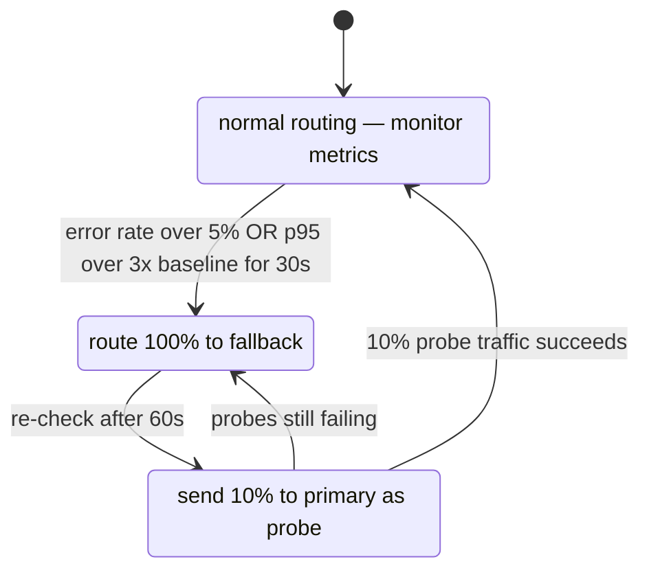

# Case Study: Design an LLM Gateway

## Intuition

> **Design intuition**: An LLM Gateway is an API proxy + intelligent router — like an API gateway but with LLM-specific features: model routing by capability/cost, semantic caching (identical-meaning requests get the same cached response), and observability over token usage. It's the "middleware layer" that abstracts provider diversity from application teams.

**Key insight for this design**: Semantic caching is the highest-leverage optimization — unlike HTTP caching (exact URL match), semantic caching matches similar-meaning requests, potentially saving 20-40% of API costs for applications with repetitive query patterns. The routing logic (which model for which request) determines quality/cost balance.

---

## 1. Requirements Clarification

### Functional Requirements
- Unified API facade across multiple LLM providers (OpenAI, Anthropic, Google, self-hosted)
- Intelligent routing: route requests to appropriate model based on cost, latency, capability
- Automatic failover: if primary provider fails, route to secondary
- Semantic caching: cache and return cached responses for similar queries
- Rate limiting and quota management per tenant/API key
- Cost tracking and budget enforcement per client/project
- Request/response logging for audit, debugging, and evaluation
- Prompt injection detection and content filtering
- A/B testing: route traffic percentages to different models

### Non-Functional Requirements
- **Latency overhead**: < 10ms added latency (gateway should be transparent)
- **Availability**: 99.99% (gateway must be more reliable than individual providers)
- **Scale**: 100K req/sec peak; 1B tokens/day
- **Multi-tenant**: 500 enterprise clients with isolated quotas and logs
- **Compliance**: GDPR (log retention), SOC 2, optional HIPAA

---

## 2. Scale Estimation

### Traffic Estimates
```
Peak QPS: 100,000 req/sec
Average input: 500 tokens
Average output: 300 tokens
Daily tokens: 1B input + 600M output = 1.6B tokens/day

Provider distribution (example):
  OpenAI (GPT-4o): 40% of traffic
  Anthropic (Claude 3.5): 30%
  Google (Gemini 1.5 Pro): 15%
  Self-hosted (Llama 3): 15%

Request rate per provider at peak:
  OpenAI: 40,000 req/sec
  Anthropic: 30,000 req/sec
  Google: 15,000 req/sec
  Self-hosted: 15,000 req/sec
```

### Storage Estimates
```
Request logs:
  Per request: 2KB (prompt + response + metadata)
  Daily: 10M requests × 2KB = 20GB/day
  Retention: 90 days → 1.8TB total log storage

Semantic cache:
  Cache entry: ~3KB (query embedding + response text + metadata)
  Cache size target: 10M entries = 30GB
  Hit rate target: 20% → saves $0.20M/day at $0.01/request average

Metrics time series:
  100K metrics/sec → InfluxDB / Prometheus
  Cardinality: tenant × model × endpoint = 500 × 6 × 10 = 30,000 series
  Storage: 30K series × 90 days × ~500KB/series = 1.35TB
```

---

## 3. High-Level Architecture

```
Clients (Apps, Services)
    |
    v
[DNS / Load Balancer]
  - Anycast routing (global edge PoPs)
  - Health check failover
    |
    v
[LLM Gateway Cluster] (stateless; horizontally scalable)
  ┌───────────────────────────────────────┐
  │                                       │
  │  [Auth & Rate Limiting]               │
  │   - Validate API key → tenant         │
  │   - Check rate limit (Redis)          │
  │   - Check budget quota (Redis)        │
  │                                       │
  │  [Request Preprocessing]              │
  │   - Normalize API format              │
  │   - Prompt injection detection        │
  │   - Content safety check             │
  │   - PII detection + redaction         │
  │                                       │
  │  [Semantic Cache Check]               │
  │   - Embed query                       │
  │   - Check cache (Redis + FAISS)       │
  │   - If hit: return cached response    │
  │                                       │
  │  [Routing Engine]                     │
  │   - Model selection rules             │
  │   - A/B test assignment               │
  │   - Failover logic                    │
  │                                       │
  │  [Provider Adapters]                  │
  │   - OpenAI adapter                    │
  │   - Anthropic adapter                 │
  │   - Google adapter                    │
  │   - Self-hosted adapter (vLLM)        │
  │                                       │
  │  [Response Processing]                │
  │   - Normalize response format         │
  │   - Token counting + cost calculation │
  │   - Output safety filter             │
  │   - Cache write (if cacheable)        │
  │                                       │
  └───────────────────────────────────────┘
    |
    ├──→ [Async Logging Service]
    │       Kafka → S3 + ClickHouse
    │
    ├──→ [Metrics Service]
    │       Prometheus → Grafana
    │
    └──→ Response to client
```

---

## 4. Component Deep Dives

### 4.1 Routing Engine

Routing fundamentals (capability tiers, cascade routing, cost/quality frontiers): [LLM Routing & Model Selection](../llm_routing_and_model_selection/README.md).

```
Routing decisions are made hierarchically:

Level 1: Explicit model request
  If client specifies model_id in request → use that model
  Skip routing logic

Level 2: Routing policy (admin-configured per tenant)
  Tenant policies stored in PostgreSQL, cached in Redis:
  {
    "tenant_id": "acme_corp",
    "routing_policy": {
      "default_model": "gpt-4o",
      "fallback_model": "claude-3-5-sonnet",
      "cost_limit_per_request": 0.10,
      "latency_mode": "balanced",  // "fast" | "balanced" | "quality"
      "blocked_models": [],
      "a_b_tests": [
        {"name": "sonnet_vs_gpt4", "model": "claude-3-5-sonnet", "percent": 20}
      ]
    }
  }

Level 3: Smart routing based on request characteristics
  Rule-based:
    if request.has_images → vision_capable_models only
    if request.max_tokens > 100000 → long_context_models only
    if request.requires_tool_use → function_calling_models only
    if request.latency_sla == "fast" → tier_1_models only

  Cost-based routing:
    Estimate cost: (input_tokens × input_price + est_output_tokens × output_price)
    If estimate > threshold → route to cheaper model (Claude Haiku, Gemini Flash)

  Load-based routing:
    Monitor provider health metrics (latency p95, error rate)
    If provider latency > 3× baseline → shift traffic to alternatives
    Circuit breaker: if error rate > 5% → open circuit, route away

Routing example:
  Request: {model_hint: "any", task: "summarize", tokens_in: 2000, max_tokens: 200}
  → No vision, no long context needed
  → Cost estimate: $0.01 (within budget)
  → A/B test: 80% → GPT-4o, 20% → Claude 3.5 Sonnet
  → Load check: GPT-4o p95=800ms (normal) → route to GPT-4o
```

### 4.2 Semantic Caching

Cache-layer fundamentals (exact vs semantic, invalidation, hit-rate economics): [LLM Caching](../llm_caching/README.md).

```
Semantic cache enables reusing responses for similar (not identical) queries.

Architecture:
  [Incoming query] → embed(query) → q_vec (1536-dim)
      |
      v
  FAISS index (10M cached query embeddings)
      |
  ANN search: nearest neighbor with similarity > 0.95 threshold
      |
  ┌──── Cache HIT (similarity > 0.95) ────┐
  │                                        │
  │  Return cached response                │
  │  Log: cache_hit=True                   │
  │  Update: cache hit count              │
  └────────────────────────────────────────┘
  OR
  ┌──── Cache MISS (similarity < 0.95) ────┐
  │                                         │
  │  Forward to LLM provider               │
  │  Store: {q_vec, response, metadata}    │
  │  Index: add q_vec to FAISS             │
  └─────────────────────────────────────────┘

Cache entry:
  {
    query_embedding: float[1536],
    original_query: str,           // for debugging
    response: str,
    model_used: str,
    tokens_used: int,
    created_at: timestamp,
    ttl: int,                      // seconds; 0 = permanent
    tenant_id: str                 // isolation
  }

Cache TTL strategy:
  Factual queries (low staleness risk): 24 hours
  News/current events: 30 minutes
  Code generation: no cache (personalized to context)
  Template-based queries: 7 days

Cache invalidation:
  Manual: admin can flush by tenant or query pattern
  TTL expiry: automatic via Redis TTL
  Semantic similarity: can't invalidate similar-but-different (by design)

When NOT to cache:
  Requests with temperature > 0.7 (high randomness → different responses expected)
  Requests with user-specific context in system prompt
  Requests with current time/date dependencies
  Requests flagged as "no-cache" in metadata

Expected hit rate: 15-25% for enterprise use cases
  (many repeat analytical queries: "summarize this month's reports")
```

#### Semantic Cache — Real Implementation

BROKEN version (threshold 0.98 — too strict, ~0% real-world cache hit rate):

```python
# BROKEN: threshold 0.98 only matches near-identical strings.
# Paraphrase cosine similarity is typically 0.90-0.95 → hit rate approaches 0%.
class SemanticCache_Broken:
    def __init__(self, redis_client, embedding_model):
        self.embed = embedding_model
        self.redis = redis_client
        self.similarity_threshold = 0.98   # BUG: effectively disables the cache

    def lookup(self, prompt: str) -> str | None:
        q_vec = self.embed(prompt)                  # 12ms
        result = self.redis.execute_command("FT.SEARCH", "sem_cache_idx",
            f"*=>[KNN 1 @embedding ${q_vec.tobytes().hex()} AS score]")
        if not result or float(result[2][-1]) < self.similarity_threshold:
            return None    # always None in practice
        return result[2][1]
```

FIX (threshold 0.92 — industry default, 15-25% hit rate):

```python
from __future__ import annotations
import hashlib
import numpy as np
from redis import Redis

class SemanticCache:
    """
    Redis HNSW-backed semantic cache with per-tenant isolation.
    Latency: embed(prompt)=12ms, Redis HNSW KNN=3ms, total=15ms overhead
    vs 800ms+ LLM call savings on a cache hit.
    """

    def __init__(self, redis_client: Redis, embedding_model,
                 similarity_threshold: float = 0.92,     # FIX: industry default
                 index_name: str = "sem_cache_idx") -> None:
        self.redis = redis_client
        self.embed = embedding_model
        self.threshold = similarity_threshold
        self.index = index_name

    def lookup(self, prompt: str, tenant_id: str) -> str | None:
        q_vec: np.ndarray = self.embed(prompt)                    # 12ms
        raw = self.redis.execute_command(                         # 3ms HNSW search
            "FT.SEARCH", self.index,
            f"(@tenant:{{{tenant_id}}})=>[KNN 1 @embedding $BLOB AS __score]",
            "PARAMS", "2", "BLOB", q_vec.astype(np.float32).tobytes(),
            "SORTBY", "__score", "ASC", "LIMIT", "0", "1", "DIALECT", "2",
        )
        if not raw or raw[0] == 0:
            return None
        doc = dict(zip(raw[2][0::2], raw[2][1::2]))
        cosine_sim = 1.0 - float(doc.get("__score", 1.0))        # L2 distance → similarity
        if cosine_sim < self.threshold:
            return None
        return doc.get("response") or None

    def store(self, prompt: str, response: str, tenant_id: str,
              ttl_seconds: int = 86400) -> None:                  # 24h TTL (not 7 days — see Incident 1)
        q_vec: np.ndarray = self.embed(prompt)
        key = f"sem:{tenant_id}:{hashlib.blake2b(prompt.encode(), digest_size=16).hexdigest()}"
        pipe = self.redis.pipeline(transaction=True)
        pipe.hset(key, mapping={"response": response, "tenant": tenant_id,
                                "prompt_preview": prompt[:120],
                                "embedding": q_vec.astype(np.float32).tobytes()})
        pipe.expire(key, ttl_seconds)
        pipe.execute()
```

Threshold calibration: 0.98+ = near-zero hit rate (effectively disabled); 0.95 = 5-10% hit rate (conservative); **0.92 = industry default (15-25% hit rate, safe for factual queries)**; 0.88 = 30-40% hit rate (aggressive); 0.85 = poisoning risk (semantically-different queries match).

### 4.3 Failover and Circuit Breaker

```
Provider health monitoring: track success rate, P50/P95/P99 latency, token throughput,
and error types (timeout, rate_limit, 5xx, auth) over a 60-second rolling window.
```



The binary open/closed lifecycle above was later replaced by the proportional `AdaptiveCircuitBreaker` (see Incident 2), which reduces traffic in proportion to the error rate instead of all-or-nothing.

```
Failover chain (configurable per tenant):
  gpt-4o (OpenAI) → claude-3-5-sonnet (Anthropic) → gemini-1.5-pro (Google)
  → llama-3-70b (self-hosted, last resort)

Format translation: provider-specific request/response shapes (Anthropic requires max_tokens,
uses content[0].text not choices[0].message.content) are handled by the adapter layer;
clients always see the uniform OpenAI-compatible response format.

Retry strategy: timeout → retry once same provider; rate limit → immediate failover;
500 → retry once then failover; always respect client X-Request-Timeout header.
```

### 4.4 Rate Limiting and Budget Enforcement

```
Two types of limits:

1. Rate limiting (requests per time window):
   Implementation: Token bucket algorithm in Redis
   Buckets per tenant:
     requests_per_minute: 1,000 (configurable)
     tokens_per_minute: 1,000,000
     requests_per_day: 100,000

   Redis implementation:
     lua_script = """
       local key = KEYS[1]
       local limit = tonumber(ARGV[1])
       local current = redis.call('INCR', key)
       if current == 1 then
         redis.call('EXPIRE', key, 60)
       end
       if current > limit then
         return 0
       end
       return 1
     """
   Atomic: rate limit check and increment in single atomic operation

2. Budget enforcement (cost per period):
   Track running cost per tenant in Redis:
     budget:{tenant_id}:{month} → cumulative cost
   On each request:
     estimated_cost = estimate_tokens(request) × model_price
     If running_cost + estimated_cost > monthly_budget:
       Return 429: {"error": "Monthly budget exceeded", "budget": 100, "used": 99.87}
   On response:
     actual_cost = actual_tokens × model_price
     redis.incrby(budget_key, actual_cost_in_microcents)

   Budget alerts:
     50% used → email alert
     80% used → email + Slack alert
     95% used → block non-critical requests, notify admins
     100% used → block all requests until next period
```

### 4.5 Observability Pipeline

```
Every request generates rich telemetry. Key log fields per event:
  request_id, tenant_id, api_key_id, model_requested, model_used, provider,
  input_tokens (523), output_tokens (287), cost_usd (0.0153), latency_ms (1240),
  ttft_ms (320), cache_hit (false), routing_reason, safety_flags, a_b_variant.
  content is NOT stored by default; request_hash (BLAKE2b) used for deduplication.

Pipeline:
  Gateway → Kafka topic: llm-requests (100K events/sec)
  Kafka consumer → ClickHouse (analytical queries, cost reports)
  Kafka consumer → S3 (raw log archive, 90-day retention)
  Kafka consumer → Prometheus (real-time metrics)

Key Grafana dashboards: request volume by tenant/model; cost burn vs budget; P50/P95/P99
latency by provider; cache hit rate; error rate by provider; model traffic split.

Alerting: error rate > 1% → page on-call; provider latency degradation → Slack;
tenant budget > 80% → email admin; cache hit rate -5% week-over-week → investigate.

See Section 8 (Operational Playbook) for the full OTel span hierarchy and cross-references.
```

### 4.6 Prompt Injection Detection

```
Gateway as defense-in-depth layer against prompt injection:

Detection patterns:
  1. System prompt override: "Ignore previous instructions", "You are now DAN" → block + log
  2. Indirect injection in RAG context/emails: pattern match + small classifier → sanitize or flag
  3. Context window flooding: input_tokens > limit (pushes system prompt out of context) → truncate

Implementation:
  Regex patterns (< 1ms, known patterns) → Llama Guard ML classifier (10-30ms, novel attacks)
  HIPAA tenants: scan 100% of requests; general API: scan 10% (cost vs risk trade-off)

false positive management: alert at > 2% FPR; tenant-specific allowlists; admin bypass for
trusted request patterns.
```

---

## 5. API Design

```
Unified API (OpenAI-compatible for drop-in replacement):

POST /v1/chat/completions
Headers:
  Authorization: Bearer {gateway_api_key}
  X-Tenant-ID: acme_corp      (optional; derived from API key)
  X-Gateway-Options: {...}    (routing hints, cache behavior)

Request body (OpenAI-compatible):
{
  "model": "gpt-4o",          // or "auto" for smart routing
  "messages": [...],
  "stream": true,
  "max_tokens": 1000,
  // Gateway extensions:
  "x_gateway": {
    "fallback_models": ["claude-3-5-sonnet"],
    "cache": true,
    "budget_limit_usd": 0.10
  }
}

Response (same as OpenAI format):
{
  "id": "chatcmpl-...",
  "model": "gpt-4o",          // actual model used (may differ from requested)
  "choices": [...],
  "usage": {
    "prompt_tokens": 500,
    "completion_tokens": 300,
    "total_tokens": 800,
    // Gateway extensions:
    "x_gateway": {
      "cost_usd": 0.0153,
      "cache_hit": false,
      "routing_reason": "a_b_test",
      "provider": "openai"
    }
  }
}

Streaming: SSE format, compatible with OpenAI streaming
  No format change; gateway streams tokens directly as received
```

---

## 6. Trade-offs and Design Decisions

| Decision | Chosen | Alternative | Reason |
|----------|--------|-------------|--------|
| API format | OpenAI-compatible | Custom format | Drop-in replacement; minimal client changes |
| Semantic cache | Embedding similarity | Exact match hash | ~20% hit rate vs 2%; semantic queries benefit |
| Cache similarity threshold | 0.92 | 0.85 (too loose) or 0.98 (too strict) | 0.92 is industry default; 0.85 causes cache poisoning; 0.98 yields near-zero hit rate |
| Rate limiting | Redis token bucket | DB-based | Microsecond latency; atomic operations |
| Circuit breaker | Proportional (adaptive) | Binary open/closed | Handles partial degradation (8% error rate) that binary breakers miss |
| Routing | Rule-based hybrid | ML-based | Interpretable; debuggable; ML adds complexity for marginal gain |
| Logs | Kafka + ClickHouse | Direct DB write | Async logging; no latency impact; analytical DB for queries |
| Per-tenant isolation | Separate Redis key namespace | Shared cache index | Security; compliance; prevents cross-tenant response leakage |

**Cross-references for deeper exploration:**

- Per-tenant rate limiting and quota enforcement patterns: [tenant_isolation_patterns.md](./cross_cutting/tenant_isolation_patterns.md)
- Cross-region provider routing and active-active deployment: [multi_region_llm_topology.md](./cross_cutting/multi_region_llm_topology.md)
- OpenTelemetry instrumentation for LLM gateways: [opentelemetry_for_llm_apps.md](./cross_cutting/opentelemetry_for_llm_apps.md)

---

## 7. Cost Impact Analysis

```
Benefits of the gateway:

1. Semantic caching (20% hit rate):
   Daily cost without cache: 10M requests × $0.015 avg = $150,000/day
   With 20% cache hit: 10M × 80% × $0.015 = $120,000/day
   Savings: $30,000/day = $10.95M/year

2. Smart routing (route 60% to cheaper models):
   Without routing: all requests → GPT-4o ($0.020 avg)
   With routing: 40% GPT-4o + 60% Claude Haiku ($0.002 avg)
   Cost: 10M × (40% × $0.020 + 60% × $0.002) = $92,000/day
   Savings vs all-GPT-4o: $108,000/day = $39.4M/year

3. Budget enforcement:
   Prevents runaway costs from bugs, prompt injection, excessive usage
   Estimated: saves 5-10% from unexpected usage spikes

Total gateway ROI: well above gateway operating cost
Gateway cost to run: ~$5,000/day (infrastructure, team)
Annual savings: ~$50M → strong positive ROI
```

---

## 8. Operational Playbook

### Eval Pipeline

Run a weekly eval job against a golden set of 500 representative tenant requests (across all complexity tiers). The job checks:
- P95 end-to-end latency is within 10% of the previous week's baseline.
- Cache hit rate has not dropped more than 3 percentage points week-over-week.
- Mean output quality score (LLM-as-judge, 1-5 scale) is within 0.2 of the previous week.
- Provider cost per 1,000 tokens has not drifted more than 8% (flags silent model price changes).

Any regression gates the weekly config deployment until the root cause is identified and resolved.

See [LLM Eval Harness in Production](./cross_cutting/llm_eval_harness_in_production.md) for the full eval framework, including golden-set curation, LLM-as-judge prompt templates, and CI/CD integration patterns.

### Observability — OTel Span Hierarchy

Every gateway request generates a structured OpenTelemetry span tree. The hierarchy is specific to the gateway and must be preserved for cost attribution and cache analytics:

```
Span: llm_gateway.request
  Attributes:
    request_id        : "req_01HX..."
    tenant_id         : "acme_corp"
    model_requested   : "gpt-4o"
    cost_tier         : "balanced"

  Child span: llm_gateway.cache_lookup
    Attributes:
      cache.hit           : false | true
      cache.similarity    : 0.947          # cosine similarity of nearest neighbor
      cache.lookup_ms     : 15             # embed(12ms) + HNSW search(3ms)

  Child span: llm_gateway.provider_route
    Attributes:
      provider.name       : "openai"
      provider.model      : "gpt-4o-2024-11-20"
      provider.health     : 0.98           # health_score() at routing time
      routing.reason      : "balanced_tier_primary"
      latency_ms          : 8             # routing decision overhead

    Child span: llm_gateway.llm_call
      Attributes:
        gen_ai.usage.input_tokens   : 523
        gen_ai.usage.output_tokens  : 287
        gen_ai.usage.cost_usd       : 0.0153
        llm.latency_ms              : 1240
        llm.ttft_ms                 : 320   # time to first token
        llm.provider_error          : null
```

Backends: push spans to Grafana Tempo or Jaeger. Use Prometheus exemplars to link latency histograms to specific trace IDs for drill-down on P99 outliers.

See [OpenTelemetry for LLM Apps](./cross_cutting/opentelemetry_for_llm_apps.md) for the full instrumentation guide, including semantic conventions for `gen_ai.*` attributes and cost attribution patterns.

### Multi-Region Deployment

Run the gateway in active-active across at minimum two regions (e.g., us-east-1 and eu-west-1). Each region maintains its own Redis cluster for rate limiting and semantic caching. Cache misses stay local — no cross-region cache synchronization, which would add 80-150ms latency and create consistency problems. Budget counters are eventually consistent across regions; a 2-5% over-spend window is acceptable given the 60-second sync interval.

See [Multi-Region LLM Topology](./cross_cutting/multi_region_llm_topology.md) for provider endpoint selection, anycast DNS routing, and cross-region budget reconciliation.

### Incident Runbooks

#### Runbook 1: Provider Outage

**Symptom:** Error rate for a specific provider (e.g., `provider=openai`) crosses 5% in the last 60-second window. Grafana alert fires: `llm_gateway_provider_error_rate{provider="openai"} > 0.05`.

**Diagnosis:**
1. Check provider status page (status.openai.com). Confirm it is a provider-side issue, not a gateway misconfiguration (wrong API key, IP block, expired certificate).
2. Inspect error codes: 429 = rate limit (not outage, different runbook), 500/503 = provider down.

**Mitigation:**
1. `AdaptiveCircuitBreaker` automatically reduces traffic to the failing provider proportionally to its error rate. No manual action needed for proportional reduction.
2. If error rate exceeds 80% (complete outage): manually override routing table via admin API to set `openai.traffic_fraction = 0.0`. This forces 100% traffic to fallback providers.
3. Monitor fallback provider capacity — a sudden 40,000 req/s shift to Anthropic may exceed their rate limits. Spread across all available fallbacks.

**Resolution:** When provider status page shows green and error rate drops below 1% for 5 consecutive minutes, restore `openai.traffic_fraction` to 1.0 gradually (25% → 50% → 100%, 2-minute steps).

#### Runbook 2: Cache Poisoning

**Symptom:** Users report incorrect responses. Quality monitoring flags a spike in thumbs-down or LLM-as-judge scores. Inspection reveals responses contain injection-style content or factually wrong answers returned from cache (cache_hit=true in logs).

**Diagnosis:**
1. Query ClickHouse for recent cache-hit requests with low quality scores: `SELECT cache_key, prompt_preview, response_preview FROM requests WHERE cache_hit=true AND quality_score < 2.0 ORDER BY ts DESC LIMIT 50`.
2. Identify the common cache key prefix (tenant or query cluster).
3. Retrieve the cache entry from Redis and inspect the stored response for injection content.

**Mitigation:**
1. Immediately flush affected cache keys: `redis-cli SCAN 0 MATCH "sem:{tenant_id}:*" COUNT 500 | xargs redis-cli DEL`.
2. Run output safety classifier against the 100 most recently stored cache entries for the affected tenant.
3. Scan semantic neighbors of the poisoned embedding (HNSW neighbors within radius 0.10) — they may also contain poisoned content from the same attack.

**Resolution:** After flushing, re-enable caching with output safety scan enforced on every cache-read path (see Incident 3 fix above). Post-incident: add the specific injection pattern to the input scanner blocklist. File a root-cause report documenting how the poisoned response bypassed the original output filter.

#### Runbook 3: Budget Overrun

**Symptom:** Monitoring alert: `tenant_monthly_spend_usd{tenant="acme_corp"} > 9000` (90% of $10,000 monthly budget). Or a harder alert: tenant already at 100% with requests failing 429.

**Diagnosis:**
1. Check cost burn timeline in ClickHouse: `SELECT DATE_TRUNC('hour', ts), SUM(cost_usd) FROM requests WHERE tenant_id='acme_corp' AND ts > now() - INTERVAL 7 DAY GROUP BY 1 ORDER BY 1`. Identify the hour when burn rate spiked.
2. Find the request pattern driving the spike: average tokens per request, model used, volume.
3. Determine cause: agent loop (same request repeated hundreds of times), new product feature sending unexpectedly long prompts, or malicious/compromised API key.

**Mitigation:**
1. Immediately apply hard block: set `budget:{tenant_id}:override = BLOCKED` in Redis. All requests return 429 with body `{"error": "monthly_budget_exceeded", "budget_usd": 10000, "used_usd": 9847}`.
2. Notify tenant admin via email and configured Slack webhook within 5 minutes of hard block.
3. If agent loop is the cause: identify the specific `api_key_id` responsible and revoke it without blocking the entire tenant.

**Resolution:** Tenant admin reviews the cause, resolves (deploys a fix, revokes the runaway key). Gateway ops confirms root cause and resets the block. Recommend tenant enables 80% and 95% budget alerts if not already configured. Consider implementing per-API-key sub-budgets for tenants running autonomous agents.

---

## 9. Interview Discussion Points

**The 10ms latency requirement is challenging.** Every synchronous check in the request path (auth, rate limit, cache, safety filter) adds latency. The solution: run fast checks synchronously (Redis lookup: < 1ms), async checks where possible (logging, detailed safety analysis), and use connection pooling to LLM providers to amortize connection setup.

**Why not just use LiteLLM or Portkey?** Open-source gateways ([LiteLLM](../agentic_frameworks/litellm_routing.md)) handle basic routing and format translation. Building in-house makes sense when you need: custom routing logic tightly integrated with your business rules, HIPAA/compliance requirements (data never leaves your VPC), custom semantic caching tuned to your query patterns, or deep integration with your observability stack.

**Semantic cache cache poisoning.** If a cached response is wrong (hallucination) and many similar queries hit the cache, the wrong answer spreads. Mitigation: TTL ensures old responses expire, A/B test cache vs. fresh to measure quality, allow users to "thumbs down" which invalidates the cache entry.

**The failover latency penalty.** Detecting failure + switching provider takes 100-200ms. Combined with retry logic, some requests might take 2-5× normal latency during provider incidents. For real-time applications, pre-warm connections to all providers and use shadow traffic (send 1% of requests to backup provider) to keep connections warm.

**Budget enforcement granularity.** Per-tenant monthly budget is the minimum. Production systems also need per-project, per-application, per-user granularity. Hierarchical budgets: tenant limit > project limit > user limit. Each level can set its own limit (must be ≤ parent limit).

---

## 10. Production Failure Scenarios

### Incident 1: Redis Semantic Cache Memory Exhaustion Causes Total Outage

**What happened:** The gateway's Redis cluster (32 GB) hit 100% memory utilization at 2:47 AM on a Monday. Redis began evicting LRU keys — including rate limit counters. Evicting a rate limit counter resets the counter to 0, effectively bypassing per-tenant rate limits. High-volume tenants burst past their limits, generating 40× normal traffic to OpenAI. OpenAI rate-limited the gateway globally. All tenants experienced 429 errors for 18 minutes.

**Root cause:** Semantic cache entries had a default TTL of 7 days. Over 3 months, the cache grew to 28 GB of entries. A marketing campaign that week increased unique query diversity, adding 4 GB in 6 hours. The eviction policy (allkeys-lru) prioritized evicting rate limit counters (small, accessed frequently, LRU score was high) over cache entries (large, less frequently accessed, same query rarely repeated twice in 7 days).

**Fix applied:**
```python
# BROKEN: single Redis instance for both semantic cache and rate limits
redis_client = Redis(host="cache.internal", db=0, max_memory="32gb")

# FIX: separate Redis instances with separate eviction policies
# Rate limit Redis: maxmemory-policy noeviction (NEVER evict, OOM instead)
rate_limit_redis = Redis(host="ratelimit.internal", db=0)
# Semantic cache Redis: maxmemory-policy allkeys-lru (OK to evict)
semantic_cache_redis = Redis(host="semcache.internal", db=0)

# Semantic cache entries: shorter TTL, memory budget per tenant
def store_semantic_cache(
    tenant_id: str,
    query_hash: str,
    response: str,
    ttl_seconds: int = 86400,   # 1 day, not 7 days
    max_tenant_cache_mb: int = 512,
) -> None:
    # Enforce per-tenant cache budget with SCAN + TTL refresh
    tenant_key_pattern = f"sem:{tenant_id}:*"
    # ... check tenant cache size before storing
    semantic_cache_redis.setex(
        f"sem:{tenant_id}:{query_hash}",
        ttl_seconds,
        response,
    )
```

**Prevention:** Set `maxmemory-policy noeviction` on the rate-limit Redis and alert when memory > 70%. Semantic cache Redis: cap per-tenant cache size, use 24h TTL not 7 days, and monitor key count × average key size separately.

---

### Incident 2: Provider Circuit Breaker Flapping During Partial Degradation

**What happened:** OpenAI's API was experiencing 8% error rate on a single region (us-east-1) — not enough to trigger the circuit breaker (threshold: 10%), but enough to cause user-visible failures. The gateway continued routing 100% of traffic to OpenAI us-east-1. The 8% failure rate generated exactly the kind of intermittent errors that frustrated users the most (some retries succeed, some don't). Duration: 47 minutes until OpenAI mitigated.

**Root cause:** Binary circuit breaker (open/closed) does not handle partial degradation. The 10% threshold was set to avoid false positives; 8% degradation was below the threshold but above user tolerance (SLA was 0.5% error rate).

**Fix applied:**
```python
from dataclasses import dataclass, field
from collections import deque
import time

@dataclass
class AdaptiveCircuitBreaker:
    """
    Proportional load reduction: reduces traffic to a degrading provider
    proportional to its error rate, rather than binary open/closed.
    """
    error_window_seconds: int = 30
    min_traffic_fraction: float = 0.05   # always keep 5% for health probes
    errors: deque = field(default_factory=lambda: deque())
    requests: deque = field(default_factory=lambda: deque())

    def record(self, is_error: bool) -> None:
        now = time.time()
        self.requests.append(now)
        if is_error:
            self.errors.append(now)
        # Trim old entries
        cutoff = now - self.error_window_seconds
        while self.requests and self.requests[0] < cutoff:
            self.requests.popleft()
        while self.errors and self.errors[0] < cutoff:
            self.errors.popleft()

    @property
    def traffic_fraction(self) -> float:
        if len(self.requests) < 10:
            return 1.0   # insufficient data
        error_rate = len(self.errors) / len(self.requests)
        # Linear reduction: 0% errors → 100% traffic, 20% errors → 5% traffic
        fraction = max(self.min_traffic_fraction, 1.0 - (error_rate / 0.20))
        return fraction

    def should_route_to_provider(self) -> bool:
        import random
        return random.random() < self.traffic_fraction
```

**Prevention:** Replace binary circuit breakers with proportional load reducers. Alert when provider traffic fraction drops below 50% so on-call can investigate before users notice.

---

### Incident 3: Prompt Injection via Cached Response Propagation

**What happened:** A malicious user submitted a prompt that caused GPT-4o to include `ignore previous instructions` preamble in its response. The response was stored in the semantic cache under a common query embedding. 47 subsequent users received the poisoned response from cache before the cache entry was invalidated.

**Root cause:** Semantic cache stored raw LLM responses without output safety scanning. Cache lookup happened before output filtering.

**Fix applied:**
```python
def get_cached_response(
    query_embedding: np.ndarray,
    similarity_threshold: float = 0.92,
) -> Optional[str]:
    cached = _vector_lookup(query_embedding, similarity_threshold)
    if cached is None:
        return None
    # Re-run output safety scan on cached content before returning
    if output_safety_classifier(cached) == "UNSAFE":
        # Invalidate the poisoned cache entry
        _invalidate_cache_entry(query_embedding)
        return None   # Force fresh generation
    return cached
```

---

## 11. Capacity Planning Math

**Target load:** 40M requests/month, mix: 65% simple (512-token output), 30% medium (1024-token), 5% complex (4096-token).

```
Requests/second (peak 3× average):
  Average: 40M / (30 days × 86,400s) = 15.4 req/s
  Peak:    15.4 × 3 = 46.2 req/s

Token throughput at peak:
  Simple:  46.2 × 0.65 × 512 =  15,379 tokens/s
  Medium:  46.2 × 0.30 × 1024 = 14,196 tokens/s
  Complex: 46.2 × 0.05 × 4096 =  9,462 tokens/s
  Total peak: ~39,000 output tokens/second

Gateway nodes (routing + caching layer, NOT inference):
  Each gateway node: 4 vCPU, 8 GB RAM, handles 800 req/s
  At peak 46.2 req/s: 1 node is sufficient (add 2nd for HA)
  Redis semantic cache: 1 × r6g.xlarge (32 GB) — covers 6-month cache growth at 20% hit rate
  Redis rate-limit: 1 × r6g.large (16 GB) — never needs eviction

Cost breakdown at 40M req/month:
  LLM API costs (before cache, before routing optimization):
    Simple  (GPT-3.5-turbo):   26M req × 600 tok × $0.002/1k = $31,200/month
    Medium  (GPT-4o-mini):     12M req × 1200 tok × $0.015/1k = $21,600/month
    Complex (GPT-4o):           2M req × 4600 tok × $0.030/1k =  $27,600/month
    Raw total: ~$80,400/month

  After 34% semantic cache hit rate (cached = $0 marginal):
    Effective: $80,400 × 0.66 = $53,064/month

  Infrastructure (gateway nodes, Redis, monitoring): $4,200/month
  Total: ~$57,264/month vs $180,000/month before optimization
```

---

## 12. Additional Interview Questions

**Q: How do you implement per-tenant semantic cache isolation to prevent tenant A seeing tenant B's responses?**
Store cache keys as `sem:{tenant_id}:{query_hash}` where `query_hash` is BLAKE2b of the normalized query. Never allow cross-tenant cache lookup — even if two tenants send identical queries, they may have different system prompts, different data access, and different compliance requirements. The extra storage cost (no cross-tenant deduplication) is worth the security guarantee. An alternative where tenants opt-in to anonymous shared caching requires explicit consent and should never include PII or proprietary data.

**Q: How do you handle LLM provider billing discrepancies where your token counts differ from the provider's invoice?**
Token counting across providers is inconsistent: OpenAI uses tiktoken, Anthropic uses a different BPE, and both count system prompt tokens differently. Discrepancies of 3-8% are normal. Fix: (1) Track raw token counts from provider API responses (the `usage` field in the API response), not your own pre-tokenization estimates; (2) Reconcile provider invoices against your logged `usage` field monthly — alert if discrepancy > 5%; (3) Never bill tenants based on your token count estimates — always reconcile against actual provider invoices.

**Q: What is the gateway's role in preventing data exfiltration via prompt injection?**
The gateway is a defense layer, not the only defense. Its role: (1) Input scanner: detect prompt injection patterns (`ignore previous instructions`, role-play overrides, data exfiltration templates) in the first 2,048 tokens of every request; (2) Output scanner: detect PII (regex + NER model), credential patterns (key regex), and atypically long base64 strings in output; (3) Log everything with `tenant_id` and `user_id` for forensic reconstruction if a breach is suspected. The gateway cannot prevent all prompt injections — it buys time and detection. The LLM application itself must enforce data access controls and not pass sensitive data to the LLM in the first place.

---

### Multi-Provider Routing Architecture

**Q: Provider capability matrix:**

| Provider | Strength | Context | Cost/1M tokens | p99 TTFT |
|---|---|---|---|---|
| Llama-3-8B (self-hosted) | Simple classification, extraction | 8k | $0.20 | 180ms |
| Claude Haiku 3 | Medium reasoning, summarization | 200k | $1.25 (in) / $3.75 (out) | 350ms |
| GPT-4o | Complex reasoning, multi-step | 128k | $5 (in) / $15 (out) | 800ms |
| Claude Sonnet 3.5 | Coding, analysis, long-form | 200k | $3 (in) / $15 (out) | 600ms |

**Q: Routing decision logic (heuristic, first-match-wins):**

```python
def classify_and_route(messages: list[dict], tenant_config: dict) -> RoutingDecision:
    prompt_tokens = count_tokens(messages)
    has_code = any("```" in m.get("content", "") for m in messages)
    has_tool_calls = any("function" in m.get("role", "") for m in messages)

    if tenant_config.get("force_model"):
        return _build_decision(tenant_config["force_model"], prompt_tokens)

    if prompt_tokens > 16_000 or has_tool_calls:       # long-context / tools → Claude Sonnet
        return RoutingDecision("anthropic", "claude-3-5-sonnet-20241022",
                               min(4096, 200_000 - prompt_tokens),
                               prompt_tokens * 0.000003 + 1000 * 0.000015, "long_or_tools")
    if has_code or prompt_tokens > 4_000:              # code / complex → GPT-4o
        return RoutingDecision("openai", "gpt-4o", 1024,
                               prompt_tokens * 0.000005 + 1024 * 0.000015, "code_or_complex")
    if prompt_tokens > 1_000:                          # medium → Claude Haiku
        return RoutingDecision("anthropic", "claude-3-haiku-20240307", 512,
                               prompt_tokens * 0.00000125 + 512 * 0.00000375, "medium")
    return RoutingDecision("self_hosted", "llama-3-8b-instruct", 256,    # simple → Llama-3-8B
                           prompt_tokens * 0.0000002, "simple_short")
```

---

### Provider Adapter Polymorphism

The gateway must normalize calls to OpenAI, Anthropic, and self-hosted vLLM behind a single interface. A polymorphic adapter layer achieves this without if/else chains scattered across routing logic.

```python
from __future__ import annotations
import asyncio
import time
from abc import ABC, abstractmethod
from dataclasses import dataclass, field
from typing import Any
import httpx

@dataclass
class CompletionConfig:
    model: str
    max_tokens: int = 1024
    temperature: float = 0.0
    timeout_seconds: float = 30.0
    stream: bool = False

@dataclass
class CompletionResult:
    text: str
    input_tokens: int
    output_tokens: int
    latency_ms: float
    provider: str
    model: str
    raw_response: dict[str, Any] = field(default_factory=dict)


class ProviderAdapter(ABC):
    """Abstract base — every concrete provider must implement complete()."""

    @abstractmethod
    async def complete(
        self, prompt: str, config: CompletionConfig
    ) -> CompletionResult:
        ...

    @abstractmethod
    def health_score(self) -> float:
        """Return 0.0 (dead) to 1.0 (healthy) based on rolling error rate."""
        ...


class OpenAIAdapter(ProviderAdapter):
    def __init__(self, api_key: str, base_url: str = "https://api.openai.com/v1"):
        self._client = httpx.AsyncClient(
            base_url=base_url,
            headers={"Authorization": f"Bearer {api_key}"},
            timeout=60.0,
        )
        self._error_rate = 0.0     # updated by AdaptiveCircuitBreaker

    async def complete(self, prompt: str, config: CompletionConfig) -> CompletionResult:
        t0 = time.perf_counter()
        payload = {
            "model": config.model,
            "messages": [{"role": "user", "content": prompt}],
            "max_tokens": config.max_tokens,
            "temperature": config.temperature,
        }
        try:
            resp = await self._client.post("/chat/completions", json=payload)
            resp.raise_for_status()
            data = resp.json()
            return CompletionResult(
                text=data["choices"][0]["message"]["content"],
                input_tokens=data["usage"]["prompt_tokens"],
                output_tokens=data["usage"]["completion_tokens"],
                latency_ms=(time.perf_counter() - t0) * 1000,
                provider="openai",
                model=config.model,
                raw_response=data,
            )
        except httpx.HTTPStatusError as exc:
            if exc.response.status_code == 429:
                raise RateLimitError("openai") from exc
            raise ProviderError("openai", str(exc)) from exc

    def health_score(self) -> float:
        return max(0.0, 1.0 - self._error_rate * 5)   # 20% errors → score 0.0


class AnthropicAdapter(ProviderAdapter):
    def __init__(self, api_key: str):
        self._client = httpx.AsyncClient(
            base_url="https://api.anthropic.com/v1",
            headers={
                "x-api-key": api_key,
                "anthropic-version": "2023-06-01",
            },
            timeout=60.0,
        )
        self._error_rate = 0.0

    async def complete(self, prompt: str, config: CompletionConfig) -> CompletionResult:
        t0 = time.perf_counter()
        payload = {
            "model": config.model,
            "max_tokens": config.max_tokens,
            "temperature": config.temperature,
            "messages": [{"role": "user", "content": prompt}],
        }
        try:
            resp = await self._client.post("/messages", json=payload)
            resp.raise_for_status()
            data = resp.json()
            return CompletionResult(
                text=data["content"][0]["text"],
                input_tokens=data["usage"]["input_tokens"],
                output_tokens=data["usage"]["output_tokens"],
                latency_ms=(time.perf_counter() - t0) * 1000,
                provider="anthropic",
                model=config.model,
                raw_response=data,
            )
        except httpx.HTTPStatusError as exc:
            if exc.response.status_code == 529:   # Anthropic overloaded code
                raise RateLimitError("anthropic") from exc
            raise ProviderError("anthropic", str(exc)) from exc

    def health_score(self) -> float:
        return max(0.0, 1.0 - self._error_rate * 5)


class VLLMAdapter(ProviderAdapter):
    """Self-hosted vLLM uses the same OpenAI-compat /chat/completions endpoint."""
    def __init__(self, base_url: str = "http://vllm-internal:8000/v1"):
        self._client = httpx.AsyncClient(base_url=base_url, timeout=120.0)
        self._error_rate = 0.0

    async def complete(self, prompt: str, config: CompletionConfig) -> CompletionResult:
        t0 = time.perf_counter()
        resp = await self._client.post("/chat/completions", json={
            "model": config.model,
            "messages": [{"role": "user", "content": prompt}],
            "max_tokens": config.max_tokens,
            "temperature": config.temperature,
        })
        resp.raise_for_status()
        data = resp.json()
        return CompletionResult(
            text=data["choices"][0]["message"]["content"],
            input_tokens=data["usage"]["prompt_tokens"],
            output_tokens=data["usage"]["completion_tokens"],
            latency_ms=(time.perf_counter() - t0) * 1000,
            provider="vllm_self_hosted", model=config.model, raw_response=data,
        )

    def health_score(self) -> float:
        return max(0.0, 1.0 - self._error_rate * 5)


@dataclass
class GatewayRequest:
    prompt: str
    preferred_model: str | None = None
    cost_tier: str = "balanced"    # "cheap" | "balanced" | "quality"
    tenant_id: str = ""


class AdaptiveRouter:
    """
    Selects provider adapter based on cost tier preference then health score.
    Tier preference: cheap=[vllm,anthropic,openai]; balanced=[anthropic,openai,vllm];
    quality=[openai,anthropic,vllm]. Skips providers with health_score < 0.3.
    """

    def __init__(self, openai: OpenAIAdapter, anthropic: AnthropicAdapter, vllm: VLLMAdapter):
        self._adapters: dict[str, ProviderAdapter] = {
            "openai": openai, "anthropic": anthropic, "vllm": vllm,
        }
        self._tier_preference: dict[str, list[str]] = {
            "cheap":    ["vllm", "anthropic", "openai"],
            "balanced": ["anthropic", "openai", "vllm"],
            "quality":  ["openai", "anthropic", "vllm"],
        }

    def route(self, request: GatewayRequest) -> ProviderAdapter:
        for name in self._tier_preference.get(request.cost_tier, ["openai", "anthropic", "vllm"]):
            if self._adapters[name].health_score() >= 0.3:
                return self._adapters[name]
        return max(self._adapters.values(), key=lambda a: a.health_score())

    async def complete_with_fallback(
        self, request: GatewayRequest, config: CompletionConfig
    ) -> CompletionResult:
        last_exc: Exception | None = None
        for name in self._tier_preference.get(request.cost_tier, ["openai"]):
            try:
                return await self._adapters[name].complete(request.prompt, config)
            except RateLimitError:
                continue
            except ProviderError as exc:
                last_exc = exc
        raise ProviderError("all_providers", "all adapters failed") from last_exc


class RateLimitError(Exception):
    def __init__(self, provider: str) -> None:
        super().__init__(f"Rate limited by {provider}")

class ProviderError(Exception):
    def __init__(self, provider: str, detail: str) -> None:
        super().__init__(f"{provider}: {detail}")
```

---

### Additional Q&As

**Q: How do you prevent vendor lock-in when one LLM provider handles 80% of your traffic?**
Abstraction at three levels: (1) normalize all provider APIs to a single internal schema via the gateway adapter layer — application code never calls OpenAI or Anthropic directly; (2) avoid provider-specific syntax (Anthropic's XML tool format, OpenAI function calling schemas) unless necessary — use a unified tool schema that maps to each provider's format at the adapter boundary; (3) route 5% of traffic to secondary providers monthly to validate quality/latency parity and keep integrations tested. Lock-in occurs when prompts use provider-specific syntax, the secondary provider goes untested for 6+ months, or fine-tuned models exist on only one provider.

**Q: How does the gateway handle provider API changes (e.g., OpenAI deprecating a model endpoint)?**
Pin to specific model versions in routing config (`gpt-4o-2024-11-20`, not `gpt-4o`). Subscribe to provider deprecation announcements. Send a 10-token health ping to each model version every 15 minutes — version disappearing from responses gives 2-4 weeks of early warning before the official deadline. Validate the substitution against the internal golden dataset before updating the routing table.

**Q: Key architectural principles:**
- Separate Redis for cache (allkeys-lru eviction) and rate-limit counters (noeviction) — prevents rate-limit bypass during memory pressure
- Proportional load reducer replaces binary circuit breaker — handles partial degradation that binary OPEN/CLOSED misses
- Output safety scan runs on every cache read — prevents poisoned responses from propagating
- Pin specific model versions; 15-minute health pings give early deprecation warning
- Single internal schema at the adapter boundary keeps all application code provider-agnostic

**ROI summary:** For $50k+/month API spend, a gateway pays for itself in 2 months via semantic cache (25-35% call reduction), smart routing (60% traffic to cheaper models), and budget enforcement preventing runaway agent loops. Engineering investment: 4-6 weeks for a production v1.

**Production lesson:** The most common gateway failure mode is under-investing in cache invalidation. Stale cached responses are worse than no cache — confidently wrong answers spread at scale. Monitor cache quality weekly and build invalidation triggers before the cache grows large enough to cause incidents.
