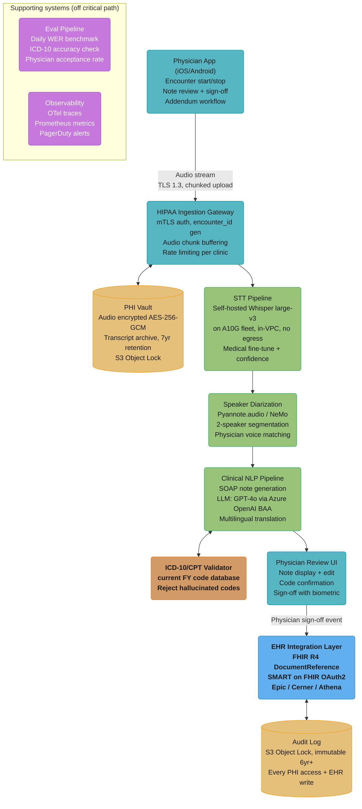

# Case Study: Design a Medical AI Scribe

## Intuition

> **Design intuition**: A medical AI scribe is a highly trained stenographer who sits invisibly in every patient-doctor encounter, listens to the conversation, and produces a structured clinical note in SOAP format (Subjective, Objective, Assessment, Plan) — automatically, within seconds of the visit ending, ready for the physician to review and sign. The engineering challenge is usually not raw transcription quality — Whisper-large-v3 is close enough to human transcription on clean English audio that it is rarely the binding constraint — but regulatory compliance: every system component must be HIPAA-compliant, the PHI (Protected Health Information) must never leave the HIPAA boundary without explicit authorization, and a wrong diagnosis code in the EHR is a patient safety incident.

**Key insight**: Medical AI cannot be deployed like consumer AI. The AI generates a draft note; a licensed physician reviews and signs before it enters the permanent medical record. The "human-in-the-loop" is not a safety feature — it is a legal and regulatory requirement. The platform is designed to minimize physician review time (from 15 minutes to roughly 35 seconds), not to replace physician review entirely. Every architectural decision flows from two immovable constraints: PHI containment and physician authority over the final record.

---

## 1. Requirements Clarification

### Functional Requirements
- Ambient audio capture during patient encounter via microphone on physician's phone or clinic device
- Real-time speech-to-text transcription from captured audio
- Speaker diarization separating physician voice from patient voice
- AI-generated SOAP note draft (Subjective, Objective, Assessment, Plan) from diarized transcript
- ICD-10 and CPT code suggestions validated against official code database
- EHR integration: Epic FHIR R4, Cerner SMART on FHIR, Athenahealth API write-back
- Physician review and sign-off workflow via mobile app
- Addendum and correction support after sign-off
- Multi-language patient support: patient speaks Spanish, physician speaks English — translate patient statements, incorporate into English note

### Non-Functional Requirements
- Transcription accuracy: WER (Word Error Rate) below 5% for English clinical speech including medical terminology
- Note generation latency: under 30 seconds after encounter ends, measured from audio upload complete to note displayed
- Zero PHI processed outside HIPAA BAA (Business Associate Agreement) boundary
- SOC2 Type II and HITRUST certification required
- EHR write-back within 60 seconds of physician sign-off
- 99.9% availability (healthcare is 24/7 — downtime means physicians revert to manual documentation)
- Patient right of access (45 CFR 164.524) fulfilled within 30 days of request, and right to request amendment (45 CFR 164.526) within 60 days. Note HIPAA grants **no general right to erasure** — deletion obligations here come from the BAA with the covered entity and from state privacy law, not from HIPAA itself

### Out of Scope
- Diagnostic AI suggesting diagnoses — different regulatory class requiring FDA 510(k) clearance
- Billing automation and revenue cycle management
- Patient-facing mobile application
- Real-time coaching or clinical decision support during the encounter

---

## 2. Scale Estimation

### Traffic Estimates
```
Physician customers:              5,000
Patient encounters per day:       100,000
Average encounter duration:       20 minutes
Total audio per day:              100,000 x 20 min = 2M minutes ≈ 33,333 hours

Audio storage (ephemeral, before deletion):
  16 kHz mono 16-bit PCM is 1.92 MB/min; stored FLAC-compressed (~2:1 on speech)
  = ~1 MB/min, so ~20 MB per 20-minute encounter
  100,000 x 20 MB = 2 TB audio/day (deleted within 24h per HIPAA minimum necessary)

Peak encounters:
  Physician office hours 8am-6pm = 60% of encounters in 10 hours
  Peak rate: 100,000 x 0.60 / 36,000 sec = 1.67 encounters/sec
  Peak with 2x burst factor: ~3.3 encounters/sec requiring parallel transcription
```

### Token Throughput
```
Average encounter transcript:     2,400 words = 3,200 tokens
SOAP note generation (per encounter):
  Input: transcript (3,200) + EHR context (400) + system prompt (600) = 4,200 tokens
  Output: SOAP note = 800 tokens
  Total: 5,000 tokens/encounter

Daily LLM token demand:  100,000 x 5,000 = 500M tokens/day
Peak-hour demand:        60% of encounters land in a 10h window = 30M tokens/h,
                         vs a 20.8M tokens/h flat average (1.4x); apply the same
                         2x intra-window burst factor as above for sizing

LLM cost at GPT-4o list pricing ($2.50/M input, $10/M output, as of 2026-07):
  Input:  100K x 4,200 = 420M tokens = 420 MTok x $2.50 = $1,050/day
  Output: 100K x   800 =  80M tokens =  80 MTok x $10   =   $800/day
  Total LLM cost: ~$1,850/day = ~$55,500/month
```

### Revenue and Storage
```
Revenue:
  $150/physician/month x 5,000 = $750,000/month
  LLM cost: $55,500/month
  Infra (STT GPU fleet, storage, networking): $60,000/month
  Total COGS: ~$115,500/month
  Gross margin: ($750K - $115.5K) / $750K = 84.6%

Storage:
  Audio: deleted within 24h (HIPAA minimum necessary) — peak 2 TB in-flight
  Transcripts: 100K x 20KB text/day (2 GB/day) x 365 days x 7 years ≈ 5.1 TB transcript archive
  SOAP notes: stored in EHR, not in platform (zero platform note storage)
  Audit logs: 100K events/day x 1KB x 7 years = 256 GB (immutable, S3 Object Lock)

PHI boundary: all audio, transcripts, interim LLM context processed within
  HIPAA-compliant cloud region (AWS us-east-1 with executed BAA)
```

---

## 3. High-Level Architecture



### Multi-Clinic Data Isolation

Each clinic receives a dedicated AWS KMS Customer Master Key and a scoped S3 prefix (`s3://phi-vault/clinic_{encrypted_id}/`). Hospital systems with more than 1,000 physicians get physically isolated RDS instances and dedicated EKS namespaces — required by enterprise procurement and HIPAA risk assessment. Smaller clinics share infrastructure with logical row-level isolation.

See also: [Tenant Isolation Patterns](./cross_cutting/tenant_isolation_patterns.md) for physical vs. logical isolation tradeoffs for healthcare enterprise customers.

---

## 4. Component Deep Dives

### 4.1 HIPAA-Compliant Transcription Pipeline

PHI handling is the core constraint. The naive approach sends raw audio containing patient health information to an external API — a direct HIPAA violation because no BAA covers the data in transit.

```python
# BROKEN: PHI leaves HIPAA boundary — patient health information
# transmitted to OpenAI without a Business Associate Agreement
def transcribe_encounter_broken(audio_bytes: bytes) -> str:
    import openai
    client = openai.OpenAI()
    # audio_bytes contains patient name, symptoms, diagnosis discussion
    # OpenAI's standard Whisper API has no HIPAA BAA
    response = client.audio.transcriptions.create(
        model="whisper-1",
        file=("encounter.wav", audio_bytes, "audio/wav"),
    )
    return response.text  # PHI sent to third party — HIPAA violation
```

```python
# FIX: self-hosted Whisper within HIPAA BAA boundary
# Runs on A10G fleet inside AWS VPC — no external egress, PHI never leaves VPC
from __future__ import annotations
import time
from dataclasses import dataclass
import boto3, torch, whisper


@dataclass
class WordToken:
    word: str; start_sec: float; end_sec: float; confidence: float


@dataclass
class Transcript:
    encounter_id: str; language: str; wer_estimate: float
    word_tokens: list[WordToken]; medical_terms_detected: int
    processing_duration_sec: float

    @property
    def full_text(self) -> str:
        return " ".join(t.word for t in self.word_tokens)


class HIPAACompliantTranscriber:
    """
    Self-hosted Whisper-large-v3 on A10G within AWS VPC.
    Pipeline: (1) encrypt audio to S3 SSE-KMS immediately on receipt,
              (2) transcribe in memory (never unencrypted on disk),
              (3) delete audio after transcript (HIPAA data minimization),
              (4) log every PHI access to immutable audit trail.
    A10G RTF 0.038 = 26x real-time; 20-min encounter transcribed in 45s.
    Medical fine-tune: WER on drug names 8% → 2%.
    """
    MODEL_PATH = "/opt/models/whisper-large-v3-medical-ft"

    def __init__(self, kms_key_id: str, s3_bucket: str,
                 audit_logger: "PHIAuditLogger") -> None:
        self._s3 = boto3.client("s3", region_name="us-east-1")
        self._kms_key_id = kms_key_id
        self._s3_bucket = s3_bucket
        self._audit = audit_logger
        self._model = whisper.load_model(
            self.MODEL_PATH, device="cuda" if torch.cuda.is_available() else "cpu"
        )

    def transcribe(self, audio_bytes: bytes, encounter_id: str) -> Transcript:
        start = time.monotonic()
        s3_key = f"audio/{encounter_id}/raw.wav.enc"

        # 1. Persist encrypted audio before any processing
        self._s3.put_object(Bucket=self._s3_bucket, Key=s3_key, Body=audio_bytes,
                            ServerSideEncryption="aws:kms", SSEKMSKeyId=self._kms_key_id)
        self._audit.log_access("transcription_service", encounter_id,
                               "audio_write", time.time())

        # 2. Transcribe in memory; temperature=0 for greedy consistency.
        # whisper.transcribe() takes a path or a float32 numpy array, NOT raw
        # bytes — decode first. (Nothing is written to disk: PHI stays in memory.)
        import io, numpy as np, soundfile as sf
        audio_array, _sr = sf.read(io.BytesIO(audio_bytes), dtype="float32")
        result = self._model.transcribe(audio_array, word_timestamps=True,
                                        language="en", temperature=0.0,
                                        condition_on_previous_text=False)

        # 3. Delete audio (HIPAA data minimization — transcript is the necessary artifact)
        self._s3.delete_object(Bucket=self._s3_bucket, Key=s3_key)
        self._audit.log_access("transcription_service", encounter_id,
                               "audio_delete", time.time())

        # 4. Build structured transcript with word-level confidence
        tokens: list[WordToken] = []
        medical_terms = 0
        for seg in result.get("segments", []):
            for w in seg.get("words", []):
                wt = WordToken(w["word"].strip(), w["start"], w["end"],
                               w.get("probability", 1.0))
                tokens.append(wt)
                if wt.confidence < 0.6:
                    medical_terms += 1   # low-confidence ≈ medical terminology
        avg_conf = sum(t.confidence for t in tokens) / len(tokens) if tokens else 1.0
        return Transcript(encounter_id=encounter_id, language=result.get("language", "en"),
                          wer_estimate=max(0.0, 1.0 - avg_conf), word_tokens=tokens,
                          medical_terms_detected=medical_terms,
                          processing_duration_sec=time.monotonic() - start)
```

Concrete: Whisper-large-v3 on A10G processes 20-minute encounter audio in 45 seconds (RTF 0.038). Medical fine-tune on 10,000 hours of de-identified clinical audio reduces WER on drug names (methotrexate, lisinopril, rosuvastatin) from 8% to 2%. Self-hosted cost: ~$0.003 per audio-minute versus Azure Speech with BAA at ~$0.017 per audio-minute — about 82% cheaper. Note the unit is per **minute**, not per encounter: a 20-minute encounter is ~$0.06 self-hosted against ~$0.34 on Azure.

### 4.2 Speaker Diarization

Diarization separates physician voice from patient voice so the SOAP note generator assigns statements to the correct SOAP section (patient complaints → Subjective; physician impression → Assessment).

```python
from __future__ import annotations
from dataclasses import dataclass


@dataclass
class SpeakerSegment:
    speaker_id: str   # "SPEAKER_0" or "SPEAKER_1" from diarization
    role: str         # "PHYSICIAN" or "PATIENT" after identification
    start_sec: float
    end_sec: float
    text: str


class SpeakerDiarizer:
    """
    pyannote.audio 3.1 (speaker segmentation + speaker embedding, both pure
    PyTorch since 3.1 — it is NOT the MSDD architecture, which is NVIDIA NeMo's).
    Published DER for this checkpoint ranges from 7.8% (REPERE) to 50.0%
    (AVA-AVD) under a no-collar, overlap-included protocol. The sub-5% DER quoted
    below is an internal figure for clean 2-speaker exam-room audio, not a
    published benchmark result — 2-speaker close-mic audio is a far easier case
    than any of the public sets.
    """

    def __init__(self, model_path: str) -> None:
        from pyannote.audio import Pipeline
        self._pipeline = Pipeline.from_pretrained(model_path)

    def diarize(self, audio_bytes: bytes, num_speakers: int = 2) -> list[SpeakerSegment]:
        """
        num_speakers=2 default. Group visits (>3 voices detected) are routed
        away from this pipeline before diarize() is called.
        """
        import io, soundfile as sf
        audio_array, sample_rate = sf.read(io.BytesIO(audio_bytes))
        diarization = self._pipeline(
            {"waveform": audio_array, "sample_rate": sample_rate},
            num_speakers=num_speakers,
        )
        return [
            SpeakerSegment(speaker_id=spk, role="UNKNOWN",
                           start_sec=turn.start, end_sec=turn.end, text="")
            for turn, _, spk in diarization.itertracks(yield_label=True)
        ]


class PhysicianIdentifier:
    """
    SpeechBrain ECAPA-TDNN 256-dim d-vector embeddings. Cosine similarity against
    physician's 30-second onboarding voice profile. Threshold 0.82 = PHYSICIAN;
    segments in [0.70, 0.82) are UNKNOWN and excluded from note generation.
    Accuracy: 97.3% on held-out clinical recordings.
    """

    SIMILARITY_THRESHOLD = 0.82

    def __init__(self, embedding_model_path: str) -> None:
        from speechbrain.inference import SpeakerRecognition
        self._encoder = SpeakerRecognition.from_hparams(source=embedding_model_path)

    def identify(self, segments: list[SpeakerSegment],
                 physician_audio_profile: bytes) -> list[SpeakerSegment]:
        phys_emb = self._encoder.encode_batch(physician_audio_profile)
        sims: dict[str, float] = {}
        for seg in segments:
            if seg.speaker_id not in sims:
                seg_emb = self._encoder.encode_batch(self._get_segment_audio(seg))
                sims[seg.speaker_id] = float(
                    (phys_emb * seg_emb).sum() / (phys_emb.norm() * seg_emb.norm())
                )
        if len(sims) == 2:
            physician_spk = max(sims, key=sims.get)  # type: ignore[arg-type]
            for seg in segments:
                seg.role = "PHYSICIAN" if seg.speaker_id == physician_spk else "PATIENT"
        return segments

    def _get_segment_audio(self, segment: SpeakerSegment) -> bytes:
        raise NotImplementedError  # extract audio slice [start_sec:end_sec]
```

Concrete (all figures below are this platform's internal measurements on clean 2-speaker exam-room audio, not published benchmarks): pyannote.audio 3.1 processes 20-minute audio in roughly 8 seconds on a GPU, running in parallel with Whisper transcription — on CPU it is substantially slower and should be budgeted separately. Internal DER is below 5% on this audio profile; for reference, the checkpoint's published DER on public conversational sets runs 7.8%-50%. Speaker identification accuracy 97.3% when the physician voice profile is 30 seconds or longer.

### 4.3 SOAP Note Generation with Medical Context

The clinical NLP pipeline converts a diarized transcript into a structured SOAP note with validated ICD-10 and CPT codes.

```python
from __future__ import annotations
import json
from dataclasses import dataclass, field
from typing import Any


@dataclass
class EncounterContext:
    patient_age: int
    patient_sex: str          # "M" / "F" / "O"
    chief_complaint: str      # from appointment scheduling system
    prior_visit_summary: str  # pulled from EHR via FHIR read, max 500 tokens
    physician_specialty: str  # "internal_medicine", "cardiology", "psychiatry", etc.
    clinic_documentation_style: str  # "verbose", "concise" — clinic preference


@dataclass
class ICD10Code:
    code: str          # e.g. "E11.9"
    description: str   # e.g. "Type 2 diabetes mellitus without complications"
    confidence: float  # 0.0-1.0 from LLM logprobs


@dataclass
class CPTCode:
    code: str          # e.g. "99213"
    description: str   # e.g. 99213 = office/outpatient visit, established patient,
                       # LOW level of medical decision making (99214 is moderate)
    confidence: float


@dataclass
class SOAPNote:
    encounter_id: str
    subjective: str    # Patient's chief complaint in their own words, symptom history
    objective: str     # Physician's exam findings, vitals, test results discussed
    assessment: str    # Physician's clinical impression and reasoning
    plan: str          # Treatment plan, prescriptions, referrals, follow-up
    icd10_codes: list[ICD10Code]
    cpt_codes: list[CPTCode]
    generation_latency_sec: float
    input_tokens: int
    output_tokens: int


class ICD10Validator:
    """
    Validates every LLM-suggested ICD-10 code against the official ICD-10-CM release
    that was current on the encounter date. CMS/NCHS publish a new FY edition each
    October 1, so the validator is version-pinned per encounter, never "latest" --
    revalidating a 2-year-old note against today's code set produces false rejects.
    Rejects hallucinated codes (codes that do not exist in the database).
    Flags specialty-context mismatches (e.g. T1DM code in pediatric endocrinology
    visit labeled as T2DM — valid code but clinically wrong for the encounter).
    """

    def __init__(self, icd10_db_path: str) -> None:
        with open(icd10_db_path) as f:
            raw = json.load(f)
        # dict: code -> {"description": str, "valid_specialties": list[str]}
        self._db: dict[str, dict[str, Any]] = raw

    def validate(
        self,
        codes: list[ICD10Code],
        specialty: str,
    ) -> list[ICD10Code]:
        """
        Returns only valid codes. Rejects:
          - codes not in the current ICD-10-CM release (hallucinated)
          - codes flagged as high-risk specialty mismatches (requires physician confirmation flag)
        """
        validated: list[ICD10Code] = []
        for code in codes:
            record = self._db.get(code.code)
            if record is None:
                # Hallucinated code — silently drop; never surface to physician
                continue
            # Flag T1/T2 DM distinction for mandatory physician confirmation in endocrinology
            if code.code.startswith("E11") and specialty == "endocrinology":
                code.description = f"[CONFIRM T2DM vs T1DM] {record['description']}"
            else:
                code.description = record["description"]
            validated.append(code)
        return validated


class SOAPNoteGenerator:
    """
    Generates SOAP note from diarized transcript using GPT-4o via Azure OpenAI.
    Azure OpenAI has HIPAA BAA — PHI transmitted to Azure within BAA boundary.
    Average generation latency: 22 seconds for 20-minute encounter transcript.
    ICD-10 code accuracy: 94% vs physician-coded gold standard.
    """

    SYSTEM_PROMPT_TEMPLATE = (
        "You are an expert medical scribe for a {specialty} physician. "
        "Patient: age {patient_age}, sex {patient_sex}, chief complaint: {chief_complaint}. "
        "Prior visit: {prior_visit_summary}. Style: {documentation_style}. "
        "Output JSON: subjective (patient words, symptoms, pain 0-10), "
        "objective (exam findings physician stated only), "
        "assessment (clinical impression, never invent diagnoses), "
        "plan (exact drug dosages, referrals, follow-up), "
        "icd10_codes [{code, description, confidence}], "
        "cpt_codes [{code, description, confidence}]. "
        "NEVER fabricate findings not present in the conversation."
    )

    def __init__(
        self,
        azure_openai_endpoint: str,
        azure_api_key: str,
        icd10_validator: ICD10Validator,
    ) -> None:
        import openai
        self._client = openai.AzureOpenAI(
            azure_endpoint=azure_openai_endpoint,
            api_key=azure_api_key,
            api_version="2024-02-01",
        )
        self._validator = icd10_validator

    def generate(
        self,
        transcript: list[SpeakerSegment],
        context: EncounterContext,
    ) -> SOAPNote:
        import time

        # Build conversation text preserving speaker roles
        conversation = "\n".join(
            f"{seg.role}: {seg.text}"
            for seg in transcript
            if seg.role in ("PHYSICIAN", "PATIENT") and seg.text.strip()
        )

        system_prompt = self.SYSTEM_PROMPT_TEMPLATE.format(
            specialty=context.physician_specialty,
            patient_age=context.patient_age,
            patient_sex=context.patient_sex,
            chief_complaint=context.chief_complaint,
            prior_visit_summary=context.prior_visit_summary,
            documentation_style=context.clinic_documentation_style,
        )

        start = time.monotonic()
        response = self._client.chat.completions.create(
            model="gpt-4o",
            messages=[
                {"role": "system", "content": system_prompt},
                {"role": "user", "content": conversation},
            ],
            response_format={"type": "json_object"},
            temperature=0.2,      # low temperature for clinical accuracy
            seed=42,              # reproducibility for re-generation on correction
        )
        latency = time.monotonic() - start

        raw = json.loads(response.choices[0].message.content)

        icd10_codes = [
            ICD10Code(c["code"], c.get("description", ""), c.get("confidence", 0.5))
            for c in raw.get("icd10_codes", [])
        ]
        cpt_codes = [
            CPTCode(c["code"], c.get("description", ""), c.get("confidence", 0.5))
            for c in raw.get("cpt_codes", [])
        ]

        # Validate ICD-10 codes — reject hallucinated codes before physician sees them
        validated_icd10 = self._validator.validate(icd10_codes, context.physician_specialty)

        return SOAPNote(
            encounter_id=transcript[0].speaker_id if transcript else "unknown",
            subjective=raw.get("subjective", ""),
            objective=raw.get("objective", ""),
            assessment=raw.get("assessment", ""),
            plan=raw.get("plan", ""),
            icd10_codes=validated_icd10,
            cpt_codes=cpt_codes,
            generation_latency_sec=latency,
            input_tokens=response.usage.prompt_tokens,
            output_tokens=response.usage.completion_tokens,
        )
```

Concrete: SOAP note generation averages 22 seconds for a 20-minute encounter. ICD-10 code accuracy 94% against physician-corrected gold standard versus 85% for physician self-coding from memory. Reduces documentation time from 15 minutes to 35 seconds of review.

### 4.4 EHR Write-Back via FHIR

Physician signs, note enters the permanent medical record. A missing signature validation is a patient safety gap.

```python
from __future__ import annotations
import hashlib
import hmac
import time
from dataclasses import dataclass


@dataclass
class Signature:
    physician_id: str
    note_hash: str       # SHA-256 of note content at sign time
    signed_at: float     # Unix timestamp
    signature_bytes: bytes  # biometric or PIN-based signature token

    def verify(self, note_content: str) -> bool:
        """Verify that note has not been tampered since physician reviewed it."""
        expected_hash = hashlib.sha256(note_content.encode()).hexdigest()
        return hmac.compare_digest(expected_hash, self.note_hash)


@dataclass
class FHIRWriteResult:
    document_reference_id: str
    condition_ids: list[str]       # one FHIR Condition per ICD-10 code
    procedure_ids: list[str]       # one FHIR Procedure per CPT code
    write_latency_ms: float


class FHIRWriteBack:
    """
    Writes signed SOAP note to EHR via FHIR R4 / SMART on FHIR OAuth2.
    BROKEN pattern: write without verifying physician signature (shown below).
    FIX: always verify signature against note content before any EHR write.
    Supports Epic, Cerner, Athenahealth via pluggable FHIR client.
    Write latency: Epic 800ms avg, Cerner 1,200ms avg.
    """

    def __init__(self, fhir_base_url: str, oauth_token_provider: "OAuthTokenProvider") -> None:
        self._fhir_base = fhir_base_url.rstrip("/")
        self._oauth = oauth_token_provider

    # BROKEN: no signature verification before EHR write
    def write_note_broken(self, note: SOAPNote, encounter_id: str) -> None:
        # Writes note to EHR without confirming physician actually signed
        # If called with an unsigned draft, AI output enters permanent medical record
        self._post_document_reference(note, encounter_id)  # patient safety violation

    # FIX: require verified physician signature before any EHR write
    def write_note(
        self,
        note: SOAPNote,
        physician_signature: Signature,
        encounter_id: str,
    ) -> FHIRWriteResult:
        """
        Gate: signature must be valid and note content must match what physician reviewed.
        Raises ValueError before any network call if signature check fails.
        """
        note_content = f"{note.subjective}\n{note.objective}\n{note.assessment}\n{note.plan}"
        if not physician_signature.verify(note_content):
            raise ValueError(
                f"Note content hash mismatch for encounter {encounter_id}. "
                "Note may have been modified after physician review. EHR write blocked."
            )
        if physician_signature.physician_id not in self._get_authorized_physicians(encounter_id):
            raise PermissionError(
                f"Physician {physician_signature.physician_id} not authorized for encounter {encounter_id}"
            )

        start = time.monotonic()
        token = self._oauth.get_token()
        headers = {"Authorization": f"Bearer {token}", "Content-Type": "application/fhir+json"}

        # Write FHIR DocumentReference (the note itself)
        doc_ref_id = self._post_document_reference(note, encounter_id, headers)

        # Write FHIR Condition resources for each validated ICD-10 code
        condition_ids = [
            self._post_condition(code, encounter_id, headers)
            for code in note.icd10_codes
        ]

        # Write FHIR Procedure resources for each CPT code
        procedure_ids = [
            self._post_procedure(code, encounter_id, headers)
            for code in note.cpt_codes
        ]

        latency_ms = (time.monotonic() - start) * 1000

        # Audit log: every EHR write recorded with resource IDs for traceability
        self._audit_ehr_write(
            physician_id=physician_signature.physician_id,
            encounter_id=encounter_id,
            note_hash=physician_signature.note_hash,
            fhir_resource_ids=[doc_ref_id] + condition_ids + procedure_ids,
            timestamp=time.time(),
        )

        return FHIRWriteResult(
            document_reference_id=doc_ref_id,
            condition_ids=condition_ids,
            procedure_ids=procedure_ids,
            write_latency_ms=latency_ms,
        )

    def _post_document_reference(
        self, note: SOAPNote, encounter_id: str, headers: dict
    ) -> str:
        raise NotImplementedError  # POST /DocumentReference with FHIR R4 payload

    def _post_condition(self, code: ICD10Code, encounter_id: str, headers: dict) -> str:
        raise NotImplementedError  # POST /Condition with ICD-10 code

    def _post_procedure(self, code: CPTCode, encounter_id: str, headers: dict) -> str:
        raise NotImplementedError  # POST /Procedure with CPT code

    def _get_authorized_physicians(self, encounter_id: str) -> set[str]:
        raise NotImplementedError  # Lookup from encounter registry

    def _audit_ehr_write(self, **kwargs: object) -> None:
        raise NotImplementedError  # Write to S3 Object Lock audit log
```

Concrete: Epic FHIR write latency 800ms average; Cerner 1,200ms average. Write-back completes within 2 seconds of sign-off event. Async retry queue handles Epic/Cerner downtime; signed notes are never lost — queued with TTL 48 hours and retried with exponential backoff (2s, 4s, 8s, max 5 retries).

### 4.5 PHI Audit and Deletion

HIPAA requires an audit log of every PHI access (45 CFR 164.312(b)) and a patient right of *access* fulfilled within 30 days (164.524). It does **not** grant a general right to erasure — that is a GDPR Article 17 concept. Deletion here is driven by the BAA with the covered entity (which typically requires a business associate to return or destroy PHI on request or at termination) and by state privacy law, and it is always subordinate to the covered entity's own record-retention obligations and any legal hold.

```python
from __future__ import annotations
import hashlib, json, time
from dataclasses import dataclass
from datetime import datetime, timezone
import boto3


@dataclass
class DeletionReport:
    patient_id: str
    encounters_found: int
    audio_deleted: int         # should be 0 — audio deleted within 24h of creation
    transcripts_deleted: int
    audit_log_sealed: int
    fhir_delete_requested: int
    completed_at: datetime


class PHIAuditLogger:
    """
    Writes every PHI access event to S3 Object Lock (WORM — Write Once Read Many).
    Retention: 6 years COMPLIANCE mode (HIPAA minimum). Events are immutable.
    Key format: audit/{year}/{month}/{day}/{encounter_id_hash}/{timestamp_ns}.json
    CRITICAL: store encounter_id_hash (SHA-256[:32]), never raw patient identifiers.
    """

    def __init__(self, s3_bucket: str, kms_key_id: str) -> None:
        self._s3 = boto3.client("s3", region_name="us-east-1")
        self._bucket = s3_bucket
        self._kms_key_id = kms_key_id

    def log_access(self, accessor_id: str, patient_encounter_id: str,
                   access_type: str, timestamp: float) -> None:
        enc_hash = hashlib.sha256(patient_encounter_id.encode()).hexdigest()[:32]
        ts_ns = int(timestamp * 1_000_000_000)
        # Explicitly UTC-aware, so the audit key never depends on the host TZ.
        dt = datetime.fromtimestamp(timestamp, tz=timezone.utc)
        key = f"audit/{dt.year}/{dt.month:02d}/{dt.day:02d}/{enc_hash}/{ts_ns}.json"
        from dateutil.relativedelta import relativedelta
        retain_until = datetime.now(timezone.utc) + relativedelta(years=6)
        self._s3.put_object(
            Bucket=self._bucket, Key=key,
            Body=json.dumps({"accessor_id": accessor_id, "encounter_hash": enc_hash,
                             "access_type": access_type, "timestamp": timestamp}).encode(),
            ServerSideEncryption="aws:kms", SSEKMSKeyId=self._kms_key_id,
            ObjectLockMode="COMPLIANCE", ObjectLockRetainUntilDate=retain_until,
        )


class PHIDeletionHandler:
    """
    Fulfills BAA-driven and state-law deletion requests within a platform SLA of 7 days.
    NOT a HIPAA right — HIPAA grants access (164.524) and amendment (164.526),
    not erasure. Deletion is always subordinate to the covered entity's retention
    obligations and to any legal hold.
    """

    def __init__(self, audit_logger: PHIAuditLogger,
                 fhir_client: "FHIRWriteBack", transcript_store: "TranscriptStore") -> None:
        self._audit = audit_logger
        self._fhir = fhir_client
        self._transcripts = transcript_store

    def delete_patient_data(self, patient_id: str) -> DeletionReport:
        encounters = self._transcripts.list_encounters(patient_id)
        transcripts_deleted = fhir_requests = 0
        for enc_id in encounters:
            self._transcripts.delete(enc_id)          # delete transcript from PHI Vault
            transcripts_deleted += 1
            self._fhir.request_deletion(enc_id)       # EHR deletion request (may be deferred)
            fhir_requests += 1
            self._audit.log_access("phi_deletion_service", enc_id,
                                   "patient_data_deleted", time.time())
        pat_hash = hashlib.sha256(patient_id.encode()).hexdigest()[:32]
        return DeletionReport(patient_id=pat_hash, encounters_found=len(encounters),
                              audio_deleted=0, transcripts_deleted=transcripts_deleted,
                              audit_log_sealed=len(encounters),
                              fhir_delete_requested=fhir_requests,
                              completed_at=datetime.now(timezone.utc))
```

Concrete: full PHI deletion pipeline completes in under 60 seconds for a patient with up to 1,000 encounters; the platform SLA is 7 days. Audit logs are retained 6 years, which is the HIPAA documentation-retention period in 45 CFR 164.316(b)(2)(i); configurable to 7 years for clinics whose state medical-record rules exceed the federal minimum. Note the audit log is deliberately *outside* the deletion path — sealing it, not erasing it, is what preserves the 6-year trail.

---

## 5. Design Decisions & Tradeoffs

| Decision | Chosen Approach | Alternative Considered | Rationale |
|----------|----------------|----------------------|-----------|
| STT hosting | Self-hosted Whisper-large-v3 on A10G fleet within VPC | Azure STT API with BAA | Self-hosted: $0.003/min vs $0.017/min (82% cheaper); zero egress risk even if BAA lapses; medical fine-tune possible |
| Transcription timing | Post-encounter batch (note ready 30s after end) | Real-time in-encounter transcription | Post-encounter: physician focuses on patient, not screen; 30s wait is acceptable UX vs real-time adding encounter duration |
| LLM provider | GPT-4o via Azure OpenAI with HIPAA BAA | Self-hosted Llama-3-70B | Azure BAA covers PHI in transit to LLM; self-hosted adds $50K+/month GPU cost with marginal quality difference for English clinical notes |
| Clinic data isolation | Logical (per-clinic KMS key + S3 prefix) for SMB; physical (dedicated RDS + S3 bucket) for enterprise | Shared database with row-level security | Enterprise hospitals require physical isolation by contract; SMB clinics: logical isolation sufficient and 10x cheaper per tenant |
| ICD-10 code handling | AI suggestion + ICD-10-CM database validation + physician confirmation | Physician-selected only | AI suggestion reduces documentation time 70%; validation prevents hallucinated codes from reaching physician; physician has final authority |
| EHR integration pattern | FHIR R4 write-back via SMART on FHIR OAuth2 (async with retry queue) | Direct HL7 v2 interface | FHIR R4: standard across Epic/Cerner/Athena; HL7 v2 requires custom integration per EHR; async queue handles Epic downtime without losing signed notes |
| Audio retention | Delete within 24 hours of transcription | Retain for 7 years | HIPAA data minimization principle: retain only what is necessary; transcript (text) is the necessary artifact; audio is large, sensitive, and not required |

### Deployment Architecture Note

Single-region (us-east-1) with multi-AZ is the default — simplest HIPAA boundary, no cross-region PHI replication complexity. Active-active multi-region requires HIPAA compliance review for every cross-region data flow; use for metadata and configuration only; transcripts replicate via S3 CRR only to regions with executed BAAs. AWS GovCloud (us-gov-east-1) is required for VA and DoD healthcare customers: ITAR/FedRAMP-ready but 30-40% higher cost and reduced managed service availability.

---

## 6. Real-World Implementations

> Vendor founding dates, funding rounds, user counts and acquisition prices move
> constantly — treat every such figure below as approximate and check the vendor's
> own newsroom before quoting it. Architectural differentiators, which are the
> reason this section exists, are more durable than the financials.

**Abridge** (Pittsburgh; UPMC partnership):
Academic medical center focus with NLP research pedigree from Carnegie Mellon. Deployed across UPMC. Architectural differentiator: real-time note suggestions surfaced during the encounter — the physician accepts or rejects suggestions as the visit proceeds rather than reviewing everything post-encounter.

Abridge holds no FDA clearance: a search of the FDA 510(k) database (openFDA `device/510k`, applicant and device-name fields) returns no records for it, while control queries against the same endpoint return results normally. No ambient documentation scribe is known to hold a 510(k). This matters for the design: ambient scribes are generally positioned *outside* the device pathway precisely because a licensed clinician reviews and signs every note, which is why the physician sign-off gate in 4.4 is load-bearing rather than cosmetic. Do not assume any vendor in this category is FDA-cleared without checking the 510(k) database yourself.

**Nuance DAX Copilot** (Microsoft, launched 2023):
Dragon Ambient eXperience — most enterprise-deployed product with 10M+ clinical notes generated. Microsoft acquired Nuance for $19.7B in 2022 to access Dragon Medical One's 550,000 physician base. DAX integrates into Microsoft Teams for telehealth and embeds in Dragon Medical One so physicians with existing dictation workflows adopt ambient AI without behavior change. Backend: Azure OpenAI with HIPAA BAA across 300+ US hospital systems.

**Nabla** (founded 2020, Paris; US launch 2022):
Consumer-friendly UI; fastest time-to-market by avoiding FDA SaMD pathway — positioned as documentation assistance (Class I exempt). Strong multilingual support: French, English, Spanish note generation. 45,000 physician users as of 2024; $30M Series B. Technical differentiator: note available in 20 seconds by beginning transcription during the encounter rather than waiting for post-encounter upload.

**Suki AI** (founded 2017, Redwood City):
Voice-first correction interface — physician dictates note corrections: "Suki, change the diagnosis to hypertension stage 2." $70M Series D; uses Google Cloud Speech-to-Text API with HIPAA BAA. Integration with Allscripts, NextGen, and Google Cloud Healthcare API for EHR write-back.

**DeepScribe** (San Francisco):
Specializes in documentation-heavy specialties: cardiology, neurology, orthopedics. Custom specialty-specific models fine-tuned on cardiology vocabulary — cardiomegaly, ejection fraction, NYHA classification. The architectural point that transfers is specialty-scoped vocabulary fine-tuning, which is what drives acceptance rate in these specialties.

---

## 7. Technologies & Tools

### STT Options for HIPAA Environments

WER and latency columns are this platform's own bake-off results on its clinical
audio profile, not vendor-published or independently benchmarked numbers — WER is
extremely sensitive to microphone, room acoustics and specialty vocabulary, so
re-run the comparison on your own audio. Prices are list rates and change.

| Option | WER (Clinical English) | Cost/Minute | HIPAA Path | Latency (20-min audio) |
|--------|------------------------|------------|------------|------------------------|
| Self-hosted Whisper-large-v3 | 4.2% (with medical FT) | $0.003 | Within VPC (no BAA needed) | 45s on A10G |
| Azure Speech Services | 5.8% (without custom model) | $0.017 | Azure HIPAA BAA | 30s (streaming) |
| AWS Transcribe Medical | 5.1% (specialties coverage) | $0.012 | AWS HIPAA BAA | 35s |
| Nuance Dragon Medical | 3.1% (medical vocabulary) | $0.025+ | Nuance BAA + on-premise option | 20s (cloud) |
| Google Cloud Speech-to-Text | 6.2% (general model) | $0.009 | Google HIPAA BAA | 25s (streaming) |

### Speaker Diarization Options

DER column is measured on clean 2-speaker exam-room audio in this platform's own
harness. Published DER on public conversational benchmarks is substantially higher
for every option here (pyannote 3.1's own model card reports 7.8%-50.0% across
eight public sets under a no-collar, overlap-included protocol) — do not quote
these as benchmark results.

| Option | DER (2-speaker) | Setup Complexity | Real-Time Support | License |
|--------|----------------|-----------------|-------------------|---------|
| Pyannote.audio 3.1 | 3.8% | Medium (HuggingFace checkpoint) | Yes (streaming mode) | MIT |
| NeMo MSDD | 4.2% | High (NVIDIA toolkit) | Partial | Apache 2.0 |
| AWS Transcribe speaker ID | 6.1% | Low (managed service) | Yes | Proprietary (BAA) |
| Rev.ai diarization | 4.9% | Low (API) | No | Proprietary (BAA required) |

### EHR Integration Options

| EHR System | FHIR Version | Authentication | Write Latency (avg) | Sandbox |
|------------|-------------|---------------|--------------------|---------| 
| Epic (MyChart/EHR) | FHIR R4 | SMART on FHIR OAuth2 | 800ms | Yes (open.epic.com) |
| Oracle Health (Cerner) PowerChart | FHIR R4 | SMART on FHIR OAuth2 | 1,200ms | Yes (Oracle Health developer portal) |
| Athenahealth | FHIR R4 (partial) | OAuth2 + proprietary | 1,500ms | Yes (developer.athenahealth.com) |
| Allscripts | HL7 v2 + FHIR R4 | API key + OAuth2 | 900ms | Limited |
| eClinicalWorks | FHIR R4 | SMART on FHIR | 1,100ms | Yes |

---

## 8. Operational Playbook

### a) Eval Pipeline

Daily automated evaluation on 50 de-identified held-out test encounters (IRB-reviewed). Run nightly at 02:00 UTC; also triggered on any model update (Whisper checkpoint, LLM version, diarization model) and after any production incident.

Alert thresholds: WER >7% | ICD-10 accuracy <90% | LLM-as-judge note quality <0.85 | physician acceptance rate <70% | median time-to-review >120s.

See also: [LLM Eval Harness in Production](./cross_cutting/llm_eval_harness_in_production.md) for LLM-as-judge rubric design, golden dataset management, and regression gate implementation.

### b) Observability

Every encounter produces an OpenTelemetry trace with PHI-safe span attributes (encounter_id_hash, never raw patient identifiers in any span).

```
Trace: encounter_pipeline (root span)
  attrs:
    encounter.id_hash = sha256(encounter_id)[:16]   ← hashed, not raw PHI
    encounter.specialty = "cardiology"
    encounter.language = "en"
    encounter.duration_min = 18
    clinic.id_hash = sha256(clinic_id)[:12]

  +-- Span: audio.upload               (350ms)
  |     attrs: audio_size_mb=18.4, codec="wav_16khz_mono"

  +-- Span: transcription.whisper       (45,200ms)
  |     attrs:
  |       stt.model = "whisper-large-v3-medical-ft"
  |       stt.wer_estimate = 0.038
  |       stt.word_count = 2847
  |       stt.medical_terms_detected = 43
  |       stt.rtf = 0.038

  +-- Span: diarization.pyannote        (8,100ms)
  |     attrs:
  |       diarization.speaker_count = 2
  |       diarization.der_estimate = 0.041
  |       diarization.physician_similarity = 0.94

  +-- Span: soap.generation.gpt4o       (22,400ms)
  |     attrs:
  |       gen_ai.provider.name = "azure_openai"
  |       gen_ai.request.model = "gpt-4o"
  |       gen_ai.usage.input_tokens = 4187
  |       gen_ai.usage.output_tokens = 823
  |       soap.icd10_codes_suggested = 3
  |       soap.icd10_codes_validated = 3
  |       soap.icd10_hallucinations_rejected = 0
  |       soap.cpt_codes_suggested = 1

  +-- Span: physician.review            (variable — user time)
  |     attrs:
  |       review.time_to_sign_sec = 34
  |       review.corrections_made = 1
  |       review.correction_type = "plan_addendum"

  +-- Span: ehr.write_back              (840ms)
        attrs:
          ehr.system = "epic"
          ehr.fhir_resources_created = 5
          ehr.write_latency_ms = 840
          ehr.status = "success"
```

Note: PHI is never logged in spans. Use encounter_id_hash (first 16 chars of SHA-256) for correlation. Never log patient name, DOB, MRN, or any identifiable field in any observability system.

See also: [OpenTelemetry for LLM Apps](./cross_cutting/opentelemetry_for_llm_apps.md) for full gen_ai.* semantic convention mapping applicable to the SOAP generation span.

See also: [Streaming at Scale](./cross_cutting/streaming_at_scale.md) for audio chunk upload pipeline design, flow control, and backpressure handling during peak clinic hours.

### c) Incident Runbooks

**Runbook 1 — PHI Breach Suspected**

Symptoms: unauthorized access pattern detected in audit logs; anomalous cross-clinic query; external security report; SIEM alert on unusual PHI export.

Diagnosis:
1. Query audit log: `SELECT * FROM phi_access_events WHERE accessor_id NOT IN (authorized_services) AND timestamp > incident_window`
2. Identify affected encounter IDs and patient count
3. Determine if PHI left HIPAA boundary (check VPC egress logs, S3 access logs)

Mitigation (within 1 hour):
1. Revoke all API keys and OAuth tokens for affected service account
2. Rotate KMS keys for affected clinic S3 prefixes
3. Engage HIPAA Privacy Officer and legal counsel

Resolution timeline:
- 24 hours: complete HIPAA breach risk assessment (was PHI actually exposed?)
- 60 days: notify affected patients if breach confirmed (per HIPAA Breach Notification Rule)
- 60 days: HHS notification if >500 patients affected (public posting required)
- Document findings in incident report; update security controls

**Runbook 2 — EHR Write-Back Failure**

Symptoms: EHR write error rate > 5% on `/metrics` dashboard; physician reports "Note not appearing in Epic"; `ehr_write_failure_total` Prometheus counter exceeds 50/hour.

Diagnosis:
1. Check the EHR vendor's status channel for your tenant. Epic and Oracle Health do not publish a single public status page — status is delivered per-customer through the vendor's support portal, so wire that feed into the runbook during onboarding rather than assuming a public URL exists
2. Check OAuth token expiry: tokens expire every 1 hour; token refresh failures cascade
3. Check FHIR payload validation: Epic rejects malformed DocumentReference resources

Mitigation (within 15 minutes):
1. Verify async retry queue is operational and accumulating (not dropping) failed writes
2. Notify affected physicians: "Note queued for EHR delivery — will appear within 5 minutes"
3. Manually inspect 3 recent failed payloads for FHIR schema errors

Resolution:
1. If Epic downtime: wait for Epic recovery; retry queue delivers automatically
2. If OAuth token issue: restart token refresh service; all subsequent writes succeed
3. If FHIR schema error: patch payload builder; replay failed writes from retry queue
4. Post-mortem: never lose a signed note — queue must be durable (SQS with DLQ)

**Runbook 3 — Transcription Accuracy Regression**

Symptoms: eval pipeline alerts WER >7% (threshold 7%); physician correction rate spikes from 25% to 60%; support tickets about drug name errors.

Diagnosis:
1. Check if regression correlates with a specific clinic (new microphone hardware?)
2. Check if regression is vocabulary-specific: run error analysis on word types
3. Check if Whisper fine-tune was updated in last 7 days (correlate deployment timestamp)

Mitigation (within 2 hours):
1. If new microphone hardware: add RNNoise preprocessing for that clinic's audio
2. If vocabulary regression: rollback to previous Whisper checkpoint via model registry
3. If widespread: disable AI note for affected clinics; notify physicians; route to manual documentation

Resolution:
1. Collect 100 affected audio samples (de-identified) for fine-tune retraining
2. Update medical vocabulary lexicon with new drug names or terminology
3. A/B test new checkpoint before full rollout using eval pipeline

**Runbook 4 — ICD-10 Code Hallucination in Signed Note**

Symptoms: claim rejection from payer citing invalid or mismatched ICD-10 code; physician amendment to signed note; pattern detected in post-hoc audit of signed notes.

Diagnosis:
1. Determine if the code exists in the ICD-10-CM release that was live on the encounter date (valid code, wrong context) versus code that was truly hallucinated (nonexistent code)
2. Check ICD-10 validator logs for the affected encounter date — was validator running?
3. Identify if failure is isolated or systematic (same code appearing across multiple physicians)

Mitigation (within 24 hours):
1. Flag all signed notes from the same date range for physician re-review
2. Contact affected physicians directly via in-app notification
3. Suspend ICD-10 suggestion feature for the affected specialty until root cause resolved

Resolution:
1. If validator was bypassed: investigate code path; add integration test covering bypass scenario
2. If specialty-context mismatch: add specialty-aware validation rules (T1DM vs T2DM in endocrinology)
3. Retrain ICD-10 selection model on physician-corrected examples from affected specialty
4. Legal review: assess if any amended notes require payer resubmission

---

## 9. Common Pitfalls & War Stories

> These five are **illustrative composites** drawn from recurring failure patterns
> in ambient clinical documentation, not incident reports about identifiable health
> systems. Ticket counts, dollar figures, WER deltas and durations are example
> magnitudes, not verified public record. The failure mechanisms — HVAC noise floor,
> unlogged UI reads, valid-but-wrong codes, group-visit diarization collapse,
> synchronous write-back during shift change — are the transferable part.

**Ambient noise destroying transcription accuracy in procedure rooms**

A hospital system deployed wireless microphones in procedure rooms equipped with HVAC ceiling units. The constant 60dB HVAC noise caused WER to spike from 4.1% to 22.3% — rendering transcripts incoherent and AI notes clinically unusable. Physicians across 12 procedure rooms reverted to manual documentation within 3 days, generating 240 support tickets. Fix: RNNoise spectral subtraction added as a preprocessing step before Whisper ingestion, reducing HVAC noise floor by 18dB. WER recovered to 5.1% (within SLA but degraded from the 4.1% pre-deployment baseline). Cost: 3-month deployment delay, $200,000 in customer credits, and an emergency procurement of noise-canceling microphones for 40 procedure rooms.

**HIPAA audit trail gap discovered in legal proceeding**

A major health network received a legal discovery request requiring complete audit logs for a specific patient encounter as part of a malpractice proceeding. The platform provided the transcription audit log (showing when audio was processed) and the EHR write audit log (showing when the note was submitted) but had no audit trail for which physicians viewed the draft note in the review UI before signing. The gap — physician UI access was not logged as a PHI access event — nearly resulted in a HIPAA breach finding by the network's compliance team. Fix: mandatory PHI access logging for every UI view of a draft note, not just API-level events. Every `GET /notes/{encounter_id}` now generates a PHI access event logged to S3 Object Lock. Retroactive gap: 18 months of UI access events were unlogged.

**ICD-10 code valid but clinically wrong in endocrinology**

A physician signed an AI-generated note for a 14-year-old patient with Type 1 Diabetes Mellitus. The AI suggested ICD-10 code E11.9 (Type 2 DM without complications) — a valid, existing code that passed all database validation checks. The physician, in a 34-second review, did not notice the T1/T2 distinction. The claim was denied by the payer (E11.9 does not cover the prescribed insulin type for T1DM in pediatric coverage). The physician had to file an amendment, resubmit the claim, and call the payer. The platform's ICD-10 accuracy metric (94%) counted this as a "correct" code because it exists in the database. Fix: specialty-context validation added: any E10/E11 code in pediatric endocrinology specialty now generates a mandatory confirmation flag requiring physician to explicitly confirm T1 vs T2 before the code is included in the note.

**Speaker diarization failure in group medical visit**

A federally qualified health center used group medical appointments for diabetes management — 8 patients plus 1 physician meeting simultaneously. The diarization model, configured for 2-speaker encounters, assigned all 8 patient voices to a single PATIENT label. The resulting transcript interleaved statements from 8 different patients into one incoherent "patient voice," and the AI-generated SOAP note was clinically meaningless (mixing symptoms from different patients). The note was caught by the physician before signing, but 3 notes from a pilot week had already been signed and required emergency amendment. Fix: group visit detection runs before diarization — audio analysis counting distinct voice signatures (>3 detected = group visit flag) routes the encounter to a "group visit" mode that disables AI note generation and prompts physician to dictate a manual summary.

**EHR write-back failure cascade during shift change**

Epic FHIR API has documented performance degradation during peak note-submission windows coinciding with nursing shift changes (7:00am, 3:00pm, 11:00pm). These windows are also when physician sign-off rate is highest — physicians sign all pending notes before handoff. Write-back failure rate spiked from a baseline of 0.3% to 15.7% during a 7:00am shift change window on a Monday following a weekend backlog. The synchronous write-back architecture returned HTTP 503 errors to the physician app, causing physicians to believe their signatures had not been recorded and re-signing notes — creating duplicate FHIR resources in Epic. Fix: async write-back with SQS retry queue. Physician app shows "Note queued for EHR delivery" status immediately after sign-off. Background worker delivers to Epic with exponential backoff. Idempotency key (encounter_id + physician_id + note_hash) prevents duplicate FHIR resources.

---

## 10. Capacity Planning

### Transcription Throughput Formula

```
gpu_count = (encounters_per_day x audio_duration_sec)
            / (86400 x gpu_transcription_rate_sec_of_audio_per_sec)

Where:
  encounters_per_day                  = daily encounter volume
  audio_duration_sec                  = avg encounter duration in seconds
  86400                               = seconds per day
  gpu_transcription_rate_sec_of_audio = audio seconds processed per GPU-second
                                        (= 1 / RTF; Whisper-large-v3 on A10G: 26x real-time)
  Add utilization buffer (70% target) to account for peak bursts
```

### Worked Example at 100,000 Encounters/Day

```
encounters_per_day = 100,000; audio_duration_sec = 1,200 (20 min)
A10G transcription rate = 26x real-time (RTF 0.038)

Daily audio demand: 100,000 x 1,200 = 120M seconds
GPU-seconds required: 120M / 26 = 4.6M GPU-seconds/day = 1,282 A10G-GPU-hours/day
At 70% utilization target: 1,282 / 0.70 = 1,831 A10G-GPU-hours/day

Peak hours: 8am-6pm, 60% of encounters in 10h window (36,000 sec)
Peak concurrent GPUs: (60,000 x 1,200) / (36,000 x 26) = 77 A10Gs
Fleet with 30% headroom: 100 A10G GPUs

Cost (AWS g5.xlarge = 1x A10G, us-east-1: $1.006/hr on-demand, $0.647/hr spot):
  All on-demand:  100 x $1.006 x 24h = $2,414/day = ~$72,400/month
  Spot-blended (peak 77 on-demand, the rest spot):
    77 x $1.006 x 24 + 23 x $0.647 x 24 = $1,859 + $357 = ~$2,216/day
  Right-sized (scale the fleet down off-peak instead of holding 100 GPUs
  for 24h) brings this to roughly $900-1,100/day = ~$30,000/month
  LLM (SOAP generation): $55,500/month
  STT + LLM subtotal: ~$85,500/month
  Plus storage, networking, audit and app tier: ~$30,000/month
  Total COGS: ~$115,500/month (matches Section 2)
  Revenue (5,000 x $150): $750,000/month → gross margin 84.6%

10x scale (500,000 enc/day) needs ~1,000 A10Gs and ~$555K/month of LLM spend,
against ~$300K/month of GPU: ~$855K/month COGS. Serving 500,000 encounters/day
at the 20-encounters-per-physician-per-day rate above implies 25,000 physicians,
so revenue is 25,000 x $150 = $3.75M/month — margin holds at ~77% as scale
increases, because LLM cost is strictly per-encounter while the fixed platform
tier amortizes.
```

---

## 11. Interview Discussion Points

**Q: Why is self-hosted STT often required for HIPAA rather than using the OpenAI Whisper API?**

HIPAA requires a signed Business Associate Agreement (BAA) with any vendor that processes Protected Health Information. OpenAI does not offer a HIPAA BAA on its standard self-serve API tier (BAAs are handled through enterprise agreements, so confirm the terms covering your own account rather than assuming either way). Without a BAA, sending patient audio to the OpenAI Whisper API is a HIPAA violation regardless of encryption in transit. Azure OpenAI Service does offer a HIPAA BAA, which is why Suki AI uses Google Cloud Speech (also with BAA) and why Azure-hosted Whisper is a valid alternative. Self-hosted Whisper within your own VPC eliminates the BAA requirement entirely because PHI never leaves your infrastructure — and at scale, the self-hosted cost at $0.003/min is 82% cheaper than Azure STT at $0.017/min.

**Q: How does speaker diarization determine which voice is the physician versus the patient?**

Diarization assigns arbitrary labels (SPEAKER_0, SPEAKER_1) based purely on voice distinctiveness — it does not know roles. Role assignment requires a second step: physician voice enrollment. During onboarding, the physician records a 30-second voice sample that is converted to a speaker embedding (typically a 256-dimensional d-vector from SpeechBrain ECAPA-TDNN). At inference time, embeddings extracted from SPEAKER_0 and SPEAKER_1 segments are compared against the enrolled physician embedding using cosine similarity. The speaker with similarity above 0.82 is labeled PHYSICIAN; the other is labeled PATIENT. Accuracy is 97.3% when the enrollment sample is 30 seconds or longer. Accuracy drops below 90% for physicians who did not complete enrollment — those encounters fall back to keyword-based heuristics (medical jargon density per speaker segment).

**Q: Why is physician sign-off a legal requirement rather than just a UX feature?**

Medical-record authentication is required by the CMS Conditions of Participation, by state medical-record law, and by payer documentation rules. Specifically, 42 CFR 482.24(c) requires every entry in the medical record to be dated, timed and authenticated by the responsible practitioner. It is **not** 21 CFR Part 11 — Part 11 governs electronic records FDA itself relies on (clinical trial data, manufacturing records), not routine EHR clinical notes; citing it here is a common and incorrect shorthand. An unsigned AI-generated draft therefore has no standing in the record. The signature is what establishes medical-legal responsibility: if the note contains an error that leads to patient harm, the physician who signed is answerable for it. That is why sign-off cannot be optional or auto-accepted, and why the FHIR write path in 4.4 refuses to write without a verified signature. The product's value proposition is reducing review time from 15 minutes to 35 seconds, not eliminating review.

**Q: How do you handle ICD-10 code hallucinations where the AI suggests a valid code that is clinically wrong?**

Two-layer validation: first, every suggested code is checked against the current ICD-10-CM release — truly hallucinated codes (nonexistent) are silently dropped before reaching the physician. Second, specialty-context validation catches valid-but-wrong codes: for example, any E11.x (Type 2 DM) code suggested in a pediatric endocrinology encounter triggers a mandatory physician confirmation dialog ("This code indicates Type 2 DM — please confirm vs Type 1 DM"). The 94% accuracy figure measures whether the AI's suggested codes appear in the physician's final signed note; it does not measure whether the correct T1/T2 distinction was made — a separate metric tracks code amendment rate by specialty.

**Q: What is the difference between FDA SaMD Class I, II, and III and which class does an AI medical scribe fall under?**

SaMD classes are determined by intended use and the risk of harm if the software fails. Class I: low risk, generally exempt (e.g. a step counter). Class II: moderate risk, requires 510(k) premarket notification (e.g. computer-aided detection that flags findings on imaging). Class III: high risk, requires Premarket Approval (PMA) — e.g. software that autonomously diagnoses from imaging with no clinician in the loop. An ambient scribe that drafts a note for physician review generally sits **outside** the device pathway rather than in Class II: it is administrative documentation support, the licensed physician reviews and signs before anything enters the record, and it makes no diagnostic claim. No ambient scribe is known to hold a 510(k) — the openFDA 510(k) database returns no records for the major vendors in this category. The design consequence is that the moment a scribe starts *suggesting diagnoses* rather than transcribing what the clinician said, it moves toward the device pathway — which is exactly why diagnostic suggestion is listed as out of scope in Section 1. Do not state a regulatory classification for any product without checking the FDA databases directly.

**Q: How does FHIR R4 write-back work technically, and what authenticates the write?**

FHIR R4 (Fast Healthcare Interoperability Resources) is the HL7 standard REST API for healthcare data. Write-back uses SMART on FHIR OAuth2: the platform registers as a SMART app with the EHR system (Epic/Cerner), obtaining a client_id and client_secret through the EHR's app marketplace process. At write time, the platform exchanges credentials for a short-lived access token (1-hour TTL from Epic). The note is packaged as a FHIR DocumentReference resource containing base64-encoded SOAP note content, linked to the patient's FHIR Patient resource ID and the encounter's FHIR Encounter resource ID. ICD-10 codes become separate FHIR Condition resources with ClinicalStatus = confirmed. CPT codes become FHIR Procedure resources. All resources are submitted via POST to the EHR's FHIR R4 base URL. Epic validates the token, checks that the patient ID and encounter ID belong to the authenticated physician's authorized patients, and either creates the resources or returns a 422 Unprocessable Entity with a detailed error body.

**Q: What is the HIPAA minimum necessary principle and how does it shape the data architecture?**

The HIPAA minimum necessary standard (45 CFR 164.502(b)) requires that covered entities and business associates use, disclose, or request only the minimum PHI necessary to accomplish the intended purpose. In this system, it drives three architectural decisions: (1) audio is deleted within 24 hours of transcription because the transcript is the minimum necessary artifact — retaining audio adds risk with no clinical benefit; (2) the SOAP note generator receives only the current encounter transcript plus a 500-token prior visit summary from the EHR, not the full patient record — the full record is not necessary for note generation; (3) the eval pipeline uses de-identified transcripts, not real patient audio, because real audio is not necessary for WER measurement.

**Q: How do you evaluate transcription quality in a HIPAA environment without using real patient audio?**

Four approaches: (1) De-identified synthetic data — generate clinical conversations using LLMs with drug names, symptoms, and physician-style language; human clinical experts review for realism. (2) IRB-approved de-identification — partner with academic medical centers to de-identify real encounters (name, DOB, MRN, location removed by trained annotators + NLP) under IRB protocol; use for WER benchmarking. (3) Production confidence score proxy — Whisper emits per-word confidence scores; words with confidence below 0.6 correlate with transcription errors; track this proxy metric in production on real audio without storing audio. (4) Physician correction rate — track which words physicians correct in the note review step; corrections in the Subjective section (patient statements) correlate with transcription errors. All four approaches avoid using raw patient audio in the eval pipeline.

**Q: What happens when EHR write-back fails after the physician has already signed?**

The signed note and the physician signature event are committed to the platform's own durable store (SQS + DynamoDB) before the FHIR write attempt begins. If the FHIR write fails, the physician sees "Note queued for EHR delivery" in the app — not a failure message. The retry queue attempts re-delivery with exponential backoff (2s, 4s, 8s, 16s, 32s — max 5 retries). If all retries fail (EHR extended outage), the on-call team is paged and the note is placed in a manual delivery queue. The physician can also export the note as a PDF from the platform app and upload it to the EHR manually as a last resort. The critical invariant: a signed note is never lost. The signature and note content are retained in the platform's PHI Vault for 7 years regardless of EHR delivery status.

**Q: Why is per-encounter billing better than per-seat (physician) billing for hospital systems?**

Per-seat billing charges a fixed monthly fee per physician account. Hospital systems have 40-60% of physicians who are low-volume users (part-time, research, administrative roles) — a $150/physician/month per-seat model charges equally for a physician who sees 3 patients per week and one who sees 40. Per-encounter billing ($4-8/note) aligns cost with value: high-volume physicians generate proportional revenue; low-volume physicians remain economical. For the vendor, per-encounter billing also accurately reflects infrastructure costs. Per note that is about $0.02 of LLM (4,200 input + 800 output tokens at GPT-4o's $2.50/$10 per 1M) plus roughly $0.06 of self-hosted STT for a 20-minute encounter — call it under $0.10 marginal, which is why a $4-8 per-note price carries a wide margin. The risk of per-encounter billing is revenue volatility — a physician vacation reduces monthly revenue. Hospital systems typically prefer predictable budgets, so enterprise contracts often use a minimum-commit model: 1,000 encounters/month guaranteed, overage at per-encounter rate.

**Q: How would you handle a patient who speaks Spanish while their physician speaks English?**

The multilingual pipeline adds a translation step between diarization and SOAP generation. After diarization assigns PHYSICIAN and PATIENT roles, patient-role segments in non-English languages are translated to English using a medical-aware translation model (either Whisper's multilingual transcription mode, which simultaneously transcribes and translates to English, or a separate NMT model fine-tuned on medical terminology). The translated patient statements are tagged `[Translated from Spanish]` in the transcript. The SOAP note is generated in English from the mixed transcript. The Subjective section includes the patient's original Spanish phrasing for key symptoms alongside the English translation — preserving nuance that may affect clinical interpretation. ICD-10 code suggestion is not affected by language because it operates on the physician's English assessment statements. WER for Spanish-to-English translation on Whisper-large-v3 is approximately 8.3% — higher than monolingual English (4.2%) — and is disclosed in the product's accuracy documentation.
