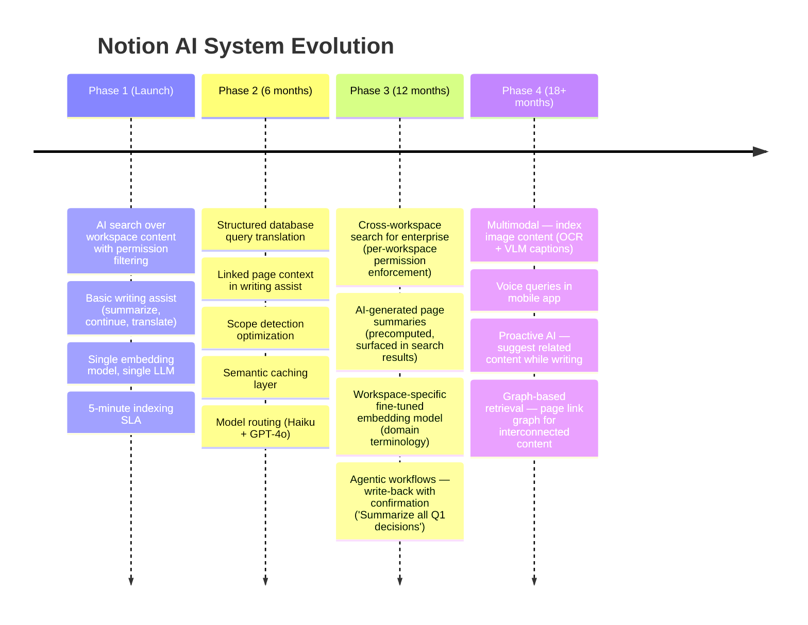

# Case Study: Design Notion AI (Permission-Aware AI Assistant for Collaborative Workspace)

## Intuition

> **Design intuition**: Notion AI is a permission-aware RAG system embedded in a collaborative document workspace -- the core challenge is not LLM generation quality but ensuring every AI response respects the requesting user's exact permission set across a deeply nested workspace hierarchy. A wrong answer is bad; an answer that leaks content from a page the user cannot access is a security incident.

**Key insight for this design**: The permission model IS the architecture. Every vector search, every chunk retrieval, every context window assembly must be filtered through the user's resolved permission set. This means pre-computing and caching permission bitmaps per user, attaching access control metadata to every indexed chunk, and enforcing filtering at the vector DB query level -- not as a post-retrieval check. Post-retrieval filtering creates information leakage through timing attacks, result count differences, and partial content exposure in error messages.

---

## 1. Requirements Clarification

### Functional Requirements
- AI search across all user-accessible workspace content (pages, databases, comments)
- AI writing assistant within the editor: generate text, summarize, translate, adjust tone
- Q&A over workspace knowledge: "What is our refund policy?" answered from internal docs
- Context-aware generation: understands page structure, surrounding blocks, linked pages
- Multi-modal content support: text blocks, tables, databases, embedded images (captions)
- Real-time index freshness: edits reflected in AI search within 2-5 minutes
- Permission-aware retrieval: only surface content the requesting user can access
- Cross-workspace isolation: Workspace A content never appears in Workspace B queries

### Non-Functional Requirements
- **Latency**: AI search < 3 seconds end-to-end; inline writing assist < 1.5 seconds for first token
- **Correctness**: zero tolerance for permission violations (security-critical)
- **Scale**: 30M+ monthly active users; 4M+ workspaces; billions of content blocks
- **Freshness**: new/edited content searchable within 5 minutes
- **Availability**: 99.95% uptime (workspace AI is a paid feature)
- **Throughput**: 50,000 AI queries per minute at peak

### Out of Scope
- The Notion editor itself (block-based editor already exists)
- User authentication and session management (existing Notion auth)
- Billing and subscription management
- Image generation (focus on text-based AI features)

---

## 2. Scale Estimation

### Content Scale
```
Workspaces: 4M active workspaces
Pages per workspace: average 2,000 (ranges from 50 to 500,000 for enterprises)
Total pages: ~8 billion pages (including sub-pages, database rows)
Average page content: 800 tokens (short notes) to 15,000 tokens (long docs)
Median page: ~1,500 tokens

Chunking estimates:
  Chunk size: 384 tokens (optimized for workspace content density)
  Overlap: 64 tokens
  Average chunks per page: 5
  Total chunks: 8B pages x 5 = 40 billion chunks

Embedding storage:
  Model: text-embedding-3-small (1,536 dimensions)
  Per chunk: 1,536 dims x 4 bytes = 6KB embedding + 512 bytes metadata
  Total: 40B x 6.5KB = 260TB embedding storage

Structured content (database rows):
  Total databases: 500M
  Average rows per database: 50
  Total database rows: 25B
  Each row: serialized as text chunk (property_name: value pairs)
```

### Query Scale
```
Daily AI queries: 15M (search + Q&A + writing assist combined)
  AI search: 6M queries/day
  Q&A: 4M queries/day
  Writing assist: 5M requests/day

Peak QPS: 15M / 86,400 x 3 (peak multiplier) = ~520 requests/second

Per AI search query:
  Permission resolution: 5-15ms (cached) or 50-200ms (cold)
  Embedding generation: 10ms
  Vector search (filtered): 30-80ms
  Reranking top-50 to top-8: 80ms
  LLM generation: 800-2,000ms
  Total: 1-2.5 seconds typical

Token costs per query:
  Context (retrieved chunks + page structure): 3,000 tokens average
  System prompt + instructions: 500 tokens
  User query: 50 tokens
  Output: 300 tokens (search/Q&A) or 500 tokens (writing assist)
  Total: ~3,850 tokens per query

Daily token volume:
  15M queries x 3,850 tokens = 57.75B tokens/day
```

### Storage Summary
```
Embedding store: 260TB (distributed across Qdrant cluster)
Permission cache: 30M users x 4KB average permission bitmap = 120GB (Redis)
Content cache (hot pages): 500GB (Redis cluster)
Metadata store: 2TB (PostgreSQL sharded by workspace_id)
Change event queue: 50M events/day x 2KB = 100GB/day throughput (Kafka)
```

---

## 3. High-Level Architecture

```
                            User (Editor / Search Bar / AI Panel)
                                         |
                                         v
                              [API Gateway + Auth]
                              Validate session, extract user_id,
                              workspace_id, subscription tier
                                         |
                    ┌────────────────────┼────────────────────┐
                    |                    |                    |
                    v                    v                    v
             [AI Search          [Q&A Service]        [Writing Assist
              Service]           "What is our          Service]
             Full workspace       refund policy?"     Inline generation,
             content search                           summarize, translate
                    |                    |                    |
                    └────────────────────┼────────────────────┘
                                         |
                                         v
                          ┌──────────────────────────────┐
                          |     Permission Resolver      |
                          |  Resolve user's full access  |
                          |  set: workspace -> teams ->  |
                          |  page tree -> shared pages   |
                          |  Output: permission bitmap   |
                          |  Cache: Redis, TTL 5 min     |
                          └──────────────────────────────┘
                                         |
                                         v
                          ┌──────────────────────────────┐
                          |     Query Understanding      |
                          |  - Query rewriting           |
                          |  - Workspace-specific terms  |
                          |  - Scope detection (page /   |
                          |    database / full workspace) |
                          └──────────────────────────────┘
                                         |
                          ┌──────────────┼──────────────┐
                          |              |              |
                          v              v              v
                   [Dense Search]  [Sparse Search]  [Structured
                    Qdrant          Elasticsearch    Query]
                    (semantic)      (keyword/BM25)   PostgreSQL
                    filtered by     filtered by      (database
                    permission      permission       properties)
                    bitmap          bitmap
                          |              |              |
                          └──────────────┼──────────────┘
                                         | Hybrid merge (RRF)
                                         v
                          ┌──────────────────────────────┐
                          |     Reranking Service        |
                          |  Cross-encoder: top-50 -> 8  |
                          |  + permission re-validation  |
                          └──────────────────────────────┘
                                         |
                                         v
                          ┌──────────────────────────────┐
                          |    Context Assembly          |
                          |  - Expand chunks to parent   |
                          |    page context              |
                          |  - Include page hierarchy    |
                          |    breadcrumb                |
                          |  - Add linked page snippets  |
                          |  - Format with citations     |
                          └──────────────────────────────┘
                                         |
                                         v
                          ┌──────────────────────────────┐
                          |    LLM Generation Service    |
                          |  GPT-4o / Claude 3.5 Sonnet  |
                          |  Streaming response          |
                          |  Grounded in retrieved context|
                          └──────────────────────────────┘
                                         |
                                         v
                          ┌──────────────────────────────┐
                          |    Response Post-Processing  |
                          |  - Citation formatting       |
                          |  - Source page links          |
                          |  - Safety filter             |
                          |  - Hallucination check       |
                          └──────────────────────────────┘
                                         |
                                         v
                                  User Response
                              (answer + page links)


==========================================================================
                       INDEXING PIPELINE (Async)
==========================================================================

Page Created/Edited/Deleted
         |
         v
  [Notion Core DB] --CDC--> [Kafka: content-changes topic]
         |                           |
         | (permission changes)      | (content changes)
         v                           v
  [Kafka: permission-changes]  [Content Indexing Workers]
         |                      - Parse block tree
         v                      - Hierarchical chunking
  [Permission Index             - Embed chunks (batch)
   Updater]                     - Upsert to Qdrant + ES
  - Recompute affected          - Update metadata in PG
    user permission sets              |
  - Invalidate Redis cache            v
  - Propagate to children       [Qdrant]  [Elasticsearch]  [PostgreSQL]
    (page tree inheritance)      Dense      Sparse           Metadata +
                                 vectors    BM25 index       permissions
```

---

## 4. Component Deep Dives

### 4.1 Permission Model and Resolution

```
Notion's permission hierarchy (simplified):

Workspace (top level)
  |
  +-- Team Space A (members: engineering team)
  |     |
  |     +-- Page: "Architecture Docs"  (inherits team space permissions)
  |     |     |
  |     |     +-- Sub-page: "API Design"  (inherits from parent)
  |     |     +-- Sub-page: "Secret Roadmap"  (restricted: 3 people only)
  |     |
  |     +-- Database: "Sprint Board"  (team-visible)
  |           |
  |           +-- Row: "TASK-123"  (inherits database permissions)
  |
  +-- Team Space B (members: marketing team)
  |     |
  |     +-- Page: "Brand Guidelines"  (team-visible)
  |
  +-- Private Section (each user has one)
  |     +-- Page: "My Notes"  (only the owner)
  |
  +-- Shared page: "Company Wiki"  (shared with entire workspace)
        |
        +-- Sub-page: "HR Policies"  (shared with workspace)
        +-- Sub-page: "Salary Bands"  (restricted: HR team + C-suite)

Permission types:
  - Full access: read + write + share
  - Can edit: read + write
  - Can view: read only
  - Can comment: read + comment
  - No access: cannot see page exists

Resolution algorithm:
  1. Start with workspace-level membership (what team spaces can user access?)
  2. For each team space: inherit permissions to all child pages
  3. Apply page-level overrides (restrictions narrow access, shares widen it)
  4. Walk the page tree: child inherits parent unless explicitly overridden
  5. Shared pages: if page shared directly with user, grant regardless of team space

Permission bitmap per user:
  For each user, pre-compute a set of accessible page_ids.
  Store as: Set<page_id> in Redis (average: 5,000 pages per user)
  Bloom filter optimization: 5,000 pages x 10 bits/element = 6.25KB per user
  Total: 30M users x 6.25KB = 187GB (fits in Redis cluster)

  Exact set stored in PostgreSQL for authoritative checks.
  Bloom filter in Redis for fast pre-filtering (no false negatives with
  secondary exact check for positives).

Permission resolution latency:
  Cache hit (Redis bloom filter): 2-5ms
  Cache miss (compute from PG): 50-200ms (depends on page tree depth)
  Cache TTL: 5 minutes (balance freshness vs. compute cost)
  Invalidation: event-driven (permission change event -> invalidate affected users)
```

### 4.2 Hierarchical Document Chunking

```
Notion pages are block trees, not flat text. Block types:

  - Text blocks (paragraph, heading 1/2/3, bullet, numbered list, toggle)
  - Database blocks (inline databases, linked databases)
  - Embed blocks (images with captions, bookmarks, file attachments)
  - Layout blocks (columns, dividers, callouts, quotes)
  - Sub-page blocks (link to child page)

Chunking strategy: structure-aware hierarchical chunking

Level 1: Page-level summary chunk
  Content: page title + breadcrumb path + first 200 tokens
  Purpose: high-level matching ("which page talks about deployment?")
  One chunk per page = 8B chunks at this level

Level 2: Section-level chunks
  Split at heading boundaries (H1, H2, H3)
  Each chunk: heading + all content blocks until next heading
  Target size: 384 tokens (workspace content is often terse, smaller chunks help)
  If section exceeds 768 tokens: split at paragraph boundaries within section
  Include: section heading + parent heading for context
  Example:
    Chunk: "## API Design > ### Authentication\n
            We use OAuth 2.0 with PKCE for all client applications.
            Tokens expire after 1 hour. Refresh tokens rotate on each use..."

Level 3: Database row chunks
  Each database row = one chunk
  Format: "Database: {db_title} | Row: {row_title}\n
           {property_name}: {value}\n
           {property_name}: {value}\n..."
  Example:
    Chunk: "Database: Sprint Board | Row: TASK-123\n
            Status: In Progress\n
            Assignee: Alice\n
            Priority: P1\n
            Description: Fix the N+1 query in user dashboard endpoint"

Metadata attached to every chunk:
  {
    "chunk_id": "chunk_abc123",
    "page_id": "page_xyz",
    "workspace_id": "ws_456",
    "page_title": "API Design",
    "breadcrumb": "Engineering > Architecture Docs > API Design",
    "block_type": "section",          // page_summary | section | database_row | comment
    "heading_hierarchy": ["API Design", "Authentication"],
    "parent_page_id": "page_parent",
    "last_modified": "2025-03-15T10:30:00Z",
    "author_id": "user_789",
    "content_hash": "sha256:...",     // for deduplication and update detection
    "permission_groups": ["ws_456", "team_engineering", "page_xyz"]
  }

The permission_groups field is critical: it lists all permission groups that
grant access to this chunk. At query time, the vector DB filters chunks where
the user's permission set intersects with the chunk's permission_groups.

Toggle and callout handling:
  - Toggle content: include in parent section chunk (do not create separate chunk)
  - Callout/quote: include as-is with visual marker removed
  - Synced blocks: index once, reference via pointer; update propagates to all instances

Comment chunking:
  - Threaded comments on a block: attach to the parent block's chunk
  - Page-level comments: separate chunk with page_id reference
  - Resolved comments: exclude from index (configurable per workspace)
```

### 4.3 Permission-Filtered Vector Search

```
The critical path: every search must be permission-filtered BEFORE results
reach the LLM context window. Not after. Not "check and drop." Before.

Two implementation strategies:

Strategy A: Pre-filter at query time (chosen)
  1. Resolve user's accessible page set: Set<page_id> (from Redis cache)
  2. Convert to Qdrant filter:
     qdrant.search(
       collection_name="workspace_{ws_id}",
       query_vector=embed(user_query),
       query_filter=Filter(
         must=[
           FieldCondition(
             key="page_id",
             match=MatchAny(any=user_accessible_page_ids)
           )
         ]
       ),
       limit=50
     )
  3. Qdrant's HNSW index with payload filtering ensures only accessible
     chunks are returned. No post-filtering needed.

  Problem: large permission sets (user with access to 50,000 pages) create
  large IN-clause filters that slow down vector search.

  Solution: hierarchical filtering
    - If user has access to entire team space -> filter by team_space_id (1 value)
    - If user has access to a page tree root -> filter by subtree_root_id
    - Only enumerate individual page_ids for pages outside team spaces
    - Typical filter size after optimization: 10-50 group IDs (not 50,000 page IDs)

Strategy B: Separate collections per workspace + row-level security (rejected)
  Pro: simpler filter, strong isolation
  Con: cannot handle per-page permissions within a workspace; overly coarse

Strategy C: Post-filter after retrieval (rejected -- security risk)
  Retrieve top-100 unfiltered -> remove inaccessible -> return top-50 remaining
  Problems:
    - Information leakage: "0 results" vs "50 results" reveals something exists
    - Performance: may need to retrieve 500+ to get 50 accessible chunks
    - Timing attack: slow response = many filtered results = interesting content exists

Defense in depth (three layers):
  Layer 1: Qdrant filter (primary enforcement)
  Layer 2: Application-level check before context assembly
           for chunk in retrieved_chunks:
             assert chunk.page_id in user_permission_set
  Layer 3: Audit logging -- log every chunk served to every user
           Alert on any chunk served without matching permission
```

### 4.4 Real-Time Indexing Pipeline

```
Requirement: edits reflected in AI search within 2-5 minutes.

Change Data Capture (CDC) from Notion's core database:

Notion Core DB (PostgreSQL / custom store)
    |
    | (WAL-based CDC via Debezium)
    v
Kafka topic: content-changes
    Partitioned by workspace_id (ensures ordering within workspace)
    Retention: 7 days
    Throughput: 50M change events/day (~580 events/second)

Event schema:
  {
    "event_type": "page_updated",    // page_created | page_updated |
                                     // page_deleted | block_updated |
                                     // permission_changed
    "workspace_id": "ws_456",
    "page_id": "page_xyz",
    "block_ids": ["block_1", "block_2"],  // which blocks changed
    "timestamp": "2025-03-15T10:30:00Z",
    "author_id": "user_789"
  }

Content indexing worker pipeline:
  1. Consume event from Kafka
  2. Fetch updated page content from Notion Core DB
  3. Re-chunk the affected sections (not the entire page if only one block changed)
     - Incremental chunking: identify which section the changed block belongs to
     - Re-chunk only that section (heading boundary to next heading boundary)
     - Reuse unchanged chunks (compare content_hash)
  4. Embed new/changed chunks (batch embedding API, latency ~200ms for 10 chunks)
  5. Upsert to Qdrant:
     - Delete old chunks for the affected section
     - Insert new chunks with updated embeddings + metadata
  6. Upsert to Elasticsearch (BM25 index)
  7. Update metadata in PostgreSQL

Processing latency per event:
  Fetch page: 10ms
  Identify changed sections: 5ms
  Re-chunk: 10ms
  Embed (batch of ~5 chunks): 200ms
  Qdrant upsert: 50ms
  ES upsert: 30ms
  PG update: 10ms
  Total: ~315ms per event

With 580 events/second and 315ms per event:
  Need: 580 x 0.315 = ~183 concurrent workers
  Deploy: 200 worker pods (each handles 3 events/second)
  Buffer: Kafka consumer lag < 60 seconds under normal load

Permission change propagation:
  When a page's permission changes:
    1. Identify all chunks belonging to that page and its sub-pages
    2. Update permission_groups field on all affected chunks in Qdrant
    3. Invalidate Redis permission cache for all affected users
    4. Timeline: must complete within 60 seconds (security-critical SLA)

  For team space permission changes:
    - Could affect thousands of pages and millions of chunks
    - Batch update: process in 1,000-chunk batches
    - During propagation: use stricter filtering (deny-by-default for affected chunks)
    - Full propagation: 5-15 minutes for large team spaces (acceptable with deny-default)
```

### 4.5 AI Writing Assistance

```
Writing assist runs inline in the editor, requiring different context
assembly than workspace search.

Input context for writing assist:
  1. Current page content (full page, up to 8,000 tokens)
  2. Surrounding blocks (500 tokens before and after cursor position)
  3. Page metadata: title, breadcrumb, parent page title
  4. Linked pages: if current page links to other pages, fetch first 500 tokens
     of each linked page (max 3 linked pages)
  5. User instruction: "summarize", "translate to Spanish", "make more formal",
     "continue writing", "fix grammar", "explain this"

Writing assist modes:

1. Continue writing (autocomplete)
   Context: current page + cursor position
   Prompt: "Continue writing the following document naturally.
            Match the existing tone, style, and topic."
   Latency target: < 1 second to first token (streaming)
   Model: Claude 3.5 Haiku (fast, cost-effective for generation)

2. Summarize selection
   Context: selected text + page title + heading hierarchy
   Prompt: "Summarize the following text concisely. Preserve key facts
            and action items."
   Output: 1-3 sentences
   Model: Claude 3.5 Haiku

3. Translate
   Context: selected text + target language
   Prompt: "Translate the following to {language}. Preserve formatting,
            technical terms, and proper nouns."
   Model: GPT-4o (best multilingual quality)

4. Tone adjustment
   Context: selected text + target tone (professional/casual/friendly/direct)
   Prompt: "Rewrite the following in a {tone} tone. Preserve the meaning
            and key information."
   Model: Claude 3.5 Haiku

5. Page Q&A ("Ask AI about this page")
   Context: full page content + linked pages
   This is a mini-RAG over a single page (no workspace search needed)
   Model: GPT-4o (reasoning quality matters)

Context assembly for writing assist:
  Unlike workspace search, writing assist does NOT need permission checks
  for the current page (user is already viewing it). But linked page content
  must be permission-checked before inclusion.

  for linked_page in current_page.outgoing_links:
    if linked_page.id in user_permission_set:
      context.append(fetch_summary(linked_page))
    else:
      skip  # user cannot access this linked page; do not include
```

#### Block-Level SSE Streaming Handler

Writing assist streams generated text into the block editor via SSE. The handler uses `id:` sequence numbers for reconnect support and cancels in-flight GPU work on client disconnect. Concrete numbers: average block generation = 150 tokens at 40 tok/s = 3.75s; p95 = 500 tokens = 12.5s. Disconnect is checked every 5 tokens (~125ms) to free the A100 (~$2/hr) promptly.

```python
from __future__ import annotations
import asyncio
from typing import AsyncIterator
from fastapi import Request
from fastapi.responses import StreamingResponse


async def block_stream_handler(
    request: Request,
    instruction: str,
    context_tokens: str,
    llm_client: "LLMClient",
) -> StreamingResponse:
    async def event_generator() -> AsyncIterator[str]:
        seq = 0
        check_counter = 0
        task = asyncio.create_task(
            llm_client.stream_completion(context_tokens, instruction, max_tokens=1024)
        )
        try:
            async for token in await task:
                seq += 1
                check_counter += 1
                if check_counter >= 5:          # check every 5 tokens
                    check_counter = 0
                    if await request.is_disconnected():
                        task.cancel()           # free GPU immediately
                        return
                yield f"id: {seq}\ndata: {token}\n\n"
            yield f"id: {seq + 1}\ndata: [DONE]\n\n"
        except asyncio.CancelledError:
            return
        finally:
            if not task.done():
                task.cancel()

    return StreamingResponse(
        event_generator(),
        media_type="text/event-stream",
        headers={"Cache-Control": "no-cache", "X-Accel-Buffering": "no"},
    )
```

Disconnect without cancellation risks tokens appended to the wrong block on reconnect — a silent data-corruption bug. See [Streaming at Scale](./cross_cutting/streaming_at_scale.md) for the full SSE infrastructure (backpressure, reconnect recovery, multi-region proxying).

### 4.6 Multi-Tenant Data Isolation

```
Isolation model: physical separation at the collection level

Qdrant deployment:
  Each workspace gets its own Qdrant collection: "ws_{workspace_id}"
  Why not one giant collection with workspace_id filter?
    - 4M workspaces x 40B chunks = operational nightmare in single collection
    - HNSW index rebuild time for a single 40B-vector collection: hours
    - Tenant deletion (GDPR "right to erasure"): drop collection vs. delete-by-filter

Collection sizing tiers:
  Small workspace (< 1,000 pages): shared Qdrant cluster, individual collections
    Collections per node: up to 500 small workspaces
  Medium workspace (1,000-50,000 pages): dedicated Qdrant shard
  Enterprise workspace (50,000+ pages): dedicated Qdrant node(s)

Elasticsearch:
  Index-per-workspace for enterprise tier
  Shared index with workspace_id routing for small/medium workspaces
  Routing key ensures all docs for a workspace land on the same shard

PostgreSQL (metadata):
  Sharded by workspace_id using Citus
  Each workspace's metadata on a single shard (co-located queries)

Embedding model:
  Shared across all workspaces (stateless, no tenant data in model)
  text-embedding-3-small hosted on shared GPU cluster
  Input: chunk text only (no workspace-identifying information in embedding input)

Cross-workspace isolation guarantees:
  1. No shared vector index between workspaces
  2. No shared Elasticsearch index for enterprise tier
  3. Application-layer workspace_id validation on every request
  4. Network-level isolation: enterprise workspaces on dedicated VPC endpoints
  5. Encryption at rest: per-workspace encryption keys (AWS KMS)
  6. Audit trail: all AI queries logged with workspace_id, user_id, chunks_accessed
```

### 4.7 Per-Workspace ACL Pushdown: WorkspaceRetriever

Enforce the permission model at the vector DB routing layer, not as a post-retrieval metadata filter. `WorkspaceRetriever` routes every query to the correct per-workspace Qdrant collection — making cross-workspace contamination architecturally impossible.

Storage math: 1M workspaces x 50MB avg collection = 50TB vector storage. Qdrant collections are lightweight (~4KB overhead) — 1M collections feasible on a sharded cluster.

BROKEN pattern (single shared collection with metadata filter):
```python
# BROKEN: a prompt-injection attack that influences query-rewriting bypasses the filter.
qdrant_client.search(collection_name="all_workspaces", ...)  # wrong
# BUG 1: filter bypass -> any workspace content returned.
# BUG 2: HNSW scan over 40B vectors across all tenants on every query.
```

FIX — `WorkspaceRetriever` with per-workspace collection routing:

```python
from __future__ import annotations
from dataclasses import dataclass
from typing import NamedTuple
import logging

from qdrant_client import QdrantClient
from qdrant_client.http.models import Filter, FieldCondition, MatchAny


@dataclass(frozen=True)
class UserPermissions:
    user_id: str
    workspace_id: str
    allowed_page_ids: frozenset[str]      # O(1) membership checks
    allowed_group_ids: frozenset[str]     # 10-50 groups replaces 50K page IDs in filter


class Block(NamedTuple):
    chunk_id: str
    page_id: str
    workspace_id: str
    content: str
    score: float


class WorkspaceRetriever:
    def __init__(self, qdrant: QdrantClient, embed_fn) -> None:
        self._qdrant = qdrant
        self._embed = embed_fn

    def _get_collection(self, workspace_id: str) -> str:
        return f"ws_{workspace_id}"  # wrong collection simply does not exist

    def _apply_permission_filter(
        self, results: list, user_permissions: UserPermissions
    ) -> list[Block]:
        # Secondary ACL check (defense-in-depth). Primary: Qdrant group-ID filter.
        # Catches stale permission bitmaps and over-broad group-ID expansions.
        # See [Tenant Isolation Patterns](./cross_cutting/tenant_isolation_patterns.md).
        allowed: list[Block] = []
        for hit in results:
            payload = hit.payload
            chunk_ws = payload["workspace_id"]
            if chunk_ws != user_permissions.workspace_id:
                # Should never happen — collection routing guarantees isolation.
                logging.critical(
                    "CROSS_WORKSPACE_LEAK: chunk %s from ws %s in query for ws %s",
                    payload["chunk_id"], chunk_ws, user_permissions.workspace_id,
                )
                continue

            permission_groups: set[str] = set(payload.get("permission_groups", []))
            user_grants = user_permissions.allowed_page_ids | user_permissions.allowed_group_ids
            if permission_groups.isdisjoint(user_grants):
                continue  # stale permission bitmap — drop silently

            allowed.append(Block(
                chunk_id=payload["chunk_id"],
                page_id=payload["page_id"],
                workspace_id=chunk_ws,
                content=payload["content"],
                score=hit.score,
            ))
        return allowed

    def retrieve(
        self,
        query: str,
        workspace_id: str,
        user_permissions: UserPermissions,
        top_k: int = 50,
    ) -> list[Block]:
        """Route query to the workspace-dedicated collection and apply ACL."""
        collection = self._get_collection(workspace_id)
        results = self._qdrant.search(
            collection_name=collection,
            query_vector=self._embed(query),
            query_filter=Filter(must=[
                FieldCondition(
                    key="permission_groups",
                    match=MatchAny(any=list(user_permissions.allowed_group_ids)),
                )
            ]),
            limit=top_k,
        )
        return self._apply_permission_filter(results, user_permissions)
```

See [Tenant Isolation Patterns](./cross_cutting/tenant_isolation_patterns.md) for Qdrant shard topology, ES index routing, and PG Citus co-location by workspace_id.

### 4.8 Structured Content: Database Queries

```
Notion databases are structured data: tables with typed properties
(text, number, date, select, multi-select, relation, formula, rollup).

Challenge: user queries may target structured properties:
  "Show me all P0 bugs assigned to Alice"
  "What tasks are due this week?"
  "Which deals closed in Q1 with revenue > $100K?"

Two retrieval paths for database content:

Path A: Semantic search over serialized rows (default)
  Database rows are serialized as text chunks and embedded.
  Works for: fuzzy matching, conceptual queries
  Example query: "recent high-priority issues" -> matches rows where
    Priority=P0 or P1 and Status=Open

Path B: Structured query translation (for precise filters)
  1. Detect structured intent: classifier identifies database-targetable queries
  2. Identify target database: embed query, match against database title/schema embeddings
  3. Translate to structured filter:
     User: "P0 bugs assigned to Alice due this week"
     Translated:
       database = "Bug Tracker"
       filter = {
         AND: [
           {property: "Priority", equals: "P0"},
           {property: "Assignee", contains: "Alice"},
           {property: "Due Date", this_week: true}
         ]
       }
  4. Execute against Notion's database query API (already has permission checks)
  5. Format results as context for LLM

Schema-aware query understanding:
  When user starts an AI query, the system fetches the schemas of databases
  the user has access to:
    {
      "Bug Tracker": {
        properties: {
          "Priority": {type: "select", options: ["P0", "P1", "P2", "P3"]},
          "Assignee": {type: "person"},
          "Due Date": {type: "date"},
          "Status": {type: "select", options: ["Open", "In Progress", "Done"]}
        }
      }
    }

  This schema is included in the LLM prompt so the model can generate
  valid structured filters. Schema context costs ~200 tokens per database
  (include top-5 most relevant databases by embedding match).

Hybrid approach: run both Path A and Path B in parallel, merge results.
  Path A catches: fuzzy matches, related content, descriptions
  Path B catches: exact property matches, numerical filters, date ranges
```

---

## 5. Query Understanding and Scope Detection

```
Not all AI queries need full workspace search. Scope detection saves
latency and cost by limiting the search space.

Scope levels:
  1. Current page: "Summarize this page" / "What are the action items here?"
     -> No workspace search. Use page content only. Latency: < 1s.

  2. Current database: "How many open bugs are there?"
     -> Search within the database the user is viewing. Latency: < 1.5s.

  3. Team space: "What did the engineering team decide about the API?"
     -> Search within the user's current team space. Latency: < 2s.

  4. Full workspace: "What is our company's vacation policy?"
     -> Search across all accessible content. Latency: < 3s.

Scope detection approach:
  Rule-based first:
    - "this page" / "this doc" / "above" / "below" -> scope = current_page
    - "this database" / "this table" -> scope = current_database
    - "our team" / "engineering" / "marketing" -> scope = team_space

  LLM fallback for ambiguous queries:
    Prompt: "Given the user is on page '{page_title}' in team space
            '{team_space}', classify the scope of this query:
            '{user_query}'. Options: current_page, current_database,
            team_space, full_workspace."

  Default: full_workspace (safest, highest recall, highest latency)

Query rewriting for workspace context:
  User query: "What did we decide?"
  Context: user is on page "Q2 Planning" in team space "Product"
  Rewritten: "What decisions were made in Q2 Planning for the Product team?"

  This rewriting dramatically improves retrieval quality for vague queries.
```

---

## 6. Trade-offs and Design Decisions

| Decision | Chosen | Alternative | Reason |
|----------|--------|-------------|--------|
| Permission enforcement | Pre-filter at vector DB query | Post-filter after retrieval | Security: post-filter leaks information through timing and result counts |
| Tenant isolation | Collection-per-workspace in Qdrant | Single collection with workspace_id filter | Operational isolation; GDPR deletion; index performance |
| Chunk size | 384 tokens | 512 tokens | Workspace content is terse; smaller chunks improve precision for short notes |
| Embedding model | text-embedding-3-small (1,536 dim) | text-embedding-3-large (3,072 dim) | Half the storage (260TB vs 520TB); quality difference < 2% on workspace content |
| Permission caching | Redis bloom filter + exact PG check | Recompute on every query | 2-5ms vs 50-200ms; acceptable staleness with 5-min TTL + event-driven invalidation |
| Database queries | Hybrid: semantic + structured filter | Semantic only | Precise property filters ("P0 bugs") fail on semantic search alone |
| Indexing latency | 2-5 minute SLA via Kafka CDC | Synchronous indexing on write | Async avoids write-path latency; 5 min is acceptable for AI search freshness |
| Writing assist model | Claude 3.5 Haiku (fast tasks) + GPT-4o (translation, reasoning) | Single model for all | Cost optimization: Haiku is 10x cheaper, adequate for summarize/continue/tone |
| Linked page context | Include in writing assist with permission check | Exclude linked pages | Significantly improves context-aware generation; permission check prevents leakage |
| Change propagation for permissions | Deny-by-default during propagation | Allow-by-default during propagation | Security: briefly denying access to a chunk is better than briefly leaking it |

---

## 7. Cost Analysis

```
15M AI queries/day, 40B chunks indexed:

Embedding costs (query-time):
  15M queries x $0.02/1M tokens x 50 tokens = $15/day (negligible)

Embedding costs (indexing):
  50M change events/day x 5 chunks x 384 tokens x $0.02/1M = $1,920/day

Reranking (self-hosted bge-reranker-large on GPU):
  15M queries x 50 passages = 750M cross-encoder inferences/day
  8 x A100 GPUs (each handles ~100M inferences/day) = ~$800/day

LLM generation costs:
  AI search + Q&A (10M queries, GPT-4o):
    Input: 10M x 3,500 tokens x $2.50/1M = $87,500/day
    Output: 10M x 300 tokens x $10/1M = $30,000/day
    Subtotal: $117,500/day

  Writing assist (5M requests):
    4M via Claude 3.5 Haiku ($0.25/1M input, $1.25/1M output):
      Input: 4M x 3,000 tokens x $0.25/1M = $3,000/day
      Output: 4M x 500 tokens x $1.25/1M = $2,500/day
    1M via GPT-4o (translation, complex tasks):
      Input: 1M x 3,000 tokens x $2.50/1M = $7,500/day
      Output: 1M x 500 tokens x $10/1M = $5,000/day
    Subtotal: $18,000/day

  Total LLM: $135,500/day

Infrastructure:
  Qdrant cluster (260TB): 40 nodes x $200/day = $8,000/day
  Elasticsearch cluster: 20 nodes x $150/day = $3,000/day
  Redis cluster (permission cache + hot content): $1,500/day
  Kafka + indexing workers: $2,000/day
  PostgreSQL (Citus, metadata): $1,000/day
  Application servers: $2,000/day
  Total infra: $17,500/day

TOTAL: ~$155,000/day = ~$4.65M/month

Revenue estimation:
  Notion AI add-on: $10/user/month
  30M MAU, assume 15% AI subscribers: 4.5M paying users
  Revenue: 4.5M x $10 = $45M/month
  Margin: ($45M - $4.65M) / $45M = ~90% gross margin

Cost optimization levers:
  - Semantic cache (20% hit rate) -> save $27,100/day
  - Route 40% of AI search to Claude Haiku -> save $40,000/day
  - Quantize Qdrant float32 -> int8 (4x reduction) -> 40 nodes -> 12, save $5,600/day
  - Local embedding model (e5-small-v2 on GPU) -> eliminate embedding API costs
  Optimized total: ~$80,000/day = ~$2.4M/month
```

---

## 8. Production Failure Modes

```
1. Permission leakage (severity: critical)
   Symptom: AI response contains content the user cannot access.
   Cause: stale permission cache; race between permission revocation and cache invalidation.
   Detection: async audit of every response — check each chunk's page_id against the user's
              permission set after delivery. Alert on any mismatch.
   Fix: deny-by-default during propagation; immediately invalidate cache on permission-change
        event; exclude affected chunks until propagation completes.
   Prevention: integration test that simulates permission changes and verifies AI search
               results within 60 seconds.

2. Stale content in search results
   Symptom: user edits a page, but AI search still returns old content.
   Cause: Kafka consumer lag; indexing worker backlog; Qdrant upsert delay.
   Detection: monitor Kafka consumer lag (alert if > 5 minutes).
              Monitor indexing worker error rate.
   Fix: increase worker count; implement priority queue for recently-active
        workspaces; add "last_indexed" timestamp to search results so users
        can see freshness.

3. Empty results for valid queries
   Symptom: user asks about content they know exists, gets "no results found."
   Cause: chunking split a key concept across chunk boundary;
          embedding model fails on workspace-specific jargon/acronyms.
   Fix: add chunk overlap (64 tokens); maintain workspace-specific synonym
        dictionary; implement query expansion with workspace terminology.

4. Cross-workspace data leak (severity: critical)
   Symptom: content from Workspace A appears in Workspace B query.
   Cause: bug in collection routing; wrong workspace_id ingested with chunk.
   Prevention: collection-per-workspace (workspace_id embedded in collection name, not
               just metadata filter); hardcode collection name from authenticated session.
   Detection: canary workspaces with known content; automated cross-workspace retrieval tests.

5. Indexing pipeline data loss
   Symptom: recently created pages never become searchable.
   Cause: Kafka consumer crash before offset commit; embedding API timeout not retried.
   Fix: at-least-once delivery with idempotent upserts (content_hash dedup); dead-letter
        queue for failed events; daily reconciliation job checks Core DB page list vs
        Qdrant chunk count per workspace.

6. LLM hallucination beyond retrieved context
   Symptom: AI answer references a fact not in any workspace page.
   Cause: model uses parametric knowledge instead of retrieved context.
   Detection: faithfulness check — compare response claims against retrieved chunks via NLI.
   Fix: grounding prompt: "Answer ONLY from provided workspace content. If not found, say:
        I could not find this information in your workspace."
```

---

## 9. Evaluation and Quality Metrics

```
Retrieval quality (measured weekly on golden dataset per workspace tier):
  Recall@10: > 0.85 (of the relevant chunks, how many are in top 10?)
  Precision@5: > 0.70 (of the top 5 chunks, how many are relevant?)
  MRR (Mean Reciprocal Rank): > 0.75

Generation quality:
  Faithfulness: > 0.92 (all claims supported by retrieved chunks)
  Answer relevancy: > 0.88 (answer addresses the question)
  Permission compliance: 1.00 (zero tolerance for violations)

User-facing metrics:
  AI feature adoption: % of workspace members using AI features weekly
  Query success rate: % of queries where user does not immediately re-query
  Thumbs up/down ratio on AI responses: target > 4:1
  Writing assist acceptance rate: % of generated text kept by user > 60%

Latency percentiles:
  AI search p50: < 1.5s
  AI search p95: < 3.0s
  AI search p99: < 5.0s
  Writing assist p50: < 800ms to first token
  Writing assist p95: < 1.5s to first token
```

See Operational Playbook below for the eval pipeline, OTel trace hierarchy, and incident runbooks.

---

## Operational Playbook

### Eval Pipeline

Weekly workspace-grounded Q&A eval: 50 golden questions per workspace type (personal / team / enterprise), replayed through the production pipeline under known permission sets.

Quality gates: Faithfulness > 0.92; Answer relevancy > 0.88; Citation accuracy > 0.99 (stricter than typical RAG's 0.90 — a wrong citation implies the answer may reference content the user cannot access); Permission compliance = 1.00 (any non-permitted chunk in the context window fails the gate and triggers a P1 investigation). A metric drop below threshold blocks the deployment.

See [LLM Eval Harness in Production](./cross_cutting/llm_eval_harness_in_production.md) for golden-set management, LLM-as-judge scoring, and CI/CD integration.

### Observability

Every AI query emits an OTel trace. All user-identifying fields are hashed before export.

```
root span: notion_ai_query
  workspace_id_hash, request_type, user_tier, scope

  child: permission_check
    cache_hit, num_allowed_groups, check_duration_ms (2-5ms hit / 50-200ms cold)

  child: vector_retrieval
    collection_name (hashed), top_k_requested=50, top_k_returned,
    similarity_scores_p50, retrieval_duration_ms

  child: reranking
    input_passages, output_passages=8, reranker_model, reranking_duration_ms

  child: llm_generation
    model, input_tokens, output_tokens, streaming_ttft_ms, client_disconnected
```

Alert rules: `permission_check.check_duration_ms p95 > 25ms` (cache degradation); `top_k_returned < top_k_requested * 0.5` (permission bitmap staleness spike — ACL post-check dropping >50% of results).

Cross-reference: See [OpenTelemetry for LLM Apps](./cross_cutting/opentelemetry_for_llm_apps.md) for the full observability design covering span naming conventions, sampling strategy, cost attribution by workspace_id, and Langfuse/Arize Phoenix integration.

### Incident Runbooks

| # | Name | Severity | Symptom | Diagnosis | Mitigation |
|---|------|----------|---------|-----------|-----------|
| 1 | Cross-workspace retrieval | P0 | Audit log: chunk from workspace A in workspace B's context; `_alert_cross_workspace_leak` fires | (a) Confirm chunk `workspace_id` != session `workspace_id`. (b) Determine if leak bypassed Qdrant filter or ACL post-check. (c) Find indexing worker that wrote chunk to wrong collection. | Terminate affected sessions; place AI features in maintenance mode; delete misrouted chunk. Add ingestion-time assertion `chunk.workspace_id == collection_workspace_id`. Post-mortem mandatory regardless of whether data was read. |
| 2 | Indexing lag (freshness > 5 min) | P2 | `kafka_consumer_lag_seconds > 300`; users report stale search results | (a) Worker pod health (`kubectl get pods -n indexing`): OOMKilled / CrashLoopBackOff? (b) Embedding API error rate > 5% (throttling)? (c) `qdrant_ingest_queue_depth > 100K` (upsert bottleneck)? | Worker crash: scale replicas 200 -> 400. Embedding throttle: failover to local e5-small-v2 GPU cluster. Qdrant bottleneck: increase write threads, reduce replication factor 2 -> 1 for catch-up. Run reconciliation job after lag clears. |
| 3 | Writing assist TTFT > 2s | P2 | `streaming_ttft_ms p95 > 2000ms`; user acceptance rate drops | (a) Provider TTFT elevated (>1.5s)? Upstream issue, no Notion action. (b) `retrieval_duration_ms p95 > 200ms`? Hot Qdrant shard. (c) Inference cluster GPU util > 90%? Self-hosted cluster saturated. | Provider issue: activate LLM gateway failover (Anthropic <-> OpenAI). Hot shard: migrate top-10 largest collections to dedicated nodes. GPU saturated: add 4 x A100 nodes (~15 min); route writing assist to provider API in the interim. |

---

## 10. Interview Discussion Points

**Permission-aware RAG is fundamentally different from standard RAG.** In standard RAG, any retrieved chunk is fair game for the LLM. In permission-aware RAG, the retrieval layer becomes a security boundary. This means pre-filtering at the vector DB level (not post-filtering), permission bitmap caching, and deny-by-default during permission propagation. The architectural consequence is that permission resolution is on the critical path of every single query -- it must be fast (< 15ms) and correct (zero false positives for access grants).

**The deny-by-default vs. allow-by-default trade-off during permission propagation is a defining design decision.** When a team space's permissions change, it can take minutes to update millions of chunks. During this window, do you allow access (risk: user sees content they should not) or deny access (risk: user temporarily cannot find content they should access)? For a security-conscious product, deny-by-default is the only defensible choice. Briefly missing search results is an inconvenience; briefly leaking confidential content is a breach.

**Hierarchical chunking for block-based documents is not the same as chunking PDFs.** Notion pages have explicit structure: headings define sections, databases define rows, toggles nest content. Ignoring this structure and doing fixed-size chunking loses the semantic boundaries that make retrieval precise. The chunking strategy must be structure-aware, splitting at heading boundaries and serializing database rows as individual chunks with their property schemas.

**Real-time indexing with permission consistency is the hardest engineering problem in this system.** Content and permission changes flow through separate Kafka topics but must be consistent: if a page moves to a restricted team space, the permission change must propagate before (or simultaneously with) the new content location becoming searchable. Workspace-level partitioning ensures within-workspace ordering, but cross-topic ordering (content-changes vs. permission-changes) requires version vectors or a two-phase commit on the indexing side.

**Structured database queries cannot be solved with embeddings alone.** When a user asks "show me P0 bugs assigned to Alice due this week," semantic search over serialized rows may return P1 bugs or bugs assigned to Bob that mention Alice in comments. The system needs a structured query path that translates natural language into typed property filters against the database schema. The hybrid approach (semantic + structured, merged) handles both fuzzy conceptual queries and precise filtered queries.

**Collection-per-workspace in the vector DB is a multi-tenancy decision with major operational implications.** A single collection for all workspaces would simplify operations but make tenant deletion (GDPR Article 17) extremely expensive (scan and delete vs. drop collection). It would also mean a single HNSW index for 40 billion vectors, which is impractical. Collection-per-workspace enables independent scaling, fast deletion, and workspace-level performance isolation -- at the cost of managing millions of small collections.

**Scope detection is the most impactful latency optimization.** Detecting a current-page query ("summarize this") skips workspace-wide vector search and serves a response in under 1 second. Permissive errors waste compute; restrictive errors return incomplete answers. A rule-based first pass with LLM fallback balances speed and recall.

**The cost structure is dominated by LLM generation, not embeddings or vector search.** At $135K/day for LLM generation vs. $17.5K/day for all infrastructure, the obvious optimization target is the LLM. Model routing (Haiku for simple tasks, GPT-4o for complex reasoning), semantic caching for repeated queries, and scope detection (current-page queries skip RAG entirely) can reduce LLM costs by 50-60%. The $10/user/month pricing works at scale because the per-query marginal cost is low (under $0.01/query after optimization) and most users make fewer than 50 AI queries per month.

---

## 11. System Evolution and Future Considerations



Each phase builds on the previous one's security foundation: the permission model shipped in Phase 1 is the enforcement layer every later feature (cross-workspace search, agentic write-back, multimodal indexing) must route through.
